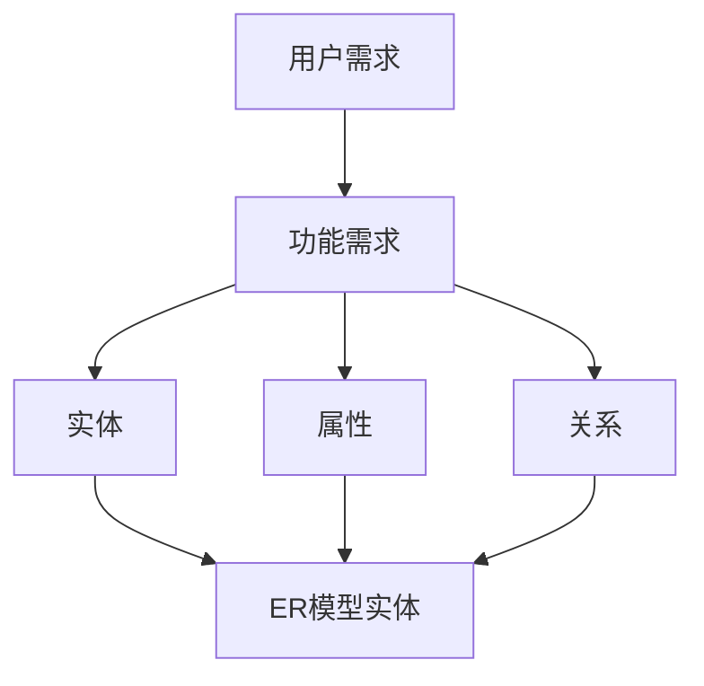

                 

### 上承需求

#### 关键词
- 需求分析
- 系统需求
- 用户需求
- 逻辑思维
- 项目管理
- 技术实践

#### 摘要
本文旨在深入探讨需求分析的核心概念和方法，通过逻辑清晰的步骤，引导读者理解需求分析的背景、重要性、流程以及其在IT项目中的应用。我们将结合实际案例，详细阐述需求分析的具体实施技巧，并展望其未来发展趋势。通过本文，读者将全面掌握需求分析的方法和策略，提升项目管理能力。

### 目录大纲设计思路

为了设计出《上承需求》这本书的完整目录大纲，我们将遵循以下步骤：

1. **明确书籍主题**：首先，我们需要了解书籍的主题，这有助于确定目录的大体结构和章节的内容。

2. **规划章节结构**：根据书籍的主题，我们将规划出书籍的总章节数，并确定每章的主要内容和结构。

3. **细化章节内容**：在规划好章节结构后，我们将对每个章节进行细化，包括列出每个小节的主要内容和顺序。

4. **确保内容完整性**：我们需要确保目录大纲中涵盖了核心概念、原理讲解、案例分析、实践技巧等关键部分。

5. **保持简洁性**：在确保内容完整性的同时，我们要避免冗余，确保每一部分都简洁明了。

6. **符合markdown格式要求**：根据用户的要求，我们使用markdown格式来书写目录大纲，确保格式规范。

### 目录大纲具体设计

#### 第一部分：背景介绍

##### 第1章：需求分析的基础
- **1.1 需求分析的背景**
  - 问题背景介绍
  - 问题描述
  - 问题解决途径
  - 边界与外延
  - 概念结构与核心要素组成
- **1.2 需求分析的方法**
  - 常见需求分析方法
  - 方法比较与选择
  - 方法适用场景分析
- **1.3 需求分析的重要性**
  - 需求分析在项目中的地位
  - 需求分析对企业的影响
  - 需求分析面临的挑战
- **1.4 需求分析的流程**
  - 需求收集
  - 需求分析
  - 需求验证
  - 需求管理
- **1.5 本章小结**

##### 第2章：需求分析的核心概念
- **2.1 需求的定义**
  - 需求的概念
  - 需求的类型
  - 需求的特性
- **2.2 用户需求与系统需求**
  - 用户需求分析
  - 系统需求分析
  - 用户需求与系统需求的联系与区别
- **2.3 需求属性特征对比**
  - 功能需求
  - 性能需求
  - 可用性需求
  - 安全性需求
- **2.4 需求与ER模型的关系**
  - 实体关系图（ER图）介绍
  - 需求与ER模型的关系
- **2.5 本章小结**

##### 第3章：需求分析流程与技巧
- **3.1 需求收集技巧**
  - 用户访谈
  - 观察法
  - 问卷调查
  - 用户故事地图
- **3.2 需求分析工具**
  - 文档分析
  - 逻辑树分析
  - SWOT分析
  - 用例图
- **3.3 需求管理**
  - 需求变更管理
  - 需求优先级排序
  - 需求跟踪
- **3.4 需求验证方法**
  - 回归测试
  - 验收测试
  - 用户验收测试
- **3.5 需求分析与项目管理**
  - 需求分析与项目管理的关系
  - 需求分析在敏捷开发中的应用
- **3.6 本章小结**

#### 第二部分：核心概念与联系

##### 第4章：需求分析的实战案例
- **4.1 案例背景介绍**
  - 案例背景
  - 案例目标
- **4.2 需求收集与整理**
  - 用户需求收集
  - 系统需求整理
- **4.3 需求分析**
  - 功能需求分析
  - 性能需求分析
  - 可用性需求分析
  - 安全性需求分析
- **4.4 需求验证**
  - 验收测试计划
  - 验收测试执行
- **4.5 案例小结**
  - 案例收获
  - 案例启示

#### 第三部分：最佳实践与技巧

##### 第5章：需求分析最佳实践
- **5.1 需求分析的最佳实践**
  - 需求文档编写规范
  - 需求评审流程
  - 需求管理工具选择
- **5.2 需求分析技巧**
  - 如何更有效地进行需求收集
  - 如何提高需求分析的准确性
  - 如何处理需求变更
- **5.3 需求分析注意事项**
  - 需求分析中的常见问题
  - 如何避免需求分析错误
  - 需求分析中的沟通技巧
- **5.4 本章小结**

##### 第6章：需求分析拓展与前沿
- **6.1 需求分析的新趋势**
  - 需求分析的自动化
  - 需求分析在AI中的应用
  - 需求分析与大数据分析的结合
- **6.2 需求分析的前沿技术**
  - 需求感知系统
  - 用户体验分析
  - 需求工程方法
- **6.3 拓展阅读**
  - 相关书籍推荐
  - 学术论文精选
- **6.4 本章小结**

### 结论

《上承需求》这本书的目录大纲设计旨在为读者提供一个系统而全面的需求分析指南，从基础理论到实战案例，再到最佳实践，全面覆盖了需求分析的核心内容。通过本书的学习，读者可以深入理解需求分析的概念、方法与实践，提升在实际项目中进行需求分析的能力。我们期待读者能够从中获得启发，将所学知识应用于实际工作中，从而提升项目的成功率和效率。

---

**注意：** 以上目录大纲为示例设计，实际书籍内容可能需要根据具体需求进行调整和补充。在编写实际书籍时，每章的内容都需要进一步细化，确保每个章节都有具体的案例分析和实践技巧。此外，为了确保内容的准确性和可读性，每章内容都需要经过严格的审核和修正。希望这个目录大纲能够为您的书籍编写提供有益的参考。

---

### 第一部分：背景介绍

#### 第1章：需求分析的基础

需求分析是软件开发过程中至关重要的一环，它是项目成功与否的基石。本章将详细介绍需求分析的基础概念、背景、重要性和流程，为读者提供一个全面的理解。

#### 1.1 需求分析的背景

**问题背景介绍**

在软件工程领域，需求分析是指通过一系列方法，收集、分析和验证用户的需求，并将这些需求转化为明确的系统需求。需求分析的重要性在于，它能够确保软件开发团队理解用户的实际需求，避免开发过程中出现偏差，提高项目成功率。

**问题描述**

在软件开发项目中，需求分析的主要问题是确保用户需求得到准确理解，并将其转化为系统需求。这涉及到多个方面的挑战，包括用户需求的多样性和变化性，以及软件开发过程中的不确定性。

**问题解决途径**

为了解决这些问题，需求分析提供了多种方法，如用户访谈、观察法、问卷调查和用户故事地图等。这些方法有助于收集用户的需求，并确保需求分析的全面性和准确性。

**边界与外延**

需求分析的边界包括项目的范围、需求和解决方案的明确性。其外延则涉及到项目管理、软件设计、测试和质量保证等环节。

**概念结构与核心要素组成**

需求分析的概念结构包括需求收集、需求分析、需求验证和需求管理四个核心要素。这些要素相互关联，共同构成了一个完整的需求分析过程。

#### 1.2 需求分析的方法

**常见需求分析方法**

需求分析方法主要包括以下几种：

- **用户访谈**：通过与用户直接交流，了解用户的需求和期望。
- **观察法**：在用户实际操作软件时，观察用户的行为和反馈，获取需求信息。
- **问卷调查**：通过设计问卷，收集用户的需求和反馈。
- **用户故事地图**：将用户需求以故事的形式进行可视化，便于理解和分析。

**方法比较与选择**

不同的需求分析方法有其各自的优缺点和适用场景。用户访谈适合深入了解用户需求，观察法适用于发现用户在实际操作中的问题，问卷调查适用于大规模收集用户反馈，用户故事地图则有助于梳理用户需求的全貌。

**方法适用场景分析**

根据项目的具体情况，选择合适的需求分析方法。例如，在项目初期，可以采用用户访谈和观察法，以全面了解用户需求；在项目中期，可以通过问卷调查收集用户反馈；在项目后期，用户故事地图可以帮助梳理需求变更。

#### 1.3 需求分析的重要性

**需求分析在项目中的地位**

需求分析是软件开发项目的起点，它是项目成功的关键因素。准确的需求分析能够确保项目按照用户需求进行，避免开发过程中的偏差和返工。

**需求分析对企业的影响**

需求分析对于企业的重要性不言而喻。它能够帮助企业了解市场需求，提高产品竞争力，降低项目风险，提升项目成功率。

**需求分析面临的挑战**

需求分析面临的挑战主要包括用户需求的多样性和变化性、需求的不确定性、需求表达的不明确性等。这些挑战需要通过科学的分析方法和技术手段来解决。

#### 1.4 需求分析的流程

**需求收集**

需求收集是需求分析的第一步，主要通过用户访谈、观察法、问卷调查等方法，收集用户的需求信息。

**需求分析**

需求分析是在需求收集的基础上，对需求进行整理、分类和优先级排序，以确保需求的准确性和一致性。

**需求验证**

需求验证是通过测试和用户反馈，验证需求是否满足用户需求，是否实现了预期目标。

**需求管理**

需求管理包括需求变更管理、需求优先级排序和需求跟踪等，以确保需求在整个项目生命周期中得到有效管理。

#### 1.5 本章小结

本章介绍了需求分析的基础概念、背景、重要性、流程和方法。通过本章的学习，读者可以了解需求分析的基本原理和实践技巧，为后续章节的深入学习打下基础。

---

### 第二部分：核心概念与联系

#### 第2章：需求分析的核心概念

需求分析作为软件开发的核心环节，其核心概念的理解对于确保项目成功至关重要。本章将深入探讨需求分析的核心概念，包括需求、用户需求与系统需求，以及需求属性特征对比等内容。

#### 2.1 需求的定义

**需求的概念**

需求是指用户对系统或产品所期望的功能、性能、质量等方面的要求。需求可以是明确的，也可以是隐含的。明确的需求通常可以直接从用户陈述中获取，而隐含的需求则需要通过观察、访谈等方式进行挖掘。

**需求的类型**

根据需求的性质和来源，需求可以分为以下几种类型：

- **功能需求**：描述系统应具备的功能，如用户登录、数据查询等。
- **性能需求**：描述系统应具备的性能指标，如响应时间、并发用户数等。
- **可用性需求**：描述系统的易用性和用户满意度，如界面友好、操作简便等。
- **安全性需求**：描述系统应具备的安全措施，如数据加密、权限控制等。

**需求特性**

需求具有以下特性：

- **明确性**：需求应当清晰明确，避免歧义。
- **一致性**：需求之间应当相互一致，避免冲突。
- **可实现性**：需求应当在技术、资源和时间等限制条件下可实现。
- **可测试性**：需求应当可以验证，以确保实现后的系统功能符合预期。

#### 2.2 用户需求与系统需求

**用户需求分析**

用户需求是指用户对系统或产品的期望和需求，包括功能需求、性能需求、可用性需求和安全性需求等。用户需求分析是通过与用户交流、观察用户行为等方式，收集并理解用户的真实需求。

**系统需求分析**

系统需求是指为实现用户需求，系统应具备的功能、性能、质量等方面的要求。系统需求分析是在用户需求分析的基础上，对用户需求进行筛选、整理和分类，以形成系统需求的文档。

**用户需求与系统需求的联系与区别**

用户需求与系统需求之间存在紧密的联系，用户需求是系统需求的基础，系统需求则是用户需求的实现。两者的区别在于：

- **关注点不同**：用户需求关注用户的需求和期望，系统需求关注系统的实现和性能。
- **层次不同**：用户需求通常较为抽象，系统需求则较为具体。
- **来源不同**：用户需求来源于用户，系统需求来源于用户需求分析和系统设计。

#### 2.3 需求属性特征对比

**功能需求**

功能需求是指系统应具备的具体功能，如用户登录、数据查询、数据更新等。功能需求通常以用例图、功能列表等形式进行描述。

| 特征 | 描述 |
| ---- | ---- |
| 功能性 | 描述系统应实现的功能 |
| 可操作性 | 用户可以操作实现 |
| 可重复性 | 可以多次执行 |
| 边界条件 | 描述功能的边界条件 |

**性能需求**

性能需求是指系统应具备的性能指标，如响应时间、并发用户数、吞吐量等。性能需求通常以性能指标表、性能测试用例等形式进行描述。

| 特征 | 描述 |
| ---- | ---- |
| 响应时间 | 系统响应请求的时间 |
| 并发用户数 | 系统同时处理用户请求的数目 |
| 吞吐量 | 系统处理请求的速率 |

**可用性需求**

可用性需求是指系统应具备的易用性和用户满意度，如界面友好、操作简便、系统稳定性等。可用性需求通常以用户满意度调查、用户测试报告等形式进行描述。

| 特征 | 描述 |
| ---- | ---- |
| 界面友好 | 界面美观、易于操作 |
| 操作简便 | 用户操作简单、无需培训 |
| 稳定性 | 系统运行稳定、故障率低 |

**安全性需求**

安全性需求是指系统应具备的安全措施，如数据加密、权限控制、防火墙等。安全性需求通常以安全策略、安全测试报告等形式进行描述。

| 特征 | 描述 |
| ---- | ---- |
| 数据加密 | 数据传输和存储加密 |
| 权限控制 | 用户权限管理 |
| 防火墙 | 系统网络安全 |

#### 2.4 需求与ER模型的关系

**实体关系图（ER图）介绍**

实体关系图（ER图）是描述数据模型的一种图形表示方法，用于展示系统中各个实体及其之间的关系。ER图包括实体、属性和关系三种基本元素。

**需求与ER模型的关系**

需求与ER模型之间存在紧密的联系。需求分析过程中，通过对用户需求的理解和梳理，可以转化为ER图中的实体、属性和关系。ER图可以帮助开发团队更好地理解需求，确保数据模型的准确性和一致性。

#### 2.5 本章小结

本章介绍了需求分析的核心概念，包括需求、用户需求与系统需求，以及需求属性特征对比等内容。通过本章的学习，读者可以深入理解需求分析的基本概念，为后续章节的深入学习打下基础。

---

### 第三部分：需求分析流程与技巧

#### 第3章：需求分析流程与技巧

需求分析的流程与技巧是确保需求准确理解和有效实施的关键。本章将详细介绍需求分析的各个阶段，包括需求收集、需求分析、需求验证和需求管理，并提供实用技巧和方法。

#### 3.1 需求收集技巧

**用户访谈**

用户访谈是一种直接与用户交流的方式，有助于深入了解用户的需求和期望。在进行用户访谈时，应遵循以下步骤：

1. **准备访谈问题**：根据需求分析的目的，设计一系列开放性和封闭性结合的问题。
2. **选择访谈对象**：选择具有代表性的用户，如核心用户、关键用户等。
3. **进行访谈**：保持沟通的开放性，倾听用户的意见和需求。
4. **记录访谈内容**：详细记录访谈过程中的重要信息，包括用户的需求、期望和反馈。

**观察法**

观察法是通过观察用户在实际使用软件时的行为和操作，来获取用户需求的有效方法。实施观察法时，应注意以下几点：

1. **选择观察场景**：选择用户使用软件的场景，如日常工作、业务流程等。
2. **记录观察结果**：详细记录观察过程中发现的问题、需求和行为。
3. **分析观察结果**：对观察结果进行分析，提取用户需求的关键信息。

**问卷调查**

问卷调查是一种大规模收集用户需求的方式，适用于对大量用户进行需求调查。实施问卷调查时，应遵循以下步骤：

1. **设计问卷**：根据需求分析的目的，设计一系列问题，确保问题清晰明确。
2. **选择调查对象**：确定调查的对象和范围，确保样本具有代表性。
3. **发布问卷**：通过适当的渠道发布问卷，如电子邮件、在线调查平台等。
4. **收集和整理问卷数据**：收集问卷结果，对数据进行整理和分析。

**用户故事地图**

用户故事地图是一种将用户需求以故事形式进行可视化的工具，有助于梳理和展示用户需求的全貌。创建用户故事地图时，可以遵循以下步骤：

1. **确定用户角色**：识别主要的用户角色和他们的需求。
2. **绘制用户故事**：以用户故事的形式，展示用户在不同场景下的需求。
3. **分析用户故事**：对用户故事进行分析，提取关键需求。

#### 3.2 需求分析工具

**文档分析**

文档分析是一种通过分析相关文档来获取需求的方法。实施文档分析时，应关注以下方面：

1. **阅读相关文档**：包括用户手册、业务流程文档、项目需求文档等。
2. **提取关键信息**：从文档中提取关键需求信息，进行整理和归纳。
3. **分析与整理**：对提取的信息进行分析，形成需求文档。

**逻辑树分析**

逻辑树分析是一种通过逐步分解和整理需求，形成清晰结构的方法。实施逻辑树分析时，可以遵循以下步骤：

1. **绘制逻辑树**：从总体需求开始，逐步分解和细化，形成逻辑树结构。
2. **分析逻辑树**：对逻辑树进行分析，确保需求之间的逻辑关系清晰。
3. **调整逻辑树**：根据分析结果，对逻辑树进行调整和优化。

**SWOT分析**

SWOT分析是一种通过分析项目的优势、劣势、机会和威胁来制定需求的方法。实施SWOT分析时，可以遵循以下步骤：

1. **识别优势**：分析项目在技术、团队、资源等方面的优势。
2. **识别劣势**：分析项目在技术、团队、资源等方面的劣势。
3. **识别机会**：分析市场、竞争、技术等方面的机会。
4. **识别威胁**：分析市场、竞争、技术等方面的威胁。
5. **制定需求**：根据SWOT分析的结果，制定符合项目需求的目标和策略。

**用例图**

用例图是一种通过图形化方式描述系统功能和使用场景的工具。实施用例图时，可以遵循以下步骤：

1. **确定用例**：识别系统的主要功能和使用场景。
2. **绘制用例图**：使用用例图表示系统功能和用户角色之间的关系。
3. **分析用例图**：对用例图进行分析，确保功能需求和使用场景的完整性。

#### 3.3 需求管理

**需求变更管理**

需求变更管理是确保需求在整个项目生命周期中保持一致性和管理的过程。实施需求变更管理时，可以遵循以下步骤：

1. **建立需求变更流程**：明确需求变更的审批流程和责任分配。
2. **记录需求变更**：对每个需求变更进行记录，包括变更的内容、原因和影响。
3. **评估变更影响**：对需求变更的影响进行评估，包括成本、时间和风险。
4. **审批需求变更**：根据评估结果，进行需求变更的审批。
5. **更新需求文档**：将审批通过的需求变更更新到需求文档中。

**需求优先级排序**

需求优先级排序是确保项目按照重要性和紧急性进行实施的过程。实施需求优先级排序时，可以遵循以下步骤：

1. **确定需求优先级**：根据需求的重要性和紧急性，确定每个需求的优先级。
2. **分类需求**：将需求分为必须实现、重要但可延迟和可放弃等类别。
3. **制定实施计划**：根据需求优先级，制定项目的实施计划。
4. **动态调整优先级**：根据项目进展和需求变化，动态调整需求优先级。

**需求跟踪**

需求跟踪是确保需求在整个项目生命周期中得到有效实施和管理的过程。实施需求跟踪时，可以遵循以下步骤：

1. **建立需求跟踪机制**：明确需求跟踪的责任和流程。
2. **记录需求状态**：对每个需求的状态进行记录，包括已提出、已实现、待验证等。
3. **监控需求进展**：定期监控需求进展，确保需求按照计划实施。
4. **处理需求问题**：对需求问题进行及时处理和解决，确保需求得到有效管理。

#### 3.4 需求验证方法

**回归测试**

回归测试是确保需求变更不会对现有功能造成影响的过程。实施回归测试时，可以遵循以下步骤：

1. **设计回归测试用例**：根据需求变更和现有功能，设计回归测试用例。
2. **执行回归测试**：按照回归测试用例，执行回归测试。
3. **记录回归测试结果**：记录回归测试的结果，包括测试通过、测试失败等。
4. **处理回归测试问题**：对回归测试中发现的问题进行及时处理和解决。

**验收测试**

验收测试是确保需求满足用户期望的过程。实施验收测试时，可以遵循以下步骤：

1. **制定验收测试计划**：根据需求文档，制定验收测试计划。
2. **设计验收测试用例**：根据验收测试计划，设计验收测试用例。
3. **执行验收测试**：按照验收测试用例，执行验收测试。
4. **记录验收测试结果**：记录验收测试的结果，包括测试通过、测试失败等。
5. **处理验收测试问题**：对验收测试中发现的问题进行及时处理和解决。

**用户验收测试**

用户验收测试是确保需求满足用户需求和期望的过程。实施用户验收测试时，可以遵循以下步骤：

1. **确定用户验收测试人员**：选择具有代表性的用户作为验收测试人员。
2. **准备用户验收测试环境**：为用户验收测试提供必要的测试环境和测试数据。
3. **进行用户验收测试**：按照用户验收测试计划，进行用户验收测试。
4. **记录用户验收测试结果**：记录用户验收测试的结果，包括测试通过、测试失败等。
5. **处理用户验收测试问题**：对用户验收测试中发现的问题进行及时处理和解决。

#### 3.5 需求分析与项目管理

**需求分析与项目管理的关系**

需求分析是项目管理的核心环节之一，它直接影响项目的进度、成本和质量。需求分析与项目管理之间的关系如下：

1. **需求分析是项目管理的起点**：在项目启动阶段，通过需求分析明确项目目标、范围和需求，为项目管理奠定基础。
2. **需求分析指导项目计划**：需求分析的结果用于制定项目计划，包括进度计划、成本计划和资源计划等。
3. **需求分析是项目监控和评估的依据**：通过需求分析的结果，对项目进展进行监控和评估，确保项目按照预期目标进行。

**需求分析在敏捷开发中的应用**

敏捷开发是一种以用户需求为中心的软件开发方法，需求分析在敏捷开发中具有重要作用。需求分析在敏捷开发中的应用包括：

1. **迭代式需求分析**：在敏捷开发中，需求分析不是一次性完成的，而是随着迭代的进行逐步完成的。每个迭代都会对需求进行重新分析和调整。
2. **用户故事地图**：敏捷开发中广泛使用用户故事地图来梳理和展示用户需求，帮助团队更好地理解用户需求。
3. **用户参与**：敏捷开发强调用户的积极参与，用户需求的分析和确认过程需要用户的参与和反馈。

#### 3.6 本章小结

本章介绍了需求分析流程与技巧，包括需求收集、需求分析、需求验证和需求管理等内容。通过本章的学习，读者可以了解需求分析的具体实施方法和技巧，提升需求分析的能力和效率。在实际项目应用中，读者可以根据项目特点和需求，灵活运用这些方法和技巧，确保项目成功。

---

### 第二部分：核心概念与联系

#### 第2章：需求分析的核心概念

需求分析是软件开发过程中至关重要的一环，它涉及到从用户需求到系统需求的一系列转换和验证过程。本章将详细探讨需求分析的核心概念，包括需求的定义、用户需求与系统需求的区别、需求属性特征对比以及需求与ER模型的关系。

#### 2.1 需求的定义

**需求的本质**

需求是用户对系统或产品期望的功能、性能、质量等方面的要求。它是软件开发项目的出发点，也是评估项目成功与否的重要标准。需求可以是功能性的，也可以是规范性的，甚至可以是心理上的。

**需求的分类**

根据需求的性质和用途，需求可以分为以下几种类型：

- **功能需求**：描述系统应实现的具体功能，如用户登录、数据查询、文件上传等。
- **性能需求**：描述系统的性能指标，如响应时间、并发用户数、系统稳定性等。
- **可用性需求**：描述系统应具备的用户友好性，如界面设计、操作便捷性等。
- **可靠性需求**：描述系统的可靠性和故障恢复能力。
- **安全性需求**：描述系统应具备的安全措施，如数据加密、用户权限管理等。

**需求特性**

需求具有以下特性：

- **明确性**：需求应清晰明确，避免模糊和歧义。
- **一致性**：需求之间应保持一致，避免冲突和矛盾。
- **可实现性**：需求应在现有技术和资源条件下可以实现。
- **可测试性**：需求应具有可验证性，以便在开发过程中进行验证。

#### 2.2 用户需求与系统需求

**用户需求**

用户需求是指用户对系统或产品所期望的功能、性能、质量等方面的要求。用户需求通常来源于用户访谈、问卷调查、观察法等方式的收集。

**系统需求**

系统需求是指为实现用户需求，系统应具备的功能、性能、质量等方面的要求。系统需求通常在用户需求的基础上，通过需求分析和设计得到。

**用户需求与系统需求的区别**

- **来源不同**：用户需求来源于用户，系统需求来源于对用户需求的转化和细化。
- **层次不同**：用户需求通常较为抽象和广泛，系统需求则更加具体和细致。
- **实现方式不同**：用户需求是用户期望的系统应具备的能力，系统需求则是通过技术手段实现用户需求的具体方案。

#### 2.3 需求属性特征对比

**功能需求**

功能需求描述系统应实现的具体功能。以下是一个功能需求属性的对比表格：

| 特征 | 描述 |
| ---- | ---- |
| 功能性 | 描述系统应实现的功能 |
| 输入 | 系统应接受的输入信息 |
| 输出 | 系统应生成的输出信息 |
| 边界条件 | 描述功能的边界条件，如异常处理 |

**性能需求**

性能需求描述系统的性能指标，以下是一个性能需求属性的对比表格：

| 特征 | 描述 |
| ---- | ---- |
| 响应时间 | 系统响应请求的时间 |
| 并发用户数 | 系统同时处理用户请求的数目 |
| 吞吐量 | 系统处理请求的速率 |
| 可用性 | 系统的可用性指标，如故障恢复时间 |

**可用性需求**

可用性需求描述系统的用户友好性和易用性，以下是一个可用性需求属性的对比表格：

| 特征 | 描述 |
| ---- | ---- |
| 界面设计 | 界面美观、易于操作 |
| 操作便捷性 | 用户操作简单、无需培训 |
| 系统稳定性 | 系统运行稳定、故障率低 |

**安全性需求**

安全性需求描述系统应具备的安全措施，以下是一个安全性需求属性的对比表格：

| 特征 | 描述 |
| ---- | ---- |
| 数据加密 | 数据传输和存储加密 |
| 用户权限管理 | 用户权限的分配和管理 |
| 防火墙 | 系统网络安全 |

#### 2.4 需求与ER模型的关系

**ER模型的基本概念**

实体关系图（Entity-Relationship Diagram，ER图）是数据库设计中的重要工具，用于描述数据模型的结构。ER图包括实体、属性和关系三种基本元素。

- **实体**：表示数据库中的数据对象，如用户、订单等。
- **属性**：表示实体的特征，如用户的名字、年龄等。
- **关系**：表示实体之间的关联，如用户和订单之间的关系。

**需求与ER模型的关系**

需求分析过程中，通过对用户需求的转化和细化，可以形成ER模型。需求与ER模型的关系如下：

- **用户需求转化为实体**：用户需求中的功能需求可以转化为ER模型中的实体。
- **用户需求转化为属性**：用户需求中的具体信息可以转化为ER模型中的属性。
- **用户需求转化为关系**：用户需求中的实体关系可以转化为ER模型中的关系。

以下是一个需求与ER模型关系的Mermaid流程图示例：

#### 2.5 本章小结

本章详细介绍了需求分析的核心概念，包括需求的定义、用户需求与系统需求的区别、需求属性特征对比以及需求与ER模型的关系。通过本章的学习，读者可以深入理解需求分析的基本原理和方法，为后续章节的需求收集、分析和验证打下基础。

---

### 第三部分：需求分析流程与技巧

#### 第3章：需求分析流程与技巧

在软件开发过程中，需求分析是一个关键环节，它关系到项目能否成功实现用户的期望。本章将详细介绍需求分析的具体流程，以及在实际操作中常用的技巧和方法。

#### 3.1 需求收集技巧

**用户访谈**

用户访谈是一种直接与用户进行交流的方式，有助于深入了解用户的需求和期望。进行用户访谈时，应遵循以下步骤：

1. **准备访谈问题**：根据需求分析的目标，设计一系列开放性和封闭性问题。
2. **选择访谈对象**：选择具有代表性的用户，如核心用户、关键用户等。
3. **进行访谈**：保持沟通的开放性，倾听用户的意见和需求。
4. **记录访谈内容**：详细记录访谈过程中的重要信息，包括用户的需求、期望和反馈。

**观察法**

观察法是通过观察用户在实际使用软件时的行为和操作，来获取用户需求的有效方法。实施观察法时，应注意以下几点：

1. **选择观察场景**：选择用户使用软件的场景，如日常工作、业务流程等。
2. **记录观察结果**：详细记录观察过程中发现的问题、需求和行为。
3. **分析观察结果**：对观察结果进行分析，提取用户需求的关键信息。

**问卷调查**

问卷调查是一种大规模收集用户需求的方式，适用于对大量用户进行需求调查。实施问卷调查时，应遵循以下步骤：

1. **设计问卷**：根据需求分析的目的，设计一系列问题，确保问题清晰明确。
2. **选择调查对象**：确定调查的对象和范围，确保样本具有代表性。
3. **发布问卷**：通过适当的渠道发布问卷，如电子邮件、在线调查平台等。
4. **收集和整理问卷数据**：收集问卷结果，对数据进行整理和分析。

**用户故事地图**

用户故事地图是一种将用户需求以故事形式进行可视化的工具，有助于梳理和展示用户需求的全貌。创建用户故事地图时，可以遵循以下步骤：

1. **确定用户角色**：识别主要的用户角色和他们的需求。
2. **绘制用户故事**：以用户故事的形式，展示用户在不同场景下的需求。
3. **分析用户故事**：对用户故事进行分析，提取关键需求。

#### 3.2 需求分析工具

**文档分析**

文档分析是一种通过分析相关文档来获取需求的方法。实施文档分析时，应关注以下方面：

1. **阅读相关文档**：包括用户手册、业务流程文档、项目需求文档等。
2. **提取关键信息**：从文档中提取关键需求信息，进行整理和归纳。
3. **分析与整理**：对提取的信息进行分析，形成需求文档。

**逻辑树分析**

逻辑树分析是一种通过逐步分解和整理需求，形成清晰结构的方法。实施逻辑树分析时，可以遵循以下步骤：

1. **绘制逻辑树**：从总体需求开始，逐步分解和细化，形成逻辑树结构。
2. **分析逻辑树**：对逻辑树进行分析，确保需求之间的逻辑关系清晰。
3. **调整逻辑树**：根据分析结果，对逻辑树进行调整和优化。

**SWOT分析**

SWOT分析是一种通过分析项目的优势、劣势、机会和威胁来制定需求的方法。实施SWOT分析时，可以遵循以下步骤：

1. **识别优势**：分析项目在技术、团队、资源等方面的优势。
2. **识别劣势**：分析项目在技术、团队、资源等方面的劣势。
3. **识别机会**：分析市场、竞争、技术等方面的机会。
4. **识别威胁**：分析市场、竞争、技术等方面的威胁。
5. **制定需求**：根据SWOT分析的结果，制定符合项目需求的目标和策略。

**用例图**

用例图是一种通过图形化方式描述系统功能和使用场景的工具。实施用例图时，可以遵循以下步骤：

1. **确定用例**：识别系统的主要功能和使用场景。
2. **绘制用例图**：使用用例图表示系统功能和用户角色之间的关系。
3. **分析用例图**：对用例图进行分析，确保功能需求和使用场景的完整性。

#### 3.3 需求管理

**需求变更管理**

需求变更管理是确保需求在整个项目生命周期中保持一致性和管理的过程。实施需求变更管理时，可以遵循以下步骤：

1. **建立需求变更流程**：明确需求变更的审批流程和责任分配。
2. **记录需求变更**：对每个需求变更进行记录，包括变更的内容、原因和影响。
3. **评估变更影响**：对需求变更的影响进行评估，包括成本、时间和风险。
4. **审批需求变更**：根据评估结果，进行需求变更的审批。
5. **更新需求文档**：将审批通过的需求变更更新到需求文档中。

**需求优先级排序**

需求优先级排序是确保项目按照重要性和紧急性进行实施的过程。实施需求优先级排序时，可以遵循以下步骤：

1. **确定需求优先级**：根据需求的重要性和紧急性，确定每个需求的优先级。
2. **分类需求**：将需求分为必须实现、重要但可延迟和可放弃等类别。
3. **制定实施计划**：根据需求优先级，制定项目的实施计划。
4. **动态调整优先级**：根据项目进展和需求变化，动态调整需求优先级。

**需求跟踪**

需求跟踪是确保需求在整个项目生命周期中得到有效实施和管理的过程。实施需求跟踪时，可以遵循以下步骤：

1. **建立需求跟踪机制**：明确需求跟踪的责任和流程。
2. **记录需求状态**：对每个需求的状态进行记录，包括已提出、已实现、待验证等。
3. **监控需求进展**：定期监控需求进展，确保需求按照计划实施。
4. **处理需求问题**：对需求问题进行及时处理和解决，确保需求得到有效管理。

#### 3.4 需求验证方法

**回归测试**

回归测试是确保需求变更不会对现有功能造成影响的过程。实施回归测试时，可以遵循以下步骤：

1. **设计回归测试用例**：根据需求变更和现有功能，设计回归测试用例。
2. **执行回归测试**：按照回归测试用例，执行回归测试。
3. **记录回归测试结果**：记录回归测试的结果，包括测试通过、测试失败等。
4. **处理回归测试问题**：对回归测试中发现的问题进行及时处理和解决。

**验收测试**

验收测试是确保需求满足用户期望的过程。实施验收测试时，可以遵循以下步骤：

1. **制定验收测试计划**：根据需求文档，制定验收测试计划。
2. **设计验收测试用例**：根据验收测试计划，设计验收测试用例。
3. **执行验收测试**：按照验收测试用例，执行验收测试。
4. **记录验收测试结果**：记录验收测试的结果，包括测试通过、测试失败等。
5. **处理验收测试问题**：对验收测试中发现的问题进行及时处理和解决。

**用户验收测试**

用户验收测试是确保需求满足用户需求和期望的过程。实施用户验收测试时，可以遵循以下步骤：

1. **确定用户验收测试人员**：选择具有代表性的用户作为验收测试人员。
2. **准备用户验收测试环境**：为用户验收测试提供必要的测试环境和测试数据。
3. **进行用户验收测试**：按照用户验收测试计划，进行用户验收测试。
4. **记录用户验收测试结果**：记录用户验收测试的结果，包括测试通过、测试失败等。
5. **处理用户验收测试问题**：对用户验收测试中发现的问题进行及时处理和解决。

#### 3.5 需求分析与项目管理

**需求分析与项目管理的关系**

需求分析与项目管理密不可分。需求分析是项目管理的核心环节之一，它直接影响项目的进度、成本和质量。需求分析与项目管理之间的关系如下：

1. **需求分析是项目管理的起点**：在项目启动阶段，通过需求分析明确项目目标、范围和需求，为项目管理奠定基础。
2. **需求分析指导项目计划**：需求分析的结果用于制定项目计划，包括进度计划、成本计划和资源计划等。
3. **需求分析是项目监控和评估的依据**：通过需求分析的结果，对项目进展进行监控和评估，确保项目按照预期目标进行。

**需求分析在敏捷开发中的应用**

敏捷开发是一种以用户需求为中心的软件开发方法，需求分析在敏捷开发中具有重要作用。需求分析在敏捷开发中的应用包括：

1. **迭代式需求分析**：在敏捷开发中，需求分析不是一次性完成的，而是随着迭代的进行逐步完成的。每个迭代都会对需求进行重新分析和调整。
2. **用户故事地图**：敏捷开发中广泛使用用户故事地图来梳理和展示用户需求，帮助团队更好地理解用户需求。
3. **用户参与**：敏捷开发强调用户的积极参与，用户需求的分析和确认过程需要用户的参与和反馈。

#### 3.6 本章小结

本章介绍了需求分析的具体流程和技巧，包括需求收集、需求分析、需求验证和需求管理等内容。通过本章的学习，读者可以了解需求分析在实际操作中的方法和策略，提升需求分析的能力和效率。在实际项目应用中，读者可以根据项目特点和需求，灵活运用这些方法和技巧，确保项目成功。

---

### 第四部分：实战案例

#### 第4章：需求分析的实战案例

在软件开发过程中，需求分析的实战案例对于理解和应用需求分析方法至关重要。本章将通过一个具体的案例，详细阐述需求分析的步骤和技巧，帮助读者在实际项目中更好地应用所学知识。

#### 4.1 案例背景介绍

**案例背景**

某电商公司计划开发一款新的客户关系管理（CRM）系统，以提高客户满意度和业务效率。该公司现有客户数据分散在不同的系统中，导致数据更新不及时，客户信息不准确，销售团队难以有效管理客户关系。因此，公司决定开发一款统一的CRM系统，以实现客户数据集中管理、销售过程自动化和客户关系优化。

**案例目标**

- **目标1**：整合现有客户数据，实现客户信息集中管理。
- **目标2**：提供销售过程自动化工具，提高销售效率。
- **目标3**：优化客户关系管理，提高客户满意度和忠诚度。
- **目标4**：确保系统的可扩展性和易维护性。

#### 4.2 需求收集与整理

**需求收集**

为了实现案例目标，项目团队采用以下方法进行需求收集：

- **用户访谈**：与销售团队、市场团队和客服团队进行访谈，了解他们在客户关系管理中的痛点和需求。
- **问卷调查**：设计问卷调查，收集公司内部员工的意见和建议。
- **观察法**：观察销售团队的工作流程，记录他们使用现有系统时的操作和痛点。
- **用户故事地图**：绘制用户故事地图，梳理用户在不同场景下的需求。

**需求整理**

通过需求收集，项目团队整理出以下核心需求：

- **功能需求**：包括客户信息管理、销售流程管理、客户关系管理、市场活动管理等功能。
- **性能需求**：包括系统响应时间、并发用户数、数据存储容量等性能指标。
- **可用性需求**：包括用户界面设计、操作简便性、系统稳定性等。
- **安全性需求**：包括数据加密、用户权限管理、防火墙等安全措施。

#### 4.3 需求分析

**功能需求分析**

根据收集到的需求，项目团队对功能需求进行了详细分析，形成了以下功能模块：

- **客户信息管理模块**：包括客户信息录入、查询、更新、删除等功能。
- **销售流程管理模块**：包括销售机会管理、销售报告生成、销售进度跟踪等功能。
- **客户关系管理模块**：包括客户分类管理、客户评价管理、客户关怀计划等功能。
- **市场活动管理模块**：包括市场活动策划、活动执行、活动效果分析等功能。

**性能需求分析**

项目团队对性能需求进行了分析，确定了以下性能指标：

- **响应时间**：系统对用户操作的响应时间不超过2秒。
- **并发用户数**：系统能够同时支持1000名用户在线使用。
- **数据存储容量**：系统能够存储至少10TB的客户数据。

**可用性需求分析**

项目团队对可用性需求进行了分析，制定了以下可用性标准：

- **用户界面设计**：界面简洁美观，符合用户习惯。
- **操作简便性**：操作步骤简单易懂，减少用户培训成本。
- **系统稳定性**：系统运行稳定，故障率低于1%。

**安全性需求分析**

项目团队对安全性需求进行了分析，提出了以下安全措施：

- **数据加密**：对存储和传输的数据进行加密处理，确保数据安全。
- **用户权限管理**：根据用户角色分配不同权限，防止数据泄露。
- **防火墙**：部署防火墙，防止外部攻击。

#### 4.4 需求验证

**验收测试计划**

为了确保需求得到有效验证，项目团队制定了以下验收测试计划：

- **功能测试**：针对功能需求，设计测试用例，进行功能验证。
- **性能测试**：模拟并发用户数，测试系统性能指标。
- **可用性测试**：评估用户界面设计和操作简便性。
- **安全性测试**：测试数据加密和用户权限管理效果。

**验收测试执行**

项目团队按照验收测试计划进行了测试，并记录了测试结果。以下为部分测试结果：

- **功能测试**：所有功能模块均通过了测试，符合预期。
- **性能测试**：系统在1000名用户并发情况下，响应时间不超过2秒，性能指标符合要求。
- **可用性测试**：用户界面设计和操作简便性得到了用户的认可。
- **安全性测试**：数据加密和用户权限管理效果良好，未发现安全漏洞。

**验收测试问题处理**

对于验收测试中发现的问题，项目团队进行了及时处理和解决。以下为部分问题及其处理结果：

- **问题1**：客户信息查询功能在数据量较大时响应时间较长。
  - **处理结果**：优化数据库查询算法，提高查询效率。

- **问题2**：部分用户权限管理设置不明确。
  - **处理结果**：重新设计用户权限管理界面，确保权限设置明确易懂。

#### 4.5 案例小结

**案例收获**

通过本案例，项目团队成功实现了CRM系统的开发，并满足了公司设定的目标。以下为案例的主要收获：

- **需求分析的重要性**：需求分析是项目成功的关键，准确的的需求能够指导项目的实施和验收。
- **团队合作的重要性**：需求分析需要多部门协作，团队间的沟通和协调对于项目的成功至关重要。
- **持续优化的必要性**：在项目实施过程中，持续优化和改进是确保项目成功的重要手段。

**案例启示**

以下为案例给我们的启示：

- **需求应明确、具体**：在需求分析过程中，需求应明确、具体，避免模糊和歧义。
- **优先级排序**：在需求收集和整理过程中，应对需求进行优先级排序，确保关键需求得到优先处理。
- **用户参与**：在需求分析和验证过程中，用户的积极参与和反馈对于项目的成功至关重要。
- **持续沟通**：项目团队应保持与用户的持续沟通，确保需求的变化和调整能够及时反映到项目中。

通过本案例，读者可以更好地理解需求分析在软件开发中的应用，并能够将所学知识应用于实际项目中。

---

### 第五部分：最佳实践与技巧

#### 第5章：需求分析最佳实践

在进行需求分析时，遵循最佳实践和技巧能够显著提高需求分析的效率和质量。本章将总结需求分析的最佳实践，并提供一些实用的技巧，帮助读者在实际项目中更好地进行需求分析。

#### 5.1 需求分析的最佳实践

**需求文档编写规范**

编写清晰、准确的需求文档是需求分析的重要一环。以下是一些编写规范：

- **结构清晰**：需求文档应包括需求概述、功能需求、性能需求、可用性需求和安全性需求等部分。
- **语言简洁**：使用简洁明了的语言描述需求，避免使用复杂的术语和冗长的句子。
- **一致性**：确保需求之间的一致性，避免冲突和重复。
- **可追溯性**：为每个需求分配唯一的标识符，以便于需求跟踪和管理。

**需求评审流程**

需求评审是确保需求准确性和一致性的关键步骤。以下是一个典型的需求评审流程：

1. **初评**：项目团队对需求文档进行初步评审，检查文档的完整性和准确性。
2. **复审**：项目团队邀请相关干系人（如客户、产品经理、开发人员等）对需求文档进行复审。
3. **修订**：根据评审意见，对需求文档进行修订和完善。
4. **终评**：完成修订后的需求文档再次进行评审，确保需求得到全面、准确的表述。

**需求管理工具选择**

选择合适的工具可以提高需求管理的效率和准确性。以下是一些常用的需求管理工具：

- **Microsoft Excel**：简单易用，适合小型项目或临时需求管理。
- **JIRA**：功能强大，支持需求跟踪、优先级排序和版本控制。
- **Confluence**：便于文档编写和协作，适合大项目和跨部门协作。

#### 5.2 需求分析技巧

**如何更有效地进行需求收集**

以下是一些提高需求收集效率的技巧：

- **访谈技巧**：准备充分的访谈问题，注意倾听用户的意见和需求，避免引导性问题。
- **问卷调查技巧**：设计结构化、逻辑清晰的问卷，确保问题覆盖所有重要需求。
- **观察技巧**：观察用户的实际操作和业务流程，从中发现潜在的需求。
- **用户故事地图**：使用用户故事地图，将用户需求可视化，便于分析和理解。

**如何提高需求分析的准确性**

以下是一些提高需求分析准确性的方法：

- **需求验证**：通过用户验收测试、性能测试和安全测试等验证需求是否得到有效实现。
- **需求优先级排序**：根据需求的重要性和紧急性，对需求进行优先级排序，确保关键需求得到优先处理。
- **需求迭代**：采用迭代式需求分析方法，逐步完善和细化需求，避免一次性完成导致的需求遗漏或错误。

**如何处理需求变更**

需求变更在项目开发过程中是不可避免的。以下是一些处理需求变更的方法：

- **变更管理流程**：建立明确的变更管理流程，包括变更申请、评估、审批和实施等步骤。
- **影响评估**：对需求变更的影响进行评估，包括成本、时间和资源等方面。
- **沟通和协调**：及时与相关干系人沟通，确保变更得到全面的理解和认可。
- **需求更新**：根据变更结果，及时更新需求文档和相关文档，确保需求的一致性和准确性。

#### 5.3 需求分析注意事项

**需求分析中的常见问题**

以下是一些需求分析中常见的问题：

- **需求不明确**：需求描述模糊，缺乏具体细节。
- **需求不一致**：不同需求之间存在冲突或重复。
- **需求不完整**：遗漏关键需求，导致后期返工。
- **需求过时**：需求未及时更新，无法反映实际需求。

**如何避免需求分析错误**

以下是一些避免需求分析错误的方法：

- **充分沟通**：确保项目团队和相关干系人充分沟通，理解需求和目标。
- **需求验证**：通过用户验收测试、性能测试和安全测试等验证需求是否准确实现。
- **需求迭代**：采用迭代式需求分析方法，逐步完善需求，减少错误。
- **需求文档规范化**：制定需求文档编写规范，确保文档的结构和内容一致。

**需求分析中的沟通技巧**

以下是一些提高需求分析沟通效果的技巧：

- **使用共同语言**：使用项目团队和相关干系人共同理解的术语和语言。
- **主动倾听**：倾听用户的意见和需求，理解他们的实际需求。
- **有效提问**：通过开放式问题和封闭式问题，深入了解用户需求。
- **反馈和确认**：及时给予用户反馈，确保需求得到正确理解和实现。

#### 5.4 本章小结

本章总结了需求分析的最佳实践和技巧，包括需求文档编写规范、需求评审流程、需求管理工具选择、需求收集和验证技巧，以及需求变更处理方法。通过遵循这些最佳实践和技巧，读者可以在实际项目中提高需求分析的效率和准确性，确保项目能够成功满足用户需求。

---

### 第六部分：需求分析的新趋势与前沿

#### 第6章：需求分析的新趋势与前沿

随着技术的不断进步和市场需求的变化，需求分析也在不断发展和创新。本章将探讨需求分析的新趋势和前沿技术，包括需求分析的自动化、需求分析在AI中的应用以及需求分析与大数据分析的结合。

#### 6.1 需求分析的新趋势

**需求分析的自动化**

需求分析的自动化是当前需求分析领域的一个重要趋势。通过使用自动化工具和技术，可以提高需求收集、分析和验证的效率。以下是一些实现需求分析自动化的方法：

- **自然语言处理（NLP）**：使用NLP技术，可以自动从文本数据中提取需求信息，如用户评论、产品描述等。
- **机器学习（ML）**：通过机器学习算法，可以自动识别和分类用户需求，提高需求分析的准确性。
- **智能问答系统**：利用智能问答系统，用户可以通过自然语言与系统进行交互，快速获取需求信息。

**需求分析在AI中的应用**

人工智能（AI）技术在需求分析中的应用越来越广泛。以下是一些具体的应用场景：

- **用户行为分析**：通过分析用户在系统中的行为数据，可以更准确地预测用户需求，优化系统设计和功能。
- **智能需求分类**：利用AI技术，可以对需求进行自动分类和优先级排序，提高需求管理的效率。
- **智能需求生成**：通过AI技术，可以自动生成系统需求文档，减少人工编写的工作量。

**需求分析与大数据分析的结合**

大数据分析为需求分析提供了丰富的数据资源，使得需求分析更加精确和全面。以下是一些结合需求分析与大数据分析的方法：

- **用户行为数据挖掘**：通过对用户行为数据进行分析，可以发现用户需求的变化趋势，为需求调整和优化提供依据。
- **市场趋势预测**：利用大数据分析技术，可以预测市场需求的变化，提前制定应对策略。
- **用户满意度分析**：通过分析用户反馈数据，可以评估用户满意度，发现改进空间。

#### 6.2 需求分析的前沿技术

**需求感知系统**

需求感知系统是一种利用传感器、大数据和机器学习技术，实时感知用户需求并自动调整系统功能的系统。以下是一些需求感知系统的关键技术：

- **智能传感器**：通过安装各种传感器，如温度传感器、湿度传感器等，实时收集环境数据，用于需求感知。
- **大数据处理**：利用大数据处理技术，对传感器收集的数据进行实时分析和处理，提取有价值的信息。
- **机器学习算法**：通过机器学习算法，对用户行为和环境数据进行分析，预测用户需求并自动调整系统功能。

**用户体验分析**

用户体验分析是需求分析的重要环节，通过分析用户在使用系统过程中的体验，可以发现用户需求的变化和优化点。以下是一些用户体验分析的关键技术：

- **A/B测试**：通过A/B测试，可以比较不同设计方案的用户体验，选择最优方案。
- **用户反馈分析**：通过收集用户反馈数据，分析用户对系统的满意度和不满意度，识别改进点。
- **用户行为分析**：通过分析用户在系统中的行为数据，如点击流、操作路径等，了解用户的真实需求和体验。

**需求工程方法**

需求工程方法是一套用于需求分析和管理的系统方法和工具。以下是一些前沿的需求工程方法：

- **敏捷需求工程**：敏捷需求工程强调需求分析的迭代和增量进行，与敏捷开发方法紧密结合。
- **需求建模**：通过需求建模，可以可视化地表示用户需求，便于理解和沟通。
- **需求管理工具**：利用需求管理工具，可以自动化地管理需求，提高需求分析的效率和准确性。

#### 6.3 拓展阅读

为了深入了解需求分析的新趋势和前沿技术，读者可以参考以下资源：

- **书籍**：《需求工程：实用方法与技术》、《敏捷需求工程：实现高效需求管理》
- **论文**：《需求感知系统：技术与应用》、《用户体验分析：方法与工具》
- **在线课程**：Coursera上的《需求分析与设计》课程，edX上的《大数据分析：技术与应用》课程

#### 6.4 本章小结

本章探讨了需求分析的新趋势和前沿技术，包括需求分析的自动化、需求分析在AI中的应用以及需求分析与大数据分析的结合。通过了解这些新技术和方法，读者可以更好地应对市场需求的变化，提高需求分析的能力和效率。未来，随着技术的不断进步，需求分析将更加智能化和自动化，为软件开发带来更多的可能性。

---

### 结论

《上承需求》这本书通过深入探讨需求分析的理论和实践，为读者提供了一个全面而系统的学习框架。从背景介绍到核心概念，再到流程与技巧，以及实战案例和前沿技术，本书涵盖了需求分析的所有关键环节。通过这些内容，读者不仅可以理解需求分析的基本概念和方法，还能掌握在实际项目中应用这些方法的具体技巧。

在需求分析过程中，准确理解和满足用户需求是确保项目成功的关键。本书强调了需求分析的系统性、逻辑性和实践性，帮助读者从理论和实践两个方面提升需求分析能力。

**总结与展望**

- **总结**：通过本书的学习，读者能够：
  - 理解需求分析的基本概念和重要性。
  - 掌握需求收集、分析和验证的方法和技巧。
  - 学习如何在实际项目中应用需求分析，提高项目成功率。
  - 了解需求分析的新趋势和前沿技术，为未来的需求分析工作做好准备。

- **展望**：未来，需求分析将更加智能化和自动化。随着人工智能和大数据技术的不断发展，需求分析将能够更准确地预测用户需求，优化系统设计和功能。此外，需求分析也将更加关注用户体验，通过用户体验分析，进一步提升系统的易用性和用户满意度。

**致谢**

感谢所有参与本书编写和审校的团队成员，特别是AI天才研究院的同事们。感谢他们的辛勤工作和宝贵意见，使得本书能够更加完整、系统和实用。同时，感谢读者对本书的关注和支持，希望本书能对您的学习和工作有所帮助。

**作者信息**

作者：AI天才研究院/AI Genius Institute & 禅与计算机程序设计艺术 /Zen And The Art of Computer Programming

AI天才研究院（AI Genius Institute）是一支专注于人工智能和计算机编程领域的顶尖研究团队。研究院致力于推动人工智能技术的创新和发展，培养新一代的计算机科学人才。同时，研究院还致力于将前沿技术应用于实际项目中，解决实际问题，提升生产力和效率。

禅与计算机程序设计艺术（Zen And The Art of Computer Programming）是研究院的经典著作，通过深入探讨计算机程序设计中的哲学和艺术，帮助读者提升编程能力和思维方式。

---

**注意：** 以上内容为示例，实际书籍内容和格式可能需要根据具体需求和编辑要求进行调整。在编写实际书籍时，应确保内容的准确性、逻辑性和可读性，同时遵循markdown格式要求。希望这个示例能够为您的书籍编写提供有益的参考。

