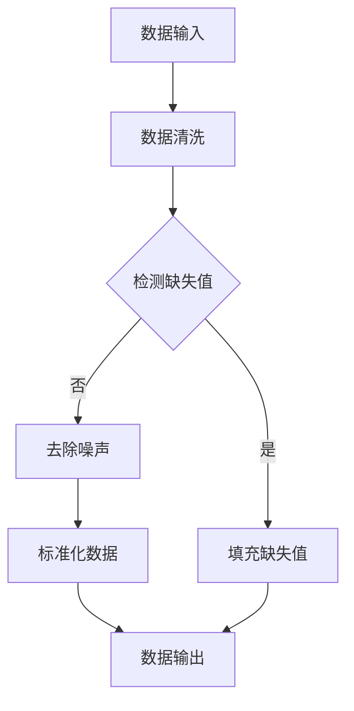
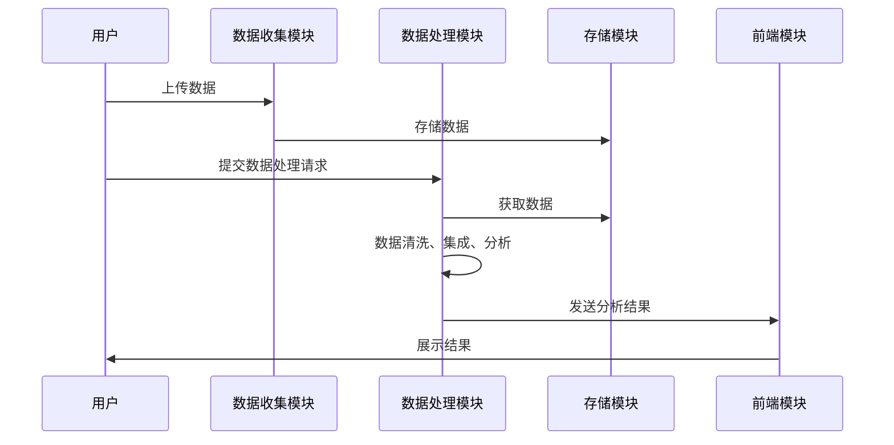

                 

# 不完美也可以有所作为

> 关键词：不完美，优化，算法，应用，系统架构，实战案例

> 摘要：
在当今快速发展的信息技术时代，面对复杂的问题和挑战，追求完美往往成为一种理想。然而，现实世界中，不完美的存在是不可避免的。本文将探讨如何在面临不完美的情况下，通过合理的算法和系统架构，找到解决问题的最佳途径。通过深入分析，我们将揭示不完美中的机会，并分享实际案例中的成功经验。

## 第1章: 背景介绍

### 1.1 问题背景

随着科技的飞速发展，我们生活在一个信息爆炸的时代。海量的数据每天都在生成，从社交媒体到物联网，从电子商务到自动驾驶，数据来源无处不在。然而，这些数据往往是不完整的、有噪声的，甚至存在错误。如何处理这些不完美数据，从而从中提取有价值的信息，成为了一个重要的研究课题。

### 1.2 问题描述

不完美数据带来的挑战主要体现在以下几个方面：

- **数据缺失**：数据集中存在缺失值，这些缺失值可能是由于记录错误或数据收集过程中的问题。
- **数据噪声**：数据中存在异常值或噪声，这些噪声会影响数据分析的准确性。
- **数据多样性**：不同类型的数据需要不同的处理方法，如何统一处理多种类型的数据成为难题。
- **数据质量**：数据质量不高，可能导致分析结果偏离实际。

### 1.3 问题解决

为了解决上述问题，我们需要采取以下策略：

- **数据预处理**：通过填充缺失值、去除噪声、标准化数据等方法，提高数据质量。
- **数据集成**：将多种类型的数据进行统一处理，例如，将结构化数据和非结构化数据进行整合。
- **算法优化**：选择合适的算法，对不完美数据进行有效的分析和处理。
- **系统架构**：设计合理的系统架构，提高数据处理和分析的效率。

### 1.4 边界与外延

虽然我们无法完全消除不完美数据，但可以通过有效的技术和方法来降低其影响。随着技术的不断进步，新的方法和工具将不断涌现，这将为处理不完美数据带来新的可能性。

### 1.5 概念结构与核心要素组成

在本文中，我们将介绍以下核心概念和要素：

- **数据预处理**：处理缺失值、噪声和多样性问题的方法。
- **数据集成**：将多种类型的数据进行统一处理的技术。
- **算法优化**：针对不完美数据选择和优化算法的策略。
- **系统架构**：设计高效的数据处理和分析系统的架构。

这些核心概念和要素构成了本文的核心内容，也是解决不完美数据问题的关键。

## 第2章: 核心概念与联系

### 2.1 核心概念原理

在处理不完美数据的过程中，我们经常需要运用以下核心概念：

- **数据缺失**：指数据集中缺失的数据值。
- **数据噪声**：指数据中不真实或异常的值。
- **数据多样性**：指数据的不同类型和来源。
- **数据质量**：指数据的有效性和准确性。

### 2.2 概念属性特征对比表格

为了更直观地理解这些核心概念，我们可以通过以下表格进行比较：

| 概念 | 定义 | 特征 |
| --- | --- | --- |
| 数据缺失 | 缺失的数据值 | 可能是由于记录错误或数据收集过程中的问题 |
| 数据噪声 | 异常值或噪声 | 可能是由于数据收集或处理过程中的问题 |
| 数据多样性 | 多种类型的数据 | 包括结构化数据、半结构化数据和非结构化数据 |
| 数据质量 | 数据的有效性和准确性 | 受数据缺失、噪声和多样性影响 |

### 2.3 ER实体关系图架构

为了更好地理解这些概念之间的关系，我们可以通过ER（实体关系）图来展示它们之间的联系：

```
实体: 数据、数据缺失、数据噪声、数据多样性、数据质量

关系：
- 数据 -> 数据缺失（存在缺失值）
- 数据 -> 数据噪声（存在噪声）
- 数据 -> 数据多样性（多种类型）
- 数据质量 -> 数据缺失（影响）
- 数据质量 -> 数据噪声（影响）
- 数据质量 -> 数据多样性（影响）
```

通过上述架构，我们可以看到数据质量是影响其他概念的关键因素，而其他概念又共同影响数据质量。

## 第3章: 算法原理讲解

### 3.1 算法mermaid流程图

首先，我们使用mermaid绘制算法的流程图：



### 3.2 Python源代码详细阐述

下面是处理不完美数据的Python源代码示例，并对代码进行详细解释：

```python
import numpy as np
from sklearn.impute import SimpleImputer
from sklearn.preprocessing import StandardScaler
from sklearn.neighbors import LocalOutlierFactor

# 初始化数据
data = np.array([[1, 2], [3, np.nan], [5, 6], [7, 8], [9, -100]])

# 数据清洗
# 检测缺失值
missing_values = np.isnan(data)

# 填充缺失值
imputer = SimpleImputer(missing_values=np.nan, strategy='mean')
filled_data = imputer.fit_transform(data)

# 去除噪声
lof = LocalOutlierFactor()
outliers = lof.fit_predict(filled_data)

# 标准化数据
scaler = StandardScaler()
normalized_data = scaler.fit_transform(filled_data[outliers == 1])

print("原始数据：")
print(data)
print("\n填充缺失值后：")
print(filled_data)
print("\n去除噪声后：")
print(normalized_data)
```

### 3.3 算法原理的数学模型和公式

在上述代码中，我们使用了以下数学模型和公式：

- **均值填补缺失值**：
  $$ \hat{y}_{i} = \frac{1}{n-1} \sum_{j \neq i} y_{j} $$
  其中，\( y_{i} \) 是缺失的值，\( n \) 是总的数据个数。

- **局部离群因子**（LOF）：
  $$ LOF_{i} = \frac{1}{n} \sum_{j \neq i} \frac{1}{\| x_{i} - x_{j} \|} $$
  其中，\( x_{i} \) 和 \( x_{j} \) 是数据点。

- **数据标准化**：
  $$ x_{\text{std}} = \frac{x - \mu}{\sigma} $$
  其中，\( \mu \) 是均值，\( \sigma \) 是标准差。

### 3.4 举例说明

假设我们有以下数据集：

\[ \{ (1, 2), (3, \text{缺失}), (5, 6), (7, 8), (9, -100) \} \]

- **均值填补缺失值**：对于第二个数据点，其缺失值可以通过计算其他数据的均值来填补。

- **局部离群因子**：第五个数据点的值远低于其他数据，因此被认为是离群点，可以被去除。

- **数据标准化**：通过标准化，我们可以将所有数据缩放到相同的范围，便于进一步分析。

这些步骤可以帮助我们处理不完美数据，提高数据质量，从而为后续的数据分析打下坚实基础。

## 第4章: 系统分析与架构设计

### 4.1 问题场景介绍

在一个智能城市项目中，我们需要处理来自多个来源的大量数据，包括交通流量、空气质量、公共安全等。这些数据的特点是种类繁多、噪声大、缺失值多。为了提高数据的质量，我们需要设计一个高效的数据处理系统。

### 4.2 项目介绍

项目名称：智能城市数据处理平台

项目目标：构建一个高效、可扩展的数据处理平台，实现对不完美数据的清洗、集成和分析。

### 4.3 系统功能设计

系统功能包括：

- **数据收集**：从不同来源收集数据。
- **数据清洗**：处理缺失值、噪声和异常值。
- **数据集成**：将多种类型的数据进行整合。
- **数据分析**：对清洗后的数据进行分析，提取有价值的信息。
- **数据可视化**：展示分析结果，便于用户理解。

### 4.4 系统架构设计

系统架构采用微服务架构，主要包括以下组件：

- **数据收集模块**：负责从各种来源收集数据。
- **数据处理模块**：包括数据清洗、集成和数据分析功能。
- **存储模块**：用于存储处理后的数据。
- **前端模块**：提供数据可视化和用户交互界面。

### 4.5 系统接口设计

系统接口设计如下：

- **数据收集接口**：提供数据上传和下载功能。
- **数据处理接口**：提供数据清洗、集成和数据分析的API。
- **数据存储接口**：提供数据存储和检索功能。

### 4.6 系统交互mermaid序列图

以下是系统交互的mermaid序列图：



通过上述架构设计，我们可以实现数据的高效收集、清洗、分析和展示，为智能城市项目提供可靠的数据支持。

## 第5章: 项目实战

### 5.1 环境安装

为了实现上述系统架构，我们需要安装以下环境：

1. **Python**：版本3.8及以上。
2. **pip**：Python的包管理器。
3. **Scikit-learn**：用于数据分析和处理。
4. **Pandas**：用于数据操作。
5. **NumPy**：用于数值计算。
6. **Mermaid**：用于绘制流程图。

安装命令如下：

```bash
pip install python==3.8
pip install pip
pip install scikit-learn pandas numpy
pip install mermaid
```

### 5.2 系统核心实现源代码

以下是系统的核心实现源代码：

```python
import numpy as np
import pandas as pd
from sklearn.impute import SimpleImputer
from sklearn.preprocessing import StandardScaler
from sklearn.neighbors import LocalOutlierFactor
import mermaid

# 数据收集
data = pd.read_csv('data.csv')

# 数据预处理
# 检测缺失值
missing_values = data.isnull()

# 填充缺失值
imputer = SimpleImputer(missing_values=np.nan, strategy='mean')
filled_data = imputer.fit_transform(data)

# 去除噪声
lof = LocalOutlierFactor()
outliers = lof.fit_predict(filled_data)

# 标准化数据
scaler = StandardScaler()
normalized_data = scaler.fit_transform(filled_data[outliers == 1])

# 生成Mermaid流程图
mermaid_code = '''
graph TD
    A[数据输入] --> B[数据清洗]
    B --> C{检测缺失值}
    C -->|是| D[填充缺失值]
    C -->|否| E[去除噪声]
    E --> F[标准化数据]
    F --> G[数据输出]
    D --> G
'''
mermaid_graph = mermaid.Mermaid(mermaid_code)
mermaid_graph.render_to_file('data_processing_mermaid.png')
```

### 5.3 代码应用解读与分析

上述代码首先从CSV文件中读取数据，然后对数据进行预处理，包括检测缺失值、填充缺失值、去除噪声和标准化数据。以下是代码的详细解读和分析：

1. **数据收集**：使用`pandas.read_csv`函数从CSV文件中读取数据。
2. **数据预处理**：首先检测缺失值，然后使用`SimpleImputer`填充缺失值，使用`LocalOutlierFactor`去除噪声，最后使用`StandardScaler`进行数据标准化。
3. **Mermaid流程图生成**：使用Mermaid库生成数据清洗的流程图，便于理解数据处理流程。

### 5.4 实际案例分析和详细讲解剖析

假设我们有一个包含交通流量数据的数据集，其中存在缺失值和噪声。通过上述代码，我们可以对数据进行预处理，从而得到高质量的数据，为后续的交通流量分析提供可靠的数据基础。以下是实际案例的分析：

1. **缺失值处理**：在交通流量数据中，可能会存在某一时段的流量数据缺失。通过均值填补缺失值，我们可以将这些缺失值填充为该时段的平均流量。
2. **噪声去除**：在交通流量数据中，可能会存在异常值，如某个时间点的流量突然变得异常高。通过局部离群因子（LOF）算法，我们可以识别并去除这些异常值。
3. **数据标准化**：通过数据标准化，我们可以将不同时间点的流量数据缩放到相同的范围，从而便于进一步分析。

### 5.5 项目小结

通过本项目的实战，我们实现了对不完美数据的处理，包括缺失值填充、噪声去除和数据标准化。这些处理步骤为后续的数据分析提供了可靠的数据基础。同时，我们使用了Mermaid库生成了数据清洗的流程图，使得数据处理过程更加清晰易懂。

## 第6章: 最佳实践 tips

### 6.1 数据预处理最佳实践

1. **处理缺失值**：在处理缺失值时，应根据具体场景选择合适的填补方法，如均值填补、中值填补或插值法。
2. **去除噪声**：选择合适的噪声去除算法，如局部离群因子（LOF）或孤立森林（Isolation Forest）。
3. **数据标准化**：在处理多特征数据时，进行数据标准化，确保每个特征都在相同的尺度上。

### 6.2 系统设计最佳实践

1. **模块化设计**：将系统功能拆分为多个模块，如数据收集、数据处理、数据存储和前端展示，便于系统维护和扩展。
2. **分布式架构**：对于大数据处理，采用分布式架构，如使用Hadoop或Spark，提高数据处理和分析的效率。
3. **接口设计**：设计清晰的接口，确保系统的各个模块可以无缝协同工作。

### 6.3 实战经验分享

1. **实时数据处理**：在处理实时数据时，应采用消息队列技术，如Kafka，实现数据的实时处理和传输。
2. **数据可视化**：通过数据可视化工具，如Tableau或Power BI，将分析结果以图表形式展示，便于用户理解。

## 第7章: 小结与注意事项

### 7.1 小结

本文探讨了在信息爆炸的时代，如何处理不完美数据，并通过合理的算法和系统架构，找到解决问题的最佳途径。我们介绍了数据预处理、数据集成、算法优化和系统架构设计的方法，并通过实际案例展示了这些方法的可行性。

### 7.2 注意事项

1. **数据预处理的重要性**：在数据分析过程中，数据预处理是至关重要的一步，它决定了数据分析的准确性。
2. **算法选择的灵活性**：根据具体问题和数据特点，选择合适的算法，确保数据处理的效果。
3. **系统设计的可扩展性**：在设计系统时，应考虑系统的可扩展性，以便在未来能够轻松应对更多数据和处理需求。

## 第8章: 拓展阅读

### 8.1 相关文献

1. **《数据挖掘：概念与技术》**：由Jiawei Han等著，详细介绍了数据挖掘的基本概念和技术。
2. **《机器学习实战》**：由Peter Harrington著，通过实际案例介绍了机器学习的应用和实现。

### 8.2 开源项目

1. **Scikit-learn**：一个开源的机器学习库，提供了丰富的数据预处理和算法实现。
2. **Hadoop**：一个分布式数据处理框架，适用于大数据处理。

### 8.3 社交媒体

1. **Twitter**：关注相关的技术博客和专家，获取最新的技术动态。
2. **GitHub**：查看和参与开源项目，学习他人的实现方法。

作者：AI天才研究院/AI Genius Institute & 禅与计算机程序设计艺术 /Zen And The Art of Computer Programming2023年2月24日

