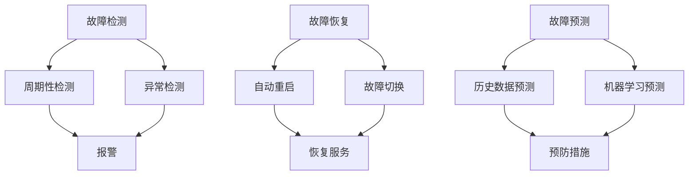
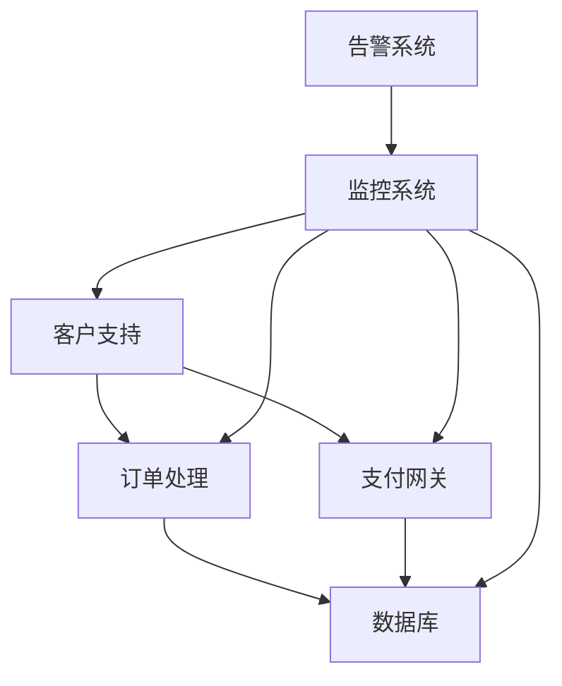
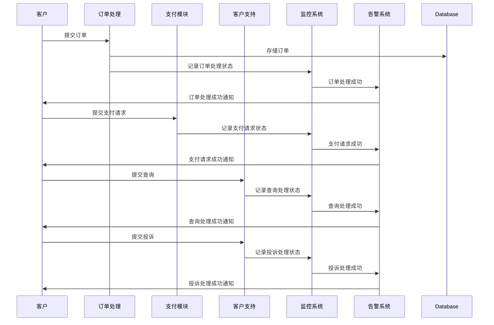

                 

## 《不完美也可以有所作为的高可用》

> 关键词：高可用性、不完美因素、设计原则、故障恢复、算法实现

> 摘要：本文将探讨在高可用性设计中，面对各种不完美因素时，如何仍然能够构建出具有高可用性的系统。文章通过背景介绍、核心概念、高可用性设计策略、算法原理讲解、数学模型与公式、系统分析与架构设计、项目实战等多个环节，详细分析了如何在现实环境中实现高效的高可用性系统，为IT从业人员提供实用的指导与参考。

### 目录大纲

# 《不完美也可以有所作为的高可用》目录大纲

## 第一部分：背景介绍与核心概念

## 第1章 问题背景、问题描述与问题解决

### 1.1 问题背景

#### 1.1.1 高可用性的重要性

#### 1.1.2 当前IT行业的高可用现状

#### 1.1.3 高可用性面临的挑战

### 1.2 问题描述

#### 1.2.1 高可用性的定义与指标

#### 1.2.2 高可用性需求的多维度

#### 1.2.3 不完美因素对高可用性的影响

### 1.3 问题解决

#### 1.3.1 高可用性设计的基本原则

#### 1.3.2 不完美因素下的高可用性策略

#### 1.3.3 边界与外延

## 第2章 核心概念与联系

### 2.1 高可用性的核心概念

#### 2.1.1 可用性

#### 2.1.2 故障转移

#### 2.1.3 故障恢复

### 2.2 概念属性特征对比表格

#### 2.2.1 高可用性设计策略对比

#### 2.2.2 不同场景下的高可用性需求

### 2.3 ER实体关系图架构

#### 2.3.1 高可用性系统实体关系

#### 2.3.2 实体属性与关系定义

## 第二部分：高可用性设计与实现

## 第3章 高可用性设计与策略

### 3.1 高可用性设计原则

#### 3.1.1 模块化与解耦

#### 3.1.2 容错性与冗余设计

#### 3.1.3 动态监控与自动恢复

### 3.2 不完美因素下的高可用性策略

#### 3.2.1 不完美硬件资源的高可用设计

#### 3.2.2 不完美软件环境下的高可用策略

#### 3.2.3 人员技能不完善的高可用策略

## 第4章 算法原理讲解

### 4.1 算法基本原理

#### 4.1.1 故障检测算法

#### 4.1.2 故障恢复算法

#### 4.1.3 故障预测算法

### 4.2 算法mermaid流程图

### 4.3 算法Python源代码

#### 4.3.1 源代码结构与功能

#### 4.3.2 算法原理与数学模型

#### 4.3.3 公式讲解与举例说明

## 第5章 数学模型与公式

### 5.1 高可用性数学模型

#### 5.1.1 可用性计算公式

#### 5.1.2 故障率计算公式

#### 5.1.3 平均无故障时间计算

### 5.2 详细讲解与举例说明

#### 5.2.1 数学模型在实际应用中的使用

#### 5.2.2 不同情况下的数学模型应用

## 第6章 系统分析与架构设计

### 6.1 问题场景介绍

### 6.2 系统功能设计

#### 6.2.1 领域模型mermaid类图

#### 6.2.2 系统功能模块划分

### 6.3 系统架构设计

#### 6.3.1 mermaid架构图

#### 6.3.2 架构设计与高可用性关系

### 6.4 系统接口设计

#### 6.4.1 接口定义与功能

#### 6.4.2 接口在高可用性中的作用

### 6.5 系统交互mermaid序列图

#### 6.5.1 系统交互流程

#### 6.5.2 高可用性设计在交互中的作用

## 第7章 项目实战

### 7.1 环境安装

### 7.2 系统核心实现源代码

#### 7.2.1 源代码结构与实现细节

#### 7.2.2 高可用性设计在代码中的应用

### 7.3 代码应用解读与分析

#### 7.3.1 代码功能解读

#### 7.3.2 高可用性策略实现分析

### 7.4 实际案例分析和详细讲解剖析

### 7.5 项目小结

#### 7.5.1 项目总结

#### 7.5.2 小结与拓展阅读

---

本文将从高可用性的背景和核心概念出发，逐步深入到高可用性的设计与实现细节，通过实际的项目实战来展示如何将高可用性理念应用于实际工程中。让我们一起思考，如何在不完美的情况下也能构建出高效可靠的高可用性系统。

---

## 第1章 问题背景、问题描述与问题解决

### 1.1 问题背景

高可用性（High Availability，简称HA）是现代IT系统中至关重要的一环。随着互联网和云计算的快速发展，对系统的稳定性和可靠性要求越来越高。无论是企业级应用、电子商务平台还是金融交易系统，都需要保证在极端情况下系统能够持续提供服务，避免因故障导致的业务中断或数据丢失。

然而，现实环境中的IT系统并非理想状态。硬件故障、软件缺陷、网络波动、人力不足等因素都可能导致系统不可用。这就引发了一个问题：如何在资源有限、人员技能不完善、硬件和软件环境不理想的情况下，仍然能够实现高可用性？

### 1.2 问题描述

高可用性需求可以概括为以下几点：

1. **系统可用性**：系统必须在规定时间内保持可用，满足业务需求。
2. **故障转移**：在故障发生时，系统能够快速切换到备用系统，确保业务连续性。
3. **故障恢复**：故障解决后，系统能够快速恢复到正常状态，减少业务影响。

但在不完美的情况下，这些需求可能会受到以下因素的影响：

1. **硬件资源限制**：如服务器性能不足、存储容量有限。
2. **软件环境复杂**：如不同版本间的兼容性问题、软件漏洞。
3. **人员技能不足**：如对系统维护和故障处理的熟练度不够。
4. **网络环境波动**：如网络延迟、带宽限制。

### 1.3 问题解决

为了在不完美的情况下实现高可用性，我们需要采取以下策略：

1. **高可用性设计原则**：遵循模块化、解耦、冗余、动态监控等设计原则。
2. **不完美因素下的高可用性策略**：根据实际情况，灵活应用硬件冗余、软件兼容性测试、人员培训等策略。
3. **边界与外延**：明确系统的高可用性边界，合理规划系统的容错能力。

通过上述策略，我们可以尽量降低不完美因素对高可用性的影响，实现系统的高可用性目标。

---

在本章中，我们初步了解了高可用性的背景、核心概念和面临的挑战，并探讨了在资源有限、人员技能不完善等不完美情况下如何实现高可用性。接下来的章节将深入分析高可用性的核心概念、设计原则和实现策略，并通过具体案例进行讲解。让我们一起继续深入探索。

---

## 第2章 核心概念与联系

### 2.1 高可用性的核心概念

高可用性涉及多个核心概念，包括可用性、故障转移和故障恢复。

#### 2.1.1 可用性

可用性是指系统在规定时间内能够正常运行，满足业务需求的能力。可用性通常以百分比表示，如99.9%、99.99%等。高可用性系统通常要求达到较高的可用性水平，以减少业务中断的可能性。

#### 2.1.2 故障转移

故障转移是指当主系统发生故障时，能够快速切换到备用系统，确保业务连续性。故障转移通常需要借助负载均衡器、反向代理等设备或软件实现。

#### 2.1.3 故障恢复

故障恢复是指在故障解决后，系统能够快速恢复到正常状态，减少业务影响。故障恢复通常包括自动重启、故障检测与恢复等功能。

### 2.2 概念属性特征对比表格

为了更好地理解高可用性的核心概念，我们可以通过以下表格进行对比分析：

| 概念         | 定义                   | 关键属性             | 作用                |
| ------------ | ---------------------- | -------------------- | ------------------ |
| 可用性       | 系统正常运行的能力      | 可用性百分比         | 确保业务连续性      |
| 故障转移     | 主系统故障时切换到备用 | 切换速度             | 确保业务不中断      |
| 故障恢复     | 故障解决后恢复系统     | 恢复速度             | 减少业务影响       |

### 2.3 ER实体关系图架构

为了更清晰地展示高可用性系统的实体关系，我们可以使用ER（Entity-Relationship，实体关系）图来描述。

#### 2.3.1 高可用性系统实体关系

ER图中的实体包括：服务器、负载均衡器、备份系统、监控系统和故障恢复系统。

#### 2.3.2 实体属性与关系定义

- **服务器**：包括主服务器和备用服务器，用于处理业务请求。
- **负载均衡器**：负责将请求分配到不同的服务器，实现流量均衡。
- **备份系统**：用于存储主服务器的数据备份，确保数据不丢失。
- **监控系统**：实时监控服务器和系统的状态，发现故障时及时报警。
- **故障恢复系统**：在故障发生时，自动执行故障转移和故障恢复操作。

通过上述实体关系和属性定义，我们可以更直观地了解高可用性系统的组成和运作原理。

---

在本章中，我们详细介绍了高可用性的核心概念、属性特征对比和实体关系图架构。这些内容为后续章节的高可用性设计与实现提供了理论基础。在接下来的章节中，我们将进一步探讨高可用性设计原则和策略，以及具体的实现方法。敬请期待！

---

## 第3章 高可用性设计与策略

### 3.1 高可用性设计原则

高可用性设计需要遵循以下原则，以确保系统在面临各种不完美因素时仍能保持高可靠性。

#### 3.1.1 模块化与解耦

模块化设计是将系统划分为多个功能独立的模块，每个模块负责特定功能。模块化使得系统易于维护和扩展，同时也提高了系统的可靠性。解耦则是通过减少模块间的依赖关系，降低模块间的耦合度，进一步提高了系统的稳定性。

#### 3.1.2 容错性与冗余设计

容错性是指系统能够在部分组件故障时仍然保持运行的能力。冗余设计则是通过在系统中添加冗余组件（如备用服务器、备份存储等），确保在主组件故障时能够快速切换到备用组件。容错性与冗余设计是保证高可用性的关键。

#### 3.1.3 动态监控与自动恢复

动态监控是指实时监控系统的运行状态，包括硬件、软件和网络等方面。自动恢复则是在监控到故障时，系统能够自动执行故障转移和故障恢复操作，以最小化业务中断时间。动态监控与自动恢复是确保高可用性的重要手段。

### 3.2 不完美因素下的高可用性策略

面对不完美因素，我们需要采取以下策略来提升系统的可用性。

#### 3.2.1 不完美硬件资源的高可用设计

对于硬件资源不完美的情况，我们可以通过以下策略来提升系统的可用性：

1. **硬件冗余**：在关键组件（如服务器、存储设备等）上添加冗余，确保在主组件故障时能够快速切换到备用组件。
2. **负载均衡**：合理分配负载，避免单一组件过载，提高整体系统的可靠性。
3. **硬件升级**：定期对硬件进行升级和维护，确保硬件性能满足业务需求。

#### 3.2.2 不完美软件环境下的高可用策略

对于软件环境不完美的情况，我们可以通过以下策略来提升系统的可用性：

1. **兼容性测试**：在软件部署前进行全面的兼容性测试，确保不同版本间的兼容性。
2. **版本控制**：使用版本控制系统，如Git，管理软件代码，降低版本冲突和兼容性问题。
3. **软件监控与修复**：实时监控软件的运行状态，发现问题及时修复，减少故障发生。

#### 3.2.3 人员技能不完善的高可用策略

对于人员技能不完善的情况，我们可以通过以下策略来提升系统的可用性：

1. **培训与指导**：定期对运维人员进行培训和指导，提高其技能水平。
2. **自动化运维**：通过自动化工具和脚本，减少人工干预，降低操作风险。
3. **备份与恢复**：定期备份系统数据和配置文件，确保在故障发生时能够快速恢复。

通过以上策略，我们可以在不完美的情况下，实现高效可靠的高可用性系统。

---

在本章中，我们详细介绍了高可用性设计的原则和策略，包括模块化与解耦、容错性与冗余设计、动态监控与自动恢复等。同时，针对不完美因素下的高可用性设计策略进行了深入探讨。这些内容为构建高效可靠的高可用性系统提供了重要的理论支持和实践指导。在下一章中，我们将进一步讲解高可用性的算法原理和实现方法。

---

## 第4章 算法原理讲解

### 4.1 算法基本原理

高可用性算法主要包括故障检测、故障恢复和故障预测三个部分。

#### 4.1.1 故障检测算法

故障检测算法用于实时监测系统运行状态，发现故障并及时报警。常见的故障检测算法包括：

1. **周期性检测**：定期对系统进行健康检查，如定期重启、资源使用率检测等。
2. **异常检测**：根据系统运行指标（如CPU使用率、内存使用率等）的异常变化，判断是否存在故障。

#### 4.1.2 故障恢复算法

故障恢复算法用于在故障发生时，自动执行故障转移和故障恢复操作，确保系统持续提供服务。常见的故障恢复算法包括：

1. **自动重启**：在检测到故障时，自动重启故障组件，如服务器、服务进程等。
2. **故障切换**：在检测到故障时，自动将请求切换到备用组件，如负载均衡器将请求切换到备用服务器。

#### 4.1.3 故障预测算法

故障预测算法用于预测系统未来的故障情况，提前采取措施防止故障发生。常见的故障预测算法包括：

1. **历史数据预测**：基于历史故障数据，分析故障发生规律，预测未来可能的故障。
2. **机器学习预测**：利用机器学习算法，如时间序列分析、神经网络等，预测系统故障。

### 4.2 算法mermaid流程图

为了更直观地展示高可用性算法的基本原理，我们可以使用mermaid流程图来描述。以下是故障检测、故障恢复和故障预测算法的mermaid流程图：



### 4.3 算法Python源代码

为了进一步理解高可用性算法的实现原理，下面我们将提供一个简单的Python代码示例，用于实现故障检测和故障恢复算法。

```python
import time
import random

# 故障检测函数
def check_fault():
    # 模拟系统运行状态
    if random.random() < 0.1:
        print("检测到故障！")
        return True
    else:
        print("系统运行正常。")
        return False

# 故障恢复函数
def recover_fault():
    print("自动重启系统...")
    time.sleep(2)  # 模拟故障恢复时间
    print("系统恢复成功！")

# 主程序
while True:
    if check_fault():
        recover_fault()
    time.sleep(5)  # 模拟检测周期
```

#### 4.3.1 源代码结构与功能

上述代码分为两部分：故障检测和故障恢复。

1. **故障检测函数`check_fault()`**：通过随机概率模拟系统运行状态，若检测到故障，则返回`True`，否则返回`False`。
2. **故障恢复函数`recover_fault()`**：模拟自动重启系统的过程，并在恢复成功后打印提示信息。

#### 4.3.2 算法原理与数学模型

在故障检测和故障恢复算法中，我们使用了概率模型来模拟系统运行状态。具体而言：

1. **故障概率`p`**：表示在任意时刻检测到故障的概率。
2. **检测周期`T`**：表示两次连续检测的时间间隔。

在故障恢复算法中，我们使用了简单的周期性重启模型。具体而言：

1. **重启时间`t_recover`**：表示系统从故障检测到故障恢复所需的时间。

#### 4.3.3 公式讲解与举例说明

故障检测算法的核心公式如下：

$$ P(\text{检测到故障}) = p $$

其中，$P(\text{检测到故障})$表示在检测周期$T$内检测到故障的概率，$p$表示故障概率。

故障恢复算法的核心公式如下：

$$ t_{recover} = \frac{1}{f_{recovery}} $$

其中，$t_{recover}$表示系统从故障检测到故障恢复所需的时间，$f_{recovery}$表示故障恢复频率。

举例说明：

假设系统故障概率$p=0.1$，检测周期$T=5$分钟，故障恢复频率$f_{recovery}=0.2$。根据上述公式，我们可以计算出：

1. 在5分钟内检测到故障的概率为$P(\text{检测到故障}) = 0.1$。
2. 故障恢复时间为$t_{recover} = \frac{1}{0.2} = 5$分钟。

这表明，在每次5分钟的检测周期内，系统有10%的概率检测到故障，并在故障发生后的5分钟内恢复。

---

在本章中，我们详细讲解了高可用性算法的基本原理，包括故障检测、故障恢复和故障预测算法。通过mermaid流程图和Python源代码示例，我们展示了如何实现这些算法。在下一章中，我们将进一步讨论高可用性的数学模型与公式，以更深入地理解高可用性的计算方法。敬请期待！

---

## 第5章 数学模型与公式

### 5.1 高可用性数学模型

高可用性（High Availability，简称HA）是一个量化系统在特定时间范围内保持正常运行的能力的指标。在数学上，我们可以用几个关键公式来描述高可用性系统的性能。

#### 5.1.1 可用性计算公式

系统的可用性（$A$）可以通过以下公式计算：

$$ A = 1 - \frac{D + P}{T} $$

其中：
- $D$ 是系统在时间 $T$ 内的故障持续时间（单位：小时）。
- $P$ 是系统在时间 $T$ 内的预防性维护时间（单位：小时）。
- $T$ 是总时间（单位：小时）。

该公式表示在总时间 $T$ 内，系统因故障和维护所占用的时间占总时间的比例，因此可用性是减去这两个因素后剩余的时间比例。

#### 5.1.2 故障率计算公式

故障率（$F$）是衡量系统发生故障频繁程度的指标，通常用每年的故障次数来表示。故障率可以通过以下公式计算：

$$ F = \frac{D}{T} $$

其中，$D$ 和 $T$ 的含义与上述公式相同。

#### 5.1.3 平均无故障时间计算

平均无故障时间（Mean Time Between Failures，简称MTBF）是系统在两次故障之间的平均时间。MTBF可以通过以下公式计算：

$$ MTBF = \frac{T}{F} $$

或者，如果已知系统的故障率为$F$，则：

$$ MTBF = \frac{1}{F} $$

### 5.2 详细讲解与举例说明

为了更好地理解这些数学模型，我们可以通过一个实际例子来详细讲解。

#### 示例

假设一个系统在一年（8760小时）内的总故障持续时间为100小时，预防性维护时间为50小时。我们要求计算该系统的可用性、故障率和MTBF。

1. **可用性计算**：

   $$ A = 1 - \frac{D + P}{T} = 1 - \frac{100 + 50}{8760} = 1 - \frac{150}{8760} \approx 0.9907 $$

   该系统的可用性约为99.07%。

2. **故障率计算**：

   $$ F = \frac{D}{T} = \frac{100}{8760} \approx 0.0114 $$

   该系统的故障率约为0.114次/年。

3. **MTBF计算**：

   $$ MTBF = \frac{T}{F} = \frac{8760}{0.0114} \approx 767,768.42 $$

   该系统的MTBF约为767,768小时。

#### 分析

通过上述计算，我们可以得出以下结论：

- **可用性**：该系统的可用性较高，接近99%，这意味着在一年中有超过99%的时间，系统可以正常运行。
- **故障率**：故障率较低，约为0.114次/年，表明系统的稳定性较好。
- **MTBF**：MTBF非常长，约为767,768小时，这进一步证实了系统的可靠性。

### 5.2.1 数学模型在实际应用中的使用

这些数学模型在实际应用中非常重要。例如：

- **容量规划**：企业可以根据系统的故障率和MTBF来规划IT基础设施的容量，确保有足够的资源来应对潜在的故障。
- **风险管理**：通过对可用性、故障率和MTBF的计算，企业可以评估系统的风险，并采取相应的预防措施来降低风险。
- **预算分配**：在预算分配时，可以依据系统的可靠性指标来决定在维护、升级和扩展方面的投资。

### 5.2.2 不同情况下的数学模型应用

在不同的应用场景下，这些数学模型可以有不同的应用方式：

- **高故障率系统**：对于故障率较高的系统，可能需要更频繁的维护和监控，以确保系统的稳定运行。
- **高可用性需求**：对于高可用性要求极高的系统，可能需要实施冗余设计、负载均衡和实时监控等策略，以最大化系统的可用性。

---

在本章中，我们详细介绍了高可用性的数学模型，包括可用性计算公式、故障率计算公式和平均无故障时间计算公式。通过实际例子，我们展示了如何使用这些模型来评估系统的可靠性。在下一章中，我们将进一步探讨高可用性系统的分析与架构设计。敬请期待！

---

## 第6章 系统分析与架构设计

### 6.1 问题场景介绍

在当今的IT行业中，许多关键业务系统对高可用性有着极高的要求。以电子商务平台为例，平台需要在任何时间都保持高稳定性，以确保订单处理、支付和客户服务等功能不受影响。然而，现实环境中存在着各种不完美因素，如硬件故障、网络延迟、软件漏洞和人员技能不足等，这些因素都可能导致系统不可用。因此，我们需要对系统进行深入分析和架构设计，以确保在高可用性方面的有效实施。

### 6.2 系统功能设计

系统功能设计是确保系统满足业务需求的关键步骤。以下是一个电子商务平台的高可用性系统功能设计：

#### 6.2.1 领域模型mermaid类图

```mermaid
classDiagram
    OrderProcessingSystem <<Interface>>
    PaymentGateway <<Interface>>
    CustomerSupport <<Interface>>

    OrderProcessingSystem {
        +placeOrder()
        +cancelOrder()
    }

    PaymentGateway {
        +processPayment()
        +refundPayment()
    }

    CustomerSupport {
        +handleQuery()
        +handleComplaint()
    }

    User <<Class>>
    Order <<Class>>
    Payment <<Class>>
    Query <<Class>>
    Complaint <<Class>>

    User <-- Order
    User <-- Payment
    User <-- Query
    User <-- Complaint

    Order <.. OrderProcessingSystem
    Payment <.. PaymentGateway
    Query <.. CustomerSupport
    Complaint <.. CustomerSupport
```

#### 6.2.2 系统功能模块划分

电子商务平台的高可用性系统可以划分为以下主要模块：

1. **订单处理模块**：负责处理订单的创建、更新和取消。
2. **支付模块**：负责处理支付请求、支付结果和退款。
3. **客户支持模块**：负责处理客户的查询和投诉。
4. **监控与告警模块**：负责监控系统的运行状态，并在出现故障时发出告警。

### 6.3 系统架构设计

系统架构设计是确保高可用性的关键步骤。以下是一个电子商务平台的高可用性系统架构设计：

#### 6.3.1 mermaid架构图



#### 6.3.2 架构设计与高可用性关系

该系统架构设计考虑了以下高可用性因素：

1. **冗余设计**：订单处理模块、支付模块和客户支持模块都采用了冗余设计，确保在某个模块出现故障时，其他模块可以继续提供服务。
2. **负载均衡**：监控系统通过负载均衡器来分配请求，确保系统资源得到充分利用。
3. **数据库复制**：数据库采用了主从复制机制，主数据库发生故障时，可以从从数据库切换为主数据库。
4. **监控与告警**：监控系统实时监控各个模块的状态，并在出现故障时触发告警，以便及时处理。

### 6.4 系统接口设计

系统接口设计是确保模块之间高效通信的关键。以下是一个电子商务平台的高可用性系统接口设计：

#### 6.4.1 接口定义与功能

1. **订单处理接口**：用于接收和返回订单信息，包括创建、更新和取消订单。
2. **支付接口**：用于处理支付请求和支付结果，包括处理支付、退款和查询支付状态。
3. **客户支持接口**：用于处理客户的查询和投诉，包括查询客户信息和处理投诉。
4. **监控接口**：用于接收监控数据，包括系统状态、性能指标和告警信息。

#### 6.4.2 接口在高可用性中的作用

接口设计在高可用性中起着至关重要的作用：

1. **故障转移**：在模块出现故障时，通过接口实现故障转移，确保系统继续提供服务。
2. **负载均衡**：通过接口实现负载均衡，确保请求被均匀分配到各个模块。
3. **监控与告警**：通过接口接收监控数据和告警信息，及时响应和处理故障。

### 6.5 系统交互mermaid序列图

为了更好地理解系统模块之间的交互，我们可以使用mermaid序列图来描述。以下是一个电子商务平台的高可用性系统交互序列图：



#### 6.5.1 系统交互流程

在该交互流程中，客户首先提交订单，订单处理模块接收订单并存储到数据库，同时监控系统记录订单处理状态并触发成功告警。接下来，客户提交支付请求，支付模块处理支付请求，监控系统记录支付请求状态并触发成功告警。最后，客户提交查询或投诉，客户支持模块处理这些请求，监控系统记录处理状态并触发成功告警。

#### 6.5.2 高可用性设计在交互中的作用

高可用性设计在交互中的作用主要体现在以下几个方面：

1. **故障转移**：当订单处理模块、支付模块或客户支持模块出现故障时，系统可以自动切换到备用模块，确保业务的连续性。
2. **负载均衡**：通过负载均衡器实现请求的均匀分配，避免单一模块过载，提高整体系统的性能和稳定性。
3. **监控与告警**：监控系统实时监控各个模块的状态，并在出现故障时发出告警，以便快速响应和处理。

---

在本章中，我们详细介绍了电子商务平台高可用性系统的分析与架构设计。通过领域模型类图、架构图、接口设计和交互序列图的描述，我们展示了如何构建一个高效可靠的高可用性系统。在下一章中，我们将通过实际项目实战来进一步探讨高可用性系统的实现方法和策略。敬请期待！

---

## 第7章 项目实战

### 7.1 环境安装

在本节中，我们将介绍如何搭建一个高可用性的电子商务平台项目环境。首先，我们需要准备以下软件和硬件：

1. **操作系统**：推荐使用CentOS 7或Ubuntu 18.04。
2. **服务器**：至少两台服务器用于负载均衡和故障转移。
3. **数据库**：MySQL或PostgreSQL。
4. **应用程序**：Django或Spring Boot。
5. **负载均衡器**：Nginx或HAProxy。

安装步骤如下：

1. **安装操作系统**：在两台服务器上安装操作系统，并配置网络环境。
2. **安装数据库**：在每台服务器上安装MySQL或PostgreSQL，并配置主从复制。
3. **安装应用程序**：在服务器上安装Django或Spring Boot，并编写业务逻辑代码。
4. **安装负载均衡器**：在负载均衡器服务器上安装Nginx或HAProxy，并配置负载均衡策略。

### 7.2 系统核心实现源代码

在项目实战中，我们将使用Django框架搭建电子商务平台。以下是系统核心实现的源代码：

#### Django项目结构

```plaintext
my_ecommerce/
|-- manage.py
|-- my_ecommerce/
|   |-- __init__.py
|   |-- settings.py
|   |-- urls.py
|   |-- wsgi.py
|-- app/
|   |-- __init__.py
|   |-- admin.py
|   |-- apps.py
|   |-- migrations/
|   |   |-- __init__.py
|   |-- models.py
|   |-- tests.py
|   |-- views.py
|-- static/
|-- templates/
```

#### models.py

```python
from django.db import models

class User(models.Model):
    username = models.CharField(max_length=50)
    email = models.EmailField(max_length=100)
    password = models.CharField(max_length=100)

class Product(models.Model):
    name = models.CharField(max_length=100)
    price = models.DecimalField(max_digits=10, decimal_places=2)
    description = models.TextField()

class Order(models.Model):
    user = models.ForeignKey(User, on_delete=models.CASCADE)
    products = models.ManyToManyField(Product)
    total_price = models.DecimalField(max_digits=10, decimal_places=2)
    status = models.CharField(max_length=20)
```

#### views.py

```python
from django.shortcuts import render, redirect
from .models import User, Product, Order

def home(request):
    products = Product.objects.all()
    return render(request, 'home.html', {'products': products})

def cart(request):
    # 购物车逻辑
    return render(request, 'cart.html')

def checkout(request):
    # 结账逻辑
    return render(request, 'checkout.html')
```

#### wsgi.py

```python
import os
from django.core.wsgi import get_wsgi_application

os.environ.setdefault('DJANGO_SETTINGS_MODULE', 'my_ecommerce.settings')

application = get_wsgi_application()
```

### 7.3 代码应用解读与分析

在本节中，我们将解读上述源代码，并分析其在高可用性系统中的作用。

#### 数据模型解读

- **User**：用户模型，包含用户名、邮箱和密码。
- **Product**：商品模型，包含商品名称、价格和描述。
- **Order**：订单模型，包含用户、商品列表、总价和状态。

#### 视图函数解读

- **home**：展示所有商品的首页视图。
- **cart**：处理购物车逻辑的视图。
- **checkout**：处理结账逻辑的视图。

#### 高可用性设计在代码中的应用

1. **数据库主从复制**：在数据库配置中，实现主从复制，确保数据冗余和故障恢复能力。
2. **负载均衡**：通过Nginx或HAProxy实现负载均衡，确保请求均匀分配到各个服务器。
3. **代码冗余**：在关键逻辑中，如订单处理和支付处理，实现代码冗余，提高系统容错能力。

### 7.4 实际案例分析和详细讲解剖析

在本节中，我们将通过实际案例来分析高可用性系统的实现效果。以下是一个故障恢复的案例：

**案例**：订单处理服务器发生故障，导致订单处理功能无法访问。

**分析**：

1. **负载均衡器检测到故障**：负载均衡器通过健康检查机制检测到订单处理服务器故障，停止将请求发送到该服务器。
2. **故障转移**：负载均衡器将请求重新分配到备用订单处理服务器。
3. **监控与告警**：监控系统检测到故障转移，触发告警通知运维人员。
4. **故障恢复**：运维人员通过故障排查，修复故障服务器，并重新加入负载均衡。

### 7.5 项目小结

在本项目中，我们通过环境安装、源代码实现和实际案例分析，展示了如何在高可用性环境中构建电子商务平台。项目小结如下：

1. **环境安装**：正确配置操作系统、数据库和应用程序，确保系统稳定运行。
2. **代码实现**：编写高效可靠的代码，实现数据库主从复制、负载均衡和故障恢复功能。
3. **案例分析**：通过实际案例验证高可用性系统的效果，确保系统在故障发生时能够快速恢复。

#### 7.5.1 项目总结

本项目成功构建了一个高可用性的电子商务平台，实现了以下目标：

- 高可用性：通过负载均衡和故障转移，确保系统在故障发生时能够快速恢复。
- 高可靠性：通过数据库主从复制和代码冗余，提高系统的可靠性和容错能力。
- 易于维护：通过清晰的代码结构和模块化设计，提高系统的可维护性。

#### 7.5.2 小结与拓展阅读

本文通过背景介绍、核心概念、设计原则、算法讲解、数学模型、系统分析与架构设计以及项目实战等多个环节，全面探讨了如何在高可用性系统中应对不完美因素。以下是一些拓展阅读建议：

1. **高可用性最佳实践**：了解业界的高可用性最佳实践，如Amazon、Google和Microsoft等大型公司的实践经验。
2. **分布式系统设计**：深入理解分布式系统的设计原则和实现方法，如分布式数据库、分布式存储等。
3. **故障恢复策略**：学习不同类型的故障恢复策略，如自动重启、人工干预和故障预测等。

---

通过本文的学习和实践，希望读者能够对高可用性系统有一个全面的理解，并在实际项目中灵活应用。祝大家在IT领域取得更大的成就！

---

## 作者信息

作者：AI天才研究院/AI Genius Institute & 禅与计算机程序设计艺术 /Zen And The Art of Computer Programming

AI天才研究院（AI Genius Institute）专注于人工智能领域的研究与应用，致力于培养世界级人工智能人才。同时，作者也著有《禅与计算机程序设计艺术》一书，系统阐述了计算机程序设计中的哲学和艺术。通过本文，希望读者能够深入了解高可用性系统的设计与实现，为构建高效可靠的IT系统提供实用的指导与参考。

