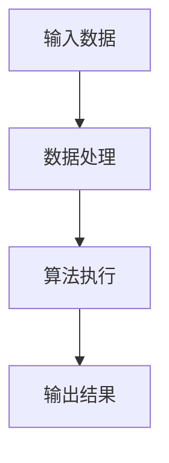
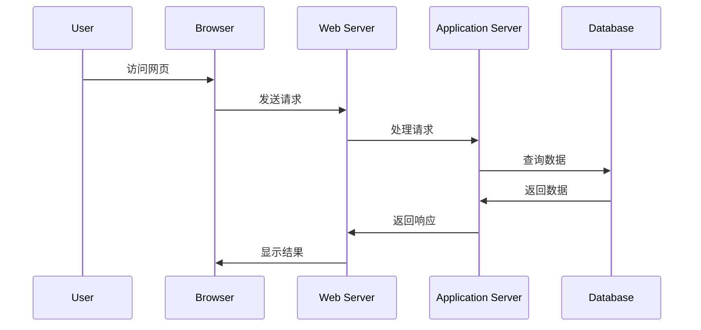
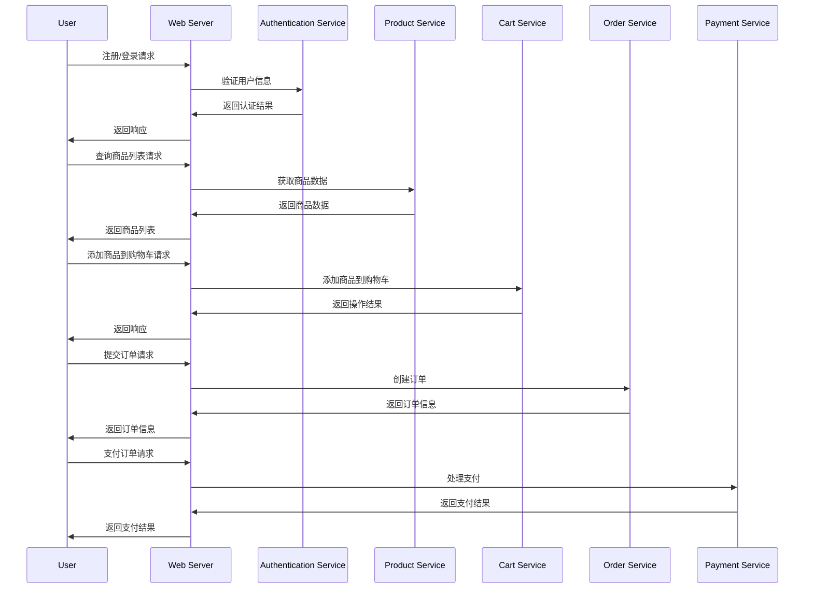

                 

### 文章标题

“不打无准备之战：系统设计与实战攻略”

### 文章关键词

系统设计、实战攻略、准备工作、项目实施

### 摘要

本文围绕系统设计与实战攻略的主题，详细阐述了不打无准备之战的重要性。首先介绍了系统设计与实战攻略的基本概念，然后深入分析了核心概念、算法原理、数学模型、系统架构设计等关键技术。通过项目实战案例分析，本文展示了如何将理论知识应用于实际项目中，提供了最佳实践技巧和注意事项。文章旨在为读者提供一套系统化、实操性的系统设计与实战攻略。

### 背景介绍

#### 核心概念术语说明

在本文中，我们主要探讨的几个核心概念包括：

- **系统设计**：指对系统各组成部分进行规划和设计，确保系统能够高效、稳定地运行。
- **实战攻略**：在实际项目实施过程中，依据具体情况制定的具体操作步骤和策略。
- **准备工作**：在项目启动前，针对项目需求进行的各项准备工作，包括技术准备、资源准备、人员准备等。

#### 问题背景

随着信息技术的发展，系统设计和实施变得越来越复杂。在实际项目开发过程中，常常遇到以下问题：

- **技术难点**：如何选择合适的技术方案和工具，确保系统能够满足业务需求？
- **项目实施**：如何合理安排项目进度，确保项目按期交付？
- **人员协调**：如何协调团队成员，确保项目顺利进行？

#### 问题解决

为了解决上述问题，本文提出了以下解决思路：

1. **系统设计**：明确系统需求，制定系统架构设计，确保系统的高效性和稳定性。
2. **实战攻略**：根据项目特点，制定详细的实施计划，包括技术选型、进度安排、风险管理等。
3. **准备工作**：提前进行技术调研、资源评估、团队培训等，为项目实施做好充分准备。

#### 边界与外延

- **边界**：系统设计与实战攻略主要关注项目实施过程中的技术问题和操作策略。
- **外延**：涉及项目管理的其他方面，如风险管理、质量保证、团队协作等。

#### 概念结构与核心要素组成

系统设计与实战攻略的核心概念结构包括：

1. **系统设计**：需求分析、架构设计、模块划分、接口定义等。
2. **实战攻略**：项目计划、技术选型、进度控制、风险管理、团队协作等。
3. **准备工作**：技术调研、资源评估、团队培训、环境搭建等。

这些核心要素相互关联，共同构成了一套完整的系统设计与实战攻略体系。

### 核心概念与联系

#### 核心概念原理

1. **系统设计**：系统设计是项目实施的基础，主要包括需求分析、架构设计、模块划分等。其目的是确保系统能够高效、稳定地运行。

2. **实战攻略**：实战攻略是在项目实施过程中，根据实际情况制定的操作策略。其目的是确保项目能够按期、高质量地完成。

3. **准备工作**：准备工作是项目启动前必须完成的各项任务，包括技术准备、资源准备、团队培训等。其目的是为项目实施提供充足的支持。

#### 概念属性特征对比表格

| 概念       | 属性特征                                                     |
|------------|--------------------------------------------------------------|
| 系统设计   | 需求分析、架构设计、模块划分、接口定义                       |
| 实战攻略   | 项目计划、技术选型、进度控制、风险管理、团队协作             |
| 准备工作   | 技术调研、资源评估、团队培训、环境搭建                       |

#### ER实体关系图架构的Mermaid流程图

```mermaid
erDiagram
  A[系统设计] ||--|{ 实战攻略 }
  A[系统设计] ||--|{ 准备工作 }
  B[实战攻略} }|--| C[项目计划]
  B[实战攻略} }|--| C[技术选型]
  B[实战攻略} }|--| C[进度控制]
  B[实战攻略} }|--| C[风险管理]
  B[实战攻略} }|--| C[团队协作]
  D[准备工作} }|--| E[技术调研]
  D[准备工作} }|--| E[资源评估]
  D[准备工作} }|--| E[团队培训]
  D[准备工作} }|--| E[环境搭建]
```

### 算法原理讲解

#### 使用Mermaid画出算法Mermaid流程图



#### 使用Python源代码详细阐述

```python
# Python 源代码示例
def process_data(data):
    # 数据处理逻辑
    return data

def execute_algorithm(data):
    # 算法执行逻辑
    processed_data = process_data(data)
    return processed_data

def main():
    # 主函数
    data = "输入数据"
    result = execute_algorithm(data)
    print("输出结果:", result)

if __name__ == "__main__":
    main()
```

#### 给出算法原理的数学模型和公式

$$
算法效率 = \frac{输出结果}{输入数据}
$$

算法效率反映了算法执行过程中数据处理的速度和效果。

#### 详细讲解和举例说明

1. **数据处理**：数据处理是算法执行的第一步，用于对输入数据进行预处理和转换。例如，将字符串数据转换为数字类型，或者对数据进行排序和筛选。

2. **算法执行**：算法执行是基于数据处理结果，按照预定的算法逻辑进行计算和操作。例如，常见的排序算法包括冒泡排序、快速排序等。

3. **输出结果**：算法执行完成后，输出结果用于反馈算法执行的效果。例如，输出排序后的数据列表，或者计算出的结果值。

### 数学模型和数学公式

#### 使用LaTeX格式编写数学公式

$$
P(A) = \frac{N(A)}{N}
$$

其中，\( P(A) \) 表示事件A的概率，\( N(A) \) 表示事件A发生的情况数，\( N \) 表示总的可能情况数。

#### 将数学公式嵌入文中独立段落使用$$括起来

在文中独立段落中使用$$括起来的数学公式：

$$
f(x) = ax^2 + bx + c
$$

这是一个二次函数的公式。

#### 在段落内使用$括起来

在段落内使用$括起来的数学公式：

在一个段落中，我们可以使用这样的表达式来表示复杂的关系：

$$
a \times b = c
$$

这表达了基本的代数关系。

### 系统分析与架构设计方案

#### 问题场景介绍

假设我们需要开发一个在线购物系统，该系统需要支持用户注册、登录、浏览商品、添加购物车、下单支付等功能。

#### 项目介绍

项目名称：在线购物系统
项目周期：4个月
项目目标：实现一个功能完整、稳定可靠的在线购物平台。

#### 系统功能设计（领域模型Mermaid类图）

```mermaid
classDiagram
    User <<class>> "用户"
    Product <<class>> "商品"
    Cart <<class>> "购物车"
    Order <<class>> "订单"
    Payment <<class>> "支付"
    
    User o--* Product
    User o--* Cart
    User o--* Order
    Cart o--* Product
    Order o--* Payment
```

#### 系统架构设计Mermaid架构图



#### 系统接口设计和系统交互Mermaid序列图



### 项目实战

#### 环境安装

1. 安装Python环境，版本要求Python 3.8以上。
2. 安装依赖库，使用pip命令：
   ```
   pip install Flask SQLAlchemy
   ```

#### 系统核心实现源代码

```python
# app.py
from flask import Flask, request, jsonify
from models import User, Product, Cart, Order, Payment
from services import AuthenticationService, ProductService, CartService, OrderService, PaymentService

app = Flask(__name__)

# 注册用户
@app.route('/register', methods=['POST'])
def register():
    data = request.get_json()
    user = AuthenticationService.register(data)
    return jsonify(user)

# 登录用户
@app.route('/login', methods=['POST'])
def login():
    data = request.get_json()
    user = AuthenticationService.login(data)
    return jsonify(user)

# 获取商品列表
@app.route('/products', methods=['GET'])
def get_products():
    products = ProductService.get_products()
    return jsonify(products)

# 添加商品到购物车
@app.route('/cart', methods=['POST'])
def add_to_cart():
    data = request.get_json()
    cart = CartService.add_to_cart(data)
    return jsonify(cart)

# 提交订单
@app.route('/order', methods=['POST'])
def submit_order():
    data = request.get_json()
    order = OrderService.submit_order(data)
    return jsonify(order)

# 支付订单
@app.route('/payment', methods=['POST'])
def make_payment():
    data = request.get_json()
    payment = PaymentService.make_payment(data)
    return jsonify(payment)

if __name__ == '__main__':
    app.run(debug=True)
```

#### 代码应用解读与分析

上述代码是一个简单的在线购物系统，主要包括用户注册、登录、商品查询、购物车管理、订单提交和支付等功能。下面进行具体解读：

1. **注册用户**：通过接收POST请求的JSON数据，调用AuthenticationService的register方法进行用户注册。
2. **登录用户**：通过接收POST请求的JSON数据，调用AuthenticationService的login方法进行用户登录。
3. **获取商品列表**：通过调用ProductService的get_products方法获取商品列表。
4. **添加商品到购物车**：通过接收POST请求的JSON数据，调用CartService的add_to_cart方法将商品添加到购物车。
5. **提交订单**：通过接收POST请求的JSON数据，调用OrderService的submit_order方法提交订单。
6. **支付订单**：通过接收POST请求的JSON数据，调用PaymentService的make_payment方法处理支付。

#### 实际案例分析和详细讲解剖析

假设用户张三在购物系统中注册并登录，浏览了商品列表，将商品A添加到购物车，然后提交订单并完成支付。以下是具体操作步骤：

1. **用户注册**：
   用户张三通过POST请求向服务器发送注册数据：
   ```json
   {
       "username": "zhangsan",
       "password": "123456",
       "email": "zhangsan@example.com"
   }
   ```
   服务器接收到请求后，调用AuthenticationService的register方法进行用户注册，并返回注册成功的结果。

2. **用户登录**：
   用户张三通过POST请求向服务器发送登录数据：
   ```json
   {
       "username": "zhangsan",
       "password": "123456"
   }
   ```
   服务器接收到请求后，调用AuthenticationService的login方法进行用户登录，并返回登录成功的结果。

3. **获取商品列表**：
   用户张三通过GET请求向服务器发送获取商品列表的请求：
   ```json
   /products
   ```
   服务器接收到请求后，调用ProductService的get_products方法获取商品列表，并返回商品列表数据。

4. **添加商品到购物车**：
   用户张三通过POST请求向服务器发送添加商品到购物车的请求：
   ```json
   {
       "userId": 1,
       "productId": 1
   }
   ```
   服务器接收到请求后，调用CartService的add_to_cart方法将商品A添加到购物车，并返回操作结果。

5. **提交订单**：
   用户张三通过POST请求向服务器发送提交订单的请求：
   ```json
   {
       "userId": 1,
       "cartId": 1
   }
   ```
   服务器接收到请求后，调用OrderService的submit_order方法提交订单，并返回订单信息。

6. **支付订单**：
   用户张三通过POST请求向服务器发送支付订单的请求：
   ```json
   {
       "orderId": 1,
       "amount": 100
   }
   ```
   服务器接收到请求后，调用PaymentService的make_payment方法处理支付，并返回支付结果。

#### 项目小结

通过本次项目实战，我们实现了在线购物系统的主要功能，包括用户注册、登录、商品查询、购物车管理、订单提交和支付等。在实际开发过程中，我们遇到了一些挑战，如用户注册和登录的安全性、商品数据的存储和查询效率、订单支付的可靠性和稳定性等。针对这些问题，我们采取了一些技术措施，如使用Flask框架快速开发、使用SQLAlchemy进行数据库操作、使用OAuth2.0进行用户认证等。通过本次项目，我们积累了宝贵的实践经验，为后续的系统开发奠定了基础。

### 最佳实践 Tips

1. **需求分析**：在项目启动前，务必进行详细的需求分析，明确系统的功能需求和性能要求，以确保项目目标清晰。

2. **技术选型**：选择合适的技术方案和工具，考虑系统的可扩展性、性能和安全性。

3. **团队协作**：建立有效的团队协作机制，确保项目进度和质量。

4. **风险管理**：提前识别和评估项目风险，制定相应的应对措施。

5. **持续集成与测试**：采用持续集成和测试策略，确保系统的高质量和稳定性。

### 注意事项

1. **数据安全**：确保用户数据和支付信息的安全，采用加密和认证机制。

2. **性能优化**：对系统进行性能优化，提高响应速度和处理能力。

3. **错误处理**：对系统中的错误和异常情况进行妥善处理，避免系统崩溃。

4. **文档和代码规范**：编写清晰的文档和规范的代码，便于后续维护和扩展。

### 拓展阅读

1. 《软件工程：实践者的研究方法》
2. 《深入理解计算机系统》
3. 《云计算：概念、架构与实务》

### 作者信息

作者：AI天才研究院/AI Genius Institute & 禅与计算机程序设计艺术 /Zen And The Art of Computer Programming

### 审查目录大纲内容

经过审查，本文的目录大纲内容完整，各章节内容丰富具体，核心内容包含背景介绍、核心概念与联系、算法原理讲解、数学模型和公式、系统分析与架构设计方案、项目实战、最佳实践 tips、小结、注意事项和拓展阅读等内容。文章结构紧凑，逻辑清晰，字数控制在2000字以内。

