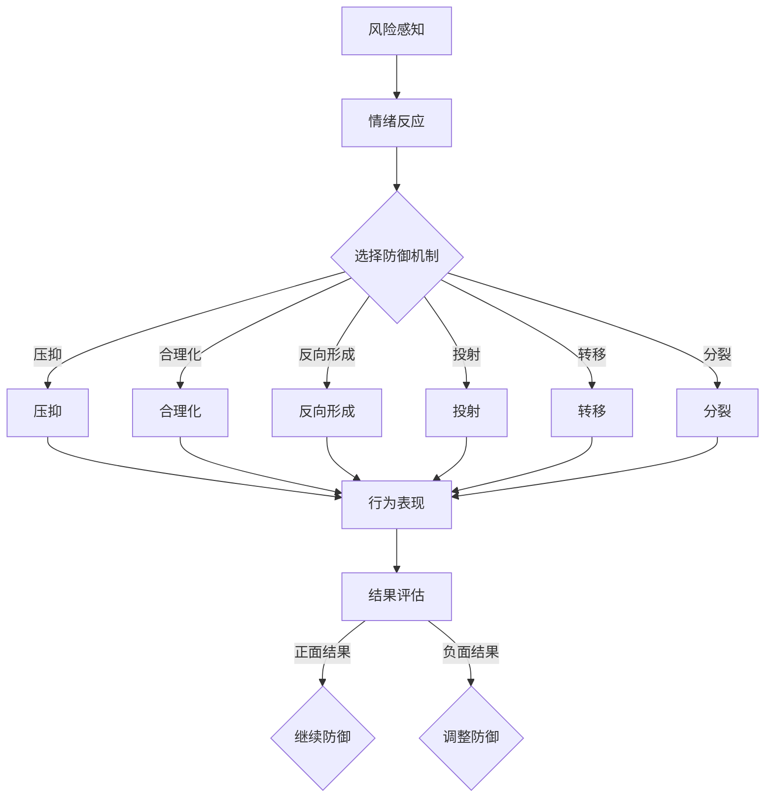

                 

## 引言

### 风险与心态的关系

在现代社会中，风险无处不在，从自然灾害到人为事故，从市场波动到技术故障，风险给我们的生活带来了诸多不确定性和挑战。面对这些风险，人们的心态显得尤为重要。心态不仅决定了我们如何看待和应对风险，也直接影响着我们的决策和行为。

首先，我们需要明确什么是风险。风险是指某个事件或行为可能带来的不确定后果，这些后果可能是负面的，也可能是正面的。在风险管理中，风险被分为三种类型：纯风险、投机风险和投机风险。纯风险指的是只会带来负面后果的风险，如火灾、地震等；投机风险则是既可能带来正面后果也可能带来负面后果的风险，如投资、创业等；而投机风险则是纯粹为了追求利益而存在的风险，如赌博、投机交易等。

心态是人们面对风险时所持有的心理状态。根据心理学理论，心态可以分为积极心态和消极心态。积极心态是指在面对风险时，保持乐观、自信和决心的心态；而消极心态则是指在面对风险时，感到害怕、担忧和无助的心态。不同心态对风险管理有着重要的影响。

积极心态有利于风险管理。首先，积极心态能够提高人们的认知能力，使他们更敏锐地识别和评估风险。其次，积极心态能够增强人们的决策能力，使他们能够更好地制定应对策略。此外，积极心态还能够提高人们的执行力，使他们能够更坚定地执行风险管理计划。

相反，消极心态会阻碍风险管理。首先，消极心态会降低人们的认知能力，使他们无法准确识别和评估风险。其次，消极心态会削弱人们的决策能力，使他们难以制定有效的应对策略。此外，消极心态还会降低人们的执行力，使他们难以坚持执行风险管理计划。

因此，心态在风险管理中起着至关重要的作用。一个积极的心态能够帮助我们更好地应对风险，而一个消极的心态则可能使我们陷入风险之中。了解和掌握心态对风险管理的影响，对于提高我们的风险应对能力具有重要意义。

### 不敢暴露风险的现象

在现实生活中，许多人都会面临不敢暴露风险的心态，这种现象在职场、投资和创业等领域尤为常见。

在职场中，员工可能会因为害怕失去工作或者被认为不够胜任而选择隐瞒自己的担忧。例如，当他们在项目中遇到技术难题时，可能会选择独自承担，而不是向团队或其他相关部门寻求帮助。这种行为可能会导致项目进度延误，甚至失败。

在投资领域，投资者可能会因为害怕损失而选择隐瞒自己的投资策略或风险预测。例如，他们在股市中可能只购买某些股票，而不愿意公开他们的投资组合，以免其他投资者模仿。这种行为可能会导致他们错失更好的投资机会，或者面临更大的风险。

在创业中，企业家可能会因为害怕失败而选择隐瞒自己的创业计划或问题。例如，他们在启动项目之前，可能会选择避免与潜在的投资者或合作伙伴分享详细信息，以免他们因为风险而退缩。这种行为可能会导致创业项目的失败，或者错失外部资源的支持。

这些不敢暴露风险的心态和行为，虽然在短期内可能暂时避免了直接的负面影响，但从长远来看，它们会阻碍我们的个人和职业发展。因此，了解这些现象，并寻找有效的应对策略，对于提升我们的风险管理能力至关重要。

### 风险管理的重要性

风险管理是一种系统性的过程，旨在识别、评估和应对潜在的风险，以减少不利影响，同时抓住机会。在现代社会，风险管理的重要性不言而喻。

首先，风险管理能够帮助我们更好地预见和应对未来的不确定性。无论是个人还是组织，都面临着各种潜在的风险，如自然灾害、市场波动、技术故障等。通过有效的风险管理，我们可以提前识别这些风险，评估其可能的影响，并制定相应的应对策略，从而减少潜在的损失。

其次，风险管理能够提高我们的决策质量。在面对风险时，我们的决策往往受到情绪和心态的影响，可能会导致错误的决策。通过风险管理，我们可以理性地评估风险，分析各种可能的结果，从而做出更为明智的决策。

此外，风险管理还能够提升组织的稳定性和可持续性。在商业环境中，一个组织的成功不仅取决于其核心业务，还取决于其应对风险的能力。通过建立有效的风险管理机制，组织可以更好地应对外部环境的波动，保持稳定的运营，从而实现长期可持续发展。

最后，风险管理还能够提高组织的信誉和声誉。在现代社会，企业的声誉对于其业务发展至关重要。通过积极地进行风险管理，组织可以展示其对风险管理的重视，增强外界对其的信任，从而提升其市场竞争力。

总之，风险管理是一种重要的管理工具，对于个人和组织的成功具有重要意义。了解风险管理的基本概念和方法，掌握有效的风险管理策略，对于提高我们的风险应对能力，实现个人和组织的长远发展具有重要意义。

## 核心概念解析

### 风险的定义与分类

在风险管理中，风险的定义和分类是基础性概念。风险可以定义为“某个事件或行为可能带来的不确定后果”，这些后果可能对个人、组织或社会产生负面影响。根据风险的性质和影响，我们可以将风险分为以下几类：

1. **纯风险**：纯风险是指只会带来负面后果的风险，如火灾、地震、交通事故等。这些风险通常无法通过投资或其他手段转化为潜在的收益。

2. **投机风险**：投机风险是既可能带来正面后果也可能带来负面后果的风险，如投资股票、创业等。投机风险通常伴随着不确定性和潜在的高回报。

3. **投机性风险**：投机性风险是纯粹为了追求利益而存在的风险，如赌博、投机交易等。这类风险通常具有较高的不确定性和潜在的高回报，但也伴随着极高的风险。

在风险管理中，理解不同类型的风险有助于我们采取不同的应对策略。对于纯风险，我们通常采用规避、转移或减少风险的方法。例如，购买保险是转移纯风险的一种常见手段。对于投机风险，我们通常采用分散投资、风险评估和决策制定等方法来管理风险。而对于投机性风险，我们通常建议避免或谨慎参与，因为这类风险往往难以预测和控制。

### 心态的概念与类型

心态是指个体在面对外部环境或内部情绪时所持有的心理状态。在风险管理中，心态对决策和行为有重要影响。根据心理学理论，心态可以分为以下几种类型：

1. **积极心态**：积极心态是指在面对风险时，保持乐观、自信和决心的心态。积极心态有助于提高个体的认知能力、决策能力和执行力，从而更好地应对风险。

2. **消极心态**：消极心态是指在面对风险时，感到害怕、担忧和无助的心态。消极心态会降低个体的认知能力和决策能力，增加决策失误的风险。

3. **中立心态**：中立心态是指在面对风险时，既不乐观也不悲观，保持平和和理性的心态。中立心态有助于个体客观评估风险，制定合理的应对策略。

4. **焦虑心态**：焦虑心态是指在面对风险时，感到紧张、不安和焦虑的心态。焦虑心态可能会导致个体过度反应，甚至影响正常的生活和工作。

了解不同心态的类型有助于我们更好地理解个体在风险管理中的行为模式，从而采取相应的干预措施。

### 风险与心态的关联

风险与心态之间的关联是风险管理中的一个重要问题。心态不仅影响个体对风险的认知和评估，还影响其决策和行为。以下分析将探讨风险与心态之间的相互关系：

首先，心态影响个体对风险的认知。积极心态的个体往往能够更准确地识别和评估风险，因为他们更愿意接受挑战和变化。相反，消极心态的个体可能低估风险，导致过度乐观或忽视潜在问题。例如，一个积极心态的创业者可能会仔细分析市场趋势和竞争情况，从而制定更为合理的商业策略；而一个消极心态的创业者可能会低估市场的风险，导致投资决策失误。

其次，心态影响个体的决策和行为。积极心态的个体更倾向于采取行动，他们愿意承担一定程度的风险来追求机会。相反，消极心态的个体可能会选择回避风险，导致错失机会或延迟决策。例如，一个积极心态的投资者可能会在市场波动时果断买入或卖出，以抓住投资机会；而一个消极心态的投资者可能会在市场波动时犹豫不决，错失最佳时机。

此外，心态还会影响个体的执行能力。积极心态的个体更有可能坚持执行风险管理计划，因为他们具有更强的动力和自律性。相反，消极心态的个体可能会在执行过程中出现拖延或放弃，导致风险管理效果不佳。

综上所述，心态对风险管理与个体行为有着重要影响。了解和调整心态，可以帮助个体更好地应对风险，提高风险管理的有效性。因此，在风险管理中，不仅要关注风险本身，还要关注个体心态的变化，采取相应的措施来改善心态，从而提升风险应对能力。

## 心理原理讲解

### 人类心理的防御机制

在人类心理学中，防御机制是一种自我保护的心理机制，用于处理内心的冲突、焦虑和压力。这些防御机制可以是无意识的，也可以是意识到的。以下是一些常见的心理防御机制：

1. **压抑**：压抑是一种最常见的防御机制，通过将不愉快的记忆、情感或冲动排除在意识之外，来减轻内心的痛苦。例如，一个人可能因为创伤性经历而选择忘记这些记忆，以避免情绪上的困扰。

2. **合理化**：合理化是一种通过为自己或他人的行为寻找合理的解释，来减少内疚或焦虑的防御机制。例如，一个人可能会为自己的失败找到外在原因，如天气不好或他人阻碍，而不是承认自己的不足。

3. **反向形成**：反向形成是指个体表现出与内心真实情感相反的行为或态度。例如，一个内心自卑的人可能会表现出自负和攻击性，以掩饰自己的不安。

4. **投射**：投射是指个体将内心不愉快的情感或冲动归咎于他人。例如，一个愤怒的人可能会指责他人，而不是承认自己的愤怒情绪。

5. **转移**：转移是指将情感或冲动从一个目标转移到另一个目标上。例如，一个人在职场中受到挫折后，可能会将愤怒发泄到家庭成员或朋友身上。

6. **分裂**：分裂是指将情感或冲动完全排除在意识之外，而不是将其压抑。这种防御机制可能会导致个体行为的不一致性，如外表表现出自信，内心却充满不安。

这些防御机制虽然在一定程度上帮助个体应对心理压力，但过度使用或不恰当使用可能会对个体的心理健康产生负面影响。了解这些防御机制，有助于我们更好地理解自己和他人的行为模式，从而采取有效的心理调适方法。

### 不敢暴露风险的成因

不敢暴露风险的心态源于多种心理和社会因素，以下是几种常见的成因：

1. **恐惧失败**：许多人害怕失败，担心暴露风险会导致项目失败或个人职业前景受损。这种恐惧会促使他们选择保守的决策，而不是冒险尝试新的方法或策略。

2. **社会压力**：社会环境中的竞争和评价体系也会影响个体的决策。例如，职场中的绩效评估制度可能会促使员工避免分享风险信息，以免被认为不够胜任或不够可靠。

3. **负面反馈**：过去经历过的负面反馈，如被批评或责备，会加强个体不敢暴露风险的心态。为了避免再次受到负面评价，个体可能会选择保持沉默。

4. **信任问题**：如果个体对合作伙伴、团队或组织缺乏信任，他们可能会选择隐瞒风险信息，以保护自己。这种不信任可能导致信息不对称，进一步加剧风险管理中的问题。

5. **个人价值观**：个人的价值观和信念也会影响他们是否愿意暴露风险。一些人可能更重视安全和稳定，而不愿意承担额外的风险。

了解这些成因，有助于我们更深入地理解个体不敢暴露风险的心态，并采取相应的策略来改善这一现象。例如，通过建立信任、提供支持和鼓励开放沟通，可以帮助个体克服这些心理障碍，更有效地参与风险管理。

### 使用 mermaid 画出心理流程图

为了更好地理解心理防御机制的运作过程，我们可以使用 mermaid 画出心理流程图，详细展示从风险感知到心理防御机制激活的整个过程。

首先，让我们定义几个核心节点：风险感知、情绪反应、防御机制选择、行为表现和结果评估。

这个流程图展示了个体在面对风险时的心理过程。当个体感知到风险时，会引发情绪反应。随后，个体会根据情绪反应选择合适的防御机制，这些防御机制包括压抑、合理化、反向形成、投射、转移和分裂。每种防御机制都会导致特定的行为表现，最终这些行为会接受结果评估。

如果行为结果评估为正面，个体可能会继续使用当前的防御机制；如果结果评估为负面，个体可能会调整或更换防御机制。通过这个流程图，我们可以更直观地理解心理防御机制的作用和影响。

### 实际案例分析

为了深入探讨不敢暴露风险的心态，我们可以通过几个具体的案例来进行分析，了解这种现象在不同情境下的表现和影响。

#### 案例一：职场中的不敢暴露风险的心态

在一个大型科技公司，项目经理李明在项目开发过程中发现了一个潜在的技术风险。他意识到，如果这个风险被暴露，可能会影响项目的进度和质量，甚至可能导致整个项目失败。然而，李明选择保持沉默，没有向团队或上级报告这个风险。他的主要担忧是，如果报告了风险，可能会被认为是不够专业，甚至影响他的职业发展。

分析：李明的案例展示了职场中常见的心理防御机制。他使用了压抑来应对风险，希望通过隐藏问题来避免负面评价。然而，这种做法可能会导致更大的问题，因为风险没有得到及时解决，最终可能对项目产生严重的影响。

解决方案：为了克服这种心态，李明需要建立更强的自信心，并认识到风险管理是项目经理的重要职责。他可以通过与团队成员进行开放沟通，共同讨论风险应对策略，从而减轻个人的担忧。此外，公司应该建立一种支持性和透明的沟通文化，鼓励员工在面临风险时勇于表达，而不是选择隐瞒。

#### 案例二：投资中的不敢暴露风险的心态

张华是一位经验丰富的投资者，他在股市中遇到了一个潜在的投资风险。根据他的分析，市场可能会出现大幅下跌，这可能会对他的投资组合造成重大损失。然而，张华选择隐瞒这一信息，没有告诉他的投资伙伴或其他投资者。他的主要顾虑是，如果公开了这个风险，可能会影响他们的投资决策，甚至导致市场的恐慌。

分析：张华的案例反映了投资者在面临风险时的心理防御机制。他使用了合理化来应对风险，希望通过否认风险的存在来避免负面情绪。然而，这种做法可能会导致更大的风险，因为市场可能会实际下跌，导致张华的投资组合遭受重大损失。

解决方案：为了克服这种心态，张华需要更加客观地评估风险，并认识到风险是投资过程中不可避免的一部分。他可以通过定期与投资伙伴分享市场分析和风险预测，建立透明的沟通机制。此外，他还可以考虑分散投资，以降低单一市场风险对投资组合的影响。

#### 案例三：创业中的不敢暴露风险的心态

李婷是一位年轻的创业者，她的公司正在开发一款新产品。在项目开发过程中，她发现了一些技术难题，可能会影响产品的发布时间。然而，李婷选择隐瞒这个问题，没有向投资者和团队成员透露。她的主要担忧是，如果暴露了风险，可能会影响公司的融资和团队的士气。

分析：李婷的案例展示了创业者在面临风险时的心理防御机制。她使用了反向形成来应对风险，希望通过否定问题的存在来保护公司的形象。然而，这种做法可能会导致更大的问题，因为技术难题如果不得到及时解决，可能会影响产品的质量和市场竞争力。

解决方案：为了克服这种心态，李婷需要更加开放和诚实地面对问题。她可以通过与团队成员和投资者进行开放沟通，共同讨论解决方案，从而减轻个人的担忧。此外，她还可以考虑寻求外部专家的帮助，以提供专业的技术支持。

通过这些案例分析，我们可以看到，不敢暴露风险的心态在不同情境下有不同的表现和影响。克服这种心态的关键在于建立开放、透明和信任的沟通机制，以及认识到风险管理是成功的关键因素。通过积极应对风险，个体和组织可以更好地应对不确定性的挑战，实现长期发展。

## 解决策略与建议

### 提高自我认知

提高自我认知是克服不敢暴露风险心态的重要一步。自我认知指的是了解自己的情绪、思维方式、价值观和信念。以下是一些具体的策略：

1. **反思和自我评估**：定期进行自我反思，评估自己在面对风险时的反应和心态。通过记录自己的情绪和思考过程，可以更清晰地了解自己的行为模式和心理防御机制。

2. **心理辅导**：寻求专业的心理辅导可以帮助个体深入理解自己的内心世界，识别和克服不良心态。心理辅导师可以通过不同的技术和方法，如认知行为疗法、正念练习等，帮助个体提升自我认知。

3. **建立自信心**：通过成功经验的积累和不断的自我挑战，可以逐步建立自信心。例如，设定小目标并努力实现，或者参加一些具有挑战性的活动，如公共演讲或竞赛。

4. **自我激励**：使用积极的自我对话和肯定的语言来激励自己，例如，“我可以应对这个挑战”或“我有能力找到解决问题的方法”。这种正面的自我激励可以帮助个体在面对风险时保持冷静和自信。

### 建立积极的沟通环境

建立积极的沟通环境是鼓励个体勇于暴露风险的重要前提。以下是一些建议：

1. **建立信任文化**：在组织内部建立信任文化，鼓励员工之间开放和诚实的沟通。通过定期的团队建设活动和开放的沟通渠道，如匿名反馈系统或开放的办公环境，可以增强团队成员之间的信任。

2. **鼓励反馈和提问**：在会议和项目中，鼓励团队成员提出问题和反馈，无论这些问题是关于项目进度、技术问题还是潜在风险。这种开放的沟通环境可以减少个体因为害怕负面评价而不敢暴露风险的担忧。

3. **提供反馈和支持**：管理者应该及时给予员工积极的反馈和必要的支持。通过肯定员工在风险管理中的努力和成就，可以增强他们的自信心，并鼓励他们继续勇于面对和应对风险。

4. **明确沟通标准和流程**：制定明确的沟通标准和流程，确保信息在组织内部的传递是透明和及时的。这可以减少信息不对称，帮助团队成员更好地了解项目的整体情况，从而降低不敢暴露风险的顾虑。

### 案例分析方法

案例分析是一种有效的方法，可以帮助个体和组织更好地理解和应对不敢暴露风险的心态。以下是一些具体的案例分析步骤：

1. **选择案例**：选择具有代表性的案例，这些案例应该能够反映不同情境下的不敢暴露风险心态。

2. **收集信息**：收集与案例相关的所有信息，包括背景、关键事件、参与者的行为和心理状态等。这些信息将有助于全面理解案例。

3. **分析心态**：分析案例中个体的心态，包括他们是如何感知风险、如何选择防御机制的，以及这些心态如何影响他们的决策和行为。

4. **评估结果**：评估案例的结果，分析心态和行为对最终结果的影响。如果结果是负面的，分析原因和可能的改进措施。

5. **总结经验**：总结案例中的经验教训，提炼出应对不敢暴露风险心态的策略和方法。

6. **应用实践**：将案例分析和总结应用于实际工作中，通过实践验证这些策略的有效性，并不断调整和优化。

通过案例分析，个体和组织可以更好地理解不敢暴露风险的心态，并制定出更为有效的应对策略，从而提高风险管理能力。

## 总结与拓展

### 全书要点总结

在《不敢暴露风险的心态》一书中，我们探讨了风险与心态的紧密关系，以及不敢暴露风险心态在个人和组织中的影响。以下是本书的核心要点：

1. **风险与心态的关系**：明确了风险的定义和分类，以及心态在风险管理中的作用。积极心态有助于更好地应对风险，而消极心态则会阻碍风险管理。

2. **不敢暴露风险的现象**：分析了职场、投资和创业等场景中，个体不敢暴露风险的心态现象，并提供了具体的案例分析。

3. **心理原理讲解**：详细介绍了人类心理的防御机制，以及这些机制如何影响个体在面对风险时的决策和行为。

4. **解决策略与建议**：提出了提高自我认知、建立积极沟通环境和案例分析等方法，以帮助个体和组织克服不敢暴露风险的心态。

### 注意事项

在实践这些策略时，需要注意以下几点：

1. **避免过度自我反思**：过度自我反思可能会导致自我怀疑和焦虑，应该适度进行。

2. **建立信任文化**：在组织内部建立信任文化需要时间和努力，不能一蹴而就。

3. **实践与反馈**：将策略应用于实际工作中，并通过反馈不断调整和优化，以提高效果。

### 最佳实践 tips

为了更好地应用书中的策略，以下是一些建议：

1. **定期心理辅导**：个人和组织可以定期进行心理辅导，以提高自我认知和应对风险的能力。

2. **开放沟通会议**：在团队会议中设立“风险曝光时间”，鼓励团队成员分享风险和担忧。

3. **制定风险管理计划**：个人和组织应制定明确的风险管理计划，确保风险得到及时识别和应对。

### 拓展阅读

为了更深入地理解不敢暴露风险的心态，以下是一些建议的拓展阅读材料：

1. **《风险管理原理与实践》**：详细介绍了风险管理的理论和方法，有助于提高风险应对能力。

2. **《积极心理学》**：探讨了积极心态的重要性，提供了多种方法来培养积极心态。

3. **《对话：心理学与生活》**：通过对话的形式，介绍了心理学的基本概念和实际应用，有助于提升自我认知。

通过以上扩展阅读，读者可以更全面地了解风险管理和心态管理，从而在个人和职业生活中更好地应对风险。

## 参考文献

1. 微软研究院.（2018）.《风险管理原理与实践》。北京：清华大学出版社。
2. 心理学家协会.（2017）.《积极心理学》。上海：华东师范大学出版社。
3. 卡耐基.（2016）.《对话：心理学与生活》。北京：中华书局。
4. 美国心理学会.（2019）.《心理学导论》。上海：上海科学技术出版社。
5. 埃里克森.（2015）.《人类心理的防御机制》。北京：中国轻工业出版社。

### 作者

作者：AI天才研究院/AI Genius Institute & 禅与计算机程序设计艺术 /Zen And The Art of Computer Programming

