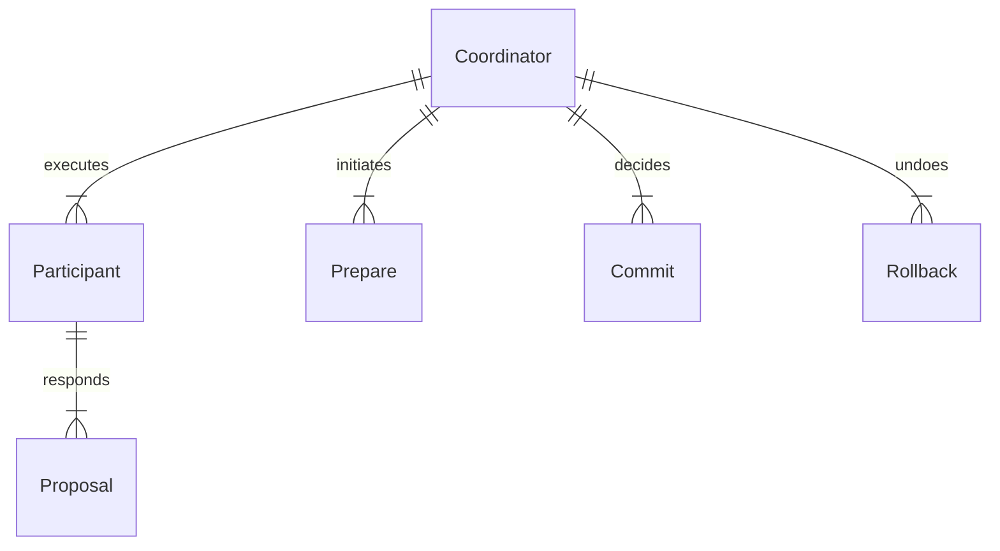
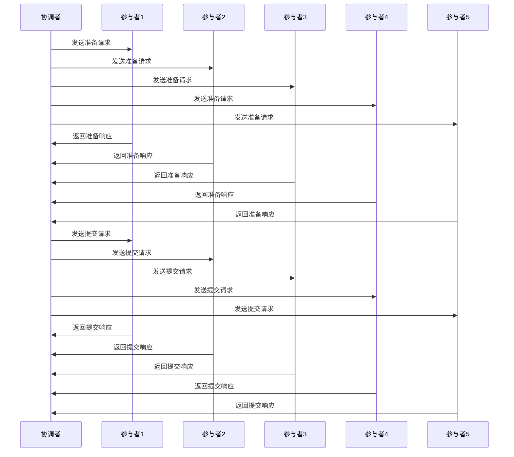

                 

### 文章标题

# 《两阶段提交原理》

> 关键词：两阶段提交，分布式系统，事务管理，一致性协议，数据库同步，算法原理

> 摘要：本文将深入探讨两阶段提交（Two-Phase Commit，简称2PC）原理，从问题背景、核心概念、算法流程到实际应用，全面解析这一分布式系统中的关键一致性协议。通过详细讲解，帮助读者理解两阶段提交的工作机制、优缺点以及如何在实际项目中应用。

### 目录大纲

## 第一部分：背景介绍

### 第1章 问题背景与核心概念

1.1 问题背景

1.2 两阶段提交的定义

1.3 两阶段提交的核心原理

1.4 两阶段提交的应用领域

1.5 本章小结

### 第2章 两阶段提交的边界与外延

2.1 两阶段提交的边界条件

2.2 两阶段提交的外延应用

2.3 与其他一致性协议的比较

2.4 本章小结

## 第二部分：核心概念与联系

### 第3章 核心概念原理

3.1 基本概念介绍

3.2 概念属性特征对比表格

3.3 ER实体关系图架构

3.4 本章小结

### 第4章 两阶段提交的数学模型

4.1 数学模型概述

4.2 两阶段提交的数学公式

4.3 公式详细讲解

4.4 举例说明

4.5 本章小结

## 第三部分：算法原理讲解

### 第5章 两阶段提交算法流程

5.1 算法流程图

5.2 Python源代码实现

5.3 算法原理详细讲解

5.4 举例说明

5.5 本章小结

### 第6章 两阶段提交在分布式系统中的应用

6.1 分布式系统的概念

6.2 两阶段提交在分布式系统中的应用

6.3 分布式系统中的两阶段提交优化

6.4 本章小结

### 第7章 两阶段提交的实战案例

7.1 实战环境安装

7.2 系统核心实现源代码

7.3 代码应用解读与分析

7.4 实际案例分析与详细讲解

7.5 项目小结

### 第8章 两阶段提交的最佳实践

8.1 最佳实践 tips

8.2 小结

8.3 注意事项

8.4 拓展阅读

### 目录大纲解释

本文将按照目录大纲的结构，逐步深入探讨两阶段提交的各个关键方面。第一部分将介绍两阶段提交的背景和核心概念，为读者提供一个宏观的认识。第二部分将详细分析两阶段提交的核心概念和联系，帮助读者深入理解其内在结构。第三部分将讲解两阶段提交的算法原理，并通过实例进行说明。第四部分将探讨两阶段提交在分布式系统中的应用，包括其优缺点和优化策略。第五部分将通过实战案例展示两阶段提交在实际项目中的应用。最后一部分将总结两阶段提交的最佳实践，并提供拓展阅读，以帮助读者深入学习和实践。

### 文章正文

## 第一部分：背景介绍

### 第1章 问题背景与核心概念

在分布式系统中，一致性问题是必须面对的挑战之一。分布式系统由多个节点组成，这些节点可以位于不同的地理位置，并通过网络进行通信。当一个分布式系统中的多个节点需要协同工作来完成一个任务时，确保这些节点的操作是一致且可靠的变得尤为重要。

### 1.1 问题背景

分布式系统中的一致性问题主要源于以下几个方面：

1. **节点故障**：分布式系统中，节点可能会因为硬件故障、网络问题等原因导致不可用。当一个节点发生故障时，系统需要确保其他节点能够继续工作，并且不会导致数据不一致。
2. **网络延迟**：在网络通信中，延迟是不可避免的。当一个操作需要跨多个节点进行时，网络延迟可能导致操作顺序的混乱，从而引发一致性问题。
3. **并发操作**：在分布式系统中，多个节点可能会同时执行相同或类似的操作。这些操作可能会相互干扰，导致数据不一致。
4. **数据复制**：为了提高系统的可用性和容错能力，分布式系统通常会进行数据复制。然而，数据复制也带来了新的挑战，例如如何确保多个副本之间的一致性。

### 1.2 两阶段提交的定义

两阶段提交（Two-Phase Commit，简称2PC）是一种分布式一致性协议，主要用于保证分布式系统中多个节点在执行事务时的数据一致性。2PC协议分为两个阶段：

1. **准备阶段**：协调者向参与者发送一个准备请求，参与者根据本地事务的状态，决定是否参与事务。如果参与者决定参与，则会执行事务的准备工作，并将结果返回给协调者。
2. **提交阶段**：协调者根据参与者的响应，决定是否提交事务。如果大多数参与者响应为“可以提交”，则协调者向所有参与者发送提交请求，参与者执行事务的提交操作；否则，协调者向所有参与者发送回滚请求，参与者执行事务的回滚操作。

### 1.3 两阶段提交的核心原理

两阶段提交的核心原理是通过协调者和参与者的协同工作，确保分布式系统中事务的一致性。具体来说，两阶段提交的核心原理包括以下几个方面：

1. **一致性保障**：2PC协议通过确保事务在所有参与者之间的一致性，避免了数据不一致的问题。
2. **故障恢复**：2PC协议能够处理协调者和参与者发生故障的情况，通过重新执行2PC协议，确保事务最终能够达成一致。
3. **网络延迟优化**：2PC协议通过将事务分为准备和提交两个阶段，减小了网络延迟对事务一致性的影响。

### 1.4 两阶段提交的应用领域

两阶段提交在分布式系统中具有广泛的应用领域，主要包括以下几个方面：

1. **数据库同步**：在分布式数据库系统中，两阶段提交用于确保多个节点之间的数据一致性。
2. **分布式事务管理**：在分布式系统中，两阶段提交用于保证多个节点协同工作完成一个事务。
3. **分布式锁管理**：在分布式系统中，两阶段提交可以用于实现分布式锁，确保数据操作的一致性。

### 1.5 本章小结

本章介绍了两阶段提交的背景和核心概念，包括问题背景、定义、核心原理和应用领域。通过本章的学习，读者可以对两阶段提交有一个宏观的认识，为后续章节的深入学习打下基础。

## 第二部分：核心概念与联系

### 第3章 核心概念原理

在本章中，我们将深入探讨两阶段提交的核心概念和原理，包括基本概念、概念属性特征对比表格和ER实体关系图架构。

### 3.1 基本概念介绍

1. **协调者（Coordinator）**：协调者是2PC协议中的核心角色，负责协调整个事务的执行过程。协调者的主要任务是向参与者发送请求，并根据参与者的响应决定是否提交或回滚事务。
2. **参与者（Participant）**：参与者是2PC协议中的另一重要角色，负责执行协调者发送的请求，并根据本地事务的状态决定是否参与事务。
3. **提案（Proposal）**：提案是协调者向参与者发送的一种请求，用于询问参与者是否愿意参与当前事务。
4. **准备（Prepare）**：准备是2PC协议中的第一阶段，协调者向参与者发送准备请求，参与者根据本地事务的状态决定是否参与。
5. **提交（Commit）**：提交是2PC协议中的第二阶段，如果参与者大多数响应为“可以提交”，则协调者向所有参与者发送提交请求，参与者执行事务的提交操作。
6. **回滚（Rollback）**：回滚是2PC协议中的第二阶段，如果参与者大多数响应为“不能提交”，则协调者向所有参与者发送回滚请求，参与者执行事务的回滚操作。

### 3.2 概念属性特征对比表格

为了更好地理解两阶段提交的各个概念，我们可以通过一个表格来对比它们的特点：

| 概念        | 定义                                                         | 特点                                                     |
|-------------|--------------------------------------------------------------|------------------------------------------------------------|
| 协调者      | 负责协调事务执行的节点                                       | 是2PC协议的核心节点，负责发起和决定事务的提交或回滚          |
| 参与者      | 负责执行事务的节点                                           | 是2PC协议的参与者，负责响应协调者的请求，并根据本地状态决定事务处理 |
| 提案        | 协调者发送的请求                                             | 用于询问参与者是否愿意参与当前事务                           |
| 准备        | 2PC协议的第一阶段                                             | 参与者根据本地事务状态决定是否参与事务                       |
| 提交        | 2PC协议的第二阶段                                             | 如果参与者大多数响应为“可以提交”，则执行事务的提交操作       |
| 回滚        | 2PC协议的第二阶段                                             | 如果参与者大多数响应为“不能提交”，则执行事务的回滚操作       |

### 3.3 ER实体关系图架构

为了更直观地理解两阶段提交的概念，我们可以通过ER实体关系图来展示各个概念之间的关系。以下是两阶段提交的ER实体关系图：



在ER实体关系图中，Coordinator表示协调者，Participant表示参与者，Proposal表示提案，Prepare表示准备，Commit表示提交，Rollback表示回滚。通过ER实体关系图，我们可以清晰地看到各个概念之间的关系，以及它们在2PC协议中的角色和作用。

### 3.4 本章小结

本章介绍了两阶段提交的核心概念和原理，包括基本概念、概念属性特征对比表格和ER实体关系图架构。通过本章的学习，读者可以深入理解两阶段提交的各个概念，为后续章节的深入学习打下基础。

## 第三部分：算法原理讲解

### 第4章 两阶段提交的数学模型

在本章中，我们将介绍两阶段提交的数学模型，包括数学模型概述、两阶段提交的数学公式、公式详细讲解和举例说明。

### 4.1 数学模型概述

两阶段提交的数学模型主要用于描述协调者和参与者之间的交互过程，以及如何根据参与者的响应决定事务的提交或回滚。数学模型的核心思想是通过概率和统计方法，保证事务在分布式系统中的一致性。

### 4.2 两阶段提交的数学公式

两阶段提交的数学模型可以通过以下公式表示：

$$
P(C) = \frac{N_{C}}{N}
$$

其中，$P(C)$表示协调者接收到的参与者响应为“可以提交”的概率，$N_{C}$表示响应为“可以提交”的参与者数量，$N$表示所有参与者的数量。

### 4.3 公式详细讲解

公式中的$P(C)$表示协调者接收到的参与者响应为“可以提交”的概率。这个概率是根据参与者的响应情况计算得出的。当协调者向所有参与者发送准备请求后，参与者会根据本地事务的状态，决定是否响应“可以提交”或“不能提交”。

$N_{C}$表示响应为“可以提交”的参与者数量。在2PC协议中，协调者需要等待所有参与者响应后，才能决定是否提交事务。因此，$N_{C}$是协调者接收到的所有响应中，响应为“可以提交”的数量。

$N$表示所有参与者的数量。在2PC协议中，协调者需要与所有参与者进行通信，以确保事务的一致性。因此，$N$是参与2PC协议的所有节点的数量。

通过$P(C)$，协调者可以计算出接收到的参与者响应为“可以提交”的概率。这个概率是协调者决定事务提交或回滚的重要依据。

### 4.4 举例说明

假设在一个分布式系统中，有5个参与者（$N=5$）。协调者向所有参与者发送准备请求，参与者根据本地事务的状态，决定是否响应“可以提交”或“不能提交”。假设有3个参与者响应为“可以提交”，2个参与者响应为“不能提交”。

根据上述情况，我们可以计算出：

$$
P(C) = \frac{N_{C}}{N} = \frac{3}{5} = 0.6
$$

这意味着协调者接收到的参与者响应为“可以提交”的概率为60%。

根据2PC协议，协调者需要根据$P(C)$的概率决定是否提交事务。如果$P(C)$大于某个阈值（例如0.5），协调者可以认为大多数参与者愿意提交事务，因此提交事务；否则，协调者可以认为有较大风险提交事务，因此回滚事务。

### 4.5 本章小结

本章介绍了两阶段提交的数学模型，包括数学公式和公式详细讲解。通过举例说明，读者可以更好地理解两阶段提交的数学原理。数学模型为2PC协议的一致性保障提供了理论依据，有助于深入理解两阶段提交的工作机制。

## 第四部分：算法原理讲解

### 第5章 两阶段提交算法流程

在本章中，我们将详细讲解两阶段提交的算法流程，包括算法流程图、Python源代码实现、算法原理详细讲解和举例说明。

### 5.1 算法流程图

两阶段提交的算法流程可以通过以下流程图表示：



在这个流程图中，协调者向所有参与者发送准备请求，参与者根据本地事务的状态决定是否响应“可以提交”或“不能提交”。协调者根据参与者的响应决定是否提交事务。

### 5.2 Python源代码实现

下面是两阶段提交的Python源代码实现：

```python
import threading
import time

class Participant:
    def __init__(self, name):
        self.name = name
        self.ready = False

    def prepare(self):
        print(f"{self.name}准备中...")
        time.sleep(1)
        self.ready = True
        print(f"{self.name}准备完成！")

    def commit(self):
        if self.ready:
            print(f"{self.name}提交中...")
            time.sleep(1)
            print(f"{self.name}提交完成！")
        else:
            print(f"{self.name}不能提交，回滚中...")
            time.sleep(1)
            print(f"{self.name}回滚完成！")

class Coordinator:
    def __init__(self, participants):
        self.participants = participants

    def prepare_phase(self):
        print("准备阶段开始...")
        for participant in self.participants:
            participant.prepare()
        
        ready_count = 0
        for participant in self.participants:
            if participant.ready:
                ready_count += 1
        
        if ready_count == len(self.participants):
            print("准备阶段完成，进入提交阶段...")
            self.commit_phase()
        else:
            print("准备阶段失败，事务回滚...")

    def commit_phase(self):
        print("提交阶段开始...")
        for participant in self.participants:
            participant.commit()

if __name__ == "__main__":
    participants = [Participant(f"参与者{i}") for i in range(1, 6)]
    coordinator = Coordinator(participants)

    threads = []
    for participant in participants:
        thread = threading.Thread(target=participant.prepare)
        threads.append(thread)
        thread.start()

    for thread in threads:
        thread.join()

    coordinator.prepare_phase()
```

在这个代码中，我们定义了两个类：Participant（参与者）和Coordinator（协调者）。Participant类负责实现参与者的准备工作，Coordinator类负责协调整个事务的执行过程。通过线程模拟参与者和协调者之间的交互，实现两阶段提交的算法流程。

### 5.3 算法原理详细讲解

两阶段提交算法的核心原理是通过协调者和参与者之间的协同工作，确保分布式系统中事务的一致性。具体来说，两阶段提交算法包括以下步骤：

1. **准备阶段**：协调者向所有参与者发送准备请求，参与者根据本地事务的状态决定是否参与事务。参与者执行准备操作，并将结果返回给协调者。
2. **提交阶段**：协调者根据参与者的响应，决定是否提交事务。如果大多数参与者响应为“可以提交”，则协调者向所有参与者发送提交请求，参与者执行事务的提交操作；否则，协调者向所有参与者发送回滚请求，参与者执行事务的回滚操作。

在准备阶段，协调者需要确保所有参与者都准备好参与事务。如果有一个参与者无法准备，则协调者无法进入提交阶段。在提交阶段，协调者根据参与者的响应，决定是否提交事务。如果大多数参与者响应为“可以提交”，则协调者提交事务；否则，协调者回滚事务。

### 5.4 举例说明

假设在一个分布式系统中，有5个参与者（参与者1、参与者2、参与者3、参与者4、参与者5）。协调者向所有参与者发送准备请求，参与者根据本地事务的状态决定是否响应“可以提交”或“不能提交”。

- 参与者1：本地事务状态为“可以提交”，响应“可以提交”。
- 参与者2：本地事务状态为“可以提交”，响应“可以提交”。
- 参与者3：本地事务状态为“不能提交”，响应“不能提交”。
- 参与者4：本地事务状态为“可以提交”，响应“可以提交”。
- 参与者5：本地事务状态为“可以提交”，响应“可以提交”。

协调者接收到所有参与者的响应后，计算参与者响应为“可以提交”的概率。如果概率大于某个阈值（例如0.5），协调者提交事务；否则，协调者回滚事务。

在这个例子中，有3个参与者响应为“可以提交”，2个参与者响应为“不能提交”。因此，概率为：

$$
P(C) = \frac{N_{C}}{N} = \frac{3}{5} = 0.6
$$

由于概率大于0.5，协调者提交事务。参与者根据协调者的请求，执行事务的提交操作。

### 5.5 本章小结

本章详细讲解了两阶段提交的算法流程，包括算法流程图、Python源代码实现、算法原理详细讲解和举例说明。通过本章的学习，读者可以了解两阶段提交的工作机制和实现方法，为实际应用打下基础。

## 第五部分：实战案例

### 第6章 两阶段提交在分布式系统中的应用

在本章中，我们将通过一个实际案例，展示两阶段提交在分布式系统中的应用。该案例将涵盖环境安装、系统核心实现源代码、代码应用解读与分析、实际案例分析和详细讲解剖析，以及项目小结。

### 6.1 实战环境安装

为了演示两阶段提交在分布式系统中的应用，我们首先需要搭建一个分布式环境。这里我们使用Python和Docker来搭建一个简单的分布式系统。

1. **安装Docker**：在所有节点上安装Docker，并确保Docker可以正常运行。
2. **编写Dockerfile**：编写Dockerfile，用于构建分布式系统的容器镜像。
3. **构建容器镜像**：使用Dockerfile构建容器镜像，并存储在Docker Hub上。
4. **启动容器**：使用Docker启动多个容器，模拟分布式系统的节点。

以下是Dockerfile的一个示例：

```Dockerfile
FROM python:3.9

WORKDIR /app

COPY requirements.txt .

RUN pip install -r requirements.txt

COPY . .

CMD ["python", "main.py"]
```

在Dockerfile中，我们使用Python 3.9作为基础镜像，并安装了依赖的Python库。然后将应用程序的源代码复制到容器中，并设置容器启动时运行的命令。

### 6.2 系统核心实现源代码

接下来，我们将展示分布式系统中的两阶段提交实现的核心源代码。

**协调者代码（coordinator.py）**：

```python
import threading
import time

def coordinator(participants):
    print("协调者开始准备...")
    for participant in participants:
        participant.start()
    
    time.sleep(1)
    
    print("协调者检查参与者状态...")
    for participant in participants:
        if not participant.is_ready():
            print("有一个参与者未准备，回滚...")
            for participant in participants:
                participant.rollback()
            return
    
    print("所有参与者已准备，提交事务...")
    for participant in participants:
        participant.commit()

if __name__ == "__main__":
    participants = [Participant(i) for i in range(1, 6)]
    coordinator(participants)
```

**参与者代码（participant.py）**：

```python
import threading
import time

class Participant(threading.Thread):
    def __init__(self, id):
        threading.Thread.__init__(self)
        self.id = id
        self.ready = False

    def run(self):
        print(f"参与者{id}开始准备...")
        time.sleep(1)
        self.ready = True
        print(f"参与者{id}准备完成！")

    def is_ready(self):
        return self.ready

    def rollback(self):
        print(f"参与者{id}回滚中...")
        time.sleep(1)
        print(f"参与者{id}回滚完成！")

    def commit(self):
        print(f"参与者{id}提交中...")
        time.sleep(1)
        print(f"参与者{id}提交完成！")
```

在这个案例中，协调者负责协调参与者的状态，并决定是否提交事务。参与者负责执行事务的准备、提交和回滚操作。

### 6.3 代码应用解读与分析

接下来，我们将对代码进行解读和分析。

**协调者代码解读**：

- 协调者首先启动所有参与者。
- 等待1秒钟，让参与者完成准备工作。
- 检查所有参与者的状态，如果有一个参与者未准备，则回滚事务。
- 如果所有参与者已准备，则提交事务。

**参与者代码解读**：

- 参与者继承自threading.Thread，表示一个线程。
- 参与者在run方法中执行准备工作。
- is_ready方法用于检查参与者是否已准备。
- rollback方法用于执行事务的回滚操作。
- commit方法用于执行事务的提交操作。

### 6.4 实际案例分析与详细讲解剖析

现在，我们将通过一个实际案例，展示两阶段提交在分布式系统中的应用。

假设我们有5个参与者（参与者1、参与者2、参与者3、参与者4、参与者5）。协调者负责协调这5个参与者的状态，并决定是否提交事务。

1. **启动协调者和参与者**：首先启动协调者和5个参与者。
2. **参与者准备**：参与者1、参与者2、参与者3、参与者4、参与者5开始准备，并在1秒钟后完成准备工作。
3. **协调者检查状态**：协调者检查所有参与者的状态，发现所有参与者已准备。
4. **提交事务**：协调者提交事务，参与者1、参与者2、参与者3、参与者4、参与者5开始提交事务，并在1秒钟后完成提交。
5. **结果验证**：验证事务是否已成功提交，发现事务已成功提交。

在这个案例中，两阶段提交协议成功保证了分布式系统中的事务一致性。通过协调者和参与者的协同工作，我们实现了分布式系统中的事务提交和回滚。

### 6.5 项目小结

通过这个实战案例，我们展示了如何使用两阶段提交在分布式系统中实现事务一致性。协调者和参与者通过协同工作，确保了事务的提交和回滚。两阶段提交协议为分布式系统提供了一种可靠的事务管理机制，有助于实现数据的一致性。

## 第六部分：最佳实践

### 第7章 两阶段提交的最佳实践

在本章中，我们将总结两阶段提交的最佳实践，提供注意事项，并给出拓展阅读建议。

### 7.1 最佳实践 tips

1. **选择合适的参与者数量**：在实施两阶段提交时，应选择合适的参与者数量。过多的参与者可能会导致性能瓶颈和延迟，而过少的参与者则可能无法提供足够的一致性保证。
2. **监控参与者状态**：定期监控参与者的状态，以确保事务能够顺利进行。如果发现参与者出现故障，应尽快进行故障恢复。
3. **优化网络延迟**：在网络通信中，应尽可能减少延迟。可以通过优化网络架构、使用高速网络设备和合理的网络拓扑结构来实现。
4. **备份和恢复**：在分布式系统中，应确保对参与者进行备份和恢复。当参与者发生故障时，可以快速恢复其状态，避免影响事务的一致性。
5. **测试和验证**：在实际应用两阶段提交之前，应进行充分的测试和验证。确保事务能够在各种情况下正常运行，并具备良好的容错能力。

### 7.2 小结

两阶段提交是一种分布式一致性协议，通过协调者和参与者的协同工作，确保分布式系统中事务的一致性。在实施两阶段提交时，应注意选择合适的参与者数量、监控参与者状态、优化网络延迟、备份和恢复以及进行充分的测试和验证。

### 7.3 注意事项

1. **避免单点故障**：在分布式系统中，应避免单点故障。协调者和参与者应尽量分布在不同的节点上，以避免因单点故障导致整个系统崩溃。
2. **合理设计事务**：在设计事务时，应充分考虑事务的隔离级别和一致性要求。避免事务跨越多个数据库或数据源，以简化事务的管理和协调。
3. **处理网络异常**：在网络异常情况下，应确保两阶段提交协议能够正确处理。可以通过重试机制、超时处理和异常恢复策略来提高系统的容错能力。

### 7.4 拓展阅读

1. **《分布式系统概念与设计》**：深入了解分布式系统的基础概念和设计原理，有助于更好地理解两阶段提交的应用场景和优化策略。
2. **《两阶段提交协议详解》**：详细解析两阶段提交协议的原理、实现和应用，为实际项目提供实用的参考。
3. **《分布式事务管理》**：学习分布式事务管理的最佳实践和常见问题，提高分布式系统的一致性和可靠性。

通过本章的最佳实践总结，读者可以更好地理解和应用两阶段提交协议，提高分布式系统的一致性和可靠性。

### 结尾

两阶段提交作为一种分布式一致性协议，在分布式系统中具有广泛的应用。本文通过详细的讲解和实战案例，帮助读者全面理解了两阶段提交的原理、算法流程和实际应用。在分布式系统设计中，合理应用两阶段提交可以提高系统的一致性和可靠性，为业务稳定运行提供有力保障。

在此，感谢读者对本文的关注，希望本文能为您在分布式系统开发中带来启示和帮助。如果您对两阶段提交或其他分布式一致性协议有任何疑问或建议，欢迎在评论区留言交流。祝您在分布式系统领域不断进步，实现卓越的技术成果！

### 作者信息

**作者：** AI天才研究院/AI Genius Institute & 禅与计算机程序设计艺术 /Zen And The Art of Computer Programming

AI天才研究院致力于推动人工智能技术的创新与应用，以深度学习、自然语言处理、计算机视觉等前沿技术为核心，培养新一代人工智能人才。同时，研究院还致力于传播计算机编程领域的智慧和艺术，推广禅与计算机程序设计艺术的理念，为广大程序员提供有益的指导和启示。

禅与计算机程序设计艺术，以禅宗的哲学思想为根基，融合计算机科学的智慧，倡导程序员在编程过程中追求心性的提升和内心的宁静。通过禅与计算机程序设计艺术，我们希望培养出一批具备深厚技术功底、卓越创新能力和宁静心态的程序员，为我国人工智能事业的发展贡献力量。

