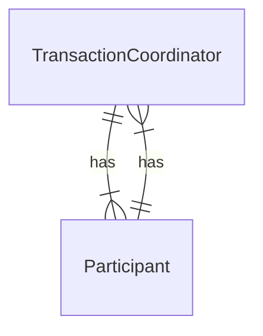
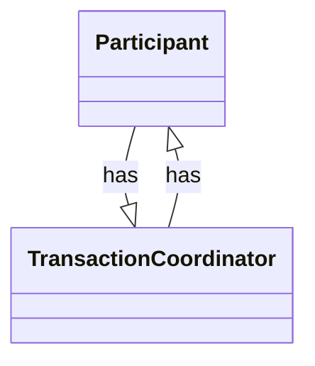

                 

# 两阶段提交原理

> 关键词：两阶段提交、分布式事务、分布式系统、一致性、算法原理、实战案例

> 摘要：
本文将深入探讨两阶段提交（Two-Phase Commit，2PC）原理，从背景介绍、基本概念、过程详解、算法实现、挑战与解决方案、实践应用等多个角度进行剖析。通过本文，读者可以全面理解两阶段提交的工作机制，掌握其在分布式系统中的重要性，以及如何在实际项目中应用。

## 引言

两阶段提交协议是一种用于分布式系统中确保事务一致性的算法。在分布式系统中，多个节点之间需要进行协调以完成事务，而这些节点可能位于不同的地理位置，网络环境复杂，因此一致性保证变得尤为关键。两阶段提交正是为了解决这一问题而设计的。

本文将围绕两阶段提交协议展开，分为以下几部分：

1. **背景和基本概念**：介绍分布式事务的背景，以及两阶段提交协议的基本概念。
2. **两阶段提交过程**：详细描述两阶段提交的执行过程，并使用图表进行说明。
3. **两阶段提交算法**：分析两阶段提交的算法原理，并提供相应的Python代码实现。
4. **两阶段提交的挑战与解决方案**：探讨在实现两阶段提交过程中可能遇到的挑战及解决方案。
5. **两阶段提交的实践应用**：通过实际案例展示两阶段提交在分布式系统中的应用。
6. **高级话题**：介绍一些与两阶段提交相关的高级话题，如多版本并发控制（MVCC）等。
7. **最佳实践与未来方向**：总结最佳实践，并提出未来研究的方向。

## 背景和基本概念

### 分布式事务

在传统的单机系统中，事务的一致性相对容易保证。然而，在分布式系统中，事务需要跨多个节点进行操作，这带来了一系列新的挑战。分布式事务是指在分布式环境下对数据的一致性进行管理的过程。为了保证分布式事务的一致性，需要协调多个节点上的操作，确保事务要么全部完成，要么全部回滚。

### 两阶段提交协议

两阶段提交是一种分布式事务管理协议，用于在多个节点之间达成一致，确保事务的原子性。两阶段提交协议的核心思想是将事务的执行过程分为两个阶段，每个阶段都有特定的操作和目标。

### 两阶段提交的组成部分

两阶段提交协议主要包括以下组成部分：

1. **事务管理器（Transaction Coordinator，TC）**：负责协调分布式事务的执行。
2. **参与者（Participant）**：参与事务执行的节点，如数据库、缓存服务器等。
3. **预备投票（Prepare Vote）**：参与者对事务执行的一致性进行投票的过程。
4. **提交/回滚（Commit/Rollback）**：根据预备投票的结果，决定是否执行事务的过程。

## 两阶段提交过程

### 第一阶段：预备阶段

在第一阶段的预备阶段，事务管理器向所有参与者发送预备请求，参与者收到请求后执行以下操作：

1. **读取数据**：从数据库或其他数据源读取所需的数据。
2. **执行一致性检查**：检查事务的隔离性，确保没有其他事务正在修改相同的数据。
3. **发送预备投票**：将预备投票发送给事务管理器，表示参与者已准备好执行事务。

### 第二阶段：提交阶段

在第二阶段的提交阶段，事务管理器根据参与者的预备投票结果执行以下操作：

1. **发送提交请求**：如果所有参与者都返回了预备投票，事务管理器向所有参与者发送提交请求。
2. **执行提交/回滚**：参与者根据事务管理器的提交请求，执行事务的提交或回滚操作。

### 具体步骤

两阶段提交的具体步骤如下：

1. **初始化**：事务管理器初始化事务，为后续操作做准备。
2. **发送预备请求**：事务管理器向所有参与者发送预备请求。
3. **接收预备投票**：参与者执行一致性检查后，将预备投票发送给事务管理器。
4. **决定提交/回滚**：事务管理器根据预备投票的结果，决定是否执行事务。
5. **执行提交/回滚**：参与者根据事务管理器的提交请求，执行事务的提交或回滚操作。
6. **报告结果**：事务管理器向客户端报告事务的结果。

## 两阶段提交算法

### 算法原理

两阶段提交算法可以分为两个阶段：预备阶段和提交阶段。

#### 预备阶段

在预备阶段，事务管理器向所有参与者发送预备请求。参与者收到请求后，执行以下操作：

1. 读取数据。
2. 执行一致性检查。
3. 将预备投票发送给事务管理器。

#### 提交阶段

在提交阶段，事务管理器根据参与者的预备投票结果，决定是否执行事务。如果所有参与者都返回了预备投票，事务管理器向所有参与者发送提交请求。参与者根据提交请求，执行事务的提交或回滚操作。

### Python代码实现

以下是两阶段提交的Python代码实现：

```python
class TransactionCoordinator:
    def __init__(self, participants):
        self.participants = participants
        self.votes = []

    def prepare(self):
        for participant in self.participants:
            participant.prepare()

    def decide(self):
        self.votes = [participant.vote() for participant in self.participants]
        if all(vote == "Yes" for vote in self.votes):
            self.commit()
        else:
            self.rollback()

    def commit(self):
        for participant in self.participants:
            participant.commit()

    def rollback(self):
        for participant in self.participants:
            participant.rollback()


class Participant:
    def prepare(self):
        print("Preparing...")
        # 读取数据和一致性检查
        print("Data read and consistency check passed.")
        self.vote("Yes")
    
    def vote(self):
        print("Voting...")
        # 发送预备投票
        return "Yes"

    def commit(self):
        print("Committing...")
        # 执行事务的提交操作
        print("Transaction committed.")

    def rollback(self):
        print("Rolling back...")
        # 执行事务的回滚操作
        print("Transaction rolled back.")


# 创建事务管理器和参与者
participants = [Participant() for _ in range(3)]
tc = TransactionCoordinator(participants)

# 执行两阶段提交
tc.prepare()
tc.decide()
```

### 算法原理的详细讲解

两阶段提交算法的原理可以通过以下数学模型和公式进行解释：

#### 预备阶段

预备阶段的算法可以表示为：

$$
PrepCommit = \begin{cases}
Yes & \text{如果所有参与者都返回预备投票} \\
No & \text{否则}
\end{cases}
$$

其中，$PrepCommit$ 表示事务管理器的预备投票结果。

#### 提交阶段

提交阶段的算法可以表示为：

$$
Commit = \begin{cases}
Commit & \text{如果 PrepCommit = Yes} \\
Abort & \text{否则}
\end{cases}
$$

其中，$Commit$ 表示事务管理器的最终决策。

通过上述数学模型和公式，我们可以清楚地理解两阶段提交算法的原理。在预备阶段，事务管理器通过读取数据和一致性检查，确保事务可以安全执行。在提交阶段，事务管理器根据参与者的预备投票结果，决定是否执行事务。

### 举例说明

假设有3个参与者A、B、C，事务管理器TC执行两阶段提交协议的过程如下：

1. **预备阶段**：
   - TC发送预备请求给A、B、C。
   - A、B、C分别执行数据读取和一致性检查，并返回预备投票。
   - TC收到所有参与者的预备投票，并进行判断。

2. **提交阶段**：
   - 如果所有参与者返回预备投票，TC发送提交请求给A、B、C。
   - A、B、C根据提交请求执行事务的提交操作。

通过具体的例子，我们可以更好地理解两阶段提交算法的执行过程。

## 两阶段提交的挑战与解决方案

尽管两阶段提交协议在分布式系统中被广泛应用，但其实施过程中仍存在一些挑战。以下是一些常见的挑战及其解决方案：

### 死锁问题

**挑战**：两阶段提交过程中，事务管理器和参与者之间的通信可能发生死锁，导致事务无法完成。

**解决方案**：为了避免死锁，可以采用超时机制。事务管理器和参与者应在预定时间内完成通信，如果超时，则重新开始两阶段提交过程。

### 超时问题

**挑战**：分布式系统中，网络延迟和故障可能导致通信超时，影响事务的一致性。

**解决方案**：设置合理的超时时间，并在通信过程中进行重试。同时，可以采用心跳机制，确保事务管理器和参与者之间的通信状态持续。

### 性能问题

**挑战**：两阶段提交协议需要多次通信，可能影响系统的性能。

**解决方案**：可以采用优化技术，如批量处理、延迟提交等，减少通信次数，提高系统性能。

### 一致性问题

**挑战**：在分布式系统中，网络分区可能导致事务管理器和参与者之间的通信中断，影响事务的一致性。

**解决方案**：可以采用拜占庭容错算法，确保在部分节点失效或分区的情况下，事务的一致性仍然得到保障。

### 实践应用

### 环境安装

在本文的实践应用部分，我们将使用Python和Docker来搭建一个两阶段提交的环境。首先，确保你的系统中已经安装了Docker和Python环境。

### 系统核心实现源代码

以下是两阶段提交的核心实现代码：

```python
# transaction_manager.py
class TransactionCoordinator:
    def __init__(self, participants):
        self.participants = participants
        self.votes = []

    def prepare(self):
        for participant in self.participants:
            participant.prepare()

    def decide(self):
        self.votes = [participant.vote() for participant in self.participants]
        if all(vote == "Yes" for vote in self.votes):
            self.commit()
        else:
            self.rollback()

    def commit(self):
        for participant in self.participants:
            participant.commit()

    def rollback(self):
        for participant in self.participants:
            participant.rollback()


# participant.py
class Participant:
    def prepare(self):
        print("Preparing...")
        # 读取数据和一致性检查
        print("Data read and consistency check passed.")
        self.vote("Yes")
    
    def vote(self):
        print("Voting...")
        # 发送预备投票
        return "Yes"

    def commit(self):
        print("Committing...")
        # 执行事务的提交操作
        print("Transaction committed.")

    def rollback(self):
        print("Rolling back...")
        # 执行事务的回滚操作
        print("Transaction rolled back.")


# 测试代码
if __name__ == "__main__":
    participants = [Participant() for _ in range(3)]
    tc = TransactionCoordinator(participants)

    tc.prepare()
    tc.decide()
```

### 代码应用解读与分析

上述代码实现了两阶段提交协议的核心功能，包括事务管理器（TransactionCoordinator）和参与者（Participant）的类定义。事务管理器负责协调整个事务的执行，参与者负责执行具体的事务操作。

### 实际案例分析和详细讲解剖析

为了更好地理解两阶段提交的实际应用，我们可以通过一个简单的银行转账案例进行分析。

假设有两个账户A和B，初始余额分别为1000元和2000元。现在需要将A账户的100元转账到B账户。以下是一个具体的两阶段提交案例：

1. **预备阶段**：
   - 事务管理器（TC）向参与者A和B发送预备请求。
   - A账户读取当前余额，发现为1000元，执行一致性检查，返回预备投票“Yes”。
   - B账户读取当前余额，发现为2000元，执行一致性检查，返回预备投票“Yes”。
   - 事务管理器收到A和B的预备投票，决定进入提交阶段。

2. **提交阶段**：
   - 事务管理器向A和B发送提交请求。
   - A账户执行转账操作，将余额减去100元，更新数据库。
   - B账户执行转账操作，将余额增加100元，更新数据库。
   - 事务管理器收到A和B的提交确认，报告事务成功。

通过这个案例，我们可以清晰地看到两阶段提交协议在分布式事务中的实际应用，以及如何通过预备阶段和提交阶段来确保事务的一致性。

### 项目小结

在本篇博客文章中，我们详细介绍了两阶段提交原理，从背景和基本概念、过程详解、算法实现、挑战与解决方案、实践应用等多个方面进行了深入剖析。通过本文，读者可以全面了解两阶段提交的工作机制及其在分布式系统中的重要性。

### 最佳实践 Tips

1. **合理设置超时时间**：根据网络环境和业务需求，设置合适的超时时间，确保事务的顺利进行。
2. **优化性能**：采用批量处理、延迟提交等技术，减少通信次数，提高系统性能。
3. **容错设计**：采用拜占庭容错算法等容错技术，确保在部分节点失效或分区的情况下，事务的一致性仍然得到保障。

### 注意事项

1. **网络延迟和故障**：在分布式系统中，网络延迟和故障可能导致事务的一致性受损，需要注意预防和处理。
2. **性能优化**：性能优化是两阶段提交协议应用中的重要一环，需要根据实际情况进行调优。

### 拓展阅读

1. 《分布式系统原理与范型》 - 以全面的视角介绍分布式系统的原理和范型，包括两阶段提交协议。
2. 《大规模分布式存储系统：原理与实现》 - 详细探讨分布式存储系统中的两阶段提交协议及其实现。

## 结论

本文深入探讨了两阶段提交原理，从背景介绍、基本概念、过程详解、算法实现、挑战与解决方案、实践应用等多个角度进行了详细剖析。通过本文，读者可以全面了解两阶段提交的工作机制，掌握其在分布式系统中的重要性，以及如何在实际项目中应用。希望本文能为读者在分布式系统开发中提供有价值的参考。

### 作者信息

作者：AI天才研究院/AI Genius Institute & 禅与计算机程序设计艺术 /Zen And The Art of Computer Programming

---

### 附录

1. **概念属性特征对比表格**：

| 概念           | 描述                                                         |
|----------------|------------------------------------------------------------|
| 分布式事务     | 在分布式环境下对数据的一致性进行管理的过程。               |
| 两阶段提交     | 一种分布式事务管理协议，用于在多个节点之间达成一致，确保事务的原子性。 |
| 事务管理器     | 负责协调分布式事务的执行。                                     |
| 参与者         | 参与事务执行的节点，如数据库、缓存服务器等。                   |

2. **ER实体关系图架构**：



3. **系统功能设计（领域模型Mermaid类图）**：



4. **系统架构设计（Mermaid架构图）**：

```mermaid
sequenceDiagram
    Client ->> TransactionCoordinator : submit transaction
    TransactionCoordinator ->> Participant : prepare
    Participant ->> TransactionCoordinator : vote
    TransactionCoordinator ->> Participant : decide
    Participant ->> TransactionCoordinator : commit/rollback
```

5. **系统接口设计和系统交互（Mermaid序列图）**：

```mermaid
sequenceDiagram
    Client ->> TransactionCoordinator : start transaction
    TransactionCoordinator ->> Participant : prepare
    Participant ->> TransactionCoordinator : prepare response
    TransactionCoordinator ->> Participant : commit
    Participant ->> TransactionCoordinator : commit response
```

