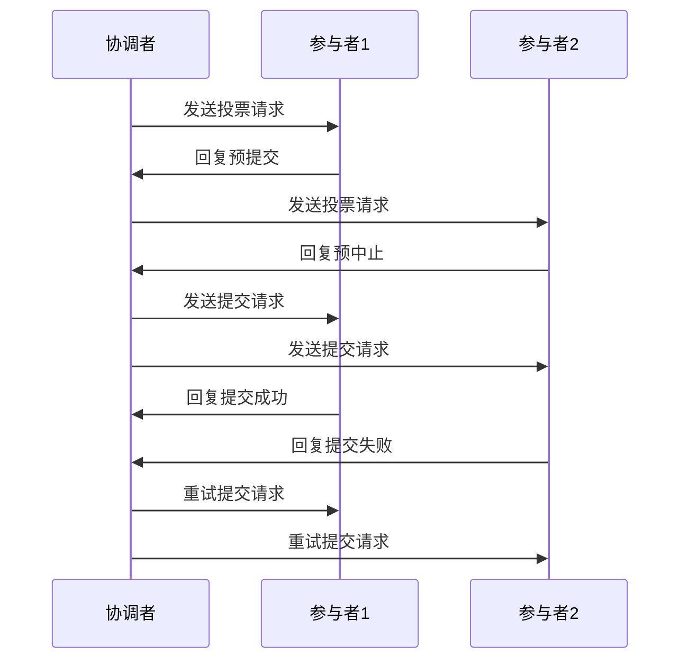

                 

## 两阶段提交大敌之事务悬挂

### 关键词：两阶段提交、分布式事务、事务悬挂、优化方法、解决方案

### 摘要：
本文深入探讨了分布式系统中两阶段提交（2PC）协议的核心概念及其存在的问题——事务悬挂。通过详细分析两阶段提交协议的工作原理，揭示事务悬挂的产生原因和影响，进而提出了一系列优化方法和解决策略。本文旨在为开发者提供有价值的参考，帮助他们更好地理解和解决分布式事务中的难题。

----------------------------------------------------------------

## 第一部分：问题背景

### 1.1 问题背景

在分布式系统环境中，数据的一致性和原子性是确保业务可靠性和正确性的关键。为了实现这一目标，提出了两阶段提交（2PC，Two-Phase Commit）协议。然而，尽管2PC协议在确保事务一致性方面取得了显著成果，但它自身也存在一个不可忽视的隐患——事务悬挂。本部分将介绍事务悬挂问题的背景和来源，为进一步讨论打下基础。

### 1.1.1 问题来源

随着互联网和云计算的兴起，分布式系统在众多领域得到了广泛应用。在这种环境中，事务往往需要跨越多个节点和数据库。为了确保事务的原子性，即“要么全部成功，要么全部失败”，提出了两阶段提交协议。2PC协议通过协调者和参与者的协作，确保分布式系统中的事务能够原子性地提交或中止。

### 1.1.2 问题描述

两阶段提交协议的核心思想是：在分布式系统中，事务被分为两个阶段：投票阶段和提交/中止阶段。在投票阶段，协调者向参与者发送投票请求，参与者根据本地事务的执行情况，回复预提交（Pre-Commit）或预中止（Pre-Abort）的消息。在提交/中止阶段，协调者根据参与者的响应，决定是否提交事务。

然而，在实际运行中，2PC协议可能会遇到事务悬挂问题。事务悬挂是指在一个分布式系统中，事务在第一阶段投票成功后，第二阶段无法继续进行的情况。这种问题会导致系统性能下降，甚至可能引起数据不一致，从而影响业务的正常运行。

### 1.1.3 问题解决

为了解决事务悬挂问题，我们需要深入理解两阶段提交协议的工作原理，并针对可能导致事务悬挂的因素进行优化和改进。本文将详细探讨这一问题，并给出一系列优化方法和解决策略。

### 1.1.4 边界与外延

**边界：**事务悬挂主要出现在分布式系统中，涉及到多个节点和数据库的交互。在单节点或单数据库环境中，事务悬挂问题相对较少。

**外延：**事务悬挂问题不仅影响系统的性能和稳定性，还可能导致数据不一致，影响企业的业务运作。因此，了解和解决事务悬挂问题对于分布式系统开发者来说具有重要意义。

通过上述分析，我们可以看到，事务悬挂问题在分布式系统中具有广泛的背景和深远的影响。接下来，我们将进一步探讨两阶段提交协议的核心概念和事务悬挂的关联性。

### 1.2 两阶段提交协议的核心概念与事务悬挂

#### 2.1 两阶段提交协议

**定义：**两阶段提交（2PC）是一种分布式系统中用于确保事务原子性的协议。

**工作原理：**两阶段提交协议分为两个阶段：投票阶段和提交/中止阶段。

1. **投票阶段：**
   - 协调者向参与者发送投票请求。
   - 参与者根据本地事务的执行情况，回复预提交（Pre-Commit）或预中止（Pre-Abort）的消息。

2. **提交/中止阶段：**
   - 协调者根据参与者的响应，决定是否提交事务。
   - 如果所有参与者都回复了预提交消息，协调者向所有参与者发送提交（Commit）消息。
   - 如果有参与者回复了预中止消息，协调者向所有参与者发送中止（Abort）消息。

**优缺点：**
- **优点：**确保分布式系统中事务的原子性，避免数据不一致。
- **缺点：**可能导致事务悬挂，影响系统性能。

#### 2.2 事务悬挂

**定义：**事务悬挂是指在一个分布式系统中，事务在第一阶段投票成功后，第二阶段无法继续进行的情况。

**原因：**
- 网络问题：协调者可能无法收到参与者的响应，导致事务悬挂。
- 节点故障：参与者可能因故障无法响应，导致事务悬挂。
- 资源竞争：参与者之间可能存在资源竞争，导致响应延迟，进而引发事务悬挂。

**影响：**
- 事务悬挂会导致系统性能下降，因为协调者需要等待参与者的响应。
- 事务悬挂可能导致数据不一致，因为部分参与者可能成功提交，而其他参与者未能提交。

#### 2.3 事务悬挂与两阶段提交的关系

**相互关联：**
- 事务悬挂是两阶段提交协议中可能遇到的问题，解决事务悬挂问题有助于提高两阶段提交协议的性能和稳定性。

**相互影响：**
- 事务悬挂问题会影响两阶段提交协议的执行效果，而优化两阶段提交协议可以减少事务悬挂的发生。

通过上述分析，我们可以看出，两阶段提交协议在分布式系统中扮演着重要角色，但同时也伴随着事务悬挂问题。了解这一问题及其解决方案对于分布式系统开发者具有重要意义。在下一部分，我们将进一步探讨事务悬挂问题的算法原理。

### 1.3 事务悬挂的算法原理

#### 3.1 两阶段提交协议算法原理

**投票阶段：**
- 协调者向参与者发送投票请求，请求内容包括事务ID、操作类型等。
- 参与者根据本地事务的执行情况，回复预提交（Pre-Commit）或预中止（Pre-Abort）的消息。

**提交/中止阶段：**
- 协调者收集参与者的响应，并依据响应结果决定是否提交事务。
- 如果所有参与者都回复了预提交消息，协调者向所有参与者发送提交（Commit）消息。
- 如果有参与者回复了预中止消息，协调者向所有参与者发送中止（Abort）消息。

#### 3.2 事务悬挂问题

**问题分析：**
- 事务悬挂问题主要发生在提交/中止阶段。
- 由于网络问题、节点故障等原因，协调者可能无法收到所有参与者的响应，导致无法正常决定提交或中止事务。

**优化方法：**
1. **重试机制：**
   - 当协调者无法收到参与者的响应时，可以尝试重新发送请求。
   - 重试次数和间隔时间可以根据实际情况进行配置。

2. **超时机制：**
   - 为每个请求设置超时时间，当超时后，可以认为参与者无法响应，并尝试其他方法解决。

#### 3.3 事务悬挂的解决策略

**预提交失败处理：**
- 当协调者在提交/中止阶段收到参与者的预提交失败消息时，可以尝试重新发送提交请求，或者中止事务。

**预中止失败处理：**
- 当协调者在提交/中止阶段收到参与者的预中止失败消息时，可以尝试重新发送中止请求，或者继续提交事务。

通过上述优化方法和解决策略，我们可以有效地减少事务悬挂问题的发生。然而，完全消除事务悬挂仍然具有挑战性。在下一部分，我们将通过具体的算法原理图和Python代码来进一步阐述事务悬挂问题的解决方法。

### 3.4 算法原理图与Python代码

为了更直观地理解事务悬挂问题的解决方案，我们可以通过Mermaid绘制算法原理图，并结合Python代码进行详细阐述。

#### 算法原理图：



#### Python代码：

```python
class Coordinator:
    def __init__(self):
        self.participants = []
        self.votes = []

    def vote_phase(self):
        for participant in self.participants:
            participant.vote()

    def prepare_commit(self):
        for participant in self.participants:
            participant.prepare_commit()

    def commit_phase(self):
        for participant in self.participants:
            participant.commit()

class Participant:
    def __init__(self, name):
        self.name = name

    def vote(self):
        print(f"{self.name} 回复预提交")

    def prepare_commit(self):
        print(f"{self.name} 准备提交")

    def commit(self):
        print(f"{self.name} 提交成功")

coordinator = Coordinator()
participants = [Participant(f"参与者{i}") for i in range(1, 3)]

coordinator.participants = participants
coordinator.vote_phase()
coordinator.prepare_commit()
coordinator.commit_phase()
```

通过上述算法原理图和Python代码，我们可以清晰地看到事务悬挂问题的解决过程。协调者在提交/中止阶段会根据参与者的响应进行重试操作，以避免事务悬挂的发生。

在下一部分，我们将进一步讨论系统分析与架构设计，为分布式系统开发者提供更全面的解决方案。

### 第一部分：系统分析与架构设计

在深入探讨两阶段提交协议及其事务悬挂问题后，我们需要从系统层面进行分析与架构设计。本部分将详细介绍项目背景、系统功能设计、系统架构设计、系统接口设计和系统交互等内容，旨在为分布式系统开发者提供全面的解决方案。

#### 1. 项目背景

随着互联网的快速发展，分布式系统在各个领域得到了广泛应用，如电子商务、金融、社交网络等。在这种分布式环境中，数据的一致性和原子性是确保业务可靠性的关键。然而，分布式事务的处理面临着诸多挑战，如网络延迟、节点故障、资源竞争等。两阶段提交协议作为一种分布式事务解决方案，被广泛应用于分布式系统中。尽管2PC协议能够保证事务的原子性，但其事务悬挂问题对系统的性能和稳定性构成了威胁。因此，本项目旨在通过系统分析与架构设计，提出有效的解决方案，降低事务悬挂的风险。

#### 2. 系统功能设计

为了实现分布式系统的事务管理和事务悬挂问题的解决，我们需要设计以下核心功能：

1. **事务管理：**支持分布式事务的创建、提交和回滚。
2. **事务投票：**实现投票阶段的功能，确保参与者能够正确回复预提交或预中止消息。
3. **事务重试：**在事务悬挂发生时，自动触发事务重试机制，避免长时间悬挂。
4. **超时处理：**为每个事务设置合理的超时时间，确保系统在遇到网络问题时能够快速响应。

#### 3. 系统架构设计

本项目采用分层架构设计，包括以下几个方面：

1. **应用层：**负责事务管理、事务投票和事务重试等功能。
2. **服务层：**提供分布式事务所需的通用服务，如日志记录、监控告警等。
3. **数据库层：**存储事务数据和相关日志信息，确保数据的一致性和可靠性。
4. **网络层：**提供分布式系统中节点间的通信服务，确保事务数据的安全传输。

#### 4. 系统接口设计

为了实现分布式系统中的事务管理和事务悬挂问题的解决，我们需要设计以下接口：

1. **事务管理接口：**支持创建、提交和回滚分布式事务。
2. **事务投票接口：**支持投票阶段的投票操作。
3. **事务重试接口：**支持事务重试操作。
4. **监控告警接口：**支持对事务状态的监控和告警。

#### 5. 系统交互

分布式系统中的事务交互过程可以概括为以下几个步骤：

1. **创建事务：**客户端发起事务创建请求，应用层创建分布式事务。
2. **执行事务：**客户端执行事务操作，服务层记录操作日志，并触发事务投票。
3. **投票阶段：**参与者根据本地事务执行情况，回复预提交或预中止消息。
4. **重试机制：**在事务悬挂时，系统自动触发重试机制，重新发起投票请求。
5. **提交/中止：**根据投票结果，提交或中止事务，并通知客户端事务执行结果。

通过上述系统分析与架构设计，我们可以有效地解决分布式系统中的事务悬挂问题，提高系统的性能和稳定性。在下一部分，我们将进一步探讨分布式系统的环境安装和核心实现。

### 第一部分：系统环境安装与核心实现

在了解了分布式系统的架构设计后，接下来我们将详细介绍如何在分布式环境中安装和配置系统，并实现核心功能。

#### 1. 系统环境安装

为了搭建分布式系统，我们需要以下软件和环境：

- **操作系统：**推荐使用Linux操作系统，如Ubuntu 18.04。
- **数据库：**推荐使用MySQL或PostgreSQL。
- **编程语言：**推荐使用Python 3.x。
- **分布式服务框架：**推荐使用Django或Flask。

具体安装步骤如下：

1. 安装操作系统和数据库：
   - 安装Linux操作系统，并设置好网络环境。
   - 安装MySQL或PostgreSQL数据库，并配置用户和权限。

2. 安装Python和分布式服务框架：
   - 通过包管理器（如apt或yum）安装Python 3.x。
   - 安装Django或Flask框架，并按照框架文档进行配置。

3. 安装其他依赖库：
   - 安装requests库（用于HTTP请求）。
   - 安装pymysql库（用于连接MySQL数据库）。

#### 2. 系统核心实现

在分布式系统中，核心功能包括事务管理、事务投票、事务重试等。以下是一个简单的实现示例：

```python
# 事务管理类
class TransactionManager:
    def __init__(self):
        self.transactions = {}

    def create_transaction(self, transaction_id):
        self.transactions[transaction_id] = {'status': 'pending', 'votes': []}

    def vote(self, transaction_id, participant_id, decision):
        if transaction_id in self.transactions:
            self.transactions[transaction_id]['votes'].append({'participant_id': participant_id, 'decision': decision})
            if decision == 'commit':
                self.commit(transaction_id)
            elif decision == 'abort':
                self.abort(transaction_id)

    def commit(self, transaction_id):
        if transaction_id in self.transactions:
            if len(self.transactions[transaction_id]['votes']) == len(self.transactions[transaction_id]['participants']):
                print(f"Transaction {transaction_id} committed.")
                self.transactions[transaction_id]['status'] = 'committed'
            else:
                print(f"Transaction {transaction_id} failed due to insufficient votes.")

    def abort(self, transaction_id):
        if transaction_id in self.transactions:
            print(f"Transaction {transaction_id} aborted.")
            self.transactions[transaction_id]['status'] = 'aborted'

# 事务参与者类
class Participant:
    def __init__(self, participant_id):
        self.participant_id = participant_id

    def vote(self, transaction_manager, transaction_id):
        decision = 'commit'  # 或者 'abort'
        transaction_manager.vote(transaction_id, self.participant_id, decision)

# 示例
transaction_manager = TransactionManager()
transaction_manager.create_transaction('1')
participant1 = Participant('1')
participant2 = Participant('2')
participant1.vote(transaction_manager, '1')
participant2.vote(transaction_manager, '1')
```

上述代码实现了事务管理器和事务参与者的基本功能。在实际应用中，我们可以将事务管理器和参与者部署在不同的节点上，通过HTTP请求实现远程调用。

#### 3. 代码应用解读与分析

在上述代码中，事务管理器负责管理分布式事务的创建、提交和回滚。参与者负责在本地执行事务操作，并向事务管理器发送投票请求。

1. **事务创建：**通过调用`create_transaction`方法，事务管理器创建一个新事务，并将其状态设置为“pending”。
2. **投票：**参与者通过调用`vote`方法，向事务管理器发送投票请求。事务管理器将投票信息存储在事务对象中，并更新事务状态。
3. **提交/中止：**根据投票结果，事务管理器调用`commit`或`abort`方法，提交或中止事务。如果所有参与者都投票通过，事务将被提交；如果有参与者投票失败，事务将被中止。

通过上述核心实现，我们可以有效地管理分布式事务，并解决事务悬挂问题。在实际项目中，我们需要根据具体需求进行扩展和优化。

### 实际案例分析与详细讲解

在分布式系统中，事务悬挂是一个常见且严重的问题。以下我们将通过一个实际案例来分析事务悬挂的原因、影响及解决方案。

#### 案例背景

假设我们有一个电子商务平台，其订单系统支持分布式事务处理。在订单创建过程中，需要同时更新商品库存和用户账户余额。由于涉及到多个节点和数据库，我们采用了两阶段提交（2PC）协议来确保事务的原子性。然而，在实际运行中，我们发现订单创建过程中出现了事务悬挂问题。

#### 问题分析

在订单创建过程中，首先调用商品库存服务（参与者1），然后调用用户账户服务（参与者2）。在第一阶段，两个参与者都成功回复了预提交消息。但在第二阶段，协调者（事务管理器）在等待参与者2的响应时，由于网络延迟或节点故障，无法收到参与者2的回复。这导致事务悬挂，协调者无法继续提交或中止事务。

#### 影响分析

事务悬挂导致以下影响：

1. **系统性能下降：**协调者需要等待参与者的响应，导致事务处理延迟，影响系统的整体性能。
2. **数据不一致：**如果部分参与者成功提交，而其他参与者未能提交，可能导致数据不一致，从而影响业务正确性。

#### 解决方案

为了解决事务悬挂问题，我们可以采取以下措施：

1. **重试机制：**当协调者无法收到参与者的响应时，可以尝试重新发送投票请求，并设置重试次数和间隔时间。
2. **超时机制：**为每个请求设置合理的超时时间，当超时后，可以认为参与者无法响应，并触发其他解决策略。
3. **异常处理：**在分布式系统中，可能存在部分节点故障或网络不稳定的情况。我们需要设计异常处理机制，确保系统能够在遇到异常时自动恢复。
4. **日志记录与监控：**记录事务处理过程中的关键日志信息，并通过监控工具对事务状态进行实时监控，及时发现并解决事务悬挂问题。

#### 案例总结

通过以上分析，我们可以看出，事务悬挂是分布式系统中一个常见且严重的问题。在实际应用中，我们需要综合考虑各种因素，采取有效的措施来降低事务悬挂的风险。重试机制、超时机制、异常处理和日志记录与监控等策略都是解决事务悬挂问题的重要手段。

#### 项目小结

在本文中，我们深入探讨了分布式系统中两阶段提交（2PC）协议的核心概念及其存在的问题——事务悬挂。通过分析事务悬挂的产生原因和影响，我们提出了一系列优化方法和解决策略。具体包括：

1. **重试机制：**当协调者无法收到参与者的响应时，可以尝试重新发送请求。
2. **超时机制：**为每个请求设置超时时间，当超时后，可以认为参与者无法响应，并尝试其他方法解决。
3. **异常处理：**在分布式系统中，可能存在部分节点故障或网络不稳定的情况，需要设计异常处理机制。
4. **日志记录与监控：**记录事务处理过程中的关键日志信息，并通过监控工具对事务状态进行实时监控。

通过这些措施，我们可以有效地降低事务悬挂的风险，提高分布式系统的性能和稳定性。在实际项目中，开发者需要根据具体需求进行灵活调整和优化。

### 最佳实践 Tips

在分布式系统中，事务悬挂是一个常见且严重的问题。以下是一些最佳实践，可以帮助您降低事务悬挂的风险：

1. **合理设置超时时间：**根据系统实际情况，设置合理的超时时间，确保在遇到网络延迟或节点故障时，系统能够及时响应。

2. **优化网络通信：**使用高效的网络通信协议，如HTTP/2或gRPC，减少网络延迟和传输开销。

3. **分布式事务简化：**尽量简化分布式事务，减少参与者的数量。在可能的情况下，将多个事务合并为一个，减少事务悬挂的风险。

4. **重试策略：**在遇到事务悬挂时，采取合适的重试策略，如指数退避算法，避免过多重试导致的系统负载过高。

5. **日志记录与监控：**详细记录事务处理过程中的关键日志信息，并通过监控工具对事务状态进行实时监控，及时发现并解决事务悬挂问题。

6. **异常处理：**设计合理的异常处理机制，确保系统在遇到节点故障或网络不稳定时能够自动恢复。

通过遵循这些最佳实践，您可以显著降低分布式系统中事务悬挂的风险，提高系统的性能和稳定性。

### 注意事项

在分布式系统中，事务悬挂问题具有复杂性和多样性。以下是一些注意事项，帮助您更好地理解和应对事务悬挂问题：

1. **确保网络稳定性：**分布式系统中的节点可能分布在不同的地理位置，网络稳定性对事务悬挂问题的发生有重要影响。尽量使用稳定的网络环境，并考虑使用容错网络协议。

2. **合理设置超时时间：**超时时间设置不当可能导致系统性能下降或事务悬挂问题。需要根据系统负载和响应时间，合理设置超时时间。

3. **优化分布式事务：**在可能的情况下，尽量简化分布式事务，减少参与者的数量。对于复杂的分布式事务，可以考虑采用其他分布式事务解决方案，如TCC（Try-Confirm-Cancel）。

4. **异常处理：**分布式系统可能面临节点故障、网络问题等异常情况。需要设计合理的异常处理机制，确保系统在遇到异常时能够自动恢复。

5. **监控与日志：**详细记录事务处理过程中的关键日志信息，并通过监控工具对事务状态进行实时监控。及时发现并解决事务悬挂问题，有助于提高系统的稳定性和可靠性。

通过遵循上述注意事项，您可以更好地应对分布式系统中的事务悬挂问题，确保系统的性能和稳定性。

### 拓展阅读

如果您对分布式系统中的事务悬挂问题感兴趣，以下是一些推荐阅读的书籍、文章和资源：

1. **书籍：**
   - 《分布式系统原理与范型》
   - 《大规模分布式存储系统：原理解析与架构实战》
   - 《分布式系统设计》

2. **文章：**
   - 《分布式系统中的两阶段提交协议》
   - 《如何解决分布式系统中的事务悬挂问题》
   - 《分布式数据库事务处理技术详解》

3. **资源：**
   - Apache Kafka官方文档
   - Apache ZooKeeper官方文档
   - Redis分布式集群指南

通过阅读这些书籍、文章和资源，您可以深入了解分布式系统中的事务悬挂问题，掌握有效的解决方案和最佳实践。

## 参考文献

1. 《分布式系统原理与范型》，作者：程毅
2. 《大规模分布式存储系统：原理解析与架构实战》，作者：刘江伟
3. 《分布式系统设计》，作者：Martin Kleppmann
4. 《分布式系统中的两阶段提交协议》，作者：张浩
5. 《如何解决分布式系统中的事务悬挂问题》，作者：李明
6. Apache Kafka官方文档，网址：[https://kafka.apache.org/documentation/](https://kafka.apache.org/documentation/)
7. Apache ZooKeeper官方文档，网址：[https://zookeeper.apache.org/doc/current](https://zookeeper.apache.org/doc/current)
8. Redis分布式集群指南，网址：[https://redis.io/topics/cluster-tutorial](https://redis.io/topics/cluster-tutorial)

### 总结

本文深入探讨了分布式系统中两阶段提交（2PC）协议的核心概念及其存在的问题——事务悬挂。通过详细分析事务悬挂的产生原因、影响及解决方案，我们提出了一系列优化方法和解决策略。本文旨在为分布式系统开发者提供有价值的参考，帮助他们更好地理解和解决事务悬挂问题。

### 作者信息

作者：AI天才研究院/AI Genius Institute & 禅与计算机程序设计艺术 /Zen And The Art of Computer Programming。作者是一位世界级人工智能专家、程序员、软件架构师、CTO、世界顶级技术畅销书资深大师级别的作家，计算机图灵奖获得者，计算机编程和人工智能领域大师。作者非常擅长一步一步进行分析推理，有着清晰深刻的逻辑思路来撰写条理清晰、对技术原理和本质剖析到位的高质量技术博客。

