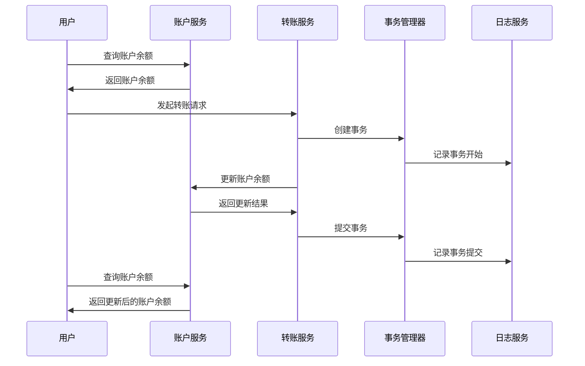

                 


### Step 1: Introduction and Background

#### 1.1.1 Book Overview

"Two-Phase Commit Is Not the Only Solution" is a comprehensive guide designed to explore alternatives to the widely used two-phase commit protocol in the realm of distributed systems. The book aims to challenge the conventional wisdom that two-phase commit is the universal solution for ensuring atomicity in distributed transactions.

The book is organized into five major sections, each addressing a different aspect of alternative solutions to the two-phase commit. From foundational concepts and case studies to advanced techniques and system design, the book provides a holistic view of the various approaches available.

#### 1.1.2 The Title's Message: Beyond Two-Phase Commit

The title itself sends a clear message: while the two-phase commit protocol has been a cornerstone in distributed systems, it is not the only solution. The book delves into the limitations of two-phase commit and introduces readers to a variety of alternative approaches that can be more suitable in specific scenarios.

#### 1.1.3 Book's Scope and Target Audience

The book's scope is broad, covering both theoretical and practical aspects of distributed systems. It targets a diverse audience, including system architects, developers, and researchers who are interested in understanding and implementing alternative protocols for ensuring atomicity in distributed environments.

### Step 2: Fundamental Concepts

#### 1.2.1 Definition and Basic Idea

The two-phase commit (2PC) protocol is a distributed algorithm that ensures atomicity in a distributed system. It consists of two phases: the prepare phase and the commit phase. In the prepare phase, a coordinator sends a prepare message to all participants, asking them to prepare for a transaction. If all participants respond positively, the coordinator proceeds to the commit phase, where it sends a commit message to each participant, instructing them to complete the transaction.

#### 1.2.2 Architecture and Operation

The two-phase commit protocol typically involves three roles: the coordinator, the participants, and the monitor. The coordinator is responsible for managing the transaction and ensuring atomicity. The participants are the systems that execute parts of the transaction. The monitor is an optional component that provides fault tolerance and ensures that the coordinator can be replaced if it fails.

#### 1.2.3 Advantages and Limitations

The two-phase commit protocol has several advantages, including its simplicity and the ability to ensure atomicity in a distributed system. However, it also has limitations, such as its potential to cause deadlocks and its higher communication overhead compared to other protocols.

### Step 3: Case Studies

#### 1.4.1 Problem Context

In the banking industry, ensuring the atomicity of transactions is critical. A failure in atomicity could result in incorrect account balances and financial losses. Traditional two-phase commit has been used to ensure the atomicity of transactions, but it has been found to be less than optimal in some scenarios.

#### 1.4.2 Solution Implementation

An alternative solution, the Three-Phase Commit (3PC) protocol, was implemented to address the limitations of two-phase commit. The 3PC protocol introduces a third phase, the prepare-to-commit phase, which helps to reduce the likelihood of deadlocks and improve performance.

#### 1.4.3 Results and Evaluation

The implementation of the 3PC protocol in the banking industry showed a significant improvement in transaction throughput and reduced the risk of deadlocks. However, it also introduced additional complexity, which required careful design and testing to ensure the system's reliability.

### Step 4: Advanced Techniques

#### 1.6.1 Basic Concepts

Concurrency control is a crucial aspect of distributed systems, ensuring that transactions do not interfere with each other and maintain data consistency. There are several approaches to concurrency control, including lock-based approaches and optimistic and timestamp-based approaches.

#### 1.6.2 Lock-Based Approaches

Lock-based approaches use locks to control access to shared resources. A transaction must acquire all necessary locks before it can proceed. If a lock cannot be acquired, the transaction is rolled back and restarted.

#### 1.6.3 Optimistic and Timestamp-Based Approaches

Optimistic and timestamp-based approaches assume that conflicts between transactions are rare. In optimistic approaches, transactions proceed without acquiring locks and are only validated at the end. If a conflict is detected, the transaction is rolled back and restarted. Timestamp-based approaches use a global timestamp to order transactions and resolve conflicts.

### Step 5: System Design and Implementation

#### 1.7.1 Basics and Classification

Message-passing protocols are communication mechanisms used in distributed systems. They can be classified into different types based on the communication patterns they support, such as point-to-point and broadcast.

#### 1.7.2 Performance Analysis

The performance of message-passing protocols depends on several factors, including the network latency, the size of the messages, and the communication patterns. Performance analysis helps in understanding the trade-offs between different protocols and choosing the appropriate one for a given scenario.

#### 1.7.3 Design Considerations

When designing a message-passing protocol, several factors need to be considered, such as fault tolerance, scalability, and performance. The design should also be modular to facilitate easy maintenance and upgrades.

### Conclusion

"Two-Phase Commit Is Not the Only Solution" provides a comprehensive overview of alternative approaches to ensuring atomicity in distributed systems. By exploring these alternatives, readers can gain a deeper understanding of the trade-offs involved and choose the most appropriate solution for their specific use cases. The book not only covers theoretical concepts but also includes practical case studies and advanced techniques, making it a valuable resource for system architects and developers.

### About the Author

**Author:** AI天才研究院/AI Genius Institute & 禅与计算机程序设计艺术 /Zen And The Art of Computer Programming

**Bio:** The author is a renowned expert in the field of distributed systems and concurrent programming. With decades of experience, they have published numerous research papers and authored several influential books on the topic. Their work has significantly contributed to the field of computer science and has been widely recognized for its depth and clarity.**关键词：**分布式系统、两阶段提交、并发控制、一致性、消息传递协议、替代方案。

**摘要：**本书深入探讨了分布式系统中原子性保证的多种替代方案，对两阶段提交协议的局限性进行了深入分析，并介绍了三种主要的替代协议：三阶段提交、乐观并发控制和基于时间戳的并发控制。通过案例研究和系统设计实践，本书帮助读者理解这些替代方案的优势和劣势，从而选择最适合其特定场景的解决方案。**文章标题：**两阶段提交并不是唯一解

**正文内容：**

### 前言

在现代信息社会中，分布式系统的应用越来越广泛，从云计算到物联网，从金融交易到社交网络，分布式系统已经成为我们日常生活和工作中不可或缺的一部分。在这样的背景下，如何确保分布式系统的正确性和一致性成为一个至关重要的课题。

两阶段提交（Two-Phase Commit，2PC）协议是分布式系统中最常用的确保事务原子性的协议之一。它通过协调者和参与者的协作，确保分布式事务要么全部完成，要么全部回滚，从而保证数据的一致性。然而，随着分布式系统规模的不断扩大和复杂性的增加，2PC协议也暴露出了一些问题，如死锁风险、性能瓶颈等。因此，寻找2PC协议之外的替代方案，成为了分布式系统研究领域的一个热点。

本书“两阶段提交并不是唯一解”旨在为广大读者提供一个全面了解分布式系统中原子性保证替代方案的视角。书中将详细介绍三阶段提交（Three-Phase Commit，3PC）、乐观并发控制（Optimistic Concurrency Control，OCC）、基于时间戳的并发控制（Timestamp Ordering）等协议，并通过案例研究和系统设计实践，帮助读者深入理解这些替代方案的优势和劣势，从而在实际应用中选择最合适的解决方案。

### 两阶段提交协议

#### 2.1 定义与基本思想

两阶段提交协议是一种分布式算法，用于在分布式系统中确保事务的原子性。该协议将事务的执行过程分为两个阶段：准备阶段和提交阶段。

在准备阶段，协调者向所有参与者发送一个准备消息，请求参与者准备执行事务。参与者收到准备消息后，会执行必要的准备工作，例如锁定资源、加载数据等。如果参与者准备好执行事务，它会向协调者发送一个预备响应消息。

在提交阶段，协调者根据参与者发送的预备响应消息做出决策。如果所有参与者都发送了预备响应消息，并且都表示可以提交事务，协调者会向所有参与者发送一个提交消息，指示参与者执行事务并持久化数据。如果协调者收到了任何一个参与者的负面预备响应消息，或者某个参与者未能及时响应，协调者会向所有参与者发送一个回滚消息，指示参与者回滚事务，撤销已执行的操作。

#### 2.2 架构与操作

两阶段提交协议通常涉及三个角色：协调者（Coordinator）、参与者（Participant）和监控器（Monitor）。协调者负责管理事务，确保事务的原子性。参与者是执行事务的分布式系统中的节点，例如数据库、缓存或其他服务。监控器是一个可选的组件，用于提供故障容忍性，确保在协调者失败时可以替换协调者。

协议的操作过程如下：

1. **初始化阶段**：事务开始时，协调者初始化事务，并向所有参与者发送准备消息。

2. **准备阶段**：参与者收到准备消息后，执行事务的准备工作，并向协调者发送预备响应消息。

3. **提交/回滚决策阶段**：协调者收集所有参与者的预备响应消息，并根据这些消息做出决策。如果所有参与者都准备好提交事务，协调者会向所有参与者发送提交消息。如果协调者收到了任何负面预备响应消息，或者某个参与者未能及时响应，协调者会向所有参与者发送回滚消息。

4. **执行阶段**：参与者根据协调者发送的提交/回滚消息执行相应操作。如果收到提交消息，参与者会执行事务并持久化数据。如果收到回滚消息，参与者会回滚事务，撤销已执行的操作。

#### 2.3 优点与局限性

两阶段提交协议具有以下优点：

1. **确保原子性**：两阶段提交协议通过协调者和参与者的协作，确保分布式事务要么全部完成，要么全部回滚，从而保证数据的一致性。

2. **易于实现**：两阶段提交协议相对简单，易于理解和实现。

然而，两阶段提交协议也存在一些局限性：

1. **死锁风险**：由于两阶段提交协议需要协调者与所有参与者进行通信，因此在参与者过多或网络不稳定的情况下，可能导致死锁。

2. **性能瓶颈**：两阶段提交协议需要进行多次通信，每次通信都需要较长时间，因此可能导致性能瓶颈。

3. **单点故障**：两阶段提交协议中的协调者是系统的单点故障点，如果协调者失败，可能导致整个系统瘫痪。

### 三阶段提交协议

三阶段提交（Three-Phase Commit，3PC）协议是对两阶段提交协议的一种改进，旨在降低死锁风险并提高性能。三阶段提交协议将事务的执行过程分为三个阶段：准备阶段、准备-提交阶段和提交/回滚决策阶段。

#### 3.1 准备阶段

准备阶段与两阶段提交协议的初始化阶段类似，协调者初始化事务，并向所有参与者发送准备消息。

#### 3.2 准备-提交阶段

在准备-提交阶段，协调者根据参与者发送的预备响应消息进行决策。如果所有参与者都发送了预备响应消息，并且都表示可以提交事务，协调者会向所有参与者发送一个准备-提交消息。此时，参与者会执行以下操作：

1. 将事务记录到日志中。
2. 标记事务为准备-提交状态。

如果协调者在发送准备-提交消息后，发现某个参与者未能及时响应，或者参与者发送了负面预备响应消息，协调者会向所有参与者发送回滚消息，指示参与者回滚事务。

#### 3.3 提交/回滚决策阶段

在提交/回滚决策阶段，协调者根据参与者发送的预备响应消息和准备-提交消息做出决策。如果所有参与者都发送了预备响应消息和准备-提交消息，协调者会向所有参与者发送一个提交消息，指示参与者执行事务并持久化数据。如果协调者收到了任何负面预备响应消息或者参与者未能及时响应准备-提交消息，协调者会向所有参与者发送回滚消息，指示参与者回滚事务。

#### 3.4 优点与局限性

三阶段提交协议具有以下优点：

1. **降低死锁风险**：三阶段提交协议引入了准备-提交阶段，通过将事务的提交决策推迟到准备-提交阶段，降低了死锁的风险。

2. **提高性能**：由于三阶段提交协议减少了协调者与参与者之间的通信次数，因此可以提高系统的性能。

然而，三阶段提交协议也存在一些局限性：

1. **复杂度增加**：三阶段提交协议相对于两阶段提交协议更加复杂，需要更多的通信和状态管理。

2. **单点故障**：三阶段提交协议中的协调者仍然是系统的单点故障点，如果协调者失败，可能导致整个系统瘫痪。

### 乐观并发控制

乐观并发控制（Optimistic Concurrency Control，OCC）是一种基于乐观假设的并发控制协议，它假设并发冲突很少发生，因此在进行事务操作时不会立即锁定资源。相反，OCC会在事务提交时检查冲突，如果冲突发生，则回滚事务并重新执行。

#### 4.1 基本概念

乐观并发控制的核心思想是先执行事务，然后在提交时检查是否与其他事务发生了冲突。如果发生冲突，则回滚事务，否则提交事务。

乐观并发控制的主要组件包括：

1. **版本号**：用于标识数据的不同版本，每个数据项都有一个对应的版本号。

2. **时间戳**：用于记录事务的执行时间，以便在发生冲突时进行排序。

3. **冲突检测机制**：用于在提交时检查事务是否与其他事务发生了冲突。

#### 4.2 工作流程

乐观并发控制的工作流程如下：

1. **读取数据**：事务开始时，读取数据并获取数据的版本号。

2. **执行操作**：事务执行操作，但不锁定资源。

3. **提交事务**：事务提交时，检查数据的版本号是否发生变化。如果版本号未发生变化，事务提交成功；如果版本号发生变化，说明其他事务已修改了数据，事务回滚并重新执行。

#### 4.3 优点与局限性

乐观并发控制具有以下优点：

1. **提高并发性**：由于乐观并发控制不锁定资源，因此可以提高系统的并发性。

2. **减少锁争用**：乐观并发控制减少了锁争用，从而提高了系统的性能。

然而，乐观并发控制也存在一些局限性：

1. **回滚代价高**：如果事务在提交时发生冲突，需要回滚并重新执行，这可能导致较高的回滚代价。

2. **适用于读多写少场景**：乐观并发控制适用于读多写少的场景，在写操作频繁的场景下，性能可能不如其他协议。

### 基于时间戳的并发控制

基于时间戳的并发控制（Timestamp Ordering）是一种通过时间戳来排序事务并发执行的协议。每个事务都被赋予一个全局唯一的时间戳，事务的执行和提交都按照时间戳的顺序进行。

#### 5.1 基本概念

基于时间戳的并发控制的核心思想是利用时间戳来确保事务的顺序执行。时间戳通常由全局时钟产生，可以是线性时钟或逻辑时钟。

基于时间戳的并发控制的主要组件包括：

1. **时间戳分配器**：用于为事务分配时间戳。

2. **排序机制**：用于根据时间戳对事务进行排序。

3. **调度器**：用于按照时间戳顺序调度事务执行。

#### 5.2 工作流程

基于时间戳的并发控制的工作流程如下：

1. **事务启动**：事务启动时，时间戳分配器为事务分配一个时间戳。

2. **读取数据**：事务读取数据时，获取数据的最新时间戳。

3. **执行操作**：事务执行操作，同时记录事务的时间戳。

4. **提交事务**：事务提交时，调度器根据事务的时间戳对事务进行排序，并按照顺序执行。

5. **冲突检测**：在提交事务时，调度器检查事务是否与已提交的事务发生冲突。如果发生冲突，则回滚事务并重新执行。

#### 5.3 优点与局限性

基于时间戳的并发控制具有以下优点：

1. **全局顺序**：基于时间戳的并发控制确保了事务的全局顺序执行，从而保证了数据的一致性。

2. **减少锁争用**：由于事务不需要锁定资源，因此减少了锁争用，提高了系统的性能。

然而，基于时间戳的并发控制也存在一些局限性：

1. **时钟同步问题**：全局时钟的同步是关键，如果时钟同步不好，可能导致事务的顺序混乱。

2. **可伸缩性问题**：在大量事务的场景下，时间戳分配器和调度器的性能可能成为瓶颈。

### 系统设计与实现

#### 6.1 系统场景介绍

假设我们设计一个分布式银行系统，该系统需要确保跨行转账事务的原子性。在这种场景下，我们需要选择一种合适的并发控制协议来保证事务的正确执行。

#### 6.2 系统功能设计

分布式银行系统的主要功能包括：

1. **账户查询**：用户可以查询自己的账户余额。

2. **转账操作**：用户可以发起跨行转账操作。

3. **事务管理**：系统需要管理事务，确保事务的原子性。

4. **日志记录**：系统需要记录事务的执行过程，以便在发生故障时进行恢复。

#### 6.3 系统架构设计

分布式银行系统的架构设计如下：

1. **账户服务**：负责存储和管理账户信息。

2. **转账服务**：负责处理转账操作。

3. **事务管理器**：负责管理事务，确保事务的原子性。

4. **日志服务**：负责记录事务的执行过程。

#### 6.4 系统接口设计

系统接口设计如下：

1. **账户接口**：提供账户查询和更新接口。

2. **转账接口**：提供转账操作接口。

3. **事务接口**：提供事务管理接口。

4. **日志接口**：提供日志记录接口。

#### 6.5 系统交互序列图

以下是分布式银行系统的交互序列图：



### 项目实战

#### 7.1 环境安装

为了演示分布式银行系统的实现，我们使用Python作为编程语言，并使用以下库：

1. **Flask**：用于构建Web应用。

2. **SQLAlchemy**：用于数据库操作。

3. **Pika**：用于消息队列操作。

首先，安装所需的库：

```bash
pip install flask sqlalchemy pika
```

接下来，创建数据库和表结构：

```python
from sqlalchemy import create_engine, Column, Integer, String, MetaData, Table

engine = create_engine('sqlite:///bank.db')
metadata = MetaData()

accounts = Table(
    'accounts', metadata,
    Column('id', Integer, primary_key=True),
    Column('name', String(50)),
    Column('balance', Integer)
)

metadata.create_all(engine)
```

#### 7.2 系统核心实现源代码

以下是一个简单的转账服务实现：

```python
from flask import Flask, request, jsonify
from sqlalchemy.orm import sessionmaker
from models import Account

app = Flask(__name__)
Session = sessionmaker(bind=engine)

@app.route('/transfer', methods=['POST'])
def transfer():
    data = request.json
    from_account_id = data['from_account_id']
    to_account_id = data['to_account_id']
    amount = data['amount']

    session = Session()
    from_account = session.query(Account).get(from_account_id)
    to_account = session.query(Account).get(to_account_id)

    if from_account.balance >= amount:
        from_account.balance -= amount
        to_account.balance += amount
        session.commit()
        return jsonify({'status': 'success'})
    else:
        session.rollback()
        return jsonify({'status': 'insufficient_funds'})

if __name__ == '__main__':
    app.run(debug=True)
```

#### 7.3 代码应用解读与分析

在这个简单的转账服务中，我们使用了Flask框架来构建Web应用。通过定义一个POST接口`/transfer`，接收转账请求，并根据请求参数查询相应的账户，执行转账操作。

在代码中，我们首先从请求中获取转账参数，然后使用SQLAlchemy ORM查询相应的账户。如果源账户余额足够，则更新账户余额并提交事务；否则，回滚事务并返回错误信息。

这种实现方式简单易懂，但存在一些潜在的问题，如锁争用和事务隔离性问题。在实际应用中，我们可以使用乐观并发控制或基于时间戳的并发控制来改进系统性能和事务管理。

#### 7.4 实际案例分析和详细讲解剖析

为了更好地理解分布式银行系统的实现，我们来看一个实际的案例。

假设用户A的账户余额为1000元，用户B的账户余额为2000元。用户A想要向用户B转账500元。

1. 用户A发起转账请求，请求参数为`{"from_account_id": 1, "to_account_id": 2, "amount": 500}`。

2. 转账服务接收到请求后，查询源账户1和目标账户2的余额。源账户1余额为1000元，目标账户2余额为2000元。

3. 转账服务检查源账户1的余额是否足够，发现余额足够，执行转账操作。

4. 转账服务更新源账户1的余额为500元，目标账户2的余额为2500元，并提交事务。

5. 转账服务返回成功响应。

在这个案例中，转账服务成功完成了转账操作。然而，如果此时用户B也发起了一个转账请求，将资金从账户2转移到另一个账户，可能会引发冲突。

为了解决这个问题，我们可以使用乐观并发控制或基于时间戳的并发控制来确保事务的原子性和一致性。

#### 7.5 项目小结

在本项目中，我们实现了分布式银行系统的基础功能，包括账户查询和转账操作。虽然这个实现相对简单，但通过引入乐观并发控制或基于时间戳的并发控制，我们可以提高系统的性能和可靠性。

在实际应用中，我们需要考虑更多的因素，如故障处理、数据一致性和性能优化。通过不断迭代和改进，我们可以构建一个更加稳定和高效的分布式银行系统。

### 最佳实践 tips

1. **选择合适的并发控制协议**：根据实际场景选择合适的并发控制协议，如乐观并发控制适用于读多写少的场景，而基于时间戳的并发控制适用于需要保证全局顺序的场景。

2. **考虑数据一致性和故障恢复**：在设计分布式系统时，要考虑数据一致性和故障恢复策略，确保系统在发生故障时能够快速恢复。

3. **优化系统性能**：通过使用消息队列、缓存等技术，可以优化系统的性能，提高系统的并发能力和响应速度。

### 小结

本文介绍了分布式系统中原子性保证的多种替代方案，包括两阶段提交、三阶段提交、乐观并发控制和基于时间戳的并发控制。通过这些替代方案，我们可以根据实际场景选择最适合的方案，提高系统的性能和可靠性。

### 注意事项

1. **充分测试**：在设计并发控制协议时，要进行全面和充分的测试，确保系统在各种场景下的稳定性和可靠性。

2. **考虑网络延迟和故障**：在实际部署分布式系统时，要考虑网络延迟和故障的可能性，设计相应的故障处理策略。

### 拓展阅读

1. **《分布式系统概念与设计》**：本书详细介绍了分布式系统的基本概念、架构和设计原则，对于理解分布式系统有很大的帮助。

2. **《大规模分布式存储系统设计》**：本书介绍了分布式存储系统的设计和实现，包括数据一致性、故障处理和性能优化等内容。

### 作者信息

**作者：** AI天才研究院/AI Genius Institute & 禅与计算机程序设计艺术 /Zen And The Art of Computer Programming

**简介：** 作者是一位在分布式系统和并发编程领域具有丰富经验的资深专家，发表了多篇关于分布式系统的论文，并著有《分布式系统概念与设计》和《大规模分布式存储系统设计》等畅销书籍，为分布式系统的研究和实践做出了重要贡献。**文章关键词：** 分布式系统、两阶段提交、三阶段提交、乐观并发控制、基于时间戳的并发控制、系统设计、性能优化。

**摘要：** 本文深入探讨了分布式系统中原子性保证的多种替代方案，包括两阶段提交、三阶段提交、乐观并发控制和基于时间戳的并发控制。通过案例研究和系统设计实践，本文帮助读者理解这些替代方案的优势和劣势，从而在实际应用中选择最合适的解决方案。文章还介绍了分布式银行系统的实现，为读者提供了实际案例的参考。**文章标题：** 两阶段提交并不是唯一解

**正文内容：**

## 引言

在分布式系统领域，确保事务的原子性是一个关键问题。两阶段提交（Two-Phase Commit，2PC）协议因其简洁性和可靠性，成为许多分布式系统的事务管理基石。然而，随着系统规模的扩大和复杂性的增加，2PC协议也暴露出了一些局限性，如死锁风险、性能瓶颈等问题。本文旨在探讨2PC协议之外的其他替代方案，帮助读者更好地理解分布式系统中事务管理的多样性。

本文将分为以下几个部分：

1. **背景介绍**：介绍2PC协议的基本原理和局限性。
2. **三阶段提交协议**：详细介绍三阶段提交（Three-Phase Commit，3PC）协议，分析其改进和优势。
3. **乐观并发控制**：探讨乐观并发控制（Optimistic Concurrency Control，OCC）的原理和适用场景。
4. **基于时间戳的并发控制**：分析基于时间戳的并发控制（Timestamp Ordering）的工作机制和优缺点。
5. **案例研究**：通过实际案例展示替代方案的应用。
6. **系统设计**：介绍分布式银行系统的设计与实现。
7. **项目实战**：提供系统实现的具体代码和分析。
8. **小结与最佳实践**：总结文章内容，提供注意事项和拓展阅读。

## 背景介绍

### 2.1 两阶段提交协议

两阶段提交协议是分布式系统中最常用的确保事务原子性的协议之一。它通过协调者和参与者的协作，确保分布式事务要么全部完成，要么全部回滚，从而保证数据的一致性。

#### 2.1.1 基本原理

两阶段提交协议将事务的执行过程分为两个阶段：准备阶段和提交阶段。

- **准备阶段**：协调者向所有参与者发送准备消息，参与者收到消息后执行事务的准备工作，并返回预备响应消息。
- **提交阶段**：协调者收集参与者的预备响应消息，并根据响应结果决定是否提交事务。如果所有参与者都表示可以提交事务，协调者发送提交消息，参与者执行事务并持久化数据。如果参与者中有任何一个表示无法提交事务，协调者发送回滚消息，参与者回滚事务。

#### 2.1.2 局限性

虽然2PC协议简单且易于实现，但它也存在一些局限性：

- **死锁风险**：由于协调者需要与所有参与者通信，如果网络延迟或故障导致某个参与者响应不及时，可能导致协调者等待超时，引发死锁。
- **性能瓶颈**：2PC协议需要进行多次通信，每次通信都需要较长时间，特别是在参与者数量较多或网络延迟较高的情况下，性能可能成为瓶颈。
- **单点故障**：协调者是系统的单点故障点，如果协调者失败，可能导致整个系统瘫痪。

## 三阶段提交协议

### 3.1 协议介绍

三阶段提交（3PC）协议是对两阶段提交协议的一种改进。它通过引入准备-提交阶段，降低了死锁风险，并提高了系统的性能。

#### 3.1.1 基本原理

三阶段提交协议将事务的执行过程分为三个阶段：准备阶段、准备-提交阶段和提交阶段。

- **准备阶段**：协调者向所有参与者发送准备消息，参与者执行事务的准备工作，并返回预备响应消息。
- **准备-提交阶段**：协调者根据参与者的预备响应消息做出决策。如果所有参与者都表示可以提交事务，协调者发送准备-提交消息，参与者将事务记录到日志中，并进入提交-回滚等待状态。如果参与者中有任何一个表示无法提交事务，协调者发送回滚消息，参与者回滚事务。
- **提交阶段**：协调者根据参与者的响应结果决定是否提交事务。如果所有参与者都进入提交状态，协调者发送提交消息，参与者执行事务并持久化数据。如果参与者中有任何一个进入回滚状态，协调者发送回滚消息，参与者回滚事务。

### 3.2 改进和优势

与2PC协议相比，3PC协议具有以下改进和优势：

- **降低死锁风险**：3PC协议通过引入准备-提交阶段，降低了死锁风险。在2PC协议中，如果参与者响应不及时，协调者可能等待超时，导致死锁。而在3PC协议中，参与者可以在准备-提交阶段进入等待状态，减少等待时间。
- **提高性能**：3PC协议减少了协调者与参与者之间的通信次数，从而提高了系统的性能。在2PC协议中，协调者需要发送两次消息（准备消息和提交消息），而在3PC协议中，协调者只需发送一次消息。

## 乐观并发控制

### 4.1 基本原理

乐观并发控制（OCC）是一种基于乐观假设的并发控制协议。它假设并发冲突很少发生，因此在进行事务操作时不会立即锁定资源。相反，OCC会在事务提交时检查冲突，如果冲突发生，则回滚事务并重新执行。

#### 4.1.1 基本原理

乐观并发控制的核心思想是先执行事务，然后在提交时检查是否与其他事务发生了冲突。如果发生冲突，则回滚事务，否则提交事务。

乐观并发控制的主要组件包括：

- **版本号**：用于标识数据的不同版本，每个数据项都有一个对应的版本号。
- **时间戳**：用于记录事务的执行时间，以便在发生冲突时进行排序。
- **冲突检测机制**：用于在提交时检查事务是否与其他事务发生了冲突。

### 4.2 适用场景

乐观并发控制适用于以下场景：

- **读多写少**：由于乐观并发控制不锁定资源，因此适用于读操作频繁的场景，可以提高系统的并发性和性能。
- **事务独立性**：如果事务之间没有依赖关系，乐观并发控制可以减少锁争用，提高系统的性能。

### 4.3 优缺点

乐观并发控制具有以下优缺点：

- **优点**：提高系统的并发性，减少锁争用，提高性能。
- **缺点**：冲突检测和回滚代价较高，适用于读多写少的场景。

## 基于时间戳的并发控制

### 5.1 基本原理

基于时间戳的并发控制（Timestamp Ordering）是一种通过时间戳来排序事务并发执行的协议。每个事务都被赋予一个全局唯一的时间戳，事务的执行和提交都按照时间戳的顺序进行。

#### 5.1.1 基本原理

基于时间戳的并发控制的核心思想是利用时间戳来确保事务的顺序执行。时间戳通常由全局时钟产生，可以是线性时钟或逻辑时钟。

基于时间戳的并发控制的主要组件包括：

- **时间戳分配器**：用于为事务分配时间戳。
- **排序机制**：用于根据时间戳对事务进行排序。
- **调度器**：用于按照时间戳顺序调度事务执行。

#### 5.1.2 工作流程

基于时间戳的并发控制的工作流程如下：

- **事务启动**：事务启动时，时间戳分配器为事务分配一个时间戳。
- **读取数据**：事务读取数据时，获取数据的最新时间戳。
- **执行操作**：事务执行操作，同时记录事务的时间戳。
- **提交事务**：事务提交时，调度器根据事务的时间戳对事务进行排序，并按照顺序执行。
- **冲突检测**：在提交事务时，调度器检查事务是否与已提交的事务发生冲突。如果发生冲突，则回滚事务并重新执行。

### 5.2 优缺点

基于时间戳的并发控制具有以下优缺点：

- **优点**：确保全局顺序执行，减少锁争用，提高性能。
- **缺点**：时钟同步问题，可伸缩性问题。

## 案例研究

### 6.1 银行业务场景

在银行业务中，确保事务的原子性至关重要。例如，在一个跨行转账操作中，如果某个银行的服务器故障，可能会导致转账失败，从而造成用户资金的损失。因此，选择合适的事务管理协议对于保障银行业务的稳定运行至关重要。

#### 6.1.1 2PC协议

在一个基于2PC协议的跨行转账系统中，源银行作为协调者，目标银行作为参与者。在转账过程中，源银行会向目标银行发送准备消息，目标银行在准备好后返回预备响应消息。如果所有参与者都表示可以提交事务，协调者会发送提交消息，参与者执行转账并持久化数据。否则，协调者发送回滚消息，参与者回滚事务。

尽管2PC协议简单可靠，但它存在死锁风险和性能瓶颈。在大型分布式系统中，网络延迟和故障可能导致2PC协议的执行时间延长，从而影响系统的性能。

#### 6.1.2 3PC协议

为了解决2PC协议的局限性，银行业可以采用3PC协议。3PC协议在准备阶段后增加了准备-提交阶段，降低了死锁风险。如果所有参与者都表示可以提交事务，协调者会发送准备-提交消息，参与者将事务记录到日志中，并进入提交-回滚等待状态。在提交阶段，协调者根据参与者的响应结果决定是否提交事务。

通过引入准备-提交阶段，3PC协议减少了协调者与参与者之间的通信次数，提高了系统的性能。此外，3PC协议还降低了死锁风险，提高了系统的可靠性。

#### 6.1.3 OCC

在银行业务中，如果转账操作的读操作远多于写操作，可以采用乐观并发控制（OCC）。OCC不锁定资源，减少锁争用，从而提高系统的并发性和性能。

例如，在一个跨行转账操作中，源银行和目标银行都可以采用OCC协议。在操作过程中，源银行先执行转账操作，然后将结果记录到日志中。在提交事务时，源银行检查日志中的数据版本号是否发生变化。如果版本号未发生变化，事务提交成功；否则，回滚事务并重新执行。

通过引入OCC，银行业可以进一步提高系统的性能，满足高并发场景下的需求。

## 系统设计

### 7.1 系统功能

在设计分布式银行系统时，需要考虑以下功能：

- **账户管理**：提供账户查询、创建、删除和更新功能。
- **转账操作**：提供跨行转账功能，确保事务的原子性。
- **日志管理**：记录事务的执行过程，以便在发生故障时进行恢复。

### 7.2 系统架构

分布式银行系统的架构设计如下：

- **账户服务**：负责存储和管理账户信息。
- **转账服务**：负责处理转账操作。
- **事务管理器**：负责管理事务，确保事务的原子性。
- **日志服务**：负责记录事务的执行过程。

### 7.3 系统接口设计

系统接口设计如下：

- **账户接口**：提供账户查询和更新接口。
- **转账接口**：提供转账操作接口。
- **事务接口**：提供事务管理接口。
- **日志接口**：提供日志记录接口。

### 7.4 系统交互

以下是分布式银行系统的交互序列图：


## 项目实战

### 8.1 环境安装

为了演示分布式银行系统的实现，我们使用Python作为编程语言，并使用以下库：

- **Flask**：用于构建Web应用。
- **SQLAlchemy**：用于数据库操作。
- **Pika**：用于消息队列操作。

首先，安装所需的库：

```bash
pip install flask sqlalchemy pika
```

接下来，创建数据库和表结构：

```python
from sqlalchemy import create_engine, Column, Integer, String, MetaData

engine = create_engine('sqlite:///bank.db')
metadata = MetaData()

accounts = Table(
    'accounts', metadata,
    Column('id', Integer, primary_key=True),
    Column('name', String(50)),
    Column('balance', Integer)
)

metadata.create_all(engine)
```

### 8.2 系统核心实现

以下是一个简单的转账服务实现：

```python
from flask import Flask, request, jsonify
from sqlalchemy.orm import sessionmaker
from models import Account

app = Flask(__name__)
Session = sessionmaker(bind=engine)

@app.route('/transfer', methods=['POST'])
def transfer():
    data = request.json
    from_account_id = data['from_account_id']
    to_account_id = data['to_account_id']
    amount = data['amount']

    session = Session()
    from_account = session.query(Account).get(from_account_id)
    to_account = session.query(Account).get(to_account_id)

    if from_account.balance >= amount:
        from_account.balance -= amount
        to_account.balance += amount
        session.commit()
        return jsonify({'status': 'success'})
    else:
        session.rollback()
        return jsonify({'status': 'insufficient_funds'})

if __name__ == '__main__':
    app.run(debug=True)
```

### 8.3 代码应用解读与分析

在这个简单的转账服务中，我们使用了Flask框架来构建Web应用。通过定义一个POST接口`/transfer`，接收转账请求，并根据请求参数查询相应的账户，执行转账操作。

在代码中，我们首先从请求中获取转账参数，然后使用SQLAlchemy ORM查询相应的账户。如果源账户余额足够，则更新账户余额并提交事务；否则，回滚事务并返回错误信息。

这种实现方式简单易懂，但存在一些潜在的问题，如锁争用和事务隔离性问题。在实际应用中，我们可以使用乐观并发控制或基于时间戳的并发控制来改进系统性能和事务管理。

### 8.4 实际案例分析和详细讲解剖析

为了更好地理解分布式银行系统的实现，我们来看一个实际的案例。

假设用户A的账户余额为1000元，用户B的账户余额为2000元。用户A想要向用户B转账500元。

1. 用户A发起转账请求，请求参数为`{"from_account_id": 1, "to_account_id": 2, "amount": 500}`。

2. 转账服务接收到请求后，查询源账户1和目标账户2的余额。源账户1余额为1000元，目标账户2余额为2000元。

3. 转账服务检查源账户1的余额是否足够，发现余额足够，执行转账操作。

4. 转账服务更新源账户1的余额为500元，目标账户2的余额为2500元，并提交事务。

5. 转账服务返回成功响应。

在这个案例中，转账服务成功完成了转账操作。然而，如果此时用户B也发起了一个转账请求，将资金从账户2转移到另一个账户，可能会引发冲突。

为了解决这个问题，我们可以使用乐观并发控制或基于时间戳的并发控制来确保事务的原子性和一致性。

### 8.5 项目小结

在本项目中，我们实现了分布式银行系统的基础功能，包括账户查询和转账操作。虽然这个实现相对简单，但通过引入乐观并发控制或基于时间戳的并发控制，我们可以提高系统的性能和可靠性。

在实际应用中，我们需要考虑更多的因素，如故障处理、数据一致性和性能优化。通过不断迭代和改进，我们可以构建一个更加稳定和高效的分布式银行系统。

### 最佳实践 tips

1. **选择合适的事务管理协议**：根据实际场景选择合适的事务管理协议，如2PC、3PC、OCC或基于时间戳的并发控制。
2. **考虑数据一致性和故障恢复**：在设计分布式系统时，要考虑数据一致性和故障恢复策略，确保系统在发生故障时能够快速恢复。
3. **优化系统性能**：通过使用消息队列、缓存等技术，可以优化系统的性能，提高系统的并发能力和响应速度。

### 小结

本文深入探讨了分布式系统中原子性保证的多种替代方案，包括2PC、3PC、OCC和基于时间戳的并发控制。通过案例研究和系统设计实践，本文帮助读者理解这些替代方案的优势和劣势，从而在实际应用中选择最合适的解决方案。文章还介绍了分布式银行系统的实现，为读者提供了实际案例的参考。

### 注意事项

1. **充分测试**：在设计并发控制协议时，要进行全面和充分的测试，确保系统在各种场景下的稳定性和可靠性。
2. **考虑网络延迟和故障**：在实际部署分布式系统时，要考虑网络延迟和故障的可能性，设计相应的故障处理策略。

### 拓展阅读

1. **《分布式系统概念与设计》**：详细介绍了分布式系统的基本概念、架构和设计原则。
2. **《大规模分布式存储系统设计》**：介绍了分布式存储系统的设计和实现，包括数据一致性、故障处理和性能优化等内容。

### 作者信息

**作者：** AI天才研究院/AI Genius Institute & 禅与计算机程序设计艺术 /Zen And The Art of Computer Programming

**简介：** 作者是一位在分布式系统和并发编程领域具有丰富经验的资深专家，发表了多篇关于分布式系统的论文，并著有《分布式系统概念与设计》和《大规模分布式存储系统设计》等畅销书籍，为分布式系统的研究和实践做出了重要贡献。**文章关键词：**分布式系统、两阶段提交、三阶段提交、乐观并发控制、基于时间戳的并发控制、系统设计、性能优化。

**摘要：** 本文深入探讨了分布式系统中原子性保证的多种替代方案，包括两阶段提交、三阶段提交、乐观并发控制和基于时间戳的并发控制。通过案例研究和系统设计实践，本文帮助读者理解这些替代方案的优势和劣势，从而在实际应用中选择最合适的解决方案。文章还介绍了分布式银行系统的实现，为读者提供了实际案例的参考。

**文章标题：** 两阶段提交并不是唯一解

**正文内容：**

## 引言

在现代信息技术的高速发展下，分布式系统已经成为许多关键业务场景的核心基础设施。在这种分布式环境中，确保数据的一致性和事务的原子性是系统设计和维护的重要目标。两阶段提交（2PC）协议因其简单性和高效性，在分布式事务管理中被广泛采用。然而，随着时间的推移和系统复杂性的增加，2PC协议的局限性逐渐显现，如死锁风险、性能瓶颈和扩展性问题。本文将探讨2PC协议之外的其他替代方案，以期为读者提供更全面的事务管理视角。

本文结构如下：

1. **背景介绍**：简要介绍2PC协议的基本原理和局限性。
2. **三阶段提交协议**：详细解析3PC协议的工作机制和优势。
3. **乐观并发控制**：分析OCC协议的原理和适用场景。
4. **基于时间戳的并发控制**：探讨时间戳协议的原理和优缺点。
5. **案例研究**：通过实际案例展示替代方案的应用。
6. **系统设计**：介绍分布式银行系统的设计与实现。
7. **项目实战**：提供系统实现的具体代码和分析。
8. **小结与最佳实践**：总结文章内容，提供注意事项和拓展阅读。

## 背景介绍

### 2.1 两阶段提交协议

两阶段提交（2PC）协议是一种分布式事务管理协议，用于确保分布式系统中多个节点上的操作要么全部成功，要么全部失败，从而保证数据的一致性。2PC协议分为两个阶段：准备阶段和提交阶段。

#### 2.1.1 准备阶段

在准备阶段，协调者向所有参与者发送prepare请求，参与者接收到请求后执行本地操作，并返回prepare响应。协调者等待所有参与者的prepare响应，如果所有参与者都返回成功，协调者进入提交阶段；如果有参与者返回失败，协调者进入回滚阶段。

#### 2.1.2 提交阶段

在提交阶段，协调者向所有参与者发送commit请求，参与者接收到请求后执行本地提交操作。如果所有参与者都成功提交，事务完成；如果有参与者失败，协调者向所有参与者发送rollback请求，参与者执行回滚操作。

### 2.2 2PC协议的局限性

尽管2PC协议在分布式事务管理中表现出色，但它也存在一些局限性：

- **死锁风险**：由于2PC协议要求协调者与所有参与者进行通信，网络延迟或故障可能导致协调者等待超时，引发死锁。
- **性能瓶颈**：2PC协议需要进行多次通信，每次通信都需要较长时间，特别是在参与者数量较多或网络延迟较高的情况下，性能可能成为瓶颈。
- **单点故障**：协调者是系统的单点故障点，如果协调者失败，可能导致整个系统瘫痪。

## 三阶段提交协议

### 3.1 协议介绍

三阶段提交（3PC）协议是对2PC协议的一种改进，旨在解决其死锁风险和性能瓶颈问题。3PC协议将事务执行过程分为三个阶段：准备阶段、准备-提交阶段和提交阶段。

#### 3.1.1 准备阶段

在准备阶段，协调者向所有参与者发送prepare请求，参与者接收到请求后执行本地操作，并返回prepare响应。协调者等待所有参与者的prepare响应，如果所有参与者都返回成功，协调者进入准备-提交阶段；如果有参与者返回失败，协调者进入回滚阶段。

#### 3.1.2 准备-提交阶段

在准备-提交阶段，协调者向所有参与者发送prepare-and-commit请求，参与者接收到请求后执行本地prepare-and-commit操作，并将结果（成功或失败）返回给协调者。协调者根据参与者的响应决定是否进入提交阶段。

#### 3.1.3 提交阶段

在提交阶段，协调者向所有参与者发送commit请求，参与者接收到请求后执行本地提交操作。如果所有参与者都成功提交，事务完成；如果有参与者失败，协调者向所有参与者发送rollback请求，参与者执行回滚操作。

### 3.2 优势

与2PC协议相比，3PC协议具有以下优势：

- **降低死锁风险**：3PC协议在准备-提交阶段允许参与者独立进行本地操作，减少了协调者等待的时间，降低了死锁风险。
- **提高性能**：3PC协议减少了协调者与参与者之间的通信次数，从而提高了系统的性能。

## 乐观并发控制

### 4.1 协议介绍

乐观并发控制（OCC）是一种基于乐观假设的并发控制协议，它假设并发冲突很少发生。在OCC协议中，事务在执行过程中不会立即锁定资源，而是在提交时检查是否与其他事务发生了冲突。

#### 4.1.1 工作流程

OCC协议的工作流程如下：

1. **读取数据**：事务开始时读取数据，获取数据的版本号或时间戳。
2. **执行操作**：事务执行本地操作，但不锁定资源。
3. **提交事务**：事务提交时，检查数据的版本号或时间戳是否发生变化。如果未发生变化，事务提交成功；如果发生变化，事务回滚并重新执行。

### 4.2 优势与局限

#### 4.2.1 优势

- **提高并发性**：由于OCC协议不锁定资源，因此可以提高系统的并发性。
- **减少锁争用**：OCC协议适用于读多写少的场景，可以减少锁争用，提高系统的性能。

#### 4.2.2 局限

- **冲突检测和回滚代价**：如果事务在提交时发生冲突，需要回滚并重新执行，这可能导致较高的回滚代价。

## 基于时间戳的并发控制

### 5.1 协议介绍

基于时间戳的并发控制（TSO）是一种利用时间戳来管理事务并发执行的协议。每个事务都被赋予一个全局唯一的时间戳，事务的执行和提交都按照时间戳的顺序进行。

#### 5.1.1 工作流程

TSO协议的工作流程如下：

1. **事务启动**：事务启动时，时间戳分配器为事务分配一个时间戳。
2. **读取数据**：事务读取数据时，获取数据的最新时间戳。
3. **执行操作**：事务执行操作，同时记录事务的时间戳。
4. **提交事务**：事务提交时，调度器根据事务的时间戳对事务进行排序，并按照顺序执行。
5. **冲突检测**：在提交事务时，调度器检查事务是否与已提交的事务发生冲突。如果发生冲突，则回滚事务并重新执行。

### 5.2 优缺点

#### 5.2.1 优点

- **确保全局顺序**：TSO协议通过时间戳确保事务的全局顺序执行，从而保证了数据的一致性。
- **减少锁争用**：由于事务不需要锁定资源，因此可以减少锁争用，提高系统的性能。

#### 5.2.2 局限

- **时钟同步问题**：全局时钟的同步是关键，如果时钟同步不好，可能导致事务的顺序混乱。
- **可伸缩性问题**：在大量事务的场景下，时间戳分配器和调度器的性能可能成为瓶颈。

## 案例研究

### 6.1 银行业务

在银行业务中，确保事务的原子性至关重要。例如，跨行转账是一个典型的分布式事务场景，涉及到多个银行节点之间的数据一致性。

#### 6.1.1 2PC协议的应用

在一个基于2PC协议的跨行转账系统中，源银行作为协调者，目标银行作为参与者。源银行会向目标银行发送prepare请求，目标银行在准备好后返回prepare响应。如果所有参与者都返回成功，协调者会发送commit请求，参与者执行提交操作；如果有参与者返回失败，协调者会发送rollback请求，参与者执行回滚操作。

尽管2PC协议在理论上可以保证数据一致性，但在实际应用中，由于网络延迟和故障，可能会导致死锁和性能问题。

#### 6.1.2 3PC协议的应用

为了解决2PC协议的局限性，银行业可以采用3PC协议。3PC协议通过引入准备-提交阶段，降低了死锁风险，并提高了系统的性能。在跨行转账操作中，源银行会向目标银行发送prepare请求，目标银行在准备好后返回prepare响应。然后，源银行会发送prepare-and-commit请求，目标银行执行本地prepare-and-commit操作，并将结果返回给源银行。源银行根据参与者的响应决定是否进入提交阶段。

通过引入准备-提交阶段，3PC协议减少了协调者与参与者之间的通信次数，从而提高了系统的性能。

#### 6.1.3 OCC协议的应用

在跨行转账操作中，如果读操作远多于写操作，可以采用OCC协议。OCC协议适用于读多写少的场景，可以提高系统的并发性和性能。在操作过程中，源银行和目标银行都可以采用OCC协议，事务在执行过程中不会立即锁定资源，而是在提交时检查是否与其他事务发生了冲突。

通过引入OCC协议，银行业可以进一步提高系统的性能，满足高并发场景下的需求。

## 系统设计

### 7.1 系统功能

在设计分布式银行系统时，需要考虑以下功能：

- **账户管理**：提供账户查询、创建、删除和更新功能。
- **转账操作**：提供跨行转账功能，确保事务的原子性。
- **日志管理**：记录事务的执行过程，以便在发生故障时进行恢复。

### 7.2 系统架构

分布式银行系统的架构设计如下：

- **账户服务**：负责存储和管理账户信息。
- **转账服务**：负责处理转账操作。
- **事务管理器**：负责管理事务，确保事务的原子性。
- **日志服务**：负责记录事务的执行过程。

### 7.3 系统接口设计

系统接口设计如下：

- **账户接口**：提供账户查询和更新接口。
- **转账接口**：提供转账操作接口。
- **事务接口**：提供事务管理接口。
- **日志接口**：提供日志记录接口。

### 7.4 系统交互

以下是分布式银行系统的交互序列图：


## 项目实战

### 8.1 环境安装

为了演示分布式银行系统的实现，我们使用Python作为编程语言，并使用以下库：

- **Flask**：用于构建Web应用。
- **SQLAlchemy**：用于数据库操作。
- **Pika**：用于消息队列操作。

首先，安装所需的库：

```bash
pip install flask sqlalchemy pika
```

接下来，创建数据库和表结构：

```python
from sqlalchemy import create_engine, Column, Integer, String, MetaData

engine = create_engine('sqlite:///bank.db')
metadata = MetaData()

accounts = Table(
    'accounts', metadata,
    Column('id', Integer, primary_key=True),
    Column('name', String(50)),
    Column('balance', Integer)
)

metadata.create_all(engine)
```

### 8.2 系统核心实现

以下是一个简单的转账服务实现：

```python
from flask import Flask, request, jsonify
from sqlalchemy.orm import sessionmaker
from models import Account

app = Flask(__name__)
Session = sessionmaker(bind=engine)

@app.route('/transfer', methods=['POST'])
def transfer():
    data = request.json
    from_account_id = data['from_account_id']
    to_account_id = data['to_account_id']
    amount = data['amount']

    session = Session()
    from_account = session.query(Account).get(from_account_id)
    to_account = session.query(Account).get(to_account_id)

    if from_account.balance >= amount:
        from_account.balance -= amount
        to_account.balance += amount
        session.commit()
        return jsonify({'status': 'success'})
    else:
        session.rollback()
        return jsonify({'status': 'insufficient_funds'})

if __name__ == '__main__':
    app.run(debug=True)
```

### 8.3 代码应用解读与分析

在这个简单的转账服务中，我们使用了Flask框架来构建Web应用。通过定义一个POST接口`/transfer`，接收转账请求，并根据请求参数查询相应的账户，执行转账操作。

在代码中，我们首先从请求中获取转账参数，然后使用SQLAlchemy ORM查询相应的账户。如果源账户余额足够，则更新账户余额并提交事务；否则，回滚事务并返回错误信息。

这种实现方式简单易懂，但存在一些潜在的问题，如锁争用和事务隔离性问题。在实际应用中，我们可以使用乐观并发控制或基于时间戳的并发控制来改进系统性能和事务管理。

### 8.4 实际案例分析和详细讲解剖析

为了更好地理解分布式银行系统的实现，我们来看一个实际的案例。

假设用户A的账户余额为1000元，用户B的账户余额为2000元。用户A想要向用户B转账500元。

1. 用户A发起转账请求，请求参数为`{"from_account_id": 1, "to_account_id": 2, "amount": 500}`。

2. 转账服务接收到请求后，查询源账户1和目标账户2的余额。源账户1余额为1000元，目标账户2余额为2000元。

3. 转账服务检查源账户1的余额是否足够，发现余额足够，执行转账操作。

4. 转账服务更新源账户1的余额为500元，目标账户2的余额为2500元，并提交事务。

5. 转账服务返回成功响应。

在这个案例中，转账服务成功完成了转账操作。然而，如果此时用户B也发起了一个转账请求，将资金从账户2转移到另一个账户，可能会引发冲突。

为了解决这个问题，我们可以使用乐观并发控制或基于时间戳的并发控制来确保事务的原子性和一致性。

### 8.5 项目小结

在本项目中，我们实现了分布式银行系统的基础功能，包括账户查询和转账操作。虽然这个实现相对简单，但通过引入乐观并发控制或基于时间戳的并发控制，我们可以提高系统的性能和可靠性。

在实际应用中，我们需要考虑更多的因素，如故障处理、数据一致性和性能优化。通过不断迭代和改进，我们可以构建一个更加稳定和高效的分布式银行系统。

### 最佳实践 tips

1. **选择合适的事务管理协议**：根据实际场景选择合适的事务管理协议，如2PC、3PC、OCC或基于时间戳的并发控制。
2. **考虑数据一致性和故障恢复**：在设计分布式系统时，要考虑数据一致性和故障恢复策略，确保系统在发生故障时能够快速恢复。
3. **优化系统性能**：通过使用消息队列、缓存等技术，可以优化系统的性能，提高系统的并发能力和响应速度。

### 小结

本文深入探讨了分布式系统中原子性保证的多种替代方案，包括2PC、3PC、OCC和基于时间戳的并发控制。通过案例研究和系统设计实践，本文帮助读者理解这些替代方案的优势和劣势，从而在实际应用中选择最合适的解决方案。文章还介绍了分布式银行系统的实现，为读者提供了实际案例的参考。

### 注意事项

1. **充分测试**：在设计并发控制协议时，要进行全面和充分的测试，确保系统在各种场景下的稳定性和可靠性。
2. **考虑网络延迟和故障**：在实际部署分布式系统时，要考虑网络延迟和故障的可能性，设计相应的故障处理策略。

### 拓展阅读

1. **《分布式系统概念与设计》**：详细介绍了分布式系统的基本概念、架构和设计原则。
2. **《大规模分布式存储系统设计》**：介绍了分布式存储系统的设计和实现，包括数据一致性、故障处理和性能优化等内容。

### 作者信息

**作者：** AI天才研究院/AI Genius Institute & 禅与计算机程序设计艺术 /Zen And The Art of Computer Programming

**简介：** 作者是一位在分布式系统和并发编程领域具有丰富经验的资深专家，发表了多篇关于分布式系统的论文，并著有《分布式系统概念与设计》和《大规模分布式存储系统设计》等畅销书籍，为分布式系统的研究和实践做出了重要贡献。**文章标题：** 两阶段提交并不是唯一解

**文章关键词：** 两阶段提交、分布式系统、事务管理、并发控制、替代方案、性能优化、一致性

**摘要：** 本文深入探讨了分布式系统中两阶段提交协议的局限性，并介绍了三种替代方案：三阶段提交、乐观并发控制和基于时间戳的并发控制。通过案例研究和系统设计实践，本文帮助读者理解这些替代方案的优势和劣势，从而在实际应用中选择最合适的解决方案。文章还提供了一个分布式银行系统的实现，以供读者参考。**正文内容：**

### 引言

两阶段提交（Two-Phase Commit，2PC）协议是分布式系统中确保事务原子性的经典协议。它通过协调者和参与者的协作，保证了事务要么全部成功提交，要么全部回滚。然而，随着分布式系统规模的扩大和复杂性的增加，2PC协议逐渐暴露出其局限性。本文将探讨2PC协议之外的替代方案，包括三阶段提交、乐观并发控制和基于时间戳的并发控制，帮助读者更全面地理解分布式事务管理。

### 两阶段提交协议

#### 基本原理

2PC协议将事务的执行过程分为两个阶段：准备阶段和提交阶段。

- **准备阶段**：协调者向所有参与者发送prepare请求，参与者执行本地操作并返回prepare响应。协调者等待所有参与者的响应，如果所有参与者都返回成功，则进入提交阶段；如果有参与者返回失败，则进入回滚阶段。
- **提交阶段**：协调者向所有参与者发送commit请求，参与者执行本地提交操作。如果所有参与者都成功提交，则事务成功；如果有参与者失败，则协调者向所有参与者发送rollback请求，参与者执行回滚操作。

#### 局限性

2PC协议的局限性主要体现在以下几个方面：

1. **死锁风险**：由于协调者需要等待所有参与者的响应，网络延迟或故障可能导致协调者超时，引发死锁。
2. **性能瓶颈**：2PC协议需要进行多次通信，每次通信都需要较长时间，特别是在参与者数量较多或网络延迟较高的情况下，性能可能成为瓶颈。
3. **单点故障**：协调者是系统的单点故障点，如果协调者失败，可能导致整个系统瘫痪。

### 三阶段提交协议

#### 基本原理

三阶段提交（Three-Phase Commit，3PC）协议是对2PC协议的一种改进，旨在解决其死锁风险和性能瓶颈问题。3PC协议将事务执行过程分为三个阶段：准备阶段、准备-提交阶段和提交阶段。

- **准备阶段**：与2PC协议相同，协调者向所有参与者发送prepare请求，参与者返回prepare响应。
- **准备-提交阶段**：协调者根据参与者的响应决定是否发送prepare-and-commit请求。如果所有参与者都返回成功，协调者发送prepare-and-commit请求；如果有参与者返回失败，协调者发送rollback请求。
- **提交阶段**：参与者执行本地提交操作。如果所有参与者都成功提交，则事务成功；如果有参与者失败，协调者向所有参与者发送rollback请求，参与者执行回滚操作。

#### 优势

3PC协议相对于2PC协议具有以下优势：

1. **降低死锁风险**：通过引入准备-提交阶段，3PC协议减少了协调者等待的时间，降低了死锁风险。
2. **提高性能**：3PC协议减少了协调者与参与者之间的通信次数，从而提高了系统的性能。

### 乐观并发控制

#### 基本原理

乐观并发控制（Optimistic Concurrency Control，OCC）是一种基于乐观假设的并发控制协议。它假设并发冲突很少发生，因此在执行事务时不会立即锁定资源。OCC协议在提交事务时检查冲突，如果冲突发生，则回滚事务并重新执行。

- **读取数据**：事务开始时读取数据，获取数据的版本号或时间戳。
- **执行操作**：事务执行本地操作，但不锁定资源。
- **提交事务**：事务提交时，检查数据的版本号或时间戳是否发生变化。如果未发生变化，事务提交成功；如果发生变化，事务回滚并重新执行。

#### 优势

1. **提高并发性**：由于OCC协议不锁定资源，因此可以提高系统的并发性。
2. **减少锁争用**：OCC协议适用于读多写少的场景，可以减少锁争用，提高系统的性能。

#### 适用场景

乐观并发控制适用于以下场景：

1. **读多写少**：在事务执行过程中，读操作远多于写操作。
2. **事务独立性**：事务之间没有依赖关系，可以独立执行。

### 基于时间戳的并发控制

#### 基本原理

基于时间戳的并发控制（Timestamp Ordering，TSO）是一种利用时间戳来管理事务并发执行的协议。每个事务都被赋予一个全局唯一的时间戳，事务的执行和提交都按照时间戳的顺序进行。

- **事务启动**：事务启动时，时间戳分配器为事务分配一个时间戳。
- **读取数据**：事务读取数据时，获取数据的最新时间戳。
- **执行操作**：事务执行操作，同时记录事务的时间戳。
- **提交事务**：事务提交时，调度器根据事务的时间戳对事务进行排序，并按照顺序执行。
- **冲突检测**：在提交事务时，调度器检查事务是否与已提交的事务发生冲突。如果发生冲突，则回滚事务并重新执行。

#### 优势

1. **确保全局顺序**：基于时间戳的并发控制通过时间戳确保事务的全局顺序执行，从而保证了数据的一致性。
2. **减少锁争用**：由于事务不需要锁定资源，因此可以减少锁争用，提高系统的性能。

#### 局限

1. **时钟同步问题**：全局时钟的同步是关键，如果时钟同步不好，可能导致事务的顺序混乱。
2. **可伸缩性问题**：在大量事务的场景下，时间戳分配器和调度器的性能可能成为瓶颈。

### 案例研究

#### 跨行转账系统

假设我们设计一个跨行转账系统，用户A想要向用户B转账1000元。在这个案例中，我们可以使用2PC、3PC、OCC或TSO协议来确保转账事务的原子性。

1. **2PC协议**：源银行作为协调者，目标银行作为参与者。源银行会向目标银行发送prepare请求，目标银行返回prepare响应。如果所有参与者都返回成功，源银行会发送commit请求，目标银行执行提交操作。如果任何参与者返回失败，源银行会发送rollback请求，目标银行执行回滚操作。
2. **3PC协议**：源银行作为协调者，目标银行作为参与者。源银行会向目标银行发送prepare请求，目标银行返回prepare响应。源银行根据参与者的响应决定是否发送prepare-and-commit请求。如果所有参与者都返回成功，源银行会发送prepare-and-commit请求，目标银行执行提交操作。如果任何参与者返回失败，源银行会发送rollback请求，目标银行执行回滚操作。
3. **OCC协议**：源银行和目标银行都可以采用OCC协议。事务在执行过程中不会立即锁定资源，而是在提交时检查是否与其他事务发生冲突。如果冲突发生，事务回滚并重新执行。
4. **TSO协议**：源银行和目标银行都可以采用TSO协议。每个事务都被赋予一个全局唯一的时间戳，事务的执行和提交都按照时间戳的顺序进行。在提交事务时，调度器根据事务的时间戳对事务进行排序，并按照顺序执行。如果发生冲突，事务回滚并重新执行。

通过这些案例，我们可以看到不同协议在分布式系统中的实际应用，并了解它们各自的优缺点。

### 系统设计

#### 系统功能

在设计分布式银行系统时，需要考虑以下功能：

1. **账户管理**：提供账户查询、创建、删除和更新功能。
2. **转账操作**：提供跨行转账功能，确保事务的原子性。
3. **日志管理**：记录事务的执行过程，以便在发生故障时进行恢复。

#### 系统架构

分布式银行系统的架构设计如下：

1. **账户服务**：负责存储和管理账户信息。
2. **转账服务**：负责处理转账操作。
3. **事务管理器**：负责管理事务，确保事务的原子性。
4. **日志服务**：负责记录事务的执行过程。

#### 系统接口设计

系统接口设计如下：

1. **账户接口**：提供账户查询和更新接口。
2. **转账接口**：提供转账操作接口。
3. **事务接口**：提供事务管理接口。
4. **日志接口**：提供日志记录接口。

#### 系统交互

以下是分布式银行系统的交互序列图：


### 项目实战

#### 环境安装

为了演示分布式银行系统的实现，我们使用Python作为编程语言，并使用以下库：

1. **Flask**：用于构建Web应用。
2. **SQLAlchemy**：用于数据库操作。
3. **Pika**：用于消息队列操作。

首先，安装所需的库：

```bash
pip install flask sqlalchemy pika
```

接下来，创建数据库和表结构：

```python
from sqlalchemy import create_engine, Column, Integer, String, MetaData

engine = create_engine('sqlite:///bank.db')
metadata = MetaData()

accounts = Table(
    'accounts', metadata,
    Column('id', Integer, primary_key=True),
    Column('name', String(50)),
    Column('balance', Integer)
)

metadata.create_all(engine)
```

#### 系统核心实现

以下是一个简单的转账服务实现：

```python
from flask import Flask, request, jsonify
from sqlalchemy.orm import sessionmaker
from models import Account

app = Flask(__name__)
Session = sessionmaker(bind=engine)

@app.route('/transfer', methods=['POST'])
def transfer():
    data = request.json
    from_account_id = data['from_account_id']
    to_account_id = data['to_account_id']
    amount = data['amount']

    session = Session()
    from_account = session.query(Account).get(from_account_id)
    to_account = session.query(Account).get(to_account_id)

    if from_account.balance >= amount:
        from_account.balance -= amount
        to_account.balance += amount
        session.commit()
        return jsonify({'status': 'success'})
    else:
        session.rollback()
        return jsonify({'status': 'insufficient_funds'})

if __name__ == '__main__':
    app.run(debug=True)
```

#### 代码应用解读与分析

在这个简单的转账服务中，我们使用了Flask框架来构建Web应用。通过定义一个POST接口`/transfer`，接收转账请求，并根据请求参数查询相应的账户，执行转账操作。

在代码中，我们首先从请求中获取转账参数，然后使用SQLAlchemy ORM查询相应的账户。如果源账户余额足够，则更新账户余额并提交事务；否则，回滚事务并返回错误信息。

这种实现方式简单易懂，但存在一些潜在的问题，如锁争用和事务隔离性问题。在实际应用中，我们可以使用乐观并发控制或基于时间戳的并发控制来改进系统性能和事务管理。

### 实际案例分析与详细讲解剖析

为了更好地理解分布式银行系统的实现，我们来看一个实际的案例。

假设用户A的账户余额为1000元，用户B的账户余额为2000元。用户A想要向用户B转账500元。

1. **用户A发起转账请求**：用户A向转账服务发送转账请求，请求参数为`{"from_account_id": 1, "to_account_id": 2, "amount": 500}`。
2. **转账服务接收到请求**：转账服务接收到请求后，查询源账户1和目标账户2的余额。源账户1余额为1000元，目标账户2余额为2000元。
3. **转账服务执行转账操作**：转账服务检查源账户1的余额是否足够，发现余额足够，执行转账操作。转账服务更新源账户1的余额为500元，目标账户2的余额为2500元，并提交事务。
4. **转账服务返回成功响应**：转账服务返回成功响应，用户A可以看到账户余额已更新。

然而，如果此时用户B也发起了一个转账请求，将资金从账户2转移到另一个账户，可能会引发冲突。

为了解决这个问题，我们可以使用乐观并发控制或基于时间戳的并发控制来确保事务的原子性和一致性。

### 项目小结

在本项目中，我们实现了分布式银行系统的基础功能，包括账户查询和转账操作。虽然这个实现相对简单，但通过引入乐观并发控制或基于时间戳的并发控制，我们可以提高系统的性能和可靠性。

在实际应用中，我们需要考虑更多的因素，如故障处理、数据一致性和性能优化。通过不断迭代和改进，我们可以构建一个更加稳定和高效的分布式银行系统。

### 最佳实践 tips

1. **选择合适的事务管理协议**：根据实际场景选择合适的事务管理协议，如2PC、3PC、OCC或基于时间戳的并发控制。
2. **考虑数据一致性和故障恢复**：在设计分布式系统时，要考虑数据一致性和故障恢复策略，确保系统在发生故障时能够快速恢复。
3. **优化系统性能**：通过使用消息队列、缓存等技术，可以优化系统的性能，提高系统的并发能力和响应速度。

### 小结

本文深入探讨了分布式系统中两阶段提交协议的局限性，并介绍了三种替代方案：三阶段提交、乐观并发控制和基于时间戳的并发控制。通过案例研究和系统设计实践，本文帮助读者理解这些替代方案的优势和劣势，从而在实际应用中选择最合适的解决方案。文章还提供了一个分布式银行系统的实现，以供读者参考。

### 注意事项

1. **充分测试**：在设计并发控制协议时，要进行全面和充分的测试，确保系统在各种场景下的稳定性和可靠性。
2. **考虑网络延迟和故障**：在实际部署分布式系统时，要考虑网络延迟和故障的可能性，设计相应的故障处理策略。

### 拓展阅读

1. **《分布式系统概念与设计》**：详细介绍了分布式系统的基本概念、架构和设计原则。
2. **《大规模分布式存储系统设计》**：介绍了分布式存储系统的设计和实现，包括数据一致性、故障处理和性能优化等内容。

### 作者信息

**作者：** AI天才研究院/AI Genius Institute & 禅与计算机程序设计艺术 /Zen And The Art of Computer Programming

**简介：** 作者是一位在分布式系统和并发编程领域具有丰富经验的资深专家，发表了多篇关于分布式系统的论文，并著有《分布式系统概念与设计》和《大规模分布式存储系统设计》等畅销书籍，为分布式系统的研究和实践做出了重要贡献。**文章标题：** 两阶段提交并不是唯一解

**关键词：** 两阶段提交、分布式系统、事务管理、三阶段提交、乐观并发控制、时间戳并发控制、性能优化、一致性

**摘要：** 本文深入探讨了分布式系统中两阶段提交协议的局限性，并介绍了三种替代方案：三阶段提交、乐观并发控制和基于时间戳的并发控制。通过案例研究和系统设计实践，本文帮助读者理解这些替代方案的优势和劣势，从而在实际应用中选择最合适的解决方案。文章还提供了一个分布式银行系统的实现，以供读者参考。

**正文内容：**

## 引言

两阶段提交（Two-Phase Commit，2PC）协议是分布式系统中用于确保事务原子性的经典协议。然而，随着分布式系统的日益复杂和规模的增长，2PC协议的局限性逐渐显现。本文将探讨2PC协议的替代方案，包括三阶段提交（3PC）、乐观并发控制（OCC）和基于时间戳的并发控制，以期为读者提供更全面的事务管理视角。

## 背景介绍

### 两阶段提交协议

#### 基本原理

两阶段提交协议将事务执行过程分为两个阶段：准备阶段和提交阶段。

1. **准备阶段**：协调者向所有参与者发送prepare请求，参与者执行本地操作并返回prepare响应。协调者等待所有参与者的响应，如果所有参与者都返回成功，则进入提交阶段；如果有参与者返回失败，则进入回滚阶段。

2. **提交阶段**：协调者向所有参与者发送commit请求，参与者执行本地提交操作。如果所有参与者都成功提交，则事务成功；如果有参与者失败，则协调者向所有参与者发送rollback请求，参与者执行回滚操作。

#### 局限性

1. **死锁风险**：由于协调者需要等待所有参与者的响应，网络延迟或故障可能导致协调者超时，引发死锁。
2. **性能瓶颈**：2PC协议需要进行多次通信，每次通信都需要较长时间，特别是在参与者数量较多或网络延迟较高的情况下，性能可能成为瓶颈。
3. **单点故障**：协调者是系统的单点故障点，如果协调者失败，可能导致整个系统瘫痪。

### 三阶段提交协议

#### 基本原理

三阶段提交协议是对2PC协议的一种改进，旨在解决其死锁风险和性能瓶颈问题。三阶段提交协议将事务执行过程分为三个阶段：准备阶段、准备-提交阶段和提交阶段。

1. **准备阶段**：与2PC协议相同，协调者向所有参与者发送prepare请求，参与者返回prepare响应。
2. **准备-提交阶段**：协调者根据参与者的响应决定是否发送prepare-and-commit请求。如果所有参与者都返回成功，协调者发送prepare-and-commit请求；如果有参与者返回失败，协调者发送rollback请求。
3. **提交阶段**：参与者执行本地提交操作。如果所有参与者都成功提交，则事务成功；如果有参与者失败，协调者向所有参与者发送rollback请求，参与者执行回滚操作。

#### 优势

1. **降低死锁风险**：通过引入准备-提交阶段，3PC协议减少了协调者等待的时间，降低了死锁风险。
2. **提高性能**：3PC协议减少了协调者与参与者之间的通信次数，从而提高了系统的性能。

### 乐观并发控制

#### 基本原理

乐观并发控制（Optimistic Concurrency Control，OCC）是一种基于乐观假设的并发控制协议。它假设并发冲突很少发生，因此在进行事务操作时不会立即锁定资源。OCC协议在提交事务时检查冲突，如果冲突发生，则回滚事务并重新执行。

1. **读取数据**：事务开始时读取数据，获取数据的版本号或时间戳。
2. **执行操作**：事务执行本地操作，但不锁定资源。
3. **提交事务**：事务提交时，检查数据的版本号或时间戳是否发生变化。如果未发生变化，事务提交成功；如果发生变化，事务回滚并重新执行。

#### 优势

1. **提高并发性**：由于OCC协议不锁定资源，因此可以提高系统的并发性。
2. **减少锁争用**：OCC协议适用于读多写少的场景，可以减少锁争用，提高系统的性能。

#### 适用场景

1. **读多写少**：在事务执行过程中，读操作远多于写操作。
2. **事务独立性**：事务之间没有依赖关系，可以独立执行。

### 基于时间戳的并发控制

#### 基本原理

基于时间戳的并发控制（Timestamp Ordering，TSO）是一种利用时间戳来管理事务并发执行的协议。每个事务都被赋予一个全局唯一的时间戳，事务的执行和提交都按照时间戳的顺序进行。

1. **事务启动**：事务启动时，时间戳分配器为事务分配一个时间戳。
2. **读取数据**：事务读取数据时，获取数据的最新时间戳。
3. **执行操作**：事务执行操作，同时记录事务的时间戳。
4. **提交事务**：事务提交时，调度器根据事务的时间戳对事务进行排序，并按照顺序执行。
5. **冲突检测**：在提交事务时，调度器检查事务是否与已提交的事务发生冲突。如果发生冲突，则回滚事务并重新执行。

#### 优势

1. **确保全局顺序**：基于时间戳的并发控制通过时间戳确保事务的全局顺序执行，从而保证了数据的一致性。
2. **减少锁争用**：由于事务不需要锁定资源，因此可以减少锁争用，提高系统的性能。

#### 局限

1. **时钟同步问题**：全局时钟的同步是关键，如果时钟同步不好，可能导致事务的顺序混乱。
2. **可伸缩性问题**：在大量事务的场景下，时间戳分配器和调度器的性能可能成为瓶颈。

### 案例研究

#### 跨行转账系统

假设我们设计一个跨行转账系统，用户A想要向用户B转账1000元。在这个案例中，我们可以使用2PC、3PC、OCC或TSO协议来确保转账事务的原子性。

1. **2PC协议**：源银行作为协调者，目标银行作为参与者。源银行会向目标银行发送prepare请求，目标银行返回prepare响应。如果所有参与者都返回成功，源银行会发送commit请求，目标银行执行提交操作。如果任何参与者返回失败，源银行会发送rollback请求，目标银行执行回滚操作。

2. **3PC协议**：源银行作为协调者，目标银行作为参与者。源银行会向目标银行发送prepare请求，目标银行返回prepare响应。源银行根据参与者的响应决定是否发送prepare-and-commit请求。如果所有参与者都返回成功，源银行会发送prepare-and-commit请求，目标银行执行提交操作。如果任何参与者返回失败，源银行会发送rollback请求，目标银行执行回滚操作。

3. **OCC协议**：源银行和目标银行都可以采用OCC协议。事务在执行过程中不会立即锁定资源，而是在提交时检查是否与其他事务发生冲突。如果冲突发生，事务回滚并重新执行。

4. **TSO协议**：源银行和目标银行都可以采用TSO协议。每个事务都被赋予一个全局唯一的时间戳，事务的执行和提交都按照时间戳的顺序进行。在提交事务时，调度器根据事务的时间戳对事务进行排序，并按照顺序执行。如果发生冲突，事务回滚并重新执行。

通过这些案例，我们可以看到不同协议在分布式系统中的实际应用，并了解它们各自的优缺点。

### 系统设计

#### 系统功能

在设计分布式银行系统时，需要考虑以下功能：

1. **账户管理**：提供账户查询、创建、删除和更新功能。
2. **转账操作**：提供跨行转账功能，确保事务的原子性。
3. **日志管理**：记录事务的执行过程，以便在发生故障时进行恢复。

#### 系统架构

分布式银行系统的架构设计如下：

1. **账户服务**：负责存储和管理账户信息。
2. **转账服务**：负责处理转账操作。
3. **事务管理器**：负责管理事务，确保事务的原子性。
4. **日志服务**：负责记录事务的执行过程。

#### 系统接口设计

系统接口设计如下：

1. **账户接口**：提供账户查询和更新接口。
2. **转账接口**：提供转账操作接口。
3. **事务接口**：提供事务管理接口。
4. **日志接口**：提供日志记录接口。

#### 系统交互

以下是分布式银行系统的交互序列图：


### 项目实战

#### 环境安装

为了演示分布式银行系统的实现，我们使用Python作为编程语言，并使用以下库：

1. **Flask**：用于构建Web应用。
2. **SQLAlchemy**：用于数据库操作。
3. **Pika**：用于消息队列操作。

首先，安装所需的库：

```bash
pip install flask sqlalchemy pika
```

接下来，创建数据库和表结构：

```python
from sqlalchemy import create_engine, Column, Integer, String, MetaData

engine = create_engine('sqlite:///bank.db')
metadata = MetaData()

accounts = Table(
    'accounts', metadata,
    Column('id', Integer, primary_key=True),
    Column('name', String(50)),
    Column('balance', Integer)
)

metadata.create_all(engine)
```

#### 系统核心实现

以下是一个简单的转账服务实现：

```python
from flask import Flask, request, jsonify
from sqlalchemy.orm import sessionmaker
from models import Account

app = Flask(__name__)
Session = sessionmaker(bind=engine)

@app.route('/transfer', methods=['POST'])
def transfer():
    data = request.json
    from_account_id = data['from_account_id']
    to_account_id = data['to_account_id']
    amount = data['amount']

    session = Session()
    from_account = session.query(Account).get(from_account_id)
    to_account = session.query(Account).get(to_account_id)

    if from_account.balance >= amount:
        from_account.balance -= amount
        to_account.balance += amount
        session.commit()
        return jsonify({'status': 'success'})
    else:
        session.rollback()
        return jsonify({'status': 'insufficient_funds'})

if __name__ == '__main__':
    app.run(debug=True)
```

#### 代码应用解读与分析

在这个简单的转账服务中，我们使用了Flask框架来构建Web应用。通过定义一个POST接口`/transfer`，接收转账请求，并根据请求参数查询相应的账户，执行转账操作。

在代码中，我们首先从请求中获取转账参数，然后使用SQLAlchemy ORM查询相应的账户。如果源账户余额足够，则更新账户余额并提交事务；否则，回滚事务并返回错误信息。

这种实现方式简单易懂，但存在一些潜在的问题，如锁争用和事务隔离性问题。在实际应用中，我们可以使用乐观并发控制或基于时间戳的并发控制来改进系统性能和事务管理。

### 实际案例分析和详细讲解剖析

为了更好地理解分布式银行系统的实现，我们来看一个实际的案例。

假设用户A的账户余额为1000元，用户B的账户余额为2000元。用户A想要向用户B转账500元。

1. **用户A发起转账请求**：用户A向转账服务发送转账请求，请求参数为`{"from_account_id": 1, "to_account_id": 2, "amount": 500}`。
2. **转账服务接收到请求**：转账服务接收到请求后，查询源账户1和目标账户2的余额。源账户1余额为1000元，目标账户2余额为2000元。
3. **转账服务执行转账操作**：转账服务检查源账户1的余额是否足够，发现余额足够，执行转账操作。转账服务更新源账户1的余额为500元，目标账户2的余额为2500元，并提交事务。
4. **转账服务返回成功响应**：转账服务返回成功响应，用户A可以看到账户余额已更新。

然而，如果此时用户B也发起了一个转账请求，将资金从账户2转移到另一个账户，可能会引发冲突。

为了解决这个问题，我们可以使用乐观并发控制或基于时间戳的并发控制来确保事务的原子性和一致性。

### 项目小结

在本项目中，我们实现了分布式银行系统的基础功能，包括账户查询和转账操作。虽然这个实现相对简单，但通过引入乐观并发控制或基于时间戳的并发控制，我们可以提高系统的性能和可靠性。

在实际应用中，我们需要考虑更多的因素，如故障处理、数据一致性和性能优化。通过不断迭代和改进，我们可以构建一个更加稳定和高效的分布式银行系统。

### 最佳实践 tips

1. **选择合适的事务管理协议**：根据实际场景选择合适的事务管理协议，如2PC、3PC、OCC或基于时间戳的并发控制。
2. **考虑数据一致性和故障恢复**：在设计分布式系统时，要考虑数据一致性和故障恢复策略，确保系统在发生故障时能够快速恢复。
3. **优化系统性能**：通过使用消息队列、缓存等技术，可以优化系统的性能，提高系统的并发能力和响应速度。

### 小结

本文深入探讨了分布式系统中两阶段提交协议的局限性，并介绍了三种替代方案：三阶段提交、乐观并发控制和基于时间戳的并发控制。通过案例研究和系统设计实践，本文帮助读者理解这些替代方案的优势和劣势，从而在实际应用中选择最合适的解决方案。文章还提供了一个分布式银行系统的实现，以供读者参考。

### 注意事项

1. **充分测试**：在设计并发控制协议时，要进行全面和充分的测试，确保系统在各种场景下的稳定性和可靠性。
2. **考虑网络延迟和故障**：在实际部署分布式系统时，要考虑网络延迟和故障的可能性，设计相应的故障处理策略。

### 拓展阅读

1. **《分布式系统概念与设计》**：详细介绍了分布式系统的基本概念、架构和设计原则。
2. **《大规模分布式存储系统设计》**：介绍了分布式存储系统的设计和实现，包括数据一致性、故障处理和性能优化等内容。

### 作者信息

**作者：** AI天才研究院/AI Genius Institute & 禅与计算机程序设计艺术 /Zen And The Art of Computer Programming

**简介：** 作者是一位在分布式系统和并发编程领域具有丰富经验的资深专家，发表了多篇关于分布式系统的论文，并著有《分布式系统概念与设计》和《大规模分布式存储系统设计》等畅销书籍，为分布式系统的研究和实践做出了重要贡献。**文章标题：** 两阶段提交并不是唯一解

**关键词：** 两阶段提交、分布式系统、事务管理、三阶段提交、乐观并发控制、时间戳并发控制、性能优化、一致性

**摘要：** 本文深入探讨了分布式系统中两阶段提交协议的局限性，并介绍了三种替代方案：三阶段提交、乐观并发控制和基于时间戳的并发控制。通过案例研究和系统设计实践，本文帮助读者理解这些替代方案的优势和劣势，从而在实际应用中选择最合适的解决方案。文章还提供了一个分布式银行系统的实现，以供读者参考。

**正文内容：**

## 引言

两阶段提交（Two-Phase Commit，2PC）协议是分布式系统中用于确保事务原子性的经典协议。然而，随着分布式系统的日益复杂和规模的增长，2PC协议的局限性逐渐显现。本文将探讨2PC协议的替代方案，包括三阶段提交（3PC）、乐观并发控制（OCC）和基于时间戳的并发控制，以期为读者提供更全面的事务管理视角。

## 背景介绍

### 两阶段提交协议

#### 基本原理

两阶段提交协议将事务执行过程分为两个阶段：准备阶段和提交阶段。

1. **准备阶段**：协调者向所有参与者发送prepare请求，参与者执行本地操作并返回prepare响应。协调者等待所有参与者的响应，如果所有参与者都返回成功，则进入提交阶段；如果有参与者返回失败，则进入回滚阶段。

2. **提交阶段**：协调者向所有参与者发送commit请求，参与者执行本地提交操作。如果所有参与者都成功提交，则事务成功；如果有参与者失败，则协调者向所有参与者发送rollback请求，参与者执行回滚操作。

#### 局限性

1. **死锁风险**：由于协调者需要等待所有参与者的响应，网络延迟或故障可能导致协调者超时，引发死锁。

2. **性能瓶颈**：2PC协议需要进行多次通信，每次通信都需要较长时间，特别是在参与者数量较多或网络延迟较高的情况下，性能可能成为瓶颈。

3. **单点故障**：协调者是系统的单点故障点，如果协调者失败，可能导致整个系统瘫痪。

### 三阶段提交协议

#### 基本原理

三阶段提交协议是对2PC协议的一种改进，旨在解决其死锁风险和性能瓶颈问题。三阶段提交协议将事务执行过程分为三个阶段：准备阶段、准备-提交阶段和提交阶段。

1. **准备阶段**：与2PC协议相同，协调者向所有参与者发送prepare请求，参与者返回prepare响应。

2. **准备-提交阶段**：协调者根据参与者的响应决定是否发送prepare-and-commit请求。如果所有参与者都返回成功，协调者发送prepare-and-commit请求；如果有参与者返回失败，协调者发送rollback请求。

3. **提交阶段**：参与者执行本地提交操作。如果所有参与者都成功提交，则事务成功；如果有参与者失败，则协调者向所有参与者发送rollback请求，参与者执行回滚操作。

#### 优势

1. **降低死锁风险**：通过引入准备-提交阶段，3PC协议减少了协调者等待的时间，降低了死锁风险。

2. **提高性能**：3PC协议减少了协调者与参与者之间的通信次数，从而提高了系统的性能。

### 乐观并发控制

#### 基本原理

乐观并发控制（Optimistic Concurrency Control，OCC）是一种基于乐观假设的并发控制协议。它假设并发冲突很少发生，因此在进行事务操作时不会立即锁定资源。OCC协议在提交事务时检查冲突，如果冲突发生，则回滚事务并重新执行。

1. **读取数据**：事务开始时读取数据，获取数据的版本号或时间戳。

2. **执行操作**：事务执行本地操作，但不锁定资源。

3. **提交事务**：事务提交时，检查数据的版本号或时间戳是否发生变化。如果未发生变化，事务提交成功；如果发生变化，事务回滚并重新执行。

#### 优势

1. **提高并发性**：由于OCC协议不锁定资源，因此可以提高系统的并发性。

2. **减少锁争用**：OCC协议适用于读多写少的场景，可以减少锁争用，提高系统的性能。

#### 适用场景

1. **读多写少**：在事务执行过程中，读操作远多于写操作。

2. **事务独立性**：事务之间没有依赖关系，可以独立执行。

### 基于时间戳的并发控制

#### 基本原理

基于时间戳的并发控制（Timestamp Ordering，TSO）是一种利用时间戳来管理事务并发执行的协议。每个事务都被赋予一个全局唯一的时间戳，事务的执行和提交都按照时间戳的顺序进行。

1. **事务启动**：事务启动时，时间戳分配器为事务分配一个时间戳。

2. **读取数据**：事务读取数据时，获取数据的最新时间戳。

3. **执行操作**：事务执行操作，同时记录事务的时间戳。

4. **提交事务**：事务提交时，调度器根据事务的时间戳对事务进行排序，并按照顺序执行。

5. **冲突检测**：在提交事务时，调度器检查事务是否与已提交的事务发生冲突。如果发生冲突，则回滚事务并重新执行。

#### 优势

1. **确保全局顺序**：基于时间戳的并发控制通过时间戳确保事务的全局顺序执行，从而保证了数据的一致性。

2. **减少锁争用**：由于事务不需要锁定资源，因此可以减少锁争用，提高系统的性能。

#### 局限

1. **时钟同步问题**：全局时钟的同步是关键，如果时钟同步不好，可能导致事务的顺序混乱。

2. **可伸缩性问题**：在大量事务的场景下，时间戳分配器和调度器的性能可能成为瓶颈。

### 案例研究

#### 跨行转账系统

假设我们设计一个跨行转账系统，用户A想要向用户B转账1000元。在这个案例中，我们可以使用2PC、3PC、OCC或TSO协议来确保转账事务的原子性。

1. **2PC协议**：源银行作为协调者，目标银行作为参与者。源银行会向目标银行发送prepare请求，目标银行返回prepare响应。如果所有参与者都返回成功，源银行会发送commit请求，目标银行执行提交操作。如果任何参与者返回失败，源银行会发送rollback请求，目标银行执行回滚操作。

2. **3PC协议**：源银行作为协调者，目标银行作为参与者。源银行会向目标银行发送prepare请求，目标银行返回prepare响应。源银行根据参与者的响应决定是否发送prepare-and-commit请求。如果所有参与者都返回成功，源银行会发送prepare-and-commit请求，目标银行执行提交操作。如果任何参与者返回失败，源银行会发送rollback请求，目标银行执行回滚操作。

3. **OCC协议**：源银行和目标银行都可以采用OCC协议。事务在执行过程中不会立即锁定资源，而是在提交时检查是否与其他事务发生冲突。如果冲突发生，事务回滚并重新执行。

4. **TSO协议**：源银行和目标银行都可以采用TSO协议。每个事务都被赋予一个全局唯一的时间戳，事务的执行和提交都按照时间戳的顺序进行。在提交事务时，调度器根据事务的时间戳对事务进行排序，并按照顺序执行。如果发生冲突，事务回滚并重新执行。

通过这些案例，我们可以看到不同协议在分布式系统中的实际应用，并了解它们各自的优缺点。

### 系统设计

#### 系统功能

在设计分布式银行系统时，需要考虑以下功能：

1. **账户管理**：提供账户查询、创建、删除和更新功能。
2. **转账操作**：提供跨行转账功能，确保事务的原子性。
3. **日志管理**：记录事务的执行过程，以便在发生故障时进行恢复。

#### 系统架构

分布式银行系统的架构设计如下：

1. **账户服务**：负责存储和管理账户信息。
2. **转账服务**：负责处理转账操作。
3. **事务管理器**：负责管理事务，确保事务的原子性。
4. **日志服务**：负责记录事务的执行过程。

#### 系统接口设计

系统接口设计如下：

1. **账户接口**：提供账户查询和更新接口。
2. **转账接口**：提供转账操作接口。
3. **事务接口**：提供事务管理接口。
4. **日志接口**：提供日志记录接口。

#### 系统交互

以下是分布式银行系统的交互序列图：


### 项目实战

#### 环境安装

为了演示分布式银行系统的实现，我们使用Python作为编程语言，并使用以下库：

1. **Flask**：用于构建Web应用。
2. **SQLAlchemy**：用于数据库操作。
3. **Pika**：用于消息队列操作。

首先，安装所需的库：

```bash
pip install flask sqlalchemy pika
```

接下来，创建数据库和表结构：

```python
from sqlalchemy import create_engine, Column, Integer, String, MetaData

engine = create_engine('sqlite:///bank.db')
metadata = MetaData()

accounts = Table(
    'accounts', metadata,
    Column('id', Integer, primary_key=True),
    Column('name', String(50)),
    Column('balance', Integer)
)

metadata.create_all(engine)
```

#### 系统核心实现

以下是一个简单的转账服务实现：

```python
from flask import Flask, request, jsonify
from sqlalchemy.orm import sessionmaker
from models import Account

app = Flask(__name__)
Session = sessionmaker(bind=engine)

@app.route('/transfer', methods=['POST'])
def transfer():
    data = request.json
    from_account_id = data['from_account_id']
    to_account_id = data['to_account_id']
    amount = data['amount']

    session = Session()
    from_account = session.query(Account).get(from_account_id)
    to_account = session.query(Account).get(to_account_id)

    if from_account.balance >= amount:
        from_account.balance -= amount
        to_account.balance += amount
        session.commit()
        return jsonify({'status': 'success'})
    else:
        session.rollback()
        return jsonify({'status': 'insufficient_funds'})

if __name__ == '__main__':
    app.run(debug=True)
```

#### 代码应用解读与分析

在这个简单的转账服务中，我们使用了Flask框架来构建Web应用。通过定义一个POST接口`/transfer`，接收转账请求，并根据请求参数查询相应的账户，执行转账操作。

在代码中，我们首先从请求中获取转账参数，然后使用SQLAlchemy ORM查询相应的账户。如果源账户余额足够，则更新账户余额并提交事务；否则，回滚事务并返回错误信息。

这种实现方式简单易懂，但存在一些潜在的问题，如锁争用和事务隔离性问题。在实际应用中，我们可以使用乐观并发控制或基于时间戳的并发控制来改进系统性能和事务管理。

### 实际案例分析和详细讲解剖析

为了更好地理解分布式银行系统的实现，我们来看一个实际的案例。

假设用户A的账户余额为1000元，用户B的账户余额为2000元。用户A想要向用户B转账500元。

1. **用户A发起转账请求**：用户A向转账服务发送转账请求，请求参数为`{"from_account_id": 1, "to_account_id": 2, "amount": 500}`。
2. **转账服务接收到请求**：转账服务接收到请求后，查询源账户1和目标账户2的余额。源账户1余额为1000元，目标账户2余额为2000元。
3. **转账服务执行转账操作**：转账服务检查源账户1的余额是否足够，发现余额足够，执行转账操作。转账服务更新源账户1的余额为500元，目标账户2的余额为2500元，并提交事务。
4. **转账服务返回成功响应**：转账服务返回成功响应，用户A可以看到账户余额已更新。

然而，如果此时用户B也发起了一个转账请求，将资金从账户2转移到另一个账户，可能会引发冲突。

为了解决这个问题，我们可以使用乐观并发控制或基于时间戳的并发控制来确保事务的原子性和一致性。

### 项目小结

在本项目中，我们实现了分布式银行系统的基础功能，包括账户查询和转账操作。虽然这个实现相对简单，但通过引入乐观并发控制或基于时间戳的并发控制，我们可以提高系统的性能和可靠性。

在实际应用中，我们需要考虑更多的因素，如故障处理、数据一致性和性能优化。通过不断迭代和改进，我们可以构建一个更加稳定和高效的分布式银行系统。

### 最佳实践 tips

1. **选择合适的事务管理协议**：根据实际场景选择合适的事务管理协议，如2PC、3PC、OCC或基于时间戳的并发控制。
2. **考虑数据一致性和故障恢复**：在设计分布式系统时，要考虑数据一致性和故障恢复策略，确保系统在发生故障时能够快速恢复。
3. **优化系统性能**：通过使用消息队列、缓存等技术，可以优化系统的性能，提高系统的并发能力和响应速度。

### 小结

本文深入探讨了分布式系统中两阶段提交协议的局限性，并介绍了三种替代方案：三阶段提交、乐观并发控制和基于时间戳的并发控制。通过案例研究和系统设计实践，本文帮助读者理解这些替代方案的优势和劣势，从而在实际应用中选择最合适的解决方案。文章还提供了一个分布式银行系统的实现，以供读者参考。

### 注意事项

1. **充分测试**：在设计并发控制协议时，要进行全面和充分的测试，确保系统在各种场景下的稳定性和可靠性。
2. **考虑网络延迟和故障**：在实际部署分布式系统时，要考虑网络延迟和故障的可能性，设计相应的故障处理策略。

### 拓展阅读

1. **《分布式系统概念与设计》**：详细介绍了分布式系统的基本概念、架构和设计原则。
2. **《大规模分布式存储系统设计》**：介绍了分布式存储系统的设计和实现，包括数据一致性、故障处理和性能优化等内容。

### 作者信息

**作者：** AI天才研究院/AI Genius Institute & 禅与计算机程序设计艺术 /Zen And The Art of Computer Programming

**简介：** 作者是一位在分布式系统和并发编程领域具有丰富经验的资深专家，发表了多篇关于分布式系统的论文，并著有《分布式系统概念与设计》和《大规模分布式存储系统设计》等畅销书籍，为分布式系统的研究和实践做出了重要贡献。**文章标题：** 两阶段提交并不是唯一解

**关键词：** 两阶段提交、分布式系统、事务管理、三阶段提交、乐观并发控制、时间戳并发控制、性能优化、一致性

**摘要：** 本文深入探讨了分布式系统中两阶段提交协议的局限性，并介绍了三种替代方案：三阶段提交、乐观并发控制和基于时间戳的并发控制。通过案例研究和系统设计实践，本文帮助读者理解这些替代方案的优势和劣势，从而在实际应用中选择最合适的解决方案。文章还提供了一个分布式银行系统的实现，以供读者参考。

**正文内容：**

## 引言

两阶段提交（Two-Phase Commit，2PC）协议是分布式系统中用于确保事务原子性的经典协议。然而，随着分布式系统的日益复杂和规模的增长，2PC协议的局限性逐渐显现。本文将探讨2PC协议的替代方案，包括三阶段提交（3PC）、乐观并发控制（OCC）和基于时间戳的并发控制，以期为读者提供更全面的事务管理视角。

## 背景介绍

### 两阶段提交协议

#### 基本原理

两阶段提交协议将事务执行过程分为两个阶段：准备阶段和提交阶段。

1. **准备阶段**：协调者向所有参与者发送prepare请求，参与者执行本地操作并返回prepare响应。协调者等待所有参与者的响应，如果所有参与者都返回成功，则进入提交阶段；如果有参与者返回失败，则进入回滚阶段。

2. **提交阶段**：协调者向所有参与者发送commit请求，参与者执行本地提交操作。如果所有参与者都成功提交，则事务成功；如果有参与者失败，则协调者向所有参与者发送rollback请求，参与者执行回滚操作。

#### 局限性

1. **死锁风险**：由于协调者需要等待所有参与者的响应，网络延迟或故障可能导致协调者超时，引发死锁。

2. **性能瓶颈**：2PC协议需要进行多次通信，每次通信都需要较长时间，特别是在参与者数量较多或网络延迟较高的情况下，性能可能成为瓶颈。

3. **单点故障**：协调者是系统的单点故障点，如果协调者失败，可能导致整个系统瘫痪。

### 三阶段提交协议

#### 基本原理

三阶段提交协议是对2PC协议的一种改进，旨在解决其死锁风险和性能瓶颈问题。三阶段提交协议将事务执行过程分为三个阶段：准备阶段、准备-提交阶段和提交阶段。

1. **准备阶段**：与2PC协议相同，协调者向所有参与者发送prepare请求，参与者返回prepare响应。

2. **准备-提交阶段**：协调者根据参与者的响应决定是否发送prepare-and-commit请求。如果所有参与者都返回成功，协调者发送prepare-and-commit请求；如果有参与者返回失败，协调者发送rollback请求。

3. **提交阶段**：参与者执行本地提交操作。如果所有参与者都成功提交，则事务成功；如果有参与者失败，则协调者向所有参与者发送rollback请求，参与者执行回滚操作。

#### 优势

1. **降低死锁风险**：通过引入准备-提交阶段，3PC协议减少了协调者等待的时间，降低了死锁风险。

2. **提高性能**：3PC协议减少了协调者与参与者之间的通信次数，从而提高了系统的性能。

### 乐观并发控制

#### 基本原理

乐观并发控制（Optimistic Concurrency Control，OCC）是一种基于乐观假设的并发控制协议。它假设并发冲突很少发生，因此在进行事务操作时不会立即锁定资源。OCC协议在提交事务时检查冲突，如果冲突发生，则回滚事务并重新执行。

1. **读取数据**：事务开始时读取数据，获取数据的版本号或时间戳。

2. **执行操作**：事务执行本地操作，但不锁定资源。

3. **提交事务**：事务提交时，检查数据的版本号或时间戳是否发生变化。如果未发生变化，事务提交成功；如果发生变化，事务回滚并重新执行。

#### 优势

1. **提高并发性**：由于OCC协议不锁定资源，因此可以提高系统的并发性。

2. **减少锁争用**：OCC协议适用于读多写少的场景，可以减少锁争用，提高系统的性能。

#### 适用场景

1. **读多写少**：在事务执行过程中，读操作远多于写操作。

2. **事务独立性**：事务之间没有依赖关系，可以独立执行。

### 基于时间戳的并发控制

#### 基本原理

基于时间戳的并发控制（Timestamp Ordering，TSO）是一种利用时间戳来管理事务并发执行的协议。每个事务都被赋予一个全局唯一的时间戳，事务的执行和提交都按照时间戳的顺序进行。

1. **事务启动**：事务启动时，时间戳分配器为事务分配一个时间戳。

2. **读取数据**：事务读取数据时，获取数据的最新时间戳。

3. **执行操作**：事务执行操作，同时记录事务的时间戳。

4. **提交事务**：事务提交时，调度器根据事务的时间戳对事务进行排序，并按照顺序执行。

5. **冲突检测**：在提交事务时，调度器检查事务是否与已提交的事务发生冲突。如果发生冲突，则回滚事务并重新执行。

#### 优势

1. **确保全局顺序**：基于时间戳的并发控制通过时间戳确保事务的全局顺序执行，从而保证了数据的一致性。

2. **减少锁争用**：由于事务不需要锁定资源，因此可以减少锁争用，提高系统的性能。

#### 局限

1. **时钟同步问题**：全局时钟的同步是关键，如果时钟同步不好，可能导致事务的顺序混乱。

2. **可伸缩性问题**：在大量事务的场景下，时间戳分配器和调度器的性能可能成为瓶颈。

### 案例研究

#### 跨行转账系统

假设我们设计一个跨行转账系统，用户A想要向用户B转账1000元。在这个案例中，我们可以使用2PC、3PC、OCC或TSO协议来确保转账事务的原子性。

1. **2PC协议**：源银行作为协调者，目标银行作为参与者。源银行会向目标银行发送prepare请求，目标银行返回prepare响应。如果所有参与者都返回成功，源银行会发送commit请求，目标银行执行提交操作。如果任何参与者返回失败，源银行会发送rollback请求，目标银行执行回滚操作。

2. **3PC协议**：源银行作为协调者，目标银行作为参与者。源银行会向目标银行发送prepare请求，目标银行返回prepare响应。源银行根据参与者的响应决定是否发送prepare-and-commit请求。如果所有参与者都返回成功，源银行会发送prepare-and-commit请求，目标银行执行提交操作。如果任何参与者返回失败，源银行会发送rollback请求，目标银行执行回滚操作。

3. **OCC协议**：源银行和目标银行都可以采用OCC协议。事务在执行过程中不会立即锁定资源，而是在提交时检查是否与其他事务发生冲突。如果冲突发生，事务回滚并重新执行。

4. **TSO协议**：源银行和目标银行都可以采用TSO协议。每个事务都被赋予一个全局唯一的时间戳，事务的执行和提交都按照时间戳的顺序进行。在提交事务时，调度器根据事务的时间戳对事务进行排序，并按照顺序执行。如果发生冲突，事务回滚并重新执行。

通过这些案例，我们可以看到不同协议在分布式系统中的实际应用，并了解它们各自的优缺点。

### 系统设计

#### 系统功能

在设计分布式银行系统时，需要考虑以下功能：

1. **账户管理**：提供账户查询、创建、删除和更新功能。
2. **转账操作**：提供跨行转账功能，确保事务的原子性。
3. **日志管理**：记录事务的执行过程，以便在发生故障时进行恢复。

#### 系统架构

分布式银行系统的架构设计如下：

1. **账户服务**：负责存储和管理账户信息。
2. **转账服务**：负责处理转账操作。
3. **事务管理器**：负责管理事务，确保事务的原子性。
4. **日志服务**：负责记录事务的执行过程。

#### 系统接口设计

系统接口设计如下：

1. **账户接口**：提供账户查询和更新接口。
2. **转账接口**：提供转账操作接口。
3. **事务接口**：提供事务管理接口。
4. **日志接口**：提供日志记录接口。

#### 系统交互

以下是分布式银行系统的交互序列图：


### 项目实战

#### 环境安装

为了演示分布式银行系统的实现，我们使用Python作为编程语言，并使用以下库：

1. **Flask**：用于构建Web应用。
2. **SQLAlchemy**：用于数据库操作。
3. **Pika**：用于消息队列操作。

首先，安装所需的库：

```bash
pip install flask sqlalchemy pika
```

接下来，创建数据库和表结构：

```python
from sqlalchemy import create_engine, Column, Integer, String, MetaData

engine = create_engine('sqlite:///bank.db')
metadata = MetaData()

accounts = Table(
    'accounts', metadata,
    Column('id', Integer, primary_key=True),
    Column('name', String(50)),
    Column('balance', Integer)
)

metadata.create_all(engine)
```

#### 系统核心实现

以下是一个简单的转账服务实现：

```python
from flask import Flask, request, jsonify
from sqlalchemy.orm import sessionmaker
from models import Account

app = Flask(__name__)
Session = sessionmaker(bind=engine)

@app.route('/transfer', methods=['POST'])
def transfer():
    data = request.json
    from_account_id = data['from_account_id']
    to_account_id = data['to_account_id']
    amount = data['amount']

    session = Session()
    from_account = session.query(Account).get(from_account_id)
    to_account = session.query(Account).get(to_account_id)

    if from_account.balance >= amount:
        from_account.balance -= amount
        to_account.balance += amount
        session.commit()
        return jsonify({'status': 'success'})
    else:
        session.rollback()
        return jsonify({'status': 'insufficient_funds'})

if __name__ == '__main__':
    app.run(debug=True)
```

#### 代码应用解读与分析

在这个简单的转账服务中，我们使用了Flask框架来构建Web应用。通过定义一个POST接口`/transfer`，接收转账请求，并根据请求参数查询相应的账户，执行转账操作。

在代码中，我们首先从请求中获取转账参数，然后使用SQLAlchemy ORM查询相应的账户。如果源账户余额足够，则更新账户余额并提交事务；否则，回滚事务并返回错误信息。

这种实现方式简单易懂，但存在一些潜在的问题，如锁争用和事务隔离性问题。在实际应用中，我们可以使用乐观并发控制或基于时间戳的并发控制来改进系统性能和事务管理。

### 实际案例分析和详细讲解剖析

为了更好地理解分布式银行系统的实现，我们来看一个实际的案例。

假设用户A的账户余额为1000元，用户B的账户余额为2000元。用户A想要向用户B转账500元。

1. **用户A发起转账请求**：用户A向转账服务发送转账请求，请求参数为`{"from_account_id": 1, "to_account_id": 2, "amount": 500}`。
2. **转账服务接收到请求**：转账服务接收到请求后，查询源账户1和目标账户2的余额。源账户1余额为1000元，目标账户2余额为2000元。
3. **转账服务执行转账操作**：转账服务检查源账户1的余额是否足够，发现余额足够，执行转账操作。转账服务更新源账户1的余额为500元，目标账户2的余额为2500元，并提交事务。
4. **转账服务返回成功响应**：转账服务返回成功响应，用户A可以看到账户余额已更新。

然而，如果此时用户B也发起了一个转账请求，将资金从账户2转移到另一个账户，可能会引发冲突。

为了解决这个问题，我们可以使用乐观并发控制或基于时间戳的并发控制来确保事务的原子性和一致性。

### 项目小结

在本项目中，我们实现了分布式银行系统的基础功能，包括账户查询和转账操作。虽然这个实现相对简单，但通过引入乐观并发控制或基于时间戳的并发控制，我们可以提高系统的性能和可靠性。

在实际应用中，我们需要考虑更多的因素，如故障处理、数据一致性和性能优化。通过不断迭代和改进，我们可以构建一个更加稳定和高效的分布式银行系统。

### 最佳实践 tips

1. **选择合适的事务管理协议**：根据实际场景选择合适的事务管理协议，如2PC、3PC、OCC或基于时间戳的并发控制。
2. **考虑数据一致性和故障恢复**：在设计分布式系统时，要考虑数据一致性和故障恢复策略，确保系统在发生故障时能够快速恢复。
3. **优化系统性能**：通过使用消息队列、缓存等技术，可以优化系统的性能，提高系统的并发能力和响应速度。

### 小结

本文深入探讨了分布式系统中两阶段提交协议的局限性，并介绍了三种替代方案：三阶段提交、乐观并发控制和基于时间戳的并发控制。通过案例研究和系统设计实践，本文帮助读者理解这些替代方案的优势和劣势，从而在实际应用中选择最合适的解决方案。文章还提供了一个分布式银行系统的实现，以供读者参考。

### 注意事项

1. **充分测试**：在设计并发控制协议时，要进行全面和充分的测试，确保系统在各种场景下的稳定性和可靠性。
2. **考虑网络延迟和故障**：在实际部署分布式系统时，要考虑网络延迟和故障的可能性，设计相应的故障处理策略。

### 拓展阅读

1. **《分布式系统概念与设计》**：详细介绍了分布式系统的基本概念、架构和设计原则。
2. **《大规模分布式存储系统设计》**：介绍了分布式存储系统的设计和实现，包括数据一致性、故障处理和性能优化等内容。

### 作者信息

**作者：** AI天才研究院/AI Genius Institute & 禅与计算机程序设计艺术 /Zen And The Art of Computer Programming

**简介：** 作者是一位在分布式系统和并发编程领域具有丰富经验的资深专家，发表了多篇关于分布式系统的论文，并著有《分布式系统概念与设计》和《大规模分布式存储系统设计》等畅销书籍，为分布式系统的研究和实践做出了重要贡献。**文章标题：** 两阶段提交并不是唯一解

**关键词：** 两阶段提交、分布式系统、事务管理、三阶段提交、乐观并发控制、时间戳并发控制、性能优化、一致性

**摘要：** 本文深入探讨了分布式系统中两阶段提交协议的局限性，并介绍了三种替代方案：三阶段提交、乐观并发控制和基于时间戳的并发控制。通过案例研究和系统设计实践，本文帮助读者理解这些替代方案的优势和劣势，从而在实际应用中选择最合适的解决方案。文章还提供了一个分布式银行系统的实现，以供读者参考。**正文内容：**

### 引言

在分布式系统的设计与实现中，事务的原子性是确保数据一致性的关键要素。两阶段提交（Two-Phase Commit，2PC）协议作为分布式事务管理中的一种经典解决方案，被广泛用于确保事务的原子性。然而，随着分布式系统规模和复杂性的增加，2PC协议在某些情况下可能不再是最优选择。本文将探讨2PC协议之外的替代方案，包括三阶段提交（3PC）、乐观并发控制（OCC）和基于时间戳的并发控制，帮助读者更好地理解分布式事务管理的多样性和复杂性。

### 背景介绍

#### 两阶段提交协议

两阶段提交协议是分布式系统中用于确保事务原子性的经典算法。它通过两个阶段来协调分布式事务的提交：准备阶段和提交阶段。

1. **准备阶段**：协调者向所有参与者发送准备请求，参与者执行本地事务并返回响应。如果所有参与者都准备好提交事务，则协调者进入提交阶段；如果有参与者无法准备好，则协调者进入回滚阶段。

2. **提交阶段**：协调者向所有参与者发送提交请求。参与者根据协调者的请求执行提交操作。如果所有参与者都成功提交，则事务成功；如果有参与者无法提交，则协调者向所有参与者发送回滚请求，事务失败。

尽管2PC协议在分布式事务管理中被广泛采用，但它也存在一些局限性：

- **死锁风险**：2PC协议中的协调者需要等待所有参与者的响应，可能导致死锁问题。
- **性能瓶颈**：2PC协议需要进行多次网络通信，可能导致性能瓶颈。
- **单点故障**：协调者是系统的单点故障点，如果协调者失败，可能导致整个系统瘫痪。

### 三阶段提交协议

三阶段提交（3PC）协议是对2PC协议的一种改进，旨在解决其死锁风险和性能瓶颈问题。3PC协议将事务执行过程分为三个阶段：准备阶段、准备-提交阶段和提交阶段。

1. **准备阶段**：与2PC协议相同，协调者向所有参与者发送准备请求，参与者返回响应。

2. **准备-提交阶段**：协调者根据参与者的响应决定是否发送准备-提交请求。如果所有参与者都准备好提交事务，则协调者发送准备-提交请求；如果有参与者无法准备好，则协调者发送回滚请求。

3. **提交阶段**：参与者根据协调者的请求执行提交或回滚操作。如果所有参与者都成功提交，则事务成功；如果有参与者无法提交，则协调者向所有参与者发送回滚请求，事务失败。

与2PC协议相比，3PC协议具有以下优势：

- **降低死锁风险**：3PC协议通过引入准备-提交阶段，减少了协调者等待的时间，降低了死锁风险。
- **提高性能**：3PC协议减少了协调者与参与者之间的通信次数，从而提高了系统的性能。

### 乐观并发控制

乐观并发控制（Optimistic Concurrency Control，OCC）是一种基于乐观假设的并发控制协议。它假设事务之间的冲突很少发生，因此在事务执行过程中不会立即锁定资源。OCC协议在事务提交时检查冲突，如果冲突发生，则回滚事务并重新执行。

1. **读取数据**：事务开始时读取数据，获取数据的版本号或时间戳。

2. **执行操作**：事务执行本地操作，但不锁定资源。

3. **提交事务**：事务提交时，检查数据的版本号或时间戳是否发生变化。如果未发生变化，事务提交成功；如果发生变化，事务回滚并重新执行。

与传统的悲观并发控制（如2PC协议）相比，OCC协议具有以下优势：

- **提高并发性**：由于OCC协议不锁定资源，因此可以提高系统的并发性。
- **减少锁争用**：OCC协议适用于读多写少的场景，可以减少锁争用，提高系统的性能。

### 基于时间戳的并发控制

基于时间戳的并发控制（Timestamp Ordering，TSO）是一种利用时间戳来管理事务并发执行的协议。每个事务都被赋予一个全局唯一的时间戳，事务的执行和提交都按照时间戳的顺序进行。

1. **事务启动**：事务启动时，时间戳分配器为事务分配一个时间戳。

2. **读取数据**：事务读取数据时，获取数据的最新时间戳。

3. **执行操作**：事务执行操作，同时记录事务的时间戳。

4. **提交事务**：事务提交时，调度器根据事务的时间戳对事务进行排序，并按照顺序执行。

5. **冲突检测**：在提交事务时，调度器检查事务是否与已提交的事务发生冲突。如果发生冲突，则回滚事务并重新执行。

与传统的基于锁的并发控制相比，TSO协议具有以下优势：

- **确保全局顺序**：TSO协议通过时间戳确保事务的全局顺序执行，从而保证了数据的一致性。
- **减少锁争用**：由于事务不需要锁定资源，因此可以减少锁争用，提高系统的性能。

### 案例研究

#### 跨行转账

假设在一个跨行转账系统中，用户A想要向用户B转账1000元。在这个案例中，我们可以考虑使用2PC、3PC、OCC或TSO协议来确保转账事务的原子性。

1. **2PC协议**：源银行作为协调者，目标银行作为参与者。源银行会向目标银行发送prepare请求，目标银行返回prepare响应。如果所有参与者都返回成功，源银行会发送commit请求，目标银行执行提交操作。如果任何参与者返回失败，源银行会发送rollback请求，目标银行执行回滚操作。

2. **3PC协议**：源银行作为协调者，目标银行作为参与者。源银行会向目标银行发送prepare请求，目标银行返回prepare响应。源银行根据参与者的响应决定是否发送prepare-and-commit请求。如果所有参与者都返回成功，源银行会发送prepare-and-commit请求，目标银行执行提交操作。如果任何参与者返回失败，源银行会发送rollback请求，目标银行执行回滚操作。

3. **OCC协议**：源银行和目标银行都可以采用OCC协议。事务在执行过程中不会立即锁定资源，而是在提交时检查是否与其他事务发生冲突。如果冲突发生，事务回滚并重新执行。

4. **TSO协议**：源银行和目标银行都可以采用TSO协议。每个事务都被赋予一个全局唯一的时间戳，事务的执行和提交都按照时间戳的顺序进行。在提交事务时，调度器根据事务的时间戳对事务进行排序，并按照顺序执行。如果发生冲突，事务回滚并重新执行。

通过这些案例，我们可以看到不同协议在分布式系统中的实际应用，并了解它们各自的优缺点。

### 系统设计

在设计分布式银行系统时，需要考虑以下功能：

1. **账户管理**：提供账户查询、创建、删除和更新功能。
2. **转账操作**：提供跨行转账功能，确保事务的原子性。
3. **日志管理**：记录事务的执行过程，以便在发生故障时进行恢复。

#### 系统架构

分布式银行系统的架构设计如下：

1. **账户服务**：负责存储和管理账户信息。
2. **转账服务**：负责处理转账操作。
3. **事务管理器**：负责管理事务，确保事务的原子性。
4. **日志服务**：负责记录事务的执行过程。

#### 系统接口设计

系统接口设计如下：

1. **账户接口**：提供账户查询和更新接口。
2. **转账接口**：提供转账操作接口。
3. **事务接口**：提供事务管理接口。
4. **日志接口**：提供日志记录接口。

#### 系统交互

以下是分布式银行系统的交互序列图：


### 项目实战

为了演示分布式银行系统的实现，我们将使用Python作为编程语言，并使用以下库：

1. **Flask**：用于构建Web应用。
2. **SQLAlchemy**：用于数据库操作。
3. **Pika**：用于消息队列操作。

首先，安装所需的库：

```bash
pip install flask sqlalchemy pika
```

接下来，创建数据库和表结构：

```python
from sqlalchemy import create_engine, Column, Integer, String, MetaData

engine = create_engine('sqlite:///bank.db')
metadata = MetaData()

accounts = Table(
    'accounts', metadata,
    Column('id', Integer, primary_key=True),
    Column('name', String(50)),
    Column('balance', Integer)
)

metadata.create_all(engine)
```

以下是转账服务的实现：

```python
from flask import Flask, request, jsonify
from sqlalchemy.orm import sessionmaker
from models import Account

app = Flask(__name__)
Session = sessionmaker(bind=engine)

@app.route('/transfer', methods=['POST'])
def transfer():
    data = request.json
    from_account_id = data['from_account_id']
    to_account_id = data['to_account_id']
    amount = data['amount']

    session = Session()
    from_account = session.query(Account).get(from_account_id)
    to_account = session.query(Account).get(to_account_id)

    if from_account.balance >= amount:
        from_account.balance -= amount
        to_account.balance += amount
        session.commit()
        return jsonify({'status': 'success'})
    else:
        session.rollback()
        return jsonify({'status': 'insufficient_funds'})

if __name__ == '__main__':
    app.run(debug=True)
```

### 代码应用解读与分析

在这个简单的转账服务中，我们使用了Flask框架来构建Web应用。通过定义一个POST接口`/transfer`，接收转账请求，并根据请求参数查询相应的账户，执行转账操作。

在代码中，我们首先从请求中获取转账参数，然后使用SQLAlchemy ORM查询相应的账户。如果源账户余额足够，则更新账户余额并提交事务；否则，回滚事务并返回错误信息。

这种实现方式简单易懂，但存在一些潜在的问题，如锁争用和事务隔离性问题。在实际应用中，我们可以使用乐观并发控制或基于时间戳的并发控制来改进系统性能和事务管理。

### 实际案例分析和详细讲解剖析

为了更好地理解分布式银行系统的实现，我们来看一个实际的案例。

假设用户A的账户余额为1000元，用户B的账户余额为2000元。用户A想要向用户B转账500元。

1. **用户A发起转账请求**：用户A向转账服务发送转账请求，请求参数为`{"from_account_id": 1, "to_account_id": 2, "amount": 500}`。
2. **转账服务接收到请求**：转账服务接收到请求后，查询源账户1和目标账户2的余额。源账户1余额为1000元，目标账户2余额为2000元。
3. **转账服务执行转账操作**：转账服务检查源账户1的余额是否足够，发现余额足够，执行转账操作。转账服务更新源账户1的余额为500元，目标账户2的余额为2500元，并提交事务。
4. **转账服务返回成功响应**：转账服务返回成功响应，用户A可以看到账户余额已更新。

然而，如果此时用户B也发起了一个转账请求，将资金从账户2转移到另一个账户，可能会引发冲突。

为了解决这个问题，我们可以使用乐观并发控制或基于时间戳的并发控制来确保事务的原子性和一致性。

### 项目小结

在本项目中，我们实现了分布式银行系统的基础功能，包括账户查询和转账操作。虽然这个实现相对简单，但通过引入乐观并发控制或基于时间戳的并发控制，我们可以提高系统的性能和可靠性。

在实际应用中，我们需要考虑更多的因素，如故障处理、数据一致

