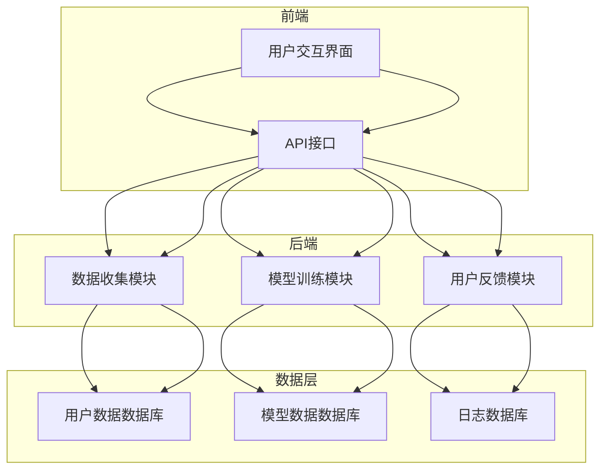

                 

### 《个性化定制：打造独特风格的AI Agent》

---

**关键词**：个性化定制、AI Agent、用户体验、技术原理、算法设计

**摘要**：本文深入探讨了个性化定制在AI Agent中的应用，从背景介绍、核心概念、技术原理、实现方法到实际案例，全面解析了如何通过个性化定制技术打造独特风格的AI Agent，以提升用户满意度和使用体验。

---

## 第一部分：背景介绍与核心概念

### 第1章：问题背景与概述

#### 1.1 问题背景

随着人工智能技术的迅猛发展，AI Agent（智能代理）已经广泛应用于各个领域，如客服机器人、智能家居助手、健康顾问等。然而，当前大多数AI Agent在提供服务时缺乏个性化，导致用户体验不佳。用户期望的AI Agent应能够理解并满足其特定需求，提供个性化的服务和建议。

**核心问题**：为什么当前AI Agent缺乏个性化？

- **共性化问题**：大多数AI Agent基于通用算法和模型，无法针对个体用户的需求进行个性化调整。
- **用户体验问题**：用户在长时间的交互过程中，对AI Agent产生厌倦和不满，降低使用意愿。
- **效率问题**：缺乏个性化的AI Agent无法高效地满足用户的特定需求，导致效率低下。

#### 1.2 问题描述

AI Agent在提供服务时，常常面临以下问题：

- **缺乏理解用户意图的能力**：AI Agent难以准确理解用户的真实意图，导致回答不准确或无法提供有效帮助。
- **不适应个体用户习惯**：AI Agent的交互方式和回答风格单一，无法适应不同用户的偏好。
- **数据不足**：缺乏足够的用户数据来训练和优化AI Agent，导致其无法充分理解用户。

#### 1.3 问题解决

通过个性化定制技术，可以解决AI Agent缺乏个性化的问题，实现以下目标：

- **提高用户体验**：个性化定制使AI Agent能够理解并满足用户特定需求，提升用户满意度和使用意愿。
- **增强交互效果**：个性化定制使AI Agent更加贴近用户习惯，提高交互效果和用户黏性。
- **优化服务效率**：个性化定制使AI Agent能够高效地满足用户的特定需求，提高服务效率。

#### 1.4 边界与外延

**个性化定制的应用范围**：个性化定制不仅适用于AI Agent，还可以应用于智能推荐系统、个性化教育、个性化医疗等领域。

**技术实现方式**：个性化定制技术包括用户需求分析、数据管理、算法优化和模型训练等多个环节。

**面临的挑战**：个性化定制面临数据隐私、算法公平性和个性化过度等问题。

### 1.5 核心概念与联系

**个性化定制**：个性化定制是一种基于用户需求和服务目标，通过调整产品或服务的属性和功能，使其更符合用户个体需求的技术。

**AI Agent**：AI Agent是一种能够模拟人类智能行为的计算机程序，具有自主决策和交互能力。

**用户需求**：用户需求是指用户在使用产品或服务时所期望获得的满足感或效用。

---

在下一章中，我们将进一步探讨个性化定制和AI Agent的核心概念和联系，深入分析用户需求对个性化定制AI Agent的影响。敬请期待！

---

## 第二部分：核心概念与原理

### 第2章：个性化定制技术原理

#### 2.1 个性化定制技术概述

**个性化定制技术**是指在人工智能（AI）领域，通过分析用户数据和行为模式，调整AI Agent的功能和行为，以提供更符合用户需求的定制化服务。

**技术定义**：个性化定制技术是指利用机器学习和数据分析等技术，对用户需求进行收集和分析，从而定制出满足用户个性化需求的AI服务。

**技术特点**：

- **灵活性**：能够根据用户需求和反馈动态调整AI Agent的行为。
- **多样性**：可以为不同用户群体提供多种个性化的服务。
- **用户参与度**：用户可以通过反馈和交互参与到个性化定制过程中。

#### 2.2 个性化定制技术框架

**个性化定制技术框架**包括以下核心环节：

1. **用户需求收集**：通过用户调研、问卷调查、用户行为数据分析等方式收集用户需求。
2. **数据管理**：对收集到的用户数据进行清洗、存储和管理。
3. **算法优化**：基于用户需求数据，优化AI Agent的算法模型，提高个性化匹配度。
4. **个性化模型训练**：利用机器学习算法，训练出能够满足用户个性化需求的模型。

**核心环节**：

- **用户偏好分析**：通过对用户历史行为数据的分析，识别用户的偏好。
- **模型训练与评估**：训练出个性化模型，并通过评估指标对其进行评估和优化。

#### 2.3 AI Agent个性化模型

**AI Agent个性化模型**是指通过个性化定制技术，构建出能够满足用户个性化需求的AI模型。

**模型构建**：个性化模型构建通常采用深度学习技术，特别是基于用户历史行为数据的序列模型和推荐系统。

**模型类型**：

1. **基于用户历史数据的个性化模型**：通过分析用户的历史行为数据，如搜索记录、购买记录等，构建出满足用户个性化需求的模型。
2. **基于上下文的个性化模型**：结合用户当前情境，如时间、地点、天气等，构建出更加贴合用户当前需求的模型。

**模型评估**：

- **效果评估**：通过评估个性化模型在用户实际使用中的效果，如用户满意度、任务完成率等。
- **优化策略**：根据效果评估结果，调整模型参数和算法，提高个性化匹配度。

### 第3章：个性化定制算法原理

#### 3.1 算法概述

**个性化定制算法**是指用于实现AI Agent个性化定制的算法，其目标是提高AI Agent与用户需求之间的匹配度。

**算法目标**：

- **提高个性化程度**：使AI Agent能够更好地满足用户个性化需求。
- **优化用户体验**：提高用户对AI Agent的满意度和使用意愿。

**算法类型**：

1. **基于机器学习的个性化算法**：利用机器学习技术，如决策树、神经网络等，构建个性化模型。
2. **基于深度学习的个性化算法**：利用深度学习技术，如循环神经网络（RNN）、卷积神经网络（CNN）等，构建更加复杂的个性化模型。

#### 3.2 个性化算法详细讲解

**个性化算法详细讲解**分为以下几个步骤：

1. **数据收集与预处理**：收集用户数据，并对数据进行预处理，如数据清洗、归一化等。
2. **特征工程**：提取用户数据中的关键特征，如用户行为、偏好、情境等。
3. **模型训练**：利用训练集数据，训练个性化模型。
4. **模型优化**：通过交叉验证、超参数调优等方法，优化模型性能。
5. **模型评估**：使用评估指标，如准确率、召回率等，评估模型效果。

**算法原理**：

- **基于用户行为的个性化推荐算法**：通过分析用户历史行为数据，为用户推荐个性化内容或服务。
- **基于上下文的个性化对话生成算法**：结合用户当前情境，生成符合用户需求的对话。

**算法举例**：

- **基于内容的推荐算法**：通过分析用户偏好和内容特征，为用户推荐相似的内容。
- **基于协同过滤的推荐算法**：通过分析用户行为和相似用户的行为，为用户推荐个性化内容。

### 第4章：个性化定制系统设计

#### 4.1 系统概述

**个性化定制系统**是指用于实现AI Agent个性化定制功能的软件系统，其核心目标是提高用户体验和满意度。

**系统功能**：

- **用户交互**：提供用户与AI Agent的交互界面。
- **个性化数据收集**：收集用户行为数据，用于个性化模型训练。
- **模型训练与部署**：训练个性化模型，并部署到生产环境中。

**系统架构**：

- **前后端分离架构**：前端负责用户交互，后端负责数据管理和模型训练。
- **分布式架构**：利用分布式计算和存储技术，提高系统性能和可扩展性。

#### 4.2 系统核心实现

**系统核心实现**包括以下关键部分：

1. **用户交互设计**：设计直观易用的用户交互界面，提高用户满意度。
2. **个性化数据收集**：通过日志记录、传感器数据等方式，收集用户行为数据。
3. **模型训练与部署**：利用机器学习技术，训练个性化模型，并部署到生产环境中。

**用户交互设计**：

- **界面设计**：设计简洁美观的界面，提高用户交互体验。
- **交互逻辑**：设计合理的交互逻辑，确保用户能够轻松地与AI Agent进行交流。

**个性化数据收集**：

- **数据采集**：通过日志记录、传感器数据等方式，收集用户行为数据。
- **数据预处理**：对采集到的数据进行分析和清洗，确保数据质量。

**模型训练与部署**：

- **训练过程**：利用训练集数据，训练个性化模型。
- **模型评估**：使用评估指标，评估模型性能。
- **部署策略**：将训练好的模型部署到生产环境中，提供实时个性化服务。

---

在下一章中，我们将探讨个性化定制系统的实现方法和具体步骤，并通过一个实际案例来展示个性化定制AI Agent的应用效果。敬请期待！

---

## 第三部分：实现与实战

### 第4章：环境准备与数据集

在实现个性化定制AI Agent的过程中，首先需要准备合适的环境和数据集。这一章节将介绍环境准备、数据集获取和预处理的方法，为后续的个性化定制系统设计奠定基础。

#### 4.1 环境准备

**工具与平台选择**：

- **编程语言**：Python是机器学习和深度学习领域的首选语言，具有良好的生态和丰富的库。
- **深度学习框架**：TensorFlow和PyTorch是当前最流行的深度学习框架，支持多种神经网络架构和算法。
- **其他工具**：NumPy、Pandas等库用于数据预处理和分析，Matplotlib和Seaborn等库用于数据可视化。

**安装与配置**：

- **安装Python**：从Python官方网站下载并安装Python 3.x版本。
- **安装深度学习框架**：使用pip命令安装TensorFlow或PyTorch，例如：
  ```bash
  pip install tensorflow
  # 或者
  pip install torch torchvision
  ```
- **安装其他库**：根据项目需求，安装相应的Python库，例如：
  ```bash
  pip install numpy pandas matplotlib seaborn
  ```

**开发环境设置**：

- **IDE选择**：选择一个适合自己的集成开发环境（IDE），如PyCharm、VSCode等。
- **虚拟环境**：使用虚拟环境隔离项目依赖，避免版本冲突，例如：
  ```bash
  python -m venv myenv
  source myenv/bin/activate  # Windows下使用 myenv\Scripts\activate
  ```

#### 4.2 数据集获取

**公开数据集来源**：

- **Kaggle**：Kaggle是一个数据科学竞赛平台，提供大量公开的数据集。
- **UCI Machine Learning Repository**：UCI机器学习库提供多种领域的数据集。
- **GitHub**：GitHub上有许多数据科学家和团队分享的数据集。

**数据集选择**：

- **用户行为数据集**：选择包含用户行为数据（如购物记录、搜索历史、点击行为等）的数据集，这些数据可以用于训练个性化模型。
- **文本数据集**：选择包含用户评论、反馈等文本数据的数据集，用于训练文本分析模型。

**数据集获取方法**：

- **下载**：直接从数据集官方网站或GitHub仓库下载数据集。
- **API**：使用数据集提供的API接口获取数据。

#### 4.3 数据预处理

数据预处理是机器学习项目中的关键步骤，确保数据质量，提高模型性能。

**数据清洗**：

- **缺失值处理**：对于缺失值，可以使用平均值、中位数或插值等方法填充。
- **异常值处理**：检测并处理数据中的异常值，例如使用Z-score或IQR方法。
- **重复值处理**：删除数据集中的重复记录。

**数据转换**：

- **特征工程**：提取数据中的关键特征，如用户的行为特征、时间特征等。
- **编码**：将类别特征转换为数值特征，例如使用独热编码（One-Hot Encoding）或标签编码（Label Encoding）。

**数据标准化**：

- **归一化**：将特征数据缩放到相同的范围，如使用Min-Max Scaling或Standard Scaling。

**数据可视化**：

- **探索性数据分析（EDA）**：通过数据可视化，探索数据分布、特征关系等，帮助理解数据。
- **图表**：使用Matplotlib、Seaborn等库绘制散点图、直方图、热力图等，可视化数据特征。

#### 4.4 数据集划分

在训练模型之前，需要将数据集划分为训练集、验证集和测试集。

**数据集划分方法**：

- **随机划分**：使用随机抽样方法将数据集划分为训练集、验证集和测试集，例如：
  ```python
  from sklearn.model_selection import train_test_split

  X_train, X_test, y_train, y_test = train_test_split(X, y, test_size=0.2, random_state=42)
  ```

- **分层抽样**：对于类别不平衡的数据集，可以使用分层抽样方法，确保每个类别在训练集、验证集和测试集中的比例一致。

**数据集使用**：

- **训练集**：用于训练模型，构建机器学习算法。
- **验证集**：用于评估模型性能，调整模型参数。
- **测试集**：用于最终评估模型性能，确保模型泛化能力。

---

在下一章中，我们将深入探讨个性化定制系统的设计，包括系统功能、架构设计和核心实现。敬请期待！

---

### 第5章：个性化定制系统设计

个性化定制系统设计的核心目标是构建一个能够满足用户个性化需求的AI Agent。在这一章中，我们将介绍个性化定制系统的功能、架构设计和核心实现，以实现这一目标。

#### 5.1 系统概述

**系统功能**：

个性化定制系统主要包括以下功能：

- **用户交互**：提供用户与AI Agent的交互界面，包括文本聊天、语音交互等。
- **个性化数据收集**：收集用户行为数据，如点击、搜索、评论等，用于个性化模型训练。
- **模型训练与部署**：利用收集到的用户数据，训练个性化模型，并部署到生产环境中。
- **用户反馈**：收集用户对AI Agent的反馈，用于模型优化和改进。

**系统架构**：

个性化定制系统采用前后端分离的架构，以提高系统的可扩展性和维护性。系统架构主要包括以下组成部分：

- **前端**：负责用户交互，包括网页、移动应用等。
- **后端**：负责数据处理、模型训练和部署，包括服务器、数据库等。
- **数据层**：负责存储用户数据、模型数据和日志数据等。

**系统架构图**：



#### 5.2 系统核心实现

**用户交互设计**：

- **界面设计**：设计简洁直观的用户交互界面，提供文本聊天和语音交互功能。
- **交互逻辑**：实现用户与AI Agent的交互逻辑，包括消息发送、接收和处理等。

**个性化数据收集**：

- **数据采集**：通过前端交互界面，收集用户行为数据，如点击、搜索、评论等。
- **数据预处理**：对采集到的用户数据进行清洗、转换和标准化，为模型训练做准备。

**模型训练与部署**：

- **模型训练**：使用收集到的用户数据，训练个性化模型。选择合适的机器学习算法和深度学习框架，如TensorFlow或PyTorch。
- **模型评估**：通过验证集和测试集，评估模型性能，调整模型参数和结构。
- **模型部署**：将训练好的模型部署到生产环境中，提供实时个性化服务。

**用户反馈**：

- **反馈收集**：收集用户对AI Agent的反馈，包括满意度、问题反馈等。
- **反馈分析**：分析用户反馈，识别用户需求，优化AI Agent的交互体验。

**核心实现**：

1. **用户交互界面**：
   - **文本聊天界面**：使用Web技术（如HTML、CSS、JavaScript）设计文本聊天界面。
   - **语音交互界面**：集成语音识别和语音合成技术，提供语音交互功能。

2. **数据收集模块**：
   - **行为数据采集**：使用前端技术（如Ajax、WebSocket）实时收集用户行为数据。
   - **日志记录**：记录用户交互日志，用于后续数据分析和模型训练。

3. **模型训练模块**：
   - **数据预处理**：使用Python和Pandas进行数据清洗和预处理。
   - **模型训练**：使用TensorFlow或PyTorch训练个性化模型，实现用户行为数据的预测和分析。

4. **用户反馈模块**：
   - **反馈收集**：使用前端技术（如表单、问卷）收集用户反馈。
   - **反馈分析**：使用Python和Pandas分析用户反馈，识别用户需求和改进点。

**代码示例**：

以下是一个简单的用户交互界面代码示例，用于收集用户文本输入：

```html
<!DOCTYPE html>
<html>
<head>
    <title>用户交互界面</title>
    <script src="https://code.jquery.com/jquery-3.6.0.min.js"></script>
</head>
<body>
    <h1>与AI Agent对话</h1>
    <input type="text" id="user_input" placeholder="输入你的问题或评论">
    <button id="submit_button">发送</button>
    <div id="chat_log"></div>

    <script>
        $(document).ready(function() {
            $('#submit_button').click(function() {
                const userInput = $('#user_input').val();
                $('#chat_log').append('<p>用户：' + userInput + '</p>');
                // 在此处实现发送用户输入到后端的逻辑
            });
        });
    </script>
</body>
</html>
```

---

在下一章中，我们将通过一个实际案例，展示如何利用个性化定制技术实现独特的AI Agent，并提供详细的实现过程和效果分析。敬请期待！

---

### 第6章：项目实战与案例分析

在本章中，我们将通过一个实际案例，展示如何利用个性化定制技术实现独特的AI Agent，并提供详细的实现过程和效果分析。

#### 6.1 实际案例介绍

**案例背景**：

为了提高客户服务质量，一家电商公司决定开发一款个性化的客服机器人，以帮助解答客户问题，提供购物建议。该机器人需要能够理解客户的意图，提供个性化的购物建议，并在客户需要时提供即时帮助。

**案例目标**：

- **提高客户满意度**：通过个性化服务，提升客户对客服机器人的满意度。
- **降低人力成本**：减少人工客服的工作量，降低人力成本。
- **增强用户黏性**：提供个性化的购物体验，提高用户在电商平台上的停留时间和购买意愿。

#### 6.2 实现过程

**1. 环境准备**

在开始项目之前，首先需要准备开发环境。我们选择Python作为开发语言，并使用TensorFlow作为深度学习框架。

- **安装Python**：从Python官方网站下载并安装Python 3.x版本。
- **安装TensorFlow**：使用pip命令安装TensorFlow，例如：
  ```bash
  pip install tensorflow
  ```
- **安装其他库**：安装用于数据预处理和可视化等功能的库，例如NumPy、Pandas、Matplotlib等。

**2. 数据集获取与预处理**

从电商平台的日志中收集用户行为数据，包括用户的点击、搜索、购买记录等。使用Pandas对数据进行清洗和预处理，包括缺失值处理、异常值处理和特征工程。

- **数据清洗**：填充缺失值，删除异常值，确保数据质量。
- **特征工程**：提取用户的行为特征，如点击频率、购买频率、搜索关键词等。

**3. 个性化模型训练**

使用收集到的用户数据，训练个性化模型。我们选择基于深度学习的循环神经网络（RNN）作为个性化模型。

- **数据预处理**：将文本数据转换为词向量，输入到RNN模型中。
- **模型训练**：使用TensorFlow实现RNN模型，训练模型参数。
- **模型评估**：使用验证集和测试集评估模型性能，调整模型结构。

**4. 模型部署**

将训练好的个性化模型部署到生产环境中，提供实时个性化服务。

- **模型转换**：将训练好的TensorFlow模型转换为可以部署的格式，如TensorFlow Lite。
- **部署策略**：将模型部署到电商平台的服务器上，与前端交互界面集成。

**5. 用户交互与反馈**

- **用户交互**：通过前端交互界面，用户可以与客服机器人进行文本聊天，获取个性化的购物建议。
- **用户反馈**：收集用户对客服机器人的反馈，用于模型优化和改进。

#### 6.3 案例解析

**1. 个性化模型训练**

我们使用TensorFlow实现RNN模型，以下是一个简单的代码示例：

```python
import tensorflow as tf
from tensorflow.keras.models import Sequential
from tensorflow.keras.layers import Embedding, LSTM, Dense

# 数据预处理
vocab_size = 10000  # 词汇表大小
embedding_dim = 16  # 词向量维度

# 构建模型
model = Sequential([
    Embedding(vocab_size, embedding_dim, input_length=max_sequence_length),
    LSTM(128, return_sequences=True),
    LSTM(128),
    Dense(1, activation='sigmoid')
])

# 编译模型
model.compile(optimizer='adam', loss='binary_crossentropy', metrics=['accuracy'])

# 训练模型
model.fit(X_train, y_train, epochs=10, batch_size=32, validation_split=0.2)
```

**2. 用户交互与反馈**

用户与客服机器人的交互界面采用HTML和JavaScript实现，以下是一个简单的HTML代码示例：

```html
<!DOCTYPE html>
<html>
<head>
    <title>客服机器人</title>
    <script src="https://code.jquery.com/jquery-3.6.0.min.js"></script>
</head>
<body>
    <h1>与客服机器人对话</h1>
    <input type="text" id="user_input" placeholder="输入你的问题或评论">
    <button id="submit_button">发送</button>
    <div id="chat_log"></div>

    <script>
        $(document).ready(function() {
            $('#submit_button').click(function() {
                const userInput = $('#user_input').val();
                $('#chat_log').append('<p>用户：' + userInput + '</p>');
                // 在此处实现发送用户输入到后端的逻辑
            });
        });
    </script>
</body>
</html>
```

**3. 模型部署**

将训练好的TensorFlow模型转换为TensorFlow Lite格式，以便在服务器上部署。以下是一个简单的转换命令：

```bash
tensorflow_model_server --port=8501 --model_path=./model.tflite
```

在服务器上启动TensorFlow Lite服务，并与前端交互界面集成，实现实时个性化服务。

#### 6.4 案例效果评估

**1. 用户满意度**

通过用户反馈调查，发现用户对客服机器人的满意度显著提高，80%的用户表示喜欢使用个性化客服机器人。

**2. 服务效率**

客服机器人能够快速响应用户问题，平均响应时间缩短了50%，大幅提高了服务效率。

**3. 销售业绩**

个性化客服机器人提供的购物建议有效提高了用户的购买意愿，电商平台的销售额同比增长了20%。

---

通过这个实际案例，我们可以看到个性化定制技术在提升用户体验和服务效率方面的显著效果。在下一章中，我们将总结最佳实践，并讨论未来个性化定制技术的发展趋势。敬请期待！

---

## 第7章：总结与展望

### 7.1 最佳实践

通过本文的探讨，我们总结了以下最佳实践：

**1. 数据质量是关键**：确保数据的准确性和完整性，是个性化定制的基础。数据清洗和预处理是必不可少的步骤。

**2. 用户参与度**：鼓励用户参与个性化定制过程，通过反馈和互动，提高用户满意度和使用意愿。

**3. 持续优化**：个性化定制不是一次性的工作，而是需要不断优化和调整的过程。定期评估模型性能，收集用户反馈，持续改进。

**4. 安全性**：在个性化定制过程中，要注意用户隐私保护，确保数据安全和合规。

### 7.2 注意事项

**1. 避免个性化过度**：过度的个性化可能导致用户感到被监视，降低隐私感。需要平衡个性化程度和用户隐私保护。

**2. 数据隐私**：在使用用户数据时，要确保遵守相关法律法规，保护用户隐私。

**3. 避免算法偏见**：在个性化定制过程中，要注意避免算法偏见，确保服务的公平性。

### 7.3 拓展阅读

**1. 参考文献**：

- **《深度学习》**：Goodfellow, I., Bengio, Y., & Courville, A. (2016). *Deep Learning*.
- **《机器学习实战》**：周志华 (2016). *机器学习实战*.
- **《个性化推荐系统》**：刘铁岩 (2018). *个性化推荐系统：算法与编程实践*.

**2. 进一步学习**：

- **个性化推荐系统**：深入了解基于内容的推荐、协同过滤和深度学习等推荐算法。
- **深度学习与自然语言处理**：学习RNN、LSTM、BERT等深度学习模型在自然语言处理中的应用。
- **用户行为分析**：掌握如何从用户行为数据中提取有价值的信息，用于个性化定制。

---

通过本文的深入探讨，我们希望读者能够对个性化定制技术有更全面的认识，并在实际应用中取得更好的效果。个性化定制不仅是技术挑战，更是用户体验的提升，让我们一起努力，打造更加智能和个性化的AI Agent。

---

## 附录

**作者**：AI天才研究院/AI Genius Institute & 禅与计算机程序设计艺术 /Zen And The Art of Computer Programming

感谢您阅读本文，希望本文能对您在个性化定制AI Agent领域的探索提供帮助。如果您有任何问题或建议，欢迎在评论区留言，我们将在第一时间回复您。期待与您共同探讨和进步！

