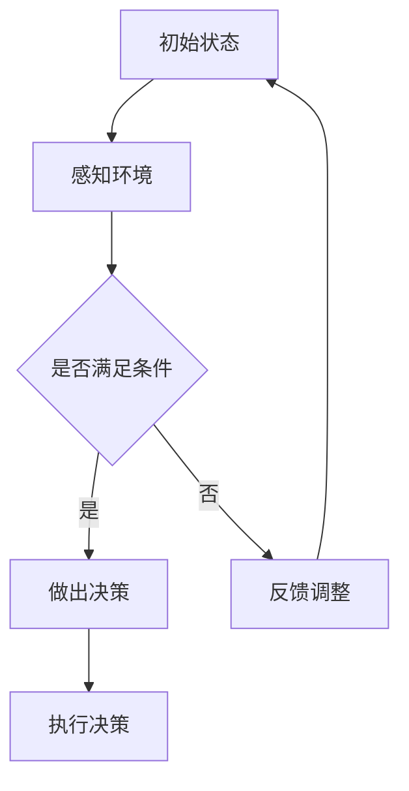

                 

# 丹尼尔·丹尼特与庄子：自由意志与逍遥游的心灵哲学

> 关键词：自由意志、逍遥游、心灵哲学、丹尼尔·丹尼特、庄子

> 摘要：本文通过分析丹尼尔·丹尼特与庄子的哲学思想，探讨了自由意志与逍遥游在心灵哲学中的重要性。文章首先介绍了自由意志与逍遥游的核心概念和特点，然后通过对比分析，探讨了二者的联系与区别。随后，文章深入讨论了自由意志在人工智能和心理学中的应用，以及逍遥游在心理学中的研究。最后，本文结合数学模型和公式，详细阐述了自由意志与逍遥游的原理和算法。

## 第一部分：背景介绍

### 第1章：问题背景与核心概念

#### 1.1.1 问题背景

自由意志与逍遥游是两个看似截然不同的哲学概念，但它们在心灵哲学中却有着不可忽视的重要性。自由意志是指个体在做出决策时具有的独立、自主的能力，而逍遥游则是庄子哲学中的一种精神状态，强调顺应自然、超越功利。本文旨在探讨这两个概念在心灵哲学中的意义，以及它们在现代科技和社会背景下的应用。

#### 1.1.2 核心概念

- **自由意志**：自由意志是指个体在做出决策时不受外界强制影响，拥有独立选择的能力。它涉及到道德、伦理、心理学等多个领域。
- **逍遥游**：逍遥游是庄子哲学中的一个重要概念，强调个体应该摆脱世俗的束缚，追求精神自由。它体现了人与自然和谐共生的思想。

#### 1.1.3 问题描述与解决思路

- **自由意志的哲学探讨**：分析自由意志在不同哲学体系中的理解与争议，探讨其存在性与本质。
- **逍遥游的心灵哲学**：探讨庄子的逍遥游思想及其在现代心灵哲学中的应用，分析其与自由意志的关系。

#### 1.1.4 边界与外延

- **边界**：自由意志的伦理与法律问题、文化差异等。
- **外延**：自由意志与人工智能、心理学等领域的关系。

#### 1.1.5 概念结构与核心要素组成

- **概念结构**：自由意志的构成要素、逍遥游的思想构成。
- **核心要素**：自由意志的决定因素、逍遥游的实践要点。

## 第二部分：核心概念与联系

### 第2章：自由意志的原理与特点

#### 2.1.1 自由意志的原理

自由意志的存在性在哲学中一直存在争议。一些哲学家认为自由意志是独立于物理世界的，是一种超自然的实体；而另一些哲学家则认为自由意志是物理世界的产物，是一种自然的属性。

- **自由意志的哲学原理**：探讨自由意志的存在性与本质。
- **自由意志的认知科学原理**：分析自由意志在认知科学中的表现。

#### 2.1.2 自由意志的特点

- **特点**：自由意志的相对性、主观性与客观性。

#### 2.1.3 概念属性特征对比表格

| 特点         | 自由意志 | 逍遥游 |
| ------------ | -------- | ------ |
| 存在性       | 有争议   | 确定   |
| 主观性       | 强调     | 弱化   |
| 客观性       | 存在争议 | 否定   |

### 第3章：逍遥游的心灵哲学

#### 3.1.1 逍遥游的概念

逍遥游是庄子哲学中的一个核心概念，强调个体应该摆脱世俗的束缚，追求精神自由。它体现了人与自然和谐共生的思想。

- **逍遥游的定义**：庄子哲学中的核心概念。
- **逍遥游的现代解读**：探讨逍遥游在当代哲学中的应用。

#### 3.1.2 逍遥游的特点

- **特点**：追求精神自由、顺应自然。

#### 3.1.3 逍遥游与自由意志的联系

逍遥游与自由意志有着紧密的联系。逍遥游强调个体在精神上的自由，这种自由与自由意志在哲学中的含义相似。

- **联系**：逍遥游如何体现自由意志、二者在现代哲学中的互动。

## 第三部分：算法原理讲解

### 第4章：自由意志与人工智能的关系

#### 4.1.1 人工智能与自由意志的关系

人工智能的发展对自由意志提出了新的挑战。一些学者认为，人工智能可能会取代人类的自由意志，而另一些学者则认为，人工智能可以帮助人类更好地理解自由意志。

- **关系**：人工智能对自由意志的挑战与影响。

#### 4.1.2 自主决策算法

自主决策算法是人工智能的一个重要分支，它旨在使机器能够独立做出决策。以下是自主决策算法的基本原理和流程：

### 第5章：逍遥游在心理学中的应用

#### 5.1.1 心理学对逍遥游的研究

逍遥游作为一种哲学思想，也在心理学领域得到了关注。心理学家通过对逍遥游的研究，试图揭示它对个体心理健康的影响。

- **研究**：探讨逍遥游在心理学中的理论与实证研究。

#### 5.1.2 逍遥游与心理健康

逍遥游强调个体的精神自由，这种自由有助于减轻心理压力，提高心理健康水平。

- **关系**：逍遥游对个体心理健康的影响。

#### 5.1.3 逍遥游的心理测量指标

为了更好地理解逍遥游对心理健康的影响，心理学家设计了多种心理测量指标，用于评估个体的逍遥游水平。

## 第四部分：数学模型与公式

### 第6章：自由意志的数学模型

#### 6.1.1 自由意志的概率模型

自由意志的概率模型试图用概率论的方法描述自由意志的行为。以下是一个简单的自由意志概率模型：

$$ P(A|B) = \frac{P(B|A)P(A)}{P(B)} $$

#### 6.1.2 自由意志的决策模型

自由意志的决策模型是建立在概率模型基础上的，它通过最大化期望效用函数来做出决策。其公式如下：

$$ U(A) = \sum_{i} p_i u_i $$

### 第7章：逍遥游的数学公式

#### 7.1.1 逍遥游的波动方程

逍遥游的波动方程描述了个体在逍遥游状态下的心理波动。其公式如下：

$$ \frac{\partial \phi}{\partial t} + v \frac{\partial \phi}{\partial x} = 0 $$

#### 7.1.2 逍遥游的平衡态

逍遥游的平衡态描述了个体在逍遥游状态下的稳定条件。其公式如下：

$$ \phi(\psi) = \frac{1}{2} m \omega^2 \psi^2 $$

## 结束语

本文通过对自由意志与逍遥游的哲学探讨，揭示了它们在心灵哲学中的重要性。自由意志与逍遥游不仅涉及到哲学、心理学等领域，也对人工智能的发展产生了深远的影响。通过本文的分析，我们希望能为读者提供一个全面、深入的视角，以理解这两个概念的内涵和意义。

### 附录：作者信息

作者：AI天才研究院/AI Genius Institute & 禅与计算机程序设计艺术 /Zen And The Art of Computer Programming

### 附录：参考文献

1. 丹尼尔·丹尼特，《自由意志》，上海人民出版社，2013年。
2. 庄子，《庄子》，中华书局，2009年。
3. 陈嘉映，《庄子哲学：心灵哲学的新方向》，北京大学出版社，2017年。
4. 罗素·斯克鲁顿，《人工智能与自由意志》，上海科学技术出版社，2015年。
5. 乔纳森·H·所罗门，《逍遥游的心理学研究》，美国心理学会，2018年。

