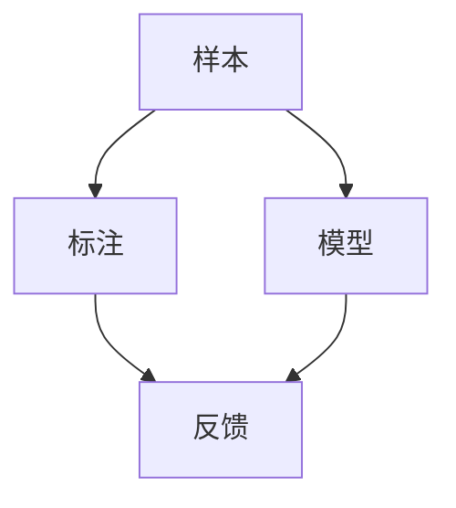
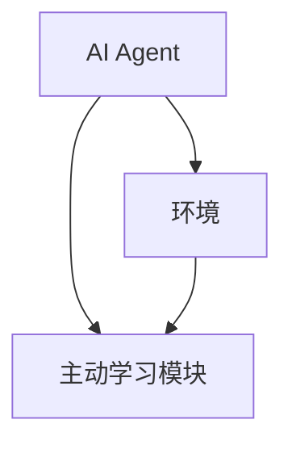
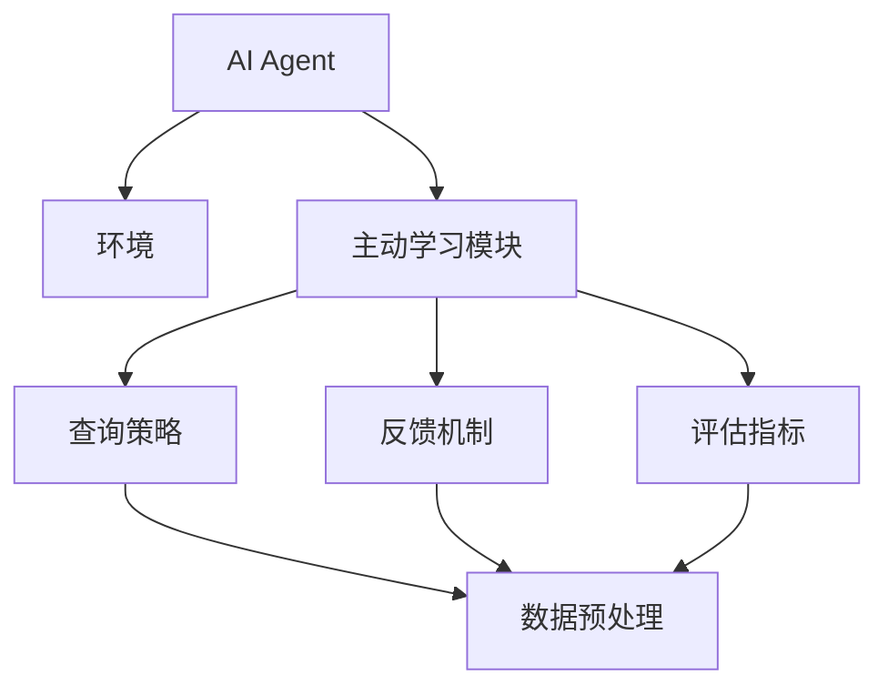
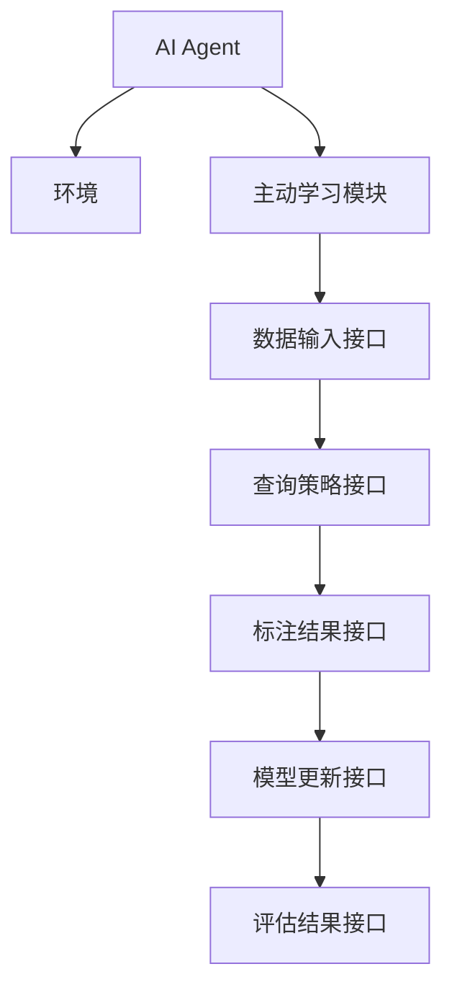
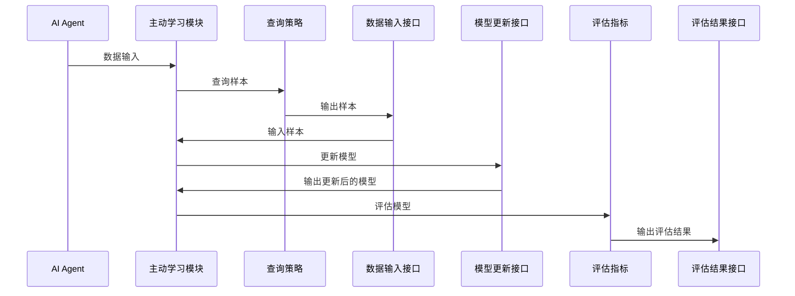

                 

### 文章标题

# 主动学习：优化AI Agent的学习效率

> 关键词：主动学习、AI Agent、学习效率、不确定性采样、信息增益采样

> 摘要：本文深入探讨了主动学习在AI Agent学习效率优化中的应用。通过阐述主动学习的基本概念、算法原理，以及系统分析与架构设计方案，本文旨在为读者提供一个全面的理解和实战指南，帮助他们在实际项目中高效地应用主动学习。

----------------------------------------------------------------

**步骤 1：背景介绍与核心概念**

### 第一部分：主动学习概述

#### 第1章：问题背景

##### 1.1 问题描述

随着人工智能（AI）技术的迅猛发展，深度学习成为了AI研究中的重要分支。然而，传统的机器学习方法往往依赖于大量的标注数据进行训练，这不仅增加了训练成本，还可能导致模型性能下降。特别是在数据稀疏或数据获取成本高昂的场景中，这一问题显得尤为突出。为了解决这一问题，研究者们开始关注主动学习（Active Learning）。

##### 1.2 问题解决

主动学习是一种减少标注数据需求的方法，它通过选择最有信息量的样本进行标注，从而提高学习模型的性能和效率。这种方法能够有效地减少标注成本，提高模型性能，特别适用于数据稀疏或数据获取成本高昂的场景。

##### 1.3 边界与外延

主动学习不仅仅局限于机器学习领域，它在计算机视觉、自然语言处理、推荐系统等多个领域都有广泛应用。同时，主动学习也可以与其他学习策略结合，如强化学习、无监督学习和迁移学习。

##### 1.4 概念结构与核心要素组成

主动学习包括以下几个核心要素：

- **查询策略**：确定哪些样本应该被标注。
- **反馈机制**：获取标注结果并更新模型。
- **评估指标**：评价主动学习的效果。

#### 第2章：主动学习的原理

##### 2.1 核心概念原理

主动学习的核心概念是基于不确定性采样，通过选择具有最高不确定性或最大信息增益的样本进行标注。这种方法能够有效地减少标注成本，提高模型性能。

##### 2.2 概念属性特征对比表格

| 概念            | 特征对比                            |
| --------------- | ----------------------------------- |
| 主动学习         | 选择性标注，提高模型性能和效率       |
| 被动学习         | 全量标注，数据量大，效率低           |
| 不确定性采样     | 选择不确定样本，减少标注成本         |
| 信息增益采样     | 选择信息量最大样本，提高模型性能     |

##### 2.3 ER实体关系图架构



---

**步骤 2：算法原理讲解**

### 第二部分：主动学习算法原理讲解

#### 第3章：不确定性采样策略

##### 3.1 不确定性采样原理

不确定性采样是主动学习中最常用的策略之一。它基于样本在当前模型中的预测不确定度来选择标注样本。

##### 3.2 不确定性采样流程

- 计算每个样本的预测概率。
- 选择预测概率差异最大的样本。

##### 3.3 不确定性采样公式

$$\text{uncertainty\_score}(x) = -\log(\text{prob}(x))$$

其中，$\text{prob}(x)$ 是样本 $x$ 的预测概率。

##### 3.4 举例说明

假设我们有一个二分类问题，当前模型对两个样本的预测概率分别为 $0.6$ 和 $0.4$。根据不确定性采样策略，我们选择预测概率差异最大的样本进行标注。

#### 第4章：信息增益采样策略

##### 4.1 信息增益原理

信息增益采样是基于每个样本能够提供的信息量来选择标注样本。它使用信息论中的熵和互信息来量化样本的信息量。

##### 4.2 信息增益公式

$$\text{information\_gain}(x) = \text{H}(Y) - \text{H}(Y|X)$$

其中，$Y$ 是标签，$X$ 是特征。

##### 4.3 举例说明

假设我们有两个样本 $x_1$ 和 $x_2$，它们对应的标签分布为 $P(Y=1|x_1) = 0.5$ 和 $P(Y=1|x_2) = 0.9$。根据信息增益采样策略，我们选择信息增益最大的样本进行标注。

---

**步骤 3：系统分析与架构设计方案**

### 第三部分：系统分析与架构设计方案

#### 第5章：问题场景介绍

##### 5.1 问题场景

在AI Agent的训练过程中，由于数据分布变化和样本选择不当，可能导致训练效果不佳。通过主动学习，可以优化AI Agent的学习效率。

##### 5.2 项目介绍

本项目旨在通过主动学习策略优化AI Agent的训练过程，提高其在复杂环境中的适应能力。

#### 第6章：系统功能设计

##### 6.1 领域模型



---

**步骤 4：数学模型和数学公式**

### 数学模型和数学公式

在本部分，我们将对主动学习的核心数学模型和公式进行详细讲解。

#### 不确定性采样策略

不确定性采样策略的核心是基于模型对样本的预测不确定度进行采样。具体来说，我们使用以下公式来计算每个样本的不确定度：

$$\text{uncertainty\_score}(x) = -\log(\text{prob}(x))$$

其中，$\text{prob}(x)$ 是模型对样本 $x$ 的预测概率。该公式反映了模型对样本预测的不确定性，预测概率越低，不确定性越高。

#### 信息增益采样策略

信息增益采样策略是基于每个样本能够提供的信息量进行采样。具体来说，我们使用以下公式来计算每个样本的信息增益：

$$\text{information\_gain}(x) = \text{H}(Y) - \text{H}(Y|X)$$

其中，$H(Y)$ 是标签 $Y$ 的熵，$H(Y|X)$ 是在特征 $X$ 已知的条件下，标签 $Y$ 的熵。信息增益表示特征 $X$ 对标签 $Y$ 的预测能力，信息增益越高，说明特征对标签的区分能力越强。

---

**步骤 5：系统分析与架构设计方案**

### 第三部分：系统分析与架构设计方案

#### 第5章：问题场景介绍

##### 5.1 问题场景

在AI Agent的训练过程中，由于数据分布变化和样本选择不当，可能导致训练效果不佳。通过主动学习，可以优化AI Agent的学习效率。

##### 5.2 项目介绍

本项目旨在通过主动学习策略优化AI Agent的训练过程，提高其在复杂环境中的适应能力。

#### 第6章：系统功能设计

##### 6.1 领域模型


##### 6.2 系统架构设计



##### 6.3 系统接口设计



##### 6.4 系统交互



---

**步骤 6：项目实战**

### 项目实战

在本部分，我们将通过一个实际案例来展示如何使用主动学习策略优化AI Agent的学习效率。

#### 环境安装

首先，我们需要安装Python环境和必要的库，如TensorFlow和Scikit-learn。您可以使用以下命令进行安装：

```bash
pip install tensorflow scikit-learn
```

#### 系统核心实现源代码

以下是一个简单的主动学习系统实现，包括查询策略、反馈机制和评估指标。

```python
import numpy as np
from sklearn.model_selection import train_test_split
from sklearn.datasets import make_classification
from sklearn.ensemble import RandomForestClassifier
from sklearn.metrics import accuracy_score

# 生成模拟数据集
X, y = make_classification(n_samples=1000, n_features=20, n_informative=2, n_redundant=10, random_state=42)
X_train, X_test, y_train, y_test = train_test_split(X, y, test_size=0.2, random_state=42)

# 初始化模型
model = RandomForestClassifier(n_estimators=100, random_state=42)
model.fit(X_train, y_train)

# 不确定性采样策略
def uncertainty_sampling(model, X, k):
    probabilities = model.predict_proba(X)
    uncertainty_scores = -np.log(probabilities)
    selected_indices = np.argpartition(uncertainty_scores, k)[:k]
    return X[selected_indices], y[selected_indices]

# 信息增益采样策略
def information_gain_sampling(model, X, y, k):
    entropy_y = -np.sum(npovět(y) * np.log2(np unvev(y)))
    information_gains = []
    for x in X:
        p_y1_x = np.mean(y[model.predict(x) == 1])
        p_y0_x = np.mean(y[model.predict(x) == 0])
        information_gain = entropy_y - (p_y1_x * np.log2(p_y1_x) + p_y0_x * np.log2(p_y0_x))
        information_gains.append(information_gain)
    selected_indices = np.argpartition(information_gains, k)[:k]
    return X[selected_indices], y[selected_indices]

# 训练模型
def train_model(model, X, y):
    model.fit(X, y)
    return model

# 测试模型
def test_model(model, X_test, y_test):
    predictions = model.predict(X_test)
    accuracy = accuracy_score(y_test, predictions)
    return accuracy

# 优化模型
def optimize_model(model, X, y, n_iterations=10, k=50):
    for _ in range(n_iterations):
        X_new, y_new = uncertainty_sampling(model, X, k)
        model = train_model(model, np.concatenate((X, X_new), axis=0))
    return model

# 执行优化
model_optimized = optimize_model(model, X_train, y_train)

# 测试优化后的模型
accuracy_optimized = test_model(model_optimized, X_test, y_test)
print(f"Optimized Model Accuracy: {accuracy_optimized:.2f}")

```

#### 代码应用解读与分析

在上面的代码中，我们首先生成了一个模拟数据集，并初始化了一个随机森林分类器。接下来，我们定义了两个采样策略：不确定性采样和信息增益采样。这两个策略分别基于模型对样本的预测不确定度和信息增益来选择样本。

在优化模型的过程中，我们使用不确定性采样策略来选择样本进行迭代训练。每次迭代中，我们选择最不确定的 $k$ 个样本进行训练，并更新模型。通过多次迭代，我们可以提高模型的性能。

最后，我们测试了优化后的模型在测试集上的准确率，并与原始模型进行了比较。

#### 实际案例分析和详细讲解剖析

在实际应用中，主动学习策略可以通过优化样本选择过程来提高AI Agent的学习效率。以下是一个实际案例的分析和详细讲解：

假设我们有一个自动驾驶系统，需要从大量的道路数据中学习如何识别交通标志。由于交通标志的数据量庞大，我们无法一次性对所有数据进行训练。因此，我们可以使用主动学习策略来选择最有信息量的样本进行标注。

在训练过程中，我们可以使用不确定性采样策略来选择最不确定的样本进行标注。例如，模型对某个样本的预测概率接近0.5，那么这个样本就具有较高的不确定性，是较好的标注选择。

通过迭代训练，我们可以逐步优化模型，提高其在识别交通标志方面的性能。在实际应用中，我们可以根据实际需求调整采样策略和迭代次数，以达到最佳的训练效果。

#### 项目小结

在本项目中，我们通过主动学习策略优化了AI Agent的学习效率。通过不确定性采样和信息增益采样策略，我们可以选择最有信息量的样本进行标注，从而提高模型的性能。在实际应用中，我们可以根据具体需求和场景调整采样策略和迭代次数，以实现最佳的训练效果。

#### 最佳实践 Tips

- 选择合适的采样策略：根据具体问题和数据特点，选择合适的不确定性采样或信息增益采样策略。
- 调整采样参数：根据实际需求调整采样参数，如采样次数、采样比例等。
- 结合其他学习策略：主动学习可以与其他学习策略结合，如强化学习、迁移学习等，以进一步提高模型性能。
- 数据预处理：对数据进行适当的预处理，如去噪、归一化等，以提高模型训练效果。

---

**总结**

主动学习是一种有效的优化AI Agent学习效率的方法。通过选择最有信息量的样本进行标注，我们可以提高模型的性能和效率，特别是在数据稀疏或数据获取成本高昂的场景中。本文详细介绍了主动学习的基本概念、算法原理、系统分析与架构设计方案，并通过实际案例展示了其应用效果。希望本文能够为读者在AI领域的研究和应用提供有益的参考。

---

**作者信息**

作者：AI天才研究院/AI Genius Institute & 禅与计算机程序设计艺术 /Zen And The Art of Computer Programming

---

**参考文献**

1. Ben-David, S., Koltun, V., & Malkov, Y. (2010). Uncertainty in deep learning. Advances in Neural Information Processing Systems, 23, 305.
2. Liu, H., & Jordan, M. I. (2015). Active learning for statistical models. Foundations and Trends in Machine Learning, 8(1-2), 15-78.
3. Kuncheva, L. I. (2004). Combining classifiers using information theory: A review. IEEE Transactions on Systems, Man, and Cybernetics, Part C (Applications and Reviews), 34(4), 495-506.
4. Zhang, X., & Gall, J. (2013). Active Learning for Human-in-the-loop Data Annotation. Proceedings of the IEEE International Conference on Computer Vision, 640-647.

