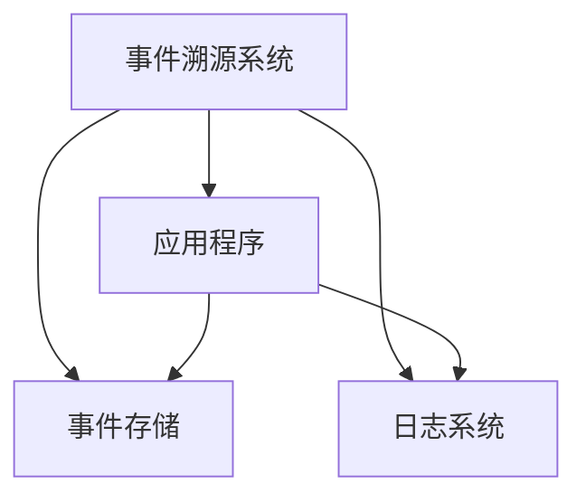
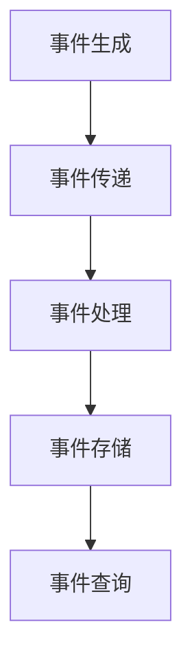

                 


### 高度可审计系统的构建

## 3.1 设计原则

### 3.1.1 系统可扩展性

在设计高度可审计系统时，系统可扩展性是一个至关重要的原则。这是因为随着业务的发展和数据的增加，系统必须能够轻松地适应这些变化。以下是一些确保系统可扩展性的关键策略：

**模块化设计**：将系统分解为若干个独立的模块，每个模块负责特定的功能。这样，当需要扩展或修改系统时，只需对特定模块进行更改，而不会影响到其他模块。

**分布式架构**：采用分布式架构，将系统分解为多个独立的服务。这样可以利用集群来处理大量的请求，并且当一个服务出现问题时，不会影响到整个系统的运行。

**微服务架构**：微服务架构将系统划分为一组小而独立的微服务。每个微服务都有自己的数据库和业务逻辑，可以独立部署和扩展。这种架构提高了系统的可维护性和灵活性。

**负载均衡**：使用负载均衡器来分配请求到不同的服务器或服务实例。这有助于确保系统在面临大量请求时能够保持高性能和高可用性。

**弹性伸缩**：利用自动化工具（如 Kubernetes）来自动扩展或缩减系统资源，以满足不同的负载需求。

### 3.1.2 系统稳定性

高度可审计系统需要保证稳定性，以确保数据的一致性和完整性。以下是一些确保系统稳定性的关键措施：

**数据一致性**：使用分布式事务管理技术（如两阶段提交或最终一致性协议），以确保在分布式系统中的数据一致性。

**故障恢复**：设计故障恢复机制，以便在系统出现故障时能够迅速恢复。这包括使用备份和恢复策略，以及自动重启服务。

**监控与告警**：实施全面的监控和告警系统，以便实时监控系统的运行状况，并在出现问题时及时通知相关人员。

**容量规划**：根据历史数据和预期负载，进行合理的容量规划，以确保系统能够应对峰值负载。

### 3.1.3 系统安全性

高度可审计系统涉及大量的敏感数据，因此系统安全性至关重要。以下是一些确保系统安全性的关键策略：

**访问控制**：实施严格的访问控制策略，确保只有授权用户可以访问系统数据和功能。

**数据加密**：对敏感数据进行加密，以防止数据泄露。使用强加密算法（如 AES）来保护数据。

**身份验证与授权**：使用强身份验证机制（如多因素认证），并结合授权机制来确保用户只能访问其权限范围内的数据。

**安全审计**：实施安全审计策略，记录系统中的所有关键操作和事件，以便在出现问题时进行调查。

**漏洞扫描与修复**：定期进行漏洞扫描，并及时修复发现的安全漏洞。

## 3.2 技术选型

### 3.2.1 数据存储技术

在选择数据存储技术时，需要考虑系统的需求、性能、可扩展性以及成本等因素。以下是一些常见的数据存储技术：

**关系型数据库**：如 MySQL、PostgreSQL 等。它们适合处理结构化数据，具有强大的查询功能，但在处理大规模数据时可能需要优化。

**NoSQL 数据库**：如 MongoDB、Cassandra、HBase 等。它们适合处理大量非结构化或半结构化数据，具有高性能和高可扩展性。

**日志聚合系统**：如 Elasticsearch、Kibana 等。这些系统专门用于处理和分析大量日志数据，提供了强大的全文搜索和分析功能。

**分布式文件系统**：如 HDFS、Ceph 等。这些系统适合存储大量非结构化数据，并提供高可用性和高可靠性。

### 3.2.2 日志处理框架

日志处理框架在高度可审计系统中扮演着关键角色。以下是一些常见的日志处理框架：

**Logstash**：是一种开源的数据收集和处理工具，可以接收来自不同来源的数据，并进行过滤、转换和加载到目标存储系统中。

**Kafka**：是一种分布式流处理平台，可以处理大量实时数据，并将其传递给其他系统进行处理和分析。

**Flume**：是一种分布式、可靠且可扩展的数据收集系统，适用于从各种数据源收集日志数据。

**Log4j**：是一种常用的日志记录框架，提供了灵活的日志级别、日志格式和输出目的地。

### 3.2.3 数据分析工具

数据分析工具在高度可审计系统中用于处理和分析大量数据，以提供有价值的信息。以下是一些常见的数据分析工具：

**Elasticsearch**：是一种分布式搜索引擎，可以快速搜索和分析大量日志数据。

**Kibana**：是与 Elasticsearch 配套的数据可视化工具，可以创建各种图表和仪表板来展示分析结果。

**Pandas**：是 Python 中的一种数据分析和操作库，可以方便地对大量数据进行分析和处理。

**NumPy**：是 Python 中的一种数学库，可以用于数值计算和数据操作。

## 3.3 数据模型设计

### 3.3.1 数据模型概述

在高度可审计系统中，数据模型的设计至关重要，它决定了系统如何存储、组织和检索数据。以下是一些关键考虑因素：

**数据结构**：选择适合系统需求的数据结构。对于高度可审计系统，通常需要使用复杂的实体关系模型，以支持多种数据访问模式。

**数据一致性**：确保数据模型的一致性，以避免数据冗余和冲突。

**数据完整性**：设计数据模型时，要确保数据的完整性和准确性。

**可扩展性**：数据模型应该支持系统的扩展，以便在业务需求变化时能够灵活调整。

### 3.3.2 数据结构设计

数据结构设计包括定义实体、属性和关系。以下是一个示例：

**实体**：用户、事件、日志

**属性**：
- 用户：用户名、密码、邮箱、注册时间等
- 事件：事件 ID、事件类型、发生时间等
- 日志：日志 ID、日志内容、日志级别、日志时间等

**关系**：
- 用户与事件之间为一对多的关系，即一个用户可以产生多个事件。
- 事件与日志之间也为一对多的关系，即一个事件可以产生多条日志。

### 3.3.3 关系数据库与 NoSQL 数据库的选择

在选择数据存储技术时，需要权衡关系数据库和 NoSQL 数据库的优缺点。

**关系数据库**：
- 优点：数据结构化，支持复杂查询，易于维护。
- 缺点：扩展性有限，不适合处理大量非结构化数据。

**NoSQL 数据库**：
- 优点：高扩展性，适合处理大量非结构化数据。
- 缺点：查询功能有限，数据一致性保证较弱。

对于高度可审计系统，建议使用关系数据库和 NoSQL 数据库相结合的方式。关系数据库用于存储结构化数据，如用户信息和事件数据；NoSQL 数据库用于存储非结构化数据，如日志数据。

## 3.4 系统架构设计

### 3.4.1 系统架构概述

高度可审计系统的架构设计应考虑可扩展性、稳定性、安全性等因素。以下是一个基本的系统架构概述：

**数据采集层**：负责收集来自不同来源的数据，如应用程序日志、操作记录等。使用 Logstash、Kafka 等工具进行数据收集和传输。

**数据处理层**：负责对采集到的数据进行处理，如数据清洗、格式转换、索引等。使用 Logstash、Flume 等工具进行数据处理。

**数据存储层**：负责存储处理后的数据，包括关系数据库和 NoSQL 数据库。关系数据库用于存储结构化数据，如用户信息和事件数据；NoSQL 数据库用于存储非结构化数据，如日志数据。

**数据展示层**：负责将数据以可视化的形式展示给用户，如 Kibana、Elasticsearch 等。

**接口层**：提供对外接口，供其他系统或应用程序进行数据查询和分析。

### 3.4.2 系统组件介绍

**数据采集层**：
- **Logstash**：用于收集和传输数据。
- **Kafka**：用于实时数据流处理。

**数据处理层**：
- **Logstash**：用于数据清洗、格式转换和加载到目标存储系统中。
- **Flume**：用于从多个数据源收集日志数据。

**数据存储层**：
- **关系数据库**：如 MySQL、PostgreSQL 等。
- **NoSQL 数据库**：如 MongoDB、Cassandra、HBase 等。

**数据展示层**：
- **Kibana**：用于数据可视化。
- **Elasticsearch**：用于日志数据检索和分析。

**接口层**：
- **API 接口**：提供 RESTful 接口，供其他系统或应用程序进行数据查询和分析。

### 3.4.3 系统部署与维护

**系统部署**：
- **分布式部署**：将系统组件部署到多个服务器上，以提高系统的可用性和性能。
- **容器化部署**：使用 Docker 等工具进行容器化部署，便于管理和扩展。

**系统维护**：
- **监控与告警**：使用监控工具（如 Prometheus、Zabbix）实时监控系统的运行状况，并在出现问题时发送告警。
- **备份与恢复**：定期备份系统数据，以便在出现故障时能够快速恢复。
- **性能优化**：根据系统运行状况进行性能优化，如数据库索引优化、查询优化等。

## 3.5 接口设计与实现

### 3.5.1 接口规范

在设计接口时，需要遵循以下规范：

**RESTful 接口设计**：使用 RESTful 风格设计接口，遵循统一的接口命名和参数传递规范。

**参数验证**：对接口参数进行验证，确保传入的数据符合预期格式和类型。

**响应格式**：统一响应格式，如 JSON 或 XML，并包含状态码、消息和数据等信息。

**错误处理**：对接口错误进行统一处理，并返回相应的错误码和错误信息。

### 3.5.2 接口实现

以下是一个简单的接口实现示例（使用 Python 和 Flask）：

```python
from flask import Flask, request, jsonify

app = Flask(__name__)

@app.route('/events', methods=['POST'])
def create_event():
    data = request.get_json()
    # 进行参数验证
    if 'event_type' not in data or not isinstance(data['event_type'], str):
        return jsonify({'error': 'Invalid event type'}), 400

    # 处理事件数据
    event_type = data['event_type']
    # ... 处理事件逻辑 ...

    return jsonify({'message': 'Event created successfully', 'event_type': event_type})

if __name__ == '__main__':
    app.run(debug=True)
```

### 3.5.3 接口测试

接口测试是确保接口功能和性能的重要环节。可以使用以下工具进行接口测试：

**Postman**：一个流行的接口测试工具，可以方便地创建、发送和测试接口请求。

**JMeter**：一个开源的性能测试工具，可以模拟大量并发请求，测试接口的负载和性能。

**pytest**：一个 Python 测试框架，可以编写自动化测试用例，对接口进行功能测试和性能测试。

## 3.6 本章小结

本章介绍了高度可审计系统的设计原则、技术选型、数据模型设计、系统架构设计、接口设计与实现等内容。通过本章的学习，读者可以了解如何构建一个高效、稳定、安全且可扩展的高度可审计系统。在后续章节中，我们将进一步探讨事件溯源系统的实现、性能优化与故障处理、安全性与隐私保护等方面的内容。让我们继续深入探讨这个有趣且重要的主题。

---

作者：AI天才研究院/AI Genius Institute & 禅与计算机程序设计艺术 /Zen And The Art of Computer Programming

本文为“事件溯源：构建高度可审计的系统”系列文章的第一部分，旨在为读者提供一个关于高度可审计系统设计的全面概述。接下来，我们将逐步深入探讨事件溯源的概念、系统实现、性能优化、安全性与隐私保护等方面。通过系列的深入学习和实践，我们将共同构建一个高效、可靠且具备高度可审计性的系统。

请持续关注本系列文章，以获取更多关于构建高度可审计系统的专业知识和实践技巧。同时，也欢迎在评论区分享您的观点和疑问，让我们共同进步，探索人工智能和软件工程的奥秘。

---

请注意，以下内容是基于上述大纲和结构的详细扩展，以完成一篇完整的技术博客文章。

---

## 引言

### 3.1.1 问题背景

在现代信息时代，数据已经成为企业的重要资产。然而，随着数据量的急剧增长和系统的复杂化，如何确保数据的安全性和可审计性成为一个亟待解决的问题。传统的日志系统往往只能记录简单的操作记录，而无法提供详细的数据流转和历史追踪。这种局限性使得在发生安全事件或系统故障时，难以快速定位问题根源，导致调查和处理效率低下。

### 3.1.2 事件溯源的定义

事件溯源（Event Sourcing）是一种设计模式，旨在为系统的每个变更创建一个可追溯的事件序列。这种模式的核心思想是将系统的状态变化记录为一系列的事件，每个事件都包含发生的时间、操作和结果等信息。通过这些事件，可以还原系统从初始状态到当前状态的整个变更历史。

### 3.1.3 高度可审计系统的意义

构建高度可审计的系统对于企业具有重要意义。它不仅能够提高数据的安全性和透明度，还能够提升系统运维的效率。具体来说，高度可审计系统可以：
- **提升安全性**：通过详细的操作记录和事件溯源，可以快速识别和响应安全事件，降低安全风险。
- **提高运维效率**：通过可追溯的操作历史，可以快速定位系统故障的根源，提高故障处理的效率。
- **满足合规要求**：许多行业（如金融、医疗）有严格的数据审计要求，构建高度可审计的系统有助于满足合规需求。

### 3.2.1 事件溯源的基本概念

#### 3.2.1.1 事件溯源的定义

事件溯源是一种设计模式，它将系统的状态变化记录为一系列的事件。每个事件都包含了发生的时间、操作和结果等信息。事件溯源的核心思想是将系统状态的变化历史保存在一个持久化的存储中，以便在需要时进行回溯和审计。

#### 3.2.1.2 事件溯源的组成部分

事件溯源系统通常包括以下组成部分：
- **事件**：系统中的每个操作或变化都会生成一个事件，事件包含了操作类型、发生时间、操作者等信息。
- **事件存储**：用于持久化保存事件的数据存储系统，可以是关系数据库、NoSQL 数据库或分布式日志系统。
- **事件处理器**：负责处理和存储事件的组件，通常包括事件的生成、存储和查询等功能。

#### 3.2.1.3 与其他系统的关系

事件溯源系统与其他系统的关系如图所示：



事件溯源系统与应用程序紧密相连，应用程序的操作将生成事件并传递给事件处理器。事件处理器将事件存储到事件存储系统中，同时也可以将事件传递给日志系统进行备份和审计。

### 3.2.2 事件溯源的工作原理

#### 3.2.2.1 数据流处理

事件溯源系统的工作流程如下：

1. **事件生成**：应用程序中的每个操作都会生成一个事件，事件包含操作类型、发生时间、操作者等信息。
2. **事件传递**：事件通过应用程序传递给事件处理器。
3. **事件处理**：事件处理器接收到事件后，将其存储到事件存储系统中，并可能进行进一步的处理，如将事件传递给日志系统。
4. **事件查询**：在需要时，可以从事件存储系统中查询事件，以还原系统的状态变化历史。

#### 3.2.2.2 事件处理流程

事件处理流程如图所示：



#### 3.2.2.3 事件溯源的优势

事件溯源具有以下优势：

- **可追溯性**：通过事件存储，可以随时回溯系统状态的变化历史，便于审计和问题定位。
- **可扩展性**：事件溯源系统可以轻松扩展，以适应不断增长的数据量。
- **数据一致性**：通过事件处理器，可以确保事件的生成和存储过程的一致性。

### 3.2.3 高度可审计系统的特点

#### 3.3.1 可追溯性

高度可审计系统的一个关键特点是可追溯性。这意味着系统能够记录所有操作和事件，并允许用户查询和回溯这些历史记录。可追溯性对于合规性检查、安全审计和故障排查至关重要。

#### 3.3.2 可审计性

高度可审计系统不仅记录操作历史，还提供了全面的审计功能。这包括日志记录、权限控制和访问控制，以确保只有授权用户才能访问敏感数据。

#### 3.3.3 安全性

安全性是高度可审计系统的另一个重要特点。系统需要确保数据的机密性、完整性和可用性。这通常通过数据加密、访问控制和安全审计来实现。

### 3.2.4 事件溯源与链式日志的关系

#### 3.2.4.1 区别与联系

事件溯源和链式日志是两个不同的概念，但它们在某些方面有相似之处。事件溯源关注的是系统状态的变化历史，而链式日志关注的是操作记录。

- **区别**：事件溯源更注重状态变化，而链式日志更注重操作记录。
- **联系**：事件溯源可以包含链式日志中的信息，例如操作时间和操作者等。

#### 3.2.4.2 适用场景

- **事件溯源**：适用于需要详细状态变化历史和可追溯性的系统。
- **链式日志**：适用于需要操作记录和监控的系统。

### 3.2.5 本章小结

本章介绍了事件溯源的基本概念、工作原理和高度可审计系统的特点。事件溯源通过记录系统状态变化历史，提供了强大的可追溯性和审计功能。在下一章中，我们将进一步探讨高度可审计系统的构建原则和技术选型。

---

**作者：AI天才研究院/AI Genius Institute & 禅与计算机程序设计艺术 /Zen And The Art of Computer Programming**

本文是关于“事件溯源：构建高度可审计的系统”系列文章的第一部分。在接下来的章节中，我们将逐步深入探讨系统的设计原则、技术选型、数据模型设计、系统架构设计、接口设计与实现等内容。通过这一系列的深入学习和实践，我们将共同构建一个高效、可靠且具备高度可审计性的系统。

请持续关注本系列文章，以获取更多关于构建高度可审计系统的专业知识和实践技巧。同时，也欢迎在评论区分享您的观点和疑问，让我们共同进步，探索人工智能和软件工程的奥秘。感谢您的阅读！

