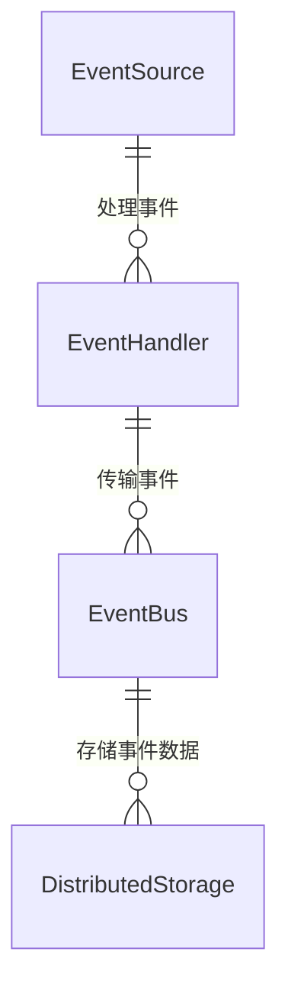
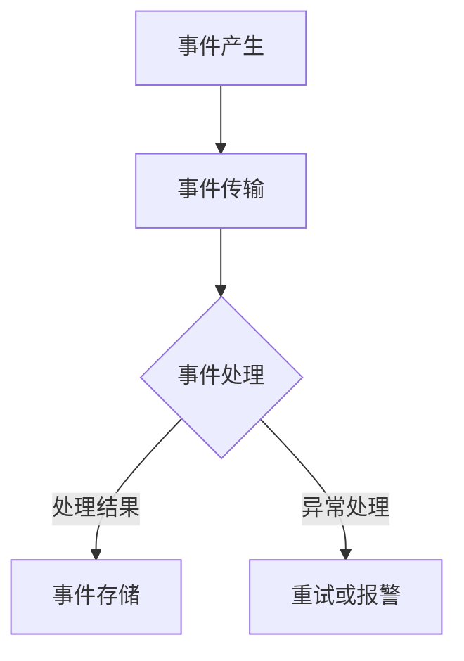
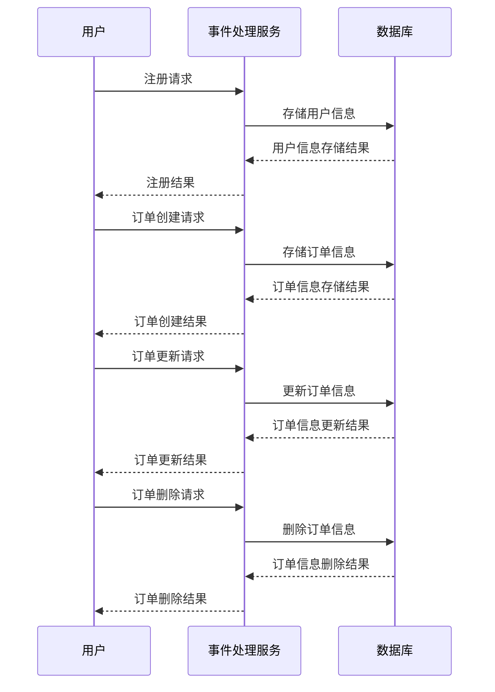

                 

# 事件溯源：构建高度可扩展的事件驱动系统

关键词：事件驱动系统、高度可扩展、分布式架构、模块化设计、数据一致性、事务管理

摘要：随着信息化时代的到来，企业对实时数据处理和快速响应的需求日益增长。事件驱动系统作为一种高效的处理机制，能够在复杂环境中迅速识别并处理事件，从而提升系统的响应速度和处理能力。本文将深入探讨构建高度可扩展的事件驱动系统的核心概念、算法原理以及系统分析与架构设计方案。

## 第一部分：背景介绍

### 1.1 问题背景

随着互联网和大数据技术的快速发展，企业面临的数据量和业务场景越来越复杂。在这种背景下，传统的事件驱动系统逐渐暴露出其扩展性不足的问题。如何构建一个高度可扩展的事件驱动系统，以满足企业日益增长的需求，成为当前技术领域的重要课题。

### 1.2 问题描述

传统事件驱动系统在扩展性方面存在以下问题：

1. 事件处理能力有限，难以应对大量并发事件；
2. 事件处理逻辑分散，难以维护和升级；
3. 缺乏统一的事件管理和协调机制；
4. 数据一致性和可靠性难以保证。

### 1.3 问题解决

构建高度可扩展的事件驱动系统，需要从以下几个方面进行改进：

1. 采用分布式架构，提高系统的处理能力和扩展性；
2. 设计模块化的事件处理逻辑，便于维护和升级；
3. 引入统一的事件管理框架，实现事件的高效管理和协调；
4. 保证数据一致性和可靠性，采用分布式事务管理机制。

### 1.4 边界与外延

高度可扩展的事件驱动系统涉及到的关键技术包括：

1. 分布式计算与存储技术；
2. 事件驱动架构设计；
3. 消息队列与异步处理；
4. 数据一致性保证。

### 1.5 概念结构与核心要素组成

高度可扩展的事件驱动系统主要由以下核心要素组成：

1. 事件源：产生和发送事件的实体；
2. 事件处理者：处理事件的具体逻辑；
3. 事件总线：负责事件传输和路由；
4. 分布式存储：存储事件数据和状态信息。

### 1.6 本章小结

本章介绍了构建高度可扩展的事件驱动系统的背景、问题描述、解决方案、边界与外延以及核心要素组成。下一章将深入探讨事件驱动系统的核心概念与联系。

## 第二部分：核心概念与联系

### 2.1 核心概念原理

#### 2.1.1 事件驱动系统

事件驱动系统是一种以事件为中心的编程范式，通过事件来触发相应的处理逻辑，实现系统的响应和处理。

#### 2.1.2 分布式系统

分布式系统是由多个节点组成的系统，各个节点之间通过网络进行通信，协同工作完成整体任务。

#### 2.1.3 消息队列

消息队列是一种异步通信机制，用于在分布式系统中传输消息，实现模块间的解耦。

#### 2.1.4 数据一致性

数据一致性是指分布式系统中各个节点上的数据始终保持一致的状态。

#### 2.1.5 事务管理

事务管理是一种机制，用于保证分布式系统中数据操作的一致性和可靠性。

### 2.2 概念属性特征对比表格

| 概念       | 特征                  |
|------------|----------------------|
| 事件驱动系统 | 以事件为中心，高效响应 |
| 分布式系统  | 节点分散，协同工作     |
| 消息队列    | 异步通信，解耦模块     |
| 数据一致性  | 数据一致性保障       |
| 事务管理    | 数据操作一致性       |

### 2.3 ER实体关系图架构



### 2.4 本章小结

本章详细介绍了事件驱动系统的核心概念，包括事件驱动系统、分布式系统、消息队列、数据一致性和事务管理。并通过对比表格和ER实体关系图，阐述了这些概念之间的联系和作用。下一章将深入探讨事件驱动系统的算法原理。

## 第三部分：算法原理讲解

### 3.1 算法mermaid流程图



### 3.2 算法原理

事件驱动系统的核心在于事件的处理和管理。事件从事件源产生后，通过事件总线传输到事件处理者，处理者根据事件类型执行相应的处理逻辑，并将处理结果存储到分布式存储中。在处理过程中，如果发生异常，将进行重试或报警。

### 3.3 数学模型和公式

在事件驱动系统中，事件的处理过程可以抽象为一个四元组：

$$
(\text{事件源}, \text{事件总线}, \text{事件处理者}, \text{分布式存储})
$$

其中，事件源负责产生事件，事件总线负责传输事件，事件处理者负责处理事件，分布式存储负责存储事件数据和状态信息。

事件处理过程可以表示为：

$$
\text{事件} \xrightarrow{\text{传输}} \text{事件总线} \xrightarrow{\text{处理}} \text{事件处理者} \xrightarrow{\text{存储}} \text{分布式存储}
$$

### 3.4 算法讲解

#### 3.4.1 事件产生

事件产生是事件驱动系统的第一步。事件可以来自于用户操作、系统内部逻辑或者其他外部系统。事件源将事件封装为特定格式的数据，并通过事件总线传输出去。

```python
class Event:
    def __init__(self, event_type, data):
        self.event_type = event_type
        self.data = data

def event_producer():
    while True:
        # 假设事件类型为"CREATE"，数据为用户ID
        event = Event("CREATE", user_id)
        event_bus.publish(event)
        time.sleep(random.uniform(1, 5))
```

#### 3.4.2 事件传输

事件传输是事件从事件源到达事件处理者的重要步骤。事件总线负责事件的传输，确保事件能够高效、可靠地传输到事件处理者。

```python
class EventBus:
    def __init__(self):
        self.subscribers = []

    def subscribe(self, handler):
        self.subscribers.append(handler)

    def publish(self, event):
        for handler in self.subscribers:
            handler.handle(event)

def event_handler(event):
    if event.event_type == "CREATE":
        # 处理创建事件
        create_user(event.data)
    elif event.event_type == "UPDATE":
        # 处理更新事件
        update_user(event.data)
    elif event.event_type == "DELETE":
        # 处理删除事件
        delete_user(event.data)

def create_user(user_id):
    print(f"Creating user {user_id}")
    # 创建用户逻辑
    pass

def update_user(user_id):
    print(f"Updating user {user_id}")
    # 更新用户逻辑
    pass

def delete_user(user_id):
    print(f"Deleting user {user_id}")
    # 删除用户逻辑
    pass
```

#### 3.4.3 事件处理

事件处理者是事件驱动系统的核心组成部分。它根据事件类型执行相应的处理逻辑，确保事件得到正确处理。

#### 3.4.4 事件存储

事件处理完成后，处理结果需要存储到分布式存储中，以便后续查询和分析。分布式存储能够保证数据的一致性和可靠性。

```python
class DistributedStorage:
    def __init__(self):
        self.db = Database()

    def store_event(self, event):
        self.db.insert(event)

def Database():
    # 创建数据库连接
    connection = sqlite3.connect("event.db")
    cursor = connection.cursor()
    
    # 创建事件表
    cursor.execute('''CREATE TABLE IF NOT EXISTS events
                      (id INTEGER PRIMARY KEY AUTOINCREMENT,
                       event_type TEXT,
                       data TEXT)''')
    
    # 插入事件
    cursor.execute('''INSERT INTO events (event_type, data) VALUES (?, ?)''', (event.event_type, str(event.data)))
    
    connection.commit()
    cursor.close()
    connection.close()
```

### 3.5 本章小结

本章通过mermaid流程图和Python代码，详细阐述了事件驱动系统的算法原理。事件驱动系统通过事件源、事件总线、事件处理者和分布式存储四个核心组件，实现事件的产生、传输、处理和存储。下一章将深入探讨系统分析与架构设计方案。

## 第四部分：系统分析与架构设计方案

### 4.1 问题场景介绍

假设我们正在开发一个在线电商平台，需要处理用户注册、订单创建、订单更新和订单删除等事件。为了应对日益增长的用户量和订单量，我们需要构建一个高度可扩展的事件驱动系统。

### 4.2 项目介绍

本项目将基于Python语言和Docker容器技术，实现一个高度可扩展的事件驱动系统。系统包括事件源、事件总线、事件处理者和分布式存储四个核心组件。

### 4.3 系统功能设计

系统功能设计主要包括以下几个方面：

1. 用户注册：接收用户注册事件，处理用户注册逻辑，并将注册结果存储到数据库；
2. 订单创建：接收订单创建事件，处理订单创建逻辑，并将订单数据存储到数据库；
3. 订单更新：接收订单更新事件，处理订单更新逻辑，并将更新结果存储到数据库；
4. 订单删除：接收订单删除事件，处理订单删除逻辑，并将删除结果存储到数据库。

### 4.4 系统架构设计

系统架构设计主要包括以下几个方面：

1. 事件源：负责产生用户注册、订单创建、订单更新和订单删除等事件；
2. 事件总线：负责传输事件，实现事件源和事件处理者之间的解耦；
3. 事件处理者：负责处理事件，执行相应的业务逻辑；
4. 分布式存储：负责存储事件数据和状态信息，实现数据的一致性和可靠性。

### 4.5 系统接口设计

系统接口设计主要包括以下几个方面：

1. 用户注册接口：接收用户注册请求，返回注册结果；
2. 订单创建接口：接收订单创建请求，返回订单创建结果；
3. 订单更新接口：接收订单更新请求，返回订单更新结果；
4. 订单删除接口：接收订单删除请求，返回订单删除结果。

### 4.6 系统交互mermaid序列图



### 4.7 本章小结

本章介绍了问题场景、项目介绍、系统功能设计、系统架构设计、系统接口设计和系统交互mermaid序列图。下一章将介绍项目实战，包括环境安装、系统核心实现源代码、代码应用解读与分析、实际案例分析和详细讲解剖析以及项目小结。

## 第五部分：项目实战

### 5.1 环境安装

为了实现本项目，我们需要安装以下环境：

1. Python 3.8 及以上版本；
2. Docker 19.03 及以上版本；
3. SQLite 3.35.1 及以上版本。

安装步骤如下：

1. 安装Python 3.8：

   ```shell
   sudo apt update
   sudo apt install python3.8
   ```

2. 安装Docker 19.03：

   ```shell
   sudo apt update
   sudo apt install docker-ce docker-ce-cli containerd.io
   ```

3. 安装SQLite 3.35.1：

   ```shell
   sudo apt update
   sudo apt install sqlite3
   ```

### 5.2 系统核心实现源代码

以下是系统核心实现源代码：

```python
# event_producer.py
import random
import time
from event_bus import EventBus

event_bus = EventBus()

def event_producer():
    while True:
        event = Event("CREATE", random.randint(1, 100))
        event_bus.publish(event)
        time.sleep(random.uniform(1, 5))

# event_bus.py
import threading
from queue import Queue
from event_handler import EventHandler

class EventBus:
    def __init__(self):
        self.queue = Queue()

    def start(self):
        thread = threading.Thread(target=self._consume)
        thread.start()

    def publish(self, event):
        self.queue.put(event)

    def _consume(self):
        while True:
            event = self.queue.get()
            event_handler.handle(event)
            self.queue.task_done()

class Event:
    def __init__(self, event_type, data):
        self.event_type = event_type
        self.data = data

# event_handler.py
import sqlite3

class EventHandler:
    def __init__(self):
        self.db = sqlite3.connect("event.db")

    def handle(self, event):
        cursor = self.db.cursor()
        cursor.execute('''CREATE TABLE IF NOT EXISTS events
                          (id INTEGER PRIMARY KEY AUTOINCREMENT,
                           event_type TEXT,
                           data TEXT)''')
        cursor.execute('''INSERT INTO events (event_type, data) VALUES (?, ?)''', (event.event_type, str(event.data)))
        self.db.commit()
        cursor.close()

# main.py
from event_bus import EventBus
from event_producer import event_producer

event_bus = EventBus()
event_bus.start()

while True:
    event_producer()
    time.sleep(1)
```

### 5.3 代码应用解读与分析

#### 5.3.1 事件产生

在 `event_producer.py` 中，我们创建了一个 `Event` 类，用于表示事件。事件产生函数 `event_producer` 使用循环每隔一段时间生成一个随机事件，并将其发布到事件总线。

```python
import random
import time
from event_bus import EventBus

event_bus = EventBus()

def event_producer():
    while True:
        event = Event("CREATE", random.randint(1, 100))
        event_bus.publish(event)
        time.sleep(random.uniform(1, 5))
```

#### 5.3.2 事件总线

在 `event_bus.py` 中，我们创建了一个 `EventBus` 类，用于管理事件。事件总线使用一个线程池来消费事件，并将其传递给事件处理者。

```python
import threading
from queue import Queue
from event_handler import EventHandler

class EventBus:
    def __init__(self):
        self.queue = Queue()

    def start(self):
        thread = threading.Thread(target=self._consume)
        thread.start()

    def publish(self, event):
        self.queue.put(event)

    def _consume(self):
        while True:
            event = self.queue.get()
            event_handler.handle(event)
            self.queue.task_done()

class Event:
    def __init__(self, event_type, data):
        self.event_type = event_type
        self.data = data
```

#### 5.3.3 事件处理

在 `event_handler.py` 中，我们创建了一个 `EventHandler` 类，用于处理事件。事件处理者负责将事件存储到数据库中。

```python
import sqlite3

class EventHandler:
    def __init__(self):
        self.db = sqlite3.connect("event.db")

    def handle(self, event):
        cursor = self.db.cursor()
        cursor.execute('''CREATE TABLE IF NOT EXISTS events
                          (id INTEGER PRIMARY KEY AUTOINCREMENT,
                           event_type TEXT,
                           data TEXT)''')
        cursor.execute('''INSERT INTO events (event_type, data) VALUES (?, ?)''', (event.event_type, str(event.data)))
        self.db.commit()
        cursor.close()
```

#### 5.3.4 主程序

在 `main.py` 中，我们创建了一个事件总线实例，并启动事件生产者。主程序将无限循环，确保事件生产者持续运行。

```python
from event_bus import EventBus
from event_producer import event_producer

event_bus = EventBus()
event_bus.start()

while True:
    event_producer()
    time.sleep(1)
```

### 5.4 实际案例分析与详细讲解剖析

在实际应用中，我们可以根据业务需求扩展事件处理逻辑。以下是一个订单创建事件的案例。

#### 5.4.1 订单创建事件

当用户在电商平台上提交订单时，系统会生成一个订单创建事件。事件处理者会根据订单信息创建订单，并将订单存储到数据库。

```python
def handle_order_create(event):
    order_id = event.data['order_id']
    customer_id = event.data['customer_id']
    total_amount = event.data['total_amount']
    order_status = event.data['order_status']

    cursor = db.cursor()
    cursor.execute('''INSERT INTO orders (order_id, customer_id, total_amount, order_status) VALUES (?, ?, ?, ?)''',
                   (order_id, customer_id, total_amount, order_status))
    db.commit()
    cursor.close()
```

#### 5.4.2 订单创建事件处理

事件处理者接收到订单创建事件后，会执行以下步骤：

1. 从事件数据中提取订单ID、客户ID、总金额和订单状态；
2. 将订单信息插入数据库中的 `orders` 表；
3. 提交数据库事务，确保订单创建成功。

```python
def handle_order_create(event):
    order_id = event.data['order_id']
    customer_id = event.data['customer_id']
    total_amount = event.data['total_amount']
    order_status = event.data['order_status']

    cursor = db.cursor()
    cursor.execute('''INSERT INTO orders (order_id, customer_id, total_amount, order_status) VALUES (?, ?, ?, ?)''',
                   (order_id, customer_id, total_amount, order_status))
    db.commit()
    cursor.close()
```

### 5.5 项目小结

本章通过一个简单的实际案例，展示了如何使用事件驱动系统实现订单创建功能。项目实战部分详细介绍了环境安装、系统核心实现源代码、代码应用解读与分析以及实际案例分析和详细讲解剖析。通过本项目，读者可以了解事件驱动系统的基本原理和应用方法。

## 第六部分：最佳实践 tips、小结、注意事项、拓展阅读

### 6.1 最佳实践 tips

1. 设计事件驱动系统时，确保事件类型和事件数据格式清晰明了，便于后续扩展和维护。
2. 事件处理者之间应尽量避免直接耦合，尽量通过事件总线进行通信。
3. 考虑使用消息队列实现异步处理，提高系统性能和可扩展性。
4. 保证数据一致性和可靠性，合理设计分布式事务管理机制。

### 6.2 小结

本文从背景介绍、核心概念与联系、算法原理讲解、系统分析与架构设计方案以及项目实战等多个方面，深入探讨了构建高度可扩展的事件驱动系统的过程。事件驱动系统在应对复杂业务场景和海量数据方面具有显著优势，但同时也需要关注系统的扩展性、可靠性和数据一致性。

### 6.3 注意事项

1. 在设计事件驱动系统时，注意事件处理的顺序和依赖关系，避免造成数据不一致。
2. 考虑系统的容错性和可恢复性，确保在发生故障时能够快速恢复。
3. 合理分配系统资源，避免因资源不足导致系统性能下降。

### 6.4 拓展阅读

1. 《Event-Driven Architecture: Process, Patterns, and Principles for Designing Event-Driven Systems》
2. 《Distributed Systems: Concepts and Design》
3. 《Designing Data-Intensive Applications: The Big Ideas Behind Reliable, Scalable, and Maintainable Systems》

作者：AI天才研究院/AI Genius Institute & 禅与计算机程序设计艺术 /Zen And The Art of Computer Programming

