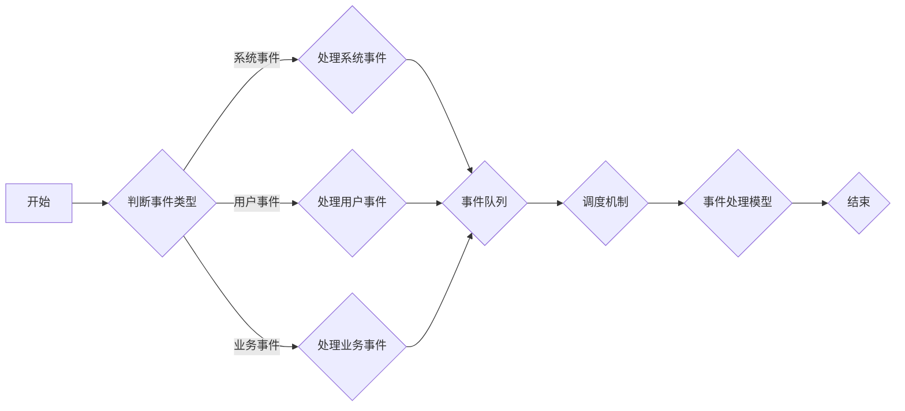
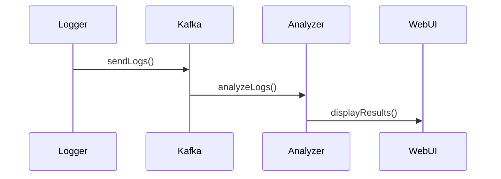
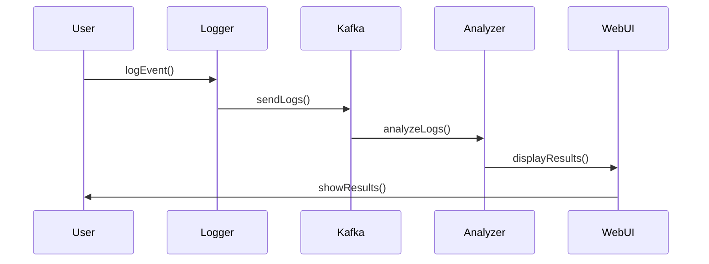

                 

### 文章标题

# 事件驱动架构：构建响应式系统

> 关键词：事件驱动架构、响应式系统、架构设计、异步通信、并发处理

> 摘要：本文深入探讨了事件驱动架构及其在构建响应式系统中的应用。通过系统的理论阐述、实际案例分析和最佳实践分享，帮助读者全面理解事件驱动架构的核心概念、技术实现和应用场景，掌握构建高效、灵活的响应式系统的关键技巧。

### 引言

#### 1.1 事件驱动架构概述

事件驱动架构（Event-Driven Architecture，EDA）是一种软件设计范式，它基于事件触发机制，通过事件的生成、传递和处理来实现系统的响应。与传统的请求-响应模型不同，事件驱动架构强调系统的异步性和解耦合，能够更好地应对高并发、高可扩展性和复杂交互的场景。

事件驱动架构的核心思想在于“事件为中心”，通过事件来实现系统组件之间的通信和协作。事件可以理解为一种数据载体，它携带了系统的状态变化信息，当事件发生时，系统会根据预定的规则和逻辑对事件进行处理，从而实现相应的功能。

#### 1.2 响应式系统的概念和优势

响应式系统（Reactive System）是一种能够对外部事件快速响应并保持内部状态一致性的系统。它具有以下几个显著特点：

1. **高并发处理能力**：响应式系统能够高效处理大量并发请求，保证系统的响应速度和稳定性。
2. **弹性伸缩性**：通过事件驱动机制，响应式系统可以灵活地增加或减少处理能力，以适应不同的负载需求。
3. **高可靠性**：响应式系统通过事件队列和异步处理机制，有效避免了同步阻塞，提高了系统的健壮性和容错性。
4. **高可维护性**：事件驱动架构的模块化和解耦合特性，使得系统易于扩展和维护。

#### 1.3 为什么需要学习事件驱动架构

随着互联网和云计算的发展，系统架构日益复杂，对系统的性能、可扩展性和可靠性提出了更高的要求。事件驱动架构以其独特的优势，成为应对这些挑战的有效手段。学习事件驱动架构，有助于：

1. **提升系统设计的灵活性**：掌握事件驱动架构设计模式，可以灵活应对各种业务需求，提高系统的可扩展性。
2. **提高系统性能和稳定性**：通过异步通信和并发处理机制，优化系统性能，提升用户体验。
3. **适应未来发展趋势**：响应式系统和微服务架构等新兴技术，都依赖于事件驱动架构，学习事件驱动架构有助于把握技术发展方向。

### 基础理论

#### 2.1 事件驱动架构的历史与发展

事件驱动架构并非一个全新的概念，它的起源可以追溯到早期计算机系统。然而，随着软件系统规模的扩大和复杂性增加，事件驱动架构逐渐得到重视并得到广泛应用。

- **早期阶段**：在20世纪70年代，早期操作系统如UNIX和Windows都采用了事件驱动模型。操作系统通过监听键盘、鼠标等设备的事件，实现对用户输入的响应。
- **成熟阶段**：随着互联网和Web应用的兴起，事件驱动架构在Web服务器、实时通信系统等领域得到了广泛应用。典型的框架如Node.js、React等，都采用了事件驱动模式。
- **现代阶段**：随着云计算、物联网和大数据等技术的不断发展，事件驱动架构在构建高并发、高可扩展性和高可靠性系统方面展现出强大的优势。现代事件驱动架构框架如Kafka、RabbitMQ等，为系统设计提供了丰富的工具和资源。

#### 2.2 核心概念

事件驱动架构的核心概念主要包括事件类型、事件队列、调度机制和事件处理模型。

- **事件类型**：事件是驱动系统执行操作的数据载体，可以分为系统事件、用户事件和业务事件等类型。系统事件通常由操作系统或硬件设备触发，如键盘输入、鼠标移动等；用户事件由用户操作触发，如点击、拖动等；业务事件由系统内部业务逻辑触发，如订单创建、用户登录等。
- **事件队列**：事件队列是存储和管理事件的数据结构。系统在接收到事件后，会将事件放入事件队列中，按照一定的调度策略进行处理。事件队列通常具有高吞吐量和低延迟的特点。
- **调度机制**：调度机制负责对事件队列中的事件进行排序和调度。常见的调度策略包括先进先出（FIFO）、后进先出（LIFO）、优先级调度等。调度机制的选择取决于系统的需求和性能要求。
- **事件处理模型**：事件处理模型描述了系统对事件进行处理的方式和流程。常见的事件处理模型包括单线程处理模型、多线程处理模型和非阻塞处理模型。单线程处理模型将事件处理集中在一个线程中，适用于简单应用场景；多线程处理模型将事件处理分布在多个线程中，提高系统的并发处理能力；非阻塞处理模型通过异步I/O和事件循环机制，实现事件的高效处理。

#### 2.3 传统架构比较

事件驱动架构与传统请求-响应架构在系统设计理念、性能特点和适用场景等方面存在显著差异。

- **系统设计理念**：传统请求-响应架构基于同步通信模型，系统组件通过请求和响应进行交互。事件驱动架构基于异步通信模型，系统组件通过事件进行通信，解耦合度高。
- **性能特点**：传统请求-响应架构在高并发场景下容易出现阻塞和性能瓶颈，而事件驱动架构通过异步处理和并发机制，能够更好地应对高并发需求，具有更高的性能和稳定性。
- **适用场景**：传统请求-响应架构适用于简单的、线性处理流程的系统，如简单的Web应用、桌面应用程序等。事件驱动架构适用于复杂的、高并发、高可扩展性和高可靠性的系统，如Web服务器、实时通信系统、物联网平台等。

### 核心概念

#### 3.1 事件类型与生命周期

事件是驱动事件驱动架构运行的核心要素。根据事件的来源和性质，事件可以分为多种类型。以下是对常见事件类型的说明：

- **系统事件**：由操作系统或硬件设备触发，如键盘输入、鼠标移动、网络连接等。系统事件通常由操作系统或硬件设备进行捕获和发送。
- **用户事件**：由用户操作触发，如点击、拖动、提交表单等。用户事件通常通过用户界面捕获并生成。
- **业务事件**：由系统内部业务逻辑触发，如订单创建、用户登录、数据更新等。业务事件通常由业务逻辑组件生成，用于驱动业务流程。

事件的生命周期包括事件生成、事件传递、事件处理和事件完成等阶段。以下是对各阶段的具体描述：

- **事件生成**：事件生成是指系统在特定条件下创建事件的过程。系统事件通常由操作系统或硬件设备自动生成，用户事件和业务事件通常由系统内部组件根据业务逻辑生成。
- **事件传递**：事件传递是指事件在系统内部传递的过程。事件通过事件队列进行传递，从事件生成者传递到事件消费者。事件传递过程中，可能需要经过多个中间组件或服务，以确保事件能够到达正确的处理者。
- **事件处理**：事件处理是指系统对事件进行处理的流程。事件消费者根据事件类型和业务逻辑，对事件进行相应的处理，如更新数据、触发其他事件等。事件处理通常涉及到事件队列、调度机制和事件处理模型等多个方面。
- **事件完成**：事件完成是指事件处理结束后，系统对事件进行标记和清理的过程。事件完成阶段主要包括事件从事件队列中移除、资源释放等操作，以确保系统资源的有效利用。

#### 3.2 事件队列与调度机制

事件队列是事件驱动架构中的核心数据结构，负责存储和管理事件。以下是对事件队列和调度机制的具体描述：

- **事件队列**：事件队列是一个有序的数据结构，用于存储等待处理的事件。事件队列通常具有高吞吐量和低延迟的特点，以确保系统能够及时响应事件。事件队列可以采用先进先出（FIFO）、后进先出（LIFO）或优先级队列等不同的数据结构进行实现。
- **调度机制**：调度机制负责对事件队列中的事件进行排序和调度。调度机制的选择取决于系统的需求和性能要求。常见的调度策略包括：
  - 先进先出（FIFO）：按照事件进入队列的顺序进行调度，适用于简单的场景。
  - 后进先出（LIFO）：按照事件进入队列的逆序进行调度，适用于需要按时间顺序处理事件的场景。
  - 优先级调度：根据事件的优先级进行调度，优先处理优先级高的事件，适用于需要根据重要性进行事件处理的场景。
- **并发处理**：在事件驱动架构中，事件队列和调度机制需要支持并发处理。为了提高系统的并发处理能力，事件队列和调度机制需要具备以下特性：
  - 并发访问：事件队列和调度机制需要支持多个线程或进程同时访问，以确保系统的高并发性能。
  - 锁机制：事件队列和调度机制需要实现适当的锁机制，以确保多线程或进程之间的数据一致性和安全性。
  - 阻塞处理：事件队列和调度机制需要支持阻塞处理，以避免过多的事件处理导致系统资源消耗过多。

#### 3.3 事件处理模型

事件处理模型描述了系统对事件进行处理的流程和方式。以下是对常见事件处理模型的介绍：

- **单线程处理模型**：单线程处理模型将事件处理集中在一个线程中，适用于简单的应用场景。在该模型中，系统通过事件队列接收事件，并按照顺序进行处理。单线程处理模型的优点是简单易实现，但缺点是并发处理能力较低，容易成为系统的性能瓶颈。
- **多线程处理模型**：多线程处理模型将事件处理分布在多个线程中，提高系统的并发处理能力。在该模型中，系统通过事件队列将事件分发到不同的线程进行处理。多线程处理模型的优点是提高了系统的并发性能，但缺点是需要处理线程同步和锁机制等问题。
- **非阻塞处理模型**：非阻塞处理模型通过异步I/O和事件循环机制，实现事件的高效处理。在该模型中，系统通过事件循环接收和处理事件，避免了线程阻塞和同步问题。非阻塞处理模型的优点是性能高、可扩展性强，但缺点是实现较为复杂。

### 技术实现

#### 4.1 常用事件驱动框架介绍

事件驱动架构在实际开发中需要依赖一系列的事件驱动框架和库，以下介绍几个常用的事件驱动框架：

- **Node.js**：Node.js是一个基于Chrome V8引擎的JavaScript运行时环境，它允许在服务器端运行JavaScript代码。Node.js通过事件循环机制实现异步I/O操作，支持高性能的非阻塞事件处理。Node.js广泛应用于Web应用、实时通信和数据分析等领域。
- **React**：React是一个用于构建用户界面的JavaScript库，它采用虚拟DOM和事件委托机制，实现高效的UI渲染和事件处理。React的事件系统基于合成事件模型，提供统一的、跨浏览器的API，简化了事件处理逻辑。
- **Kafka**：Kafka是一个分布式流处理平台，用于构建高吞吐量的消息队列和事件驱动系统。Kafka基于分区和副本机制，提供高可用性和高性能的消息传递功能。Kafka广泛应用于大数据处理、实时分析和物联网等领域。
- **RabbitMQ**：RabbitMQ是一个开源的消息队列中间件，支持多种消息传输协议，如AMQP、MQTT等。RabbitMQ提供灵活的队列管理和消息路由功能，支持异步和可靠的消息传递，适用于分布式系统和微服务架构。
- **Spring Framework**：Spring Framework是一个开源的Java企业级应用框架，支持事件驱动架构的开发。Spring通过Spring Events和Spring WebSocket等模块，提供事件驱动编程模型和实时通信功能。

#### 4.2 事件驱动架构设计模式

事件驱动架构设计模式是构建事件驱动系统的重要指导原则，以下介绍几种常用的事件驱动架构设计模式：

- **发布-订阅模式**：发布-订阅模式是一种消息传递模式，由事件发布者和事件订阅者组成。事件发布者发布事件，事件订阅者订阅感兴趣的事件，并在接收到事件时进行相应的处理。发布-订阅模式具有高解耦合性，适用于复杂的业务流程和动态交互场景。
- **观察者模式**：观察者模式是一种基于事件驱动的依赖关系模式，由观察者和被观察者组成。被观察者发生状态变化时，会通知所有观察者，观察者根据自身需求进行相应的处理。观察者模式具有简洁性和灵活性，适用于简单的状态监听和通知场景。
- **中介者模式**：中介者模式是一种用于解决复杂对象之间通信问题的设计模式。在中介者模式中，对象之间不直接通信，而是通过一个中介者对象进行通信。中介者模式降低了对象之间的耦合度，提高了系统的可维护性和扩展性。
- **事件流模式**：事件流模式是一种基于事件流的编程模型，用于处理复杂的事件驱动场景。事件流模式将事件流视为数据流，通过流处理器对事件流进行过滤、转换和处理。事件流模式具有灵活性和可扩展性，适用于实时数据处理和流计算场景。

#### 4.3 异步通信机制

异步通信机制是实现事件驱动架构的关键，以下介绍几种常见的异步通信机制：

- **异步消息队列**：异步消息队列是一种用于实现异步消息传递的中间件，它存储和处理来自不同源的事件消息。异步消息队列支持高吞吐量和低延迟的消息传递，适用于分布式系统和微服务架构。常见的异步消息队列包括RabbitMQ、Kafka、ActiveMQ等。
- **WebSockets**：WebSockets是一种基于TCP协议的实时通信协议，用于实现服务器和客户端之间的全双工通信。WebSockets支持低延迟、高吞吐量的实时数据传输，适用于实时聊天、在线游戏和实时数据监控等场景。
- **事件驱动网络编程**：事件驱动网络编程是一种基于事件驱动模型的网络编程框架，用于实现高效的异步网络通信。事件驱动网络编程通过事件循环机制，处理网络连接、数据传输和错误处理等任务，适用于高性能网络应用开发。

### 实际应用

#### 5.1 事件驱动在Web开发中的应用

事件驱动架构在Web开发中得到了广泛应用，以下介绍几种常见应用场景：

- **单页面应用**：单页面应用（Single Page Application，SPA）是一种基于Web的技术架构，通过JavaScript动态更新页面内容，提供快速、流畅的用户体验。事件驱动架构在SPA中用于处理用户交互事件、数据更新事件和路由事件等，实现页面的动态更新和状态管理。
- **实时通信**：实时通信是一种基于WebSockets或长轮询技术的通信方式，用于实现服务器和客户端之间的实时数据传输。事件驱动架构在实时通信中用于处理消息发送、消息接收和事件通知等任务，实现实时消息传递和用户状态同步。
- **数据驱动应用**：数据驱动应用（Data-Driven Application）是一种基于数据驱动的开发模式，通过数据流驱动应用逻辑和界面更新。事件驱动架构在数据驱动应用中用于处理数据变更事件、数据查询事件和数据同步事件等，实现数据的实时更新和一致性维护。

#### 5.2 事件驱动在移动应用开发中的应用

事件驱动架构在移动应用开发中也具有广泛的应用，以下介绍几种常见应用场景：

- **推送通知**：推送通知是一种用于向用户发送实时消息的通知服务，通过事件驱动架构实现高效的推送通知机制。事件驱动架构在推送通知中用于处理消息接收、消息处理和用户反馈等任务，实现实时的消息传递和用户交互。
- **实时更新**：实时更新是一种用于在移动应用中实时显示和更新数据的功能，通过事件驱动架构实现数据的实时同步和更新。事件驱动架构在实时更新中用于处理数据变更事件、数据查询事件和数据同步事件等，实现数据的实时性和一致性。
- **离线功能**：离线功能是一种在用户离线状态下依然可以使用的功能，通过事件驱动架构实现数据的离线存储和同步。事件驱动架构在离线功能中用于处理数据存储、数据同步和数据恢复等任务，实现离线状态下的数据访问和功能维护。

#### 5.3 事件驱动在企业级系统中的应用

事件驱动架构在企业级系统中也具有广泛的应用，以下介绍几种常见应用场景：

- **分布式系统**：分布式系统是一种由多个节点组成的计算系统，通过事件驱动架构实现节点之间的协同工作。事件驱动架构在分布式系统中用于处理节点状态变更事件、任务分配事件和节点故障事件等，实现系统的可靠性和可扩展性。
- **物联网平台**：物联网平台是一种用于连接和管理物联网设备的系统，通过事件驱动架构实现设备状态监控、数据采集和实时报警等功能。事件驱动架构在物联网平台中用于处理设备连接事件、设备状态事件和数据传输事件等，实现设备的实时监控和管理。
- **数据分析和挖掘**：数据分析和挖掘是一种用于从大量数据中提取知识和价值的技术，通过事件驱动架构实现数据的实时处理和分析。事件驱动架构在数据分析和挖掘中用于处理数据采集事件、数据处理事件和数据挖掘事件等，实现数据的实时性和准确性。

### 案例分析

#### 6.1 典型事件驱动系统的案例分析

为了更好地理解事件驱动架构的实际应用，以下介绍两个典型的事件驱动系统案例。

- **案例1：实时聊天应用**

实时聊天应用是一个典型的应用场景，通过事件驱动架构实现实时的消息传递和用户状态同步。在该案例中，系统采用WebSockets作为通信协议，通过事件队列和调度机制处理用户消息发送、消息接收和事件通知等任务。事件驱动架构的特点使得系统具有低延迟、高并发和高可靠性。

1. **项目背景**：实时聊天应用是一个用于实现用户之间实时通信的应用程序，需要支持多人在线聊天、实时消息推送和用户状态同步等功能。
2. **系统架构设计**：系统采用事件驱动架构，包括前端、后端和消息队列三个部分。前端通过WebSockets与后端进行实时通信，后端通过事件队列和调度机制处理消息传输和用户状态更新等任务，消息队列负责存储和管理消息。
3. **核心代码实现**：前端使用JavaScript实现用户界面和消息发送功能，后端使用Node.js实现事件处理和消息路由功能。消息队列采用Kafka实现，确保消息的可靠传输和异步处理。
4. **系统性能优化**：通过使用异步I/O和事件循环机制，系统实现了高效的消息处理和低延迟的通信性能。同时，通过消息队列的分区和副本机制，提高了系统的吞吐量和可用性。

- **案例2：物联网平台**

物联网平台是一个用于连接和管理物联网设备的系统，通过事件驱动架构实现设备的实时监控和管理。在该案例中，系统采用事件驱动架构，包括设备端、网关和云平台三个部分。设备端通过发送事件数据到网关，网关通过事件队列和调度机制处理数据存储、分析和实时报警等任务，云平台通过事件驱动架构实现数据可视化和管理功能。

1. **项目背景**：物联网平台是一个用于连接和管理大量物联网设备的系统，需要支持设备连接、数据采集、实时报警和设备管理等功能。
2. **系统架构设计**：系统采用事件驱动架构，包括设备端、网关和云平台三个部分。设备端通过发送事件数据到网关，网关通过事件队列和调度机制处理数据存储、分析和实时报警等任务，云平台通过事件驱动架构实现数据可视化和管理功能。
3. **核心代码实现**：设备端使用嵌入式系统语言实现设备连接和数据采集功能，网关使用Node.js实现事件处理和消息路由功能，云平台使用Spring Framework实现数据存储、分析和可视化功能。
4. **系统性能优化**：通过使用异步I/O和事件循环机制，系统实现了高效的数据处理和低延迟的通信性能。同时，通过消息队列的分区和副本机制，提高了系统的吞吐量和可用性。

#### 6.2 构建一个事件驱动系统的实战案例

以下是一个简单的实战案例，演示如何使用Node.js和Kafka构建一个事件驱动系统。

- **项目背景**：构建一个实时日志收集和分析系统，用于收集多个来源的日志数据，并进行实时分析，生成可视化报表。

- **环境安装**

  1. 安装Node.js：从官方网站下载并安装Node.js。
  2. 安装Kafka：从Apache Kafka官方网站下载并安装Kafka。
  3. 安装Kafka客户端库：在Node.js项目中安装kafka-node库，用于与Kafka进行通信。

- **系统架构设计**

  1. 设备端：使用嵌入式系统语言（如C/C++）收集日志数据，并通过Kafka客户端将日志数据发送到Kafka集群。
  2. Kafka集群：使用Kafka作为消息队列，存储和处理日志数据。
  3. 后端服务：使用Node.js构建后端服务，从Kafka集群中读取日志数据，进行实时分析，并将分析结果存储到数据库中。
  4. 前端界面：使用Web技术（如HTML、CSS和JavaScript）构建前端界面，用于展示分析结果。

- **核心代码实现**

  1. **设备端**：设备端代码用于收集日志数据，并将其发送到Kafka。以下是一个简单的示例代码：

     ```c
     #include <kafka/client.h>
     #include <stdio.h>

     int main() {
         KafkaClient *client = kafka_client_create("localhost:9092");
         if (!client) {
             printf("Failed to create Kafka client\n");
             return 1;
         }

         // 创建日志主题
         if (kafka_topic_create(client, "logs", 1) != 0) {
             printf("Failed to create Kafka topic\n");
             return 1;
         }

         // 发送日志数据
         for (;;) {
             printf("Enter log message: ");
             char message[1024];
             fgets(message, sizeof(message), stdin);

             if (kafka_send(client, "logs", message, strlen(message)) != 0) {
                 printf("Failed to send log message\n");
             }

             sleep(1);
         }

         kafka_client_destroy(client);
         return 0;
     }
     ```

  2. **后端服务**：后端服务代码用于从Kafka集群中读取日志数据，进行实时分析，并将分析结果存储到数据库中。以下是一个简单的示例代码：

     ```javascript
     const kafka = require('kafka-node');
     const Client = kafka.KafkaClient;
     const Producer = kafka.Producer;
     const Topic = kafka.Topic;
     const Consumer = kafka.Consumer;

     // 创建Kafka客户端
     const client = new Client({ kafkaHost: 'localhost:9092' });
     const producer = new Producer(client);
     const consumer = new Consumer(client, [{ topic: 'logs', partition: 0, offset: 0 }]);

     // 处理日志数据
     consumer.on('message', (message) => {
         console.log(`Received log message: ${message.value}`);

         // 进行日志分析
         // ...

         // 将分析结果存储到数据库
         // ...
     });

     // 发送分析结果到Kafka
     producer.on('ready', () => {
         const payloads = [
             { topic: 'analysis_results', messages: 'Analysis result', partition: 0 }
         ];

         producer.send(payloads, (err, data) => {
             if (err) {
                 console.log(`Failed to send analysis result: ${err}`);
             } else {
                 console.log(`Sent analysis result: ${data}`);
             }
         });
     });
     ```

  3. **前端界面**：前端界面代码用于展示分析结果，可以使用HTML、CSS和JavaScript等前端技术实现。以下是一个简单的示例代码：

     ```html
     <!DOCTYPE html>
     <html>
     <head>
         <title>日志分析结果</title>
         <style>
             /* 样式设置 */
         </style>
     </head>
     <body>
         <h1>日志分析结果</h1>
         <div id="results"></div>

         <script>
             // 获取分析结果
             fetch('/api/analysis_results')
                 .then(response => response.json())
                 .then(data => {
                     const resultsDiv = document.getElementById('results');
                     resultsDiv.innerHTML = `<pre>${JSON.stringify(data, null, 2)}</pre>`;
                 });
         </script>
     </body>
     </html>
     ```

- **实际案例分析和详细讲解剖析**：在上述实战案例中，我们通过设备端、后端服务和前端界面三个部分，构建了一个简单的实时日志收集和分析系统。以下是对各部分的详细讲解：

  1. **设备端**：设备端代码负责收集日志数据，并将其发送到Kafka集群。设备端通过Kafka客户端库与Kafka进行通信，使用创建主题和发送消息的方法实现日志数据的收集和传输。

  2. **后端服务**：后端服务代码负责从Kafka集群中读取日志数据，进行实时分析，并将分析结果存储到数据库中。后端服务通过Kafka消费者客户端库与Kafka进行通信，使用消费者订阅主题和接收消息的方法实现日志数据的接收和分析。

  3. **前端界面**：前端界面代码用于展示分析结果，通过HTTP请求获取后端服务提供的分析结果，并将其显示在网页上。

  在实际应用中，可以根据具体需求对上述案例进行扩展和优化，例如增加日志数据的预处理和过滤功能、实现更复杂的数据分析和可视化等。

- **项目小结**：通过上述实战案例，我们了解了如何使用Node.js和Kafka构建一个简单的事件驱动系统。事件驱动架构具有高效、灵活、可扩展等优点，适用于各种实时数据处理和交互场景。在实际开发中，可以根据项目需求选择合适的事件驱动框架和工具，构建高性能、高可扩展性的系统。

### 总结与展望

#### 7.1 事件驱动架构的未来发展

事件驱动架构作为一种高效、灵活的软件设计范式，已经在各个领域得到了广泛应用。随着云计算、物联网和大数据等技术的不断发展，事件驱动架构将继续演进和优化，为系统设计和开发带来更多的创新和机遇。

- **高并发处理能力**：随着系统规模的不断扩大，高并发处理能力成为事件驱动架构的重要挑战。未来，事件驱动架构将更加注重性能优化和资源利用，通过分布式架构、缓存技术、异步I/O等手段，实现更高的并发处理能力和系统性能。
- **实时数据处理**：实时数据处理是事件驱动架构的重要应用领域，未来将更加关注实时数据流处理、实时分析和实时决策等方向。通过引入流处理框架、实时计算引擎等技术，实现更高效、更准确的数据处理和分析。
- **自动化与智能化**：自动化和智能化是未来事件驱动架构的发展方向，通过引入人工智能、机器学习等技术，实现系统的自动化配置、自动化运维和智能化决策，提高系统的自适应能力和智能水平。
- **标准化和生态建设**：为了推动事件驱动架构的普及和发展，未来将更加注重标准化和生态建设。通过制定统一的架构标准和接口规范，促进不同技术和框架之间的兼容性和互操作性，构建更加丰富和完善的生态系统。

#### 7.2 总结和反思

通过对事件驱动架构的深入探讨，我们可以得出以下几点总结和反思：

- **事件驱动架构是一种高效、灵活的软件设计范式，适用于各种实时数据处理和交互场景。**
- **事件驱动架构的核心概念包括事件类型、事件队列、调度机制和事件处理模型，需要深入理解和掌握。**
- **在实际应用中，事件驱动架构需要结合具体的业务需求和技术场景，进行合理的架构设计和性能优化。**
- **事件驱动架构具有高并发处理能力、弹性伸缩性和高可靠性等优点，但也存在一定的实现复杂度和性能挑战。**
- **为了更好地应对未来技术的发展和挑战，我们需要不断学习和探索，掌握更多的事件驱动架构设计和开发技能。**

#### 7.3 学习资源的推荐

对于希望深入了解事件驱动架构的读者，以下推荐一些学习资源：

- **书籍**：
  - 《事件驱动架构：构建响应式系统》（本书）
  - 《微服务设计》（Sam Newman）
  - 《分布式系统设计》（Martin Kleppmann）
- **在线教程**：
  - Node.js官方文档：[https://nodejs.org/docs/latest-v10.x/api/](https://nodejs.org/docs/latest-v10.x/api/)
  - Kafka官方文档：[https://kafka.apache.org/documentation/](https://kafka.apache.org/documentation/)
  - React官方文档：[https://reactjs.org/docs/getting-started.html](https://reactjs.org/docs/getting-started.html)
- **开源框架和库**：
  - Kafka：[https://kafka.apache.org/](https://kafka.apache.org/)
  - RabbitMQ：[https://www.rabbitmq.com/](https://www.rabbitmq.com/)
  - Spring Framework：[https://spring.io/projects/spring-framework](https://spring.io/projects/spring-framework)
- **技术社区和论坛**：
  - Stack Overflow：[https://stackoverflow.com/](https://stackoverflow.com/)
  - GitHub：[https://github.com/](https://github.com/)
  - Hacker News：[https://news.ycombinator.com/](https://news.ycombinator.com/)

### 作者信息

- 作者：AI天才研究院/AI Genius Institute & 禅与计算机程序设计艺术 /Zen And The Art of Computer Programming

### 附录

#### 附录A：术语解释

- **事件驱动架构**：一种基于事件触发机制的软件设计范式，通过事件实现系统组件之间的通信和协作。
- **响应式系统**：一种能够对外部事件快速响应并保持内部状态一致性的系统。
- **异步通信**：一种非阻塞的通信方式，允许系统在等待某些操作完成时继续执行其他任务。
- **并发处理**：同时处理多个任务或请求的能力，可以提高系统的性能和吞吐量。

#### 附录B：概念属性特征对比表格

| 概念         | 特征1 | 特征2 | 特征3 |
|--------------|-------|-------|-------|
| 事件驱动架构 | 异步性 | 解耦合 | 高可扩展性 |
| 响应式系统   | 快速响应 | 状态一致性 | 高可靠性 |
| 异步通信     | 非阻塞 | 高吞吐量 | 低延迟 |
| 并发处理     | 同时处理多个任务 | 提高性能 | 增加吞吐量 |

#### 附录C：ER实体关系图架构

```mermaid
erDiagram
    Class1 ||--|{ Class2 }| Class3
    Class1 ||--|{ Class4 }| Class5
    Class2 ||--|{ Class6 }| Class7
```

#### 附录D：算法原理mermaid流程图



#### 附录E：系统分析与架构设计方案

##### 5.1 问题场景介绍

随着互联网和物联网的快速发展，系统的复杂性和规模不断扩大，传统的请求-响应架构已经难以满足高并发、高可扩展性和高可靠性的需求。为了应对这些挑战，本文旨在设计和实现一个基于事件驱动架构的实时日志收集和分析系统，以实现高效、可靠的数据处理和实时分析功能。

##### 5.2 项目介绍

本项目旨在构建一个实时日志收集和分析系统，具有以下主要功能：

1. 收集来自多个来源的日志数据，包括系统事件、用户事件和业务事件。
2. 将日志数据发送到Kafka消息队列，进行存储和转发。
3. 对Kafka中的日志数据进行实时分析，生成可视化报表。
4. 提供Web界面，用于展示分析结果和日志数据。

##### 5.3 系统功能设计（领域模型mermaid类图）

```mermaid
classDiagram
    Class1 -->|收集| Logger
    Class2 -->|处理| Analyzer
    Class3 -->|存储| Kafka
    Class4 -->|展示| WebUI

    Logger {
        +String source
        +String message
        +void collectLogs()
    }

    Analyzer {
        +String topic
        +void analyzeLogs()
    }

    Kafka {
        +String brokers
        +void sendLogs()
    }

    WebUI {
        +void displayResults()
    }
```

##### 5.4 系统架构设计（mermaid架构图）



##### 5.5 系统接口设计和系统交互（mermaid序列图）



### 结语

通过本文的深入探讨，我们全面了解了事件驱动架构的概念、原理和应用场景。事件驱动架构以其高效、灵活、可扩展等优点，在现代软件开发中发挥着重要作用。希望本文能为读者提供有益的启示和指导，助力构建高效、可靠的响应式系统。在未来的学习和实践中，让我们继续探索和掌握事件驱动架构的精髓，为技术进步贡献力量。

