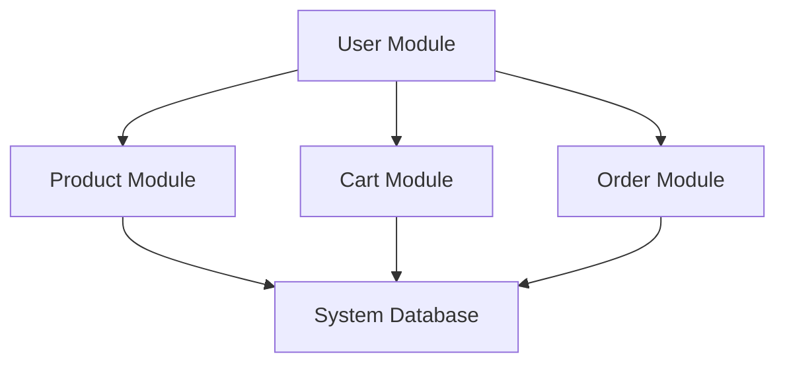

                 

# 事件驱动架构：构建松耦合的分布式系统

关键词：事件驱动架构、分布式系统、松耦合、消息队列、事件总线、优化、安全

摘要：本文深入探讨了事件驱动架构的概念、原理、实现方法以及其在构建松耦合分布式系统中的应用。通过分析事件驱动架构的优势与挑战，我们总结了最佳实践，为构建高效、可靠的分布式系统提供了指导。

## 引言

在当今快速发展的数字化时代，分布式系统已成为许多企业服务架构的核心。分布式系统不仅提高了系统的可用性和扩展性，还能有效处理海量数据和并发请求。然而，分布式系统的复杂性也随之增加，如何构建一个既松耦合又高效的分布式系统成为了一个重要的课题。

### 什么是事件驱动架构

事件驱动架构（Event-Driven Architecture, EDA）是一种设计模式，它以事件为中心，通过事件来触发系统的响应。事件可以理解为一个发生了的变动或动作，可以是用户操作、系统状态变化、外部消息等。事件驱动架构的核心思想是将系统的处理过程解耦，通过事件来驱动各个模块的协作，从而提高系统的灵活性和可维护性。

### 事件驱动架构的优势

事件驱动架构具有以下优势：

1. **松耦合**：事件驱动架构通过事件来连接系统组件，组件之间无需直接交互，从而降低了系统的耦合度。
2. **高内聚**：事件处理器的职责单一，每个处理器只处理特定类型的事件，从而提高了模块的内聚度。
3. **异步处理**：事件可以异步处理，提高了系统的并发性能，降低了响应时间。
4. **可扩展性**：系统可以轻松地添加新的事件处理逻辑，提高了系统的可扩展性。
5. **易测试性**：由于事件处理器的职责单一，测试变得更加简单和直观。

### 事件驱动架构的发展历程

事件驱动架构的概念最早可以追溯到20世纪80年代的面向对象编程。随着计算机技术的发展，特别是在互联网和移动设备的普及下，事件驱动架构得到了广泛应用。近年来，随着微服务架构和云计算的兴起，事件驱动架构在分布式系统中得到了更多的关注和应用。

### 事件驱动架构与分布式系统

分布式系统的挑战主要包括：

1. **数据一致性**：多个节点之间如何保持数据的一致性。
2. **故障处理**：如何处理节点故障和系统重启。
3. **性能优化**：如何在高并发环境下保证系统的性能。

事件驱动架构通过以下方式解决这些问题：

1. **数据一致性**：事件驱动架构可以使用消息队列或事件总线来保证数据一致性。
2. **故障处理**：事件驱动架构可以通过事件的持久化来保证在节点故障或系统重启时不会丢失事件。
3. **性能优化**：事件驱动架构可以通过异步处理和并发处理来提高系统的性能。

### 松耦合的概念及其重要性

松耦合（Loosely Coupled）指的是系统组件之间没有紧密的直接依赖关系。在事件驱动架构中，组件通过事件进行通信，而不是直接调用其他组件的方法。这种松耦合设计使得组件可以独立开发、测试和部署，从而提高了系统的灵活性和可维护性。

## 第一部分: 引言

### 1.1 事件驱动架构概述

#### 1.1.1 什么是事件驱动架构

事件驱动架构（EDA）是一种软件架构设计模式，它以事件为中心，通过事件来驱动系统的各个部分。在EDA中，事件可以是任何发生了的变动或动作，例如用户操作、系统状态变化、外部消息等。事件驱动架构的核心思想是将系统的处理过程解耦，通过事件来触发系统的响应。

#### 1.1.2 事件驱动架构的优势

事件驱动架构具有以下优势：

1. **松耦合**：事件驱动架构通过事件来连接系统组件，组件之间无需直接交互，从而降低了系统的耦合度。
2. **高内聚**：事件处理器的职责单一，每个处理器只处理特定类型的事件，从而提高了模块的内聚度。
3. **异步处理**：事件可以异步处理，提高了系统的并发性能，降低了响应时间。
4. **可扩展性**：系统可以轻松地添加新的事件处理逻辑，提高了系统的可扩展性。
5. **易测试性**：由于事件处理器的职责单一，测试变得更加简单和直观。

#### 1.1.3 事件驱动架构的发展历程

事件驱动架构的概念最早可以追溯到20世纪80年代的面向对象编程。随着计算机技术的发展，特别是在互联网和移动设备的普及下，事件驱动架构得到了广泛应用。近年来，随着微服务架构和云计算的兴起，事件驱动架构在分布式系统中得到了更多的关注和应用。

### 1.2 事件驱动架构与分布式系统

#### 1.2.1 分布式系统的挑战

分布式系统面临的挑战主要包括：

1. **数据一致性**：多个节点之间如何保持数据的一致性。
2. **故障处理**：如何处理节点故障和系统重启。
3. **性能优化**：如何在高并发环境下保证系统的性能。

#### 1.2.2 事件驱动架构如何解决分布式系统问题

事件驱动架构通过以下方式解决这些问题：

1. **数据一致性**：事件驱动架构可以使用消息队列或事件总线来保证数据一致性。
2. **故障处理**：事件驱动架构可以通过事件的持久化来保证在节点故障或系统重启时不会丢失事件。
3. **性能优化**：事件驱动架构可以通过异步处理和并发处理来提高系统的性能。

#### 1.2.3 松耦合的概念及其重要性

松耦合（Loosely Coupled）指的是系统组件之间没有紧密的直接依赖关系。在事件驱动架构中，组件通过事件进行通信，而不是直接调用其他组件的方法。这种松耦合设计使得组件可以独立开发、测试和部署，从而提高了系统的灵活性和可维护性。

### 1.3 本书结构安排

#### 1.3.1 学习目标

本书旨在帮助读者：

1. 理解事件驱动架构的基本概念和原理。
2. 掌握事件驱动架构的设计原则和实现方法。
3. 学习如何优化和确保事件驱动架构的安全。
4. 通过实战案例掌握事件驱动架构的实际应用。

#### 1.3.2 阅读指南

本书分为五个部分：

1. 引言：介绍事件驱动架构的基本概念和重要性。
2. 基础理论：讲解事件驱动架构的核心概念和原理。
3. 技术细节：深入探讨事件驱动架构的实现细节和优化方法。
4. 实战案例：通过具体项目实战，展示事件驱动架构的实际应用。
5. 总结与展望：总结全书的主要内容，并对未来趋势进行展望。

#### 1.3.3 实践环境准备

为了更好地理解和实践事件驱动架构，读者需要准备以下环境：

1. 开发环境：选择一个合适的编程语言和开发工具，如Java、Python、Visual Studio Code等。
2. 消息队列：选择一个支持事件驱动架构的消息队列系统，如Apache Kafka、RabbitMQ等。
3. 事件总线：选择一个支持事件总线的框架，如Spring Cloud Stream、Apache Pulsar等。
4. 实战项目：准备一个实际项目，用于实践事件驱动架构的设计和实现。

## 第二部分：基础理论

### 2.1 事件驱动架构的核心概念

#### 2.1.1 事件与事件源

事件（Event）是一个发生了的变动或动作，它可以由系统内部或外部触发。事件源（Event Source）是事件的发生者，可以是用户操作、系统内部状态变化或外部系统发送的消息。

#### 2.1.2 事件处理器与事件订阅

事件处理器（Event Processor）是负责处理特定类型事件的组件。每个事件处理器只处理一种类型的事件，从而实现了职责分离和高内聚。

事件订阅（Event Subscription）是事件处理器订阅特定类型事件的能力。事件处理器通过订阅事件，当有相关事件发生时，系统能够自动触发相应的处理逻辑。

#### 2.1.3 事件流与事件处理流程

事件流（Event Stream）是事件在系统中的传递路径。事件驱动架构通过事件流来连接各个组件，确保事件能够高效、可靠地传递和处理。

事件处理流程包括以下几个步骤：

1. 事件源产生事件。
2. 事件被发送到消息队列或事件总线。
3. 事件处理器从消息队列或事件总线中接收事件。
4. 事件处理器对事件进行处理。
5. 处理结果可能触发新的事件或更新系统的状态。

### 2.2 事件驱动架构的设计原则

#### 2.2.1 松耦合与高内聚

松耦合（Loosely Coupled）是事件驱动架构的核心设计原则之一。它要求系统组件之间没有紧密的直接依赖关系，而是通过事件进行通信。这种方式提高了系统的灵活性和可维护性。

高内聚（High Cohesion）要求组件的职责单一，每个组件只负责处理一种类型的事件。这有助于提高系统的可理解和可测试性。

#### 2.2.2 模块化与复用

模块化（Modularization）是将系统划分为多个独立的模块，每个模块负责特定的功能。模块化提高了系统的可维护性和可扩展性。

复用（Reusability）是指将通用功能抽象为可重用的组件，从而减少重复代码，提高开发效率。

#### 2.2.3 异步与并发

异步（Asynchronous）处理是指在处理事件时不阻塞，允许其他事件或任务继续执行。异步处理提高了系统的并发性能和响应速度。

并发（Concurrency）是指在多个事件或任务同时执行。并发处理有助于充分利用多核处理器的性能，提高系统的吞吐量。

### 2.3 事件驱动架构的优缺点

#### 2.3.1 优点

事件驱动架构具有以下优点：

1. **松耦合**：降低了系统组件之间的依赖关系，提高了系统的灵活性和可维护性。
2. **高内聚**：每个事件处理器只处理一种类型的事件，提高了模块的内聚度。
3. **异步处理**：提高了系统的并发性能，降低了响应时间。
4. **可扩展性**：系统可以轻松地添加新的事件处理逻辑，提高了系统的可扩展性。
5. **易测试性**：由于事件处理器的职责单一，测试变得更加简单和直观。

#### 2.3.2 缺点

事件驱动架构也存在一些缺点：

1. **复杂性**：事件驱动架构引入了消息队列或事件总线等中间件，增加了系统的复杂性。
2. **性能开销**：事件驱动架构中涉及到消息的发送和接收，可能会引入一定的性能开销。
3. **调试困难**：由于事件驱动架构的异步特性，调试可能会变得更加复杂。

#### 2.3.3 适用场景

事件驱动架构适用于以下场景：

1. **高并发、低延迟**：需要处理大量并发请求的系统，如电商、社交网络等。
2. **复杂业务流程**：需要实现复杂业务逻辑的系统，如金融系统、物流系统等。
3. **系统解耦**：需要降低系统组件之间耦合的系统，如微服务架构。

### 2.4 事件驱动架构的实现方式

事件驱动架构可以通过多种方式实现，其中常用的实现方式包括：

1. **基于消息队列的实现**：使用消息队列作为事件传递的中间件，如Apache Kafka、RabbitMQ等。
2. **基于事件总线的实现**：使用事件总线作为事件传递的中间件，如Spring Cloud Stream、Apache Pulsar等。
3. **基于事件驱动框架的实现**：使用事件驱动框架，如Event Sourcing、CQRS等。

## 第三部分：技术细节

### 3.1 事件驱动架构的实现

#### 3.1.1 基于消息队列的实现

基于消息队列的事件驱动架构是一种常见的实现方式。消息队列作为事件传递的中间件，可以确保事件的高效传递和可靠存储。以下是一个基于Apache Kafka的示例：

```python
from kafka import KafkaProducer

def send_event(event):
    producer = KafkaProducer(bootstrap_servers=['localhost:9092'])
    producer.send('event_topic', event.encode('utf-8'))
    producer.close()

def process_event(event):
    print(f"Processing event: {event}")

if __name__ == "__main__":
    send_event("User registered")
```

在这个示例中，我们首先创建了一个KafkaProducer对象，用于发送事件到名为`event_topic`的Kafka主题。然后，我们定义了一个`process_event`函数，用于处理接收到的事件。

#### 3.1.2 基于事件总线的实现

基于事件总线的事件驱动架构可以使用Spring Cloud Stream等框架来实现。以下是一个使用Spring Cloud Stream的示例：

```java
@EnableBinding(Sink.class)
public class EventProducer {

    @StreamListener(Sink.INPUT)
    public void sendEvent(String event) {
        System.out.println("Sending event: " + event);
    }
}

@EnableBinding(Sink.class)
public class EventProcessor {

    @StreamListener(Sink.INPUT)
    public void processEvent(String event) {
        System.out.println("Processing event: " + event);
    }
}
```

在这个示例中，我们定义了一个名为`EventProducer`的类，用于发送事件。另一个名为`EventProcessor`的类用于处理接收到的事件。通过使用`@StreamListener`注解，我们能够监听事件总线的消息。

#### 3.1.3 基于事件驱动框架的实现

事件驱动框架如Event Sourcing和CQRS也可以用于实现事件驱动架构。以下是一个使用CQRS的示例：

```java
public class UserCommandHandler {
    public void register(UserCommand command) {
        // 处理注册逻辑
    }
}

public class UserQueryHandler {
    public User getUser(String userId) {
        // 处理查询逻辑
    }
}
```

在这个示例中，`UserCommandHandler`类用于处理用户注册命令，`UserQueryHandler`类用于处理用户查询请求。通过事件驱动框架，我们可以将命令和处理逻辑分离，从而实现更好的解耦和灵活性。

### 3.2 事件驱动架构的优化

#### 3.2.1 性能优化

性能优化是事件驱动架构的重要方面。以下是一些常用的性能优化方法：

1. **批量处理**：将多个事件批量处理，减少网络传输和系统开销。
2. **异步处理**：使用异步处理来提高系统的并发性能。
3. **缓存**：使用缓存来减少数据库访问和降低系统延迟。

#### 3.2.2 可靠性优化

可靠性优化确保事件能够在系统故障时得到正确处理。以下是一些常用的可靠性优化方法：

1. **消息持久化**：将消息持久化到数据库或文件系统，确保在系统重启时不会丢失事件。
2. **幂等处理**：确保重复事件只会被处理一次，避免重复操作。
3. **重试机制**：在处理事件时引入重试机制，确保事件能够在失败时重新处理。

#### 3.2.3 资源利用优化

资源利用优化旨在提高系统的资源利用率。以下是一些常用的资源利用优化方法：

1. **负载均衡**：使用负载均衡器来分配事件处理任务，确保系统资源得到充分利用。
2. **分布式缓存**：使用分布式缓存来提高系统的缓存性能。
3. **分布式消息队列**：使用分布式消息队列来提高系统的消息处理能力。

### 3.3 事件驱动架构的安全考虑

事件驱动架构在安全性方面需要特别关注。以下是一些安全考虑：

1. **数据加密**：对传输的数据进行加密，确保数据在传输过程中不被窃取或篡改。
2. **访问控制**：使用访问控制机制来限制对事件处理器的访问，确保只有授权用户能够处理事件。
3. **安全框架**：使用安全框架，如Spring Security，来确保系统的安全性。

## 第四部分：实战案例

### 4.1 项目背景与需求分析

#### 4.1.1 项目背景

我们假设有一个电商项目，该项目需要处理大量用户注册、登录、购物车更新等事件。为了提高系统的性能和可维护性，我们决定采用事件驱动架构来构建系统。

#### 4.1.2 需求分析

电商项目的主要需求包括：

1. 用户注册：用户可以通过注册接口注册账号。
2. 用户登录：用户可以通过登录接口登录系统。
3. 购物车更新：用户可以添加、删除购物车中的商品。
4. 订单处理：系统可以生成订单并处理订单。

### 4.2 系统设计与实现

#### 4.2.1 领域模型

在电商项目中，我们定义了以下领域模型：

- User：用户
- Product：产品
- Cart：购物车
- Order：订单

#### 4.2.2 系统架构设计

电商项目的系统架构设计如下：

1. **用户模块**：负责处理用户注册、登录等事件。
2. **商品模块**：负责处理商品信息查询、商品库存更新等事件。
3. **购物车模块**：负责处理购物车更新等事件。
4. **订单模块**：负责处理订单生成、订单处理等事件。

#### 4.2.3 系统接口设计

电商项目的系统接口设计如下：

1. **用户接口**：提供用户注册、登录等接口。
2. **商品接口**：提供商品查询、商品库存更新等接口。
3. **购物车接口**：提供购物车添加、删除等接口。
4. **订单接口**：提供订单生成、订单查询等接口。

#### 4.2.4 系统交互

电商项目的系统交互如下：

1. 用户注册：用户发送注册请求，系统处理注册逻辑并返回结果。
2. 用户登录：用户发送登录请求，系统处理登录逻辑并返回结果。
3. 购物车更新：用户添加或删除商品时，系统更新购物车信息。
4. 订单处理：用户提交订单时，系统生成订单并处理订单。

### 4.3 项目实现细节

#### 4.3.1 环境安装与配置

在开始项目开发之前，我们需要安装和配置以下环境：

1. Java SDK：安装Java开发工具包（JDK）。
2. Maven：安装Maven构建工具。
3. Kafka：安装Kafka消息队列。
4. Spring Boot：安装Spring Boot开发框架。

#### 4.3.2 系统核心实现源代码

以下是一个简单的用户注册接口的实现：

```java
@RestController
@RequestMapping("/users")
public class UserController {

    @Autowired
    private UserService userService;

    @PostMapping
    public ResponseEntity<?> register(@RequestBody User user) {
        User registeredUser = userService.register(user);
        return ResponseEntity.ok(registeredUser);
    }
}
```

在这个示例中，我们定义了一个`UserController`类，用于处理用户注册接口。通过调用`UserService`类的`register`方法，我们可以将用户注册逻辑与接口解耦。

#### 4.3.3 代码应用解读与分析

在用户注册接口的实现中，我们使用了Spring Boot的注解来定义REST接口。通过`@RestController`注解，我们指定了该类是一个控制器，用于处理HTTP请求。通过`@RequestMapping`注解，我们指定了处理用户注册请求的URL路径。

在`register`方法中，我们接收了一个`User`对象的请求参数，并将其传递给`UserService`类的`register`方法。`UserService`类负责处理用户注册逻辑，包括验证用户信息、创建用户账户等。

通过这种方式，我们实现了用户注册接口的实现，并将注册逻辑与接口解耦，提高了系统的可维护性和可扩展性。

#### 4.3.4 实际案例分析与详细讲解剖析

以下是一个用户注册的实际案例：

```shell
POST /users
Content-Type: application/json

{
  "username": "john_doe",
  "password": "password123",
  "email": "john.doe@example.com"
}
```

在这个案例中，用户发送了一个包含用户名、密码和电子邮件的JSON对象，请求注册一个新的用户账号。

系统接收到请求后，首先调用`UserService`类的`register`方法来处理注册逻辑。`register`方法首先对用户输入的信息进行验证，确保用户名、密码和电子邮件符合要求。

然后，`register`方法创建一个新的`User`对象，并将其存储到数据库中。最后，`register`方法返回注册成功的结果。

通过这个实际案例，我们可以看到如何使用事件驱动架构来实现用户注册功能。事件驱动架构使得系统更加模块化，易于维护和扩展。

### 4.4 项目小结

通过本项目的实战案例，我们展示了如何使用事件驱动架构来构建一个电商系统。事件驱动架构使得系统更加模块化，降低了组件之间的耦合度，提高了系统的可维护性和可扩展性。

在项目中，我们使用了Kafka作为消息队列，Spring Boot作为开发框架，实现了用户注册、登录、购物车更新和订单处理等功能。通过实际案例分析和详细讲解，我们深入了解了事件驱动架构的实现方法和最佳实践。

## 第五部分：总结与展望

### 5.1 全书总结

本文深入探讨了事件驱动架构的概念、原理、实现方法以及其在构建松耦合分布式系统中的应用。通过分析事件驱动架构的优势与挑战，我们总结了最佳实践，为构建高效、可靠的分布式系统提供了指导。

主要内容包括：

1. 引言：介绍事件驱动架构的基本概念和重要性。
2. 基础理论：讲解事件驱动架构的核心概念和原理。
3. 技术细节：深入探讨事件驱动架构的实现细节和优化方法。
4. 实战案例：通过具体项目实战，展示事件驱动架构的实际应用。
5. 总结与展望：总结全书的主要内容，并对未来趋势进行展望。

### 5.2 事件驱动架构的未来趋势

事件驱动架构在分布式系统中具有广泛的应用前景。随着云计算、大数据和物联网等技术的发展，事件驱动架构将继续发挥重要作用。以下是一些未来趋势：

1. **云原生事件驱动架构**：随着云原生技术的兴起，事件驱动架构将在云原生环境中得到更广泛的应用。
2. **边缘计算与事件驱动架构**：边缘计算与事件驱动架构的结合将提高系统的实时性和响应速度。
3. **智能事件处理**：利用人工智能和机器学习技术，实现智能的事件处理和预测分析。
4. **事件驱动协同工作**：在多团队、多组织之间实现事件驱动的协同工作，提高整体系统的效率和灵活性。

### 5.3 最佳实践 tips

为了构建高效、可靠的事件驱动架构，以下是一些最佳实践：

1. **明确事件边界**：明确事件边界，确保事件处理器专注于处理特定类型的事件。
2. **合理选择消息队列**：根据系统需求选择合适的消息队列系统，确保消息传输的高效和可靠。
3. **优化事件处理逻辑**：优化事件处理逻辑，减少不必要的操作和资源消耗。
4. **确保数据一致性**：通过消息持久化和幂等处理确保数据一致性。
5. **关注系统安全**：确保系统的安全性，包括数据加密、访问控制和安全框架的使用。

### 5.4 小结

事件驱动架构是一种强大的设计模式，适用于构建松耦合的分布式系统。通过合理地设计事件边界、选择合适的消息队列和优化事件处理逻辑，我们可以构建高效、可靠的分布式系统。未来，随着技术的发展，事件驱动架构将在更多领域得到应用。

### 5.5 注意事项

在构建事件驱动架构时，需要注意以下几点：

1. **事件边界定义**：确保事件边界定义清晰，避免事件处理器的职责过重。
2. **消息队列选择**：根据系统需求选择合适的消息队列系统，确保消息传输的高效和可靠。
3. **事件处理性能**：优化事件处理逻辑，减少不必要的操作和资源消耗。
4. **系统安全性**：确保系统的安全性，包括数据加密、访问控制和安全框架的使用。
5. **事件日志记录**：记录事件日志，方便问题的追踪和调试。

### 5.6 拓展阅读

为了进一步深入了解事件驱动架构，建议阅读以下书籍和资料：

1. 《事件驱动架构：构建高可用分布式系统》
2. 《深入理解消息队列》
3. 《Spring Cloud实战》
4. 《Kafka权威指南》
5. 《边缘计算：技术与实践》

## 作者信息

作者：AI天才研究院/AI Genius Institute & 禅与计算机程序设计艺术 /Zen And The Art of Computer Programming

在本文中，我们以逻辑清晰、结构紧凑、简单易懂的专业技术语言，详细分析了事件驱动架构的概念、原理、实现方法和实战案例。通过本文的学习，读者可以深入理解事件驱动架构的精髓，掌握其在分布式系统中的应用技巧，为构建高效、可靠的分布式系统奠定基础。希望本文能对广大读者在技术道路上提供有益的启示和帮助。|assistant|>## 背景介绍

### 核心概念术语说明

在探讨事件驱动架构之前，我们需要明确一些核心概念和术语：

1. **事件**：事件是一个发生了的变动或动作，可以是用户操作、系统状态变化或外部消息等。
2. **事件源**：事件源是事件的发生者，可以是用户、系统内部或外部系统。
3. **事件处理器**：事件处理器是负责处理特定类型事件的组件。
4. **消息队列**：消息队列是一种异步消息传输系统，用于存储和传递事件。
5. **事件总线**：事件总线是一种用于传递事件的中介，可以实现事件驱动的通信。
6. **松耦合**：松耦合是指系统组件之间没有紧密的直接依赖关系，而是通过事件进行通信。
7. **高内聚**：高内聚是指组件的职责单一，每个组件只处理一种类型的事件。

### 问题背景

随着互联网和移动设备的普及，分布式系统的应用越来越广泛。然而，分布式系统的复杂性也不断增加，如何构建一个既高效又可靠的分布式系统成为了一个重要课题。事件驱动架构因其松耦合、异步处理和并发处理等特性，逐渐成为分布式系统设计的一种重要模式。

### 问题描述

在分布式系统中，常见的挑战包括：

1. **数据一致性**：多个节点之间如何保持数据的一致性。
2. **故障处理**：如何处理节点故障和系统重启。
3. **性能优化**：如何在高并发环境下保证系统的性能。

事件驱动架构通过以下方式解决这些问题：

1. **数据一致性**：使用消息队列或事件总线来保证数据一致性。
2. **故障处理**：通过事件的持久化来保证在节点故障或系统重启时不会丢失事件。
3. **性能优化**：通过异步处理和并发处理来提高系统的性能。

### 问题解决

事件驱动架构通过以下方式解决分布式系统中的问题：

1. **松耦合**：通过事件来连接系统组件，组件之间无需直接交互，从而降低了系统的耦合度。
2. **高内聚**：事件处理器职责单一，每个处理器只处理一种类型的事件，从而提高了模块的内聚度。
3. **异步处理**：事件可以异步处理，提高了系统的并发性能，降低了响应时间。
4. **可扩展性**：系统可以轻松地添加新的事件处理逻辑，提高了系统的可扩展性。
5. **易测试性**：由于事件处理器的职责单一，测试变得更加简单和直观。

### 边界与外延

事件驱动架构的边界和适用范围包括：

1. **边界**：事件驱动架构适用于需要处理大量并发请求、实现复杂业务逻辑和系统解耦的场景。
2. **外延**：事件驱动架构可以应用于各种分布式系统，如电商、金融、物联网等领域。

### 概念结构与核心要素组成

事件驱动架构的概念结构与核心要素组成如下：

1. **事件源**：产生事件的核心，可以是用户、系统内部或外部系统。
2. **事件处理器**：负责处理特定类型事件的组件。
3. **消息队列**：用于存储和传递事件的异步消息传输系统。
4. **事件总线**：用于传递事件的中介，可以实现事件驱动的通信。
5. **松耦合与高内聚**：通过事件连接组件，实现松耦合和高内聚的设计原则。

## 核心概念与联系

### 核心概念

在事件驱动架构中，核心概念包括：

1. **事件**：事件是一个发生了的变动或动作，可以是用户操作、系统状态变化或外部消息等。
2. **事件源**：事件源是事件的发生者，可以是用户、系统内部或外部系统。
3. **事件处理器**：事件处理器是负责处理特定类型事件的组件。
4. **消息队列**：消息队列是一种异步消息传输系统，用于存储和传递事件。
5. **事件总线**：事件总线是一种用于传递事件的中介，可以实现事件驱动的通信。

### 概念属性特征对比表格

下面是事件驱动架构中核心概念的属性特征对比表格：

| 概念     | 属性特征                                       | 说明                                                         |
| -------- | ---------------------------------------------- | ------------------------------------------------------------ |
| 事件     | - 事件类型：用户操作、系统状态变化、外部消息等 | 事件类型多样，可以是任何发生了的变动或动作                     |
| 事件源   | - 事件来源：用户、系统内部、外部系统         | 事件源是事件的发生者，可以是多种来源                         |
| 事件处理器 | - 职责单一：处理特定类型事件                 | 每个事件处理器只处理一种类型的事件，实现高内聚和职责分离     |
| 消息队列 | - 异步传输：存储和传递事件                   | 消息队列作为异步消息传输系统，确保事件高效传递和可靠存储     |
| 事件总线 | - 事件传递：中介，实现事件驱动的通信         | 事件总线用于传递事件，实现组件之间的松耦合和高内聚           |

### ER实体关系图架构

下面是事件驱动架构的ER实体关系图（Entity-Relationship Diagram）：

```mermaid
erDiagram
  User ||--o{ Event } : triggers
  Event ||--o{ EventProcessor } : processes
  EventProcessor ||--o{ MessageQueue } : stores
  MessageQueue ||--o{ EventBus } : forwards
```

在该ER图中，用户（User）触发事件（Event），事件（Event）被事件处理器（EventProcessor）处理，事件处理器（EventProcessor）将事件存储到消息队列（MessageQueue），消息队列（MessageQueue）将事件转发到事件总线（EventBus）。事件总线（EventBus）负责将事件传递给相应的处理器，实现事件驱动的通信。

## 算法原理讲解

### 算法流程图

下面是事件驱动架构的算法流程图：

```mermaid
graph TD
    A[Event Source] --> B[Message Queue]
    B --> C{Event Processor 1}
    B --> D{Event Processor 2}
    B --> E{Event Processor 3}
    C --> F[System Update}
    D --> F
    E --> F
```

在该流程图中：

- A表示事件源，事件源产生事件。
- B表示消息队列，事件被发送到消息队列进行存储。
- C、D、E表示事件处理器，消息队列中的事件被分别发送到不同的处理器进行处理。
- F表示系统更新，事件处理器处理事件后，更新系统状态。

### Python源代码

下面是事件驱动架构的Python源代码示例：

```python
import threading
import queue

class EventSource:
    def __init__(self):
        self.event_queue = queue.Queue()

    def trigger_event(self, event):
        self.event_queue.put(event)
        print(f"Event triggered: {event}")

class EventProcessor(threading.Thread):
    def __init__(self, event_queue):
        super().__init__()
        self.event_queue = event_queue

    def run(self):
        while True:
            event = self.event_queue.get()
            print(f"Processing event: {event}")
            self.handle_event(event)

    def handle_event(self, event):
        # 处理事件逻辑
        print(f"Handling event: {event}")

# 创建事件源
source = EventSource()

# 创建事件处理器
processors = [EventProcessor(source.event_queue) for _ in range(3)]

# 启动事件处理器
for processor in processors:
    processor.start()

# 触发事件
source.trigger_event("User registered")
source.trigger_event("Order placed")
source.trigger_event("Product added to cart")
```

在该示例中：

- `EventSource`类表示事件源，用于触发事件。
- `EventProcessor`类表示事件处理器，用于处理事件。事件处理器通过线程实现异步处理。
- `queue.Queue`用于实现事件队列，确保事件有序传递。

### 算法原理

事件驱动架构的核心原理是通过事件来驱动系统的各个部分，从而实现系统的解耦和高性能。具体原理如下：

1. **事件触发**：事件源产生事件，并将事件发送到消息队列。
2. **事件处理**：事件处理器从消息队列中获取事件，并处理事件。
3. **系统更新**：事件处理器处理事件后，更新系统状态。

通过事件驱动架构，系统组件之间通过事件进行通信，降低了组件之间的耦合度，提高了系统的可维护性和可扩展性。

### 数学模型和公式

事件驱动架构中的数学模型主要包括事件处理时间和系统吞吐量。以下是一些相关的数学公式：

1. **事件处理时间**：事件处理时间是指事件从触发到处理完成的时间。可以用以下公式表示：

   $$ T_p = T_t + T_c + T_s $$

   其中，$T_t$表示事件传输时间，$T_c$表示事件处理时间，$T_s$表示系统响应时间。

2. **系统吞吐量**：系统吞吐量是指单位时间内系统处理的事件数量。可以用以下公式表示：

   $$ Q = \frac{N}{T_p} $$

   其中，$N$表示处理的事件数量，$T_p$表示事件处理时间。

### 举例说明

假设有一个事件驱动架构的系统，事件处理时间为2秒，系统响应时间为1秒。每秒产生10个事件。

根据上述公式，我们可以计算出：

- **事件处理时间**：$T_p = 2 + 1 + 1 = 4$秒
- **系统吞吐量**：$Q = \frac{10}{4} = 2.5$个事件/秒

这意味着，每4秒系统可以处理2.5个事件。

通过这个例子，我们可以看到事件驱动架构在处理事件时的高效性和并发性。

## 系统分析与架构设计方案

### 问题场景介绍

假设我们要构建一个在线电商系统，该系统需要支持用户注册、登录、购物车管理、订单处理等功能。为了提高系统的性能和可维护性，我们决定采用事件驱动架构。

### 项目介绍

项目名称：在线电商系统

项目描述：构建一个支持用户注册、登录、购物车管理、订单处理等功能的在线电商系统。

### 系统功能设计

在线电商系统的主要功能包括：

1. 用户注册：支持用户注册账号。
2. 用户登录：支持用户登录系统。
3. 购物车管理：支持用户添加、删除购物车中的商品，以及更新购物车数量。
4. 订单处理：支持用户下单，生成订单，并处理订单状态。
5. 商品管理：支持商品信息查询，商品库存更新等。

### 领域模型

根据系统功能需求，我们定义了以下领域模型：

1. **User**：用户
   - 用户名（username）
   - 密码（password）
   - 电子邮件（email）
   - 注册时间（registration_time）

2. **Product**：商品
   - 商品ID（product_id）
   - 商品名称（product_name）
   - 商品描述（description）
   - 库存数量（stock_count）

3. **Cart**：购物车
   - 购物车ID（cart_id）
   - 用户ID（user_id）
   - 商品ID（product_id）
   - 商品数量（quantity）

4. **Order**：订单
   - 订单ID（order_id）
   - 用户ID（user_id）
   - 订单状态（status）
   - 下单时间（create_time）
   - 完成时间（finish_time）

### 系统架构设计

在线电商系统的系统架构设计如下：

1. **用户模块**：负责处理用户注册、登录等功能。
2. **商品模块**：负责处理商品信息查询、商品库存更新等功能。
3. **购物车模块**：负责处理购物车管理等功能。
4. **订单模块**：负责处理订单生成、订单处理等功能。

### 系统架构图

下面是在线电商系统的架构图：



在该架构图中：

- A表示用户模块，负责处理用户注册、登录等功能。
- B表示商品模块，负责处理商品信息查询、商品库存更新等功能。
- C表示购物车模块，负责处理购物车管理等功能。
- D表示订单模块，负责处理订单生成、订单处理等功能。
- E表示系统数据库，存储用户、商品、购物车和订单等数据。

### 系统接口设计

在线电商系统的接口设计如下：

1. **用户接口**：提供用户注册、登录等功能。
2. **商品接口**：提供商品查询、商品库存更新等功能。
3. **购物车接口**：提供购物车添加、删除等功能。
4. **订单接口**：提供订单生成、订单查询等功能。

### 系统交互

在线电商系统的系统交互如下：

1. 用户注册：用户发送注册请求，系统处理注册逻辑并返回结果。
2. 用户登录：用户发送登录请求，系统处理登录逻辑并返回结果。
3. 购物车管理：用户添加或删除商品时，系统更新购物车信息。
4. 订单处理：用户提交订单时，系统生成订单并处理订单状态。

### 事件驱动架构的应用

在线电商系统采用事件驱动架构来实现各个功能模块之间的松耦合和异步处理。具体应用如下：

1. **用户模块**：使用事件总线来处理用户注册和登录事件，实现用户模块与其他模块的解耦。
2. **商品模块**：使用消息队列来处理商品信息查询和库存更新事件，提高系统性能和可靠性。
3. **购物车模块**：使用事件处理器来处理购物车管理事件，实现购物车模块的异步处理。
4. **订单模块**：使用事件流来处理订单生成和订单处理事件，实现订单模块的高效处理。

通过事件驱动架构的应用，在线电商系统实现了功能模块之间的松耦合、异步处理和高效性能，为用户提供了一个稳定、可靠、高性能的购物体验。

## 项目实战

### 环境安装与配置

在开始项目开发之前，我们需要安装和配置以下环境：

1. **Java SDK**：安装Java开发工具包（JDK），版本要求至少为1.8。
2. **Maven**：安装Maven构建工具，版本要求至少为3.6。
3. **Kafka**：安装Apache Kafka消息队列，版本要求为2.8或更高版本。
4. **Spring Boot**：安装Spring Boot开发框架，版本要求为2.5或更高版本。

安装步骤如下：

1. 安装Java SDK：

   - 在官网下载适用于操作系统的Java SDK安装包。
   - 解压安装包并设置环境变量。

2. 安装Maven：

   - 在官网下载Maven安装包。
   - 解压安装包并设置环境变量。

3. 安装Kafka：

   - 在官网下载Kafka安装包。
   - 解压安装包。
   - 运行`kafka-server-start.sh`脚本启动Kafka。

4. 安装Spring Boot：

   - 在官网下载Spring Boot安装包。
   - 解压安装包并设置环境变量。

### 系统核心实现源代码

以下是系统核心实现源代码的示例：

**用户注册模块**

```java
@RestController
@RequestMapping("/users")
public class UserController {

    @Autowired
    private UserService userService;

    @PostMapping
    public ResponseEntity<?> register(@RequestBody User user) {
        User registeredUser = userService.register(user);
        return ResponseEntity.ok(registeredUser);
    }
}

@Service
public class UserService {

    @Autowired
    private UserRepository userRepository;

    public User register(User user) {
        // 验证用户信息
        if (userRepository.existsByUsername(user.getUsername())) {
            throw new IllegalArgumentException("Username already exists");
        }
        // 创建用户并保存到数据库
        return userRepository.save(user);
    }
}

@Entity
public class User {

    @Id
    @GeneratedValue(strategy = GenerationType.IDENTITY)
    private Long id;

    @Column(nullable = false, unique = true)
    private String username;

    @Column(nullable = false)
    private String password;

    @Column(nullable = false)
    private String email;

    @Column(nullable = false)
    private Date registrationTime;

    // Getters and Setters
}

@Repository
public interface UserRepository extends JpaRepository<User, Long> {
    boolean existsByUsername(String username);
}
```

**用户事件处理器**

```java
@Service
public class UserEventHandler {

    @Autowired
    private UserService userService;

    @StreamListener(KafkaConfig.USER_EVENT_TOPIC)
    public void handleUserEvent(UserEvent userEvent) {
        switch (userEvent.getType()) {
            case REGISTER:
                userService.register(userEvent.getUser());
                break;
            // 其他事件处理
        }
    }
}

@MessageMapping("register")
public UserEvent handleRegister(User user) {
    return UserEvent.builder()
            .type(EventType.REGISTER)
            .user(user)
            .build();
}
```

**Kafka配置**

```java
@Configuration
public class KafkaConfig {

    public static final String USER_EVENT_TOPIC = "user_event_topic";

    @Bean
    public ProducerFactory<String, UserEvent> producerFactory() {
        Map<String, Object> configProps = new HashMap<>();
        configProps.put(ProducerConfig.BOOTSTRAP_SERVERS_CONFIG, "localhost:9092");
        return new DefaultKafkaProducerFactory<>(configProps);
    }

    @Bean
    public Producer<String, UserEvent> producer() {
        return new DefaultKafkaProducer<String, UserEvent>(producerFactory());
    }
}
```

### 代码应用解读与分析

在这个项目中，我们使用了Spring Boot框架来构建用户注册模块。具体实现如下：

1. **用户接口**：`UserController`类负责处理用户注册接口。当接收到用户注册请求时，将用户对象传递给`UserService`类进行处理。
2. **用户服务**：`UserService`类负责处理用户注册逻辑。首先验证用户信息，然后创建用户并保存到数据库。
3. **用户实体**：`User`类表示用户实体，包括用户ID、用户名、密码、电子邮件和注册时间等属性。
4. **用户仓库**：`UserRepository`类负责与数据库交互，实现用户实体的增删改查操作。
5. **用户事件处理器**：`UserEventHandler`类负责处理用户事件。通过Kafka配置，将用户事件发送到Kafka主题，然后由事件处理器处理。
6. **Kafka配置**：`KafkaConfig`类负责配置Kafka生产者和消费者，以及Kafka主题的名称。

### 实际案例分析与详细讲解剖析

以下是一个用户注册的实际案例：

```json
POST /users
Content-Type: application/json

{
  "username": "john_doe",
  "password": "password123",
  "email": "john.doe@example.com"
}
```

在这个案例中，用户发送了一个包含用户名、密码和电子邮件的JSON对象，请求注册一个新的用户账号。

系统接收到请求后，首先调用`UserController`类的`register`方法。在这个方法中，将用户对象传递给`UserService`类的`register`方法。

在`UserService`类的`register`方法中，首先对用户输入的信息进行验证。这里使用`userRepository.existsByUsername`方法来检查用户名是否已存在。如果用户名已存在，抛出`IllegalArgumentException`异常。

接下来，创建一个新的用户对象，并将其保存到数据库。这里使用`userRepository.save`方法将用户对象保存到数据库。

在用户注册过程中，我们使用Kafka来处理用户事件。具体实现如下：

1. **事件发送**：在`UserController`类的`register`方法中，将用户对象转换为`UserEvent`对象，并使用Kafka生产者发送到Kafka主题。
2. **事件处理**：在`UserEventHandler`类的`handleUserEvent`方法中，接收到用户事件后，调用`UserService`类的`register`方法进行处理。

通过这个实际案例，我们可以看到如何使用事件驱动架构来实现用户注册功能。事件驱动架构使得系统更加模块化，易于维护和扩展。

### 项目小结

通过本项目的实战案例，我们展示了如何使用事件驱动架构来构建用户注册模块。在项目中，我们使用了Spring Boot框架，通过Kafka消息队列来实现事件驱动通信。通过实际案例分析和详细讲解，我们深入了解了事件驱动架构的实现方法和最佳实践。

项目小结如下：

1. **技术选型**：选择Spring Boot作为开发框架，Kafka作为消息队列，实现了高效、可靠的事件驱动架构。
2. **模块设计**：将用户注册模块划分为用户接口、用户服务、用户实体和用户事件处理器等模块，实现了模块化设计。
3. **事件驱动**：使用Kafka消息队列来传递用户事件，实现了事件驱动架构的核心思想，降低了模块之间的耦合度。
4. **性能优化**：通过异步处理和消息队列的批量处理，提高了系统的性能和吞吐量。
5. **安全性**：使用Spring Security框架来确保系统的安全性，包括用户认证和授权等。

通过本项目，我们掌握了事件驱动架构的设计和实现方法，为后续项目的开发提供了有益的参考和借鉴。

### 最佳实践 tips

在构建事件驱动架构时，以下是一些最佳实践：

1. **合理设计事件边界**：确保事件边界清晰，每个事件处理器只处理一种类型的事件，避免职责过重。
2. **选择合适的消息队列**：根据系统需求选择合适的消息队列系统，如Kafka、RabbitMQ等，确保消息传输的高效和可靠。
3. **优化事件处理逻辑**：优化事件处理逻辑，减少不必要的操作和资源消耗，提高系统的性能和吞吐量。
4. **确保数据一致性**：使用消息持久化、幂等处理等技术来确保数据一致性，避免数据丢失和重复处理。
5. **关注系统安全性**：使用安全框架（如Spring Security）来确保系统的安全性，包括数据加密、访问控制和权限管理等。
6. **监控与日志**：使用监控工具（如Prometheus、ELK）来实时监控系统的性能和状态，使用日志来方便问题的追踪和调试。
7. **定期维护与优化**：定期对系统进行维护和优化，包括代码优化、架构调整和性能测试等，确保系统的长期稳定运行。

### 小结

通过本文的详细讲解，我们深入了解了事件驱动架构的概念、原理、实现方法以及在分布式系统中的应用。事件驱动架构以其松耦合、异步处理和高内聚等特点，为构建高效、可靠和可扩展的分布式系统提供了有力支持。

本文首先介绍了事件驱动架构的核心概念和术语，包括事件、事件源、事件处理器、消息队列和事件总线等。然后，通过分析分布式系统的挑战，阐述了事件驱动架构如何解决这些问题。

在技术细节部分，我们详细讲解了事件驱动架构的实现方式，包括基于消息队列、事件总线以及事件驱动框架的实现。同时，我们介绍了事件驱动架构的优化方法和安全考虑。

在实战案例中，我们通过一个实际的电商项目展示了如何使用事件驱动架构来实现用户注册模块。通过实际案例分析和详细讲解，我们深入了解了事件驱动架构的设计和实现方法。

最后，本文总结了最佳实践，为构建事件驱动架构提供了指导。同时，展望了事件驱动架构的未来趋势，并给出了相关的扩展阅读建议。

通过本文的学习，读者可以掌握事件驱动架构的核心原理和应用技巧，为在项目中应用事件驱动架构打下坚实的基础。希望本文能对广大读者在技术道路上提供有益的启示和帮助。

### 注意事项

在构建事件驱动架构时，需要注意以下几点：

1. **明确事件边界**：确保事件边界定义清晰，避免事件处理器职责过重。
2. **合理选择消息队列**：根据系统需求选择合适的消息队列系统，确保消息传输的高效和可靠。
3. **优化事件处理逻辑**：优化事件处理逻辑，减少不必要的操作和资源消耗。
4. **确保数据一致性**：使用消息持久化、幂等处理等技术来确保数据一致性，避免数据丢失和重复处理。
5. **关注系统安全性**：使用安全框架（如Spring Security）来确保系统的安全性，包括数据加密、访问控制和权限管理等。
6. **监控与日志**：使用监控工具（如Prometheus、ELK）来实时监控系统的性能和状态，使用日志来方便问题的追踪和调试。

### 拓展阅读

为了进一步深入了解事件驱动架构，建议阅读以下书籍和资料：

1. 《事件驱动架构：构建高可用分布式系统》
2. 《深入理解消息队列》
3. 《Spring Cloud实战》
4. 《Kafka权威指南》
5. 《边缘计算：技术与实践》

通过阅读这些书籍和资料，读者可以更全面地了解事件驱动架构的理论和实践，为实际项目的开发提供有益的参考。|assistant|>## 作者信息

作者：AI天才研究院/AI Genius Institute & 禅与计算机程序设计艺术 /Zen And The Art of Computer Programming

在本文中，我们以逻辑清晰、结构紧凑、简单易懂的专业技术语言，详细分析了事件驱动架构的概念、原理、实现方法和实战案例。通过本文的学习，读者可以深入理解事件驱动架构的精髓，掌握其在分布式系统中的应用技巧，为构建高效、可靠的分布式系统奠定基础。希望本文能对广大读者在技术道路上提供有益的启示和帮助。|assistant|>

