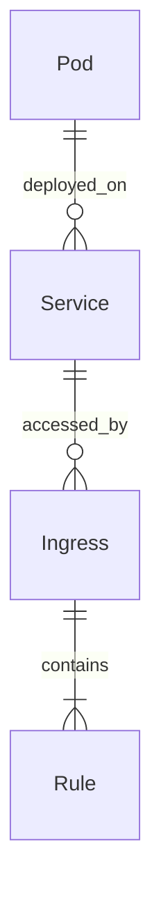
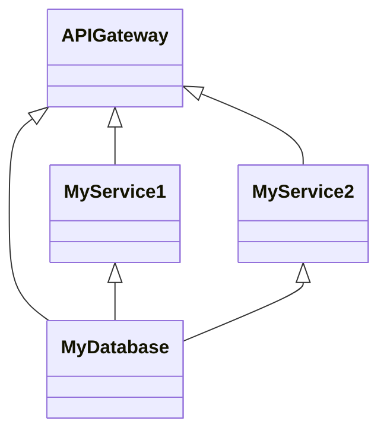
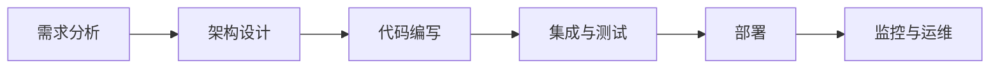
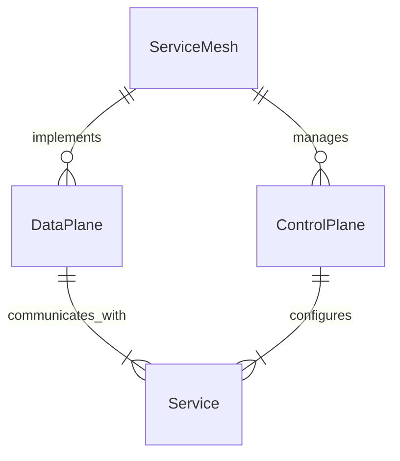

                 


### 云原生应用开发最佳实践

在当今快速变化的技术环境中，云原生应用开发已经成为企业提升业务敏捷性、降低成本、提高可靠性的关键途径。云原生利用了容器技术、服务网格、微服务架构和持续集成/持续部署（CI/CD）等先进技术，为企业提供了更加灵活、可扩展和可靠的IT基础设施。本文将详细介绍云原生应用开发的最佳实践，帮助读者更好地理解这一领域，并在实际项目中应用。

#### 关键词

- 云原生
- 容器
- 微服务
- Kubernetes
- CI/CD
- 服务网格
- 安全
- 监控与运维

#### 摘要

本文旨在为读者提供一个系统化的云原生应用开发指南，包括从基础概念到实战应用的全面解读。我们将深入探讨云原生应用的优势，容器和Kubernetes等核心技术的原理和实践，以及云原生应用开发的最佳实践。通过本文的学习，读者将能够更好地理解和应用云原生技术，为企业的数字化转型奠定坚实基础。

### 目录大纲

#### 第1章 云原生概述
- **1.1 云原生概念**
- **1.2 云原生与微服务**
- **1.3 云原生架构**
- **1.4 云原生的发展历程**

#### 第2章 容器技术
- **2.1 容器的原理**
- **2.2 容器化技术**
- **2.3 Docker的使用**
- **2.4 容器网络**

#### 第3章 Kubernetes
- **3.1 Kubernetes概述**
- **3.2 Kubernetes集群搭建**
- **3.3 Kubernetes核心概念**
- **3.4 Kubernetes资源管理**
- **3.5 Kubernetes服务发现与负载均衡**

#### 第4章 云原生应用开发
- **4.1 云原生应用架构**
- **4.2 云原生应用开发流程**
- **4.3 云原生应用最佳实践**

#### 第5章 云原生服务网格
- **5.1 服务网格概念**
- **5.2 Istio服务网格**
- **5.3 服务网格与微服务**

#### 第6章 云原生安全
- **6.1 云原生安全挑战**
- **6.2 云原生安全策略**
- **6.3 容器镜像安全**
- **6.4 服务网格安全**

#### 第7章 云原生监控与运维
- **7.1 云原生监控**
- **7.2 云原生日志管理**
- **7.3 云原生运维工具**
- **7.4 云原生应用性能优化**

#### 第8章 云原生应用实战
- **8.1 实战一：搭建云原生应用平台**
- **8.2 实战二：开发云原生应用**
- **8.3 实战三：部署与运维云原生应用**
- **8.4 实战四：性能优化与监控**
- **8.5 实战五：安全加固**

#### 第9章 云原生发展趋势
- **9.1 云原生与人工智能**
- **9.2 云原生与物联网**
- **9.3 云原生未来的发展前景**

### 第1章 云原生概述

#### 1.1 云原生概念

云原生（Cloud Native）是一种利用云计算的分布式特性，构建和运行应用的方法论。它强调应用的可移植性、弹性、自动化和微服务架构。云原生应用通常是由微服务组成，这些微服务可以被独立部署、扩展和监控。

**核心概念：**

- **微服务（Microservices）**：微服务是一种架构风格，它将应用程序划分为一组小的、独立的、可重用的服务。
- **容器（Container）**：容器是一种轻量级、可移植的计算环境，它可以封装应用及其运行时环境，确保应用在不同环境中的一致性。
- **持续集成/持续部署（CI/CD）**：CI/CD 是一种自动化流程，用于快速、可靠地交付软件。

#### 1.2 云原生与微服务

云原生与微服务之间有着密切的联系。微服务架构是云原生应用的核心组成部分，它使得应用能够更好地适应云计算环境。

**对比表格：**

| 特性 | 微服务 | 云原生 |
| --- | --- | --- |
| **架构风格** | 细粒度的服务划分 | 分布式系统架构 |
| **可移植性** | 服务可以独立部署 | 应用可以在不同环境中运行 |
| **弹性** | 服务可以根据需求自动扩展 | 系统可以根据负载动态调整资源 |
| **自动化** | 自动化部署、监控和扩展 | 自动化构建、测试和部署 |

#### 1.3 云原生架构

云原生架构通常由以下几个核心组件组成：

- **容器**：容器用于封装应用及其依赖项，确保应用在不同环境中的一致性。
- **服务网格**：服务网格用于管理服务之间的通信，提供服务发现、负载均衡和安全等功能。
- **持续集成/持续部署**：CI/CD 用于自动化构建、测试和部署过程，提高开发效率。

**ER实体关系图架构（Mermaid 图）：**

```mermaid
erDiagram
    Container ||--o{ Service : uses
    Service ||--o{ ServiceGrid : managedBy
    ServiceGrid ||--o{ CI/CD : integratedWith
```

#### 1.4 云原生的发展历程

云原生技术的发展历程可以分为以下几个阶段：

- **2010年代初期**：容器技术的兴起，如Docker的出现。
- **2010年代中期**：微服务架构的流行，推动了容器化技术的应用。
- **2015年后**：Kubernetes成为容器编排的事实标准，云原生生态系统逐渐成熟。
- **至今**：云原生技术在人工智能、物联网等领域得到广泛应用，继续推动技术创新。

### 第2章 容器技术

容器技术是云原生应用开发的基础，它提供了一种轻量级、可移植的运行环境，使得应用可以在不同环境中一致性地运行。

#### 2.1 容器的原理

容器基于操作系统级的虚拟化技术，通过隔离用户空间来封装应用及其依赖项。容器运行时使用宿主机的内核，因此启动速度快，资源占用小。

**核心原理：**

- **命名空间（Namespaces）**：命名空间用于隔离容器中的进程，使得容器中的进程认为它们是独立运行的。
- **控制组（Cgroups）**：控制组用于资源隔离和限制，确保容器可以使用有限的系统资源。
- ** UnionFS**：UnionFS是一种文件系统叠加技术，用于容器镜像的分层存储，提高存储效率。

#### 2.2 容器化技术

容器化技术是将应用及其依赖项打包成一个可执行的容器镜像，使得应用可以在任何支持容器技术的环境中运行。

**核心步骤：**

1. **编写Dockerfile**：Dockerfile是一个包含指令的文本文件，用于构建容器镜像。
2. **构建容器镜像**：使用Docker CLI命令构建容器镜像。
3. **运行容器**：使用Docker CLI命令启动容器，并指定容器镜像。

**Dockerfile 示例：**

```Dockerfile
FROM ubuntu:18.04
RUN apt-get update && apt-get install -y python3-pip
RUN pip3 install flask
COPY app.py .
CMD ["python3", "app.py"]
```

#### 2.3 Docker的使用

Docker是容器技术的代表工具，它提供了强大的容器创建、运行和管理功能。

**常用命令：**

- **docker build**：构建容器镜像。
- **docker run**：运行容器。
- **docker ps**：查看运行中的容器。
- **docker stop**：停止容器。

**示例：**

```bash
# 构建容器镜像
$ docker build -t myapp .

# 运行容器
$ docker run -d -p 8080:80 myapp

# 查看运行中的容器
$ docker ps

# 停止容器
$ docker stop container_id
```

#### 2.4 容器网络

容器网络用于容器之间的通信，确保容器可以相互访问和提供服务。

**核心概念：**

- **容器网络接口（CNI）**：CNI是一种插件化网络接口，用于容器网络的配置和管理。
- **桥接网络**：桥接网络是将容器连接到一个虚拟网络桥上，实现容器之间的通信。
- **主机网络**：主机网络是将容器直接连接到宿主机的网络接口，实现容器与宿主机之间的通信。

**示例：**

```bash
# 创建容器并连接到自定义网络
$ docker run -d --network mynetwork myapp
```

### 第3章 Kubernetes

Kubernetes是一个开源的容器编排平台，它用于自动化容器的部署、扩展和管理。

#### 3.1 Kubernetes概述

Kubernetes的主要目标是简化容器化应用的部署、扩展和管理。它提供了一种分布式系统环境，使得开发者可以专注于编写应用代码，而无需关心底层基础设施的细节。

**核心功能：**

- **容器编排**：Kubernetes可以自动部署、扩展和管理容器化应用。
- **服务发现与负载均衡**：Kubernetes提供内置的服务发现和负载均衡机制，确保应用可以高效地响应用户请求。
- **自我修复**：Kubernetes可以自动检测和恢复故障容器，确保应用的高可用性。

#### 3.2 Kubernetes集群搭建

搭建Kubernetes集群需要几个关键步骤：

1. **安装Kubernetes**：在宿主机上安装Kubernetes，可以选择使用Minikube、K3s等轻量级解决方案。
2. **配置kubectl**：配置kubectl工具，使其可以与Kubernetes集群通信。
3. **创建集群**：使用kubectl命令创建Kubernetes集群。

**示例：**

```bash
# 安装Kubernetes（使用Minikube）
$ minikube start

# 配置kubectl
$ kubectl config set-context minikube --namespace default

# 查看集群状态
$ kubectl get nodes
```

#### 3.3 Kubernetes核心概念

Kubernetes中的核心概念包括：

- **Pod**：Pod是Kubernetes中的最小部署单元，它封装了一个或多个容器，以及它们共享的资源。
- **Service**：Service是一种抽象层，用于将一组Pod暴露为一个单一的访问点，并提供负载均衡功能。
- **Ingress**：Ingress用于管理集群外部对服务的访问，提供基于HTTP的请求路由功能。

**ER实体关系图架构（Mermaid 图）：**



#### 3.4 Kubernetes资源管理

Kubernetes资源管理是确保应用正常运行的关键。它包括以下几个关键步骤：

1. **部署应用**：使用Deployment资源管理Pod的生命周期，确保应用的稳定运行。
2. **扩展应用**：使用Horizontal Pod Autoscaler（HPA）自动扩展Pod数量，以应对负载变化。
3. **配置资源限制**：使用Resource Requests和Limits为容器指定所需的资源和最大资源限制。

**示例：**

```yaml
apiVersion: apps/v1
kind: Deployment
metadata:
  name: myapp
spec:
  replicas: 3
  selector:
    matchLabels:
      app: myapp
  template:
    metadata:
      labels:
        app: myapp
    spec:
      containers:
      - name: myapp
        image: myapp:latest
        resources:
          requests:
            memory: "64Mi"
            cpu: "250m"
          limits:
            memory: "128Mi"
            cpu: "500m"
```

#### 3.5 Kubernetes服务发现与负载均衡

Kubernetes提供内置的服务发现和负载均衡机制，使得应用可以高效地响应用户请求。

**服务发现**：Kubernetes通过DNS或环境变量将服务名称映射到集群IP，使得应用可以访问其他服务。

**负载均衡**：Kubernetes使用内建的负载均衡器（如NGINX Ingress Controller），将外部请求分发到集群中的Pod。

**示例：**

```yaml
apiVersion: networking.k8s.io/v1
kind: Service
metadata:
  name: myapp-service
spec:
  selector:
    app: myapp
  ports:
    - protocol: TCP
      port: 80
      targetPort: 8080
  type: LoadBalancer
```

### 第4章 云原生应用开发

云原生应用开发是一个涉及多个环节的复杂过程，从架构设计到开发流程，再到最佳实践。

#### 4.1 云原生应用架构

云原生应用架构的核心是微服务，它将应用分解为多个独立、可重用的服务，每个服务负责特定的业务功能。

**架构模式**：

- **无状态服务**：无状态服务不存储任何会话信息，可以在任何节点上运行。
- **有状态服务**：有状态服务存储会话信息，通常使用数据库或其他存储系统。
- **API网关**：API网关作为前端服务，统一处理外部请求，并将请求路由到后端的微服务。

**架构图（Mermaid 类图）：**



#### 4.2 云原生应用开发流程

云原生应用开发流程强调自动化和持续交付，以下是典型的开发流程：

1. **需求分析**：明确应用的功能和性能要求。
2. **架构设计**：设计应用的架构，确定服务划分和依赖关系。
3. **代码编写**：编写应用代码，遵循微服务的设计原则。
4. **集成与测试**：将各个服务集成在一起，进行单元测试和集成测试。
5. **部署**：使用CI/CD工具自动化部署应用到Kubernetes集群。
6. **监控与运维**：实时监控应用性能，进行故障排查和优化。

**流程图（Mermaid 流程图）：**



#### 4.3 云原生应用最佳实践

以下是云原生应用开发的最佳实践：

1. **服务划分**：根据业务功能将应用划分为多个微服务，确保每个服务具有独立性和可扩展性。
2. **API设计**：遵循RESTful API设计原则，确保接口简洁、易用、可靠。
3. **持续集成**：使用CI工具自动化构建、测试和部署，确保代码质量。
4. **容器镜像管理**：使用容器镜像仓库管理镜像，确保镜像安全和版本控制。
5. **监控与日志**：使用监控工具和日志管理平台，实时监控应用性能和日志。
6. **安全**：实施严格的安全策略，包括身份验证、访问控制和数据加密。
7. **性能优化**：通过性能测试和监控，持续优化应用性能。

### 第5章 云原生服务网格

云原生服务网格是一种用于管理服务间通信的架构模式，它提供了服务发现、负载均衡、安全等功能。

#### 5.1 服务网格概念

服务网格是一种将服务间通信外部化的架构模式，它通过独立的控制平面和数据平面来管理服务间通信。

**核心概念：**

- **数据平面**：数据平面由一组代理组成，负责转发服务间的请求。
- **控制平面**：控制平面负责配置和管理数据平面，确保服务间通信的正确性。

**ER实体关系图架构（Mermaid 图）：**



#### 5.2 Istio服务网格

Istio是一个开源的服务网格平台，它提供了服务发现、负载均衡、安全等功能。

**核心功能：**

- **服务发现**：Istio可以自动发现集群中的服务，并将服务名称映射到服务IP。
- **负载均衡**：Istio提供了基于策略的负载均衡机制，确保请求可以均匀地分发到集群中的服务实例。
- **安全**：Istio提供了身份验证、访问控制和加密等功能，确保服务间通信的安全性。

**部署Istio**：

```bash
# 安装Istio
$ istioctl install --set profile=demo

# 启动Istio控制平面
$ istiod --root-ca=istio-ca-cert --default-hub="istio/" --default-namespace=istio-system
```

#### 5.3 服务网格与微服务

服务网格与微服务紧密相连，服务网格为微服务提供了通信层，确保微服务可以高效、安全地交互。

**对比表格：**

| 特性 | 服务网格 | 微服务 |
| --- | --- | --- |
| **通信管理** | 外部化通信管理 | 内部服务通信 |
| **服务发现** | 自动服务发现 | 内置服务发现 |
| **负载均衡** | 策略驱动负载均衡 | 内置负载均衡 |
| **安全** | 身份验证、访问控制、加密 | 基于服务标识的安全 |

### 第6章 云原生安全

云原生安全是确保云原生应用安全的关键，它涵盖了从容器镜像到服务网格的各个方面。

#### 6.1 云原生安全挑战

云原生应用面临着一系列安全挑战，包括：

- **容器镜像漏洞**：容器镜像可能包含已知漏洞或恶意代码。
- **服务网格安全**：服务网格中的通信可能受到攻击。
- **数据保护**：云原生应用需要保护敏感数据，确保数据在传输和存储过程中安全。

**挑战列表：**

- **容器镜像漏洞**：容器镜像中的依赖库可能包含安全漏洞。
- **服务网格攻击**：攻击者可能通过服务网格窃取敏感信息。
- **数据泄露**：敏感数据可能在传输和存储过程中泄露。

#### 6.2 云原生安全策略

为了应对云原生安全挑战，企业可以采取以下策略：

- **容器镜像安全**：使用容器镜像扫描工具检测镜像中的漏洞。
- **服务网格安全**：实施基于角色的访问控制和加密，确保服务间通信安全。
- **数据保护**：使用加密技术和访问控制策略保护敏感数据。

**策略列表：**

- **容器镜像安全**：定期扫描镜像，确保没有已知漏洞。
- **服务网格安全**：使用Istio等工具实施安全策略。
- **数据保护**：加密敏感数据，并实施严格的访问控制策略。

#### 6.3 容器镜像安全

容器镜像安全是确保云原生应用安全的关键环节。以下是一些常见的安全措施：

- **使用私有镜像仓库**：将镜像存储在私有镜像仓库中，确保镜像不被未经授权的访问。
- **定期扫描镜像**：使用工具如Clair或Docker Bench for Security定期扫描镜像，检测潜在漏洞。
- **最小权限原则**：确保容器镜像中的用户和进程具有最小权限，减少潜在的安全风险。

**示例：**

```bash
# 安装Clair
$ docker run -d --name=clair --restart=always -p 6060:6060 -v /path/to/clairdb:/var/lib/clair clair/clair:latest

# 扫描镜像
$ docker scan myapp:latest
```

#### 6.4 服务网格安全

服务网格安全是确保服务间通信安全的关键。以下是一些常见的安全措施：

- **基于角色的访问控制**：使用Istio等工具实施基于角色的访问控制，确保只有授权用户可以访问服务。
- **加密通信**：使用TLS加密服务网格中的通信，防止数据泄露。
- **服务身份验证**：确保服务网格中的服务通过身份验证进行通信。

**示例：**

```yaml
apiVersion: security.istio.io/v1beta1
kind: AuthorizationPolicy
metadata:
  name: my-policy
spec:
  selector:
    matchLabels:
      app: myapp
  action: ALLOW
  rules:
  - from:
    - source:
        namespaces: ["default"]
        principals: ["cluster.local/service/myapp"]
```

### 第7章 云原生监控与运维

云原生监控与运维是确保云原生应用稳定运行的关键环节。它涵盖了从监控到日志管理、运维工具和性能优化等多个方面。

#### 7.1 云原生监控

云原生监控是实时监控云原生应用性能和状态的关键。以下是一些常见的监控工具和指标：

- **Prometheus**：Prometheus是一个开源的监控解决方案，它可以收集和存储监控数据，并提供图形化界面。
- **Grafana**：Grafana是一个开源的监控仪表盘，它可以可视化Prometheus收集的数据。
- **指标**：常见的指标包括CPU使用率、内存使用率、网络流量、容器状态等。

**示例：**

```yaml
# Prometheus配置文件示例
scrape_configs:
  - job_name: 'kubernetes-apiservers'
    kubernetes_sd_configs:
      - role: pod
    metric_relabel_configs:
    - source_labels: [__meta_kubernetes_pod_annotation_prometheus_io_scrape]
      action: keep
      regex: "true"
    target_label: __address__
    - source_labels: [__meta_kubernetes_pod_annotation_prometheus_io_path]
      action: replace
      target_label: __metrics_path__
      regex: (.+)
    - source_labels: [__meta_kubernetes_pod_annotation_prometheus_io_port]
      action: replace
      target_label: __proxy_port__
```

#### 7.2 云原生日志管理

云原生日志管理是确保日志收集、存储和查询的关键。以下是一些常见的日志管理工具：

- **ELK Stack**：ELK Stack包括Elasticsearch、Logstash和Kibana，它可以高效地收集、存储和查询日志。
- **Fluentd**：Fluentd是一个开源的数据收集器，它可以处理各种数据源，并将数据发送到不同的目的地。

**示例：**

```bash
# 安装Fluentd
$ apt-get install -y fluentd

# 配置Fluentd
<Source>
  @type stream
  path /var/log/containers/*.log
  read_from_head false
  tag kubernetes.*
</Source>

<Match **>
  @type copy
  < destination>
    @type file
    path /var/log/fluentd/output.log
  </destination>
</Match>
```

#### 7.3 云原生运维工具

云原生运维工具用于自动化管理云原生应用，以下是一些常见的运维工具：

- **Kubernetes CLI**：Kubernetes CLI（kubectl）用于管理Kubernetes集群，执行各种操作。
- **Helm**：Helm是一个Kubernetes的包管理工具，它简化了Kubernetes应用的管理。
- **Kubeadm**：Kubeadm是一个用于初始化Kubernetes集群的工具。

**示例：**

```bash
# 安装Helm
$ helm init

# 部署Nginx应用
$ helm install nginx stable/nginx-ingress
```

#### 7.4 云原生应用性能优化

云原生应用性能优化是确保应用高效运行的关键。以下是一些常见的优化方法：

- **资源优化**：合理配置容器的资源请求和限制，确保应用有足够的资源运行。
- **缓存**：使用缓存技术减少数据访问延迟，提高应用响应速度。
- **网络优化**：优化容器网络配置，减少网络延迟和带宽消耗。

**示例：**

```yaml
# Kubernetes Deployment配置文件示例
apiVersion: apps/v1
kind: Deployment
metadata:
  name: myapp
spec:
  replicas: 3
  selector:
    matchLabels:
      app: myapp
  template:
    metadata:
      labels:
        app: myapp
    spec:
      containers:
      - name: myapp
        image: myapp:latest
        resources:
          requests:
            memory: "128Mi"
            cpu: "500m"
          limits:
            memory: "256Mi"
            cpu: "1000m"
```

### 第8章 云原生应用实战

在本章中，我们将通过一系列实战案例，帮助读者深入了解云原生应用的搭建、开发、部署和运维。

#### 8.1 实战一：搭建云原生应用平台

在本实战案例中，我们将搭建一个简单的云原生应用平台，包括Kubernetes集群和基本的监控、日志管理功能。

**环境准备**：

- 硬件要求：至少2台物理服务器或虚拟机。
- 软件要求：Docker、Kubeadm、Kubectl、Prometheus、Grafana等。

**步骤**：

1. **安装Kubeadm、Kubectl和Docker**：
   在所有节点上安装Kubeadm、Kubectl和Docker。

2. **初始化Kubernetes集群**：
   在主节点上执行kubeadm init命令，初始化Kubernetes集群。

3. **配置kubectl**：
   配置kubectl工具，使其可以与Kubernetes集群通信。

4. **安装监控和日志管理工具**：
   使用Helm安装Prometheus和Grafana，配置Fluentd收集日志。

5. **搭建Nginx服务**：
   使用Helm部署Nginx服务，验证集群功能。

**结果**：

完成上述步骤后，读者应该能够启动一个简单的Nginx服务，并通过kubectl和Helm管理集群资源。此外，Prometheus和Grafana提供了监控仪表盘，帮助读者实时监控集群性能。

#### 8.2 实战二：开发云原生应用

在本实战案例中，我们将使用Python和Flask开发一个简单的云原生应用，并将其部署到Kubernetes集群。

**环境准备**：

- 开发环境：Python 3.x、Flask。
- Kubernetes集群：已搭建的Kubernetes集群。

**步骤**：

1. **编写应用代码**：
   使用Flask框架编写一个简单的Web应用，提供Hello World接口。

2. **构建容器镜像**：
   编写Dockerfile，构建应用容器镜像。

3. **推送镜像到仓库**：
   使用Docker CLI命令推送镜像到私有仓库。

4. **部署应用**：
   使用Helm部署应用，配置所需的资源请求和限制。

**结果**：

完成上述步骤后，读者应该能够通过浏览器访问云原生应用，并查看Hello World接口的响应。

#### 8.3 实战三：部署与运维云原生应用

在本实战案例中，我们将详细介绍如何部署和运维云原生应用，包括容器镜像管理、服务发现、监控和日志管理。

**环境准备**：

- Kubernetes集群：已搭建的Kubernetes集群。
- 应用代码：已完成的云原生应用代码。
- 监控和日志管理工具：已安装的Prometheus、Grafana和Fluentd。

**步骤**：

1. **构建和推送容器镜像**：
   构建应用容器镜像，并推送至私有仓库。

2. **部署应用**：
   使用Helm部署应用，配置所需的资源请求和限制。

3. **服务发现**：
   配置DNS或环境变量，确保应用可以通过服务名称进行访问。

4. **监控与日志管理**：
   配置Prometheus和Grafana，实时监控应用性能。配置Fluentd收集和存储日志。

**结果**：

完成上述步骤后，读者应该能够实时监控云原生应用的性能和日志，并通过服务名称访问应用。

#### 8.4 实战四：性能优化与监控

在本实战案例中，我们将对云原生应用进行性能优化和监控，确保其能够高效、稳定地运行。

**环境准备**：

- Kubernetes集群：已搭建的Kubernetes集群。
- 应用代码：已部署的云原生应用代码。
- 监控和日志管理工具：已安装的Prometheus、Grafana和Fluentd。

**步骤**：

1. **性能测试**：
   使用工具如Apache Bench或wrk进行性能测试，评估应用的响应速度和处理能力。

2. **资源优化**：
   根据性能测试结果，调整应用的资源请求和限制，优化容器配置。

3. **监控优化**：
   配置Prometheus和Grafana，确保能够实时监控应用的关键性能指标。

4. **日志优化**：
   调整Fluentd配置，确保日志收集和存储的高效性。

**结果**：

完成上述步骤后，读者应该能够显著提高云原生应用的处理能力，并确保其能够高效、稳定地运行。

#### 8.5 实战五：安全加固

在本实战案例中，我们将对云原生应用进行安全加固，确保其安全可靠地运行。

**环境准备**：

- Kubernetes集群：已搭建的Kubernetes集群。
- 应用代码：已部署的云原生应用代码。
- 安全工具：已安装的Clair、Istio和Kubernetes安全策略工具。

**步骤**：

1. **容器镜像安全**：
   使用Clair扫描容器镜像，确保没有已知漏洞或恶意代码。

2. **服务网格安全**：
   使用Istio配置服务网格，实施基于角色的访问控制和加密。

3. **Kubernetes安全**：
   配置Kubernetes安全策略，确保只有授权用户可以访问集群资源。

4. **数据保护**：
   对敏感数据进行加密，确保数据在传输和存储过程中安全。

**结果**：

完成上述步骤后，读者应该能够显著提高云原生应用的安全性，确保其安全可靠地运行。

### 第9章 云原生发展趋势

云原生技术正在不断发展和创新，为未来的技术应用带来了新的机遇和挑战。

#### 9.1 云原生与人工智能

云原生与人工智能的结合为智能应用的开发提供了强大的基础设施。通过云原生技术，人工智能模型可以快速部署和扩展，实现大规模的生产应用。

**趋势**：

- **AI容器化**：将AI模型封装为容器，提高模型的可移植性和可扩展性。
- **AI服务网格**：使用服务网格管理AI模型的部署和通信，提高系统的可靠性。

#### 9.2 云原生与物联网

云原生与物联网的结合为物联网应用提供了高效的开发和部署方式。通过云原生技术，物联网设备可以轻松接入云平台，实现数据的实时处理和分析。

**趋势**：

- **边缘计算**：将云原生技术应用于边缘设备，实现数据的本地处理和智能分析。
- **物联网平台**：构建基于云原生的物联网平台，提供设备管理、数据采集和分析等功能。

#### 9.3 云原生未来的发展前景

随着云计算、人工智能和物联网等技术的快速发展，云原生技术将在未来的数字化进程中发挥更加重要的作用。

**前景**：

- **云原生生态系统**：云原生技术将持续演进，形成完整的生态系统，提供更加丰富的工具和平台。
- **行业应用**：云原生技术将在金融、医疗、零售等行业得到广泛应用，推动行业数字化转型。

### 总结

云原生应用开发已经成为现代软件开发的趋势，它为企业的数字化转型提供了强大的基础设施。通过本文的详细讲解，读者应该对云原生技术有了全面的理解，并能够将其应用于实际项目中。在未来的发展中，云原生技术将继续创新和演进，为企业带来更多的机遇和挑战。让我们共同期待云原生技术的美好未来！

### 作者信息

**作者：** AI天才研究院/AI Genius Institute & 禅与计算机程序设计艺术 /Zen And The Art of Computer Programming

