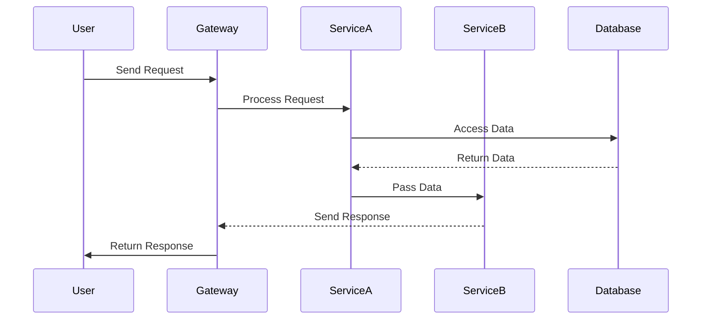

                 

### 云原生应用开发：拥抱云计算的新范式

> **关键词：** 云原生、云计算、应用开发、容器化、微服务、自动化、安全性、性能优化

> **摘要：** 本文将深入探讨云原生应用开发的方方面面，包括其发展背景、定义与特征、架构、技术栈、开发实践、部署与运维、性能优化以及未来展望。通过系统性地分析，帮助读者全面理解云原生应用开发的核心理念和实践方法。

---

## 目录大纲

### 云原生应用开发：拥抱云计算的新范式

#### 第一部分：引言与概述

1. 引言
    1.1 云原生应用的发展背景
    1.2 云原生应用的定义与特征
    1.3 云原生应用的优势与挑战

2. 云原生架构
    2.1 云原生架构概述
    2.2 容器化技术
    2.3 微服务架构
    2.4 自动化部署与运维

3. 云原生技术栈

#### 第二部分：云原生架构

1. Kubernetes
    1.1 Kubernetes 基础知识
    1.2 Kubernetes 架构与组件
    1.3 Kubernetes 的部署与配置

2. 服务网格
    2.1 服务网格概述
    2.2 Istio 介绍
    2.3 服务网格的部署与使用

3. 无状态与有状态服务
    3.1 无状态服务设计
    3.2 有状态服务设计
    3.3 如何选择服务类型

4. 云原生安全性
    4.1 云原生安全威胁概述
    4.2 Kubernetes 安全配置
    4.3 容器安全最佳实践

#### 第三部分：云原生应用开发实践

1. 应用容器化
    1.1 Dockerfile 编写
    1.2 容器镜像优化
    1.3 容器多阶段构建

2. 微服务架构设计
    2.1 微服务概述
    2.2 微服务设计原则
    2.3 微服务开发与测试

3. 云原生应用部署与运维
    3.1 Kubernetes 部署流程
    3.2 常见部署模式
    3.3 运维自动化

4. 云原生应用性能优化
    4.1 性能优化策略
    4.2 监控与日志管理
    4.3 性能调优实战

5. 云原生应用案例研究
    5.1 案例一：电商平台的云原生转型
    5.2 案例二：金融服务的云原生部署
    5.3 案例三：物联网设备的云原生架构

#### 第四部分：云原生未来展望

1. 云原生生态发展趋势
2. 云原生应用的新兴领域
3. 云原生未来的挑战与机遇

#### 第五部分：小结

---

### 目录大纲结构分析

本目录大纲结构合理，层次清晰，涵盖了云原生应用开发的核心内容，旨在引导读者逐步深入了解云原生应用开发的各个方面。以下是具体分析：

**第一部分：引言与概述**

- **第1章 引言**
  - **1.1 云原生应用的发展背景**：介绍云原生应用的历史和背景，为读者提供背景知识。
  - **1.2 云原生应用的定义与特征**：详细阐述云原生应用的概念、特征，帮助读者建立清晰的认识。
  - **1.3 云原生应用的优势与挑战**：分析云原生应用的优势，如弹性伸缩、高可用性、易维护等，同时探讨面临的挑战，如安全性、复杂度等。

**第二部分：云原生架构**

- **第2章 云原生架构**
  - **2.1 云原生架构概述**：概述云原生架构的基本概念，为后续章节的学习打下基础。
  - **2.2 容器化技术**：介绍容器化技术的原理和应用，解释其如何支持云原生应用。
  - **2.3 微服务架构**：详细讲解微服务架构的设计原则、优势和挑战。
  - **2.4 自动化部署与运维**：探讨自动化部署与运维的重要性和实现方法。

**第三部分：云原生技术栈**

- **第3章 云原生技术栈**
  - **Kubernetes**
    - **3.1 Kubernetes 基础知识**：介绍Kubernetes的基本概念和架构。
    - **3.1.2 Kubernetes 架构与组件**：详细讲解Kubernetes的各个组件和它们的作用。
    - **3.1.3 Kubernetes 的部署与配置**：提供Kubernetes的部署和配置步骤。
  - **服务网格**
    - **3.2.1 服务网格概述**：介绍服务网格的基本概念和作用。
    - **3.2.2 Istio 介绍**：详细讲解Istio的架构、功能和应用。
    - **3.2.3 服务网格的部署与使用**：提供服务网格的部署和使用方法。
  - **无状态与有状态服务**
    - **3.3.1 无状态服务设计**：讲解无状态服务的设计原则和方法。
    - **3.3.2 有状态服务设计**：讲解有状态服务的设计原则和方法。
    - **3.3.3 如何选择服务类型**：分析如何根据应用需求选择服务类型。
  - **云原生安全性**
    - **3.4.1 云原生安全威胁概述**：介绍云原生面临的主要安全威胁。
    - **3.4.2 Kubernetes 安全配置**：提供Kubernetes的安全配置建议。
    - **3.4.3 容器安全最佳实践**：介绍容器安全的最佳实践。

**第四部分：云原生应用开发实践**

- **第4章 云原生应用开发实践**
  - **应用容器化**
    - **4.1.1 Dockerfile 编写**：讲解如何编写Dockerfile创建容器镜像。
    - **4.1.2 容器镜像优化**：介绍如何优化容器镜像的性能和大小。
    - **4.1.3 容器多阶段构建**：讲解容器多阶段构建的原理和实践。
  - **微服务架构设计**
    - **4.2.1 微服务概述**：介绍微服务的基本概念和架构。
    - **4.2.2 微服务设计原则**：讲解微服务设计的原则和方法。
    - **4.2.3 微服务开发与测试**：介绍微服务的开发流程和测试方法。
  - **云原生应用部署与运维**
    - **4.3.1 Kubernetes 部署流程**：提供Kubernetes的部署流程。
    - **4.3.2 常见部署模式**：介绍常见的部署模式，如部署策略、滚动更新等。
    - **4.3.3 运维自动化**：介绍运维自动化的方法和工具。
  - **云原生应用性能优化**
    - **4.4.1 性能优化策略**：介绍性能优化的策略和方法。
    - **4.4.2 监控与日志管理**：介绍监控与日志管理的重要性和方法。
    - **4.4.3 性能调优实战**：提供性能调优的实际案例和实践。
  - **云原生应用案例研究**
    - **4.5.1 案例一：电商平台的云原生转型**：分析电商平台的云原生转型实践。
    - **4.5.2 案例二：金融服务的云原生部署**：分析金融服务的云原生部署实践。
    - **4.5.3 案例三：物联网设备的云原生架构**：分析物联网设备的云原生架构实践。

**第五部分：云原生未来展望**

- **第5章 云原生未来展望**
  - **5.1 云原生生态发展趋势**：分析云原生生态的发展趋势和未来方向。
  - **5.2 云原生应用的新兴领域**：探讨云原生应用在新兴领域的应用和发展。
  - **5.3 云原生未来的挑战与机遇**：分析云原生未来可能面临的挑战和机遇。

**第六部分：小结**

- **第6章 小结**：总结全文，强调云原生应用开发的核心要点和未来趋势，为读者提供启示和思考。

---

### 文章正文内容

#### 引言与概述

##### 云原生应用的发展背景

云原生应用的开发和推广源于云计算技术的迅猛发展。随着云计算技术的普及，企业开始意识到云计算所带来的弹性伸缩、高可用性、低成本等优势，这促使他们将传统应用逐步迁移到云环境中。然而，传统应用在云环境中的性能和可伸缩性往往无法满足需求，这导致了云原生应用的概念和技术的出现。

云原生应用的开发和推广源于云计算技术的迅猛发展。随着云计算技术的普及，企业开始意识到云计算所带来的弹性伸缩、高可用性、低成本等优势，这促使他们将传统应用逐步迁移到云环境中。然而，传统应用在云环境中的性能和可伸缩性往往无法满足需求，这导致了云原生应用的概念和技术的出现。

云原生（Cloud Native）一词最早由Martin Fowler和Nanwarene giant于2013年在《云原生应用架构》一文中提出。云原生应用是指基于云环境设计、开发和部署的应用，它具有以下几个核心特征：

1. **容器化**：容器化技术（如Docker）使应用可以在任何环境中快速部署和运行，从而实现环境的隔离和资源的最优化利用。
2. **微服务架构**：微服务架构将应用拆分为多个独立的、可复用的服务，每个服务负责一个特定的业务功能，这样可以提高系统的灵活性和可维护性。
3. **持续集成和持续部署（CI/CD）**：通过自动化工具，实现代码的自动化测试、构建和部署，提高开发效率和软件质量。
4. **动态伸缩**：根据负载自动调整资源分配，实现应用的高可用性和弹性伸缩。

随着云计算技术的不断发展和成熟，云原生应用逐渐成为企业数字化转型的重要技术方向。越来越多的企业和开发者开始采用云原生技术，以应对快速变化的业务需求和市场挑战。

##### 云原生应用的定义与特征

云原生应用（Cloud Native Application）是指在云计算环境中开发、部署和运行的应用，它利用了云计算提供的弹性、可伸缩性、高可用性和低成本等特性。云原生应用通常具有以下几个核心特征：

1. **容器化**：容器化技术是云原生应用的基础，它通过将应用及其依赖打包到一个轻量级的容器中，实现了应用的隔离和资源的最大化利用。容器化技术不仅提高了应用的部署速度，还使得应用可以在不同的环境中一致运行，从而简化了开发和运维流程。

2. **微服务架构**：微服务架构将大型应用拆分为多个独立的、可复用的微服务，每个微服务负责一个特定的业务功能。这种架构方式提高了系统的灵活性和可维护性，使得团队能够独立开发和部署不同的服务，从而加快了迭代速度。

3. **持续集成和持续部署（CI/CD）**：持续集成和持续部署是云原生应用的核心理念之一。通过自动化工具，实现代码的自动化测试、构建和部署，提高了开发效率和软件质量。CI/CD不仅减少了人为错误，还使得团队能够更快地响应市场需求。

4. **动态伸缩**：动态伸缩是云原生应用的重要特征，它通过自动化的方式根据负载动态调整资源的分配。这样可以确保应用在高并发情况下依然能够保持良好的性能，同时避免了资源的浪费。

5. **自动化运维**：云原生应用通常采用自动化运维工具，如Kubernetes、Prometheus、Grafana等，实现应用的自动化部署、监控和运维。自动化运维不仅降低了运维成本，还提高了运维效率。

6. **高可用性和容错性**：云原生应用通过分布式架构和冗余部署，提高了系统的可用性和容错性。即使某个服务出现故障，系统也可以自动切换到其他健康的实例，从而确保业务的连续性。

7. **DevOps文化**：云原生应用的开发和部署离不开DevOps文化的支持。DevOps文化强调开发团队和运维团队的紧密协作，通过自动化工具和流程，实现了开发和运维的无缝衔接。

##### 云原生应用的优势与挑战

云原生应用的开发带来了诸多优势，但同时也伴随着一定的挑战。以下是云原生应用的主要优势与挑战：

**优势：**

1. **弹性伸缩**：云原生应用可以根据负载自动调整资源的分配，实现了应用的高可用性和弹性伸缩。这种特性使得云原生应用能够应对突发的高并发场景，确保用户体验。

2. **持续集成和持续部署**：通过CI/CD，云原生应用的开发和部署变得更加自动化和高效。团队能够快速响应市场需求，提高产品的迭代速度。

3. **简化运维**：云原生应用采用自动化运维工具，减少了手动运维的工作量，提高了运维效率。同时，容器化技术使得应用可以在任何环境中一致运行，简化了运维的复杂度。

4. **资源优化**：容器化技术实现了资源的最大化利用，减少了硬件资源的浪费。动态伸缩特性使得资源分配更加灵活，从而降低了运营成本。

5. **高可用性和容错性**：云原生应用通过分布式架构和冗余部署，提高了系统的可用性和容错性。即使某个服务出现故障，系统也可以自动切换到其他健康的实例，从而确保业务的连续性。

**挑战：**

1. **复杂性**：云原生应用涉及多种技术和工具，如容器、微服务、Kubernetes等，这增加了系统的复杂性和运维难度。团队需要具备一定的技术背景和经验才能有效应对。

2. **安全性**：云原生环境中的安全威胁更加复杂，需要采取一系列安全措施来保护应用和数据的安全。例如，Kubernetes集群的安全配置、容器镜像的安全管理等。

3. **性能优化**：云原生应用在高并发场景下的性能优化是一个挑战。需要深入理解应用的工作负载和性能瓶颈，采取相应的优化策略。

4. **团队协作**：云原生应用的开发和部署需要跨团队协作，从开发、测试到运维，各个环节都需要紧密配合。团队协作和沟通的效率直接影响项目的进度和质量。

5. **持续学习和适应**：云原生技术不断发展和演进，团队需要不断学习和适应新技术，以保持竞争力。

总的来说，云原生应用的开发带来了诸多机遇和挑战。企业需要全面评估自身的需求和资源，制定合适的云原生战略，以充分利用云计算的优势，提升业务的竞争力。

---

#### 云原生架构

云原生架构（Cloud Native Architecture）是云原生应用的核心支柱，它利用了一系列先进的技术和设计原则，实现了应用的弹性、可伸缩性、高可用性和高效率。在本节中，我们将详细探讨云原生架构的概述、容器化技术、微服务架构和自动化部署与运维。

##### 云原生架构概述

云原生架构是一种基于云计算环境的设计原则和体系结构，它旨在实现应用的弹性、可伸缩性、高可用性和高效性。云原生架构的核心特征包括：

1. **容器化**：容器化技术是云原生架构的基础，它通过将应用及其依赖打包到一个轻量级的容器中，实现了环境的隔离和资源的最大化利用。容器化技术使得应用可以在任何环境中一致运行，从而简化了开发和运维流程。

2. **微服务架构**：微服务架构将应用拆分为多个独立的、可复用的微服务，每个微服务负责一个特定的业务功能。微服务架构提高了系统的灵活性和可维护性，使得团队能够独立开发和部署不同的服务。

3. **持续集成和持续部署（CI/CD）**：持续集成和持续部署是云原生架构的重要部分，通过自动化工具实现代码的自动化测试、构建和部署，提高了开发效率和软件质量。

4. **动态伸缩**：动态伸缩是云原生架构的核心特性之一，通过自动化的方式根据负载动态调整资源的分配，实现了应用的高可用性和弹性伸缩。

5. **自动化运维**：云原生架构采用自动化运维工具，如Kubernetes、Prometheus、Grafana等，实现应用的自动化部署、监控和运维，降低了运维成本，提高了运维效率。

6. **DevOps文化**：云原生架构的实施离不开DevOps文化的支持，DevOps文化强调开发团队和运维团队的紧密协作，通过自动化工具和流程实现了开发和运维的无缝衔接。

##### 容器化技术

容器化技术（Containerization）是云原生架构的核心组成部分，它通过将应用及其依赖打包到一个容器中，实现了应用的隔离和资源的最大化利用。以下是容器化技术的主要特点和原理：

1. **隔离性**：容器技术提供了运行时的隔离，每个容器拥有独立的进程空间、文件系统和网络接口，从而实现了应用的隔离。这种隔离性不仅提高了系统的稳定性，还降低了系统间的干扰。

2. **轻量级**：容器相对于传统的虚拟机（VM）更加轻量级，容器只包含应用和其依赖的库文件，而不需要额外的操作系统。这使得容器启动速度更快，资源占用更少。

3. **一致性**：容器技术实现了环境的一致性，应用可以在任何环境中一致运行，从而简化了开发和运维流程。通过容器镜像（Container Image），开发人员可以将应用及其依赖打包到一个静态的文件中，确保应用在不同的环境中都能正常运行。

4. **可移植性**：容器技术使得应用具有高度的可移植性，应用可以在不同的操作系统、云环境和物理服务器上运行。这种可移植性不仅提高了开发的灵活性，还降低了迁移和部署的复杂度。

5. **效率**：容器技术提高了系统的效率，容器引擎（如Docker）通过共享宿主机的操作系统内核，减少了资源消耗。同时，容器的动态扩展和负载均衡功能，使得系统可以根据需求自动调整资源，从而提高了资源利用率。

容器化技术的主要原理是利用容器引擎（如Docker）将应用及其依赖打包成一个容器镜像（Container Image），然后通过容器运行时（Container Runtime）启动和管理容器。容器镜像是一个静态的文件，包含了应用的所有依赖和配置，而容器运行时则负责创建、启动和管理容器。

##### 微服务架构

微服务架构（Microservices Architecture）是云原生架构的重要组成部分，它通过将大型应用拆分为多个独立的、可复用的微服务，实现了系统的灵活性和可维护性。以下是微服务架构的主要特点和设计原则：

1. **独立性**：每个微服务都是独立的，负责一个特定的业务功能。微服务之间通过定义良好的接口进行通信，从而实现了系统的模块化和松耦合。

2. **自治性**：每个微服务都有独立的数据库、配置和部署，可以独立开发和部署。这种自治性提高了系统的灵活性和可维护性，使得团队能够独立开发和部署不同的服务。

3. **分布式**：微服务架构通常采用分布式架构，多个微服务运行在不同的服务器上，通过网络进行通信。这种分布式架构提高了系统的可用性和容错性，即使某个服务出现故障，其他服务依然可以正常运行。

4. **灵活性**：微服务架构使得团队能够根据业务需求灵活调整服务的功能，增加了系统的灵活性。此外，微服务架构还支持横向扩展，可以根据需求动态调整服务实例的数量。

5. **可复用性**：微服务架构提高了服务的可复用性，多个服务可以独立开发和部署，从而降低了重复开发的工作量。这有助于提高开发效率，降低维护成本。

6. **松耦合**：微服务架构通过定义良好的接口进行通信，从而实现了系统的松耦合。这种松耦合使得服务之间相互独立，降低了系统的复杂性和耦合度。

微服务架构的设计原则包括：

1. **服务拆分**：根据业务功能将大型应用拆分为多个独立的微服务，每个微服务负责一个特定的业务功能。

2. **定义接口**：为每个微服务定义良好的接口，实现服务之间的松耦合和互操作。

3. **自治部署**：每个微服务都有独立的数据库、配置和部署，可以独立开发和部署。

4. **分布式架构**：采用分布式架构，多个微服务运行在不同的服务器上，通过网络进行通信。

5. **弹性伸缩**：根据负载动态调整微服务实例的数量，实现应用的高可用性和弹性伸缩。

##### 自动化部署与运维

自动化部署与运维是云原生架构的重要特征，它通过自动化工具和流程，实现了应用的自动化部署、监控和运维。以下是自动化部署与运维的主要工具和流程：

1. **持续集成（CI）**：持续集成是一种软件开发实践，通过自动化工具实现代码的自动化测试、构建和部署。CI工具（如Jenkins、GitLab CI）将代码仓库中的更改自动触发测试和构建，确保代码质量和提高开发效率。

2. **持续部署（CD）**：持续部署是持续集成的一部分，通过自动化工具实现应用的自动化部署。CD工具（如Jenkins、Kubernetes）根据测试结果和部署策略，自动部署应用到生产环境，确保应用的稳定运行。

3. **容器编排**：容器编排工具（如Kubernetes、Docker Swarm）负责管理容器的部署、扩展和运维。这些工具提供了自动化部署、服务发现、负载均衡等功能，提高了运维效率。

4. **监控与日志管理**：监控工具（如Prometheus、Grafana）实时收集系统的性能指标和日志数据，帮助运维人员及时发现和解决问题。日志管理工具（如ELK Stack、Graylog）存储和查询日志数据，提供了强大的日志分析能力。

5. **自动化运维**：自动化运维工具（如Ansible、Terraform）通过脚本和配置文件，实现了自动化部署、配置管理和资源管理。这些工具简化了运维工作，提高了运维效率。

自动化部署与运维的流程包括：

1. **代码提交**：开发人员将代码提交到代码仓库。

2. **代码测试**：CI工具自动触发测试，包括单元测试、集成测试等，确保代码质量。

3. **代码构建**：CI工具自动构建应用，生成容器镜像。

4. **容器镜像仓库**：将构建好的容器镜像推送到容器镜像仓库（如Docker Hub）。

5. **容器编排**：Kubernetes等容器编排工具根据部署策略，将容器镜像部署到集群中。

6. **监控与日志管理**：监控工具收集系统的性能指标和日志数据，日志管理工具存储和查询日志数据。

7. **故障处理**：当系统出现故障时，自动化工具自动重启容器或扩容集群，确保应用的稳定运行。

通过自动化部署与运维，云原生架构实现了高效的开发和运维流程，提高了系统的稳定性和可靠性。

---

#### 云原生技术栈

云原生技术栈是构建云原生应用的基础，它包括了多种技术和工具，如Kubernetes、服务网格、无状态与有状态服务、云原生安全性等。在本节中，我们将详细介绍这些技术及其在实际应用中的重要性。

##### Kubernetes

Kubernetes（简称K8s）是云原生技术栈的核心组件之一，它是一个开源的容器编排平台，用于自动化容器化应用程序的部署、扩展和管理。Kubernetes提供了灵活的部署选项、自动化的容器管理、以及强大的资源调度功能，使得开发人员和运维人员能够轻松地管理和扩展应用程序。

**Kubernetes基础知识：**

Kubernetes的基本概念包括：

1. **Pod**：Pod是Kubernetes中的最小部署单元，它封装了一个或多个容器，并共享网络命名空间和存储卷。
2. **Service**：Service提供了一种抽象方式，用于将一组Pod暴露为单个网络服务。常见的类型有ClusterIP、NodePort、LoadBalancer。
3. **Deployment**：Deployment用于管理Pod的创建和更新，它提供了无状态服务的自动化部署和管理。
4. **StatefulSet**：StatefulSet用于管理有状态服务的部署，确保每个Pod具有稳定的网络标识和持久化存储。
5. **Ingress**：Ingress提供了外部访问Kubernetes集群内部服务的入口，通常用于实现负载均衡和域名解析。

**Kubernetes架构与组件：**

Kubernetes的架构包括以下关键组件：

1. **Master节点**：Master节点负责集群的管理和控制，主要包括API Server、Scheduler、Controller Manager和Etcd。
2. **Worker节点**：Worker节点运行Pod，并负责与Master节点的通信。每个节点上运行有Kubelet、Kube-Proxy和Container Runtime。
3. **Kubelet**：Kubelet是每个节点的守护进程，负责Pod的生命周期管理。
4. **Kube-Proxy**：Kube-Proxy负责实现Pod之间的网络通信和服务发现。
5. **Container Runtime**：Container Runtime负责容器引擎，如Docker或Containerd。

**Kubernetes的部署与配置：**

部署Kubernetes集群通常分为以下步骤：

1. **环境准备**：确保节点符合要求，安装并配置Docker或其他容器引擎。
2. **安装Kubernetes组件**：使用工具如kubeadm、kops或Helm进行部署。
3. **配置网络**：配置集群的网络，确保节点之间可以通信。
4. **部署示例应用**：部署Kubernetes官方示例应用，如Nginx或Wordpress，以测试集群功能。
5. **监控与日志**：配置监控和日志收集工具，如Prometheus和Grafana，以便实时监控集群状态。

##### 服务网格

服务网格（Service Mesh）是一种用于管理微服务通信的分布式系统架构，它为微服务提供了独立的通信层，使得服务之间的通信更加简单、可靠和安全。服务网格的主要目标是解决微服务架构中的服务发现、服务间通信、流量控制、监控和日志管理等问题。

**服务网格概述：**

服务网格的主要组件包括：

1. **服务代理（Service Proxy）**：如Istio的Envoy，服务代理负责拦截服务间的通信，提供负载均衡、服务发现、断路器等功能。
2. **控制平面（Control Plane）**：如Istio的控制平面，负责配置管理、策略定义、流量管理、监控和日志收集等。
3. **数据平面（Data Plane）**：数据平面由服务代理组成，负责处理服务间通信。

**Istio介绍：**

Istio是一个开源的服务网格平台，它提供了服务发现、负载均衡、流量控制、安全性等功能。Istio由两个主要组件组成：数据平面（Envoy代理）和控制平面（Pilot、Citadel、Galley）。

1. **Pilot**：Pilot负责管理服务网格中的配置信息，将配置推送到Envoy代理。
2. **Citadel**：Citadel负责认证和授权，确保服务之间的通信是安全的。
3. **Galley**：Galley负责验证和同步服务网格中的配置信息。

**服务网格的部署与使用：**

部署Istio通常分为以下步骤：

1. **准备环境**：确保Kubernetes集群已经就绪。
2. **安装Istio**：使用Istio安装程序（istioctl）安装Istio控制平面和数据平面。
3. **部署示例应用**：部署Istio官方示例应用，如Bookinfo，以测试服务网格功能。
4. **配置流量管理**：使用Istio的流量管理功能，如虚拟服务（Virtual Service）和路由规则（Destination Rule），控制服务间的流量流向。
5. **监控与日志**：配置Istio的监控和日志收集，以便实时监控服务网格的状态。

##### 无状态与有状态服务

在云原生应用中，服务的状态管理是一个关键问题。无状态服务（Stateless Service）和有状态服务（Stateful Service）分别代表了不同的服务设计模式，它们在实现方式、部署和管理方面有显著差异。

**无状态服务设计：**

无状态服务是指不存储任何会话或用户状态的服务。每次请求都是独立的，服务不依赖于之前的请求。这种设计模式具有以下优点：

1. **简单性**：无状态服务简化了系统设计，减少了状态管理的复杂性。
2. **可伸缩性**：无状态服务可以轻松横向扩展，因为新的实例可以立即处理请求，而无需关心之前的请求状态。
3. **高可用性**：无状态服务在某个实例出现故障时，其他实例可以立即接管其工作，提高了系统的可用性。

无状态服务的设计原则包括：

1. **独立请求**：每个请求都是独立的，不依赖于之前的请求。
2. **数据持久化**：将数据持久化到外部存储，如数据库或缓存，以确保数据的持久性和一致性。
3. **缓存机制**：利用缓存机制，减少对后端存储的访问，提高系统的响应速度。

**有状态服务设计：**

有状态服务是指存储和跟踪用户状态的。例如，用户的购物车信息、会话状态等。这种设计模式具有以下优点：

1. **个性化**：有状态服务可以提供个性化的用户体验，根据用户历史记录和偏好进行个性化推荐。
2. **连续性**：有状态服务可以确保用户的状态在系统故障或重启后仍然保持一致。
3. **安全性**：有状态服务可以提供安全的认证和授权功能，确保用户数据的保密性和完整性。

有状态服务的设计原则包括：

1. **状态管理**：将状态数据存储在可靠的外部存储中，如关系型数据库或分布式缓存系统。
2. **分布式一致性**：确保分布式系统中状态数据的一致性，使用分布式事务或最终一致性模型。
3. **高可用性**：通过冗余部署和故障转移机制，确保有状态服务的高可用性。

**如何选择服务类型：**

在选择服务类型时，需要考虑以下因素：

1. **业务需求**：根据业务需求确定是否需要存储用户状态或会话信息。
2. **性能要求**：无状态服务通常具有更高的性能和可伸缩性，适用于高并发的场景；有状态服务则适用于需要个性化体验的场景。
3. **系统复杂性**：无状态服务简化了系统设计，降低了维护成本；有状态服务增加了系统的复杂性和维护成本。
4. **数据持久性**：无状态服务的数据持久性较低，适用于不需要持久化数据的应用；有状态服务则适用于需要持久化数据的应用。

根据以上因素，可以综合考虑选择适合的服务类型，以实现最佳的系统性能和用户体验。

##### 云原生安全性

云原生安全性是云原生应用架构中的一个关键方面。随着容器化、微服务架构和自动化运维的普及，云原生应用面临着新的安全挑战。以下是一些云原生安全性的核心内容和最佳实践。

**云原生安全威胁概述：**

云原生安全威胁主要包括以下几个方面：

1. **容器镜像安全**：容器镜像可能包含已知的漏洞、恶意软件或未经授权的库，这些都会对系统的安全性构成威胁。
2. **集群配置安全**：Kubernetes集群的配置可能存在安全漏洞，如未授权访问、配置错误等。
3. **服务网格安全**：服务网格中的服务代理可能成为攻击的目标，攻击者可以通过服务网格窃取敏感数据或控制服务。
4. **数据安全性**：数据存储和传输过程中的加密不足或配置错误，可能导致敏感数据泄露。
5. **API访问安全**：未经授权的访问Kubernetes API可能造成严重的系统损害。

**Kubernetes安全配置：**

为了确保Kubernetes集群的安全性，可以采取以下安全配置措施：

1. **最小权限原则**：为每个用户或服务账户分配最小的权限，避免权限过大。
2. **使用RBAC**：Kubernetes的RBAC（基于角色的访问控制）功能可以帮助限制用户对资源的访问权限。
3. **网络策略**：使用网络策略限制Pod之间的通信，确保仅允许必要的流量。
4. **Pod安全策略**：使用Pod安全策略来限制Pod的行为，如禁止特权容器、强制使用安全上下文等。
5. **密钥管理**：确保密钥和凭证的安全存储和管理，避免泄露。

**容器安全最佳实践：**

为了提高容器安全性，可以采取以下最佳实践：

1. **使用官方镜像**：尽量使用官方或经过验证的镜像，避免使用未知的第三方镜像。
2. **最小化镜像**：尽量使用最小化的基础镜像，减少攻击面。
3. **定期更新**：定期更新容器镜像和容器引擎，以修复已知漏洞。
4. **扫描容器镜像**：使用容器安全工具（如Clair、Docker Bench for Security）扫描容器镜像，识别潜在的安全漏洞。
5. **配置审计**：启用Kubernetes的审计功能，记录所有重要的操作和变更，以便在发生安全事件时进行追踪和分析。

通过以上措施，可以有效提升云原生应用的安全性，确保系统和数据的完整性。

---

#### 云原生应用开发实践

云原生应用的开发实践是确保云原生应用能够高效、稳定、安全地运行的关键。在本节中，我们将探讨应用容器化、微服务架构设计、云原生应用部署与运维、性能优化以及云原生应用案例研究。

##### 应用容器化

容器化是将应用及其依赖打包到一个独立的环境中，以便在不同的操作系统和硬件上轻松部署和运行。以下是应用容器化的关键步骤：

1. **编写Dockerfile**：Dockerfile是一个文本文件，包含了构建和运行容器所需的指令。编写Dockerfile时，应遵循以下原则：
   - **最小化镜像**：尽量使用官方的基础镜像，避免安装不必要的软件。
   - **分层构建**：将不同的依赖和文件分层构建，以提高构建速度和减少镜像大小。
   - **环境变量**：使用环境变量管理配置，以便在不同环境中进行灵活配置。
   - **多阶段构建**：使用多阶段构建来分离开发、测试和生产环境，减少镜像大小。

   以下是一个简单的Dockerfile示例：

   ```Dockerfile
   # 使用官方Python基础镜像
   FROM python:3.8-slim

   # 设置工作目录
   WORKDIR /app

   # 复制应用程序代码
   COPY . .

   # 安装依赖项
   RUN pip install -r requirements.txt

   # 暴露应用端口
   EXPOSE 8000

   # 运行应用程序
   CMD ["python", "app.py"]
   ```

2. **容器镜像优化**：优化容器镜像可以提高性能和减少大小。以下是一些优化策略：
   - **使用多阶段构建**：将应用程序的开发、测试和生产环境分离，减少镜像大小。
   - **减小基础镜像大小**：选择小型的官方基础镜像，减少依赖项和系统的冗余。
   - **删除无用文件**：删除构建过程中生成的临时文件和不需要的文件，以减少镜像大小。
   - **使用缓存策略**：合理配置Docker的缓存策略，提高构建速度。

3. **容器多阶段构建**：多阶段构建是一种优化容器镜像的方法，它允许在不同阶段使用不同的基础镜像。以下是一个多阶段构建的示例：

   ```Dockerfile
   # 阶段1：构建应用程序
   FROM python:3.8-slim AS builder
   WORKDIR /app
   COPY . .
   RUN pip install -r requirements.txt

   # 阶段2：创建最终镜像
   FROM python:3.8-slim
   WORKDIR /app
   COPY --from=builder /app .
   EXPOSE 8000
   CMD ["python", "app.py"]
   ```

   在这个示例中，第一阶段使用了Python基础镜像进行构建，第二阶段使用了最终的基础镜像，从而减少了镜像的大小。

##### 微服务架构设计

微服务架构是一种将应用程序分解为多个独立的服务的方法，每个服务负责一个特定的业务功能。以下是微服务架构设计的关键步骤：

1. **服务拆分**：根据业务功能将应用程序拆分为多个独立的微服务。每个服务应具有明确的职责和边界。
2. **定义接口**：为每个微服务定义良好的API接口，确保服务之间的松耦合和互操作。
3. **服务自治**：每个微服务应有独立的数据库、配置和部署，以便独立开发和部署。
4. **服务发现**：实现服务发现机制，使得服务之间可以动态查找和通信。
5. **分布式系统设计**：考虑分布式系统的设计和架构，如负载均衡、数据一致性和故障恢复。

以下是一个简单的微服务架构示例：



在这个示例中，用户通过网关发送请求，请求被路由到不同的微服务，每个微服务处理特定的业务逻辑并访问数据库。最终，微服务将处理结果返回给用户。

##### 云原生应用部署与运维

部署和运维云原生应用是一个复杂的过程，需要综合考虑部署策略、自动化运维和监控。以下是云原生应用部署与运维的关键步骤：

1. **部署策略**：根据业务需求和资源限制，选择合适的部署策略，如滚动更新、蓝绿部署、金丝雀部署等。
2. **自动化部署**：使用自动化工具（如Kubernetes、Helm）实现应用的自动化部署和升级。
3. **容器编排**：使用容器编排工具（如Kubernetes）管理应用的部署、扩展和运维。
4. **监控与日志**：使用监控工具（如Prometheus、Grafana）收集应用性能指标和日志数据，以便实时监控和故障排查。
5. **自动化运维**：使用自动化运维工具（如Ansible、Terraform）简化运维任务，如配置管理、资源管理、故障恢复等。

以下是一个简单的部署和运维示例：

```Dockerfile
# 部署应用程序
kubectl apply -f deployment.yaml

# 查看部署状态
kubectl get pods

# 监控应用性能
prometheus pushgateway --data=metrics.txt
```

在这个示例中，使用Kubernetes部署应用程序，并使用Prometheus监控应用性能。

##### 云原生应用性能优化

云原生应用的性能优化是一个复杂的过程，需要综合考虑代码优化、系统架构和运维策略。以下是云原生应用性能优化的一些关键步骤：

1. **代码优化**：优化应用程序的代码，减少计算和I/O操作，提高程序的执行效率。
2. **系统架构优化**：优化系统架构，如使用缓存、负载均衡、分布式存储等，提高系统的响应速度和处理能力。
3. **监控与日志**：使用监控和日志工具，实时监控应用性能指标，发现瓶颈和故障。
4. **性能调优**：根据监控数据和分析结果，进行性能调优，如调整系统参数、优化数据库查询等。
5. **自动化性能测试**：定期进行自动化性能测试，以验证系统的性能和稳定性。

以下是一个简单的性能调优示例：

```shell
# 查看系统CPU使用情况
top

# 查看数据库查询性能
mysql query profiler

# 调整系统参数
sudo sysctl -w net.core.somaxconn=65536
```

在这个示例中，使用系统工具监控CPU使用情况、数据库查询性能，并调整系统参数以优化性能。

##### 云原生应用案例研究

云原生应用案例研究是了解云原生应用在实际场景中的应用和实践的重要途径。以下是一些云原生应用案例研究：

1. **电商平台的云原生转型**：一个大型电商平台采用了云原生技术，实现了应用的容器化、微服务架构和自动化部署。通过云原生技术，电商平台提高了系统的性能、可伸缩性和稳定性，实现了快速迭代和响应市场需求。
2. **金融服务的云原生部署**：一家金融服务公司采用云原生技术进行系统重构，实现了高可用性和容错性。通过云原生架构，金融服务公司提高了系统的安全性和可靠性，降低了运维成本。
3. **物联网设备的云原生架构**：一家物联网设备公司采用云原生技术管理其大量设备和服务。通过云原生架构，物联网设备公司实现了设备的远程监控、故障诊断和快速迭代，提高了用户体验和业务效率。

通过这些案例研究，可以看到云原生技术在不同领域中的应用和实践，为其他企业和开发者提供了宝贵的经验和启示。

---

#### 云原生未来展望

云原生应用的发展势头迅猛，随着技术的不断成熟和生态的逐渐完善，云原生技术将继续影响和推动企业数字化转型。以下是云原生未来的展望，包括生态发展趋势、新兴领域以及面临的挑战与机遇。

##### 云原生生态发展趋势

1. **开源生态的持续繁荣**：云原生技术的开源生态将持续繁荣，更多的开源项目和工具将不断涌现，如服务网格（如Istio、Linkerd）、分布式存储（如Ceph、GlusterFS）、云原生数据库（如Cassandra、MongoDB）等。这些开源项目将为开发者提供丰富的选择，促进云原生技术的广泛应用。

2. **云原生与人工智能的融合**：云原生技术与人工智能（AI）的融合将成为未来发展趋势。通过云原生架构，企业可以轻松地部署和管理AI模型和应用程序，实现实时分析和决策。此外，AI技术可以优化云原生应用的性能、自动化运维和安全性，为云原生生态注入新的活力。

3. **多云和混合云的支持**：随着企业对多云和混合云的需求不断增加，云原生技术将加强对多云和混合云的支持。企业需要在不同云环境中无缝迁移和管理应用，云原生平台将提供跨云的统一管理和服务，降低多云环境下的复杂性和成本。

4. **服务网格的普及**：服务网格作为云原生架构的重要组成部分，将在未来得到更广泛的应用。服务网格可以提供高效、可靠和安全的微服务通信，支持服务发现、负载均衡、监控和日志管理等功能，成为云原生应用的标准化基础设施。

##### 云原生应用的新兴领域

1. **物联网（IoT）**：随着物联网设备的快速增长，云原生技术在物联网领域的应用前景广阔。通过云原生架构，企业可以轻松地管理和处理大量物联网设备的数据，实现设备的实时监控、故障诊断和远程升级。

2. **金融科技（FinTech）**：金融科技领域对系统的稳定性、安全性和响应速度有极高的要求。云原生技术提供了弹性和高可用性的解决方案，为金融科技企业提供了创新的业务模式和服务。

3. **智能医疗**：智能医疗领域涉及到大量的数据分析和处理，云原生技术可以提供高效的计算和存储资源，支持医疗大数据的应用和研发，推动智能医疗的发展。

4. **游戏行业**：云原生技术为游戏行业带来了新的机遇，通过云原生架构，游戏开发者可以实现游戏的实时更新、个性化推荐和跨平台兼容，提高用户体验和业务效率。

##### 云原生未来的挑战与机遇

1. **安全性**：云原生环境中的安全性是一个重要挑战。随着容器和微服务的普及，攻击者可能找到新的攻击途径。企业需要加强对容器镜像、集群配置和服务网格的安全管理，确保系统的安全性和数据完整性。

2. **运维复杂性**：云原生应用涉及多种技术和工具，运维团队需要具备一定的技术背景和经验。企业需要培养专业的运维团队，或借助第三方服务，以应对运维复杂性。

3. **性能优化**：云原生应用在高并发场景下的性能优化是一个挑战。企业需要深入了解应用的工作负载和性能瓶颈，采取针对性的优化策略，确保应用在云环境中能够高效运行。

4. **人才短缺**：随着云原生技术的快速发展，对专业人才的需求也在不断增加。然而，目前市场上云原生人才相对稀缺。企业需要加大对人才培养的投入，吸引和留住专业人才。

总的来说，云原生技术将继续发展和成熟，为企业和开发者带来更多的机遇和挑战。通过深入理解和应用云原生技术，企业可以提升业务的竞争力，实现数字化转型。

---

### 小结

云原生应用开发已成为现代软件工程的核心趋势，它通过容器化、微服务架构、自动化部署与运维等关键技术，为企业提供了高效、可伸缩、高可用的解决方案。本文系统地介绍了云原生应用开发的核心概念、架构、技术栈、开发实践以及未来展望，旨在帮助读者全面理解云原生应用开发的核心理念和实践方法。

通过本文的阅读，读者应掌握以下关键要点：

1. **云原生应用的定义与特征**：了解云原生应用的基本概念和核心特征，如容器化、微服务架构、持续集成与持续部署、动态伸缩、自动化运维等。
2. **云原生架构**：熟悉云原生架构的概述，包括容器化技术、微服务架构、自动化部署与运维等组成部分。
3. **云原生技术栈**：掌握Kubernetes、服务网格、无状态与有状态服务、云原生安全性等关键技术，以及其在实际应用中的重要性。
4. **云原生应用开发实践**：了解应用容器化、微服务架构设计、部署与运维、性能优化等实践方法，以及如何通过云原生技术提高系统性能和稳定性。
5. **云原生未来展望**：关注云原生生态的发展趋势、新兴领域，以及未来面临的挑战与机遇。

云原生应用开发不仅是技术上的创新，更是企业数字化转型的重要推动力。通过拥抱云原生技术，企业可以更好地应对快速变化的市场需求，提升业务竞争力，实现持续发展。未来，随着技术的不断进步和生态的不断完善，云原生应用开发将继续为企业和开发者带来更多的机遇和挑战。

---

### 拓展阅读

1. **《云原生应用架构》**：这是一本关于云原生应用架构的经典书籍，详细介绍了云原生应用的概念、技术栈和最佳实践。
2. **Kubernetes官方文档**：Kubernetes的官方文档提供了丰富的学习资源，包括安装指南、教程、API参考等。
3. **Istio官方文档**：Istio的官方文档涵盖了服务网格的各个方面，包括安装、配置、扩展和使用案例。
4. **云原生社区**：云原生社区是一个活跃的在线社区，提供云原生技术相关的讨论、教程和最新动态。

通过以上资源和社区的互动，读者可以进一步深入了解云原生应用开发的方方面面，不断学习和提升自己的技术能力。

---

### 作者信息

**作者：AI天才研究院/AI Genius Institute & 禅与计算机程序设计艺术 /Zen And The Art of Computer Programming**

