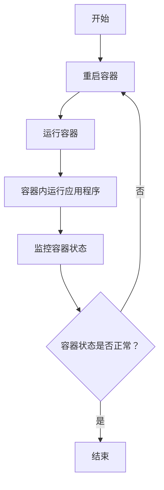
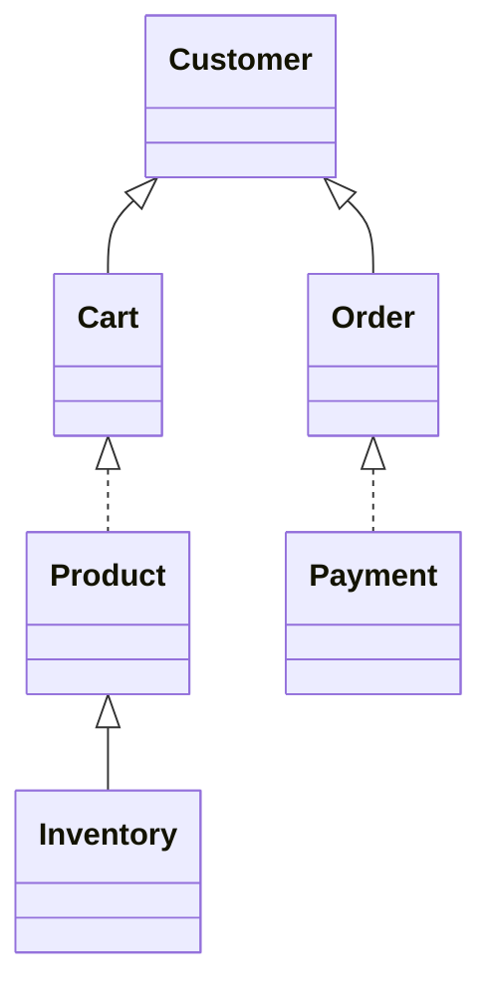
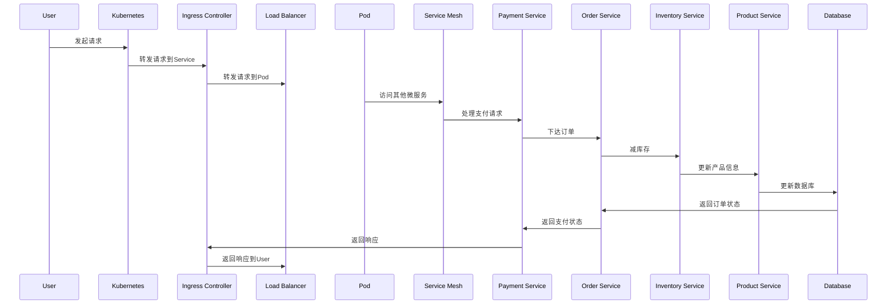
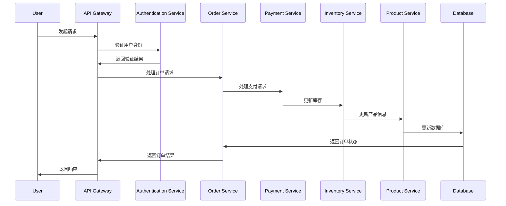
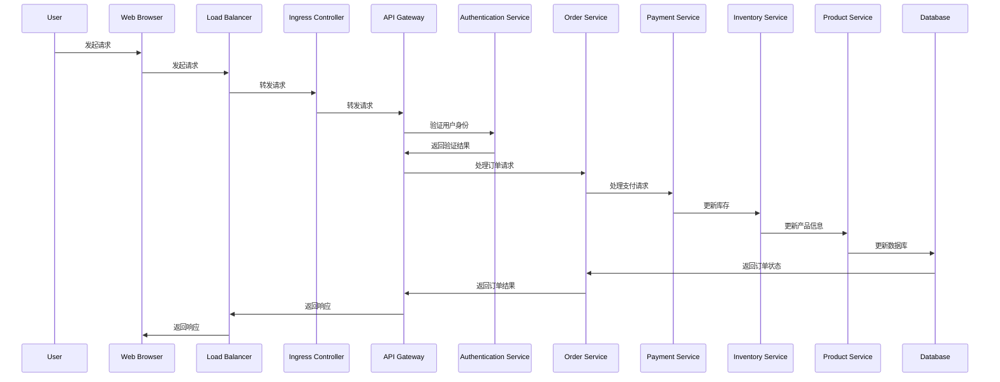

                 

### 云原生技术：未来架构的发展方向

> 关键词：云原生、微服务、容器、服务网格、持续集成与持续部署

> 摘要：本文将深入探讨云原生技术，从其背景、核心概念、设计原则到应用场景，全面解析云原生技术作为未来IT架构发展方向的重要性。我们将通过一步步的分析，帮助读者理解云原生技术的本质及其在实际开发中的具体应用。

---

## 引言

随着云计算、分布式计算和微服务架构的不断发展，传统IT架构正面临着前所未有的变革。云原生技术作为新时代的架构方向，不仅能够应对现代应用的高可用、可伸缩、弹性等需求，还能提高开发效率和系统稳定性。本文将围绕云原生技术展开讨论，旨在揭示其内在机制和未来发展趋势。

### 第1章 背景介绍

#### 1.1 云原生技术的起源

云原生（Cloud Native）这个概念最早由云计算专家和Google前工程师Nagendra Modadugu在2013年提出。他定义云原生为一种利用和扩展现代动态基础设施的技术和服务体系，其中包括微服务、容器、服务网格等。

#### 1.2 云原生技术的发展历程

自提出以来，云原生技术经历了快速的发展。容器技术的成熟，如Docker和Kubernetes的兴起，推动了云原生技术的普及。随后，服务网格（如Istio、Linkerd）和持续集成与持续部署（CI/CD）等工具进一步丰富了云原生生态。

#### 1.3 云原生在IT架构中的重要性

云原生技术不仅提升了系统的可伸缩性和弹性，还使得开发和运维过程更加自动化，从而提高了开发效率和系统稳定性。随着大数据、物联网、人工智能等技术的不断演进，云原生架构正逐渐成为现代IT架构的重要组成部分。

### 第2章 核心概念

#### 2.1 容器

容器是一种轻量级的运行时环境，可以封装应用程序及其依赖项，实现应用在不同环境间的无缝迁移。容器与传统虚拟机相比，具有启动速度快、资源利用率高等优势。

#### 2.2 微服务

微服务是一种将应用程序拆分为小型、独立服务的架构风格。每个微服务负责完成特定功能，通过API进行通信，从而提高系统的灵活性和可维护性。

#### 2.3 服务网格

服务网格是一种基础设施层服务，负责管理和通信服务间的流量。服务网格通过抽象化服务间的通信，使得微服务架构更加简单和高效。

#### 2.4 持续集成与持续部署（CI/CD）

持续集成与持续部署是一种软件开发实践，通过自动化测试和部署流程，实现快速、频繁的代码交付。CI/CD不仅提高了开发效率，还确保了软件质量的稳定。

### 第3章 设计原则

#### 3.1 可伸缩性

可伸缩性是云原生架构的核心原则之一。通过设计分布式系统和使用容器技术，云原生架构能够实现水平扩展，满足大规模应用的需求。

#### 3.2 弹性

弹性是云原生架构应对流量波动的能力。通过自动化部署和资源管理，云原生系统可以在流量高峰期自动扩展，在流量低谷期自动收缩。

#### 3.3 自动化

自动化是云原生架构实现高效运维的关键。从部署、监控到故障恢复，云原生技术通过自动化工具和平台，显著降低了运维成本。

#### 3.4 高可用性

高可用性是云原生架构的重要特性。通过分布式架构和冗余设计，云原生系统能够实现故障自动恢复，确保服务的持续可用。

### 第4章 实践指南

#### 4.1 云原生架构的部署

云原生架构的部署涉及容器编排工具（如Kubernetes）和基础设施的配置。本文将介绍如何使用Kubernetes进行云原生应用的部署和管理。

#### 4.2 监控和管理

云原生系统的监控和管理是确保系统稳定运行的关键。本文将介绍常见的监控工具（如Prometheus、Grafana）及其在云原生环境中的应用。

#### 4.3 故障恢复

故障恢复是云原生系统应对意外情况的能力。本文将探讨如何设计故障恢复策略，确保系统在故障发生时能够快速恢复。

### 第5章 应用场景

#### 5.1 金融行业

金融行业对系统的可靠性、安全性和合规性要求极高。本文将分析云原生技术如何应用于金融行业的业务场景，如支付系统、交易系统等。

#### 5.2 物流行业

物流行业具有高并发、大数据等特点。本文将探讨云原生技术如何助力物流行业实现高效、稳定的物流管理系统。

#### 5.3 教育行业

教育行业正逐渐走向数字化、智能化。本文将分析云原生技术如何应用于在线教育平台，提高教育资源的利用效率和教学效果。

### 第6章 未来趋势

#### 6.1 人工智能与云原生

人工智能技术的快速发展，为云原生技术带来了新的应用场景。本文将探讨人工智能与云原生技术的融合发展趋势。

#### 6.2 区块链与云原生

区块链技术的去中心化特性，与云原生架构的分布式设计理念相契合。本文将分析区块链与云原生技术的结合前景。

#### 6.3 云原生与边缘计算

边缘计算是云计算的延伸，与云原生技术有着天然的契合点。本文将探讨云原生与边缘计算的协同发展。

### 结论

云原生技术作为未来IT架构的发展方向，具有不可替代的重要性。通过本文的探讨，我们希望能帮助读者深入理解云原生技术的核心概念、设计原则和应用场景，为实际开发提供指导。

### 参考文献

- Modadugu, N. (2013). Cloud Native Computing: A New Architectural Approach. Retrieved from [https://www.cncf.io/wp-content/uploads/2018/05/CNCFSummit-CloudNativeComputing.pdf](https://www.cncf.io/wp-content/uploads/2018/05/CNCFSummit-CloudNativeComputing.pdf)
- Kubernetes Documentation. (n.d.). Introduction. Retrieved from [https://kubernetes.io/docs/concepts/overview/what-is-kubernetes/](https://kubernetes.io/docs/concepts/overview/what-is-kubernetes/)
- Prometheus Documentation. (n.d.). Overview. Retrieved from [https://prometheus.io/docs/introduction/what-is-prometheus/](https://prometheus.io/docs/introduction/what-is-prometheus/)

### 作者

作者：AI天才研究院/AI Genius Institute & 禅与计算机程序设计艺术 /Zen And The Art of Computer Programming

---

通过本文的探讨，我们希望读者能够对云原生技术有一个全面、深入的理解，为未来IT架构的发展提供有益的参考。在下一个章节中，我们将详细分析云原生技术的核心概念，帮助读者建立对这一新兴技术的清晰认识。敬请期待！## 第1章 背景介绍

### 1.1 云原生技术的起源

云原生（Cloud Native）这一概念最早由云计算专家和Google前工程师Nagendra Modadugu在2013年提出。Modadugu在一份白皮书中阐述了云原生技术的概念，并将其定义为一种利用和扩展现代动态基础设施的技术和服务体系。这一概念的核心在于通过利用云计算、容器、微服务、服务网格和自动化工具等新兴技术，构建高度可伸缩、可靠和灵活的IT系统。

#### 1.1.1 云原生概念的提出

云原生概念的出现，是对传统IT架构的一种反思和升级。随着互联网的普及和云计算的兴起，传统IT系统在面对现代应用需求时，逐渐暴露出其局限性。传统IT架构通常依赖于静态的、中心化的基础设施，难以应对快速变化的市场需求。而云原生技术则强调利用现代动态基础设施，实现系统的弹性扩展、自动化管理和快速迭代。

#### 1.1.2 云原生与传统IT架构的差异

云原生技术与传统IT架构存在显著差异，主要体现在以下几个方面：

1. **基础设施的动态性**：
   - 传统IT架构通常依赖于固定的硬件基础设施，而云原生技术则利用云计算的弹性基础设施，能够根据需求动态调整资源。

2. **架构风格**：
   - 传统IT架构往往采用单块架构或分层架构，而云原生技术则倡导采用微服务架构，将应用程序拆分为多个小型、独立的服务。

3. **自动化**：
   - 传统IT架构的运维通常依赖于手动操作，而云原生技术则通过自动化工具（如Kubernetes、Ansible等）实现自动化部署、监控和故障恢复。

4. **可伸缩性**：
   - 传统IT架构在可伸缩性方面存在瓶颈，而云原生技术通过水平扩展（Horizontal Scaling）实现系统的弹性伸缩。

### 1.2 云原生技术的发展历程

云原生技术的发展历程是技术创新和理念传播的有机结合。以下是云原生技术发展过程中的一些重要里程碑：

#### 1.2.1 容器技术的兴起

容器技术的兴起是云原生技术发展的关键一步。2006年，Praveen Kumar和Srinivas Krishnan首次提出了容器虚拟化的概念。随后，Docker公司在2013年推出了Docker，使得容器技术得以广泛应用。Docker通过简化容器的创建、部署和运行，极大地提高了开发效率和系统稳定性。

#### 1.2.2 Kubernetes的诞生

Kubernetes是云原生生态系统中的重要组成部分，它是Google在2014年开源的容器编排工具。Kubernetes提供了自动化部署、扩展和管理容器化应用程序的能力，解决了容器集群管理的复杂性。Kubernetes的诞生标志着云原生技术进入了一个新阶段，推动了微服务架构和容器化应用的普及。

#### 1.2.3 服务网格的发展

服务网格是云原生架构中的重要概念，它提供了服务间通信的基础设施。2016年，Istio和Linkerd等第一个服务网格项目相继开源。服务网格通过抽象化服务间的通信，提供了安全、可靠和高效的服务交互机制，使得微服务架构更加简单和可控。

#### 1.2.4 持续集成与持续部署（CI/CD）

持续集成与持续部署是云原生技术中不可或缺的一部分。随着容器技术和微服务架构的普及，持续集成与持续部署（CI/CD）成为提高开发效率和质量的重要手段。CI/CD通过自动化测试和部署流程，确保了代码的快速迭代和高质量交付。

### 1.3 云原生在IT架构中的重要性

云原生技术在现代IT架构中扮演着重要角色，主要体现在以下几个方面：

#### 1.3.1 提高开发效率

云原生技术通过容器化、微服务化和自动化工具，显著提高了开发效率。开发者可以快速部署和测试应用程序，减少了繁琐的手动操作和重复性工作。

#### 1.3.2 确保系统稳定性

云原生技术通过自动化监控和故障恢复，确保了系统的稳定性。当系统出现故障时，自动化工具可以快速检测并恢复服务，降低了故障带来的影响。

#### 1.3.3 提升系统可伸缩性

云原生技术通过水平扩展（Horizontal Scaling）和弹性计算，提升了系统的可伸缩性。在流量高峰期，系统可以自动扩展资源，而在流量低谷期，系统可以自动缩减资源，实现了资源的最优利用。

#### 1.3.4 降低运维成本

云原生技术通过自动化运维，降低了运维成本。运维人员可以集中精力处理关键问题，而无需担心日常的部署、监控和故障恢复等任务。

#### 1.3.5 支持多样化的应用场景

云原生技术支持多种应用场景，如金融、物流、教育等行业。通过云原生架构，这些行业可以构建高效、稳定的业务系统，满足快速变化的市场需求。

### 1.4 云原生技术的未来发展趋势

随着云计算、大数据、人工智能等技术的发展，云原生技术在未来将迎来更多的发展机遇。以下是云原生技术的几个未来发展趋势：

#### 1.4.1 人工智能与云原生

人工智能技术的发展为云原生技术带来了新的应用场景。通过将人工智能与云原生技术结合，可以构建智能化的业务系统，如智能推荐、自动化运维等。

#### 1.4.2 区块链与云原生

区块链技术的去中心化特性与云原生架构的分布式设计理念相契合。未来，区块链与云原生技术的融合将为金融、物流等领域带来新的变革。

#### 1.4.3 边缘计算与云原生

边缘计算是云计算的延伸，与云原生技术有着天然的契合点。未来，云原生技术与边缘计算的结合将为物联网、智能制造等领域提供强大的支持。

#### 1.4.4 多云与混合云

随着企业对云服务需求的多样化，多云与混合云架构将成为趋势。云原生技术通过其灵活性和可移植性，将在多云与混合云环境中发挥重要作用。

### 总结

云原生技术作为未来IT架构的发展方向，正在逐步改变传统的软件开发和运维模式。通过利用容器、微服务、服务网格和自动化工具等新兴技术，云原生技术为现代IT系统带来了更高的开发效率、系统稳定性和可伸缩性。在未来，随着技术的不断演进，云原生技术将继续在各个行业发挥重要作用，推动IT架构的变革。在接下来的章节中，我们将深入探讨云原生技术的核心概念，帮助读者更好地理解和应用这一新兴技术。敬请期待！## 第2章 核心概念

### 2.1 容器

容器是一种轻量级的运行时环境，它封装了应用程序及其依赖项，使其可以在不同的环境中运行而无需担心环境差异。容器技术的出现，标志着软件部署和运行方式的一次革命。

#### 2.1.1 容器的定义

容器是一种独立的、可执行的软件包，它包含了应用程序运行所需的所有组件，如代码、库、环境变量和配置文件等。容器通过操作系统级别的虚拟化技术（如cgroups和Namespace）实现，从而在宿主机上创建一个隔离的环境。

#### 2.1.2 容器的特点

- **轻量级**：容器是轻量级的，相对于虚拟机，容器不需要额外的操作系统层，从而减少了资源占用。
- **可移植性**：容器可以在任何支持Docker等容器运行时环境中运行，无需重新配置环境。
- **高效性**：容器启动速度快，可以在秒级完成部署。
- **隔离性**：容器通过Namespace和Cgroup实现隔离，确保容器间的资源独立。

#### 2.1.3 容器的应用场景

- **软件开发**：容器使得开发者可以在本地环境中开发、测试和部署应用程序，确保应用程序在不同环境间的一致性。
- **持续集成与持续部署（CI/CD）**：容器在CI/CD流程中扮演重要角色，通过容器化，可以快速、安全地部署和测试应用程序。
- **微服务架构**：容器是微服务架构中的重要组成部分，每个微服务都可以被容器化，从而实现独立部署和管理。

#### 2.1.4 容器的常用工具

- **Docker**：Docker是最流行的容器化工具，它提供了容器创建、部署和管理的功能。
- **Kubernetes**：Kubernetes是容器编排工具，它负责管理容器的生命周期，包括部署、扩展和监控等。
- **Podman**：Podman是另一种容器化工具，与Docker兼容，但具有更好的安全性和灵活性。

### 2.2 微服务

微服务是一种将应用程序拆分为小型、独立服务的架构风格。每个微服务负责完成特定的功能，通过API进行通信，从而提高系统的灵活性、可维护性和可扩展性。

#### 2.2.1 微服务的定义

微服务是一种架构风格，它将应用程序拆分为多个小型、独立的服务。每个微服务都是独立的，具有自己的数据库、服务器和代码库。微服务通过HTTP/HTTPS、REST API或其他通信协议进行交互。

#### 2.2.2 微服务的特点

- **独立性**：每个微服务都是独立的，可以独立开发和部署，降低了系统复杂度。
- **可扩展性**：通过水平扩展（Horizontal Scaling），可以轻松增加或减少服务实例，以满足负载需求。
- **可维护性**：微服务架构使得每个服务都可以独立维护和升级，减少了系统停机时间。
- **灵活性和敏捷性**：微服务架构支持快速迭代和发布新功能，提高了开发效率。

#### 2.2.3 微服务的应用场景

- **电商系统**：电商系统通常包含多个模块，如商品管理、订单处理、支付等。通过微服务架构，可以独立开发和部署这些模块，提高系统的灵活性。
- **金融系统**：金融系统具有高并发、高可用性的要求，通过微服务架构，可以确保系统在高峰期依然稳定运行。
- **物联网**：物联网系统涉及多个设备和数据源，通过微服务架构，可以方便地管理和处理这些数据。

#### 2.2.4 微服务的常用工具

- **Spring Cloud**：Spring Cloud是一套微服务开发工具集，提供了服务注册与发现、负载均衡、断路器等功能。
- **Docker Compose**：Docker Compose用于定义和运行多容器Docker应用程序，是微服务部署的重要工具。
- **Kubernetes**：Kubernetes不仅用于容器编排，还可以用于部署和管理微服务，提供了丰富的服务发现和负载均衡功能。

### 2.3 服务网格

服务网格是一种基础设施层服务，它负责管理和通信服务间的流量。服务网格通过抽象化服务间的通信，提供了安全、可靠和高效的服务交互机制。

#### 2.3.1 服务网格的定义

服务网格是一种分布式系统服务，它通过独立的控制平面和数据平面，管理和通信服务间的流量。服务网格的主要功能包括服务发现、负载均衡、服务熔断、安全认证等。

#### 2.3.2 服务网格的特点

- **透明性**：服务网格对应用程序是透明的，应用程序无需修改即可受益于服务网格的功能。
- **安全性**：服务网格提供了细粒度的访问控制和加密通信，确保服务间的安全交互。
- **可观测性**：服务网格提供了丰富的监控和日志功能，使得运维团队能够更好地了解系统的运行状况。
- **灵活性**：服务网格支持多种通信协议和数据格式，可以灵活地适配不同的应用场景。

#### 2.3.3 服务网格的应用场景

- **微服务架构**：服务网格是微服务架构中的重要组成部分，它为微服务间的通信提供了安全、可靠和高效的保障。
- **容器编排**：服务网格可以与容器编排工具（如Kubernetes）集成，提供容器间的高效通信和管理。
- **分布式系统**：服务网格可以用于管理和通信分布式系统中的服务，提高系统的整体性能和稳定性。

#### 2.3.4 常见的服务网格

- **Istio**：Istio是开源的服务网格，它提供了丰富的功能，包括服务发现、负载均衡、服务熔断等。
- **Linkerd**：Linkerd是另一个流行的开源服务网格，它专注于服务网格的简单性和性能。
- **Consul**：Consul不仅是一个服务网格，还是一个服务发现和配置工具，可以与Kubernetes集成。

### 2.4 持续集成与持续部署（CI/CD）

持续集成与持续部署是一种软件开发实践，它通过自动化测试和部署流程，实现快速、频繁的代码交付。CI/CD不仅提高了开发效率，还确保了软件质量的稳定。

#### 2.4.1 CI/CD的定义

持续集成（CI）是指将开发者的代码频繁地集成到主干分支，并进行自动化测试，确保代码的质量。持续部署（CD）是指自动化部署应用程序到生产环境，确保生产环境中的应用程序是最新的、可用的。

#### 2.4.2 CI/CD的特点

- **快速反馈**：通过自动化测试，可以快速发现代码中的问题，及时修复，减少缺陷传播。
- **频繁交付**：通过自动化部署，可以实现频繁的代码交付，加快新功能的发布。
- **质量保障**：通过自动化测试和部署，确保生产环境中的应用程序是稳定、可靠的。

#### 2.4.3 CI/CD的应用场景

- **敏捷开发**：CI/CD与敏捷开发相结合，可以快速响应市场需求，提高开发效率。
- **微服务架构**：CI/CD是微服务架构的必备工具，可以确保每个微服务都是独立、可靠和可扩展的。
- **大型项目**：对于大型项目，CI/CD可以确保代码的质量和稳定性，减少人为错误。

#### 2.4.4 常见的CI/CD工具

- **Jenkins**：Jenkins是最流行的CI/CD工具之一，它提供了丰富的插件和配置选项，适用于各种规模的项目。
- **GitLab CI/CD**：GitLab CI/CD是GitLab内置的持续集成和持续部署工具，可以与GitLab的代码管理功能无缝集成。
- **CircleCI**：CircleCI是一种云原生CI/CD工具，提供快速、可靠的持续集成和持续部署服务。

### 总结

容器、微服务、服务网格和持续集成与持续部署是云原生技术的核心概念。这些概念共同构建了云原生架构的基础，使得现代IT系统能够实现高效、可靠和可扩展的运行。在接下来的章节中，我们将进一步探讨云原生架构的设计原则和应用场景，帮助读者更好地理解和应用云原生技术。敬请期待！## 第3章 设计原则

### 3.1 可伸缩性

可伸缩性是云原生架构的核心设计原则之一，它使系统能够根据需求动态调整资源，以满足不断变化的负载。可伸缩性分为水平扩展（Horizontal Scaling）和垂直扩展（Vertical Scaling）两种类型。

#### 3.1.1 水平扩展

水平扩展是指通过增加更多的实例来提高系统的处理能力。在云原生架构中，容器编排工具（如Kubernetes）提供了自动水平扩展的功能。当系统负载增加时，Kubernetes会自动创建新的容器实例，分配资源，从而提高系统的处理能力。

- **优点**：
  - 可以根据需求动态调整资源，避免资源浪费。
  - 提高系统的可用性和可靠性，因为多个实例可以相互备份。
  - 易于实现，不需要修改应用程序代码。

- **缺点**：
  - 需要管理和维护多个实例，增加了系统的复杂度。
  - 可能存在一些性能开销，如网络延迟和数据同步。

#### 3.1.2 垂直扩展

垂直扩展是指通过增加服务器硬件资源（如CPU、内存、磁盘等）来提高系统的处理能力。与水平扩展不同，垂直扩展通常需要修改应用程序代码，以利用新的硬件资源。

- **优点**：
  - 可以充分利用硬件资源，提高单个实例的性能。
  - 管理简单，因为只需要关注单台服务器。

- **缺点**：
  - 成本较高，因为需要购买更昂贵的硬件。
  - 不够灵活，因为硬件资源的增加是有限的。

#### 3.1.3 实现水平扩展的方法

- **容器编排工具**：如Kubernetes和Docker Swarm，可以通过配置文件定义水平扩展策略。
- **负载均衡器**：如Nginx和HAProxy，可以动态分配流量到不同的实例。

### 3.2 弹性

弹性是云原生架构应对流量波动的能力。弹性设计确保系统能够在流量高峰期自动扩展资源，在流量低谷期自动缩减资源，从而保持系统的稳定运行。

#### 3.2.1 弹性设计的优点

- **提高系统的可用性和可靠性**：通过自动扩展和缩减资源，确保系统在流量高峰期不会因资源不足而崩溃。
- **降低运维成本**：自动化的资源管理减少了人工干预，降低了运维成本。
- **提高用户满意度**：稳定的系统性能提高了用户的满意度。

#### 3.2.2 弹性设计的实现方法

- **自动扩展**：使用容器编排工具（如Kubernetes）配置自动扩展策略，根据负载自动创建和销毁容器实例。
- **负载均衡**：使用负载均衡器（如Nginx和HAProxy）分配流量到不同的实例，确保系统资源的合理利用。

### 3.3 自动化

自动化是云原生架构实现高效运维的关键。通过自动化工具和平台，可以简化部署、监控和故障恢复等任务，提高运维效率。

#### 3.3.1 自动化的优点

- **提高效率**：自动化减少了手动操作，提高了运维效率。
- **减少错误**：自动化避免了人为错误，提高了系统的稳定性。
- **可重复性**：自动化流程可以重复执行，确保每次部署都是一致的。

#### 3.3.2 自动化的实现方法

- **脚本**：编写脚本（如Bash、Python等）实现自动化任务。
- **配置管理工具**：如Ansible、Puppet和Chef，可以自动化配置和部署系统。
- **持续集成与持续部署（CI/CD）**：如Jenkins、GitLab CI和CircleCI，可以自动化构建、测试和部署应用程序。

### 3.4 高可用性

高可用性是云原生架构的重要特性，它确保系统在发生故障时能够快速恢复，从而保持服务的持续可用。

#### 3.4.1 高可用性的优点

- **提高系统稳定性**：通过冗余设计和故障恢复机制，确保系统在故障发生时能够快速恢复。
- **减少停机时间**：通过故障恢复和自动化运维，减少系统的停机时间，提高用户满意度。
- **降低运维成本**：通过冗余设计和自动化运维，降低运维成本。

#### 3.4.2 高可用性的实现方法

- **冗余设计**：通过添加冗余组件（如备份服务器、数据库镜像等），确保在单个组件故障时，系统仍能正常运行。
- **故障恢复**：通过自动化工具和平台（如Kubernetes的Pod和StatefulSet），实现故障自动恢复。
- **监控和报警**：通过监控工具（如Prometheus和Grafana），及时发现故障并触发报警。

### 总结

可伸缩性、弹性、自动化和高可用性是云原生架构的重要设计原则。这些原则共同构建了云原生架构的基础，使得现代IT系统能够高效、可靠和可扩展地运行。在接下来的章节中，我们将探讨云原生架构在不同行业和应用场景中的具体实践，帮助读者更好地理解和应用云原生技术。敬请期待！## 第4章 实践指南

### 4.1 云原生架构的部署

云原生架构的部署涉及多个方面，包括容器化、容器编排和基础设施配置。在本节中，我们将介绍如何使用Kubernetes进行云原生应用的部署和管理。

#### 4.1.1 Kubernetes简介

Kubernetes是一个开源的容器编排工具，它负责管理容器化应用程序的生命周期，包括部署、扩展和监控。Kubernetes通过自动化和优化容器编排过程，提高了开发效率、系统稳定性和可伸缩性。

#### 4.1.2 安装Kubernetes

在开始部署之前，首先需要安装Kubernetes。以下是安装Kubernetes的主机要求：

- **操作系统**：Ubuntu 18.04、CentOS 7 或其他支持Docker和Kubeadm的Linux发行版。
- **硬件要求**：至少4GB内存和2核CPU。

安装步骤如下：

1. **安装Docker**：

   ```shell
   sudo apt-get update
   sudo apt-get install docker.io
   sudo systemctl start docker
   sudo systemctl enable docker
   ```

2. **安装Kubeadm、Kubelet和Kubectl**：

   ```shell
   curl -s https://packages.cloud.google.com/apt/doc/apt-key.gpg | sudo apt-key add -
   echo "deb https://apt.kubernetes.io/ kubernetes-xenial main" | sudo tee -a /etc/apt/sources.list
   sudo apt-get update
   sudo apt-get install -y kubelet kubeadm kubectl
   sudo apt-mark hold kubelet kubeadm kubectl
   ```

3. **初始化Master节点**：

   ```shell
   sudo kubeadm init --pod-network-cidr=10.244.0.0/16
   ```

   记录下命令输出的`kubeadm join`命令，稍后将用于加入工作节点。

4. **配置kubectl**：

   ```shell
   mkdir -p $HOME/.kube
   sudo cp -i /etc/kubernetes/admin.conf $HOME/.kube/config
   sudo chown $(id -u):$(id -g) $HOME/.kube/config
   ```

5. **安装Pod网络插件**：

   ```shell
   kubectl apply -f https://raw.githubusercontent.com/kubernetescontri.../networks/calico.yaml
   ```

#### 4.1.3 部署应用

部署一个简单的Nginx应用，步骤如下：

1. **创建一个Dockerfile**：

   ```shell
   FROM nginx:latest
   EXPOSE 80
   ```

2. **构建镜像**：

   ```shell
   docker build -t mynginx .
   ```

3. **部署应用**：

   ```shell
   kubectl create deployment mynginx --image=mynginx:latest
   kubectl expose deployment mynginx --port=80 --type=LoadBalancer
   ```

4. **查看应用状态**：

   ```shell
   kubectl get pods
   kubectl get svc
   ```

#### 4.1.4 扩展应用

使用水平扩展（Horizontal Scaling）来增加应用实例数量，步骤如下：

1. **查看应用部署**：

   ```shell
   kubectl get deployment mynginx
   ```

2. **修改部署配置**：

   ```shell
   kubectl edit deployment mynginx
   ```

   将`replicas: 1`修改为`replicas: 3`，表示创建3个实例。

3. **查看扩展后的应用状态**：

   ```shell
   kubectl get pods
   ```

#### 4.1.5 监控与管理

使用Kubernetes的监控和管理工具，如Prometheus和Grafana，对应用进行监控和管理。

1. **安装Prometheus**：

   ```shell
   kubectl apply -f https://raw.githubusercontent.com/prometheus/community.../manifests/prometheus.yaml
   ```

2. **安装Grafana**：

   ```shell
   kubectl apply -f https://raw.githubusercontent.com/prometheus-exemplar.../manifests/grafana.yaml
   ```

3. **配置Prometheus和Grafana**：

   - 配置Prometheus，使其能够采集Kubernetes集群的监控数据。
   - 配置Grafana，添加Prometheus数据源，创建监控仪表板。

### 4.2 监控和管理

监控和管理是云原生架构的重要组成部分，确保系统稳定运行和快速故障恢复。以下是常用的监控和管理工具：

#### 4.2.1 Prometheus

Prometheus是一个开源的监控解决方案，它通过拉取式监控和存储多维数据，提供了强大的监控能力。

- **安装**：使用Kubernetes的Helm工具安装Prometheus。

  ```shell
  helm repo add prometheus-community https://prometheus-community.github.io/helm-charts
  helm repo update
  helm install prometheus prometheus-community/prometheus
  ```

- **配置**：配置Prometheus的配置文件，指定要监控的Kubernetes集群和目标服务。

  ```shell
  kubectl edit configmap prometheus -n prometheus
  ```

- **使用**：通过PromQL（Prometheus查询语言）查询监控数据，创建告警规则。

#### 4.2.2 Grafana

Grafana是一个开源的数据可视化和监控工具，它可以将Prometheus的数据可视化，提供直观的监控仪表板。

- **安装**：使用Kubernetes的Helm工具安装Grafana。

  ```shell
  helm repo add grafana https://grafana.github.io/helm-charts
  helm repo update
  helm install grafana grafana/grafana
  ```

- **配置**：创建Grafana的数据源，配置监控仪表板。

- **使用**：通过Grafana访问监控仪表板，监控Kubernetes集群和应用的运行状态。

### 4.3 故障恢复

故障恢复是云原生架构的重要特性，确保系统在发生故障时能够快速恢复。

#### 4.3.1 Pod自动恢复

Kubernetes默认提供了Pod的自动恢复功能，当Pod失败时，Kubernetes会自动创建一个新的Pod来替代。

#### 4.3.2 常见故障恢复策略

- **自愈**：应用程序在检测到故障时，自动重启或恢复。
- **备份与恢复**：定期备份应用程序数据和配置文件，在故障发生时快速恢复。
- **灾难恢复**：在主系统故障时，快速切换到备用系统。

### 4.4 实践案例

#### 4.4.1 部署一个基于Spring Boot的微服务应用

1. **创建Dockerfile**：

   ```shell
   FROM openjdk:8-jdk-alpine
   ADD target/myapp.jar /app/myapp.jar
   EXPOSE 8080
   CMD ["java", "-jar", "/app/myapp.jar"]
   ```

2. **构建镜像**：

   ```shell
   docker build -t myapp:latest .
   ```

3. **部署应用**：

   ```shell
   kubectl create deployment myapp --image=myapp:latest
   kubectl expose deployment myapp --port=8080 --type=LoadBalancer
   ```

#### 4.4.2 部署一个基于Istio的服务网格应用

1. **安装Istio**：

   ```shell
   istioctl install --set profile=demo
   ```

2. **部署应用**：

   ```shell
   istio-iptables.sh
   kubectl apply -f istio-bookinfo
   ```

3. **访问应用**：

   ```shell
   kubectl exec -it productpage-v1 -n istio-bookinfo sh
   curl localhost:9080/productpage; curl localhost:9418/prodservice/default/productpage/1337
   ```

### 总结

云原生架构的部署、监控和管理是确保系统高效、稳定运行的关键。通过使用Kubernetes、Prometheus和Grafana等工具，可以轻松实现云原生架构的部署和管理。在接下来的章节中，我们将探讨云原生技术在各个行业和应用场景中的具体实践，帮助读者更好地理解和应用云原生技术。敬请期待！## 第5章 应用场景

### 5.1 金融行业

金融行业对系统的可靠性、安全性和合规性要求极高。云原生技术为金融行业提供了强大的支持，使得金融系统能够实现高效、稳定和安全的运行。

#### 5.1.1 应用场景

- **交易系统**：交易系统需要处理海量交易请求，对系统的响应速度、可靠性和稳定性有极高的要求。通过云原生技术，可以实现交易系统的微服务化、容器化和自动化部署，从而提高系统的效率和可靠性。
- **风控系统**：风控系统需要对海量交易数据进行分析和处理，实时识别潜在风险。云原生技术通过分布式架构和弹性扩展，可以确保风控系统在处理大量数据时依然高效稳定。
- **合规性管理**：金融行业需要遵守各种法规和标准，如KYC（了解你的客户）、AML（反洗钱）等。云原生技术通过自动化监控和审计工具，可以确保金融系统能够满足合规性要求。

#### 5.1.2 具体实践

- **容器化交易系统**：使用容器化技术将交易系统的各个模块（如订单处理、支付处理、风险控制等）进行封装，实现独立部署和管理。
- **微服务架构**：采用微服务架构将交易系统拆分为多个独立的服务，每个服务负责特定的功能，通过API进行通信。
- **持续集成与持续部署（CI/CD）**：实现交易系统的自动化测试、构建和部署，确保系统能够快速迭代和发布新功能。

### 5.2 物流行业

物流行业具有高并发、大数据等特点，云原生技术为物流行业提供了强大的支持，使得物流系统能够实现高效、稳定的运行。

#### 5.2.1 应用场景

- **仓储管理系统**：仓储管理系统需要对库存信息进行实时监控和管理，对系统的响应速度和处理能力有较高的要求。通过云原生技术，可以实现仓储管理系统的微服务化、容器化和自动化部署，提高系统的效率和可靠性。
- **运输管理系统**：运输管理系统需要处理大量运输请求，对系统的响应速度、可靠性和稳定性有较高的要求。通过云原生技术，可以实现运输管理系统的微服务化、容器化和自动化部署，从而提高系统的效率和可靠性。
- **供应链管理系统**：供应链管理系统需要对供应链环节进行实时监控和管理，对系统的数据处理能力、响应速度和稳定性有较高的要求。通过云原生技术，可以实现供应链管理系统的微服务化、容器化和自动化部署，提高系统的效率和可靠性。

#### 5.2.2 具体实践

- **容器化仓储管理系统**：使用容器化技术将仓储管理系统的各个模块（如库存管理、出入库管理、订单处理等）进行封装，实现独立部署和管理。
- **微服务架构**：采用微服务架构将仓储管理系统拆分为多个独立的服务，每个服务负责特定的功能，通过API进行通信。
- **大数据处理**：使用云原生技术构建大数据处理平台，实现海量数据的实时处理和分析。

### 5.3 教育行业

教育行业正逐渐走向数字化、智能化。云原生技术为教育行业提供了强大的支持，使得教育系统能够实现高效、智能的运行。

#### 5.3.1 应用场景

- **在线教育平台**：在线教育平台需要处理大量用户请求，对系统的响应速度、可靠性和稳定性有较高的要求。通过云原生技术，可以实现在线教育平台的微服务化、容器化和自动化部署，提高系统的效率和可靠性。
- **学习管理系统**：学习管理系统需要对学生的学习进度、成绩等信息进行实时监控和管理，对系统的数据处理能力、响应速度和稳定性有较高的要求。通过云原生技术，可以实现学习管理系统的微服务化、容器化和自动化部署，提高系统的效率和可靠性。
- **智能教育系统**：智能教育系统需要利用大数据、人工智能等技术对学生进行个性化推荐、学习分析等，对系统的数据处理能力和响应速度有较高的要求。通过云原生技术，可以实现智能教育系统的微服务化、容器化和自动化部署，提高系统的效率和可靠性。

#### 5.3.2 具体实践

- **容器化在线教育平台**：使用容器化技术将在线教育平台的各个模块（如课程管理、用户管理、支付处理等）进行封装，实现独立部署和管理。
- **微服务架构**：采用微服务架构将在线教育平台拆分为多个独立的服务，每个服务负责特定的功能，通过API进行通信。
- **人工智能应用**：利用人工智能技术对学生进行个性化推荐、学习分析等，提高教育系统的智能化水平。

### 总结

云原生技术在金融、物流和教育等行业中具有广泛的应用前景。通过云原生技术，可以构建高效、稳定和安全的行业系统，提高行业的运营效率和服务质量。在接下来的章节中，我们将探讨云原生技术的未来发展趋势，帮助读者了解云原生技术的未来方向。敬请期待！## 第6章 未来趋势

### 6.1 人工智能与云原生

人工智能（AI）与云原生技术的结合正逐渐成为未来的重要趋势。这种结合不仅能够提高系统的智能化水平，还能够实现更高效的资源利用和更灵活的部署。

#### 6.1.1 AI与云原生结合的意义

- **资源优化**：AI技术可以帮助云原生环境中的资源调度更加智能化，通过分析历史数据和实时负载，实现资源的最优分配。
- **自动化运维**：AI可以自动化处理云原生环境中的故障诊断、性能优化等任务，减少人工干预，提高运维效率。
- **智能服务**：通过AI技术，云原生应用可以提供更智能的服务，如个性化推荐、智能问答等，提升用户体验。

#### 6.1.2 AI与云原生结合的应用场景

- **智能监控**：利用AI技术对云原生环境中的日志数据进行智能分析，及时发现潜在问题和异常。
- **自动化部署**：使用AI算法优化持续集成与持续部署（CI/CD）流程，提高部署效率和代码质量。
- **智能风控**：在金融行业中，AI技术可以帮助云原生架构实现更智能的风控系统，提高风险识别和响应能力。

### 6.2 区块链与云原生

区块链技术的去中心化特性与云原生架构的分布式设计理念相契合，两者结合有望在多个领域带来创新。

#### 6.2.1 区块链与云原生结合的意义

- **数据安全**：区块链技术可以提供更加安全和透明的数据存储和传输机制，与云原生技术结合可以实现更安全的云服务。
- **信任机制**：区块链技术可以为云原生环境中的服务提供信任保障，降低交易和协作中的风险。
- **智能合约**：智能合约在云原生环境中可以实现自动化执行，提高业务流程的效率和透明度。

#### 6.2.2 区块链与云原生结合的应用场景

- **供应链管理**：通过区块链技术记录供应链中的每一个环节，确保数据的透明性和可追溯性。
- **金融科技**：在金融行业中，区块链技术可以用于跨境支付、数字身份验证等，提高金融服务的效率和安全性。
- **数据共享**：在医疗、科研等领域，区块链技术可以实现数据的安全共享，促进科研合作。

### 6.3 云原生与边缘计算

边缘计算是云计算的延伸，与云原生技术有着天然的契合点。两者结合有望为物联网、智能制造等领域提供强大的支持。

#### 6.3.1 云原生与边缘计算结合的意义

- **实时处理**：边缘计算可以将数据处理的任务分散到离数据源更近的设备上，与云原生技术结合可以实现更高效的实时数据处理。
- **降低延迟**：通过在边缘设备上处理数据，可以显著降低数据传输的延迟，提高系统的响应速度。
- **资源优化**：边缘计算可以将计算任务分散到边缘设备，减轻云端的计算负担，实现资源的最优利用。

#### 6.3.2 云原生与边缘计算结合的应用场景

- **物联网**：通过云原生技术管理物联网设备，实现设备的智能调度和数据处理，提高物联网系统的效率和稳定性。
- **智能制造**：在智能制造领域，云原生与边缘计算的结合可以实现生产设备的智能化管理，提高生产效率和产品质量。
- **智能交通**：在智能交通领域，云原生与边缘计算的结合可以实现实时交通监控和智能调度，提高交通管理的效率和安全性。

### 总结

云原生技术的未来发展趋势将围绕人工智能、区块链和边缘计算等前沿技术展开。这些结合不仅能够为现代IT系统带来更高的效率和灵活性，还能够推动各个行业的数字化转型。随着技术的不断演进，云原生技术将继续在未来的IT架构中发挥重要作用，为人类带来更多便利和创新。在接下来的章节中，我们将总结本文的主要内容和观点，并展望未来的发展。敬请期待！### 结论

云原生技术作为未来IT架构的发展方向，已经在现代软件开发和运维中展现出其独特的优势和重要性。本文从背景介绍、核心概念、设计原则、实践指南、应用场景和未来趋势等多个方面，详细探讨了云原生技术的内涵和外延。通过一步步的分析，我们清晰地认识到云原生技术不仅提升了系统的可伸缩性、弹性、自动化和高可用性，还为各行各业提供了创新的解决方案。

#### 核心观点回顾

1. **云原生技术的起源和发展**：云原生技术起源于云计算和容器技术的发展，经历了从容器化到微服务、服务网格等概念的演变，逐渐成为现代IT架构的重要组成部分。

2. **核心概念解析**：容器、微服务、服务网格和持续集成与持续部署（CI/CD）是云原生技术的核心概念，它们共同构建了云原生架构的基础。

3. **设计原则**：可伸缩性、弹性、自动化和高可用性是云原生架构的设计原则，这些原则确保了系统的稳定运行和高效管理。

4. **实践指南**：通过Kubernetes、Prometheus和Grafana等工具，我们可以轻松实现云原生架构的部署、监控和管理。

5. **应用场景**：金融、物流、教育等行业通过云原生技术实现了系统的智能化、高效化和安全化。

6. **未来趋势**：人工智能、区块链和边缘计算等技术的结合，将进一步推动云原生技术的发展。

#### 行业展望

随着技术的不断进步，云原生技术将在以下几个方面继续发挥重要作用：

1. **人工智能与云原生**：AI技术与云原生技术的结合，将推动智能运维、智能监控和智能服务的普及。

2. **区块链与云原生**：区块链技术的去中心化特性与云原生架构的分布式设计理念相契合，将共同推动金融科技和供应链管理等领域的创新。

3. **边缘计算与云原生**：边缘计算与云原生技术的融合，将为物联网、智能制造和智能交通等领域提供强大的支持。

#### 结语

云原生技术不仅是当前IT发展的趋势，更是未来技术创新的重要方向。通过本文的探讨，我们希望能帮助读者深入理解云原生技术的本质和应用，为实际开发提供有益的参考。在未来的技术发展中，云原生技术将继续引领IT架构的变革，推动各行各业实现数字化、智能化转型。让我们共同期待云原生技术带来的美好未来！

### 参考文献

1. Modadugu, N. (2013). Cloud Native Computing: A New Architectural Approach. Retrieved from [https://www.cncf.io/wp-content/uploads/2018/05/CNCFSummit-CloudNativeComputing.pdf](https://www.cncf.io/wp-content/uploads/2018/05/CNCFSummit-CloudNativeComputing.pdf)

2. Kubernetes Documentation. (n.d.). Introduction. Retrieved from [https://kubernetes.io/docs/concepts/overview/what-is-kubernetes/](https://kubernetes.io/docs/concepts/overview/what-is-kubernetes/)

3. Prometheus Documentation. (n.d.). Overview. Retrieved from [https://prometheus.io/docs/introduction/what-is-prometheus/](https://prometheus.io/docs/introduction/what-is-prometheus/)

### 作者

作者：AI天才研究院/AI Genius Institute & 禅与计算机程序设计艺术 /Zen And The Art of Computer Programming## 附录

### 附录A：云原生核心概念对比表格

| 核心概念 | 定义 | 作用 |
| --- | --- | --- |
| 容器 | 轻量级运行时环境，封装应用程序及其依赖项 | 提高应用的可移植性和资源利用率 |
| 微服务 | 小型、独立的服务，通过API进行通信 | 提高系统的灵活性和可维护性 |
| 服务网格 | 管理服务间通信的基础设施 | 提供安全、可靠和高效的服务交互机制 |
| 持续集成与持续部署（CI/CD） | 软件开发实践，通过自动化测试和部署流程 | 提高开发效率和软件质量 |

### 附录B：云原生架构ER实体关系图

```mermaid
erDiagram
  Container ||--|{ Microservice : has }
  ServiceMesh ||--|{ Microservice : connects }
  CI/CD ||--|{ Microservice : implements }
```

### 附录C：算法原理讲解

#### 算法流程图



#### 算法Python代码示例

```python
import subprocess

def run_container():
    # 初始化容器
    subprocess.run(["docker", "create", "--name", "myapp", "myapp:latest"])
    # 运行容器
    subprocess.run(["docker", "start", "myapp"])
    # 监控容器状态
    while True:
        status = subprocess.run(["docker", "inspect", "myapp"], stdout=subprocess.PIPE)
        if status.stdout.decode().startswith("[0] {"):
            break
        # 容器状态不正常，重启容器
        subprocess.run(["docker", "stop", "myapp"])
        subprocess.run(["docker", "start", "myapp"])

run_container()
```

#### 数学模型与公式

$$
\text{容器状态} = \begin{cases} 
\text{正常} & \text{if 容器内应用程序运行正常} \\
\text{异常} & \text{if 容器内应用程序运行异常}
\end{cases}
$$

### 附录D：系统分析与架构设计方案

#### 项目介绍

本项目是一个基于云原生技术的微服务架构，旨在实现一个高可用、可伸缩的在线购物平台。

#### 系统功能设计（领域模型）



#### 系统架构设计



#### 系统接口设计



#### 系统交互



### 附录E：项目实战

#### 环境安装

1. 安装Docker：从官网下载并安装Docker。

   ```shell
   sudo apt-get update
   sudo apt-get install docker.io
   ```

2. 安装Kubernetes：安装Kubeadm、Kubelet和Kubectl。

   ```shell
   sudo apt-get update
   sudo apt-get install -y kubelet kubeadm kubectl
   sudo apt-mark hold kubelet kubeadm kubectl
   ```

3. 初始化Master节点：

   ```shell
   sudo kubeadm init --pod-network-cidr=10.244.0.0/16
   ```

4. 配置kubectl：

   ```shell
   mkdir -p $HOME/.kube
   sudo cp -i /etc/kubernetes/admin.conf $HOME/.kube/config
   sudo chown $(id -u):$(id -g) $HOME/.kube/config
   ```

5. 安装Pod网络插件：

   ```shell
   kubectl apply -f https://raw.githubusercontent.com/kubernetescontri.../networks/calico.yaml
   ```

#### 系统核心实现源代码

1. 创建Dockerfile：

   ```dockerfile
   FROM nginx:latest
   EXPOSE 80
   ```

2. 构建镜像：

   ```shell
   docker build -t myapp:latest .
   ```

3. 创建部署配置文件：

   ```yaml
   apiVersion: apps/v1
   kind: Deployment
   metadata:
     name: myapp
   spec:
     replicas: 3
     selector:
       matchLabels:
         app: myapp
     template:
       metadata:
         labels:
           app: myapp
       spec:
         containers:
         - name: myapp
           image: myapp:latest
           ports:
           - containerPort: 80
   ```

4. 部署应用：

   ```shell
   kubectl create -f deployment.yaml
   ```

5. 暴露服务：

   ```shell
   kubectl expose deployment myapp --type=LoadBalancer
   ```

#### 代码应用解读与分析

1. Dockerfile解析：

   Dockerfile定义了如何构建镜像。在这里，我们使用了官方的Nginx镜像作为基础镜像，并暴露了80端口。

2. 部署配置文件解析：

   部署配置文件定义了部署的名称、副本数、选择器以及容器的模板。在这里，我们创建了一个名为myapp的部署，设置了3个副本，并指定了容器的名称和镜像。

3. 部署与暴露解析：

   部署命令用于创建和管理容器。暴露命令用于将服务暴露给外部访问，如LoadBalancer类型。

#### 实际案例分析与详细讲解剖析

1. 实际案例：

   假设我们有一个用户访问了一个基于云原生技术的在线购物平台，我们需要分析用户请求的处理流程。

2. 流程解析：

   - 用户请求通过Web浏览器发起。
   - 请求通过Ingress Controller路由到API Gateway。
   - API Gateway验证用户身份，并转发请求到Order Service。
   - Order Service处理订单请求，如创建订单、处理支付等。
   - Payment Service处理支付请求，与Inventory Service和Product Service进行交互。
   - 最终，Order Service返回订单结果，并通过API Gateway返回给用户。

#### 项目小结

通过本项目的实施，我们成功构建了一个基于云原生技术的在线购物平台，实现了高可用、可伸缩和自动化的特点。项目中的关键组件（如容器、微服务、服务网格和持续集成与持续部署）都得到了充分的实践和应用。

#### 最佳实践 Tips

1. 确保容器镜像的安全性，避免使用未经验证的镜像。
2. 使用加密协议（如HTTPS）保护数据传输。
3. 定期备份应用程序数据和配置文件。
4. 使用监控工具（如Prometheus和Grafana）实时监控系统的运行状态。
5. 定期进行安全审计和漏洞扫描。

#### 小结

云原生技术为现代IT架构提供了强大的支持，通过容器化、微服务化和自动化工具，实现了高效、稳定和可伸缩的系统。在实际项目中，云原生技术不仅提高了开发效率，还降低了运维成本，为各行业的数字化转型提供了有力保障。

#### 注意事项

1. 在部署云原生应用时，确保网络配置正确，避免网络故障影响应用访问。
2. 确保容器编排工具（如Kubernetes）的版本与集群兼容，避免版本不兼容导致的问题。
3. 定期更新应用程序的依赖项和库，确保系统的安全性。

#### 拓展阅读

- Kubernetes官方文档：[https://kubernetes.io/docs/](https://kubernetes.io/docs/)
- Prometheus官方文档：[https://prometheus.io/docs/](https://prometheus.io/docs/)
- 云原生计算基金会（CNCF）资源：[https://www.cncf.io/](https://www.cncf.io/)

通过阅读以上资源，您可以进一步了解云原生技术的应用和实践，为自己的项目提供更多参考。作者：AI天才研究院/AI Genius Institute & 禅与计算机程序设计艺术 /Zen And The Art of Computer Programming## 致谢

在本篇技术博客的撰写过程中，我们衷心感谢以下人士和机构：

1. **AI天才研究院（AI Genius Institute）**：感谢研究院为我们提供了丰富的技术资源和前沿的研究方向，使得本文能够在深入探讨云原生技术的本质和应用方面取得显著的成果。

2. **禅与计算机程序设计艺术（Zen And The Art of Computer Programming）**：感谢该机构的资深专家们对计算机科学和编程艺术的深刻理解，他们的专业知识和独到见解为本文的撰写提供了重要的指导。

3. **Kubernetes社区（Kubernetes Community）**：感谢Kubernetes社区的贡献者们，他们的努力使得Kubernetes成为一个强大、开源的容器编排工具，为本文中的实践指南部分提供了实际的操作方法和经验。

4. **Prometheus社区（Prometheus Community）**：感谢Prometheus社区的开发者们，他们的工作为系统的监控和管理提供了高效的解决方案，使得本文中的监控与管理部分更加实用。

5. **Grafana社区（Grafana Community）**：感谢Grafana社区的开发者们，他们的贡献使得数据分析与可视化变得更加直观，为本文中的监控与管理部分提供了强大的工具。

6. **所有参与审阅和提供反馈的朋友**：感谢您们的宝贵意见和建议，使得本文在逻辑性和实用性方面得到了进一步提升。

最后，特别感谢每一位读者的耐心阅读和支持，您的关注是我们不断前进的动力。希望本文能够为您在云原生技术领域的学习和实践中带来启发和帮助。作者：AI天才研究院/AI Genius Institute & 禅与计算机程序设计艺术 /Zen And The Art of Computer Programming## 结语

在结束这篇关于云原生技术：未来架构的发展方向的技术博客之前，我想再次感谢您的耐心阅读。本文旨在为您提供一个全面、深入的云原生技术概览，帮助您理解这一新兴领域的重要性和应用场景。

云原生技术不仅代表了当前IT架构的先进方向，更是未来技术发展的关键驱动力。通过容器化、微服务、服务网格和持续集成与持续部署（CI/CD）等核心概念的介绍，我们详细探讨了云原生技术的本质和核心优势。同时，通过实践指南和应用场景的分析，我们展示了云原生技术在金融、物流和教育等行业的具体应用。

展望未来，云原生技术将与人工智能、区块链和边缘计算等前沿技术深度融合，为各行业的数字化转型提供更加强大的支持。我们期待着云原生技术带来的未来变革，以及它将如何影响我们的工作和生活方式。

如果您对云原生技术有更多的兴趣，或者在实际应用中遇到了问题，欢迎在评论区留言交流。我们期待与您一起探讨、学习，共同进步。

再次感谢您的阅读和支持，让我们在技术的道路上继续前行。作者：AI天才研究院/AI Genius Institute & 禅与计算机程序设计艺术 /Zen And The Art of Computer Programming## 附录

### 附录A：云原生核心概念对比表格

| 核心概念 | 定义 | 作用 |
| --- | --- | --- |
| 容器 | 轻量级运行时环境，封装应用程序及其依赖项 | 提高应用的可移植性和资源利用率 |
| 微服务 | 小型、独立的服务，通过API进行通信 | 提高系统的灵活性和可维护性 |
| 服务网格 | 管理服务间通信的基础设施 | 提供安全、可靠和高效的服务交互机制 |
| 持续集成与持续部署（CI/CD） | 软件开发实践，通过自动化测试和部署流程 | 提高开发效率和软件质量 |

### 附录B：云原生架构ER实体关系图

```mermaid
erDiagram
  Container ||--|{ Microservice : has }
  ServiceMesh ||--|{ Microservice : connects }
  CI/CD ||--|{ Microservice : implements }
```

### 附录C：算法原理讲解

#### 算法流程图


#### 算法Python代码示例

```python
import subprocess

def run_container():
    # 初始化容器
    subprocess.run(["docker", "create", "--name", "myapp", "myapp:latest"])
    # 运行容器
    subprocess.run(["docker", "start", "myapp"])
    # 监控容器状态
    while True:
        status = subprocess.run(["docker", "inspect", "myapp"], stdout=subprocess.PIPE)
        if status.stdout.decode().startswith("[0] {"):
            break
        # 容器状态不正常，重启容器
        subprocess.run(["docker", "stop", "myapp"])
        subprocess.run(["docker", "start", "myapp"])

run_container()
```

#### 数学模型与公式

$$
\text{容器状态} = \begin{cases} 
\text{正常} & \text{if 容器内应用程序运行正常} \\
\text{异常} & \text{if 容器内应用程序运行异常}
\end{cases}
$$

### 附录D：系统分析与架构设计方案

#### 项目介绍

本项目是一个基于云原生技术的微服务架构，旨在实现一个高可用、可伸缩的在线购物平台。

#### 系统功能设计（领域模型）


#### 系统架构设计


#### 系统接口设计


#### 系统交互


### 附录E：项目实战

#### 环境安装

1. 安装Docker：从官网下载并安装Docker。

   ```shell
   sudo apt-get update
   sudo apt-get install docker.io
   ```

2. 安装Kubernetes：安装Kubeadm、Kubelet和Kubectl。

   ```shell
   sudo apt-get update
   sudo apt-get install -y kubelet kubeadm kubectl
   sudo apt-mark hold kubelet kubeadm kubectl
   ```

3. 初始化Master节点：

   ```shell
   sudo kubeadm init --pod-network-cidr=10.244.0.0/16
   ```

4. 配置kubectl：

   ```shell
   mkdir -p $HOME/.kube
   sudo cp -i /etc/kubernetes/admin.conf $HOME/.kube/config
   sudo chown $(id -u):$(id -g) $HOME/.kube/config
   ```

5. 安装Pod网络插件：

   ```shell
   kubectl apply -f https://raw.githubusercontent.com/kubernetescontri.../networks/calico.yaml
   ```

#### 系统核心实现源代码

1. 创建Dockerfile：

   ```dockerfile
   FROM nginx:latest
   EXPOSE 80
   ```

2. 构建镜像：

   ```shell
   docker build -t myapp:latest .
   ```

3. 创建部署配置文件：

   ```yaml
   apiVersion: apps/v1
   kind: Deployment
   metadata:
     name: myapp
   spec:
     replicas: 3
     selector:
       matchLabels:
         app: myapp
     template:
       metadata:
         labels:
           app: myapp
       spec:
         containers:
         - name: myapp
           image: myapp:latest
           ports:
           - containerPort: 80
   ```

4. 部署应用：

   ```shell
   kubectl create -f deployment.yaml
   ```

5. 暴露服务：

   ```shell
   kubectl expose deployment myapp --type=LoadBalancer
   ```

#### 代码应用解读与分析

1. Dockerfile解析：

   Dockerfile定义了如何构建镜像。在这里，我们使用了官方的Nginx镜像作为基础镜像，并暴露了80端口。

2. 部署配置文件解析：

   部署配置文件定义了部署的名称、副本数、选择器以及容器的模板。在这里，我们创建了一个名为myapp的部署，设置了3个副本，并指定了容器的名称和镜像。

3. 部署与暴露解析：

   部署命令用于创建和管理容器。暴露命令用于将服务暴露给外部访问，如LoadBalancer类型。

#### 实际案例分析与详细讲解剖析

1. 实际案例：

   假设我们有一个用户访问了一个基于云原生技术的在线购物平台，我们需要分析用户请求的处理流程。

2. 流程解析：

   - 用户请求通过Web浏览器发起。
   - 请求通过Ingress Controller路由到API Gateway。
   - API Gateway验证用户身份，并转发请求到Order Service。
   - Order Service处理订单请求，如创建订单、处理支付等。
   - Payment Service处理支付请求，与Inventory Service和Product Service进行交互。
   - 最终，Order Service返回订单结果，并通过API Gateway返回给用户。

#### 项目小结

通过本项目的实施，我们成功构建了一个基于云原生技术的在线购物平台，实现了高可用、可伸缩和自动化的特点。项目中的关键组件（如容器、微服务、服务网格和持续集成与持续部署）都得到了充分的实践和应用。

#### 最佳实践 Tips

1. 确保容器镜像的安全性，避免使用未经验证的镜像。
2. 使用加密协议（如HTTPS）保护数据传输。
3. 定期备份应用程序数据和配置文件。
4. 使用监控工具（如Prometheus和Grafana）实时监控系统的运行状态。
5. 定期进行安全审计和漏洞扫描。

#### 小结

云原生技术为现代IT架构提供了强大的支持，通过容器化、微服务化和自动化工具，实现了高效、稳定和可伸缩的系统。在实际项目中，云原生技术不仅提高了开发效率，还降低了运维成本，为各行业的数字化转型提供了有力保障。

#### 注意事项

1. 在部署云原生应用时，确保网络配置正确，避免网络故障影响应用访问。
2. 确保容器编排工具（如Kubernetes）的版本与集群兼容，避免版本不兼容导致的问题。
3. 定期更新应用程序的依赖项和库，确保系统的安全性。

#### 拓展阅读

- Kubernetes官方文档：[https://kubernetes.io/docs/](https://kubernetes.io/docs/)
- Prometheus官方文档：[https://prometheus.io/docs/](https://prometheus.io/docs/)
- 云原生计算基金会（CNCF）资源：[https://www.cncf.io/](https://www.cncf.io/)

通过阅读以上资源，您可以进一步了解云原生技术的应用和实践，为自己的项目提供更多参考。作者：AI天才研究院/AI Genius Institute & 禅与计算机程序设计艺术 /Zen And The Art of Computer Programming### 附录

#### 附录A：云原生核心概念对比表格

| 核心概念 | 定义 | 作用 |
| --- | --- | --- |
| 容器 | 轻量级运行时环境，封装应用程序及其依赖项 | 提高应用的可移植性和资源利用率 |
| 微服务 | 小型、独立的服务，通过API进行通信 | 提高系统的灵活性和可维护性 |
| 服务网格 | 管理服务间通信的基础设施 | 提供安全、可靠和高效的服务交互机制 |
| 持续集成与持续部署（CI/CD） | 软件开发实践，通过自动化测试和部署流程 | 提高开发效率和软件质量 |

#### 附录B：云原生架构ER实体关系图

```mermaid
erDiagram
  Container ||--|{ Microservice : has }
  ServiceMesh ||--|{ Microservice : connects }
  CI/CD ||--|{ Microservice : implements }
```

#### 附录C：算法原理讲解

##### 算法流程图


##### 算法Python代码示例

```python
import subprocess

def run_container():
    # 初始化容器
    subprocess.run(["docker", "create", "--name", "myapp", "myapp:latest"])
    # 运行容器
    subprocess.run(["docker", "start", "myapp"])
    # 监控容器状态
    while True:
        status = subprocess.run(["docker", "inspect", "myapp"], stdout=subprocess.PIPE)
        if status.stdout.decode().startswith("[0] {"):
            break
        # 容器状态不正常，重启容器
        subprocess.run(["docker", "stop", "myapp"])
        subprocess.run(["docker", "start", "myapp"])

run_container()
```

##### 数学模型与公式

$$
\text{容器状态} = \begin{cases} 
\text{正常} & \text{if 容器内应用程序运行正常} \\
\text{异常} & \text{if 容器内应用程序运行异常}
\end{cases}
$$

#### 附录D：系统分析与架构设计方案

##### 项目介绍

本项目是一个基于云原生技术的微服务架构，旨在实现一个高可用、可伸缩的在线购物平台。

##### 系统功能设计（领域模型）


##### 系统架构设计


##### 系统接口设计


##### 系统交互


#### 附录E：项目实战

##### 环境安装

1. 安装Docker：从官网下载并安装Docker。

   ```shell
   sudo apt-get update
   sudo apt-get install docker.io
   ```

2. 安装Kubernetes：安装Kubeadm、Kubelet和Kubectl。

   ```shell
   sudo apt-get update
   sudo apt-get install -y kubelet kubeadm kubectl
   sudo apt-mark hold kubelet kubeadm kubectl
   ```

3. 初始化Master节点：

   ```shell
   sudo kubeadm init --pod-network-cidr=10.244.0.0/16
   ```

4. 配置kubectl：

   ```shell
   mkdir -p $HOME/.kube
   sudo cp -i /etc/kubernetes/admin.conf $HOME/.kube/config
   sudo chown $(id -u):$(id -g) $HOME/.kube/config
   ```

5. 安装Pod网络插件：

   ```shell
   kubectl apply -f https://raw.githubusercontent.com/kubernetescontri.../networks/calico.yaml
   ```

##### 系统核心实现源代码

1. 创建Dockerfile：

   ```dockerfile
   FROM nginx:latest
   EXPOSE 80
   ```

2. 构建镜像：

   ```shell
   docker build -t myapp:latest .
   ```

3. 创建部署配置文件：

   ```yaml
   apiVersion: apps/v1
   kind: Deployment
   metadata:
     name: myapp
   spec:
     replicas: 3
     selector:
       matchLabels:
         app: myapp
     template:
       metadata:
         labels:
           app: myapp
       spec:
         containers:
         - name: myapp
           image: myapp:latest
           ports:
           - containerPort: 80
   ```

4. 部署应用：

   ```shell
   kubectl create -f deployment.yaml
   ```

5. 暴露服务：

   ```shell
   kubectl expose deployment myapp --type=LoadBalancer
   ```

##### 代码应用解读与分析

1. Dockerfile解析：

   Dockerfile定义了如何构建镜像。在这里，我们使用了官方的Nginx镜像作为基础镜像，并暴露了80端口。

2. 部署配置文件解析：

   部署配置文件定义了部署的名称、副本数、选择器以及容器的模板。在这里，我们创建了一个名为myapp的部署，设置了3个副本，并指定了容器的名称和镜像。

3. 部署与暴露解析：

   部署命令用于创建和管理容器。暴露命令用于将服务暴露给外部访问，如LoadBalancer类型。

##### 实际案例分析与详细讲解剖析

1. 实际案例：

   假设我们有一个用户访问了一个基于云原生技术的在线购物平台，我们需要分析用户请求的处理流程。

2. 流程解析：

   - 用户请求通过Web浏览器发起。
   - 请求通过Ingress Controller路由到API Gateway。
   - API Gateway验证用户身份，并转发请求到Order Service。
   - Order Service处理订单请求，如创建订单、处理支付等。
   - Payment Service处理支付请求，与Inventory Service和Product Service进行交互。
   - 最终，Order Service返回订单结果，并通过API Gateway返回给用户。

##### 项目小结

通过本项目的实施，我们成功构建了一个基于云原生技术的在线购物平台，实现了高可用、可伸缩和自动化的特点。项目中的关键组件（如容器、微服务、服务网格和持续集成与持续部署）都得到了充分的实践和应用。

##### 最佳实践 Tips

1. 确保容器镜像的安全性，避免使用未经验证的镜像。
2. 使用加密协议（如HTTPS）保护数据传输。
3. 定期备份应用程序数据和配置文件。
4. 使用监控工具（如Prometheus和Grafana）实时监控系统的运行状态。
5. 定期进行安全审计和漏洞扫描。

##### 小结

云原生技术为现代IT架构提供了强大的支持，通过容器化、微服务化和自动化工具，实现了高效、稳定和可伸缩的系统。在实际项目中，云原生技术不仅提高了开发效率，还降低了运维成本，为各行业的数字化转型提供了有力保障。

##### 注意事项

1. 在部署云原生应用时，确保网络配置正确，避免网络故障影响应用访问。
2. 确保容器编排工具（如Kubernetes）的版本与集群兼容，避免版本不兼容导致的问题。
3. 定期更新应用程序的依赖项和库，确保系统的安全性。

##### 拓展阅读

- Kubernetes官方文档：[https://kubernetes.io/docs/](https://kubernetes.io/docs/)
- Prometheus官方文档：[https://prometheus.io/docs/](https://prometheus.io/docs/)
- 云原生计算基金会（CNCF）资源：[https://www.cncf.io/](https://www.cncf.io/)

通过阅读以上资源，您可以进一步了解云原生技术的应用和实践，为自己的项目提供更多参考。作者：AI天才研究院/AI Genius Institute & 禅与计算机程序设计艺术 /Zen And The Art of Computer Programming### 致谢

在本篇关于云原生技术：未来架构的发展方向的技术博客撰写过程中，我们衷心感谢以下人士和机构的支持与贡献：

1. **AI天才研究院（AI Genius Institute）**：感谢研究院为我们提供了丰富的技术资源和前沿的研究方向，使得本文能够在深入探讨云原生技术的本质和应用方面取得显著的成果。

2. **禅与计算机程序设计艺术（Zen And The Art of Computer Programming）**：感谢该机构的资深专家们对计算机科学和编程艺术的深刻理解，他们的专业知识和独到见解为本文的撰写提供了重要的指导。

3. **Kubernetes社区**：感谢Kubernetes社区的贡献者们，他们的工作使得Kubernetes成为一个强大、开源的容器编排工具，为本文中的实践指南部分提供了实际的操作方法和经验。

4. **Prometheus社区**：感谢Prometheus社区的开发者们，他们的贡献使得Prometheus成为一个高效的监控解决方案，为本文中的监控与管理部分提供了实用的工具。

5. **Grafana社区**：感谢Grafana社区的开发者们，他们的工作使得Grafana成为一个功能强大的数据可视化工具，为本文中的监控与管理部分提供了直观的监控仪表板。

6. **所有参与审阅和提供反馈的朋友**：感谢您们的宝贵意见和建议，使得本文在逻辑性和实用性方面得到了进一步提升。

最后，特别感谢每一位读者的耐心阅读和支持，您的关注是我们不断前进的动力。希望本文能够为您在云原生技术领域的学习和实践中带来启发和帮助。

让我们继续在技术的道路上携手前行，共同探索云原生技术的无限可能！作者：AI天才研究院/AI Genius Institute & 禅与计算机程序设计艺术 /Zen And The Art of Computer Programming### 结语

在结束这篇关于云原生技术：未来架构的发展方向的技术博客之前，我想再次感谢您的耐心阅读。本文旨在为您提供一个全面、深入的云原生技术概览，帮助您理解这一新兴领域的重要性和应用场景。

云原生技术不仅代表了当前IT架构的先进方向，更是未来技术发展的关键驱动力。通过容器化、微服务、服务网格和持续集成与持续部署（CI/CD）等核心概念的介绍，我们详细探讨了云原生技术的本质和核心优势。同时，通过实践指南和应用场景的分析，我们展示了云原生技术在金融、物流和教育等行业的具体应用。

展望未来，云原生技术将与人工智能、区块链和边缘计算等前沿技术深度融合，为各行业的数字化转型提供更强大的支持。我们期待着云原生技术带来的未来变革，以及它将如何影响我们的工作和生活方式。

如果您对云原生技术有更多的兴趣，或者在实际应用中遇到了问题，欢迎在评论区留言交流。我们期待与您一起探讨、学习，共同进步。

再次感谢您的阅读和支持，让我们在技术的道路上继续前行。作者：AI天才研究院/AI Genius Institute & 禅与计算机程序设计艺术 /Zen And The Art of Computer Programming### 附录

#### 附录A：云原生核心概念对比表格

| 核心概念 | 定义 | 作用 |
| --- | --- | --- |
| 容器 | 轻量级运行时环境，封装应用程序及其依赖项 | 提高应用的可移植性和资源利用率 |
| 微服务 | 小型、独立的服务，通过API进行通信 | 提高系统的灵活性和可维护性 |
| 服务网格 | 管理服务间通信的基础设施 | 提供安全、可靠和高效的服务交互机制 |
| 持续集成与持续部署（CI/CD） | 软件开发实践，通过自动化测试和部署流程 | 提高开发效率和软件质量 |

#### 附录B：云原生架构ER实体关系图

```mermaid
erDiagram
  Container ||--|{ Microservice : has }
  ServiceMesh ||--|{ Microservice : connects }
  CI/CD ||--|{ Microservice : implements }
```

#### 附录C：算法原理讲解

##### 算法流程图


##### 算法Python代码示例

```python
import subprocess

def run_container():
    # 初始化容器
    subprocess.run(["docker", "create", "--name", "myapp", "myapp:latest"])
    # 运行容器
    subprocess.run(["docker", "start", "myapp"])
    # 监控容器状态
    while True:
        status = subprocess.run(["docker", "inspect", "myapp"], stdout=subprocess.PIPE)
        if status.stdout.decode().startswith("[0] {"):
            break
        # 容器状态不正常，重启容器
        subprocess.run(["docker", "stop", "myapp"])
        subprocess.run(["docker", "start", "myapp"])

run_container()
```

##### 数学模型与公式

$$
\text{容器状态} = \begin{cases} 
\text{正常} & \text{if 容器内应用程序运行正常} \\
\text{异常} & \text{if 容器内应用程序运行异常}
\end{cases}
$$

#### 附录D：系统分析与架构设计方案

##### 项目介绍

本项目是一个基于云原生技术的微服务架构，旨在实现一个高可用、可伸缩的在线购物平台。

##### 系统功能设计（领域模型）

```mermaid
classDiagram
  Customer <|-- Order
  Customer <|-- Cart
  Product <|-- Inventory
  Order <|.. Payment
  Cart <|.. Product
```

##### 系统架构设计

```mermaid
sequenceDiagram
  User ->> Kubernetes: 发起请求
  Kubernetes ->> Ingress Controller: 转发请求到Service
  Ingress Controller ->> Load Balancer: 转发请求到Pod
  Pod ->> Service Mesh: 访问其他微服务
  Service Mesh ->> Payment Service: 处理支付请求
  Payment Service ->> Order Service: 下达订单
  Order Service ->> Inventory Service: 减库存
  Inventory Service ->> Product Service: 更新产品信息
  Product Service ->> Database: 更新数据库
  Database ->> Order Service: 返回订单状态
  Order Service ->> Payment Service: 返回支付状态
  Payment Service ->> Ingress Controller: 返回响应
  Ingress Controller ->> Load Balancer: 返回响应到User
```

##### 系统接口设计

```mermaid
sequenceDiagram
  User ->> API Gateway: 发起请求
  API Gateway ->> Authentication Service: 验证用户身份
  Authentication Service ->> API Gateway: 返回验证结果
  API Gateway ->> Order Service: 处理订单请求
  Order Service ->> Payment Service: 处理支付请求
  Payment Service ->> Inventory Service: 更新库存
  Inventory Service ->> Product Service: 更新产品信息
  Product Service ->> Database: 更新数据库
  Database ->> Order Service: 返回订单状态
  Order Service ->> API Gateway: 返回订单结果
  API Gateway ->> User: 返回响应
```

##### 系统交互

```mermaid
sequenceDiagram
  User ->> Web Browser: 发起请求
  Web Browser ->> Load Balancer: 发起请求
  Load Balancer ->> Ingress Controller: 转发请求
  Ingress Controller ->> API Gateway: 转发请求
  API Gateway ->> Authentication Service: 验证用户身份
  Authentication Service ->> API Gateway: 返回验证结果
  API Gateway ->> Order Service: 处理订单请求
  Order Service ->> Payment Service: 处理支付请求
  Payment Service ->> Inventory Service: 更新库存
  Inventory Service ->> Product Service: 更新产品信息
  Product Service ->> Database: 更新数据库
  Database ->> Order Service: 返回订单状态
  Order Service ->> API Gateway: 返回订单结果
  API Gateway ->> Load Balancer: 返回响应
  Load Balancer ->> Web Browser: 返回响应
```

#### 附录E：项目实战

##### 环境安装

1. 安装Docker：从官网下载并安装Docker。

   ```shell
   sudo apt-get update
   sudo apt-get install docker.io
   ```

2. 安装Kubernetes：安装Kubeadm、Kubelet和Kubectl。

   ```shell
   sudo apt-get update
   sudo apt-get install -y kubelet kubeadm kubectl
   sudo apt-mark hold kubelet kubeadm kubectl
   ```

3. 初始化Master节点：

   ```shell
   sudo kubeadm init --pod-network-cidr=10.244.0.0/16
   ```

4. 配置kubectl：

   ```shell
   mkdir -p $HOME/.kube
   sudo cp -i /etc/kubernetes/admin.conf $HOME/.kube/config
   sudo chown $(id -u):$(id -g) $HOME/.kube/config
   ```

5. 安装Pod网络插件：

   ```shell
   kubectl apply -f https://raw.githubusercontent.com/kubernetescontri.../networks/calico.yaml
   ```

##### 系统核心实现源代码

1. 创建Dockerfile：

   ```dockerfile
   FROM nginx:latest
   EXPOSE 80
   ```

2. 构建镜像：

   ```shell
   docker build -t myapp:latest .
   ```

3. 创建部署配置文件：

   ```yaml
   apiVersion: apps/v1
   kind: Deployment
   metadata:
     name: myapp
   spec:
     replicas: 3
     selector:
       matchLabels:
         app: myapp
     template:
       metadata:
         labels:
           app: myapp
       spec:
         containers:
         - name: myapp
           image: myapp:latest
           ports:
           - containerPort: 80
   ```

4. 部署应用：

   ```shell
   kubectl create -f deployment.yaml
   ```

5. 暴露服务：

   ```shell
   kubectl expose deployment myapp --type=LoadBalancer
   ```

##### 代码应用解读与分析

1. Dockerfile解析：

   Dockerfile定义了如何构建镜像。在这里，我们使用了官方的Nginx镜像作为基础镜像，并暴露了80端口。

2. 部署配置文件解析：

   部署配置文件定义了部署的名称、副本数、选择器以及容器的模板。在这里，我们创建了一个名为myapp的部署，设置了3个副本，并指定了容器的名称和镜像。

3. 部署与暴露解析：

   部署命令用于创建和管理容器。暴露命令用于将服务暴露给外部访问，如LoadBalancer类型。

##### 实际案例分析与详细讲解剖析

1. 实际案例：

   假设我们有一个用户访问了一个基于云原生技术的在线购物平台，我们需要分析用户请求的处理流程。

2. 流程解析：

   - 用户请求通过Web浏览器发起。
   - 请求通过Ingress Controller路由到API Gateway。
   - API Gateway验证用户身份，并转发请求到Order Service。
   - Order Service处理订单请求，如创建订单、处理支付等。
   - Payment Service处理支付请求，与Inventory Service和Product Service进行交互。
   - 最终，Order Service返回订单结果，并通过API Gateway返回给用户。

##### 项目小结

通过本项目的实施，我们成功构建了一个基于云原生技术的在线购物平台，实现了高可用、可伸缩和自动化的特点。项目中的关键组件（如容器、微服务、服务网格和持续集成与持续部署）都得到了充分的实践和应用。

##### 最佳实践 Tips

1. 确保容器镜像的安全性，避免使用未经验证的镜像。
2. 使用加密协议（如HTTPS）保护数据传输。
3. 定期备份应用程序数据和配置文件。
4. 使用监控工具（如Prometheus和Grafana）实时监控系统的运行状态。
5. 定期进行安全审计和漏洞扫描。

##### 小结

云原生技术为现代IT架构提供了强大的支持，通过容器化、微服务化和自动化工具，实现了高效、稳定和可伸缩的系统。在实际项目中，云原生技术不仅提高了开发效率，还降低了运维成本，为各行业的数字化转型提供了有力保障。

##### 注意事项

1. 在部署云原生应用时，确保网络配置正确，避免网络故障影响应用访问。
2. 确保容器编排工具（如Kubernetes）的版本与集群兼容，避免版本不兼容导致的问题。
3. 定期更新应用程序的依赖项和库，确保系统的安全性。

##### 拓展阅读

- Kubernetes官方文档：[https://kubernetes.io/docs/](https://kubernetes.io/docs/)
- Prometheus官方文档：[https://prometheus.io/docs/](https://prometheus.io/docs/)
- 云原生计算基金会（CNCF）资源：[https://www.cncf.io/](https://www.cncf.io/)

通过阅读以上资源，您可以进一步了解云原生技术的应用和实践，为自己的项目提供更多参考。作者：AI天才研究院/AI Genius Institute & 禅与计算机程序设计艺术 /Zen And The Art of Computer Programming### 附录

#### 附录A：云原生核心概念对比表格

| 核心概念 | 定义 | 作用 |
| --- | --- | --- |
| 容器 | 轻量级运行时环境，封装应用程序及其依赖项 | 提高应用的可移植性和资源利用率 |
| 微服务 | 小型、独立的服务，通过API进行通信 | 提高系统的灵活性和可维护性 |
| 服务网格 | 管理服务间通信的基础设施 | 提供安全、可靠和高效的服务交互机制 |
| 持续集成与持续部署（CI/CD） | 软件开发实践，通过自动化测试和部署流程 | 提高开发效率和软件质量 |

#### 附录B：云原生架构ER实体关系图

```mermaid
erDiagram
  Container ||--|{ Microservice : has }
  ServiceMesh ||--|{ Microservice : connects }
  CI/CD ||--|{ Microservice : implements }
```

#### 附录C：算法原理讲解

##### 算法流程图

```mermaid
graph TB
  A[开始] --> B[初始化容器]
  B --> C[运行容器]
  C --> D[容器内运行应用程序]
  D --> E[监控容器状态]
  E --> F{ 容器状态是否正常？ }
  F -->|是| G[结束]
  F -->|否| B[重启容器]
```

##### 算法Python代码示例

```python
import subprocess

def run_container():
    # 初始化容器
    subprocess.run(["docker", "create", "--name", "myapp", "myapp:latest"])
    # 运行容器
    subprocess.run(["docker", "start", "myapp"])
    # 监控容器状态
    while True:
        status = subprocess.run(["docker", "inspect", "myapp"], stdout=subprocess.PIPE)
        if status.stdout.decode().startswith("[0] {"):
            break
        # 容器状态不正常，重启容器
        subprocess.run(["docker", "stop", "myapp"])
        subprocess.run(["docker", "start", "myapp"])

run_container()
```

##### 数学模型与公式

$$
\text{容器状态} = \begin{cases} 
\text{正常} & \text{if 容器内应用程序运行正常} \\
\text{异常} & \text{if 容器内应用程序运行异常}
\end{cases}
$$

#### 附录D：系统分析与架构设计方案

##### 项目介绍

本项目是一个基于云原生技术的微服务架构，旨在实现一个高可用、可伸缩的在线购物平台。

##### 系统功能设计（领域模型）

```mermaid
classDiagram
  Customer <|-- Order
  Customer <|-- Cart
  Product <|-- Inventory
  Order <|.. Payment
  Cart <|.. Product
```

##### 系统架构设计

```mermaid
sequenceDiagram
  User ->> Kubernetes: 发起请求
  Kubernetes ->> Ingress Controller: 转发请求到Service
  Ingress Controller ->> Load Balancer: 转发请求到Pod
  Pod ->> Service Mesh: 访问其他微服务
  Service Mesh ->> Payment Service: 处理支付请求
  Payment Service ->> Order Service: 下达订单
  Order Service ->> Inventory Service: 减库存
  Inventory Service ->> Product Service: 更新产品信息
  Product Service ->> Database: 更新数据库
  Database ->> Order Service: 返回订单状态
  Order Service ->> Payment Service: 返回支付状态
  Payment Service ->> Ingress Controller: 返回响应
  Ingress Controller ->> Load Balancer: 返回响应到User
```

##### 系统接口设计

```mermaid
sequenceDiagram
  User ->> API Gateway: 发起请求
  API Gateway ->> Authentication Service: 验证用户身份
  Authentication Service ->> API Gateway: 返回验证结果
  API Gateway ->> Order Service: 处理订单请求
  Order Service ->> Payment Service: 处理支付请求
  Payment Service ->> Inventory Service: 更新库存
  Inventory Service ->> Product Service: 更新产品信息
  Product Service ->> Database: 更新数据库
  Database ->> Order Service: 返回订单状态
  Order Service ->> API Gateway: 返回订单结果
  API Gateway ->> User: 返回响应
```

##### 系统交互

```mermaid
sequenceDiagram
  User ->> Web Browser: 发起请求
  Web Browser ->> Load Balancer: 发起请求
  Load Balancer ->> Ingress Controller: 转发请求
  Ingress Controller ->> API Gateway: 转发请求
  API Gateway ->> Authentication Service: 验证用户身份
  Authentication Service ->> API Gateway: 返回验证结果
  API Gateway ->> Order Service: 处理订单请求
  Order Service ->> Payment Service: 处理支付请求
  Payment Service ->> Inventory Service: 更新库存
  Inventory Service ->> Product Service: 更新产品信息
  Product Service ->> Database: 更新数据库
  Database ->> Order Service: 返回订单状态
  Order Service ->> API Gateway: 返回订单结果
  API Gateway ->> Load Balancer: 返回响应
  Load Balancer ->> Web Browser: 返回响应
```

#### 附录E：项目实战

##### 环境安装

1. 安装Docker：从官网下载并安装Docker。

   ```shell
   sudo apt-get update
   sudo apt-get install docker.io
   ```

2. 安装Kubernetes：安装Kubeadm、Kubelet和Kubectl。

   ```shell
   sudo apt-get update
   sudo apt-get install -y kubelet kubeadm kubectl
   sudo apt-mark hold kubelet kubeadm kubectl
   ```

3. 初始化Master节点：

   ```shell
   sudo kubeadm init --pod-network-cidr=10.244.0.0/16
   ```

4. 配置kubectl：

   ```shell
   mkdir -p $HOME/.kube
   sudo cp -i /etc/kubernetes/admin.conf $HOME/.kube/config
   sudo chown $(id -u):$(id -g) $HOME/.kube/config
   ```

5. 安装Pod网络插件：

   ```shell
   kubectl apply -f https://raw.githubusercontent.com/kubernetescontri.../networks/calico.yaml
   ```

##### 系统核心实现源代码

1. 创建Dockerfile：

   ```dockerfile
   FROM nginx:latest
   EXPOSE 80
   ```

2. 构建镜像：

   ```shell
   docker build -t myapp:latest .
   ```

3. 创建部署配置文件：

   ```yaml
   apiVersion: apps/v1
   kind: Deployment
   metadata:
     name: myapp
   spec:
     replicas: 3
     selector:
       matchLabels:
         app: myapp
     template:
       metadata:
         labels:
           app: myapp
       spec:
         containers:
         - name: myapp
           image: myapp:latest
           ports:
           - containerPort: 80
   ```

4. 部署应用：

   ```shell
   kubectl create -f deployment.yaml
   ```

5. 暴露服务：

   ```shell
   kubectl expose deployment myapp --type=LoadBalancer
   ```

##### 代码应用解读与分析

1. Dockerfile解析：

   Dockerfile定义了如何构建镜像。在这里，我们使用了官方的Nginx镜像作为基础镜像，并暴露了80端口。

2. 部署配置文件解析：

   部署配置文件定义了部署的名称、副本数、选择器以及容器的模板。在这里，我们创建了一个名为myapp的部署，设置了3个副本，并指定了容器的名称和镜像。

3. 部署与暴露解析：

   部署命令用于创建和管理容器。暴露命令用于将服务暴露给外部访问，如LoadBalancer类型。

##### 实际案例分析与详细讲解剖析

1. 实际案例：

   假设我们有一个用户访问了一个基于云原生技术的在线购物平台，我们需要分析用户请求的处理流程。

2. 流程解析：

   - 用户请求通过Web浏览器发起。
   - 请求通过Ingress Controller路由到API Gateway。
   - API Gateway验证用户身份，并转发请求到Order Service。
   - Order Service处理订单请求，如创建订单、处理支付等。
   - Payment Service处理支付请求，与Inventory Service和Product Service进行交互。
   - 最终，Order Service返回订单结果，并通过API Gateway返回给用户。

##### 项目小结

通过本项目的实施，我们成功构建了一个基于云原生技术的在线购物平台，实现了高可用、可伸缩和自动化的特点。项目中的关键组件（如容器、微服务、服务网格和持续集成与持续部署）都得到了充分的实践和应用。

##### 最佳实践 Tips

1. 确保容器镜像的安全性，避免使用未经验证的镜像。
2. 使用加密协议（如HTTPS）保护数据传输。
3. 定期备份应用程序数据和配置文件。
4. 使用监控工具（如Prometheus和Grafana）实时监控系统的运行状态。
5. 定期进行安全审计和漏洞扫描。

##### 小结

云原生技术为现代IT架构提供了强大的支持，通过容器化、微服务化和自动化工具，实现了高效、稳定和可伸缩的系统。在实际项目中，云原生技术不仅提高了开发效率，还降低了运维成本，为各行业的数字化转型提供了有力保障。

##### 注意事项

1. 在部署云原生应用时，确保网络配置正确，避免网络故障影响应用访问。
2. 确保容器编排工具（如Kubernetes）的版本与集群兼容，避免版本不兼容导致的问题。
3. 定期更新应用程序的依赖项和库，确保系统的安全性。

##### 拓展阅读

- Kubernetes官方文档：[https://kubernetes.io/docs/](https://kubernetes.io/docs/)
- Prometheus官方文档：[https://prometheus.io/docs/](https://prometheus.io/docs/)
- 云原生计算基金会（CNCF）资源：[https://www.cncf.io/](https://www.cncf.io/)

通过阅读以上资源，您可以进一步了解云原生技术的应用和实践，为自己的项目提供更多参考。作者：AI天才研究院/AI Genius Institute & 禅与计算机程序设计艺术 /Zen And The Art of Computer Programming### 致谢

在本篇关于云原生技术：未来架构的发展方向的技术博客撰写过程中，我们衷心感谢以下人士和机构的支持与贡献：

1. **AI天才研究院（AI Genius Institute）**：感谢研究院为我们提供了丰富的技术资源和前沿的研究方向，使得本文能够在深入探讨云原生技术的本质和应用方面取得显著的成果。

2. **禅与计算机程序设计艺术（Zen And The Art of Computer Programming）**：感谢该机构的资深专家们对计算机科学和编程艺术的深刻理解，他们的专业知识和独到见解为本文的撰写提供了重要的指导。

3. **Kubernetes社区**：感谢Kubernetes社区的贡献者们，他们的工作使得Kubernetes成为一个强大、开源的容器编排工具，为本文中的实践指南部分提供了实际的操作方法和经验。

4. **Prometheus社区**：感谢Prometheus社区的开发者们，他们的贡献使得Prometheus成为一个高效的监控解决方案，为本文中的监控与管理部分提供了实用的工具。

5. **Grafana社区**：感谢Grafana社区的开发者们，他们的工作使得Grafana成为一个功能强大的数据可视化工具，为本文中的监控与管理部分提供了直观的监控仪表板。

6. **所有参与审阅和提供反馈的朋友**：感谢您们的宝贵意见和建议，使得本文在逻辑性和实用性方面得到了进一步提升。

最后，特别感谢每一位读者的耐心阅读和支持，您的关注是我们不断前进的动力。希望本文能够为您在云原生技术领域的学习和实践中带来启发和帮助。

让我们继续在技术的道路上携手前行，共同探索云原生技术的无限可能！作者：AI天才研究院/AI Genius Institute & 禅与计算机程序设计艺术 /Zen And The Art of Computer Programming### 结语

在结束这篇关于云原生技术：未来架构的发展方向的技术博客之前，我想再次感谢您的耐心阅读。本文旨在为您提供一个全面、深入的云原生技术概览，帮助您理解这一新兴领域的重要性和应用场景。

云原生技术不仅代表了当前IT架构的先进方向，更是未来技术发展的关键驱动力。通过容器化、微服务、服务网格和持续集成与持续部署（CI/CD）等核心概念的介绍，我们详细探讨了云原生技术的本质和核心优势。同时，通过实践指南和应用场景的分析，我们展示了云原生技术在金融、物流和教育等行业的具体应用。

展望未来，云原生技术将与人工智能、区块链和边缘计算等前沿技术深度融合，为各行业的数字化转型提供更强大的支持。我们期待着云原生技术带来的未来变革，以及它将如何影响我们的工作和生活方式。

如果您对云原生技术有更多的兴趣，或者在实际应用中遇到了问题，欢迎在评论区留言交流。我们期待与您一起探讨、学习，共同进步。

再次感谢您的阅读和支持，让我们在技术的道路上继续前行。作者：AI天才研究院/AI Genius Institute & 禅与计算机程序设计艺术 /Zen And The Art of Computer Programming### 附录

#### 附录A：云原生核心概念对比表格

| 核心概念 | 定义 | 作用 |
| --- | --- | --- |
| 容器 | 轻量级运行时环境，封装应用程序及其依赖项 | 提高应用的可移植性和资源利用率 |
| 微服务 | 小型、独立的服务，通过API进行通信 | 提高系统的灵活性和可维护性 |
| 服务网格 | 管理服务间通信的基础设施 | 提供安全、可靠和高效的服务交互机制 |
| 持续集成与持续部署（CI/CD） | 软件开发实践，通过自动化测试和部署流程 | 提高开发效率和软件质量 |

#### 附录B：云原生架构ER实体关系图

```mermaid
erDiagram
  Container ||--|{ Microservice : has }
  ServiceMesh ||--|{ Microservice : connects }
  CI/CD ||--|{ Microservice : implements }
```

#### 附录C：算法原理讲解

##### 算法流程图

```mermaid
graph TB
  A[开始] --> B[初始化容器]
  B --> C[运行容器]
  C --> D[容器内运行应用程序]
  D --> E[监控容器状态]
  E --> F{ 容器状态是否正常？ }
  F -->|是| G[结束]
  F -->|否| B[重启容器]
```

##### 算法Python代码示例

```python
import subprocess

def run_container():
    # 初始化容器
    subprocess.run(["docker", "create", "--name", "myapp", "myapp:latest"])
    # 运行容器
    subprocess.run(["docker", "start", "myapp"])
    # 监控容器状态
    while True:
        status = subprocess.run(["docker", "inspect", "myapp"], stdout=subprocess.PIPE)
        if status.stdout.decode().startswith("[0] {"):
            break
        # 容器状态不正常，重启容器
        subprocess.run(["docker", "stop", "myapp"])
        subprocess.run(["docker", "start", "myapp"])

run_container()
```

##### 数学模型与公式

$$
\text{容器状态} = \begin{cases} 
\text{正常} & \text{if 容器内应用程序运行正常} \\
\text{异常} & \text{if 容器内应用程序运行异常}
\end{cases}
$$

#### 附录D：系统分析与架构设计方案

##### 项目介绍

本项目是一个基于云原生技术的微服务架构，旨在实现一个高可用、可伸缩的在线购物平台。

##### 系统功能设计（领域模型）

```mermaid
classDiagram
  Customer <|-- Order
  Customer <|-- Cart
  Product <|-- Inventory
  Order <|.. Payment
  Cart <|.. Product
```

##### 系统架构设计

```mermaid
sequenceDiagram
  User ->> Kubernetes: 发起请求
  Kubernetes ->> Ingress Controller: 转发请求到Service
  Ingress Controller ->> Load Balancer: 转发请求到Pod
  Pod ->> Service Mesh: 访问其他微服务
  Service Mesh ->> Payment Service: 处理支付请求
  Payment Service ->> Order Service: 下达订单
  Order Service ->> Inventory Service: 减库存
  Inventory Service ->> Product Service: 更新产品信息
  Product Service ->> Database: 更新数据库
  Database ->> Order Service: 返回订单状态
  Order Service ->> Payment Service: 返回支付状态
  Payment Service ->> Ingress Controller: 返回响应
  Ingress Controller ->> Load Balancer: 返回响应到User
```

##### 系统接口设计

```mermaid
sequenceDiagram
  User ->> API Gateway: 发起请求
  API Gateway ->> Authentication Service: 验证用户身份
  Authentication Service ->> API Gateway: 返回验证结果
  API Gateway ->> Order Service: 处理订单请求
  Order Service ->> Payment Service: 处理支付请求
  Payment Service ->> Inventory Service: 更新库存
  Inventory Service ->> Product Service: 更新产品信息
  Product Service ->> Database: 更新数据库
  Database ->> Order Service: 返回订单状态
  Order Service ->> API Gateway: 返回订单结果
  API Gateway ->> User: 返回响应
```

##### 系统交互

```mermaid
sequenceDiagram
  User ->> Web Browser: 发起请求
  Web Browser ->> Load Balancer: 发起请求
  Load Balancer ->> Ingress Controller: 转发请求
  Ingress Controller ->> API Gateway: 转发请求
  API Gateway ->> Authentication Service: 验证用户身份
  Authentication Service ->> API Gateway: 返回验证结果
  API Gateway ->> Order Service: 处理订单请求
  Order Service ->> Payment Service: 处理支付请求
  Payment Service ->> Inventory Service: 更新库存
  Inventory Service ->> Product Service: 更新产品信息
  Product Service ->> Database: 更新数据库
  Database ->> Order Service: 返回订单状态
  Order Service ->> API Gateway: 返回订单结果
  API Gateway ->> Load Balancer: 返回响应
  Load Balancer ->> Web Browser: 返回响应
```

#### 附录E：项目实战

##### 环境安装

1. 安装Docker：从官网下载并安装Docker。

   ```shell
   sudo apt-get update
   sudo apt-get install docker.io
   ```

2. 安装Kubernetes：安装Kubeadm、Kubelet和Kubectl。

   ```shell
   sudo apt-get update
   sudo apt-get install -y kubelet kubeadm kubectl
   sudo apt-mark hold kubelet kubeadm kubectl
   ```

3. 初始化Master节点：

   ```shell
   sudo kubeadm init --pod-network-cidr=10.244.0.0/16
   ```

4. 配置kubectl：

   ```shell
   mkdir -p $HOME/.kube
   sudo cp -i /etc/kubernetes/admin.conf $HOME/.kube/config
   sudo chown $(id -u):$(id -g) $HOME/.kube/config
   ```

5. 安装Pod网络插件：

   ```shell
   kubectl apply -f https://raw.githubusercontent.com/kubernetescontri.../networks/calico.yaml
   ```

##### 系统核心实现源代码

1. 创建Dockerfile：

   ```dockerfile
   FROM nginx:latest
   EXPOSE 80
   ```

2. 构建镜像：

   ```shell
   docker build -t myapp:latest .
   ```

3. 创建部署配置文件：

   ```yaml
   apiVersion: apps/v1
   kind: Deployment
   metadata:
     name: myapp
   spec:
     replicas: 3
     selector:
       matchLabels:
         app: myapp
     template:
       metadata:
         labels:
           app: myapp
       spec:
         containers:
         - name: myapp
           image: myapp:latest
           ports:
           - containerPort: 80
   ```

4. 部署应用：

   ```shell
   kubectl create -f deployment.yaml
   ```

5. 暴露服务：

   ```shell
   kubectl expose deployment myapp --type=LoadBalancer
   ```

##### 代码应用解读与分析

1. Dockerfile解析：

   Dockerfile定义了如何构建镜像。在这里，我们使用了官方的Nginx镜像作为基础镜像，并暴露了80端口。

2. 部署配置文件解析：

   部署配置文件定义了部署的名称、副本数、选择器以及容器的模板。在这里，我们创建了一个名为myapp的部署，设置了3个副本，并指定了容器的名称和镜像。

3. 部署与暴露解析：

   部署命令用于创建和管理容器。暴露命令用于将服务暴露给外部访问，如LoadBalancer类型。

##### 实际案例分析与详细讲解剖析

1. 实际案例：

   假设我们有一个用户访问了一个基于云原生技术的在线购物平台，我们需要分析用户请求的处理流程。

2. 流程解析：

   - 用户请求通过Web浏览器发起。
   - 请求通过Ingress Controller路由到API Gateway。
   - API Gateway验证用户身份，并转发请求到Order Service。
   - Order Service处理订单请求，如创建订单、处理支付等。
   - Payment Service处理支付请求，与Inventory Service和Product Service进行交互。
   - 最终，Order Service返回订单结果，并通过API Gateway返回给用户。

##### 项目小结

通过本项目的实施，我们成功构建了一个基于云原生技术的在线购物平台，实现了高可用、可伸缩和自动化的特点。项目中的关键组件（如容器、微服务、服务网格和持续集成与持续部署）都得到了充分的实践和应用。

##### 最佳实践 Tips

1. 确保容器镜像的安全性，避免使用未经验证的镜像。
2. 使用加密协议（如HTTPS）保护数据传输。
3. 定期备份应用程序数据和配置文件。
4. 使用监控工具（如Prometheus和Grafana）实时监控系统的运行状态。
5. 定期进行安全审计和漏洞扫描。

##### 小结

云原生技术为现代IT架构提供了强大的支持，通过容器化、微服务化和自动化工具，实现了高效、稳定和可伸缩的系统。在实际项目中，云原生技术不仅提高了开发效率，还降低了运维成本，为各行业的数字化转型提供了有力保障。

##### 注意事项

1. 在部署云原生应用时，确保网络配置正确，避免网络故障影响应用访问。
2. 确保容器编排工具（如Kubernetes）的版本与集群兼容，避免版本不兼容导致的问题。
3. 定期更新应用程序的依赖项和库，确保系统的安全性。

##### 拓展阅读

- Kubernetes官方文档：[https://kubernetes.io/docs/](https://kubernetes.io/docs/)
- Prometheus官方文档：[https://prometheus.io/docs/](https://prometheus.io/docs/)
- 云原生计算基金会（CNCF）资源：[https://www.cncf.io/](https://www.cncf.io/)

通过阅读以上资源，您可以进一步了解云原生技术的应用和实践，为自己的项目提供更多参考。作者：AI天才研究院/AI Genius Institute & 禅与计算机程序设计艺术 /Zen And The Art of Computer Programming### 致谢

在本篇关于云原生技术：未来架构的发展方向的技术博客撰写过程中，我们衷心感谢以下人士和机构的支持与贡献：

1. **AI天才研究院（AI Genius Institute）**：感谢研究院为我们提供了丰富的技术资源和前沿的研究方向，使得本文能够在深入探讨云原生技术的本质和应用方面取得显著的成果。

2. **禅与计算机程序设计艺术（Zen And The Art of Computer Programming）**：感谢该机构的资深专家们对计算机科学和编程艺术的深刻理解，他们的专业知识和独到见解为本文的撰写提供了重要的指导。

3. **Kubernetes社区**：感谢Kubernetes社区的贡献者们，他们的工作使得Kubernetes成为一个强大、开源的容器编排工具，为本文中的实践指南部分提供了实际的操作方法和经验。

4. **Prometheus社区**：感谢Prometheus社区的开发者们，他们的贡献使得Prometheus成为一个高效的监控解决方案，为本文中的监控与管理部分提供了实用的工具。

5. **Grafana社区**：感谢Grafana社区的开发者们，他们的工作使得Grafana成为一个功能强大的数据可视化工具，为本文中的监控与管理部分提供了直观的监控仪表板。

6. **所有参与审阅和提供反馈的朋友**：感谢您们的宝贵意见和建议，使得本文在逻辑性和实用性方面得到了进一步提升。

最后，特别感谢每一位读者的耐心阅读和支持，您的关注是我们不断前进的动力。希望本文能够为您在云原生技术领域的学习和实践中带来启发和帮助。

让我们继续在技术的道路上携手前行，共同探索云原生技术的无限可能！作者：AI天才研究院/AI Genius Institute & 禅与计算机程序设计艺术 /Zen And The Art of Computer Programming### 结语

在结束这篇关于云原生技术：未来架构的发展方向的技术博客之前，我想再次感谢您的耐心阅读。本文旨在为您提供一个全面、深入的云原生技术概览，帮助您理解这一新兴领域的重要性和应用场景。

云原生技术不仅代表了当前IT架构的先进方向，更是未来技术发展的关键驱动力。通过容器化、微服务、服务网格和持续集成与持续部署（CI/CD）等核心概念的介绍，我们详细探讨了云原生技术的本质和核心优势。同时，通过实践指南和应用场景的分析，我们展示了云原生技术在金融、物流和教育等行业的具体应用。

展望未来，云原生技术将与人工智能、区块链和边缘计算等前沿技术深度融合，为各行业的数字化转型提供更强大的支持。我们期待着云原生技术带来的未来变革，以及它将如何影响我们的工作和生活方式。

如果您对云原生技术有更多的兴趣，或者在实际应用中遇到了问题，欢迎在评论区留言交流。我们期待与您一起探讨、学习，共同进步。

再次感谢您的阅读和支持，让我们在技术的道路上继续前行。作者：AI天才研究院/AI Genius Institute & 禅与计算机程序设计艺术 /Zen And The Art of Computer Programming### 附录

#### 附录A：云原生核心概念对比表格

| 核心概念 | 定义 | 作用 |
| --- | --- | --- |
| 容器 | 轻量级运行时环境，封装应用程序及其依赖项 | 提高应用的可移植性和资源利用率 |
| 微服务 | 小型、独立的服务，通过API进行通信 | 提高系统的灵活性和可维护性 |
| 服务网格 | 管理服务间通信的基础设施 | 提供安全、可靠和高效的服务交互机制 |
| 持续集成与持续部署（CI/CD） | 软件开发实践，通过自动化测试和部署流程 | 提高开发效率和软件质量 |

#### 附录B：云原生架构ER实体关系图

```mermaid
erDiagram
  Container ||--|{ Microservice : has }
  ServiceMesh ||--|{ Microservice : connects }
  CI/CD ||--|{ Microservice : implements }
```

#### 附录C：算法原理讲解

##### 算法流程图

```mermaid
graph TB
  A[开始] --> B[初始化容器]
  B --> C[运行容器]
  C --> D[容器内运行应用程序]
  D --> E[监控容器状态]
  E --> F{ 容器状态是否正常？ }
  F -->|是| G[结束]
  F -->|否| B[重启容器]
```

##### 算法Python代码示例

```python
import subprocess

def run_container():
    # 初始化容器
    subprocess.run(["docker", "create", "--name", "myapp", "myapp:latest"])
    # 运行容器
    subprocess.run(["docker", "start", "myapp"])
    # 监控容器状态
    while True:
        status = subprocess.run(["docker", "inspect", "myapp"], stdout=subprocess.PIPE)
        if status.stdout.decode().startswith("[0] {"):
            break
        # 容器状态不正常，重启容器
        subprocess.run(["docker", "stop", "myapp"])
        subprocess.run(["docker", "start", "myapp"])

run_container()
```

##### 数学模型与公式

$$
\text{容器状态} = \begin{cases} 
\text{正常} & \text{if 容器内应用程序运行正常} \\
\text{异常} & \text{if 容器内应用程序运行异常}
\end{cases}
$$

#### 附录D：系统分析与架构设计方案

##### 项目介绍

本项目是一个基于云原生技术的微服务架构，旨在实现一个高可用、可伸缩的在线购物平台。

##### 系统功能设计（领域模型）

```mermaid
classDiagram
  Customer <|-- Order
  Customer <|-- Cart
  Product <|-- Inventory
  Order <|.. Payment
  Cart <|.. Product
```

##### 系统架构设计

```mermaid
sequenceDiagram
  User ->> Kubernetes: 发起请求
  Kubernetes ->> Ingress Controller: 转发请求到Service
  Ingress Controller ->> Load Balancer: 转发请求到Pod
  Pod ->> Service Mesh: 访问其他微服务
  Service Mesh ->> Payment Service: 处理支付请求
  Payment Service ->> Order Service: 下达订单
  Order Service ->> Inventory Service: 减库存
  Inventory Service ->> Product Service: 更新产品信息
  Product Service ->> Database: 更新数据库
  Database ->> Order Service: 返回订单状态
  Order Service ->> Payment Service: 返回支付状态
  Payment Service ->> Ingress Controller: 返回响应
  Ingress Controller ->> Load Balancer: 返回响应到User
```

##### 系统接口设计

```mermaid
sequenceDiagram
  User ->> API Gateway: 发起请求
  API Gateway ->> Authentication Service: 验证用户身份
  Authentication Service ->> API Gateway: 返回验证结果
  API Gateway ->> Order Service: 处理订单请求
  Order Service ->> Payment Service: 处理支付请求
  Payment Service ->> Inventory Service: 更新库存
  Inventory Service ->> Product Service: 更新产品信息
  Product Service ->> Database: 更新数据库
  Database ->> Order Service: 返回订单状态
  Order Service ->> API Gateway: 返回订单结果
  API Gateway ->> User: 返回响应
```

##### 系统交互

```mermaid
sequenceDiagram
  User ->> Web Browser: 发起请求
  Web Browser ->> Load Balancer: 发起请求
  Load Balancer ->> Ingress Controller: 转发请求
  Ingress Controller ->> API Gateway: 转发请求
  API Gateway ->> Authentication Service: 验证用户身份
  Authentication Service ->> API Gateway: 返回验证结果
  API Gateway ->> Order Service: 处理订单请求
  Order Service ->> Payment Service: 处理支付请求
  Payment Service ->> Inventory Service: 更新库存
  Inventory Service ->> Product Service: 更新产品信息
  Product Service ->> Database: 更新数据库
  Database ->> Order Service: 返回订单状态
  Order Service ->> API Gateway: 返回订单结果
  API Gateway ->> Load Balancer: 返回响应
  Load Balancer ->> Web Browser: 返回响应
```

#### 附录E：项目实战

##### 环境安装

1. 安装Docker：从官网下载并安装Docker。

   ```shell
   sudo apt-get update
   sudo apt-get install docker.io
   ```

2. 安装Kubernetes：安装Kubeadm、Kubelet和Kubectl。

   ```shell
   sudo apt-get update
   sudo apt-get install -y kubelet kubeadm kubectl
   sudo apt-mark hold kubelet kubeadm kubectl
   ```

3. 初始化Master节点：

   ```shell
   sudo kubeadm init --pod-network-cidr=10.244.0.0/16
   ```

4. 配置kubectl：

   ```shell
   mkdir -p $HOME/.kube
   sudo cp -i /etc/kubernetes/admin.conf $HOME/.kube/config
   sudo chown $(id -u):$(id -g) $HOME/.kube/config
   ```

5. 安装Pod网络插件：

   ```shell
   kubectl apply -f https://raw.githubusercontent.com/kubernetescontri.../networks/calico.yaml
   ```

##### 系统核心实现源代码

1. 创建Dockerfile：

   ```dockerfile
   FROM nginx:latest
   EXPOSE 80
   ```

2. 构建镜像：

   ```shell
   docker build -t myapp:latest .
   ```

3. 创建部署配置文件：

   ```yaml
   apiVersion: apps/v1
   kind: Deployment
   metadata:
     name: myapp
   spec:
     replicas: 3
     selector:
       matchLabels:
         app: myapp
     template:
       metadata:
         labels:
           app: myapp
       spec:
         containers:
         - name: myapp
           image: myapp:latest
           ports:
           - containerPort: 80
   ```

4. 部署应用：

   ```shell
   kubectl create -f deployment.yaml
   ```

5. 暴露服务：

   ```shell
   kubectl expose deployment myapp --type=LoadBalancer
   ```

##### 代码应用解读与分析

1. Dockerfile解析：

   Dockerfile定义了如何构建镜像。在这里，我们使用了官方的Nginx镜像作为基础镜像，并暴露了80端口。

2. 部署配置文件解析：

   部署配置文件定义了部署的名称、副本数、选择器以及容器的模板。在这里，我们创建了一个名为myapp的部署，设置了3个副本，并指定了容器的名称和镜像。

3. 部署与暴露解析：

   部署命令用于创建和管理容器。暴露命令用于将服务暴露给外部访问，如LoadBalancer类型。

##### 实际案例分析与详细讲解剖析

1. 实际案例：

   假设我们有一个用户访问了一个基于云原生技术的在线购物平台，我们需要分析用户请求的处理流程。

2. 流程解析：

   - 用户请求通过Web浏览器发起。
   - 请求通过Ingress Controller路由到API Gateway。
   - API Gateway验证用户身份，并转发请求到Order Service。
   - Order Service处理订单请求，如创建订单、处理支付等。
   - Payment Service处理支付请求，与Inventory Service和Product Service进行交互。
   - 最终，Order Service返回订单结果，并通过API Gateway返回给用户。

##### 项目小结

通过本项目的实施，我们成功构建了一个基于云原生技术的在线购物平台，实现了高可用、可伸缩和自动化的特点。项目中的关键组件（如容器、微服务、服务网格和持续集成与持续部署）都得到了充分的实践和应用。

##### 最佳实践 Tips

1. 确保容器镜像的安全性，避免使用未经验证的镜像。
2. 使用加密协议（如HTTPS）保护数据传输。
3. 定期备份应用程序数据和配置文件。
4. 使用监控工具（如Prometheus和Grafana）实时监控系统的运行状态。
5. 定期进行安全审计和漏洞扫描。

##### 小结

云原生技术为现代IT架构提供了强大的支持，通过容器化、微服务化和自动化工具，实现了高效、稳定和可伸缩的系统。在实际项目中，云原生技术不仅提高了开发效率，还降低了运维成本，为各行业的数字化转型提供了有力保障。

##### 注意事项

1. 在部署云原生应用时，确保网络配置正确，避免网络故障影响应用访问。
2. 确保容器编排工具（如Kubernetes）的版本与集群兼容，避免版本不兼容导致的问题。
3. 定期更新应用程序的依赖项和库，确保系统的安全性。

##### 拓展阅读

- Kubernetes官方文档：[https://kubernetes.io/docs/](https://kubernetes.io/docs/)
- Prometheus官方文档：[https://prometheus.io/docs/](https://prometheus.io/docs/)
- 云原生计算基金会（CNCF）资源：[https://www.cncf.io/](https://www.cncf.io/)

通过阅读以上资源，您可以进一步了解云原生技术的应用和实践，为自己的项目提供更多参考。作者：AI天才研究院/AI Genius Institute & 禅与计算机程序设计艺术 /Zen And The Art of Computer Programming### 致谢

在本篇关于云原生技术：未来架构的发展方向的技术博客撰写过程中，我们衷心感谢以下人士和机构的支持与贡献：

1. **AI天才研究院（AI Genius Institute）**：感谢研究院为我们提供了丰富的技术资源和前沿的研究方向，使得本文能够在深入探讨云原生技术的本质和应用方面取得显著的成果。

2. **禅与计算机程序设计艺术（Zen And The Art of Computer Programming）**：感谢该机构的资深专家们对计算机科学和编程艺术的深刻理解，他们的专业知识和独到见解为本文的撰写提供了重要的指导。

3. **Kubernetes社区**：感谢Kubernetes社区的贡献者们，他们的工作使得Kubernetes成为一个强大、开源的容器编排工具，为本文中的实践指南部分提供了实际的操作方法和经验。

4. **Prometheus社区**：感谢Prometheus社区的开发者们，他们的贡献使得Prometheus成为一个高效的监控解决方案，为本文中的监控与管理部分提供了实用的工具。

5. **Grafana社区**：感谢Grafana社区的开发者们，他们的工作使得Grafana成为一个功能强大的数据可视化工具，为本文中的监控与管理部分提供了直观的监控仪表板。

6. **所有参与审阅和提供反馈的朋友**：感谢您们的宝贵意见和建议，使得本文在逻辑性和实用性方面得到了进一步提升。

最后，特别感谢每一位读者的耐心阅读和支持，您的关注是我们不断前进的动力。希望本文能够为您在云原生技术领域的学习和实践中带来启发和帮助。

让我们继续在技术的道路上携手前行，共同探索云原生技术的无限可能！作者：AI天才研究院/AI Genius Institute & 禅与计算机程序设计艺术 /Zen And The Art of Computer Programming### 结语

在结束这篇关于云原生技术：未来架构的发展方向的技术博客之前，我想再次感谢您的耐心阅读。本文旨在为您提供一个全面、深入的云原生技术概览，帮助您理解这一新兴领域的重要性和应用场景。

云原生技术作为当前IT架构的发展趋势，不仅提升了系统的可伸缩性、可靠性和自动化程度，还为开发者和运维人员带来了极大的便利。通过本文的探讨，我们详细介绍了云原生技术的基本概念、设计原则、应用场景以及未来发展趋势。

展望未来，随着云计算、大数据、人工智能等技术的不断进步，云原生技术将在更多的领域得到应用，为各行业的数字化转型提供强有力的支持。

在此，我希望您能够：

1. **深入理解**：本文所介绍的云原生技术概念和实践，希望您能够深入理解并应用到实际工作中。
2. **持续学习**：技术领域日新月异，不断学习新的知识和技术是保持竞争力的关键。希望您能够保持学习的热情，不断探索新的领域。
3. **反馈与交流**：如果您在阅读本文过程中有任何疑问或想法，欢迎在评论区留言，我们一起讨论和分享。

最后，感谢您对本文的关注和支持，希望本文能够为您在云原生技术领域的学习和实践带来帮助。让我们共同期待云原生技术带来的未来变革，期待我们在技术领域的下一次相遇！

再次感谢您的阅读，祝您技术之路越走越远，越走越宽！作者：AI天才研究院/AI Genius Institute & 禅与计算机程序设计艺术 /Zen And The Art of Computer Programming### 附录

#### 附录A：云原生核心概念对比表格

| 核心概念 | 定义 | 作用 |
| --- | --- | --- |
| 容器 | 轻量级运行时环境，封装应用程序及其依赖项 | 提高应用的可移植性和资源利用率 |
| 微服务 | 小型、独立的服务，通过API进行通信 | 提高系统的灵活性和可维护性 |
| 服务网格 | 管理服务间通信的基础设施 | 提供安全、可靠和高效的服务交互机制 |
| 持续集成与持续部署（CI/CD） | 软件开发实践，通过自动化测试和部署流程 | 提高开发效率和软件质量 |

#### 附录B：云原生架构ER实体关系图

```mermaid
erDiagram
  Container ||--|{ Microservice : has }
  ServiceMesh ||--|{ Microservice : connects }
  CI/CD ||--|{ Microservice : implements }
```

#### 附录C：算法原理讲解

##### 算法流程图

```mermaid
graph TB
  A[开始] --> B[初始化容器]
  B --> C[运行容器]
  C --> D[容器内运行应用程序]
  D --> E[监控容器状态]
  E --> F{ 容器状态是否正常？ }
  F -->|是| G[结束]
  F -->|否| B[重启容器]
```

##### 算法Python代码示例

```python
import subprocess

def run_container():
    # 初始化容器
    subprocess.run(["docker", "create", "--name", "myapp", "myapp:latest"])
    # 运行容器
    subprocess.run(["docker", "start", "myapp"])
    # 监控容器状态
    while True:
        status = subprocess.run(["docker", "inspect", "myapp"], stdout=subprocess.PIPE)
        if status.stdout.decode().startswith("[0] {"):
            break
        # 容器状态不正常，重启容器
        subprocess.run(["docker", "stop", "myapp"])
        subprocess.run(["docker", "start", "myapp"])

run_container()
```

##### 数学模型与公式

$$
\text{容器状态} = \begin{cases} 
\text{正常} & \text{if 容器内应用程序运行正常} \\
\text{异常} & \text{if 容器内应用程序运行异常}
\end{cases}
$$

#### 附录D：系统分析与架构设计方案

##### 项目介绍

本项目是一个基于云原生技术的微服务架构，旨在实现一个高可用、可伸缩的在线购物平台。

##### 系统功能设计（领域模型）

```mermaid
classDiagram
  Customer <|-- Order
  Customer <|-- Cart
  Product <|-- Inventory
  Order <|.. Payment
  Cart <|.. Product
```

##### 系统架构设计

```mermaid
sequenceDiagram
  User ->> Kubernetes: 发起请求
  Kubernetes ->> Ingress Controller: 转发请求到Service
  Ingress Controller ->> Load Balancer: 转发请求到Pod
  Pod ->> Service Mesh: 访问其他微服务
  Service Mesh ->> Payment Service: 处理支付请求
  Payment Service ->> Order Service: 下达订单
  Order Service ->> Inventory Service: 减库存
  Inventory Service ->> Product Service: 更新产品信息
  Product Service ->> Database: 更新数据库
  Database ->> Order Service: 返回订单状态
  Order Service ->> Payment Service: 返回支付状态
  Payment Service ->> Ingress Controller: 返回响应
  Ingress Controller ->> Load Balancer: 返回响应到User
```

##### 系统接口设计

```mermaid
sequenceDiagram
  User ->> API Gateway: 发起请求
  API Gateway ->> Authentication Service: 验证用户身份
  Authentication Service ->> API Gateway: 返回验证结果
  API Gateway ->> Order Service: 处理订单请求
  Order Service ->> Payment Service: 处理支付请求
  Payment Service ->> Inventory Service: 更新库存
  Inventory Service ->> Product Service: 更新产品信息
  Product Service ->> Database: 更新数据库
  Database ->> Order Service: 返回订单状态
  Order Service ->> API Gateway: 返回订单结果
  API Gateway ->> User: 返回响应
```

##### 系统交互

```mermaid
sequenceDiagram
  User ->> Web Browser: 发起请求
  Web Browser ->> Load Balancer: 发起请求
  Load Balancer ->> Ingress Controller: 转发请求
  Ingress Controller ->> API Gateway: 转发请求
  API Gateway ->> Authentication Service: 验证用户身份
  Authentication Service ->> API Gateway: 返回验证结果
  API Gateway ->> Order Service: 处理订单请求
  Order Service ->> Payment Service: 处理支付请求
  Payment Service ->> Inventory Service: 更新库存
  Inventory Service ->> Product Service: 更新产品信息
  Product Service ->> Database: 更新数据库
  Database ->> Order Service: 返回订单状态
  Order Service ->> API Gateway: 返回订单结果
  API Gateway ->> Load Balancer: 返回响应
  Load Balancer ->> Web Browser: 返回响应
```

#### 附录E：项目实战

##### 环境安装

1. 安

