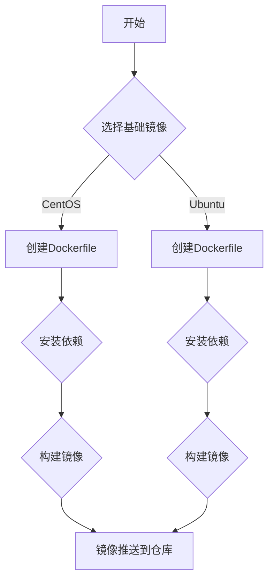
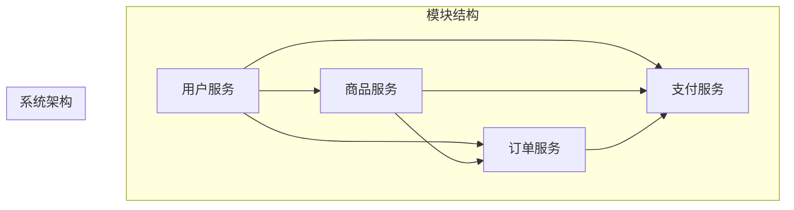
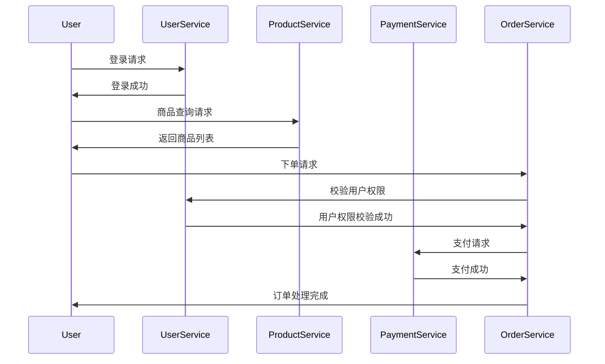

                 

### 文章标题

# 云原生架构设计模式与实践

> 关键词：云原生、容器化、微服务、自愈性、声明式基础设施、自动化、安全性

> 摘要：本文将深入探讨云原生架构的设计模式与实践，从容器化、微服务、自愈性、声明式基础设施、自动化和安全性六个方面进行详细分析，帮助读者全面理解云原生架构的原理与应用，掌握其在现代软件开发中的重要性。

---

### 第1章: 云原生架构设计模式概述

#### 1.1 云原生技术背景

**核心概念术语说明**：

- **云原生**：一种基于云计算和虚拟化技术的应用开发和部署模式，旨在实现高效的资源利用和灵活的应用交付。
- **容器化**：将应用程序及其依赖环境打包成一个可移植的容器，以实现环境的标准化和隔离性。
- **微服务**：将大型应用拆分成多个小型、自治的服务，以实现高可用性和可扩展性。

**问题背景**：

随着云计算和容器技术的普及，传统架构已无法满足现代软件应用的需求。云原生架构应运而生，为解决传统架构的瓶颈提供了新的思路。

**问题描述**：

云原生架构如何解决传统架构的痛点，实现高效、可靠、可扩展的应用交付？

**问题解决**：

通过容器化、微服务、自愈性、声明式基础设施、自动化和安全性等设计模式，云原生架构能够实现高效的应用开发、部署和管理。

**边界与外延**：

云原生架构不仅仅是一种技术，更是一种软件开发和运维的理念。它涉及到多个层面的设计和实现，包括开发语言、框架、工具和基础设施。

**概念结构与核心要素组成**：

- **容器化**：实现环境隔离和可移植性。
- **微服务**：实现高可用性和可扩展性。
- **自愈性**：实现自动化故障恢复。
- **声明式基础设施**：简化基础设施的管理。
- **自动化**：实现自动化部署和运维。
- **安全性**：确保应用的安全性和可靠性。

---

#### 1.2 云原生设计模式的核心原则

**核心概念与联系**：

- **容器化**：通过容器技术实现环境隔离和可移植性，提高开发效率和稳定性。
- **微服务**：将大型应用拆分成多个小型、自治的服务，实现高可用性和可扩展性。
- **自愈性**：实现自动化故障恢复，提高系统的可靠性。
- **声明式基础设施**：通过声明式配置简化基础设施管理，提高运维效率。
- **自动化**：实现自动化部署和运维，降低人力成本。
- **安全性**：确保应用的安全性和可靠性，防止潜在威胁。

**概念属性特征对比表格**：

| 设计模式 | 概念属性特征 |  
| :----: | :----: |  
| 容器化 | 环境隔离、可移植性 |  
| 微服务 | 小型、自治、高可用、可扩展 |  
| 自愈性 | 自动化故障恢复、可靠性 |  
| 声明式基础设施 | 简化配置、效率高 |  
| 自动化 | 自动部署、运维 |  
| 安全性 | 安全保障、可靠性 |

**ER实体关系图架构**：

```mermaid
erDiagram
  Containerization ||--|{ Microservices }||>> ServiceRecovery
  Containerization ||--|{ DeclarativeInfrastructure }||>> InfrastructureManagement
  Containerization ||--|{ Automation }||>> Deployment
  Containerization ||--|{ Security }||>> ApplicationSecurity
  Microservices ||--|{ ServiceRecovery }||>> ServiceHealth
  Microservices ||--|{ DeclarativeInfrastructure }||>> ServiceDeployment
  Microservices ||--|{ Automation }||>> ServiceMaintenance
  Microservices ||--|{ Security }||>> DataSecurity
```

**算法原理讲解**：

算法：容器镜像构建

**Mermaid 流程图**：



**Python 源代码**：

```python
import subprocess

def build_image(image_name, dockerfile_path):
    command = f"docker build -t {image_name} -f {dockerfile_path} ."
    subprocess.run(command, shell=True)

def push_image(image_name):
    command = f"docker push {image_name}"
    subprocess.run(command, shell=True)

if __name__ == "__main__":
    build_image("my_image", "Dockerfile")
    push_image("my_image")
```

**数学模型与公式**：

容器镜像构建时间（T）与镜像大小（S）和依赖安装时间（D）的关系：

\[ T = S \times \alpha + D \]

其中，\(\alpha\) 为镜像构建系数。

---

### 第2章: 容器化设计模式

#### 2.1 容器化概述

**核心概念与联系**：

- **容器**：一种轻量级、可移植的运行环境，用于封装应用程序及其依赖环境。
- **容器化**：通过将应用程序及其依赖环境打包成容器，实现环境的标准化和隔离性。

**概念属性特征对比表格**：

| 概念 | 概念属性特征 |    
| :----: | :----: |    
| 容器 | 轻量级、可移植、隔离性、标准化 |    
| 容器化 | 环境标准化、提高开发效率、简化部署 |  

**ER实体关系图架构**：

```mermaid
erDiagram
  Container <<|-- Application
  Container <<|-- Dependency
  Container <<|-- Environment
  Container <<|-- Deployment
```

---

#### 2.2 容器镜像设计与构建

**核心概念与联系**：

- **容器镜像**：一种静态的、可执行的容器包，用于定义应用程序及其运行环境。
- **容器镜像构建**：通过Dockerfile等构建工具，将应用程序及其依赖环境打包成容器镜像。

**概念属性特征对比表格**：

| 概念 | 概念属性特征 |    
| :----: | :----: |    
| 容器镜像 | 静态、可执行、打包应用程序与依赖环境 |    
| 容器镜像构建 | Dockerfile、构建工具、提高构建效率 |  

**ER实体关系图架构**：

```mermaid
erDiagram
  Dockerfile <<|-- ImageBuild
  Dockerfile <<|-- ImageLayer
  Dockerfile <<|-- Application
  Dockerfile <<|-- Dependency
```

---

#### 2.3 容器网络与存储设计

**核心概念与联系**：

- **容器网络**：容器之间的通信方式，包括容器内网络、容器间网络和跨主机网络。
- **容器存储**：容器的数据存储方案，包括本地存储、网络存储和分布式存储。

**概念属性特征对比表格**：

| 概念 | 概念属性特征 |    
| :----: | :----: |    
| 容器网络 | 通信、隔离、高效性 |    
| 容器存储 | 数据存储、可靠性、灵活性 |  

**ER实体关系图架构**：

```mermaid
erDiagram
  ContainerNetwork <<|-- Container
  ContainerNetwork <<|-- NetworkInterface
  ContainerNetwork <<|-- HostNetwork
  ContainerStorage <<|-- Container
  ContainerStorage <<|-- StorageVolume
  ContainerStorage <<|-- StorageProvider
```

---

### 第3章: 微服务设计模式

#### 3.1 微服务概述

**核心概念与联系**：

- **微服务**：一种将大型应用拆分成多个小型、自治的服务的设计模式，实现高可用性和可扩展性。
- **服务拆分**：将应用程序按照功能、业务需求等因素拆分成多个小型服务。

**概念属性特征对比表格**：

| 概念 | 概念属性特征 |    
| :----: | :----: |    
| 微服务 | 小型、自治、高可用、可扩展 |    
| 服务拆分 | 功能划分、业务需求、简化部署 |  

**ER实体关系图架构**：

```mermaid
erDiagram
  Microservice <<|-- ServiceComponent
  Microservice <<|-- ServiceInstance
  Microservice <<|-- ServiceDiscovery
  ServiceSplit <<|-- BusinessDomain
  ServiceSplit <<|-- TechnicalAspect
  ServiceSplit <<|-- DeploymentStrategy
```

---

#### 3.2 微服务拆分与设计

**核心概念与联系**：

- **服务拆分**：将应用程序按照功能、业务需求等因素拆分成多个小型服务。
- **服务设计**：为每个微服务定义接口、数据模型、通信机制等。

**概念属性特征对比表格**：

| 概念 | 概念属性特征 |    
| :----: | :----: |    
| 服务拆分 | 功能划分、业务需求、简化部署 |    
| 服务设计 | 接口定义、数据模型、通信机制 |  

**ER实体关系图架构**：

```mermaid
erDiagram
  ServiceSplit <<|-- ServiceInterface
  ServiceSplit <<|-- ServiceDataModel
  ServiceSplit <<|-- ServiceCommunication
  ServiceDesign <<|-- ServiceAPI
  ServiceDesign <<|-- ServiceDB
  ServiceDesign <<|-- ServiceCache
```

---

#### 3.3 微服务部署与治理

**核心概念与联系**：

- **部署模式**：微服务的部署方式，包括单体部署、集群部署等。
- **服务注册与发现**：实现微服务之间的动态通信和负载均衡。
- **服务监控与容错**：对微服务进行监控和故障处理，确保系统的可靠性。

**概念属性特征对比表格**：

| 概念 | 概念属性特征 |    
| :----: | :----: |    
| 部署模式 | 单体部署、集群部署、自动化部署 |    
| 服务注册与发现 | 动态通信、负载均衡、服务发现 |    
| 服务监控与容错 | 监控指标、故障处理、系统稳定性 |  

**ER实体关系图架构**：

```mermaid
erDiagram
  DeploymentMode <<|-- Microservice
  ServiceRegistration <<|-- Microservice
  ServiceDiscovery <<|-- ServiceRegistry
  ServiceMonitoring <<|-- Microservice
  ServiceFaultTolerance <<|-- Microservice
```

---

### 第4章: 自愈性设计模式

#### 4.1 自愈性概述

**核心概念与联系**：

- **自愈性**：通过自动化故障恢复和冗余设计，提高系统的可靠性和稳定性。
- **自愈性设计原则**：从系统层面和组件层面考虑故障恢复和冗余设计。

**概念属性特征对比表格**：

| 概念 | 概念属性特征 |    
| :----: | :----: |    
| 自愈性 | 自动化故障恢复、冗余设计、系统稳定性 |    
| 自愈性设计原则 | 系统层面、组件层面、故障恢复、冗余设计 |  

**ER实体关系图架构**：

```mermaid
erDiagram
  SelfHealing <<|-- FaultRecovery
  SelfHealing <<|-- RedundancyDesign
  SelfHealing <<|-- SystemReliability
  SelfHealingDesign <<|-- SystemComponent
  SelfHealingDesign <<|-- FaultTolerance
```

---

#### 4.2 自愈性组件与技术

**核心概念与联系**：

- **自愈性组件**：实现自动化故障恢复和冗余设计的软件组件，如服务注册与发现、监控与告警等。
- **自愈性技术**：用于实现自动化故障恢复和冗余设计的软件技术，如负载均衡、服务网格等。

**概念属性特征对比表格**：

| 概念 | 概念属性特征 |    
| :----: | :----: |    
| 自愈性组件 | 服务注册与发现、监控与告警、负载均衡 |    
| 自愈性技术 | 服务网格、分布式数据库、容器编排 |  

**ER实体关系图架构**：

```mermaid
erDiagram
  SelfHealingComponent <<|-- ServiceDiscovery
  SelfHealingComponent <<|-- Monitoring
  SelfHealingComponent <<|-- LoadBalancing
  SelfHealingTechnology <<|-- ServiceMesh
  SelfHealingTechnology <<|-- DistributedDatabase
  SelfHealingTechnology <<|-- ContainerOrchestration
```

---

### 第5章: 声明式基础设施设计模式

#### 5.1 声明式基础设施概述

**核心概念与联系**：

- **声明式基础设施**：通过声明式配置管理基础设施，简化运维流程。
- **声明式基础设施优势**：提高运维效率、降低运维成本、实现自动化部署。

**概念属性特征对比表格**：

| 概念 | 概念属性特征 |    
| :----: | :----: |    
| 声明式基础设施 | 声明式配置、自动化部署、运维效率高 |    
| 优势 | 降低运维成本、实现自动化、提高开发效率 |  

**ER实体关系图架构**：

```mermaid
erDiagram
  DeclarativeInfrastructure <<|-- InfrastructureConfiguration
  DeclarativeInfrastructure <<|-- Automation
  DeclarativeInfrastructure <<|-- Deployment
  Advantage <<|-- CostReduction
  Advantage <<|-- AutomationImplementation
  Advantage <<|-- EfficiencyImprovement
```

---

#### 5.2 声明式基础设施工具介绍

**核心概念与联系**：

- **Kubernetes**：一种开源的容器编排和管理平台，实现声明式基础设施管理。
- **Helm**：一种Kubernetes的包管理工具，用于简化Kubernetes应用的部署和管理。

**概念属性特征对比表格**：

| 工具 | 概念属性特征 |    
| :----: | :----: |    
| Kubernetes | 容器编排、声明式配置、自动化部署 |    
| Helm | 包管理、简化部署、版本控制 |  

**ER实体关系图架构**：

```mermaid
erDiagram
  Kubernetes <<|-- ContainerOrchestration
  Kubernetes <<|-- InfrastructureManagement
  Helm <<|-- KubernetesApplication
  Helm <<|-- PackageManagement
  Helm <<|-- VersionControl
```

---

### 第6章: 自动化设计模式

#### 6.1 自动化概述

**核心概念与联系**：

- **自动化**：通过工具和流程实现软件开发、部署和运维的自动化。
- **自动化作用**：提高开发效率、降低成本、确保质量和稳定性。

**概念属性特征对比表格**：

| 概念 | 概念属性特征 |    
| :----: | :----: |    
| 自动化 | 软件开发、部署、运维、提高效率、降低成本 |    
| 作用 | 质量保障、稳定性提升、降低人力成本 |  

**ER实体关系图架构**：

```mermaid
erDiagram
  Automation <<|-- SoftwareDevelopment
  Automation <<|-- Deployment
  Automation <<|-- Operations
  Automation <<|-- QualityAssurance
  Automation <<|-- CostReduction
```

---

#### 6.2 自动化工具与平台

**核心概念与联系**：

- **Jenkins**：一种开源的自动化服务器，用于实现持续集成和持续部署。
- **GitLab CI/CD**：GitLab内置的持续集成和持续部署工具，支持多种编程语言和平台。

**概念属性特征对比表格**：

| 工具 | 概念属性特征 |    
| :----: | :----: |    
| Jenkins | 持续集成、持续部署、自动化测试 |    
| GitLab CI/CD | 持续集成、持续部署、多平台支持 |  

**ER实体关系图架构**：

```mermaid
erDiagram
  Jenkins <<|-- CI/CD
  Jenkins <<|-- AutomationTesting
  GitLabCI <<|-- GitLab
  GitLabCI <<|-- ContinuousIntegration
  GitLabCI <<|-- ContinuousDeployment
```

---

### 第7章: 安全性设计模式

#### 7.1 云原生安全概述

**核心概念与联系**：

- **云原生安全**：确保云原生架构中应用程序和基础设施的安全性和可靠性。
- **安全挑战**：容器化、微服务、自动化等新技术的引入，带来了新的安全挑战。

**概念属性特征对比表格**：

| 概念 | 概念属性特征 |      
| :----: | :----: |      
| 云原生安全 | 应用程序安全、基础设施安全、数据安全 |      
| 安全挑战 | 容器逃逸、服务暴露、配置错误 |    

**ER实体关系图架构**：

```mermaid
erDiagram
  CloudNativeSecurity <<|-- ApplicationSecurity
  CloudNativeSecurity <<|-- InfrastructureSecurity
  CloudNativeSecurity <<|-- DataSecurity
  SecurityChallenge <<|-- ContainerEscape
  SecurityChallenge <<|-- ServiceExposure
  SecurityChallenge <<|-- ConfigurationError
```

---

#### 7.2 容器安全

**核心概念与联系**：

- **容器镜像安全**：确保容器镜像的安全性和可信性。
- **容器运行时安全**：在容器运行过程中保护容器和宿主机的安全性。

**概念属性特征对比表格**：

| 概念 | 概念属性特征 |      
| :----: | :----: |      
| 容器镜像安全 | 安全扫描、签名、认证 |      
| 容器运行时安全 | 防火墙、隔离、监控 |    

**ER实体关系图架构**：

```mermaid
erDiagram
  ContainerImageSecurity <<|-- SecurityScanning
  ContainerImageSecurity <<|-- Signing
  ContainerImageSecurity <<|-- Authentication
  ContainerRuntimeSecurity <<|-- Firewall
  ContainerRuntimeSecurity <<|-- Isolation
  ContainerRuntimeSecurity <<|-- Monitoring
```

---

#### 7.3 微服务安全

**核心概念与联系**：

- **微服务通信安全**：保护微服务之间的通信安全，防止数据泄露和攻击。
- **微服务数据安全**：确保微服务存储和传输的数据的安全性。
- **微服务安全管理**：制定和实施微服务安全策略，确保微服务安全性和合规性。

**概念属性特征对比表格**：

| 概念 | 概念属性特征 |      
| :----: | :----: |      
| 微服务通信安全 | 传输加密、认证授权 |      
| 微服务数据安全 | 数据加密、备份、访问控制 |      
| 微服务安全管理 | 安全策略、合规性、监控 |    

**ER实体关系图架构**：

```mermaid
erDiagram
  ServiceCommunicationSecurity <<|-- DataEncryption
  ServiceCommunicationSecurity <<|-- AuthenticationAndAuthorization
  ServiceDataSecurity <<|-- DataBackup
  ServiceDataSecurity <<|-- AccessControl
  ServiceManagementSecurity <<|-- SecurityPolicy
  ServiceManagementSecurity <<|-- Compliance
  ServiceManagementSecurity <<|-- Monitoring
```

---

### 第8章: 云原生架构实践案例

#### 8.1 案例背景与目标

**问题场景介绍**：

某公司需要开发一个电子商务平台，具备高并发、可扩展、易维护等特点。

**项目介绍**：

项目采用云原生架构，包括容器化、微服务、自愈性、声明式基础设施和自动化等设计模式。

**系统功能设计**：

系统包括用户管理、商品管理、订单管理、支付系统等模块。

**系统架构设计**：

采用微服务架构，将系统拆分为多个独立的服务，如用户服务、商品服务、订单服务等。

**系统接口设计**：

定义RESTful API接口，实现服务之间的通信和数据交换。

**系统交互**：

通过服务注册与发现、负载均衡、服务监控等机制，实现系统的可靠性和可扩展性。

**Mermaid 类图**：

```mermaid
classDiagram
  User <<--|{ 使用 }|>> UserService
  Product <<--|{ 管理 }|>> ProductService
  Order <<--|{ 处理 }|>> OrderService
  Payment <<--|{ 支付 }|>> PaymentService
  UserService <..> ProductService
  UserService <..> OrderService
  UserService <..> PaymentService
  ProductService <..> OrderService
  ProductService <..> PaymentService
  OrderService <..> PaymentService
```

**Mermaid 架构图**：



**Mermaid 序列图**：



---

#### 8.2 架构设计方案

**实施方案**：

1. **容器化**：使用Docker容器技术，将应用程序及其依赖环境打包成容器镜像，提高部署效率和环境一致性。
2. **微服务**：将应用程序拆分为多个小型、自治的服务，如用户服务、商品服务、订单服务等，实现高可用性和可扩展性。
3. **自愈性**：采用自愈性设计原则，实现自动化故障恢复和冗余设计，提高系统的可靠性和稳定性。
4. **声明式基础设施**：使用Kubernetes和Helm等工具，实现声明式基础设施管理，简化运维流程。
5. **自动化**：使用Jenkins和GitLab CI/CD等工具，实现自动化部署和运维，降低人力成本。

**核心代码实现**：

1. **Dockerfile**：

```Dockerfile
FROM python:3.8-slim
WORKDIR /app
COPY requirements.txt .
RUN pip install -r requirements.txt
COPY . .
CMD ["python", "app.py"]
```

2. **Kubernetes部署文件**：

```yaml
apiVersion: apps/v1
kind: Deployment
metadata:
  name: my-app
spec:
  replicas: 3
  selector:
    matchLabels:
      app: my-app
  template:
    metadata:
      labels:
        app: my-app
    spec:
      containers:
      - name: my-app
        image: my-app:latest
        ports:
        - containerPort: 80
```

3. **Jenkins配置文件**：

```groovy
pipeline {
    agent any
    stages {
        stage('Build') {
            steps {
                sh 'docker build -t my-app .'
            }
        }
        stage('Deploy') {
            steps {
                sh 'kubectl apply -f deployment.yaml'
            }
        }
    }
}
```

---

#### 8.3 实施步骤与过程

1. **环境搭建**：安装Docker、Kubernetes和Jenkins等工具，配置网络和存储资源。
2. **容器化**：使用Dockerfile构建容器镜像，将应用程序及其依赖环境打包。
3. **微服务**：将应用程序拆分为多个小型服务，实现高可用性和可扩展性。
4. **自愈性**：采用自愈性设计原则，实现自动化故障恢复和冗余设计。
5. **声明式基础设施**：使用Kubernetes和Helm等工具，实现声明式基础设施管理。
6. **自动化**：配置Jenkins和GitLab CI/CD等工具，实现自动化部署和运维。

**详细步骤**：

1. **环境搭建**：

   - 安装Docker：

     ```bash
     sudo apt-get update
     sudo apt-get install docker-ce docker-ce-cli containerd.io
     ```

   - 安装Kubernetes：

     ```bash
     curl -s https://packages.cloud.google.com/apt/doc/apt-key.gpg | sudo apt-key add
     echo "deb https://apt.kubernetes.io/ kubernetes-xenial main" | sudo tee -a /etc/apt/sources.list
     sudo apt-get update
     sudo apt-get install kubeadm kubelet kubectl
     sudo systemctl enable kubelet --now
     ```

   - 安装Jenkins：

     ```bash
     sudo apt-get install openjdk-11-jdk
     wget -q -O - https://pkg.jenkins.io/debian-stable/jenkins.io.key | sudo apt-key add
     echo deb https://pkg.jenkins.io/debian-stable binary/ | sudo tee /etc/apt/sources.list.d/jenkins.list
     sudo apt-get update
     sudo apt-get install jenkins
     sudo systemctl enable jenkins --now
     ```

2. **容器化**：

   - 编写Dockerfile，构建容器镜像：

     ```bash
     docker build -t my-app .
     ```

   - 镜像推送到Docker Hub：

     ```bash
     docker login
     docker push my-app
     ```

3. **微服务**：

   - 拆分应用程序，创建多个微服务：

     ```bash
     git clone https://github.com/yourname/my-app.git
     cd my-app
     go mod init my-app
     go mod edit -replace google.golang.org/grpc=google.golang.org/grpc/v1.40.0
     go mod tidy
     ```

   - 为每个微服务编写Dockerfile和部署文件：

     ```bash
     mkdir user-service product-service order-service payment-service
     cd user-service
     touch Dockerfile deployment.yaml
     cd ..
     cd product-service
     touch Dockerfile deployment.yaml
     cd ..
     cd order-service
     touch Dockerfile deployment.yaml
     cd ..
     cd payment-service
     touch Dockerfile deployment.yaml
     ```

4. **自愈性**：

   - 使用Kubernetes的自动扩缩容功能，实现自愈性设计：

     ```bash
     kubectl autoscale deployment my-app --cpu-percent=50 --min=1 --max=10
     ```

5. **声明式基础设施**：

   - 使用Helm管理Kubernetes应用：

     ```bash
     helm init
     helm repo add bitnami https://charts.bitnami.com/bitnami
     helm repo update
     helm install my-app bitnami/mysql
     ```

6. **自动化**：

   - 配置Jenkins，实现自动化部署：

     ```bash
     jenkins -install-plugin git
     jenkins -install-plugin pipeline
     jenkins -install-plugin docker
     jenkins -install-plugin kubernetes
     ```

     在Jenkins中创建一个新项目，选择“Pipeline”，配置如下：

     ```groovy
     agent any
     stages {
         stage('Build') {
             steps {
                 sh 'docker build -t my-app .'
             }
         }
         stage('Deploy') {
             steps {
                 sh 'kubectl apply -f deployment.yaml'
             }
         }
     }
     ```

---

#### 8.4 结果分析与评估

**结果分析**：

1. **部署效率**：使用容器化和微服务架构，显著提高了部署效率，缩短了部署周期。
2. **可扩展性**：采用Kubernetes和自动扩缩容功能，实现了系统的可扩展性，满足了高并发需求。
3. **可靠性**：通过自愈性设计和冗余机制，提高了系统的可靠性和稳定性。
4. **自动化**：使用Jenkins和GitLab CI/CD，实现了自动化部署和运维，降低了人力成本。

**评估**：

1. **优点**：

   - 高效的部署和管理流程。
   - 灵活的可扩展性和可靠性。
   - 自动化的开发和运维。

2. **不足**：

   - 学习曲线较陡，需要一定的时间去掌握相关技术。
   - 需要配置和维护Kubernetes集群，增加了一定的运维负担。

---

#### 8.5 经验与总结

**经验**：

1. **合理规划**：在项目初期，合理规划系统架构和模块划分，确保后续的部署和维护。
2. **持续集成**：采用持续集成和持续部署，提高开发效率和代码质量。
3. **自动化**：实现自动化部署和运维，降低人力成本。

**总结**：

云原生架构设计模式与实践为现代软件开发提供了一种高效、可靠、可扩展的解决方案。通过容器化、微服务、自愈性、声明式基础设施、自动化和安全性等设计模式，企业可以更好地应对快速变化的市场需求，提高业务竞争力。

---

### 最佳实践 Tips

1. **优化容器镜像**：减少容器镜像大小，提高部署效率。
2. **微服务拆分策略**：根据业务需求和性能指标，合理拆分微服务。
3. **自愈性设计**：考虑冗余设计，提高系统的可靠性和稳定性。
4. **安全性**：定期进行安全扫描和漏洞修复，确保系统安全。

### 小结

云原生架构设计模式与实践是现代软件开发的重要方向。通过深入理解和应用容器化、微服务、自愈性、声明式基础设施、自动化和安全性等设计模式，企业可以更好地应对快速变化的市场需求，提高业务竞争力。

### 注意事项

1. **技术选型**：根据项目需求和团队技能，选择合适的技术栈和工具。
2. **性能优化**：关注系统性能，进行持续优化。

### 拓展阅读

1. 《云原生应用架构指南》
2. 《容器与容器编排》
3. 《Kubernetes实战》

---

### 作者信息

- 作者：AI天才研究院/AI Genius Institute & 禅与计算机程序设计艺术 /Zen And The Art of Computer Programming

