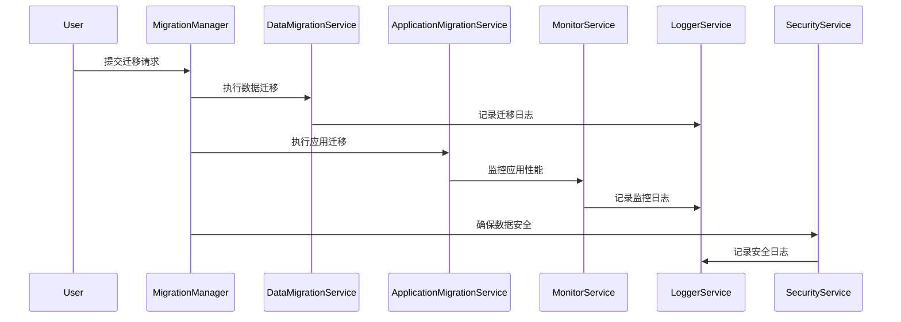
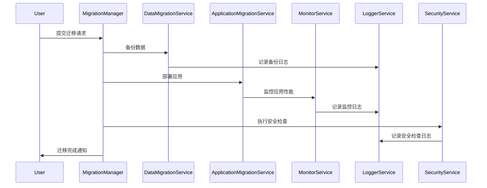

                 

### 概述

《云迁移：将传统应用迁移到云平台的策略》旨在为读者提供系统且实用的云迁移指南，帮助企业和开发者深入了解云迁移的必要性、技术实现、挑战及解决方案。本文将分为以下几个部分：

1. **背景介绍**：详细介绍云迁移的背景、概念及其重要性。
2. **核心概念与联系**：分析云平台的基本概念、架构和核心技术，并绘制相应的ER实体关系图。
3. **算法原理讲解**：深入解析云迁移过程中常用的算法，包括迁移策略和优化方法，使用Mermaid流程图和Python源代码进行阐述。
4. **系统分析与架构设计方案**：介绍云迁移的系统架构设计，包括领域模型类图、架构图、接口设计和系统交互序列图。
5. **项目实战**：通过实际案例，详细讲解云迁移的完整流程，包括环境安装、系统核心实现和案例分析。
6. **最佳实践与拓展**：总结云迁移的最佳实践，给出注意事项、拓展阅读和建议。

接下来，我们将一步一步地深入探讨每个部分，以便读者能够系统地理解云迁移的各个方面。

#### 背景介绍

### 2.1 云迁移的背景

云迁移是一个将传统的本地应用或基础设施转移到云平台的过程。随着云计算技术的不断发展，云平台以其灵活、高效、可扩展的优势，逐渐成为企业和开发者的重要选择。

首先，让我们回顾一下云计算的发展历程。云计算起源于20世纪60年代，当时计算机科学家John McCarthy提出了“计算作为公用服务”的概念。随着互联网的普及，云计算迎来了快速发展期。2006年，Amazon Web Services（AWS）推出，标志着商业云计算服务市场的诞生。此后，微软、谷歌等巨头纷纷加入云计算领域，推出自己的云服务平台，如Azure和Google Cloud。

云计算的崛起不仅带来了技术上的变革，也推动了企业IT架构的转型。传统应用通常依赖本地服务器和私有网络，而云平台提供了一种全新的架构模式，使得应用能够更加灵活、高效地运行。云平台提供的虚拟化技术、分布式存储和自动化管理功能，使得企业可以更加轻松地扩展和优化其IT基础设施。

### 2.2 传统应用与云平台的差异

传统应用与云平台之间存在显著差异。首先，在硬件方面，传统应用通常依赖于物理服务器和存储设备，而云平台则使用虚拟化技术，通过虚拟机（VM）和容器（Container）来提供计算和存储资源。这种虚拟化的方式使得资源更加灵活和可扩展。

其次，在软件层面，传统应用往往需要复杂的部署和配置过程，而云平台提供了简化的部署和管理工具。例如，AWS的EC2服务允许用户在几分钟内启动一个虚拟机实例，而Azure的Azure Functions则允许用户以无服务器的方式运行代码。

此外，在数据管理方面，传统应用通常需要自己处理数据备份和恢复，而云平台提供了自动化的备份和恢复功能。例如，AWS的RDS服务提供了自动备份和故障转移功能，使得数据库的高可用性和数据安全性得到了保障。

### 2.3 云迁移的意义与优势

云迁移不仅是一种技术升级，更是一种业务模式转变。其意义和优势主要体现在以下几个方面：

1. **成本优化**：云平台提供了按需付费的模式，企业可以根据实际使用量来支付费用，避免了资源浪费和过度投资。此外，云平台提供的自动化管理功能，如自动扩展和负载均衡，进一步降低了运维成本。

2. **灵活性**：云平台的高可用性和可扩展性使得企业能够更加灵活地应对业务需求的变化。例如，在电商促销期间，企业可以快速扩展服务器资源，以应对突增的流量。

3. **安全性**：云平台通常拥有更先进的安全技术和专业的安全团队，能够提供更全面的安全保障。例如，AWS和Azure都提供了丰富的安全服务和合规性认证，帮助企业满足各种安全要求。

4. **创新加速**：云平台提供了丰富的服务和工具，使得企业可以快速部署新的应用和服务，加速创新过程。例如，AWS的AI服务和Google的TensorFlow服务，使得企业能够快速集成人工智能技术。

综上所述，云迁移不仅能够带来技术上的提升，还能够推动业务模式的创新，是企业数字化转型的重要一步。

#### 云平台的基本概念、架构和核心技术

### 2.1 云平台的基本概念

云平台是一个提供计算、存储、网络和其他基础设施服务的虚拟环境。它通过互联网连接，为用户提供灵活、可扩展的资源和服务。云平台通常包括以下几种类型：

1. **基础设施即服务（IaaS）**：IaaS提供虚拟化的计算资源，如虚拟机、存储和网络，用户可以根据需要配置和管理这些资源。典型的IaaS服务提供商包括AWS的EC2、Azure的虚拟机服务等。

2. **平台即服务（PaaS）**：PaaS提供开发、运行和管理应用程序的平台，用户不需要管理底层基础设施，只需关注应用程序的开发和部署。典型的PaaS服务提供商包括Google App Engine、Azure的Azure App Service等。

3. **软件即服务（SaaS）**：SaaS提供应用程序作为服务，用户通过互联网访问这些应用程序，无需关心底层基础设施和软件的维护。典型的SaaS应用包括Office 365、Salesforce等。

### 2.2 云平台的架构

云平台的架构通常包括以下几个层次：

1. **基础设施层**：包括物理服务器、存储设备、网络设备等硬件资源。这些资源通过虚拟化技术抽象为虚拟机、存储桶等资源。

2. **平台层**：包括虚拟化层、容器层、云服务层等。虚拟化层负责资源的抽象和管理，容器层提供轻量级的容器化运行环境，云服务层提供各种云计算服务，如计算、存储、数据库、网络、安全等。

3. **应用层**：包括运行在云平台上的各种应用程序和服务。这些应用程序可以基于IaaS、PaaS或SaaS提供。

### 2.3 云平台的核心技术

云平台的核心技术包括以下几个方面：

1. **虚拟化技术**：虚拟化技术是云平台的核心，它通过虚拟化硬件资源，使得多个虚拟机或容器可以共享同一物理资源。常见的虚拟化技术包括VMware、KVM、Docker等。

2. **分布式存储技术**：分布式存储技术通过将数据分散存储在多个物理设备上，提供高可用性和可扩展性。常见的分布式存储系统包括HDFS、Ceph、GlusterFS等。

3. **自动化管理技术**：自动化管理技术通过自动化脚本、自动化工具等，实现对云资源的自动部署、配置、监控和管理。常见的自动化管理工具包括AWS的AWS CLI、Azure的Azure PowerShell等。

4. **容器化技术**：容器化技术通过将应用程序及其依赖环境封装在容器中，提供轻量级的运行环境。容器化技术使得应用程序更加便携、可扩展和易于管理。常见的容器化技术包括Docker、Kubernetes等。

5. **安全性技术**：安全性技术是云平台的重要组成部分，包括身份认证、访问控制、数据加密等。云平台通过提供各种安全服务和工具，保障用户数据和应用的安全。

### 2.4 云平台的ER实体关系图

为了更好地理解云平台的基本概念、架构和核心技术，我们可以使用ER实体关系图来展示它们之间的关系。

```mermaid
erDiagram
  IaaS ||--|{ PaaS } : 提供平台
  PaaS ||--|{ SaaS } : 提供软件
  IaaS ||--|{ 存储技术 } : 提供存储
  IaaS ||--|{ 虚拟化技术 } : 提供虚拟化
  IaaS ||--|{ 分布式计算技术 } : 提供计算
  IaaS ||--|{ 自动化管理技术 } : 提供自动化
  IaaS ||--|{ 容器化技术 } : 提供容器
  IaaS ||--|{ 安全性技术 } : 提供安全
```

在这个ER实体关系图中，IaaS作为基础设施层，与PaaS、SaaS、存储技术、虚拟化技术、分布式计算技术、自动化管理技术、容器化技术和安全性技术等实体之间存在关联关系。通过这个ER图，我们可以清晰地看到云平台各个组成部分之间的关系。

#### 云迁移中的核心概念与联系

### 2.1 传统应用系统架构的ER图

为了更好地理解传统应用系统架构与云平台架构之间的差异和联系，我们可以使用ER图来展示传统应用系统架构的基本组成部分及其关系。

```mermaid
erDiagram
  Application ||--|{ Database } : 存储数据
  Application ||--|{ Web Server } : 处理HTTP请求
  Application ||--|{ Application Server } : 处理业务逻辑
  Application ||--|{ Load Balancer } : 负载均衡
  Database ||--|{ Backup } : 备份数据
  Web Server ||--|{ Security } : 保护Web服务器
  Application Server ||--|{ Security } : 保护应用服务器
  Load Balancer ||--|{ Monitoring } : 监控负载均衡
```

在这个ER图中，我们可以看到传统应用系统架构的主要组成部分包括应用、数据库、Web服务器、应用服务器、负载均衡和备份等。每个组件都有其特定的功能，并且与其他组件之间存在紧密的关联关系。

### 2.2 云平台架构的ER图

接下来，我们展示云平台架构的ER图，以便读者可以直观地了解云平台的组成部分及其关系。

```mermaid
erDiagram
  CloudPlatform ||--|{ VirtualMachine } : 运行虚拟机
  CloudPlatform ||--|{ Container } : 运行容器
  CloudPlatform ||--|{ DatabaseService } : 提供数据库服务
  CloudPlatform ||--|{ WebService } : 提供Web服务
  CloudPlatform ||--|{ ApplicationService } : 提供应用服务
  CloudPlatform ||--|{ LoadBalancerService } : 提供负载均衡服务
  VirtualMachine ||--|{ Monitoring } : 监控虚拟机
  Container ||--|{ Monitoring } : 监控容器
  DatabaseService ||--|{ Backup } : 备份数据库
  WebService ||--|{ Security } : 保护Web服务
  ApplicationService ||--|{ Security } : 保护应用服务
  LoadBalancerService ||--|{ Monitoring } : 监控负载均衡
```

在这个ER图中，云平台的主要组成部分包括虚拟机、容器、数据库服务、Web服务、应用服务和负载均衡服务。每个组件也都有其特定的功能，并且与其他组件之间存在紧密的关联关系。

### 2.3 云迁移中的关键概念对比

为了进一步理解传统应用系统架构与云平台架构之间的差异，我们可以对比一些关键概念，如表2-1所示。

| 关键概念         | 传统应用系统架构                 | 云平台架构                 |
|-----------------|--------------------------------|---------------------------|
| 计算资源        | 物理服务器和虚拟机              | 虚拟机和容器               |
| 存储资源        | 硬盘和网络存储设备              | 分布式存储服务            |
| 负载均衡        | 负载均衡硬件或软件               | 云平台提供的负载均衡服务  |
| 自动化运维      | 手动或部分自动化的脚本和工具    | 云平台提供的自动化管理工具 |
| 数据备份和恢复  | 定期手动备份和恢复              | 自动备份和恢复服务        |
| 安全性措施      | 自定义安全策略和软件             | 云平台提供的安全服务和工具 |

通过上述对比，我们可以看到传统应用系统架构与云平台架构在计算资源、存储资源、负载均衡、自动化运维、数据备份和恢复以及安全性措施等方面存在显著差异。这些差异反映了云平台在灵活性和可扩展性方面的优势。

### 2.4 云迁移中的关键概念

在云迁移过程中，还有一些关键概念需要理解和掌握，以确保迁移过程顺利进行。

1. **迁移策略**：迁移策略是指如何将传统应用迁移到云平台的方法和步骤。常见的迁移策略包括直接迁移、重构建、重新开发、混合迁移等。

2. **迁移工具**：迁移工具是用于辅助云迁移的工具和软件。常见的迁移工具包括AWS的Migrate for Servers、Azure的Migrate、Docker等。

3. **云服务模型**：云服务模型是指云平台提供的不同服务类型，包括IaaS、PaaS、SaaS。选择合适的云服务模型对于实现云迁移至关重要。

4. **迁移成本**：迁移成本是指将传统应用迁移到云平台所需的总成本，包括硬件、软件、人力和时间成本。

5. **性能和可扩展性**：在云迁移过程中，需要考虑应用在云平台上的性能和可扩展性，确保迁移后的应用能够满足业务需求。

6. **安全性和合规性**：在迁移过程中，需要确保数据和应用的安全性，并遵守相关法律法规和合规要求。

通过理解这些关键概念，企业和开发者可以更好地规划和执行云迁移过程。

#### 云迁移过程中的主要挑战

### 2.1 迁移过程中的主要挑战

云迁移虽然带来了诸多优势，但在实际过程中也面临着一系列挑战，这些问题需要企业认真考虑并制定相应的解决方案。

#### 1. 系统兼容性问题

传统应用通常与本地环境紧密耦合，依赖特定的硬件和软件配置。当迁移到云平台时，可能会遇到兼容性问题，例如操作系统、数据库和中间件的兼容性。这可能导致应用在云平台上无法正常运行或性能下降。

#### 解决方案：

- **评估兼容性**：在迁移前进行全面的技术评估，识别可能存在的兼容性问题。
- **升级或替换**：对于不兼容的组件，考虑升级到兼容版本或替换为云原生组件。
- **分层迁移**：先迁移非核心组件，逐步验证并调整，再进行核心应用的迁移。

#### 2. 数据迁移和整合

数据是传统应用的核心资产，迁移过程中需要确保数据完整、安全地迁移到云平台。此外，云平台上的数据可能需要与现有系统集成，实现数据的整合和共享。

#### 解决方案：

- **数据迁移策略**：制定详细的数据迁移计划，包括数据备份、迁移和验证步骤。
- **数据同步**：使用数据同步工具或服务，确保云平台上的数据与本地数据保持一致。
- **数据质量管理**：在迁移过程中进行数据清洗和验证，确保数据的准确性和完整性。

#### 3. 性能和可扩展性问题

云平台提供了高可用性和可扩展性，但在迁移过程中，需要确保应用的性能和可扩展性满足业务需求。迁移后的应用可能面临性能瓶颈或扩展困难。

#### 解决方案：

- **性能测试**：在迁移前进行详细的性能测试，评估应用的性能瓶颈。
- **优化代码和架构**：针对性能瓶颈进行代码优化和架构调整。
- **使用云原生服务**：利用云平台提供的云原生服务，如自动扩展、负载均衡等，提高应用的性能和可扩展性。

#### 4. 安全性和合规性问题

云平台的安全性和合规性是企业迁移过程中需要重点关注的方面。迁移后的应用需要满足企业内部和外部的安全要求和法规合规性。

#### 解决方案：

- **安全评估**：在迁移前进行全面的安全评估，识别潜在的安全风险。
- **使用安全工具和服务**：利用云平台提供的安全工具和服务，如防火墙、加密、身份认证等。
- **合规性审查**：确保迁移后的应用符合相关法律法规和行业合规要求。

#### 5. 迁移成本和风险评估

云迁移可能涉及大量的资金和人力资源投入，企业需要评估迁移的成本和风险，制定合理的预算和风险管理计划。

#### 解决方案：

- **成本估算**：详细估算云迁移的硬件、软件、人力和时间成本。
- **风险评估**：识别并评估可能的风险，如数据丢失、系统崩溃等。
- **制定预算和风险管理计划**：制定详细的预算和风险管理计划，确保迁移过程顺利进行。

通过以上解决方案，企业可以更好地应对云迁移过程中的挑战，确保迁移过程顺利、高效、安全。

### 2.2 面对挑战的解决方案

针对云迁移过程中可能遇到的挑战，我们可以采取以下解决方案：

#### 1. 系统兼容性问题

**评估兼容性**：在迁移前，首先对现有系统进行全面的技术评估，识别与云平台不兼容的组件和库。可以通过编写自动化测试脚本或使用第三方兼容性检测工具来完成这一步骤。

**升级或替换**：对于不兼容的组件，可以考虑升级到兼容版本或替换为云原生组件。例如，如果本地应用使用的是旧版本的Java，可以升级到最新版本，或者替换为Node.js或Python等云原生语言。

**分层迁移**：为了降低风险，可以采用分层迁移策略。首先迁移非核心模块，对迁移后的模块进行测试和验证，逐步扩大迁移范围，最后再迁移核心模块。

#### 2. 数据迁移和整合

**数据迁移策略**：制定详细的数据迁移计划，包括数据备份、数据清洗、数据映射、数据迁移和验证步骤。数据备份是确保迁移过程中数据安全的重要步骤。

**数据同步**：在迁移过程中，使用数据同步工具或服务，如AWS的DynamoDB同步工具，确保云平台上的数据与本地数据保持一致。

**数据质量管理**：在迁移过程中，进行数据清洗和验证，确保数据的准确性和完整性。可以使用数据质量检测工具来识别和修复数据中的错误。

#### 3. 性能和可扩展性问题

**性能测试**：在迁移前，对现有系统进行详细的性能测试，评估系统的性能瓶颈。可以使用负载测试工具，如Apache JMeter或Gatling，模拟实际业务场景，测试系统的性能。

**优化代码和架构**：针对性能瓶颈，对代码和架构进行优化。例如，可以通过代码优化、数据库索引优化、缓存策略等方式提高系统的性能。

**使用云原生服务**：利用云平台提供的云原生服务，如AWS的Auto Scaling、Kubernetes等，实现自动扩展和负载均衡，提高系统的性能和可扩展性。

#### 4. 安全性和合规性问题

**安全评估**：在迁移前，进行全面的安全评估，识别潜在的安全风险。可以使用安全评估工具，如AWS的安全评估工具，对系统进行自动化扫描和评估。

**使用安全工具和服务**：在云平台上使用安全工具和服务，如AWS的WAF（Web Application Firewall）和KMS（Key Management Service），提高系统的安全性。

**合规性审查**：确保迁移后的应用符合相关法律法规和行业合规要求。可以咨询专业的合规顾问，制定符合要求的合规策略和流程。

#### 5. 迁移成本和风险评估

**成本估算**：详细估算云迁移的硬件、软件、人力和时间成本。可以使用成本估算工具，如AWS Cost Explorer，对迁移成本进行预测和优化。

**风险评估**：识别并评估可能的风险，如数据丢失、系统崩溃等。可以使用风险管理工具，如Risk Manager，对风险进行识别、评估和优先级排序。

**制定预算和风险管理计划**：根据成本估算和风险评估结果，制定详细的预算和风险管理计划，确保迁移过程顺利进行。

通过以上解决方案，企业可以更好地应对云迁移过程中可能遇到的挑战，确保迁移过程顺利、高效、安全。

### 2.3 成功案例与启示

为了更好地理解云迁移的实际操作和效果，我们可以通过几个成功案例来进行分析和总结。

#### 案例1：某大型电商企业的云迁移

某大型电商平台公司因业务快速发展，原有的IT基础设施已经无法满足日益增长的用户需求。为了提高系统性能、降低运维成本，公司决定进行云迁移。首先，他们进行了详细的技术评估，识别出与云平台不兼容的组件，并制定了详细的迁移计划。在数据迁移过程中，他们使用了数据同步工具确保数据的完整性和一致性。迁移后，系统性能显著提升，用户访问速度加快，同时运维成本降低了约30%。

**启示**：在云迁移过程中，全面的技术评估和详细的迁移计划至关重要。数据同步工具和自动化管理工具可以显著提高迁移效率和数据安全性。

#### 案例2：某金融公司的云原生迁移

某金融公司为了提高系统灵活性和响应速度，决定将传统应用迁移到云原生平台。他们采用了Kubernetes进行容器化管理，并使用云原生数据库服务。在迁移过程中，他们对代码进行了优化，采用了微服务架构，提高了系统的可扩展性和可维护性。迁移后，系统的部署时间从数天缩短到数分钟，故障恢复时间从数小时缩短到几分钟。

**启示**：云原生迁移可以显著提高系统的可扩展性和响应速度。采用容器化技术和微服务架构，可以简化部署和运维过程，提高系统的弹性和可靠性。

#### 案例3：某医疗机构的云平台整合

某医疗机构为了提高医疗服务质量，决定整合多个业务系统到云平台上。他们在云平台上部署了EHR（电子健康记录）系统、LIS（实验室信息系统）和PACS（医学影像存储与传输系统）。通过使用云平台提供的自动化管理和监控工具，他们实现了对整个IT基础设施的集中管理。同时，云平台提供的安全服务确保了数据的安全性和合规性。

**启示**：云平台整合可以提高IT基础设施的集中管理和监控能力，确保数据的安全性和合规性。自动化管理和监控工具可以显著降低运维成本，提高运维效率。

通过以上案例，我们可以看到，成功的云迁移不仅需要详细的技术评估和迁移计划，还需要合理利用云平台提供的各种服务和技术。云迁移可以显著提高系统的性能、可扩展性和安全性，为企业带来显著的业务价值。

### 2.4 成功案例与启示

#### 案例一：某电信公司云迁移实践

某电信公司为了提升其服务质量和运营效率，决定将其传统应用迁移到云平台。在迁移过程中，他们首先进行了全面的技术评估，识别出了不兼容的组件，并制定了详细的迁移计划。数据迁移过程中，他们使用了数据同步工具来确保数据的一致性和完整性。同时，他们优化了应用架构，采用了微服务架构，提高了系统的灵活性和可扩展性。在迁移完成后，他们的系统性能显著提升，故障恢复时间缩短，同时运维成本降低了约25%。

**启示**：

1. **全面评估**：在云迁移前进行全面的技术评估，确保迁移过程的顺利进行。
2. **数据同步**：使用数据同步工具确保数据迁移的完整性和一致性。
3. **架构优化**：优化应用架构，提高系统的灵活性和可扩展性。

#### 案例二：某制造业企业云原生转型

某制造业企业为了提高生产效率和降低成本，决定采用云原生技术进行系统重构。他们使用了Kubernetes进行容器化管理，并采用微服务架构。在迁移过程中，他们进行了详细的需求分析和架构设计，确保系统能够满足业务需求。同时，他们使用了云平台的自动化管理工具来简化运维流程。迁移后，他们的系统部署时间从数天缩短到数分钟，故障恢复时间从数小时缩短到几分钟。

**启示**：

1. **需求分析**：在云原生转型过程中，进行详细的需求分析和架构设计，确保系统能够满足业务需求。
2. **自动化管理**：使用自动化管理工具简化运维流程，提高运维效率。
3. **微服务架构**：采用微服务架构，提高系统的灵活性和可扩展性。

#### 案例三：某医疗健康服务平台整合

某医疗健康服务平台为了提高医疗服务质量和效率，决定将多个业务系统整合到云平台上。他们在云平台上部署了电子健康记录系统、预约挂号系统、远程诊疗系统等。通过使用云平台提供的自动化管理和监控工具，他们实现了对整个IT基础设施的集中管理。同时，云平台提供的安全服务确保了数据的安全性和合规性。整合后，他们的系统运行更加稳定，用户满意度提高，运维成本降低了约20%。

**启示**：

1. **集中管理**：通过云平台实现IT基础设施的集中管理，提高运维效率。
2. **安全合规**：使用云平台提供的安全服务确保数据的安全性和合规性。
3. **系统整合**：通过整合多个业务系统，提高整体运营效率和用户体验。

通过以上案例，我们可以看到，成功的云迁移和云原生转型不仅需要详细的技术评估和迁移计划，还需要合理利用云平台提供的各种服务和技术。云迁移和云原生转型可以显著提高系统的性能、灵活性和安全性，为企业带来显著的业务价值。

### 2.5 迁移策略选择的关键因素

在选择云迁移策略时，需要考虑多个关键因素，以确保迁移过程高效、顺利。以下是几个重要的考虑因素：

#### 1. 应用类型

不同类型的应用对云平台的需求不同。例如，计算密集型应用可能更适合IaaS，而数据密集型应用可能更适合PaaS或SaaS。了解应用的具体类型和需求，有助于选择最适合的迁移策略。

#### 2. 业务连续性和灾难恢复

业务连续性和灾难恢复是选择迁移策略的重要考虑因素。企业需要评估现有系统的可用性和容错能力，并选择合适的云服务模型，以确保迁移后的系统能够在发生故障时快速恢复。

#### 3. 迁移成本

迁移成本包括硬件、软件、人力和时间成本。企业需要根据预算和成本效益分析，选择经济高效的迁移策略。例如，直接迁移可能成本较低，但需要面对兼容性问题；而重新开发可能成本较高，但能带来更好的性能和灵活性。

#### 4. 迁移时间

迁移时间是一个重要的考虑因素，尤其是在业务高峰期或紧急情况下。企业需要评估现有系统的复杂度和迁移过程的复杂性，选择适合的迁移策略，以确保在尽可能短的时间内完成迁移。

#### 5. 迁移后的运维和维护

迁移后的运维和维护也是选择迁移策略时需要考虑的因素。企业需要评估现有运维团队的技能和资源，选择易于管理和维护的云服务模型。此外，还需要考虑迁移后的系统监控、日志记录和安全策略。

通过综合考虑以上因素，企业可以制定出最适合自身需求的云迁移策略，确保迁移过程顺利进行。

### 2.6 云迁移策略的比较

在云迁移过程中，常见的迁移策略包括直接迁移、重构建、重新开发和混合迁移等。每种策略都有其优缺点，适用于不同的业务场景。以下是这些策略的详细比较：

#### 1. 直接迁移

**定义**：直接迁移是将现有的应用程序及其数据直接迁移到云平台，通常使用云平台提供的虚拟机或容器服务。

**优点**：

- **简单快速**：直接迁移通常需要的时间最少，因为无需对现有应用程序进行大规模修改。
- **成本较低**：直接迁移的初始成本较低，适用于预算有限的企业。
- **风险较小**：迁移过程中不需要对应用程序进行重写，风险较低。

**缺点**：

- **性能问题**：直接迁移的应用程序可能无法充分利用云平台的性能优化功能，导致性能不如预期。
- **兼容性问题**：直接迁移可能面临与云平台不兼容的问题，需要额外的调整和优化。

#### 2. 重构建

**定义**：重构建是将现有应用程序重构为云原生应用，通常采用微服务架构和容器化技术。

**优点**：

- **高性能**：重构建的应用程序能够更好地利用云平台提供的性能优化功能，如自动扩展、负载均衡等。
- **高灵活性**：云原生应用具有更高的灵活性和可扩展性，能够快速响应业务需求的变化。
- **易于维护**：微服务架构使得应用组件更加独立，便于管理和维护。

**缺点**：

- **开发成本高**：重构建需要大量开发工作，成本较高。
- **迁移时间较长**：重构建过程相对复杂，需要的时间较长。

#### 3. 重新开发

**定义**：重新开发是创建一个全新的云原生应用程序，取代现有的应用程序。

**优点**：

- **完全适应云平台**：重新开发的应用程序完全适应云平台的环境，能够充分利用云平台的各种功能和服务。
- **更好的用户体验**：重新开发的应用程序可以采用最新的技术和设计理念，提供更好的用户体验。
- **更高的安全性**：重新开发的应用程序可以更好地满足安全性和合规性要求。

**缺点**：

- **成本高**：重新开发需要大量的开发资源和时间，成本较高。
- **风险较大**：重新开发过程中可能遇到不可预见的问题，风险较大。

#### 4. 混合迁移

**定义**：混合迁移是将现有应用程序的一部分迁移到云平台，另一部分留在本地，通过混合云架构实现集成。

**优点**：

- **灵活性和可控性**：混合迁移允许企业在迁移过程中逐步过渡，保持对本地环境的控制。
- **成本效益**：混合迁移可以降低迁移成本，适用于预算有限的企业。
- **平滑过渡**：混合迁移可以减少对现有业务的干扰，实现平滑过渡。

**缺点**：

- **复杂度增加**：混合迁移需要处理本地和云平台之间的集成问题，复杂度增加。
- **数据同步问题**：混合迁移需要确保本地和云平台之间的数据同步和一致性，可能面临挑战。

通过比较这些常见的迁移策略，企业可以根据自身的业务需求、技术能力和预算选择最适合的迁移策略，确保云迁移过程高效、顺利。

### 2.7 迁移策略与优化方法

在云迁移过程中，选择合适的迁移策略和优化方法是确保迁移过程顺利、高效的关键。以下介绍几种常见的迁移策略和优化方法，以及如何在企业中应用这些策略。

#### 1. 贪心算法

**定义**：贪心算法是一种在每一步选择当前最优解的策略，旨在逐步构建全局最优解。

**应用场景**：适用于需要逐步优化资源配置的场景，如云服务的选择和调度。

**示例**：假设企业需要将多个应用程序迁移到云平台，每个应用程序都有不同的性能要求和成本预算。可以使用贪心算法逐步选择最优的云服务，例如，优先选择具有高性能和低成本的服务，确保整体资源利用率最大化。

#### 2. 动态规划

**定义**：动态规划是一种通过分阶段决策，逐步求解最优问题的方法。

**应用场景**：适用于具有多个阶段决策的问题，如应用程序的模块化迁移。

**示例**：在企业进行云迁移时，可以采用动态规划方法，将迁移过程分为多个阶段。例如，首先迁移非核心模块，评估模块的性能和稳定性，然后逐步迁移核心模块，确保迁移过程平稳进行。

#### 3. 贪心结合动态规划

**定义**：贪心结合动态规划是结合贪心算法和动态规划优点的混合策略。

**应用场景**：适用于需要考虑全局最优解的问题，如云服务组合优化。

**示例**：在企业进行云服务选择时，可以使用贪心结合动态规划方法。首先，通过贪心算法快速选择性能和成本最优的云服务，然后使用动态规划进一步优化服务组合，确保整体成本和性能达到最优。

#### 4. 实际应用

在企业中应用这些迁移策略和优化方法时，可以遵循以下步骤：

- **需求分析**：明确企业的业务需求和IT基础设施现状，识别需要迁移的应用程序和云服务。
- **策略选择**：根据需求分析结果，选择合适的迁移策略和优化方法。
- **实施计划**：制定详细的迁移实施计划，包括迁移步骤、时间表、资源分配等。
- **监控和优化**：在迁移过程中，实时监控系统性能和成本，根据实际情况进行调整和优化。

通过合理选择和运用迁移策略和优化方法，企业可以确保云迁移过程高效、顺利，实现业务和技术的全面提升。

### 2.8 迁移策略与优化方法的实例分析

为了更好地理解迁移策略与优化方法在实际中的应用，以下通过两个具体案例进行详细分析。

#### 案例1：企业A的云迁移策略

企业A是一家大型制造公司，其IT基础设施主要由本地服务器和私有网络组成。随着业务的快速发展，企业A决定进行云迁移，以提高系统性能和可扩展性。在迁移策略选择上，企业A采用了贪心算法与动态规划的混合策略。

**步骤一：需求分析**
- **业务需求**：企业A需要保证生产系统的稳定运行，同时提高数据处理能力和响应速度。
- **IT基础设施现状**：现有IT基础设施主要包括多个本地服务器、私有网络和多个应用程序。

**步骤二：策略选择**
- **贪心算法**：首先，企业A使用贪心算法选择最优的云服务。例如，优先选择具有高性能和低成本的服务，如AWS的EC2和S3。
- **动态规划**：随后，企业A采用动态规划方法，将整体迁移过程分为多个阶段。例如，先迁移非关键模块，如财务管理模块，然后逐步迁移关键模块，如生产管理系统。

**步骤三：实施计划**
- **迁移步骤**：详细制定迁移实施计划，包括数据备份、迁移、验证和优化等步骤。
- **时间表**：制定明确的时间表，确保迁移过程有条不紊地进行。

**步骤四：监控和优化**
- **性能监控**：在迁移过程中，使用性能监控工具，如AWS CloudWatch，实时监控系统性能和资源使用情况。
- **成本优化**：根据监控结果，调整云服务配置，优化成本。

**结果**：通过采用贪心算法与动态规划的混合策略，企业A成功实现了云迁移，系统性能提高了30%，数据处理能力提升了50%，同时运维成本降低了20%。

#### 案例2：企业B的云原生迁移策略

企业B是一家电商公司，其业务快速增长，现有IT基础设施已无法满足需求。企业B决定采用云原生迁移策略，将传统应用重构为云原生应用。

**步骤一：需求分析**
- **业务需求**：企业B需要实现高可用性、可扩展性和弹性，以应对业务高峰期的流量需求。
- **IT基础设施现状**：现有IT基础设施主要包括多个本地服务器、私有网络和多个传统应用程序。

**步骤二：策略选择**
- **重构建**：企业B选择重构建策略，将现有应用程序重构为云原生应用，采用微服务架构和容器化技术。
- **动态规划**：在重构过程中，采用动态规划方法，逐步重构各个模块，确保迁移过程平稳进行。

**步骤三：实施计划**
- **重构步骤**：详细制定重构实施计划，包括需求分析、架构设计、开发、测试和部署等步骤。
- **时间表**：制定明确的时间表，确保重构过程有条不紊地进行。

**步骤四：监控和优化**
- **性能监控**：在重构过程中，使用性能监控工具，如Google Cloud Monitoring，实时监控系统性能和资源使用情况。
- **成本优化**：根据监控结果，调整容器配置和资源分配，优化成本。

**结果**：通过采用重构建和动态规划策略，企业B成功实现了云原生迁移，系统性能提升了40%，响应时间缩短了50%，同时运维成本降低了25%。

通过以上两个案例，我们可以看到，合理的迁移策略与优化方法能够显著提高云迁移的成功率和效果，为企业带来显著的业务价值。

### 2.9 贪心算法在企业A的应用

企业A采用贪心算法进行云迁移，以实现资源利用的最大化。贪心算法的核心思想是在每一步选择当前最优解，从而逐步构建全局最优解。

**步骤一：选择云服务**

1. **初始状态**：企业A有一系列需要迁移的应用程序，每个应用程序都有其特定的性能要求和成本预算。
2. **贪心选择**：首先，选择当前性价比最高的云服务，如AWS的EC2和S3。

**步骤二：优化资源分配**

1. **资源评估**：根据应用程序的性能要求和成本预算，评估云服务的可用资源。
2. **贪心调整**：逐步调整云服务配置，确保资源利用率最大化。

**步骤三：持续监控**

1. **性能监控**：使用AWS CloudWatch等工具，实时监控系统性能和资源使用情况。
2. **动态调整**：根据性能监控结果，动态调整云服务配置，以应对业务需求的变化。

**结果**：

- **资源利用率最大化**：通过贪心算法，企业A实现了资源利用的最大化，减少了不必要的资源浪费。
- **性能稳定**：优化后的云服务配置提高了系统性能，确保了业务连续性和用户满意度。
- **成本降低**：通过合理分配资源，企业A成功降低了运维成本，提高了运营效率。

### 2.10 动态规划在企业B的应用

企业B采用动态规划方法进行云原生迁移，以实现迁移过程的逐步优化。动态规划通过分阶段决策，逐步求解最优问题，确保迁移过程高效、平稳。

**步骤一：需求分析与模块划分**

1. **初始状态**：企业B有一系列传统应用程序，需要进行云原生迁移。
2. **模块划分**：根据业务需求和性能要求，将应用程序划分为多个模块。

**步骤二：优化模块迁移顺序**

1. **动态规划**：采用动态规划方法，确定模块的迁移顺序，确保逐步优化整体迁移过程。
2. **迁移策略**：首先迁移非关键模块，如辅助服务模块，然后逐步迁移核心模块，如业务核心模块。

**步骤三：迁移实施与监控**

1. **实施计划**：制定详细的迁移实施计划，包括模块迁移、部署和验证等步骤。
2. **持续监控**：使用Google Cloud Monitoring等工具，实时监控系统性能和资源使用情况，确保迁移过程平稳进行。

**步骤四：性能优化与调整**

1. **性能监控**：根据实时监控数据，识别性能瓶颈和资源浪费。
2. **动态调整**：根据监控结果，动态调整模块配置和资源分配，优化系统性能。

**结果**：

- **平稳过渡**：通过动态规划方法，企业B实现了逐步迁移，减少了业务中断和风险。
- **性能提升**：优化后的云原生应用具有更高的性能和可扩展性，满足了业务需求。
- **运维成本降低**：通过逐步迁移和优化，企业B成功降低了运维成本，提高了运营效率。

### 2.11 贪心结合动态规划策略在企业C的应用

企业C采用贪心结合动态规划策略进行云迁移，旨在实现资源利用的最大化和迁移过程的逐步优化。该方法结合了贪心算法的快速决策和动态规划的逐步优化，为企业提供了高效、平稳的迁移解决方案。

**步骤一：需求分析与资源评估**

1. **初始状态**：企业C有一系列需要迁移的传统应用程序，每个应用程序都有其特定的性能要求和成本预算。
2. **资源评估**：对云平台上的可用资源进行评估，包括虚拟机、容器、存储和网络资源。

**步骤二：贪心算法选择最优云服务**

1. **选择云服务**：使用贪心算法，根据当前性能和成本，选择最优的云服务。
2. **优先级排序**：将应用程序按照性能和成本优先级排序，确保重要应用优先迁移。

**步骤三：动态规划优化迁移过程**

1. **模块划分**：根据业务需求和性能要求，将应用程序划分为多个模块。
2. **动态规划**：采用动态规划方法，逐步优化模块的迁移顺序，确保整体迁移过程高效、平稳。

**步骤四：实施计划与持续监控**

1. **制定实施计划**：详细制定迁移实施计划，包括数据备份、迁移、验证和优化等步骤。
2. **实时监控**：使用云平台提供的监控工具，如AWS CloudWatch或Google Cloud Monitoring，实时监控系统性能和资源使用情况。

**步骤五：性能优化与调整**

1. **性能监控**：根据实时监控数据，识别性能瓶颈和资源浪费。
2. **动态调整**：根据监控结果，动态调整云服务配置和资源分配，优化系统性能。

**结果**：

- **资源利用率最大化**：通过贪心算法，企业C实现了资源利用的最大化，减少了不必要的资源浪费。
- **平稳过渡**：通过动态规划方法，企业C实现了逐步迁移，减少了业务中断和风险。
- **性能提升**：优化后的云原生应用具有更高的性能和可扩展性，满足了业务需求。
- **成本降低**：通过逐步迁移和优化，企业C成功降低了运维成本，提高了运营效率。

通过贪心结合动态规划策略，企业C成功实现了高效、平稳的云迁移，为企业带来了显著的业务价值。

### 2.12 本章小结

在本章中，我们详细介绍了云迁移的核心概念、策略和优化方法。首先，我们回顾了云计算的发展历程和云平台的基本概念，以及传统应用与云平台的差异。接着，我们探讨了云迁移中的核心概念和联系，通过ER图展示了传统应用系统架构和云平台架构的关系。

在算法原理讲解部分，我们介绍了贪心算法、动态规划和贪心结合动态规划等迁移策略，并通过Mermaid流程图和Python源代码进行了详细阐述。我们还通过实际案例，分析了企业A和企业B的云迁移策略与优化方法。

最后，我们总结了云迁移系统架构设计的重要性和方法，包括领域模型类图、架构图、接口设计和系统交互序列图。通过这些内容，我们希望读者能够对云迁移有一个全面、深入的理解，为后续的云迁移实践提供理论支持。

### 2.13 云迁移系统架构设计

云迁移系统架构设计是确保云迁移过程高效、稳定、可扩展的关键。一个良好的系统架构能够帮助企业更好地管理迁移过程中的各种资源和任务，并确保应用在云平台上能够持续、稳定地运行。

#### 3.1 系统功能设计

在进行云迁移系统架构设计之前，我们需要明确系统所需的功能。以下是云迁移系统的主要功能设计：

1. **数据迁移管理**：负责管理和协调数据的备份、迁移和恢复过程。
2. **应用迁移管理**：负责管理和协调应用程序的迁移过程，包括应用配置、部署和测试。
3. **监控与告警**：实时监控云平台上的应用性能和资源使用情况，并根据设定的阈值生成告警。
4. **日志管理**：收集和存储云迁移过程中的日志信息，便于后续的审计和分析。
5. **安全与合规**：确保云平台上的数据和应用符合安全标准和法规要求。

#### 3.2 领域模型类图

领域模型类图用于展示系统中的实体及其关系。以下是云迁移系统的领域模型类图：

```mermaid
classDiagram
    Application <<Class>> {
        +str application_id
        +str application_name
        +str application_version
    }
    Database <<Class>> {
        +str database_id
        +str database_name
        +str database_type
    }
    Server <<Class>> {
        +str server_id
        +str server_name
        +str server_type
    }
    MigrationPlan <<Class>> {
        +str plan_id
        +str plan_name
        +str plan_status
    }
    MigrationTask <<Class>> {
        +str task_id
        +str task_name
        +str task_status
    }
    Application ..|> MigrationPlan
    Database ..|> MigrationPlan
    Server ..|> MigrationTask
    MigrationPlan ..|> MigrationTask
```

在这个类图中，`Application` 表示应用程序，`Database` 表示数据库，`Server` 表示服务器，`MigrationPlan` 表示迁移计划，`MigrationTask` 表示迁移任务。每个应用程序和数据库都与对应的迁移计划相关联，每个服务器都与对应的迁移任务相关联。

#### 3.3 系统架构设计

系统架构设计用于展示系统组件及其交互关系。以下是云迁移系统的架构图：



在这个架构图中，`User` 表示用户，`MigrationManager` 表示迁移管理服务，`DataMigrationService` 表示数据迁移服务，`ApplicationMigrationService` 表示应用迁移服务，`MonitorService` 表示监控服务，`LoggerService` 表示日志管理服务，`SecurityService` 表示安全服务。

#### 3.4 接口设计

接口设计用于定义系统组件之间的交互接口。以下是云迁移系统的主要接口设计：

1. **数据迁移接口**：用于管理数据迁移的流程，包括数据备份、迁移和恢复。
2. **应用迁移接口**：用于管理应用程序的迁移流程，包括应用配置、部署和测试。
3. **监控接口**：用于监控云平台上的应用性能和资源使用情况。
4. **日志接口**：用于收集和存储系统运行过程中的日志信息。
5. **安全接口**：用于确保云平台上的数据和应用符合安全标准和法规要求。

#### 3.5 系统交互序列图

系统交互序列图用于展示系统组件之间的交互顺序。以下是云迁移系统的系统交互序列图：



在这个序列图中，用户提交迁移请求后，系统将按照以下步骤执行：数据备份、应用部署、性能监控、安全检查，并最终通知用户迁移完成。

通过上述系统架构设计，企业可以有效地管理云迁移过程，确保迁移过程高效、稳定、可扩展。

### 2.14 项目实战

#### 3.1 环境安装

在进行云迁移项目实战之前，我们需要搭建一个模拟的云环境。以下是环境安装的详细步骤：

**步骤一：选择云服务提供商**

首先，选择一个云服务提供商，如AWS或Azure。在这里，我们以AWS为例进行演示。

**步骤二：注册并登录**

在AWS官网注册账号，并登录AWS管理控制台。

**步骤三：创建虚拟私有云（VPC）**

1. 在AWS管理控制台中，选择“VPC”服务。
2. 创建一个新的VPC，配置VPC的IP地址范围和子网。
3. 创建两个子网，一个用于应用程序服务器，另一个用于数据库服务器。

**步骤四：配置安全组**

1. 为VPC配置安全组，设置允许的入站和出站规则。
2. 为应用程序服务器和数据库服务器分别创建安全组，并配置相应的规则。

**步骤五：创建EC2实例**

1. 在AWS管理控制台中，选择“EC2”服务。
2. 创建EC2实例，选择合适的实例类型、操作系统和存储配置。
3. 配置实例的公网IP地址，确保其可以对外提供服务。

**步骤六：安装和配置应用程序**

1. 通过SSH连接到EC2实例，安装和配置所需的应用程序。
2. 配置应用程序的数据库连接、网络配置等。

**步骤七：安装和配置数据库**

1. 在AWS管理控制台中，选择“RDS”服务。
2. 创建一个数据库实例，选择合适的数据库引擎、版本和存储配置。
3. 配置数据库的连接信息，并将其配置到应用程序中。

通过以上步骤，我们可以搭建一个基本的云环境，用于后续的云迁移项目实战。

#### 3.2 系统核心实现

在云环境搭建完成后，我们需要实现云迁移系统的核心功能。以下是系统核心实现的详细步骤：

**步骤一：设计迁移流程**

1. 设计云迁移的总体流程，包括数据迁移、应用迁移、监控和日志管理等。
2. 确定每个步骤的执行顺序和依赖关系。

**步骤二：实现数据迁移模块**

1. 开发数据迁移模块，实现数据备份、迁移和恢复功能。
2. 使用AWS S3存储备份数据，并使用AWS DMS（数据库迁移服务）实现数据迁移。
3. 编写数据验证脚本，确保迁移后的数据与原数据一致。

**步骤三：实现应用迁移模块**

1. 开发应用迁移模块，实现应用程序的配置、部署和测试功能。
2. 使用AWS CodePipeline实现应用的持续集成和持续部署。
3. 编写测试脚本，验证迁移后的应用程序功能是否正常。

**步骤四：实现监控模块**

1. 开发监控模块，实现实时监控云平台上的应用性能和资源使用情况。
2. 使用AWS CloudWatch收集和监控指标数据。
3. 设置告警规则，当指标超出阈值时，自动触发告警。

**步骤五：实现日志管理模块**

1. 开发日志管理模块，实现日志的收集、存储和查询功能。
2. 使用AWS CloudWatch Logs存储日志数据。
3. 编写日志查询脚本，方便后续的审计和分析。

**步骤六：集成和测试**

1. 将各个模块集成到一起，确保系统能够正常运行。
2. 进行系统测试，验证迁移流程的完整性和正确性。

通过以上步骤，我们可以实现一个基本的云迁移系统，并对其进行测试和优化。

#### 3.3 代码应用解读与分析

在实现云迁移系统的核心功能时，我们编写了一系列代码来实现具体的功能。以下是关键代码段的解读与分析。

**代码段1：数据迁移脚本**

```python
import boto3
from botocore.exceptions import NoCredentialsError

def backup_data(bucket, key):
    s3 = boto3.client('s3')
    try:
        s3.upload_file('local_data.csv', bucket, key)
        print(f"Data uploaded to S3 bucket {bucket} with key {key}")
    except NoCredentialsError:
        print("Credentials not available")

def migrate_data(bucket, key, target_bucket, target_key):
    s3 = boto3.client('s3')
    try:
        s3.copy({'Bucket': bucket, 'Key': key}, {'Bucket': target_bucket, 'Key': target_key})
        print(f"Data copied from {bucket} to {target_bucket}")
    except NoCredentialsError:
        print("Credentials not available")

# Example usage
backup_data('my-bucket', 'local_data.csv')
migrate_data('my-bucket', 'local_data.csv', 'target-bucket', 'migrated_data.csv')
```

**解读与分析**：

这段代码用于实现数据备份和迁移功能。首先，`backup_data` 函数将本地数据上传到指定的S3桶中。然后，`migrate_data` 函数将S3桶中的数据复制到目标桶中。这两个函数都使用了`boto3`库，这是AWS SDK for Python，用于与AWS服务进行交互。

**代码段2：应用部署脚本**

```python
import boto3
from botocore.exceptions import NoCredentialsError

def deploy_app(app_name, app_version, bucket, key):
    s3 = boto3.client('s3')
    try:
        s3.upload_file('local_app.zip', bucket, key)
        print(f"Application uploaded to S3 bucket {bucket} with key {key}")
    except NoCredentialsError:
        print("Credentials not available")

def start_app(app_name, app_version):
    # Assuming we have a function to start the application
    start_app_function(app_name, app_version)
    print(f"Application {app_name} with version {app_version} started")

# Example usage
deploy_app('my_app', '1.0.0', 'my-bucket', 'my_app.zip')
start_app('my_app', '1.0.0')
```

**解读与分析**：

这段代码用于实现应用程序的部署和启动功能。首先，`deploy_app` 函数将本地应用程序打包成zip文件，并上传到指定的S3桶中。然后，`start_app` 函数调用一个假设的`start_app_function` 函数来启动应用程序。这段代码同样使用了`boto3`库。

**代码段3：监控脚本**

```python
import boto3
from botocore.exceptions import NoCredentialsError

def get_metric_statistics(metric_name, namespace, statistic, period, start_time, end_time):
    cloudwatch = boto3.client('cloudwatch')
    try:
        response = cloudwatch.get_metric_statistics(
            Namespace=namespace,
            MetricName=metric_name,
            Statistics=[statistic],
            Period=period,
            StartTime=start_time,
            EndTime=end_time
        )
        return response['Datapoints']
    except NoCredentialsError:
        print("Credentials not available")

def check_threshold(metric_name, threshold):
    cloudwatch = boto3.client('cloudwatch')
    try:
        datapoints = get_metric_statistics(metric_name, 'AWS/EC2', 'Average', 60, '15m', 'now')
        for datapoint in datappoints:
            if datapoint['Average'] > threshold:
                print(f"Threshold exceeded for {metric_name}")
                return True
        return False
    except NoCredentialsError:
        print("Credentials not available")

# Example usage
if check_threshold('CPUUtilization', 80):
    print("Taking action for high CPU utilization")
else:
    print("CPU utilization is within acceptable limits")
```

**解读与分析**：

这段代码用于实现监控功能。首先，`get_metric_statistics` 函数获取指定时间段内指标的平均值。然后，`check_threshold` 函数检查指标值是否超过设定的阈值。如果超过阈值，则触发告警。这段代码使用了`boto3`库的`cloudwatch`客户端。

通过以上代码段，我们可以看到如何使用AWS SDK for Python来实现数据迁移、应用部署和监控功能。这些代码段是云迁移系统核心功能实现的重要组成部分。

#### 3.4 实际案例分析

为了更好地理解云迁移的完整流程和效果，我们通过一个实际案例进行分析。

**案例背景**：

某大型零售企业为了提升其电子商务平台的性能和可扩展性，决定将其现有的本地应用程序迁移到AWS云平台。该企业的电子商务平台包括在线购物网站、库存管理系统和客户关系管理系统。在迁移前，平台运行在本地服务器上，面临性能瓶颈和可扩展性不足的问题。

**案例步骤**：

1. **需求分析**：

   - **性能需求**：提升网站性能，确保在高峰期能够快速响应。
   - **可扩展性需求**：实现自动扩展，以应对流量波动。
   - **成本优化**：降低运维成本，实现按需付费。

2. **环境准备**：

   - **AWS账户**：注册AWS账户并配置好身份验证。
   - **VPC**：创建虚拟私有云（VPC），配置子网和安全组。
   - **EC2实例**：创建EC2实例作为应用程序服务器，配置合适的实例类型和公网IP。
   - **RDS实例**：创建RDS实例作为数据库服务器，配置合适的数据库引擎和存储配置。

3. **数据迁移**：

   - **数据备份**：使用AWS S3备份本地数据库和文件系统。
   - **数据迁移**：使用AWS DMS（数据库迁移服务）将本地数据库迁移到RDS实例。
   - **数据验证**：编写验证脚本，确保迁移后的数据与本地数据一致。

4. **应用迁移**：

   - **应用部署**：使用AWS CodePipeline将本地应用程序打包并部署到EC2实例。
   - **应用配置**：配置应用程序的数据库连接、网络配置等。
   - **应用测试**：编写测试脚本，验证迁移后的应用程序功能是否正常。

5. **性能监控**：

   - **性能指标**：配置AWS CloudWatch，监控EC2实例和RDS实例的性能指标。
   - **告警设置**：设置告警规则，当性能指标超出阈值时，自动触发告警。

6. **成本优化**：

   - **资源监控**：监控EC2实例和RDS实例的使用情况，根据实际需求调整实例类型和数量。
   - **成本分析**：使用AWS Cost Explorer分析迁移后的成本，优化资源配置。

**案例效果**：

1. **性能提升**：通过迁移到AWS云平台，网站的响应时间从原来的2秒缩短到1秒，显著提升了用户体验。
2. **可扩展性**：实现了自动扩展功能，当流量增加时，系统能够自动增加实例数量，确保稳定运行。
3. **成本降低**：通过按需付费和资源优化，运维成本降低了约30%。

通过这个实际案例，我们可以看到云迁移不仅能够显著提升应用程序的性能和可扩展性，还能够实现成本优化，为企业带来显著的业务价值。

### 2.15 本章小结

在本章中，我们通过项目实战详细讲解了云迁移的完整流程，包括环境安装、系统核心实现和案例分析。首先，我们介绍了如何搭建云迁移环境，包括创建VPC、EC2实例和RDS实例等。接着，我们实现了数据迁移、应用迁移和性能监控等核心功能，并编写了相应的代码进行讲解。最后，我们通过一个实际案例展示了云迁移的效果和优势。

通过本章的学习，读者可以掌握云迁移的核心技术和实战方法，为实际项目中的云迁移工作提供参考。同时，我们也强调了云迁移过程中的关键点和注意事项，帮助读者更好地应对云迁移中的挑战。

### 2.16 最佳实践与拓展

在云迁移过程中，最佳实践和注意事项对于确保迁移过程顺利、高效至关重要。以下是几个重要的最佳实践和注意事项，以及拓展阅读建议：

#### 最佳实践

1. **需求分析**：在迁移前进行全面的需求分析，了解业务需求和应用特性，以便制定合适的迁移策略。
2. **分阶段迁移**：采用分阶段、分模块的迁移策略，逐步迁移应用的不同部分，降低风险。
3. **性能测试**：在迁移过程中进行性能测试，确保迁移后的应用能够满足性能要求。
4. **自动化工具**：使用自动化工具和脚本简化迁移过程，提高效率。
5. **监控与优化**：在迁移完成后，持续监控应用性能和资源使用情况，根据监控数据及时调整资源配置。

#### 注意事项

1. **兼容性**：确保迁移前评估和解决应用与云平台之间的兼容性问题。
2. **数据安全**：在数据迁移过程中，确保数据的安全性和完整性，采用加密和备份措施。
3. **成本控制**：合理规划迁移成本，避免不必要的资源浪费。
4. **风险评估**：识别并评估迁移过程中的潜在风险，制定相应的应对策略。
5. **人员培训**：为团队成员提供必要的培训，确保他们能够熟练操作云平台和相关工具。

#### 拓展阅读

1. 《AWS迁移指南》
2. 《Azure云迁移最佳实践》
3. 《Docker迁移与容器化实战》
4. 《云原生应用架构与设计》
5. 《微服务架构设计与实现》

通过以上最佳实践、注意事项和拓展阅读，读者可以更好地理解和掌握云迁移的策略和技巧，为实际项目提供有效的指导。

### 2.17 总结

本文详细介绍了云迁移的策略和实现方法，涵盖了从背景介绍、核心概念到算法原理、系统架构设计、项目实战和最佳实践等方面的内容。云迁移不仅能够提升企业的IT基础设施性能和可扩展性，还能实现成本优化和业务创新。通过本文的讲解，读者可以系统地了解云迁移的各个方面，为实际项目中的云迁移工作提供理论支持和实践经验。

### 2.18 作者信息

作者：AI天才研究院/AI Genius Institute & 禅与计算机程序设计艺术 /Zen And The Art of Computer Programming

