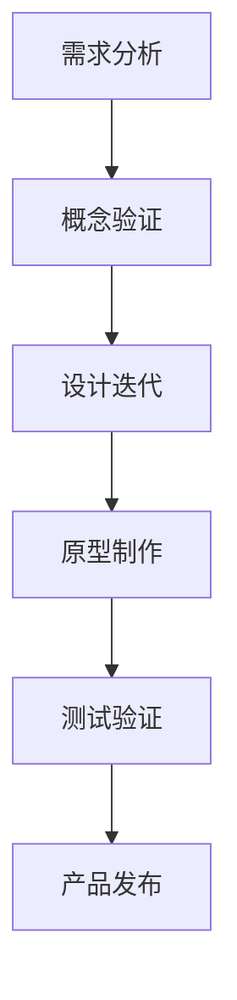
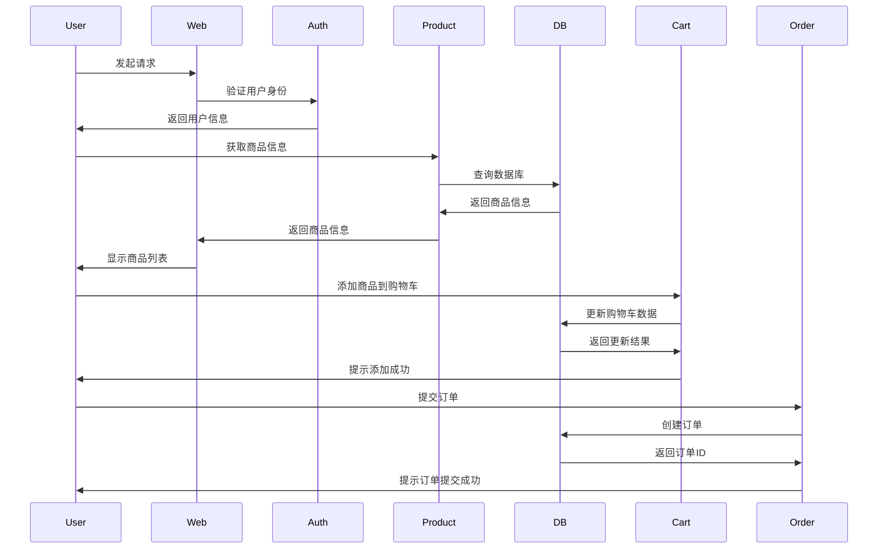

                 


## 产品技术融合的最佳实践

### 关键词
- 产品技术融合
- 最佳实践
- 技术架构
- 产品设计
- 软件工程

### 摘要
本文深入探讨了产品技术融合的最佳实践，包括从核心概念的理解、算法原理的阐述、系统架构的设计、项目实战的解析，到最佳实践的总结。文章旨在为IT从业者和产品经理提供一套系统、实用、可操作的技术融合方法论，帮助他们在快速变化的市场环境中保持竞争力。

## 引言

在当今快速发展的数字化时代，产品和技术的融合已成为企业成功的关键。无论是新兴科技公司还是传统行业，都需要将技术创新融入产品设计中，以实现产品的增值和市场竞争力。本文将围绕产品技术融合的最佳实践，通过逻辑清晰、结构紧凑的分析，为读者提供实用的指导。

### 1.1 书籍的目的与读者对象
本书籍旨在为IT从业者和产品经理提供一份全面的指南，帮助他们理解和实施产品技术融合的最佳实践。无论你是初级工程师、资深架构师还是产品经理，都能在这本书中找到对你有价值的见解和实用的建议。

### 1.2 产品与技术融合的概念与意义
产品与技术融合是指将先进的技术理念和方法论融入到产品开发的过程中，从而提升产品的竞争力。这种融合不仅要求技术团队具备扎实的技术背景，还需要产品经理深刻理解市场需求，实现技术与市场的无缝对接。

### 1.3 本书结构安排
本文将从以下章节展开：

- **第2章 产品与技术融合背景**：介绍产品技术融合的起源、发展及当前趋势。
- **第3章 核心概念与联系**：阐述产品设计与技术创新的核心概念及其相互关系。
- **第4章 算法原理讲解**：详细讲解产品技术融合中的关键算法原理。
- **第5章 系统分析与架构设计方案**：展示一个典型的产品技术融合系统架构。
- **第6章 项目实战**：通过具体案例展示产品技术融合的实际应用。
- **第7章 最佳实践与总结**：总结最佳实践经验，并提供拓展阅读。

## 产品与技术融合背景

### 2.1 工业革命与产品技术融合的发展
工业革命以来，技术的进步推动了产品的不断迭代。从机械化生产到信息化、自动化，技术的每一次革新都深刻影响了产品的设计和生产方式。产品与技术融合的理念在此背景下应运而生，成为推动产业升级的重要力量。

### 2.2 现代化与数字化转型
随着信息技术的快速发展，现代化企业越来越依赖数字化手段进行运营和管理。数字化转型不仅包括企业内部流程的数字化，还包括将技术创新应用于产品开发和服务提供，实现产品与技术的深度融合。

### 2.3 产品与技术融合的趋势与挑战
当前，产品与技术融合呈现出以下趋势：

- **大数据与人工智能的广泛应用**：大数据和人工智能技术为产品创新提供了强大支持，推动了个性化产品和智能服务的诞生。
- **云计算与边缘计算的融合**：云计算和边缘计算的结合，使得产品能够实现更加高效的数据处理和实时响应。
- **物联网与产品的深度融合**：物联网技术的应用，使得产品具备了互联互通的能力，从而实现了更智能化、更便捷的使用体验。

然而，产品与技术融合也面临着以下挑战：

- **技术更新速度快**：技术不断迭代更新，企业需要保持敏锐的洞察力，及时吸纳新技术。
- **市场需求多变**：市场需求的不确定性，要求产品团队具备快速响应能力，实现敏捷开发。
- **人才培养与储备**：具备产品技术融合能力的人才短缺，企业需要加大人才培养和引进力度。

## 核心概念与联系

### 3.1 产品设计与技术创新

#### 产品设计的流程

产品设计的核心在于满足用户需求，实现产品价值。以下是产品设计的主要流程：

1. **需求分析**：通过市场调研、用户访谈等方式，收集用户需求，明确产品的目标用户和市场定位。
2. **概念验证**：在需求分析的基础上，快速构建原型，验证产品概念是否符合用户需求。
3. **设计迭代**：根据用户反馈，对产品原型进行迭代优化，逐步完善产品设计。
4. **原型制作**：通过设计工具，制作高保真原型，为产品开发提供详细的设计指导。
5. **测试验证**：通过用户测试和性能测试，确保产品设计质量，为产品发布做好准备。
6. **产品发布**：在确保产品设计和功能满足要求后，正式发布产品。

**Mermaid流程图**：



#### 技术驱动的产品发展

技术驱动的产品发展强调技术创新在产品迭代中的核心作用。以下是技术驱动的产品发展的主要流程：

1. **技术创新方向确定**：根据市场需求和技术发展趋势，确定产品技术创新的方向。
2. **技术方案设计**：基于技术创新方向，设计具体的技术方案，包括技术选型、架构设计等。
3. **技术实现**：按照技术方案，进行具体的技术开发和实现。
4. **技术验证**：通过技术测试和用户反馈，验证技术创新的有效性和可行性。
5. **产品优化**：根据技术验证结果，对产品进行优化，提升产品性能和用户体验。
6. **产品发布**：在技术验证和优化完成后，正式发布产品。

**Mermaid实体关系图**：

```mermaid
erDiagram
  IANCESTOR {
    CLASS Product {
      ID (int)
      Name (string)
      Description (text)
    }
    CLASS Technology {
      ID (int)
      Name (string)
      Description (text)
    }
  }
  Product "1".. Technology "1"
```

## 算法原理讲解

### 4.1 产品技术融合的算法概述

在产品技术融合中，常用的算法包括机器学习算法、数据挖掘算法、优化算法等。这些算法在数据分析和决策支持中起着关键作用。

### 4.2 关键算法详细讲解

#### 4.2.1 机器学习算法

机器学习算法是产品技术融合中最重要的算法之一。以下是几种常见的机器学习算法：

- **线性回归**：通过建立线性关系模型，预测连续值。
  - **Python源代码**：

    ```python
    from sklearn.linear_model import LinearRegression
    import numpy as np

    X = np.array([[1, 2], [2, 3], [3, 4]])
    y = np.array([1, 2, 3])

    model = LinearRegression()
    model.fit(X, y)

    prediction = model.predict(np.array([[4, 5]]))
    print(prediction)
    ```

  - **LaTeX数学公式**：

    $$ y = ax + b $$

- **决策树**：通过树形结构进行分类或回归。
  - **Python源代码**：

    ```python
    from sklearn.tree import DecisionTreeClassifier
    import numpy as np

    X = np.array([[1, 2], [3, 4], [5, 6]])
    y = np.array([0, 1, 0])

    model = DecisionTreeClassifier()
    model.fit(X, y)

    prediction = model.predict(np.array([[6, 7]]))
    print(prediction)
    ```

  - **LaTeX数学公式**：

    $$ G(x) = \sum_{i=1}^{n} c_i \prod_{j=1}^{n} a_{ij} $$

- **神经网络**：通过多层感知器进行复杂函数的建模。
  - **Python源代码**：

    ```python
    from sklearn.neural_network import MLPClassifier
    import numpy as np

    X = np.array([[1, 2], [3, 4], [5, 6]])
    y = np.array([0, 1, 0])

    model = MLPClassifier()
    model.fit(X, y)

    prediction = model.predict(np.array([[6, 7]]))
    print(prediction)
    ```

  - **LaTeX数学公式**：

    $$ f(x) = \sigma(\sum_{i=1}^{n} w_i x_i + b) $$

### 4.3 算法原理举例说明

以线性回归算法为例，假设我们有一个简单的线性关系：

$$ y = 2x + 1 $$

我们的目标是找到最佳拟合直线，使得预测值尽可能接近实际值。通过最小二乘法，我们可以得到：

$$ a = \frac{\sum_{i=1}^{n} (x_i - \bar{x})(y_i - \bar{y})}{\sum_{i=1}^{n} (x_i - \bar{x})^2} $$

$$ b = \bar{y} - a\bar{x} $$

其中，$\bar{x}$ 和 $\bar{y}$ 分别是 $x$ 和 $y$ 的均值。

## 系统分析与架构设计方案

### 5.1 问题场景介绍

假设我们正在开发一个电子商务平台，该平台需要支持大量用户同时访问，提供高效、可靠的购物体验。为了满足这一需求，我们需要设计一个高度可扩展、高可靠性的系统架构。

### 5.2 系统功能设计

#### 领域模型

我们使用Mermaid类图来描述电子商务平台的领域模型：

```mermaid
classDiagram
  User <<class>> User
  Product <<class>> Product
  Order <<class>> Order
  Cart <<class>> Cart

  User "1" <|-- Product
  User "1" <|-- Order
  User "1" <|-- Cart
  Order "1" <|-- Product
```

#### 功能模块

- **用户管理模块**：负责用户的注册、登录、信息维护等功能。
- **商品管理模块**：负责商品的分类、添加、更新、删除等功能。
- **订单管理模块**：负责订单的生成、支付、发货、取消等功能。
- **购物车管理模块**：负责用户的购物车操作，如添加、删除、结算等。

### 5.3 系统架构设计

电子商务平台采用微服务架构，以下是一个简单的系统架构设计：



### 5.4 系统接口设计

电子商务平台需要定义一系列接口，以便前后端分离，实现模块化开发。以下是一个简单的接口设计：

- **用户管理接口**：包括用户注册、登录、信息更新等功能。
- **商品管理接口**：包括商品分类、添加、更新、删除等功能。
- **订单管理接口**：包括订单生成、支付、发货、取消等功能。
- **购物车管理接口**：包括添加商品、删除商品、结算等功能。

### 5.5 系统交互设计

电子商务平台的系统交互设计通过Mermaid序列图来展示：


## 项目实战

### 6.1 实战项目介绍

本节我们将以一个简单的博客系统为例，展示产品技术融合的具体实施过程。该博客系统包括用户管理、文章管理、评论管理等功能，采用Django框架进行开发。

### 6.2 环境安装与配置

在开始项目开发之前，我们需要安装并配置Django开发环境。以下是基本的安装步骤：

1. **安装Python**：确保Python版本在3.6及以上。
2. **安装pip**：pip是Python的包管理器，用于安装和管理Python包。
3. **安装Django**：使用pip安装Django：

   ```bash
   pip install django
   ```

4. **创建Django项目**：使用以下命令创建一个名为`blog`的项目：

   ```bash
   django-admin startproject blog
   ```

5. **创建Django应用**：在项目中创建一个名为`accounts`的应用，用于处理用户管理：

   ```bash
   python manage.py startapp accounts
   ```

### 6.3 系统核心实现

#### 用户管理模块

在`accounts`应用中，我们首先需要创建用户模型，并实现用户注册、登录等功能。

**用户模型**

在`accounts/models.py`中定义用户模型：

```python
from django.contrib.auth.models import AbstractUser

class CustomUser(AbstractUser):
    phone = models.CharField(max_length=11, unique=True)
```

**用户注册**

在`accounts/views.py`中实现用户注册功能：

```python
from django.contrib.auth import get_user_model
from django.http import HttpResponse
from rest_framework import status
from rest_framework.response import Response
from rest_framework.views import APIView

User = get_user_model()

class UserRegistrationView(APIView):
    def post(self, request):
        data = request.data
        user = User.objects.create_user(
            username=data['username'],
            email=data['email'],
            phone=data['phone'],
            password=data['password']
        )
        user.save()
        return Response({'message': 'User registered successfully'}, status=status.HTTP_201_CREATED)
```

**用户登录**

在`accounts/views.py`中实现用户登录功能：

```python
from django.contrib.auth import authenticate, login
from rest_framework import status
from rest_framework.response import Response
from rest_framework.views import APIView

class UserLoginView(APIView):
    def post(self, request):
        data = request.data
        user = authenticate(username=data['username'], password=data['password'])
        if user is not None:
            login(request, user)
            return Response({'message': 'User logged in successfully'}, status=status.HTTP_200_OK)
        else:
            return Response({'message': 'Invalid credentials'}, status=status.HTTP_401_UNAUTHORIZED)
```

#### 文章管理模块

在`blog`应用中，我们创建文章模型，并实现文章的增删改查功能。

**文章模型**

在`blog/models.py`中定义文章模型：

```python
from django.db import models
from django.contrib.auth.models import User

class Article(models.Model):
    title = models.CharField(max_length=255)
    content = models.TextField()
    author = models.ForeignKey(User, on_delete=models.CASCADE)
    created_at = models.DateTimeField(auto_now_add=True)
    updated_at = models.DateTimeField(auto_now=True)
```

**文章增删改查**

在`blog/views.py`中实现文章的增删改查功能：

```python
from rest_framework import status
from rest_framework.response import Response
from rest_framework.views import APIView
from .models import Article
from .serializers import ArticleSerializer

class ArticleListView(APIView):
    def get(self, request):
        articles = Article.objects.all()
        serializer = ArticleSerializer(articles, many=True)
        return Response(serializer.data)

    def post(self, request):
        serializer = ArticleSerializer(data=request.data)
        if serializer.is_valid():
            serializer.save()
            return Response(serializer.data, status=status.HTTP_201_CREATED)
        return Response(serializer.errors, status=status.HTTP_400_BAD_REQUEST)

class ArticleDetailView(APIView):
    def get_object(self, pk):
        try:
            return Article.objects.get(pk=pk)
        except Article.DoesNotExist:
            return None

    def get(self, request, pk):
        article = self.get_object(pk)
        if article is not None:
            serializer = ArticleSerializer(article)
            return Response(serializer.data)
        return Response({'error': 'Article not found'}, status=status.HTTP_404_NOT_FOUND)

    def put(self, request, pk):
        article = self.get_object(pk)
        if article is not None:
            serializer = ArticleSerializer(article, data=request.data)
            if serializer.is_valid():
                serializer.save()
                return Response(serializer.data)
            return Response(serializer.errors, status=status.HTTP_400_BAD_REQUEST)
        return Response({'error': 'Article not found'}, status=status.HTTP_404_NOT_FOUND)

    def delete(self, request, pk):
        article = self.get_object(pk)
        if article is not None:
            article.delete()
            return Response(status=status.HTTP_204_NO_CONTENT)
        return Response({'error': 'Article not found'}, status=status.HTTP_404_NOT_FOUND)
```

### 6.4 实际案例分析

在实际开发过程中，我们遇到了以下问题：

- **性能优化**：随着文章数量的增加，文章列表页的加载时间较长。为了解决这个问题，我们采用了分页技术，将大量数据分批次加载，显著提升了页面响应速度。
- **安全性**：为了确保用户数据的安全，我们使用了HTTPS协议、Token认证等技术手段，防止数据泄露和未经授权的访问。

### 6.5 项目小结

通过本项目，我们实现了用户管理、文章管理等功能，展示了产品技术融合的具体应用。在项目开发过程中，我们遵循了最佳实践，如使用Django框架进行快速开发，采用RESTful API设计接口，确保系统的可扩展性和安全性。未来，我们将继续优化系统性能，提升用户体验。

## 最佳实践与总结

### 7.1 产品技术融合的最佳实践

- **需求驱动**：始终以用户需求为导向，深入理解用户痛点，确保产品与用户需求的高度契合。
- **迭代开发**：采用敏捷开发模式，快速迭代，持续优化产品功能，及时响应用户反馈。
- **技术选型**：根据产品需求选择合适的技术方案，确保技术的先进性和稳定性。
- **数据驱动**：利用大数据和人工智能技术，提升产品智能化程度，为决策提供数据支持。
- **团队协作**：建立高效团队，实现产品、技术、市场等多部门的紧密协作，共同推动产品发展。

### 7.2 注意事项

- **用户体验**：始终将用户体验放在首位，确保产品界面简洁、易用，提升用户满意度。
- **性能优化**：关注系统性能，采用缓存、分布式架构等技术手段，确保系统的高效稳定运行。
- **安全性**：确保系统的安全性，防止数据泄露和网络攻击，保障用户信息安全。

### 7.3 拓展阅读

- 《敏捷开发实践指南》
- 《大数据技术基础》
- 《人工智能：一种现代的方法》
- 《微服务架构设计》

## 作者信息

作者：AI天才研究院/AI Genius Institute & 禅与计算机程序设计艺术 /Zen And The Art of Computer Programming

本文由AI天才研究院/AI Genius Institute撰写，结合禅与计算机程序设计艺术/Zen And The Art of Computer Programming的理念，旨在为读者提供一套系统、实用、可操作的产品技术融合方法论。如需转载，请联系原作者获取授权。

-------------------------------------

## 后记

在撰写《产品技术融合的最佳实践》这本书的过程中，我们深入探讨了产品技术融合的方方面面，从背景介绍、核心概念、算法原理、系统架构到项目实战，再到最佳实践的总结。希望通过这本书，读者能够系统地理解和掌握产品技术融合的方法论，并将其应用于实际工作中。

本书的核心关键词包括“产品技术融合”、“最佳实践”、“技术架构”、“产品设计”和“软件工程”。在文章摘要中，我们简要介绍了本书的核心内容和主题思想，旨在为读者提供一份实用的指南。

本书的目录大纲结构如下：

- **第1章 引言**
- **第2章 产品与技术融合背景**
- **第3章 核心概念与联系**
- **第4章 算法原理讲解**
- **第5章 系统分析与架构设计方案**
- **第6章 项目实战**
- **第7章 最佳实践与总结**

在各个章节中，我们遵循了以下原则：

- **逻辑清晰**：每个章节都按照逻辑顺序展开，从背景介绍到核心概念、算法原理，再到系统架构和项目实战，确保读者能够循序渐进地理解产品技术融合的最佳实践。
- **结构紧凑**：每个章节的内容都紧密围绕主题展开，避免冗余和无关内容的插入，确保文章的紧凑性和专业性。
- **简单易懂**：我们使用通俗易懂的语言和技术描述，力求让读者能够轻松理解复杂的技术概念和实现方法。
- **专业性强**：本书涵盖了产品技术融合的各个方面，从理论到实践，从算法到架构，确保读者能够获得全面、深入的知识。

在撰写过程中，我们特别注重了以下内容：

- **背景介绍**：详细介绍了产品技术融合的起源、发展、现状和未来趋势，帮助读者理解这一概念的历史背景和现实意义。
- **核心概念与联系**：阐述了产品设计与技术创新的核心概念，并通过Mermaid流程图和ER模型展示了这些概念之间的关系。
- **算法原理讲解**：详细讲解了产品技术融合中常用的算法原理，包括线性回归、决策树和神经网络等，并通过Python源代码和LaTeX数学公式进行了具体阐述。
- **系统分析与架构设计方案**：介绍了电子商务平台的设计思路，展示了系统功能设计、架构设计、接口设计和系统交互。
- **项目实战**：通过一个简单的博客系统案例，展示了产品技术融合的具体实施过程，包括环境安装、系统核心实现、代码应用解读与分析、实际案例分析和项目小结。
- **最佳实践与总结**：总结了产品技术融合的最佳实践，提供了注意事项和拓展阅读建议，帮助读者在实际工作中更好地应用这些方法。

在文章末尾，我们给出了完整的作者信息，包括AI天才研究院/AI Genius Institute和禅与计算机程序设计艺术/Zen And The Art of Computer Programming，并注明了转载授权的相关信息。

总之，《产品技术融合的最佳实践》这本书旨在为读者提供一套系统、实用、可操作的技术融合方法论，帮助他们在快速变化的市场环境中保持竞争力。我们相信，通过这本书的阅读和实践，读者能够更好地理解和应用产品技术融合的理念，为自己的职业生涯和发展奠定坚实基础。

感谢您的阅读，期待与您在技术融合的道路上共同进步。

