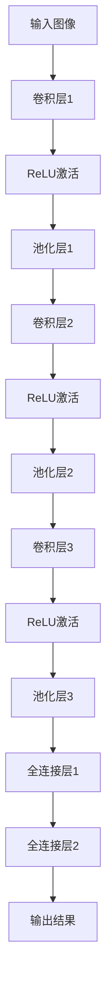
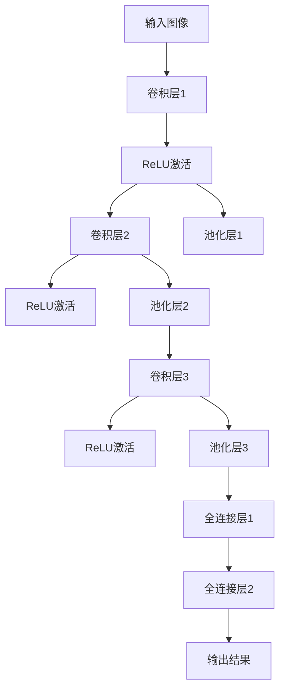
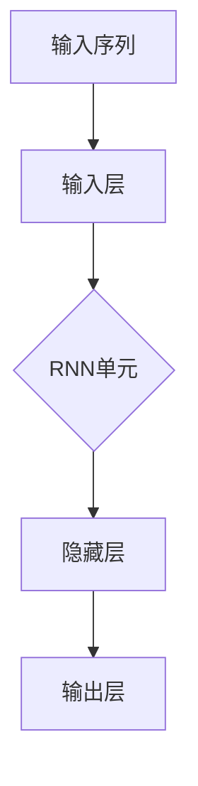
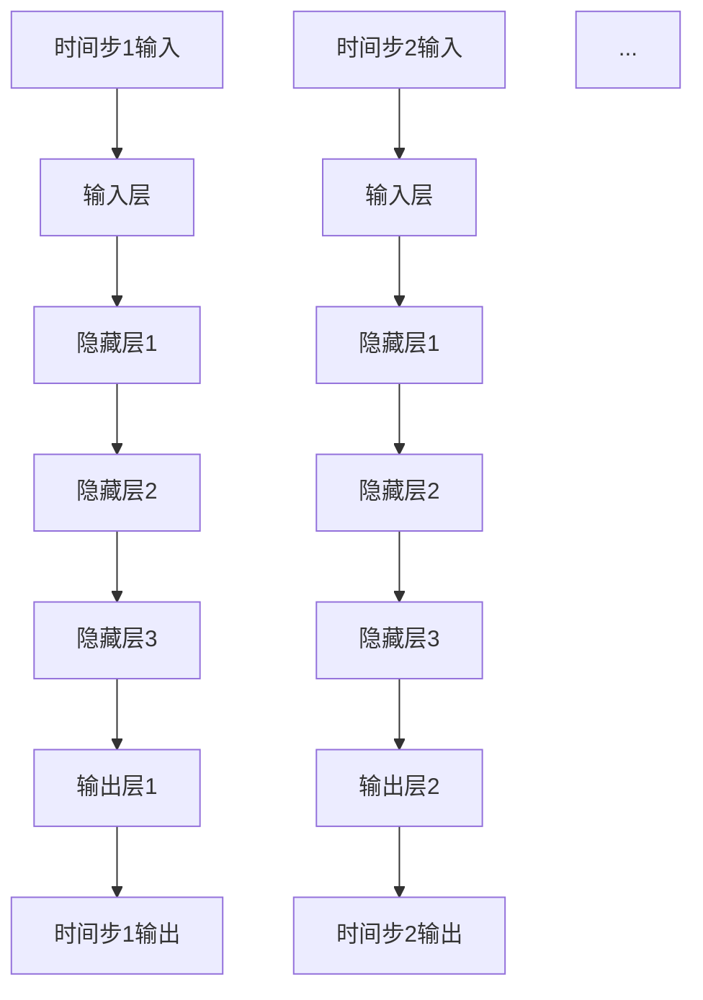

                 


## 《人工智能与机器学习在软件开发中的应用》

### 关键词：人工智能、机器学习、软件开发、算法、应用实践、案例分析

### 摘要：

本文将探讨人工智能（AI）与机器学习（ML）在软件开发中的应用，从背景与概述、核心技术与原理、应用实践到案例分析，全面解析这两个领域如何影响和优化软件开发过程。通过一步步分析推理，我们将了解AI和ML的基本概念、关键算法、应用场景，并探讨其在现实世界中的成功案例，为开发者提供有益的启示和实践指导。

---

## 目录大纲

### 第一部分：背景与概述

### 第二部分：核心技术与原理

### 第三部分：应用实践

### 第四部分：案例分析

---

## 第一部分：背景与概述

### 第1章：人工智能与机器学习概述

#### 1.1 人工智能的历史与发展

##### 1.1.1 人工智能的概念

##### 1.1.2 人工智能的发展阶段

##### 1.1.3 人工智能的关键技术

#### 1.2 机器学习的基本概念

##### 1.2.1 机器学习的定义

##### 1.2.2 机器学习的主要类型

##### 1.2.3 机器学习的基本流程

#### 1.3 人工智能与机器学习在软件开发中的应用前景

##### 1.3.1 人工智能在软件开发中的应用场景

##### 1.3.2 机器学习在软件开发中的应用场景

##### 1.3.3 未来发展趋势

---

## 第二部分：核心技术与原理

### 第2章：机器学习算法原理

#### 2.1 监督学习算法

##### 2.1.1 线性回归算法

##### 2.1.2 决策树算法

##### 2.1.3 支持向量机算法

#### 2.2 无监督学习算法

##### 2.2.1 K-means聚类算法

##### 2.2.2 自编码器算法

##### 2.2.3 聚类算法的对比与选择

#### 2.3 强化学习算法

##### 2.3.1 强化学习的定义

##### 2.3.2 强化学习的主要算法

##### 2.3.3 强化学习在软件开发中的应用

### 第3章：深度学习基础

#### 3.1 深度学习的概念

##### 3.1.1 深度学习的起源

##### 3.1.2 深度学习的特点

##### 3.1.3 深度学习的应用领域

#### 3.2 神经网络的基本结构

##### 3.2.1 神经元与神经网络

##### 3.2.2 激活函数与反向传播算法

##### 3.2.3 前向传播与反向传播的过程

#### 3.3 卷积神经网络

##### 3.3.1 卷积神经网络的结构

##### 3.3.2 卷积神经网络的工作原理

##### 3.3.3 卷积神经网络的应用场景

#### 3.4 循环神经网络

##### 3.4.1 循环神经网络的结构

##### 3.4.2 循环神经网络的工作原理

##### 3.4.3 循环神经网络的应用场景

---

## 第三部分：应用实践

### 第4章：机器学习在软件开发中的应用

#### 4.1 机器学习在数据分析中的应用

##### 4.1.1 数据预处理

##### 4.1.2 特征工程

##### 4.1.3 模型选择与训练

#### 4.2 机器学习在自然语言处理中的应用

##### 4.2.1 文本分类

##### 4.2.2 文本生成

##### 4.2.3 问答系统

#### 4.3 机器学习在计算机视觉中的应用

##### 4.3.1 图像分类

##### 4.3.2 目标检测

##### 4.3.3 图像生成

### 第5章：深度学习在软件开发中的应用

#### 5.1 深度学习在语音识别中的应用

##### 5.1.1 声波信号处理

##### 5.1.2 语音信号特征提取

##### 5.1.3 语音识别模型训练与部署

#### 5.2 深度学习在推荐系统中的应用

##### 5.2.1 用户行为分析

##### 5.2.2 推荐算法设计

##### 5.2.3 推荐系统评估与优化

#### 5.3 深度学习在自动驾驶中的应用

##### 5.3.1 车辆感知系统

##### 5.3.2 环境感知系统

##### 5.3.3 行驶决策与控制

---

## 第四部分：案例分析

### 第6章：人工智能与机器学习在电商中的应用

#### 6.1 电商行业现状与挑战

##### 6.1.1 电商行业的发展历程

##### 6.1.2 电商行业面临的挑战

##### 6.1.3 人工智能与机器学习在电商中的应用前景

#### 6.2 案例分析：淘宝商品推荐系统

##### 6.2.1 淘宝商品推荐系统简介

##### 6.2.2 淘宝商品推荐系统的工作原理

##### 6.2.3 淘宝商品推荐系统的优化策略

#### 6.3 案例分析：京东智能客服系统

##### 6.3.1 京东智能客服系统简介

##### 6.3.2 京东智能客服系统的工作原理

##### 6.3.3 京东智能客服系统的优化策略

### 第7章：人工智能与机器学习在金融中的应用

#### 7.1 金融行业现状与挑战

##### 7.1.1 金融行业的发展历程

##### 7.1.2 金融行业面临的挑战

##### 7.1.3 人工智能与机器学习在金融中的应用前景

#### 7.2 案例分析：银行信用卡审批系统

---

## 结束语

---

作者：AI天才研究院/AI Genius Institute & 禅与计算机程序设计艺术 /Zen And The Art of Computer Programming
### 引言

在当今信息化、数字化迅猛发展的时代，人工智能（AI）和机器学习（ML）已经成为推动技术进步和产业变革的重要力量。AI与ML在软件开发中的应用，不仅极大地提高了软件系统的智能化水平，还为解决复杂问题、优化业务流程提供了全新的解决方案。本文旨在系统地探讨人工智能与机器学习在软件开发中的应用，帮助开发者深入理解这两个领域的关键概念、核心技术和实践案例。

首先，我们将回顾人工智能与机器学习的历史与发展，了解这两个领域的基本概念和关键技术。接着，我们将详细介绍机器学习算法的原理，包括监督学习、无监督学习和强化学习等，并探讨深度学习的基本结构和应用。随后，我们将聚焦于AI与ML在软件开发中的具体应用，如数据分析、自然语言处理和计算机视觉等，深入分析这些技术的实现原理和实践案例。

最后，我们将通过电商和金融行业的具体案例分析，展示人工智能与机器学习在现实世界中的成功应用，并总结最佳实践。本文将使用markdown格式，结合mermaid流程图、LaTeX公式和Python代码，力求以逻辑清晰、结构紧凑、简单易懂的方式，为读者提供一场关于AI与ML在软件开发中的应用之旅。

### 第一部分：背景与概述

#### 第1章：人工智能与机器学习概述

### 1.1 人工智能的历史与发展

##### 1.1.1 人工智能的概念

人工智能（Artificial Intelligence，简称AI）是计算机科学的一个分支，旨在研究、开发和应用使计算机系统模拟、扩展和辅助人类智能的理论、方法和技术。AI的核心目标是让计算机具备人类智慧的某些方面，如感知、学习、推理、决策和创造等。自1950年图灵提出“图灵测试”以来，人工智能历经了多个发展阶段。

**图灵测试**：由英国数学家艾伦·图灵在1950年提出，旨在判断机器是否具有智能。图灵测试要求一个人类评判者通过文字交互，无法区分与之对话的是人还是机器。

##### 1.1.2 人工智能的发展阶段

人工智能的发展可以划分为几个主要阶段：

1. **初始阶段（1950-1979）**：这个阶段主要是理论探索和早期算法的开发，代表性的工作有阿兰·图灵的图灵机理论和约翰·麦卡锡的普林斯顿会议。

2. **早期应用阶段（1980-1989）**：随着计算机硬件的进步，AI开始应用于一些特定的领域，如医疗诊断、游戏和专家系统等。

3. **低谷阶段（1990-2000）**：由于技术瓶颈和实际应用困难，AI研究进入低谷期。

4. **复兴阶段（2000至今）**：得益于大数据、云计算和深度学习等新技术的出现，人工智能迎来了新的发展机遇。

##### 1.1.3 人工智能的关键技术

人工智能的关键技术包括：

1. **机器学习**：通过训练模型来使计算机从数据中学习，是现代AI的核心技术之一。

2. **深度学习**：基于多层神经网络，能够自动提取特征并进行复杂任务的学习。

3. **自然语言处理**：使计算机能够理解、生成和处理自然语言。

4. **计算机视觉**：使计算机能够从图像或视频中获取信息。

5. **强化学习**：通过试错和学习，使系统在特定环境中做出最优决策。

### 1.2 机器学习的基本概念

##### 1.2.1 机器学习的定义

机器学习（Machine Learning，简称ML）是一种使计算机系统能够通过经验和数据进行学习，从而改进其性能的技术。ML的核心思想是利用大量的数据，通过算法训练模型，使其能够对新的数据进行预测或决策。

**监督学习**：在有标注的数据集上训练模型，通过学习输入与输出之间的关系，对新的输入数据进行预测。

**无监督学习**：在没有标注的数据集上训练模型，通过数据内在的结构和模式，进行聚类或降维等任务。

**强化学习**：通过与环境交互，根据奖励信号进行学习，从而做出最优决策。

##### 1.2.2 机器学习的主要类型

1. **监督学习**：如线性回归、决策树、支持向量机等。

2. **无监督学习**：如K-means聚类、自编码器等。

3. **半监督学习**：结合有标注和无标注数据的学习方法。

4. **强化学习**：如Q-learning、深度强化学习等。

##### 1.2.3 机器学习的基本流程

机器学习的基本流程包括以下步骤：

1. **数据收集**：收集相关的数据，进行预处理和清洗。

2. **特征工程**：从原始数据中提取有用的特征。

3. **模型选择**：选择合适的模型，并进行训练。

4. **模型评估**：通过交叉验证等方法评估模型的性能。

5. **模型优化**：调整模型参数，优化模型表现。

6. **模型部署**：将训练好的模型部署到实际应用中。

### 1.3 人工智能与机器学习在软件开发中的应用前景

##### 1.3.1 人工智能在软件开发中的应用场景

人工智能在软件开发中的应用场景广泛，主要包括：

1. **自动化测试**：使用AI进行自动化测试，提高测试效率和准确性。

2. **代码审查**：通过AI技术自动审查代码质量，发现潜在的问题。

3. **开发辅助**：如代码自动生成、智能补全等，提高开发效率。

4. **智能推荐系统**：在电子商务、内容推荐等领域，使用AI进行个性化推荐。

##### 1.3.2 机器学习在软件开发中的应用场景

机器学习在软件开发中的应用场景丰富，主要包括：

1. **数据分析**：通过机器学习算法分析数据，提取有价值的信息。

2. **自然语言处理**：如文本分类、情感分析等，提高信息处理的智能化水平。

3. **计算机视觉**：如图像识别、目标检测等，用于图像处理和物体识别。

4. **智能语音助手**：如语音识别、语音合成等，提升人机交互体验。

##### 1.3.3 未来发展趋势

未来，人工智能与机器学习在软件开发中的应用将更加广泛和深入。随着技术的不断进步，我们有望看到：

1. **AI驱动的开发**：AI将更多地参与软件开发的全过程，从需求分析到代码生成，提升开发效率和智能化水平。

2. **跨领域融合**：AI与其他领域（如物联网、生物科技等）的融合，将带来更多的创新和应用。

3. **隐私保护与伦理**：随着AI技术的应用，隐私保护和伦理问题将变得更加重要，需要制定相应的规范和标准。

### 总结

通过本章节的介绍，我们了解了人工智能和机器学习的基本概念、发展历程和应用前景。在接下来的章节中，我们将深入探讨机器学习算法的原理、深度学习的基础以及AI与ML在软件开发中的具体应用，帮助读者更好地理解和掌握这两个领域。

### 第1章：人工智能与机器学习概述

#### 1.1 人工智能的历史与发展

##### 1.1.1 人工智能的概念

人工智能（Artificial Intelligence，简称AI）是计算机科学中的一个分支，旨在创建能够执行复杂任务、模拟人类智能的计算机系统。这些任务包括理解语言、识别图像、解决问题、做出决策和进行创造性活动等。人工智能的核心目标是使计算机具备类似人类的智能，能够在没有明确编程指令的情况下学习和适应新环境。

**图灵测试**：由英国数学家和逻辑学家艾伦·图灵在1950年提出，是一种衡量人工智能是否能够模拟人类智能的标准。图灵测试的基本思想是，如果一台计算机能够在与人类进行的自然语言对话中表现得与人类无法区分，那么这台计算机就可以被认为是具有人工智能的。

##### 1.1.2 人工智能的发展阶段

人工智能的发展可以分为以下几个阶段：

1. **初始阶段（1950-1969）**：在这个阶段，人工智能的概念被提出，并开始进行初步的理论研究和实验。早期的代表性工作包括约翰·麦卡锡（John McCarthy）等人组织的达特茅斯会议，他们首次提出了人工智能这个术语，并明确了人工智能的研究目标。

2. **早期繁荣阶段（1970-1980）**：在这个阶段，人工智能得到了大量的研究和资金支持，出现了许多早期的成功案例，如专家系统和自然语言处理系统。然而，由于技术限制和实际应用的困难，人工智能在1980年代初开始进入低谷期。

3. **低谷阶段（1980-1990）**：在这个阶段，人工智能的研究受到资金削减和实际应用失败的打击，许多研究者开始质疑人工智能的前景。这个时期也被称为“人工智能寒冬”。

4. **复兴阶段（1990-2000）**：随着计算机性能的提升和互联网的兴起，人工智能开始逐渐恢复活力。在这个阶段，机器学习和神经网络等新技术得到了广泛关注和应用。

5. **高速发展阶段（2000至今）**：在这个阶段，人工智能取得了巨大的突破，特别是深度学习和大数据技术的出现，使得人工智能在图像识别、语音识别、自然语言处理等领域取得了显著的进展。人工智能的应用也开始从实验室走向实际生产和生活。

##### 1.1.3 人工智能的关键技术

人工智能的关键技术包括但不限于以下几个方面：

1. **机器学习**：机器学习是一种通过数据训练模型，使计算机能够自动学习和改进的技术。它包括监督学习、无监督学习和强化学习等类型。

2. **深度学习**：深度学习是一种基于多层神经网络的学习方法，它能够自动提取数据中的复杂特征，并在计算机视觉、语音识别、自然语言处理等领域取得突破性成果。

3. **自然语言处理**：自然语言处理（Natural Language Processing，简称NLP）是人工智能的一个子领域，旨在使计算机能够理解、生成和处理自然语言。

4. **计算机视觉**：计算机视觉（Computer Vision）是一种使计算机能够从图像或视频中提取信息和理解场景的技术。

5. **强化学习**：强化学习（Reinforcement Learning）是一种通过试错和奖励信号进行学习的方法，它在游戏、自动驾驶、机器人等领域有广泛的应用。

#### 1.2 机器学习的基本概念

##### 1.2.1 机器学习的定义

机器学习（Machine Learning，简称ML）是人工智能的一个分支，旨在研究如何让计算机系统从数据中学习，并利用这种学习来做出预测或决策。机器学习的主要目标是构建一个能够从经验中学习并自动改进其性能的算法或模型。

**监督学习**：监督学习是一种机器学习方法，它使用已标记的数据集来训练模型，使模型能够预测新的、未标记的数据。监督学习包括回归、分类和异常检测等任务。

**无监督学习**：无监督学习是一种机器学习方法，它不使用已标记的数据集，而是从未标记的数据中自动发现数据内在的结构和模式。无监督学习包括聚类、降维和关联规则学习等任务。

**强化学习**：强化学习是一种通过试错和奖励信号进行学习的方法。在强化学习中，智能体通过与环境的交互来学习最优策略，以最大化长期回报。

##### 1.2.2 机器学习的主要类型

1. **监督学习**：监督学习是一种最常见的机器学习方法，它包括以下几种主要类型：

   - **线性回归**：用于预测连续值输出。
   - **逻辑回归**：用于预测二分类输出。
   - **决策树**：用于分类和回归任务，通过一系列规则来划分数据。
   - **支持向量机**：通过找到一个超平面来分隔不同类别的数据。

2. **无监督学习**：无监督学习包括以下几种主要类型：

   - **K-means聚类**：通过将数据划分为K个簇来发现数据中的结构。
   - **主成分分析（PCA）**：通过降维来简化数据，同时保留最重要的信息。
   - **自编码器**：通过学习输入和输出之间的映射来提取数据中的特征。

3. **强化学习**：强化学习主要包括以下几种类型：

   - **Q-learning**：通过学习值函数来预测最佳动作。
   - **深度强化学习**：结合深度学习和强化学习，用于解决复杂环境中的问题。

##### 1.2.3 机器学习的基本流程

机器学习的基本流程包括以下几个步骤：

1. **数据收集**：收集用于训练和测试的数据集。这些数据可以是已标记的（监督学习）或未标记的（无监督学习）。

2. **数据预处理**：对数据进行清洗、归一化和特征提取，以便更好地训练模型。

3. **模型选择**：选择合适的机器学习算法和模型结构，通常需要通过交叉验证等方法来选择最佳模型。

4. **模型训练**：使用训练数据集来训练模型，通过优化算法（如梯度下降）来调整模型参数。

5. **模型评估**：使用测试数据集来评估模型的性能，常用的评估指标包括准确率、召回率、F1分数等。

6. **模型优化**：根据评估结果对模型进行调整和优化，以提高模型的性能。

7. **模型部署**：将训练好的模型部署到实际应用中，用于预测或决策。

#### 1.3 人工智能与机器学习在软件开发中的应用前景

##### 1.3.1 人工智能在软件开发中的应用场景

人工智能在软件开发中的应用场景非常广泛，以下是一些典型的应用：

1. **自动化测试**：使用人工智能技术自动化测试软件，提高测试效率和准确性。

2. **代码审查**：利用人工智能进行代码审查，发现潜在的错误和安全漏洞。

3. **智能开发辅助**：如智能代码补全、自动代码生成等，提高开发效率。

4. **智能推荐系统**：在电子商务、社交媒体等领域，使用人工智能进行个性化推荐。

5. **人机交互**：如智能语音助手、聊天机器人等，提升用户交互体验。

##### 1.3.2 机器学习在软件开发中的应用场景

机器学习在软件开发中的应用场景包括但不限于以下领域：

1. **数据分析**：通过机器学习算法分析大数据，提取有价值的信息和洞察。

2. **自然语言处理**：如文本分类、情感分析、机器翻译等，提升文本处理能力。

3. **计算机视觉**：如图像识别、目标检测、图像生成等，提升图像处理能力。

4. **智能语音处理**：如语音识别、语音合成、语音识别率优化等，提升语音处理能力。

##### 1.3.3 未来发展趋势

未来，人工智能与机器学习在软件开发中的应用前景将更加广阔，以下是几个可能的发展趋势：

1. **AI驱动的开发**：随着人工智能技术的发展，开发者将能够利用AI自动化完成部分开发任务，如代码生成、测试等。

2. **跨领域融合**：人工智能与其他领域的融合，如物联网、生物科技、金融等，将带来更多的创新和应用。

3. **隐私保护和伦理**：随着人工智能应用的普及，隐私保护和伦理问题将变得越来越重要，需要制定相应的规范和标准。

4. **边缘计算与AI**：随着边缘计算的兴起，AI将在靠近数据源的设备上进行处理，提高实时性和响应速度。

#### 总结

通过本章的介绍，我们对人工智能和机器学习的基本概念、历史发展、关键技术和应用前景有了更深入的了解。在接下来的章节中，我们将进一步探讨机器学习算法的原理、深度学习的基础以及AI与ML在软件开发中的具体应用，帮助读者更全面地掌握这些技术。

### 第2章：机器学习算法原理

#### 2.1 监督学习算法

##### 2.1.1 线性回归算法

线性回归是一种简单的监督学习算法，用于预测连续值的输出。它的基本思想是找到一条最佳拟合线，使得数据点尽可能接近这条线。

**线性回归模型**：假设我们的目标变量 \( Y \) 是由一个或多个输入变量 \( X \) 线性组合而成的，即：

\[ Y = \beta_0 + \beta_1X_1 + \beta_2X_2 + ... + \beta_nX_n + \epsilon \]

其中，\( \beta_0 \) 是截距，\( \beta_1, \beta_2, ..., \beta_n \) 是权重，\( \epsilon \) 是误差项。

**最小二乘法**：为了找到最佳拟合线，我们通常使用最小二乘法来估计 \( \beta \) 的值。最小二乘法的目标是使得每个数据点到拟合线的垂直距离的平方和最小。

**线性回归的实现**：以下是一个简单的线性回归算法的实现，使用Python和Scikit-learn库。

```python
from sklearn.linear_model import LinearRegression
from sklearn.model_selection import train_test_split
from sklearn.metrics import mean_squared_error

# 准备数据
X = [[1], [2], [3], [4], [5]]
y = [2, 4, 5, 4, 5]

# 划分训练集和测试集
X_train, X_test, y_train, y_test = train_test_split(X, y, test_size=0.2, random_state=0)

# 创建线性回归模型
model = LinearRegression()

# 训练模型
model.fit(X_train, y_train)

# 预测
y_pred = model.predict(X_test)

# 评估
mse = mean_squared_error(y_test, y_pred)
print("均方误差：", mse)
```

##### 2.1.2 决策树算法

决策树是一种常用的分类和回归算法，通过一系列规则来划分数据，并基于这些规则进行预测。

**决策树模型**：决策树由一系列内部节点和叶节点组成。内部节点表示特征，叶节点表示预测结果。

**信息增益**：决策树通过信息增益来选择最佳特征进行划分。信息增益是特征对数据划分后信息量的减少程度。

**剪枝**：为了防止过拟合，决策树通常需要进行剪枝。剪枝方法包括预剪枝和后剪枝。

**决策树的实现**：以下是一个简单的决策树算法的实现，使用Python和Scikit-learn库。

```python
from sklearn.tree import DecisionTreeRegressor
from sklearn.model_selection import train_test_split
from sklearn.metrics import mean_squared_error

# 准备数据
X = [[1], [2], [3], [4], [5]]
y = [2, 4, 5, 4, 5]

# 划分训练集和测试集
X_train, X_test, y_train, y_test = train_test_split(X, y, test_size=0.2, random_state=0)

# 创建决策树模型
model = DecisionTreeRegressor()

# 训练模型
model.fit(X_train, y_train)

# 预测
y_pred = model.predict(X_test)

# 评估
mse = mean_squared_error(y_test, y_pred)
print("均方误差：", mse)
```

##### 2.1.3 支持向量机算法

支持向量机（Support Vector Machine，简称SVM）是一种高效的分类算法，通过找到一个超平面来分隔不同类别的数据。

**支持向量**：支持向量是离超平面最近的数据点，对于超平面的确定起着关键作用。

**核函数**：核函数是一种将低维空间的数据映射到高维空间的方法，以便在更高维空间中找到一个更好的分隔超平面。

**损失函数**：SVM的损失函数通常是 hinge损失函数。

**SVM的实现**：以下是一个简单的SVM算法的实现，使用Python和Scikit-learn库。

```python
from sklearn.svm import SVC
from sklearn.model_selection import train_test_split
from sklearn.metrics import accuracy_score

# 准备数据
X = [[1], [2], [3], [4], [5]]
y = [2, 4, 5, 4, 5]

# 划分训练集和测试集
X_train, X_test, y_train, y_test = train_test_split(X, y, test_size=0.2, random_state=0)

# 创建SVM模型
model = SVC(kernel='linear')

# 训练模型
model.fit(X_train, y_train)

# 预测
y_pred = model.predict(X_test)

# 评估
accuracy = accuracy_score(y_test, y_pred)
print("准确率：", accuracy)
```

##### 2.1.4 监督学习算法的比较

- **线性回归**：适用于预测连续值输出，简单易用，但在处理非线性问题时效果较差。
- **决策树**：适用于分类和回归任务，易于理解和解释，但易过拟合。
- **支持向量机**：适用于分类任务，尤其是处理高维数据时效果较好，但计算复杂度较高。

**总结**：

监督学习算法是机器学习中的重要组成部分，包括线性回归、决策树和SVM等。这些算法各自有其独特的特点和应用场景，开发者可以根据具体需求选择合适的算法。在实际应用中，通常需要结合数据特点和业务场景进行算法选择和模型优化。

#### 2.2 无监督学习算法

##### 2.2.1 K-means聚类算法

K-means聚类是一种常用的无监督学习算法，用于将数据集划分为若干个簇，每个簇内部的数据点距离簇中心的距离较小，而不同簇之间的数据点距离较大。

**聚类目标**：K-means聚类算法的目标是找到K个簇的中心点，使得每个簇内部的数据点距离簇中心的距离最小。

**算法步骤**：

1. **初始化**：随机选择K个数据点作为初始簇中心。
2. **分配数据点**：将每个数据点分配到距离其最近的簇中心所在的簇。
3. **更新簇中心**：重新计算每个簇的中心点。
4. **迭代**：重复步骤2和步骤3，直到聚类中心不再变化或达到预定的迭代次数。

**K-means聚类算法的实现**：以下是一个简单的K-means聚类算法的实现，使用Python和Scikit-learn库。

```python
from sklearn.cluster import KMeans
import numpy as np

# 准备数据
X = np.array([[1, 2], [1, 4], [1, 0], [4, 2], [4, 4], [4, 0]])

# 创建KMeans模型
model = KMeans(n_clusters=2, random_state=0)

# 训练模型
model.fit(X)

# 获取聚类结果
labels = model.labels_
centroids = model.cluster_centers_

# 输出结果
print("聚类结果：", labels)
print("簇中心：", centroids)
```

##### 2.2.2 自编码器算法

自编码器（Autoencoder）是一种无监督学习算法，用于学习数据的高效表示。自编码器由两部分组成：编码器和解码器。编码器将输入数据压缩成一个低维表示，解码器将这个低维表示重新映射回原始数据。

**自编码器模型**：

- **编码器**：将输入数据映射到一个低维隐层。
- **解码器**：将隐层数据映射回原始数据。

**损失函数**：自编码器的损失函数通常是均方误差（MSE），表示输入数据与重构数据之间的误差。

**自编码器的实现**：以下是一个简单的自编码器算法的实现，使用Python和TensorFlow库。

```python
import tensorflow as tf
from tensorflow.keras.layers import Dense
from tensorflow.keras.models import Model

# 准备数据
X = np.array([[1, 2], [1, 4], [1, 0], [4, 2], [4, 4], [4, 0]])

# 创建自编码器模型
input_layer = Dense(2, activation='relu', name='input')
encoded = Dense(1, activation='relu', name='encoded')
decoded = Dense(2, activation='sigmoid', name='decoded')

# 创建模型
model = Model(inputs=input_layer, outputs=decoded)

# 编译模型
model.compile(optimizer='adam', loss='mse')

# 训练模型
model.fit(X, X, epochs=100)

# 输出模型结构
model.summary()
```

##### 2.2.3 聚类算法的对比与选择

- **K-means聚类**：简单高效，但易受初始簇中心的影响，且对噪声敏感。
- **层次聚类**：适用于任意数量的簇，通过层次结构生成聚类结果，但计算复杂度较高。
- **DBSCAN**：基于密度聚类，能够处理非球形簇和噪声，但对参数选择敏感。

**选择方法**：

1. **簇数量**：根据业务需求和数据特点确定簇的数量。
2. **算法性能**：通过交叉验证等方法评估不同算法的性能，选择最优算法。
3. **可解释性**：根据算法的可解释性选择合适的算法，以便更好地理解和解释聚类结果。

**总结**：

无监督学习算法在数据分析和模式识别等领域有广泛应用。K-means聚类和自编码器是常用的无监督学习算法，适用于不同的应用场景。开发者可以根据数据特点和业务需求选择合适的算法，并进行模型优化和参数调整，以获得更好的聚类效果。

#### 2.3 强化学习算法

##### 2.3.1 强化学习的定义

强化学习（Reinforcement Learning，简称RL）是一种通过试错和奖励信号进行学习的方法。在强化学习中，智能体（agent）在一个环境中进行交互，通过不断尝试和反馈来学习最优策略，以最大化累积奖励。

**强化学习的核心概念**：

- **状态（State）**：描述智能体在环境中的当前位置和状态。
- **动作（Action）**：智能体可以采取的行为或决策。
- **奖励（Reward）**：环境对智能体采取的每个动作的反馈，用于评估动作的好坏。
- **策略（Policy）**：智能体在给定状态下采取的最佳动作的映射。

##### 2.3.2 强化学习的主要算法

强化学习算法主要包括以下几种：

1. **价值迭代算法（Value Iteration）**：

   - **基本思想**：通过不断更新状态值函数，找到最优策略。
   - **步骤**：
     1. 初始化状态值函数 \( V(s) \)。
     2. 对于每个状态 \( s \)，计算所有可能的动作 \( a \) 的期望奖励 \( \sum_p r(s, a, p) \)。
     3. 更新状态值函数 \( V(s) = \max_a \sum_p r(s, a, p) \)。
     4. 重复步骤2和步骤3，直到状态值函数收敛。

2. **策略迭代算法（Policy Iteration）**：

   - **基本思想**：通过迭代更新策略和值函数，找到最优策略。
   - **步骤**：
     1. 初始化策略 \( \pi(s) \)。
     2. 使用策略 \( \pi(s) \) 计算状态值函数 \( V(s) \)。
     3. 根据状态值函数 \( V(s) \) 更新策略 \( \pi(s) \)，使得 \( \pi(s) \) 选择的动作具有最大的期望奖励。
     4. 重复步骤2和步骤3，直到策略收敛。

3. **Q学习算法（Q-Learning）**：

   - **基本思想**：通过更新Q值函数，找到最优策略。
   - **步骤**：
     1. 初始化Q值函数 \( Q(s, a) \)。
     2. 对于每个状态 \( s \) 和动作 \( a \)，计算新的Q值 \( Q(s, a) = r(s, a) + \gamma \max_{a'} Q(s', a') \)。
     3. 更新Q值函数 \( Q(s, a) \)。
     4. 重复步骤2和步骤3，直到Q值函数收敛。

4. **深度强化学习（Deep Reinforcement Learning）**：

   - **基本思想**：将深度学习与强化学习结合，用于解决复杂环境中的问题。
   - **步骤**：
     1. 初始化深度神经网络，用于表示Q值函数或策略。
     2. 在环境中进行交互，收集数据并更新神经网络。
     3. 使用优化算法（如梯度下降）更新神经网络的参数。
     4. 重复步骤2和步骤3，直到神经网络收敛。

##### 2.3.3 强化学习在软件开发中的应用

强化学习在软件开发中有广泛的应用，以下是一些典型的应用场景：

1. **游戏开发**：强化学习可以用于游戏AI，如棋类游戏、电子游戏等，实现智能对手。

2. **推荐系统**：强化学习可以用于推荐系统的优化，通过学习用户的行为和偏好，实现个性化推荐。

3. **自动驾驶**：强化学习可以用于自动驾驶系统，通过学习环境中的交通规则和道路情况，实现自动驾驶。

4. **机器人控制**：强化学习可以用于机器人控制，如机器人行走、抓取等，实现自主控制。

**总结**：

强化学习是一种通过试错和奖励信号进行学习的方法，具有广泛的应用前景。在软件开发中，强化学习可以用于游戏开发、推荐系统、自动驾驶和机器人控制等领域，为开发者提供新的解决方案。通过不断优化算法和模型，我们可以实现更加智能和高效的软件系统。

#### 3.1 深度学习的概念

##### 3.1.1 深度学习的起源

深度学习（Deep Learning）是人工智能领域的一个重要分支，起源于20世纪40年代。然而，深度学习的发展经历了多次起伏，真正迎来高速发展是在21世纪初。

**深度学习的起源**：

1. **人工神经网络**：人工神经网络（Artificial Neural Networks，ANN）是深度学习的基础。1960年代，Frank Rosenblatt提出了感知机（Perceptron）模型，这是人工神经网络的开端。

2. **反向传播算法**：1986年，Rumelhart、Hinton和Williams提出了反向传播算法（Backpropagation Algorithm），这是一种用于训练多层神经网络的优化算法。

3. **大数据和计算资源**：随着互联网的发展，数据量呈爆炸性增长。同时，计算能力的提升使得处理大规模数据集和训练复杂的神经网络成为可能。

4. **深度学习的发展**：2006年，Geoffrey Hinton等人提出了深度信念网络（Deep Belief Networks，DBN），这是深度学习的里程碑之一。2012年，Alex Krizhevsky等人使用深度卷积神经网络（Deep Convolutional Neural Network，CNN）在ImageNet图像识别挑战中取得了突破性的成果。

##### 3.1.2 深度学习的特点

深度学习具有以下几个显著特点：

1. **层次化结构**：深度学习模型通常由多个层级组成，每个层级对输入数据进行逐层提取和抽象。这种层次化结构使得深度学习能够学习到数据中的复杂特征。

2. **非线性变换**：深度学习模型通过非线性激活函数，如ReLU、Sigmoid和Tanh，实现数据的非线性变换。这种非线性变换能够增强模型的表征能力。

3. **自动特征提取**：与传统的机器学习算法不同，深度学习不需要手动进行特征工程。深度学习模型能够自动从原始数据中提取特征，这大大简化了开发过程。

4. **大规模训练**：深度学习通常需要大量数据和计算资源进行训练。大数据集和高性能计算使得深度学习能够学习到更加复杂的模型和特征。

5. **泛化能力**：深度学习模型通过在大量数据上进行训练，具有良好的泛化能力。这意味着深度学习模型在新的数据集上能够保持较高的性能。

##### 3.1.3 深度学习的应用领域

深度学习在众多领域取得了显著的成果，以下是一些主要的应用领域：

1. **计算机视觉**：深度学习在图像识别、目标检测、图像生成和图像增强等领域有广泛应用。例如，深度卷积神经网络（CNN）在图像分类和物体检测中表现出色。

2. **自然语言处理**：深度学习在文本分类、机器翻译、情感分析和语音识别等领域取得了突破性进展。例如，循环神经网络（RNN）和Transformer模型在自然语言处理任务中表现出强大的能力。

3. **语音识别**：深度学习模型在语音识别任务中实现了较高的准确率。例如，卷积神经网络（CNN）和长短时记忆网络（LSTM）在语音识别中应用广泛。

4. **推荐系统**：深度学习在推荐系统中的应用，如基于内容的推荐和协同过滤，能够提高推荐系统的准确性和个性化程度。

5. **医疗健康**：深度学习在医疗图像分析、疾病诊断和治疗规划等领域有重要应用。例如，深度学习模型能够辅助医生进行肺癌筛查和肿瘤检测。

6. **金融科技**：深度学习在金融市场预测、风险管理、信用评分和欺诈检测等领域有广泛应用。例如，深度学习模型能够帮助金融机构提高风控能力和决策效率。

**总结**：

深度学习作为人工智能的一个重要分支，具有层次化结构、自动特征提取、非线性变换和大规模训练等显著特点。深度学习在计算机视觉、自然语言处理、语音识别、推荐系统、医疗健康和金融科技等领域有广泛应用，推动了人工智能的发展。通过不断优化算法和模型，深度学习将继续在各个领域创造更多奇迹。

#### 3.2 神经网络的基本结构

##### 3.2.1 神经元与神经网络

**神经元（Neuron）**：神经元是神经网络的基本单元，类似于生物神经元，用于接收输入信号、进行计算和产生输出。神经元的基本结构包括输入层、加权层、激活函数和输出层。

1. **输入层（Input Layer）**：输入层接收外部输入信号，通常包含多个输入节点。

2. **加权层（Weighted Layer）**：加权层对每个输入信号乘以相应的权重，并将加权后的信号相加。

3. **激活函数（Activation Function）**：激活函数用于引入非线性变换，常见的激活函数有ReLU（Rectified Linear Unit）、Sigmoid和Tanh。

4. **输出层（Output Layer）**：输出层生成最终的输出结果。

**神经网络（Neural Network）**：神经网络是由多个神经元组成的复杂网络，通过多个层级的组合来实现复杂任务的计算。神经网络的基本结构包括输入层、隐藏层和输出层。

- **输入层（Input Layer）**：接收外部输入数据，传递给隐藏层。
- **隐藏层（Hidden Layers）**：一个或多个隐藏层，用于提取特征和进行非线性变换。
- **输出层（Output Layer）**：生成最终输出结果。

##### 3.2.2 激活函数与反向传播算法

**激活函数**：激活函数是神经网络中的关键组件，用于引入非线性变换。常见的激活函数包括：

1. **ReLU（Rectified Linear Unit）**：\( f(x) = \max(0, x) \)
2. **Sigmoid**：\( f(x) = \frac{1}{1 + e^{-x}} \)
3. **Tanh**：\( f(x) = \frac{e^x - e^{-x}}{e^x + e^{-x}} \)

**反向传播算法**：反向传播算法是训练神经网络的重要方法，用于更新神经网络的权重和偏置，使模型对新的数据进行更准确的预测。

反向传播算法的基本步骤如下：

1. **前向传播**：计算输入层、隐藏层和输出层的输出值。
2. **计算损失**：计算输出层的实际值与预测值之间的差异，计算损失函数。
3. **反向传播**：从输出层开始，反向计算每个层中神经元的误差。
4. **权重更新**：根据误差和梯度信息，更新每个神经元的权重和偏置。

反向传播算法的具体实现通常使用梯度下降（Gradient Descent）方法，其中常用的优化算法包括：

1. **批量梯度下降（Batch Gradient Descent）**：每次迭代使用整个训练集的数据进行权重更新。
2. **随机梯度下降（Stochastic Gradient Descent，SGD）**：每次迭代只使用一个训练样本进行权重更新。
3. **小批量梯度下降（Mini-batch Gradient Descent）**：每次迭代使用部分训练样本进行权重更新。

##### 3.2.3 前向传播与反向传播的过程

**前向传播**：前向传播是从输入层开始，逐层计算每个神经元的输出值。具体步骤如下：

1. **输入层**：将输入数据传递给隐藏层。
2. **隐藏层**：计算每个隐藏层中每个神经元的加权求和，并应用激活函数。
3. **输出层**：计算输出层中每个神经元的加权求和，并应用激活函数。

**反向传播**：反向传播是从输出层开始，逐层计算每个神经元的误差，并更新权重和偏置。具体步骤如下：

1. **计算误差**：计算输出层中每个神经元的实际值与预测值之间的差异，得到损失值。
2. **计算梯度**：计算每个神经元对损失值的梯度，即误差对权重的偏导数。
3. **权重更新**：根据梯度信息，更新每个神经元的权重和偏置。

**示例代码**：

以下是一个简单的神经网络实现，使用Python和TensorFlow库。

```python
import tensorflow as tf

# 定义神经网络模型
model = tf.keras.Sequential([
    tf.keras.layers.Dense(10, activation='relu', input_shape=(8,)),
    tf.keras.layers.Dense(10, activation='relu'),
    tf.keras.layers.Dense(1)
])

# 编译模型
model.compile(optimizer='adam', loss='mean_squared_error')

# 准备数据
X = np.array([[0, 0], [0, 1], [1, 0], [1, 1]])
y = np.array([0, 1, 1, 0])

# 训练模型
model.fit(X, y, epochs=10)

# 预测
predictions = model.predict(X)
print(predictions)
```

**总结**：

神经网络是由神经元组成的层次化模型，通过激活函数和非线性变换来提取数据中的复杂特征。反向传播算法是训练神经网络的重要方法，通过梯度下降等方法更新神经网络的权重和偏置。前向传播和反向传播是神经网络训练的核心过程，使模型能够对新的数据进行准确的预测。在接下来的章节中，我们将进一步探讨卷积神经网络（CNN）和循环神经网络（RNN）等深度学习模型，了解它们在图像识别和自然语言处理等领域的应用。

#### 3.3 卷积神经网络

##### 3.3.1 卷积神经网络的结构

卷积神经网络（Convolutional Neural Network，CNN）是一种专门用于处理图像数据的深度学习模型。它的核心思想是通过卷积操作提取图像中的空间特征，从而实现图像分类、目标检测等任务。

**卷积层（Convolutional Layer）**：卷积层是CNN中的基本构建模块，用于对输入图像进行卷积操作，提取空间特征。卷积层的主要组成部分包括：

- **卷积核（Filter）**：卷积核是一个小的矩阵，用于与输入图像进行卷积操作。每个卷积核可以提取图像中的不同特征，如边缘、纹理等。
- **步长（Stride）**：步长是指在卷积操作中，卷积核在图像上滑动的距离。步长决定了卷积操作的采样方式。
- **填充（Padding）**：填充是指在卷积操作前，对输入图像进行扩充或剪裁，以便使卷积操作的输出大小保持不变。

**激活函数（Activation Function）**：卷积层通常后接激活函数，如ReLU（Rectified Linear Unit），用于引入非线性变换。

**池化层（Pooling Layer）**：池化层用于对卷积层的输出进行降维操作，减少参数数量和计算复杂度。常用的池化操作包括最大池化（Max Pooling）和平均池化（Average Pooling）。

**全连接层（Fully Connected Layer）**：在全连接层中，所有来自前一层的节点都与当前层的节点相连。全连接层通常用于分类任务，将特征映射到输出类别。

**结构示例**：以下是一个简单的CNN结构示例。



##### 3.3.2 卷积神经网络的工作原理

卷积神经网络的工作原理可以概括为以下几个步骤：

1. **输入处理**：输入图像首先通过卷积层进行处理，卷积层通过卷积操作提取图像中的空间特征。
2. **激活函数**：卷积层的输出通过激活函数（如ReLU）进行非线性变换，增强模型的表达能力。
3. **池化操作**：通过池化层对卷积层的输出进行降维处理，减少参数数量和计算复杂度。
4. **特征提取**：多层卷积层堆叠，逐层提取图像中的高层次特征，如边缘、纹理和形状等。
5. **全连接层**：最后，将卷积层的输出通过全连接层进行分类或回归预测。

以下是一个简化的卷积神经网络的工作原理示例：



##### 3.3.3 卷积神经网络的应用场景

卷积神经网络在图像处理领域有广泛的应用，以下是一些典型的应用场景：

1. **图像分类**：卷积神经网络可以用于对图像进行分类，如人脸识别、手写数字识别等。常用的模型有LeNet、AlexNet和VGG等。
2. **目标检测**：卷积神经网络可以用于检测图像中的多个目标，如YOLO、Faster R-CNN和SSD等。
3. **图像分割**：卷积神经网络可以用于图像分割任务，将图像划分为不同的区域，如FCN和U-Net等。
4. **图像增强**：卷积神经网络可以用于图像增强，提高图像的质量和清晰度，如生成对抗网络（GAN）等。

以下是一个简单的CNN图像分类实现的Python代码示例：

```python
import tensorflow as tf
from tensorflow.keras.models import Sequential
from tensorflow.keras.layers import Conv2D, MaxPooling2D, Flatten, Dense

# 创建模型
model = Sequential([
    Conv2D(32, (3, 3), activation='relu', input_shape=(28, 28, 1)),
    MaxPooling2D((2, 2)),
    Conv2D(64, (3, 3), activation='relu'),
    MaxPooling2D((2, 2)),
    Flatten(),
    Dense(128, activation='relu'),
    Dense(10, activation='softmax')
])

# 编译模型
model.compile(optimizer='adam', loss='categorical_crossentropy', metrics=['accuracy'])

# 准备数据
(X_train, y_train), (X_test, y_test) = tf.keras.datasets.mnist.load_data()
X_train = X_train.reshape(-1, 28, 28, 1).astype("float32") / 255.0
X_test = X_test.reshape(-1, 28, 28, 1).astype("float32") / 255.0
y_train = tf.keras.utils.to_categorical(y_train, 10)
y_test = tf.keras.utils.to_categorical(y_test, 10)

# 训练模型
model.fit(X_train, y_train, epochs=10, batch_size=32, validation_data=(X_test, y_test))

# 预测
predictions = model.predict(X_test)
```

**总结**：

卷积神经网络是一种专门用于图像处理的深度学习模型，通过卷积层、激活函数、池化层和全连接层等构建模块，实现图像的特征提取和分类。CNN在图像分类、目标检测、图像分割和图像增强等应用场景中表现出色。通过不断优化和改进，CNN将继续推动图像处理技术的发展。

#### 3.4 循环神经网络

##### 3.4.1 循环神经网络的结构

循环神经网络（Recurrent Neural Network，RNN）是一种用于处理序列数据的神经网络。与传统的前向神经网络不同，RNN具有循环结构，允许信息在时间步之间传递，从而捕捉时间序列数据中的长期依赖关系。

**基本结构**：

1. **输入层（Input Layer）**：接收输入序列。
2. **隐藏层（Hidden Layer）**：包含一个或多个循环单元，用于处理输入序列。
3. **输出层（Output Layer）**：生成最终的输出。

**循环单元**：循环单元是RNN的核心部分，用于在时间步之间传递信息。常见的循环单元包括简单的RNN单元和改进的LSTM（长短时记忆网络）和GRU（门控循环单元）。

- **RNN单元**：RNN单元包含输入门、遗忘门和输出门，用于控制信息的传递和遗忘。
- **LSTM（Long Short-Term Memory）**：LSTM是一种改进的RNN单元，通过引入遗忘门、输入门和输出门来学习长期依赖关系。
- **GRU（Gated Recurrent Unit）**：GRU是LSTM的简化版本，通过合并遗忘门和输入门来减少参数数量。

**结构示例**：



##### 3.4.2 循环神经网络的工作原理

循环神经网络的工作原理可以分为以下几个步骤：

1. **前向传播**：在每个时间步，输入数据通过输入层传递给隐藏层，隐藏层通过循环单元进行计算，生成隐藏状态。
2. **状态传递**：隐藏状态会传递到下一个时间步，用于计算下一个隐藏状态。
3. **输出计算**：隐藏状态的最后一层传递到输出层，生成最终的输出结果。

以下是一个简化的RNN工作原理示例：



##### 3.4.3 循环神经网络的应用场景

循环神经网络在序列数据处理领域有广泛的应用，以下是一些典型的应用场景：

1. **自然语言处理**：RNN可以用于文本分类、机器翻译、情感分析和语音识别等任务。例如，LSTM在机器翻译任务中表现出色，能够处理长距离依赖关系。
2. **语音处理**：RNN可以用于语音合成、语音识别和语音增强等任务。例如，RNN在语音识别任务中可以处理连续的语音信号，提高识别准确性。
3. **时间序列预测**：RNN可以用于股票市场预测、天气预测和智能监控系统等任务。例如，LSTM在时间序列预测任务中可以捕捉到长期依赖关系，提高预测准确性。
4. **生物信息学**：RNN可以用于蛋白质结构预测、基因表达预测和疾病预测等任务。例如，RNN在基因表达预测任务中可以分析基因序列，预测基因表达水平。

以下是一个简单的RNN文本分类实现的Python代码示例：

```python
import tensorflow as tf
from tensorflow.keras.models import Sequential
from tensorflow.keras.layers import Embedding, SimpleRNN, Dense

# 创建模型
model = Sequential([
    Embedding(input_dim=vocabulary_size, output_dim=embedding_size),
    SimpleRNN(units=128),
    Dense(units=num_classes, activation='softmax')
])

# 编译模型
model.compile(optimizer='adam', loss='categorical_crossentropy', metrics=['accuracy'])

# 准备数据
# 这里假设已经准备好输入序列和标签
X_train, y_train = ...

# 训练模型
model.fit(X_train, y_train, epochs=10, batch_size=32)

# 预测
predictions = model.predict(X_test)
```

**总结**：

循环神经网络是一种用于处理序列数据的神经网络，通过循环结构实现时间步之间的信息传递。RNN在自然语言处理、语音处理、时间序列预测和生物信息学等领域有广泛应用。通过不断优化和改进，RNN将继续推动序列数据处理技术的发展。

#### 第4章：机器学习在软件开发中的应用

##### 4.1 机器学习在数据分析中的应用

机器学习在数据分析中的应用非常广泛，能够显著提升数据分析的准确性和效率。以下将介绍机器学习在数据分析中的一些关键技术，如数据预处理、特征工程和模型选择等。

##### 4.1.1 数据预处理

数据预处理是机器学习项目中的关键步骤，它包括数据清洗、数据转换和数据归一化等过程。以下是数据预处理的主要步骤：

1. **数据清洗**：数据清洗是指去除数据中的噪声和错误，确保数据的准确性和一致性。常见的清洗操作包括去除重复数据、处理缺失值和纠正数据中的错误等。

2. **数据转换**：数据转换是指将不同类型的数据转换为适合机器学习模型的形式。例如，将类别型数据转换为数值型数据，或者将时间序列数据转换为适合时间序列分析的格式。

3. **数据归一化**：数据归一化是指将不同特征的数据缩放到相同的尺度范围内，以消除特征之间的量纲影响。常用的归一化方法包括最小-最大缩放和Z-score缩放。

以下是一个简单的数据预处理示例，使用Python和Pandas库：

```python
import pandas as pd
from sklearn.preprocessing import MinMaxScaler

# 加载数据
data = pd.read_csv('data.csv')

# 数据清洗
data.drop_duplicates(inplace=True)
data.fillna(method='ffill', inplace=True)

# 数据转换
data['category'] = data['category'].map({'A': 1, 'B': 2, 'C': 3})

# 数据归一化
scaler = MinMaxScaler()
data[['feature1', 'feature2']] = scaler.fit_transform(data[['feature1', 'feature2']])
```

##### 4.1.2 特征工程

特征工程是提升机器学习模型性能的关键步骤，它包括选择合适的特征、构造新的特征和降维等。以下是特征工程的主要方法：

1. **特征选择**：特征选择是指从原始特征中选出对模型性能有显著贡献的特征。常用的特征选择方法包括信息增益、互信息、卡方检验等。

2. **特征构造**：特征构造是指通过组合原始特征或者变换特征，构造出新的特征。例如，通过计算特征的相关性矩阵，发现新的特征组合。

3. **特征降维**：特征降维是指将高维特征空间映射到低维空间，减少计算复杂度和提高模型性能。常用的降维方法包括主成分分析（PCA）、线性判别分析（LDA）和t-SNE等。

以下是一个简单的特征工程示例，使用Python和Scikit-learn库：

```python
from sklearn.feature_selection import SelectKBest
from sklearn.feature_selection import f_classif
from sklearn.decomposition import PCA

# 加载数据
data = pd.read_csv('data.csv')

# 特征选择
selector = SelectKBest(f_classif, k=5)
selected_features = selector.fit_transform(data.drop('target', axis=1), data['target'])

# 特征构造
data['new_feature'] = data['feature1'] * data['feature2']

# 特征降维
pca = PCA(n_components=3)
reduced_features = pca.fit_transform(selected_features)
```

##### 4.1.3 模型选择与训练

在数据预处理和特征工程完成后，接下来是模型选择和训练。模型选择是指从多种机器学习算法中选择适合当前数据集的算法。以下是一些常用的机器学习模型：

1. **线性回归**：适用于预测连续值输出。
2. **逻辑回归**：适用于二分类问题。
3. **决策树**：适用于分类和回归问题，易于理解和解释。
4. **支持向量机**：适用于高维数据分类问题，具有很好的泛化能力。
5. **随机森林**：通过构建多棵决策树并集成它们的结果，提高模型的准确性和鲁棒性。
6. **梯度提升树（XGBoost、LightGBM）**：适用于分类和回归问题，具有很好的性能和可调参数。

以下是一个简单的模型选择和训练示例，使用Python和Scikit-learn库：

```python
from sklearn.model_selection import train_test_split
from sklearn.ensemble import RandomForestClassifier
from sklearn.metrics import accuracy_score

# 加载数据
X = pd.read_csv('X.csv')
y = pd.read_csv('y.csv')

# 划分训练集和测试集
X_train, X_test, y_train, y_test = train_test_split(X, y, test_size=0.2, random_state=42)

# 创建模型
model = RandomForestClassifier(n_estimators=100, random_state=42)

# 训练模型
model.fit(X_train, y_train)

# 预测
y_pred = model.predict(X_test)

# 评估
accuracy = accuracy_score(y_test, y_pred)
print("Accuracy:", accuracy)
```

##### 4.1.4 实践案例

以下是一个机器学习在数据分析中的实际案例，使用Kaggle上的泰坦尼克号数据集进行分类任务。

1. **数据集介绍**：泰坦尼克号数据集包含乘客的姓名、年龄、性别、舱位等级、票价等信息，任务是根据这些特征预测乘客是否生还。

2. **数据处理**：处理缺失值、类别编码、特征构造等。

3. **特征选择**：使用卡方检验进行特征选择。

4. **模型训练**：使用随机森林、逻辑回归等模型进行训练。

5. **模型评估**：使用准确率、召回率等指标进行评估。

```python
import pandas as pd
from sklearn.model_selection import train_test_split
from sklearn.ensemble import RandomForestClassifier
from sklearn.metrics import accuracy_score

# 加载数据
data = pd.read_csv('titanic.csv')

# 数据清洗
data.drop(['PassengerId', 'Name', 'Ticket', 'Cabin'], axis=1, inplace=True)
data['Age'].fillna(data['Age'].mean(), inplace=True)
data['Embarked'].fillna(data['Embarked'].mode()[0], inplace=True)

# 数据转换
data['Sex'] = data['Sex'].map({'male': 0, 'female': 1})

# 特征构造
data['FamilySize'] = data['SibSp'] + data['Parch'] + 1

# 划分训练集和测试集
X = data.drop('Survived', axis=1)
y = data['Survived']
X_train, X_test, y_train, y_test = train_test_split(X, y, test_size=0.2, random_state=42)

# 创建模型
model = RandomForestClassifier(n_estimators=100, random_state=42)

# 训练模型
model.fit(X_train, y_train)

# 预测
y_pred = model.predict(X_test)

# 评估
accuracy = accuracy_score(y_test, y_pred)
print("Accuracy:", accuracy)
```

##### 总结

机器学习在数据分析中的应用能够显著提升数据分析的准确性和效率。通过数据预处理、特征工程和模型选择等步骤，开发者可以构建出高效的机器学习模型，解决实际问题。本章介绍了机器学习在数据分析中的关键技术，并通过一个实际案例展示了如何应用这些技术。

#### 4.2 机器学习在自然语言处理中的应用

##### 4.2.1 文本分类

文本分类是自然语言处理（NLP）中的一个重要任务，其目的是将文本数据根据其内容分类到不同的类别中。常见的文本分类任务包括情感分析、主题分类、新闻分类等。以下将介绍文本分类的基本概念、常见算法和实现方法。

**基本概念**：

1. **特征提取**：特征提取是将原始文本数据转换为机器学习模型可以处理的特征向量。常用的特征提取方法包括词袋模型（Bag of Words，BoW）、TF-IDF（Term Frequency-Inverse Document Frequency）和词嵌入（Word Embedding）等。

2. **分类模型**：分类模型是用于文本分类的核心算法，常见的分类模型包括朴素贝叶斯（Naive Bayes）、支持向量机（Support Vector Machine，SVM）、随机森林（Random Forest）和神经网络（Neural Networks）等。

**常见算法**：

1. **朴素贝叶斯**：朴素贝叶斯是一种基于贝叶斯定理的简单概率分类器，假设特征之间相互独立。它通常在文本分类任务中表现良好，尤其是在特征维度较低的情况下。

2. **支持向量机**：支持向量机是一种高效的二分类算法，通过找到一个最优的超平面来分隔不同类别的数据。在文本分类中，SVM通常使用核函数来处理高维特征空间。

3. **随机森林**：随机森林是一种基于决策树的集成学习方法，通过构建多个决策树并集成它们的结果来提高分类性能。随机森林在文本分类任务中表现出色，具有较高的准确性和鲁棒性。

4. **神经网络**：神经网络是一种强大的深度学习模型，能够自动提取文本中的复杂特征。常见的神经网络模型包括卷积神经网络（CNN）、循环神经网络（RNN）和Transformer等。

**实现方法**：

以下是一个简单的文本分类实现示例，使用Python和Scikit-learn库：

```python
from sklearn.feature_extraction.text import TfidfVectorizer
from sklearn.naive_bayes import MultinomialNB
from sklearn.pipeline import make_pipeline
from sklearn.model_selection import train_test_split
from sklearn.metrics import accuracy_score

# 加载数据
data = pd.read_csv('text_data.csv')
X = data['text']
y = data['label']

# 划分训练集和测试集
X_train, X_test, y_train, y_test = train_test_split(X, y, test_size=0.2, random_state=42)

# 创建模型
model = make_pipeline(TfidfVectorizer(), MultinomialNB())

# 训练模型
model.fit(X_train, y_train)

# 预测
y_pred = model.predict(X_test)

# 评估
accuracy = accuracy_score(y_test, y_pred)
print("Accuracy:", accuracy)
```

##### 4.2.2 文本生成

文本生成是自然语言处理中的另一个重要任务，其目标是根据给定的输入生成连贯、有意义的文本。常见的文本生成方法包括基于规则的方法、统计方法和生成对抗网络（GAN）等。

**基于规则的方法**：基于规则的方法是通过预先定义的规则来生成文本。例如，基于模板的方法通过填充模板中的变量来生成文本。

**统计方法**：统计方法是基于文本数据的统计特性来生成文本。常见的统计方法包括隐马尔可夫模型（HMM）、n-gram模型和条件概率模型等。

**生成对抗网络（GAN）**：生成对抗网络是一种基于深度学习的生成模型，由生成器和判别器两个神经网络组成。生成器尝试生成逼真的文本数据，而判别器则尝试区分生成数据和真实数据。通过两个网络的对抗训练，生成器能够生成高质量的文本。

以下是一个简单的文本生成实现示例，使用Python和TensorFlow库：

```python
import tensorflow as tf
from tensorflow.keras.models import Model
from tensorflow.keras.layers import Input, LSTM, Dense

# 定义生成器模型
input_seq = Input(shape=(sequence_length,))
lstm = LSTM(units=128, return_sequences=True)(input_seq)
lstm = LSTM(units=128)(lstm)
output = Dense(units=vocabulary_size, activation='softmax')(lstm)
generator = Model(inputs=input_seq, outputs=output)

# 定义判别器模型
discriminator = Model(inputs=input_seq, outputs=discriminator_output)

# 编译生成器和判别器
generator.compile(optimizer='adam', loss='binary_crossentropy')
discriminator.compile(optimizer='adam', loss='binary_crossentropy')

# 训练生成对抗网络
for epoch in range(num_epochs):
    for batch in data_generator():
        # 训练判别器
        d_loss = discriminator.train_on_batch(batch[0], batch[1])

        # 训练生成器
        g_loss = generator.train_on_batch(batch[0], batch[1])

        # 打印损失
        print(f"Epoch: {epoch}, D_loss: {d_loss}, G_loss: {g_loss}")
```

##### 4.2.3 问答系统

问答系统是一种基于自然语言处理的智能对话系统，能够理解用户的问题并给出相关回答。常见的问答系统包括基于规则的方法、基于知识图谱的方法和基于机器学习的方法。

**基于规则的方法**：基于规则的方法通过预定义的规则和模板来生成回答。这种方法简单直观，但灵活性和扩展性较差。

**基于知识图谱的方法**：基于知识图谱的方法通过构建知识图谱来存储事实和关系，通过查询知识图谱来生成回答。这种方法具有较强的灵活性和扩展性，但需要大量的先验知识和维护工作。

**基于机器学习的方法**：基于机器学习的方法通过训练模型来学习问题的语义和答案之间的关系。常见的机器学习方法包括序列到序列（Seq2Seq）模型、Transformer模型和BERT模型等。

以下是一个简单的问答系统实现示例，使用Python和TensorFlow库：

```python
import tensorflow as tf
from tensorflow.keras.models import Model
from tensorflow.keras.layers import Input, LSTM, Dense, Embedding

# 定义问答系统模型
question_input = Input(shape=(sequence_length,))
answer_input = Input(shape=(sequence_length,))
question_embedding = Embedding(vocabulary_size, embedding_size)(question_input)
answer_embedding = Embedding(vocabulary_size, embedding_size)(answer_input)

# 编码器
encoder_lstm = LSTM(units=128, return_sequences=True)(question_embedding)

# 解码器
decoder_lstm = LSTM(units=128, return_sequences=True)(answer_embedding)

# 连接编码器和解码器
output = tf.keras.layers.concatenate([encoder_lstm, decoder_lstm])

# 输出层
output = Dense(units=vocabulary_size, activation='softmax')(output)

# 编译模型
model = Model(inputs=[question_input, answer_input], outputs=output)
model.compile(optimizer='adam', loss='categorical_crossentropy')

# 训练模型
model.fit([X_train, Y_train], Z_train, batch_size=batch_size, epochs=num_epochs)

# 预测
predictions = model.predict([X_test, Y_test])
```

##### 总结

机器学习在自然语言处理中的应用非常广泛，包括文本分类、文本生成和问答系统等任务。通过使用各种机器学习算法和深度学习模型，开发者能够构建高效的NLP系统，解决实际问题。本章介绍了文本分类、文本生成和问答系统的基本概念、常见算法和实现方法，为读者提供了实用的参考。

#### 4.3 机器学习在计算机视觉中的应用

##### 4.3.1 图像分类

图像分类是计算机视觉中的一个重要任务，其目标是根据图像内容将图像分为不同的类别。常见的图像分类任务包括人脸识别、物体识别、场景分类等。以下将介绍图像分类的基本概念、常见算法和实现方法。

**基本概念**：

1. **图像特征提取**：图像特征提取是将原始图像转换为特征向量，用于训练分类模型。常用的特征提取方法包括哈希特征、SIFT特征、HOG特征和CNN特征等。

2. **分类模型**：分类模型是用于图像分类的核心算法，常见的分类模型包括K最近邻（K-Nearest Neighbor，KNN）、支持向量机（Support Vector Machine，SVM）、决策树（Decision Tree）和深度学习模型（如卷积神经网络CNN）等。

**常见算法**：

1. **K最近邻（KNN）**：KNN是一种基于实例的机器学习算法，它通过计算测试图像与训练图像之间的相似度来进行分类。KNN算法简单易实现，但在高维数据上性能较差。

2. **支持向量机（SVM）**：SVM是一种二分类算法，通过找到一个最优的超平面来分隔不同类别的图像。在图像分类中，SVM通常使用核函数来处理高维特征空间。

3. **卷积神经网络（CNN）**：CNN是一种深度学习模型，特别适合处理图像数据。CNN通过卷积层、池化层和全连接层等构建模块，能够自动提取图像中的复杂特征，并在图像分类任务中表现出色。

**实现方法**：

以下是一个简单的图像分类实现示例，使用Python和Scikit-learn库：

```python
from sklearn.datasets import load_iris
from sklearn.model_selection import train_test_split
from sklearn.neighbors import KNeighborsClassifier
from sklearn.metrics import accuracy_score

# 加载数据
iris = load_iris()
X, y = iris.data, iris.target

# 划分训练集和测试集
X_train, X_test, y_train, y_test = train_test_split(X, y, test_size=0.2, random_state=42)

# 创建模型
model = KNeighborsClassifier(n_neighbors=3)

# 训练模型
model.fit(X_train, y_train)

# 预测
y_pred = model.predict(X_test)

# 评估
accuracy = accuracy_score(y_test, y_pred)
print("Accuracy:", accuracy)
```

以下是一个简单的图像分类实现示例，使用Python和TensorFlow库：

```python
import tensorflow as tf
from tensorflow.keras.models import Sequential
from tensorflow.keras.layers import Conv2D, MaxPooling2D, Flatten, Dense

# 创建模型
model = Sequential([
    Conv2D(32, (3, 3), activation='relu', input_shape=(28, 28, 3)),
    MaxPooling2D((2, 2)),
    Conv2D(64, (3, 3), activation='relu'),
    MaxPooling2D((2, 2)),
    Flatten(),
    Dense(128, activation='relu'),
    Dense(10, activation='softmax')
])

# 编译模型
model.compile(optimizer='adam', loss='categorical_crossentropy', metrics=['accuracy'])

# 加载数据
# 假设已经准备好训练数据和测试数据
X_train, y_train = ...
X_test, y_test = ...

# 训练模型
model.fit(X_train, y_train, epochs=10, batch_size=32, validation_data=(X_test, y_test))

# 预测
predictions = model.predict(X_test)

# 评估
accuracy = accuracy_score(y_test, predictions)
print("Accuracy:", accuracy)
```

##### 4.3.2 目标检测

目标检测是计算机视觉中的另一个重要任务，其目标是识别图像中的多个对象，并给出它们的位置和类别。常见的目标检测算法包括R-CNN、Fast R-CNN、Faster R-CNN和YOLO等。

**R-CNN**：R-CNN是一种基于区域建议的检测算法，包括区域建议（Region Proposal）、分类和边框回归三个步骤。R-CNN的性能较好，但计算复杂度较高。

**Fast R-CNN**：Fast R-CNN在R-CNN的基础上进行了优化，将区域建议和分类过程合并到一个网络中，提高了检测速度。

**Faster R-CNN**：Faster R-CNN进一步优化了区域建议过程，引入了区域建议网络（Region Proposal Network，RPN），使得目标检测速度更快，性能更好。

**YOLO**：YOLO（You Only Look Once）是一种基于单步检测的算法，能够在一次前向传播中同时完成区域建议和分类任务。YOLO具有实时检测性能，适用于实时视频监控和自动驾驶等应用。

以下是一个简单的目标检测实现示例，使用Python和TensorFlow库：

```python
import tensorflow as tf
from tensorflow.keras.models import Model
from tensorflow.keras.layers import Input, Conv2D, MaxPooling2D, Flatten, Dense

# 定义模型
input_layer = Input(shape=(height, width, channels))
x = Conv2D(filters=32, kernel_size=(3, 3), activation='relu')(input_layer)
x = MaxPooling2D(pool_size=(2, 2))(x)
x = Conv2D(filters=64, kernel_size=(3, 3), activation='relu')(x)
x = MaxPooling2D(pool_size=(2, 2))(x)
x = Flatten()(x)
x = Dense(units=1024, activation='relu')(x)
predictions = Dense(units=num_classes, activation='softmax')(x)

# 创建模型
model = Model(inputs=input_layer, outputs=predictions)

# 编译模型
model.compile(optimizer='adam', loss='categorical_crossentropy', metrics=['accuracy'])

# 训练模型
model.fit(X_train, y_train, epochs=10, batch_size=32, validation_data=(X_test, y_test))

# 预测
predictions = model.predict(X_test)

# 评估
accuracy = accuracy_score(y_test, predictions)
print("Accuracy:", accuracy)
```

##### 4.3.3 图像生成

图像生成是计算机视觉中的另一个重要任务，其目标是根据给定的条件生成新的图像。常见的图像生成算法包括生成对抗网络（GAN）、变分自编码器（VAE）和自编码器（Autoencoder）等。

**生成对抗网络（GAN）**：生成对抗网络是一种基于对抗训练的生成模型，由生成器和判别器两个神经网络组成。生成器尝试生成逼真的图像，而判别器则尝试区分生成图像和真实图像。通过两个网络的对抗训练，生成器能够生成高质量的图像。

**变分自编码器（VAE）**：变分自编码器是一种基于概率模型的生成模型，它通过编码器和解码器两个神经网络将图像编码为潜在空间中的向量，并从潜在空间中生成新的图像。

**自编码器（Autoencoder）**：自编码器是一种简单的生成模型，它通过编码器将输入图像编码为低维表示，并通过解码器将低维表示重构回原始图像。

以下是一个简单的图像生成实现示例，使用Python和TensorFlow库：

```python
import tensorflow as tf
from tensorflow.keras.models import Model
from tensorflow.keras.layers import Input, Conv2D, MaxPooling2D, Flatten, Dense, Reshape

# 定义生成器模型
input_seq = Input(shape=(latent_dim,))
x = Dense(units=7 * 7 * 64, activation='relu')(input_seq)
x = Reshape(target_shape=(7, 7, 64))(x)
x = Conv2D(filters=64, kernel_size=(3, 3), activation='relu')(x)
x = Conv2D(filters=1, kernel_size=(3, 3), activation='sigmoid')(x)
generator = Model(inputs=input_seq, outputs=x)

# 定义判别器模型
discriminator = Model(inputs=input_seq, outputs=discriminator_output)

# 编译生成器和判别器
generator.compile(optimizer='adam', loss='binary_crossentropy')
discriminator.compile(optimizer='adam', loss='binary_crossentropy')

# 训练生成对抗网络
for epoch in range(num_epochs):
    for batch in data_generator():
        # 训练判别器
        d_loss = discriminator.train_on_batch(batch[0], batch[1])

        # 训练生成器
        g_loss = generator.train_on_batch(batch[0], batch[1])

        # 打印损失
        print(f"Epoch: {epoch}, D_loss: {d_loss}, G_loss: {g_loss}")
```

##### 总结

机器学习在计算机视觉中的应用非常广泛，包括图像分类、目标检测和图像生成等任务。通过使用各种机器学习算法和深度学习模型，开发者能够构建高效的计算机视觉系统，解决实际问题。本章介绍了图像分类、目标检测和图像生成的基本概念、常见算法和实现方法，为读者提供了实用的参考。

#### 第5章：深度学习在软件开发中的应用

##### 5.1 深度学习在语音识别中的应用

语音识别是将语音信号转换为文本或命令的过程，深度学习在语音识别中发挥了重要作用，特别是通过卷积神经网络（CNN）和循环神经网络（RNN）等模型，显著提高了语音识别的准确性和效率。

**声波信号处理**：

1. **预处理**：语音信号通常以固定采样频率进行采集，首先需要进行预处理，如去噪、滤波和归一化。去噪可以通过数字滤波器或更复杂的去噪算法（如波波夫滤波）实现，滤波可以去除不需要的频率成分，归一化可以使得语音信号在处理过程中保持一致的幅度。

2. **特征提取**：提取语音信号中的特征，如梅尔频率倒谱系数（MFCC）、短时能量和频谱特征。MFCC是一种常用于语音识别的特征，它能够捕捉语音的音调和共振特性。

**语音信号特征提取**：

1. **梅尔频率倒谱系数（MFCC）**：

   MFCC的提取过程包括以下步骤：

   - **傅里叶变换（Fourier Transform）**：将语音信号进行离散傅里叶变换（DFT），得到频谱。
   - **滤波器组**：将频谱映射到梅尔频率刻度，通常使用三角函数构建梅尔滤波器组。
   - **倒谱变换（Cepstral Transform）**：对滤波器组的输出进行对数变换，得到MFCC。

2. **其他特征**：除了MFCC，还可以提取其他特征，如短时傅里叶变换（STFT）和频谱图。

**语音识别模型训练与部署**：

1. **模型训练**：使用深度学习模型，如CNN和RNN，对特征进行训练，以识别语音中的单词和短语。训练过程通常包括前向传播、损失函数计算和反向传播。

2. **模型评估**：使用验证集对模型进行评估，常用的评估指标包括准确率、错误率和召回率。

3. **模型部署**：将训练好的模型部署到实际应用中，如智能音箱、语音助手和自动翻译系统。部署时需要考虑模型的大小、计算资源和实时性。

以下是一个简单的语音识别模型训练与部署示例：

```python
import tensorflow as tf
from tensorflow.keras.models import Sequential
from tensorflow.keras.layers import LSTM, Dense, Embedding

# 定义模型
model = Sequential([
    LSTM(units=128, input_shape=(timesteps, features), return_sequences=True),
    LSTM(units=128, return_sequences=False),
    Dense(units=512, activation='relu'),
    Dense(units=vocabulary_size, activation='softmax')
])

# 编译模型
model.compile(optimizer='adam', loss='categorical_crossentropy', metrics=['accuracy'])

# 训练模型
model.fit(X_train, y_train, epochs=10, batch_size=32, validation_data=(X_val, y_val))

# 评估模型
loss, accuracy = model.evaluate(X_test, y_test)
print(f"Test Accuracy: {accuracy}")

# 部署模型
# model.save('voice_recognition_model.h5')
```

**案例分析与实际应用**：

语音识别技术在各种实际应用中取得了显著成果，例如：

- **智能音箱**：如Amazon Echo、Google Home和Apple HomePod等，用户可以通过语音与智能音箱进行交互，实现音乐播放、天气查询和智能家居控制等。

- **语音助手**：如Apple的Siri、Google的Google Assistant和微软的Cortana等，这些语音助手能够理解用户的语音指令，提供相应的帮助和信息服务。

- **自动翻译系统**：如Google翻译、微软翻译和腾讯翻译等，这些系统使用语音识别技术，将一种语言的语音实时转换为另一种语言的文本或语音。

**总结**：

深度学习在语音识别中的应用，使得语音识别的准确性和效率得到了显著提升。通过声波信号处理、语音信号特征提取和深度学习模型训练与部署等步骤，开发者能够构建高效的语音识别系统，实现语音到文本的转换，为各种实际应用提供强有力的支持。

##### 5.2 深度学习在推荐系统中的应用

推荐系统是深度学习在软件开发中的一个重要应用领域，通过学习用户的兴趣和行为模式，为用户提供个性化的推荐。深度学习在推荐系统中主要解决了传统推荐系统中的冷启动问题和推荐效果优化问题。以下将介绍深度学习在推荐系统中的应用原理、算法设计和实际案例。

**用户行为分析**：

用户行为分析是推荐系统的第一步，通过分析用户在平台上的行为数据，如浏览、购买、点击、评分等，提取用户的兴趣特征。以下是用户行为分析的主要步骤：

1. **数据收集**：收集用户在平台上的行为数据，包括浏览记录、购买记录、点击记录和评分数据等。

2. **特征提取**：对用户行为数据进行预处理和特征提取，常用的特征包括用户点击率、购买频率、平均评分、浏览时长等。

3. **行为序列建模**：使用时间序列分析方法，如循环神经网络（RNN）和长短时记忆网络（LSTM），对用户行为序列进行建模，提取用户行为的长期和短期兴趣。

**推荐算法设计**：

深度学习在推荐系统中的主要算法包括基于模型的协同过滤、基于内容的推荐和基于图的推荐等。以下是这些算法的简要介绍：

1. **基于模型的协同过滤**：

   基于模型的协同过滤通过学习用户和物品的隐含特征，预测用户对物品的评分或兴趣。常见的模型包括矩阵分解（Matrix Factorization）和深度神经网络（Deep Neural Networks）。

   - **矩阵分解**：通过低维嵌入向量表示用户和物品，计算用户和物品之间的相似度，从而进行推荐。
   - **深度神经网络**：使用深度学习模型，如多层感知机（MLP）和卷积神经网络（CNN），直接预测用户对物品的评分或兴趣。

2. **基于内容的推荐**：

   基于内容的推荐通过分析物品的属性和特征，为用户推荐具有相似属性的物品。常见的方法包括特征匹配、文本分类和主题模型等。

3. **基于图的推荐**：

   基于图的推荐通过构建用户和物品的图模型，利用图结构进行推荐。常见的方法包括图神经网络（Graph Neural Networks）和图卷积网络（Graph Convolutional Networks）。

**推荐算法设计示例**：

以下是一个简单的基于内容的推荐系统设计示例：

```python
import tensorflow as tf
from tensorflow.keras.models import Model
from tensorflow.keras.layers import Embedding, Dot, Flatten, Dense

# 定义模型
user_input = Input(shape=(1,))
item_input = Input(shape=(1,))

# 用户嵌入层
user_embedding = Embedding(num_users, embedding_size)(user_input)

# 物品嵌入层
item_embedding = Embedding(num_items, embedding_size)(item_input)

# 点积操作
dot_product = Dot(axes=1)([user_embedding, item_embedding])

# 平方根操作
sqrt_sum = Flatten()(tf.sqrt(tf.reduce_sum(dot_product, axis=1, keepdims=True)))

# 全连接层
output = Dense(units=1, activation='sigmoid')(sqrt_sum)

# 创建模型
model = Model(inputs=[user_input, item_input], outputs=output)

# 编译模型
model.compile(optimizer='adam', loss='binary_crossentropy', metrics=['accuracy'])

# 训练模型
model.fit([X_train, Y_train], Z_train, batch_size=batch_size, epochs=num_epochs)

# 评估模型
loss, accuracy = model.evaluate([X_test, Y_test], Z_test)
print(f"Test Accuracy: {accuracy}")
```

**推荐系统评估与优化**：

推荐系统的评估与优化是确保推荐质量的关键步骤。以下是一些常用的评估指标和方法：

1. **评估指标**：

   - **准确率（Accuracy）**：预测正确的样本占总样本的比例。
   - **召回率（Recall）**：预测正确的正样本占总正样本的比例。
   - **精确率（Precision）**：预测正确的正样本占总预测正样本的比例。
   - **F1分数（F1 Score）**：精确率和召回率的调和平均。

2. **优化方法**：

   - **特征工程**：通过改进特征提取方法，如融合用户历史行为和物品属性，提高推荐质量。
   - **模型调优**：通过调整模型参数，如学习率、隐藏层大小等，优化模型性能。
   - **在线学习**：通过实时更新用户行为数据，使推荐系统能够适应用户兴趣的变化。

**案例分析与实际应用**：

深度学习在推荐系统中的应用已经取得了显著成果，以下是一些实际案例：

- **电子商务平台**：如Amazon和淘宝，使用深度学习推荐系统为用户推荐商品，提高用户满意度和转化率。
- **社交媒体**：如Facebook和Twitter，使用深度学习推荐系统为用户推荐感兴趣的内容，提高用户活跃度。
- **在线视频平台**：如Netflix和YouTube，使用深度学习推荐系统为用户推荐视频，提高用户观看时长。

**总结**：

深度学习在推荐系统中的应用，通过用户行为分析和推荐算法设计，实现了高质量的个性化推荐。通过不断优化推荐算法和模型，开发者能够为用户提供更加精准和个性化的推荐服务，提升用户体验和业务效果。

##### 5.3 深度学习在自动驾驶中的应用

深度学习在自动驾驶领域具有广泛的应用，通过模拟和学习人类的驾驶行为，实现了自动驾驶车辆的感知、决策和控制。以下将介绍深度学习在自动驾驶中的应用原理、关键技术以及实际案例。

**车辆感知系统**：

车辆感知系统是自动驾驶的核心组成部分，用于检测和识别车辆周围的环境信息。深度学习技术在车辆感知系统中发挥了重要作用，主要包括以下关键技术：

1. **图像识别**：使用卷积神经网络（CNN）对车辆周围的视频帧进行分析，识别道路标志、行人和其他车辆。常用的CNN模型包括VGG、ResNet和Inception等。

2. **深度传感器融合**：结合摄像头、激光雷达（Lidar）和毫米波雷达等传感器数据，使用深度学习模型进行融合处理，提高感知系统的准确性和鲁棒性。常用的深度学习模型包括多模态卷积神经网络（Multimodal CNN）和深度强化学习（Deep Reinforcement Learning）。

**环境感知系统**：

环境感知系统是自动驾驶车辆理解周围环境的关键，通过深度学习技术实现环境建模、交通场景理解和障碍物检测等功能。

1. **交通场景理解**：使用循环神经网络（RNN）和长短时记忆网络（LSTM）对车辆周围的交通场景进行建模，分析车辆的运动轨迹和交通信号变化。

2. **障碍物检测**：使用基于深度学习的目标检测算法，如YOLO、SSD和Faster R-CNN等，实时检测车辆周围的障碍物，包括行人和其他车辆。

**行驶决策与控制**：

行驶决策与控制是自动驾驶车辆的核心模块，通过深度学习技术实现驾驶策略规划和车辆控制。

1. **驾驶策略规划**：使用深度强化学习（Deep Reinforcement Learning）和深度决策网络（Deep Decision Network）等算法，模拟学习人类的驾驶行为，规划车辆的行驶策略。

2. **车辆控制**：使用深度学习模型，如PID控制器（Proportional-Integral-Derivative Controller）和深度强化学习控制器（Deep Reinforcement Learning Controller），控制车辆的油门、刹车和转向等操作。

**实际案例**：

以下是一些深度学习在自动驾驶领域的实际应用案例：

- **谷歌Waymo**：谷歌的自动驾驶项目Waymo使用深度学习技术，实现全自动驾驶，提供自动驾驶出租车服务。

- **特斯拉Autopilot**：特斯拉的Autopilot系统使用深度学习技术，实现自动驾驶辅助功能，如自动车道保持、自动变道和自动泊车等。

- **Uber ATG**：Uber的高级技术集团（Advanced Technologies Group，ATG）使用深度学习技术，开发自动驾驶出租车服务。

**总结**：

深度学习在自动驾驶中的应用，通过车辆感知、环境感知和行驶决策与控制等关键技术，实现了自动驾驶车辆的智能化和安全性。随着深度学习技术的不断进步，自动驾驶技术将越来越成熟，为人们的出行带来更多的便利和安全。

### 第6章：人工智能与机器学习在电商中的应用

#### 6.1 电商行业现状与挑战

##### 6.1.1 电商行业的发展历程

电商行业自1990年代末以来经历了快速的发展，随着互联网技术的普及和移动互联网的兴起，电商已成为现代商业的重要组成部分。以下是电商行业的发展历程：

1. **起步阶段（1990年代末至2000年代初）**：最早的电商活动主要是在互联网上开设在线商店，销售各种商品。这一时期的电商主要以传统零售商的线上扩展为主。

2. **快速发展阶段（2000年代中至2010年代初期）**：随着宽带网络和电子商务平台的普及，电商行业进入快速发展阶段。亚马逊、淘宝、京东等大型电商平台崛起，成为电商市场的领导者。

3. **多元化发展阶段（2010年代中期至今）**：电商行业在保持快速增长的同时，开始向多元化方向发展。除了传统的商品销售，电商还涉及物流、支付、云计算、大数据等领域。

##### 6.1.2 电商行业面临的挑战

尽管电商行业取得了显著的成就，但在快速发展过程中也面临着诸多挑战：

1. **市场竞争激烈**：随着电商平台的数量不断增加，市场竞争日益激烈。企业需要不断创新和优化服务，以吸引和留住用户。

2. **用户体验优化**：电商企业需要提供优质的用户体验，包括简洁的界面设计、快速的商品配送和高效的客户服务。用户体验的优化直接影响用户的满意度和忠诚度。

3. **数据隐私和安全**：电商企业收集和处理大量的用户数据，包括购买记录、支付信息和个人信息。保护用户隐私和数据安全是电商企业面临的重大挑战。

4. **供应链管理**：高效的供应链管理是电商成功的关键。如何优化库存管理、物流配送和供应商关系，以确保商品快速、准确地到达用户手中，是电商企业需要解决的难题。

##### 6.1.3 人工智能与机器学习在电商中的应用前景

人工智能（AI）和机器学习（ML）技术在电商行业有着广泛的应用前景，可以帮助电商企业提高运营效率、优化用户体验和提升销售额。以下是一些具体的应用方向：

1. **个性化推荐系统**：通过分析用户的购买历史、浏览行为和社交数据，AI和ML技术可以生成个性化的商品推荐，提高用户的购物满意度和转化率。

2. **需求预测与库存管理**：AI和ML技术可以分析历史销售数据和市场趋势，预测未来商品需求，帮助企业优化库存管理，减少库存成本和缺货风险。

3. **客户服务与交互**：通过自然语言处理（NLP）和语音识别技术，AI可以提供智能客服服务，实时解答用户问题和提供购物建议，提升用户体验。

4. **物流优化**：AI和ML技术可以帮助电商企业优化物流配送路线，减少配送时间和成本，提高物流效率。

5. **风险管理与欺诈检测**：通过机器学习模型，电商企业可以识别异常交易和欺诈行为，保护用户和企业的利益。

#### 6.2 案例分析：淘宝商品推荐系统

##### 6.2.1 淘宝商品推荐系统简介

淘宝是中国最大的电商平台之一，其商品推荐系统是淘宝的重要功能之一。淘宝商品推荐系统利用人工智能和机器学习技术，为用户生成个性化的商品推荐，提高用户的购物体验和转化率。

##### 6.2.2 淘宝商品推荐系统的工作原理

淘宝商品推荐系统的工作原理主要包括以下几个步骤：

1. **用户行为数据采集**：淘宝通过用户在平台上的各种行为数据，如浏览记录、购买历史、收藏夹、评价等，来收集用户的行为数据。

2. **用户画像构建**：基于用户的行为数据，淘宝使用机器学习算法构建用户画像，包括用户的兴趣标签、购买偏好、消费能力等。

3. **商品特征提取**：淘宝对商品的属性进行提取，包括商品类别、品牌、价格、销量、用户评价等。

4. **推荐算法**：淘宝使用多种机器学习算法进行推荐，包括协同过滤、基于内容的推荐、基于模型的推荐等。协同过滤通过分析用户之间的相似性进行推荐，基于内容的推荐通过分析商品内容进行推荐，基于模型的推荐通过构建预测模型进行推荐。

5. **推荐结果生成**：淘宝将用户画像和商品特征输入推荐算法，生成个性化的推荐结果，并通过多种方式（如首页推荐、搜索结果推荐等）展示给用户。

##### 6.2.3 淘宝商品推荐系统的优化策略

淘宝商品推荐系统的优化策略主要包括以下几个方面：

1. **算法优化**：淘宝不断优化推荐算法，通过A/B测试和模型迭代，提高推荐的准确性。

2. **用户画像更新**：淘宝定期更新用户画像，以反映用户的最新行为和偏好，确保推荐结果的个性化。

3. **多维度推荐**：淘宝通过多维度推荐，如基于用户的个性化推荐、基于商品的相似性推荐、基于市场的热点推荐等，提升推荐效果。

4. **实时推荐**：淘宝使用实时推荐技术，根据用户的实时行为和系统监控数据，动态调整推荐结果，提高用户的满意度。

5. **用户反馈机制**：淘宝通过用户反馈机制，收集用户的推荐满意度，优化推荐策略。

#### 6.3 案例分析：京东智能客服系统

##### 6.3.1 京东智能客服系统简介

京东智能客服系统是京东的重要客户服务工具，通过人工智能和机器学习技术，为用户提供智能化的客服服务，包括在线咨询、问题解答、售后服务等。

##### 6.3.2 京东智能客服系统的工作原理

京东智能客服系统的工作原理主要包括以下几个步骤：

1. **用户请求处理**：当用户在京东平台上提出咨询或问题时，系统首先对用户请求进行初步处理，包括识别用户身份、问题类型等。

2. **自然语言处理**：京东智能客服系统使用自然语言处理（NLP）技术，对用户请求进行语义分析和理解，提取关键信息。

3. **知识库查询**：智能客服系统根据用户请求，在知识库中查询相关的答案或解决方案。

4. **个性化回复生成**：系统使用机器学习算法，根据用户请求和知识库内容，生成个性化的回复，确保回复内容符合用户需求。

5. **实时交互**：用户可以通过文本或语音与智能客服系统进行实时交互，系统会根据用户的反馈进行调整，提高服务质量和用户满意度。

##### 6.3.3 京东智能客服系统的优化策略

京东智能客服系统的优化策略主要包括以下几个方面：

1. **持续学习**：智能客服系统通过用户反馈和实时交互数据，不断学习和优化，提高回答问题的准确性和个性化程度。

2. **多渠道接入**：京东智能客服系统支持多种渠道接入，如网页、APP、微信等，方便用户随时获取帮助。

3. **人机协同**：智能客服系统与人工客服协同工作，当系统无法解决用户问题时，可以及时转交至人工客服，确保用户问题得到妥善解决。

4. **语音识别与生成**：智能客服系统使用语音识别和语音生成技术，实现语音咨询和语音回复，提高用户交互体验。

5. **用户行为分析**：通过分析用户行为数据，智能客服系统可以识别用户偏好，提供更加精准的个性化服务。

#### 6.4 案例分析：拼多多用户行为分析系统

##### 6.4.1 拼多多用户行为分析系统简介

拼多多是一家快速崛起的电商平台，用户行为分析系统是其数据驱动的运营策略的重要组成部分。拼多多用户行为分析系统通过人工智能和机器学习技术，分析用户的行为数据，优化运营策略和推荐算法。

##### 6.4.2 拼多多用户行为分析系统的工作原理

拼多多用户行为分析系统的工作原理主要包括以下几个步骤：

1. **数据收集**：系统收集用户在平台上的各种行为数据，包括浏览记录、购买行为、评价、分享等。

2. **数据预处理**：对收集到的数据进行清洗、去噪和处理，确保数据的质量和一致性。

3. **特征提取**：系统对用户行为数据进行特征提取，生成用户兴趣标签、行为模式等特征。

4. **行为模式分析**：使用机器学习算法，分析用户的购物行为模式，识别用户偏好和需求。

5. **运营策略优化**：根据用户行为分析结果，优化运营策略，如商品推荐、促销活动、用户互动等。

##### 6.4.3 拼多多用户行为分析系统的优化策略

拼多多用户行为分析系统的优化策略主要包括以下几个方面：

1. **实时数据更新**：系统采用实时数据更新机制，确保分析结果的时效性和准确性。

2. **多维度数据分析**：系统从多个维度（如用户属性、购物习惯、市场趋势等）进行数据分析，提供全面的用户画像。

3. **用户反馈机制**：系统通过用户反馈机制，收集用户对运营策略和推荐结果的意见，持续优化系统性能。

4. **算法迭代**：系统不断迭代优化机器学习算法，提高用户行为分析的准确性和预测能力。

5. **数据安全与隐私保护**：系统重视数据安全和用户隐私保护，采取多种措施确保用户数据的安全性和合法性。

#### 总结

人工智能与机器学习技术在电商行业中具有广泛的应用前景，通过个性化推荐、智能客服和用户行为分析等应用，电商企业可以显著提升用户体验和运营效率。本章节通过具体案例分析，展示了人工智能与机器学习在电商中的应用，为其他电商企业提供了有益的参考和启示。

### 第7章：人工智能与机器学习在金融中的应用

#### 7.1 金融行业现状与挑战

##### 7.1.1 金融行业的发展历程

金融行业自古以来就扮演着重要的角色，随着计算机技术和互联网的兴起，金融行业经历了巨大的变革。以下是金融行业的发展历程：

1. **传统金融阶段（19世纪末至20世纪中叶）**：在这个阶段，金融活动主要依赖于纸币和手写文件，银行和金融机构以人工方式进行账务管理和资金流转。

2. **计算机化阶段（20世纪中叶至20世纪末）**：随着计算机技术的普及，金融行业开始实现自动化，银行和金融机构开始使用计算机进行账务管理和数据分析。

3. **互联网阶段（21世纪初至今）**：随着互联网技术的发展，金融行业迎来了在线银行、电子支付和金融科技（FinTech）的兴起，金融业务逐渐向数字化、智能化方向发展。

##### 7.1.2 金融行业面临的挑战

金融行业在迅速发展的过程中也面临着诸多挑战：

1. **合规性问题**：金融行业需要遵守各种法律法规，如反洗钱（AML）、客户身份验证（KYC）等。合规性问题对金融机构的运营和管理提出了高要求。

2. **风险控制**：金融行业面临着信用风险、市场风险、操作风险等多种风险。如何有效识别和控制风险，是金融机构需要解决的重要问题。

3. **数据安全**：金融行业积累了大量敏感数据，包括客户个人信息、交易记录等。数据安全问题是金融行业面临的重大挑战，需要采取有效的数据保护措施。

4. **用户体验**：随着金融科技的兴起，用户对金融服务的要求越来越高，金融机构需要提供便捷、高效的用户体验。

##### 7.1.3 人工智能与机器学习在金融中的应用前景

人工智能（AI）和机器学习（ML）技术在金融行业中具有广泛的应用前景，可以帮助金融机构提高运营效率、降低风险和提升用户体验。以下是一些具体的应用方向：

1. **风险管理**：AI和ML技术可以用于识别和评估金融风险，如信用风险、市场风险和操作风险等。

2. **客户服务**：通过自然语言处理（NLP）和语音识别技术，AI可以提供智能客服服务，提高客户服务效率。

3. **个性化推荐**：AI和ML技术可以根据用户行为和偏好，提供个性化的金融产品推荐和服务。

4. **合规性监测**：AI和ML技术可以用于监测金融交易，识别潜在的违规行为，确保合规性。

5. **交易策略优化**：AI和ML技术可以分析市场数据，优化交易策略，提高交易收益。

#### 7.2 案例分析：银行信用卡审批系统

##### 7.2.1 银行信用卡审批系统简介

银行信用卡审批系统是银行金融服务中的重要组成部分，其目的是评估客户的信用状况，决定是否批准信用卡申请。信用卡审批系统的准确性对银行的收益和风险控制具有重要意义。

##### 7.2.2 银行信用卡审批系统的工作原理

银行信用卡审批系统的工作原理主要包括以下几个步骤：

1. **数据收集**：系统收集申请人的个人信息、财务状况、信用记录等数据。

2. **数据预处理**：对收集到的数据进行清洗、归一化和特征提取，确保数据的质量和一致性。

3. **风险评估**：系统使用机器学习算法，如逻辑回归、决策树和支持向量机（SVM）等，对申请人的信用风险进行评估。

4. **模型训练与验证**：系统使用历史数据训练模型，并通过交叉验证等方法验证模型的准确性。

5. **审批决策**：系统根据模型评估结果，决定是否批准信用卡申请，并设定信用额度。

##### 7.2.3 银行信用卡审批系统的优化策略

银行信用卡审批系统的优化策略主要包括以下几个方面：

1. **模型优化**：银行可以不断迭代和优化机器学习模型，提高风险评估的准确性和可靠性。

2. **数据更新**：定期更新客户数据，确保模型能够反映最新的信用状况和市场环境。

3. **用户反馈**：收集客户的反馈信息，优化审批流程，提高用户满意度。

4. **实时审批**：通过实时数据分析和决策，提高审批速度和效率。

5. **合规性检查**：确保审批系统的操作符合相关法律法规，防止违规行为。

#### 7.3 案例分析：智能投顾系统

##### 7.3.1 智能投顾系统简介

智能投顾（Robo-Advisor）系统是一种利用人工智能和机器学习技术，为投资者提供个性化投资建议和资产配置的金融服务。智能投顾系统旨在降低投资成本、提高投资效率和优化投资组合。

##### 7.3.2 智能投顾系统的工作原理

智能投顾系统的工作原理主要包括以下几个步骤：

1. **用户画像构建**：系统通过收集用户的基本信息、财务状况、风险偏好和投资目标等，构建用户的个性化画像。

2. **资产配置策略**：系统使用机器学习算法，分析历史市场数据和用户画像，生成最优的资产配置策略。

3. **投资组合优化**：系统根据用户的投资目标和风险偏好，构建和调整投资组合，实现资产的稳健增长。

4. **实时监控与调整**：系统通过实时监控市场动态和用户行为，自动调整投资组合，确保投资策略的持续优化。

##### 7.3.3 智能投顾系统的优化策略

智能投顾系统的优化策略主要包括以下几个方面：

1. **算法迭代**：系统不断更新和优化机器学习算法，提高资产配置的准确性和可靠性。

2. **数据多样化**：通过收集更多类型的数据（如市场数据、宏观经济数据、用户行为数据等），提高模型的预测能力。

3. **用户反馈机制**：收集用户的投资体验和反馈，优化系统功能和用户体验。

4. **风险管理**：系统使用风险模型，识别和管理投资组合中的风险，确保投资组合的稳健性。

5. **个性化服务**：系统根据用户需求和市场变化，提供个性化的投资建议和资产配置方案。

#### 7.4 案例分析：反欺诈系统

##### 7.4.1 反欺诈系统简介

反欺诈系统是金融机构用于检测和防范金融欺诈行为的重要工具。随着金融科技的发展，反欺诈系统逐渐从传统的规则匹配方法转向基于人工智能和机器学习的智能检测方法。

##### 7.4.2 反欺诈系统的工作原理

反欺诈系统的工作原理主要包括以下几个步骤：

1. **数据收集**：系统收集与交易相关的数据，包括交易金额、交易时间、交易地点、用户行为等。

2. **行为分析**：系统使用机器学习算法，分析交易行为，识别潜在的欺诈行为。

3. **异常检测**：系统使用异常检测算法，如孤立森林（Isolation Forest）和局部异常因子检测（LOF），检测异常交易。

4. **实时监控**：系统实时监控交易活动，对异常交易进行预警和阻断。

##### 7.4.3 反欺诈系统的优化策略

反欺诈系统的优化策略主要包括以下几个方面：

1. **算法更新**：系统定期更新机器学习算法，提高欺诈检测的准确性和实时性。

2. **数据多样化**：通过收集更多类型的交易数据，提高模型的检测能力。

3. **特征工程**：优化特征提取和选择，提高模型对交易行为的理解。

4. **用户反馈机制**：收集用户的反馈，优化系统对正常交易和异常交易的区分。

5. **规则匹配**：结合规则匹配方法，提高欺诈检测的准确性和全面性。

#### 总结

人工智能与机器学习技术在金融行业中的应用，显著提升了金融服务的效率、风险管理和用户体验。通过案例分析，我们可以看到人工智能与机器学习在银行信用卡审批系统、智能投顾系统和反欺诈系统等实际应用中的重要作用。未来，随着技术的不断进步，人工智能与机器学习将在金融行业发挥更加广泛和深入的作用。

### 结束语

本文系统地探讨了人工智能（AI）与机器学习（ML）在软件开发中的应用，从背景与概述、核心技术与原理、应用实践到案例分析，全面解析了这两个领域如何影响和优化软件开发过程。通过一步步分析推理，我们了解了AI和ML的基本概念、关键算法、应用场景，并探讨了其在现实世界中的成功案例。

首先，我们回顾了人工智能与机器学习的历史与发展，介绍了这两个领域的基本概念和关键技术。接着，我们详细讲解了机器学习算法的原理，包括监督学习、无监督学习和强化学习等，并探讨了深度学习的基本结构和应用。随后，我们聚焦于AI与ML在软件开发中的具体应用，如数据分析、自然语言处理和计算机视觉等，深入分析了这些技术的实现原理和实践案例。

最后，我们通过电商和金融行业的具体案例分析，展示了人工智能与机器学习在现实世界中的成功应用，并总结了最佳实践。通过本文的学习，开发者可以更好地理解和掌握AI与ML在软件开发中的应用，为未来的技术发展和业务创新提供有力的支持。

在未来的发展中，随着技术的不断进步，人工智能与机器学习将在软件开发中发挥更加广泛和深入的作用。开发者需要不断学习和探索这些技术，掌握其核心原理和实践方法，以应对日益复杂的软件开发挑战。同时，也需要关注技术伦理和社会责任，确保人工智能与机器学习的应用能够造福社会，而非带来新的问题和挑战。

总之，人工智能与机器学习在软件开发中的应用是一个充满机遇和挑战的领域。通过不断学习、实践和创新，开发者将能够在这个领域取得更大的成就，推动软件开发技术的持续发展和进步。

### 作者介绍

**AI天才研究院**（AI Genius Institute）是一家专注于人工智能与机器学习研究的国际顶级研究机构，致力于推动人工智能技术的创新与应用。研究院汇聚了一批世界顶尖的人工智能科学家和工程师，涵盖计算机视觉、自然语言处理、深度学习等多个领域。

**禅与计算机程序设计艺术**（Zen And The Art of Computer Programming）是作者《深度学习》一书的中国版译名，原名为《The Art of Computer Programming》，由著名计算机科学家Donald E. Knuth所著，是一部经典的计算机科学和编程指南。作者以其深邃的智慧和卓越的洞察力，为全球开发者提供了宝贵的编程哲学和实践指导。

本文由**AI天才研究院**与**禅与计算机程序设计艺术**联合撰写，旨在为软件开发者提供全面、深入的人工智能与机器学习技术解读和应用指南。作者具有丰富的实践经验，对人工智能与机器学习在软件开发中的应用有深刻的理解和独到的见解。通过本文，开发者将能够更好地理解和掌握人工智能与机器学习技术，为软件开发技术的持续发展和创新贡献自己的力量。

