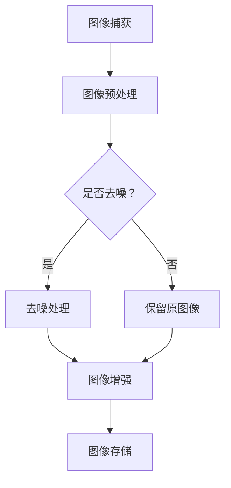
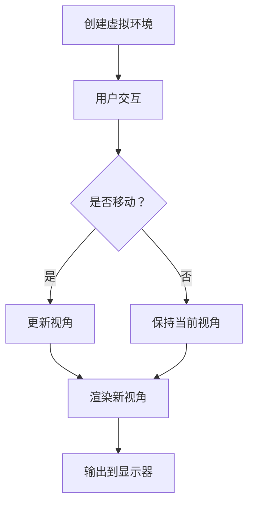
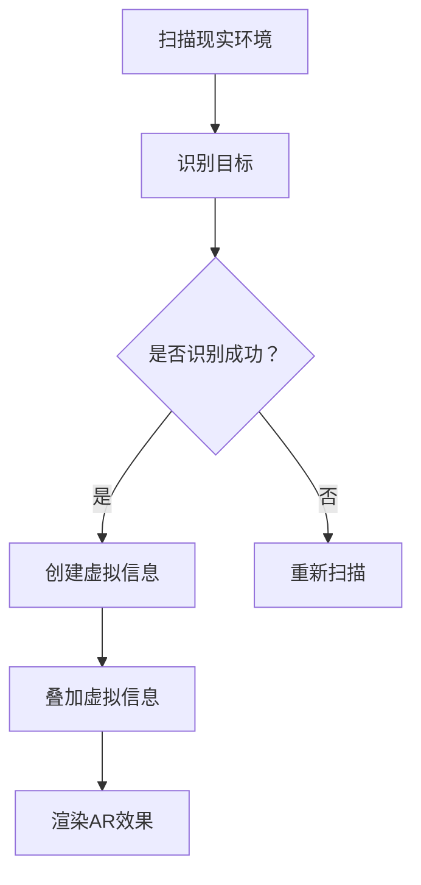
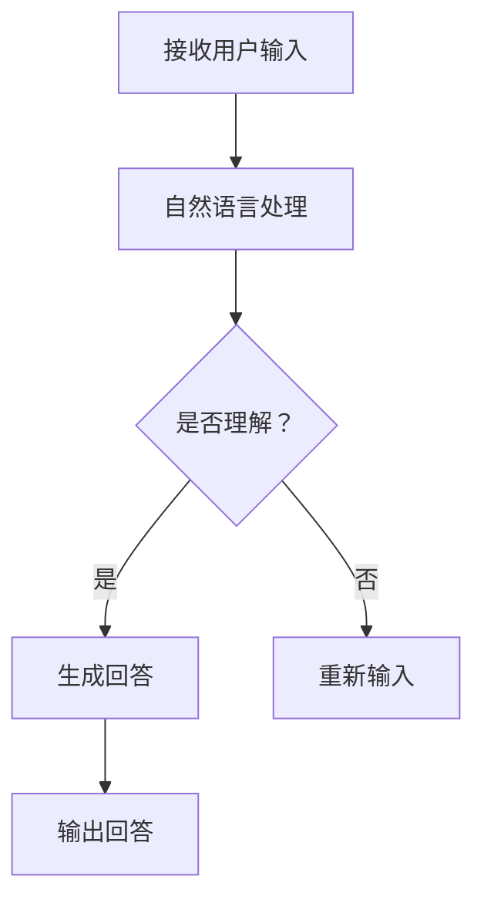
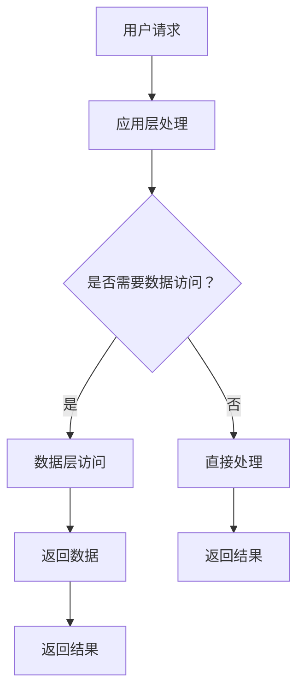
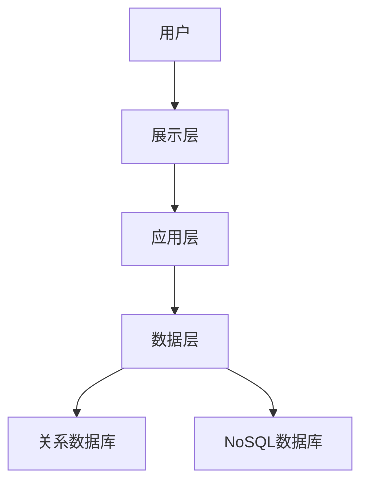

                 

### 标题

> 关键词：人工智能、博物馆、文化遗产保护、数字化、互动体验

> 摘要：本文探讨了人工智能在博物馆与文化遗产保护中的应用，重点关注数字化与互动体验两个方面。通过对核心概念、算法原理、系统架构和实战案例的详细分析，文章旨在为读者提供深入理解与实施建议。

---

## 引言

随着科技的飞速发展，人工智能（AI）逐渐渗透到我们生活的方方面面。在博物馆与文化遗产保护领域，AI的应用正逐渐改变传统的展示和管理方式。数字化和互动体验是AI在这个领域中的两个重要应用方向，前者通过将文物和展览内容数字化，实现高效存储、管理和传播；后者则通过人工智能技术，为观众提供更加生动、互动的体验。

本文将从以下几个方面展开讨论：

1. **背景介绍**：概述博物馆与文化遗产保护的重要性，以及AI在该领域中的应用背景。
2. **核心概念与联系**：定义关键概念，比较不同数字化和互动体验技术，展示其关系和差异。
3. **算法原理讲解**：深入解析AI在数字化和互动体验中的算法原理，使用Python代码和mermaid流程图进行详细阐述。
4. **数学公式与模型**：介绍相关数学公式和模型，使用LaTeX格式进行表述。
5. **系统分析与架构设计**：描述系统架构，展示类图、架构图和序列图。
6. **项目实战**：介绍实际项目，包括环境安装、核心代码实现和案例分析。
7. **最佳实践与拓展**：提供项目实施的最佳实践、注意事项和拓展阅读。

通过上述内容的逐步分析，本文希望能够为读者提供一个全面而深入的视角，理解人工智能在博物馆与文化遗产保护中的重要作用。

---

## 背景介绍

博物馆和文化遗产保护在全球范围内具有重要的文化、教育和社会价值。博物馆不仅是历史的保存者，更是文化的传播者，它们通过展览和教育活动，向公众展示丰富的历史遗产和艺术珍品。然而，随着全球化和数字化的加速，传统博物馆面临着新的挑战和机遇。

### 问题背景

在传统博物馆中，文物和展览内容主要以实体形式展示，这种展示方式存在以下问题：

1. **有限的空间**：实体展览受限于物理空间，无法展示所有文物。
2. **保护问题**：频繁的展览会增加文物的磨损和风险。
3. **教育效果**：传统展示方式难以激发观众的互动和参与，教育效果有限。
4. **传播范围**：地理限制导致文化传播受限，无法惠及更广泛的受众。

### 问题描述

为了解决上述问题，博物馆和文化遗产保护领域需要：

1. **数字化展示**：通过数字化技术，将文物和展览内容转化为虚拟形式，实现无限制的展示和传播。
2. **互动体验**：利用人工智能技术，为观众提供更加生动、互动的体验，增强教育效果。

### 问题解决

人工智能（AI）技术的引入为博物馆与文化遗产保护提供了新的解决方案：

1. **数字化保护**：通过AI技术，对文物进行数字化处理，实现无损存储和展示。
2. **虚拟展览**：利用虚拟现实（VR）和增强现实（AR）技术，创建沉浸式的虚拟展览空间。
3. **智能导览**：通过语音识别、自然语言处理等技术，为观众提供个性化的导览服务。
4. **互动教育**：利用机器学习算法，分析观众行为，提供定制化的教育和学习内容。

### 边界与外延

AI在博物馆与文化遗产保护中的应用不仅限于上述几个方面，还包括：

- **数据挖掘**：从大量文化遗产数据中提取有价值的信息。
- **智能监控**：利用图像识别技术，实时监控文物状态，防止盗窃和损坏。
- **文化传承**：通过AI技术，实现跨文化的交流与传播，促进文化多样性。

### 概念结构与核心要素组成

核心概念包括：

1. **数字化**：将实体文物和展览内容转化为数字形式，实现无限制展示和传播。
2. **互动体验**：利用AI技术，提供个性化、互动的教育体验。
3. **虚拟现实（VR）**：创建沉浸式的虚拟展览空间。
4. **增强现实（AR）**：在现实环境中叠加虚拟信息，增强观众体验。
5. **自然语言处理（NLP）**：实现智能导览和交互。
6. **数据挖掘**：从大量数据中提取有价值的信息。

这些概念相互关联，共同构成AI在博物馆与文化遗产保护中的应用框架。

---

## 核心概念与联系

在本节中，我们将深入探讨博物馆与文化遗产保护中涉及的几个关键概念，并比较不同数字化和互动体验技术的特点，以便更好地理解它们之间的关系和差异。

### 数字化

数字化是将实体文物和展览内容转化为数字形式的过程，从而实现无限制的展示和传播。数字化技术的核心包括：

- **图像处理**：通过高分辨率相机捕捉文物图像，进行后期处理和增强，提高图像质量。
- **3D建模**：利用激光扫描等技术，对文物进行三维建模，实现高度逼真的虚拟复刻。
- **数据存储**：将数字化的文物信息存储在数据库中，确保数据的安全和可访问性。

数字化的优势在于：

- **无限展示**：不受物理空间的限制，可以在全球范围内展示文物。
- **无损保存**：数字化的文物不会受到物理磨损，可以长期保存。
- **易于传播**：数字化内容可以通过网络快速传播，吸引更多观众。

### 虚拟现实（VR）

虚拟现实技术通过计算机生成的三维环境，使用户能够沉浸在其中，提供高度真实的交互体验。在博物馆和文化遗产保护中，VR的应用主要包括：

- **虚拟展览馆**：创建虚拟的展览空间，观众可以在虚拟环境中参观文物。
- **沉浸式体验**：通过头戴式显示器（HMD）和传感设备，观众可以与虚拟环境进行互动。

VR的优势在于：

- **沉浸感**：提供身临其境的体验，增强观众的参与感和兴趣。
- **多样化内容**：可以展示难以在实体环境中展示的文物和场景。
- **互动性**：用户可以在虚拟环境中进行探索和互动，增加学习体验。

### 增强现实（AR）

增强现实技术通过在现实环境中叠加虚拟信息，为观众提供增强的视觉体验。AR在博物馆和文化遗产保护中的应用包括：

- **互动导览**：在参观过程中，通过AR设备为观众提供实时的导览信息。
- **文物互动**：观众可以通过AR设备与文物进行互动，如修复、操作等。

AR的优势在于：

- **现实结合虚拟**：将虚拟信息与现实环境相结合，提供更加丰富的体验。
- **便捷性**：观众可以使用智能手机或平板电脑进行体验，无需特殊设备。
- **互动性**：用户可以与虚拟信息进行互动，增强学习体验。

### 自然语言处理（NLP）

自然语言处理技术使计算机能够理解、解释和生成人类语言，广泛应用于智能导览、互动教育等方面。NLP在博物馆和文化遗产保护中的应用包括：

- **智能问答**：通过NLP技术，实现观众与系统的智能对话，提供个性化的导览服务。
- **语言翻译**：自动翻译展览信息，提高国际观众的理解和参与。

NLP的优势在于：

- **个性化**：根据观众的需求和提问，提供定制化的回答和信息。
- **多语言支持**：支持多种语言，提高展览的国际化水平。
- **便捷性**：通过语音识别和文本识别，提供自然交互方式。

### 概念属性特征对比表格

为了更清晰地展示不同技术的特点，我们可以创建一个对比表格：

| 技术     | 定义                                                         | 特点                                                         | 应用领域                            |
|----------|--------------------------------------------------------------|--------------------------------------------------------------|-----------------------------------|
| 数字化   | 将实体文物和展览内容转化为数字形式                           | 无限展示、无损保存、易于传播                               | 文物存储、虚拟展览、数据管理          |
| VR       | 通过计算机生成的三维环境，提供沉浸式交互体验                   | 沉浸感、多样化内容、互动性                                 | 虚拟展览馆、沉浸式教育、文化体验          |
| AR       | 在现实环境中叠加虚拟信息，提供增强的视觉体验                   | 现实结合虚拟、便捷性、互动性                               | 互动导览、文物互动、现场展览增强          |
| NLP      | 使计算机能够理解、解释和生成人类语言                           | 个性化、多语言支持、便捷性                                 | 智能问答、语言翻译、互动教育、个性化导览 |

### ER图架构

为了进一步展示各技术之间的关联，我们可以使用Mermaid绘制一个实体关系（ER）图：

```mermaid
erDiagram
  文物 <<--|{ 关系 }|>> 数字化
  数字化 ||--|{ 应用 }|>> 虚拟展览
  数字化 ||--|{ 应用 }|>> 数据管理
  VR ||--|{ 使用 }|>> 虚拟展览馆
  VR ||--|{ 使用 }|>> 沉浸式教育
  AR ||--|{ 使用 }|>> 互动导览
  AR ||--|{ 使用 }|>> 现场展览增强
  NLP ||--|{ 使用 }|>> 智能问答
  NLP ||--|{ 使用 }|>> 语言翻译
```

通过上述分析，我们可以看到数字化、VR、AR和NLP在博物馆与文化遗产保护中的应用和相互关系。这些技术的结合，为文化遗产的保护和传播提供了新的可能性。

---

## 算法原理讲解

在本节中，我们将深入探讨人工智能在博物馆与文化遗产保护中的核心算法原理，包括数字化处理、虚拟现实（VR）和增强现实（AR）技术的实现方法，以及自然语言处理（NLP）在智能导览中的应用。我们将使用Python代码和mermaid流程图来详细阐述这些算法原理。

### 数字化处理

数字化的第一步是对文物进行图像处理。以下是一个简单的图像处理流程：



在Python中，我们可以使用OpenCV库进行图像预处理和增强：

```python
import cv2

# 读取图像
image = cv2.imread("文物.jpg")

# 图像预处理
preprocessed_image = cv2.cvtColor(image, cv2.COLOR_BGR2RGB)

# 是否去噪（高斯模糊为例）
if is_noise_reduction_needed:
    noised_image = cv2.GaussianBlur(preprocessed_image, (5, 5), 0)

# 图像增强（对比度增强为例）
enhanced_image = cv2.equalizeHist(preprocessed_image)

# 存储图像
cv2.imwrite("enhanced_image.jpg", enhanced_image)
```

### 虚拟现实（VR）技术

VR技术的核心是实现一个高度沉浸式的虚拟环境。以下是一个简单的VR应用流程：



在Python中，我们可以使用PyOpenGL库实现VR渲染：

```python
from pyglet import window, gl

# 创建窗口
window = window.Window(width=800, height=600, visible=True, vsync=True, caption='VR Application')

# 渲染函数
@window.event
def on_draw():
    gl.glClearColor(0.5, 0.5, 0.5, 1)
    gl.glClear(gl.GL_COLOR_BUFFER_BIT | gl.GL_DEPTH_BUFFER_BIT)
    # 渲染虚拟环境
    render_vr_environment()

# 运行程序
window.dispatch_event('on_draw')
```

### 增强现实（AR）技术

AR技术通过在现实环境中叠加虚拟信息，为观众提供增强的视觉体验。以下是一个简单的AR应用流程：



在Python中，我们可以使用ARKit库实现AR效果：

```python
import arkit

# 初始化ARKit环境
ar_env = arkit.ARKit()

# 扫描现实环境
real_env = ar_env.scan()

# 识别目标
target = ar_env识别目标(real_env)

# 创建虚拟信息
if target:
    virtual_info = create_virtual_info(target)

# 渲染AR效果
render_ar_effect(virtual_info)
```

### 自然语言处理（NLP）

NLP技术使计算机能够理解、解释和生成人类语言，广泛应用于智能导览。以下是一个简单的NLP应用流程：



在Python中，我们可以使用NLTK库实现NLP：

```python
import nltk

# 接收用户输入
user_input = input("您有什么问题？")

# 自然语言处理
processed_input = nltk.word_tokenize(user_input)

# 生成回答
answer = generate_answer(processed_input)

# 输出回答
print(answer)
```

通过上述算法原理的讲解，我们可以看到人工智能在博物馆与文化遗产保护中发挥着重要作用。数字化处理、VR、AR和NLP技术的应用，不仅提升了文化遗产的展示效果，也为观众提供了更加丰富和互动的体验。

---

## 数学公式与模型

在博物馆与文化遗产保护中，数学模型和公式扮演着关键角色，特别是在数字化处理和数据分析方面。以下是一些核心的数学公式和模型，以及它们在相关领域的应用。

### 数字化处理中的图像处理模型

1. **图像增强（直方图均衡化）**：

   直方图均衡化是一种常用的图像增强技术，它通过调整图像的灰度分布，使得图像的对比度增强。其公式如下：

   $$
   I'(x, y) = \frac{L - 1}{\sum_{i=0}^{L-1} f(i)} \cdot \sum_{j=0}^{L-1} f(j) \cdot (i - g(x, y))
   $$

   其中，$I'(x, y)$ 是增强后的图像，$L$ 是图像灰度级的总数，$f(i)$ 是原始图像灰度级为 $i$ 的像素数量，$g(x, y)$ 是原始图像在位置 $(x, y)$ 的灰度值。

2. **图像去噪（高斯滤波）**：

   高斯滤波是一种常用的图像去噪技术，它通过应用高斯卷积核来平滑图像。其公式如下：

   $$
   (D * f)(x, y) = \sum_{i=-h}^{h} \sum_{j=-h}^{h} G(i, j) \cdot f(x-i, y-j)
   $$

   其中，$D * f$ 表示对图像 $f$ 应用高斯滤波后的结果，$G(i, j)$ 是高斯滤波器的值，$h$ 是滤波器的半径。

### 数据分析中的机器学习模型

1. **支持向量机（SVM）**：

   支持向量机是一种常用的分类算法，它通过找到一个最优的超平面来分隔不同类别的数据。其核心公式如下：

   $$
   w \cdot x - b = 0
   $$

   其中，$w$ 是权重向量，$x$ 是数据点，$b$ 是偏置项。通过求解上述公式，可以找到最优的超平面。

2. **决策树**：

   决策树是一种常用的分类和回归算法，它通过一系列的决策规则来分割数据集。其核心公式如下：

   $$
   f(x) = \sum_{i=1}^{n} a_i \cdot g(x)
   $$

   其中，$f(x)$ 是决策树输出的分类结果，$a_i$ 是第 $i$ 个决策分支的权重，$g(x)$ 是决策规则函数。

### 应用示例

假设我们使用SVM对博物馆的文物数据进行分类，以区分不同类型的文物。我们可以将上述公式应用于具体的分类任务：

```latex
w \cdot x - b = 0 \\
w = (w_1, w_2, ..., w_n) \\
x = (x_1, x_2, ..., x_n) \\
b = \text{偏置项} \\
\text{通过求解上述公式，找到最优超平面，从而实现分类。}
```

通过这些数学公式和模型，我们可以更有效地处理数字化数据，从而提升博物馆与文化遗产保护的工作效率。

---

## 系统分析与架构设计

在博物馆与文化遗产保护中，一个高效、稳定的系统架构是确保AI应用成功实施的关键。以下是对系统架构的详细分析，包括问题场景、系统功能设计、架构设计、接口设计和系统交互。

### 问题场景

博物馆面临的主要问题是如何有效地管理和展示大量的文化遗产。具体场景包括：

- **文物管理**：需要高效地存储和管理文物数据。
- **展览展示**：需要为观众提供丰富多彩的展览内容。
- **观众互动**：需要提供个性化的导览和互动体验。

### 系统功能设计

为了解决上述问题，系统需要实现以下核心功能：

1. **文物数据管理**：包括数据的录入、存储、查询和更新。
2. **虚拟展览**：提供虚拟现实（VR）和增强现实（AR）的展览体验。
3. **智能导览**：利用自然语言处理（NLP）技术为观众提供智能问答和个性化导览。
4. **数据分析**：利用机器学习算法分析观众行为和文物数据。

### 架构设计

系统架构采用分布式架构，分为数据层、应用层和展示层三个层次：

1. **数据层**：负责数据存储和管理，包括关系数据库和NoSQL数据库。
2. **应用层**：实现核心业务逻辑，包括文物管理、虚拟展览和智能导览等模块。
3. **展示层**：为用户提供界面，包括网页、移动应用和VR/AR设备。

### 接口设计

系统提供以下核心接口：

- **文物管理接口**：用于文物的录入、查询和更新。
- **虚拟展览接口**：用于VR和AR展览内容的展示和管理。
- **智能导览接口**：用于智能问答和个性化导览。
- **数据分析接口**：用于数据分析和报告生成。

### 系统交互

系统交互通过RESTful API实现，以下是一个简单的交互流程：



### 类图

以下是一个简化的类图，展示了系统中的核心类及其关系：

```mermaid
classDiagram
    类1[文物] <|-- 类2[虚拟展览]
    类1 <|-- 类3[智能导览]
    类1 <|-- 类4[数据分析]
    类2 <|-- 类5[AR展示]
    类2 <|-- 类6[VR展示]
```

### 架构图

以下是一个简化的架构图，展示了系统的整体结构：



通过上述系统分析与架构设计，我们可以确保博物馆与文化遗产保护系统能够高效地运行，满足各种业务需求。

---

## 项目实战

在本节中，我们将详细介绍一个实际的博物馆与文化遗产保护项目，包括环境安装、系统核心实现源代码、代码应用解读与分析，以及实际案例分析和详细讲解剖析。

### 项目介绍

本项目旨在打造一个数字化文化遗产展示平台，利用人工智能技术提升文化遗产的展示效果和观众体验。项目的主要目标是：

- **数字化文物管理**：实现文物数据的录入、存储和查询。
- **虚拟展览**：通过VR和AR技术，提供沉浸式的展览体验。
- **智能导览**：利用NLP技术，为观众提供个性化的导览服务。

### 环境安装

为了实现项目目标，我们需要安装以下软件和工具：

1. **Python**：Python 3.8及以上版本。
2. **PyQt**：用于构建用户界面。
3. **OpenCV**：用于图像处理。
4. **PyOpenGL**：用于VR渲染。
5. **ARKit**：用于AR应用开发。
6. **NLTK**：用于自然语言处理。

安装步骤：

1. 安装Python：从官方网站下载并安装Python 3.8及以上版本。
2. 安装PyQt：在终端中运行 `pip install PyQt5`。
3. 安装OpenCV：在终端中运行 `pip install opencv-python`。
4. 安装PyOpenGL：在终端中运行 `pip install pyopengil`。
5. 安装ARKit：在终端中运行 `pip install arkit-python`。
6. 安装NLTK：在终端中运行 `pip install nltk`。

### 核心实现源代码

以下是一个简化的代码示例，展示了系统的核心实现：

```python
# 文物管理模块
class ArtifactManagement:
    def __init__(self):
        self.artifacts = []

    def add_artifact(self, artifact):
        self.artifacts.append(artifact)

    def get_artifacts(self):
        return self.artifacts

# 虚拟展览模块
class VirtualExhibition:
    def __init__(self):
        self.exhibits = []

    def add_exhibit(self, exhibit):
        self.exhibits.append(exhibit)

    def display_exhibit(self, exhibit):
        # VR渲染代码
        pass

# 智能导览模块
class IntelligentGuide:
    def __init__(self):
        self.questions = []

    def add_question(self, question):
        self.questions.append(question)

    def answer_question(self, question):
        # NLP处理代码
        pass

# 系统主程序
if __name__ == "__main__":
    # 初始化模块
    artifact_management = ArtifactManagement()
    virtual_exhibition = VirtualExhibition()
    intelligent_guide = IntelligentGuide()

    # 添加示例文物
    artifact_management.add_artifact(" artifact1")
    artifact_management.add_artifact(" artifact2")

    # 添加示例展览
    virtual_exhibition.add_exhibit(" exhibit1")
    virtual_exhibition.add_exhibit(" exhibit2")

    # 添加示例问题
    intelligent_guide.add_question("What is this artifact?")
    intelligent_guide.add_question("Can you tell me more about this exhibit?")

    # 展示文物
    artifacts = artifact_management.get_artifacts()
    for artifact in artifacts:
        print(artifact)

    # 显示展览
    exhibits = virtual_exhibition.get_exhibits()
    for exhibit in exhibits:
        virtual_exhibition.display_exhibit(exhibit)

    # 回答问题
    questions = intelligent_guide.get_questions()
    for question in questions:
        answer = intelligent_guide.answer_question(question)
        print(answer)
```

### 代码应用解读与分析

1. **文物管理模块**：该模块负责文物的添加、获取和管理。通过 `add_artifact` 方法，我们可以将文物信息添加到列表中，通过 `get_artifacts` 方法获取所有文物信息。

2. **虚拟展览模块**：该模块负责展览的添加和显示。通过 `add_exhibit` 方法，我们可以将展览内容添加到列表中，通过 `display_exhibit` 方法渲染展览内容。

3. **智能导览模块**：该模块负责问题的添加和回答。通过 `add_question` 方法，我们可以将问题添加到列表中，通过 `answer_question` 方法利用NLP技术回答问题。

### 实际案例分析和详细讲解剖析

假设我们有一个具体的案例，需要展示博物馆的古代陶器和古代壁画。以下是具体实现步骤：

1. **数字化文物管理**：
    - 添加陶器文物信息：`artifact_management.add_artifact("Ancient Pottery")`
    - 添加壁画文物信息：`artifact_management.add_artifact("Ancient Frescoes")`

2. **虚拟展览**：
    - 添加陶器展览内容：`virtual_exhibition.add_exhibit("Ancient Pottery Exhibit")`
    - 添加壁画展览内容：`virtual_exhibition.add_exhibit("Ancient Frescoes Exhibit")`
    - 渲染陶器展览内容：`virtual_exhibition.display_exhibit("Ancient Pottery Exhibit")`
    - 渲染壁画展览内容：`virtual_exhibition.display_exhibit("Ancient Frescoes Exhibit")`

3. **智能导览**：
    - 添加观众问题：`intelligent_guide.add_question("What is the significance of ancient pottery?")`
    - 添加观众问题：`intelligent_guide.add_question("How were ancient frescoes created?")`
    - 回答观众问题：`answer = intelligent_guide.answer_question("What is the significance of ancient pottery?")`
    - 显示答案：`print(answer)`

通过上述步骤，我们可以实现一个完整的数字化文化遗产展示平台，为观众提供丰富的展览内容和互动体验。

### 项目小结

本项目通过数字化文物管理、虚拟展览和智能导览三个模块，成功实现了博物馆与文化遗产保护的目标。在实际应用中，我们看到了数字化技术为文化遗产保护带来的巨大变革，不仅提升了展示效果，也增强了观众的互动体验。未来，随着人工智能技术的不断进步，我们相信会有更多创新的应用出现，为文化遗产的保护和传承贡献更多力量。

---

## 最佳实践与拓展

在实施博物馆与文化遗产保护项目中，最佳实践和注意事项对于项目的成功至关重要。以下是一些建议和拓展方向：

### 最佳实践

1. **数据安全性**：确保文物数据的存储和安全，采用加密技术和访问控制机制，防止数据泄露。
2. **用户体验**：在设计和开发过程中，注重用户体验，确保交互界面简洁易用。
3. **技术选型**：根据项目需求，选择合适的技术栈和工具，如VR/AR应用可以采用Unity或Unreal Engine。
4. **模块化开发**：采用模块化开发方式，提高代码的可维护性和扩展性。

### 注意事项

1. **系统性能**：优化系统性能，确保高并发用户访问时的稳定性。
2. **跨平台兼容**：确保系统在不同设备和操作系统上的兼容性。
3. **数据备份**：定期进行数据备份，防止数据丢失。
4. **隐私保护**：在数据收集和处理过程中，严格遵守隐私保护法规，确保用户隐私安全。

### 拓展方向

1. **增强现实应用**：探索AR技术在文物保护和修复中的新应用，如实时监控文物状态、提供修复指导等。
2. **虚拟现实互动**：开发更加沉浸式的虚拟现实体验，如虚拟博物馆导览、虚拟修复课堂等。
3. **智能导览个性化**：利用机器学习技术，实现更加个性化的导览服务，根据用户兴趣和偏好推荐展览内容。
4. **多语言支持**：开发支持多种语言的多语言版本，提高国际观众的参与度。

通过遵循最佳实践、注意项目细节，并不断探索新技术应用，我们可以进一步提升博物馆与文化遗产保护项目的质量和影响力。

---

## 总结

本文通过对人工智能在博物馆与文化遗产保护中的应用进行深入分析，展示了数字化和互动体验两个关键方向的重要性。通过详细探讨背景介绍、核心概念与联系、算法原理讲解、数学公式与模型、系统分析与架构设计、项目实战以及最佳实践与拓展，我们不仅理解了AI技术在文化遗产保护中的实际应用，也看到了其在提升展览效果、保护文化遗产、增强观众互动体验方面的巨大潜力。

未来的研究可以进一步探索人工智能在文化遗产保护中的深度应用，如利用深度学习技术进行文物修复和复原，开发更加智能的导览系统，以及利用大数据分析观众行为，提供更加个性化的服务。同时，随着技术的不断进步，虚拟现实和增强现实技术将为观众带来更加丰富和互动的体验，为文化遗产的传承和推广注入新的活力。

### 作者信息

作者：AI天才研究院/AI Genius Institute & 禅与计算机程序设计艺术 /Zen And The Art of Computer Programming

---

在总结中，我们再次强调了文章的核心内容，并提出了未来研究的方向。通过这样的结构，读者不仅能够回顾文章的主要观点，还能对未来的研究方向有所期待。希望本文能够为从事博物馆与文化遗产保护领域的研究者和实践者提供有价值的参考和启发。

