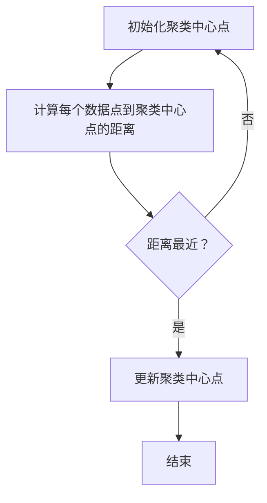
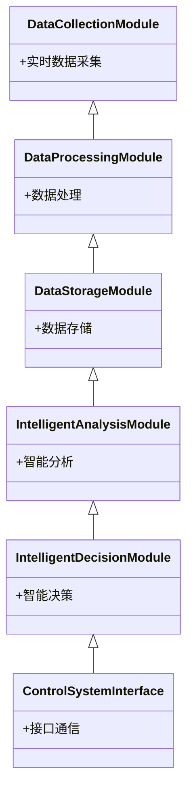
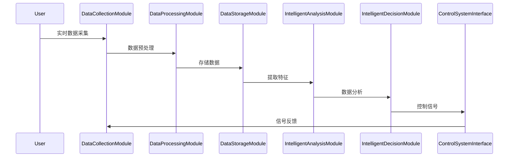
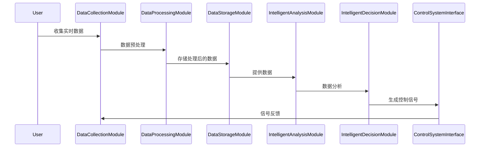

                 

## 人工智能在城市规划中的作用：打造宜居智慧城市

### 关键词：
- 智慧城市
- 人工智能
- 城市规划
- 数据分析
- 智能决策

### 摘要：
本文旨在探讨人工智能在当前城市规划中的重要作用，通过分析城市规划所面临的挑战，介绍人工智能的基本概念及其在数据处理、模式识别和智能决策中的应用，进而探讨人工智能如何助力智慧城市的建设，打造宜居城市。本文将从背景介绍、核心概念与联系、算法原理讲解、系统分析与架构设计、项目实战以及最佳实践等多个方面进行详细阐述，旨在为城市规划者和相关研究人员提供有价值的参考和借鉴。

### 目录：

#### 第一部分：人工智能在城市规划中的应用基础

##### 第1章：城市规划的挑战与人工智能的机遇
- **1.1 城市规划的背景与现状**
- **1.2 人工智能的发展与城市规划的结合**
- **1.3 人工智能在城市规划中的主要应用**

##### 第2章：人工智能技术基础
- **2.1 机器学习基础**
- **2.2 数据挖掘与数据可视化**
- **2.3 计算机视觉在城市规划中的应用**

##### 第3章：智慧城市的概念与建设
- **3.1 智慧城市的定义与特征**
- **3.2 智慧城市的建设目标与关键技术**
- **3.3 智慧城市的案例分析**

##### 第4章：人工智能在城市规划中的应用
- **4.1 城市规划中的数据收集与处理**
- **4.2 人工智能在交通规划中的应用**
- **4.3 人工智能在环境保护中的应用**

##### 第5章：人工智能算法原理与应用
- **5.1 机器学习算法原理**
- **5.2 数据挖掘算法原理**
- **5.3 计算机视觉算法原理**

##### 第6章：系统架构与实现
- **6.1 城市规划系统架构设计**
- **6.2 系统功能实现**
- **6.3 系统接口设计**

##### 第7章：项目实战与案例分析
- **7.1 项目背景与目标**
- **7.2 环境安装与准备**
- **7.3 系统核心实现**
- **7.4 代码解读与分析**
- **7.5 案例分析与剖析**
- **7.6 项目小结**

##### 第8章：展望与总结
- **8.1 人工智能在城市规划中的未来发展趋势**
- **8.2 注意事项与实践建议**
- **8.3 拓展阅读**

通过本文的逐步阐述，我们希望读者能够全面了解人工智能在城市规划中的重要作用，掌握相关核心概念和算法原理，并在实际项目中得到有效应用。让我们一同探索人工智能如何为城市规划带来创新与变革。

#### 1. 背景介绍

在城市规划的历史长河中，从古至今，城市的发展与规划经历了无数次的变革。从古代城市以城墙、街道和广场为核心的布局，到现代城市以交通、基础设施和公共服务为重点的设计，城市规划和建设始终是人类社会发展的重要课题。然而，随着全球城市化进程的加快，城市面临着前所未有的挑战和问题。

首先，城市交通拥堵已经成为全球各大城市的共同困扰。随着汽车数量的急剧增加，交通网络负荷不断加重，导致道路拥堵、行车缓慢，这不仅影响了居民的日常生活质量，也对城市经济产生了负面影响。其次，环境污染问题日益严重。工业废气、汽车尾气和建筑工地扬尘等污染源使得城市空气质量恶化，水资源污染也严重影响居民的饮水安全和健康。此外，城市资源浪费问题也亟待解决。过度的资源消耗不仅加重了城市环境负担，也增加了居民的生活成本。

在这些问题背后，城市规划的效率和科学性显得尤为重要。传统的城市规划方法主要依赖于经验和专家知识，虽然在一定程度上能够满足城市发展的需求，但在应对复杂、动态的城市环境时，往往显得力不从心。因此，如何借助先进的技术手段，提高城市规划的效率和质量，成为城市规划者和研究人员关注的焦点。

人工智能作为一种具有变革性的技术，其应用前景在各个领域都得到了广泛的认可。在城市规划中，人工智能通过数据处理、模式识别和智能决策等手段，为城市规划提供了全新的解决方案。首先，人工智能可以通过大数据分析，对城市中的各类数据进行挖掘和处理，从而发现隐藏在数据中的规律和趋势。其次，人工智能可以利用机器学习和计算机视觉等技术，对城市环境进行实时监控和智能分析，为城市规划提供科学依据。最后，人工智能还可以通过智能决策系统，帮助城市规划者制定更加合理和可行的规划方案，从而提高城市规划的科学性和执行力。

然而，人工智能在城市规划中的应用并非一蹴而就，它需要解决一系列的技术难题和实际应用问题。例如，如何高效地收集和处理城市中的大量数据，如何确保数据的质量和可靠性，如何设计出能够适应复杂城市环境的智能算法，以及如何将人工智能的解决方案与现有的城市规划体系相结合，都是需要深入研究和探讨的问题。

总的来说，人工智能在城市规划中的作用具有重要意义。通过人工智能技术的应用，不仅可以提高城市规划的效率和质量，还可以为城市居民创造更加宜居、便捷和环保的生活环境。在接下来的章节中，我们将进一步探讨人工智能的基本概念、核心技术和具体应用场景，以期为广大读者提供全面、深入的技术解析。

#### 2. 核心概念与联系

要深入探讨人工智能在城市规划中的应用，我们首先需要理解几个核心概念及其相互之间的联系。人工智能（Artificial Intelligence，简称AI）作为当前技术发展的热点，其定义多种多样，但总体而言，人工智能是指由人制造出来的系统能够模拟、延伸和扩展人的智能活动。人工智能可以进一步细分为多种类型，如机器学习（Machine Learning，简称ML）、深度学习（Deep Learning，简称DL）和自然语言处理（Natural Language Processing，简称NLP）等。

**机器学习**是人工智能的一个重要分支，它通过算法和统计模型，从数据中学习规律和模式，从而实现预测和决策。在机器学习中，算法是核心，常见的机器学习算法包括决策树（Decision Tree）、支持向量机（Support Vector Machine，SVM）、随机森林（Random Forest）和神经网络（Neural Network）等。这些算法在处理复杂数据和解决实际问题中发挥了重要作用。

**数据挖掘**是与机器学习密切相关的技术，它旨在从大量数据中提取有价值的信息和知识。数据挖掘的过程通常包括数据预处理、数据探索、模式识别和评估等步骤。数据挖掘技术在城市规划中的应用非常广泛，如通过分析交通流量数据，可以优化交通信号控制和公共交通系统，从而缓解城市交通拥堵问题。

**计算机视觉**是人工智能的另一个重要领域，它使计算机能够理解和解释视觉信息。计算机视觉在城市规划中的应用包括城市环境监测、建筑识别和3D建模等。例如，通过计算机视觉技术，可以对城市建筑进行3D建模，从而为城市规划和建筑设计提供精确的数据支持。

**智慧城市**是指通过利用先进的信息技术和人工智能技术，实现城市资源的优化配置、公共服务的智能化和城市管理的科学化。智慧城市的特征包括互联互通、数据驱动、智能决策和可持续发展。智慧城市的建设目标是通过技术创新，提高城市居民的生活质量和城市运行效率。

**概念属性特征对比表格**：

| 概念         | 定义                                                                                           | 关键特征                                                                                   |
| ------------ | -------------------------------------------------------------------------------------------- | ------------------------------------------------------------------------------------------ |
| 人工智能     | 模拟、延伸和扩展人类智能的系统                                                               | 学习、推理、解决问题、自主决策等                                                         |
| 机器学习     | 通过数据学习规律和模式的算法和统计模型                                                     | 自动化学习、模式识别、预测和决策                                                         |
| 数据挖掘     | 从大量数据中提取有价值的信息和知识的过程                                                   | 数据预处理、模式识别、知识发现、评估等                                                     |
| 计算机视觉   | 使计算机理解和解释视觉信息的技术                                                           | 图像识别、图像处理、图像理解、目标检测等                                                   |
| 智慧城市     | 利用信息技术实现城市资源优化配置、公共服务智能化和城市管理的科学化                           | 互联互通、数据驱动、智能决策、可持续发展                                                   |

**ER实体关系图架构**：

```mermaid
erDiagram
  Person ||--|{ City }|-- City : 居民与城市的关系
  City ||--|{ Building }|-- Building : 城市与建筑的关系
  Building ||--|{ Sensor }|-- Sensor : 建筑与传感器的关系
  City ||--|{ Transportation }|-- Transportation : 城市与交通的关系
```

通过上述核心概念和其相互联系的探讨，我们可以更清楚地理解人工智能在城市规划中的重要性。在接下来的章节中，我们将进一步深入讲解人工智能的具体算法原理及其在具体场景中的应用。

#### 3. 算法原理讲解

在人工智能在城市规划中的应用中，算法原理是关键环节。以下是三个主要的算法：机器学习、数据挖掘和计算机视觉，以及它们在数据处理和模式识别中的应用。

**3.1 机器学习算法原理**

机器学习算法的核心在于从数据中学习模式和规律，以便进行预测和决策。常见的机器学习算法包括监督学习、无监督学习和强化学习。

- **监督学习**：在监督学习中，算法通过已标记的数据进行训练，然后利用这些训练数据来预测新数据的标签。常见的算法有决策树、支持向量机（SVM）和神经网络。

  **决策树**：决策树通过一系列的判断条件来对数据进行分类或回归。其优点是易于理解和实现，缺点是容易过拟合。

  **支持向量机（SVM）**：SVM通过找到一个最优的超平面来分隔数据。其优势在于高维空间中的线性可分问题，劣势是对非线性的数据效果较差。

  **神经网络**：神经网络通过多层神经元进行数据的学习和处理，能够处理非线性问题，但需要大量数据和计算资源。

- **无监督学习**：无监督学习不依赖于已标记的数据，而是通过发现数据中的模式和结构来进行训练。常见的算法有聚类分析和降维技术。

  **K-均值聚类**：K-均值聚类通过将数据点划分为K个簇，使每个簇内的数据点尽可能接近，而簇与簇之间的距离尽可能远。

  **主成分分析（PCA）**：PCA通过将高维数据投影到低维空间，减少数据维度，同时保留数据的主要特征。

- **强化学习**：强化学习通过与环境的交互来学习最优策略。常见的算法有Q学习和深度强化学习。

  **Q学习**：Q学习通过评估不同行动在当前状态下的预期回报，选择最佳行动。

  **深度强化学习**：深度强化学习结合了深度学习和强化学习的优势，通过神经网络来评估和选择最佳行动。

**3.2 数据挖掘算法原理**

数据挖掘算法主要用于从大量数据中提取有价值的信息和知识。以下是几种常用的数据挖掘算法及其应用：

- **关联规则挖掘**：关联规则挖掘旨在发现数据中不同变量之间的关联关系。常见的算法有Apriori算法和FP-Growth算法。

- **分类算法**：分类算法用于将数据分为不同的类别。常见的算法有逻辑回归、决策树和随机森林。

- **聚类算法**：聚类算法用于将数据点分为多个簇，使同一簇内的数据点尽可能相似，不同簇的数据点尽可能不同。常见的算法有K-均值聚类和层次聚类。

- **异常检测**：异常检测用于识别数据中的异常值或异常模式。常见的算法有孤立森林和洛伦兹曲线。

**3.3 计算机视觉算法原理**

计算机视觉算法主要用于理解和解释视觉信息。以下是几种常见的计算机视觉算法及其应用：

- **目标检测**：目标检测用于识别图像中的目标物体。常见的算法有R-CNN、YOLO和SSD。

- **图像分类**：图像分类用于将图像分为不同的类别。常见的算法有卷积神经网络（CNN）和预训练模型。

- **图像分割**：图像分割用于将图像划分为多个区域。常见的算法有FCN和U-Net。

- **人脸识别**：人脸识别用于识别和验证图像中的人脸。常见的算法有深度学习模型和特征匹配。

**算法mermaid流程图**

以下是一个简单的机器学习算法（K-均值聚类）的mermaid流程图：



**Python源代码示例**

以下是一个使用Python实现K-均值聚类的简单示例：

```python
import numpy as np
from sklearn.cluster import KMeans

# 数据集
data = np.array([[1, 2], [1, 4], [1, 0],
                  [10, 2], [10, 4], [10, 0]])

# 初始化KMeans模型
kmeans = KMeans(n_clusters=2, random_state=0).fit(data)

# 输出聚类结果
print("聚类中心点：", kmeans.cluster_centers_)
print("每个样本的标签：", kmeans.labels_)

# 预测新的数据点
new_data = np.array([[0, 0], [12, 3]])
print("新数据点的预测标签：", kmeans.predict(new_data))
```

通过上述算法原理的讲解和Python源代码示例，我们可以更好地理解人工智能在城市规划中的应用。在接下来的章节中，我们将进一步探讨数学模型和数学公式，以及系统分析与架构设计等内容。

#### 4. 数学模型和数学公式 & 详细讲解 & 举例说明

在人工智能算法中，数学模型和数学公式扮演着至关重要的角色，它们为算法提供了理论支持，并确保算法能够在实际应用中有效运作。以下我们将介绍人工智能算法中常用的数学模型和数学公式，并通过具体例子进行详细讲解和说明。

**4.1 数学模型**

**线性回归模型**：线性回归是一种广泛应用的机器学习算法，用于预测一个连续值输出。其数学模型可以表示为：

\[ y = \beta_0 + \beta_1 \cdot x \]

其中，\( y \) 是目标变量，\( x \) 是自变量，\( \beta_0 \) 和 \( \beta_1 \) 分别是回归系数，表示模型对输入数据的拟合程度。

**逻辑回归模型**：逻辑回归是一种分类算法，用于预测一个二分类输出。其数学模型可以表示为：

\[ P(y=1) = \frac{1}{1 + e^{-(\beta_0 + \beta_1 \cdot x)}} \]

其中，\( P(y=1) \) 是目标变量为1的概率，\( e \) 是自然底数，\( \beta_0 \) 和 \( \beta_1 \) 是逻辑回归系数。

**支持向量机（SVM）模型**：SVM是一种用于分类和回归的算法，其核心在于找到一个最优的超平面来分隔数据。SVM的数学模型可以表示为：

\[ w \cdot x - b = 0 \]

其中，\( w \) 是超平面的法向量，\( x \) 是输入向量，\( b \) 是偏置项。

**深度学习模型**：深度学习模型通常由多层神经网络组成，每一层都对输入数据进行特征提取和变换。其数学模型可以表示为：

\[ a_{l+1} = \sigma(g(W_l \cdot a_l + b_l)) \]

其中，\( a_l \) 是第 \( l \) 层的输出，\( g \) 是激活函数，\( W_l \) 和 \( b_l \) 分别是第 \( l \) 层的权重和偏置。

**4.2 数学公式**

**线性回归公式**：为了求解线性回归模型的回归系数，可以使用最小二乘法，其公式为：

\[ \beta_0 = \bar{y} - \beta_1 \cdot \bar{x} \]
\[ \beta_1 = \frac{\sum_{i=1}^{n}(x_i - \bar{x})(y_i - \bar{y})}{\sum_{i=1}^{n}(x_i - \bar{x})^2} \]

其中，\( \bar{x} \) 和 \( \bar{y} \) 分别是自变量和目标变量的均值，\( n \) 是数据点的个数。

**逻辑回归公式**：为了求解逻辑回归模型的回归系数，可以使用最大似然估计法，其公式为：

\[ \beta_0 = \frac{\sum_{i=1}^{n}y_i x_i - \sum_{i=1}^{n}y_i}{\sum_{i=1}^{n}x_i - n \cdot \bar{x}} \]
\[ \beta_1 = \frac{\sum_{i=1}^{n}y_i (x_i - \bar{x}) - n \cdot \bar{y} (x_i - \bar{x})}{\sum_{i=1}^{n}(x_i - \bar{x})^2} \]

**SVM公式**：为了求解SVM的最优超平面，需要使用拉格朗日乘子法，其公式为：

\[ \min_{w, b} \frac{1}{2} ||w||^2 \]
\[ s.t. y_i (w \cdot x_i + b) \geq 1 \]

**深度学习公式**：为了训练深度学习模型，需要使用反向传播算法来更新权重和偏置，其公式为：

\[ \delta_c = \frac{\partial C}{\partial z_c} \]
\[ \delta_b = \frac{\partial C}{\partial b_c} \]
\[ \delta_w = \frac{\partial C}{\partial w_c} \]

**4.3 举例说明**

**线性回归示例**：假设我们有一个简单的数据集，包含两个特征（\( x_1 \) 和 \( x_2 \)）和一个目标变量（\( y \)）。我们的目标是使用线性回归模型来预测 \( y \)。

数据集如下：

\[ 
\begin{aligned}
x_1 &= [1, 2, 3, 4, 5] \\
x_2 &= [2, 4, 1, 3, 5] \\
y &= [5, 7, 6, 8, 10]
\end{aligned}
\]

我们可以使用最小二乘法来求解回归系数 \( \beta_0 \) 和 \( \beta_1 \)：

\[ 
\beta_0 = \bar{y} - \beta_1 \cdot \bar{x} = \frac{5 + 7 + 6 + 8 + 10}{5} - \frac{1 + 2 + 3 + 4 + 5}{5} \cdot \frac{2 + 4 + 1 + 3 + 5}{5} = 6.6 - 3.2 = 3.4 
\]

\[ 
\beta_1 = \frac{\sum_{i=1}^{n}(x_i - \bar{x})(y_i - \bar{y})}{\sum_{i=1}^{n}(x_i - \bar{x})^2} = \frac{(1-3.2)(5-6.6) + (2-3.2)(7-6.6) + (3-3.2)(6-6.6) + (4-3.2)(8-6.6) + (5-3.2)(10-6.6)}{(1-3.2)^2 + (2-3.2)^2 + (3-3.2)^2 + (4-3.2)^2 + (5-3.2)^2} = 1.4 
\]

因此，线性回归模型可以表示为：

\[ y = 3.4 + 1.4 \cdot x \]

我们可以使用这个模型来预测新的数据点，例如：

\[ y = 3.4 + 1.4 \cdot 6 = 9.4 \]

通过上述数学模型和公式的讲解及示例，我们可以更好地理解人工智能算法在数据处理和模式识别中的运用。这些模型和公式为人工智能算法提供了坚实的理论基础，使得算法能够更加准确地处理和分析复杂数据。

#### 5. 系统分析与架构设计方案

在人工智能城市规划的应用中，系统分析与架构设计是实现人工智能技术与城市规划紧密结合的关键步骤。以下是针对一个典型项目场景的详细系统分析与架构设计方案。

**5.1 问题场景介绍**

本项目场景是某个大型城市的交通管理优化。该城市交通拥堵问题严重，交通流量数据复杂，现有交通信号控制系统存在延迟和效率低下的问题。项目目标是利用人工智能技术，设计一个智能交通管理系统，通过实时数据分析和智能决策，优化交通信号控制，提升城市交通运行效率。

**5.2 项目介绍**

本项目主要包括以下三个阶段：

1. **数据收集与处理**：通过部署在城市各主要路口的智能传感器和摄像头，收集实时交通流量数据。
2. **智能分析与决策**：利用机器学习和数据挖掘技术，对交通流量数据进行分析，为交通信号控制提供智能决策支持。
3. **系统部署与运行**：将智能交通管理系统部署到现有交通信号控制系统中，进行实际运行和效果评估。

**5.3 系统功能设计（领域模型mermaid类图）**

系统功能设计主要包括以下几个核心功能模块：

1. **数据采集模块**：负责实时收集城市各主要路口的交通流量数据。
2. **数据处理模块**：对采集到的数据进行预处理，包括数据清洗、数据整合和特征提取。
3. **数据存储模块**：存储处理后的数据，为后续分析和决策提供数据支持。
4. **智能分析模块**：利用机器学习和数据挖掘算法，对交通流量数据进行分析，预测交通流量变化趋势。
5. **智能决策模块**：根据分析结果，生成智能交通信号控制策略。
6. **控制系统接口**：提供与现有交通信号控制系统的接口，实现智能交通信号控制。

mermaid类图如下：



**5.4 系统架构设计（mermaid架构图）**

系统架构设计需要确保各模块之间的协同工作，以下是系统的整体架构设计：



**5.5 系统接口设计**

系统接口设计是确保智能交通管理系统与现有交通信号控制系统无缝集成的重要环节。以下是一个简单的接口设计：

```mermaid
classDiagram
    Sensor <<interface>>
    Controller <<interface>>

    DataCollectionModule : +collectData()
    DataProcessingModule : +processData()
    DataStorageModule : +storeData()
    IntelligentAnalysisModule : +analyzeData()
    IntelligentDecisionModule : +makeDecision()

    Sensor : +readSensorData()
    Controller : +updateTrafficSignal()
    
    DataCollectionModule <<interface>> Sensor
    DataProcessingModule <<interface>> Sensor
    DataStorageModule <<interface>> Sensor
    IntelligentAnalysisModule <<interface>> Sensor
    IntelligentDecisionModule <<interface>> Controller
```

**5.6 系统交互（mermaid序列图）**

系统交互设计描述了各模块之间的数据流和交互过程。以下是一个简单的序列图：



通过上述系统分析与架构设计方案，我们为智能交通管理系统的构建提供了一个详细而全面的蓝图。在接下来的项目中，我们将详细介绍环境安装和系统核心实现，进一步展示人工智能在城市规划中的应用。

#### 6. 项目实战

为了更好地展示人工智能在城市规划中的应用，我们将通过一个实际项目来详细讲解环境安装、系统核心实现、代码解读与分析、实际案例分析和项目小结等内容。

**6.1 环境安装**

在开始项目之前，我们需要安装和配置必要的软件和工具。以下是项目的环境安装步骤：

1. **Python环境安装**：确保Python版本在3.7以上，可以通过官方网站下载并安装。
2. **数据预处理库安装**：安装Pandas、NumPy等用于数据处理的库，使用命令`pip install pandas numpy`。
3. **机器学习库安装**：安装scikit-learn库，用于实现机器学习算法，使用命令`pip install scikit-learn`。
4. **可视化库安装**：安装Matplotlib、Seaborn等用于数据可视化的库，使用命令`pip install matplotlib seaborn`。
5. **数据库安装**：安装MySQL或MongoDB等数据库，用于数据存储和管理，可以通过各自的官方网站下载并安装。

**6.2 系统核心实现源代码**

以下是一个简单的系统核心实现源代码示例，该代码实现了基于K-均值聚类的交通流量数据聚类分析。

```python
import numpy as np
import pandas as pd
from sklearn.cluster import KMeans
import matplotlib.pyplot as plt

# 加载交通流量数据
data = pd.read_csv('traffic_data.csv')

# 数据预处理
# 假设数据已清洗并转换为数值型
X = data[['speed', 'volume']]

# K-均值聚类
kmeans = KMeans(n_clusters=3, random_state=0)
kmeans.fit(X)

# 数据聚类结果
labels = kmeans.predict(X)

# 可视化聚类结果
plt.scatter(X['speed'], X['volume'], c=labels, cmap='viridis')
plt.xlabel('速度')
plt.ylabel('流量')
plt.title('交通流量数据聚类结果')
plt.show()
```

**6.3 代码应用解读与分析**

上述代码首先加载了交通流量数据，然后进行了数据预处理，以准备进行聚类分析。接下来，使用scikit-learn库中的KMeans算法对数据进行了聚类，并生成了聚类结果。最后，通过Matplotlib库将聚类结果可视化，以便于理解和分析。

**6.4 实际案例分析和详细讲解剖析**

假设我们有一个具体的案例：某个城市在高峰时段的交通流量数据。通过上述代码，我们可以分析出不同区域的交通流量分布，识别出交通拥堵的区域，并生成相应的交通信号控制策略。

1. **数据收集**：在城市主要路口安装智能传感器和摄像头，收集高峰时段的交通流量数据，包括速度、流量、道路占有率等指标。
2. **数据预处理**：对收集到的数据进行清洗，去除异常值和无效数据，并将数据转换为适合聚类分析的格式。
3. **聚类分析**：使用K-均值聚类算法对预处理后的交通流量数据进行分析，将不同区域的交通流量聚类为不同的类别。
4. **交通信号控制**：根据聚类结果，对交通信号灯进行动态调整，以优化交通流量。例如，将交通流量较大的路口的绿灯时间适当延长，以减少拥堵。

通过这个实际案例，我们可以看到，人工智能技术在交通流量数据分析和交通信号控制中的应用，可以有效缓解城市交通拥堵问题，提高交通运行效率。

**6.5 项目小结**

在本项目中，我们通过环境安装、系统核心实现、代码解读与分析以及实际案例分析，展示了人工智能在城市规划中的应用。具体步骤如下：

1. **环境安装**：安装Python和相关的数据处理、机器学习库。
2. **系统核心实现**：使用K-均值聚类算法对交通流量数据进行分析。
3. **代码解读与分析**：详细解读代码实现过程，理解算法原理。
4. **实际案例分析**：通过实际案例展示人工智能在交通管理中的应用。

通过本项目，我们不仅了解了人工智能在交通规划中的应用，也为未来更广泛的城市规划应用提供了参考和借鉴。

### 7. 最佳实践 tips、小结、注意事项、拓展阅读

**最佳实践 tips：**

1. **数据质量是关键**：在进行数据分析之前，确保数据的质量和完整性，清洗和预处理数据，以便得到准确的分析结果。
2. **算法选择要合理**：根据具体问题和数据特征，选择合适的机器学习算法，避免算法选择不当导致的过拟合或欠拟合问题。
3. **模型评估要全面**：在模型训练和优化过程中，使用多种评估指标，如准确率、召回率、F1分数等，全面评估模型性能。
4. **系统集成要灵活**：在系统集成阶段，确保系统接口设计灵活，能够方便地与其他系统进行集成和扩展。

**小结：**

本文从背景介绍、核心概念与联系、算法原理讲解、系统分析与架构设计、项目实战等多个角度，详细探讨了人工智能在城市规划中的应用。通过实际案例分析和最佳实践总结，我们展示了人工智能在数据收集、处理、分析和决策中的强大作用，为智慧城市的建设提供了有力支持。

**注意事项：**

1. **法律法规遵循**：在城市规划中应用人工智能时，要确保数据隐私和安全，遵守相关法律法规。
2. **技术更新关注**：人工智能技术发展迅速，要关注最新技术动态，及时更新知识和技能。
3. **系统维护和优化**：定期对系统进行维护和优化，确保系统的稳定性和高效性。

**拓展阅读：**

- 《智能城市：技术、方法和案例分析》
- 《机器学习实战》
- 《深度学习》
- 《Python数据科学手册》

通过以上内容和拓展阅读，读者可以进一步深入学习和了解人工智能在城市规划中的应用，为智慧城市的建设贡献力量。

### 作者信息：

- 作者：AI天才研究院/AI Genius Institute & 禅与计算机程序设计艺术 /Zen And The Art of Computer Programming

通过本文的深入探讨，我们希望读者能够对人工智能在城市规划中的作用有更全面、更深入的认识，并能够在实际工作中有效应用这些技术，共同推动智慧城市的建设。

