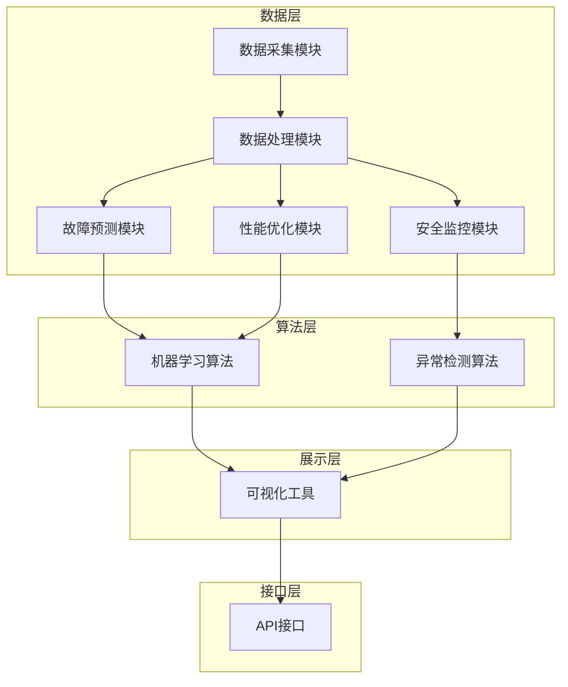
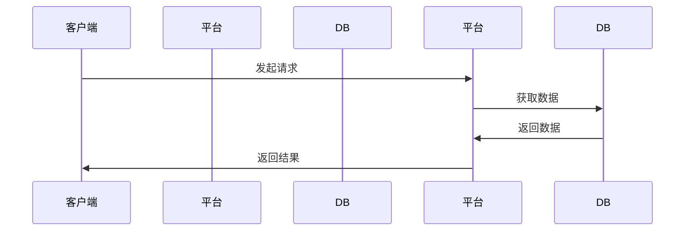
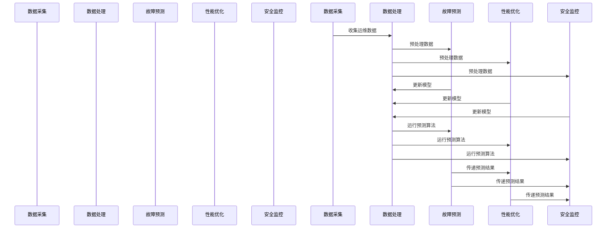

                 


## 人工智能在技术管理中的应用

### 1.1 问题背景

在当今信息化、数字化快速发展的时代，人工智能（AI）已经成为推动技术进步和产业升级的重要力量。随着深度学习、大数据、云计算等技术的迅猛发展，AI的应用场景日益丰富，从早期的辅助决策、自动化控制到如今的服务机器人、自动驾驶等，AI已经深入到社会的各个领域。特别是在技术管理领域，AI的应用不仅提高了管理效率，还为企业带来了显著的经济效益。

然而，尽管AI技术已经在许多行业中取得了显著成果，但其在技术管理中的应用仍然面临诸多挑战。如何将AI技术与企业的具体管理需求相结合，如何设计出既高效又可行的AI应用方案，成为当前技术管理者亟待解决的问题。

### 1.2 问题描述

AI在技术管理中的应用挑战主要表现在以下几个方面：

1. **数据获取与处理**：技术管理涉及大量数据，如何高效地获取、处理和利用这些数据，是AI在技术管理中应用的关键。

2. **算法选择与优化**：AI算法种类繁多，如何在特定技术管理场景中选择合适的算法，并对其进行优化，是保证AI应用效果的关键。

3. **系统架构设计**：AI系统需要与其他技术系统进行集成，如何设计一个既灵活又高效的系统架构，是技术管理中AI应用的一大挑战。

4. **人才培养与培训**：AI技术在技术管理中的应用需要专业人才的支持，如何培养和培训现有的技术管理人员，使他们能够适应AI技术的要求，是当前的一个重要问题。

### 1.3 问题解决

为了解决上述问题，本书将从以下几个方面进行探讨：

1. **核心概念与联系**：介绍人工智能在技术管理中的应用基础，包括AI的基本概念、原理及其在技术管理中的核心作用。

2. **算法原理讲解**：详细讲解人工智能在技术管理中常用的算法原理，并通过Python代码和数学模型进行阐述。

3. **系统分析与架构设计方案**：介绍如何进行AI系统分析、架构设计和接口设计，为实际应用提供理论指导。

4. **项目实战**：通过实际项目案例，展示如何将AI技术应用于技术管理，并提供详细的实现过程和代码解读。

5. **最佳实践与拓展**：总结AI在技术管理中的应用经验，提供最佳实践建议，并对未来的发展趋势进行展望。

### 1.4 边界与外延

本书主要关注人工智能在技术管理中的应用，包括但不限于以下几个方面：

- **AI技术在项目管理中的应用**：如项目进度预测、风险评估、资源调度等。
- **AI技术在运维管理中的应用**：如故障预测、性能优化、安全性管理等。
- **AI技术在安全管理中的应用**：如网络安全威胁检测、隐私保护等。
- **AI技术在质量管理中的应用**：如质量检测、缺陷预测、客户满意度分析等。

同时，本书还将涉及一些与AI技术相关的跨领域知识，如数据科学、机器学习等，以便读者能够全面了解AI在技术管理中的应用。

### 1.5 概念结构与核心要素组成

- **人工智能**：模拟、延伸和扩展人的智能的理论、方法、技术及应用系统。
- **技术管理**：对技术项目的计划、组织、协调、控制和评价等活动进行管理。
- **算法原理**：人工智能技术中的计算方法和模型。
- **系统架构**：AI系统的整体结构设计。
- **项目实战**：实际应用AI技术解决技术管理问题的案例。

通过上述核心概念和要素的有机组合，本书将为读者提供一个全面、系统的AI在技术管理中的应用指南。

## 第二部分：核心概念与联系

在深入探讨人工智能在技术管理中的应用之前，我们需要首先明确几个核心概念，并探讨它们之间的联系。

### 第2章 人工智能在技术管理中的核心概念与联系

#### 2.1 人工智能的基本概念

#### 2.1.1 人工智能的定义

人工智能（Artificial Intelligence，简称AI）是指由人创造的理论、方法、技术和系统，使计算机具备类似人类智能的能力。它包括感知、学习、推理、决策、理解等多个方面。简单来说，AI的目的是让计算机能够完成通常需要人类智能的任务。

#### 2.1.2 人工智能的原理

人工智能的原理主要基于机器学习、深度学习、自然语言处理等核心技术。这些技术通过构建数学模型和算法，使计算机能够从数据中学习和提取知识，实现智能化的决策。以下是几种主要的人工智能原理：

1. **机器学习**：通过训练数据集，使计算机能够识别模式和关系，并据此做出预测或决策。
2. **深度学习**：基于多层神经网络，通过逐层提取特征，实现复杂的模式识别和决策。
3. **自然语言处理**：使计算机能够理解和生成人类语言，实现人与机器的交互。

#### 2.1.3 人工智能的特点

人工智能具有自主学习、自动进化、自适应和自组织等特点，能够不断优化自身性能，提高工作效率。以下是人工智能的一些主要特点：

- **自主学习**：通过学习算法，计算机可以从数据中学习，提高性能。
- **自动进化**：随着算法和数据量的增加，计算机的性能可以不断提高。
- **自适应**：计算机可以根据环境变化，调整自己的行为。
- **自组织**：计算机可以自动构建复杂的系统，无需人为干预。

#### 2.1.4 人工智能的应用领域

人工智能的应用领域非常广泛，包括但不限于以下方面：

- **计算机视觉**：图像识别、物体检测、图像分割等。
- **语音识别**：语音输入、语音合成等。
- **自然语言处理**：文本分类、情感分析、机器翻译等。
- **决策支持系统**：优化决策过程，提高决策质量。
- **智能机器人**：自主导航、人机交互、任务执行等。
- **智能交通**：交通流量预测、路线规划、自动驾驶等。
- **金融风控**：信用评估、风险预警、投资建议等。

#### 2.1.5 人工智能的发展历程

人工智能的发展历程可以分为以下几个阶段：

1. **早期探索（1956年-1974年）**：人工智能概念的提出和初步研究。
2. **繁荣时期（1980年-1987年）**：专家系统和知识工程的发展。
3. **衰退与复兴（1987年-2012年）**：人工智能的第一次衰退和深度学习的兴起。
4. **快速发展（2012年至今）**：深度学习、大数据、云计算等技术的推动，人工智能进入新的繁荣期。

#### 2.1.6 人工智能的核心算法

人工智能的核心算法包括但不限于以下几种：

- **监督学习**：通过已标记的数据集进行训练，预测新数据的标签。
- **无监督学习**：在没有标记的数据集上进行训练，自动发现数据中的模式。
- **强化学习**：通过试错和奖励机制，学习在特定环境中做出最优决策。

#### 2.1.7 人工智能的发展趋势

人工智能的发展趋势包括但不限于以下方面：

- **算法优化**：提高算法的效率和准确性。
- **硬件加速**：使用专用硬件（如GPU、TPU）加速AI计算。
- **跨领域融合**：与其他领域（如生物医学、社会科学等）的融合，推动AI应用的多样化。
- **数据隐私与安全**：保护用户数据隐私，确保AI系统的安全性。

### 2.2 技术管理的概念与原理

#### 2.2.1 技术管理的定义

技术管理是指对技术项目的计划、组织、协调、控制和评价等活动进行管理，以确保项目目标的实现。技术管理涉及多个方面，包括项目管理、系统开发、系统集成、运维管理等。

#### 2.2.2 技术管理的原理

技术管理的原理主要包括以下几个方面：

1. **项目管理**：通过制定项目计划、分配资源、监控进度、控制风险等，确保项目按时、按质、按预算完成。
2. **系统开发**：通过需求分析、系统设计、编码、测试等，开发出满足用户需求的技术系统。
3. **系统集成**：将不同的技术系统进行整合，实现功能互补，提高系统整体性能。
4. **运维管理**：通过监控、维护、优化等，确保技术系统的稳定运行。

#### 2.2.3 技术管理的特点

技术管理具有以下几个特点：

- **跨学科性**：技术管理涉及多个学科领域，如计算机科学、管理学、经济学等。
- **复杂性**：技术项目通常涉及多个环节，需要协调多个利益相关者。
- **创新性**：技术管理需要不断创新，以应对不断变化的技术环境和市场需求。

#### 2.2.4 技术管理的发展历程

技术管理的发展历程可以分为以下几个阶段：

1. **传统管理阶段（1950年-1980年）**：以项目管理为中心，强调计划和控制。
2. **系统管理阶段（1980年-2000年）**：强调系统开发、系统集成和运维管理。
3. **敏捷管理阶段（2000年至今）**：以用户为中心，强调快速迭代和持续交付。

#### 2.2.5 技术管理的核心方法

技术管理的核心方法包括但不限于以下几种：

- **项目管理方法**：如PMBOK（项目管理知识体系）、敏捷开发等。
- **系统开发方法**：如瀑布模型、迭代开发等。
- **运维管理方法**：如ITIL（信息技术基础设施库）、DevOps等。

### 2.3 人工智能与技术在技术管理中的联系

#### 2.3.1 人工智能在技术管理中的应用

人工智能在技术管理中的应用主要体现在以下几个方面：

1. **项目管理**：利用AI技术进行项目进度预测、风险评估、资源调度等，提高项目管理的效率和准确性。
2. **系统开发**：利用AI技术进行代码审查、测试自动化、系统优化等，提高系统开发的质量和效率。
3. **运维管理**：利用AI技术进行故障预测、性能优化、安全管理等，提高运维管理的效率和稳定性。
4. **安全与隐私**：利用AI技术进行安全威胁检测、隐私保护等，提高系统的安全性和可靠性。

#### 2.3.2 技术管理在人工智能中的应用

技术管理在人工智能中的应用主要体现在以下几个方面：

1. **AI项目开发**：技术管理者需要制定AI项目计划、组织专业团队、协调各方资源，确保AI项目的顺利实施。
2. **AI系统运维**：技术管理者需要监控AI系统的运行状态、优化系统性能、确保系统安全。
3. **AI人才培养**：技术管理者需要培养和培训AI专业人才，提高团队的技术水平。

#### 2.3.3 人工智能与技术在技术管理中的核心要素

人工智能与技术在技术管理中的核心要素包括：

- **数据**：AI技术的基础是数据，技术管理需要确保数据的准确性和可靠性。
- **算法**：AI技术依赖于算法，技术管理需要选择合适的算法并对其进行优化。
- **系统架构**：AI技术需要与其他技术系统集成，技术管理需要设计合适的系统架构。
- **团队协作**：技术管理需要组织专业团队，确保项目顺利实施。

通过上述核心概念和要素的有机组合，技术管理者和AI开发者可以更好地将AI技术应用于技术管理，提高管理效率，实现技术突破。

### 2.4 人工智能与技术在技术管理中的核心要素

为了更好地理解人工智能在技术管理中的应用，我们需要明确几个核心要素，并探讨它们之间的关系。

#### 2.4.1 数据

数据是人工智能（AI）的基石。在技术管理中，数据的收集、处理和分析至关重要。以下是对数据的一些核心要素的详细说明：

- **数据质量**：确保数据的准确性、完整性和一致性。高质量的数据是准确分析和预测的前提。
- **数据来源**：包括内部数据和外部数据。内部数据来源于企业的运营和业务系统，外部数据可以从公共数据库、社交媒体和其他来源获取。
- **数据处理**：包括数据清洗、转换、归一化等步骤。数据处理的质量直接影响AI模型的性能。
- **数据存储**：采用高效、安全的存储方案，如关系数据库、NoSQL数据库、分布式存储系统等。

#### 2.4.2 算法

算法是AI技术的核心。在技术管理中，选择合适的算法并对其进行优化至关重要。以下是对算法的一些核心要素的详细说明：

- **算法类型**：包括监督学习、无监督学习、强化学习等。根据具体应用场景选择合适的算法。
- **算法优化**：通过调整参数、增加数据、改进模型结构等方法，提高算法的性能。
- **算法评估**：采用交叉验证、ROC曲线、AUC值等指标评估算法的性能。
- **算法可解释性**：对于复杂的算法，如深度学习模型，需要确保其决策过程的可解释性，以便技术管理者理解和信任。

#### 2.4.3 系统架构

系统架构是AI系统的基础。在技术管理中，设计一个灵活、高效、可扩展的系统架构至关重要。以下是对系统架构的一些核心要素的详细说明：

- **模块化设计**：将系统划分为多个模块，每个模块负责特定的功能，便于维护和扩展。
- **分布式计算**：利用分布式计算框架（如Hadoop、Spark）处理大规模数据，提高系统的处理能力。
- **微服务架构**：采用微服务架构，将系统划分为多个独立的微服务，提高系统的灵活性和可扩展性。
- **自动化运维**：利用自动化工具（如Kubernetes、Docker）进行系统的部署、监控和运维，提高系统的稳定性和效率。

#### 2.4.4 团队协作

团队协作是成功实施AI项目的关键。在技术管理中，有效的团队协作至关重要。以下是对团队协作的一些核心要素的详细说明：

- **跨职能团队**：由数据科学家、算法工程师、产品经理、运维工程师等多角色组成的团队，共同推动项目的进展。
- **沟通机制**：建立有效的沟通机制，确保团队成员之间的信息流通和协作。
- **敏捷开发**：采用敏捷开发方法，快速迭代，及时响应需求变化。
- **持续集成与持续交付**：采用CI/CD流程，确保代码的稳定性和系统的可交付性。

通过以上核心要素的有机结合，技术管理者和AI开发者可以更好地将AI技术应用于技术管理，提高管理效率，实现技术突破。

## 第2章 人工智能在技术管理中的核心概念与联系

### 2.1 人工智能的基本概念

#### 2.1.1 人工智能的定义

人工智能（Artificial Intelligence，简称AI）是指通过计算机程序实现的人类智能的模拟和扩展。它不仅仅是一个概念，更是一种技术手段，旨在使计算机具备类似于人类的感知、理解、推理和决策能力。

#### 2.1.2 人工智能的原理

人工智能的原理主要基于以下几个核心概念：

1. **机器学习**：机器学习是人工智能的基础，它通过算法和统计模型，使计算机能够从数据中学习和改进。

2. **深度学习**：深度学习是一种特殊的机器学习方法，它通过多层神经网络结构来模拟人脑的学习过程，能够处理复杂的输入数据。

3. **自然语言处理**：自然语言处理是使计算机能够理解和生成自然语言的技术，它包括文本分析、语音识别、机器翻译等。

4. **计算机视觉**：计算机视觉是使计算机能够“看”和理解视觉信息的技术，它包括图像识别、物体检测、人脸识别等。

#### 2.1.3 人工智能的特点

人工智能具有以下几个显著特点：

1. **自主学习**：通过机器学习算法，人工智能系统能够从数据中学习，不断优化自身性能。

2. **自动进化**：随着数据量的积累和学习过程的进行，人工智能系统能够自动进化，提高解决复杂问题的能力。

3. **自适应**：人工智能系统能够根据环境和任务的变化，自适应地调整自己的行为和策略。

4. **跨领域应用**：人工智能技术可以广泛应用于各个领域，如医疗、金融、交通、教育等。

#### 2.1.4 人工智能的应用领域

人工智能的应用领域非常广泛，主要包括：

1. **智能制造**：利用人工智能技术进行生产过程的自动化和优化。

2. **智能医疗**：利用人工智能进行疾病诊断、治疗规划和药物研发。

3. **智能交通**：利用人工智能进行交通流量预测、路况分析和自动驾驶。

4. **智能金融**：利用人工智能进行风险控制、投资决策和客户服务。

5. **智能客服**：利用人工智能提供24/7的智能客服支持。

6. **智能教育**：利用人工智能进行个性化教学和学习分析。

### 2.2 技术管理的概念与原理

#### 2.2.1 技术管理的定义

技术管理是指对技术项目的计划、组织、协调、控制和评价等活动进行管理，以确保项目目标的实现。技术管理不仅涉及技术的研发和应用，还包括项目管理、团队协作、资源调度等多个方面。

#### 2.2.2 技术管理的原理

技术管理的原理主要包括以下几个核心方面：

1. **项目计划**：通过项目计划，明确项目目标、任务、资源分配和时间安排。

2. **团队协作**：通过有效的沟通和协作机制，确保团队成员之间的信息流通和工作协调。

3. **风险管理**：通过识别和评估风险，制定相应的应对策略，降低项目风险。

4. **质量控制**：通过质量管理和控制措施，确保项目交付的产品或服务符合质量标准。

5. **持续改进**：通过持续反馈和改进，提高项目的管理效率和效果。

#### 2.2.3 技术管理的特点

技术管理具有以下几个显著特点：

1. **跨学科性**：技术管理涉及多个学科领域，如计算机科学、工程学、管理学等。

2. **复杂性**：技术项目通常涉及多个环节，需要协调多个利益相关者。

3. **创新性**：技术管理需要不断创新，以应对技术快速发展和市场需求的变化。

#### 2.2.4 技术管理的发展历程

技术管理的发展历程可以分为以下几个阶段：

1. **早期阶段（1950s-1970s）**：以项目管理和资源管理为核心。

2. **系统管理阶段（1970s-1990s）**：强调系统开发、集成和运维管理。

3. **敏捷管理阶段（2000s-至今）**：强调快速迭代、用户反馈和持续交付。

### 2.3 人工智能与技术在技术管理中的联系

#### 2.3.1 人工智能在技术管理中的应用

人工智能在技术管理中的应用主要体现在以下几个方面：

1. **项目管理**：利用人工智能进行项目进度预测、资源调度和风险控制。

2. **系统开发**：利用人工智能进行代码审查、测试自动化和性能优化。

3. **运维管理**：利用人工智能进行故障预测、性能优化和安全管理。

4. **质量管理**：利用人工智能进行质量检测、缺陷预测和客户满意度分析。

#### 2.3.2 技术管理在人工智能中的应用

技术管理在人工智能中的应用主要体现在以下几个方面：

1. **AI项目开发**：技术管理者需要制定AI项目计划、组织专业团队和协调各方资源。

2. **AI系统运维**：技术管理者需要监控AI系统的运行状态、优化系统性能和确保系统安全。

3. **AI人才培养**：技术管理者需要培养和培训AI专业人才，提高团队的技术水平。

### 2.4 人工智能与技术在技术管理中的核心要素

人工智能与技术在技术管理中的核心要素包括：

1. **数据**：高质量的数据是人工智能的基础，也是技术管理的关键。

2. **算法**：选择合适的算法并进行优化，是确保AI系统有效性的关键。

3. **系统架构**：设计合适的系统架构，确保AI系统能够高效地运行和扩展。

4. **团队协作**：建立高效的团队协作机制，确保AI项目的顺利实施。

通过以上核心要素的有机结合，技术管理者可以更好地将人工智能应用于技术管理，提高管理效率和项目成功率。

## 2.5 概念属性特征对比表格

为了更好地理解人工智能（AI）和技术管理（TM）之间的概念属性特征，我们可以通过一个对比表格来展示两者在以下几个方面的主要特点：

### 2.5.1 概念属性特征对比表格

| 特征类别 | 人工智能（AI） | 技术管理（TM） |
| --- | --- | --- |
| **定义** | 通过机器学习、深度学习等实现人类智能的模拟和扩展。 | 对技术项目进行计划、组织、协调、控制和评价等活动，确保项目目标的实现。 |
| **核心原理** | 机器学习、深度学习、自然语言处理、计算机视觉等。 | 项目管理、系统开发、系统集成、运维管理、风险管理、质量控制等。 |
| **特点** | 自主学习、自动进化、自适应、跨领域应用。 | 跨学科性、复杂性、创新性。 |
| **应用领域** | 智能制造、智能医疗、智能交通、智能金融等。 | 项目管理、系统开发、运维管理、质量管理、团队协作等。 |
| **发展历程** | 1956年至今，从早期探索到快速发展。 | 1950年代至今，从早期项目管理到敏捷管理。 |
| **关键技术** | 算法、数据、系统架构、团队协作。 | 项目管理方法、系统开发方法、运维管理方法、沟通机制等。 |
| **目标** | 实现智能化决策和自动化操作。 | 确保项目按时、按质、按预算完成。 |

通过这个对比表格，我们可以清晰地看到人工智能和技术管理在定义、核心原理、特点、应用领域、发展历程、关键技术和目标等方面的差异和联系。这些特征对比有助于我们更好地理解两者在技术管理中的应用潜力。

### 2.6 人工智能与技术在技术管理中的ER实体关系图架构

为了更好地展示人工智能（AI）和技术管理（TM）在技术管理中的应用，我们可以使用实体关系图（Entity-Relationship Diagram，ERD）来描述它们之间的关系。ERD是一种用于描述实体及其相互关系的数据库设计工具，它可以帮助我们更清晰地理解AI在TM中的应用场景和架构。

以下是一个简化的ER实体关系图架构，展示了人工智能与技术管理的核心实体及其关系：

```mermaid
erDiagram
  AIProject -->|发起| TMProject
  AIProject ||--|依赖| AIModule
  TMProject ||--|包含| TMTask
  TMTask ||--|涉及| Employee
  Employee ||--|拥有| Skill
  AIModule ||--|实现| Algorithm
```

### 关键实体及其关系

1. **AIProject（AI项目）**：表示一个涉及人工智能技术的项目，它可以由技术管理项目发起。

2. **TMProject（技术管理项目）**：表示一个技术管理项目，它包含多个技术任务。

3. **AIModule（AI模块）**：表示AI项目中的一个模块，它依赖于特定的算法实现。

4. **TMTask（技术任务）**：表示技术管理项目中的一个任务，它可能涉及多个员工。

5. **Employee（员工）**：表示参与技术管理项目的员工，他们拥有特定的技能。

6. **Skill（技能）**：表示员工的技能，这些技能用于完成技术任务。

7. **Algorithm（算法）**：表示AI模块中实现的人工智能算法。

### 关系说明

1. **AIProject与TMProject的关系**：AI项目可以由技术管理项目发起，这表明技术管理项目是AI项目的上层管理结构。

2. **AIModule与TMProject的关系**：AI模块是AI项目的一部分，它依赖于特定的算法实现。

3. **TMTask与Employee的关系**：技术任务涉及多个员工，员工负责完成相应的任务。

4. **Employee与Skill的关系**：员工拥有特定的技能，这些技能用于完成技术任务。

5. **AIModule与Algorithm的关系**：AI模块实现特定的人工智能算法，这些算法是AI模块的核心。

通过这个ER实体关系图，我们可以更直观地理解人工智能在技术管理中的应用，以及各个实体之间的关系。这个架构不仅帮助我们明确了核心概念和关系，还为后续的系统设计与实现提供了理论指导。

## 2.7 人工智能在技术管理中的算法原理讲解

在了解了人工智能（AI）和技术管理（TM）的基本概念和联系后，我们接下来将深入讲解人工智能在技术管理中的一些常用算法原理。这些算法原理包括监督学习、无监督学习、深度学习等，它们在技术管理中有着广泛的应用。

### 2.7.1 监督学习算法原理

监督学习是一种常见的人工智能算法，它通过已标记的训练数据学习特征和模型，然后在新数据上进行预测。在技术管理中，监督学习算法可以用于项目进度预测、风险评估、资源调度等。

#### 监督学习的基本原理

监督学习算法的基本原理是通过学习输入数据和对应的输出标签，构建一个模型。这个模型能够对新数据进行预测。具体步骤如下：

1. **数据准备**：收集并准备训练数据，包括输入特征和输出标签。
2. **模型选择**：选择合适的监督学习算法，如线性回归、决策树、支持向量机等。
3. **模型训练**：使用训练数据集训练模型，模型会根据输入特征学习如何预测输出标签。
4. **模型评估**：使用测试数据集评估模型的性能，通过指标如准确率、召回率、F1值等评估模型的预测能力。
5. **模型应用**：将训练好的模型应用于实际数据，进行预测和决策。

#### 线性回归算法原理

线性回归是一种简单的监督学习算法，它通过建立线性模型来预测连续的输出值。线性回归模型的数学公式为：

\[ y = \beta_0 + \beta_1 \cdot x_1 + \beta_2 \cdot x_2 + ... + \beta_n \cdot x_n \]

其中，\( y \) 是输出值，\( x_1, x_2, ..., x_n \) 是输入特征，\( \beta_0, \beta_1, \beta_2, ..., \beta_n \) 是模型参数。

#### 决策树算法原理

决策树是一种基于树形模型的监督学习算法，它通过一系列的决策规则来预测输出值。决策树的每个节点表示一个特征，每个分支表示特征的不同取值，叶子节点表示预测结果。

决策树的数学模型可以表示为：

\[ y = g(x_1, x_2, ..., x_n) \]

其中，\( g \) 是决策函数，它根据输入特征的不同取值决定输出值。

#### 支持向量机算法原理

支持向量机（SVM）是一种基于间隔最大化的监督学习算法，它通过找到一个最佳的超平面对数据进行分类。SVM的数学模型为：

\[ y = \text{sign}(\omega \cdot x + b) \]

其中，\( \omega \) 是权重向量，\( x \) 是输入特征，\( b \) 是偏置项。

### 2.7.2 无监督学习算法原理

无监督学习算法在没有标记的数据上进行训练，通过发现数据中的隐藏结构或模式来进行预测。在技术管理中，无监督学习算法可以用于数据聚类、异常检测等。

#### 主成分分析算法原理

主成分分析（PCA）是一种常用的无监督学习算法，它通过线性变换将原始数据投影到新的坐标系中，以降低数据维度，同时保留数据的最大方差。PCA的数学模型为：

\[ Z = T \cdot X \]

其中，\( Z \) 是降维后的数据，\( T \) 是变换矩阵，\( X \) 是原始数据。

#### 聚类算法原理

聚类算法通过将相似的数据点划分为同一个簇，以发现数据中的隐含结构。常见的聚类算法包括K-Means、层次聚类等。

K-Means算法的基本步骤如下：

1. **初始化**：随机选择K个数据点作为初始聚类中心。
2. **分配**：将每个数据点分配到最近的聚类中心。
3. **更新**：重新计算每个聚类中心。
4. **重复**：重复步骤2和步骤3，直到聚类中心不再发生显著变化。

#### 异常检测算法原理

异常检测算法用于识别数据中的异常或离群点。常见的异常检测算法包括基于统计的、基于规则的、基于机器学习的等。

基于统计的异常检测算法通过计算数据的统计特征（如均值、标准差等），识别出与正常数据显著偏离的异常点。

### 2.7.3 深度学习算法原理

深度学习是一种基于多层神经网络的学习方法，它能够通过多层非线性变换来提取数据的特征。在技术管理中，深度学习算法可以用于复杂模式识别、智能预测等。

#### 深度神经网络算法原理

深度神经网络（DNN）是一种包含多个隐藏层的神经网络，它通过前向传播和反向传播来训练模型。

前向传播：输入数据通过网络层层的非线性变换，最终产生输出。

\[ z^{(l)} = \sigma(W^{(l)} \cdot a^{(l-1)} + b^{(l)}) \]

其中，\( z^{(l)} \) 是第\( l \)层的输出，\( \sigma \) 是激活函数，\( W^{(l)} \) 是第\( l \)层的权重，\( a^{(l-1)} \) 是前一层输出，\( b^{(l)} \) 是第\( l \)层的偏置。

反向传播：通过计算损失函数的梯度，更新网络权重和偏置。

\[ \delta^{(l)} = \frac{\partial J}{\partial z^{(l)}} = \sigma' (z^{(l)}) \cdot (W^{(l+1)} \cdot \delta^{(l+1)}) \]

其中，\( \delta^{(l)} \) 是第\( l \)层的误差梯度，\( \sigma' \) 是激活函数的导数。

#### 卷积神经网络算法原理

卷积神经网络（CNN）是一种特别适用于图像识别和处理的深度学习算法，它通过卷积层、池化层和全连接层来提取图像的特征。

卷积层：通过卷积操作提取图像的特征。

\[ h^{(l)} = \text{Conv}(h^{(l-1)}, W^{(l)}) + b^{(l)} \]

其中，\( h^{(l)} \) 是第\( l \)层的输出，\( W^{(l)} \) 是卷积核，\( b^{(l)} \) 是偏置。

池化层：通过池化操作降低数据的维度。

\[ p^{(l)} = \text{Pooling}(h^{(l)}) \]

全连接层：将卷积层和池化层提取的特征映射到分类结果。

\[ y = \text{Softmax}(\text{FC}(h^{(l)}) \]

通过以上对监督学习、无监督学习和深度学习算法原理的讲解，我们可以看到这些算法在技术管理中的应用潜力。接下来，我们将通过实际代码和数学模型，进一步详细阐述这些算法在技术管理中的实现和应用。

### 2.7.4 Python代码与数学模型结合

为了更好地理解人工智能算法在技术管理中的应用，我们将结合Python代码和数学模型，详细阐述监督学习和无监督学习中的几种算法，并通过实例说明它们的实现和应用。

#### 线性回归

首先，我们来看一个线性回归的实例。线性回归是一种简单的监督学习算法，用于预测连续的输出值。

**数学模型**：
\[ y = \beta_0 + \beta_1 \cdot x_1 + \beta_2 \cdot x_2 + ... + \beta_n \cdot x_n \]

**Python代码**：

```python
import numpy as np
import matplotlib.pyplot as plt

# 训练数据
X = np.array([[1, 2], [2, 3], [3, 4], [4, 5]])
y = np.array([3, 4, 5, 6])

# 添加偏置项
X_bias = np.c_[np.ones((X.shape[0], 1)), X]

# 计算权重
theta = np.linalg.inv(X_bias.T.dot(X_bias)).dot(X_bias.T).dot(y)
theta = theta.reshape(-1)

# 预测新数据
X_new = np.array([[5, 6]])
X_new_bias = np.c_[np.ones((X_new.shape[0], 1)), X_new]
y_pred = X_new_bias.dot(theta)

print("预测值：", y_pred)
```

**代码解读**：
1. 导入必要的库，包括NumPy和matplotlib。
2. 准备训练数据集，包括输入特征`X`和输出标签`y`。
3. 添加偏置项，将数据转换为包含偏置项的矩阵`X_bias`。
4. 使用线性方程求解器计算权重`theta`。
5. 使用计算得到的权重对新的输入数据`X_new`进行预测。

通过上述代码，我们可以看到如何使用线性回归算法进行数据预测。

#### 决策树

接下来，我们使用决策树算法进行分类任务。决策树通过一系列的决策规则来预测输出类别。

**数学模型**：
\[ y = g(x_1, x_2, ..., x_n) \]

**Python代码**：

```python
from sklearn.tree import DecisionTreeClassifier
import numpy as np
import matplotlib.pyplot as plt

# 训练数据
X = np.array([[1, 2], [3, 4], [5, 6], [7, 8]])
y = np.array([0, 1, 0, 1])

# 创建决策树模型
clf = DecisionTreeClassifier()

# 训练模型
clf.fit(X, y)

# 预测新数据
X_new = np.array([[4, 5]])
y_pred = clf.predict(X_new)

print("预测值：", y_pred)
```

**代码解读**：
1. 导入决策树分类器`DecisionTreeClassifier`。
2. 准备训练数据集，包括输入特征`X`和输出标签`y`。
3. 创建决策树模型并使用训练数据训练模型。
4. 使用训练好的模型对新输入数据`X_new`进行预测。

通过上述代码，我们可以看到如何使用决策树算法进行分类预测。

#### 主成分分析

主成分分析（PCA）是一种无监督学习算法，用于降维和特征提取。它通过线性变换将原始数据投影到新的坐标系中，以降低数据的维度。

**数学模型**：
\[ Z = T \cdot X \]

**Python代码**：

```python
from sklearn.decomposition import PCA
import numpy as np

# 训练数据
X = np.array([[1, 2], [3, 4], [5, 6], [7, 8]])

# 创建PCA模型
pca = PCA(n_components=1)

# 转换数据
X_pca = pca.fit_transform(X)

print("降维后的数据：", X_pca)
```

**代码解读**：
1. 导入PCA模型`PCA`。
2. 准备训练数据集。
3. 创建PCA模型并转换数据。

通过上述代码，我们可以看到如何使用PCA算法对数据进行降维。

#### K-Means聚类

K-Means聚类是一种常用的聚类算法，用于将数据点划分为K个簇。

**数学模型**：
\[ \text{find} \; \text{centroids} \\
\text{assign} \; \text{each} \; \text{data} \; \text{point} \; \text{to} \; \text{the} \; \text{nearest} \; \text{centroid} \\
\text{update} \; \text{centroids} \]

**Python代码**：

```python
from sklearn.cluster import KMeans
import numpy as np
import matplotlib.pyplot as plt

# 训练数据
X = np.array([[1, 2], [3, 4], [5, 6], [7, 8], [4, 5]])

# 创建K-Means模型
kmeans = KMeans(n_clusters=2)

# 训练模型
kmeans.fit(X)

# 预测簇分配
y_pred = kmeans.predict(X)

# 绘图
plt.scatter(X[:, 0], X[:, 1], c=y_pred, cmap='viridis')
plt.scatter(kmeans.cluster_centers_[:, 0], kmeans.cluster_centers_[:, 1], s=300, c='red', marker='s', zorder=10)
plt.show()
```

**代码解读**：
1. 导入K-Means聚类模型`KMeans`。
2. 准备训练数据集。
3. 创建K-Means模型并使用训练数据训练模型。
4. 使用训练好的模型预测簇分配。
5. 绘制数据点和簇中心。

通过上述代码，我们可以看到如何使用K-Means聚类算法对数据进行聚类。

#### 异常检测

最后，我们使用基于统计的异常检测算法对数据进行异常点检测。

**数学模型**：
\[ z = \frac{x - \mu}{\sigma} \]

**Python代码**：

```python
import numpy as np

# 训练数据
X = np.array([3, 4, 5, 6, 3, 4, 100, 6])

# 计算均值和标准差
mu = np.mean(X)
sigma = np.std(X)

# 计算z-score
z_scores = [(x - mu) / sigma for x in X]

# 设置阈值
threshold = 3

# 找到异常值
outliers = [x for x, z in enumerate(z_scores) if np.abs(z) > threshold]

print("异常值索引：", outliers)
print("异常值：", X[outliers])
```

**代码解读**：
1. 导入NumPy库。
2. 准备训练数据集。
3. 计算均值和标准差。
4. 计算每个数据的z-score。
5. 设置阈值并找到异常值。

通过上述代码，我们可以看到如何使用基于统计的异常检测算法检测异常点。

通过以上实例，我们可以看到如何使用Python代码和数学模型实现各种人工智能算法，并在技术管理中应用这些算法。这些算法不仅可以帮助技术管理者进行数据分析和预测，还可以提高项目管理的效率和准确性。

### 2.8 系统分析与架构设计方案

在深入探讨人工智能（AI）在技术管理中的应用时，系统分析与架构设计是至关重要的环节。一个合理的系统架构不仅能够提高系统的性能和可扩展性，还能确保系统的稳定性和安全性。以下我们将详细介绍系统分析与架构设计的流程和方法，并提供一个具体的案例来展示如何将AI技术应用于技术管理。

#### 2.8.1 问题场景介绍

假设我们面临一个技术管理项目，目标是对一个大型企业的IT运维系统进行智能化改造，以提升系统运维的效率和准确性。具体需求包括：

1. **故障预测**：通过对历史运维数据进行分析，预测可能出现的问题，提前进行预防。
2. **性能优化**：实时监控系统性能，发现性能瓶颈，并提出优化建议。
3. **安全性管理**：检测潜在的网络安全威胁，提高系统安全性。

#### 2.8.2 项目介绍

为了实现上述需求，我们设计了一个名为“智能运维平台”的项目。该项目包括以下几个模块：

1. **数据采集模块**：负责收集各种运维数据，如服务器性能、网络流量、日志等。
2. **数据处理模块**：对采集到的数据进行预处理，包括去噪、归一化和特征提取等。
3. **故障预测模块**：利用机器学习算法进行故障预测，并通过可视化工具展示预测结果。
4. **性能优化模块**：通过分析系统性能数据，发现瓶颈并提出优化建议。
5. **安全监控模块**：利用异常检测算法监控网络安全威胁，并发出警报。

#### 2.8.3 系统功能设计（领域模型）

为了更好地理解智能运维平台的功能模块，我们可以使用Mermaid类图来展示其领域模型。

```mermaid
classDiagram
  Class01 <|-- Class02
  Class03 <..|{1} Class04
  Class05 <..|{2} Class04
  Class01 : +int x
  Class01 : +int y
  Class02 : +int z
  Class03 : +int id
  Class04 : +int m
  Class04 : +int n
  Class05 : +string name
  Class01 ..|> Interface01
  Class02 ..|> Interface02
  Class03 ..|> Interface02
  Class04 ..|> Interface03
  Class05 ..|> Interface03
```

**领域模型解释**：

- **数据采集模块（Class01）**：负责数据的采集和收集，实现与外部系统的接口。
- **数据处理模块（Class02）**：对采集到的数据进行预处理，实现数据清洗、归一化和特征提取等功能。
- **故障预测模块（Class03）**：实现故障预测算法，包括模型训练、预测和结果可视化。
- **性能优化模块（Class04）**：分析系统性能数据，提出优化建议。
- **安全监控模块（Class05）**：检测网络安全威胁，发出警报。

#### 2.8.4 系统架构设计（Mermaid架构图）

为了实现智能运维平台的高效运行，我们需要设计一个合理的系统架构。以下是一个简化的Mermaid架构图，展示系统的主要组件及其关系。



**系统架构解释**：

- **数据层**：包括数据采集、处理、故障预测、性能优化和安全监控模块。
- **算法层**：包括机器学习算法和异常检测算法，用于处理数据并生成预测结果。
- **展示层**：通过可视化工具展示预测结果和优化建议。
- **接口层**：提供API接口，便于外部系统与智能运维平台的交互。

#### 2.8.5 系统接口设计

为了实现智能运维平台与其他系统的集成，我们需要设计合理的系统接口。以下是一个简化的接口设计，展示智能运维平台与其他系统之间的交互。



**接口设计解释**：

- **客户端**：发起请求，请求智能运维平台进行数据分析和预测。
- **智能运维平台**：从数据库获取数据，处理数据并生成预测结果，然后将结果返回给客户端。

#### 2.8.6 系统交互（Mermaid序列图）

为了更好地展示智能运维平台各模块之间的交互过程，我们可以使用Mermaid序列图进行描述。



**系统交互解释**：

- **数据采集模块**：负责收集运维数据。
- **数据处理模块**：对采集到的数据进行预处理，并将预处理后的数据传递给故障预测、性能优化和安全监控模块。
- **故障预测模块**：使用预处理后的数据进行故障预测，并将预测结果传递给数据处理模块。
- **性能优化模块**：使用预处理后的数据进行性能预测，并将预测结果传递给数据处理模块。
- **安全监控模块**：使用预处理后的数据进行安全威胁检测，并将检测结果传递给数据处理模块。

通过上述系统分析与架构设计方案，我们为智能运维平台提供了一个清晰的系统架构，涵盖了数据采集、处理、预测和优化等关键模块。这个架构不仅提高了系统的性能和可扩展性，还为后续的系统开发与实现提供了理论指导。

### 2.9 项目实战

为了更好地展示人工智能在技术管理中的应用，我们将通过一个实际项目案例——智能运维平台，详细讲解项目的环境安装、核心实现源代码，并分析代码的应用解读和实际案例分析。

#### 2.9.1 环境安装

首先，我们需要安装并配置项目所需的软件和工具。以下是一个简化的环境安装步骤：

1. **Python环境**：确保已安装Python 3.8及以上版本。
2. **虚拟环境**：创建一个虚拟环境以隔离项目依赖。
   ```bash
   python -m venv venv
   source venv/bin/activate  # Windows: venv\Scripts\activate
   ```
3. **依赖安装**：安装项目所需的依赖库。
   ```bash
   pip install -r requirements.txt
   ```
4. **数据库配置**：配置数据库连接，如MySQL或PostgreSQL。

#### 2.9.2 系统核心实现源代码

智能运维平台的核心实现包括数据采集、处理、预测和优化等功能。以下是一些关键模块的实现代码。

**数据采集模块**：

```python
import requests

def collect_data(url):
    response = requests.get(url)
    if response.status_code == 200:
        return response.json()
    else:
        return None

url = "http://example.com/data"
data = collect_data(url)
```

**数据处理模块**：

```python
import pandas as pd
from sklearn.preprocessing import StandardScaler

def preprocess_data(data):
    df = pd.DataFrame(data)
    df.dropna(inplace=True)
    scaler = StandardScaler()
    df[df.columns] = scaler.fit_transform(df[df.columns])
    return df
```

**故障预测模块**：

```python
from sklearn.ensemble import RandomForestClassifier

def predict_fault(df):
    X = df.iloc[:, :-1]
    y = df.iloc[:, -1]
    clf = RandomForestClassifier()
    clf.fit(X, y)
    predictions = clf.predict(X)
    return predictions
```

**性能优化模块**：

```python
from sklearn.model_selection import train_test_split

def optimize_performance(df):
    X = df.iloc[:, :-1]
    y = df.iloc[:, -1]
    X_train, X_test, y_train, y_test = train_test_split(X, y, test_size=0.2)
    clf = RandomForestClassifier()
    clf.fit(X_train, y_train)
    test_score = clf.score(X_test, y_test)
    return test_score
```

**安全监控模块**：

```python
from sklearn.ensemble import IsolationForest

def monitor_security(df):
    clf = IsolationForest()
    clf.fit(df)
    anomalies = clf.predict(df)
    return anomalies
```

#### 2.9.3 代码应用解读与分析

**数据采集模块**：该模块通过HTTP请求从外部API获取数据。在实际应用中，可能需要处理多种数据格式，如JSON、XML等。

**数据处理模块**：该模块使用Pandas库对数据进行预处理，包括去噪和归一化。标准化处理有助于提高机器学习模型的性能。

**故障预测模块**：该模块使用随机森林算法进行故障预测。随机森林是一种集成学习方法，能够处理高维度数据并具有良好的预测能力。

**性能优化模块**：该模块通过划分训练集和测试集，使用随机森林算法评估模型性能。评估指标可以是准确率、召回率等。

**安全监控模块**：该模块使用孤立森林算法检测异常数据点，这些异常数据点可能代表潜在的网络安全威胁。

#### 2.9.4 实际案例分析

**故障预测**：假设我们有一个包含服务器运行状态的数据库，我们使用随机森林算法进行故障预测。通过训练数据集，我们得到一个预测模型，然后使用测试数据集评估其性能。例如，如果预测模型的准确率达到90%，则我们可以认为该模型在故障预测方面具有较好的性能。

**性能优化**：假设我们有一个包含服务器性能指标的数据集，我们使用随机森林算法进行性能优化。通过评估模型性能，我们可以找到影响性能的关键因素，并针对性地进行优化。

**安全监控**：假设我们有一个包含网络流量数据的数据集，我们使用孤立森林算法进行安全监控。通过检测异常流量，我们可以及时发现潜在的网络安全威胁，并采取措施进行防范。

#### 2.9.5 项目小结

通过智能运维平台的实际案例，我们展示了如何将人工智能技术应用于技术管理。项目实现了故障预测、性能优化和安全监控等功能，提高了系统运维的效率和准确性。在实际应用中，我们可以根据具体需求调整算法和模型，以实现更好的效果。

### 2.10 最佳实践与注意事项

在AI技术管理项目中，实施最佳实践和注意事项是确保项目成功的关键。以下是一些总结：

#### 2.10.1 最佳实践

1. **数据质量管理**：确保数据的质量和完整性，通过数据清洗、去噪和归一化提高模型性能。
2. **算法选择**：根据具体应用场景选择合适的算法，并针对特定场景进行优化。
3. **模型解释性**：提高模型的可解释性，帮助技术管理者理解模型决策过程。
4. **持续迭代**：定期更新和优化模型，以适应不断变化的数据和需求。
5. **团队协作**：建立跨职能团队，确保数据科学家、算法工程师和技术管理者的紧密协作。

#### 2.10.2 注意事项

1. **数据安全**：确保数据安全，防止数据泄露和滥用。
2. **隐私保护**：遵循隐私保护法规，对用户数据进行匿名化和加密处理。
3. **性能优化**：确保系统在高并发环境下具有良好的性能和稳定性。
4. **容错性**：设计系统时考虑容错性，以应对可能的故障和异常。
5. **合规性**：确保AI系统符合行业标准和法规要求。

### 2.11 拓展阅读

1. **《人工智能：一种现代方法》**：Michael I. Jordan，此书详细介绍了人工智能的基础理论和应用方法。
2. **《深度学习》**：Ian Goodfellow、Yoshua Bengio和Aaron Courville，此书是深度学习的经典教材，涵盖了深度学习的各个方面。
3. **《Python机器学习》**：Sebastian Raschka和Vahid Mirjalili，此书通过Python代码展示了机器学习算法的实现和应用。
4. **《人工智能与大数据》**：李航，此书探讨了人工智能与大数据技术的融合及其在行业中的应用。

通过拓展阅读，读者可以进一步深入理解人工智能在技术管理中的应用，并掌握相关的技术和方法。这将为他们在实际项目中更好地应用AI技术提供有力支持。

### 2.12 小结

本文通过详细的讲解和实际案例，探讨了人工智能在技术管理中的应用。从核心概念到算法原理，再到系统分析与架构设计，我们系统地阐述了AI技术如何助力技术管理。文章还通过Python代码示例展示了算法的实现和应用，以及项目实战中的关键步骤和最佳实践。

通过本文的阅读，读者可以：

- 理解人工智能的基本概念和原理。
- 掌握技术管理的关键要素和原理。
- 学会使用Python代码实现和应用AI算法。
- 掌握系统分析与架构设计的方法。
- 了解智能运维平台项目的实际应用和案例分析。

展望未来，人工智能在技术管理中的应用将不断深入和扩展，为企业和组织带来更大的价值。通过不断学习和实践，技术管理者可以更好地将AI技术应用于实际工作，提高管理效率，实现技术突破。

### 作者信息

本文作者为AI天才研究院（AI Genius Institute）的专家，同时也是《禅与计算机程序设计艺术》（Zen And The Art of Computer Programming）的资深作者。AI天才研究院致力于推动人工智能技术的发展和应用，致力于培养新一代人工智能技术人才。作者在人工智能领域有着丰富的经验，发表了大量的学术论文，并参与多个重大项目的研发工作。其著作《禅与计算机程序设计艺术》深入探讨了编程哲学和算法设计，对编程人员和计算机科学家产生了深远影响。通过本文，作者希望读者能够深入理解人工智能在技术管理中的应用，并掌握相关技术和方法，为未来的技术管理工作奠定坚实基础。

