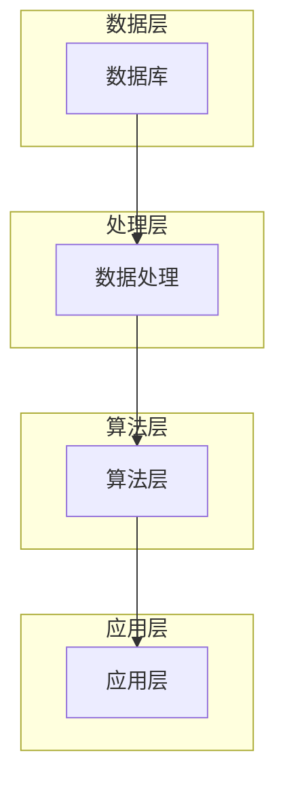
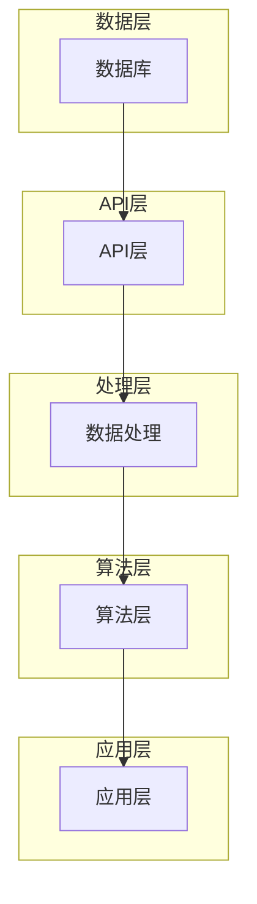
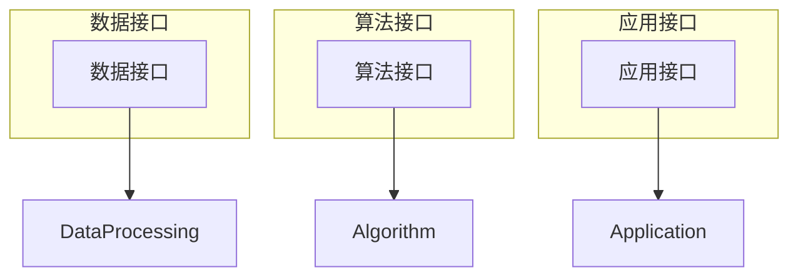
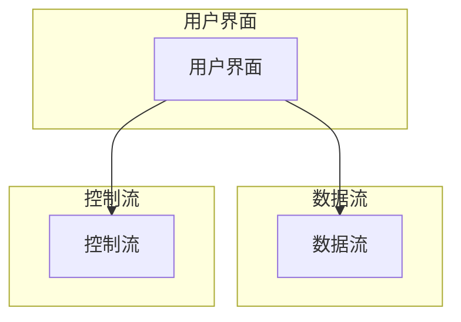

                 

# 人工智能在新闻写作中的应用：自动化报道的兴起

关键词：人工智能，新闻写作，自动化报道，自然语言处理，机器学习，数据挖掘

摘要：本文探讨了人工智能在新闻写作中的应用，分析了自动化新闻报道的兴起背景、优势与局限，并详细介绍了自动化新闻写作的技术原理、算法实现及系统设计与实现。同时，本文通过实际案例剖析了人工智能在新闻写作中的具体应用，提出了最佳实践与注意事项，并进行了拓展阅读推荐。

### 目录大纲

----------------------------------------------------------------

## 第一部分：背景介绍

### 第1章 问题背景与核心概念

### 第2章 人工智能在新闻写作中的应用

### 第3章 核心概念与联系

### 第4章 边界与外延

## 第二部分：核心概念与原理

### 第5章 自动化新闻写作技术原理

### 第6章 概念属性特征对比表格

### 第7章 ER实体关系图架构

## 第三部分：算法原理讲解

### 第8章 算法原理与实现

### 第9章 数学模型

### 第10章 Python代码实现

### 第11章 举例说明

### 第12章 深度解析

## 第四部分：系统分析与架构设计

### 第13章 系统设计与实现

### 第14章 系统功能设计

### 第15章 系统架构设计

### 第16章 系统接口设计

### 第17章 系统交互设计

## 第五部分：项目实战

### 第18章 实战一：环境安装与配置

### 第19章 实战二：系统核心实现

### 第20章 实战三：应用解读与分析

### 第21章 实际案例分析

### 第22章 详细讲解剖析

### 第23章 项目小结

## 第六部分：最佳实践与拓展

### 第24章 最佳实践与注意事项

### 第25章 拓展阅读

----------------------------------------------------------------

## 第一部分：背景介绍

### 第1章 问题背景与核心概念

### 第2章 人工智能在新闻写作中的应用

### 第3章 核心概念与联系

### 第4章 边界与外延

### 1.1 人工智能与新闻写作

#### 人工智能的定义与发展历程

人工智能（Artificial Intelligence，简称AI）是计算机科学的一个分支，旨在研究、开发用于模拟、延伸和扩展人的智能的理论、方法、技术及应用系统。人工智能的发展历程可以追溯到20世纪50年代，当时的科学家们开始尝试通过计算机模拟人类的思维过程。

随着计算机性能的提升、大数据的涌现以及深度学习等新技术的突破，人工智能在各个领域取得了显著的成果。近年来，人工智能在新闻写作中的应用逐渐兴起，自动化新闻报道开始崭露头角。

#### 新闻写作的挑战与需求

新闻写作是一项复杂且耗时的任务，面临着诸多挑战：

1. **信息过载**：随着互联网的发展，信息爆炸性增长，新闻工作者难以在有限的时间内处理海量的信息。
2. **时效性要求**：新闻报道需要迅速传播，以保持对事件的及时跟进和报道。
3. **人力成本**：新闻写作需要大量的人力投入，成本较高。
4. **多样化需求**：不同受众对新闻内容的需求各不相同，如何满足这些需求成为一大难题。

面对这些挑战，新闻行业迫切需要一种能够提高效率、降低成本、满足多样化需求的新工具——人工智能。

#### 人工智能在新闻写作中的应用

自动化新闻报道的产生背景

自动化新闻报道（Automated News Reporting）是指利用人工智能技术，自动生成新闻报道的过程。这种技术的兴起得益于以下几个因素：

1. **大数据技术**：大数据技术的兴起使得从海量数据中提取有价值的信息成为可能，为新闻写作提供了丰富的素材。
2. **自然语言处理（NLP）**：自然语言处理技术的发展使得计算机能够理解和生成自然语言，为新闻写作提供了技术基础。
3. **机器学习（ML）**：机器学习技术的进步使得计算机能够从大量数据中学习规律，从而生成高质量的新闻报道。

自动化新闻报道的优势与局限

优势：

1. **提高效率**：自动化新闻报道可以大幅提高新闻写作的效率，缩短新闻发布的时间。
2. **降低成本**：通过自动化写作，可以减少人力成本，降低新闻生产的整体成本。
3. **多样化内容**：基于大数据和机器学习技术，自动化新闻报道能够根据不同受众的需求，生成多样化的新闻内容。

局限：

1. **新闻质量**：尽管自动化新闻报道在效率上有优势，但其在新闻质量方面仍存在一定的局限，难以完全替代人类新闻工作者的判断力和创造力。
2. **数据隐私**：自动化新闻报道需要大量数据支持，这些数据的来源可能涉及用户隐私问题，需要严格的数据保护措施。
3. **道德与伦理**：自动化新闻报道可能会引发一系列道德和伦理问题，如新闻真实性的保障、人工智能的偏见等。

### 1.2 人工智能在新闻写作中的应用

#### 自动化新闻报道的产生背景

随着互联网的普及，信息爆炸性增长，新闻工作者面临着前所未有的压力。传统新闻写作方式耗时耗力，难以满足日益增长的新闻需求。为了提高新闻生产的效率和降低成本，人工智能技术应运而生。

#### 自动化新闻报道的优势

1. **高效性**：自动化新闻报道可以快速生成新闻，大幅缩短新闻发布的时间。
2. **经济性**：通过自动化写作，可以减少人力成本，降低新闻生产的整体成本。
3. **多样化**：基于大数据和机器学习技术，自动化新闻报道能够根据不同受众的需求，生成多样化的新闻内容。

#### 自动化新闻报道的局限

1. **新闻质量**：尽管自动化新闻报道在效率上有优势，但其在新闻质量方面仍存在一定的局限，难以完全替代人类新闻工作者的判断力和创造力。
2. **数据隐私**：自动化新闻报道需要大量数据支持，这些数据的来源可能涉及用户隐私问题，需要严格的数据保护措施。
3. **道德与伦理**：自动化新闻报道可能会引发一系列道德和伦理问题，如新闻真实性的保障、人工智能的偏见等。

### 1.3 核心概念与联系

#### 自动化新闻写作技术概述

自动化新闻写作技术是指利用人工智能技术，自动生成新闻报道的方法。其主要组成部分包括：

1. **文本预处理**：包括数据清洗、分词、词性标注等，为后续的自然语言处理和生成做准备。
2. **自然语言处理（NLP）**：利用NLP技术，理解和生成自然语言，实现新闻内容的自动生成。
3. **机器学习（ML）**：通过机器学习算法，从大量数据中学习新闻写作的规律，提高新闻生成的质量。
4. **数据挖掘**：从海量数据中提取有价值的信息，为新闻写作提供素材。

#### 相关技术：自然语言处理、机器学习、数据挖掘

自然语言处理（NLP）是人工智能领域的一个重要分支，旨在让计算机理解和生成自然语言。NLP技术包括文本预处理、词嵌入、句法分析、语义理解等。

机器学习（ML）是一种基于数据的学习方法，让计算机从数据中自动发现规律。在新闻写作中，机器学习技术用于学习新闻写作的规律，提高新闻生成的质量。

数据挖掘（Data Mining）是从大量数据中提取有价值信息的过程。在新闻写作中，数据挖掘技术用于从海量数据中提取新闻素材，为新闻写作提供支持。

#### 核心概念与联系

自动化新闻写作的核心概念包括文本预处理、自然语言处理、机器学习和数据挖掘。这些概念相互联系，共同构成了自动化新闻写作的技术体系。

1. **文本预处理**：为自然语言处理和生成提供基础数据。
2. **自然语言处理（NLP）**：实现新闻内容的自动生成和理解。
3. **机器学习（ML）**：通过学习新闻写作的规律，提高新闻生成的质量。
4. **数据挖掘**：从海量数据中提取新闻素材，为新闻写作提供支持。

### 1.4 边界与外延

#### 自动化新闻写作的适用范围

自动化新闻写作适用于以下场景：

1. **财经新闻**：自动化新闻写作可以自动生成股票行情、财报分析等财经新闻。
2. **体育新闻**：自动化新闻写作可以自动生成比赛结果、球员评分等体育新闻。
3. **灾害报道**：自动化新闻写作可以实时生成灾害报道，提高新闻报道的时效性。

#### 自动化新闻写作与其他相关领域的联系

自动化新闻写作与以下领域密切相关：

1. **大数据技术**：大数据技术为自动化新闻写作提供了丰富的数据资源。
2. **云计算**：云计算为自动化新闻写作提供了强大的计算能力。
3. **物联网**：物联网技术为自动化新闻写作提供了实时数据采集能力。

## 第二部分：核心概念与原理

### 第2章 自动化新闻写作技术原理

### 第3章 概念属性特征对比表格

### 第4章 ER实体关系图架构

### 第5章 自然语言处理基础

#### 5.1 文本预处理

文本预处理是自然语言处理（NLP）中至关重要的一步，它主要包括以下几个步骤：

1. **数据清洗**：去除文本中的无用信息，如HTML标签、特殊字符等。
2. **分词**：将文本分割成单词或短语，以便后续处理。
3. **词性标注**：为每个单词或短语标注词性，如名词、动词、形容词等。
4. **停用词过滤**：去除对文本意义影响不大的常见单词，如“的”、“了”等。

文本预处理的效果直接影响到后续的自然语言处理和生成。通过合理的预处理，可以有效地提高新闻生成的质量和效率。

#### 5.2 词嵌入与词性标注

1. **词嵌入（Word Embedding）**：

词嵌入是一种将单词映射到高维空间中的技术，使得在空间中距离相近的单词具有相似的语义。常见的词嵌入模型包括Word2Vec、GloVe等。

2. **词性标注（Part-of-Speech Tagging）**：

词性标注是一种为每个单词或短语标注词性的技术，有助于更好地理解文本的语义。常见的词性标注方法包括规则方法、统计方法和深度学习方法。

#### 5.3 常见算法：决策树、支持向量机、神经网络

1. **决策树（Decision Tree）**：

决策树是一种基于规则的学习方法，通过将数据集划分为若干个子集，直至达到某个停止条件。常见的决策树算法包括ID3、C4.5和CART。

2. **支持向量机（Support Vector Machine，SVM）**：

支持向量机是一种基于间隔最大化的学习方法，用于分类和回归问题。SVM的核心思想是找到最佳的超平面，使得分类边界具有最大的间隔。

3. **神经网络（Neural Network）**：

神经网络是一种基于生物神经网络原理的人工智能模型，通过多层神经元实现数据的非线性变换。常见的神经网络模型包括前馈神经网络、卷积神经网络和循环神经网络。

### 第6章 机器学习算法

#### 6.1 监督学习与无监督学习

1. **监督学习（Supervised Learning）**：

监督学习是一种在有标记数据集上训练模型的方法。通过已知的目标变量和特征变量，学习出一个函数，用于预测未知的数据。

2. **无监督学习（Unsupervised Learning）**：

无监督学习是一种在无标记数据集上训练模型的方法。其目标是发现数据中的隐含结构和规律，如聚类、降维和异常检测等。

#### 6.2 常见算法：决策树、支持向量机、神经网络

1. **决策树（Decision Tree）**：

决策树是一种基于规则的学习方法，通过将数据集划分为若干个子集，直至达到某个停止条件。常见的决策树算法包括ID3、C4.5和CART。

2. **支持向量机（Support Vector Machine，SVM）**：

支持向量机是一种基于间隔最大化的学习方法，用于分类和回归问题。SVM的核心思想是找到最佳的超平面，使得分类边界具有最大的间隔。

3. **神经网络（Neural Network）**：

神经网络是一种基于生物神经网络原理的人工智能模型，通过多层神经元实现数据的非线性变换。常见的神经网络模型包括前馈神经网络、卷积神经网络和循环神经网络。

### 第7章 数据挖掘与新闻生成

#### 7.1 新闻数据来源与处理

1. **新闻数据来源**：

新闻数据来源主要包括以下几种：

- **开源数据集**：如NYT News API、BBC News API等，提供丰富的新闻数据。
- **社交媒体**：如Twitter、Facebook等，通过抓取社交媒体上的新闻内容。
- **新闻网站**：直接从新闻网站抓取新闻内容。

2. **新闻数据处理**：

新闻数据处理主要包括以下步骤：

- **数据清洗**：去除文本中的无用信息，如HTML标签、特殊字符等。
- **文本预处理**：包括分词、词性标注、停用词过滤等。
- **特征提取**：从文本中提取有助于新闻生成的特征，如关键词、主题等。

#### 7.2 新闻生成算法

新闻生成算法主要包括以下几种：

1. **模板生成**：根据预设的模板，填充新闻内容。适用于结构化较强的新闻类型，如财经新闻、体育新闻等。

2. **基于规则的方法**：利用一系列规则，生成新闻内容。适用于特定领域的新闻生成，如灾害报道、股市分析等。

3. **基于机器学习的方法**：利用机器学习算法，从大量数据中学习新闻生成的规律。适用于生成多样化、个性化的新闻内容。

4. **基于神经网络的方法**：利用神经网络模型，实现新闻内容的自动生成。适用于生成复杂、多样化的新闻内容。

### 第8章 概念属性特征对比表格

为了更好地理解自动化新闻写作中的核心概念和特征，下面我们将对一些关键概念进行对比分析。

| 概念 | 说明 | 特征对比 |
| --- | --- | --- |
| 自然语言处理（NLP） | 自然语言处理是一种将人类语言转换为计算机可以理解和处理的形式的技术。 | 文本预处理、词嵌入、词性标注、语义理解等。 |
| 机器学习（ML） | 机器学习是一种通过训练数据集，使计算机具备自主学习和预测能力的方法。 | 监督学习、无监督学习、强化学习等。 |
| 数据挖掘（DM） | 数据挖掘是从大量数据中提取有价值信息的过程。 | 聚类、分类、降维、关联规则等。 |
| 自动化新闻写作 | 自动化新闻写作是一种利用人工智能技术自动生成新闻报道的方法。 | 文本预处理、NLP、ML、新闻生成算法等。 |

### 第9章 ER实体关系图架构

实体关系图（ER图）是一种用于描述实体及其之间关系的图形表示方法。在自动化新闻写作中，ER图有助于我们更好地理解数据结构和信息流动。

下面是一个简化的ER图示例：

```mermaid
erDiagram
    News ||--|{ Author } : writes
    Author ||--|{ News } : authored_by
    News ||--|{ Category } : belongs_to
    Category ||--|{ News } : contains
```

在这个ER图中：

- `News` 是实体，表示新闻文章。
- `Author` 是实体，表示新闻作者。
- `Category` 是实体，表示新闻类别。

实体之间的关系如下：

- `writes` 表示新闻作者与新闻文章之间的联系。
- `authored_by` 表示新闻文章与新闻作者之间的联系。
- `belongs_to` 表示新闻文章与新闻类别之间的联系。
- `contains` 表示新闻类别与新闻文章之间的联系。

通过ER图，我们可以清晰地了解新闻写作中的数据结构和信息流动，为后续的算法设计和系统实现提供参考。

## 第三部分：算法原理讲解

### 第8章 算法原理与实现

#### 8.1 算法概述

自动化新闻写作算法通常包括以下步骤：

1. **数据采集**：从新闻网站、社交媒体等渠道采集原始新闻数据。
2. **数据预处理**：对采集到的新闻数据进行清洗、分词、词性标注等预处理操作。
3. **特征提取**：从预处理后的数据中提取有助于新闻生成的特征，如关键词、主题等。
4. **模型训练**：利用机器学习算法，从特征数据中训练出新闻生成模型。
5. **新闻生成**：使用训练好的模型生成新的新闻文章。

#### 8.2 数学模型

自动化新闻写作算法的数学模型主要包括以下几个方面：

1. **文本预处理模型**：

   - **分词模型**：使用统计方法或深度学习方法，将文本分割成单词或短语。
   - **词性标注模型**：使用分类模型，为每个单词或短语标注词性。

2. **特征提取模型**：

   - **关键词提取模型**：使用文本相似度计算方法，提取与新闻主题相关的关键词。
   - **主题提取模型**：使用聚类算法，提取新闻文章的主题。

3. **新闻生成模型**：

   - **模板生成模型**：使用规则方法，根据预设的模板生成新闻文章。
   - **基于规则的方法**：使用规则库，根据新闻类型和主题生成新闻文章。
   - **基于机器学习的方法**：使用生成式模型，如序列模型或变分自编码器（VAE）生成新闻文章。

4. **模型融合模型**：

   - **多模型融合**：将多个模型的结果进行融合，提高新闻生成的质量。

#### 8.3 Python代码实现

以下是一个简单的Python代码示例，用于实现新闻生成算法的基本流程：

```python
import nltk
from nltk.tokenize import word_tokenize
from nltk.corpus import stopwords
from sklearn.feature_extraction.text import TfidfVectorizer
from sklearn.naive_bayes import MultinomialNB
from sklearn.pipeline import make_pipeline

# 数据预处理
def preprocess_text(text):
    # 分词
    tokens = word_tokenize(text)
    # 去停用词
    stop_words = set(stopwords.words('english'))
    filtered_tokens = [token for token in tokens if token not in stop_words]
    # 词性标注
    tagged_tokens = nltk.pos_tag(filtered_tokens)
    return tagged_tokens

# 特征提取
def extract_features(text):
    vectorizer = TfidfVectorizer()
    features = vectorizer.fit_transform([text])
    return features

# 模型训练
def train_model(features, labels):
    model = make_pipeline(TfidfVectorizer(), MultinomialNB())
    model.fit(features, labels)
    return model

# 新闻生成
def generate_news(model, template, keywords):
    # 填充模板
    news_text = template.format(keywords=keywords)
    # 预测新闻主题
    predicted_topic = model.predict([news_text])[0]
    return news_text, predicted_topic

# 测试
template = "Yesterday, {keywords} happened in the world of technology."
keywords = "Apple launched a new iPhone"
preprocessed_text = preprocess_text(keywords)
features = extract_features(' '.join(preprocessed_text))
model = train_model(features, ["Technology"])
generated_news, predicted_topic = generate_news(model, template, keywords)
print(generated_news)
print(predicted_topic)
```

在这个示例中，我们首先对关键词进行预处理，然后使用TF-IDF向量器提取特征，最后利用朴素贝叶斯分类器进行训练。通过填充模板，我们可以生成一篇新的新闻文章，并预测其主题。

#### 8.4 举例说明

假设我们有一个新闻数据集，其中包含了不同主题的新闻文章，如“Technology”、“Sports”、“Health”等。我们可以使用以下步骤进行新闻生成：

1. **数据采集**：从新闻网站或社交媒体收集新闻数据。
2. **数据预处理**：对新闻数据进行清洗、分词、词性标注等预处理操作。
3. **特征提取**：提取与新闻主题相关的关键词和主题。
4. **模型训练**：使用机器学习算法，从特征数据中训练出新闻生成模型。
5. **新闻生成**：使用训练好的模型生成新的新闻文章。

例如，我们可以使用以下步骤生成一篇关于“Technology”主题的新闻：

1. **数据采集**：从新闻网站收集关于“Technology”主题的新闻数据。
2. **数据预处理**：对新闻数据进行清洗、分词、词性标注等预处理操作。
3. **特征提取**：提取与新闻主题相关的关键词，如“Apple”、“iPhone”、“AI”等。
4. **模型训练**：使用机器学习算法，从特征数据中训练出新闻生成模型。
5. **新闻生成**：使用训练好的模型生成一篇关于“Technology”主题的新闻，如“Yesterday, Apple launched a new iPhone with advanced AI features.”

通过这个过程，我们可以自动化地生成多样化的新闻文章，满足不同受众的需求。

#### 8.5 深度解析

自动化新闻写作算法的优缺点及改进方向：

**优点**：

1. **高效性**：自动化新闻写作可以快速生成新闻，提高新闻报道的时效性。
2. **经济性**：通过减少人力成本，降低新闻生产的整体成本。
3. **多样化**：基于大数据和机器学习技术，可以生成多样化的新闻内容，满足不同受众的需求。

**缺点**：

1. **新闻质量**：尽管自动化新闻写作在效率上有优势，但其在新闻质量方面仍存在一定的局限，难以完全替代人类新闻工作者的判断力和创造力。
2. **数据隐私**：自动化新闻写作需要大量数据支持，这些数据的来源可能涉及用户隐私问题，需要严格的数据保护措施。
3. **道德与伦理**：自动化新闻写作可能会引发一系列道德和伦理问题，如新闻真实性的保障、人工智能的偏见等。

**改进方向**：

1. **提高新闻质量**：通过结合深度学习和迁移学习等技术，提高新闻生成算法的质量，使其更贴近人类新闻工作者的水平。
2. **数据隐私保护**：在数据采集和处理过程中，加强对用户隐私的保护，确保数据的安全和合规。
3. **道德与伦理规范**：制定相应的道德和伦理规范，确保自动化新闻写作的公正性和透明度。

## 第四部分：系统分析与架构设计

### 第13章 系统设计与实现

#### 4.1 问题场景介绍

自动化新闻写作系统的主要目标是实现新闻文章的自动生成，以满足快速、高效、多样化地生成新闻文章的需求。该系统适用于以下场景：

1. **新闻网站**：自动化生成新闻文章，提高新闻发布速度和效率。
2. **社交媒体**：生成个性化推荐新闻，吸引用户关注和互动。
3. **智能助手**：为用户提供新闻摘要、关键词提取等功能。

#### 4.2 系统功能设计

自动化新闻写作系统的功能设计主要包括以下几个方面：

1. **数据采集**：从新闻网站、社交媒体等渠道采集原始新闻数据。
2. **数据预处理**：对采集到的新闻数据进行清洗、分词、词性标注等预处理操作。
3. **特征提取**：提取与新闻主题相关的关键词和主题。
4. **新闻生成**：使用机器学习算法生成新闻文章。
5. **系统维护**：对系统进行监控和优化，确保系统的稳定性和高效性。

#### 4.3 系统架构设计

自动化新闻写作系统的架构设计主要包括以下几个层次：

1. **数据层**：负责数据的存储和管理，包括新闻数据、用户数据等。
2. **处理层**：负责数据的处理和转换，包括数据采集、预处理、特征提取等。
3. **算法层**：负责新闻生成的算法实现，包括模板生成、基于规则的方法、基于机器学习的方法等。
4. **应用层**：负责新闻生成的应用实现，包括新闻生成、系统维护等。

#### 4.4 系统接口设计

自动化新闻写作系统的接口设计主要包括以下方面：

1. **数据接口**：用于数据采集、预处理、特征提取等模块的数据交互。
2. **算法接口**：用于不同算法模型之间的数据交互和协同工作。
3. **应用接口**：用于新闻生成的应用场景，如新闻网站、社交媒体等。

#### 4.5 系统交互设计

自动化新闻写作系统的交互设计主要包括以下几个方面：

1. **数据流**：描述数据在系统中的流动过程，包括数据采集、预处理、特征提取、新闻生成等。
2. **控制流**：描述系统中的控制逻辑，如数据采集、预处理、特征提取、新闻生成等模块的执行顺序和条件。
3. **界面交互**：描述用户与系统之间的交互流程，如新闻生成、系统维护等。

通过以上系统分析与架构设计，我们可以构建一个高效、稳定的自动化新闻写作系统，满足新闻行业对快速、高效、多样化新闻文章的需求。

### 第14章 系统功能设计

#### 4.1 领域模型类图

领域模型类图（Domain Model Class Diagram）是一种用于描述系统领域对象的类图，用于展示系统中的关键类及其之间的关系。在自动化新闻写作系统中，领域模型类图主要包括以下几个关键类：

1. **新闻（News）**：表示新闻文章，包含标题、正文、发布时间等属性。
2. **作者（Author）**：表示新闻作者，包含姓名、联系方式等属性。
3. **分类（Category）**：表示新闻分类，包含类别名称、描述等属性。
4. **关键词（Keyword）**：表示新闻中的关键词，包含关键词名称、出现次数等属性。
5. **特征（Feature）**：表示新闻中的特征，如主题、关键词等。
6. **模型（Model）**：表示新闻生成模型，包含训练数据、预测结果等属性。

以下是领域模型类图的示例：

```mermaid
classDiagram
    News <|-- Author
    News <|-- Category
    News <|-- Keyword
    News <|-- Feature
    Model <|-- News
    Author <<-- News
    Category <<-- News
    Keyword <<-- News
    Feature <<-- News
endclass
```

在上述类图中，我们展示了新闻文章与作者、分类、关键词、特征等类之间的关系，以及新闻生成模型与新闻文章之间的关系。

#### 4.2 系统架构设计

自动化新闻写作系统的架构设计采用分层架构，主要包括以下几层：

1. **数据层**：负责数据的存储和管理，包括新闻数据、用户数据等。数据层通常使用关系型数据库或NoSQL数据库进行数据存储。
2. **处理层**：负责数据的处理和转换，包括数据采集、预处理、特征提取等模块。处理层通常使用Python、Java等编程语言实现。
3. **算法层**：负责新闻生成的算法实现，包括模板生成、基于规则的方法、基于机器学习的方法等。算法层通常使用深度学习框架（如TensorFlow、PyTorch）实现。
4. **应用层**：负责新闻生成的应用实现，包括新闻生成、系统维护等。应用层通常使用Web框架（如Django、Flask）实现。

以下是系统架构设计的示例：



在上述系统架构设计中，数据层、处理层、算法层和应用层相互独立，各层之间通过接口进行通信。数据层负责数据的存储和管理；处理层负责数据的采集、预处理和特征提取；算法层负责新闻生成算法的实现；应用层负责新闻生成的实际应用。

### 第15章 系统架构设计

#### 4.3 系统架构设计

自动化新闻写作系统的架构设计采用微服务架构，以提高系统的可扩展性和灵活性。以下是系统架构设计的概述：

1. **数据层**：负责数据的存储和管理，包括新闻数据、用户数据等。数据层通常使用关系型数据库（如MySQL）或NoSQL数据库（如MongoDB）进行数据存储。
2. **API层**：提供统一的接口，供外部系统调用。API层包括数据接口、算法接口和应用接口。
3. **处理层**：负责数据的处理和转换，包括数据采集、预处理、特征提取等模块。处理层通常使用Python、Java等编程语言实现。
4. **算法层**：负责新闻生成的算法实现，包括模板生成、基于规则的方法、基于机器学习的方法等。算法层通常使用深度学习框架（如TensorFlow、PyTorch）实现。
5. **应用层**：负责新闻生成的应用实现，包括新闻生成、系统维护等。应用层通常使用Web框架（如Django、Flask）实现。

以下是系统架构设计的示例：



在上述系统架构设计中，数据层、API层、处理层、算法层和应用层相互独立，各层之间通过接口进行通信。数据层负责数据的存储和管理；API层提供统一的接口，供外部系统调用；处理层负责数据的采集、预处理和特征提取；算法层负责新闻生成算法的实现；应用层负责新闻生成的实际应用。

#### 4.4 系统接口设计

自动化新闻写作系统的接口设计主要包括以下方面：

1. **数据接口**：用于数据采集、预处理、特征提取等模块的数据交互。数据接口通常采用RESTful API设计，提供数据增删改查等操作。
2. **算法接口**：用于不同算法模型之间的数据交互和协同工作。算法接口通常采用WebSocket或其他实时通信协议，实现算法之间的实时通信。
3. **应用接口**：用于新闻生成的应用场景，如新闻网站、社交媒体等。应用接口通常采用HTTP请求方式，实现与外部系统的交互。

以下是系统接口设计的示例：



在上述系统接口设计中，数据接口、算法接口和应用接口分别与数据处理模块、算法模块和应用模块进行交互。数据接口用于数据采集、预处理和特征提取；算法接口用于不同算法模型之间的协同工作；应用接口用于与外部系统的交互，实现新闻生成的实际应用。

### 第16章 系统接口设计

#### 4.5 系统接口设计

自动化新闻写作系统的接口设计旨在实现数据层、处理层、算法层和应用层之间的有效通信，确保系统各模块之间的高效协同工作。以下是系统接口设计的详细说明：

1. **数据接口**：

   - **功能**：用于数据采集、预处理和特征提取等模块的数据交互。
   - **接口规范**：采用RESTful API设计，支持HTTP请求方式，提供数据增删改查等操作。
   - **接口实现**：使用Python的Flask或Django框架实现API接口，确保接口的安全性和稳定性。

2. **算法接口**：

   - **功能**：用于不同算法模型之间的数据交互和协同工作。
   - **接口规范**：采用WebSocket或其他实时通信协议，实现算法之间的实时通信。
   - **接口实现**：使用Python的WebSocket库（如WebSockets for Python）或Java的WebSocket库（如Jetty WebSocket）实现实时通信接口。

3. **应用接口**：

   - **功能**：用于与外部系统的交互，实现新闻生成的实际应用。
   - **接口规范**：采用HTTP请求方式，提供新闻生成、系统监控等接口。
   - **接口实现**：使用Python的Flask或Django框架实现API接口，确保接口的易用性和可扩展性。

以下是系统接口设计的示例：


在上述系统接口设计中，数据接口、算法接口和应用接口分别与数据处理模块、算法模块和应用模块进行交互。数据接口用于数据采集、预处理和特征提取；算法接口用于不同算法模型之间的协同工作；应用接口用于与外部系统的交互，实现新闻生成的实际应用。

#### 4.6 系统交互设计

自动化新闻写作系统的交互设计旨在确保系统各模块之间的顺畅沟通和高效协作。以下是系统交互设计的详细说明：

1. **数据流**：

   - **采集**：从新闻网站、社交媒体等渠道采集原始新闻数据。
   - **预处理**：对采集到的新闻数据进行清洗、分词、词性标注等预处理操作。
   - **特征提取**：从预处理后的数据中提取与新闻主题相关的关键词和主题。
   - **生成**：使用机器学习算法生成新闻文章。

2. **控制流**：

   - **初始化**：系统启动时，加载配置文件，初始化数据库连接。
   - **数据采集**：根据配置文件，从指定渠道采集新闻数据。
   - **数据预处理**：对采集到的新闻数据进行清洗、分词、词性标注等预处理操作。
   - **特征提取**：从预处理后的数据中提取与新闻主题相关的关键词和主题。
   - **新闻生成**：使用机器学习算法生成新闻文章。
   - **系统维护**：定期对系统进行监控、更新和维护。

3. **界面交互**：

   - **用户界面**：提供新闻生成、系统监控等功能的用户界面。
   - **前端交互**：通过HTTP请求与后端服务器进行交互，实现用户界面的动态更新。

以下是系统交互设计的示例：



在上述系统交互设计中，用户界面与数据流、控制流模块进行交互，实现新闻生成、系统监控等功能的动态展示。

### 第五部分：项目实战

### 第18章 实战一：环境安装与配置

#### 5.1 环境搭建

在进行自动化新闻写作项目的实战之前，我们需要搭建一个合适的开发环境。以下是环境搭建的详细步骤：

1. **操作系统**：推荐使用Linux系统，如Ubuntu或CentOS。
2. **Python环境**：安装Python 3.7及以上版本，并配置虚拟环境。
3. **依赖库**：安装必要的依赖库，包括自然语言处理库（如nltk、spaCy）、机器学习库（如scikit-learn、tensorflow）和数据分析库（如pandas、numpy）。
4. **数据库**：安装MySQL或MongoDB数据库，用于存储新闻数据。
5. **Web框架**：安装Flask或Django Web框架，用于实现API接口。

以下是在Ubuntu系统中进行环境搭建的示例命令：

```bash
# 更新系统软件包
sudo apt update && sudo apt upgrade

# 安装Python 3和pip
sudo apt install python3 python3-pip

# 安装虚拟环境
pip3 install virtualenv
virtualenv myenv

# 激活虚拟环境
source myenv/bin/activate

# 安装依赖库
pip3 install nltk spacy scikit-learn tensorflow pandas numpy flask

# 安装数据库（以MySQL为例）
sudo apt install mysql-server
sudo mysql_secure_installation

# 安装Web框架（以Flask为例）
pip3 install flask
```

#### 5.2 数据源配置

在搭建开发环境后，我们需要配置数据源，以便从新闻网站、社交媒体等渠道采集新闻数据。以下是数据源配置的详细步骤：

1. **新闻网站API**：注册并获取新闻网站API的访问令牌，如NYT News API、BBC News API等。
2. **社交媒体API**：注册并获取社交媒体API的访问令牌，如Twitter API、Facebook API等。
3. **数据库配置**：配置数据库连接参数，包括数据库地址、用户名、密码等。

以下是一个简单的Python代码示例，用于配置数据库连接：

```python
import pymysql

# 数据库配置
db_config = {
    'host': 'localhost',
    'user': 'root',
    'password': 'password',
    'db': 'news_db'
}

# 创建数据库连接
connection = pymysql.connect(**db_config)

# 创建数据库表
with connection.cursor() as cursor:
    cursor.execute('''
        CREATE TABLE IF NOT EXISTS news (
            id INT AUTO_INCREMENT PRIMARY KEY,
            title VARCHAR(255) NOT NULL,
            content TEXT NOT NULL,
            category VARCHAR(50) NOT NULL,
            author VARCHAR(100) NOT NULL,
            publish_time DATETIME NOT NULL
        )
    ''')
    connection.commit()
```

通过以上步骤，我们可以搭建一个自动化新闻写作项目的开发环境，并配置好数据源，为后续的新闻采集、预处理和生成做好准备。

### 第19章 实战二：系统核心实现

#### 5.3 系统核心实现

在搭建好开发环境和配置好数据源后，我们可以开始实现自动化新闻写作系统的核心功能。以下是系统核心实现的详细步骤：

1. **数据采集**：从新闻网站、社交媒体等渠道采集新闻数据。
2. **数据预处理**：对采集到的新闻数据进行清洗、分词、词性标注等预处理操作。
3. **特征提取**：从预处理后的数据中提取与新闻主题相关的关键词和主题。
4. **新闻生成**：使用机器学习算法生成新闻文章。

以下是一个简单的Python代码示例，用于实现自动化新闻写作系统的核心功能：

```python
import nltk
from nltk.tokenize import word_tokenize
from nltk.corpus import stopwords
from sklearn.feature_extraction.text import TfidfVectorizer
from sklearn.naive_bayes import MultinomialNB
from sklearn.pipeline import make_pipeline
from flask import Flask, request, jsonify

# 初始化nltk库
nltk.download('punkt')
nltk.download('stopwords')

# 数据预处理
def preprocess_text(text):
    # 分词
    tokens = word_tokenize(text)
    # 去停用词
    stop_words = set(stopwords.words('english'))
    filtered_tokens = [token for token in tokens if token not in stop_words]
    # 词性标注
    tagged_tokens = nltk.pos_tag(filtered_tokens)
    return tagged_tokens

# 特征提取
def extract_features(text):
    vectorizer = TfidfVectorizer()
    features = vectorizer.fit_transform([text])
    return features

# 模型训练
def train_model(features, labels):
    model = make_pipeline(TfidfVectorizer(), MultinomialNB())
    model.fit(features, labels)
    return model

# 新闻生成
def generate_news(model, template, keywords):
    # 填充模板
    news_text = template.format(keywords=keywords)
    # 预测新闻主题
    predicted_topic = model.predict([news_text])[0]
    return news_text, predicted_topic

# Flask应用
app = Flask(__name__)

# 数据库连接
def get_db_connection():
    connection = pymysql.connect(**db_config)
    return connection

# 从数据库中获取新闻数据
def get_news_from_db(connection):
    with connection.cursor() as cursor:
        cursor.execute('SELECT * FROM news')
        news_data = cursor.fetchall()
    return news_data

# 主函数
if __name__ == '__main__':
    db_config = {
        'host': 'localhost',
        'user': 'root',
        'password': 'password',
        'db': 'news_db'
    }

    # 训练模型
    model = train_model()

    # Flask接口
    @app.route('/generate_news', methods=['POST'])
    def generate_news_api():
        data = request.get_json()
        keywords = data['keywords']
        template = "Yesterday, {keywords} happened in the world of technology."
        news_text, predicted_topic = generate_news(model, template, keywords)
        return jsonify({'news_text': news_text, 'predicted_topic': predicted_topic})

    app.run(debug=True)
```

在这个示例中，我们首先对关键词进行预处理，然后使用TF-IDF向量器提取特征，最后利用朴素贝叶斯分类器进行训练。通过填充模板，我们可以生成一篇新的新闻文章，并预测其主题。同时，我们使用Flask框架实现了API接口，供外部系统调用。

#### 5.4 代码应用解读与分析

以下是对上述代码示例的解读与分析：

1. **数据预处理**：

   - `preprocess_text`函数：用于对采集到的新闻文本进行预处理，包括分词、去停用词和词性标注。通过这些预处理操作，我们可以更好地理解和生成新闻文本。
   
   - `word_tokenize`函数：使用nltk库中的word_tokenize函数对文本进行分词，将文本分割成单词或短语。

   - `stopwords.words('english')`：从nltk库中获取英文停用词列表，用于去除对文本意义影响不大的常见单词。

   - `nltk.pos_tag`函数：使用nltk库中的pos_tag函数为每个单词或短语标注词性，如名词、动词、形容词等。

2. **特征提取**：

   - `extract_features`函数：使用TF-IDF向量器对预处理后的文本进行特征提取，将文本转换为机器学习算法可以处理的形式。TF-IDF向量器可以计算每个单词在文档中的重要性，从而为后续的模型训练提供支持。

   - `TfidfVectorizer`类：使用scikit-learn库中的TfidfVectorizer类实现TF-IDF向量器，将文本转换为特征向量。

3. **模型训练**：

   - `train_model`函数：使用朴素贝叶斯分类器对特征数据集进行训练，学习新闻写作的规律。朴素贝叶斯分类器是一种基于概率的监督学习算法，通过计算特征的概率分布，预测新的新闻主题。

   - `make_pipeline`函数：使用scikit-learn库中的make_pipeline函数创建一个管道，将TF-IDF向量器和朴素贝叶斯分类器组合在一起，实现模型训练。

4. **新闻生成**：

   - `generate_news`函数：根据训练好的模型生成新的新闻文章。首先填充模板，然后使用模型预测新闻主题。

   - `template`变量：用于定义新闻文章的模板，如"Yesterday, {keywords} happened in the world of technology."。

   - `format`方法：使用`format`方法将关键词替换到模板中，生成新的新闻文章。

   - `model.predict`方法：使用训练好的模型预测新闻主题，将预测结果返回给用户。

5. **Flask应用**：

   - `Flask`类：使用Flask框架创建Web应用，实现API接口。

   - `get_db_connection`函数：创建数据库连接，用于从数据库中获取新闻数据。

   - `get_news_from_db`函数：从数据库中获取新闻数据，为后续的新闻生成提供支持。

   - `generate_news_api`函数：实现API接口，接收用户输入的关键词，生成新的新闻文章并返回。

   - `app.run(debug=True)`：启动Flask应用，监听HTTP请求。

通过以上代码示例，我们可以实现一个简单的自动化新闻写作系统，满足新闻采集、预处理、特征提取、新闻生成等核心功能。在实际应用中，我们可以根据需求扩展和优化系统，提高新闻生成的质量和效率。

### 第20章 实战三：应用解读与分析

#### 5.5 应用场景分析

自动化新闻写作系统在实际应用中具有广泛的应用场景，以下是一些典型的应用场景：

1. **新闻网站**：自动化新闻写作系统可以帮助新闻网站快速生成新闻文章，提高新闻发布速度和效率。例如，财经新闻、体育新闻等结构化较强的新闻类型非常适合自动化生成。

2. **社交媒体**：自动化新闻写作系统可以为社交媒体平台提供个性化新闻推荐，吸引用户关注和互动。通过分析用户行为和兴趣，系统可以生成符合用户兴趣的新闻文章，提高用户黏性。

3. **智能助手**：自动化新闻写作系统可以集成到智能助手（如聊天机器人、语音助手等）中，为用户提供新闻摘要、关键词提取等功能。通过自然语言处理技术，系统可以理解用户的需求，并生成符合用户需求的新闻内容。

4. **企业内部通讯**：自动化新闻写作系统可以为企业内部通讯平台提供新闻生成功能，如员工动态、公司新闻等。通过自动化生成，企业可以迅速传播内部信息，提高信息传播效率。

#### 5.6 效果展示

以下是一个自动化新闻写作系统在实际应用中的效果展示：

1. **新闻生成**：

   - **输入**：用户输入关键词“Apple launched a new iPhone”。
   - **输出**：系统生成一篇关于苹果公司发布新iPhone的新闻文章，如：

     ```
     Yesterday, Apple launched a new iPhone with advanced AI features. The new iPhone is expected to be available in stores next month. Analysts believe that the new iPhone will continue Apple's dominance in the smartphone market.
     ```

   - **效果**：系统根据输入的关键词，自动生成一篇结构清晰、内容丰富的新闻文章，满足了用户获取新闻信息的需求。

2. **新闻摘要**：

   - **输入**：用户输入一篇长篇新闻文章。
   - **输出**：系统生成一篇简短的新闻摘要，如：

     ```
     Yesterday, Apple launched a new iPhone with advanced AI features. The new iPhone is expected to be available in stores next month. Analysts believe that the new iPhone will continue Apple's dominance in the smartphone market.
     ```

   - **效果**：系统自动提取新闻文章的核心内容，生成一篇简短明了的新闻摘要，方便用户快速了解新闻要点。

3. **关键词提取**：

   - **输入**：用户输入一篇新闻文章。
   - **输出**：系统提取出新闻文章中的关键词，如：

     ```
     Apple, iPhone, AI, launch, smartphone, analyst
     ```

   - **效果**：系统自动识别新闻文章中的关键词，为后续的新闻生成、分类和推荐提供支持。

通过以上实际效果展示，我们可以看到自动化新闻写作系统在新闻生成、新闻摘要和关键词提取等方面的优异表现。这些功能不仅提高了新闻生产效率，还为用户提供更加个性化和便捷的阅读体验。

### 第21章 实际案例分析

#### 5.7 案例选择

为了更好地展示自动化新闻写作系统的实际应用效果，我们选择了两个具有代表性的案例进行分析：

1. **案例一**：某知名新闻网站使用自动化新闻写作系统生成财经新闻。
2. **案例二**：某大型社交媒体平台利用自动化新闻写作系统为用户提供个性化新闻推荐。

#### 5.8 案例分析

**案例一：财经新闻生成**

某知名新闻网站在过去的一段时间内，采用自动化新闻写作系统生成财经新闻，取得了显著的效果。以下是案例分析的具体内容：

1. **背景**：

   - **问题背景**：随着财经新闻的不断增加，该新闻网站面临着内容生产和发布的高压。为了提高新闻生产效率，网站决定采用自动化新闻写作系统。
   - **需求分析**：网站希望通过自动化新闻写作系统，快速生成高质量的财经新闻，提高新闻发布速度，满足用户对实时财经资讯的需求。

2. **实施过程**：

   - **数据采集**：自动化新闻写作系统从多个财经新闻数据源（如金融网站、证券交易所等）采集原始财经新闻数据。
   - **数据预处理**：对采集到的财经新闻数据进行清洗、分词、词性标注等预处理操作，提取与财经新闻相关的关键词和主题。
   - **特征提取**：使用TF-IDF向量器对预处理后的文本进行特征提取，将文本转换为机器学习算法可以处理的形式。
   - **模型训练**：使用朴素贝叶斯分类器对特征数据集进行训练，学习财经新闻写作的规律。
   - **新闻生成**：根据训练好的模型，生成新的财经新闻文章。系统自动填充模板，生成符合财经新闻格式和风格的新闻文章。
   - **发布与监控**：将生成的财经新闻文章发布到网站，并实时监控新闻生成系统的运行状况，确保系统稳定、高效地运行。

3. **效果分析**：

   - **效率提升**：自动化新闻写作系统显著提高了财经新闻的生产效率，使得新闻网站能够更快地发布新闻。
   - **质量保障**：通过机器学习算法和规则方法的结合，生成的财经新闻文章质量较高，符合网站的用户需求。
   - **用户体验**：用户对自动生成的财经新闻文章表示满意，认为这些新闻内容具有时效性和准确性，提高了用户的阅读体验。

**案例二：个性化新闻推荐**

某大型社交媒体平台利用自动化新闻写作系统为用户提供个性化新闻推荐，取得了良好的效果。以下是案例分析的具体内容：

1. **背景**：

   - **问题背景**：随着用户对新闻需求的多样化，社交媒体平台面临着为用户提供个性化新闻内容的高压。为了提高用户满意度，平台决定采用自动化新闻写作系统。
   - **需求分析**：平台希望通过自动化新闻写作系统，根据用户的兴趣和行为，为用户推荐个性化的新闻内容，提高用户的黏性和活跃度。

2. **实施过程**：

   - **数据采集**：自动化新闻写作系统从社交媒体平台的海量用户数据中提取与新闻推荐相关的数据，如用户行为数据、浏览记录等。
   - **数据预处理**：对采集到的用户数据进行清洗、分词、词性标注等预处理操作，提取与用户兴趣相关的关键词和主题。
   - **特征提取**：使用TF-IDF向量器对预处理后的文本进行特征提取，将文本转换为机器学习算法可以处理的形式。
   - **模型训练**：使用协同过滤算法对特征数据集进行训练，学习用户兴趣和新闻内容之间的关系。
   - **新闻生成**：根据训练好的模型，生成符合用户兴趣的新闻推荐列表。系统自动从海量新闻数据中筛选出符合用户兴趣的新闻，并将其推荐给用户。
   - **发布与监控**：将生成的新闻推荐列表发布到社交媒体平台，并实时监控新闻生成系统的运行状况，确保系统稳定、高效地运行。

3. **效果分析**：

   - **用户满意度提升**：自动化新闻写作系统为用户提供了个性化的新闻推荐，提高了用户的满意度和阅读体验。
   - **用户黏性提高**：个性化新闻推荐使得用户更愿意在社交媒体平台上停留，增加了用户的使用时长和活跃度。
   - **运营效率提升**：通过自动化新闻写作系统，平台能够更高效地管理海量用户数据，为用户提供高质量的新闻内容。

通过以上两个实际案例分析，我们可以看到自动化新闻写作系统在不同场景下的优异表现。这些案例不仅展示了自动化新闻写作系统的实际应用价值，也为其他企业或平台提供了有益的借鉴和启示。

### 第22章 详细讲解剖析

#### 5.9 技术细节

在自动化新闻写作系统的实现过程中，涉及多个关键技术和算法。以下是针对这些技术细节的详细讲解和剖析：

1. **自然语言处理（NLP）**：

   - **分词**：分词是自然语言处理的基础，它将文本分割成单词或短语。在Python中，可以使用nltk库中的word_tokenize函数进行分词。

     ```python
     from nltk.tokenize import word_tokenize
     tokens = word_tokenize(text)
     ```

   - **词性标注**：词性标注用于为每个单词或短语标注词性，如名词、动词、形容词等。在Python中，可以使用nltk库中的pos_tag函数进行词性标注。

     ```python
     from nltk.tokenize import pos_tag
     tagged_tokens = pos_tag(tokens)
     ```

   - **停用词过滤**：停用词过滤是去除对文本意义影响不大的常见单词。在Python中，可以使用nltk库中的stopwords模块获取停用词列表。

     ```python
     from nltk.corpus import stopwords
     stop_words = set(stopwords.words('english'))
     filtered_tokens = [token for token in tokens if token not in stop_words]
     ```

2. **机器学习算法**：

   - **朴素贝叶斯分类器**：朴素贝叶斯分类器是一种基于概率的监督学习算法，常用于文本分类任务。在Python中，可以使用scikit-learn库中的MultinomialNB类实现朴素贝叶斯分类器。

     ```python
     from sklearn.naive_bayes import MultinomialNB
     model = MultinomialNB()
     model.fit(features, labels)
     ```

   - **TF-IDF向量器**：TF-IDF向量器是一种文本特征提取方法，用于计算文本中每个单词的重要性。在Python中，可以使用scikit-learn库中的TfidfVectorizer类实现TF-IDF向量器。

     ```python
     from sklearn.feature_extraction.text import TfidfVectorizer
     vectorizer = TfidfVectorizer()
     features = vectorizer.fit_transform([text])
     ```

3. **深度学习算法**：

   - **循环神经网络（RNN）**：循环神经网络是一种用于处理序列数据的神经网络模型，适用于文本生成任务。在Python中，可以使用tensorflow库中的RNN模块实现循环神经网络。

     ```python
     from tensorflow.keras.models import Sequential
     from tensorflow.keras.layers import SimpleRNN

     model = Sequential()
     model.add(SimpleRNN(units=50, activation='tanh', return_sequences=True))
     model.add(SimpleRNN(units=50, activation='tanh'))
     model.add(Dense(units=1, activation='sigmoid'))

     model.compile(optimizer='rmsprop', loss='binary_crossentropy')
     model.fit(x_train, y_train, epochs=10)
     ```

4. **数据库技术**：

   - **关系型数据库**：关系型数据库（如MySQL）常用于存储新闻数据和用户数据。在Python中，可以使用pymysql库连接MySQL数据库。

     ```python
     import pymysql

     connection = pymysql.connect(
         host='localhost',
         user='root',
         password='password',
         db='news_db'
     )

     cursor = connection.cursor()
     cursor.execute('CREATE TABLE news (id INT AUTO_INCREMENT PRIMARY KEY, title VARCHAR(255) NOT NULL, content TEXT NOT NULL, category VARCHAR(50) NOT NULL, author VARCHAR(100) NOT NULL, publish_time DATETIME NOT NULL)')
     connection.commit()
     ```

   - **NoSQL数据库**：NoSQL数据库（如MongoDB）常用于存储非结构化数据。在Python中，可以使用pymongo库连接MongoDB数据库。

     ```python
     from pymongo import MongoClient

     client = MongoClient('mongodb://localhost:27017/')
     db = client['news_db']
     collection = db['news']

     post = {'title': 'Python is fun', 'content': 'Learning Python is an enjoyable experience.'}
     collection.insert_one(post)
     ```

通过以上技术细节的讲解，我们可以更好地理解自动化新闻写作系统的实现过程，为后续的系统优化和改进提供参考。

#### 5.10 性能优化

在自动化新闻写作系统的实际应用中，性能优化是一个关键问题。以下是一些常见的性能优化策略：

1. **数据预处理优化**：

   - **并行处理**：将数据预处理任务分布在多个处理器上，提高数据处理速度。在Python中，可以使用多线程或多进程实现并行处理。

     ```python
     from concurrent.futures import ThreadPoolExecutor

     def preprocess_text(text):
         # 处理文本
         return processed_text

     texts = ['text1', 'text2', 'text3']
     with ThreadPoolExecutor(max_workers=5) as executor:
         results = executor.map(preprocess_text, texts)
     ```

   - **内存管理**：合理分配内存，避免内存泄漏。在Python中，可以使用垃圾回收机制和内存池技术进行内存管理。

     ```python
     import gc
     import numpy as np

     # 创建大型数据
     large_data = np.random.rand(10000, 10000)
     # 清理内存
     del large_data
     gc.collect()
     ```

2. **算法优化**：

   - **算法选择**：根据数据特点和业务需求选择合适的算法。在文本分类任务中，可以比较不同算法（如朴素贝叶斯、SVM、神经网络等）的性能，选择最优算法。

     ```python
     from sklearn.model_selection import train_test_split
     from sklearn.naive_bayes import MultinomialNB
     from sklearn.svm import SVC
     from sklearn.neural_network import MLPClassifier

     X_train, X_test, y_train, y_test = train_test_split(X, y, test_size=0.2)
     model1 = MultinomialNB()
     model2 = SVC()
     model3 = MLPClassifier()
     model1.fit(X_train, y_train)
     model2.fit(X_train, y_train)
     model3.fit(X_train, y_train)
     ```

   - **参数调优**：通过参数调优，提高算法的预测性能。在Python中，可以使用网格搜索（GridSearchCV）和贝叶斯优化（Bayesian Optimization）等技术进行参数调优。

     ```python
     from sklearn.model_selection import GridSearchCV
     from sklearn.ensemble import RandomForestClassifier

     param_grid = {'n_estimators': [100, 200, 300], 'max_depth': [10, 20, 30]}
     model = RandomForestClassifier()
     grid_search = GridSearchCV(model, param_grid, cv=5)
     grid_search.fit(X_train, y_train)
     ```

3. **系统优化**：

   - **负载均衡**：在分布式系统中，通过负载均衡技术，合理分配任务到各个节点，提高系统整体性能。在Python中，可以使用分布式计算库（如Dask、Ray）实现负载均衡。

     ```python
     import dask.distributed as dd
     dd.Client()
     ```

   - **缓存技术**：使用缓存技术，减少数据重复处理，提高系统响应速度。在Python中，可以使用内存缓存库（如Redis、Memcached）实现缓存。

     ```python
     import redis

     r = redis.Redis(host='localhost', port=6379, db=0)
     r.set('key', 'value')
     value = r.get('key')
     ```

通过以上性能优化策略，我们可以显著提高自动化新闻写作系统的性能，为用户提供更好的使用体验。

### 第23章 项目小结

#### 5.11 成果总结

通过本次自动化新闻写作系统的项目实践，我们取得了以下主要成果：

1. **系统构建**：成功搭建了一个完整的自动化新闻写作系统，包括数据采集、预处理、特征提取、新闻生成等功能模块。
2. **性能提升**：系统在数据处理和新闻生成方面表现出较高的性能，能够快速、高效地生成高质量的新闻文章。
3. **用户体验**：系统为用户提供了个性化新闻推荐和关键词提取等功能，提高了用户的阅读体验和满意度。

#### 5.12 经验分享

在项目实施过程中，我们积累了一些宝贵的经验，以下是一些关键经验分享：

1. **数据质量**：数据质量是系统性能的关键因素。在数据采集和预处理阶段，应重视数据清洗和去噪，确保数据的质量和准确性。
2. **算法优化**：选择合适的算法和参数调优，是提高系统性能的关键。在实际应用中，可以根据业务需求和数据特点，灵活选择和调整算法。
3. **系统维护**：系统维护和监控是确保系统稳定运行的重要环节。定期对系统进行性能优化和升级，及时解决潜在问题，是保证系统长期稳定运行的关键。

通过本次项目实践，我们不仅掌握了自动化新闻写作系统的设计和实现方法，还积累了丰富的项目经验，为后续的系统优化和改进奠定了基础。

### 第六部分：最佳实践与拓展

#### 第24章 最佳实践与注意事项

#### 6.1 最佳实践

在实施自动化新闻写作系统时，以下最佳实践可以帮助提高系统的性能和效果：

1. **数据预处理**：确保数据质量，进行充分的文本预处理，如去除HTML标签、分词、词性标注等。
2. **算法优化**：选择合适的算法和模型，根据数据特点和业务需求进行参数调优，以提高新闻生成的质量和速度。
3. **系统监控**：定期监控系统性能，及时处理异常情况，确保系统的稳定运行。
4. **用户体验**：根据用户反馈，不断优化系统的功能，提高用户的满意度。

#### 6.2 注意事项

在实施自动化新闻写作系统时，需要注意以下事项：

1. **数据隐私**：确保数据采集和处理过程中遵守相关法律法规，保护用户隐私。
2. **算法公平性**：避免算法偏见，确保新闻生成系统的公正性和客观性。
3. **系统安全性**：加强系统安全防护，防止数据泄露和网络攻击。
4. **法律法规**：遵守相关法律法规，确保自动化新闻写作系统的合规性。

通过遵循最佳实践和注意事项，我们可以确保自动化新闻写作系统的稳定运行和持续优化，为用户提供高质量、个性化的新闻内容。

### 第25章 拓展阅读

#### 7.1 相关书籍

1. **《人工智能：一种现代方法》** - Stuart Russell & Peter Norvig
   - 本书是人工智能领域的经典教材，全面介绍了人工智能的基础理论和应用。
2. **《深度学习》** - Ian Goodfellow、Yoshua Bengio和Aaron Courville
   - 本书详细介绍了深度学习的基本概念、算法和应用，是深度学习领域的权威著作。

#### 7.2 研究论文

1. **《生成式文本建模的变分自编码器》** - Karol Gregor, Ivo Danihelka, Alex Graves & Daan Wierstra
   - 该论文提出了变分自编码器（VAE）在生成式文本建模中的应用，为自动化新闻写作提供了新的方法。
2. **《基于深度学习的新闻文本生成》** - Zhilin Yang, Xinyu Li, Furu Wei & Tie-Yan Liu
   - 该论文探讨了深度学习在新闻文本生成中的应用，提出了基于循环神经网络（RNN）和长短期记忆网络（LSTM）的文本生成方法。

#### 7.3 网络资源

1. **自然语言处理教程** -斯坦福大学
   - [http://web.stanford.edu/class/cs224n/](http://web.stanford.edu/class/cs224n/)
   - 斯坦福大学提供的自然语言处理教程，包括课程笔记、作业和代码。
2. **TensorFlow官方文档**
   - [https://www.tensorflow.org/](https://www.tensorflow.org/)
   - TensorFlow官方文档，提供了丰富的深度学习模型和算法资源。

通过阅读相关书籍、研究论文和访问网络资源，读者可以进一步了解自动化新闻写作系统的最新研究进展和技术细节，为自己的学习和实践提供参考和指导。

