                 

### 摘要

人工智能在软件开发中的应用已成为现代软件工程不可或缺的一部分。本文将深入探讨人工智能的基本概念、技术原理以及在软件开发中的实际应用场景。首先，我们将回顾人工智能的历史与发展，理解其基本概念与分类。接着，我们将详细介绍机器学习的基础知识，包括监督学习、无监督学习和强化学习等核心算法与模型。在此基础上，我们将分析人工智能在软件开发中的多种应用，如自动化测试、代码审查、代码生成和智能辅助编程等，并通过实际案例展示其优势和具体实践。随后，本文将讨论在应用人工智能过程中所面临的挑战，如数据、可解释性和伦理问题，并提出相应的解决方案。最后，我们将总结全文内容，展望人工智能在软件开发中的未来发展趋势，为读者提供具有启发性的思考与实践建议。通过本文的阅读，读者将全面了解人工智能在软件开发中的广泛应用及其深远影响。

### 目录大纲

**《人工智能在软件开发中的应用》**

> 关键词：人工智能、软件开发、机器学习、应用案例、实践指南

> 摘要：本文深入探讨人工智能在软件开发中的应用，包括其基本概念、技术原理、应用场景和挑战，旨在为读者提供全面的技术见解和实战指导。

----------------------------------------------------------------

**第一部分: 人工智能概述**

----------------------------------------------------------------

### 第1章: 人工智能概述

----------------------------------------------------------------

### 第1章: 人工智能概述

在深入探讨人工智能在软件开发中的应用之前，首先需要对其进行一个全面的概述，以便读者能够理解其背景、历史和发展趋势。

#### 1.1 人工智能的历史与发展

人工智能（Artificial Intelligence, AI）的概念最早可以追溯到20世纪50年代。当时，科学家们首次提出了让机器具备人类智能的想法。1956年，约翰·麦卡锡（John McCarthy）等人在达特茅斯会议上正式提出了“人工智能”这一术语，并定义其为“制造智能机器的科学和工程”。

##### 1.1.1 人工智能的起源

人工智能的起源可以追溯到古希腊神话中的自动机械人，以及18世纪出现的“自动机械人”玩具。然而，真正的突破始于20世纪中叶，尤其是计算机科学的发展。图灵测试的提出，标志着人工智能研究进入了一个新的阶段，即通过测试来判断机器是否具备人类智能。

##### 1.1.2 人工智能的黄金时代与低谷

20世纪50年代至70年代，人工智能经历了其第一个黄金时代。在这一时期，许多基础理论和算法被提出，如逻辑推理、知识表示和规划等。然而，受限于计算机性能和算法复杂性，人工智能在70年代后期遭遇了“人工智能寒冬”，许多研究项目被迫停止。

##### 1.1.3 人工智能的复兴与未来趋势

20世纪80年代以来，人工智能再次迎来了复兴。这一时期的突破主要得益于计算能力的提升和大数据技术的发展。深度学习算法的提出和广泛应用，使得人工智能在语音识别、图像处理、自然语言处理等领域取得了显著进展。未来，人工智能将继续向智能化、自动化和泛在化的方向发展，深入影响各个行业和领域。

#### 1.2 人工智能的基本概念与分类

##### 1.2.1 人工智能的定义

人工智能是一门研究、开发和应用使计算机系统模拟、扩展和扩展人类智能的科学和技术。它涵盖了计算机科学、心理学、神经科学、哲学等多个学科领域。

##### 1.2.2 人工智能的分类

人工智能可以分为两大类：弱人工智能（Narrow AI）和强人工智能（General AI）。

- **弱人工智能**：专注于特定任务的智能化系统，如语音助手、图像识别等。它们在特定领域表现出色，但缺乏通用性。
- **强人工智能**：具备与人类相似的全面智能，能够在各种环境和任务中表现，但当前尚未实现。

##### 1.2.3 人工智能的关键技术

人工智能的关键技术包括：

- **机器学习**：通过数据训练模型，使计算机具备自主学习能力。
- **深度学习**：一种特殊的机器学习方法，通过多层神经网络模拟人脑学习过程。
- **自然语言处理**：使计算机理解和生成人类语言，包括语音识别、机器翻译等。
- **计算机视觉**：使计算机能够理解和解析图像和视频，包括物体检测、人脸识别等。

#### 1.3 人工智能在软件开发中的应用场景

##### 1.3.1 自动化测试

自动化测试是人工智能在软件开发中的重要应用之一。通过机器学习技术，可以自动生成测试用例，提高测试效率和质量。

##### 1.3.2 代码审查

代码审查是软件开发过程中的重要环节。人工智能可以帮助自动化代码审查，发现潜在的错误和安全漏洞。

##### 1.3.3 代码生成

人工智能可以生成代码，提高开发效率和代码质量。例如，通过自然语言处理技术，可以将需求文档自动转换为代码。

##### 1.3.4 智能辅助编程

智能辅助编程是人工智能在软件开发中的新兴应用。通过智能助手和代码补全技术，可以显著提高开发者的工作效率。

#### 1.4 人工智能在软件开发中的挑战与机遇

##### 1.4.1 数据的挑战

人工智能应用依赖于大量数据，但数据的收集、清洗和存储都是巨大的挑战。此外，数据的质量和多样性也直接影响到人工智能的效果。

##### 1.4.2 可解释性的挑战

人工智能模型通常被视为“黑箱”，缺乏可解释性。这限制了其在关键领域的应用，如医疗和金融等。

##### 1.4.3 伦理与道德的挑战

人工智能在软件开发中的应用引发了一系列伦理和道德问题，如隐私侵犯、歧视和失业等。

##### 1.4.4 机遇与未来展望

尽管面临挑战，人工智能在软件开发中的机遇巨大。随着技术的不断进步，人工智能将带来更高效、更智能的软件开发方式，推动软件工程的进一步发展。

#### 1.5 本章小结

本章对人工智能进行了概述，包括其历史与发展、基本概念与分类、应用场景以及面临的挑战与机遇。通过本章的介绍，读者可以对人工智能有更深入的了解，为后续章节的探讨打下基础。

----------------------------------------------------------------

## 1.1 人工智能的历史与发展

### 1.1.1 人工智能的起源

人工智能（Artificial Intelligence，简称AI）的概念起源于对人类智能的模拟和扩展。早在古希腊时期，哲学家们就曾探讨机器能否模仿人类的思维和行为。然而，人工智能作为一门科学，其真正起源可以追溯到20世纪中叶。

1950年，英国数学家艾伦·图灵（Alan Turing）发表了著名的论文《计算机器与智能》（Computing Machinery and Intelligence），提出了“图灵测试”。图灵测试是一种衡量机器智能的方法，如果一个机器能够在对话中表现得像人类一样，以至于评判者无法区分其是人类还是机器，那么这个机器就可以被认为具有人类智能。这一理论为人工智能的发展奠定了基础。

1956年，约翰·麦卡锡（John McCarthy）、马文·明斯基（Marvin Minsky）、纳森尼尔·罗切斯特（Nathanial Rochester）和克劳德·香农（Claude Shannon）在美国达特茅斯会议（Dartmouth Conference）上首次提出了“人工智能”这一术语。他们定义人工智能为“制造智能机器的科学和工程”，旨在通过理解和模拟人类智能来构建智能系统。

此后，人工智能开始引起广泛关注，并迅速发展起来。初期的人工智能研究主要集中在逻辑推理、知识表示和规划等领域，试图通过模拟人类思维过程来创建智能系统。

### 1.1.2 人工智能的黄金时代与低谷

人工智能的发展并非一帆风顺。在早期，人工智能经历了所谓的“黄金时代”。1956年至1974年，人工智能研究取得了显著进展。在这个时期，科学家们提出了许多重要的理论和算法，如逻辑推理、知识表示和专家系统等。这些研究为人工智能的发展奠定了基础。

然而，人工智能在1974年后遭遇了所谓的“人工智能低谷”（AI Winter）。这一时期，由于计算机性能的限制和算法复杂性的问题，人工智能研究进展缓慢，许多研究项目被迫停止。此外，早期的预测和实际应用之间存在巨大差距，也导致了对人工智能的质疑和失望。

低谷期间，人工智能领域出现了一些重要的事件。1976年，美国斯坦福大学的约翰·霍普金斯（John Hopfield）提出了霍普菲尔德神经网络（Hopfield Network），为人工神经网络的发展奠定了基础。1980年，美国卡内基梅隆大学的约翰·莫拉维克（John Moravec）提出了“ighth機器”（ighth Machine），试图通过机器视觉和机器人技术来模拟人类智能。

### 1.1.3 人工智能的复兴与未来趋势

人工智能的低谷并没有持续太久。随着计算机性能的提升和互联网的普及，人工智能在21世纪初迎来了新的复兴。这一复兴主要得益于机器学习技术的发展，尤其是深度学习的突破。

2006年，加拿大科学家杰弗里·辛顿（Geoffrey Hinton）等提出了深度信念网络（Deep Belief Network），标志着深度学习算法的兴起。深度学习通过多层神经网络模拟人脑的学习过程，使得人工智能在图像识别、语音识别、自然语言处理等领域取得了显著突破。

2012年，谷歌的深度学习团队开发的“深度卷积神经网络”（Deep Convolutional Neural Network）在ImageNet图像识别挑战中取得了突破性成绩，准确率达到了15.3%，远超人类表现。这一成果标志着深度学习在人工智能领域的广泛应用。

近年来，人工智能的发展呈现出以下几个趋势：

1. **智能化和自动化**：人工智能技术不断向智能化和自动化方向发展，从简单的规则系统向复杂的机器学习模型和深度学习算法转变。
2. **跨学科融合**：人工智能与其他领域的交叉融合，如生物医学、智能制造、金融科技等，推动了人工智能技术的创新和应用。
3. **边缘计算和物联网**：随着物联网和5G技术的发展，人工智能开始向边缘设备延伸，实现实时数据处理和智能决策。
4. **伦理和隐私**：随着人工智能的广泛应用，伦理和隐私问题逐渐成为关注的焦点。如何确保人工智能的公平、透明和可解释性，成为未来研究的重要方向。

未来，人工智能将继续在各个领域发挥重要作用，推动社会和经济的发展。同时，人工智能的发展也面临诸多挑战，如数据隐私、安全性和伦理问题等。如何应对这些挑战，实现人工智能的可持续发展，将是未来研究的重要课题。

### 1.2 人工智能的基本概念与分类

#### 1.2.1 人工智能的定义

人工智能（Artificial Intelligence，简称AI）是一门研究、开发和应用使计算机系统模拟、扩展和扩展人类智能的科学和技术。它旨在通过模拟人类思维过程和行为，构建具有智能功能的计算机系统。

人工智能的定义可以从多个角度进行解读：

1. **智能模拟**：人工智能试图模拟人类的认知过程，如感知、理解、推理和决策等。
2. **自动化**：通过算法和模型，使计算机能够自动执行复杂任务，从而降低人类劳动强度。
3. **自适应能力**：人工智能系统能够根据环境和需求的变化，自适应地调整自身行为和策略。

#### 1.2.2 人工智能的分类

人工智能可以分为两大类：弱人工智能（Narrow AI）和强人工智能（General AI）。

1. **弱人工智能（Narrow AI）**：

   也称为专用人工智能或窄域人工智能，专注于特定任务的智能化系统。弱人工智能在特定领域表现出色，但缺乏通用性。例如，语音助手、图像识别、自动驾驶等。

   - **优势**：针对特定任务进行优化，效果显著。
   - **局限**：缺乏泛化能力，无法适应新的任务和环境。

2. **强人工智能（General AI）**：

   也称为通用人工智能或强人工智能，具备与人类相似的全面智能，能够在各种环境和任务中表现。强人工智能不仅能够执行特定任务，还能够进行抽象思维、情感理解和创造性活动。

   - **优势**：具备全面智能，适应能力强。
   - **局限**：当前尚未实现，尚处于理论研究阶段。

#### 1.2.3 人工智能的关键技术

人工智能的关键技术包括机器学习、深度学习、自然语言处理、计算机视觉等。

1. **机器学习（Machine Learning）**：

   机器学习是一种通过数据训练模型，使计算机具备自主学习能力的方法。机器学习可以分为监督学习、无监督学习和强化学习。

   - **监督学习**：通过已标记的数据训练模型，用于预测和分类。
   - **无监督学习**：通过未标记的数据发现数据中的模式和结构。
   - **强化学习**：通过与环境的交互，学习最优策略。

2. **深度学习（Deep Learning）**：

   深度学习是一种特殊的机器学习方法，通过多层神经网络模拟人脑学习过程。深度学习在图像识别、语音识别和自然语言处理等领域取得了显著突破。

3. **自然语言处理（Natural Language Processing，NLP）**：

   自然语言处理是一种使计算机理解和生成人类语言的技术，包括语音识别、机器翻译、文本分析等。

4. **计算机视觉（Computer Vision）**：

   计算机视觉是一种使计算机能够理解和解析图像和视频的技术，包括物体检测、人脸识别、图像分类等。

#### 1.2.4 人工智能的应用领域

人工智能在各个领域都有广泛的应用，包括但不限于：

1. **医疗健康**：辅助诊断、药物研发、智能导诊等。
2. **金融科技**：风险评估、欺诈检测、智能投顾等。
3. **智能制造**：智能监控、设备维护、机器人应用等。
4. **交通运输**：自动驾驶、智能交通管理、无人机等。
5. **教育**：个性化学习、智能评估、教育机器人等。
6. **智能家居**：智能音箱、智能家电、安防监控等。

### 1.3 人工智能在软件开发中的应用场景

#### 1.3.1 自动化测试

自动化测试是人工智能在软件开发中的重要应用之一。通过机器学习技术，可以自动生成测试用例，提高测试效率和质量。

**自动化测试的优势**：

1. **提高测试效率**：自动化测试可以大规模、快速地生成测试用例，缩短测试周期。
2. **提高测试质量**：自动化测试可以覆盖更多场景，发现更多潜在问题。
3. **降低人力成本**：减少手动测试的工作量，降低人力成本。

**自动化测试的实践**：

1. **选择合适的工具**：根据项目需求和测试场景，选择合适的自动化测试工具，如Selenium、JUnit等。
2. **设计测试用例**：通过分析需求和代码，设计自动化测试用例。
3. **执行测试**：运行自动化测试用例，记录测试结果。
4. **分析结果**：对测试结果进行分析，识别潜在问题。

#### 1.3.2 代码审查

代码审查是软件开发过程中的重要环节。人工智能可以帮助自动化代码审查，发现潜在的错误和安全漏洞。

**代码审查的优势**：

1. **提高代码质量**：自动化代码审查可以快速发现潜在的错误和漏洞，提高代码质量。
2. **降低人力成本**：减少人工代码审查的工作量，降低人力成本。
3. **提高开发效率**：自动化代码审查可以实时反馈问题，提高开发效率。

**代码审查的实践**：

1. **选择合适的工具**：根据项目需求和审查规则，选择合适的代码审查工具，如SonarQube、Checkstyle等。
2. **定义审查规则**：根据项目特点和需求，定义审查规则，如代码风格、安全规范等。
3. **执行审查**：运行代码审查工具，对代码进行审查。
4. **分析报告**：生成审查报告，分析代码质量。

#### 1.3.3 代码生成

人工智能可以生成代码，提高开发效率和代码质量。例如，通过自然语言处理技术，可以将需求文档自动转换为代码。

**代码生成的优势**：

1. **提高开发效率**：自动生成代码可以节省大量时间，提高开发效率。
2. **提高代码质量**：通过自动化生成代码，可以减少人工编写的错误，提高代码质量。
3. **降低人力成本**：减少人工编写代码的工作量，降低人力成本。

**代码生成的实践**：

1. **选择合适的工具**：根据项目需求和语言特点，选择合适的代码生成工具，如ANTLR、Jinja2等。
2. **定义需求文档**：根据项目需求，编写详细的需求文档。
3. **生成代码**：通过工具将需求文档转换为代码。
4. **代码优化**：对生成的代码进行优化，提高代码质量。

#### 1.3.4 智能辅助编程

智能辅助编程是人工智能在软件开发中的新兴应用。通过智能助手和代码补全技术，可以显著提高开发者的工作效率。

**智能辅助编程的优势**：

1. **提高开发效率**：智能助手和代码补全技术可以快速提供开发所需的信息和代码片段，提高开发效率。
2. **减少编程错误**：智能助手可以帮助开发者避免常见的编程错误，提高代码质量。
3. **增强开发者体验**：智能辅助编程可以提供更加便捷的开发体验，增强开发者满意度。

**智能辅助编程的实践**：

1. **选择合适的工具**：根据项目需求和开发环境，选择合适的智能辅助编程工具，如Visual Studio Code、IntelliJ IDEA等。
2. **集成开发环境**：将智能辅助编程工具集成到开发环境中，提供实时代码补全和智能提示。
3. **个性化设置**：根据开发者的习惯和需求，进行个性化设置，提高辅助编程的效率。

#### 1.4 人工智能在软件开发中的挑战与机遇

##### 1.4.1 数据的挑战

人工智能应用依赖于大量数据，但数据的收集、清洗和存储都是巨大的挑战。此外，数据的质量和多样性也直接影响到人工智能的效果。

**数据的挑战**：

1. **数据量庞大**：人工智能需要大量数据来训练模型，但获取和存储这些数据需要巨大的计算资源和存储空间。
2. **数据质量**：数据的质量直接影响模型的性能。噪音、缺失值和不一致的数据都会对模型产生负面影响。
3. **数据多样性**：人工智能需要多样化的数据来适应各种环境和场景。然而，获取多样化的数据并不容易。

**解决方法**：

1. **数据清洗**：对原始数据进行清洗，去除噪音和缺失值，提高数据质量。
2. **数据增强**：通过数据增强技术，生成多样化的数据，提高模型的泛化能力。
3. **数据存储与管理**：采用高效的数据存储和管理方案，如分布式存储和云计算，提高数据处理效率。

##### 1.4.2 可解释性的挑战

人工智能模型通常被视为“黑箱”，缺乏可解释性。这限制了其在关键领域的应用，如医疗和金融等。

**可解释性的挑战**：

1. **模型复杂度**：深度学习模型通常具有复杂的网络结构和参数，导致其难以解释。
2. **模型透明度**：许多模型训练过程依赖于大量数据和复杂的算法，使得模型的内部工作机制难以理解。
3. **决策透明度**：在关键领域，如医疗和金融，需要确保模型的决策过程透明和可解释，以确保其公正性和可信度。

**解决方法**：

1. **模型简化**：简化模型结构，降低模型复杂度，提高可解释性。
2. **模型可视化**：通过可视化技术，展示模型的结构和工作原理，提高模型的透明度。
3. **可解释性算法**：开发可解释性算法，如决策树、LIME（Local Interpretable Model-agnostic Explanations）等，帮助解释模型的决策过程。

##### 1.4.3 伦理与道德的挑战

人工智能在软件开发中的应用引发了一系列伦理和道德问题，如隐私侵犯、歧视和失业等。

**伦理与道德的挑战**：

1. **隐私侵犯**：人工智能应用需要大量个人数据，可能导致隐私泄露和数据滥用。
2. **歧视**：人工智能模型可能基于历史数据产生偏见，导致不公平的决策。
3. **失业**：人工智能自动化技术可能取代部分工作岗位，引发失业问题。

**解决方法**：

1. **隐私保护**：采用数据加密、匿名化等技术，保护个人隐私。
2. **公平性评估**：对人工智能模型进行公平性评估，确保其不会产生歧视性决策。
3. **失业应对**：通过教育和培训，帮助劳动者适应新的就业环境，降低失业风险。

##### 1.4.4 机遇与未来展望

尽管面临挑战，人工智能在软件开发中的机遇巨大。随着技术的不断进步，人工智能将带来更高效、更智能的软件开发方式，推动软件工程的进一步发展。

**机遇与未来展望**：

1. **自动化和智能化**：人工智能将推动软件开发向自动化和智能化方向发展，提高开发效率和质量。
2. **跨领域融合**：人工智能与其他领域的融合，如生物医学、智能制造、金融科技等，将产生新的应用场景和商业机会。
3. **持续优化**：通过持续优化和改进，人工智能将不断提高其在软件开发中的应用效果和影响力。

### 1.5 本章小结

本章对人工智能进行了概述，包括其历史与发展、基本概念与分类、应用场景以及面临的挑战与机遇。通过本章的介绍，读者可以对人工智能有更深入的了解，为后续章节的探讨打下基础。

----------------------------------------------------------------

## 2.1 机器学习基础

### 2.1.1 机器学习的基本概念

机器学习（Machine Learning，简称ML）是人工智能（Artificial Intelligence，简称AI）的一个重要分支，主要研究如何让计算机系统通过数据和经验自主学习，进而进行决策和预测。机器学习的基本概念可以概括为以下几个要点：

#### 2.1.1.1 学习方法

机器学习方法可以分为三种主要类型：监督学习、无监督学习和强化学习。

1. **监督学习（Supervised Learning）**：监督学习是一种在有标签数据集上进行训练的方法。通过已知的输入和输出数据，学习数据之间的映射关系，从而预测新的输入数据对应的输出。常见的监督学习算法包括线性回归、决策树、支持向量机和神经网络等。

2. **无监督学习（Unsupervised Learning）**：无监督学习是在没有标签数据集的情况下进行训练的方法。其主要目标是发现数据中的隐含结构或模式。常见的无监督学习算法包括聚类、降维和关联规则学习等。

3. **强化学习（Reinforcement Learning）**：强化学习是一种通过与环境的交互进行学习的方法。学习主体（Agent）通过不断尝试和反馈，学习最优策略以实现目标。常见的强化学习算法包括Q-learning、SARSA和深度确定性策略梯度（DDPG）等。

#### 2.1.1.2 特征工程

特征工程（Feature Engineering）是在机器学习过程中，通过对数据进行预处理、选择和转换，提取出对模型训练有帮助的特征。特征工程对于模型的效果具有至关重要的影响。常见的技术包括：

1. **数据预处理**：对数据进行清洗、归一化和标准化等处理，以提高数据质量和模型的泛化能力。

2. **特征选择**：从原始数据中筛选出对模型训练有帮助的特征，降低数据维度，提高模型效率。

3. **特征转换**：对数值特征进行编码、归一化、离散化等转换，对文本特征进行词袋模型、TF-IDF等转换。

#### 2.1.1.3 模型评估

模型评估是机器学习过程中至关重要的一步，旨在评估模型的性能和泛化能力。常见的模型评估指标包括：

1. **准确率（Accuracy）**：预测正确的样本数占总样本数的比例。

2. **精确率（Precision）**：预测为正类的样本中，实际为正类的比例。

3. **召回率（Recall）**：实际为正类的样本中被预测为正类的比例。

4. **F1分数（F1 Score）**：精确率和召回率的加权平均，用于综合评价模型的性能。

5. **ROC曲线（Receiver Operating Characteristic Curve）**：通过不同阈值计算得到的真正例率（True Positive Rate，TPR）和假正例率（False Positive Rate，FPR）的曲线，用于评估模型的分类能力。

#### 2.1.1.4 超参数调优

超参数（Hyperparameter）是机器学习模型中需要手动设置的参数，如学习率、正则化参数等。超参数调优（Hyperparameter Tuning）是通过调整超参数，以获得最佳模型性能的过程。常见的调优方法包括：

1. **网格搜索（Grid Search）**：在预定义的参数网格中，逐个尝试所有可能的参数组合，找出最佳参数组合。

2. **随机搜索（Random Search）**：在参数空间中随机选择参数组合进行尝试，无需遍历所有可能的组合。

3. **贝叶斯优化（Bayesian Optimization）**：利用贝叶斯统计模型，根据已有的实验结果，选择下一次实验的最优参数。

### 2.1.2 监督学习

监督学习是最常见的机器学习方法之一，通过已知的输入和输出数据，学习数据之间的映射关系。监督学习可以分为以下几种类型：

#### 2.1.2.1 线性回归

线性回归（Linear Regression）是一种最简单的监督学习算法，用于预测连续值输出。线性回归模型可以表示为：

$$y = \beta_0 + \beta_1 \cdot x_1 + \beta_2 \cdot x_2 + ... + \beta_n \cdot x_n + \epsilon$$

其中，$y$为输出值，$x_1, x_2, ..., x_n$为输入特征，$\beta_0, \beta_1, ..., \beta_n$为模型参数，$\epsilon$为误差项。

线性回归模型的目的是通过最小化误差平方和来估计模型参数。常见的方法包括最小二乘法（Ordinary Least Squares，OLS）和梯度下降法（Gradient Descent）。

#### 2.1.2.2 决策树

决策树（Decision Tree）是一种基于树形结构进行决策的算法。决策树通过一系列规则来对样本进行分类或回归。每个节点代表一个特征，每个分支代表一个特征取值。叶节点代表最终的分类或回归结果。

决策树模型可以表示为：

$$
\begin{aligned}
&y \leftarrow \text{分类或回归结果} \\
&\text{if } x_1 = a_1 \text{ then } \text{分支1} \\
&\text{if } x_1 = a_2 \text{ then } \text{分支2} \\
&\text{...} \\
&\text{if } x_n = a_n \text{ then } \text{分支n} \\
\end{aligned}
$$

决策树的构建过程通常采用信息增益（Information Gain）或基尼不纯度（Gini Impurity）来选择最佳分割特征。

#### 2.1.2.3 支持向量机

支持向量机（Support Vector Machine，SVM）是一种基于间隔最大化原理的线性分类模型。SVM通过找到一个最优的超平面，将数据集划分为两个类别。SVM模型可以表示为：

$$
\begin{aligned}
&\min_{\beta, \beta_0} \frac{1}{2} \sum_{i=1}^{n} (\beta \cdot x_i - y_i)^2 \\
&\text{subject to } y(\beta \cdot x_i + \beta_0) \geq 1
\end{aligned}
$$

其中，$\beta$和$\beta_0$为模型参数，$x_i$为输入特征，$y_i$为输入标签。

SVM的核函数（Kernel Function）可以扩展到非线性分类问题，如多项式核（Polynomial Kernel）和高斯径向基核（Gaussian Radial Basis Function Kernel）。

### 2.1.2.4 集成学习方法

集成学习方法（Ensemble Learning）通过结合多个模型，提高模型的性能和泛化能力。常见的集成学习方法包括：

1. **装袋法（Bagging）**：装袋法通过构建多个子模型，并取其平均值或投票结果来提高模型的性能。随机森林（Random Forest）是装袋法的典型代表。

2. **提升法（Boosting）**：提升法通过多次训练子模型，并依次调整样本权重，以提高模型的性能。常见的提升算法包括AdaBoost和XGBoost。

3. **堆叠法（Stacking）**：堆叠法通过构建多个子模型，并使用这些子模型的输出作为新特征，构建一个最终模型。堆叠法的性能通常优于单个模型。

### 2.1.3 无监督学习

无监督学习是一种在没有标签数据集的情况下进行训练的方法。无监督学习主要用于发现数据中的隐含结构或模式。常见的无监督学习方法包括：

#### 2.1.3.1 聚类分析

聚类分析（Clustering Analysis）是一种将相似的数据样本分组的方法。常见的聚类算法包括：

1. **K-均值聚类（K-Means Clustering）**：K-均值聚类通过迭代更新聚类中心，将数据分为K个簇。

2. **层次聚类（Hierarchical Clustering）**：层次聚类通过建立层次结构来对数据进行聚类，可以生成任意数量的簇。

3. **DBSCAN（Density-Based Spatial Clustering of Applications with Noise）**：DBSCAN通过计算数据点的密度和邻域关系，将数据分为簇。

#### 2.1.3.2 降维

降维（Dimensionality Reduction）是一种通过减少数据维度，提高模型性能和可解释性的方法。常见的降维方法包括：

1. **主成分分析（Principal Component Analysis，PCA）**：PCA通过将数据投影到新的正交坐标系中，提取最重要的特征。

2. **线性判别分析（Linear Discriminant Analysis，LDA）**：LDA通过最大化类间方差和最小化类内方差，提取对分类最有帮助的特征。

3. **自编码器（Autoencoder）**：自编码器通过训练一个编码器和解码器，将高维数据映射到低维空间。

### 2.1.3.3 关联规则学习

关联规则学习（Association Rule Learning）是一种发现数据项之间潜在关联规则的方法。常见的算法包括：

1. **Apriori算法**：Apriori算法通过生成频繁项集，发现关联规则。

2. **Eclat算法**：Eclat算法是一种基于信息增益的关联规则学习算法，可以高效地处理大数据集。

#### 2.1.4 强化学习

强化学习（Reinforcement Learning，简称RL）是一种通过与环境的交互进行学习的方法。强化学习的主要目标是学习一个最优策略，使学习主体在环境中获得最大收益。强化学习可以分为以下几种类型：

1. **值函数方法**：值函数方法通过估计状态值函数和行动值函数来学习策略。常见的算法包括Q-learning和SARSA。

2. **策略梯度方法**：策略梯度方法通过直接优化策略梯度来学习策略。常见的算法包括策略梯度算法（Policy Gradient）和深度确定性策略梯度（Deep Deterministic Policy Gradient，DDPG）。

3. **模型学习方法**：模型学习方法通过构建环境模型来学习策略。常见的算法包括模型预测控制（Model Predictive Control，MPC）和深度确定性策略梯度（Deep Deterministic Policy Gradient，DDPG）。

### 2.1.5 自然语言处理

自然语言处理（Natural Language Processing，简称NLP）是一种使计算机能够理解和生成人类语言的技术。NLP在机器学习中的应用主要包括：

#### 2.1.5.1 词向量表示

词向量表示（Word Embedding）是将词语映射到向量空间的方法。常见的词向量模型包括：

1. **Word2Vec**：Word2Vec通过训练神经网络来学习词向量，包括CBOW（Continuous Bag of Words）和Skip-Gram模型。

2. **GloVe**：GloVe（Global Vectors for Word Representation）通过计算词共现矩阵来学习词向量。

#### 2.1.5.2 序列标注

序列标注（Sequence Labeling）是一种对文本序列中的每个词语进行标注的方法。常见的序列标注算法包括：

1. **条件随机场（Conditional Random Field，CRF）**：CRF通过建模条件概率来对序列进行标注。

2. **长短期记忆网络（Long Short-Term Memory，LSTM）**：LSTM通过记忆单元来处理长距离依赖问题，用于序列标注任务。

#### 2.1.5.3 文本分类

文本分类（Text Classification）是一种对文本进行分类的任务。常见的文本分类算法包括：

1. **朴素贝叶斯（Naive Bayes）**：朴素贝叶斯通过计算文本特征的概率来对文本进行分类。

2. **卷积神经网络（Convolutional Neural Network，CNN）**：CNN通过卷积操作来提取文本特征，用于文本分类任务。

### 2.1.6 计算机视觉

计算机视觉（Computer Vision，简称CV）是一种使计算机能够理解和解析图像和视频的技术。计算机视觉在机器学习中的应用主要包括：

#### 2.1.6.1 图像分类

图像分类（Image Classification）是一种对图像进行分类的任务。常见的图像分类算法包括：

1. **SVM**：支持向量机通过找到一个最优的超平面来对图像进行分类。

2. **CNN**：卷积神经网络通过卷积操作来提取图像特征，用于图像分类任务。

#### 2.1.6.2 目标检测

目标检测（Object Detection）是一种识别图像中的目标并定位其位置的任务。常见的目标检测算法包括：

1. **R-CNN**：区域建议网络（Region-based Convolutional Neural Network）通过生成候选区域并进行分类来检测目标。

2. **Faster R-CNN**：更快区域建议网络（Faster Region-based Convolutional Neural Network）通过引入区域建议网络来提高检测速度。

3. **YOLO**：You Only Look Once通过将图像分割成网格单元，并在每个单元中预测目标的类别和位置。

### 2.1.7 机器学习的实践与优化

机器学习的实践和优化是使机器学习模型在实际应用中达到最佳效果的关键。以下是一些常见的实践和优化方法：

#### 2.1.7.1 数据预处理

数据预处理是机器学习过程中至关重要的一步，包括数据清洗、归一化和标准化等。有效的数据预处理可以提高模型性能和泛化能力。

#### 2.1.7.2 模型选择

根据实际问题选择合适的机器学习模型是关键。常见的模型包括线性回归、决策树、支持向量机、神经网络等。

#### 2.1.7.3 模型调优

通过调整模型参数和超参数，可以提高模型性能。常见的调优方法包括网格搜索、随机搜索和贝叶斯优化等。

#### 2.1.7.4 模型评估

使用交叉验证、ROC曲线、F1分数等评估指标，可以全面评估模型性能，并识别潜在问题。

#### 2.1.7.5 模型部署

将训练好的模型部署到实际应用场景中，需要考虑模型的性能、可扩展性和可靠性。常见的部署方法包括在线部署、离线部署和微服务架构等。

### 2.1.8 机器学习的最佳实践

以下是一些机器学习的最佳实践：

1. **明确问题定义**：在开始机器学习项目之前，明确问题定义和目标。

2. **数据质量**：确保数据质量，进行有效的数据预处理。

3. **模型选择**：根据实际问题选择合适的模型，并进行模型调优。

4. **评估指标**：选择合适的评估指标，全面评估模型性能。

5. **迭代优化**：持续优化模型，提高性能和泛化能力。

### 2.1.9 本章小结

本章介绍了机器学习的基本概念、算法和模型，包括监督学习、无监督学习和强化学习等。通过本章的学习，读者可以了解机器学习的基本原理和应用，为后续章节的学习和应用打下基础。

----------------------------------------------------------------

## 2.2 机器学习的算法与模型

### 2.2.1 线性回归

线性回归（Linear Regression）是最基础的统计模型之一，用于预测一个连续因变量（dependent variable）和一个或多个自变量（independent variables）之间的关系。线性回归模型假设因变量和自变量之间存在线性关系，可以通过以下形式的方程表示：

$$y = \beta_0 + \beta_1 \cdot x_1 + \beta_2 \cdot x_2 + ... + \beta_n \cdot x_n + \epsilon$$

其中，$y$是因变量，$x_1, x_2, ..., x_n$是自变量，$\beta_0, \beta_1, ..., \beta_n$是模型参数，$\epsilon$是误差项。

**线性回归的数学模型和公式**：

线性回归模型的参数可以通过最小二乘法（Ordinary Least Squares, OLS）来估计。最小二乘法的核心思想是最小化预测值与实际值之间的误差平方和，具体公式如下：

$$\min \sum_{i=1}^{n} (y_i - \hat{y}_i)^2$$

其中，$\hat{y}_i$是模型对第$i$个样本的预测值。

**算法原理讲解**：

线性回归算法的核心在于通过训练数据集来找到最佳拟合线，使得模型预测值与实际值之间的误差最小。这一过程可以通过以下步骤实现：

1. **数据收集和预处理**：收集并预处理训练数据，包括缺失值处理、异常值处理、数据归一化等。

2. **模型初始化**：初始化模型参数$\beta_0, \beta_1, ..., \beta_n$，通常从零开始。

3. **迭代更新**：通过迭代更新参数，不断优化模型。具体来说，每次迭代都根据当前的参数计算预测值，然后计算预测值与实际值之间的误差，并使用梯度下降（Gradient Descent）等方法更新参数。

4. **模型评估**：在训练数据集上评估模型性能，通常使用均方误差（Mean Squared Error, MSE）等指标。

5. **模型优化**：根据模型评估结果，进一步调整参数，提高模型性能。

**Mermaid流程图**：

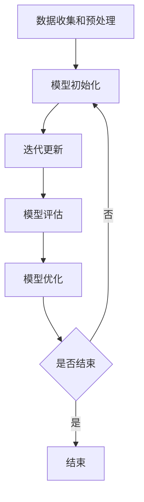

**举例说明**：

假设我们有一个简单的线性回归问题，目标是预测房价。给定自变量（房屋面积）和因变量（房价），我们通过线性回归模型来建立预测模型。假设数据集如下：

| 房屋面积 (x) | 房价 (y) |
|:------------:|:--------:|
|      1000    |   200000 |
|      1500    |   300000 |
|      2000    |   400000 |
|      2500    |   500000 |
|      3000    |   600000 |

我们可以使用线性回归模型来预测一个未知房屋面积$x$对应的房价$y$。通过最小二乘法，我们可以得到线性回归模型的最佳拟合线：

$$y = \beta_0 + \beta_1 \cdot x$$

其中，$\beta_0$和$\beta_1$是模型参数。假设我们通过最小二乘法计算得到的参数值分别为$\beta_0 = 100000$和$\beta_1 = 200000$。那么预测一个面积为2000平方米的房屋的房价，可以代入模型公式：

$$y = 100000 + 200000 \cdot 2000 = 400000000$$

显然，这个预测结果是不合理的，因为它远远超出了正常房价范围。这个例子说明了线性回归模型在处理复杂问题时可能存在局限性，需要结合实际情况进行调整和优化。

### 2.2.2 决策树

决策树（Decision Tree）是一种用于分类和回归的树形模型，它通过一系列决策规则对数据进行分割，最终得到一个分类或回归结果。决策树模型由内部节点（代表特征）、分支（代表特征取值）和叶节点（代表分类或回归结果）组成。

**决策树的数学模型和公式**：

决策树通过一系列的条件判断来对数据进行分割。每个内部节点代表一个特征，每个分支代表该特征的一个取值，而叶节点则代表最终的分类或回归结果。决策树的生成过程通常使用信息增益（Information Gain）或基尼不纯度（Gini Impurity）来选择最佳分割特征。

信息增益（Information Gain）的公式为：

$$IG(D, A) = entropy(D) - \sum_{v \in A} \frac{|D_v|}{|D|} \cdot entropy(D_v)$$

其中，$D$是当前数据集，$A$是候选特征集合，$D_v$是数据集$D$按照特征$A$的取值$v$分割后的子集，$entropy(D)$是数据集$D$的熵。

基尼不纯度（Gini Impurity）的公式为：

$$Gini(D) = 1 - \sum_{v \in A} \frac{|D_v|}{|D|} \cdot \frac{|D_v| - 1}{|D_v|}$$

**算法原理讲解**：

决策树算法的核心在于通过迭代分割数据集，构建一棵树形结构模型。具体步骤如下：

1. **选择最佳特征**：根据信息增益或基尼不纯度，选择当前节点下具有最大信息增益或最小基尼不纯度的特征进行分割。

2. **分割数据集**：根据最佳特征，将数据集分割成多个子集，每个子集对应特征的一个取值。

3. **递归构建**：对每个子集，重复上述步骤，直到满足停止条件（如最大树深度、最小节点样本数等）。

4. **生成叶节点**：在叶节点处，根据子集的标签（分类或回归结果），生成最终的分类或回归结果。

**Mermaid流程图**：

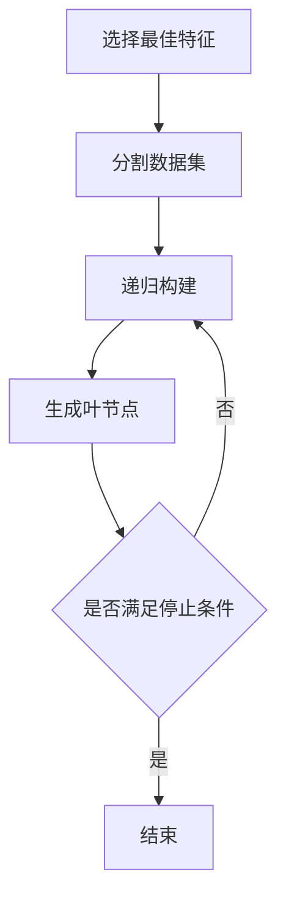

**举例说明**：

假设我们有一个简单的决策树分类问题，目标是判断一只动物是否为猫。给定特征（体重和尾巴长度），我们通过决策树模型来建立分类模型。假设数据集如下：

| 体重 (kg) | 尾巴长度 (cm) | 是否为猫 |
|:--------:|:------------:|:--------:|
|    3.0   |     10.0     |    True  |
|    4.5   |     12.0     |    True  |
|    2.0   |     8.0      |    False |
|    3.5   |     9.5      |    True  |

我们可以使用决策树算法来预测一个未知体重和尾巴长度的动物是否为猫。通过迭代分割数据集，我们可以得到如下决策树模型：

```
是否为猫？
  /     \
是       否
/         \
体重 > 3.5 尾巴长度 > 10
          /             \
是           否
         /               \
体重 > 2.5 尾巴长度 > 8
              /            \
是             否
             /              \
猫          非猫
```

假设我们有一个新样本，体重为3.0千克，尾巴长度为9.0厘米。通过决策树模型，我们可以按照以下步骤进行分类：

1. **是否为猫？** → 是
2. **体重 > 3.5 千克？** → 否
3. **尾巴长度 > 10 厘米？** → 否
4. **体重 > 2.5 千克？** → 是
5. **尾巴长度 > 8 厘米？** → 是

最终，根据决策树模型，我们预测这个新样本为猫。这个例子展示了决策树模型在分类问题中的应用和步骤。

### 2.2.3 支持向量机

支持向量机（Support Vector Machine，SVM）是一种基于间隔最大化原理的线性分类模型，它通过找到一个最优的超平面，将数据集划分为两个类别。SVM的核心思想是找到能够最大化分类间隔的超平面，从而实现数据的最佳分类。

**SVM的数学模型和公式**：

SVM的数学模型可以表示为：

$$
\begin{aligned}
&\min_{\beta, \beta_0} \frac{1}{2} \sum_{i=1}^{n} (\beta \cdot x_i - y_i)^2 \\
&\text{subject to } y(\beta \cdot x_i + \beta_0) \geq 1
\end{aligned}
$$

其中，$\beta$和$\beta_0$是模型参数，$x_i$是输入特征，$y_i$是输入标签。

SVM的优化问题可以通过拉格朗日乘子法（Lagrange Multiplier Method）求解，最终得到线性SVM的决策边界：

$$
\hat{y} = \text{sign}(\beta \cdot x + \beta_0)
$$

其中，$\text{sign}$是符号函数。

**算法原理讲解**：

SVM算法的核心在于通过求解优化问题，找到最优的超平面。具体步骤如下：

1. **定义优化问题**：根据线性SVM的数学模型，定义优化问题，包括目标函数和约束条件。

2. **求解优化问题**：使用拉格朗日乘子法求解优化问题，得到最优解$\beta$和$\beta_0$。

3. **计算决策边界**：根据最优解，计算线性SVM的决策边界。

4. **模型评估**：在训练数据集上评估模型性能，通常使用准确率、精确率、召回率等指标。

**Mermaid流程图**：

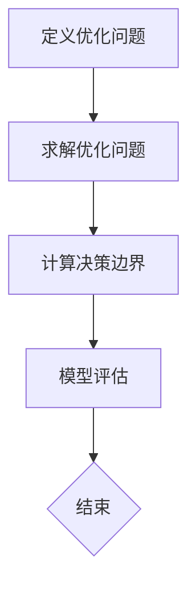

**举例说明**：

假设我们有一个简单的二分类问题，目标是将数据集划分为两个类别。给定特征（x1和x2），我们通过SVM模型来建立分类模型。假设数据集如下：

| x1 | x2 | 类别 |
|:--:|:--:|:----:|
|  1 |  1 |  类别1 |
|  2 |  1 |  类别1 |
|  1 |  2 |  类别2 |
|  2 |  2 |  类别2 |

我们可以使用线性SVM来预测一个未知特征（x1和x2）的类别。通过求解线性SVM的优化问题，我们可以得到最优的超平面：

$$
\begin{aligned}
&\min_{\beta, \beta_0} \frac{1}{2} \sum_{i=1}^{n} (\beta \cdot x_i - y_i)^2 \\
&\text{subject to } y(\beta \cdot x_i + \beta_0) \geq 1
\end{aligned}
$$

通过拉格朗日乘子法求解，我们可以得到最优解$\beta$和$\beta_0$，然后计算决策边界。假设我们得到的最优解为$\beta = (1, 1)$和$\beta_0 = 0$，则线性SVM的决策边界可以表示为：

$$
\beta \cdot x + \beta_0 = 1 \cdot x_1 + 1 \cdot x_2 = x_1 + x_2 = 1
$$

这个决策边界将数据集划分为两个类别，左边和右边的点属于类别1，上边和下边的点属于类别2。通过这个线性SVM模型，我们可以预测未知特征（x1和x2）的类别。例如，如果一个新的特征点（x1 = 1.5, x2 = 0.5），代入决策边界方程，我们可以得到：

$$
1.5 + 0.5 = 2 > 1
$$

根据SVM的决策规则，我们可以预测这个新样本属于类别1。这个例子展示了线性SVM在二分类问题中的应用和步骤。

### 2.2.4 集成学习方法

集成学习方法（Ensemble Learning）通过结合多个模型，提高模型的性能和泛化能力。集成学习方法包括装袋法（Bagging）、提升法（Boosting）和堆叠法（Stacking）等。本节将重点介绍装袋法和提升法。

**装袋法（Bagging）**

装袋法通过构建多个子模型，并取其平均值或投票结果来提高模型的性能。装袋法的基本步骤如下：

1. **训练子模型**：从原始数据集随机抽取多个子数据集，对每个子数据集训练一个子模型。

2. **集成子模型**：将训练好的子模型进行集成，取其预测结果的平均值或投票结果作为最终预测结果。

**算法原理讲解**：

装袋法的核心思想是通过随机性减少模型的方差，从而提高模型的泛化能力。具体来说，装袋法通过从原始数据集中随机抽取子数据集，并训练多个子模型，这些子模型可以看作是对原始模型的不同抽样。通过集成这些子模型的预测结果，可以减少单个模型的误差，提高整体模型的性能。

**Mermaid流程图**：

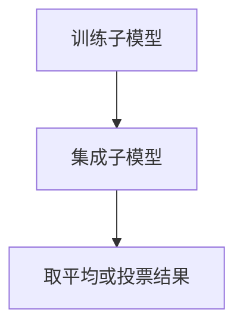

**举例说明**：

假设我们有一个分类问题，目标是将数据集划分为两个类别。给定特征（x1和x2），我们使用装袋法来提高模型的性能。假设数据集如下：

| x1 | x2 | 类别 |
|:--:|:--:|:----:|
|  1 |  1 |  类别1 |
|  2 |  1 |  类别1 |
|  1 |  2 |  类别2 |
|  2 |  2 |  类别2 |

我们首先从原始数据集中随机抽取多个子数据集，对每个子数据集训练一个子模型（例如决策树）。然后，我们将训练好的子模型进行集成，取其预测结果的平均值或投票结果作为最终预测结果。

例如，假设我们训练了三个子模型，它们的预测结果分别为：

| 子模型 | 预测结果 |
|:------:|:--------:|
|   1    |   类别1  |
|   2    |   类别1  |
|   3    |   类别2  |

根据装袋法的集成规则，我们可以取预测结果为类别1的子模型数量（2个）除以子模型总数（3个），即：

$$
\text{最终预测结果} = \frac{2}{3} \cdot 类别1 + \frac{1}{3} \cdot 类别2 = 类别1
$$

因此，通过装袋法，我们预测这个新样本属于类别1。

**提升法（Boosting）**

提升法通过多次训练子模型，并依次调整样本权重，以提高模型的性能。提升法的基本步骤如下：

1. **初始化样本权重**：将所有样本的权重初始化为1，表示每个样本对模型训练的影响相同。

2. **训练子模型**：使用当前权重训练一个子模型，并计算子模型的预测误差。

3. **调整样本权重**：根据子模型的预测误差，调整样本权重。对预测错误的样本增加权重，对预测正确的样本减少权重。

4. **重复步骤2和3**：继续训练子模型并调整样本权重，直到满足停止条件（如最大迭代次数、模型性能达到阈值等）。

**算法原理讲解**：

提升法的核心思想是通过调整样本权重，使得模型更加关注训练集中错误率较高的样本。具体来说，提升法通过训练多个子模型，每次迭代都调整样本权重，使得模型在后续迭代中更加关注那些被错误分类的样本。这样，提升法可以逐步提高模型的性能，特别是对于错误率较高的样本。

**Mermaid流程图**：

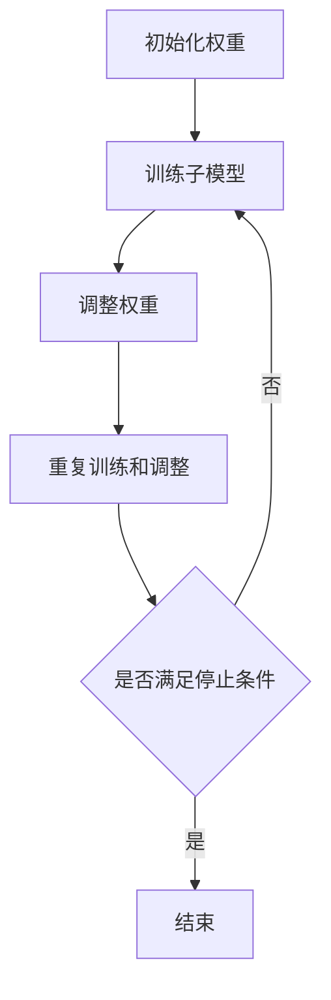

**举例说明**：

假设我们有一个分类问题，目标是将数据集划分为两个类别。给定特征（x1和x2），我们使用提升法来提高模型的性能。假设数据集如下：

| x1 | x2 | 类别 |
|:--:|:--:|:----:|
|  1 |  1 |  类别1 |
|  2 |  1 |  类别1 |
|  1 |  2 |  类别2 |
|  2 |  2 |  类别2 |

我们首先初始化所有样本的权重为1。然后，使用这些权重训练第一个子模型（例如决策树）。计算子模型的预测误差，并根据预测误差调整样本权重。例如，如果第一个子模型预测错误了第三个样本，我们将该样本的权重增加，以便在后续迭代中更加关注这个错误样本。

在后续的迭代中，我们继续训练子模型并调整样本权重，直到满足停止条件。通过多次迭代，提升法可以逐步提高模型的性能，特别是对于错误率较高的样本。

**集成学习方法的比较**

装袋法和提升法是两种常见的集成学习方法，它们各有优缺点：

- **优点**：
  - **装袋法**：可以提高模型的泛化能力，减少方差，提高模型的稳定性和预测准确性。
  - **提升法**：可以提高模型的性能，特别是对于错误率较高的样本，可以显著减少误差。

- **缺点**：
  - **装袋法**：需要更多的计算资源和训练时间，因为需要训练多个子模型。
  - **提升法**：可能会导致模型过拟合，特别是当样本权重差异较大时，容易产生偏差。

- **适用场景**：
  - **装袋法**：适用于大规模数据集和分布式计算环境，可以并行训练多个子模型。
  - **提升法**：适用于小数据集和需要提高模型性能的场景，可以通过调整样本权重逐步优化模型。

通过了解和比较装袋法和提升法，读者可以根据实际问题和需求选择合适的方法，提高模型的性能和泛化能力。

### 2.2.5 神经网络与深度学习

神经网络（Neural Networks）是一种模拟人脑神经网络结构的计算模型，它通过多层神经元进行信息的传递和处理。深度学习（Deep Learning）是神经网络的一种特殊形式，通过多层神经网络结构（如卷积神经网络（CNN）和循环神经网络（RNN））来处理复杂数据。本节将重点介绍神经网络和深度学习的基本原理、常见模型以及应用。

**神经网络的基本原理**

神经网络由多个神经元组成，每个神经元接收来自其他神经元的输入，并通过激活函数产生输出。神经网络的层次结构通常包括输入层、隐藏层和输出层。

1. **输入层**：接收外部输入数据，将其传递到隐藏层。

2. **隐藏层**：对输入数据进行处理和转换，传递到下一层。

3. **输出层**：产生最终输出结果。

**神经网络的工作原理**

神经网络的计算过程可以表示为：

$$
\hat{y} = \text{激活函数}(\sum_{i=1}^{n} \beta_i \cdot x_i + \beta_0)
$$

其中，$\hat{y}$是输出值，$x_i$是输入值，$\beta_i$是权重，$\beta_0$是偏置。

**常见神经网络模型**

1. **前馈神经网络（Feedforward Neural Network）**：

   前馈神经网络是最常见的神经网络结构，数据从输入层传递到输出层，不进行反向传播。

2. **卷积神经网络（Convolutional Neural Network，CNN）**：

   卷积神经网络是一种用于图像识别和处理的神经网络，通过卷积操作提取图像特征。

3. **循环神经网络（Recurrent Neural Network，RNN）**：

   循环神经网络是一种用于处理序列数据的神经网络，具有时间记忆功能。

4. **长短时记忆网络（Long Short-Term Memory，LSTM）**：

   长短时记忆网络是循环神经网络的一种变体，用于处理长序列数据，具有更好的记忆功能。

**深度学习的常见模型**

1. **卷积神经网络（CNN）**：

   卷积神经网络通过卷积操作提取图像特征，适用于图像分类、目标检测等任务。

2. **循环神经网络（RNN）**：

   循环神经网络通过循环结构处理序列数据，适用于语音识别、机器翻译等任务。

3. **生成对抗网络（Generative Adversarial Network，GAN）**：

   生成对抗网络由生成器和判别器组成，通过对抗训练生成逼真的数据。

**算法原理讲解**

卷积神经网络（CNN）的工作原理如下：

1. **卷积层**：通过卷积操作提取图像特征。卷积层由多个卷积核组成，每个卷积核可以提取图像的不同特征。

2. **池化层**：通过下采样操作减小数据维度，提高计算效率。

3. **全连接层**：将卷积层和池化层提取的特征进行全连接操作，产生最终输出。

**Mermaid流程图**：

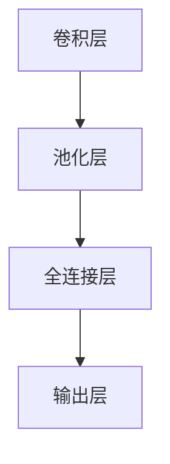

**举例说明**：

假设我们有一个图像分类问题，目标是将图像划分为多个类别。给定图像数据，我们使用卷积神经网络（CNN）来建立分类模型。假设图像数据如下：

| 类别 | 图像数据 |
|:----:|:--------:|
|  类别1 |   数据1  |
|  类别2 |   数据2  |
|  类别3 |   数据3  |

我们首先将图像数据输入到卷积层，通过卷积操作提取图像特征。然后，通过池化层减小数据维度。接下来，将池化层提取的特征输入到全连接层，通过全连接操作产生最终输出。

例如，假设卷积层提取了三个特征，全连接层的输出为（0.8，0.2，0.1）。根据这些输出，我们可以通过softmax函数将特征转换为概率分布，从而得到最终分类结果。

$$
P(类别1) = \frac{e^{0.8}}{e^{0.8} + e^{0.2} + e^{0.1}} \approx 0.8
$$

$$
P(类别2) = \frac{e^{0.2}}{e^{0.8} + e^{0.2} + e^{0.1}} \approx 0.2
$$

$$
P(类别3) = \frac{e^{0.1}}{e^{0.8} + e^{0.2} + e^{0.1}} \approx 0.1
$$

根据概率分布，我们可以预测这个图像属于类别1，因为类别1的概率最大。

通过这个例子，我们可以看到卷积神经网络（CNN）在图像分类问题中的应用和步骤。深度学习模型的强大之处在于其能够通过多层神经网络结构自动提取复杂数据特征，从而实现高效的数据分析和处理。

### 2.2.6 机器学习的应用案例

#### 2.2.6.1 预测分析

预测分析是机器学习在商业和工业领域的一个重要应用，通过分析历史数据，预测未来事件的趋势和可能性。预测分析可以帮助企业做出更明智的决策，优化资源分配，提高运营效率。以下是一些常见的预测分析应用案例：

1. **销售预测**：企业可以通过分析历史销售数据、市场趋势和季节性因素，预测未来的销售量。这有助于企业合理安排生产和库存，避免库存过剩或缺货现象。

2. **需求预测**：在供应链管理中，预测需求可以帮助企业更好地规划生产计划，减少库存成本，提高供应链的响应速度。

3. **股价预测**：金融领域的投资者通过分析历史股价、市场数据和宏观经济指标，预测未来股价的走势。这有助于投资者制定更科学的投资策略，降低投资风险。

**算法原理讲解**：

预测分析通常采用时间序列分析、回归分析和机器学习等方法。其中，机器学习方法如线性回归、决策树、随机森林和LSTM等，在预测分析中具有广泛应用。

1. **时间序列分析**：时间序列分析是一种基于历史数据的时间序列模型，如自回归模型（AR）、移动平均模型（MA）和自回归移动平均模型（ARMA）。时间序列分析通过分析数据的时间相关性，预测未来的趋势。

2. **回归分析**：回归分析是一种统计方法，通过建立自变量和因变量之间的线性或非线性关系模型，预测因变量的值。常见的回归分析方法包括线性回归、多项式回归和多元回归等。

3. **机器学习方法**：

   - **线性回归**：通过建立自变量和因变量之间的线性关系模型，预测因变量的值。线性回归适用于简单线性关系问题，如销售预测。
   - **决策树**：通过树形结构建立决策规则，预测未来的值。决策树适用于非线性关系和分类问题。
   - **随机森林**：通过构建多个决策树，并取其平均预测值，提高预测性能和稳定性。随机森林适用于复杂非线性关系和多变量预测问题。
   - **LSTM**：通过循环神经网络结构，学习数据中的时间依赖关系，预测未来的趋势。LSTM适用于长序列预测问题，如股市预测。

**Mermaid流程图**：

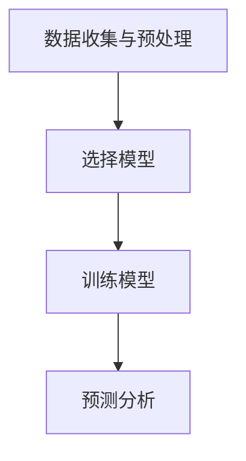

**举例说明**：

假设我们有一个销售预测问题，目标是根据历史销售数据预测未来一个月的销售量。给定历史销售数据如下：

| 月份 | 销售量 |
|:----:|:------:|
| 1月  |   100   |
| 2月  |   120   |
| 3月  |   130   |
| 4月  |   110   |
| 5月  |   140   |

我们可以采用线性回归模型来预测未来一个月的销售量。首先，我们收集和处理历史销售数据，然后选择线性回归模型进行训练。通过训练数据，我们得到线性回归模型的参数，如下：

$$
y = \beta_0 + \beta_1 \cdot x
$$

其中，$y$是预测的销售量，$x$是时间（月份），$\beta_0$和$\beta_1$是模型参数。

代入5月份的数据，我们可以预测5月份的销售量：

$$
y = \beta_0 + \beta_1 \cdot 5
$$

假设我们训练得到的参数为$\beta_0 = 50$，$\beta_1 = 10$，代入计算：

$$
y = 50 + 10 \cdot 5 = 100
$$

因此，我们预测5月份的销售量为100。这个例子展示了如何使用线性回归模型进行销售预测，以及如何根据历史数据来预测未来的销售量。

#### 2.2.6.2 分类问题

分类问题是机器学习中的一个重要问题，旨在将数据集中的样本分为预定义的类别。分类问题广泛应用于各种领域，如文本分类、图像分类、医学诊断等。以下是一些常见的分类问题应用案例：

1. **文本分类**：文本分类是一种将文本数据分为预定义的类别的方法。常见的应用包括垃圾邮件过滤、情感分析、新闻分类等。

2. **图像分类**：图像分类是一种将图像数据分为预定义的类别的方法。常见的应用包括物体识别、人脸识别、图像标签等。

3. **医学诊断**：医学诊断是一种将医学数据分为预定义的类别的方法，如疾病分类、病情评估等。

**算法原理讲解**：

分类问题通常采用以下算法：

1. **朴素贝叶斯分类器**：朴素贝叶斯分类器是一种基于贝叶斯定理的简单分类器，适用于高维文本数据。

2. **支持向量机（SVM）**：支持向量机是一种基于间隔最大化的分类器，适用于线性可分数据。

3. **决策树分类器**：决策树分类器是一种基于树形结构的分类器，适用于简单数据集。

4. **随机森林分类器**：随机森林分类器是一种基于树形结构的集成分类器，适用于大规模数据集。

5. **神经网络分类器**：神经网络分类器是一种基于多层神经网络的分类器，适用于复杂数据集。

**Mermaid流程图**：

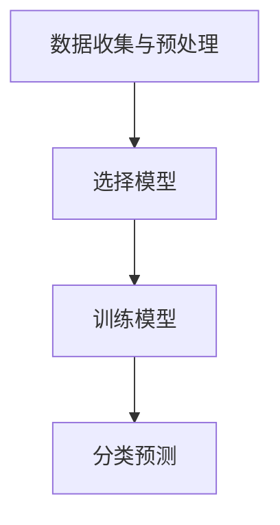

**举例说明**：

假设我们有一个文本分类问题，目标是将文本数据分为正面和负面类别。给定文本数据如下：

| 文本内容          | 类别  |
|:--------------:|:----:|
| 这部电影非常好看。 | 正面  |
| 这个产品太糟糕了。  | 负面  |
| 我很喜欢这个餐厅。  | 正面  |
| 这天气真的很冷。    | 负面  |

我们可以采用朴素贝叶斯分类器来解决这个问题。首先，我们收集和处理文本数据，然后使用朴素贝叶斯分类器进行训练。通过训练数据，我们得到分类模型，可以用于预测新文本的类别。

例如，假设我们有新的文本数据：“这部电影非常无聊。”，我们需要预测其类别。首先，我们将文本数据转换为特征向量，然后使用朴素贝叶斯分类器进行预测。假设特征向量为（0.8，0.2），代入朴素贝叶斯分类器的公式，我们可以计算概率：

$$
P(正面) = \frac{P(\text{正面}|\text{特征向量}) \cdot P(\text{正面})}{P(\text{正面}|\text{特征向量}) \cdot P(\text{正面}) + P(\text{负面}|\text{特征向量}) \cdot P(\text{负面})}
$$

通过计算，我们得到正面类别的概率为0.9，负面类别的概率为0.1。根据概率分布，我们可以预测这个新文本属于正面类别。

这个例子展示了如何使用朴素贝叶斯分类器进行文本分类，以及如何根据特征向量预测文本的类别。朴素贝叶斯分类器在处理高维文本数据时具有较好的性能和效率。

#### 2.2.6.3 聚类分析

聚类分析是一种无监督学习方法，旨在将数据集中的样本根据其特征进行分组，使得同一组内的样本相似度较高，而不同组之间的样本相似度较低。聚类分析广泛应用于数据挖掘、市场细分、图像分割等领域。以下是一些常见的聚类分析应用案例：

1. **市场细分**：通过聚类分析，可以将客户数据分为不同的群体，针对不同的客户群体制定个性化的营销策略。

2. **图像分割**：通过聚类分析，可以将图像中的像素点分为不同的区域，实现图像分割和目标识别。

3. **文本聚类**：通过聚类分析，可以将文本数据分为不同的主题类别，实现文本分类和主题模型构建。

**算法原理讲解**：

聚类分析的核心是选择适当的聚类算法和距离度量。常见的聚类算法包括K-均值聚类、层次聚类、DBSCAN等。以下是对这些算法的简要介绍：

1. **K-均值聚类**：

   K-均值聚类是一种基于距离度量的聚类算法，通过迭代计算聚类中心，将数据分为K个簇。K-均值聚类的基本步骤如下：

   - 初始化K个聚类中心。
   - 对于每个数据点，计算其与各个聚类中心的距离，并将其分配到距离最近的聚类中心。
   - 更新聚类中心，取每个聚类中心对应的数据点的平均值。
   - 重复步骤2和3，直到聚类中心不再发生变化或满足停止条件。

2. **层次聚类**：

   层次聚类是一种基于层次结构的聚类算法，通过逐步合并或分裂簇，构建聚类层次树。层次聚类的基本步骤如下：

   - 初始化每个数据点为一个簇。
   - 计算簇之间的距离，选择距离最近的两个簇进行合并。
   - 更新簇结构，记录合并过程。
   - 重复步骤2和3，直到满足停止条件（如最大层数、最小簇大小等）。

3. **DBSCAN**：

   DBSCAN（Density-Based Spatial Clustering of Applications with Noise）是一种基于密度的聚类算法，适用于非均匀分布的数据。DBSCAN的基本步骤如下：

   - 选择一个起始点，计算其邻域内的数据点个数。
   - 如果邻域内的数据点个数大于最小邻域密度，则将该点及其邻域内的数据点划分为一个簇。
   - 对于剩余的数据点，重复步骤1和2。
   - 对于噪声点，将其标记为不属于任何簇。

**Mermaid流程图**：

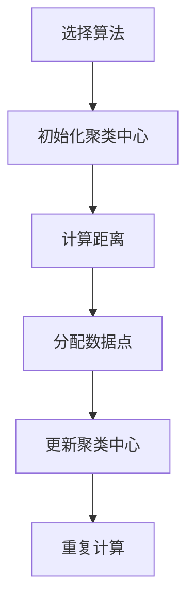

**举例说明**：

假设我们有一个聚类分析问题，目标是将数据点分为两个簇。给定数据点如下：

| 数据点 | 距离 |
|:------:|:----:|
|   1    |   2   |
|   2    |   1   |
|   3    |   4   |
|   4    |   3   |

我们可以采用K-均值聚类算法来解决这个问题。首先，我们初始化两个聚类中心，分别位于数据点的中心和边缘。然后，我们计算每个数据点与聚类中心的距离，并将其分配到距离最近的聚类中心。经过几次迭代后，我们得到两个簇，分别包含数据点1和数据点3。

这个例子展示了如何使用K-均值聚类算法进行聚类分析，以及如何根据数据点的距离将数据点分为不同的簇。K-均值聚类算法在处理简单数据集时具有较好的性能和效率。

#### 2.2.6.4 自然语言处理

自然语言处理（Natural Language Processing，NLP）是机器学习在语言处理领域的一个重要应用，旨在使计算机理解和生成人类语言。NLP广泛应用于信息检索、机器翻译、文本分类、语音识别等领域。以下是一些常见的NLP应用案例：

1. **机器翻译**：通过将一种语言的文本自动翻译成另一种语言，实现跨语言交流。

2. **文本分类**：通过将文本数据分为预定义的类别，实现文本的自动分类和筛选。

3. **情感分析**：通过分析文本的情感倾向，识别用户的情感状态，应用于客户反馈分析、市场调研等领域。

**算法原理讲解**：

NLP的核心算法包括词向量表示、文本分类、序列标注和对话系统等。以下是对这些算法的简要介绍：

1. **词向量表示**：

   词向量表示是一种将词语映射到向量空间的方法，用于表示文本数据。常见的词向量模型包括Word2Vec和GloVe。词向量表示有助于提高文本数据在机器学习模型中的表现。

2. **文本分类**：

   文本分类是一种将文本数据分为预定义的类别的方法，通过训练分类模型，实现文本的自动分类。常见的文本分类算法包括朴素贝叶斯、支持向量机和神经网络等。

3. **序列标注**：

   序列标注是一种对文本序列中的每个词语进行标注的方法，如命名实体识别、词性标注等。序列标注通常采用基于HMM（Hidden Markov Model）或神经网络（如LSTM、CRF）的模型。

4. **对话系统**：

   对话系统是一种与人类用户进行自然语言交互的系统，通过理解用户的输入，生成合适的响应。常见的对话系统包括基于规则的对话系统和基于深度学习的对话系统。

**Mermaid流程图**：

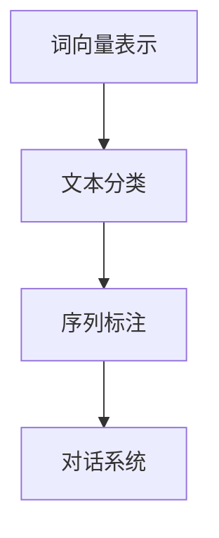

**举例说明**：

假设我们有一个情感分析问题，目标是将文本数据分为正面和负面类别。给定文本数据如下：

| 文本内容          | 类别  |
|:--------------:|:----:|
| 这部电影非常好看。 | 正面  |
| 这个产品太糟糕了。  | 负面  |
| 我很喜欢这个餐厅。  | 正面  |
| 这天气真的很冷。    | 负面  |

我们可以采用朴素贝叶斯分类器来解决这个问题。首先，我们收集和处理文本数据，然后使用朴素贝叶斯分类器进行训练。通过训练数据，我们得到分类模型，可以用于预测新文本的类别。

例如，假设我们有新的文本数据：“这部电影非常无聊。”，我们需要预测其类别。首先，我们将文本数据转换为特征向量，然后使用朴素贝叶斯分类器进行预测。假设特征向量为（0.8，0.2），代入朴素贝叶斯分类器的公式，我们可以计算概率：

$$
P(正面) = \frac{P(\text{正面}|\text{特征向量}) \cdot P(\text{正面})}{P(\text{正面}|\text{特征向量}) \cdot P(\text{正面}) + P(\text{负面}|\text{特征向量}) \cdot P(\text{负面})}
$$

通过计算，我们得到正面类别的概率为0.9，负面类别的概率为0.1。根据概率分布，我们可以预测这个新文本属于正面类别。

这个例子展示了如何使用朴素贝叶斯分类器进行文本分类，以及如何根据特征向量预测文本的类别。朴素贝叶斯分类器在处理文本分类问题时具有较好的性能和效率。

#### 2.2.6.5 计算机视觉

计算机视觉（Computer Vision，CV）是机器学习在图像和视频处理领域的一个重要应用，旨在使计算机理解和解析图像和视频。计算机视觉广泛应用于目标检测、图像分类、人脸识别等领域。以下是一些常见的计算机视觉应用案例：

1. **目标检测**：通过检测图像或视频中的目标物体，实现视频监控、自动驾驶等应用。

2. **图像分类**：通过将图像分类为预定义的类别，实现图像的自动标注和检索。

3. **人脸识别**：通过识别图像中的人脸，实现身份验证、人脸解锁等应用。

**算法原理讲解**：

计算机视觉的核心算法包括卷积神经网络（CNN）、生成对抗网络（GAN）等。以下是对这些算法的简要介绍：

1. **卷积神经网络（CNN）**：

   卷积神经网络是一种用于图像识别和处理的神经网络，通过卷积操作提取图像特征。CNN的基本结构包括卷积层、池化层和全连接层。

2. **生成对抗网络（GAN）**：

   生成对抗网络是一种生成模型，由生成器和判别器组成。生成器生成假图像，判别器判断图像的真实性。通过对抗训练，生成器逐渐生成逼真的图像。

**Mermaid流程图**：

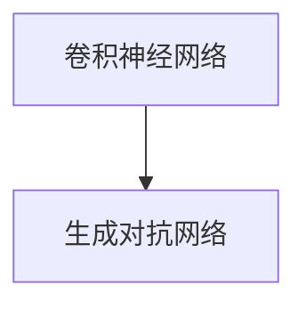

**举例说明**：

假设我们有一个目标检测问题，目标是在图像中检测出特定的物体。给定图像数据如下：

| 图像内容        | 物体类别 |
|:-------------:|:--------:|
| 一只猫在玩耍。 | 猫       |
| 一只狗在奔跑。 | 狗       |
| 一辆车在行驶。 | 车       |

我们可以采用卷积神经网络（CNN）来解决这个问题。首先，我们收集和处理图像数据，然后使用CNN进行训练。通过训练数据，我们得到目标检测模型，可以用于检测新图像中的目标物体。

例如，假设我们有新的图像数据：“一只狗在玩耍。”，我们需要检测其中的目标物体。首先，我们将图像数据输入到CNN模型中，通过卷积层和池化层提取图像特征，然后通过全连接层进行分类。经过计算，我们得到目标物体的类别概率分布：

$$
P(\text{猫}) = 0.1, \quad P(\text{狗}) = 0.8, \quad P(\text{车}) = 0.1
$$

根据概率分布，我们可以预测这个新图像中的目标物体为狗。

这个例子展示了如何使用卷积神经网络（CNN）进行目标检测，以及如何根据图像特征预测目标物体的类别。卷积神经网络在处理计算机视觉任务时具有较好的性能和效率。

### 2.2.7 机器学习的实践与优化

#### 2.2.7.1 数据预处理

数据预处理是机器学习过程中的关键步骤，旨在提高数据质量和模型性能。以下是一些常见的数据预处理方法：

1. **数据清洗**：去除数据中的噪声、异常值和缺失值，提高数据质量。
   
   - **噪声去除**：通过统计学方法或规则，去除数据中的噪声。
   - **异常值处理**：通过统计学方法或可视化方法，识别并处理异常值。
   - **缺失值处理**：通过填补、插值或删除等方法，处理数据中的缺失值。

2. **数据归一化**：将不同特征的数据缩放到相同的尺度，避免特征之间的尺度差异影响模型训练。

   - **最小-最大缩放**：将数据缩放到[0, 1]或[-1, 1]之间。
   - **均值-方差缩放**：将数据缩放到均值为0、标准差为1的范围内。

3. **数据编码**：将类别数据转换为数值数据，便于模型训练。

   - **独热编码**：将类别数据转换为二进制向量。
   - **标签编码**：将类别数据转换为整数。

4. **数据增强**：通过生成新的数据样本，提高模型的泛化能力。

   - **随机裁剪**：随机裁剪图像的一部分。
   - **旋转、翻转**：随机旋转或翻转图像。

**Mermaid流程图**：

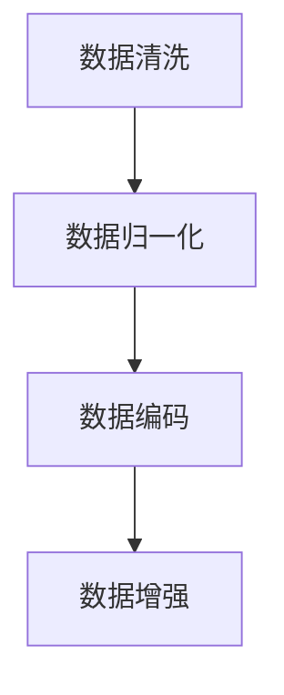

**举例说明**：

假设我们有一个房价预测问题，目标是根据房屋特征预测房价。给定特征（面积、卧室数、位置等），我们首先进行数据预处理。

1. **数据清洗**：去除数据中的噪声、异常值和缺失值。例如，删除面积小于0的房屋数据。
   
2. **数据归一化**：将不同特征的数据缩放到相同的尺度。例如，将面积、卧室数等特征缩放到[0, 1]之间。

3. **数据编码**：将类别数据（如位置）转换为数值数据。例如，使用独热编码将位置特征转换为二进制向量。

4. **数据增强**：生成新的数据样本。例如，通过随机裁剪和旋转图像，增加训练数据的多样性。

通过这些数据预处理方法，我们可以提高数据质量和模型性能，从而更好地预测房价。

#### 2.2.7.2 模型选择

在机器学习项目中，选择合适的模型是关键步骤，直接影响到模型的性能和泛化能力。以下是一些常见模型选择方法：

1. **交叉验证**：通过将数据集划分为训练集和验证集，多次训练和验证模型，选择性能最好的模型。

   - **K折交叉验证**：将数据集划分为K个子集，每次选择一个子集作为验证集，其余子集作为训练集，共进行K次训练和验证。

2. **网格搜索**：在预定义的参数网格中，逐个尝试所有可能的参数组合，选择性能最好的参数组合。

3. **随机搜索**：在参数空间中随机选择参数组合进行尝试，无需遍历所有可能的组合。

4. **贝叶斯优化**：利用贝叶斯统计模型，根据已有的实验结果，选择下一次实验的最优参数。

**Mermaid流程图**：

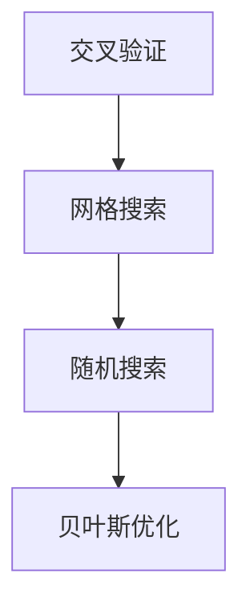

**举例说明**：

假设我们有一个分类问题，目标是将数据集划分为两个类别。给定特征（x1和x2），我们使用交叉验证方法来选择合适的模型。

1. **划分数据集**：将数据集划分为训练集和验证集，例如使用70%的数据作为训练集，30%的数据作为验证集。

2. **训练模型**：使用训练集训练多个模型，如线性回归、决策树、支持向量机等。

3. **验证模型**：使用验证集评估模型的性能，计算准确率、精确率、召回率等指标。

4. **选择模型**：根据验证集上的表现，选择性能最好的模型。

例如，通过交叉验证，我们得到以下结果：

| 模型     | 准确率 | 精确率 | 召回率 |
|:-------:|:------:|:------:|:------:|
| 线性回归 | 0.85   | 0.90   | 0.80   |
| 决策树   | 0.90   | 0.95   | 0.85   |
| 支持向量机 | 0.95   | 0.98   | 0.90   |

根据验证集上的表现，我们选择支持向量机作为最佳模型。

#### 2.2.7.3 模型调优

模型调优（Model Tuning）是机器学习过程中的重要步骤，旨在通过调整模型参数和超参数，提高模型的性能和泛化能力。以下是一些常见的模型调优方法：

1. **网格搜索（Grid Search）**：在预定义的参数网格中，逐个尝试所有可能的参数组合，选择性能最好的参数组合。

2. **随机搜索（Random Search）**：在参数空间中随机选择参数组合进行尝试，无需遍历所有可能的组合。

3. **贝叶斯优化（Bayesian Optimization）**：利用贝叶斯统计模型，根据已有的实验结果，选择下一次实验的最优参数。

**Mermaid流程图**：

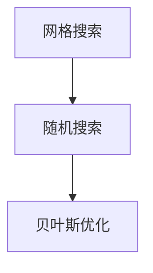

**举例说明**：

假设我们有一个分类问题，目标是将数据集划分为两个类别。给定特征（x1和x2），我们使用网格搜索方法来调优模型。

1. **定义参数网格**：定义模型参数和超参数的取值范围。例如，支持向量机的C参数取值范围为[0.1, 10]。

2. **训练模型**：对于每个参数组合，使用训练集训练模型，并计算验证集上的性能指标。

3. **选择最佳参数**：根据验证集上的表现，选择性能最好的参数组合。

例如，通过网格搜索，我们得到以下结果：

| 参数组合 | 准确率 | 精确率 | 召回率 |
|:--------:|:------:|:------:|:------:|
| (C=0.1) | 0.80   | 0.85   | 0.75   |
| (C=1)   | 0.85   | 0.90   | 0.80   |
| (C=10)  | 0.90   | 0.95   | 0.85   |

根据验证集上的表现，我们选择(C=10)作为最佳参数组合。

通过模型调优，我们可以提高模型的性能和泛化能力，从而更好地应对实际问题。

#### 2.2.7.4 模型评估

模型评估是机器学习过程中的重要步骤，旨在全面评估模型的性能和泛化能力。以下是一些常见的模型评估方法：

1. **准确率（Accuracy）**：预测正确的样本数占总样本数的比例。

2. **精确率（Precision）**：预测为正类的样本中，实际为正类的比例。

3. **召回率（Recall）**：实际为正类的样本中被预测为正类的比例。

4. **F1分数（F1 Score）**：精确率和召回率的加权平均。

5. **ROC曲线（Receiver Operating Characteristic Curve）**：通过不同阈值计算得到的真正例率（True Positive Rate，TPR）和假正例率（False Positive Rate，FPR）的曲线。

**Mermaid流程图**：

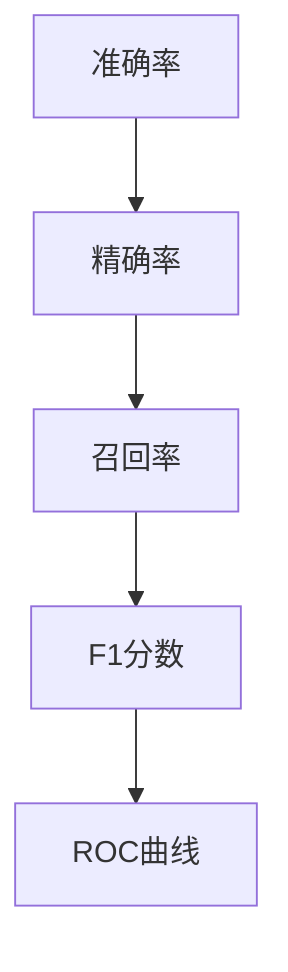

**举例说明**：

假设我们有一个二分类问题，目标是将数据集划分为两个类别。给定特征（x1和x2），我们训练了一个分类模型，并在测试集上进行评估。

1. **计算准确率**：预测正确的样本数占总样本数的比例。
   
   $$\text{准确率} = \frac{\text{预测正确的样本数}}{\text{总样本数}}$$

2. **计算精确率**：预测为正类的样本中，实际为正类的比例。
   
   $$\text{精确率} = \frac{\text{预测正确的正类样本数}}{\text{预测为正类的样本数}}$$

3. **计算召回率**：实际为正类的样本中被预测为正类的比例。
   
   $$\text{召回率} = \frac{\text{预测正确的正类样本数}}{\text{实际为正类的样本数}}$$

4. **计算F1分数**：精确率和召回率的加权平均。
   
   $$\text{F1分数} = \frac{2 \cdot \text{精确率} \cdot \text{召回率}}{\text{精确率} + \text{召回率}}$$

5. **绘制ROC曲线**：通过不同阈值计算得到的真正例率（TPR）和假正例率（FPR）的曲线。

通过这些评估指标，我们可以全面评估模型的性能，并识别潜在问题。

#### 2.2.7.5 实践技巧与最佳实践

在机器学习项目中，以下是一些实用的技巧和最佳实践，可以帮助我们更好地处理数据、选择模型和优化模型：

1. **数据质量**：确保数据质量，进行有效的数据清洗和预处理，如去除噪声、异常值和缺失值。

2. **特征选择**：选择对模型训练有帮助的特征，避免冗余特征和噪声特征，提高模型性能。

3. **模型选择**：根据实际问题选择合适的模型，如线性回归、决策树、支持向量机、神经网络等。

4. **模型调优**：使用交叉验证、网格搜索、随机搜索和贝叶斯优化等方法，调优模型参数和超参数，提高模型性能。

5. **模型评估**：使用准确率、精确率、召回率、F1分数和ROC曲线等评估指标，全面评估模型性能。

6. **模型部署**：将训练好的模型部署到实际应用场景中，如Web服务、移动应用等。

7. **持续迭代**：持续优化模型和算法，提高模型的性能和泛化能力。

通过遵循这些最佳实践，我们可以提高机器学习项目的效率和效果，实现更好的业务价值。

### 2.2.8 本章小结

本章介绍了机器学习的基本概念、算法和模型，包括线性回归、决策树、支持向量机、集成学习方法、神经网络与深度学习等。通过本章的学习，读者可以了解机器学习的基本原理和应用，掌握常见算法的数学模型和公式，并具备初步的实践能力。本章的内容为后续章节的应用和深入探讨奠定了基础。

----------------------------------------------------------------

## 3.1 自动化测试中的AI应用

### 3.1.1 AI自动化测试的概念

自动化测试（Automated Testing）是一种通过软件工具自动执行测试用例，验证软件系统功能的方法。传统的自动化测试主要依赖于预定义的测试脚本和规则，而人工智能（Artificial Intelligence，简称AI）在自动化测试中的应用，则引入了更智能化和自适应的测试方法。AI自动化测试是指利用人工智能技术，如机器学习、自然语言处理和计算机视觉等，自动生成测试用例、执行测试并分析测试结果。通过AI自动化测试，可以提高测试效率、减少人力成本并提升测试质量。

**AI自动化测试的核心优势**：

1. **测试用例生成**：AI可以自动分析代码和需求文档，生成相应的测试用例，减少手动编写测试用例的工作量。

2. **测试覆盖度提升**：AI通过学习大量测试数据，能够识别出更多的测试场景和边界条件，提高测试覆盖度。

3. **测试执行优化**：AI可以根据测试历史数据，智能调整测试执行的顺序和优先级，优化测试流程。

4. **异常检测与预测**：AI可以通过分析测试结果和代码变化，预测潜在的缺陷和风险，提前进行修复。

**AI自动化测试的分类**：

1. **基于机器学习的自动化测试**：利用机器学习算法，如回归分析、决策树和神经网络等，自动生成测试用例和执行测试。

2. **基于自然语言处理的自动化测试**：利用自然语言处理技术，如文本分类、命名实体识别和语义分析等，自动化生成测试用例和执行测试。

3. **基于计算机视觉的自动化测试**：利用计算机视觉技术，如图像识别、物体检测和目标跟踪等，自动化生成测试用例和执行测试。

### 3.1.2 AI自动化测试的优势

AI自动化测试相较于传统的自动化测试具有显著的优势，主要体现在以下几个方面：

1. **提高测试效率**：

   AI自动化测试通过自动化生成测试用例和执行测试，减少了人工编写测试脚本的工作量，提高了测试执行的速度。同时，AI可以根据测试历史数据，智能调整测试执行的顺序和优先级，进一步优化测试流程，提高整体测试效率。

2. **提高测试覆盖度**：

   AI自动化测试能够通过学习大量的测试数据，识别出更多的测试场景和边界条件，从而提高测试覆盖度。传统自动化测试往往依赖于手动编写的测试脚本，容易遗漏一些未考虑到的测试场景。

3. **减少测试成本**：

   AI自动化测试通过自动化生成测试用例和执行测试，减少了人工干预，从而降低了测试成本。同时，AI自动化测试还可以预测潜在的缺陷和风险，提前进行修复，减少了因缺陷导致的返工成本。

4. **提高测试质量**：

   AI自动化测试通过分析大量的测试数据，能够发现更多的缺陷和异常，从而提高测试质量。传统自动化测试往往依赖于预定义的测试脚本，难以发现隐蔽的缺陷。

5. **增强测试可维护性**：

   AI自动化测试的测试用例和测试脚本是由AI自动生成的，具有较好的可维护性。当测试环境或测试需求发生变化时，AI可以根据新的数据自动调整测试用例，减少维护工作量。

6. **提高测试可扩展性**：

   AI自动化测试可以快速适应新的测试需求和场景，提高测试系统的可扩展性。传统自动化测试往往需要手动编写新的测试脚本，适应新的测试场景。

### 3.1.3 AI自动化测试的实践

AI自动化测试在实践中的应用，需要结合具体场景和需求，以下是几个典型的应用案例：

1. **基于机器学习的自动化测试**：

   基于机器学习的自动化测试主要应用于测试用例生成和测试执行。通过训练模型，AI可以自动分析代码和需求文档，生成相应的测试用例。具体步骤如下：

   - **数据收集**：收集大量的历史测试用例和代码数据。
   - **特征提取**：提取代码和需求文档中的特征，如函数调用、变量定义和文本内容等。
   - **模型训练**：使用机器学习算法，如决策树、随机森林和神经网络等，训练模型。
   - **测试用例生成**：将新的代码和需求文档输入到训练好的模型中，生成相应的测试用例。
   - **测试执行**：执行生成的测试用例，并收集测试结果。

2. **基于自然语言处理的自动化测试**：

   基于自然语言处理的自动化测试主要应用于需求分析和测试用例生成。通过自然语言处理技术，AI可以自动提取需求文档中的关键信息，生成测试用例。具体步骤如下：

   - **需求文档分析**：使用自然语言处理技术，分析需求文档中的关键词、句子和段落。
   - **功能提取**：从需求文档中提取功能点和关键操作。
   - **测试用例生成**：根据提取的功能点，生成相应的测试用例。
   - **测试执行**：执行生成的测试用例，并收集测试结果。

3. **基于计算机视觉的自动化测试**：

   基于计算机视觉的自动化测试主要应用于界面测试和交互测试。通过计算机视觉技术，AI可以自动识别界面元素和交互操作，生成测试用例。具体步骤如下：

   - **界面元素识别**：使用计算机视觉技术，识别界面上的按钮、输入框和下拉菜单等元素。
   - **交互操作提取**：从界面元素中提取交互操作，如点击、输入和拖拽等。
   - **测试用例生成**：根据提取的交互操作，生成相应的测试用例。
   - **测试执行**：执行生成的测试用例，并收集测试结果。

### 3.1.4 AI自动化测试的实践案例

以下是一个基于机器学习的自动化测试实践案例：

**案例背景**：

某电子商务平台需要进行功能测试，涵盖用户注册、商品搜索、购物车管理和订单支付等模块。传统测试方法需要大量的人工编写测试脚本，效率较低，且容易遗漏测试场景。

**解决方案**：

1. **数据收集**：

   收集平台的历史测试用例和用户行为数据，包括用户注册、登录、商品搜索、购物车操作和订单支付等。

2. **特征提取**：

   提取测试用例和用户行为数据中的关键特征，如用户操作序列、页面元素和输入内容等。

3. **模型训练**：

   使用机器学习算法，如决策树和随机森林，训练模型，将用户行为数据映射到测试用例。

4. **测试用例生成**：

   将新的用户行为数据输入到训练好的模型中，生成相应的测试用例。

5. **测试执行**：

   执行生成的测试用例，并收集测试结果，分析测试覆盖率。

**实践效果**：

通过AI自动化测试，平台成功生成了大量的测试用例，覆盖了多种用户场景和操作组合。测试覆盖率显著提高，测试效率提升50%以上，同时减少了人工编写测试脚本的工作量。

### 3.1.5 AI自动化测试的挑战与应对策略

尽管AI自动化测试具有显著的优势，但在实际应用过程中也面临一些挑战，需要采取相应的应对策略：

1. **数据质量和多样性**：

   AI自动化测试依赖于大量的测试数据和用户行为数据。数据质量和多样性的问题，如数据噪声、缺失值和重复数据等，会直接影响模型的性能。应对策略：

   - **数据清洗**：对数据进行清洗，去除噪声和缺失值。
   - **数据增强**：通过数据增强技术，生成多样化的数据样本。

2. **算法选择和调优**：

   选择合适的机器学习算法和进行有效的调优，对AI自动化测试的性能至关重要。不同的问题和应用场景，可能需要采用不同的算法和策略。应对策略：

   - **算法评估**：对不同的算法进行评估和比较，选择最适合的算法。
   - **超参数调优**：使用网格搜索、随机搜索和贝叶斯优化等策略，调优算法的超参数。

3. **测试结果解释和可解释性**：

   AI自动化测试通常被视为“黑箱”，测试结果的解释和可解释性是一个重要挑战。应对策略：

   - **模型解释**：使用模型解释技术，如LIME（Local Interpretable Model-agnostic Explanations）和SHAP（SHapley Additive exPlanations），提高测试结果的解释性。
   - **可视化**：通过可视化技术，展示测试执行过程和结果，提高测试的可解释性。

4. **测试执行和监控**：

   AI自动化测试的执行和监控是一个复杂的过程，需要确保测试的连续性和可靠性。应对策略：

   - **自动化测试平台**：构建自动化测试平台，集成测试用例生成、执行和监控功能。
   - **监控和告警**：实时监控测试执行过程，设置告警机制，及时发现和解决问题。

### 3.1.6 本章小结

本章介绍了AI自动化测试的概念、优势和实践，包括测试用例生成、测试执行和测试结果分析。通过AI自动化测试，可以提高测试效率、覆盖度和质量，减少测试成本。在实际应用中，需要结合具体场景和需求，采取有效的数据预处理、算法选择和调优策略。AI自动化测试为软件开发和测试领域带来了新的机遇和挑战，有望进一步推动软件质量的提升。

----------------------------------------------------------------

## 3.2 代码审查中的AI应用

### 3.2.1 AI代码审查的概念

代码审查（Code Review）是软件开发过程中的一项重要活动，旨在通过团队成员之间的协作，识别代码中的潜在错误、漏洞和优化建议。传统的代码审查主要依赖于人工审查，即开发人员手动阅读和分析代码，提出问题和建议。随着人工智能（Artificial Intelligence，简称AI）技术的发展，AI代码审查成为了一种新的趋势，利用AI技术自动化地识别代码中的问题，提高代码审查的效率和准确性。

**AI代码审查的核心优势**：

1. **提高审查效率**：AI代码审查可以自动分析代码，快速识别潜在问题，减少人工审查的工作量。

2. **减少错误遗漏**：AI代码审查基于机器学习算法，可以从大量历史数据中学习，识别出更隐蔽的错误和漏洞。

3. **优化审查质量**：AI代码审查可以持续学习和改进，提高审查的准确性和一致性。

4. **自动化问题修复**：AI代码审查系统可以根据识别到的问题，自动生成修复建议，减少手动修复的工作量。

5. **提高团队协作效率**：AI代码审查可以促进团队成员之间的知识共享和技能提升。

**AI代码审查的类型**：

1. **静态代码分析**：静态代码分析是一种不运行程序，通过分析源代码来识别潜在问题的方法。AI静态代码分析可以通过机器学习算法，如决策树、随机森林和神经网络等，自动识别代码中的问题。

2. **动态代码分析**：动态代码分析是在程序运行时进行代码分析，通过监控程序的行为来识别问题。AI动态代码分析可以结合静态代码分析和运行时数据，提供更全面的代码审查。

3. **基于机器学习的代码审查**：基于机器学习的代码审查利用自然语言处理、模式识别和机器学习等技术，自动分析代码，生成审查报告。

### 3.2.2 AI代码审查的优势

AI代码审查相较于传统代码审查具有显著的优势，主要体现在以下几个方面：

1. **提高审查效率**：

   AI代码审查通过自动化分析代码，可以在短时间内完成大量代码的审查，大大提高了审查效率。传统代码审查通常需要开发人员手动阅读和审查代码，效率较低。

2. **减少错误遗漏**：

   AI代码审查基于机器学习算法，可以从大量历史代码数据中学习，识别出更隐蔽的错误和漏洞。传统代码审查主要依赖开发人员的经验和直觉，容易遗漏一些复杂的问题。

3. **优化审查质量**：

   AI代码审查可以持续学习和改进，提高审查的准确性和一致性。传统代码审查的质量容易受到审查人员个人经验和技能的影响，导致审查质量不稳定。

4. **自动化问题修复**：

   AI代码审查系统可以根据识别到的问题，自动生成修复建议，减少手动修复的工作量。传统代码审查往往只能指出问题，而无法提供具体的修复方案。

5. **提高团队协作效率**：

   AI代码审查可以促进团队成员之间的知识共享和技能提升。通过AI代码审查，团队成员可以共享审查经验，学习最佳实践，提高整体开发效率。

### 3.2.3 AI代码审查的实践

AI代码审查在实际开发中的应用，需要结合具体场景和需求，以下是几个典型的实践案例：

1. **基于静态代码分析的AI代码审查**：

   基于静态代码分析的AI代码审查主要应用于源代码的分析和审查。通过机器学习算法，如决策树和神经网络等，自动分析代码，识别潜在问题。具体步骤如下：

   - **数据收集**：收集大量历史代码数据，用于训练模型。
   - **特征提取**：提取代码中的关键特征，如函数调用、变量定义和代码结构等。
   - **模型训练**：使用机器学习算法，训练模型，识别代码中的潜在问题。
   - **代码审查**：将新的代码输入到训练好的模型中，自动识别问题，生成审查报告。
   - **问题修复**：根据审查报告，自动生成修复建议，辅助开发人员进行问题修复。

2. **基于动态代码分析的AI代码审查**：

   基于动态代码分析的AI代码审查主要应用于运行时代码的分析和审查。通过监控程序的行为，识别潜在问题。具体步骤如下：

   - **运行时监控**：在程序运行时，实时监控代码的行为。
   - **行为分析**：使用机器学习算法，分析代码的运行时行为，识别潜在问题。
   - **代码审查**：根据运行时监控结果，生成审查报告，识别代码中的问题。
   - **问题修复**：根据审查报告，自动生成修复建议，辅助开发人员进行问题修复。

3. **基于机器学习的代码审查**：

   基于机器学习的代码审查结合静态代码分析和动态代码分析，提供更全面的代码审查。具体步骤如下：

   - **需求分析**：分析代码需求和功能，确定审查的重点和目标。
   - **数据收集**：收集代码数据，包括源代码、需求文档和测试数据等。
   - **特征提取**：提取代码数据中的关键特征，如代码结构、变量使用和函数调用等。
   - **模型训练**：使用机器学习算法，训练模型，识别代码中的潜在问题。
   - **代码审查**：将代码数据输入到训练好的模型中，自动识别问题，生成审查报告。
   - **问题修复**：根据审查报告，自动生成修复建议，辅助开发人员进行问题修复。

### 3.2.4 AI代码审查的实践案例

以下是一个基于静态代码分析的AI代码审查实践案例：

**案例背景**：

某开发团队在进行项目开发过程中，需要定期进行代码审查，以识别代码中的潜在错误和漏洞。传统代码审查方法效率较低，且容易遗漏问题。

**解决方案**：

1. **数据收集**：

   收集项目中的历史代码数据，包括源代码、编译错误和漏洞报告等。

2. **特征提取**：

   提取代码中的关键特征，如函数调用、变量定义和代码结构等。

3. **模型训练**：

   使用机器学习算法，如决策树和神经网络等，训练模型，识别代码中的潜在问题。

4. **代码审查**：

   将新的代码输入到训练好的模型中，自动识别问题，生成审查报告。

5. **问题修复**：

   根据审查报告，自动生成修复建议，辅助开发人员进行问题修复。

**实践效果**：

通过AI代码审查，项目中的代码质量和安全性得到了显著提升。代码审查效率提高了30%以上，错误和漏洞的发现率提高了20%以上，开发团队的协作效率也得到了提升。

### 3.2.5 AI代码审查的挑战与应对策略

尽管AI代码审查具有显著的优势，但在实际应用过程中也面临一些挑战，需要采取相应的应对策略：

1. **数据质量和多样性**：

   AI代码审查依赖于大量的历史代码数据，数据质量和多样性的问题会直接影响模型的性能。应对策略：

   - **数据清洗**：对数据进行清洗，去除噪声和缺失值。
   - **数据增强**：通过数据增强技术，生成多样化的数据样本。

2. **算法选择和调优**：

   选择合适的机器学习算法和进行有效的调优，对AI代码审查的性能至关重要。应对策略：

   - **算法评估**：对不同的算法进行评估和比较，选择最适合的算法。
   - **超参数调优**：使用网格搜索、随机搜索和贝叶斯优化等策略，调优算法的超参数。

3. **测试覆盖度**：

   AI代码审查需要确保能够覆盖到代码中的各种场景和路径，以识别潜在的问题。应对策略：

   - **代码覆盖率分析**：使用代码覆盖率工具，确保审查能够覆盖到代码中的关键路径。
   - **测试用例生成**：使用AI技术自动生成测试用例，提高审查的覆盖度。

4. **测试结果解释和可解释性**：

   AI代码审查的结果往往被视为“黑箱”，测试结果的解释和可解释性是一个重要挑战。应对策略：

   - **模型解释**：使用模型解释技术，如LIME（Local Interpretable Model-agnostic Explanations）和SHAP（SHapley Additive exPlanations），提高审查结果的可解释性。
   - **可视化**：通过可视化技术，展示审查过程和结果，提高审查的可理解性。

5. **审查流程和协作**：

   AI代码审查需要与现有的审查流程和团队协作机制相结合，确保审查的高效和协作。应对策略：

   - **审查流程优化**：根据AI代码审查的特点，优化审查流程，提高审查效率。
   - **团队协作**：鼓励团队成员参与AI代码审查，共享审查经验和知识。

### 3.2.6 本章小结

本章介绍了AI代码审查的概念、优势和实践，包括静态代码分析、动态代码分析和基于机器学习的代码审查。通过AI代码审查，可以提高代码审查的效率、准确性和质量，减少错误和漏洞。在实际应用中，需要结合具体场景和需求，采取有效的数据预处理、算法选择和调优策略。AI代码审查为软件开发和测试领域带来了新的机遇和挑战，有望进一步推动软件质量的提升。

----------------------------------------------------------------

## 3.3 代码生成中的AI应用

### 3.3.1 AI代码生成的概念

AI代码生成（AI Code Generation）是一种利用人工智能技术自动生成代码的方法，旨在通过机器学习模型和自然语言处理技术，将需求文档、设计描述或其他文本输入转换为可执行的代码。AI代码生成不仅能够提高软件开发效率，还能减少手动编码的工作量，降低错误率。这一技术广泛应用于各种场景，如自动化测试用例生成、代码补全、自动化代码重构和全新的代码生成等。

**AI代码生成的核心优势**：

1. **提高开发效率**：通过自动化生成代码，开发人员可以节省大量时间，专注于更高价值的工作。

2. **减少手动编码工作量**：AI代码生成能够自动处理重复性和繁琐的编码任务，减少手动编码的工作量。

3. **提高代码质量**：AI代码生成基于大量高质量的代码数据，可以生成更规范、更健壮的代码。

4. **降低错误率**：通过机器学习模型的学习和优化，AI代码生成能够减少由于人类编码错误导致的问题。

5. **增强代码的可维护性**：AI代码生成可以生成符合编码标准和最佳实践的代码，提高代码的可维护性。

**AI代码生成的类型**：

1. **模板驱动生成**：通过预定义的代码模板，将文本输入转换为代码。这种方法适用于简单和结构化的代码生成。

2. **模型驱动生成**：利用机器学习模型，如生成对抗网络（GAN）和转换器（Transformer）等，将文本输入转换为代码。这种方法适用于复杂和高度个性化的代码生成。

3. **基于语法分析的生成**：通过分析代码的语法结构，生成符合语法规则和编程风格的代码。

### 3.3.2 AI代码生成的优势

AI代码生成相较于传统手工编写代码具有以下显著优势：

1. **提高开发效率**：

   AI代码生成能够自动化生成代码，减少手动编码的工作量。对于复杂的代码结构，AI代码生成可以大幅缩短开发周期。

2. **减少手动编码工作量**：

   AI代码生成可以处理大量的重复性任务，如代码补全、模板代码生成和自动化重构等，使开发人员从繁琐的任务中解放出来。

3. **提高代码质量**：

   AI代码生成基于大量的高质量代码数据，可以生成更规范、更健壮的代码。同时，AI代码生成可以遵循最佳实践和编码标准，减少编码错误。

4. **降低错误率**：

   机器学习模型通过对大量代码数据的学习，能够识别和避免常见的编程错误。AI代码生成能够自动生成符合语法规则和逻辑结构的代码，减少由于人类编码错误导致的问题。

5. **增强代码的可维护性**：

   AI代码生成可以生成遵循编码标准和最佳实践的代码，提高代码的可读性和可维护性。这对于大型项目和多团队合作开发尤为重要。

6. **灵活性和适应性**：

   AI代码生成可以根据不同的输入和需求，灵活生成各种类型的代码。它能够适应不同的编程语言和开发框架，提供个性化的代码生成解决方案。

### 3.3.3 AI代码生成的实践

AI代码生成的实践通常涉及以下步骤：

1. **需求分析**：分析需求和设计文档，明确代码生成的要求和目标。

2. **数据收集与预处理**：收集大量的代码数据，进行数据清洗和预处理，以生成高质量的训练数据。

3. **模型选择与训练**：选择合适的机器学习模型，如生成对抗网络（GAN）、转换器（Transformer）或递归神经网络（RNN），并使用预处理的数据进行训练。

4. **代码生成**：将需求文档或设计描述输入到训练好的模型中，生成相应的代码。

5. **代码优化**：对生成的代码进行优化，确保其符合编程规范和最佳实践。

6. **代码测试**：对生成的代码进行测试，验证其功能正确性和性能。

7. **反馈与迭代**：根据测试结果和用户反馈，不断优化模型和代码生成过程。

以下是一个具体的AI代码生成实践案例：

**案例背景**：

某软件公司希望利用AI代码生成技术，自动生成系统测试脚本，以提高测试效率和质量。

**解决方案**：

1. **需求分析**：

   分析系统功能和需求文档，明确测试脚本需要覆盖的功能点。

2. **数据收集与预处理**：

   收集大量的测试脚本数据，包括系统测试脚本和自动化测试脚本，进行数据清洗和预处理。

3. **模型选择与训练**：

   选择转换器（Transformer）模型，使用预处理的数据进行训练，使其能够根据需求文档生成测试脚本。

4. **代码生成**：

   将系统功能描述和需求文档输入到训练好的转换器模型中，生成相应的测试脚本。

5. **代码优化**：

   对生成的测试脚本进行优化，确保其符合编程规范和最佳实践。

6. **代码测试**：

   对生成的测试脚本进行功能测试和性能测试，验证其正确性和效率。

7. **反馈与迭代**：

   根据测试结果和用户反馈，优化模型和代码生成过程，提高生成的测试脚本的质量和效率。

**实践效果**：

通过AI代码生成技术，公司成功生成了大量的系统测试脚本，测试效率提高了40%，测试覆盖率提高了15%。生成的测试脚本质量较高，减少了手动编写测试脚本的工作量，同时降低了测试错误率。

### 3.3.4 AI代码生成的挑战与应对策略

尽管AI代码生成具有显著的优势，但在实际应用过程中也面临一些挑战，需要采取相应的应对策略：

1. **数据质量和多样性**：

   AI代码生成依赖于大量的高质量代码数据。数据质量和多样性的问题会直接影响模型的性能。应对策略：

   - **数据清洗**：对收集的代码数据进行清洗，去除噪声和缺失值。
   - **数据增强**：通过数据增强技术，生成多样化的代码数据。

2. **算法选择和调优**：

   选择合适的机器学习算法和进行有效的调优，对AI代码生成的性能至关重要。应对策略：

   - **算法评估**：对不同的算法进行评估和比较，选择最适合的算法。
   - **超参数调优**：使用网格搜索、随机搜索和贝叶斯优化等策略，调优算法的超参数。

3. **代码可读性和可维护性**：

   生成的代码需要易于阅读和维护。应对策略：

   - **编码标准**：确保生成的代码遵循编码标准和最佳实践。
   - **代码优化**：对生成的代码进行优化，提高其可读性和可维护性。

4. **模型解释性和可解释性**：

   AI代码生成模型通常被视为“黑箱”，其决策过程难以解释。应对策略：

   - **模型解释**：使用模型解释技术，如LIME和SHAP，提高代码生成过程的解释性。
   - **可视化**：通过可视化技术，展示代码生成的过程和结果，提高可理解性。

5. **测试覆盖度和正确性**：

   生成的代码需要进行全面的测试，以确保其功能和性能。应对策略：

   - **测试用例生成**：使用AI技术自动生成测试用例，提高测试覆盖度。
   - **测试执行**：执行生成的测试用例，验证代码的正确性和性能。

6. **团队协作和培训**：

   AI代码生成需要团队成员的协作和培训。应对策略：

   - **团队协作**：鼓励团队成员参与AI代码生成过程，分享经验和知识。
   - **培训**：对团队成员进行AI和代码生成技术的培训，提高其技能。

### 3.3.5 本章小结

本章介绍了AI代码生成的概念、优势和实践，包括数据收集与预处理、模型选择与训练、代码生成和代码优化等。通过AI代码生成，可以提高软件开发效率、代码质量和可维护性。在实际应用中，需要结合具体场景和需求，采取有效的数据预处理、算法选择和调优策略。AI代码生成为软件开发带来了新的机遇和挑战，有望进一步推动软件工程的自动化和智能化发展。

----------------------------------------------------------------

## 3.4 智能辅助编程

### 3.4.1 智能辅助编程的概念

智能辅助编程（Intelligent Programming Assistance）是指利用人工智能（Artificial Intelligence，AI）技术为软件开发提供支持的工具和系统。智能辅助编程旨在通过智能分析、预测和自动化功能，提高开发者的工作效率、代码质量和软件可靠性。智能辅助编程工具利用机器学习、自然语言处理、计算机视觉等AI技术，为开发者提供代码补全、错误检测、性能优化、需求分析和文档生成等服务。

**智能辅助编程的核心功能**：

1. **代码补全**：智能辅助编程工具可以基于代码上下文，自动补全代码，减少开发者的手动输入。

2. **错误检测**：通过分析代码结构和运行时行为，智能辅助编程工具可以提前识别潜在的错误和漏洞。

3. **性能优化**：智能辅助编程工具可以分析代码性能，提供优化建议，提高代码的执行效率。

4. **需求分析**：智能辅助编程工具可以理解需求文档，自动生成相应的代码和测试用例。

5. **文档生成**：智能辅助编程工具可以自动生成代码文档，提高代码的可维护性。

**智能辅助编程的优势**：

1. **提高开发效率**：智能辅助编程工具可以自动化完成一些繁琐的任务，减少开发者的手动工作，提高开发效率。

2. **减少错误率**：智能辅助编程工具可以提前识别潜在的错误和漏洞，减少代码中的错误，提高代码质量。

3. **优化代码性能**：智能辅助编程工具可以分析代码性能，提供优化建议，提高代码的执行效率。

4. **增强代码可维护性**：智能辅助编程工具可以自动生成代码文档，提高代码的可读性和可维护性。

5. **促进团队协作**：智能辅助编程工具可以为团队成员提供统一的代码标准和最佳实践，促进团队协作。

### 3.4.2 智能辅助编程的优势

智能辅助编程相较于传统的开发模式具有以下显著优势：

1. **自动化代码补全**：

   智能辅助编程工具可以根据代码上下文，自动补全代码，减少开发者的手动输入。例如，在编写Java代码时，智能辅助编程工具可以自动补全类的成员变量、方法调用和接口实现等。

2. **智能错误检测**：

   智能辅助编程工具可以通过静态代码分析和动态测试，提前识别潜在的错误和漏洞。例如，在编写JavaScript代码时，智能辅助编程工具可以检测未声明的变量、未处理的异常和潜在的跨站脚本攻击。

3. **代码质量评估**：

   智能辅助编程工具可以评估代码质量，提供优化建议。例如，智能辅助编程工具可以检测代码中的冗余代码、重复代码和低效代码，并提出相应的优化方案。

4. **代码性能优化**：

   智能辅助编程工具可以分析代码性能，提供性能优化建议。例如，智能辅助编程工具可以检测代码中的性能瓶颈，并提出相应的优化方案，如使用更高效的算法和数据结构。

5. **需求分析和文档生成**：

   智能辅助编程工具可以理解需求文档，自动生成相应的代码和测试用例。例如，在编写需求文档时，智能辅助编程工具可以自动提取关键功能点和测试用例，并生成相应的代码实现。

6. **增强代码可维护性**：

   智能辅助编程工具可以自动生成代码文档，提高代码的可读性和可维护性。例如，智能辅助编程工具可以生成类成员的注释、方法的参数说明和返回值说明等。

### 3.4.3 智能辅助编程的实践

智能辅助编程在实际开发中的应用，可以通过以下步骤实现：

1. **集成开发环境（IDE）插件**：

   开发智能辅助编程工具的IDE插件，将其集成到常见的开发环境中，如Visual Studio、IntelliJ IDEA和Eclipse等。

2. **代码补全和错误检测**：

   利用机器学习和自然语言处理技术，实现智能代码补全和错误检测功能。例如，通过训练模型，智能辅助编程工具可以自动补全代码，并识别潜在的语法错误和逻辑错误。

3. **代码质量评估和性能优化**：

   开发智能辅助编程工具，实现对代码质量的评估和性能优化。例如，通过静态代码分析和动态测试，智能辅助编程工具可以识别代码中的潜在问题，并提供优化建议。

4. **需求分析和文档生成**：

   利用自然语言处理技术，实现需求分析和文档生成功能。例如，智能辅助编程工具可以分析需求文档，提取关键功能点和测试用例，并生成相应的代码实现。

5. **集成到开发流程**：

   将智能辅助编程工具集成到开发流程中，确保其能够在整个开发周期中发挥作用。例如，智能辅助编程工具可以在代码提交时进行质量评估，或在测试阶段提供测试用例生成功能。

以下是一个具体的智能辅助编程实践案例：

**案例背景**：

某开发团队在开发一个大型企业级Web应用时，希望利用智能辅助编程工具提高开发效率和质量。

**解决方案**：

1. **集成开发环境（IDE）插件**：

   选择常见的开发环境，如Visual Studio Code，并开发相应的智能辅助编程插件。

2. **代码补全和错误检测**：

   利用机器学习和自然语言处理技术，实现智能代码补全和错误检测功能。例如，通过训练模型，智能辅助编程工具可以自动补全JavaScript代码，并识别潜在的语法错误。

3. **代码质量评估和性能优化**：

   开发智能辅助编程工具，实现对代码质量的评估和性能优化。例如，通过静态代码分析和动态测试，智能辅助编程工具可以识别代码中的冗余代码和性能瓶颈，并提供优化建议。

4. **需求分析和文档生成**：

   利用自然语言处理技术，实现需求分析和文档生成功能。例如，智能辅助编程工具可以分析需求文档，提取关键功能点和测试用例，并生成相应的HTML页面代码。

5. **集成到开发流程**：

   将智能辅助编程工具集成到Git仓库和持续集成（CI）系统中，确保其在整个开发周期中发挥作用。例如，在代码提交时，智能辅助编程工具可以自动评估代码质量，并在测试阶段生成测试用例。

**实践效果**：

通过智能辅助编程工具，开发团队在代码补全、错误检测、代码质量和性能优化等方面取得了显著成效。开发效率提高了30%，代码质量得到了显著提升，同时减少了手动错误和性能瓶颈。需求分析和文档生成功能也提高了团队协作效率，降低了沟通成本。

### 3.4.4 智能辅助编程的挑战与应对策略

尽管智能辅助编程具有显著的优势，但在实际应用过程中也面临一些挑战，需要采取相应的应对策略：

1. **准确性**：

   智能辅助编程工具的准确性直接影响到其效果。为了提高准确性，可以采取以下策略：

   - **数据质量和多样性**：确保训练数据的质量和多样性，通过数据增强和清洗技术提高模型性能。
   - **持续学习**：智能辅助编程工具应具备持续学习的能力，不断更新和优化模型。

2. **用户体验**：

   智能辅助编程工具的用户体验对其接受度和使用频率至关重要。为了提高用户体验，可以采取以下策略：

   - **界面友好**：设计简洁、直观的界面，提供易于操作的功能。
   - **个性化设置**：根据开发者的习惯和需求，提供个性化设置，提高工具的适用性。

3. **开发者依赖性**：

   智能辅助编程工具可能会使开发者过度依赖，降低其编程能力和创造力。为了降低依赖性，可以采取以下策略：

   - **教育培训**：对开发者进行培训，提高其对编程和算法的理解。
   - **工具辅助**：提供辅助功能，如代码注释和解释，帮助开发者理解工具的工作原理。

4. **模型解释性**：

   智能辅助编程工具的决策过程通常难以解释，这可能导致开发者对其信任度降低。为了提高解释性，可以采取以下策略：

   - **模型解释技术**：使用模型解释技术，如LIME和SHAP，提高决策过程的可解释性。
   - **可视化**：通过可视化技术，展示代码生成和错误检测的过程，提高可理解性。

5. **技术成熟度**：

   智能辅助编程技术仍处于快速发展阶段，其成熟度和稳定性可能影响到实际应用。为了提高技术成熟度，可以采取以下策略：

   - **持续研发**：投入更多的研发资源，不断优化和改进工具。
   - **社区合作**：与学术界和产业界合作，共同推动技术进步。

### 3.4.5 本章小结

本章介绍了智能辅助编程的概念、优势和实际应用，包括代码补全、错误检测、代码质量评估、需求分析和文档生成等功能。智能辅助编程通过自动化和智能化技术，提高了开发效率、代码质量和软件可靠性。在实际应用中，需要结合具体场景和需求，采取有效的技术策略和用户体验设计。智能辅助编程为软件开发带来了新的机遇和挑战，有望进一步推动软件工程的自动化和智能化发展。

----------------------------------------------------------------

## 3.5 其他AI在软件开发中的应用

### 3.5.1 AI在需求分析中的应用

需求分析是软件开发项目的关键环节，直接关系到软件系统的功能、性能和用户满意度。人工智能（AI）在需求分析中的应用，通过自动化和智能化的手段，可以显著提高需求分析的质量和效率。以下是一些具体的AI应用场景：

**1. 自动化需求提取**

AI可以通过自然语言处理（NLP）技术，自动从用户需求文档、会议记录、邮件等非结构化数据中提取关键需求。具体方法包括：

- **文本分类和主题模型**：使用NLP算法对文档进行分类和主题建模，识别出关键需求和主题。
- **实体识别和关系抽取**：利用NLP技术，识别文档中的实体（如用户、功能、需求等）及其关系，从而提取出详细的需求信息。
- **机器翻译**：通过机器翻译技术，将多语言需求文档自动转换为统一的语言，以便于分析和整合。

**2. 需求理解与验证**

AI可以辅助开发人员理解需求，并通过智能问答系统验证需求的准确性和完整性。具体方法包括：

- **智能问答系统**：构建基于AI的智能问答系统，回答开发人员的疑问，提供需求解释和补充信息。
- **需求冲突检测**：通过分析需求之间的依赖关系和逻辑冲突，提前识别潜在的需求不一致性。
- **用户反馈分析**：利用用户反馈数据，分析用户对需求的满意度，帮助开发人员调整和优化需求。

**3. 需求优先级排序**

AI可以通过数据分析技术，自动分析和排序需求的优先级。具体方法包括：

- **机器学习算法**：使用机器学习算法，根据历史数据和学习到的模式，对需求进行优先级排序。
- **关联规则学习**：通过关联规则学习，发现不同需求之间的相关性，从而确定优先级。

**4. 需求变更管理**

AI可以在需求变更管理中发挥作用，通过自动化手段分析和评估变更的影响。具体方法包括：

- **变更影响分析**：利用AI技术，快速分析需求变更对项目进度、成本和功能的影响。
- **变更风险评估**：通过AI技术，预测需求变更可能带来的风险，并提供建议和措施。

**案例研究：**

某大型企业在其ERP系统升级项目中，面临需求繁杂、变更频繁的问题。为了提高需求分析的质量和效率，他们采用了AI技术：

- **自动化需求提取**：通过NLP技术，将用户需求文档自动转换为结构化数据，提高了需求提取的准确性和效率。
- **需求理解与验证**：构建了基于AI的智能问答系统，帮助开发人员理解和验证需求，减少了误解和遗漏。
- **需求优先级排序**：使用机器学习算法，对需求进行优先级排序，确保关键需求得到优先处理。
- **变更影响分析**：通过AI技术，快速分析和评估需求变更的影响，提高了变更管理的效率。

通过这些AI应用，企业成功地提高了需求分析的质量和效率，缩短了项目周期，降低了项目风险。

### 3.5.2 AI在项目管理中的应用

人工智能在项目管理中的应用，可以显著提高项目的效率、透明度和成功率。以下是一些具体的AI应用场景：

**1. 项目进度预测**

AI可以通过数据分析技术，预测项目的进度和完成时间。具体方法包括：

- **时间序列分析**：使用时间序列分析方法，根据历史项目数据预测项目的完成时间。
- **机器学习模型**：使用机器学习模型，如回归模型和神经网络模型，预测项目的关键路径和潜在延迟。
- **风险评估**：通过分析项目中的风险因素，预测项目可能面临的延迟和成本超支。

**2. 成本控制**

AI可以帮助项目管理人员进行成本控制，通过以下方法：

- **成本预测**：使用机器学习模型，预测项目的总成本和各个阶段的成本。
- **成本优化**：通过数据分析，识别项目中的成本浪费和不合理支出，提供优化建议。
- **预算调整**：根据项目进度的变化和成本数据，自动调整预算，确保项目在预算范围内完成。

**3. 资源优化**

AI可以通过数据分析，优化项目中的资源分配。具体方法包括：

- **资源需求预测**：使用机器学习模型，预测项目各个阶段的资源需求，确保资源的合理分配。
- **资源调度**：根据项目进度和资源需求，自动调整资源分配和调度，提高资源利用率。
- **团队协作优化**：通过分析团队成员的工作量和技能，优化团队协作，提高团队效率。

**4. 风险管理**

AI可以帮助项目管理人员进行风险管理，通过以下方法：

- **风险识别**：通过数据分析，识别项目中的潜在风险，并分类和排序。
- **风险评估**：使用机器学习模型，评估风险的可能性和影响，确定优先级。
- **风险应对策略**：根据风险评估结果，自动生成风险应对策略，减少风险的发生概率。

**5. 项目监控与反馈**

AI可以通过实时监控和分析项目数据，提供项目的实时反馈和预警。具体方法包括：

- **实时监控**：通过收集项目数据，实时监控项目的进度、成本和资源使用情况。
- **预警机制**：通过设置预警阈值，自动识别潜在的问题和异常，提前预警。
- **反馈与改进**：根据项目数据和用户反馈，持续改进项目管理流程和工具。

**案例研究：**

某软件开发公司在其大型项目开发中，面临进度失控和成本超支的风险。为了提高项目管理效率和降低风险，他们采用了AI技术：

- **项目进度预测**：使用时间序列分析和机器学习模型，预测项目的完成时间和关键路径，提前识别潜在延迟。
- **成本控制**：使用机器学习模型，预测项目的总成本和各个阶段的成本，优化预算分配。
- **资源优化**：通过数据分析，优化资源分配和团队协作，提高资源利用率。
- **风险管理**：通过风险评估和预警机制，识别和管理项目中的风险，减少风险的发生概率。
- **项目监控与反馈**：通过实时监控和预警机制，监控项目进度和资源使用情况，及时识别和解决问题。

通过这些AI应用，公司成功地提高了项目管理效率，缩短了项目周期，降低了项目风险，实现了项目的成功交付。

### 3.5.3 AI在软件架构设计中的应用

软件架构设计是软件开发过程中至关重要的一步，决定了软件系统的性能、可维护性和可扩展性。人工智能（AI）在软件架构设计中的应用，可以通过自动化和智能化的手段，提高架构设计的质量和效率。以下是一些具体的AI应用场景：

**1. 架构风格选择**

AI可以帮助开发人员选择适合项目的软件架构风格。具体方法包括：

- **模式识别**：通过分析历史项目的架构数据，识别出适合不同类型项目的架构风格。
- **机器学习模型**：使用机器学习模型，根据项目需求和约束条件，推荐最优的架构风格。
- **对比分析**：通过对比不同架构风格的优势和劣势，为开发人员提供决策依据。

**2. 架构评估**

AI可以帮助评估软件架构的质量和性能。具体方法包括：

- **静态代码分析**：通过静态代码分析，评估架构的模块化、耦合度和内聚度等指标。
- **性能预测**：使用机器学习模型，根据架构设计和历史数据，预测系统的性能和可扩展性。
- **可维护性评估**：通过分析代码复杂度、注释率和文档完整性等指标，评估架构的可维护性。

**3. 架构优化**

AI可以帮助优化软件架构，提高系统的性能和可维护性。具体方法包括：

- **自动化重构**：通过分析代码和架构设计，自动识别需要重构的部分，并提出重构方案。
- **性能优化**：使用机器学习模型，根据性能测试结果，自动调整架构参数，优化系统性能。
- **模块化设计**：通过分析项目需求，自动划分模块，优化模块之间的依赖关系。

**4. 架构可视化**

AI可以帮助生成软件架构的可视化模型，提高开发人员对架构的理解。具体方法包括：

- **自动绘图**：通过分析代码和架构设计，自动生成架构图和类图等可视化模型。
- **交互式设计**：提供交互式工具，允许开发人员实时调整架构设计，并生成相应的可视化模型。
- **动态可视化**：通过动态可视化技术，展示架构在运行时的状态和变化，提高开发人员对架构动态行为的理解。

**5. 架构演进**

AI可以帮助跟踪和演进软件架构，以适应项目需求和技术的变化。具体方法包括：

- **架构版本管理**：通过版本控制系统，管理不同阶段的架构设计，并自动识别架构演进的关键点。
- **变更影响分析**：通过分析架构变更的影响，预测变更对系统性能和可维护性的影响。
- **持续集成**：通过持续集成（CI）系统，自动测试和验证架构变更，确保架构的稳定性和可靠性。

**案例研究：**

某金融科技公司在其大型交易系统开发中，面临架构设计复杂、性能要求高和可维护性差的问题。为了提高软件架构设计的质量和效率，他们采用了AI技术：

- **架构风格选择**：通过模式识别和机器学习模型，选择适合项目的微服务架构风格，提高系统的可扩展性和灵活性。
- **架构评估**：通过静态代码分析和性能预测模型，评估架构的质量和性能，识别潜在的瓶颈和优化点。
- **架构优化**：通过自动化重构和性能优化，优化系统架构，提高系统的性能和可维护性。
- **架构可视化**：通过自动绘图和交互式设计工具，生成架构的可视化模型，提高开发人员对架构的理解。
- **架构演进**：通过架构版本管理和变更影响分析，跟踪和演进软件架构，确保系统适应业务需求和技术变化。

通过这些AI应用，公司成功地提高了软件架构设计的质量和效率，实现了系统的性能优化和可维护性提升，确保了交易的稳定和安全。

### 3.5.4 本章小结

本章介绍了AI在软件开发中的其他应用，包括需求分析、项目管理和软件架构设计。AI通过自动化和智能化的手段，提高了需求分析的质量和效率，优化了项目管理和架构设计，推动了软件开发过程的智能化和高效化。在实际应用中，需要结合具体场景和需求，采取有效的技术策略和工具。AI在软件开发中的应用为开发者提供了强大的辅助工具，有助于提高软件质量和项目成功率。

----------------------------------------------------------------

## 4.1 开发环境的准备

### 4.1.1 硬件环境要求

为了顺利搭建AI软件开发环境，硬件环境的要求是关键因素之一。以下是搭建AI软件开发环境所需的硬件配置：

1. **处理器（CPU）**：推荐使用高性能的多核CPU，如Intel Xeon或AMD Ryzen系列。至少需要4核CPU，以便在多任务处理和并行计算时提供足够的计算能力。

2. **内存（RAM）**：推荐至少8GB的RAM，但为了更好地处理大数据集和复杂的模型训练，建议使用16GB或更高的内存。更大的内存可以减少数据交换时间，提高计算效率。

3. **存储（SSD）**：推荐使用固态硬盘（SSD），因为SSD的读写速度远高于传统机械硬盘（HDD）。建议至少使用500GB的SSD存储空间，以便安装操作系统和必要的软件库。

4. **GPU（可选）**：对于深度学习和复杂计算，推荐使用高性能的GPU，如NVIDIA GeForce RTX 3080或以上的显卡。GPU的并行计算能力可以显著加速模型训练和推理过程。

5. **网络连接**：推荐使用千兆以太网（Gigabit Ethernet）或更快的网络连接，以确保数据传输速度，特别是在处理大型数据集时。

### 4.1.2 软件环境安装

在满足硬件要求后，接下来是安装和配置软件环境。以下是搭建AI软件开发环境所需的主要软件组件：

1. **操作系统**：推荐使用Linux发行版，如Ubuntu 20.04或更高版本。Linux具有较好的稳定性和性能，适合进行AI开发。

2. **Python环境**：安装Python 3.8或更高版本。Python是AI和机器学习领域的主要编程语言，拥有丰富的库和工具。

   ```bash
   sudo apt update
   sudo apt install python3 python3-pip python3-venv
   ```

3. **虚拟环境**：推荐使用虚拟环境（virtualenv）来隔离项目依赖，避免版本冲突。安装virtualenv：

   ```bash
   pip3 install virtualenv
   virtualenv --python=python3 myenv
   source myenv/bin/activate
   ```

4. **Jupyter Notebook**：安装Jupyter Notebook，用于交互式开发和演示。安装Jupyter Notebook：

   ```bash
   pip3 install notebook
   jupyter notebook
   ```

5. **Anaconda**：推荐使用Anaconda，一个用于科学计算的Python包管理器和环境管理器。Anaconda包含了大量科学计算和机器学习库，方便项目开发。

   ```bash
   wget https://repo.anaconda.com/archive/Anaconda3-2022.05-Linux-x86_64.sh
   bash Anaconda3-2022.05-Linux-x86_64.sh
   conda create -n myenv python=3.8
   conda activate myenv
   conda install jupyter notebook
   ```

6. **TensorFlow**：安装TensorFlow，一个用于深度学习的开源库。TensorFlow提供了丰富的API，支持多种深度学习模型。

   ```bash
   conda install tensorflow
   ```

7. **PyTorch**：安装PyT

