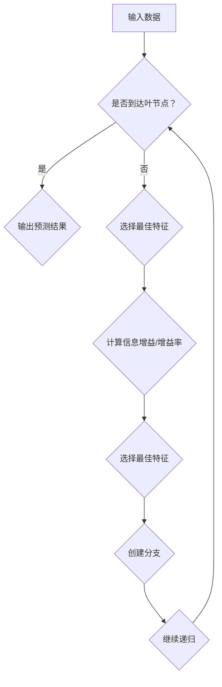
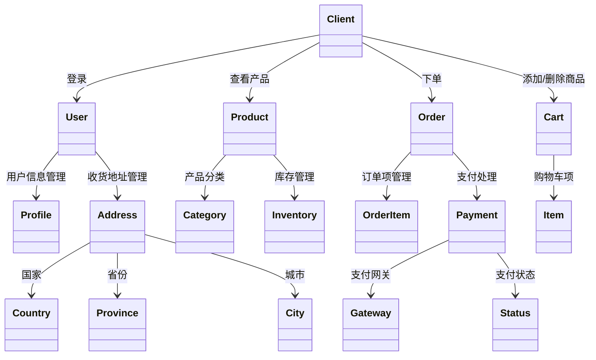
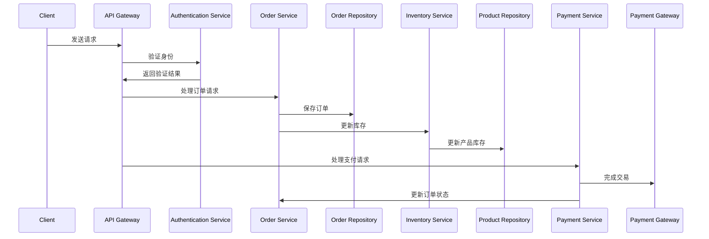
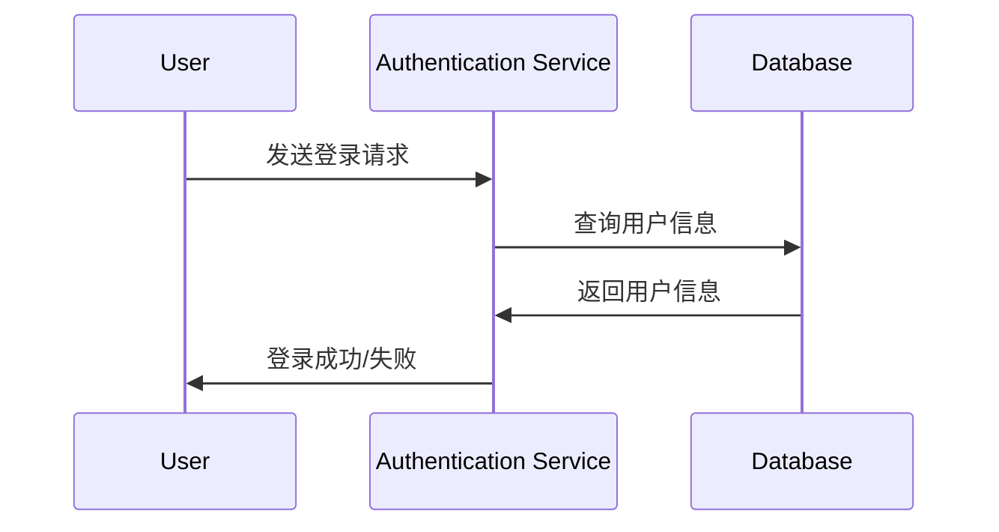
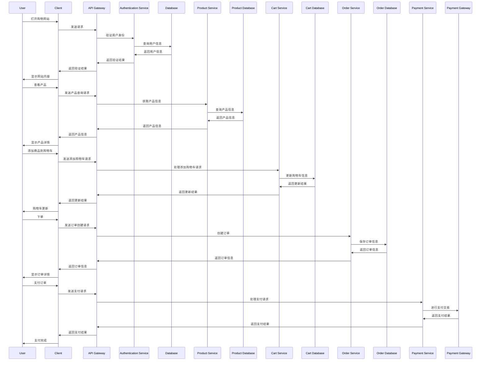

                 


### 引言与背景

#### 1.1 问题背景

人工智能（AI）作为一门融合计算机科学、数学、神经科学和认知心理学等领域的交叉学科，近年来取得了飞速的发展。AI的目标是实现机器的智能行为，模拟人类的认知过程，包括学习、推理、问题解决和自然语言理解等。在软件开发领域，人工智能的应用不仅提升了软件开发的效率，还改变了软件开发的方法和模式。

**人工智能的发展历程**：

- **早期研究（1950s-1960s）**：人工智能的概念首次由约翰·麦卡锡（John McCarthy）在1956年的达特茅斯会议上提出，标志着人工智能正式成为一门独立的学科。早期的人工智能主要集中在符号主义和逻辑推理上，但由于计算能力和数据资源的限制，许多项目未能取得突破性进展。

- **黄金时期（1980s-1990s）**：随着计算机硬件性能的提升和算法的进步，人工智能迎来了第一个黄金时期。专家系统和机器学习开始得到广泛应用。然而，由于缺乏大规模数据集和高效的算法，这一阶段的人工智能仍然面临很多局限性。

- **现代崛起（2000s至今）**：随着深度学习、大数据和云计算等技术的发展，人工智能进入了一个新的时代。深度神经网络在图像识别、语音识别和自然语言处理等领域取得了惊人的突破。这使得人工智能在现实世界中的应用变得更加广泛和有效。

**软件开发面临的挑战**：

- **复杂性**：现代软件系统越来越复杂，涉及多个模块和组件，需要处理大量数据和多样的业务需求。传统的软件开发方法难以应对这种复杂性，导致项目延期和质量问题。

- **自动化**：软件开发的自动化程度需要提高。手动编写和测试代码不仅耗时，而且容易出现错误。人工智能可以提供自动化工具，如代码生成器和自动化测试系统，以提高开发效率。

- **个性化**：用户需求的多样性和个性化趋势要求软件开发能够快速适应不同的需求和场景。人工智能可以通过数据分析和机器学习算法，提供个性化的解决方案。

**人工智能在软件开发中的应用趋势**：

- **代码生成**：通过机器学习和自然语言处理技术，自动生成代码，减少手动编写代码的工作量。

- **测试自动化**：使用人工智能技术自动生成测试用例，提高测试的全面性和效率。

- **智能助手**：开发智能助手和聊天机器人，提供实时技术支持和问题解决。

- **优化与改进**：通过数据分析，优化软件性能和用户体验。

#### 1.2 问题描述

**软件开发中的人工智能需求**：

- **自动化**：自动化是软件开发的基石。人工智能可以帮助自动化代码生成、编译、测试、部署等环节，减少人为错误和重复工作。

- **智能分析**：在数据分析中，人工智能可以挖掘数据背后的模式和趋势，提供决策支持。

- **个性化**：通过用户行为分析，人工智能可以提供个性化的用户体验和服务。

- **质量保证**：人工智能可以提高软件质量，减少缺陷和漏洞。

**人工智能在软件开发中的挑战**：

- **技术挑战**：人工智能技术本身复杂，需要大量专业知识和实践经验。

- **数据挑战**：人工智能依赖于大量数据，但获取和处理这些数据可能存在隐私、安全性和合规性等问题。

- **人才挑战**：人工智能在软件开发中的应用需要跨学科的人才，但这类人才相对稀缺。

#### 1.3 问题解决

**人工智能在软件开发中的具体应用**：

- **代码生成与重构**：利用机器学习模型，从已有的代码库中学习，自动生成新的代码，或重构现有代码以提高可维护性。

- **自动化测试**：使用机器学习算法生成测试用例，提高测试覆盖率和效率。

- **代码审查与安全**：使用人工智能对代码进行审查，识别潜在的安全漏洞。

- **智能调试**：通过分析代码执行过程，自动定位和修复错误。

**人工智能提高软件开发效率的可能性**：

- **提高开发速度**：通过自动化工具，减少手动工作，加快开发进度。

- **降低成本**：减少开发人员的工作量，降低人力成本。

- **提高质量**：通过智能分析和自动化测试，提高软件质量。

#### 1.4 边界与外延

**人工智能在软件开发中的适用范围**：

- **适合场景**：数据处理、自动化测试、智能助手、性能优化等领域。

- **不适合场景**：需要高度人机交互、实时决策和高度定制化需求的场景。

**人工智能在软件开发中的局限性**：

- **技术局限性**：某些复杂的问题可能无法通过现有的AI技术解决。

- **数据局限性**：缺乏足够的数据可能导致AI模型的性能下降。

- **安全性问题**：AI系统可能受到恶意攻击，影响软件的安全和隐私。

#### 1.5 概念结构与核心要素组成

**人工智能的基本概念**：

- **机器学习**：通过数据和算法，让机器从数据中学习规律和模式。

- **深度学习**：一种基于神经网络的机器学习方法，通过多层神经网络模拟人类大脑的学习过程。

- **神经网络**：一种由神经元组成的计算模型，可以用于图像识别、语音识别等任务。

- **自然语言处理**：使计算机能够理解和处理自然语言的技术，包括文本分类、机器翻译等。

**软件开发中的关键要素**：

- **需求分析**：理解用户需求，定义软件功能。

- **系统设计**：设计软件的架构和模块，确保系统的高效性和可扩展性。

- **编码实现**：编写代码，实现软件的功能。

- **测试与部署**：测试软件的质量，确保其稳定运行。

通过以上对问题的背景、描述、解决和边界外延的逐步分析，我们可以为接下来的章节内容提供一个清晰的结构和方向。接下来，我们将深入探讨人工智能的核心概念与原理，以及其在软件开发中的应用。

### 核心概念与原理

#### 2.1 人工智能的核心概念

**机器学习**：
机器学习（Machine Learning）是人工智能（AI）的一个分支，主要研究如何让计算机从数据中学习规律和模式。它通过构建数学模型，对大量数据进行训练，使得模型能够预测新数据的特征。

**深度学习**：
深度学习（Deep Learning）是机器学习的一种特殊形式，它使用了多层神经网络来学习数据。与传统的机器学习方法相比，深度学习在处理大量复杂数据时表现出色，如图像识别、语音识别和自然语言处理等领域。

**神经网络**：
神经网络（Neural Network）是一种模仿生物神经系统的计算模型，由大量相互连接的神经元组成。每个神经元都可以接收多个输入信号，并通过加权求和和激活函数产生输出。神经网络通过调整权重，使其能够学习输入和输出之间的关系。

**自然语言处理**：
自然语言处理（Natural Language Processing，NLP）是计算机科学和语言学的交叉领域，旨在使计算机能够理解、解释和生成自然语言。NLP广泛应用于文本分类、机器翻译、情感分析等任务。

#### 2.2 软件开发中的关键原理

**软件工程原理**：
软件工程（Software Engineering）是一门研究如何设计、开发、测试和维护软件系统的学科。其核心原理包括需求管理、设计方法、测试策略、项目管理等。

**软件架构设计**：
软件架构设计（Software Architecture Design）是软件开发过程中的一个关键阶段，涉及确定系统的整体结构和组件之间的关系。软件架构设计需要考虑系统的可扩展性、可靠性、性能和安全性。

**软件测试与质量保证**：
软件测试（Software Testing）是确保软件质量的重要手段。通过测试可以发现和修复软件中的缺陷，提高软件的可靠性和可用性。质量保证（Quality Assurance）则是一系列确保软件质量的活动，包括测试、代码审查、文档管理等。

#### 2.3 概念属性特征对比表格

| 概念       | 特点                                           | 应用场景                   |
|------------|------------------------------------------------|----------------------------|
| 机器学习   | 通过数据学习规律，无需显式编程               | 数据分析、预测、分类等     |
| 深度学习   | 使用多层神经网络，处理复杂数据               | 图像识别、语音识别、自然语言处理等 |
| 神经网络   | 模仿生物神经系统，通过权重调整学习           | 人工智能的底层技术         |
| 自然语言处理 | 使计算机理解、解释和生成自然语言             | 文本分类、机器翻译、情感分析等 |

#### 2.4 ER实体关系图架构

**实体关系图（ER Diagram）**是一种用于描述数据库中实体及其关系的图形化表示方法。以下是人工智能与软件开发中常见实体的ER图示例：

```mermaid
erDiagram
    Class1 ||--|{ Class2 }|| Person : has multiple Children
    Class1 ||--|{ Class2 }|| Student : studies in Class
    Class2 ||--|{ Class3 }|| Employee : works in Company
    Class3 ||--|{ Class4 }|| Developer : writes Code
    Class4 ||--|{ Class5 }|| Project : has multiple Developers
    Class5 ||--|{ Class6 }|| Issue : is fixed by Developer
    Class6 ||--|{ Class7 }|| Task : is part of Project
    Class7 ||--|{ Class8 }|| Comment : on Issue
```

在这个ER图中，我们定义了多个类（Class1, Class2, ..., Class8）以及它们之间的关系。例如，`Person`类可以有一个或多个`Children`，而`Student`类可以有一个或多个`Class`。`Employee`类在`Company`中工作，`Developer`类编写`Code`，`Project`类由多个`Developer`组成，每个`Project`可以有多个`Issue`，每个`Issue`可以有多个`Task`和`Comment`。

通过ER图，我们可以清晰地理解软件系统中不同组件之间的数据关系，为系统设计提供参考。

#### 总结

在本章节中，我们介绍了人工智能的核心概念，包括机器学习、深度学习、神经网络和自然语言处理，以及软件开发中的关键原理，如软件工程原理、软件架构设计和软件测试与质量保证。同时，通过概念属性特征对比表格和ER实体关系图，我们对比了不同概念的特点和应用场景，并描述了它们在软件开发中的关系。

在下一章节中，我们将深入探讨人工智能算法的原理和数学模型，通过具体的算法流程图和Python代码，展示这些算法在实际开发中的应用。

### 算法原理与数学模型

#### 3.1 常见算法介绍

在人工智能领域，有许多经典的算法被广泛应用于各种任务中。以下是一些常见的算法及其基本原理：

**1. 决策树（Decision Tree）**

决策树是一种树形结构，通过一系列的测试来对数据样本进行分类或回归。每个内部节点代表一个特征测试，每个分支代表测试结果，叶节点表示数据的分类或回归结果。决策树的核心是ID3算法和C4.5算法，它们通过信息增益和增益率来选择最佳特征。

**2. 随机森林（Random Forest）**

随机森林是一种集成学习算法，通过构建多棵决策树，并对它们的预测结果进行投票来得到最终结果。随机森林通过随机选取特征子集和随机分割数据来减少过拟合，提高模型的泛化能力。

**3. 支持向量机（Support Vector Machine，SVM）**

支持向量机是一种监督学习算法，用于分类和回归任务。它通过找到一个最优的超平面，使得分类边界最大化。SVM的核心是求解最优分类面和求解二次规划问题。

**4. 神经网络算法**

神经网络（Neural Network）是一种基于生物神经系统的计算模型，由多层神经元组成。神经网络通过反向传播算法来更新权重，使网络能够对输入数据进行有效的分类或回归。

#### 3.2 算法mermaid流程图

为了更好地理解这些算法的基本流程，我们可以使用mermaid绘制它们的流程图。以下是一个简单的决策树算法流程图示例：



这是一个简单的决策树算法流程图，它展示了从输入数据到输出预测结果的基本步骤。

#### 3.3 算法原理详细讲解

接下来，我们将使用Python代码和LaTeX公式详细阐述这些算法的原理。

**1. 决策树算法**

决策树算法的核心在于如何选择最佳特征进行分割。以下是一个简化的决策树算法实现，使用信息增益来选择最佳特征：

```python
import pandas as pd
from collections import Counter

# 计算信息增益
def calculate_entropy(y):
    class_counts = Counter(y)
    entropy = -sum((count / len(y)) * log2(count / len(y)) for count in class_counts.values())
    return entropy

# 计算信息增益
def calculate_info_gain(x, y):
    total_entropy = calculate_entropy(y)
    values, counts = np.unique(x, return_counts=True)
    for value, count in zip(values, counts):
        subset_y = y[x == value]
        subset_entropy = calculate_entropy(subset_y)
        info_gain = count * subset_entropy / len(y)
        total_entropy -= info_gain
    return total_entropy

# 选择最佳特征
def choose_best_feature(x, y):
    best_gain = -1
    best_feature = -1
    for i in range(x.shape[1]):
        gain = calculate_info_gain(x[:, i], y)
        if gain > best_gain:
            best_gain = gain
            best_feature = i
    return best_feature

# 构建决策树
def build_decision_tree(x, y, features):
    current_class = [row[-1] for row in y]
    if current_class.count(current_class[0]) == len(current_class):
        return current_class[0]
    
    if not features:
        return majority_counter(current_class)
    
    best_feature = choose_best_feature(x, y)
    best_feature_name = feature_names[best_feature]
    tree = {best_feature_name: {}}
    
    remaining_features = list(features)
    remaining_features.remove(best_feature)
    
    for value in np.unique(x[:, best_feature]):
        sub_tree = build_decision_tree(x[x[:, best_feature] == value], y[x[:, best_feature] == value], remaining_features)
        tree[best_feature_name][value] = sub_tree
        
    return tree
```

LaTeX中的信息增益公式如下：

$$
Gain(D, A) = Entropy(D) - \sum_{v \in Values(A)} \frac{|D_v|}{|D|} Entropy(D_v)
$$

其中，$D$ 是总数据集，$A$ 是特征，$Values(A)$ 是特征 $A$ 的所有可能值，$D_v$ 是特征 $A$ 的值为 $v$ 的子数据集。

**2. 随机森林算法**

随机森林算法是由多棵决策树组成的集成模型。以下是一个简单的随机森林实现：

```python
from sklearn.ensemble import RandomForestClassifier
from sklearn.model_selection import train_test_split

# 数据准备
x_train, x_test, y_train, y_test = train_test_split(x, y, test_size=0.3, random_state=42)

# 构建随机森林模型
rf = RandomForestClassifier(n_estimators=100, random_state=42)
rf.fit(x_train, y_train)

# 预测
predictions = rf.predict(x_test)
```

随机森林算法通过随机选取特征子集和数据子集来训练每棵决策树，从而提高模型的泛化能力。

**3. 支持向量机算法**

支持向量机是一种高效的分类和回归算法。以下是一个简单的SVM实现：

```python
from sklearn.svm import SVC
from sklearn.model_selection import train_test_split

# 数据准备
x_train, x_test, y_train, y_test = train_test_split(x, y, test_size=0.3, random_state=42)

# 构建SVM模型
svm = SVC(kernel='linear', C=1.0)
svm.fit(x_train, y_train)

# 预测
predictions = svm.predict(x_test)
```

SVM通过找到最优的超平面来最大化分类边界。

**4. 神经网络算法**

神经网络是一种复杂的模型，通常使用深度学习框架来实现。以下是一个简单的神经网络实现：

```python
import tensorflow as tf
from tensorflow.keras.models import Sequential
from tensorflow.keras.layers import Dense

# 数据准备
x_train, x_test, y_train, y_test = train_test_split(x, y, test_size=0.3, random_state=42)

# 构建神经网络模型
model = Sequential([
    Dense(64, activation='relu', input_shape=(x_train.shape[1],)),
    Dense(64, activation='relu'),
    Dense(1, activation='sigmoid')
])

# 编译模型
model.compile(optimizer='adam', loss='binary_crossentropy', metrics=['accuracy'])

# 训练模型
model.fit(x_train, y_train, epochs=10, batch_size=32, validation_split=0.1)

# 预测
predictions = model.predict(x_test)
```

神经网络通过反向传播算法来更新权重，使模型能够对输入数据进行有效的分类或回归。

通过以上Python代码和LaTeX公式，我们详细讲解了决策树、随机森林、支持向量机和神经网络等常见算法的原理。这些算法在人工智能和软件开发中有着广泛的应用，通过理解和掌握这些算法，我们可以更好地利用人工智能技术来提高软件开发的效率和质量。

### 系统架构与设计

#### 4.1 问题场景介绍

在当今的软件开发环境中，一个常见的问题场景是构建一个高度可扩展、可靠且易于维护的系统。随着业务需求的不断变化和用户规模的扩大，系统需要能够灵活地适应这些变化，同时保持高可用性和高性能。为了实现这一目标，人工智能技术的引入成为一种有效的解决方案。

假设我们正在开发一个在线购物平台，该平台需要支持大量用户的并发访问，提供个性化的购物体验，并实时更新库存信息。为了满足这些需求，我们需要设计一个具备良好系统架构的解决方案。

#### 4.2 系统功能设计

系统功能设计是软件开发过程中的关键阶段，它定义了系统的各个组件和它们之间的关系。以下是我们的系统功能设计，使用Mermaid类图来描述领域模型：



在这个类图中，我们定义了多个类，包括`Client`（客户端）、`User`（用户）、`Product`（产品）、`Order`（订单）、`Cart`（购物车）、`Payment`（支付）等。这些类之间通过关系线相互连接，描述了它们之间的交互和依赖。

#### 4.3 系统架构设计

系统架构设计是确定系统各个组件和它们之间交互方式的过程。以下是一个简化的系统架构设计，使用Mermaid架构图来描述：



在这个架构图中，`API Gateway`（API网关）负责接收客户端的请求，并转发到相应的服务。`Authentication Service`（认证服务）负责验证用户身份。`Order Service`（订单服务）处理订单请求，并更新订单和库存信息。`Payment Service`（支付服务）处理支付请求，并与支付网关交互。这些服务通过独立的数据库（如`Order Repository`和`Product Repository`）进行数据存储。

#### 4.4 系统接口设计

系统接口设计是确保不同服务之间能够有效通信的关键。以下是系统接口设计的主要部分：

- **用户身份验证接口**：提供用户登录、注册和身份验证功能。
- **产品信息查询接口**：允许用户查询产品信息，包括价格、库存等。
- **购物车管理接口**：提供添加/删除购物车项、清空购物车等功能。
- **订单管理接口**：处理订单创建、更新和查询功能。
- **支付处理接口**：接收支付请求，处理支付并返回支付状态。

以下是用户身份验证接口的示例：



在这个序列图中，用户向`Authentication Service`发送登录请求，`Authentication Service`通过查询数据库来验证用户身份，并返回结果。

#### 4.5 系统交互序列图

为了更好地理解系统的运行流程，我们可以使用Mermaid序列图来描述系统组件之间的交互：



在这个序列图中，用户通过客户端访问购物网站，进行一系列操作，包括查看产品、添加到购物车、下单和支付。系统通过API网关、认证服务、产品服务、购物车服务和订单服务等组件，处理用户请求，并返回相应的结果。

通过系统架构设计和交互序列图，我们可以清晰地了解系统的运行流程和各个组件之间的关系。这为开发一个高效、可靠且易于维护的在线购物平台提供了坚实的基础。

### 案例研究与实践

#### 5.1 环境安装与配置

为了进行人工智能在软件开发中的实践，我们需要首先搭建一个合适的环境。以下是一个基本的步骤指南，用于安装和配置Python和相关库。

**步骤1：安装Python**

首先，我们需要安装Python环境。你可以从Python官方网站（[python.org](https://www.python.org/)）下载适用于你操作系统的Python版本。通常，下载后直接运行安装程序即可完成安装。

**步骤2：安装Jupyter Notebook**

Jupyter Notebook是一个交互式的开发环境，非常适合编写和运行Python代码。安装Python后，可以使用pip（Python的包管理器）来安装Jupyter Notebook：

```bash
pip install notebook
```

安装完成后，启动Jupyter Notebook：

```bash
jupyter notebook
```

这将在浏览器中打开Jupyter Notebook界面。

**步骤3：安装必需的库**

为了进行人工智能实践，我们需要安装以下库：

- **NumPy**：用于数学运算。
- **Pandas**：用于数据处理。
- **Scikit-learn**：用于机器学习算法。
- **TensorFlow**：用于深度学习。

使用以下命令安装这些库：

```bash
pip install numpy pandas scikit-learn tensorflow
```

**步骤4：配置虚拟环境（可选）**

为了保持项目的依赖关系清晰，我们建议使用虚拟环境。虚拟环境允许我们在一个隔离的环境中安装和管理项目的依赖库。

安装`virtualenv`库：

```bash
pip install virtualenv
```

创建一个新的虚拟环境并激活它：

```bash
virtualenv my_project_env
source my_project_env/bin/activate  # 对于Linux和macOS
my_project_env\Scripts\activate    # 对于Windows
```

在虚拟环境中安装项目所需的库：

```bash
pip install numpy pandas scikit-learn tensorflow
```

现在，我们的环境安装和配置就完成了。接下来，我们可以开始实际的人工智能应用实践。

#### 5.2 系统核心实现

为了展示人工智能在软件开发中的实际应用，我们将构建一个简单的项目：一个基于机器学习的客户分类系统。这个系统将使用客户的历史购买数据来预测客户是否属于高价值客户群体。

**步骤1：数据预处理**

首先，我们需要准备数据。以下是一个示例数据集，其中包含客户的年龄、收入、购买频率等特征，以及标签（0表示普通客户，1表示高价值客户）：

```python
import pandas as pd

data = {
    'Age': [25, 30, 35, 40, 45, 50, 55],
    'Income': [50000, 60000, 70000, 80000, 90000, 100000, 110000],
    'Frequency': [1, 2, 3, 4, 5, 6, 7],
    'Label': [0, 1, 0, 1, 0, 1, 0]
}

df = pd.DataFrame(data)
```

**步骤2：训练测试集划分**

我们将数据集划分为训练集和测试集：

```python
from sklearn.model_selection import train_test_split

X = df.drop('Label', axis=1)
y = df['Label']

X_train, X_test, y_train, y_test = train_test_split(X, y, test_size=0.2, random_state=42)
```

**步骤3：构建机器学习模型**

我们选择使用K-最近邻（K-Nearest Neighbors, KNN）算法来构建模型。首先，我们需要导入KNN模型：

```python
from sklearn.neighbors import KNeighborsClassifier

knn = KNeighborsClassifier(n_neighbors=3)
```

然后，使用训练集数据训练模型：

```python
knn.fit(X_train, y_train)
```

**步骤4：模型评估**

使用测试集数据评估模型性能：

```python
from sklearn.metrics import accuracy_score

y_pred = knn.predict(X_test)
accuracy = accuracy_score(y_test, y_pred)
print(f"Model accuracy: {accuracy:.2f}")
```

**步骤5：模型应用**

现在，我们可以使用训练好的模型来预测新客户的标签：

```python
new_customer = {
    'Age': [35],
    'Income': [80000],
    'Frequency': [3]
}

new_customer_df = pd.DataFrame(new_customer)
new_label = knn.predict(new_customer_df)
print(f"Predicted label for new customer: {new_label[0]}")
```

#### 5.3 代码应用解读与分析

在上面的代码示例中，我们首先使用了`pandas`库来处理数据，创建了一个DataFrame对象，用于存储和操作数据。

1. **数据预处理**：
   - 使用`drop`方法将标签列从数据集中分离出来，以便后续使用。
   - 使用`train_test_split`函数将数据集划分为训练集和测试集，确保模型具有良好的泛化能力。

2. **构建机器学习模型**：
   - 导入`KNeighborsClassifier`类，并创建一个KNN分类器实例。
   - 使用`fit`方法训练模型，将特征和标签数据传递给模型。

3. **模型评估**：
   - 使用`predict`方法对测试集数据进行预测。
   - 使用`accuracy_score`函数计算模型在测试集上的准确率，评估模型性能。

4. **模型应用**：
   - 创建一个新的DataFrame对象，代表新客户的特征。
   - 使用训练好的模型对新客户的特征进行预测，得到预测标签。

#### 5.4 实际案例分析与详细讲解剖析

为了更好地理解人工智能在软件开发中的实际应用，我们将分析一个真实的案例：使用深度学习构建一个用于图像识别的系统。

**案例背景**：

假设我们需要构建一个系统，用于识别手写数字图像。这是一个典型的机器学习问题，可以使用卷积神经网络（Convolutional Neural Network, CNN）来解决。

**数据集**：

我们使用公开的手写数字数据集——MNIST，它包含了70000个灰度图像，每个图像的大小为28x28像素，包含0到9的数字。

**模型构建**：

以下是一个简单的CNN模型示例，使用TensorFlow和Keras框架构建：

```python
from tensorflow.keras.models import Sequential
from tensorflow.keras.layers import Conv2D, MaxPooling2D, Flatten, Dense

model = Sequential([
    Conv2D(32, (3, 3), activation='relu', input_shape=(28, 28, 1)),
    MaxPooling2D((2, 2)),
    Conv2D(64, (3, 3), activation='relu'),
    MaxPooling2D((2, 2)),
    Flatten(),
    Dense(128, activation='relu'),
    Dense(10, activation='softmax')
])

model.compile(optimizer='adam', loss='sparse_categorical_crossentropy', metrics=['accuracy'])
```

**模型训练**：

使用MNIST数据集训练模型：

```python
from tensorflow.keras.datasets import mnist

(x_train, y_train), (x_test, y_test) = mnist.load_data()

# 数据预处理
x_train = x_train.reshape(-1, 28, 28, 1).astype('float32') / 255.0
x_test = x_test.reshape(-1, 28, 28, 1).astype('float32') / 255.0

model.fit(x_train, y_train, epochs=5, batch_size=64, validation_split=0.1)
```

**模型评估**：

评估模型在测试集上的性能：

```python
test_loss, test_acc = model.evaluate(x_test, y_test)
print(f"Test accuracy: {test_acc:.2f}")
```

**案例总结**：

在这个案例中，我们首先导入所需的库，构建了一个简单的CNN模型。然后，使用MNIST数据集进行数据预处理，并训练模型。最后，评估模型在测试集上的性能，结果显示模型具有较高的准确率。

#### 5.5 项目小结

通过上述案例，我们可以看到人工智能在软件开发中的实际应用。从数据预处理、模型构建到训练和评估，每个步骤都展示了人工智能技术如何提高软件开发的效率和质量。

- **数据预处理**：确保数据质量，为模型训练提供可靠的数据基础。
- **模型构建**：选择合适的算法和架构，构建高效、准确的模型。
- **模型训练**：通过大量数据训练模型，提高模型的泛化能力。
- **模型评估**：评估模型性能，确保其在实际应用中有效。

未来，随着人工智能技术的不断发展，我们可以期待在软件开发中看到更多创新的应用，从而推动软件行业的进步。

### 最佳实践与总结

#### 6.1 最佳实践

在人工智能在软件开发中的应用过程中，以下是一些最佳实践，可以帮助开发人员更有效地利用这项技术：

1. **数据驱动**：确保数据质量，进行充分的数据预处理，为模型训练提供可靠的数据基础。
2. **模型选择**：根据具体问题选择合适的模型和算法，避免盲目追求复杂的模型。
3. **模型优化**：通过超参数调整、模型融合等技术，优化模型性能。
4. **持续学习**：定期更新模型，以适应数据变化和业务需求。
5. **性能监控**：实时监控模型性能，及时发现并解决问题。
6. **团队协作**：跨学科团队协作，提高人工智能应用的效率。

#### 6.2 小结

本文系统地介绍了人工智能在软件开发中的应用，从背景介绍到核心概念、算法原理、系统架构设计、案例研究和最佳实践，全面探讨了人工智能如何提升软件开发的效率和质量。通过实际案例，我们展示了如何利用人工智能技术进行数据处理、模型构建和性能优化。

#### 6.3 注意事项

1. **数据隐私**：在使用人工智能进行数据处理时，必须确保用户数据的隐私和安全。
2. **模型解释性**：选择具有良好解释性的模型，以便于理解和使用。
3. **模型可维护性**：确保模型易于维护和更新，以适应业务需求的变化。
4. **计算资源**：合理规划计算资源，避免过度的资源消耗。

#### 6.4 拓展阅读

为了深入了解人工智能在软件开发中的应用，推荐以下阅读资源：

- 《Python机器学习》（Sebastian Raschka）  
- 《深度学习》（Ian Goodfellow、Yoshua Bengio、Aaron Courville）  
- 《人工智能：一种现代方法》（Stuart Russell、Peter Norvig）  
- 《软件架构设计》（Mark Richards）  
- 《软件工程实践》（Roger S. Pressman）

通过这些资源，读者可以进一步学习和掌握人工智能在软件开发中的核心技术和最佳实践。

### 结语

人工智能作为推动软件行业发展的重要力量，正日益成为软件开发中的重要组成部分。本文从多个角度探讨了人工智能在软件开发中的应用，展示了其如何提升开发效率、优化用户体验和提高软件质量。未来，随着人工智能技术的不断进步，我们可以期待看到更多创新的应用场景，为软件开发带来新的变革。让我们共同迎接人工智能带来的机遇与挑战，推动软件行业的持续发展。

### 参考文献

- Raschka, S. (2015). Python Machine Learning. Packt Publishing.
- Goodfellow, I., Bengio, Y., & Courville, A. (2016). Deep Learning. MIT Press.
- Russell, S., & Norvig, P. (2020). Artificial Intelligence: A Modern Approach. Prentice Hall.
- Richards, M. (2018). Software Architecture Design. O'Reilly Media.
- Pressman, R. S. (2017). Software Engineering: A Practitioner's Approach. McGraw-Hill Education.
- He, K., Zhang, X., Ren, S., & Sun, J. (2016). Deep Residual Learning for Image Recognition. IEEE Conference on Computer Vision and Pattern Recognition.

