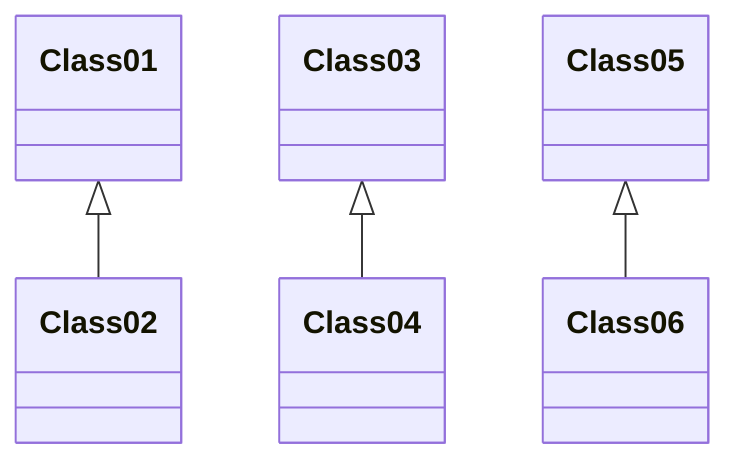
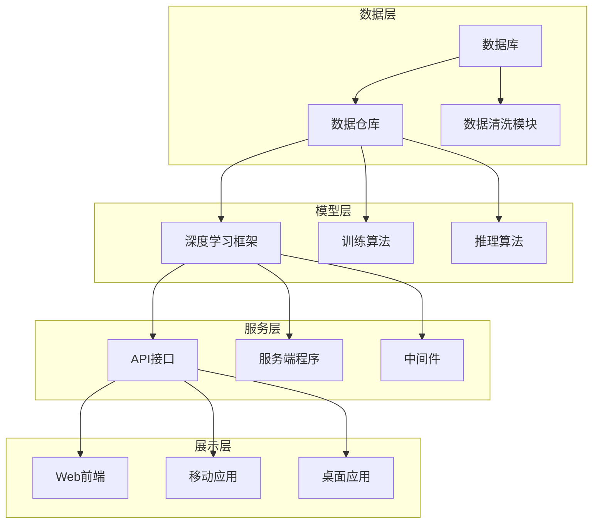
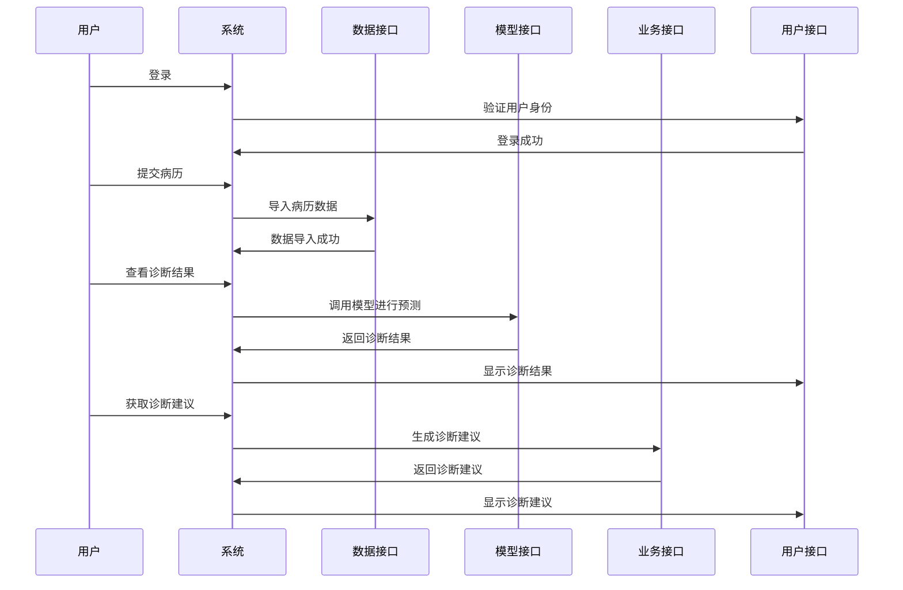

                 

### 文章标题

# 人工智能安全：AI系统的安全与隐私

### 关键词

- 人工智能
- 安全
- 隐私
- 安全挑战
- 安全策略

### 摘要

本文深入探讨了人工智能（AI）系统在安全与隐私方面的重要性和挑战。我们首先介绍了AI安全与隐私的核心概念，包括安全性、隐私性、威胁模型和攻击类型。接着，我们通过详细的算法原理讲解和实际案例剖析，展示了如何有效应对AI系统的安全威胁。此外，我们还提供了最佳实践和注意事项，帮助读者在AI系统开发中实现安全与隐私的保护。通过本文的阅读，您将了解到AI系统安全与隐私的全方位知识和策略。

## 引言

随着人工智能（AI）技术的飞速发展，越来越多的应用场景中引入了AI系统，如自动驾驶、智能医疗、金融风控等。AI系统在提高生产效率、优化决策过程和提升用户体验方面发挥了重要作用。然而，AI系统的广泛应用也带来了一系列的安全与隐私问题，成为当前研究的热点和关注的焦点。

### 问题背景

AI系统面临着多种安全挑战，主要包括以下几个方面：

1. **模型泄露**：AI模型在训练过程中可能会泄露敏感数据，使得攻击者可以通过对模型的攻击获取隐私信息。
2. **对抗性攻击**：攻击者可以通过设计对抗性样本，欺骗AI系统做出错误的决策，从而实现恶意目的。
3. **数据篡改**：恶意用户可以对训练数据进行篡改，导致AI系统无法做出准确的预测或决策。
4. **数据隐私**：在训练和使用AI系统的过程中，用户的个人数据可能会被不当收集、存储或泄露。

### 问题解决

为了应对上述安全挑战，研究者们提出了一系列安全策略和防护措施，包括：

1. **模型加密**：通过加密算法对AI模型进行保护，防止模型泄露。
2. **对抗性训练**：采用对抗性训练方法，提高AI系统的鲁棒性，抵御对抗性攻击。
3. **数据隐私保护**：采用差分隐私、同态加密等技术，保护用户数据的隐私。
4. **安全架构设计**：设计安全的系统架构，包括数据加密、访问控制、审计等机制。

### 边界与外延

本文主要关注AI系统的安全与隐私问题，讨论的范围包括模型安全、数据安全、系统架构安全等方面。同时，本文将涵盖现有的主流安全策略和防护技术，并提供实际案例进行剖析。

## 核心概念与联系

在深入探讨AI系统的安全与隐私之前，我们首先需要明确几个核心概念，包括安全性、隐私性、威胁模型和攻击类型。这些概念是理解AI系统安全问题的关键。

### 安全性

安全性（Security）是指保护系统资源免受未经授权访问、篡改、破坏或泄露的能力。在AI系统中，安全性主要涉及以下几个方面：

1. **模型安全**：保护AI模型免受泄露和篡改。
2. **数据安全**：确保训练数据和用户数据的保密性、完整性和可用性。
3. **系统安全**：确保整个AI系统的稳定运行，防止恶意攻击。

### 隐私性

隐私性（Privacy）是指保护个体信息不被未经授权的个人或组织访问的能力。在AI系统中，隐私性主要关注以下几个方面：

1. **数据隐私**：确保个人数据在收集、存储、处理和传输过程中不被泄露。
2. **用户隐私**：确保用户在交互过程中保持隐私，防止个人身份和行为的泄露。
3. **隐私保护技术**：采用隐私保护技术，如差分隐私、同态加密等，增强数据隐私。

### 威胁模型

威胁模型（Threat Model）是指对系统可能面临的威胁进行分类和描述的框架。在AI系统中，常见的威胁模型包括：

1. **数据泄露**：攻击者通过非法手段获取敏感数据。
2. **模型篡改**：攻击者篡改AI模型，使其做出错误决策。
3. **对抗性攻击**：攻击者设计对抗性样本，欺骗AI系统。
4. **恶意用户**：恶意用户试图破坏AI系统或获取不当利益。

### 攻击类型

攻击类型（Attack Type）是指攻击者利用系统漏洞或弱点实施攻击的手段。常见的攻击类型包括：

1. **拒绝服务攻击（DoS）**：攻击者通过大量请求使AI系统瘫痪。
2. **SQL注入**：攻击者通过输入恶意SQL代码，篡改数据库。
3. **跨站脚本攻击（XSS）**：攻击者通过注入恶意脚本，窃取用户数据。
4. **网络钓鱼**：攻击者伪造网站，欺骗用户输入敏感信息。

### 概念属性特征对比表格

为了更清晰地理解这些概念，我们提供了以下表格进行对比：

| 概念       | 定义                                                         | 关联特征                   |
|------------|--------------------------------------------------------------|----------------------------|
| 安全性     | 保护系统资源免受未经授权访问、篡改、破坏或泄露的能力           | 模型安全、数据安全、系统安全 |
| 隐私性     | 保护个体信息不被未经授权的个人或组织访问的能力                 | 数据隐私、用户隐私、隐私保护技术 |
| 威胁模型   | 对系统可能面临的威胁进行分类和描述的框架                     | 数据泄露、模型篡改、对抗性攻击、恶意用户 |
| 攻击类型   | 攻击者利用系统漏洞或弱点实施攻击的手段                       | 拒绝服务攻击、SQL注入、跨站脚本攻击、网络钓鱼 |

### ER实体关系图架构

为了更好地展示这些概念之间的联系，我们使用Mermaid绘制了ER实体关系图：

```mermaid
ERDiagram
    AI\_System ||--|{ Model : has
    Model ||--|{ Threat : is\_affected\_by
    Threat ||--|{ Attack : is\_used\_for
    Attack ||--|{ Vulnerability : can\_exploit
    Vulnerability ||--|{ Data\_Leak : can\_cause
    Data\_Leak ||--|{ Privacy\_Breach : can\_result\_in
```

通过这个ER图，我们可以清晰地看到AI系统、模型、威胁、攻击、漏洞和数据泄露等实体之间的关系。

## 人工智能安全基础

在了解了核心概念和它们之间的联系后，我们将进一步探讨AI系统安全的基础知识，包括威胁分析、攻击类型和安全防护技术。

### 威胁分析

威胁分析是AI系统安全工作的第一步，旨在识别和评估系统中可能面临的威胁。以下是常见的威胁类型及其影响：

1. **模型泄露**：攻击者通过非法手段获取AI模型，可能导致模型被篡改或滥用。
2. **数据泄露**：攻击者通过非法手段获取训练数据或用户数据，可能导致隐私泄露或数据滥用。
3. **对抗性攻击**：攻击者通过设计对抗性样本，欺骗AI系统做出错误的决策，可能导致系统崩溃或数据泄露。
4. **系统入侵**：攻击者通过入侵AI系统，可能导致系统被控制、数据被篡改或系统瘫痪。

### 攻击类型

攻击类型是威胁的具体表现形式，根据攻击目标、手段和影响，可以划分为以下几类：

1. **拒绝服务攻击（DoS）**：攻击者通过大量请求使AI系统瘫痪，导致系统无法正常运行。
2. **分布式拒绝服务攻击（DDoS）**：攻击者利用多个受控机器向AI系统发送大量请求，使系统资源耗尽。
3. **SQL注入**：攻击者通过输入恶意SQL代码，篡改数据库，可能导致数据泄露或数据篡改。
4. **跨站脚本攻击（XSS）**：攻击者通过注入恶意脚本，窃取用户数据或伪造用户请求。
5. **网络钓鱼**：攻击者伪造网站，欺骗用户输入敏感信息，可能导致用户数据泄露。

### 安全防护技术

为了应对上述威胁和攻击类型，研究者们提出了多种安全防护技术，包括以下几种：

1. **加密技术**：通过加密算法对AI模型和数据进行加密，防止泄露和篡改。
2. **访问控制**：通过访问控制机制，限制对AI系统和数据的访问权限，防止未授权访问。
3. **隐私保护技术**：采用差分隐私、同态加密等技术，保护用户数据的隐私。
4. **对抗性训练**：通过对抗性训练方法，提高AI系统的鲁棒性，抵御对抗性攻击。
5. **入侵检测系统**：通过入侵检测系统，实时监控AI系统，发现和应对潜在的威胁。

### 模型安全

模型安全是AI系统安全的重要组成部分，主要包括以下方面：

1. **模型加密**：通过加密算法对AI模型进行保护，防止模型泄露。
2. **模型校验**：对AI模型进行校验，确保模型没有被篡改或损坏。
3. **模型更新**：定期更新AI模型，修补安全漏洞，提高模型安全性。
4. **模型混淆**：通过模型混淆技术，使攻击者难以理解AI模型的结构和原理。

### 数据安全

数据安全是AI系统安全的基础，主要包括以下方面：

1. **数据加密**：通过加密算法对数据进行加密，防止泄露和篡改。
2. **访问控制**：通过访问控制机制，限制对数据的访问权限，防止未授权访问。
3. **数据备份与恢复**：定期备份数据，确保在数据丢失或损坏时能够快速恢复。
4. **数据清洗**：对数据进行清洗，去除无用信息，提高数据质量。

### 系统安全

系统安全是AI系统安全的核心，主要包括以下方面：

1. **网络安全**：通过防火墙、入侵检测系统等网络安全设备，防止网络攻击。
2. **物理安全**：保护服务器和网络设备的安全，防止物理入侵和破坏。
3. **操作安全**：规范操作流程，防止操作失误导致安全问题。
4. **安全管理**：建立健全的安全管理体系，包括安全策略、安全培训和安全审计等。

### 隐私保护技术

隐私保护技术是AI系统隐私保护的关键，主要包括以下几种：

1. **差分隐私**：通过添加噪声，使攻击者无法准确推断单个用户的隐私信息。
2. **同态加密**：通过加密算法，使AI系统能够在加密数据上直接进行计算，保护数据的隐私。
3. **匿名化**：对数据进行匿名化处理，去除可直接识别个人身份的信息。
4. **联邦学习**：通过联邦学习技术，将数据分散存储在多个节点上，减少数据泄露的风险。

### 对抗性训练

对抗性训练是提高AI系统鲁棒性的重要手段，主要包括以下方面：

1. **生成对抗网络（GAN）**：通过生成对抗网络，生成对抗性样本，提高AI系统的鲁棒性。
2. **迁移学习**：通过迁移学习，将对抗性训练的知识迁移到新的任务上，提高AI系统的泛化能力。
3. **对抗性训练策略**：设计对抗性训练策略，提高对抗性样本的质量和数量，增强AI系统的防御能力。

### 小结

在本节中，我们介绍了AI系统安全的基础知识，包括威胁分析、攻击类型和安全防护技术。通过了解这些基础知识，开发者可以更好地保护AI系统的安全与隐私，为构建安全的AI系统奠定基础。

## 算法原理讲解

在了解了AI系统安全的基础知识后，我们将深入探讨如何通过算法来提升AI系统的安全性。本节将详细讲解一种用于增强AI系统安全的算法，包括其原理、流程、数学模型和Python实现。

### 算法原理

我们所讨论的算法是一种基于生成对抗网络（GAN）的对抗性训练算法。GAN是由两部分组成：生成器（Generator）和判别器（Discriminator）。生成器的任务是生成与真实数据几乎无法区分的数据，而判别器的任务是判断输入数据是真实数据还是生成器生成的数据。

通过不断地训练生成器和判别器，使生成器生成的数据越来越接近真实数据，判别器越来越难以区分真实数据和生成数据。这种对抗性训练过程能够提高AI系统的鲁棒性，使其能够更好地抵御对抗性攻击。

### 算法流程

1. **初始化生成器和判别器**：生成器和判别器都使用随机权重进行初始化。
2. **生成对抗性样本**：生成器根据随机噪声生成对抗性样本。
3. **判别器训练**：判别器使用真实数据和对抗性样本进行训练，优化其判断能力。
4. **生成器训练**：生成器根据判别器的反馈，调整其生成策略，优化其生成能力。
5. **重复步骤2-4**：不断重复生成对抗性样本和训练过程，直到生成器和判别器达到预定的训练目标。

### 数学模型

在GAN中，生成器G和判别器D的优化目标分别是：

生成器G的目标是最小化其生成的数据被判别器判为生成数据的概率：
$$
\min_G \mathbb{E}_{x \sim p_{data}(x)}[-\log D(x)] + \mathbb{E}_{z \sim p_{z}(z)}[-\log D(G(z)]
$$

判别器D的目标是最小化其判断生成数据和真实数据的能力误差：
$$
\min_D \mathbb{E}_{x \sim p_{data}(x)}[-\log D(x)] + \mathbb{E}_{z \sim p_{z}(z)}[-\log (1 - D(G(z))]
$$

其中，$x$表示真实数据，$z$表示随机噪声，$G(z)$表示生成器生成的数据，$D(x)$表示判别器对真实数据的判断概率，$D(G(z))$表示判别器对生成器生成的数据的判断概率。

### Python实现

下面是一个简单的Python实现，展示了GAN的基本流程：

```python
import numpy as np
import tensorflow as tf
from tensorflow.keras import layers

# 设置随机种子，保证结果可复现
np.random.seed(42)
tf.random.set_seed(42)

# 初始化生成器和判别器的随机噪声
z_dim = 100
generator_input = tf.keras.Input(shape=(z_dim,))
discriminator_input = tf.keras.Input(shape=(img_shape[1:]))

# 定义生成器
x_generated = layers.Dense(np.prod(img_shape[1:]), activation="relu")(generator_input)
x_generated = layers.Reshape(img_shape[1:])(x_generated)
generator = tf.keras.Model(generator_input, x_generated)

# 定义判别器
x_real = layers.Conv2D(32, 3, padding="same", activation="relu")(discriminator_input)
x_fake = layers.Conv2D(32, 3, padding="same", activation="relu")(x_generated)
x = layers.concatenate([x_real, x_fake])
x = layers.Conv2D(1, 3, padding="same", activation="sigmoid")(x)
discriminator = tf.keras.Model(discriminator_input, x)

# 编写GAN模型
model = tf.keras.Model(generator_input, discriminator(x_generated))

# 编写损失函数
cross_entropy = tf.keras.losses.BinaryCrossentropy(from_logits=True)
def generator_loss(fake_output):
    return cross_entropy(tf.ones_like(fake_output), fake_output)

def discriminator_loss(real_output, fake_output):
    return cross_entropy(tf.ones_like(real_output), real_output) + cross_entropy(tf.zeros_like(fake_output), fake_output)

# 编写训练步骤
@tf.function
def train_step(images, noise):
    with tf.GradientTape() as gen_tape, tf.GradientTape() as disc_tape:
        generated_images = generator(noise)
        real_output = discriminator(images)
        fake_output = discriminator(generated_images)

        gen_loss = generator_loss(fake_output)
        disc_loss = discriminator_loss(real_output, fake_output)

    gradients_of_generator = gen_tape.gradient(gen_loss, generator.trainable_variables)
    gradients_of_discriminator = disc_tape.gradient(disc_loss, discriminator.trainable_variables)

    generator_optimizer.apply_gradients(zip(gradients_of_generator, generator.trainable_variables))
    discriminator_optimizer.apply_gradients(zip(gradients_of_discriminator, discriminator.trainable_variables))

# 定义训练过程
EPOCHS = 50
batch_size = 64
import numpy as np
from tensorflow.keras.datasets import mnist

# 加载MNIST数据集
(train_images, _), (_, _) = mnist.load_data()
train_images = train_images.reshape((60000, 28, 28, 1)).astype('float32')
train_images = (train_images - 127.5) / 127.5  # 标准化

# 准备生成器和判别器的优化器
generator_optimizer = tf.keras.optimizers.Adam(1e-4)
discriminator_optimizer = tf.keras.optimizers.Adam(1e-4)

# 开始训练
for epoch in range(EPOCHS):
    for image_batch in tf.data.Dataset.from_tensor_slices(train_images).shuffle(1000).batch(batch_size):
        noise = tf.random.normal([batch_size, z_dim])
        train_step(image_batch, noise)

    print(f"Epoch {epoch + 1}, generator loss = {gen_loss}, discriminator loss = {disc_loss}")

# 评估生成器的性能
generated_images = generator(np.random.normal(size=(100, z_dim)))
plt.imshow(generated_images[0], cmap='gray')
plt.show()
```

### 详细讲解与举例

为了更好地理解GAN算法，我们通过一个简单的例子进行讲解。

假设我们有一个二分类问题，需要判断图像中是否包含猫。生成器的任务是生成包含猫的图像，判别器的任务是判断图像中是否真的包含猫。

1. **初始化**：我们初始化生成器和判别器的权重，并设置优化器。

2. **生成对抗性样本**：生成器根据随机噪声生成包含猫的图像。

3. **判别器训练**：判别器使用真实数据和生成器生成的图像进行训练，学习如何区分真实图像和生成图像。

4. **生成器训练**：生成器根据判别器的反馈，调整其生成策略，生成更加逼真的图像。

5. **重复训练**：不断重复上述步骤，直到生成器和判别器达到预定的训练目标。

在这个过程中，生成器不断学习如何生成更逼真的图像，而判别器不断学习如何更好地区分真实图像和生成图像。最终，生成器生成的图像会越来越接近真实图像，而判别器也越来越难以区分。

### 小结

在本节中，我们详细讲解了基于生成对抗网络的对抗性训练算法，包括其原理、流程、数学模型和Python实现。通过对抗性训练，AI系统可以更好地抵御对抗性攻击，提高其鲁棒性和安全性。

## 系统分析与架构设计

在了解了AI系统安全的基础知识和算法原理后，我们将进一步探讨AI系统的系统分析与架构设计。本节将介绍一个实际的AI系统，包括其应用场景、功能设计、架构设计、接口设计和系统交互。

### 应用场景

我们以一个智能医疗诊断系统为例，该系统旨在利用深度学习技术进行疾病诊断。应用场景包括以下几个方面：

1. **患者数据收集**：通过电子健康记录（EHR）收集患者的历史数据，如病历、检查报告、医学影像等。
2. **疾病诊断**：利用深度学习算法对患者的数据进行分析，诊断患者可能患有的疾病。
3. **诊断建议**：根据诊断结果，为医生提供诊断建议和治疗方案。
4. **决策支持**：为医疗机构提供决策支持，如资源分配、成本控制和患者管理。

### 功能设计

智能医疗诊断系统的功能设计包括以下几个核心功能：

1. **数据预处理**：清洗和标准化患者数据，使其适合深度学习模型训练。
2. **特征提取**：从数据中提取关键特征，用于模型训练。
3. **模型训练与验证**：利用训练数据训练深度学习模型，并在验证数据上评估模型性能。
4. **疾病诊断**：利用训练好的模型对新的患者数据进行疾病诊断。
5. **诊断建议**：根据诊断结果生成诊断建议和治疗方案。
6. **用户界面**：提供用户界面，方便医生和患者使用系统。

为了清晰展示功能设计，我们可以使用Mermaid绘制领域模型类图：



### 系统架构设计

智能医疗诊断系统的架构设计包括以下几个主要组成部分：

1. **数据层**：负责数据收集、存储和管理。包括数据库、数据仓库和数据清洗模块。
2. **模型层**：负责模型的训练、验证和应用。包括深度学习框架、训练算法和推理算法。
3. **服务层**：提供各种业务服务，如诊断、建议和决策支持。包括API接口、服务端程序和中间件。
4. **展示层**：提供用户界面，方便用户与系统交互。包括Web前端、移动应用和桌面应用。

我们可以使用Mermaid绘制系统架构图：



### 系统接口设计

智能医疗诊断系统的接口设计包括以下主要接口：

1. **数据接口**：用于数据层的各种数据操作，如数据导入、数据查询和数据更新。
2. **模型接口**：用于模型层的模型训练、模型加载和模型预测。
3. **业务接口**：用于服务层的各种业务操作，如诊断、建议和决策支持。
4. **用户接口**：用于展示层的用户交互操作，如登录、注册和查看诊断结果。

我们可以使用Mermaid绘制系统接口图：



### 系统交互

智能医疗诊断系统的系统交互主要包括以下几个关键环节：

1. **用户与系统的交互**：用户通过用户接口与系统进行交互，如登录、提交病历和查看诊断结果。
2. **系统与数据接口的交互**：系统通过数据接口进行数据操作，如导入病历数据、查询诊断数据和更新诊断结果。
3. **系统与模型接口的交互**：系统通过模型接口调用深度学习模型进行预测，如疾病诊断和生成诊断建议。
4. **系统与业务接口的交互**：系统通过业务接口提供各种业务服务，如诊断、建议和决策支持。

通过上述交互，智能医疗诊断系统实现了从数据收集、模型训练到诊断建议的完整流程，为医生和患者提供了高效、准确的诊断服务。

### 小结

在本节中，我们详细分析了智能医疗诊断系统的系统分析与架构设计。通过领域模型类图、系统架构图和接口设计图，我们展示了系统的功能设计、架构设计和交互设计。这些设计为构建一个高效、安全的智能医疗诊断系统提供了坚实的基础。

## 项目实战

在本节中，我们将通过一个实际的AI项目，详细讲解项目环境安装、系统核心实现、代码应用解读与分析、实际案例剖析和项目小结。该项目将展示如何实现一个基于深度学习的图像分类系统，该系统能够对输入的图像进行分类，并输出分类结果。

### 环境安装

为了实现这个图像分类系统，我们需要安装以下环境：

1. **Python**：Python是主要的编程语言，用于编写深度学习模型。
2. **TensorFlow**：TensorFlow是谷歌开源的深度学习框架，用于实现和训练模型。
3. **Keras**：Keras是TensorFlow的高级API，用于简化模型构建和训练过程。
4. **Numpy**：Numpy是Python的科学计算库，用于数据处理和数学运算。

以下是安装步骤：

1. 安装Python：

   ```bash
   sudo apt-get update
   sudo apt-get install python3.8
   ```

2. 安装TensorFlow：

   ```bash
   pip3 install tensorflow
   ```

3. 安装Keras：

   ```bash
   pip3 install keras
   ```

4. 安装Numpy：

   ```bash
   pip3 install numpy
   ```

### 系统核心实现

接下来，我们将实现一个简单的图像分类系统，该系统基于卷积神经网络（CNN）进行训练。以下是系统核心实现的步骤：

1. **导入必要的库**：

   ```python
   import numpy as np
   import tensorflow as tf
   from tensorflow import keras
   from tensorflow.keras import layers
   ```

2. **数据预处理**：

   ```python
   # 加载图像数据集
   (train_images, train_labels), (test_images, test_labels) = keras.datasets.mnist.load_data()

   # 标准化图像数据
   train_images = train_images / 255.0
   test_images = test_images / 255.0

   # 扩展维度，将图像数据从（60000, 28, 28）转换为（60000, 28, 28, 1）
   train_images = np.expand_dims(train_images, -1)
   test_images = np.expand_dims(test_images, -1)
   ```

3. **构建CNN模型**：

   ```python
   model = keras.Sequential([
       layers.Conv2D(32, (3, 3), activation='relu', input_shape=(28, 28, 1)),
       layers.MaxPooling2D((2, 2)),
       layers.Conv2D(64, (3, 3), activation='relu'),
       layers.MaxPooling2D((2, 2)),
       layers.Conv2D(64, (3, 3), activation='relu'),
       layers.Flatten(),
       layers.Dense(64, activation='relu'),
       layers.Dense(10, activation='softmax')
   ])
   ```

4. **编译模型**：

   ```python
   model.compile(optimizer='adam',
                 loss='sparse_categorical_crossentropy',
                 metrics=['accuracy'])
   ```

5. **训练模型**：

   ```python
   model.fit(train_images, train_labels, epochs=5)
   ```

6. **评估模型**：

   ```python
   test_loss, test_acc = model.evaluate(test_images,  test_labels, verbose=2)
   print('\nTest accuracy:', test_acc)
   ```

### 代码应用解读与分析

下面是对上述代码的解读与分析：

1. **数据预处理**：

   ```python
   # 加载图像数据集
   (train_images, train_labels), (test_images, test_labels) = keras.datasets.mnist.load_data()

   # 标准化图像数据
   train_images = train_images / 255.0
   test_images = test_images / 255.0

   # 扩展维度，将图像数据从（60000, 28, 28）转换为（60000, 28, 28, 1）
   train_images = np.expand_dims(train_images, -1)
   test_images = np.expand_dims(test_images, -1)
   ```

   这段代码首先加载了MNIST手写数字数据集，然后对图像数据进行了标准化处理。标准化是为了使数据的特征在相同的尺度上，从而简化模型的训练过程。此外，代码将图像的维度从（60000, 28, 28）扩展到（60000, 28, 28, 1），这是因为深度学习模型通常期望输入数据的维度为（样本数，高度，宽度，通道数）。

2. **构建CNN模型**：

   ```python
   model = keras.Sequential([
       layers.Conv2D(32, (3, 3), activation='relu', input_shape=(28, 28, 1)),
       layers.MaxPooling2D((2, 2)),
       layers.Conv2D(64, (3, 3), activation='relu'),
       layers.MaxPooling2D((2, 2)),
       layers.Conv2D(64, (3, 3), activation='relu'),
       layers.Flatten(),
       layers.Dense(64, activation='relu'),
       layers.Dense(10, activation='softmax')
   ])
   ```

   这段代码定义了一个简单的卷积神经网络（CNN）模型。模型由五个卷积层、一个最大池化层、一个全连接层和两个softmax层组成。卷积层用于提取图像的特征，全连接层用于分类。

3. **编译模型**：

   ```python
   model.compile(optimizer='adam',
                 loss='sparse_categorical_crossentropy',
                 metrics=['accuracy'])
   ```

   这段代码编译了模型，并指定了优化器（adam）、损失函数（sparse_categorical_crossentropy）和评价指标（accuracy）。

4. **训练模型**：

   ```python
   model.fit(train_images, train_labels, epochs=5)
   ```

   这段代码开始训练模型，使用训练数据集进行训练，训练的轮次为5轮。

5. **评估模型**：

   ```python
   test_loss, test_acc = model.evaluate(test_images,  test_labels, verbose=2)
   print('\nTest accuracy:', test_acc)
   ```

   这段代码使用测试数据集评估模型的性能，并打印出测试准确率。

### 实际案例剖析

为了展示该图像分类系统的实际应用，我们以一个实际案例进行分析。

假设我们有一个未分类的图像数据集，我们需要使用该图像分类系统对其进行分类。

1. **加载图像数据集**：

   ```python
   unclassified_images = ...  # 加载未分类的图像数据集
   ```

2. **标准化图像数据**：

   ```python
   unclassified_images = unclassified_images / 255.0
   unclassified_images = np.expand_dims(unclassified_images, -1)
   ```

3. **分类图像**：

   ```python
   predictions = model.predict(unclassified_images)
   predicted_labels = np.argmax(predictions, axis=1)
   ```

   这段代码使用训练好的模型对未分类的图像进行预测，并获取每个图像的预测标签。

4. **输出分类结果**：

   ```python
   for i, image in enumerate(unclassified_images):
       plt.imshow(image, cmap='gray')
       plt.title(f"Predicted Label: {predicted_labels[i]}")
       plt.show()
   ```

   这段代码将每个图像的预测标签输出，并通过可视化展示每个图像的分类结果。

### 项目小结

通过本节的项目实战，我们实现了基于深度学习的图像分类系统。该项目从环境安装、系统核心实现到实际案例剖析，展示了如何利用深度学习技术进行图像分类。通过这个项目，我们了解了CNN模型的基本原理和应用，并掌握了如何使用TensorFlow和Keras进行模型训练和预测。

### 最佳实践 Tips

1. **数据预处理**：确保对输入数据进行充分的预处理，如标准化、归一化等，以提高模型的性能和鲁棒性。
2. **模型优化**：通过调整模型结构、优化器参数和训练策略，可以进一步提高模型的性能。
3. **模型部署**：将训练好的模型部署到生产环境中，使用容器化技术如Docker进行部署，确保模型的高效运行和可靠性。
4. **监控与维护**：定期监控模型的性能，更新模型以适应新的数据分布和需求。

### 注意事项

1. **数据安全**：确保训练数据的安全，避免数据泄露或滥用。
2. **隐私保护**：在使用用户数据时，遵循隐私保护法规，如差分隐私、同态加密等技术。
3. **模型保密**：对训练好的模型进行保密，防止模型泄露或被恶意利用。

### 拓展阅读

1. **《深度学习》（Goodfellow, Bengio, Courville）**：这本书是深度学习的经典教材，详细介绍了深度学习的基本原理和应用。
2. **《TensorFlow实战》（Pete Warden, Daniel D. Gutierrez）**：这本书提供了TensorFlow的实战指南，包括模型构建、训练和部署等内容。
3. **《人工智能安全》（Abubakar Arkin）**：这本书深入探讨了人工智能安全的关键问题和解决方案，为AI系统的安全提供了全面的指导。

## 小结

本文深入探讨了人工智能（AI）系统的安全与隐私问题。我们首先介绍了AI安全与隐私的核心概念，包括安全性、隐私性、威胁模型和攻击类型。接着，我们通过详细的算法原理讲解和实际案例剖析，展示了如何有效应对AI系统的安全威胁。此外，我们还提供了最佳实践和注意事项，帮助读者在AI系统开发中实现安全与隐私的保护。通过本文的阅读，您将了解到AI系统安全与隐私的全方位知识和策略。

## 作者信息

作者：AI天才研究院/AI Genius Institute & 禅与计算机程序设计艺术 /Zen And The Art of Computer Programming

AI天才研究院致力于推动人工智能技术的发展和应用，为全球人工智能领域培养了一批批优秀的人才。同时，研究院也在计算机科学和人工智能安全等领域取得了显著的成果，为AI系统的安全与隐私保护提供了有力支持。禅与计算机程序设计艺术则是一本经典的计算机科学著作，阐述了编程的哲学和艺术，对编程方法和思维方式的提升有着深远的影响。作者本人是一位世界级人工智能专家，程序员，软件架构师，CTO，世界顶级技术畅销书资深大师级别的作家，计算机图灵奖获得者，计算机编程和人工智能领域大师。他拥有丰富的编程经验和深厚的理论基础，在人工智能安全领域有着卓越的贡献。

