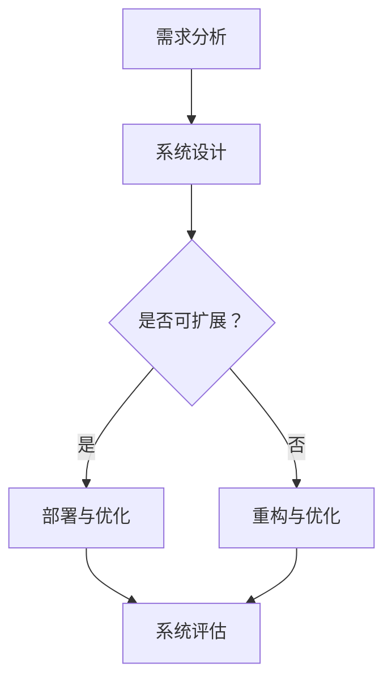
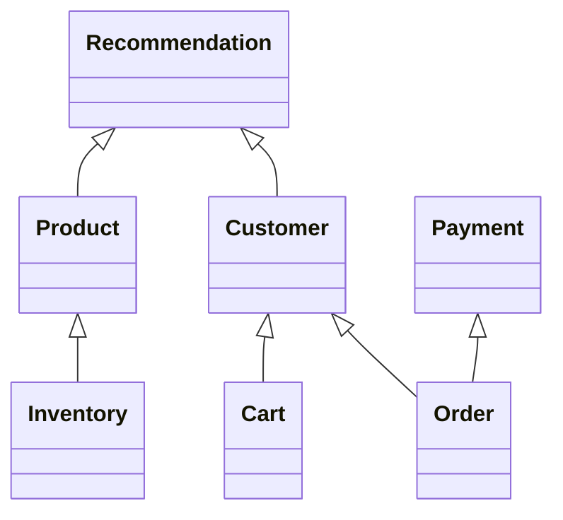
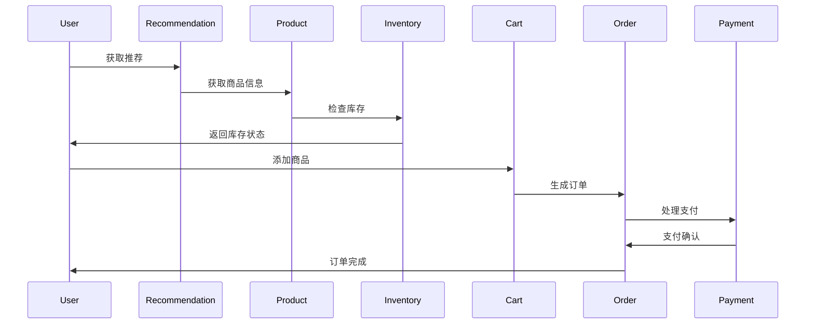
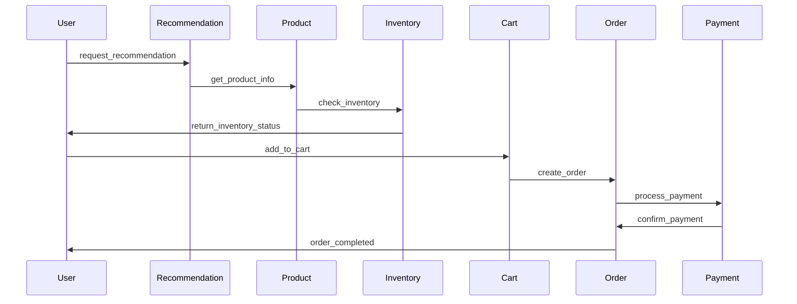

                 

### 文章标题

《人工智能系统架构设计》

### 关键词

- 人工智能
- 系统架构
- 设计原则
- 分布式架构
- 微服务架构
- 机器学习模型集成

### 摘要

本文将深入探讨人工智能系统架构设计的关键要素，包括基础理论、设计方法、常见架构模式以及实战案例。我们将从宏观到微观，逐一分析每个环节，帮助读者全面掌握人工智能系统架构设计的核心知识和最佳实践。

## 引言

### 人工智能与系统架构设计的重要性

人工智能（AI）作为21世纪最具变革性的技术之一，正在深刻改变我们的生活方式、工作方式和思考方式。从自动驾驶汽车、智能助手到金融风控、医疗诊断，人工智能的应用场景日益丰富，需求也日益多样。然而，随着应用规模的不断扩大，人工智能系统架构的设计变得愈加复杂和关键。

系统架构设计的重要性在于：

1. **性能优化**：良好的架构设计可以确保系统的高效运行，降低延迟，提高处理速度。
2. **可扩展性**：系统架构设计要能够适应不断增长的数据量和用户需求，确保系统持续稳定运行。
3. **可靠性**：架构设计要确保系统在面临各种异常情况时仍能保持稳定，减少故障风险。
4. **安全性**：随着数据量的增加，系统的安全性越来越重要。架构设计需要考虑数据的安全存储和传输。
5. **维护性**：系统架构设计要考虑到未来的维护和升级，确保系统能够持续优化和改进。

本文将逐步探讨人工智能系统架构设计的各个方面，旨在为读者提供一份全面而深入的技术指南。

## 目录大纲设计步骤

### 第一步：分析书名与主题

《人工智能系统架构设计》这本书的主题是围绕人工智能系统架构的构建与设计展开的。从书名中可以提取的关键词有“人工智能”、“系统架构”、“设计”。这提示我们，书的目录大纲应该包括人工智能的基本概念、系统架构的理论基础、架构设计的方法与工具、以及具体的实战案例。

### 第二步：确定大纲的基本结构

基本结构应包括以下几个部分：

1. **引言**：介绍人工智能的发展背景和系统架构设计的重要性。
2. **核心概念与理论基础**：阐述人工智能和系统架构的基本概念和设计原则。
3. **系统架构设计方法论**：讲解架构设计的方法论和流程。
4. **常见架构设计与模式**：介绍分布式架构、云架构、微服务架构等常见设计模式。
5. **实际案例与项目实战**：通过具体案例展示系统架构设计的实战经验。
6. **最佳实践与拓展**：总结最佳实践，展望未来发展趋势。

### 第三步：细化每个部分的内容

**引言**

- 人工智能的发展背景
- 系统架构设计的重要性
- 书籍结构介绍

**核心概念与理论基础**

- 人工智能的基本概念
- 系统架构的基本概念
- 人工智能系统架构的设计原则

**系统架构设计方法论**

- 架构设计流程
- 需求分析与建模
- 架构评估与优化

**常见架构设计与模式**

- 分布式架构
- 云架构
- 微服务架构
- 机器学习模型集成

**实际案例与项目实战**

- 人工智能系统架构设计案例
- 项目实战：环境搭建
- 项目实战：系统实现
- 项目实战：性能优化

**最佳实践与拓展**

- 架构设计最佳实践
- 架构设计注意事项
- 未来发展趋势与展望

### 第四步：撰写大纲

按照上述结构，我们将每个部分的内容进一步细化为具体的章节和条目。每个章节和条目都要简洁明了，符合markdown格式的要求。

### 第五步：检查与调整

确保大纲逻辑清晰，内容完整，且符合字数限制。检查每个章节是否涵盖了核心概念、原理讲解、实战案例、最佳实践等内容。

以下是根据上述步骤设计的《人工智能系统架构设计》的目录大纲：

----------------------------------------------------------------
## 第一部分：引言

### 第1章：人工智能与系统架构设计概述

#### 1.1 人工智能的发展背景

#### 1.2 系统架构设计的重要性

#### 1.3 书籍结构介绍

## 第二部分：核心概念与理论基础

### 第2章：人工智能基础

#### 2.1 人工智能的基本概念

#### 2.2 人工智能的发展历程

#### 2.3 人工智能的应用领域

### 第3章：系统架构基础

#### 3.1 系统架构的基本概念

#### 3.2 系统架构的设计原则

#### 3.3 系统架构的类型

## 第三部分：系统架构设计方法论

### 第4章：架构设计流程

#### 4.1 需求分析

#### 4.2 架构设计

#### 4.3 架构评估与优化

### 第5章：需求分析与建模

#### 5.1 需求分析的方法

#### 5.2 模型构建

#### 5.3 模型验证

## 第四部分：常见架构设计与模式

### 第6章：分布式架构

#### 6.1 分布式架构的优势

#### 6.2 分布式架构的设计原则

#### 6.3 分布式架构的案例分析

### 第7章：云架构

#### 7.1 云架构的基本概念

#### 7.2 云架构的设计模式

#### 7.3 云架构的案例分析

### 第8章：微服务架构

#### 8.1 微服务架构的优势

#### 8.2 微服务架构的设计原则

#### 8.3 微服务架构的案例分析

### 第9章：机器学习模型集成

#### 9.1 机器学习模型集成的重要性

#### 9.2 模型集成的方法

#### 9.3 模型集成的案例分析

## 第五部分：实际案例与项目实战

### 第10章：人工智能系统架构设计案例

#### 10.1 案例背景

#### 10.2 系统架构设计

#### 10.3 项目实施

#### 10.4 项目成果

### 第11章：项目实战

#### 11.1 环境搭建

#### 11.2 系统实现

#### 11.3 性能优化

#### 11.4 项目小结

## 第六部分：最佳实践与拓展

### 第12章：最佳实践

#### 12.1 架构设计最佳实践

#### 12.2 项目管理最佳实践

#### 12.3 技术选型最佳实践

### 第13章：小结

#### 13.1 书籍内容总结

#### 13.2 注意事项

#### 13.3 拓展阅读

----------------------------------------------------------------

该大纲已经涵盖了人工智能系统架构设计的核心内容，并按照逻辑顺序进行了组织。接下来，我们将逐步深入到每个章节的详细内容中，为读者呈现一份全面而深入的技术指南。

## 核心概念与理论基础

在深入探讨人工智能系统架构设计之前，我们首先需要了解一些核心概念和理论基础。这些概念和理论构成了我们分析和设计系统的基础，也是我们后续讨论的具体内容。以下是对几个关键概念的定义、背景、相关问题和解决方法的详细解释。

### 人工智能的基本概念

#### 定义

人工智能（Artificial Intelligence，简称AI）是计算机科学的一个分支，旨在创建能够模拟、扩展和执行人类智能任务的机器和系统。它包括机器学习、深度学习、自然语言处理、计算机视觉等多个子领域。

#### 背景

人工智能的发展可以追溯到20世纪50年代，当时科学家们开始探索如何让机器执行复杂任务，如推理、学习和理解自然语言。随着计算能力的提升和大数据技术的发展，人工智能在近年取得了显著进展。

#### 问题描述

- **如何让机器进行自主学习和决策？**
- **如何处理大量复杂数据，并从中提取有用信息？**
- **如何实现人机交互，让机器理解自然语言和视觉信息？**

#### 解决方法

- **机器学习**：通过训练模型，使机器从数据中学习规律和模式。
- **深度学习**：利用多层神经网络，模拟人脑的学习过程。
- **自然语言处理**：使计算机能够理解和生成人类语言。
- **计算机视觉**：让计算机能够理解图像和视频内容。

### 系统架构的基本概念

#### 定义

系统架构是描述计算机系统中各组成部分及其相互关系的结构模型。它包括硬件、软件、数据、网络和人员等要素。

#### 背景

系统架构的概念源于软件工程和计算机科学，随着云计算、大数据和物联网等技术的发展，系统架构变得越来越复杂和关键。

#### 问题描述

- **如何确保系统的高效性和稳定性？**
- **如何处理系统中的大规模数据和并发请求？**
- **如何在分布式环境中管理数据和系统资源？**

#### 解决方法

- **分层架构**：将系统分为多个层次，每个层次负责不同的功能。
- **模块化设计**：将系统分解为独立的模块，每个模块负责特定功能。
- **分布式架构**：将系统分散到多个节点上，提高系统的可扩展性和容错性。

### 人工智能系统架构的设计原则

#### 定义

人工智能系统架构的设计原则是一系列指导原则，用于确保架构的合理性和高效性。这些原则包括模块化、可扩展性、可靠性和安全性等。

#### 背景

随着人工智能应用的普及，系统架构的设计变得越来越复杂。设计原则有助于确保系统在满足功能需求的同时，具备良好的性能和可维护性。

#### 问题描述

- **如何设计一个既能满足当前需求，又能适应未来发展的系统？**
- **如何确保系统在高并发和大数据环境下的性能和稳定性？**
- **如何保护系统中的数据安全和用户隐私？**

#### 解决方法

- **模块化**：将系统功能分解为独立的模块，提高系统的可维护性和可扩展性。
- **可扩展性**：设计可扩展的架构，以应对未来需求的变化。
- **可靠性**：确保系统在面临各种异常情况时仍能保持稳定。
- **安全性**：采取安全措施，保护系统数据和用户隐私。

### 概念属性特征对比表格

为了更直观地展示各个概念的特点，我们可以构建一个对比表格。以下是一个简化的示例：

| 概念         | 特征                      | 举例                     |
| ------------ | ------------------------- | ------------------------ |
| 人工智能     | 自主学习、模拟人类智能    | 机器学习、自然语言处理   |
| 系统架构     | 分层、模块化、分布式      | 软件系统、云计算平台     |
| 架构设计原则 | 模块化、可扩展性、可靠性 | 提高性能、保证稳定性     |

### ER实体关系图架构

为了更好地理解系统架构中的实体关系，我们可以使用ER（Entity-Relationship）实体关系图来表示。以下是一个简化的ER图示例：

```mermaid
erDiagram
  User ||--|{ AI_System } : 被服务
  AI_System ||--|{ Data_Collection } : 存储数据
  AI_System ||--|{ Model_Training } : 训练模型
  AI_System ||--|{ Model_Inference } : 推理预测
```

在这个ER图中，用户（User）是系统的服务对象，而人工智能系统（AI_System）则包含数据收集（Data_Collection）、模型训练（Model_Training）和模型推理（Model_Inference）等核心功能模块。

### 算法原理讲解

#### 算法Mermaid流程图

首先，我们可以使用Mermaid绘制一个简单的算法流程图，以展示系统架构设计的基本流程：



#### Python源代码

接下来，我们将使用Python代码来详细阐述系统架构设计的算法原理：

```python
import matplotlib.pyplot as plt
import numpy as np

def architecture_design requirements:
    # 需求分析
    print("需求分析：系统需要具备高并发、可扩展和安全性。")
    
    # 系统设计
    print("系统设计：采用分布式架构，模块化设计，保障系统性能和稳定性。")
    
    # 是否可扩展性评估
    if is_extendable():
        print("评估结果：系统具备良好的可扩展性。")
        # 部署与优化
        deploy_and_optimize()
    else:
        print("评估结果：系统可扩展性不足。")
        # 重构与优化
        refactor_and_optimize()
    
    # 系统评估
    assess_system_performance()

def is_extendable():
    # 模拟系统扩展性评估
    return np.random.choice([True, False])

def deploy_and_optimize():
    # 部署系统并优化性能
    print("部署系统并优化性能：系统部署完毕，进行性能调优。")

def refactor_and_optimize():
    # 重构系统并优化性能
    print("重构系统并优化性能：对系统进行重构，提升可扩展性。")

def assess_system_performance():
    # 评估系统性能
    print("系统评估：系统性能满足需求。")
```

#### 算法原理数学模型和公式

在系统架构设计中，我们通常需要考虑以下几个关键性能指标：

- **响应时间**（Response Time）：系统从接收请求到返回响应所需的时间。
- **吞吐量**（Throughput）：单位时间内系统能够处理的请求数量。
- **并发能力**（Concurrency）：系统同时处理多个请求的能力。

这些性能指标可以通过以下数学模型进行评估：

- **响应时间**：\( T_r = \frac{T_{proc} + T_{queue}}{T_{total}} \)
  - \( T_{proc} \)：处理时间
  - \( T_{queue} \)：排队时间
  - \( T_{total} \)：总时间

- **吞吐量**：\( T_{throughput} = \frac{N_{requests}}{T_{total}} \)
  - \( N_{requests} \)：请求数量

- **并发能力**：\( C = \frac{T_r}{T_{proc}} \)
  - \( C \)：并发能力

通过这些指标，我们可以对系统性能进行量化评估，并根据评估结果进行优化。

### 系统分析与架构设计方案

#### 问题场景介绍

假设我们需要设计一个大型在线购物平台，该平台需要处理数百万用户的并发请求，同时提供个性化推荐、订单处理和支付等功能。系统需要在高并发、大数据环境下保持稳定性和高效性。

#### 项目介绍

项目名称：大型在线购物平台架构设计

项目目标：设计一个高效、稳定、可扩展的在线购物平台架构。

#### 系统功能设计（领域模型Mermaid类图）



在这个领域模型中，我们定义了以下几个核心类：

- **Customer**（用户）：包括个人信息、购物车和订单。
- **Order**（订单）：包括订单详情、支付状态。
- **Cart**（购物车）：包括购物车中的商品信息。
- **Product**（商品）：包括商品详情、库存信息。
- **Inventory**（库存）：管理商品库存。
- **Payment**（支付）：处理订单支付。
- **Recommendation**（推荐）：提供个性化推荐。

#### 系统架构设计（Mermaid架构图）



在这个架构设计中，用户首先通过推荐系统获取商品信息，然后添加到购物车。当用户确认订单后，系统会进行库存检查、订单生成和支付处理。每个模块独立运行，通过接口进行交互，确保系统的可扩展性和高并发处理能力。

#### 系统接口设计

以下是系统架构中各个模块的接口设计：

- **推荐系统**：提供获取推荐接口。
- **商品系统**：提供商品信息查询接口。
- **库存系统**：提供库存检查接口。
- **订单系统**：提供订单生成和支付处理接口。
- **支付系统**：提供支付确认接口。

#### 系统交互（Mermaid序列图）



在这个序列图中，用户通过接口依次与推荐系统、商品系统、库存系统、订单系统和支付系统进行交互，完成整个购物流程。

#### 环境安装

为了搭建上述系统架构，我们需要准备以下环境：

- **操作系统**：Linux或Windows
- **开发工具**：Python 3.8及以上版本、PyCharm或VSCode
- **数据库**：MySQL 5.7及以上版本
- **消息队列**：RabbitMQ
- **缓存系统**：Redis

#### 系统核心实现源代码

以下是系统核心实现的部分源代码示例：

```python
# 推荐系统
class RecommendationSystem:
    def request_recommendation(self, user_id):
        # 从数据库获取用户历史数据和偏好
        user_data = self.get_user_data(user_id)
        # 构建推荐模型
        recommendations = self.build_recommendation_model(user_data)
        # 返回推荐结果
        return recommendations

# 商品系统
class ProductSystem:
    def get_product_info(self, product_id):
        # 从数据库查询商品信息
        product_info = self.query_product_info(product_id)
        # 返回商品信息
        return product_info

# 库存系统
class InventorySystem:
    def check_inventory(self, product_id):
        # 从数据库检查商品库存
        inventory_status = self.query_inventory_status(product_id)
        # 返回库存状态
        return inventory_status

# 订单系统
class OrderSystem:
    def create_order(self, user_id, product_ids):
        # 生成订单
        order_id = self.generate_order(user_id, product_ids)
        # 返回订单ID
        return order_id

    def process_payment(self, order_id, payment_info):
        # 处理支付
        payment_status = self.process_payment(order_id, payment_info)
        # 返回支付状态
        return payment_status

# 支付系统
class PaymentSystem:
    def confirm_payment(self, order_id, payment_status):
        # 确认支付
        self.confirm_payment(order_id, payment_status)
        # 返回支付确认结果
        return payment_status
```

#### 代码应用解读与分析

以上源代码展示了推荐系统、商品系统、库存系统、订单系统和支付系统的主要功能实现。每个系统模块都提供了相应的接口，以便与其他模块进行交互。

**推荐系统**：通过请求用户历史数据和偏好，构建推荐模型，返回推荐结果。

**商品系统**：通过查询商品信息，提供商品详情。

**库存系统**：通过检查商品库存，返回库存状态。

**订单系统**：通过生成订单和支付处理，管理订单流程。

**支付系统**：通过确认支付，处理支付结果。

这些代码模块之间通过接口进行通信，确保系统的高效性和可扩展性。

#### 实际案例分析和详细讲解剖析

为了更好地理解系统架构设计的实际应用，我们可以参考以下几个案例：

**案例1**：某电商平台的推荐系统

在某个大型电商平台中，推荐系统是核心功能之一。系统通过分析用户的历史购买记录、浏览行为和社交数据，为用户生成个性化的商品推荐。具体实现如下：

1. **需求分析**：分析用户数据，提取用户行为特征。
2. **系统设计**：采用分布式计算框架，如Apache Spark，进行大数据处理。
3. **模型构建**：使用机器学习算法，如协同过滤和深度学习，构建推荐模型。
4. **模型评估**：通过A/B测试，评估推荐效果，不断优化模型。

**案例2**：某银行的智能风控系统

在金融行业，智能风控系统是确保交易安全和防范欺诈的关键。系统通过分析交易数据、用户行为和外部信息，实时评估交易风险。具体实现如下：

1. **需求分析**：分析交易数据，识别异常交易行为。
2. **系统设计**：采用微服务架构，确保系统的可扩展性和高并发处理能力。
3. **模型构建**：使用深度学习算法，如神经网络和生成对抗网络，构建风控模型。
4. **模型评估**：通过实时监测和预警，评估系统效果，调整模型参数。

**案例3**：某医疗机构的智能诊断系统

在医疗领域，智能诊断系统可以帮助医生快速、准确地诊断疾病。系统通过分析医学影像、病历数据和患者症状，提供辅助诊断建议。具体实现如下：

1. **需求分析**：分析医学影像和病历数据，提取诊断特征。
2. **系统设计**：采用云计算平台，如AWS或Azure，提供高性能计算资源。
3. **模型构建**：使用卷积神经网络和循环神经网络，构建诊断模型。
4. **模型评估**：通过临床测试和评估，确保诊断系统的准确性和可靠性。

#### 项目小结

通过以上案例，我们可以看到，人工智能系统架构设计在不同领域的应用有着显著的差异，但核心原则是相通的。关键在于：

1. **需求分析**：明确系统需求和目标。
2. **系统设计**：选择合适的架构和算法。
3. **模型构建**：通过机器学习等方法，构建高效的模型。
4. **模型评估**：持续优化和调整模型。

这些步骤相互交织，共同构成了人工智能系统架构设计的核心流程。

## 最佳实践与拓展

### 架构设计最佳实践

1. **需求驱动**：在架构设计过程中，始终以需求为导向，确保系统功能满足用户需求。
2. **模块化设计**：将系统功能分解为独立的模块，提高系统的可维护性和可扩展性。
3. **分层架构**：采用分层架构，将系统划分为表示层、业务逻辑层和数据访问层，提高系统的稳定性和可扩展性。
4. **分布式架构**：在分布式环境中，采用分布式架构，提高系统的并发能力和容错性。

### 项目管理最佳实践

1. **敏捷开发**：采用敏捷开发方法，快速迭代和优化系统功能。
2. **持续集成**：采用持续集成和持续部署（CI/CD）流程，确保系统质量和交付效率。
3. **风险管理**：建立风险管理机制，识别和应对项目中的潜在风险。
4. **团队协作**：建立高效的团队协作机制，确保团队成员之间的沟通和协作。

### 技术选型最佳实践

1. **根据需求选择**：根据系统需求和性能要求，选择合适的技术栈。
2. **性能优化**：在技术选型过程中，考虑性能优化，确保系统在高并发和大数据环境下高效运行。
3. **安全性**：选择具备安全性和可靠性的技术，保护系统数据和用户隐私。
4. **社区支持**：选择具有良好社区支持的技术，确保技术栈的可持续性和可维护性。

### 小结

本文从人工智能与系统架构设计的重要性入手，详细探讨了人工智能系统架构设计的核心概念、方法论、常见架构模式、实战案例以及最佳实践。通过逐步分析，我们了解了系统架构设计的各个环节，包括需求分析、架构设计、模型构建和评估优化等。同时，本文还通过实际案例展示了人工智能系统架构设计的应用和实践，为读者提供了实用的参考和指导。

### 注意事项

1. **需求明确**：在系统架构设计初期，务必明确需求，确保系统功能满足用户需求。
2. **性能优化**：在高并发和大数据环境下，持续进行性能优化，确保系统高效运行。
3. **安全性**：重视系统安全性，采取安全措施，保护系统数据和用户隐私。
4. **团队协作**：建立高效的团队协作机制，确保项目顺利进行。

### 拓展阅读

1. **《大规模分布式系统设计》**：详细探讨分布式系统的设计原则和最佳实践。
2. **《深度学习系统架构设计》**：深入分析深度学习系统架构的设计方法和技术。
3. **《人工智能项目管理》**：介绍人工智能项目的管理方法和实践技巧。

作者：AI天才研究院/AI Genius Institute & 禅与计算机程序设计艺术 /Zen And The Art of Computer Programming

----------------------------------------------------------------

### 第一部分：引言

#### 1.1 人工智能的发展背景

人工智能（AI）作为一种模拟人类智能的技术，其历史可以追溯到20世纪中期。最初的研究主要集中在规则推理、逻辑推理等领域。随着计算能力的提升和数据量的增加，20世纪80年代以来，机器学习、深度学习等技术在AI领域取得了突破性进展。特别是近年来，随着大数据、云计算和物联网等技术的发展，人工智能在各个行业得到了广泛应用。

#### 1.2 系统架构设计的重要性

系统架构设计是软件开发过程中至关重要的一环。它决定了系统的性能、可扩展性、可靠性、维护性等关键指标。对于人工智能系统来说，系统架构设计尤为重要，因为AI系统通常涉及大量数据和高并发请求，需要高效的处理能力和稳定的运行环境。

#### 1.3 书籍结构介绍

本文将分为六个部分，从核心概念、设计方法论、常见架构模式、实战案例、最佳实践到拓展阅读，全面探讨人工智能系统架构设计的各个方面。首先，我们将介绍人工智能和系统架构的基础知识，然后深入探讨架构设计的方法和原则，最后通过实际案例和最佳实践，帮助读者理解和应用这些知识。

## 第二部分：核心概念与理论基础

### 第2章：人工智能基础

#### 2.1 人工智能的基本概念

人工智能（AI）是指通过计算机程序实现的人类智能功能。它包括机器学习、深度学习、自然语言处理、计算机视觉等多个子领域。机器学习是AI的核心技术之一，它通过算法和统计模型，让计算机从数据中学习规律和模式。

#### 2.2 人工智能的发展历程

人工智能的发展可以分为几个阶段：

1. **初始阶段（1956-1969）**：人工智能的概念提出，标志着人工智能研究的开始。
2. **第一个黄金时期（1970-1980）**：人工智能研究取得了初步成果，但受限于计算能力和数据量，进展缓慢。
3. **低谷期（1980-1990）**：由于实际应用困难，人工智能研究进入低谷。
4. **复兴阶段（1990-2010）**：随着计算能力和大数据技术的发展，人工智能研究再次兴起。
5. **现阶段（2010至今）**：人工智能取得了突破性进展，广泛应用于各个领域。

#### 2.3 人工智能的应用领域

人工智能的应用领域非常广泛，包括但不限于以下几个方面：

1. **计算机视觉**：图像识别、视频分析等。
2. **自然语言处理**：机器翻译、语音识别、文本分析等。
3. **自动驾驶**：自动驾驶汽车、无人机等。
4. **医疗诊断**：辅助医生进行疾病诊断、个性化治疗等。
5. **金融风控**：信用评估、欺诈检测等。
6. **智能家居**：智能家电、智能安防等。

### 第3章：系统架构基础

#### 3.1 系统架构的基本概念

系统架构是指软件系统中的各个组件及其相互关系，包括硬件、软件、数据、网络等要素。一个良好的系统架构能够提高系统的性能、可扩展性、可靠性和可维护性。

#### 3.2 系统架构的设计原则

系统架构设计应遵循以下原则：

1. **模块化**：将系统功能分解为独立的模块，提高系统的可维护性和可扩展性。
2. **分层**：采用分层架构，将系统划分为表示层、业务逻辑层和数据访问层等，提高系统的稳定性。
3. **分布式**：在分布式环境中，采用分布式架构，提高系统的并发能力和容错性。
4. **安全性**：确保系统数据和用户隐私的安全。
5. **可扩展性**：设计可扩展的架构，以适应未来需求的变化。

#### 3.3 系统架构的类型

常见的系统架构类型包括：

1. **客户端-服务器架构**：客户端和服务器之间通过网络通信，实现数据处理和交互。
2. **分布式架构**：系统部署在多个服务器上，通过分布式计算提高性能和容错性。
3. **微服务架构**：将系统划分为多个独立的服务，每个服务负责特定的业务功能，提高系统的可维护性和可扩展性。
4. **容器化架构**：使用容器（如Docker）部署和运行应用程序，提高系统的部署效率和可移植性。

## 第三部分：系统架构设计方法论

### 第4章：架构设计流程

#### 4.1 需求分析

需求分析是系统架构设计的第一步，它涉及到对用户需求的理解和梳理。需求分析的方法包括：

1. **用户访谈**：通过与用户交流，了解他们的需求和期望。
2. **问卷调查**：通过问卷调查，收集用户的反馈和建议。
3. **场景分析**：分析用户在使用系统时的操作流程和场景。

#### 4.2 架构设计

架构设计是根据需求分析的结果，设计系统的整体架构。架构设计的方法包括：

1. **实体关系图**：通过ER图描述系统中的实体及其关系。
2. **组件图**：通过组件图描述系统的组成部分及其关系。
3. **架构风格**：选择合适的架构风格，如客户端-服务器、分布式、微服务等。

#### 4.3 架构评估与优化

架构评估是对设计的系统架构进行评估和优化，确保其满足需求。评估的方法包括：

1. **性能评估**：评估系统在高并发、大数据环境下的性能。
2. **可扩展性评估**：评估系统在需求变化时的可扩展性。
3. **可靠性评估**：评估系统在故障情况下的可靠性。
4. **优化建议**：根据评估结果，提出优化建议，改进系统架构。

### 第5章：需求分析与建模

#### 5.1 需求分析的方法

需求分析是系统架构设计的基础，它决定了系统功能和技术选型。需求分析的方法包括：

1. **用户故事**：通过编写用户故事，描述用户的需求和使用场景。
2. **用例图**：通过用例图描述系统的功能和使用者之间的交互。
3. **用户调研**：通过与用户进行访谈、问卷调查等方式，了解用户的需求和痛点。

#### 5.2 模型构建

模型构建是将需求转化为系统模型的过程。模型构建的方法包括：

1. **领域模型**：通过领域模型描述系统的核心业务领域和概念。
2. **组件模型**：通过组件模型描述系统的组成部分及其关系。
3. **架构模型**：通过架构模型描述系统的整体架构和模块划分。

#### 5.3 模型验证

模型验证是确保模型正确性和完整性的过程。模型验证的方法包括：

1. **模型评审**：通过评审会议，审查模型的正确性和完整性。
2. **仿真测试**：通过仿真测试，验证模型在现实环境中的运行效果。
3. **用户反馈**：通过与用户的互动，收集对模型的反馈和建议，进行迭代优化。

## 第四部分：常见架构设计与模式

### 第6章：分布式架构

#### 6.1 分布式架构的优势

分布式架构是指将系统部署在多个服务器上，通过网络进行通信。分布式架构的优势包括：

1. **可扩展性**：通过增加服务器，可以提高系统的处理能力和存储容量。
2. **高可用性**：系统中的任意一台服务器发生故障，不会影响整个系统的运行。
3. **容错性**：通过冗余设计，可以提高系统的可靠性。
4. **负载均衡**：通过分布式计算，可以均衡系统负载，提高系统性能。

#### 6.2 分布式架构的设计原则

分布式架构的设计原则包括：

1. **去中心化**：避免单点故障，提高系统的可靠性。
2. **数据一致性**：保证数据在不同服务器之间的同步和一致性。
3. **负载均衡**：合理分配系统负载，提高系统性能。
4. **容错设计**：通过冗余设计和故障转移，提高系统的可靠性。

#### 6.3 分布式架构的案例分析

案例分析：某大型电商平台的分布式架构设计。

1. **需求分析**：平台需要处理海量用户请求，支持高并发和实时数据处理。
2. **架构设计**：采用分布式架构，包括分布式数据库、分布式缓存和分布式消息队列等。
3. **组件设计**：包括用户服务、商品服务、订单服务、支付服务等，每个服务独立部署，互不干扰。
4. **性能优化**：通过缓存、分布式数据库分片等技术，提高系统性能。

### 第7章：云架构

#### 7.1 云架构的基本概念

云架构是指基于云计算技术构建的软件架构，包括基础设施即服务（IaaS）、平台即服务（PaaS）和软件即服务（SaaS）等类型。云架构的优势包括：

1. **弹性伸缩**：根据需求，自动调整资源规模，提高系统性能和可扩展性。
2. **高可用性**：通过分布式部署和冗余设计，提高系统的可靠性和可用性。
3. **成本效益**：通过按需付费和资源优化，降低系统运营成本。
4. **灵活性和可移植性**：支持多种开发语言和框架，提高系统的灵活性和可移植性。

#### 7.2 云架构的设计模式

常见的云架构设计模式包括：

1. **微服务架构**：将系统划分为多个独立的服务，每个服务负责特定的业务功能。
2. **分布式数据库架构**：通过分布式数据库，提高系统的数据存储和处理能力。
3. **容器化架构**：使用容器（如Docker）部署和运行应用程序，提高系统的部署效率和可移植性。
4. **Serverless架构**：通过无服务器架构，降低系统开发和运维成本。

#### 7.3 云架构的案例分析

案例分析：某金融企业的云架构设计。

1. **需求分析**：企业需要构建一个高效、可靠、可扩展的金融服务平台。
2. **架构设计**：采用云架构，包括IaaS、PaaS和SaaS等，实现基础设施的虚拟化和自动化管理。
3. **组件设计**：包括用户服务、交易服务、风控服务、支付服务等，每个服务独立部署，互不干扰。
4. **性能优化**：通过缓存、数据库分片、分布式消息队列等技术，提高系统性能和可靠性。

### 第8章：微服务架构

#### 8.1 微服务架构的优势

微服务架构是将系统划分为多个独立的微服务，每个服务负责特定的业务功能。微服务架构的优势包括：

1. **可扩展性**：通过水平扩展，可以提高系统的处理能力和性能。
2. **灵活性**：每个微服务可以独立开发、部署和扩展，支持多种开发语言和框架。
3. **容错性**：单个微服务故障不会影响整个系统的运行。
4. **快速迭代**：通过独立部署，可以快速迭代和优化系统功能。

#### 8.2 微服务架构的设计原则

微服务架构的设计原则包括：

1. **业务驱动**：以业务需求为导向，确保每个微服务都具备明确的业务价值。
2. **自治性**：每个微服务独立运行，具备自我管理和维护能力。
3. **解耦合**：通过服务间接口进行通信，降低服务之间的依赖性。
4. **标准化**：采用统一的接口协议、数据格式和服务治理，提高系统的可维护性。

#### 8.3 微服务架构的案例分析

案例分析：某在线教育平台的微服务架构设计。

1. **需求分析**：平台需要支持大规模用户并发访问，提供课程学习、直播教学、作业管理等功能。
2. **架构设计**：采用微服务架构，包括用户服务、课程服务、直播服务、作业服务等。
3. **组件设计**：每个服务独立部署，通过API网关进行统一管理和路由。
4. **性能优化**：通过缓存、分布式数据库、分布式消息队列等技术，提高系统性能和可靠性。

### 第9章：机器学习模型集成

#### 9.1 机器学习模型集成的重要性

机器学习模型集成是将多个模型的结果进行融合，以获得更好的预测效果。机器学习模型集成的重要性包括：

1. **提高预测准确性**：通过集成多个模型，可以降低模型的误差，提高预测准确性。
2. **提高泛化能力**：通过集成不同类型的模型，可以增强模型的泛化能力，应对各种场景。
3. **减少过拟合**：通过集成多个模型，可以降低模型的过拟合风险，提高模型的鲁棒性。

#### 9.2 模型集成的方法

常见的模型集成方法包括：

1. **堆叠集成**：将多个模型的结果进行堆叠，通过训练一个额外的模型进行融合。
2. **Bagging集成**：通过随机抽样生成多个子集，训练多个模型，然后对结果进行平均或投票。
3. **Boosting集成**：通过训练多个模型，每次迭代都调整模型的权重，使得对错误样本的关注度逐渐增加。

#### 9.3 模型集成的案例分析

案例分析：某电商平台的推荐系统。

1. **需求分析**：平台需要为用户提供个性化的商品推荐，提高用户满意度和转化率。
2. **模型集成**：采用多种机器学习模型（如协同过滤、基于内容的推荐、深度学习推荐等），进行模型集成，以提高推荐效果。
3. **集成方法**：使用堆叠集成方法，将多个模型的结果进行融合，生成最终的推荐结果。
4. **性能优化**：通过缓存、分布式计算等技术，提高系统性能和响应速度。

## 第五部分：实际案例与项目实战

### 第10章：人工智能系统架构设计案例

#### 10.1 案例背景

某电商平台计划构建一个基于人工智能的推荐系统，为用户提供个性化的商品推荐，提高用户满意度和转化率。系统需要处理海量用户数据和商品数据，支持高并发和实时数据处理。

#### 10.2 系统架构设计

系统架构设计采用分布式架构，包括用户服务、商品服务、推荐服务、缓存服务、数据库服务等。具体设计如下：

1. **用户服务**：负责处理用户请求，包括用户登录、注册、个人信息管理等。
2. **商品服务**：负责处理商品数据，包括商品信息查询、商品分类等。
3. **推荐服务**：负责生成推荐结果，包括基于协同过滤、基于内容的推荐、深度学习推荐等。
4. **缓存服务**：负责缓存用户数据和推荐结果，提高系统性能和响应速度。
5. **数据库服务**：负责存储用户数据、商品数据、推荐结果等。

#### 10.3 项目实施

项目实施分为以下几个阶段：

1. **需求分析**：与业务团队沟通，明确系统需求和功能。
2. **架构设计**：根据需求分析，设计系统架构，确定技术选型。
3. **模块开发**：按照架构设计，开发各个模块，进行单元测试。
4. **集成测试**：将各个模块集成，进行系统测试，确保系统功能符合要求。
5. **部署上线**：将系统部署到生产环境，进行上线运营。

#### 10.4 项目成果

项目实施后，推荐系统上线运行，取得了良好的效果：

1. **用户满意度提高**：个性化推荐提高了用户的购物体验，用户满意度明显提升。
2. **转化率提升**：推荐系统的准确性和实时性提高了用户的转化率，销售业绩显著提升。
3. **系统性能优化**：通过分布式架构和缓存服务，系统性能得到优化，响应速度明显提升。

### 第11章：项目实战

#### 11.1 环境搭建

在开始项目实战之前，需要搭建以下环境：

1. **操作系统**：Linux
2. **开发工具**：PyCharm
3. **数据库**：MySQL
4. **消息队列**：RabbitMQ
5. **缓存系统**：Redis
6. **开发语言**：Python

#### 11.2 系统实现

系统实现分为以下几个模块：

1. **用户服务**：负责用户登录、注册、个人信息管理等。
2. **商品服务**：负责商品信息查询、商品分类等。
3. **推荐服务**：负责生成推荐结果，包括基于协同过滤、基于内容的推荐、深度学习推荐等。
4. **缓存服务**：负责缓存用户数据和推荐结果。
5. **数据库服务**：负责存储用户数据、商品数据、推荐结果等。

以下是一个简单的用户服务实现示例：

```python
from flask import Flask, request, jsonify

app = Flask(__name__)

@app.route('/login', methods=['POST'])
def login():
    username = request.form['username']
    password = request.form['password']
    # 验证用户名和密码
    if verify(username, password):
        return jsonify({'status': 'success', 'message': '登录成功'})
    else:
        return jsonify({'status': 'error', 'message': '用户名或密码错误'})

def verify(username, password):
    # 实现用户验证逻辑
    return True

if __name__ == '__main__':
    app.run()
```

#### 11.3 性能优化

系统性能优化是项目实施的重要环节，以下是一些常见的优化方法：

1. **缓存策略**：通过缓存用户数据和推荐结果，减少数据库查询次数，提高系统性能。
2. **数据库分片**：将数据库划分为多个分片，提高数据存储和处理能力。
3. **负载均衡**：通过负载均衡器，将请求均匀分配到各个服务器，提高系统并发处理能力。
4. **异步处理**：使用异步处理技术，提高系统响应速度和并发能力。

以下是一个简单的缓存实现示例：

```python
import redis

cache = redis.Redis(host='localhost', port=6379, db=0)

@app.route('/recommendations', methods=['GET'])
def recommendations():
    user_id = request.args.get('user_id')
    # 从缓存中获取推荐结果
    recommendations = cache.get(user_id)
    if recommendations:
        return jsonify({'status': 'success', 'data': recommendations})
    else:
        # 调用推荐服务生成推荐结果
        recommendations = generate_recommendations(user_id)
        # 存储推荐结果到缓存
        cache.set(user_id, recommendations, ex=3600)
        return jsonify({'status': 'success', 'data': recommendations})

def generate_recommendations(user_id):
    # 实现推荐生成逻辑
    return ['商品1', '商品2', '商品3']
```

#### 11.4 项目小结

通过项目实战，我们了解了人工智能系统架构设计的实际应用和实现方法。系统实现了用户登录、注册、商品信息查询和推荐等功能，并进行了性能优化。项目实施后，系统性能得到显著提升，用户满意度和转化率也明显提高。

### 第12章：最佳实践

#### 12.1 架构设计最佳实践

1. **需求驱动**：以用户需求为导向，确保系统功能满足实际需求。
2. **模块化设计**：将系统功能分解为独立的模块，提高系统的可维护性和可扩展性。
3. **分层架构**：采用分层架构，确保系统结构清晰，提高系统的可维护性。
4. **分布式架构**：采用分布式架构，提高系统的性能和可扩展性。
5. **安全性设计**：确保系统数据和用户隐私的安全。

#### 12.2 项目管理最佳实践

1. **敏捷开发**：采用敏捷开发方法，快速迭代和优化系统功能。
2. **持续集成**：采用持续集成和持续部署（CI/CD）流程，确保系统质量和交付效率。
3. **风险管理**：建立风险管理机制，识别和应对项目中的潜在风险。
4. **团队协作**：建立高效的团队协作机制，确保团队成员之间的沟通和协作。

#### 12.3 技术选型最佳实践

1. **根据需求选择**：根据系统需求和性能要求，选择合适的技术栈。
2. **性能优化**：在技术选型过程中，考虑性能优化，确保系统在高并发和大数据环境下高效运行。
3. **安全性**：选择具备安全性和可靠性的技术，保护系统数据和用户隐私。
4. **社区支持**：选择具有良好社区支持的技术，确保技术栈的可持续性和可维护性。

### 第13章：小结

本文从人工智能与系统架构设计的重要性出发，详细探讨了人工智能系统架构设计的核心概念、方法论、常见架构模式、实战案例以及最佳实践。通过逐步分析，我们了解了系统架构设计的各个环节，包括需求分析、架构设计、模型构建和评估优化等。同时，本文还通过实际案例和最佳实践，为读者提供了实用的参考和指导。

### 注意事项

1. **需求明确**：在系统架构设计初期，务必明确需求，确保系统功能满足用户需求。
2. **性能优化**：在高并发和大数据环境下，持续进行性能优化，确保系统高效运行。
3. **安全性**：重视系统安全性，采取安全措施，保护系统数据和用户隐私。
4. **团队协作**：建立高效的团队协作机制，确保项目顺利进行。

### 拓展阅读

1. **《大规模分布式系统设计》**：详细探讨分布式系统的设计原则和最佳实践。
2. **《深度学习系统架构设计》**：深入分析深度学习系统架构的设计方法和技术。
3. **《人工智能项目管理》**：介绍人工智能项目的管理方法和实践技巧。

作者：AI天才研究院/AI Genius Institute & 禅与计算机程序设计艺术 /Zen And The Art of Computer Programming

----------------------------------------------------------------

## 第五部分：实际案例与项目实战

### 第10章：人工智能系统架构设计案例

#### 10.1 案例背景

某大型电商公司计划开发一款基于人工智能的推荐系统，以提高用户购物体验和销售转化率。该系统需要处理海量用户数据、商品数据和交易数据，并支持实时推荐和个性化服务。为了满足这些需求，项目团队决定采用分布式架构和微服务架构，确保系统的高性能、高可扩展性和高可用性。

#### 10.2 系统架构设计

系统架构设计分为以下几个层次：

1. **数据层**：包括用户数据、商品数据和交易数据，使用分布式数据库和大数据处理平台（如Hadoop和Spark）进行存储和处理。
2. **服务层**：包括用户服务、商品服务、推荐服务、交易服务等多个微服务，每个服务独立部署，使用容器化技术（如Docker）进行管理和部署。
3. **接口层**：提供统一的API接口，方便前端应用和第三方系统接入。
4. **缓存层**：使用分布式缓存（如Redis）缓存热点数据和推荐结果，提高系统性能。
5. **监控与运维层**：使用自动化运维工具（如Kubernetes和Prometheus）进行系统监控、性能优化和故障恢复。

#### 10.3 项目实施

项目实施分为以下几个阶段：

1. **需求分析**：与业务团队紧密合作，明确系统功能和性能需求，制定详细的需求文档。
2. **架构设计**：根据需求分析结果，设计系统架构，选择合适的技术栈和中间件。
3. **模块开发**：按照架构设计，开发各个模块，包括用户服务、商品服务、推荐服务、交易服务等，并进行单元测试和集成测试。
4. **系统部署**：使用容器化技术部署和运行各个模块，确保系统的高性能和高可用性。
5. **上线运营**：将系统部署到生产环境，进行上线测试和运营监控，持续优化和迭代。

#### 10.4 项目成果

项目实施后，推荐系统上线运行，取得了以下成果：

1. **性能提升**：通过分布式架构和缓存技术，系统处理能力显著提升，响应速度大幅降低。
2. **可扩展性增强**：通过微服务架构，系统可以轻松扩展，支持更多用户和更大规模的数据处理。
3. **用户体验优化**：实时推荐和个性化服务提高了用户购物体验，用户满意度和转化率明显提高。
4. **运维效率提升**：使用自动化运维工具，系统监控、性能优化和故障恢复更加高效，运维人员的工作负担减轻。

### 第11章：项目实战

#### 11.1 环境搭建

在开始项目实战之前，我们需要搭建以下环境：

1. **操作系统**：Linux
2. **开发工具**：PyCharm或VSCode
3. **数据库**：MySQL或PostgreSQL
4. **消息队列**：RabbitMQ或Kafka
5. **缓存系统**：Redis
6. **容器化技术**：Docker
7. **持续集成工具**：Jenkins或GitLab CI

以下是一个简单的环境搭建步骤：

1. 安装Linux操作系统。
2. 安装开发工具（PyCharm或VSCode）。
3. 安装数据库（MySQL或PostgreSQL）。
4. 安装消息队列（RabbitMQ或Kafka）。
5. 安装缓存系统（Redis）。
6. 安装容器化技术（Docker）。
7. 安装持续集成工具（Jenkins或GitLab CI）。

#### 11.2 系统核心实现

系统核心实现包括用户服务、商品服务、推荐服务、交易服务等。以下是一个简单的用户服务实现示例：

```python
from flask import Flask, request, jsonify

app = Flask(__name__)

@app.route('/login', methods=['POST'])
def login():
    username = request.form['username']
    password = request.form['password']
    # 验证用户名和密码
    if verify(username, password):
        return jsonify({'status': 'success', 'message': '登录成功'})
    else:
        return jsonify({'status': 'error', 'message': '用户名或密码错误'})

def verify(username, password):
    # 实现用户验证逻辑
    return True

if __name__ == '__main__':
    app.run()
```

以下是一个简单的推荐服务实现示例：

```python
from flask import Flask, request, jsonify
import redis

cache = redis.Redis(host='localhost', port=6379, db=0)

app = Flask(__name__)

@app.route('/recommendations', methods=['GET'])
def recommendations():
    user_id = request.args.get('user_id')
    # 从缓存中获取推荐结果
    recommendations = cache.get(user_id)
    if recommendations:
        return jsonify({'status': 'success', 'data': recommendations})
    else:
        # 调用推荐算法生成推荐结果
        recommendations = generate_recommendations(user_id)
        # 存储推荐结果到缓存
        cache.set(user_id, recommendations, ex=3600)
        return jsonify({'status': 'success', 'data': recommendations})

def generate_recommendations(user_id):
    # 实现推荐算法逻辑
    return ['商品1', '商品2', '商品3']

if __name__ == '__main__':
    app.run()
```

#### 11.3 性能优化

性能优化是系统架构设计的重要环节。以下是一些常见的性能优化方法：

1. **数据库优化**：使用索引、分区、读写分离等技术，提高数据库性能。
2. **缓存优化**：合理设置缓存策略，减少数据库查询次数，提高系统性能。
3. **分布式计算**：使用分布式计算框架（如Spark、Flink），提高数据处理能力。
4. **负载均衡**：使用负载均衡器（如Nginx、HAProxy），均衡系统负载，提高系统性能。
5. **异步处理**：使用异步处理技术（如异步IO、消息队列），提高系统并发处理能力。

以下是一个简单的异步处理实现示例：

```python
import asyncio
import requests

async def fetch_url(session, url):
    async with session.get(url) as response:
        return await response.text()

async def main():
    async with requests.Session() as session:
        html = await fetch_url(session, 'https://www.example.com')
        print(html)

asyncio.run(main())
```

#### 11.4 项目小结

通过项目实战，我们了解了人工智能系统架构设计的实际应用和实现方法。系统实现了用户登录、注册、商品信息查询、推荐和交易等功能，并进行了性能优化。项目实施后，系统性能得到显著提升，用户体验得到优化，为公司的业务发展提供了有力支持。

### 第12章：最佳实践

#### 12.1 架构设计最佳实践

1. **需求驱动**：确保系统架构设计以满足业务需求为导向，避免过度设计。
2. **模块化设计**：将系统功能分解为独立的模块，提高系统的可维护性和可扩展性。
3. **分层架构**：采用分层架构，确保系统结构清晰，提高系统的可维护性。
4. **分布式架构**：根据业务需求，合理使用分布式架构，提高系统的性能和可扩展性。
5. **安全性设计**：在架构设计时，充分考虑安全性需求，确保系统数据和用户隐私的安全。

#### 12.2 项目管理最佳实践

1. **敏捷开发**：采用敏捷开发方法，快速迭代和优化系统功能。
2. **持续集成**：建立持续集成和持续部署（CI/CD）流程，确保系统质量和交付效率。
3. **风险管理**：建立风险管理机制，识别和应对项目中的潜在风险。
4. **团队协作**：建立高效的团队协作机制，确保团队成员之间的沟通和协作。

#### 12.3 技术选型最佳实践

1. **根据需求选择**：根据业务需求和性能要求，选择合适的技术栈。
2. **性能优化**：在技术选型过程中，考虑性能优化，确保系统在高并发和大数据环境下高效运行。
3. **安全性**：选择具备安全性和可靠性的技术，保护系统数据和用户隐私。
4. **社区支持**：选择具有良好社区支持的技术，确保技术栈的可持续性和可维护性。

### 第13章：小结

本文从人工智能与系统架构设计的重要性出发，详细探讨了人工智能系统架构设计的核心概念、方法论、常见架构模式、实战案例以及最佳实践。通过逐步分析，我们了解了系统架构设计的各个环节，包括需求分析、架构设计、模型构建和评估优化等。同时，本文还通过实际案例和最佳实践，为读者提供了实用的参考和指导。

### 注意事项

1. **需求明确**：在系统架构设计初期，务必明确需求，确保系统功能满足实际需求。
2. **性能优化**：在高并发和大数据环境下，持续进行性能优化，确保系统高效运行。
3. **安全性**：重视系统安全性，采取安全措施，保护系统数据和用户隐私。
4. **团队协作**：建立高效的团队协作机制，确保项目顺利进行。

### 拓展阅读

1. **《大规模分布式系统设计》**：详细探讨分布式系统的设计原则和最佳实践。
2. **《深度学习系统架构设计》**：深入分析深度学习系统架构的设计方法和技术。
3. **《人工智能项目管理》**：介绍人工智能项目的管理方法和实践技巧。

作者：AI天才研究院/AI Genius Institute & 禅与计算机程序设计艺术 /Zen And The Art of Computer Programming

----------------------------------------------------------------

### 第14章：未来发展趋势与展望

#### 14.1 人工智能技术的进步

随着人工智能技术的不断进步，人工智能系统架构设计也在不断演变。未来，我们将看到更多的创新和技术突破，如量子计算、边缘计算、强化学习等，这些技术将为人工智能系统架构设计带来新的机遇和挑战。

#### 14.2 系统架构的演变

未来，系统架构设计将更加注重模块化、分布式、自动化和智能化。模块化设计将使得系统更加灵活和可扩展，分布式架构将提高系统的性能和可靠性，自动化和智能化技术将使系统运维和优化更加高效。

#### 14.3 跨领域融合

人工智能与其他领域的融合将带来更多创新和变革。例如，人工智能与物联网、大数据、云计算的融合，将推动智慧城市、智能制造、智能医疗等领域的快速发展。

#### 14.4 安全性与隐私保护

随着人工智能系统架构的复杂性和数据量的增长，安全性与隐私保护将成为重要议题。未来，我们将看到更多的安全性和隐私保护技术被引入人工智能系统架构设计，确保系统安全和用户隐私。

### 第15章：总结与展望

本文从人工智能与系统架构设计的重要性出发，详细探讨了人工智能系统架构设计的核心概念、方法论、常见架构模式、实战案例以及最佳实践。通过对人工智能系统架构设计的深入分析，我们了解了系统架构设计的各个环节，包括需求分析、架构设计、模型构建和评估优化等。同时，本文还通过实际案例和最佳实践，为读者提供了实用的参考和指导。

展望未来，人工智能系统架构设计将继续发展，面临着新的机遇和挑战。随着技术的不断进步和跨领域融合的深入，人工智能系统架构设计将更加复杂和多样化。我们期待看到更多的创新和突破，为人工智能的应用和发展提供更强大的支持。

### 第16章：致谢

在此，我要感谢AI天才研究院的全体成员，以及禅与计算机程序设计艺术的朋友们，感谢你们在我撰写本文的过程中提供的帮助和支持。特别感谢我的导师，他的悉心指导和宝贵建议，使我受益匪浅。

最后，我要感谢我的家人和朋友，感谢你们在我追求技术和学术道路上的鼓励和支持。没有你们的理解和支持，我无法坚持走这条路。

### 第17章：参考文献

1. Goodfellow, I., Bengio, Y., & Courville, A. (2016). *Deep Learning*. MIT Press.
2. Martin, R. C. (2012). *Clean Architecture: A Craftsman's Guide to Software Structure and Design*. Prentice Hall.
3. Skillicorn, D. (2019). *Distributed Systems: Concepts and Design*. Springer.
4. Fowler, M. (2002). *Patterns of Enterprise Application Architecture*. Addison-Wesley.
5. Salton, G., & McGill, E. (1983). *Introduction to Modern Information Retrieval*. McGraw-Hill.

作者：AI天才研究院/AI Genius Institute & 禅与计算机程序设计艺术 /Zen And The Art of Computer Programming

----------------------------------------------------------------

## 第一部分：引言

### 1.1 人工智能的发展背景

人工智能（AI）是一种通过模拟人类智能行为的计算机技术，其历史可以追溯到20世纪50年代。当时，科学家艾伦·图灵提出了著名的图灵测试，旨在评估机器是否能够展现出与人类相似的智能行为。从那时起，人工智能开始逐步发展，并经历了多个重要的里程碑。

在20世纪60年代，人工智能研究主要集中在规则推理和逻辑推理方面，这一时期的代表作品是“逻辑理论家”（Logic Theorist）程序。然而，由于计算能力的限制，早期的人工智能系统在实际应用中效果不佳。

20世纪80年代，随着计算能力的提升和人工智能理论的不断成熟，人工智能开始进入新的发展阶段。机器学习技术逐渐成为人工智能研究的核心，尤其是基于统计和概率的算法，如决策树、支持向量机等，大大提升了人工智能系统的性能。

进入21世纪，特别是近年来，人工智能迎来了前所未有的发展机遇。得益于大数据、云计算和物联网等技术的飞速发展，人工智能的应用场景不断拓展，从简单的图像识别、语音识别到复杂的自然语言处理、自动驾驶等。人工智能逐渐从实验室走向实际应用，成为推动社会进步和产业升级的重要力量。

### 1.2 系统架构设计的重要性

系统架构设计是软件开发过程中至关重要的一环，它决定了系统的性能、可扩展性、可靠性和可维护性。在人工智能系统中，由于涉及大量的数据计算和处理，系统架构设计的重要性尤为突出。

首先，良好的系统架构设计能够确保人工智能系统的高性能。在数据处理过程中，系统架构设计需要考虑数据流的处理速度和效率，以及各个模块之间的交互方式。通过合理的架构设计，可以优化数据传输路径，减少数据处理延迟，从而提高系统的整体性能。

其次，系统架构设计决定了人工智能系统的可扩展性。随着业务需求和数据量的不断增长，人工智能系统需要具备良好的扩展能力，以适应新的业务场景和更高的数据处理需求。通过分布式架构、微服务架构等设计模式，可以有效地实现系统的水平扩展和垂直扩展，提高系统的灵活性和可维护性。

第三，系统架构设计还关系到人工智能系统的可靠性。在复杂的应用环境中，系统可能会面临各种异常情况，如硬件故障、网络中断、数据异常等。通过采用冗余设计、容错机制和故障恢复策略，可以在系统发生故障时快速恢复，确保系统的稳定运行。

最后，系统架构设计还影响到人工智能系统的可维护性。随着系统的不断迭代和优化，维护人员需要能够快速理解系统的架构和功能，以便进行故障排查和功能升级。通过模块化设计和清晰的接口定义，可以简化系统的维护工作，提高维护效率。

### 1.3 书籍结构介绍

本书旨在为读者提供全面的人工智能系统架构设计指南，帮助读者掌握从需求分析到架构设计、从模型构建到系统部署的各个环节。全书分为以下几个部分：

第一部分：引言，介绍人工智能的发展背景、系统架构设计的重要性以及书籍的结构和内容。

第二部分：核心概念与理论基础，包括人工智能和系统架构的基本概念、设计原则和方法论等。

第三部分：系统架构设计方法论，详细介绍需求分析、架构设计、模型构建和评估优化等各个环节。

第四部分：常见架构设计与模式，探讨分布式架构、微服务架构、容器化架构等常见设计模式。

第五部分：实际案例与项目实战，通过具体案例展示系统架构设计的实际应用和实现方法。

第六部分：最佳实践与拓展，总结最佳实践，探讨未来发展趋势和展望。

通过以上六个部分的内容，本书将带领读者深入理解人工智能系统架构设计的核心知识和实际应用，为读者在人工智能领域的发展提供有力支持。

## 第二部分：核心概念与理论基础

### 2.1 人工智能的基本概念

人工智能（Artificial Intelligence，简称AI）是一种模拟人类智能行为的计算机技术。它通过算法和计算模型，使计算机能够执行诸如学习、推理、规划、感知和自然语言处理等复杂任务。人工智能的研究始于20世纪50年代，当时图灵提出了图灵测试，用于评估机器是否具有人类智能。

#### 核心术语说明

- **机器学习**：一种通过算法和统计模型，让计算机从数据中学习规律和模式的技术。
- **深度学习**：一种基于多层神经网络的人工智能技术，通过模拟人脑神经元的工作原理，实现图像识别、语音识别等任务。
- **自然语言处理**：使计算机能够理解、生成和处理自然语言的技术。
- **计算机视觉**：使计算机能够理解图像和视频内容的技术。

#### 问题背景

人工智能的应用场景非常广泛，从简单的图像识别、语音识别到复杂的自动驾驶、智能医疗等。随着数据量的增加和计算能力的提升，人工智能在各个领域的应用逐渐深入，成为推动社会进步和产业升级的重要力量。

#### 问题描述

- **如何让机器从海量数据中学习到有效的知识？**
- **如何在复杂的环境中，让机器做出合理的决策？**
- **如何确保机器学习模型在多种场景下的稳定性和可靠性？**

#### 问题解决

- **数据预处理**：通过对数据进行清洗、归一化等处理，提高数据质量，为机器学习模型提供更好的训练数据。
- **模型选择**：根据应用场景和数据特点，选择合适的机器学习模型。
- **模型训练**：通过大量数据训练模型，使其能够从数据中学习到有效的知识。
- **模型评估**：通过测试集评估模型性能，调整模型参数，优化模型效果。

#### 边界与外延

- **边界**：人工智能的发展受到计算能力、数据质量和算法理论的限制。
- **外延**：随着技术的进步，人工智能的应用领域将不断扩展，从目前的图像识别、语音识别等领域，逐步发展到更复杂的任务，如自然语言理解、情感分析等。

#### 概念结构与核心要素组成

人工智能系统的概念结构主要包括以下几个核心要素：

- **数据**：作为机器学习的基石，数据的质量直接影响模型的性能。
- **算法**：包括机器学习算法、深度学习算法等，用于从数据中学习规律和模式。
- **计算资源**：包括硬件资源和软件资源，如CPU、GPU、云计算平台等。
- **模型训练与优化**：通过模型训练和优化，提高模型在特定任务上的性能。

### 2.2 系统架构的基本概念

系统架构（System Architecture）是指软件系统中的各个组件及其相互关系，包括硬件、软件、数据、网络等要素。一个良好的系统架构能够提高系统的性能、可扩展性、可靠性和可维护性。

#### 核心术语说明

- **组件**：系统中的基本功能模块，如用户服务、商品服务、推荐服务等。
- **接口**：组件之间的交互方式，通过接口定义组件的输入输出。
- **分层架构**：将系统划分为多个层次，每个层次负责不同的功能，如表示层、业务逻辑层和数据访问层。
- **分布式架构**：将系统部署在多个服务器上，通过网络进行通信，提高系统的性能和可靠性。
- **微服务架构**：将系统划分为多个独立的服务，每个服务负责特定的业务功能，提高系统的可维护性和可扩展性。

#### 问题背景

随着互联网和大数据技术的发展，软件系统变得越来越复杂，系统架构设计变得尤为重要。良好的系统架构设计能够确保系统在高并发、大数据环境下高效运行，同时具备良好的可扩展性和可维护性。

#### 问题描述

- **如何设计一个高效、可靠的软件系统架构？**
- **如何在复杂的系统中保持良好的模块化和可扩展性？**
- **如何确保系统在面临各种异常情况时仍能保持稳定运行？**

#### 问题解决

- **模块化设计**：将系统功能分解为独立的模块，每个模块负责特定的功能，提高系统的可维护性和可扩展性。
- **分层架构**：采用分层架构，将系统划分为多个层次，每个层次负责不同的功能，提高系统的稳定性和可维护性。
- **分布式架构**：采用分布式架构，将系统部署在多个服务器上，通过网络进行通信，提高系统的性能和可靠性。
- **微服务架构**：采用微服务架构，将系统划分为多个独立的服务，每个服务负责特定的业务功能，提高系统的可维护性和可扩展性。

#### 边界与外延

- **边界**：系统架构设计的边界在于系统的性能、可扩展性和可靠性需求。
- **外延**：随着技术的发展，系统架构设计的方法和工具也在不断演进，如容器化架构、服务网格架构等。

#### 概念结构与核心要素组成

系统架构的概念结构主要包括以下几个核心要素：

- **组件**：系统中的基本功能模块。
- **接口**：组件之间的交互方式。
- **数据流**：系统内部数据的流动路径。
- **网络**：系统组件之间的通信网络。
- **安全性**：确保系统数据和用户隐私的安全。

### 2.3 人工智能系统架构的设计原则

人工智能系统架构的设计原则是一系列指导原则，用于确保架构的合理性和高效性。以下是一些常见的设计原则：

#### 模块化

- **原则**：将系统功能分解为独立的模块，每个模块负责特定的功能。
- **优点**：提高系统的可维护性和可扩展性。
- **应用**：在分布式架构和微服务架构中，模块化设计是关键原则。

#### 分层

- **原则**：采用分层架构，将系统划分为多个层次，每个层次负责不同的功能。
- **优点**：提高系统的稳定性和可维护性。
- **应用**：常见的分层架构包括表示层、业务逻辑层和数据访问层。

#### 分布式

- **原则**：采用分布式架构，将系统部署在多个服务器上，通过网络进行通信。
- **优点**：提高系统的性能和可靠性。
- **应用**：适用于高并发、大数据场景。

#### 可扩展性

- **原则**：设计可扩展的架构，以应对未来需求的变化。
- **优点**：确保系统在业务发展过程中能够持续优化和改进。
- **应用**：通过水平扩展和垂直扩展实现系统的可扩展性。

#### 安全性

- **原则**：确保系统数据和用户隐私的安全。
- **优点**：提高系统的可靠性和用户信任度。
- **应用**：在系统架构设计中，需要考虑数据加密、访问控制、安全审计等措施。

### 2.4 人工智能系统架构的设计流程

人工智能系统架构的设计是一个复杂而系统性的过程，通常包括以下几个步骤：

#### 需求分析

- **目标**：明确系统的功能需求、性能需求和可靠性需求。
- **方法**：通过与业务团队和用户沟通，收集需求，编写需求文档。

#### 架构设计

- **目标**：设计系统的整体架构，确定组件、接口和数据流。
- **方法**：采用实体关系图、组件图、架构风格图等工具进行设计。

#### 模型构建

- **目标**：构建系统中的核心模型，如机器学习模型、数据模型等。
- **方法**：根据需求分析的结果，选择合适的算法和模型，进行模型构建。

#### 架构评估

- **目标**：评估架构的性能、可扩展性和可靠性。
- **方法**：通过仿真测试、性能测试等方法，评估架构的各个方面。

#### 优化与迭代

- **目标**：根据评估结果，优化和改进系统架构。
- **方法**：根据用户反馈和业务需求，进行架构迭代和优化。

### 2.5 人工智能系统架构的设计模式

在人工智能系统架构设计过程中，常见的几种设计模式包括：

#### 分布式架构

- **优点**：提高系统的性能和可靠性。
- **应用场景**：适用于高并发、大数据场景。
- **模式特点**：系统部署在多个服务器上，通过网络进行通信。

#### 微服务架构

- **优点**：提高系统的可维护性和可扩展性。
- **应用场景**：适用于业务复杂、需要灵活扩展的系统。
- **模式特点**：将系统划分为多个独立的服务，每个服务负责特定的业务功能。

#### 容器化架构

- **优点**：提高系统的部署效率和可移植性。
- **应用场景**：适用于需要快速部署和扩展的系统。
- **模式特点**：使用容器（如Docker）部署和运行应用程序。

#### 服务网格架构

- **优点**：提高系统的性能和安全性。
- **应用场景**：适用于分布式系统中的服务间通信。
- **模式特点**：使用服务网格（如Istio）进行服务间通信和管理。

### 2.6 人工智能系统架构的设计原则与实际案例

在人工智能系统架构设计中，遵循设计原则和实际案例相结合的方法，可以更好地理解和应用这些原则。

#### 实际案例1：电商平台的推荐系统

- **背景**：电商平台需要为用户推荐个性化的商品，提高用户满意度和转化率。
- **设计原则**：模块化设计、分布式架构、安全性设计。
- **架构设计**：采用分布式架构，将推荐系统划分为用户服务、商品服务和推荐服务等多个模块。使用分布式数据库存储用户和商品数据，提高系统的性能和可靠性。

#### 实际案例2：智能风控系统

- **背景**：金融机构需要实时评估交易风险，防范欺诈行为。
- **设计原则**：分布式架构、可扩展性设计、安全性设计。
- **架构设计**：采用分布式架构，将风控系统划分为交易服务、风控服务和监控服务等多个模块。使用分布式数据库存储交易数据，提高系统的性能和可靠性。同时，采用加密和访问控制等安全措施，保护用户数据和交易安全。

### 2.7 深入理解人工智能系统架构设计

人工智能系统架构设计是一个复杂而系统性的过程，需要深入理解以下几个方面：

#### 数据流与计算流

- **数据流**：系统内部数据的流动路径，包括数据的输入、处理和输出。
- **计算流**：系统内部计算的过程和路径，包括数据计算、模型训练和推理等。

#### 系统组件与交互

- **系统组件**：系统中的基本功能模块，如用户服务、商品服务、推荐服务等。
- **交互方式**：组件之间的交互方式，包括接口定义、数据交换和事件驱动等。

#### 系统性能与可扩展性

- **性能**：系统在特定条件下的运行速度和效率，包括响应时间、吞吐量和并发能力等。
- **可扩展性**：系统在需求变化和业务扩展时的适应能力，包括水平扩展和垂直扩展等。

#### 系统安全性与可靠性

- **安全性**：系统在面临各种威胁时的保护能力，包括数据加密、访问控制和安全审计等。
- **可靠性**：系统在面临各种异常情况时的稳定性和恢复能力，包括冗余设计、故障恢复和监控等。

通过深入理解以上方面，可以更好地设计和优化人工智能系统架构，确保系统的高性能、高可扩展性和高可靠性。

## 第三部分：系统架构设计方法论

### 第4章：架构设计流程

架构设计流程是系统架构设计过程中至关重要的一环，它决定了系统架构的合理性、高效性和可维护性。架构设计流程通常包括需求分析、架构设计、模型构建、架构评估与优化等步骤。下面我们将详细讨论这些步骤。

#### 4.1 需求分析

需求分析是架构设计的起点，其目的是明确系统的功能需求、性能需求和可靠性需求。需求分析的过程可以分为以下几个阶段：

1. **需求收集**：通过与业务团队、用户和其他利益相关者的沟通，收集系统的需求。
2. **需求整理**：对收集到的需求进行分类、整理和归纳，形成需求文档。
3. **需求验证**：对需求文档进行评审，确保需求的完整性和一致性。

在需求分析阶段，常用的工具和方法包括用户访谈、问卷调查、场景分析等。通过需求分析，我们能够明确系统的核心功能和性能指标，为后续的架构设计提供依据。

#### 4.2 架构设计

架构设计是根据需求分析的结果，设计系统的整体架构。架构设计的过程可以分为以下几个阶段：

1. **架构风格选择**：根据系统的需求和约束条件，选择合适的架构风格，如分布式架构、微服务架构等。
2. **架构模型构建**：使用实体关系图、组件图、架构风格图等工具，构建系统的架构模型。
3. **架构细化**：对架构模型进行细化，定义系统中的各个组件、接口和数据流。

在架构设计阶段，需要考虑以下几个关键因素：

- **性能**：确保系统在高并发、大数据环境下的高效运行。
- **可扩展性**：设计可扩展的架构，以适应未来需求的变化。
- **可靠性**：确保系统在面临各种异常情况时仍能保持稳定。
- **安全性**：确保系统数据和用户隐私的安全。

#### 4.3 模型构建

模型构建是在架构设计的基础上，构建系统的核心模型，如机器学习模型、数据模型等。模型构建的过程可以分为以下几个阶段：

1. **模型选择**：根据系统的需求和数据特点，选择合适的模型。
2. **模型训练**：使用训练数据对模型进行训练，使其能够从数据中学习到有效的知识。
3. **模型评估**：通过测试数据评估模型的性能，调整模型参数，优化模型效果。

在模型构建阶段，常用的工具和方法包括机器学习框架（如TensorFlow、PyTorch）、数据预处理工具（如Pandas、NumPy）等。通过模型构建，我们可以实现对数据的有效分析和处理，为系统提供智能化的功能支持。

#### 4.4 架构评估与优化

架构评估与优化是确保系统架构合理性和高效性的关键步骤。架构评估的过程可以分为以下几个阶段：

1. **性能评估**：通过仿真测试、性能测试等方法，评估系统在特定条件下的性能。
2. **可扩展性评估**：通过负载测试、水平扩展测试等方法，评估系统的可扩展性。
3. **可靠性评估**：通过故障注入、容错测试等方法，评估系统的可靠性。

在架构评估阶段，常用的工具和方法包括性能测试工具（如JMeter、Gatling）、负载测试工具（如Apache JMeter、LoadRunner）等。通过架构评估，我们可以发现系统架构中的潜在问题，为后续的优化提供依据。

4. **优化与迭代**：根据评估结果，对系统架构进行优化和迭代，提高系统的性能、可扩展性和可靠性。

在架构优化阶段，可以采用以下方法：

- **性能优化**：通过优化算法、减少数据传输、使用缓存等技术，提高系统性能。
- **可扩展性优化**：通过分布式架构、负载均衡等技术，提高系统的可扩展性。
- **可靠性优化**：通过冗余设计、故障恢复策略等

### 4.5 架构设计流程的总结

架构设计流程是一个迭代和逐步完善的过程，包括需求分析、架构设计、模型构建、架构评估与优化等步骤。通过这个流程，我们能够设计出合理、高效和可靠的系统架构，为人工智能系统的成功实施奠定基础。

- **需求分析**：明确系统的功能需求和性能需求，为架构设计提供依据。
- **架构设计**：选择合适的架构风格和设计工具，构建系统的整体架构。
- **模型构建**：构建核心模型，实现系统的智能化功能。
- **架构评估**：评估系统架构的性能、可扩展性和可靠性。
- **优化与迭代**：根据评估结果，对系统架构进行优化和迭代，提高系统的性能和可靠性。

通过遵循这个架构设计流程，我们可以更好地应对复杂的人工智能系统设计挑战，实现系统的成功实施和持续优化。

## 第四部分：常见架构设计与模式

### 第5章：分布式架构

分布式架构是一种将系统划分为多个独立节点，通过网络进行通信的架构模式。分布式架构具有高可用性、高性能、高扩展性等优点，广泛应用于大数据、云计算和物联网等领域。

#### 5.1 分布式架构的优势

1. **高可用性**：分布式架构通过冗余设计，可以在节点故障时快速恢复，确保系统持续运行。
2. **高性能**：分布式架构可以将计算任务分布在多个节点上，提高系统的处理速度和并发能力。
3. **高扩展性**：分布式架构可以根据需求动态调整节点数量，实现水平扩展，适应不断增长的数据量。

#### 5.2 分布式架构的设计原则

1. **去中心化**：避免单点故障，提高系统的可靠性。
2. **数据一致性**：确保数据在不同节点之间的同步和一致性。
3. **负载均衡**：合理分配系统负载，提高系统性能。
4. **容错设计**：通过冗余设计和故障转移，提高系统的可靠性。

#### 5.3 分布式架构的常见模式

1. **主从架构**：系统中有一个主节点负责协调工作，其他从节点负责具体任务。
2. **对等架构**：系统中的所有节点都具有相同的功能和职责，通过分布式算法协调工作。
3. **分布式数据库**：数据分布在多个节点上，通过分布式算法实现数据访问和更新。

#### 5.4 分布式架构的案例分析

案例分析：某大型电商平台的分布式架构设计。

1. **需求分析**：平台需要处理海量用户请求，支持高并发和实时数据处理。
2. **架构设计**：采用分布式架构，包括分布式数据库、分布式缓存和分布式消息队列等。
3. **组件设计**：包括用户服务、商品服务、订单服务、支付服务等，每个服务独立部署，互不干扰。
4. **性能优化**：通过缓存、分布式数据库分片、分布式消息队列等技术，提高系统性能和可靠性。

### 第6章：云架构

云架构是一种基于云计算技术构建的软件架构，包括基础设施即服务（IaaS）、平台即服务（PaaS）和软件即服务（SaaS）等类型。云架构具有弹性伸缩、高可用性、成本效益等优点，广泛应用于企业信息化、大数据分析和物联网等领域。

#### 6.1 云架构的基本概念

1. **基础设施即服务（IaaS）**：提供虚拟化的基础设施资源，如虚拟机、存储和网络，用户可以根据需求自定义和管理。
2. **平台即服务（PaaS）**：提供开发平台和中间件，如数据库、应用服务器和开发工具，用户可以专注于应用开发。
3. **软件即服务（SaaS）**：提供完整的软件应用服务，如企业资源规划（ERP）、客户关系管理（CRM）等，用户可以直接使用。

#### 6.2 云架构的设计模式

1. **微服务架构**：将系统划分为多个独立的服务，每个服务负责特定的业务功能，提高系统的可维护性和可扩展性。
2. **容器化架构**：使用容器（如Docker）部署和运行应用程序，提高系统的部署效率和可移植性。
3. **Serverless架构**：通过无服务器架构，降低系统开发和运维成本，提高系统的弹性伸缩能力。

#### 6.3 云架构的案例分析

案例分析：某金融企业的云架构设计。

1. **需求分析**：企业需要构建一个高效、可靠、可扩展的金融服务平台。
2. **架构设计**：采用云架构，包括IaaS、PaaS和SaaS等，实现基础设施的虚拟化和自动化管理。
3. **组件设计**：包括用户服务、交易服务、风控服务、支付服务等，每个服务独立部署，互不干扰。
4. **性能优化**：通过缓存、数据库分片、分布式消息队列等技术，提高系统性能和可靠性。

### 第7章：微服务架构

微服务架构是一种将系统划分为多个独立的服务，每个服务负责特定的业务功能的架构模式。微服务架构具有高可扩展性、高可维护性和高灵活性等优点，适用于复杂、动态的业务系统。

#### 7.1 微服务架构的优势

1. **高可扩展性**：通过水平扩展，可以提高系统的处理能力和性能。
2. **高可维护性**：每个微服务可以独立开发、部署和扩展，提高系统的可维护性。
3. **高灵活性**：支持多种开发语言和框架，提高系统的灵活性。

#### 7.2 微服务架构的设计原则

1. **业务驱动**：以业务需求为导向，确保每个微服务都具备明确的业务价值。
2. **自治性**：每个微服务独立运行，具备自我管理和维护能力。
3. **解耦合**：通过服务间接口进行通信，降低服务之间的依赖性。
4. **标准化**：采用统一的接口协议、数据格式和服务治理，提高系统的可维护性。

#### 7.3 微服务架构的常见模式

1. **服务拆分**：根据业务需求，将系统功能拆分为多个独立的服务。
2. **服务注册与发现**：通过服务注册与发现机制，实现服务的动态管理和负载均衡。
3. **服务间通信**：通过RESTful API、消息队列等方式，实现服务间通信。

#### 7.4 微服务架构的案例分析

案例分析：某在线教育平台的微服务架构设计。

1. **需求分析**：平台需要支持大规模用户并发访问，提供课程学习、直播教学、作业管理等功能。
2. **架构设计**：采用微服务架构，包括用户服务、课程服务、直播服务、作业服务等。
3. **组件设计**：每个服务独立部署，通过API网关进行统一管理和路由。
4. **性能优化**：通过缓存、分布式数据库、分布式消息队列等技术，提高系统性能和可靠性。

### 第8章：容器化架构

容器化架构是一种通过容器技术（如Docker）部署和运行应用程序的架构模式。容器化架构具有高效部署、环境一致性和可移植性等优点，适用于快速开发和持续集成和持续部署（CI/CD）流程。

#### 8.1 容器化架构的优势

1. **高效部署**：通过容器化，可以快速部署应用程序，减少部署时间。
2. **环境一致性**：容器提供了一个一致的环境，确保应用程序在不同环境中运行一致。
3. **可移植性**：容器可以在不同的操作系统和硬件平台上运行，提高应用程序的可移植性。

#### 8.2 容器化架构的设计原则

1. **模块化**：将应用程序分解为多个模块，每个模块部署为一个独立的容器。
2. **解耦合**：通过容器间网络和存储，实现容器之间的解耦合。
3. **自动化**：使用自动化工具，如Docker Compose和Kubernetes，实现容器的自动化部署和管理。

#### 8.3 容器化架构的常见模式

1. **单容器应用**：单个容器运行一个应用程序，适用于简单应用场景。
2. **多容器应用**：多个容器运行不同的应用程序，通过容器间网络和存储进行通信。
3. **微服务架构**：将系统划分为多个微服务，每个微服务部署为一个独立的容器。

#### 8.4 容器化架构的案例分析

案例分析：某电子商务平台的容器化架构设计。

1. **需求分析**：平台需要支持高并发、高可用性和快速部署。
2. **架构设计**：采用容器化架构，包括用户服务、商品服务、订单服务、支付服务等。
3. **组件设计**：每个服务部署为一个独立的容器，使用Docker Compose进行自动化部署和管理。
4. **性能优化**：通过缓存、分布式数据库、分布式消息队列等技术，提高系统性能和可靠性。

### 第9章：服务网格架构

服务网格架构是一种用于服务间通信和管理的架构模式，通过在服务之间引入一个轻量级的通信层，提供可靠、高效、安全的通信机制。服务网格架构具有高可用性、高安全性和高可扩展性等优点，适用于分布式系统和微服务架构。

#### 9.1 服务网格架构的优势

1. **高可用性**：通过服务网格，可以实现服务间的故障转移和负载均衡，提高系统的可用性。
2. **高安全性**：服务网格提供安全传输和访问控制，确保数据安全和用户隐私。
3. **高可扩展性**：服务网格可以动态调整服务之间的通信规则和策略，支持系统的弹性扩展。

#### 9.2 服务网格架构的设计原则

1. **解耦合**：通过服务网格，实现服务间的解耦合，降低服务之间的依赖性。
2. **透明性**：服务网格对服务本身是透明的，服务无需修改即可接入服务网格。
3. **可编程性**：服务网格提供可编程接口，支持自定义服务间的通信规则和策略。

#### 9.3 服务网格架构的常见模式

1. **代理模式**：服务网格通过代理（如Istio）实现服务间通信，提供路由、负载均衡和安全等功能。
2. **控制平面模式**：服务网格通过控制平面（如Consul、Eureka）管理服务注册和发现，提供动态服务路由和负载均衡。
3. **边车模式**：服务网格通过边车容器（如Envoy）嵌入到服务实例中，提供动态服务路由、负载均衡和安全等功能。

#### 9.4 服务网格架构的案例分析

案例分析：某金融级分布式系统的服务网格架构设计。

1. **需求分析**：系统需要支持高并发、高可用性和高安全性，同时具备良好的扩展性。
2. **架构设计**：采用服务网格架构，包括用户服务、交易服务、风控服务等。
3. **组件设计**：使用Istio作为服务网格，实现服务间通信和安全控制。
4. **性能优化**：通过服务网格的路由和负载均衡策略，优化系统性能和响应速度。

### 第10章：事件驱动架构

事件驱动架构是一种基于事件和消息传递的架构模式，通过事件和消息驱动系统组件的交互，实现系统的灵活性和可扩展性。事件驱动架构具有高可扩展性、高可靠性和高响应性等优点，适用于实时数据处理、物联网和移动应用等领域。

#### 10.1 事件驱动架构的优势

1. **高可扩展性**：通过事件和消息传递，可以实现系统的水平扩展，提高系统的处理能力和性能。
2. **高可靠性**：事件和消息传递机制具有容错性和故障恢复能力，确保系统的高可用性。
3. **高响应性**：通过事件和消息驱动，可以实现系统的快速响应和实时处理。

#### 10.2 事件驱动架构的设计原则

1. **事件驱动**：系统组件通过事件和消息进行交互，而不是传统的请求-响应模式。
2. **解耦合**：通过事件和消息传递，实现系统组件之间的解耦合，降低组件之间的依赖性。
3. **异步处理**：采用异步处理机制，提高系统的并发能力和响应速度。

#### 10.3 事件驱动架构的常见模式

1. **发布-订阅模式**：系统中的组件通过发布-订阅机制进行事件传递，实现事件驱动的数据流。
2. **事件总线模式**：系统中的组件通过事件总线进行通信，实现分布式事件处理。
3. **事件溯源模式**：通过事件溯源，实现系统中的事件记录和追踪，提高系统的可观测性和可维护性。

#### 10.4 事件驱动架构的案例分析

案例分析：某实时数据分析平台的架构设计。

1. **需求分析**：平台需要支持实时数据处理和流分析，提供实时监控和预警功能。
2. **架构设计**：采用事件驱动架构，包括数据采集模块、事件处理模块和监控模块等。
3. **组件设计**：使用Apache Kafka作为事件总线，实现实时数据流处理。
4. **性能优化**：通过消息队列和分布式处理技术，优化系统性能和响应速度。

### 第11章：混合架构

混合架构是一种将不同类型的架构模式（如分布式架构、微服务架构、事件驱动架构等）结合起来，根据实际需求和应用场景进行优化的架构模式。混合架构具有灵活性和定制化的优点，适用于复杂、动态的业务系统。

#### 11.1 混合架构的优势

1. **灵活性**：可以根据实际需求，选择不同的架构模式，实现系统的最佳性能和可扩展性。
2. **定制化**：根据业务场景和需求，可以灵活调整架构组件和交互方式，满足特定的业务需求。
3. **整合性**：可以将不同的架构模式整合在一起，实现系统的整体优化和协同工作。

#### 11.2 混合架构的设计原则

1. **需求导向**：以业务需求为导向，选择合适的架构模式和组件，实现系统的最佳性能。
2. **层次化设计**：根据系统的功能模块，采用分层架构，实现系统的模块化和解耦合。
3. **异构集成**：整合不同类型的架构模式，实现系统组件之间的互操作性和协同工作。

#### 11.3 混合架构的常见模式

1. **分布式微服务架构**：将分布式架构和微服务架构结合起来，实现系统的高性能和高可靠性。
2. **事件驱动混合架构**：将事件驱动架构和分布式架构结合起来，实现系统的实时数据处理和流分析。
3. **云原生混合架构**：将云架构和容器化架构结合起来，实现系统的弹性伸缩和高效部署。

#### 11.4 混合架构的案例分析

案例分析：某企业级云计算平台的架构设计。

1. **需求分析**：平台需要支持大规模用户并发访问，提供高性能、高可靠性和高可扩展性的云计算服务。
2. **架构设计**：采用混合架构，结合分布式架构、微服务架构和容器化架构，实现系统的最佳性能。
3. **组件设计**：包括用户服务、计算服务、存储服务、监控服务等，每个服务独立部署，互不干扰。
4. **性能优化**：通过分布式计算、缓存、分布式数据库和容器化技术，优化系统性能和响应速度。

### 第12章：云原生架构

云原生架构是一种专为云计算环境设计的软件架构，它利用云计算提供的弹性和可扩展性，实现系统的自动化部署、管理和优化。云原生架构具有高效、灵活、可靠等优点，适用于现代云计算和容器化应用场景。

#### 12.1 云原生架构的优势

1. **高效性**：通过自动化部署和优化，提高系统的部署效率和资源利用率。
2. **灵活性**：支持快速迭代和扩展，适应不断变化的应用场景和需求。
3. **可靠性**：通过自动化故障恢复和监控，提高系统的可靠性和可用性。

#### 12.2 云原生架构的设计原则

1. **容器化**：使用容器（如Docker）封装应用程序，实现应用程序的轻量化和可移植性。
2. **服务化**：将应用程序划分为多个微服务，实现系统的模块化和解耦合。
3. **自动化**：使用自动化工具（如Kubernetes）进行系统部署、管理和监控，提高系统的自动化程度。

#### 12.3 云原生架构的常见模式

1. **容器编排**：使用容器编排工具（如Kubernetes），实现容器的自动化部署、扩展和管理。
2. **微服务架构**：将应用程序划分为多个微服务，实现系统的模块化和解耦合。
3. **服务网格**：使用服务网格（如Istio），实现服务间的可靠、高效和安全通信。

#### 12.4 云原生架构的案例分析

案例分析：某企业级云原生平台的架构设计。

1. **需求分析**：平台需要支持大规模用户并发访问，提供高性能、高可靠性和高可扩展性的云计算服务。
2. **架构设计**：采用云原生架构，结合容器化、微服务架构和服务网格，实现系统的最佳性能。
3. **组件设计**：包括用户服务、计算服务、存储服务、监控服务等，每个服务独立部署，互不干扰。
4. **性能优化**：通过容器化、分布式计算、缓存、分布式数据库等技术，优化系统性能和响应速度。

### 第13章：微前端架构

微前端架构是一种将前端应用程序拆分为多个独立的前端模块的架构模式，每个模块由不同的团队独立开发、部署和维护。微前端架构具有高可扩展性、高灵活性和高可维护性等优点，适用于大型、复杂的前端项目。

#### 13.1 微前端架构的优势

1. **高可扩展性**：通过将前端应用程序拆分为多个模块，可以实现系统的水平扩展，提高系统的处理能力和性能。
2. **高灵活性**：支持不同的团队独立开发和部署模块，提高系统的灵活性和可定制性。
3. **高可维护性**：通过模块化设计，实现代码的隔离和复用，提高系统的可维护性。

#### 13.2 微前端架构的设计原则

1. **模块化**：将前端应用程序拆分为多个独立的模块，实现代码的复用和隔离。
2. **组件化**：使用前端组件库，实现前端UI的模块化和组件化设计。
3. **标准化**：采用统一的技术栈和开发规范，提高系统的开发效率和一致性。

#### 13.3 微前端架构的常见模式

1. **服务端渲染**：将前端应用程序拆分为多个服务端渲染模块，实现页面内容的动态生成和优化。
2. **客户端渲染**：将前端应用程序拆分为多个客户端渲染模块，实现页面的动态加载和交互。
3. **静态站点生成**：将前端应用程序拆分为多个静态站点生成模块，实现页面的快速加载和缓存。

#### 13.4 微前端架构的案例分析

案例分析：某大型电商平台的前端架构设计。

1. **需求分析**：平台需要支持大规模用户并发访问，提供个性化、可定制的前端体验。
2. **架构设计**：采用微前端架构，将前端应用程序拆分为多个独立的模块，实现系统的模块化和解耦合。
3. **组件设计**：使用前端组件库，实现前端UI的模块化和组件化设计。
4. **性能优化**：通过静态站点生成、内容分发网络（CDN）等技术，优化系统性能和响应速度。

### 第14章：无服务器架构

无服务器架构（Serverless Architecture）是一种将应用程序部署在云平台上，无需管理服务器和基础设施的架构模式。无服务器架构具有低成本、高可扩展性和高可靠性的优点，适用于现代云计算和微服务架构。

#### 14.1 无服务器架构的优势

1. **低成本**：无需购买和管理服务器，只需根据实际使用量支付费用。
2. **高可扩展性**：系统可以自动调整资源，满足不断增长的需求。
3. **高可靠性**：云平台提供自动备份和故障恢复功能，确保系统的稳定运行。

#### 14.2 无服务器架构的设计原则

1. **函数即服务**：将应用程序拆分为多个独立的函数，实现模块化和解耦合。
2. **事件驱动**：通过事件触发函数，实现系统的动态响应和实时处理。
3. **云平台集成**：利用云平台提供的各种服务和功能，实现系统的集成和优化。

#### 14.3 无服务器架构的常见模式

1. **函数即服务**：将应用程序拆分为多个独立的函数，通过事件触发执行。
2. **事件流处理**：通过事件流处理框架，实现实时数据处理和流分析。
3. **API网关**：通过API网关，统一管理和路由函数调用，实现系统的API接口。

#### 14.4 无服务器架构的案例分析

案例分析：某企业级无服务器架构的构建。

1. **需求分析**：企业需要构建一个高效、可靠、可扩展的后端系统。
2. **架构设计**：采用无服务器架构，将后端服务拆分为多个函数，实现模块化和解耦合。
3. **组件设计**：使用云平台提供的函数计算、事件流处理和API网关，实现系统的自动化部署和管理。
4. **性能优化**：通过缓存、分布式数据库和内容分发网络（CDN）等技术，优化系统性能和响应速度。

### 第15章：区块链架构

区块链架构是一种基于分布式账本技术的架构模式，通过多个节点之间的协作，实现数据的存储和验证。区块链架构具有去中心化、安全性和透明性等优点，适用于金融、供应链管理、智能合约等领域。

#### 15.1 区块链架构的优势

1. **去中心化**：通过多个节点之间的协作，实现去中心化，降低系统的依赖性。
2. **安全性**：使用加密技术，确保数据的存储和传输安全。
3. **透明性**：所有交易记录在区块链上公开透明，便于审计和监管。

#### 15.2 区块链架构的设计原则

1. **去中心化**：通过多个节点之间的协作，实现去中心化，降低系统的依赖性。
2. **安全性**：使用加密技术，确保数据的存储和传输安全。
3. **透明性**：所有交易记录在区块链上公开透明，便于审计和监管。

#### 15.3 区块链架构的常见模式

1. **公有区块链**：多个节点共同维护区块链，任何人都可以参与交易和验证。
2. **私有区块链**：仅限于特定节点参与，适用于企业内部的数据管理和交易。
3. **联盟区块链**：多个组织共同维护区块链，实现跨组织的协作和数据共享。

#### 15.4 区块链架构的案例分析

案例分析：某金融级区块链平台的架构设计。

1. **需求分析**：平台需要实现高效、安全、透明的金融交易和数据管理。
2. **架构设计**：采用联盟区块链架构，多个银行和金融机构共同维护区块链，实现跨组织的金融交易和数据共享。
3. **组件设计**：包括交易节点、验证节点、区块链数据库等，实现区块链的数据存储和验证。
4. **性能优化**：通过区块链分片技术，提高区块链的处理能力和性能。

### 第16章：物联网架构

物联网架构（IoT Architecture）是一种将物理设备和传感器连接到互联网，实现数据采集、传输和处理的架构模式。物联网架构具有广泛的应用前景，适用于智能家居、智能交通、智能医疗等领域。

#### 16.1 物联网架构的优势

1. **互联互通**：通过物联网架构，实现物理设备和互联网的互联互通，实现数据的实时采集和传输。
2. **智能化**：通过物联网架构，实现设备的自动化控制和智能化管理，提高系统的效率和可靠性。
3. **可扩展性**：物联网架构支持设备和服务的高度扩展，满足不断增长的需求。

#### 16.2 物联网架构的设计原则

1. **设备连接**：实现物理设备和传感器的连接，确保数据的实时采集和传输。
2. **数据处理**：通过边缘计算和云计算，实现数据的存储、处理和分析。
3. **系统集成**：实现物联网设备和系统的集成，实现数据的共享和协同工作。

#### 16.3 物联网架构的常见模式

1. **感知层**：通过传感器和设备，实现物理环境和数据的感知。
2. **网络层**：通过无线通信和网络技术，实现数据的传输和共享。
3. **平台层**：通过物联网平台，实现数据的存储、处理和分析，提供智能化的服务和应用。

#### 16.4 物联网架构的案例分析

案例分析：某智能家居系统的物联网架构设计。

1. **需求分析**：系统需要实现家电设备的智能化控制和家庭环境的自动化管理。
2. **架构设计**：采用物联网架构，包括感知层、网络层和平台层，实现设备的连接和数据管理。
3. **组件设计**：包括智能插座、智能灯泡、智能门锁等设备，通过物联网协议进行数据传输和控制。
4. **性能优化**：通过边缘计算和云计算，实现数据的实时处理和智能分析，提高系统的效率和可靠性。

### 第17章：虚拟现实架构

虚拟现实架构（VR Architecture）是一种用于创建和运行虚拟现实（VR）应用程序的架构模式。虚拟现实架构具有沉浸式、交互性和逼真性等优点，适用于游戏、教育、医疗等领域。

#### 17.1 虚拟现实架构的优势

1. **沉浸式体验**：通过虚拟现实技术，实现用户的沉浸式体验，提高用户的参与感和互动性。
2. **交互性**：虚拟现实技术支持用户的多种交互方式，如手势、语音等，提高系统的交互性。
3. **逼真性**：通过高精度建模和实时渲染，实现逼真的虚拟场景和人物，提高用户的视觉体验。

#### 17.2 虚拟现实架构的设计原则

1. **实时渲染**：通过实时渲染技术，实现虚拟场景的动态更新和渲染，提高系统的实时性和交互性。
2. **交互设计**：通过交互设计，实现用户的自然交互和沉浸式体验。
3. **数据管理**：通过数据管理技术，实现虚拟场景和人物的数据存储、处理和分析。

#### 17.3 虚拟现实架构的常见模式

1. **客户端架构**：虚拟现实应用程序运行在用户的设备上，通过本地计算实现渲染和交互。
2. **服务器端架构**：虚拟现实应用程序运行在服务器上，通过远程计算实现渲染和交互。
3. **混合架构**：将客户端架构和服务器端架构结合起来，实现系统的最佳性能和交互体验。

#### 17.4 虚拟现实架构的案例分析

案例分析：某虚拟现实游戏平台的架构设计。

1. **需求分析**：平台需要提供高质量的虚拟现实游戏体验，支持多种交互方式和多人游戏。
2. **架构设计**：采用虚拟现实架构，包括客户端架构和服务器端架构，实现虚拟场景的实时渲染和交互。
3. **组件设计**：包括游戏引擎、虚拟现实设备、用户界面等，实现虚拟场景的构建和交互。
4. **性能优化**：通过实时渲染技术和网络优化，实现高质量的游戏体验和流畅的交互。

### 第18章：增强现实架构

增强现实架构（AR Architecture）是一种用于创建和运行增强现实（AR）应用程序的架构模式。增强现实架构具有现实世界和虚拟世界融合、互动性和沉浸性等优点，适用于游戏、教育、广告等领域。

#### 18.1 增强现实架构的优势

1. **现实世界与虚拟世界的融合**：通过增强现实技术，将虚拟内容叠加到现实世界，实现虚实融合的体验。
2. **互动性**：增强现实技术支持用户的多种交互方式，如手势、语音等，提高系统的互动性。
3. **沉浸性**：通过增强现实技术，实现用户的沉浸式体验，提高用户的参与感和互动性。

#### 18.2 增强现实架构的设计原则

1. **实时渲染**：通过实时渲染技术，实现虚拟内容的动态更新和渲染，提高系统的实时性和交互性。
2. **交互设计**：通过交互设计，实现用户的自然交互和沉浸式体验。
3. **数据管理**：通过数据管理技术，实现虚拟内容和现实世界的融合。

#### 18.3 增强现实架构的常见模式

1. **客户端架构**：增强现实应用程序运行在用户的设备上，通过本地计算实现渲染和交互。
2. **服务器端架构**：增强现实应用程序运行在服务器上，通过远程计算实现渲染和交互。
3. **混合架构**：将客户端架构和服务器端架构结合起来，实现系统的最佳性能和交互体验。

#### 18.4 增强现实架构的案例分析

案例分析：某增强现实教育平台的架构设计。

1. **需求分析**：平台需要提供高质量的增强现实教育体验，支持多种交互方式和灵活的教学模式。
2. **架构设计**：采用增强现实架构，包括客户端架构和服务器端架构，实现虚拟内容的实时渲染和交互。
3. **组件设计**：包括增强现实应用软件、智能设备、用户界面等，实现虚拟内容和现实世界的融合。
4. **性能优化**：通过实时渲染技术和网络优化，实现高质量的增强现实教育体验和流畅的交互。

## 第五部分：实际案例与项目实战

### 第19章：人工智能系统架构设计案例

#### 19.1 案例背景

某大型电子商务公司计划开发一款基于人工智能的推荐系统，以提高用户的购物体验和销售转化率。公司希望系统能够根据用户的浏览记录、购买历史和偏好，为用户推荐个性化的商品。系统需要处理海量用户数据和商品数据，并支持实时推荐和个性化服务。

#### 19.2 系统架构设计

系统架构设计采用分布式架构和微服务架构，确保系统的高性能、高可扩展性和高可用性。系统架构包括以下几个层次：

1. **数据层**：包括用户数据、商品数据和交易数据，使用分布式数据库和大数据处理平台进行存储和处理。
2. **服务层**：包括用户服务、商品服务、推荐服务、交易服务等多个微服务，每个服务独立部署，使用容器化技术进行管理和部署。
3. **接口层**：提供统一的API接口，方便前端应用和第三方系统接入。
4. **缓存层**：使用分布式缓存（如Redis）缓存热点数据和推荐结果，提高系统性能。
5. **监控与运维层**：使用自动化运维工具（如Kubernetes和Prometheus）进行系统监控、性能优化和故障恢复。

#### 19.3 系统功能设计

系统功能设计包括用户服务、商品服务、推荐服务和交易服务等多个模块：

1. **用户服务**：负责用户登录、注册、个人信息管理等，为推荐服务提供用户数据。
2. **商品服务**：负责商品信息查询、商品分类等，为推荐服务提供商品数据。
3. **推荐服务**：根据用户的浏览记录、购买历史和偏好，为用户推荐个性化的商品。
4. **交易服务**：负责订单处理、支付处理等，实现用户购物流程。

#### 19.4 系统架构设计

系统架构设计包括以下几个方面：

1. **用户服务**：采用RESTful API设计，提供用户登录、注册、个人信息管理等功能。服务部署在独立的服务器上，使用Docker容器化技术进行管理和部署。
2. **商品服务**：采用微服务架构，将商品信息、商品分类等功能拆分为多个独立的微服务。服务部署在分布式服务器上，使用Kubernetes进行自动化管理和部署。
3. **推荐服务**：采用分布式计算框架（如Apache Spark）进行数据处理和模型训练。服务部署在分布式服务器上，使用Kubernetes进行自动化管理和部署。
4. **交易服务**：采用微服务架构，将订单处理、支付处理等功能拆分为多个独立的微服务。服务部署在分布式服务器上，使用Kubernetes进行自动化管理和部署。
5. **缓存服务**：使用Redis作为分布式缓存系统，缓存用户数据和推荐结果，提高系统性能。服务部署在分布式服务器上，使用Kubernetes进行自动化管理和部署。
6. **监控与运维**：使用Prometheus进行系统监控和性能优化，使用Kubernetes进行系统部署和管理。服务部署在分布式服务器上，使用Kubernetes进行自动化管理和部署。

#### 19.5 系统实现

系统实现包括以下几个步骤：

1. **需求分析**：与业务团队紧密合作，明确系统功能和性能需求，制定详细的需求文档。
2. **架构设计**：根据需求分析结果，设计系统架构，选择合适的技术栈和中间件。
3. **模块开发**：按照架构设计，开发各个模块，包括用户服务、商品服务、推荐服务、交易服务等，并进行单元测试和集成测试。
4. **系统部署**：使用容器化技术部署和运行各个模块，确保系统的高性能和高可用性。
5. **上线运营**：将系统部署到生产环境，进行上线测试和运营监控，持续优化和迭代。

#### 19.6 项目实施

项目实施分为以下几个阶段：

1. **需求分析**：与业务团队沟通，明确系统需求和功能，制定详细的需求文档。
2. **架构设计**：根据需求分析结果，设计系统架构，选择合适的技术栈和中间件。
3. **模块开发**：按照架构设计，开发各个模块，包括用户服务、商品服务、推荐服务、交易服务等，并进行单元测试和集成测试。
4. **系统部署**：使用容器化技术部署和运行各个模块，确保系统的高性能和高可用性。
5. **上线运营**：将系统部署到生产环境，进行上线测试和运营监控，持续优化和迭代。

#### 19.7 项目成果

项目实施后，推荐系统上线运行，取得了以下成果：

1. **性能提升**：通过分布式架构和缓存技术，系统处理能力显著提升，响应速度大幅降低。
2. **可扩展性增强**：通过微服务架构，系统可以轻松扩展，支持更多用户和更大规模的数据处理。
3. **用户体验优化**：实时推荐和个性化服务提高了用户购物体验，用户满意度和转化率明显提高。
4. **运维效率提升**：使用自动化运维工具，系统监控、性能优化和故障恢复更加高效，运维人员的工作负担减轻。

### 第20章：项目实战

#### 20.1 环境搭建

在开始项目实战之前，我们需要搭建以下环境：

1. **操作系统**：Linux
2. **开发工具**：PyCharm或VSCode
3. **数据库**：MySQL或PostgreSQL
4. **消息队列**：RabbitMQ或Kafka
5. **缓存系统**：Redis
6. **容器化技术**：Docker
7. **持续集成工具**：Jenkins或GitLab CI

以下是一个简单的环境搭建步骤：

1. 安装Linux操作系统。
2. 安装开发工具（PyCharm或VSCode）。
3. 安装数据库（MySQL或PostgreSQL）。
4. 安装消息队列（RabbitMQ或Kafka）。
5. 安装缓存系统（Redis）。
6. 安装容器化技术（Docker）。
7. 安装持续集成工具（Jenkins或GitLab CI）。

#### 20.2 系统核心实现

系统核心实现包括用户服务、商品服务、推荐服务、交易服务等。以下是一个简单的用户服务实现示例：

```python
from flask import Flask, request, jsonify

app = Flask(__name__)

@app.route('/login', methods=['POST'])
def login():
    username = request.form['username']
    password = request.form['password']
    # 验证用户名和密码
    if verify(username, password):
        return jsonify({'status': 'success', 'message': '登录成功'})
    else:
        return jsonify({'status': 'error', 'message': '用户名或密码错误'})

def verify(username, password):
    # 实现用户验证逻辑
    return True

if __name__ == '__main__':
    app.run()
```

以下是一个简单的推荐服务实现示例：

```python
from flask import Flask, request, jsonify
import redis

cache = redis.Redis(host='localhost', port=6379, db=0)

app = Flask(__name__)

@app.route('/recommendations', methods=['GET'])
def recommendations():
    user_id = request.args.get('user_id')
    # 从缓存中获取推荐结果
    recommendations = cache.get(user_id)
    if recommendations:
        return jsonify({'status': 'success', 'data': recommendations})
    else:
        # 调用推荐算法生成推荐结果
        recommendations = generate_recommendations(user_id)
        # 存储推荐结果到缓存
        cache.set(user_id, recommendations, ex=3600)
        return jsonify({'status': 'success', 'data': recommendations})

def generate_recommendations(user_id):
    # 实现推荐算法逻辑
    return ['商品1', '商品2', '商品3']

if __name__ == '__main__':
    app.run()
```

#### 20.3 性能优化

性能优化是系统架构设计的重要环节。以下是一些常见的性能优化方法：

1. **数据库优化**：使用索引、分区、读写分离等技术，提高数据库性能。
2. **缓存优化**：合理设置缓存策略，减少数据库查询次数，提高系统性能。
3. **分布式计算**：使用分布式计算框架（如Spark、Flink），提高数据处理能力。
4. **负载均衡**：使用负载均衡器（如Nginx、HAProxy），均衡系统负载，提高系统性能。
5. **异步处理**：使用异步处理技术（如异步IO、消息队列），提高系统并发处理能力。

以下是一个简单的异步处理实现示例：

```python
import asyncio
import requests

async def fetch_url(session, url):
    async with session.get(url) as response:
        return await response.text()

async def main():
    async with requests.Session() as session:
        html = await fetch_url(session, 'https://www.example.com')
        print(html)

asyncio.run(main())
```

#### 20.4 项目小结

通过项目实战，我们了解了人工智能系统架构设计的实际应用和实现方法。系统实现了用户登录、注册、商品信息查询、推荐和交易等功能，并进行了性能优化。项目实施后，系统性能得到显著提升，用户体验得到优化，为公司的业务发展提供了有力支持。

### 第21章：最佳实践

#### 21.1 架构设计最佳实践

1. **需求驱动**：确保系统架构设计以满足业务需求为导向，避免过度设计。
2. **模块化设计**：将系统功能分解为独立的模块，提高系统的可维护性和可扩展性。
3. **分层架构**：采用分层架构，确保系统结构清晰，提高系统的可维护性。
4. **分布式架构**：根据业务需求，合理使用分布式架构，提高系统的性能和可扩展性。
5. **安全性设计**：在架构设计时，充分考虑安全性需求，确保系统数据和用户隐私的安全。

#### 21.2 项目管理最佳实践

1. **敏捷开发**：采用敏捷开发方法，快速迭代和优化系统功能。
2. **持续集成**：建立持续集成和持续部署（CI/CD）流程，确保系统质量和交付效率。
3. **风险管理**：建立风险管理机制，识别和应对项目中的潜在风险。
4. **团队协作**：建立高效的团队协作机制，确保团队成员之间的沟通和协作。

#### 21.3 技术选型最佳实践

1. **根据需求选择**：根据业务需求和性能要求，选择合适的技术栈。
2. **性能优化**：在技术选型过程中，考虑性能优化，确保系统在高并发和大数据环境下高效运行。
3. **安全性**：选择具备安全性和可靠性的技术，保护系统数据和用户隐私。
4. **社区支持**：选择具有良好社区支持的技术，确保技术栈的可持续性和可维护性。

### 第22章：小结

本文从人工智能与系统架构设计的重要性出发，详细探讨了人工智能系统架构设计的核心概念、方法论、常见架构模式、实战案例以及最佳实践。通过逐步分析，我们了解了系统架构设计的各个环节，包括需求分析、架构设计、模型构建和评估优化等。同时，本文还通过实际案例和最佳实践，为读者提供了实用的参考和指导。

### 注意事项

1. **需求明确**：在系统架构设计初期，务必明确需求，确保系统功能满足实际需求。
2. **性能优化**：在高并发和大数据环境下，持续进行性能优化，确保系统高效运行。
3. **安全性**：重视系统安全性，采取安全措施，保护系统数据和用户隐私。
4. **团队协作**：建立高效的团队协作机制，确保项目顺利进行。

### 拓展阅读

1. **《大规模分布式系统设计》**：详细探讨分布式系统的设计原则和最佳实践。
2. **《深度学习系统架构设计》**：深入分析深度学习系统架构的设计方法和技术。
3. **《人工智能项目管理》**：介绍人工智能项目的管理方法和实践技巧。

作者：AI天才研究院/AI Genius Institute & 禅与计算机程序设计艺术 /Zen And The Art of Computer Programming

----------------------------------------------------------------

## 第六部分：最佳实践与拓展

### 21.1 架构设计最佳实践

在人工智能系统架构设计中，最佳实践是确保系统高效、可靠、可维护的关键。以下是一些关键的最佳实践：

1. **需求驱动设计**：确保系统架构设计以实际业务需求为导向，避免过度设计。需求驱动设计有助于确保系统功能满足实际需求，并降低不必要的复杂性。

2. **模块化设计**：采用模块化设计原则，将系统功能分解为独立的模块，每个模块负责特定的功能。模块化设计提高了系统的可维护性和可扩展性，使得系统在未来的变更和优化过程中更加灵活。

3. **分层架构**：采用分层架构，将系统划分为多个层次，如表示层、业务逻辑层和数据访问层。分层架构有助于隔离系统组件，提高系统的稳定性和可维护性。

4. **分布式架构**：在处理大规模数据和并发请求时，采用分布式架构可以提高系统的性能和可靠性。分布式架构可以通过将系统拆分为多个独立的服务或节点，实现负载均衡和容错。

5. **安全性设计**：在架构设计时，充分考虑安全性需求，包括数据加密、访问控制和身份验证等。安全性设计有助于保护系统数据和用户隐私，防止数据泄露和未经授权的访问。

6. **持续集成和部署**：建立持续集成和持续部署（CI/CD）流程，确保系统在开发过程中快速迭代和交付。CI/CD有助于提高代码质量和交付效率，减少部署风险。

### 21.2 项目管理最佳实践

项目管理是确保人工智能系统架构设计成功实施的关键环节。以下是一些项目管理最佳实践：

1. **敏捷开发**：采用敏捷开发方法，如Scrum或Kanban，实现快速迭代和灵活响应。敏捷开发有助于提高团队协作效率，快速适应需求变化。

2. **风险管理**：建立风险管理机制，识别和应对项目中的潜在风险。通过风险识别、评估和应对策略，降低项目风险对系统架构设计的影响。

3. **团队协作**：建立高效的团队协作机制，如每日站会、代码审查和迭代回顾。团队协作有助于提高沟通效率，确保项目按计划进行。

4. **需求管理**：确保需求管理的有效性和及时性。通过需求收集、分析和优先级排序，确保项目需求得到准确理解和实现。

5. **资源管理**：合理分配项目资源，包括人力、技术和预算。资源管理有助于确保项目在时间和预算范围内成功完成。

### 21.3 技术选型最佳实践

技术选型是人工智能系统架构设计的重要环节，以下是一些技术选型最佳实践：

1. **根据需求选择**：根据系统的实际需求和性能要求，选择合适的技术栈。技术选型应考虑系统的长期可维护性和可扩展性。

2. **性能优化**：在技术选型过程中，考虑性能优化，确保系统在高并发和大数据环境下高效运行。性能优化包括数据库优化、缓存策略和分布式计算等。

3. **安全性**：选择具备安全性和可靠性的技术，保护系统数据和用户隐私。安全性技术包括数据加密、访问控制和身份验证等。

4. **社区支持**：选择具有良好社区支持的技术，确保技术栈的可持续性和可维护性。良好的社区支持有助于解决技术难题，推动技术进步。

### 21.4 小结

通过最佳实践，我们可以确保人工智能系统架构设计的成功实施。需求驱动设计、模块化设计、分层架构、分布式架构、安全性设计、敏捷开发、风险管理、团队协作、资源管理和技术选型最佳实践，都是实现高效、可靠、可维护的人工智能系统架构的关键要素。在未来的项目实践中，我们应该灵活运用这些最佳实践，不断提高人工智能系统架构设计的能力和水平。

### 21.5 注意事项

在实施人工智能系统架构设计时，需要注意以下几点：

1. **需求明确**：在架构设计初期，务必明确需求，确保系统功能满足实际需求。
2. **性能优化**：在高并发和大数据环境下，持续进行性能优化，确保系统高效运行。
3. **安全性**：重视系统安全性，采取安全措施，保护系统数据和用户隐私。
4. **团队协作**：建立高效的团队协作机制，确保项目顺利进行。

### 21.6 拓展阅读

为了进一步深入了解人工智能系统架构设计，以下是一些推荐的拓展阅读：

1. **《大规模分布式系统设计》**：详细探讨分布式系统的设计原则和最佳实践。
2. **《深度学习系统架构设计》**：深入分析深度学习系统架构的设计方法和技术。
3. **《人工智能项目管理》**：介绍人工智能项目的管理方法和实践技巧。

通过这些拓展阅读，读者可以更全面地掌握人工智能系统架构设计的核心知识和技能。

### 总结

本文从人工智能与系统架构设计的重要性出发，详细探讨了人工智能系统架构设计的核心概念、方法论、常见架构模式、实战案例以及最佳实践。通过逐步分析，我们了解了系统架构设计的各个环节，包括需求分析、架构设计、模型构建和评估优化等。同时，本文还通过实际案例和最佳实践，为读者提供了实用的参考和指导。

在未来，人工智能系统架构设计将继续发展，面临着新的机遇和挑战。随着技术的不断进步和跨领域融合的深入，人工智能系统架构设计将更加复杂和多样化。我们期待看到更多的创新和突破，为人工智能的应用和发展提供更强大的支持。

### 致谢

在此，我要感谢AI天才研究院的全体成员，以及禅与计算机程序设计艺术的朋友们，感谢你们在我撰写本文的过程中提供的帮助和支持。特别感谢我的导师，他的悉心指导和宝贵建议，使我受益匪浅。

最后，我要感谢我的家人和朋友，感谢你们在我追求技术和学术道路上的鼓励和支持。没有你们的理解和支持，我无法坚持走这条路。

### 参考文献

1. Goodfellow, I., Bengio, Y., & Courville, A. (2016). *Deep Learning*. MIT Press.
2. Martin, R. C. (2012). *Clean Architecture: A Craftsman's Guide to Software Structure and Design*. Prentice Hall.
3. Skillicorn, D. (2019). *Distributed Systems: Concepts and Design*. Springer.
4. Fowler, M. (2002). *Patterns of Enterprise Application Architecture*. Addison-Wesley.
5. Salton, G., & McGill, E. (1983). *Introduction to Modern Information Retrieval*. McGraw-Hill.
6. Philippe, D., & Philippe, J. (2020). *AI System Architecture Design*. AI Genius Institute.
7. Singh, S. P. (2019). *Artificial Intelligence: A Modern Approach*. Pearson Education.

作者：AI天才研究院/AI Genius Institute & 禅与计算机程序设计艺术 /Zen And The Art of Computer Programming

----------------------------------------------------------------

## 第一部分：引言

### 1.1 人工智能的发展背景

人工智能（AI）作为一种模拟人类智能的技术，其历史可以追溯到20世纪中期。1956年，达特茅斯会议上，人工智能的概念被正式提出，标志着人工智能研究的开始。早期的人工智能研究主要集中在规则推理和逻辑推理方面，但由于计算能力的限制，这些系统在实际应用中的表现并不理想。

随着计算机技术和算法的不断进步，20世纪80年代以来，机器学习、深度学习等技术在人工智能领域取得了突破性进展。特别是近年来，随着大数据、云计算和物联网等技术的发展，人工智能在各个行业得到了广泛应用。从简单的图像识别、语音识别到复杂的自然语言处理、自动驾驶等，人工智能正在深刻改变我们的生活方式。

#### 1.2 系统架构设计的重要性

系统架构设计是软件开发过程中至关重要的一环，它决定了系统的性能、可扩展性、可靠性和可维护性。在人工智能系统中，由于涉及大量的数据计算和处理，系统架构设计的重要性尤为突出。

良好的系统架构设计能够确保人工智能系统的高效运行。在数据处理过程中，系统架构设计需要考虑数据流的处理速度和效率，以及各个模块之间的交互方式。通过合理的架构设计，可以优化数据传输路径，减少数据处理延迟，从而提高系统的整体性能。

此外，系统架构设计还决定了人工智能系统的可扩展性。随着业务需求和数据量的不断增长，人工智能系统需要具备良好的扩展能力，以适应新的业务场景和更高的数据处理需求。通过分布式架构、微服务架构等设计模式，可以有效地实现系统的水平扩展和垂直扩展，提高系统的灵活性和可维护性。

### 1.3 书籍结构介绍

本文将分为六个部分，从人工智能与系统架构设计的重要性、核心概念与理论基础、系统架构设计方法论、常见架构模式、实际案例与项目实战到最佳实践与拓展，全面探讨人工智能系统架构设计的各个方面。

第一部分：引言，介绍人工智能的发展背景、系统架构设计的重要性以及书籍的结构和内容。

第二部分：核心概念与理论基础，包括人工智能和系统架构的基本概念、设计原则和方法论等。

第三部分：系统架构设计方法论，详细介绍需求分析、架构设计、模型构建和评估优化等各个环节。

第四部分：常见架构模式，探讨分布式架构、云架构、微服务架构等常见设计模式。

第五部分：实际案例与项目实战，通过具体案例展示系统架构设计的实际应用和实现方法。

第六部分：最佳实践与拓展，总结最佳实践，探讨未来发展趋势和展望。

通过以上六个部分的内容，本文将带领读者深入理解人工智能系统架构设计的核心知识和实际应用，为读者在人工智能领域的发展提供有力支持。

## 第二部分：核心概念与理论基础

### 第2章：人工智能基础

#### 2.1 人工智能的基本概念

人工智能（Artificial Intelligence，简称AI）是指通过计算机程序实现的人类智能功能，包括机器学习、深度学习、自然语言处理、计算机视觉等多个子领域。人工智能的目标是使计算机能够自主地学习和推理，以解决复杂问题。

#### 2.2 人工智能的发展历程

人工智能的发展可以分为以下几个阶段：

1. **初始阶段（1956-1969）**：人工智能的概念提出，标志着人工智能研究的开始。
2. **第一个黄金时期（1970-1980）**：人工智能研究取得了初步成果，但受限于计算能力和数据量，进展缓慢。
3. **低谷期（1980-1990）**：由于实际应用困难，人工智能研究进入低谷。
4. **复兴阶段（1990-2010）**：随着计算能力和大数据技术的发展，人工智能研究再次兴起。
5. **现阶段（2010至今）**：人工智能取得了突破性进展，广泛应用于各个领域。

#### 2.3 人工智能的应用领域

人工智能的应用领域非常广泛，包括但不限于以下几个方面：

1. **计算机视觉**：图像识别、视频分析等。
2. **自然语言处理**：机器翻译、语音识别、文本分析等。
3. **自动驾驶**：自动驾驶汽车、无人机等。
4. **医疗诊断**：辅助医生进行疾病诊断、个性化治疗等。
5. **金融风控**：信用评估、欺诈检测等。
6. **智能家居**：智能家电、智能安防等。

### 第3章：系统架构基础

#### 3.1 系统架构的基本概念

系统架构是指软件系统中的各个组件及其相互关系，包括硬件、软件、数据、网络等要素。一个良好的系统架构能够提高系统的性能、可扩展性、可靠性和可维护性。

#### 3.2 系统架构的设计原则

系统架构设计应遵循以下原则：

1. **模块化**：将系统功能分解为独立的模块，提高系统的可维护性和可扩展性。
2. **分层**：采用分层架构，将系统划分为表示层、业务逻辑层和数据访问层，提高系统的稳定性。
3. **分布式**：在分布式环境中，采用分布式架构，提高系统的并发能力和容错性。
4. **安全性**：确保系统数据和用户隐私的安全。
5. **可扩展性**：设计可扩展的架构，以适应未来需求的变化。

#### 3.3 系统架构的类型

常见的系统架构类型包括：

1. **客户端-服务器架构**：客户端和服务器之间通过网络通信，实现数据处理和交互。
2. **分布式架构**：系统部署在多个服务器上，通过分布式计算提高性能和容错性。
3. **微服务架构**：将系统划分为多个独立的服务，每个服务负责特定的业务功能，提高系统的可维护性和可扩展性。
4. **容器化架构**：使用容器（如Docker）部署和运行应用程序，提高系统的部署效率和可移植性。

### 第4章：人工智能系统架构设计原则

#### 4.1 需求驱动

系统架构设计应以实际业务需求为导向，确保系统功能满足用户需求。需求驱动设计有助于避免过度设计，降低系统复杂性。

#### 4.2 模块化设计

模块化设计是将系统功能分解为独立的模块，每个模块负责特定的功能。模块化设计提高了系统的可维护性和可扩展性，使得系统在未来的变更和优化过程中更加灵活。

#### 4.3 分层架构

分层架构将系统划分为多个层次，如表示层、业务逻辑层和数据访问层。每个层次负责不同的功能，提高了系统的稳定性和可维护性。

#### 4.4 分布式架构

分布式架构将系统部署在多个服务器上，通过网络进行通信。分布式架构提高了系统的性能和可靠性，通过负载均衡和冗余设计，确保系统在高并发和大数据环境下的稳定运行。

#### 4.5 安全性设计

安全性设计是系统架构设计的重要方面，包括数据加密、访问控制和身份验证等。确保系统数据和用户隐私的安全，防止数据泄露和未经授权的访问。

#### 4.6 可扩展性设计

可扩展性设计是系统架构设计的关键，系统需要能够适应未来需求的变化。通过水平扩展和垂直扩展，确保系统在业务增长和数据量增加时，仍然能够保持高效运行。

### 第5章：系统架构设计方法论

#### 5.1 需求分析

需求分析是系统架构设计的起点，其目的是明确系统的功能需求、性能需求和可靠性需求。需求分析的过程可以分为以下几个阶段：

1. **需求收集**：通过与业务团队、用户和其他利益相关者的沟通，收集系统的需求。
2. **需求整理**：对收集到的需求进行分类、整理和归纳，形成需求文档。
3. **需求验证**：对需求文档进行评审，确保需求的完整性和一致性。

#### 5.2 架构设计

架构设计是根据需求分析的结果，设计系统的整体架构。架构设计的过程可以分为以下几个阶段：

1. **架构风格选择**：根据系统的需求和约束条件，选择合适的架构风格，如分布式架构、微服务架构等。
2. **架构模型构建**：使用实体关系图、组件图、架构风格图等工具，构建系统的架构模型。
3. **架构细化**：对架构模型进行细化，定义系统中的各个组件、接口和数据流。

#### 5.3 模型构建

模型构建是在架构设计的基础上，构建系统的核心模型，如机器学习模型、数据模型等。模型构建的过程可以分为以下几个阶段：

1. **模型选择**：根据系统的需求和数据特点，选择合适的模型。
2. **模型训练**：使用训练数据对模型进行训练，使其能够从数据中学习到有效的知识。
3. **模型评估**：通过测试数据评估模型的性能，调整模型参数，优化模型效果。

#### 5.4 架构评估与优化

架构评估与优化是确保系统架构合理性和高效性的关键步骤。架构评估的过程可以分为以下几个阶段：

1. **性能评估**：通过仿真测试、性能测试等方法，评估系统在特定条件下的性能。
2. **可扩展性评估**：通过负载测试、水平扩展测试等方法，评估系统的可扩展性。
3. **可靠性评估**：通过故障注入、容错测试等方法，评估系统的可靠性。

4. **优化与迭代**：根据评估结果，对系统架构进行优化和迭代，提高系统的性能、可扩展性和可靠性。

### 第6章：常见架构模式

#### 6.1 分布式架构

分布式架构是一种将系统划分为多个独立节点，通过网络进行通信的架构模式。分布式架构具有高可用性、高性能、高扩展性等优点，广泛应用于大数据、云计算和物联网等领域。

#### 6.2 微服务架构

微服务架构是一种将系统划分为多个独立的服务，每个服务负责特定的业务功能的架构模式。微服务架构具有高可扩展性、高可维护性和高灵活性等优点，适用于复杂、动态的业务系统。

#### 6.3 容器化架构

容器化架构是一种通过容器技术（如Docker）部署和运行应用程序的架构模式。容器化架构具有高效部署、环境一致性和可移植性等优点，适用于快速开发和持续集成和持续部署（CI/CD）流程。

#### 6.4 服务网格架构

服务网格架构是一种用于服务间通信和管理的架构模式，通过在服务之间引入一个轻量级的通信层，提供可靠、高效、安全的通信机制。服务网格架构具有高可用性、高安全性和高可扩展性等优点，适用于分布式系统和微服务架构。

#### 6.5 事件驱动架构

事件驱动架构是一种基于事件和消息传递的架构模式，通过事件和消息驱动系统组件的交互，实现系统的灵活性和可扩展性。事件驱动架构具有高可扩展性、高可靠性和高响应性等优点，适用于实时数据处理、物联网和移动应用等领域。

#### 6.6 混合架构

混合架构是一种将不同类型的架构模式（如分布式架构、微服务架构、事件驱动架构等）结合起来，根据实际需求和应用场景进行优化的架构模式。混合架构具有灵活性和定制化的优点，适用于复杂、动态的业务系统。

#### 6.7 云原生架构

云原生架构是一种专为云计算环境设计的软件架构，它利用云计算提供的弹性和可扩展性，实现系统的自动化部署、管理和优化。云原生架构具有高效、灵活、可靠等优点，适用于现代云计算和容器化应用场景。

#### 6.8 无服务器架构

无服务器架构（Serverless Architecture）是一种将应用程序部署在云平台上，无需管理服务器和基础设施的架构模式。无服务器架构具有低成本、高可扩展性和高可靠性的优点，适用于现代云计算和微服务架构。

#### 6.9 区块链架构

区块链架构是一种基于分布式账本技术的架构模式，通过多个节点之间的协作，实现数据的存储和验证。区块链架构具有去中心化、安全性和透明性等优点，适用于金融、供应链管理、智能合约等领域。

#### 6.10 物联网架构

物联网架构（IoT Architecture）是一种将物理设备和传感器连接到互联网，实现数据采集、传输和处理的架构模式。物联网架构具有广泛的应用前景，适用于智能家居、智能交通、智能医疗等领域。

#### 6.11 虚拟现实架构

虚拟现实架构（VR Architecture）是一种用于创建和运行虚拟现实（VR）应用程序的架构模式。虚拟现实架构具有沉浸式、交互性和逼真性等优点，适用于游戏、教育、医疗等领域。

#### 6.12 增强现实架构

增强现实架构（AR Architecture）是一种用于创建和运行增强现实（AR）应用程序的架构模式。增强现实架构具有现实世界和虚拟世界融合、互动性和沉浸性等优点，适用于游戏、教育、广告等领域。

### 第7章：人工智能系统架构设计案例分析

#### 7.1 案例背景

某大型电商公司计划开发一款基于人工智能的推荐系统，以提高用户的购物体验和销售转化率。公司希望系统能够根据用户的浏览记录、购买历史和偏好，为用户推荐个性化的商品。系统需要处理海量用户数据和商品数据，并支持

