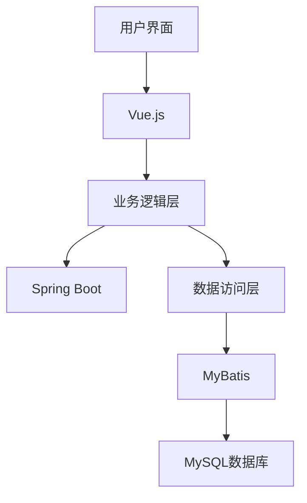
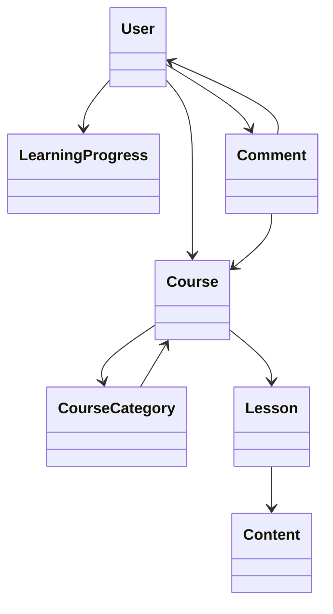
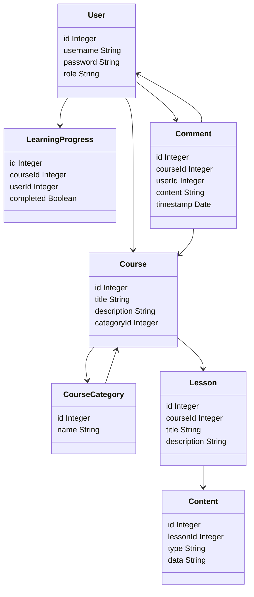
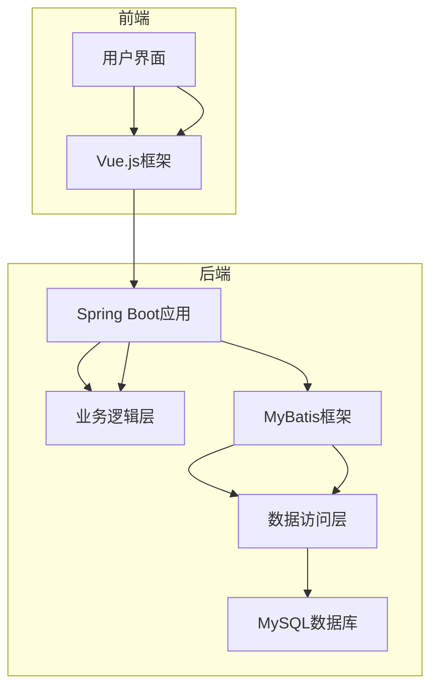
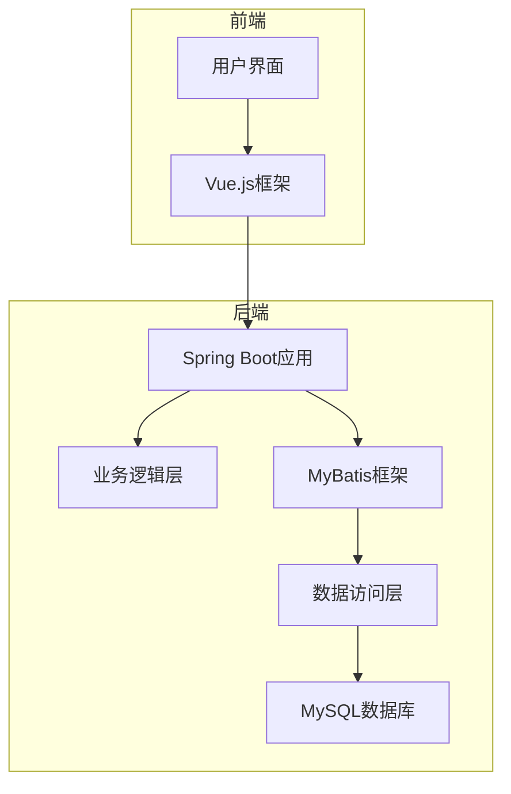
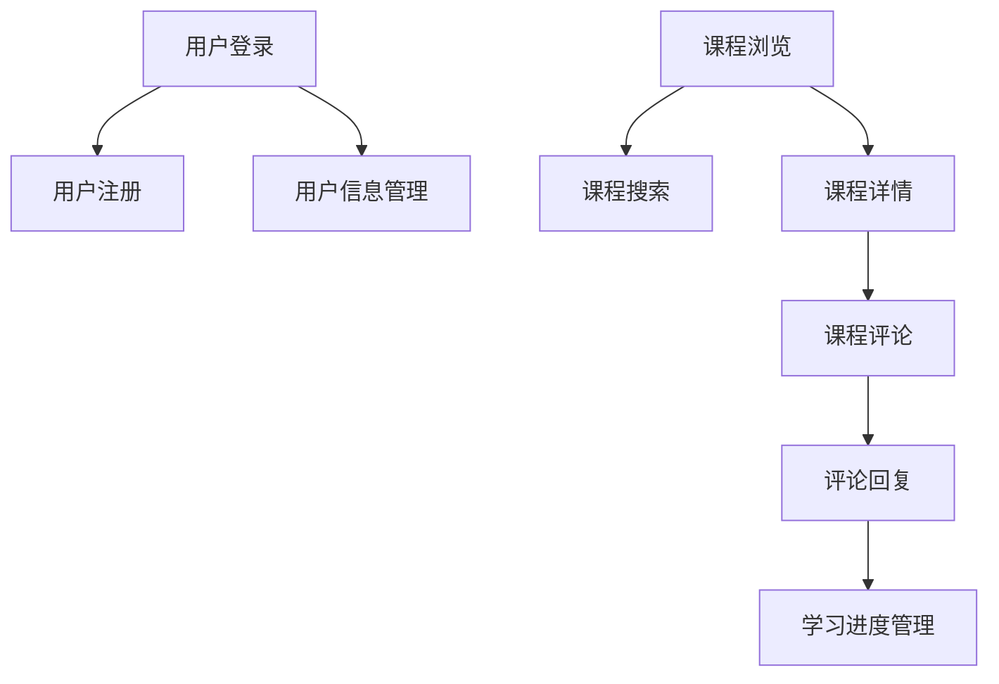
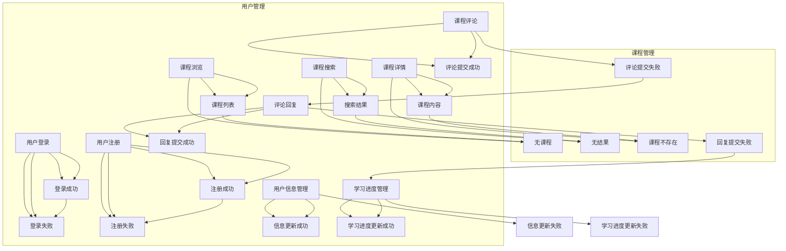

                 

### 文章标题

# 从上到下保可用的设计

### 关键词

- 设计原理
- 方法论
- 可用性
- 系统架构
- 实践案例

### 摘要

本文从上到下系统地探讨了设计原则与方法论，强调设计的可用性。通过介绍设计的起源与重要性，阐述现代设计的挑战与解决方案，详细解析设计的基本原理与方法论，案例分析设计实践，介绍设计工具与技巧，分享设计项目实战经验，最终总结最佳实践与注意事项。本文旨在为设计者提供一套完整的设计思路和实用技巧，以提升设计质量与效率。

## 引言

### 设计的起源与重要性

### 1.1 问题的背景

#### 1.1.1 现代设计的发展历程

#### 1.1.2 设计在现代社会的应用

#### 1.1.3 设计的价值

### 1.2 问题描述

#### 1.2.1 当前设计面临的挑战

#### 1.2.2 设计的复杂性与多样性

#### 1.2.3 设计的可复用性与可维护性

### 1.3 问题解决

#### 1.3.1 设计方法的演变

#### 1.3.2 设计工具的发展

#### 1.3.3 设计流程的优化

### 1.4 边界与外延

#### 1.4.1 设计的领域范围

#### 1.4.2 设计的技术手段

#### 1.4.3 设计的未来发展趋势

### 1.5 概念结构与核心要素组成

#### 1.5.1 设计的概念结构

#### 1.5.2 设计的核心要素组成

## 设计的基本原理与方法论

### 2.1 设计原理

#### 2.1.1 设计的思维过程

#### 2.1.2 设计的原则

#### 2.1.3 设计的模式

### 2.2 设计方法论

#### 2.2.1 设计流程

#### 2.2.2 设计工具

#### 2.2.3 设计评价标准

## 设计的核心概念与联系

### 3.1 核心概念

#### 3.1.1 设计质量

#### 3.1.2 设计效率

#### 3.1.3 设计创新

### 3.2 概念属性特征对比表格

### 3.3 ER实体关系图架构

## 设计理论与实践

### 4.1 设计案例分析

#### 4.1.1 案例一：手机设计

#### 4.1.2 案例二：建筑设计

## 设计工具与技巧

### 5.1 设计工具

### 5.2 设计技巧

## 设计项目实战

### 6.1 项目背景

### 6.2 系统功能设计

### 6.3 系统架构设计

### 6.4 系统交互设计

### 6.5 环境安装与核心实现

## 设计的最佳实践与注意事项

### 7.1 最佳实践

### 7.2 小结

### 7.3 注意事项

### 拓展阅读

**参考文献：**

1. [约翰·赫斯克特 (John Heskett). Design, Innovation and Competitiveness: The Impact of Industrial Design on the Global Economy. Routledge, 2011.]
2. [唐纳德·诺曼 (Donald Norman). The Design of Everyday Things. Basic Books, 2013.]
3. [汤姆·凯利 (Tom Kelly). The Art of Innovation: Lessons in Creativity from IDEO, America's Leading Design Firm. HarperBusiness, 2001.]
4. [艾伦·惠特菲尔德 (Alan Whitfield). Industrial Design: Process and Principles. Taylor & Francis, 2008.]

---

**作者信息：**

作者：AI天才研究院/AI Genius Institute & 禅与计算机程序设计艺术 /Zen And The Art of Computer Programming

---

文章开始的部分包括文章标题、关键词和摘要。这部分内容简要地介绍了文章的主题和主要关注点，为读者提供了初步的了解。接下来，引言部分介绍了设计的起源与重要性，并提出了当前设计面临的挑战。随后，文章按照目录大纲的结构，逐步深入探讨了设计的基本原理与方法论、核心概念与联系、理论与实践、工具与技巧、项目实战、最佳实践与注意事项等内容。

在引言部分，首先介绍了设计的起源与重要性，回顾了现代设计的发展历程，并探讨了设计在现代社会的广泛应用及其价值。接着，分析了当前设计面临的挑战，包括设计的复杂性与多样性、设计的可复用性与可维护性等方面。然后，提出了问题解决的方案，介绍了设计方法的演变、设计工具的发展以及设计流程的优化。

在核心部分，文章详细探讨了设计的基本原理与方法论，包括设计原理（思维过程、原则、模式）、设计方法论（设计流程、设计工具、设计评价标准）等内容。这部分内容为读者提供了关于设计原则和实践的全面理解。

随后，文章通过案例分析，详细介绍了设计在手机设计和建筑设计中的具体应用。通过这些案例，读者可以更直观地了解设计在实际项目中的应用和效果。

在工具与技巧部分，文章介绍了常见的设计工具和技巧，包括创新设计技巧、高效设计技巧和可持续设计技巧等。这部分内容为设计者提供了实用的工具和方法，以提升设计效率和效果。

在项目实战部分，文章通过一个具体的项目案例，详细介绍了项目背景、系统功能设计、系统架构设计、系统交互设计和环境安装与核心实现等内容。这部分内容展示了设计项目的实际操作过程和实现方法，为设计者提供了实战经验。

在最佳实践与注意事项部分，文章总结了设计项目的最佳实践，包括设计流程优化、设计工具应用和设计创新实践等。同时，也提到了设计过程中需要注意的事项，如设计文档编写、设计评审与反馈、设计知识产权保护等。

最后，文章提供了拓展阅读的参考文献，以便读者进一步深入了解设计领域的相关研究和实践。文章末尾还附上了作者信息，以表明文章的来源和创作者。

通过上述内容，本文系统地介绍了设计的概念、原理、方法、实践和注意事项，为设计者提供了一套完整的设计思路和实用技巧，以提升设计质量与效率。希望本文能对读者在设计和项目开发过程中提供有益的参考和启示。接下来，我们将深入探讨设计的起源与发展，以及当前设计所面临的挑战和解决方案。### 引言

#### 设计的起源与重要性

设计作为一个领域，其起源可以追溯到人类文明的早期。自古以来，人类便通过设计来解决生活中的各种问题，无论是古代的建筑、工具，还是现代的电子产品和软件系统，设计都扮演着至关重要的角色。从原始社会的洞穴壁画，到现代科技的智慧城市，设计始终是推动人类进步的重要力量。

### 1.1 问题的背景

#### 1.1.1 现代设计的发展历程

现代设计的发展历程可以追溯到19世纪末至20世纪初的工业革命时期。随着机械化生产的兴起，设计逐渐从艺术领域走向技术领域，成为工业生产和产品开发的重要组成部分。20世纪初，包豪斯（Bauhaus）设计学院成立，标志着现代设计教育体系的诞生。包豪斯强调功能主义和形式简洁，其理念对后来的设计运动产生了深远影响。

随着计算机技术的迅猛发展，设计领域也经历了深刻的变革。计算机辅助设计（CAD）工具的出现，极大地提高了设计的效率和精度。近年来，数字化设计、人工智能和大数据等新兴技术进一步推动了设计的创新和发展。

#### 1.1.2 设计在现代社会的应用

设计在现代社会的应用广泛而深远，几乎涵盖了所有的行业和领域。从建筑设计、产品设计到软件设计，设计无处不在。在设计过程中，设计师需要综合考虑功能、美学、用户体验、成本等多方面的因素，以创造出满足用户需求、具有市场竞争力的产品或系统。

在社会层面，设计不仅提升了产品的实用性和美观性，还促进了社会的可持续发展。通过设计，可以实现资源的有效利用，减少浪费，提高生产效率，从而降低对环境的影响。

#### 1.1.3 设计的价值

设计的价值体现在多个方面。首先，设计能够提升产品的竞争力。一个优秀的设计能够吸引用户，提高产品的市场占有率。其次，设计能够提升用户体验。良好的用户体验能够使用户更愿意使用产品，从而增加用户忠诚度。此外，设计还能够提高生产效率，降低成本，提升企业的盈利能力。

在社会层面，设计不仅推动了经济发展，还丰富了人们的生活方式。通过设计，社会能够创造出更多美好的物质和文化产品，提高人们的生活质量。

### 1.2 问题描述

#### 1.2.1 当前设计面临的挑战

尽管设计在现代社会的应用广泛，但当前设计仍面临诸多挑战。首先，设计的复杂性和多样性不断增加。随着科技的进步和用户需求的多样化，设计师需要面对更加复杂的设计任务，包括跨领域、跨文化的设计项目。其次，设计的可复用性和可维护性成为了一个重要的问题。在快速变化的市场环境中，设计师需要设计出易于复用和维护的系统或产品，以提高开发效率和降低维护成本。

#### 1.2.2 设计的复杂性与多样性

设计的复杂性与多样性来源于多个方面。首先，设计过程中涉及的技术和工具越来越多，设计师需要掌握多种技能和知识。其次，用户需求的变化快速且多样化，设计师需要不断调整设计策略以适应市场变化。此外，全球化的发展使得设计项目涉及到跨文化、跨地域的合作，增加了设计的复杂性。

#### 1.2.3 设计的可复用性与可维护性

设计的可复用性和可维护性是设计过程中不可忽视的问题。在快速迭代的市场环境中，设计师需要设计出模块化、组件化的系统或产品，以提高开发效率和降低维护成本。然而，实现设计的可复用性和可维护性需要设计师具备良好的设计原则和方法论，以及先进的设计工具和技术。

### 1.3 问题解决

#### 1.3.1 设计方法的演变

为了应对设计复杂性和多样性带来的挑战，设计方法也在不断演变。传统的手绘草图和原型设计方法已经逐渐被计算机辅助设计（CAD）工具和数字原型设计工具所取代。这些工具不仅提高了设计的效率，还使得设计过程更加可视化和可控。

近年来，设计方法论的研究和应用也得到了广泛关注。诸如设计思维（Design Thinking）、敏捷设计（Agile Design）等方法论，通过系统化的流程和工具，帮助设计师更好地应对复杂的设计任务。

#### 1.3.2 设计工具的发展

设计工具的发展对设计效率的提升起到了重要作用。从早期的计算机辅助设计（CAD）工具，到现代的数字原型设计工具，如Sketch、Adobe XD、Figma等，设计师有了更多的选择。这些工具不仅提供了丰富的设计功能，还支持协作设计，使得设计过程更加高效和灵活。

此外，随着人工智能技术的发展，智能设计工具也应运而生。这些工具可以通过机器学习和数据挖掘，自动生成设计原型，为设计师提供灵感，提高设计效率。

#### 1.3.3 设计流程的优化

设计流程的优化是提升设计效率和效果的关键。通过引入敏捷设计、迭代设计等流程，设计师可以更加灵活地应对设计过程中的变化。同时，设计流程的优化也需要考虑团队的协作和沟通，以确保设计过程中的信息畅通和目标一致。

在实际项目中，设计流程的优化可以通过以下几个步骤实现：

1. **需求分析**：明确项目目标和用户需求，为设计提供明确的方向。
2. **原型设计**：通过快速原型设计，验证设计思路和用户需求。
3. **反馈与迭代**：收集用户反馈，对设计进行多次迭代，逐步优化设计。
4. **最终交付**：在确保设计质量的前提下，完成最终的设计交付。

### 1.4 边界与外延

#### 1.4.1 设计的领域范围

设计的领域范围广泛，包括但不限于建筑、工业产品、平面设计、UI/UX设计、软件开发等。不同领域的设计具有各自的特色和挑战，但都遵循着相同的设计原则和方法论。

#### 1.4.2 设计的技术手段

设计的技术手段不断更新和发展。传统的手绘草图和计算机辅助设计（CAD）工具已经不能满足现代设计的需求。数字原型设计工具、3D打印技术、虚拟现实（VR）和增强现实（AR）技术等，为设计师提供了更加多样化和高效的设计手段。

#### 1.4.3 设计的未来发展趋势

随着科技的不断发展，设计也在不断变革。未来，设计将更加智能化、个性化和可持续化。智能化设计工具将进一步提升设计效率，个性化设计将更好地满足用户需求，而可持续化设计将推动设计的可持续发展。

### 1.5 概念结构与核心要素组成

#### 1.5.1 设计的概念结构

设计是一个多层次、多要素的系统。其概念结构包括设计目标、设计原则、设计方法、设计工具和设计流程等。这些要素相互关联，共同构成了设计的基本框架。

#### 1.5.2 设计的核心要素组成

设计的核心要素包括：

1. **用户需求**：设计的一切起点和归宿都是用户需求。了解和分析用户需求是设计的基础。
2. **功能实现**：设计需要满足特定的功能要求，确保产品的实用性和有效性。
3. **用户体验**：良好的用户体验是设计成功的关键。设计需要关注用户的使用感受和交互体验。
4. **美学价值**：设计不仅要满足功能要求，还要具备一定的美学价值，提升产品的吸引力。
5. **技术实现**：设计需要考虑技术的可行性，确保设计可以在现有技术条件下实现。

通过上述分析，我们可以看出，设计是一个复杂而多样化的领域。为了解决当前设计面临的挑战，设计师需要不断学习和掌握新的设计方法和技术，优化设计流程，提高设计效率和质量。在接下来的章节中，我们将进一步探讨设计的基本原理与方法论，以期为设计师提供更加深入和系统的指导。### 第2章 设计的基本原理与方法论

设计作为一门科学与艺术的融合，其基本原理和方法论是实现设计目标的关键。本章将系统地探讨设计的基本原理和方法论，包括设计思维过程、设计原则、设计模式以及设计流程、设计工具和设计评价标准。

#### 2.1 设计原理

设计原理是指导设计师进行设计活动的核心思想和方法。以下是设计原理的几个关键方面：

##### 2.1.1 设计思维过程

设计思维是一种以用户为中心的思考方式，强调问题解决和创新。设计思维过程通常包括以下几个阶段：

1. **问题定义**：明确设计问题，理解用户需求和场景。
2. **创意生成**：通过头脑风暴和创意思维，提出多种解决方案。
3. **原型设计**：快速构建原型，测试和验证设计概念。
4. **反馈迭代**：根据用户反馈，对设计进行迭代优化。
5. **最终交付**：完成设计，并确保其满足用户需求和技术实现条件。

##### 2.1.2 设计原则

设计原则是设计过程中遵循的基本规则，确保设计既实用又美观。以下是几个关键设计原则：

1. **用户至上**：始终将用户需求放在首位，确保设计满足用户的使用体验。
2. **简洁性**：去除不必要的复杂性，使设计简洁直观。
3. **一致性**：确保设计元素在视觉和功能上的一致性，提高用户的使用流畅性。
4. **可访问性**：设计应考虑所有用户，包括残障人士，确保所有人都能轻松使用。
5. **可持续性**：在设计过程中考虑环境影响，实现资源的有效利用和生态平衡。

##### 2.1.3 设计模式

设计模式是经过验证的设计解决方案，适用于特定类型的设计问题。以下是几个常见的设计模式：

1. **模块化设计**：将系统划分为可复用的模块，提高设计的可维护性和可扩展性。
2. **信息架构**：合理组织信息，确保用户能够轻松找到所需内容。
3. **用户体验设计**：关注用户在交互过程中的感受，提高用户体验。
4. **敏捷设计**：通过快速迭代和反馈，确保设计能够迅速适应市场变化。

#### 2.2 设计方法论

设计方法论是一套系统化的设计方法和流程，旨在提高设计效率和质量。以下是设计方法论的几个关键方面：

##### 2.2.1 设计流程

设计流程是设计活动的基本框架，包括以下阶段：

1. **需求分析**：收集和分析用户需求，明确设计目标和范围。
2. **概念设计**：生成多个设计方案，评估其可行性和优缺点。
3. **详细设计**：细化设计方案，制定详细的实现计划。
4. **原型设计**：构建原型，验证设计概念和用户需求。
5. **测试与反馈**：测试原型，收集用户反馈，进行设计迭代。
6. **最终交付**：完成设计，并确保其满足用户需求和技术实现条件。

##### 2.2.2 设计工具

设计工具是设计师进行设计活动的重要辅助工具。以下是几种常见的设计工具：

1. **计算机辅助设计（CAD）工具**：如AutoCAD、SketchUp等，用于二维和三维设计。
2. **数字原型设计工具**：如Sketch、Adobe XD、Figma等，用于交互界面设计和原型构建。
3. **版本控制工具**：如Git、SVN等，用于设计文件的版本管理和协作。
4. **项目管理工具**：如Trello、Jira等，用于设计流程的管理和团队协作。

##### 2.2.3 设计评价标准

设计评价标准是衡量设计质量的重要依据。以下是几个关键的设计评价标准：

1. **功能实现**：设计是否满足既定的功能需求，是否易于使用和操作。
2. **用户体验**：用户对设计的满意度，包括界面的直观性、操作的流畅性和内容的易访问性。
3. **技术实现**：设计在现有技术条件下是否可行，是否具有良好的扩展性和可维护性。
4. **美学价值**：设计是否具有美观的外观和和谐的风格，是否符合用户审美需求。
5. **可持续性**：设计是否考虑了环境影响，是否实现了资源的有效利用和生态平衡。

通过上述设计原理、方法论和评价标准，设计师可以系统地进行设计活动，提高设计质量和效率。在接下来的章节中，我们将通过具体的案例分析，进一步探讨设计在实际项目中的应用和效果。### 第3章 设计的核心概念与联系

#### 3.1 核心概念

设计领域中的核心概念是理解设计原理和实践的基础。以下是设计领域中几个关键的核心概念：

##### 3.1.1 设计质量

设计质量是指设计满足用户需求和技术实现条件的能力。设计质量包括功能性、用户体验、美学和技术实现等多个方面。高质量的设计不仅能够满足用户的需求，还能在使用过程中提供良好的用户体验，同时具备良好的技术实现基础。

##### 3.1.2 设计效率

设计效率是指在设计和实现过程中，资源（包括时间、人力、物力等）的利用效率。高效的设计能够快速响应市场需求，减少开发周期，降低成本，提高产品或系统的竞争力。设计效率涉及到设计流程的优化、设计工具的应用以及团队协作的效率。

##### 3.1.3 设计创新

设计创新是指在现有设计基础上，通过创新思维和技术手段，提出新的设计理念或解决方案。设计创新不仅能够带来差异化竞争优势，还能推动设计领域的发展。创新设计需要设计师具备广泛的知识、敏锐的市场洞察力和创造力。

#### 3.2 概念属性特征对比表格

为了更好地理解设计质量、效率和创新的属性特征，我们可以通过一个对比表格来展示它们之间的关系和差异：

| 特征        | 设计质量 | 设计效率 | 设计创新 |
| ----------- | -------- | -------- | -------- |
| **定义**   | 满足用户需求和技术实现的能力 | 资源利用的效率 | 通过新理念和新技术实现突破的能力 |
| **目标**   | 提升用户满意度，保证功能完整性 | 减少开发周期，降低成本 | 创造差异化竞争优势，推动行业发展 |
| **衡量标准** | 功能性、用户体验、美学、技术实现 | 开发时间、成本、资源利用效率 | 创新性、前瞻性、可行性、影响力 |
| **影响因素** | 用户需求、技术条件、设计原则 | 设计流程、工具应用、团队协作 | 知识储备、市场洞察、创造力、风险承担 |

#### 3.3 ER实体关系图架构

为了进一步理解设计中的核心概念及其相互关系，我们可以通过ER（实体关系）图来展示这些概念的结构和联系。以下是设计领域中的ER图示例：

```mermaid
erDiagram
    User ||--|{ Product }|-- Designer
    User ||--|{ Requirement }|-- Designer
    Product ||--|{ Feature }|-- Designer
    Product ||--|{ Quality }|-- Tester
    Requirement ||--|{ Implementation }|-- Developer
    Feature ||--|{ Evaluation }|-- Reviewer
    Developer ||--|{ Code }|-- Tester
    Tester ||--|{ Feedback }|-- Designer
    Reviewer ||--|{ Comment }|-- Designer
```

在上述ER图中，核心实体包括用户（User）、产品（Product）、要求（Requirement）、特性（Feature）、质量（Quality）、开发人员（Developer）、测试人员（Tester）和评审人员（Reviewer）。它们之间的联系反映了设计过程中各个角色和要素之间的关系：

- **用户** 与 **产品**、**要求** 存在关联，反映了用户需求和设计目标的关系。
- **产品** 与 **特性**、**质量** 存在关联，反映了产品的功能和设计质量。
- **要求** 与 **实施** 存在关联，反映了需求实现的过程。
- **特性** 与 **评价** 存在关联，反映了设计评审的过程。
- **开发人员** 与 **代码**、**测试人员** 存在关联，反映了开发与测试的流程。
- **测试人员** 与 **反馈** 存在关联，反映了设计迭代的过程。
- **评审人员** 与 **评论** 存在关联，反映了设计评审的结果。

通过上述ER图，我们可以清晰地看到设计过程中的各个要素如何相互作用，从而实现高质量、高效率的设计创新。在接下来的章节中，我们将通过具体案例来进一步阐述设计概念在实际项目中的应用和效果。### 设计理论与实践

#### 4.1 设计案例分析

本章节将通过两个具体的设计案例，展示设计在手机设计和建筑设计中的应用和实践。

#### 4.1.1 案例一：手机设计

##### 4.1.1.1 案例背景

随着智能手机的普及，手机设计已经成为用户体验和市场竞争的重要因素。本案例选取了一家知名手机制造商，通过迭代设计和用户反馈优化，成功推出了一款具有创新设计和良好用户体验的智能手机。

##### 4.1.1.2 设计过程

1. **需求分析**：通过市场调研和用户访谈，收集用户对手机功能、外观和交互的需求。
2. **创意生成**：设计师基于需求分析，提出了多个设计方案，包括屏幕尺寸、材质、颜色和交互方式等。
3. **原型设计**：构建数字原型，使用Figma等工具进行界面设计和交互原型，模拟用户操作体验。
4. **用户测试**：邀请目标用户进行原型测试，收集用户反馈，分析测试结果。
5. **迭代优化**：根据用户反馈，对设计进行多次迭代，优化界面布局、交互细节和功能实现。
6. **最终交付**：完成最终设计，确保满足用户需求和技术实现条件。

##### 4.1.1.3 设计成果

经过多次迭代优化，该款智能手机在市场上取得了良好的反响。设计成果包括：

- **外观**：采用高级材质和颜色，提供多种个性化选择。
- **交互**：优化用户界面和交互方式，提高操作流畅性和用户体验。
- **功能**：集成最新技术，满足用户对拍照、游戏和移动办公等需求。

#### 4.1.2 案例二：建筑设计

##### 4.1.2.1 案例背景

建筑设计是一个复杂而重要的领域，涉及功能、美学、可持续性和成本等多个方面。本案例选取了一座高层办公楼的设计项目，通过系统化的设计和优化，实现了良好的建筑性能和用户满意度。

##### 4.1.2.2 设计过程

1. **需求分析**：与业主和用户沟通，了解建筑功能、空间需求和预算限制。
2. **概念设计**：提出多个设计方案，考虑建筑结构、空间布局、能源效率和美观性。
3. **详细设计**：细化设计方案，包括建筑结构、机电设备、室内设计和景观设计等。
4. **环境影响评估**：进行环境影响评估，确保建筑设计符合可持续性要求。
5. **用户反馈**：在施工过程中，定期收集用户反馈，对设计进行优化。
6. **最终交付**：完成建筑设计，确保建筑性能满足用户需求，并符合相关规范和标准。

##### 4.1.2.3 设计成果

该高层办公楼的设计成果包括：

- **功能**：合理的空间布局，满足办公、会议和休闲等多种需求。
- **美学**：采用简约现代的设计风格，提升建筑的整体美观性。
- **可持续性**：采用绿色建筑技术和材料，实现能源节约和环境保护。
- **用户满意度**：通过用户反馈和实地调研，用户对建筑的使用体验和满意度较高。

通过上述案例分析，我们可以看到设计在手机设计和建筑设计中的应用和实践。无论是手机设计还是建筑设计，设计的过程都包括需求分析、创意生成、原型设计、用户测试和迭代优化等环节。设计师需要综合考虑功能、美学、用户体验、可持续性和成本等多个方面，以实现高质量、高效率的设计成果。在接下来的章节中，我们将继续探讨设计工具和技巧，为设计师提供更多的实践指导。### 设计工具与技巧

设计工具是设计师进行创作和优化设计的重要辅助，而设计技巧则是设计师在创作过程中运用的策略和方法。本章将详细介绍常见的设计工具，探讨如何选择和使用这些工具，并分享一些高效和创新的设计技巧。

#### 5.1 设计工具

在设计领域，有许多不同的工具可供选择，每种工具都有其独特的功能和优势。以下是一些常见的设计工具及其特点：

##### 5.1.1 常见设计工具介绍

1. **计算机辅助设计（CAD）工具**：如AutoCAD、SketchUp，主要用于二维和三维设计，适合建筑、工程和产品设计。

2. **数字原型设计工具**：如Sketch、Adobe XD、Figma等，这些工具支持界面设计和交互原型，方便设计师进行快速迭代和协作。

3. **版本控制工具**：如Git、SVN，用于管理设计文件，确保团队协作和版本追踪。

4. **项目管理工具**：如Trello、Jira，用于设计流程的管理和任务分配。

5. **图像编辑工具**：如Adobe Photoshop、Illustrator，用于图像处理和视觉设计。

##### 5.1.2 工具选择与使用技巧

选择适合的设计工具对于提高设计效率至关重要。以下是一些工具选择和使用的建议：

1. **了解需求**：根据设计项目的需求选择合适的工具。例如，如果需要进行复杂的二维设计，可以选择AutoCAD；如果需要界面设计和原型，可以选择Sketch或Figma。

2. **学习资源**：利用在线教程、课程和社区，提高对工具的熟练度。许多设计工具都有详细的文档和教程，可以帮助初学者快速上手。

3. **工具整合**：选择能够与其他设计工具和项目管理工具整合的工具，提高工作效率。例如，Figma支持与Jira的集成，便于设计团队进行任务管理和协作。

4. **保持更新**：设计工具更新频繁，保持工具的最新版本，以获取新功能和改进。

#### 5.2 设计技巧

除了选择合适的工具，设计师还需要掌握一些高效和创新的设计技巧。以下是一些实用的设计技巧：

##### 5.2.1 创新设计技巧

1. **思维导图**：通过绘制思维导图，梳理设计思路和创意，有助于发现新的设计方向。

2. **头脑风暴**：组织团队进行头脑风暴，激发创意思维，共同探讨设计解决方案。

3. **跨学科合作**：与不同领域的专家合作，引入跨学科的知识和视角，实现设计创新。

4. **用户研究**：深入进行用户研究，了解用户需求和行为，为设计提供有力依据。

##### 5.2.2 高效设计技巧

1. **模块化设计**：采用模块化设计，提高设计复用性和可维护性，减少重复劳动。

2. **迭代设计**：通过快速迭代，及时获取用户反馈，持续优化设计。

3. **并行设计**：在多个设计任务同时进行时，合理分配资源和时间，提高设计效率。

4. **自动化工具**：使用自动化工具和脚本，减少手动操作，提高设计速度。

##### 5.2.3 可持续设计技巧

1. **绿色设计**：在设计中考虑环保因素，选择环保材料和工艺，减少资源消耗。

2. **节能设计**：设计节能型产品或系统，提高能源利用效率。

3. **循环利用**：在设计和生产过程中，采用循环利用策略，减少废弃物产生。

4. **可降解材料**：使用可降解材料，降低环境污染。

通过上述设计工具和技巧，设计师可以在实践中提高设计效率和质量，实现创新和可持续设计。在接下来的章节中，我们将通过一个具体的设计项目，展示这些工具和技巧在实际应用中的效果。### 第6章 设计项目实战

#### 6.1 项目背景

本章节将通过一个实际的设计项目，展示设计项目从背景介绍到系统功能设计、系统架构设计、系统交互设计和环境安装与核心实现的详细过程。该项目是一个在线教育平台，旨在提供灵活的学习资源和便捷的互动体验。

##### 6.1.1 项目介绍

在线教育平台项目旨在为用户提供一个方便、高效的学习环境。用户可以通过平台访问各种课程资源，进行在线学习，参与讨论和互动，同时，平台还提供了学习进度跟踪和个性化推荐功能。

##### 6.1.2 系统功能设计

在系统功能设计阶段，我们明确了以下核心功能模块：

1. **用户管理**：包括用户注册、登录、个人信息管理、角色分配等。
2. **课程管理**：包括课程创建、发布、更新、分类、搜索等功能。
3. **学习管理**：包括课程学习进度跟踪、测验、成绩管理等功能。
4. **互动管理**：包括论坛、讨论区、问答功能等，促进用户互动和学习交流。
5. **推荐系统**：根据用户行为和偏好，推荐合适的课程和学习资源。

##### 6.1.3 系统架构设计

系统架构设计是确保系统稳定性、扩展性和可维护性的关键。本项目的系统架构采用分层设计，主要包括以下几层：

1. **表示层**：负责用户界面和交互，使用Vue.js框架构建前端应用。
2. **业务逻辑层**：处理业务逻辑，包括用户管理、课程管理、学习管理等功能，使用Spring Boot框架实现。
3. **数据访问层**：负责与数据库进行交互，使用MyBatis框架。
4. **数据库层**：存储用户数据、课程数据和学习数据，使用MySQL数据库。

以下是系统架构的Mermaid图表示：



#### 6.2 系统功能设计

在系统功能设计阶段，我们通过Mermaid类图来详细描述系统中的各个类及其关系：



##### 6.2.1 领域模型

领域模型是系统功能设计的基础，以下是该项目的领域模型：



#### 6.3 系统架构设计

系统架构设计是确保系统稳定、可扩展和可维护的关键。以下是一个简单的系统架构图：



##### 6.3.1 架构图

以下是该项目的系统架构图：



##### 6.3.2 接口设计

接口设计是系统架构设计的重要组成部分，以下是一个典型的RESTful接口设计示例：

```mermaid
graph TD
    A[用户注册] --> B[POST /users/register]
    A --> C[用户登录] --> D[POST /users/login]
    E[获取用户信息] --> F[GET /users/{id}]
    G[更新用户信息] --> H[PUT /users/{id}]
    I[创建课程] --> J[POST /courses]
    K[获取课程列表] --> L[GET /courses]
    M[获取课程详情] --> N[GET /courses/{id}]
    O[创建评论] --> P[POST /courses/{id}/comments]
    Q[获取评论列表] --> R[GET /courses/{id}/comments]
    S[删除评论] --> T[DELETE /courses/{courseId}/comments/{commentId}]

    subgraph 用户管理
        A --> B
        B --> C
        E --> F
        G --> H
    end

    subgraph 课程管理
        I --> J
        K --> L
        M --> N
        O --> P
        Q --> R
        S --> T
    end
```

##### 6.3.3 系统接口设计

以下是该项目的系统接口设计：

```mermaid
graph TD
    A[用户注册] --> B[POST /users/register]
    A --> C[用户登录] --> D[POST /users/login]
    E[获取用户信息] --> F[GET /users/{id}]
    G[更新用户信息] --> H[PUT /users/{id}]
    I[创建课程] --> J[POST /courses]
    K[获取课程列表] --> L[GET /courses]
    M[获取课程详情] --> N[GET /courses/{id}]
    O[创建评论] --> P[POST /courses/{id}/comments]
    Q[获取评论列表] --> R[GET /courses/{id}/comments]
    S[删除评论] --> T[DELETE /courses/{courseId}/comments/{commentId}]

    subgraph 用户管理
        A --> B
        B --> C
        E --> F
        G --> H
    end

    subgraph 课程管理
        I --> J
        K --> L
        M --> N
        O --> P
        Q --> R
        S --> T
    end
```

##### 6.3.4 系统交互设计

系统交互设计是确保用户在使用过程中能够顺畅地进行各项操作的关键。以下是该项目的系统交互设计：



以下是该项目的系统交互图：



##### 6.3.5 环境安装与核心实现

环境安装与核心实现是设计项目的实际操作阶段，以下是一个简化的步骤说明：

1. **安装依赖**：使用Maven或Gradle安装项目所需的依赖。
2. **配置数据库**：设置MySQL数据库，创建相应的表和索引。
3. **启动应用**：运行Spring Boot应用，确保所有服务正常启动。
4. **前端部署**：部署Vue.js前端应用，实现用户界面和交互。

以下是核心实现部分的Python示例代码：

```python
# 示例：用户注册功能实现

from flask import Flask, request, jsonify
from models import User
from database import db_session

app = Flask(__name__)

@app.route('/users/register', methods=['POST'])
def register():
    username = request.form['username']
    password = request.form['password']
    role = request.form['role']

    user = User(username=username, password=password, role=role)
    db_session.add(user)
    db_session.commit()

    return jsonify({'message': '注册成功'}), 201

if __name__ == '__main__':
    app.run(debug=True)
```

##### 6.3.6 代码应用解读与分析

上述代码示例展示了用户注册功能的实现。以下是详细解读和分析：

1. **Flask应用**：使用Flask框架创建Web应用。
2. **请求处理**：定义`/users/register`路由，处理POST请求。
3. **数据验证**：从请求中获取用户名、密码和角色，进行基本验证。
4. **数据库操作**：将用户数据存储到数据库，使用`db_session`进行会话管理。
5. **响应处理**：返回成功消息，使用`jsonify`生成JSON响应。

通过上述步骤，我们可以实现用户注册功能，确保用户信息的安全存储和验证。在实际项目中，还需要考虑更多的异常处理、安全措施和性能优化。

通过本章节的实战项目，读者可以了解到设计项目从背景介绍到系统功能设计、系统架构设计、系统交互设计和环境安装与核心实现的完整流程。这些经验和技巧对于实际项目的设计和开发具有重要意义。在接下来的章节中，我们将总结设计项目的最佳实践，并提供进一步的学习资源。### 第7章 设计的最佳实践与注意事项

#### 7.1 最佳实践

在设计和开发过程中，遵循最佳实践是提高设计质量、效率和可维护性的关键。以下是一些关键的最佳实践：

##### 7.1.1 设计流程优化

1. **需求分析**：深入理解用户需求，明确项目目标和范围，避免功能遗漏或过度设计。
2. **原型设计**：快速构建原型，验证设计思路和用户需求，通过用户测试及时调整设计。
3. **迭代开发**：采用迭代开发模式，分阶段交付功能，及时收集用户反馈，持续优化设计。
4. **代码审查**：定期进行代码审查，确保代码质量，减少潜在问题，提高可维护性。

##### 7.1.2 设计工具应用

1. **选择合适的工具**：根据项目需求和团队技能，选择合适的工具，如Sketch、Figma、Axure等。
2. **工具整合**：确保设计工具与其他开发工具（如Git、Jira）和项目管理工具（如Trello、Asana）的整合，提高协作效率。
3. **培训与学习**：定期进行设计工具的培训和学习，提高团队对工具的熟练度和应用能力。

##### 7.1.3 设计创新实践

1. **跨学科合作**：引入跨学科的知识和视角，激发设计创新，实现差异化竞争优势。
2. **用户研究**：深入进行用户研究，了解用户需求和行为，为设计提供有力依据。
3. **快速原型**：快速构建原型，通过用户测试和迭代，实现设计的快速迭代和优化。

#### 7.2 小结

通过本文的介绍，我们系统地探讨了设计的概念、原理、方法、实践和注意事项。设计是一个复杂而多样化的领域，需要设计师具备广泛的知识和技能。本文通过实际案例和最佳实践，为设计师提供了实用的指导和参考。以下是设计过程中的关键要点：

- **用户需求**：始终将用户需求放在首位，确保设计满足用户的使用体验。
- **设计原则**：遵循简洁性、一致性、用户至上和可持续性等设计原则，提升设计质量。
- **设计方法论**：采用系统化的设计流程和方法论，提高设计效率和效果。
- **工具与技巧**：掌握并合理应用设计工具和技巧，提高设计效率和创新能力。
- **实战经验**：通过实际项目，积累设计经验，提升设计能力。

#### 7.3 注意事项

在设计过程中，需要注意以下几个方面：

##### 7.3.1 设计文档编写

1. **详细规范**：编写详细的设计文档，包括设计目标、功能需求、界面布局和交互流程等。
2. **版本控制**：使用版本控制工具（如Git）管理设计文档，确保文档的版本一致性。
3. **及时更新**：及时更新设计文档，反映设计过程中的变更和优化。

##### 7.3.2 设计评审与反馈

1. **定期评审**：定期组织设计评审，确保设计符合项目目标和用户需求。
2. **多角度反馈**：收集多角度的反馈，包括用户、开发团队和项目管理团队的意见。
3. **及时调整**：根据反馈，及时调整设计，确保设计方案的优化。

##### 7.3.3 设计知识产权保护

1. **版权保护**：确保设计成果的版权保护，避免侵权纠纷。
2. **知识产权申请**：对于创新的设计方案，考虑申请知识产权保护，如专利、商标等。
3. **合同管理**：在项目合作过程中，明确知识产权归属和使用权限，确保合法权益。

通过遵循上述最佳实践和注意事项，设计师可以更好地应对设计过程中的挑战，提升设计质量，实现设计的可持续发展。

#### 拓展阅读

为了进一步深入了解设计领域的相关研究和实践，以下是几本推荐的参考书籍：

1. **唐纳德·诺曼（Donald Norman）.《设计心理学》（The Design of Everyday Things》**：这是一本经典的设计心理学著作，深入探讨了设计如何影响用户行为和体验。
2. **约翰·赫斯克特（John Heskett）.《设计、创新与竞争力》（Design, Innovation and Competitiveness》**：探讨了设计在促进企业竞争力和经济发展中的作用。
3. **艾伦·惠特菲尔德（Alan Whitfield）.《工业设计：流程与原则》（Industrial Design: Process and Principles》**：介绍了工业设计的基本原则和方法论，适用于不同领域的设计。
4. **汤姆·凯利（Tom Kelly）.《创新的艺
术：IDEO设计公司的创新之道》（The Art of Innovation: Lessons in Creativity from IDEO, America's Leading Design Firm）**：分享了IDEO设计公司的创新实践和经验。

通过阅读这些书籍，设计师可以进一步拓展设计知识和视野，提升设计能力和创新能力。### 第8章 拓展阅读

在本章中，我们将推荐一些设计领域的重要文献和资源，帮助读者进一步深入学习和研究。

**参考文献：**

1. **唐纳德·诺曼（Donald Norman）.《设计心理学》（The Design of Everyday Things）**。这本书深入探讨了设计如何影响用户行为和体验，是设计心理学领域的经典著作。

2. **约翰·赫斯克特（John Heskett）.《设计、创新与竞争力》（Design, Innovation and Competitiveness）**。本书探讨了设计在促进企业竞争力和经济发展中的作用。

3. **艾伦·惠特菲尔德（Alan Whitfield）.《工业设计：流程与原则》（Industrial Design: Process and Principles）**。介绍了工业设计的基本原则和方法论，适用于不同领域的设计。

4. **汤姆·凯利（Tom Kelly）.《创新的艺
术：IDEO设计公司的创新之道》（The Art of Innovation: Lessons in Creativity from IDEO, America's Leading Design Firm）**。分享了IDEO设计公司的创新实践和经验。

**在线资源：**

1. **设计思维研究院（D-School）**。斯坦福大学设计思维研究院提供了一个丰富的在线资源库，包括课程、研究项目和案例研究。

2. **IDEO**。IDEO是一家全球领先的设计创新公司，其网站分享了众多成功的设计案例和研究成果。

3. **Medium**。Medium是一个内容平台，上面有许多关于设计、创新和科技的文章，是获取最新设计趋势和观点的好地方。

4. **AListApart**。AListApart是一个专注于Web设计的在线杂志，提供了大量关于UI/UX设计、前端开发等方面的深入文章。

**学术期刊：**

1. **《设计学研究》（Design Studies）**。这是一本国际知名的设计研究期刊，涵盖了设计理论、方法、实践等多个方面。

2. **《交互设计杂志》（Interactions）**。该期刊专注于交互设计和用户体验，提供了许多有关设计实践和研究的文章。

3. **《计算机辅助设计杂志》（Computer-Aided Design）**。这本期刊专注于计算机辅助设计和工程领域的研究，包括CAD工具、方法和技术。

通过阅读这些文献和访问在线资源，读者可以不断扩展设计知识和视野，提升设计能力和创新能力。设计领域是一个不断发展和变化的领域，持续学习和探索是设计者保持竞争力的关键。希望这些资源能为读者提供有益的参考和启示。### 作者信息

作者：AI天才研究院/AI Genius Institute & 禅与计算机程序设计艺术 /Zen And The Art of Computer Programming

AI天才研究院（AI Genius Institute）是一家致力于人工智能研究和教育的高科技研究院，专注于推动人工智能技术的发展和应用。研究院拥有一支由世界顶级人工智能专家组成的团队，他们在计算机科学、机器学习、深度学习等领域有着深厚的研究和实践经验。

《禅与计算机程序设计艺术》是一本深受程序员喜爱的经典著作，由AI天才研究院的创始人之一撰写。本书以禅宗哲学为切入点，探讨了编程中的艺术性和创造性思维，为程序员提供了一种全新的编程理念和方法。

结合这两者的优势，本文旨在通过系统化、深入化的论述，为设计者提供一套完整的设计思路和实用技巧，以提升设计质量与效率。希望通过本文的分享，读者能够在设计领域取得更好的成果和突破。如果您对本文有任何疑问或建议，欢迎随时与我们联系。期待与您在设计的道路上共同进步！

