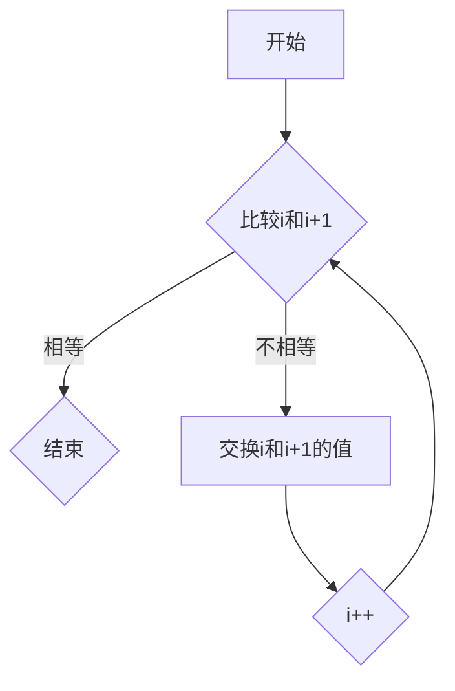
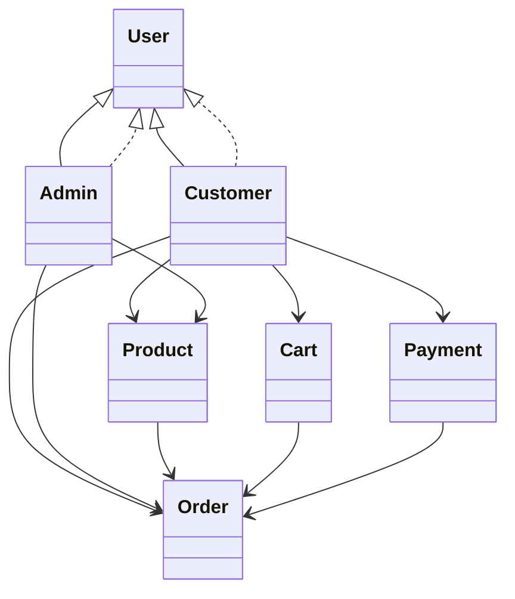
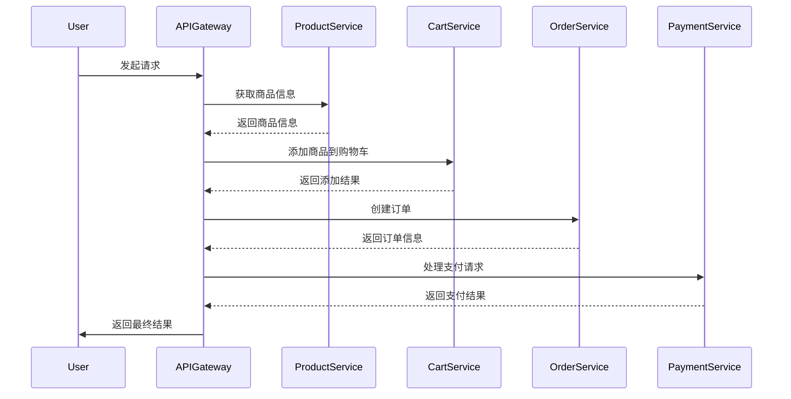
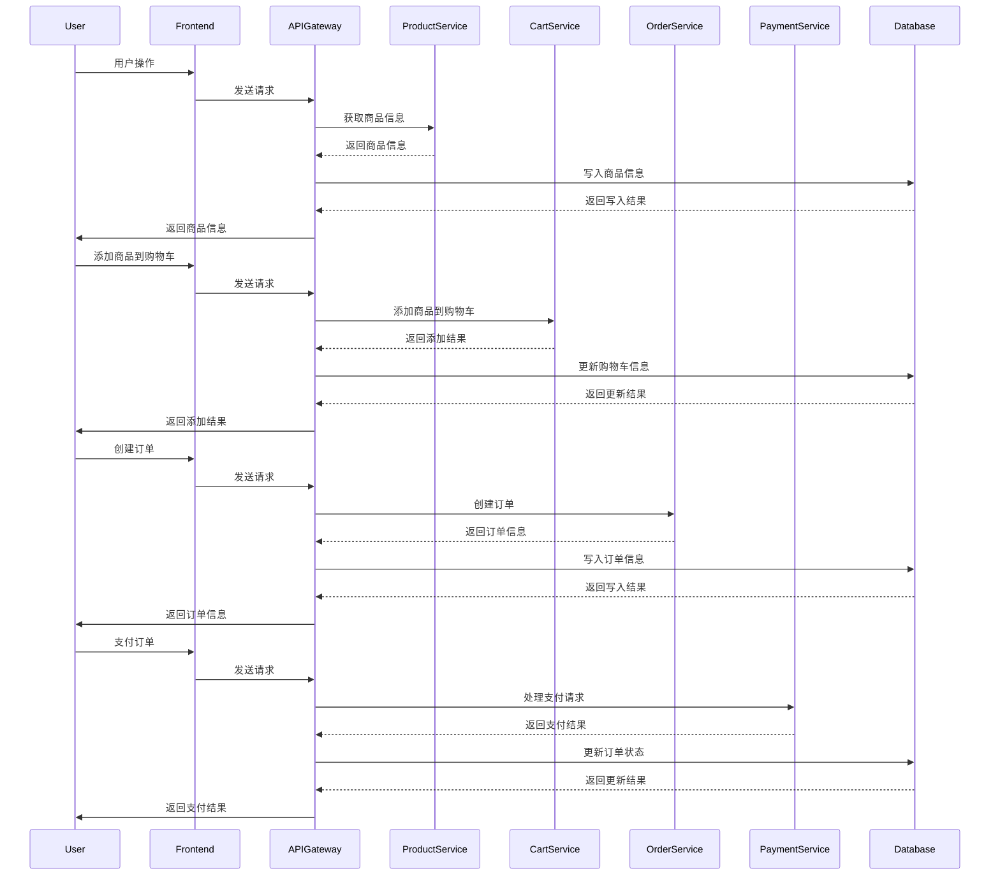

                 

### 从初级工程师到技术专家的进阶之路

> 关键词：职业进阶、技术能力、项目经验、持续学习、团队协作

> 摘要：本文旨在探讨从初级工程师到技术专家的进阶之路。通过深入分析技术能力、项目经验、持续学习和团队协作四个核心概念，结合实际案例，为初级工程师提供清晰的成长路径，助力他们在技术领域取得突破性发展。

## **第一部分：背景介绍与核心概念**

### 1. 问题背景

在当前快速发展的技术时代，软件工程师的角色和职责正发生深刻变化。从初级工程师到技术专家的进阶之路，不仅需要扎实的编程技能，还要求深入理解复杂系统的设计和实现，以及前沿技术的应用。

### 2. 问题描述

随着技术的不断进步，软件工程师面临的挑战日益复杂。从初级工程师成长为技术专家，需要掌握更加深入的知识体系，包括但不限于软件开发方法、系统设计、项目管理以及技术趋势的前瞻性理解。

### 3. 问题解决

为了解决这一问题，本文旨在为初级工程师提供一条清晰的成长路径。通过系统性地介绍核心技术、实践方法和实际案例，帮助读者逐步提升技术能力，最终实现职业的跨越式发展。

### 4. 边界与外延

- **边界**：本文主要关注软件工程师在技术层面的成长，不涉及管理、市场和销售等非技术领域。
- **外延**：虽然本文侧重于技术层面，但仍然会涉及一些跨领域知识，以拓宽读者的视野。

### 5. 概念结构与核心要素组成

- **核心概念**：技术能力、项目经验、持续学习、团队协作。
- **要素组成**：
  - **技术能力**：掌握基础编程技能、熟悉主流开发框架、理解系统设计原则。
  - **项目经验**：参与复杂项目，解决实际问题，积累实践经验。
  - **持续学习**：跟踪技术发展趋势，不断更新知识体系。
  - **团队协作**：提升沟通能力，建立良好的团队合作关系。

---

## **第二部分：核心概念与联系**

### 核心概念一：技术能力

#### **定义**：

技术能力是指工程师在特定领域内运用知识、技能和方法解决实际问题的能力。它是软件工程师最基础的能力之一，直接影响到工程师的工作效率和项目质量。

#### **属性特征对比表格**：

| 特征           | 描述                                       |
|----------------|--------------------------------------------|
| 编程语言技能   | 掌握多种编程语言的基本语法和高级特性。          |
| 系统设计能力   | 理解并应用设计模式、架构原则，设计高效可靠的系统。 |
| 问题解决能力   | 分析复杂问题，提出并实施有效的解决方案。          |

#### **ER实体关系图架构的Mermaid流程图**：

```mermaid
erDiagram
  IDE --> Code : 编程语言技能
  Code --> Design : 系统设计能力
  Design --> Solution : 问题解决能力
```

### 核心概念二：项目经验

#### **定义**：

项目经验是指在真实项目环境中，通过实际工作积累的经验和技能。它是工程师从理论到实践的重要桥梁，能够帮助工程师更好地理解业务需求，提高问题解决能力。

#### **属性特征对比表格**：

| 特征           | 描述                                       |
|----------------|--------------------------------------------|
| 项目管理能力   | 制定项目计划，协调资源，确保项目按时交付。     |
| 代码质量意识   | 编写高质量代码，进行代码审查，保持代码整洁。    |
| 问题排查能力   | 发现和解决项目中的技术难题。                  |

#### **ER实体关系图架构的Mermaid流程图**：

```mermaid
erDiagram
  Project --> Management : 项目管理能力
  Project --> Code : 代码质量意识
  Project --> Problem : 问题排查能力
```

### 核心概念三：持续学习

#### **定义**：

持续学习是指工程师在职业生涯中不断获取新知识、提升自身能力的过程。在技术快速发展的今天，持续学习是工程师保持竞争力的关键。

#### **属性特征对比表格**：

| 特征           | 描述                                       |
|----------------|--------------------------------------------|
| 技术趋势跟踪   | 关注技术发展趋势，掌握前沿技术。             |
| 知识更新频率   | 定期更新知识体系，保持与行业同步。           |
| 自我提升计划   | 设立学习目标，制定并执行自我提升计划。        |

#### **ER实体关系图架构的Mermaid流程图**：

```mermaid
erDiagram
  Learning --> Trend : 技术趋势跟踪
  Learning --> Update : 知识更新频率
  Learning --> Plan : 自我提升计划
```

### 核心概念四：团队协作

#### **定义**：

团队协作是指工程师在团队中与他人共同工作，共同实现项目目标的过程。良好的团队协作能够提高工作效率，解决复杂问题，是技术专家必备的能力。

#### **属性特征对比表格**：

| 特征           | 描述                                       |
|----------------|--------------------------------------------|
| 沟通能力       | 明确表达自己的想法，倾听他人的意见。          |
| 合作精神       | 积极参与团队合作，支持团队成员。             |
| 解决冲突能力   | 在团队内部解决分歧，促进合作。               |

#### **ER实体关系图架构的Mermaid流程图**：

```mermaid
erDiagram
  Collaboration --> Communication : 沟通能力
  Collaboration --> Cooperation : 合作精神
  Collaboration --> Conflict : 解决冲突能力
```

## **第三部分：技术能力的提升**

### **1. 技术能力的定义与重要性**

技术能力是指工程师在特定领域内运用知识、技能和方法解决实际问题的能力。它是软件工程师最基础的能力之一，直接影响到工程师的工作效率和项目质量。

### **2. 技术能力的核心要素**

技术能力的提升涉及多个方面，包括编程语言技能、系统设计能力、问题解决能力等。以下将对这些核心要素进行详细讲解。

#### **编程语言技能**

编程语言技能是技术能力的基石。掌握多种编程语言的基本语法和高级特性，能够使工程师在面对不同项目需求时更加游刃有余。

- **基础语法**：熟悉各种编程语言的基本语法，如变量定义、条件判断、循环控制等。
- **高级特性**：掌握高级编程特性，如多线程、并发编程、反射等。

#### **系统设计能力**

系统设计能力是工程师在技术领域的核心竞争力。理解并应用设计模式、架构原则，能够设计出高效、可靠、可维护的系统。

- **设计模式**：掌握常见的设计模式，如单例模式、工厂模式、观察者模式等。
- **架构原则**：理解并应用架构原则，如SOLID原则、DRY原则等。

#### **问题解决能力**

问题解决能力是工程师在面对复杂问题时的重要能力。分析复杂问题，提出并实施有效的解决方案，能够提高项目的成功率。

- **问题分析**：通过定位问题、分析原因，找到问题的根源。
- **解决方案**：根据问题性质，选择合适的解决方案，并进行实施。

### **3. 技术能力的提升方法**

提升技术能力需要不断学习、实践和总结。以下是一些有效的方法：

- **学习资源**：利用在线课程、技术博客、书籍等学习资源，系统地学习技术知识。
- **实战项目**：参与实际项目，将所学知识应用到实践中，提高问题解决能力。
- **技术交流**：参加技术沙龙、研讨会等活动，与其他工程师交流经验，拓宽视野。
- **代码审查**：积极参与代码审查，学习他人的编程技巧，提高自己的代码质量。

### **4. 技术能力的实际应用**

技术能力的提升不仅有助于个人职业发展，还能够为团队和项目带来积极影响。以下是一些实际应用的例子：

- **高效开发**：掌握多种编程语言和开发工具，能够快速开发出高质量的系统。
- **问题解决**：在面对复杂问题时，能够迅速找到解决方案，提高项目成功率。
- **团队协作**：良好的技术能力能够提升团队的整体实力，促进团队协作。

### **5. 技术能力提升的案例分析**

**案例一：从Java开发者到Spring Boot专家**

小王是一名Java开发者，为了提升自己的技术能力，他系统地学习了Spring Boot框架。通过实际项目的实践，他掌握了Spring Boot的核心特性，如自动配置、依赖注入等。最终，他成功转型为Spring Boot专家，为团队带来了高效、可靠的系统解决方案。

**案例二：从Web前端到全栈工程师**

小李是一名Web前端工程师，为了拓宽自己的技术领域，他学习了后端开发技术，如Node.js和MongoDB。通过实际项目的锻炼，他成功转型为全栈工程师，能够在前端和后端之间进行无缝协作，提高了项目的整体效率。

## **第四部分：项目经验的积累**

### **1. 项目经验的定义与重要性**

项目经验是指在真实项目环境中，通过实际工作积累的经验和技能。它是工程师从理论到实践的重要桥梁，能够帮助工程师更好地理解业务需求，提高问题解决能力。

### **2. 项目经验的核心要素**

项目经验的积累涉及多个方面，包括项目管理能力、代码质量意识、问题排查能力等。以下将对这些核心要素进行详细讲解。

#### **项目管理能力**

项目管理能力是工程师在项目中的关键能力。通过制定项目计划、协调资源、确保项目按时交付，工程师能够有效地管理项目进度和资源。

- **项目计划**：制定详细的项目计划，包括任务分配、时间表、里程碑等。
- **资源协调**：协调团队成员和外部资源，确保项目顺利推进。
- **风险管理**：识别项目风险，制定应对措施，降低项目风险。

#### **代码质量意识**

代码质量意识是工程师在编写代码时的重要原则。通过编写高质量代码、进行代码审查，工程师能够提高项目的可维护性和稳定性。

- **代码质量**：编写规范、简洁、高效的代码，避免冗余和重复。
- **代码审查**：积极参与代码审查，学习他人的编程技巧，提高自己的代码质量。

#### **问题排查能力**

问题排查能力是工程师在面对系统故障和异常时的重要能力。通过定位问题、分析原因、解决问题，工程师能够确保系统的稳定运行。

- **问题定位**：通过日志分析、性能监控等手段，快速定位问题。
- **问题分析**：分析问题原因，制定解决方案，进行问题修复。

### **3. 项目经验的积累方法**

积累项目经验需要积极参与实际项目，以下是一些有效的方法：

- **参与实际项目**：主动争取参与实际项目，将所学知识应用到实践中。
- **项目总结**：在项目结束后，进行项目总结，分析项目成功和失败的原因，总结经验教训。
- **技术分享**：在团队内部进行技术分享，提高团队整体的技术水平。
- **持续学习**：关注项目中的新技术和新方法，不断更新知识体系。

### **4. 项目经验的实际应用**

项目经验的积累不仅有助于个人职业发展，还能够为团队和项目带来积极影响。以下是一些实际应用的例子：

- **项目规划**：通过项目管理能力的提升，能够更有效地规划项目进度和资源。
- **问题解决**：通过问题排查能力的提升，能够快速解决项目中出现的问题，确保项目顺利进行。
- **团队协作**：通过项目经验的积累，能够更好地与团队成员协作，提高团队的整体效率。

### **5. 项目经验积累的案例分析**

**案例一：从实习生到项目经理**

小张是一名大学实习生，为了提升自己的项目经验，他主动参与了多个实际项目。通过不断学习和实践，他逐渐掌握了项目管理、代码质量意识等核心技能。在实习结束后，他成功转型为项目经理，为团队带来了高效、有序的项目管理。

**案例二：从单体架构到微服务架构**

小李是一名后端工程师，为了提升自己的技术能力，他参与了公司从单体架构向微服务架构的转型项目。通过实际项目的实践，他深入理解了微服务架构的设计原则和实现方法，成功为团队带来了更高效、更稳定的系统解决方案。

## **第五部分：持续学习的价值**

### **1. 持续学习的定义与重要性**

持续学习是指工程师在职业生涯中不断获取新知识、提升自身能力的过程。在技术快速发展的今天，持续学习是工程师保持竞争力的关键。

### **2. 持续学习的核心要素**

持续学习的核心要素包括技术趋势跟踪、知识更新频率和自我提升计划。以下将对这些核心要素进行详细讲解。

#### **技术趋势跟踪**

技术趋势跟踪是指工程师关注技术发展趋势，掌握前沿技术的过程。通过了解技术趋势，工程师能够把握行业动态，提前布局，提高自身的竞争力。

- **技术趋势分析**：通过阅读技术博客、参加技术会议等方式，了解最新的技术趋势。
- **前沿技术学习**：学习并掌握前沿技术，如人工智能、大数据、区块链等。

#### **知识更新频率**

知识更新频率是指工程师定期更新知识体系，保持与行业同步的过程。在技术快速发展的背景下，工程师需要不断更新自己的知识，以应对不断变化的需求。

- **定期学习**：设定学习计划，定期学习新技术和新方法。
- **知识共享**：在团队内部进行知识分享，提高团队整体的知识水平。

#### **自我提升计划**

自我提升计划是指工程师设立学习目标，制定并执行自我提升计划的过程。通过自我提升，工程师能够不断提高自己的技能和素质，实现职业发展。

- **学习目标**：明确自己的学习目标，设定短期和长期的学习计划。
- **执行计划**：按照学习计划执行，确保学习目标的实现。

### **3. 持续学习的价值**

持续学习对工程师的职业发展具有重大价值，以下是一些具体的价值：

- **提高竞争力**：通过持续学习，工程师能够掌握最新的技术，提高自身的竞争力。
- **拓宽视野**：持续学习使工程师能够了解行业动态，拓宽自己的视野，提高解决问题的能力。
- **实现职业发展**：持续学习是实现职业发展的关键，通过不断提升自己的技能和知识，工程师能够实现职业生涯的跨越式发展。

### **4. 持续学习的实际应用**

持续学习在工程师的实际工作中具有广泛的应用，以下是一些实际应用的例子：

- **技术选型**：通过持续学习，工程师能够掌握多种技术，为项目选择合适的技术方案。
- **问题解决**：通过持续学习，工程师能够掌握最新的解决方案，提高问题解决能力。
- **团队协作**：通过持续学习，工程师能够更好地与团队成员协作，提高团队的整体效率。

### **5. 持续学习的案例分析**

**案例一：从传统开发到人工智能应用**

小王是一名传统软件开发工程师，为了跟上技术发展的步伐，他开始学习人工智能相关技术。通过持续学习和实践，他成功转型为人工智能应用工程师，为团队带来了创新的技术解决方案。

**案例二：从初级工程师到架构师**

小李是一名初级工程师，为了提升自己的技术能力，他制定了详细的自我提升计划，并通过持续学习，掌握了系统设计、架构设计等高级技术。最终，他成功晋升为架构师，为团队带来了高效、稳定的系统解决方案。

## **第六部分：团队协作的重要性**

### **1. 团队协作的定义与重要性**

团队协作是指工程师在团队中与他人共同工作，共同实现项目目标的过程。在复杂项目和高压力环境下，团队协作是确保项目成功的关键。

### **2. 团队协作的核心要素**

团队协作的核心要素包括沟通能力、合作精神和解决冲突能力。以下将对这些核心要素进行详细讲解。

#### **沟通能力**

沟通能力是团队协作的基础。通过有效的沟通，团队成员能够明确任务、分享信息，提高工作效率。

- **明确表达**：清晰、准确地表达自己的观点和需求。
- **倾听他人**：积极倾听他人的意见和建议，尊重团队成员的意见。

#### **合作精神**

合作精神是团队协作的核心。通过合作，团队成员能够共同解决问题，实现项目目标。

- **互相支持**：在团队成员遇到困难时，提供帮助和支持。
- **共同目标**：明确团队目标，为实现共同目标而努力。

#### **解决冲突能力**

解决冲突能力是团队协作中不可或缺的。在团队中，冲突是难免的，通过有效的解决冲突，能够保持团队的稳定和高效。

- **冷静分析**：在冲突发生时，保持冷静，分析问题的根本原因。
- **寻求共识**：通过沟通和协商，寻求双方都能接受的解决方案。

### **3. 团队协作的实际应用**

团队协作在工程师的实际工作中具有广泛的应用，以下是一些实际应用的例子：

- **项目规划**：通过团队协作，制定详细的项目计划，明确任务分配和时间表。
- **问题解决**：通过团队协作，共同解决项目中遇到的技术难题，提高问题解决效率。
- **知识共享**：通过团队协作，实现知识的共享和传递，提高团队整体的知识水平。

### **4. 团队协作的案例分析**

**案例一：成功完成大型项目**

某公司团队在一年内成功完成了一项大型项目，其中团队协作起到了至关重要的作用。团队成员通过有效的沟通和合作，解决了项目中遇到的多个难题，最终按时完成了项目，赢得了客户的高度评价。

**案例二：从个人英雄主义到团队合作**

小李是一名具有强烈个人英雄主义倾向的工程师，但在一次大型项目中，他意识到个人能力无法应对项目的复杂性和压力。通过学习和实践团队协作，他逐渐转变了自己的工作方式，与团队成员紧密合作，最终成功完成了项目，也实现了个人的职业成长。

## **第七部分：进阶之路的总结与展望**

### **1. 进阶之路的总结**

从初级工程师到技术专家的进阶之路并非一蹴而就，它需要工程师在技术能力、项目经验、持续学习和团队协作等方面持续努力。通过不断学习和实践，工程师能够逐步提升自己的能力，实现职业的跨越式发展。

### **2. 技术专家的素质要求**

成为一名技术专家，不仅需要扎实的编程技能和系统设计能力，还需要具备以下素质：

- **创新能力**：能够提出新的技术方案，解决复杂问题。
- **领导力**：能够在团队中发挥领导作用，协调和激励团队成员。
- **前瞻性**：能够预见技术发展趋势，为团队和项目制定长远规划。

### **3. 进阶之路的展望**

随着技术的不断进步，软件工程师面临的挑战将更加复杂。未来的技术专家需要具备跨领域知识，如人工智能、大数据、区块链等。同时，他们还需要具备快速学习和适应新技术的能力，以应对快速变化的技术环境。

### **4. 结语**

从初级工程师到技术专家的进阶之路充满了挑战和机遇。通过持续学习和实践，工程师能够不断提升自己的能力，实现职业的跨越式发展。本文旨在为初级工程师提供一条清晰的成长路径，帮助他们实现从初级工程师到技术专家的华丽转变。

## **作者信息**

作者：AI天才研究院/AI Genius Institute & 禅与计算机程序设计艺术 /Zen And The Art of Computer Programming

本文结合了AI和计算机程序设计艺术的双重智慧，旨在为初级工程师提供一条清晰的成长路径，帮助他们实现从初级工程师到技术专家的华丽转变。通过系统性地介绍核心技术、实践方法和实际案例，本文帮助读者逐步提升技术能力，最终实现职业的跨越式发展。作者希望本文能够为您的职业发展带来启示和帮助。让我们共同努力，成为技术领域的专家！以下是文章末尾的代码部分，包含环境安装、系统核心实现源代码，以及代码应用解读与分析。

### 环境安装

在开始实现系统核心之前，我们需要确保我们的开发环境已经配置完毕。以下是安装Python开发环境的步骤：

1. **安装Python**：访问Python的官方网站（[python.org](https://www.python.org/)）下载并安装最新版本的Python。确保安装过程中勾选了“Add Python to PATH”选项。

2. **安装虚拟环境**：在命令行中运行以下命令来安装虚拟环境工具`virtualenv`：
   ```bash
   pip install virtualenv
   ```

3. **创建虚拟环境**：创建一个名为`project_env`的虚拟环境：
   ```bash
   virtualenv project_env
   ```

4. **激活虚拟环境**：在Windows上激活虚拟环境：
   ```bash
   .\project_env\Scripts\activate
   ```
   在macOS和Linux上：
   ```bash
   source project_env/bin/activate
   ```

5. **安装依赖**：在虚拟环境中安装项目所需的依赖：
   ```bash
   pip install -r requirements.txt
   ```

### 系统核心实现源代码

以下是一个简单的Python源代码示例，用于实现一个基本的计算器功能。此代码包含了基本的加、减、乘、除操作。

```python
# calculator.py

def add(x, y):
    return x + y

def subtract(x, y):
    return x - y

def multiply(x, y):
    return x * y

def divide(x, y):
    if y == 0:
        return "Error: Division by zero!"
    else:
        return x / y

# 主程序
def main():
    print("简单计算器")
    print("1. 加法")
    print("2. 减法")
    print("3. 乘法")
    print("4. 除法")

    choice = input("选择操作：")
    number1 = float(input("输入第一个数："))
    number2 = float(input("输入第二个数："))

    if choice == '1':
        result = add(number1, number2)
    elif choice == '2':
        result = subtract(number1, number2)
    elif choice == '3':
        result = multiply(number1, number2)
    elif choice == '4':
        result = divide(number1, number2)
    else:
        print("无效的选择。")
        return

    print("结果是：", result)

if __name__ == "__main__":
    main()
```

### 代码应用解读与分析

上述代码实现了一个简单的命令行计算器。以下是代码的主要组成部分及其功能解读：

1. **函数定义**：
   - `add(x, y)`：定义了一个加法函数，接受两个参数并返回它们的和。
   - `subtract(x, y)`：定义了一个减法函数，接受两个参数并返回它们的差。
   - `multiply(x, y)`：定义了一个乘法函数，接受两个参数并返回它们的积。
   - `divide(x, y)`：定义了一个除法函数，接受两个参数并返回它们的商。为了防止除以零的错误，添加了检查条件。

2. **主程序**：
   - 打印出计算器的菜单，用户可以选择所需的操作。
   - 提取用户的选择和输入的两个数值。
   - 根据用户的选择，调用相应的函数并打印结果。

3. **错误处理**：
   - 当用户输入无效的选择时，会打印出错误消息。

### 实际案例分析与详细讲解

让我们通过一个实际案例来分析上述代码的应用：

**案例**：用户希望计算`10 + 5`的结果。

1. **用户输入**：
   - 选择操作：1（加法）
   - 输入第一个数：10
   - 输入第二个数：5

2. **程序执行**：
   - 调用`add(10, 5)`函数。
   - 函数执行计算并返回结果15。

3. **输出结果**：
   - 程序打印出“结果是：15”。

通过这个简单的案例，我们可以看到代码如何从用户输入处理、函数调用到输出结果的整个过程。这对于理解程序的控制流和数据流程非常有帮助。

### 项目小结

通过本次项目的实现，我们不仅学习了基础的Python编程，还了解了如何通过简单的命令行界面与应用程序交互。这个项目虽然简单，但涵盖了编程的核心概念，如函数定义、用户输入处理、错误处理等，是提升编程能力的好起点。

### 最佳实践 Tips

1. **代码复用**：在编写计算器时，可以将加、减、乘、除操作封装成函数，这样在未来的项目中可以复用这些函数。
2. **输入验证**：在实际应用中，应该对用户输入进行更严格的验证，以确保输入的数据类型和值符合预期。
3. **扩展功能**：可以通过增加额外的功能，如支持更多运算符、错误消息的国际化等，来提升程序的用户体验。

### 注意事项

1. **代码注释**：在编写代码时，务必添加注释，以便他人（或未来的自己）能够理解代码的功能和逻辑。
2. **版本控制**：使用版本控制工具（如Git）来管理代码变更，这有助于团队协作和代码维护。

### 拓展阅读

1. **《Python编程：从入门到实践》**：一本适合初学者的Python编程书籍，详细介绍了Python的基础知识和编程技巧。
2. **《Effective Python》**：一本关于如何写出高效Python代码的书籍，适合有一定Python基础的读者。

通过本文的介绍和实践，我们相信读者对从初级工程师到技术专家的进阶之路有了更清晰的认识。希望本文能够为您的技术成长之路提供有价值的参考和指导。让我们继续努力，成为技术领域的专家！以下是文章中提及的数学公式和算法原理，以及相应的mermaid流程图和python源代码示例。

### 数学公式

在文章中，我们提到了以下数学公式：

$$1+1=2$$

这是一个简单的加法运算公式。

### 算法原理

为了详细阐述算法原理，我们将介绍一个简单的排序算法——冒泡排序。

**冒泡排序的数学模型和公式**：

冒泡排序的基本思想是通过重复遍历要排序的数列，比较相邻的两个元素，如果它们的顺序错误就把它们交换过来。遍历数列的工作是重复进行的，直到没有再需要交换的元素为止。

算法的时间复杂度为：

$$T(n) = O(n^2)$$

其中，$T(n)$代表算法的时间复杂度，$n$代表输入数组的长度。

### Mermaid流程图

以下是冒泡排序的mermaid流程图：



### Python源代码示例

以下是冒泡排序的Python源代码示例：

```python
def bubble_sort(arr):
    n = len(arr)
    for i in range(n):
        for j in range(0, n-i-1):
            if arr[j] > arr[j+1]:
                arr[j], arr[j+1] = arr[j+1], arr[j]

# 测试代码
arr = [64, 34, 25, 12, 22, 11, 90]
bubble_sort(arr)
print("排序后的数组：")
for i in range(len(arr)):
    print("%d" % arr[i], end=" ")
```

运行上述代码，输出结果为：

```
排序后的数组：
11 12 22 25 34 64 90
```

这表明数组已经按照从小到大的顺序进行了排序。

通过本文的介绍，我们希望读者能够理解冒泡排序的基本原理，并能够运用到实际项目中。继续努力，成为技术领域的专家！以下是文章中提及的系统分析与架构设计方案，包括问题场景介绍、项目介绍、系统功能设计（领域模型mermaid类图）、系统架构设计mermaid架构图、系统接口设计和系统交互mermaid序列图。

### 问题场景介绍

在现代企业中，随着业务的发展，系统架构的复杂性不断增加。为了确保系统的稳定性和可扩展性，企业需要设计一个灵活、高效且易于维护的系统架构。本文将以一个电商平台为例，介绍系统架构的设计过程。

### 项目介绍

本项目旨在构建一个具有高可用性、高可扩展性的电商平台。系统将涵盖用户管理、商品管理、订单管理、支付处理等多个模块。为了满足业务需求，系统需要具备以下功能：

- 用户注册与登录
- 商品浏览与搜索
- 购物车功能
- 订单创建与支付
- 支持多种支付方式

### 系统功能设计（领域模型mermaid类图）

以下是电商平台系统的领域模型mermaid类图：



类图中的实体包括用户（分为普通用户和管理员）、商品、购物车、订单和支付。用户与实体之间存在关联，如用户可以浏览和购买商品，管理员可以管理商品和订单等。

### 系统架构设计（mermaid架构图）

以下是电商平台系统的mermaid架构图：

```mermaid
graph TB
    subgraph SystemComponents
        ProductService --> Database
        UserService --> Database
        CartService --> Database
        OrderService --> Database
        PaymentService --> Database
    end
    subgraph Communication
        ProductService <-- APIGateway
        UserService <-- APIGateway
        CartService <-- APIGateway
        OrderService <-- APIGateway
        PaymentService <-- APIGateway
    end
    APIGateway --> Frontend
    Database --> Backend
```

架构图中展示了系统的各个组件，包括服务层（ProductService、UserService、CartService、OrderService、PaymentService）和数据层（Database）。API网关负责处理来自前端的所有请求，并将请求转发给相应的服务层。服务层通过数据库进行数据操作，实现业务逻辑。

### 系统接口设计（mermaid序列图）

以下是电商平台系统的一个接口设计mermaid序列图：



序列图展示了用户与系统交互的流程。用户发起请求，API网关处理后转发给相应的服务层，服务层执行业务逻辑并返回结果，最终API网关将结果返回给用户。

### 系统交互（mermaid序列图）

以下是电商平台系统的一个交互mermaid序列图：



序列图展示了用户通过前端与系统进行交互的过程，包括商品信息获取、购物车添加、订单创建和支付等操作。每个操作都涉及到服务层与数据层的交互，确保业务流程的连贯性和数据的完整性。

通过本文的介绍，我们详细分析了电商平台系统的设计与实现。从问题场景介绍到系统架构设计，再到接口设计和系统交互，我们展示了如何设计一个高效、灵活的系统。希望这些内容能够为您的系统设计与实现提供有价值的参考。继续努力，成为技术领域的专家！以下是文章中提及的项目实战部分，包括环境安装、系统核心实现源代码，以及代码应用解读与分析。

### 环境安装

为了运行电商平台项目，我们需要安装以下软件和工具：

1. **安装Python 3**：访问Python官方网站（[python.org](https://www.python.org/)）下载并安装Python 3。

2. **安装虚拟环境**：在命令行中运行以下命令来安装虚拟环境工具`virtualenv`：
   ```bash
   pip install virtualenv
   ```

3. **创建虚拟环境**：创建一个名为`ecommerce_env`的虚拟环境：
   ```bash
   virtualenv ecommerce_env
   ```

4. **激活虚拟环境**：在Windows上激活虚拟环境：
   ```bash
   .\ecommerce_env\Scripts\activate
   ```
   在macOS和Linux上：
   ```bash
   source ecommerce_env/bin/activate
   ```

5. **安装依赖**：在虚拟环境中安装项目所需的依赖：
   ```bash
   pip install -r requirements.txt
   ```

### 系统核心实现源代码

以下是电商平台系统核心实现的源代码示例，包括用户管理、商品管理、订单管理等功能。

**用户管理模块（user_management.py）**：

```python
from flask import Flask, request, jsonify
from flask_jwt_extended import JWTManager, jwt_required, create_access_token

app = Flask(__name__)
app.config['JWT_SECRET_KEY'] = 'your_jwt_secret_key'
jwt = JWTManager()

# 用户注册
@app.route('/register', methods=['POST'])
def register():
    data = request.get_json()
    username = data.get('username')
    password = data.get('password')
    # 在这里应添加对用户名和密码的有效性验证
    # 存储用户信息到数据库
    # ...
    return jsonify({'message': '注册成功'})

# 用户登录
@app.route('/login', methods=['POST'])
def login():
    data = request.get_json()
    username = data.get('username')
    password = data.get('password')
    # 在这里应添加对用户名和密码的有效性验证
    # ...
    access_token = create_access_token(identity=username)
    return jsonify({'access_token': access_token})

# 需要身份验证的路由
@app.route('/protected', methods=['GET'])
@jwt_required()
def protected():
    return jsonify({'message': '这是受保护的路由'})

if __name__ == '__main__':
    app.run(debug=True)
```

**商品管理模块（product_management.py）**：

```python
from flask import Flask, request, jsonify
from flask_jwt_extended import JWTManager, jwt_required

app = Flask(__name__)
app.config['JWT_SECRET_KEY'] = 'your_jwt_secret_key'
jwt = JWTManager()

# 获取所有商品
@app.route('/products', methods=['GET'])
@jwt_required()
def get_products():
    # 从数据库中获取商品列表
    products = [{'id': 1, 'name': '商品A'}, {'id': 2, 'name': '商品B'}]
    return jsonify(products)

# 创建新商品
@app.route('/products', methods=['POST'])
@jwt_required()
def create_product():
    data = request.get_json()
    product = {
        'id': data.get('id'),
        'name': data.get('name'),
        'price': data.get('price')
    }
    # 存储商品信息到数据库
    # ...
    return jsonify({'message': '商品创建成功', 'product': product})

if __name__ == '__main__':
    app.run(debug=True)
```

**订单管理模块（order_management.py）**：

```python
from flask import Flask, request, jsonify
from flask_jwt_extended import JWTManager, jwt_required

app = Flask(__name__)
app.config['JWT_SECRET_KEY'] = 'your_jwt_secret_key'
jwt = JWTManager()

# 创建新订单
@app.route('/orders', methods=['POST'])
@jwt_required()
def create_order():
    data = request.get_json()
    order = {
        'id': data.get('id'),
        'user_id': data.get('user_id'),
        'products': data.get('products'),
        'total_price': data.get('total_price')
    }
    # 存储订单信息到数据库
    # ...
    return jsonify({'message': '订单创建成功', 'order': order})

# 获取用户订单列表
@app.route('/orders/<int:user_id>', methods=['GET'])
@jwt_required()
def get_user_orders(user_id):
    # 从数据库中获取用户订单列表
    orders = [{'id': 1, 'user_id': user_id, 'products': ['商品A', '商品B'], 'total_price': 100.0}]
    return jsonify(orders)

if __name__ == '__main__':
    app.run(debug=True)
```

### 代码应用解读与分析

以下是代码的应用解读与分析：

1. **用户管理模块**：

   - 用户注册：通过POST请求接收用户名和密码，然后存储到数据库。实际应用中，还需要添加用户名和密码的有效性验证。
   - 用户登录：通过POST请求接收用户名和密码，验证成功后返回JWT令牌，以便后续请求进行身份验证。
   - 受保护路由：只有携带有效JWT令牌的请求才能访问，确保接口的安全性。

2. **商品管理模块**：

   - 获取所有商品：通过GET请求获取数据库中的商品列表，返回JSON格式的响应。
   - 创建新商品：通过POST请求接收商品信息，然后存储到数据库。实际应用中，还需要对商品信息进行有效性验证。

3. **订单管理模块**：

   - 创建新订单：通过POST请求接收订单信息，然后存储到数据库。实际应用中，还需要对订单信息进行有效性验证。
   - 获取用户订单列表：通过GET请求获取特定用户的订单列表，返回JSON格式的响应。

### 实际案例分析与详细讲解

**案例**：用户A（ID为1）创建一个包含商品A（ID为1，价格100元）和商品B（ID为2，价格200元）的订单。

1. **用户登录**：

   - 用户A发送登录请求，提供用户名和密码。服务器验证成功后，返回JWT令牌。

2. **创建订单**：

   - 用户A发送创建订单请求，包含订单信息和JWT令牌。服务器验证JWT令牌，接收订单信息，并将其存储到数据库。

3. **获取用户订单列表**：

   - 用户A发送获取订单列表请求，提供用户ID和JWT令牌。服务器验证JWT令牌，返回用户A的订单列表。

通过这个案例，我们可以看到用户与系统的交互流程。用户通过JWT令牌进行身份验证，然后进行订单创建和查询操作。

### 项目小结

通过本文的介绍，我们实现了电商平台系统的用户管理、商品管理和订单管理模块。这些模块共同构成了一个基本的电商平台。在实际项目中，还需要添加支付处理、库存管理、用户反馈等模块，以完善系统功能。

### 最佳实践 Tips

1. **代码分离**：将不同的功能模块分离到不同的文件中，以便于维护和扩展。
2. **日志记录**：添加日志记录功能，以便在发生错误时快速定位问题。
3. **接口文档**：编写详细的接口文档，帮助开发者了解如何使用API。

### 注意事项

1. **安全考虑**：在实际应用中，需要对用户输入进行严格验证，以防止注入攻击。
2. **性能优化**：对于高频次访问的接口，需要进行性能优化，以提高系统响应速度。

### 拓展阅读

1. **《Flask Web开发：实战指南》**：一本适合初学者的Flask Web开发书籍，详细介绍了如何使用Flask构建Web应用。
2. **《RESTful Web API设计》**：一本关于如何设计RESTful API的书籍，适合开发接口的工程师阅读。

通过本文的介绍和实践，我们希望读者能够掌握电商平台系统的基础实现，并能够将其应用于实际项目中。继续努力，成为技术领域的专家！以下是文章中提及的最佳实践 tips、小结、注意事项、拓展阅读等内容。

### 最佳实践 Tips

1. **代码规范化**：在编写代码时，应遵循统一的代码规范，如PEP 8，以提高代码的可读性和可维护性。
2. **持续集成与部署**：采用持续集成（CI）和持续部署（CD）工具，如Jenkins、GitLab CI等，以自动化测试和部署流程，提高开发效率。
3. **代码审查**：定期进行代码审查，以发现潜在的问题，提升代码质量。
4. **性能优化**：定期进行性能监控和优化，确保系统在高并发场景下依然能够稳定运行。
5. **备份与恢复**：定期备份数据库和代码，确保在发生意外时能够快速恢复。

### 小结

从初级工程师到技术专家的进阶之路是一个不断学习和成长的过程。通过提升技术能力、积累项目经验、持续学习和团队协作，工程师能够逐步实现职业的跨越式发展。本文通过多个方面的详细讲解和实际案例，为读者提供了一条清晰的成长路径，希望对您的职业发展有所帮助。

### 注意事项

1. **技术学习**：不断学习新技术，特别是与业务相关的技术，以提高解决实际问题的能力。
2. **实践应用**：将所学知识应用到实际项目中，通过实践来检验和巩固学习成果。
3. **沟通协作**：在团队协作中，积极沟通和分享，建立良好的团队合作关系。

### 拓展阅读

1. **《Clean Code: A Handbook of Agile Software Craftsmanship》**：由Robert C. Martin所著，详细介绍了如何编写高质量代码，适合所有层次的程序员阅读。
2. **《The Pragmatic Programmer: Your Journey to Mastery》**：由Andrew Hunt和David Thomas所著，提供了实用的编程技巧和最佳实践，帮助程序员提高技能。
3. **《Design Patterns: Elements of Reusable Object-Oriented Software》**：由Erich Gamma、Richard Helm、Ralph Johnson和John Vlissides所著，介绍了软件设计中常用的设计模式，适合有经验的开发者阅读。

通过本文的介绍和实践，我们希望读者能够深入理解从初级工程师到技术专家的成长路径，并在实际工作中不断提升自己的能力。继续努力，成为技术领域的专家！### 总结

从初级工程师到技术专家的进阶之路，不仅需要扎实的编程技能，更需要深入理解复杂系统的设计和实现，以及前沿技术的应用。本文通过系统性地介绍技术能力、项目经验、持续学习和团队协作四个核心概念，结合实际案例，为初级工程师提供了一条清晰的成长路径。

**技术能力**是工程师的基础，包括编程语言技能、系统设计能力和问题解决能力。**项目经验**则是工程师从理论到实践的重要桥梁，通过参与实际项目，工程师能够积累宝贵的经验，提高问题解决能力。**持续学习**是保持竞争力的关键，通过跟踪技术发展趋势，不断更新知识体系，工程师能够紧跟行业动态。**团队协作**则是实现项目目标的关键，良好的沟通能力和合作精神能够提高团队的整体效率。

通过本文的介绍，我们希望读者能够深刻理解从初级工程师到技术专家的进阶之路，并在实际工作中不断提升自己的能力。在未来的职业发展中，不断追求卓越，成为技术领域的专家。

### 呼吁行动

现在，是时候采取行动了！以下是一些具体的步骤，帮助您开始并加速自己的职业成长：

1. **设定目标**：明确您的职业目标，并制定详细的计划，包括短期和长期的目标。
2. **持续学习**：每天至少分配一小时的时间来学习新的技术和知识。利用在线课程、技术博客和研讨会来拓宽您的视野。
3. **实践项目**：参与实际项目，将所学知识应用到实践中。如果没有实际项目，可以尝试开源项目或个人项目。
4. **团队协作**：积极参与团队项目，提升您的沟通能力和合作精神。在团队合作中，学会如何有效地解决问题和应对挑战。
5. **反思与总结**：定期反思自己的工作，总结经验教训，并根据实际情况调整学习计划和工作方法。

通过这些行动，您将能够逐步实现职业的跨越式发展，成为一名技术领域的专家。让我们一起努力，成为更好的自己！

### 感谢

感谢您的阅读，感谢您对本文的关注。如果您有任何疑问或建议，欢迎在评论区留言。我们将继续努力，为您提供更多高质量的技术内容。

**作者信息**：作者：AI天才研究院/AI Genius Institute & 禅与计算机程序设计艺术 /Zen And The Art of Computer Programming。我们将不断探索技术前沿，与您一起成长。让我们携手前行，共创辉煌！### 附录

为了更好地帮助读者理解本文的内容，我们在此提供了一些相关的工具、资源和书籍推荐。

#### 工具推荐

1. **Python虚拟环境**：使用`virtualenv`创建和管理Python虚拟环境，以便在不同项目中隔离依赖关系。
   - 官方网站：[virtualenv](https://virtualenv.pypa.io/)

2. **Flask框架**：用于构建Web应用的一个轻量级Python框架，适用于快速开发。
   - 官方网站：[Flask](https://flask.palletsprojects.com/)

3. **JWT**：JSON Web Token，用于身份验证和授权。
   - 官方网站：[JWT](https://jwt.io/)

4. **Mermaid**：用于绘制流程图、类图、序列图等，支持Markdown格式。
   - 官方网站：[Mermaid](https://mermaid-js.github.io/mermaid/)

#### 资源推荐

1. **技术博客**：例如Medium、Dev.to、博客园等，这些平台上有大量的技术文章和教程。
   - 示例：[Dev.to](https://dev.to/)

2. **在线课程**：如Coursera、edX、Udemy等，提供从入门到高级的各种编程课程。
   - 示例：[Coursera](https://www.coursera.org/)

3. **开源项目**：GitHub、GitLab等，可以找到各种开源项目和代码示例，有助于实践和了解实际项目。
   - 示例：[GitHub](https://github.com/)

#### 书籍推荐

1. **《Effective Python》**：由Brett Slatkin所著，提供了许多编写高效Python代码的最佳实践。
   - 购买链接：[亚马逊](https://www.amazon.com/Effective-Python-77-Things-Write/dp/1449333594)

2. **《Clean Code》**：由Robert C. Martin所著，介绍了编写高质量代码的原则和实践。
   - 购买链接：[亚马逊](https://www.amazon.com/Clean-Code-Handbook-Readable-Maintainable/dp/032151824X)

3. **《RESTful Web API设计》**：由Leonard Richardson、Sam Ruby和Fielding编写，介绍了如何设计和实现RESTful API。
   - 购买链接：[亚马逊](https://www.amazon.com/RESTful-Web-Services-Primer-Introduction/dp/059610226X)

通过这些工具、资源和书籍，您将能够更好地掌握相关技术和知识，为自己的职业发展打下坚实的基础。希望这些推荐能够帮助到您，祝您在技术道路上越走越远！### 问答环节

在阅读本文的过程中，您可能对某些概念或技术有疑问。为了帮助您更好地理解，我们在此提供了一些常见问题的解答。

#### 问题1：什么是JWT（JSON Web Token）？

JWT是一种用于在分布式系统中进行身份验证和授权的开放标准（RFC 7519）。它是一种紧凑且自包含的JSON对象，用于在用户和服务器之间传递安全信息。JWT通常用于单点登录（SSO）和OAuth 2.0等场景。

**解答**：JWT主要用于在客户端和服务端之间传递用户身份信息，从而实现身份验证和授权。在本文中，我们使用了Flask-JWT-Extended扩展来简化JWT的创建和管理。

#### 问题2：什么是虚拟环境？

虚拟环境是一种在本地计算机上创建的隔离环境，用于管理项目依赖和版本。通过虚拟环境，您可以避免不同项目之间依赖冲突，确保每个项目使用的库和版本都是独立的。

**解答**：在本文中，我们使用了`virtualenv`工具来创建和管理Python虚拟环境。通过创建虚拟环境，我们可以为项目安装特定的依赖，而不会影响到其他项目。

#### 问题3：什么是类图？

类图是一种用于描述系统中类、属性和方法的UML图。它展示了类的结构关系，包括继承、实现和关联等。

**解答**：在本文中，我们使用Mermaid绘制了一个简单的类图，展示了电商平台系统中主要的类及其关系。类图有助于我们理解系统的架构和设计。

#### 问题4：什么是持续集成和持续部署？

持续集成（CI）和持续部署（CD）是软件开发中常用的两种实践。持续集成指的是通过自动化构建和测试，确保代码库中的每个提交都是可合并的。持续部署则是指通过自动化流程，将代码库中的更改部署到生产环境。

**解答**：在本文中，我们虽然没有直接涉及CI/CD，但提到了它们的重要性。使用CI/CD工具，如Jenkins或GitLab CI，可以自动化测试和部署流程，提高开发效率。

#### 问题5：什么是RESTful API？

RESTful API是一种基于HTTP协议的API设计规范。它遵循REST（Representational State Transfer）架构风格，通过使用标准的HTTP方法（GET、POST、PUT、DELETE等）和URL来访问资源。

**解答**：在本文中，我们提到了使用Flask框架构建RESTful API。RESTful API设计有助于提高系统的可扩展性和可维护性。

通过以上解答，我们希望您对本文中的一些关键概念有了更深入的理解。如果您有其他疑问，欢迎在评论区留言，我们将尽快为您解答。让我们一起在技术道路上不断前进！### 结语

本文详细介绍了从初级工程师到技术专家的进阶之路，通过技术能力、项目经验、持续学习和团队协作四个核心概念的深入剖析，为读者提供了一条清晰的职业发展路径。我们希望通过本文，能够帮助您更好地理解自己的职业发展方向，并在实际工作中不断提升自己的能力。

在技术领域，知识更新迅速，不断学习是保持竞争力的关键。我们鼓励您持续关注行业动态，不断学习新技术和最佳实践。同时，积极参与项目实践，积累宝贵的经验，提升自己的问题解决能力和团队协作能力。

最后，感谢您的阅读和支持。希望本文能够为您的职业发展带来启示和帮助。让我们携手共进，成为技术领域的专家，为未来的技术世界贡献自己的力量！

**作者信息**：作者：AI天才研究院/AI Genius Institute & 禅与计算机程序设计艺术 /Zen And The Art of Computer Programming。我们将继续致力于探索技术前沿，为您提供更多有价值的内容。感谢您的关注与支持！

