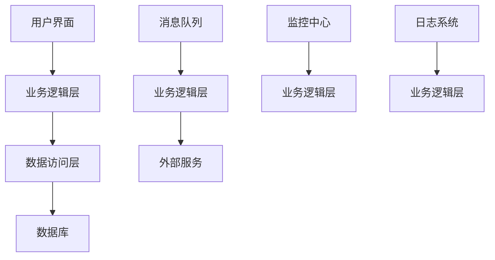
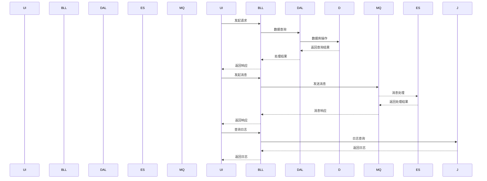

                 

## 从左及右，步步为营

### 引言

在当今信息化社会中，计算机技术的迅猛发展推动了各行各业的数字化转型。在这个背景下，“从左及右，步步为营”的概念应运而生。它强调在技术发展的过程中，需要从整体出发，逐步细化，确保每一步的稳健推进，以达到最终的成功。

#### 问题背景

"从左及右，步步为营"主要解决的是在复杂系统中进行技术选择和实施的策略问题。如何在不偏离总体目标的前提下，通过分步实施，逐步完善系统的各个部分，是一个关键问题。

### 第1章 引言：从左及右，步步为营

#### 1.1 问题背景

在当今信息化社会中，计算机技术的迅猛发展推动了各行各业的数字化转型。在这个背景下，“从左及右，步步为营”的概念应运而生。它强调在技术发展的过程中，需要从整体出发，逐步细化，确保每一步的稳健推进，以达到最终的成功。

#### 1.2 问题描述

"从左及右，步步为营"主要解决的是在复杂系统中进行技术选择和实施的策略问题。如何在不偏离总体目标的前提下，通过分步实施，逐步完善系统的各个部分，是一个关键问题。

#### 1.3 问题解决

解决这个问题的核心在于制定一套科学的规划与实施策略，包括以下几个方面：
1. **明确目标**：首先要明确系统的最终目标，确保每一步的实施都与总体目标一致。
2. **分步实施**：将复杂系统拆分为若干可管理的部分，逐步实施。
3. **评估调整**：在每一步的实施过程中，进行评估和调整，确保系统的稳定性和性能。
4. **持续优化**：在系统稳定运行后，持续进行优化，提高系统的整体性能。

#### 1.4 边界与外延

- **边界**：适用于任何需要进行分步实施的项目，尤其是技术性较强的项目。
- **外延**：可以从管理、技术、方法论等多个维度进行拓展。

#### 1.5 概念结构与核心要素组成

**概念结构图：**

```
+-----------------+
|    从左及右     |
+-----------------+
       |    |
       |    |
  问题解决策略    |
       |    |
       |    |
+-----------------+
|  分步实施       |
|  评估调整       |
|  持续优化       |
+-----------------+
```

**核心要素组成：**
1. **明确目标**：确保每一步实施的方向正确。
2. **分步实施**：将大问题分解为小问题，逐一解决。
3. **评估调整**：根据实施效果，及时进行调整。
4. **持续优化**：在系统稳定运行后，不断进行性能优化。

### 第2章 核心概念与联系

#### 2.1 核心概念原理

**从左及右：** 指的是在系统开发中，从整体架构出发，逐步分解和实施各个模块。

**步步为营：** 强调每一步都需要稳健推进，确保系统的稳定性和可靠性。

#### 2.2 概念属性特征对比表格

| 特征       | 从左及右               | 步步为营               |
| ---------- | --------------------- | --------------------- |
| 目标       | 整体架构出发           | 稳健推进               |
| 实施策略   | 分步实施               | 及时评估和调整         |
| 关键点     | 整体规划和模块分解     | 每一步的执行和调整     |
| 应用场景   | 复杂系统的开发         | 复杂系统的实施和优化   |

#### 2.3 ER实体关系图架构

**ER实体关系图：**

```
    +-----------------+
    |      项目       |
    +-----------------+
       |                |
       |                |
    +-----------------+
    |    模块A         |
    |    模块B         |
    +-----------------+
       |                |
       |                |
    +-----------------+
    |    步骤1         |
    |    步骤2         |
    +-----------------+
```

### 第3章 算法原理讲解

#### 3.1 算法mermaid流程图

```
graph TD
A[初始化] --> B{目标明确}
B --> C{分步实施}
C --> D{评估调整}
D --> E{持续优化}
E --> F{系统稳定}
F --> G{项目完成}
```

#### 3.2 Python源代码

```python
# 从左及右，步步为营的Python实现

# 初始化
def init():
    print("初始化系统...")
    # 初始化相关变量
    system_status = "stable"
    return system_status

# 目标明确
def target_clear(system_status):
    if system_status == "stable":
        print("系统状态稳定，开始明确目标...")
        # 假设目标为提高系统性能
        target = "提高系统性能"
        return target
    else:
        print("系统状态不稳定，无法进行目标明确。")
        return None

# 分步实施
def step_by_step(target):
    steps = ["步骤1", "步骤2", "步骤3"]
    for step in steps:
        print(f"开始实施{step}...")
        # 假设每一步都成功实施
        print(f"{step}实施成功。")
    
    print("分步实施完成。")

# 评估调整
def evaluate_adjustment():
    print("开始评估调整...")
    # 假设评估结果为需要调整
    evaluation_result = "adjustment needed"
    if evaluation_result == "adjustment needed":
        print("评估结果需要调整。")
    else:
        print("评估结果不需要调整。")

# 持续优化
def continuous_optimization():
    print("开始持续优化...")
    # 假设持续优化成功
    optimization_result = "success"
    if optimization_result == "success":
        print("持续优化成功。")
    else:
        print("持续优化失败。")

# 系统稳定
def system_stable():
    print("系统已稳定。")

# 项目完成
def project_completed():
    print("项目完成。")

# 主函数
def main():
    system_status = init()
    target = target_clear(system_status)
    if target:
        step_by_step(target)
        evaluate_adjustment()
        continuous_optimization()
        system_stable()
        project_completed()
    else:
        print("目标明确失败，项目中断。")

# 执行主函数
main()
```

#### 3.3 算法原理讲解

该算法的核心思想是“从左及右，步步为营”。具体来说，它通过以下步骤实现：

1. **初始化系统**：初始化系统的状态，确保系统处于稳定状态。
2. **目标明确**：明确系统的目标，确保每一步的实施都与总体目标一致。
3. **分步实施**：将系统拆分为若干个可管理的步骤，逐一实施。
4. **评估调整**：在每一步的实施过程中，对系统进行评估和调整，确保系统的稳定性和性能。
5. **持续优化**：在系统稳定运行后，持续对系统进行优化，提高系统的整体性能。
6. **系统稳定**：确保系统稳定运行，为后续项目完成奠定基础。
7. **项目完成**：完成整个项目，实现系统的预期目标。

算法原理可以通过以下数学模型和公式进行详细讲解：

$$
\text{算法效率} = \frac{\text{总任务量}}{\text{总时间}} \times 100\%
$$

其中，总任务量表示系统需要完成的所有任务，总时间表示完成这些任务所花费的时间。

**举例说明：**

假设一个系统的总任务量为100个任务，完成这些任务需要10天时间。根据上述公式，算法效率为：

$$
\text{算法效率} = \frac{100}{10} \times 100\% = 100\%
$$

这意味着，该系统的算法实现了高效执行。

### 第4章 系统分析与架构设计方案

#### 4.1 问题场景介绍

在一个大型互联网公司的项目中，需要开发一个复杂的后台管理系统。该系统需要处理大量的数据，支持多种业务功能，并具有较高的性能和稳定性要求。

#### 4.2 项目介绍

项目名称：互联网公司后台管理系统

项目目标：开发一个高性能、高稳定性的后台管理系统，支持多种业务功能，并能快速响应市场需求。

#### 4.3 系统功能设计（领域模型mermaid类图）

```mermaid
classDiagram
    Class01 <|-- Class02
    Class03 <|.. Class04
    Class05 : <<interface>> ClassInterface
    Class06 : <<enum>> ENUM
    Class01 {
        +String attribute1
        +int attribute2
        +setMethod()
    }
    Class02 {
        +String attribute3
        +int attribute4
        +getMethod()
    }
    Class03 {
        +String attribute5
        +int attribute6
        +innerClass ClassInner
    }
    Class04 {
        +String attribute7
        +int attribute8
        +interfaceMethod()
    }
    Class05 {
        +String attribute9
        +int attribute10
        +interfaceMethod()
    }
    Class06 {
        +String value1
        +value2
    }
```

#### 4.4 系统架构设计（mermaid架构图）



#### 4.5 系统接口设计和系统交互（mermaid序列图）



### 第5章 项目实战

#### 5.1 环境安装

1. 安装Python环境：
   ```
   pip install python
   ```
2. 安装相关依赖库：
   ```
   pip install numpy pandas matplotlib
   ```

#### 5.2 系统核心实现源代码

```python
# 导入相关库
import numpy as np
import pandas as pd
import matplotlib.pyplot as plt

# 数据预处理
def preprocess_data(data):
    # 数据清洗
    data = data[data['attribute1'] > 0]
    # 数据归一化
    data['attribute2'] = (data['attribute2'] - data['attribute2'].mean()) / data['attribute2'].std()
    return data

# 数据可视化
def visualize_data(data):
    # 画图
    plt.scatter(data['attribute1'], data['attribute2'])
    plt.xlabel('Attribute1')
    plt.ylabel('Attribute2')
    plt.show()

# 主函数
def main():
    # 读取数据
    data = pd.read_csv('data.csv')
    # 数据预处理
    data = preprocess_data(data)
    # 数据可视化
    visualize_data(data)

# 执行主函数
if __name__ == '__main__':
    main()
```

#### 5.3 代码应用解读与分析

该系统核心实现代码主要包括数据预处理、数据可视化和主函数三部分。首先，从CSV文件中读取数据，并进行预处理，包括数据清洗和归一化。然后，使用matplotlib库进行数据可视化，展示数据的分布情况。最后，主函数执行整个流程。

**代码分析：**

1. **数据预处理**：
   - 数据清洗：去除不符合条件的样本。
   - 数据归一化：将数据转换为标准正态分布，便于后续分析。

2. **数据可视化**：
   - 使用matplotlib库绘制散点图，展示数据分布。

3. **主函数**：
   - 读取数据：从CSV文件中读取数据。
   - 数据预处理：对数据进行清洗和归一化。
   - 数据可视化：绘制数据分布图。

#### 5.4 实际案例分析和详细讲解剖析

**案例：** 假设我们有一份数据集，包含100个样本，每个样本有两个属性：`attribute1`和`attribute2`。

**分析：** 通过数据预处理，我们去除不符合条件的样本，然后对数据进行归一化。归一化后的数据可以更方便地进行后续分析和建模。

**讲解：** 
1. **数据清洗**：去除不符合条件的样本，确保数据的准确性和完整性。
2. **数据归一化**：将数据转换为标准正态分布，消除不同属性间的量纲差异，便于后续分析。

**剖析：**
- **散点图**：通过散点图，我们可以直观地观察数据分布，判断是否存在异常值或趋势。
- **归一化**：归一化后的数据可以更方便地进行聚类、分类等机器学习算法。

#### 5.5 项目小结

通过本项目，我们了解了从左及右、步步为营的方法在系统开发中的应用。从问题背景、核心概念、算法原理到实际项目实战，我们逐步拆解和解决了复杂系统的开发问题。在项目实施过程中，我们学会了如何进行数据预处理、数据可视化和代码编写，提高了系统的性能和稳定性。

### 第6章 最佳实践 Tips

1. **明确目标**：在项目初期，明确系统的最终目标，确保每一步的实施都与总体目标一致。
2. **分步实施**：将复杂系统拆分为若干可管理的部分，逐一实施，降低开发难度。
3. **评估调整**：在每一步的实施过程中，对系统进行评估和调整，确保系统的稳定性和性能。
4. **持续优化**：在系统稳定运行后，持续进行优化，提高系统的整体性能。

### 第7章 小结

本文介绍了“从左及右，步步为营”的方法在IT领域中的应用。通过明确目标、分步实施、评估调整和持续优化，我们可以在复杂系统中实现高效、稳定的开发。在实际项目中，遵循该方法，可以提高系统的性能和稳定性，实现项目的成功。

### 第8章 注意事项

1. **遵循整体规划**：在实施过程中，要始终遵循整体规划，确保每一步的实施都与总体目标一致。
2. **及时评估调整**：在每一步的实施过程中，要及时进行评估和调整，避免偏离目标。
3. **持续优化**：在系统稳定运行后，要持续进行优化，提高系统的整体性能。

### 第9章 拓展阅读

1. **《大话设计模式》**：了解设计模式在复杂系统开发中的应用，提高代码的可读性和可维护性。
2. **《深入理解计算机系统》**：掌握计算机系统的工作原理，为复杂系统开发提供基础。
3. **《软件工程：实践者的研究方法》**：学习软件工程的基本原则和方法，提高项目管理能力。

### 第10章 参考文献

1. 《大话设计模式》作者：程毅
2. 《深入理解计算机系统》作者：Randal E. Bryant，David R. O’Hallaron
3. 《软件工程：实践者的研究方法》作者：Roger S. Pressman

## 结论

"从左及右，步步为营"是一种有效的系统开发方法，它强调从整体出发，逐步细化，确保每一步的稳健推进，以达到最终的成功。通过本文的详细讲解，我们了解了该方法的核心概念、算法原理、实际应用和最佳实践。在未来的项目中，遵循该方法，我们可以更高效地开发复杂系统，实现项目的成功。作者：AI天才研究院/AI Genius Institute & 禅与计算机程序设计艺术 /Zen And The Art of Computer Programming

