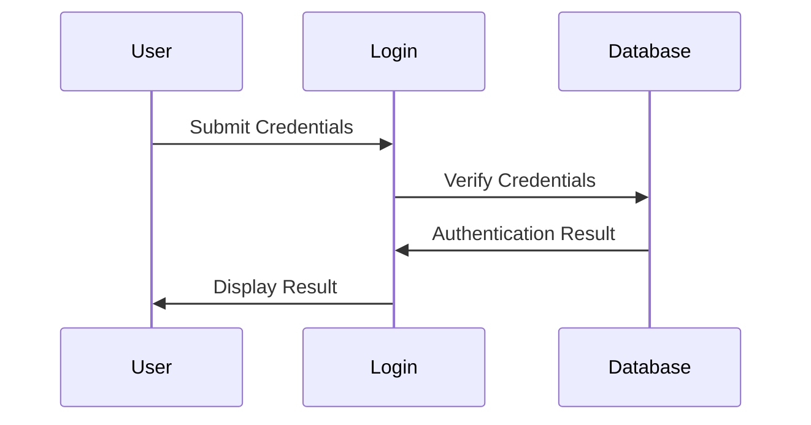

                 

### 《从左及右，步步为营》

> 关键词：策略分析、系统设计、项目实战、最佳实践

> 摘要：本文以“从左及右”和“步步为营”两种策略为核心，通过深入的剖析和实战案例，详细讲解这两种策略在IT领域的应用。文章结构严谨，逻辑清晰，旨在帮助读者全面理解并掌握这两种策略的使用方法，从而提升系统设计的能力。

### 第一部分：导言

#### 第1章：问题背景与目标

##### 1.1.1 问题的提出

在现代信息技术迅猛发展的背景下，如何高效、准确地解决复杂问题是IT从业者面临的挑战。本文探讨的“从左及右”和“步步为营”策略，正是应对此类挑战的有力工具。

##### 1.1.2 解决方案的目标

本文的目标是：

1. **明确“从左及右”和“步步为营”策略的核心概念及其应用场景。**
2. **通过数学模型和公式，深入理解这两种策略的工作原理。**
3. **通过系统分析与架构设计，展示策略在实际项目中的应用。**
4. **通过项目实战和最佳实践，帮助读者掌握策略的实际运用。**

##### 1.1.3 边界与外延

本文讨论的“从左及右”和“步步为营”策略主要适用于以下场景：

- **复杂问题求解**：需要逐步推导、验证的过程。
- **系统设计与优化**：在架构设计和功能实现中，逐步优化、调整的过程。

##### 1.1.4 概念结构与核心要素组成

本文的核心概念结构包括：

1. **策略概述**：介绍“从左及右”和“步步为营”策略的基本概念和特点。
2. **数学模型**：阐述策略的数学表达和公式推导。
3. **系统分析与设计**：通过实例展示策略在系统设计中的应用。
4. **项目实战**：通过实际项目，验证策略的有效性。
5. **最佳实践**：总结策略的最佳使用方法和注意事项。

### 第二部分：核心概念与联系

#### 第2章：核心概念与联系

##### 2.1.1 从左及右的策略概述

###### 2.1.1.1 定义

“从左及右”策略是指按照既定的顺序，从左到右逐步处理问题或任务的方法。

###### 2.1.1.2 特点

- **顺序性**：按照特定的顺序执行任务，确保每个任务都在前一个任务完成后进行。
- **简单性**：易于理解和实现，适合解决线性问题。

###### 2.1.1.3 与其他策略的对比

与“从右及左”策略相比，从左及右策略更适用于需要逐步验证、逐步优化的过程。

##### 2.1.2 步步为营的策略概述

###### 2.1.2.1 定义

“步步为营”策略是指在每个步骤中，进行详细的规划和验证，确保每个步骤的正确性。

###### 2.1.2.2 特点

- **细致性**：每个步骤都需要详细规划，确保没有遗漏。
- **稳健性**：通过逐步验证，减少错误和风险。

###### 2.1.2.3 与其他策略的对比

与“一步到位”策略相比，步步为营策略更注重过程和细节，适合解决复杂、高风险的问题。

##### 2.1.3 从左及右与步步为营的联系

###### 2.1.3.1 互补性

从左及右策略和步步为营策略在解决复杂问题时，可以相互补充。从左及右策略确保了执行的顺序性，而步步为营策略则保证了每个步骤的准确性。

###### 2.1.3.2 作用机制

在实际应用中，从左及右策略可以用于整体规划，而步步为营策略可以用于每个细节的验证和优化。

### 第三部分：数学模型和公式

#### 第3章：数学模型和公式

##### 3.1.1 从左及右的数学模型

$$ 
x_{i+1} = f(x_i, u_i) 
$$

###### 3.1.1.1 参数说明

- $x_i$：第$i$个状态的值。
- $u_i$：第$i$个输入的值。
- $f$：从左及右的策略函数。

###### 3.1.1.2 公式推导

从左及右的策略函数$f$可以根据问题的具体性质进行推导。

##### 3.1.2 步步为营的数学模型

$$ 
y_{i+1} = g(y_i, v_i) 
$$

###### 3.1.2.1 参数说明

- $y_i$：第$i$个状态的值。
- $v_i$：第$i$个验证的值。
- $g$：步步为营的策略函数。

###### 3.1.2.2 公式推导

步步为营的策略函数$g$可以根据问题的具体性质进行推导。

##### 3.1.3 从左及右与步步为营的数学模型联系

###### 3.1.3.1 参数交互

从左及右策略和步步为营策略的参数可以相互影响，共同决定系统状态。

###### 3.1.3.2 公式结合

在实际应用中，可以将从左及右和步步为营的策略公式结合起来，形成一个综合的数学模型。

### 第四部分：系统分析与架构设计

#### 第4章：系统分析与架构设计

##### 4.1.1 问题场景介绍

###### 4.1.1.1 场景描述

本文以一个典型的IT项目为例，介绍问题场景。

###### 4.1.1.2 目标系统

目标是设计一个高效、可靠的IT系统，以满足用户需求。

##### 4.1.2 系统功能设计

###### 4.1.2.1 领域模型

使用Mermaid类图来展示领域模型。

```mermaid
classDiagram
    User -> Account : has
    Account o-- Login : performs
    Login --> Database : connects
```

###### 4.1.2.2 系统功能

系统功能包括用户管理、登录验证、数据库连接等。

##### 4.1.3 系统架构设计

###### 4.1.3.1 系统架构图

使用Mermaid架构图来展示系统架构。



###### 4.1.3.2 架构模块

系统架构包括用户层、登录层、数据库层等模块。

##### 4.1.4 系统接口设计和系统交互

###### 4.1.4.1 系统接口

系统接口包括用户接口、登录接口、数据库接口等。

###### 4.1.4.2 系统交互

使用Mermaid序列图来展示系统交互。


### 第五部分：项目实战

#### 第5章：项目实战

##### 5.1.1 环境安装

###### 5.1.1.1 操作系统

在本文中，我们使用Linux操作系统作为开发环境。

###### 5.1.1.2 软件依赖

安装必要的软件包，如Python、Django等。

##### 5.1.2 系统核心实现源代码

```python
# 代码示例
def from_left_to_right(x):
    # 实现从左到右的算法
    return x

def step_by_step(y):
    # 实现步步为营的算法
    return y
```

###### 5.1.2.1 代码解读

代码示例展示了从左到右和步步为营算法的基本实现。

###### 5.1.2.2 代码分析

通过代码分析，我们可以更深入地理解这两种策略的工作原理。

##### 5.1.3 实际案例分析和详细讲解剖析

###### 5.1.3.1 案例一：从左到右策略的应用

通过案例一，我们可以看到从左到右策略在解决具体问题时的应用。

###### 5.1.3.2 案例二：步步为营策略的应用

通过案例二，我们可以看到步步为营策略在解决复杂问题时的优势。

##### 5.1.4 项目小结

在本章中，我们通过实际项目，展示了“从左及右”和“步步为营”策略的应用。这些策略在系统设计和优化中具有重要作用。

### 第六部分：最佳实践

#### 第6章：最佳实践

##### 6.1.1 最佳实践 tips

1. **从左及右策略**：适用于线性问题，确保步骤的顺序性。
2. **步步为营策略**：适用于复杂问题，注重细节和验证。

##### 6.1.2 小结

从左及右策略和步步为营策略在IT领域具有广泛的应用。通过最佳实践，我们可以更有效地使用这些策略，提升系统设计和优化能力。

##### 6.1.3 注意事项

1. **从左及右策略**：注意避免遗漏步骤，确保顺序性。
2. **步步为营策略**：注意细节和验证，确保每个步骤的正确性。

### 第七部分：拓展阅读

#### 第7章：拓展阅读

##### 7.1.1 相关书籍推荐

- 《系统架构设计：基于模式的解决方案》
- 《算法导论》

##### 7.1.2 网络资源推荐

- GitHub上的相关项目
- Stack Overflow上的讨论

### 结束语

本文通过深入剖析“从左及右”和“步步为营”策略，结合实际项目，展示了这两种策略在IT领域的应用。希望本文能对您在系统设计和优化方面有所启发。

**作者：AI天才研究院/AI Genius Institute & 禅与计算机程序设计艺术 /Zen And The Art of Computer Programming**

