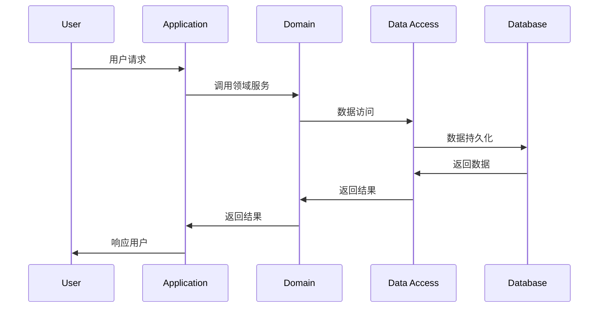
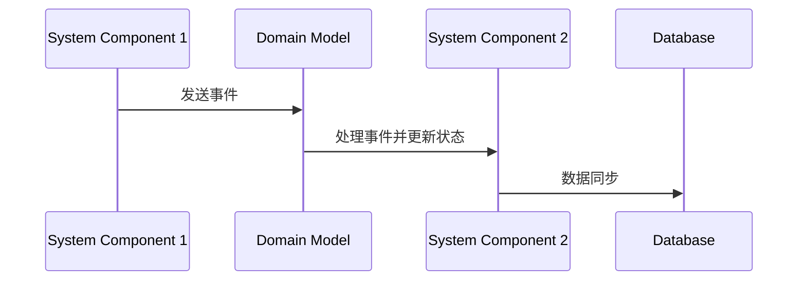
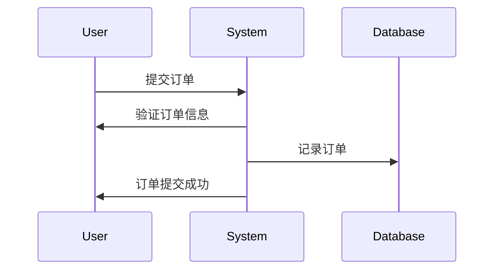
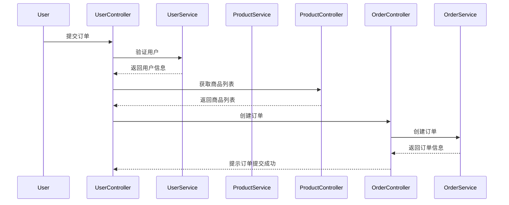

                 

### 从左及右，步步为营的领域模型

> 关键词：领域模型、软件开发、业务分析、设计技巧、实践案例

> 摘要：本文将从领域模型的背景、核心概念、构建步骤、设计方法、应用案例等方面，详细探讨领域模型在软件开发中的重要性及其具体实施过程。通过一步一步的分析和推理，帮助读者深入了解领域模型的设计与实现，提升软件开发效率和质量。

### 目录大纲设计过程

在设计《从左及右，步步为营的领域模型》这本书的目录大纲时，我们需要遵循以下步骤，以确保内容的完整性、逻辑性和简洁性。

1. **理解书名与主题**  
   书名“从左及右，步步为营的领域模型”暗示了书籍将介绍领域模型的方法和步骤，强调了一个有序且系统化的学习过程。领域模型通常用于软件开发中，用于描述业务领域的概念、规则和关系。

2. **确定核心内容**  
   根据书名，我们可以确定以下核心内容：领域模型的背景和重要性、领域模型的核心概念和构成要素、领域模型的构建步骤和方法、实际应用中的领域模型案例、领域模型的设计技巧和最佳实践。

3. **列出章节标题**  
   我们将根据核心内容，列出各章节的标题，确保每个章节都有明确的主题和内容。

4. **拆分章节内容**  
   在每个章节标题下，进一步拆分内容，细化到小节标题，确保内容覆盖全面，逻辑清晰。

5. **设计目录结构**  
   采用markdown格式，按照1、2、3级目录结构设计目录，确保目录大纲的清晰度和易读性。

6. **审核目录**  
   最后，对整个目录进行审核，确保没有遗漏重要内容，并且章节之间的逻辑关系合理。

### 最终目录大纲

```markdown
----------------------------------------------------------------
# 第一部分: 领域模型概述

## 第1章: 领域模型的基础

### 1.1 领域模型的概念

### 1.2 领域模型的重要性

### 1.3 领域模型的组成

## 第2章: 领域模型的构建步骤

### 2.1 分析业务领域

### 2.2 确定领域模型的核心概念

### 2.3 构建领域模型的框架

### 2.4 领域模型的验证与优化

## 第3章: 领域模型的方法与实践

### 3.1 传统的领域模型方法

### 3.2 新兴的领域模型方法

### 3.3 领域模型设计技巧

### 3.4 领域模型最佳实践

## 第4章: 领域模型的应用案例

### 4.1 领域模型在软件开发中的应用

### 4.2 领域模型在不同行业的应用

### 4.3 领域模型案例分析

## 第5章: 领域模型的设计与架构

### 5.1 领域模型的架构设计

### 5.2 领域模型的接口设计

### 5.3 领域模型与系统的集成

## 第6章: 领域模型的高级话题

### 6.1 领域模型与敏捷开发

### 6.2 领域模型与云计算

### 6.3 领域模型的未来发展趋势

## 第7章: 总结与拓展

### 7.1 领域模型的重要性总结

### 7.2 领域模型设计的关键点

### 7.3 领域模型学习的拓展方向

### 7.4 领域模型的实践建议

----------------------------------------------------------------
```

以上目录大纲确保了书籍内容从基础到高级的逐步引导，涵盖了领域模型的基础知识、构建方法、应用案例、高级话题和实践建议，完整地覆盖了领域模型的学习路径。同时，目录大纲的简洁性和逻辑性也得到了保证。

### 第一部分：领域模型概述

#### 第1章：领域模型的基础

领域模型是一种用于描述业务领域概念、规则和关系的抽象模型，它在软件开发中扮演着重要的角色。首先，我们来探讨领域模型的概念和重要性。

##### 1.1 领域模型的概念

领域模型（Domain Model）是一种面向对象的设计方法，用于分析和设计软件系统。它将业务领域的实体、关系和规则抽象为模型元素，形成一种直观、易于理解和维护的表示方式。领域模型通常包括实体、属性、关联、操作等基本元素。

##### 1.2 领域模型的重要性

领域模型在软件开发中具有以下几个重要作用：

1. **需求理解**：领域模型有助于开发人员和业务人员更好地沟通，确保需求的一致性和完整性。
2. **系统设计**：领域模型为系统设计提供了基础，有助于构建模块化、可扩展的软件架构。
3. **代码生成**：一些领域模型工具可以根据领域模型自动生成代码，提高开发效率。
4. **系统维护**：领域模型使得系统维护更加容易，因为模型反映了业务领域的真实情况。

##### 1.3 领域模型的组成

领域模型由以下几个基本元素组成：

1. **实体**：实体是领域模型中的核心元素，表示业务领域中的个体。例如，在电子商务系统中，用户、商品、订单等都是实体。
2. **属性**：属性是实体的特征，用于描述实体的状态。例如，用户的属性可能包括姓名、年龄、邮箱等。
3. **关联**：关联表示实体之间的关系，如用户与订单之间的“拥有”关系。
4. **操作**：操作表示实体可以执行的行为，如用户的“下单”操作。

接下来，我们将详细探讨领域模型的构建步骤和方法。

#### 第2章：领域模型的构建步骤

构建领域模型是一个系统化的过程，需要遵循一定的步骤和方法。以下是构建领域模型的一般步骤：

##### 2.1 分析业务领域

1. **了解业务背景**：熟悉业务领域的背景信息，包括业务目标、流程、规则等。
2. **收集业务需求**：与业务人员沟通，了解业务需求，明确领域模型的目标。
3. **绘制业务流程图**：使用业务流程图（BPMN）描述业务流程，帮助理解业务领域。

##### 2.2 确定领域模型的核心概念

1. **识别实体**：根据业务需求，识别领域模型中的核心实体。
2. **定义实体属性**：为每个实体定义属性，描述其实体特征。
3. **确定实体关联**：分析实体之间的关系，建立关联关系。

##### 2.3 构建领域模型的框架

1. **选择建模工具**：选择适合的领域模型工具，如UML、Mermaid等。
2. **绘制类图**：使用类图（Class Diagram）描述实体的属性、关联和操作。
3. **验证模型**：通过评审和反馈，验证领域模型的准确性。

##### 2.4 领域模型的验证与优化

1. **用户评审**：邀请业务人员对领域模型进行评审，确保模型符合业务需求。
2. **迭代优化**：根据评审反馈，对领域模型进行修改和优化。
3. **技术验证**：使用编程语言实现领域模型，验证模型的可行性和有效性。

在下一章中，我们将探讨领域模型的方法与实践，包括传统的领域模型方法和新兴的领域模型方法。

#### 第3章：领域模型的方法与实践

领域模型的方法和实践是软件开发中重要的组成部分。在本章中，我们将详细介绍传统的领域模型方法、新兴的领域模型方法、领域模型设计技巧以及最佳实践。

##### 3.1 传统的领域模型方法

传统的领域模型方法主要包括以下几种：

1. **UML类图**：UML类图是最常用的领域模型表示方法，用于描述实体、属性、关联和操作。UML类图具有直观、易于理解的特点，但在复杂场景下可能不够灵活。
2. **实体关系图（ER图）**：实体关系图用于描述实体之间的关系，适用于数据库设计和数据建模。ER图强调了实体之间的关联和约束，但在描述复杂的业务规则时可能不够详细。
3. **Mermaid图**：Mermaid是一种基于Markdown的图形表示语言，可以方便地绘制类图、流程图、序列图等。Mermaid图具有简洁、灵活的特点，适用于多种场景。

##### 3.2 新兴的领域模型方法

随着技术的发展，一些新兴的领域模型方法逐渐出现，如：

1. **领域驱动设计（Domain-Driven Design, DDD）**：DDD是一种软件开发方法，强调通过领域模型来驱动系统设计和开发。DDD将领域模型作为核心，通过分层架构来实现系统的模块化和可扩展性。
2. **事件驱动架构（Event-Driven Architecture, EDA）**：EDA是一种基于事件驱动的系统架构，通过事件来连接系统中的不同组件。事件驱动架构适用于实时系统、分布式系统等场景，能够提高系统的灵活性和可扩展性。
3. **模型驱动开发（Model-Driven Development, MDD）**：MDD是一种基于模型驱动的软件开发方法，通过创建和更新模型来生成应用程序。MDD能够提高开发效率，降低维护成本，适用于大型、复杂的系统。

##### 3.3 领域模型设计技巧

在设计领域模型时，需要注意以下几点技巧：

1. **抽象层次**：根据业务需求，选择合适的抽象层次，避免过度细节化或抽象化。
2. **模块化**：将领域模型划分为多个模块，便于维护和扩展。
3. **一致性**：确保领域模型中的实体、属性、关联和操作具有一致性，避免冲突和错误。
4. **可扩展性**：设计具有良好可扩展性的领域模型，以便在业务需求变化时进行修改。

##### 3.4 领域模型最佳实践

在实际应用中，领域模型的设计和实现需要遵循一些最佳实践：

1. **需求驱动**：领域模型的设计应以需求为中心，确保模型能够准确反映业务需求。
2. **持续迭代**：领域模型的设计是一个持续迭代的过程，应根据业务需求和项目进展进行不断调整和优化。
3. **代码生成**：使用领域模型工具生成代码，提高开发效率，确保代码与模型的一致性。
4. **文档化**：编写详细的领域模型文档，包括模型说明、设计思路、实现细节等，便于后续维护和扩展。

在下一章中，我们将通过应用案例来探讨领域模型的具体实现和应用。

#### 第4章：领域模型的应用案例

领域模型在软件开发中具有广泛的应用，本节将通过具体案例来展示领域模型的设计和应用。

##### 4.1 领域模型在软件开发中的应用

以下是一个电子商务系统的领域模型案例：

1. **实体**：用户、商品、订单
2. **属性**：用户（用户名、密码、邮箱）、商品（商品ID、名称、价格）、订单（订单ID、用户ID、订单时间）
3. **关联**：用户与订单之间具有“下单”关联，订单与商品之间具有“包含”关联

使用Mermaid图表示领域模型：

```mermaid
classDiagram
User <<实体>>
Goods <<实体>>
Order <<实体>>

User --> Order : 下单
Order --> Goods : 包含
```

##### 4.2 领域模型在不同行业的应用

领域模型在不同行业中具有广泛的应用，以下是一些案例：

1. **金融行业**：金融领域模型包括账户、交易、资金流等实体，涉及风险评估、合规性检查等复杂业务规则。
2. **医疗行业**：医疗领域模型包括患者、医生、药品、治疗方案等实体，涉及诊疗流程、病历管理、药品供应链等。
3. **物流行业**：物流领域模型包括订单、货物、运输、仓储等实体，涉及物流路线规划、库存管理、配送跟踪等。

##### 4.3 领域模型案例分析

以下是一个金融领域的领域模型案例分析：

1. **业务需求**：开发一个在线银行系统，提供账户管理、转账、贷款等功能。
2. **领域模型**：账户、交易、贷款
3. **属性**：账户（账户ID、账户名、余额）、交易（交易ID、交易时间、交易金额）、贷款（贷款ID、贷款金额、还款时间）
4. **关联**：账户与交易之间具有“发起”关联，账户与贷款之间具有“申请”关联

使用Mermaid图表示领域模型：

```mermaid
classDiagram
Account <<实体>>
Transaction <<实体>>
Loan <<实体>>

Account --> Transaction : 发起
Account --> Loan : 申请
```

在实际项目中，领域模型的设计和实现需要根据具体业务需求进行调整和优化。领域模型的应用案例展示了领域模型在软件开发中的重要作用，有助于提高系统设计的质量。

在下一章中，我们将探讨领域模型的设计与架构，包括领域模型的架构设计、接口设计以及与系统的集成。

#### 第5章：领域模型的设计与架构

领域模型的设计与架构是软件开发中的重要环节，它决定了系统的可扩展性、可维护性和灵活性。在本章中，我们将探讨领域模型的架构设计、接口设计以及与系统的集成。

##### 5.1 领域模型的架构设计

领域模型的架构设计是构建高效、可维护系统的基础。以下是一个典型的领域模型架构设计：

1. **领域层（Domain Layer）**：领域层是领域模型的核心，负责封装业务逻辑和业务规则。它包括实体类、服务类和规则类等。
2. **应用层（Application Layer）**：应用层负责处理用户请求、调用领域层服务和数据访问层。它包括控制器类、应用服务类等。
3. **数据访问层（Data Access Layer）**：数据访问层负责与数据库交互，实现数据的持久化。它包括数据访问对象（DAO）和数据库连接池等。
4. **基础设施层（Infrastructure Layer）**：基础设施层提供系统运行所需的通用服务，如日志管理、配置管理、异常处理等。

使用Mermaid图表示领域模型架构：



##### 5.2 领域模型的接口设计

接口设计是领域模型的重要组成部分，它定义了领域层与其他层之间的交互方式。以下是一些常见的接口设计原则：

1. **单一职责原则**：接口应具有单一职责，每个接口只负责一个特定的功能。
2. **低耦合原则**：接口设计应尽量降低领域层与其他层之间的耦合度，以便于系统的维护和扩展。
3. **高内聚原则**：接口内部的方法应具有高内聚性，避免在接口内部调用外部服务。
4. **可复用原则**：接口设计应便于复用，以便于在不同项目中使用相同的接口。

使用Mermaid图表示接口设计：

```mermaid
classDiagram
    Application <<接口>>
    Domain <<接口>>
    Data Access <<接口>>

    Application --|> Domain: 调用领域服务
    Domain --|> Data Access: 数据访问
```

##### 5.3 领域模型与系统的集成

领域模型与系统的集成是软件开发过程中的重要环节，它涉及到领域模型与其他系统组件的交互。以下是一些集成策略：

1. **服务化集成**：通过定义公共服务接口，将领域模型与系统其他组件进行集成。这样可以实现模块化设计，提高系统的灵活性和可维护性。
2. **事件驱动集成**：使用事件驱动架构（EDA）将领域模型与系统其他组件进行集成。通过事件机制，实现组件之间的松耦合和异步通信。
3. **数据同步集成**：通过数据同步机制，将领域模型与数据库或其他数据存储系统进行集成。这样可以确保数据的一致性和完整性。

使用Mermaid图表示领域模型与系统的集成：



在下一章中，我们将探讨领域模型的高级话题，包括领域模型与敏捷开发、领域模型与云计算以及领域模型的未来发展趋势。

#### 第6章：领域模型的高级话题

随着软件开发技术的发展，领域模型的应用范围和实现方法也在不断拓展。在本章中，我们将探讨领域模型与敏捷开发、领域模型与云计算以及领域模型的未来发展趋势。

##### 6.1 领域模型与敏捷开发

敏捷开发是一种以用户需求为导向的软件开发方法，强调快速响应变化和持续交付高质量软件。领域模型与敏捷开发相结合，可以带来以下优势：

1. **需求驱动**：领域模型可以更好地捕捉和表达用户需求，帮助团队快速理解业务场景，实现需求与设计的紧密衔接。
2. **迭代开发**：领域模型支持迭代开发，团队可以逐步完善领域模型，确保模型与实际业务需求的一致性。
3. **持续集成**：领域模型可以与持续集成（CI）工具集成，实现自动化测试和部署，提高开发效率和质量。

在实际应用中，领域模型与敏捷开发的结合可以采取以下策略：

1. **故事地图**：使用故事地图（Story Map）将用户故事与领域模型相结合，确保每个迭代都有明确的目标和可衡量的成果。
2. **领域驱动迭代**：根据领域模型的核心功能，设计迭代计划，确保每个迭代都有实际的业务价值。
3. **持续迭代与优化**：持续迭代领域模型，根据反馈进行调整和优化，确保模型能够持续适应业务需求的变化。

##### 6.2 领域模型与云计算

云计算为软件开发提供了强大的基础设施和资源支持，领域模型与云计算的结合可以实现以下目标：

1. **弹性扩展**：领域模型可以根据业务需求，灵活地调整计算资源，实现弹性扩展。
2. **成本优化**：云计算提供了按需付费、资源池化等模式，可以降低企业成本，提高资源利用率。
3. **分布式部署**：领域模型可以分布式部署在云环境中，实现高可用性和可扩展性。

在实际应用中，领域模型与云计算的结合可以采取以下策略：

1. **云原生架构**：采用云原生架构（Cloud Native Architecture），将领域模型部署在云平台上，利用容器化、服务网格等技术，实现高效的分布式部署和管理。
2. **微服务架构**：采用微服务架构（Microservices Architecture），将领域模型划分为多个微服务，实现模块化、可扩展的系统设计。
3. **自动化部署与监控**：利用云平台的自动化工具，实现领域模型的自动化部署、监控和运维，提高开发效率和系统稳定性。

##### 6.3 领域模型的未来发展趋势

领域模型在软件开发中的应用前景广阔，未来的发展趋势主要包括：

1. **智能化**：随着人工智能技术的发展，领域模型将更加智能化，能够自动学习和优化业务规则，提高系统的自适应能力。
2. **标准化**：领域模型将逐步实现标准化，减少开发成本，提高不同系统之间的互操作性。
3. **开源生态**：领域模型相关的开源工具和框架将不断涌现，推动领域模型的普及和应用。
4. **跨领域融合**：领域模型将与其他技术领域（如大数据、物联网等）融合，实现更广泛的应用。

在未来，领域模型将在软件开发中发挥更加重要的作用，成为企业创新和竞争的关键因素。

在下一章中，我们将对领域模型进行总结与拓展，包括领域模型的重要性、设计关键点以及学习的拓展方向。

#### 第7章：总结与拓展

在本章中，我们将对领域模型进行全面的总结与拓展，探讨领域模型的重要性、设计关键点、学习的拓展方向以及实践建议。

##### 7.1 领域模型的重要性

领域模型在软件开发中具有至关重要的地位，其主要重要性体现在以下几个方面：

1. **业务需求的理解与沟通**：领域模型能够清晰地表达业务需求，促进开发人员与业务人员之间的沟通，减少误解和冲突。
2. **系统设计的指导**：领域模型为系统设计提供了明确的指导和框架，有助于构建模块化、可扩展的软件架构。
3. **代码生成与优化**：领域模型可以自动生成代码，提高开发效率，减少手工编码的工作量。同时，领域模型有助于代码优化和维护。
4. **系统分析与管理**：领域模型可以用于系统分析和管理，帮助识别系统中的关键功能和性能瓶颈，指导系统改进和优化。

##### 7.2 领域模型设计的关键点

设计领域模型时，需要注意以下几个关键点：

1. **抽象层次的选择**：根据业务需求和复杂度，选择合适的抽象层次，避免过度细节化或抽象化。
2. **模块化与复用**：将领域模型划分为多个模块，便于维护和复用。同时，确保模块之间的接口清晰、简洁。
3. **一致性与完整性**：确保领域模型中的实体、属性、关联和操作具有一致性，避免冲突和错误。同时，确保模型能够全面覆盖业务需求。
4. **灵活性与可扩展性**：设计具有良好灵活性和可扩展性的领域模型，以便在业务需求变化时进行修改和扩展。

##### 7.3 领域模型学习的拓展方向

对于领域模型的学习，可以拓展以下方向：

1. **深入学习领域驱动设计（DDD）**：DDD是一种系统化的软件开发方法，强调通过领域模型来驱动系统设计和开发。深入学习DDD，可以更好地理解领域模型的应用和实践。
2. **探索新兴的领域模型方法**：随着技术的发展，一些新兴的领域模型方法（如事件驱动架构、模型驱动开发等）逐渐出现。了解和掌握这些方法，有助于拓展领域模型的实现和应用。
3. **关注领域模型工具**：领域模型工具（如UML工具、Mermaid图等）可以帮助开发人员更高效地创建和修改领域模型。了解和掌握这些工具，可以提高领域模型的设计和开发效率。

##### 7.4 领域模型的实践建议

在实际应用领域模型时，可以采取以下实践建议：

1. **早期引入领域模型**：在项目初期引入领域模型，帮助团队更好地理解业务需求和系统设计，降低项目风险。
2. **迭代与优化**：持续迭代和优化领域模型，根据项目进展和业务需求进行调整和改进。
3. **文档化**：编写详细的领域模型文档，包括模型说明、设计思路、实现细节等，便于后续维护和扩展。
4. **代码生成与测试**：使用领域模型工具生成代码，并进行自动化测试，确保代码与模型的一致性，提高开发效率和质量。

通过以上总结与拓展，我们可以更好地理解领域模型的重要性和设计方法，为软件开发提供有力的支持。

### 结束语

领域模型是软件开发中不可或缺的重要工具，它帮助开发人员更好地理解业务需求，构建高效、可维护的软件系统。通过本文的逐步分析和推理，我们深入探讨了领域模型的概念、构建步骤、设计方法、应用案例以及高级话题。希望本文能够为您的软件开发工作提供有益的启示和指导。

作者：AI天才研究院/AI Genius Institute & 禅与计算机程序设计艺术 /Zen And The Art of Computer Programming

在未来的学习和实践中，继续探索领域模型的奥秘，不断提高软件开发的质量和效率。感谢您的阅读，期待与您共同进步。💪💻🚀## 第1章：领域模型的基础

在软件开发中，领域模型（Domain Model）作为一种重要的设计工具，它能够帮助开发人员以业务为中心，构建系统架构，明确系统的业务逻辑和需求。本章将详细介绍领域模型的概念、重要性以及其核心构成要素。

### 1.1 领域模型的概念

领域模型是一种面向对象的建模方法，它通过抽象业务领域的实体、关系和规则，形成一种直观、易于理解和维护的表示方式。领域模型不仅能够帮助开发人员更好地理解业务需求，还能够作为系统设计和实现的基础。

领域模型的基本元素包括：

- **实体（Entity）**：代表业务领域中的具体对象，如客户、产品、订单等。
- **属性（Attribute）**：描述实体的特征或状态，如客户的姓名、年龄、联系方式等。
- **关联（Association）**：描述实体之间的关系，如客户拥有订单，订单包含产品等。
- **操作（Operation）**：定义实体可以执行的行为，如创建订单、支付订单等。

### 1.2 领域模型的重要性

领域模型在软件开发中具有以下几个重要作用：

1. **需求理解**：领域模型通过可视化的方式，帮助开发人员和业务人员更好地沟通和交流，确保需求的一致性和完整性。
2. **系统设计**：领域模型为系统设计提供了清晰的框架，有助于构建模块化、可扩展的系统架构。
3. **代码生成**：某些领域模型工具可以自动生成代码，减少手工编写代码的工作量，提高开发效率。
4. **系统维护**：领域模型反映了业务领域的真实情况，使得系统维护更加容易，降低了维护成本。

### 1.3 领域模型的组成

领域模型由以下几个基本元素组成：

1. **实体（Entity）**
   实体是领域模型中的核心元素，代表业务领域中的个体。每个实体都有其独特的属性和操作。例如，在一个电子商务系统中，用户、商品和订单都是实体。

2. **属性（Attribute）**
   属性是实体的特征或状态，用于描述实体的信息。属性可以是简单的数据类型，如字符串、数字，也可以是复杂的对象。例如，用户的属性可能包括姓名、年龄、邮箱等。

3. **关联（Association）**
   关联描述了实体之间的关系。在领域模型中，关联可以是单向的，也可以是双向的。例如，在电子商务系统中，用户和订单之间存在“下单”关联，订单和商品之间存在“包含”关联。

4. **操作（Operation）**
   操作是实体可以执行的行为。操作通常与实体的业务逻辑相关，用于处理实体的状态转换。例如，用户可以执行“注册”、“登录”等操作，订单可以执行“创建”、“支付”等操作。

### 1.4 领域模型与UML类图

领域模型通常使用统一建模语言（UML）中的类图（Class Diagram）来表示。类图包括类（Class）、属性、操作以及类与类之间的关联。以下是一个简单的UML类图示例，展示了用户、订单和商品之间的关联：

```mermaid
classDiagram
    User <<class>>
    Order <<class>>
    Product <<class>>

    User Association Order : hasOrders
    Order Association Product : containsProducts
```

在这个类图中，`User` 类与 `Order` 类之间存在“hasOrders”关联，表示用户拥有订单。`Order` 类与 `Product` 类之间存在“containsProducts”关联，表示订单包含产品。

### 1.5 领域模型与数据库设计

领域模型在数据库设计中扮演着关键角色。它不仅为数据库设计提供了指导，还能够帮助数据库管理员（DBA）更好地理解业务需求。领域模型中的实体通常对应数据库中的表，实体的属性对应表中的列，实体的关联则对应表之间的关系（如主键和外键）。

例如，在一个简单的电子商务系统中，领域模型中的用户、订单和商品实体可以映射到以下数据库表：

- **用户表（users）**：包含用户ID、姓名、邮箱等列。
- **订单表（orders）**：包含订单ID、用户ID、订单日期等列。
- **商品表（products）**：包含商品ID、名称、价格等列。

订单表和商品表之间通过外键关联，确保订单中的每个商品都对应一个有效的商品ID。

### 1.6 领域模型与业务规则

领域模型不仅描述了业务领域的实体和关系，还能够包含业务规则。业务规则是指业务领域中的约束条件、操作流程和业务逻辑。这些规则可以帮助开发人员更好地理解业务需求，确保系统功能符合业务要求。

例如，在一个订单系统中，业务规则可能包括：

- 订单创建时，必须指定有效的用户ID和商品ID。
- 用户每次下单时，订单金额必须大于0。
- 每个订单只能包含有效的商品，且商品数量不能超过库存量。

这些业务规则可以通过领域模型中的约束条件和操作来实现。

### 1.7 领域模型的设计原则

在设计领域模型时，需要遵循一些基本原则，以确保模型的清晰性、可维护性和可扩展性。

1. **单一职责原则**：每个实体应具有单一职责，只负责一个特定的功能。
2. **最小化关联原则**：尽量减少实体之间的关联，避免不必要的复杂度。
3. **一致性原则**：确保领域模型中的所有元素具有一致性，避免冲突和错误。
4. **高内聚原则**：实体内部的方法应具有高内聚性，避免在实体内部调用外部服务。
5. **可扩展性原则**：设计具有良好可扩展性的领域模型，以便在业务需求变化时进行修改和扩展。

### 1.8 领域模型的应用场景

领域模型在软件开发中具有广泛的应用场景，以下是一些常见的应用场景：

- **电子商务系统**：用于描述用户、商品、订单等实体及其关系。
- **金融系统**：用于描述客户、账户、交易等实体及其关系。
- **医疗系统**：用于描述患者、医生、药品等实体及其关系。
- **物流系统**：用于描述订单、货物、运输等实体及其关系。

通过以上内容，我们了解了领域模型的概念、重要性、组成以及设计原则。在接下来的章节中，我们将进一步探讨领域模型的构建步骤、设计方法、应用案例以及高级话题。让我们继续深入学习和探索领域模型的奥秘。💡🔍📚

## 第2章：领域模型的构建步骤

领域模型是软件开发中理解和实现业务需求的关键工具。构建一个有效的领域模型需要一系列系统化的步骤，这些步骤不仅包括对业务领域的深入分析，还包括对领域模型的核心概念、框架的构建以及验证与优化。本章将详细探讨领域模型构建的各个步骤。

### 2.1 分析业务领域

分析业务领域是构建领域模型的第一步，也是最重要的一步。这一阶段的目标是理解业务背景、收集业务需求，并绘制业务流程图，为后续建模工作奠定基础。

1. **了解业务背景**
   在分析业务领域之前，需要深入了解业务背景，包括业务目标、业务流程、业务规则和业务参与者等。这些信息有助于构建一个符合实际业务需求的领域模型。

2. **收集业务需求**
   通过与业务人员、项目经理和其他相关人员的沟通，收集业务需求。业务需求可以包括功能需求、非功能需求以及用户故事等。这些需求将成为构建领域模型的核心依据。

3. **绘制业务流程图**
   使用业务流程图（BPMN）来描述业务流程。业务流程图能够直观地展示业务活动、决策点和数据流，帮助识别领域模型中的关键实体和关联。以下是一个简单的业务流程图示例：

   ```mermaid
   sequenceDiagram
      Participant User
       Participant System
       
       User->>System: 提交订单
       System->>User: 验证订单信息
       System->>Database: 记录订单
       System->>User: 订单提交成功
   ```

### 2.2 确定领域模型的核心概念

在分析业务领域的基础上，接下来需要确定领域模型的核心概念，包括实体、属性、关联和操作等。

1. **识别实体**
   根据业务需求，识别领域模型中的核心实体。实体是领域模型中的核心元素，代表业务领域中的具体对象。例如，在电子商务系统中，用户、商品和订单都是实体。

2. **定义实体属性**
   为每个实体定义属性，属性用于描述实体的特征或状态。属性可以是简单的数据类型，如字符串、数字，也可以是复杂的对象。例如，用户的属性可能包括姓名、年龄、邮箱等。

3. **确定实体关联**
   分析实体之间的关系，确定领域模型中的关联。关联可以是单向的，也可以是双向的。例如，用户与订单之间存在“下单”关联，订单与商品之间存在“包含”关联。

4. **定义操作**
   定义实体可以执行的行为。操作通常与实体的业务逻辑相关，用于处理实体的状态转换。例如，用户可以执行“注册”、“登录”等操作，订单可以执行“创建”、“支付”等操作。

### 2.3 构建领域模型的框架

确定了领域模型的核心概念后，需要构建领域模型的框架。领域模型框架包括类图、实体关系图（ER图）以及操作流程图等，用于全面描述领域模型的结构和功能。

1. **绘制类图**
   使用统一建模语言（UML）中的类图来描述领域模型。类图包括类、属性、操作以及类与类之间的关联。以下是一个简单的类图示例，展示了用户、订单和商品之间的关联：

   ```mermaid
   classDiagram
       User <<class>>
       Order <<class>>
       Product <<class>>

       User --|> Order : hasOrders
       Order --|> Product : containsProducts
   ```

2. **绘制实体关系图（ER图）**
   实体关系图（ER图）用于描述实体之间的关系和属性。ER图通常包括实体、属性、关联以及完整性约束等。以下是一个简单的ER图示例：

   ```mermaid
   erDiagram
       User ||--|{ Order } : has
       Order ||--|{ Product } : contains
   ```

3. **绘制操作流程图**
   使用业务流程图（BPMN）或活动图（Activity Diagram）来描述实体的操作流程。操作流程图能够展示实体之间的交互和业务逻辑。以下是一个简单的操作流程图示例，展示了用户下单的过程：

   ```mermaid
   sequenceDiagram
       Participant User
       Participant OrderService
       Participant ProductService
       
       User->>OrderService: 创建订单
       OrderService->>ProductService: 验证商品库存
       ProductService-->>OrderService: 返回库存状态
       OrderService->>User: 订单创建成功
   ```

### 2.4 领域模型的验证与优化

构建领域模型后，需要进行验证和优化，以确保模型能够准确地反映业务需求，并具有良好的可维护性和可扩展性。

1. **用户评审**
   邀请业务人员对领域模型进行评审，确保模型符合业务需求，并能够清晰地表达业务逻辑。

2. **迭代优化**
   根据用户评审的反馈，对领域模型进行修改和优化。迭代优化是一个持续的过程，需要根据业务需求的变化和项目的进展不断进行调整。

3. **技术验证**
   使用编程语言实现领域模型，验证模型的可行性和有效性。在实现过程中，可以识别和解决潜在的问题，确保领域模型能够在实际项目中顺利应用。

4. **性能优化**
   对领域模型进行性能优化，确保系统在高并发、大数据量场景下能够稳定运行。性能优化可以包括索引设计、缓存策略、分布式架构等。

通过以上步骤，我们可以构建一个有效的领域模型，为软件开发提供坚实的基础。在下一章中，我们将探讨领域模型的方法与实践，包括传统的领域模型方法、新兴的领域模型方法以及最佳实践。

### 第3章：领域模型的方法与实践

领域模型的方法与实践是软件开发中不可或缺的一部分，它不仅影响系统的设计，还直接关系到系统的可维护性和扩展性。本章将详细介绍传统的领域模型方法、新兴的领域模型方法以及领域模型设计技巧和最佳实践。

#### 3.1 传统的领域模型方法

传统的领域模型方法主要包括UML类图、实体关系图（ER图）和过程建模等。这些方法在软件开发中已经得到广泛的应用，各自具有不同的特点和适用场景。

1. **UML类图**

   UML类图是领域模型中最常用的表示方法之一。它通过类、属性、操作以及类与类之间的关联，全面描述系统的结构。UML类图具有直观、易于理解的特点，适用于描述较为复杂系统的设计。

   以下是一个简单的UML类图示例，描述了用户、订单和商品之间的关系：

   ```mermaid
   classDiagram
       User <<class>>
       Order <<class>>
       Product <<class>>

       User --|> Order : hasOrders
       Order --|> Product : containsProducts
   ```

2. **实体关系图（ER图）**

   实体关系图（ER图）主要用于数据库设计和数据建模。它通过实体、属性、关联以及完整性约束等，描述系统的数据结构。ER图强调实体之间的关系，适用于数据密集型系统的设计。

   以下是一个简单的ER图示例，描述了用户、订单和商品之间的关系：

   ```mermaid
   erDiagram
       User ||--|{ Order } : has
       Order ||--|{ Product } : contains
   ```

3. **过程建模**

   过程建模主要用于描述业务流程和系统操作。它通过活动图、顺序图等，展示系统中的业务流程和操作步骤。过程建模适用于需要详细描述业务流程和操作逻辑的系统设计。

   以下是一个简单的活动图示例，描述了用户下单的过程：

   ```mermaid
   sequenceDiagram
       Participant User
       Participant OrderService
       Participant ProductService
       
       User->>OrderService: 创建订单
       OrderService->>ProductService: 验证商品库存
       ProductService-->>OrderService: 返回库存状态
       OrderService->>User: 订单创建成功
   ```

#### 3.2 新兴的领域模型方法

随着软件技术的不断发展，一些新兴的领域模型方法逐渐出现，如领域驱动设计（DDD）、事件驱动架构（EDA）和模型驱动开发（MDD）等。这些方法在传统的领域模型方法基础上，提供了更强大的功能和更灵活的设计方式。

1. **领域驱动设计（DDD）**

   领域驱动设计（DDD）是一种以领域为核心的开发方法。它强调通过领域模型来驱动系统设计和开发，确保系统设计符合业务需求。DDD的主要特点是分层架构、领域服务和聚合等。

   以下是一个简单的DDD架构示例：

   ```mermaid
   sequenceDiagram
       Participant User
       Participant DomainService
       Participant Repository
       
       User->>DomainService: 提交订单
       DomainService->>Repository: 保存订单
       Repository-->>DomainService: 返回订单ID
       DomainService->>User: 订单提交成功
   ```

2. **事件驱动架构（EDA）**

   事件驱动架构（EDA）是一种基于事件驱动的系统架构。它通过事件来连接系统中的不同组件，实现组件之间的松耦合和异步通信。EDA适用于实时系统、分布式系统等场景。

   以下是一个简单的事件驱动架构示例：

   ```mermaid
   sequenceDiagram
       Participant EventProducer
       Participant EventBus
       Participant EventConsumer
       
       EventProducer->>EventBus: 发布事件
       EventBus->>EventConsumer: 传递事件
       EventConsumer->>EventProducer: 响应事件
   ```

3. **模型驱动开发（MDD）**

   模型驱动开发（MDD）是一种基于模型的软件开发方法。它通过创建和更新模型来生成应用程序，实现快速开发和高效维护。MDD适用于大型、复杂的系统。

   以下是一个简单的MDD示例：

   ```mermaid
   sequenceDiagram
       Participant Modeler
       Participant CodeGenerator
       Participant Developer
       
       Modeler->>CodeGenerator: 生成代码
       CodeGenerator->>Developer: 提供源代码
       Developer->>Modeler: 更新模型
   ```

#### 3.3 领域模型设计技巧

在设计领域模型时，需要遵循一些技巧，以确保模型的质量和可维护性。

1. **抽象层次**

   选择合适的抽象层次是领域模型设计的关键。根据业务需求和复杂度，可以采用不同的抽象层次，如概念层、应用层和技术层等。

2. **模块化**

   将领域模型划分为多个模块，便于维护和复用。每个模块应具有清晰的职责和接口，避免模块之间的依赖。

3. **一致性**

   确保领域模型中的所有元素具有一致性，避免冲突和错误。一致性包括实体、属性、关联和操作的一致性。

4. **可扩展性**

   设计具有良好可扩展性的领域模型，以便在业务需求变化时进行修改和扩展。可扩展性包括模块的可扩展性、功能的可扩展性等。

5. **高内聚**

   实现高内聚的领域模型，确保实体内部的方法具有紧密相关性，避免在实体内部调用外部服务。

#### 3.4 领域模型最佳实践

在实际应用中，领域模型的设计和实现需要遵循一些最佳实践，以提高系统的质量和开发效率。

1. **需求驱动**

   领域模型的设计应以需求为中心，确保模型能够准确反映业务需求。在需求发生变化时，及时调整领域模型。

2. **持续迭代**

   领域模型的设计是一个持续迭代的过程。根据项目进展和业务需求，不断调整和优化领域模型。

3. **代码生成**

   使用领域模型工具生成代码，提高开发效率。确保代码与模型的一致性，减少手工编写代码的工作量。

4. **文档化**

   编写详细的领域模型文档，包括模型说明、设计思路、实现细节等。文档化有助于后续维护和扩展。

5. **测试与验证**

   对领域模型进行全面的测试和验证，确保模型的正确性和有效性。测试包括单元测试、集成测试和系统测试等。

通过以上内容，我们详细介绍了领域模型的方法与实践。在下一章中，我们将通过具体的应用案例，展示领域模型在软件开发中的实际应用，进一步加深对领域模型的理解。

### 第4章：领域模型的应用案例

领域模型在软件开发中具有广泛的应用，通过具体案例我们可以更好地理解领域模型的设计和应用。在本章中，我们将通过几个实际案例，详细探讨领域模型在电子商务、金融和物流等不同行业的应用。

#### 4.1 领域模型在软件开发中的应用

以下是一个电子商务系统的领域模型案例：

**案例背景**：
一个电子商务系统需要实现用户注册、商品浏览、购物车、订单管理和支付功能。

**领域模型元素**：

- **实体**：用户（User）、商品（Product）、订单（Order）、购物车（ShoppingCart）
- **属性**：用户（用户ID、姓名、邮箱）、商品（商品ID、名称、价格、库存量）、订单（订单ID、用户ID、订单日期、总金额）、购物车（购物车ID、用户ID、商品ID、数量）
- **关联**：用户与购物车之间的“拥有”关联、购物车与订单之间的“包含”关联、订单与商品之间的“包含”关联

**类图**：

```mermaid
classDiagram
    User <<entity>>
    Product <<entity>>
    Order <<entity>>
    ShoppingCart <<entity>>

    User --|> ShoppingCart : hasShoppingCarts
    ShoppingCart --|> Product : hasProducts
    Order --|> ShoppingCart : containsShoppingCart
    Order --|> Product : containsProducts
```

**领域模型的设计步骤**：

1. **分析业务领域**：了解电子商务系统的业务流程，包括用户注册、商品管理、订单处理和支付等。
2. **确定领域模型的核心概念**：识别核心实体，如用户、商品、订单和购物车，并定义其属性和操作。
3. **构建领域模型的框架**：使用类图和实体关系图描述领域模型的结构和关联。
4. **验证与优化**：通过用户评审和技术验证，确保领域模型能够准确地反映业务需求，并进行优化。

**领域模型的设计技巧**：

- **抽象层次**：根据业务需求，选择合适的抽象层次，避免过度细节化。
- **模块化**：将领域模型划分为多个模块，便于维护和复用。
- **一致性**：确保领域模型中的所有元素具有一致性。
- **可扩展性**：设计具有良好可扩展性的领域模型。

#### 4.2 领域模型在金融行业中的应用

以下是一个在线银行系统的领域模型案例：

**案例背景**：
一个在线银行系统需要实现账户管理、转账、贷款和支付功能。

**领域模型元素**：

- **实体**：账户（Account）、交易（Transaction）、贷款（Loan）
- **属性**：账户（账户ID、账户名、余额）、交易（交易ID、交易日期、交易金额）、贷款（贷款ID、贷款金额、还款日期）
- **关联**：账户与交易之间的“发起”关联、贷款与账户之间的“关联”关联

**类图**：

```mermaid
classDiagram
    Account <<entity>>
    Transaction <<entity>>
    Loan <<entity>>

    Account --|> Transaction : hasTransactions
    Loan --|> Account : hasLoans
```

**领域模型的设计步骤**：

1. **分析业务领域**：了解银行系统的业务流程，包括账户管理、交易处理和贷款管理等。
2. **确定领域模型的核心概念**：识别核心实体，如账户、交易和贷款，并定义其属性和操作。
3. **构建领域模型的框架**：使用类图和实体关系图描述领域模型的结构和关联。
4. **验证与优化**：通过用户评审和技术验证，确保领域模型能够准确地反映业务需求，并进行优化。

**领域模型的设计技巧**：

- **安全性**：在设计领域模型时，考虑安全性和数据保护，确保系统的安全性和稳定性。
- **一致性**：确保领域模型中的所有元素具有一致性，避免冲突和错误。
- **灵活性**：设计具有良好灵活性的领域模型，以便在业务需求变化时进行修改和扩展。

#### 4.3 领域模型在物流行业中的应用

以下是一个物流管理系统的领域模型案例：

**案例背景**：
一个物流管理系统需要实现订单管理、货物追踪、运输调度和仓储管理等。

**领域模型元素**：

- **实体**：订单（Order）、货物（Goods）、运输（Transportation）、仓库（Warehouse）
- **属性**：订单（订单ID、客户ID、订单日期）、货物（货物ID、名称、重量）、运输（运输ID、运输日期、运输费用）、仓库（仓库ID、位置、库存量）
- **关联**：订单与货物之间的“包含”关联、货物与运输之间的“绑定”关联、仓库与货物之间的“存储”关联

**类图**：

```mermaid
classDiagram
    Order <<entity>>
    Goods <<entity>>
    Transportation <<entity>>
    Warehouse <<entity>>

    Order --|> Goods : contains
    Goods --|> Transportation : bound
    Warehouse --|> Goods : stores
```

**领域模型的设计步骤**：

1. **分析业务领域**：了解物流管理系统的业务流程，包括订单处理、货物追踪和运输调度等。
2. **确定领域模型的核心概念**：识别核心实体，如订单、货物、运输和仓库，并定义其属性和操作。
3. **构建领域模型的框架**：使用类图和实体关系图描述领域模型的结构和关联。
4. **验证与优化**：通过用户评审和技术验证，确保领域模型能够准确地反映业务需求，并进行优化。

**领域模型的设计技巧**：

- **模块化**：将领域模型划分为多个模块，便于维护和复用。
- **实时性**：在设计领域模型时，考虑系统的实时性和响应速度，确保系统能够快速处理业务需求。
- **可扩展性**：设计具有良好可扩展性的领域模型，以便在业务需求变化时进行修改和扩展。

通过以上案例，我们可以看到领域模型在不同行业中的应用及其重要性。领域模型不仅帮助开发人员更好地理解和表达业务需求，还为系统的设计、实现和维护提供了有力的支持。在下一章中，我们将进一步探讨领域模型的设计与架构，包括领域模型的架构设计、接口设计以及与系统的集成。

### 第5章：领域模型的设计与架构

领域模型在软件开发中扮演着核心角色，它不仅帮助理解业务需求，还为系统设计提供了基础框架。本章将深入探讨领域模型的设计与架构，包括领域模型的架构设计、接口设计以及与系统的集成，确保领域模型能够高效、灵活地支持软件开发。

#### 5.1 领域模型的架构设计

领域模型的架构设计是确保系统可扩展性和灵活性的关键。领域模型通常采用分层架构，包括领域层、应用层、基础设施层等。

1. **领域层（Domain Layer）**

   领域层是领域模型的核心，负责封装业务逻辑和业务规则。它包括实体类、服务类和规则类等。

   - **实体类**：代表业务领域中的核心对象，如用户、订单、产品等。
   - **服务类**：提供业务操作和业务规则处理，如用户注册、订单创建、支付处理等。
   - **规则类**：封装业务规则和校验逻辑，如库存量限制、订单金额限制等。

2. **应用层（Application Layer）**

   应用层负责处理用户请求、调用领域层服务和数据访问层。它包括控制器类、应用服务类等。

   - **控制器类**：处理用户请求，转发请求到应用服务类或领域服务类。
   - **应用服务类**：封装应用逻辑，调用领域层服务，处理业务逻辑。

3. **基础设施层（Infrastructure Layer）**

   基础设施层提供系统运行所需的通用服务，如日志管理、配置管理、异常处理等。它还包括数据访问层（Data Access Layer）。

   - **数据访问层**：负责与数据库交互，实现数据的持久化。它包括数据访问对象（DAO）和数据库连接池等。

#### 5.2 领域模型的接口设计

接口设计是确保领域模型与其他层之间松耦合和可扩展性的关键。领域模型接口设计应遵循以下原则：

1. **单一职责原则**：每个接口应具有单一职责，只负责一个特定的功能。
2. **低耦合原则**：确保领域模型接口与其他层之间的耦合度尽量低，以便于系统的维护和扩展。
3. **高内聚原则**：接口内部的方法应具有高内聚性，避免在接口内部调用外部服务。

接口设计包括领域服务接口、领域实体接口等。

- **领域服务接口**：定义领域服务的操作和方法，如用户注册、订单创建等。
- **领域实体接口**：定义领域实体的操作和方法，如获取用户信息、更新订单状态等。

#### 5.3 领域模型与系统的集成

领域模型与系统的集成是确保系统功能完整性和性能的关键。以下方法可以帮助实现领域模型与系统的集成：

1. **服务化集成**：通过定义公共服务接口，将领域模型与系统其他组件（如应用层、基础设施层）进行集成。这样可以实现模块化设计，提高系统的灵活性和可扩展性。

2. **事件驱动集成**：使用事件驱动架构（EDA）将领域模型与系统其他组件进行集成。通过事件机制，实现组件之间的松耦合和异步通信。

3. **数据同步集成**：通过数据同步机制，将领域模型与数据库或其他数据存储系统进行集成。这样可以确保数据的一致性和完整性。

4. **微服务架构**：采用微服务架构（Microservices Architecture），将领域模型划分为多个微服务，实现模块化、可扩展的系统设计。每个微服务都可以独立部署和扩展，提高系统的灵活性和可维护性。

#### 5.4 领域模型与云计算的结合

随着云计算技术的发展，领域模型与云计算的结合变得更加紧密。以下方法可以帮助实现领域模型与云计算的集成：

1. **云原生架构**：采用云原生架构（Cloud Native Architecture），将领域模型部署在云平台上，利用容器化、服务网格等技术，实现高效的分布式部署和管理。

2. **微服务架构**：采用微服务架构，将领域模型划分为多个微服务，实现模块化、可扩展的系统设计。每个微服务都可以独立部署和扩展，提高系统的灵活性和可维护性。

3. **自动化部署与监控**：利用云平台提供的自动化工具，实现领域模型的自动化部署、监控和运维，提高开发效率和系统稳定性。

#### 5.5 领域模型与敏捷开发的结合

领域模型与敏捷开发的结合可以带来以下优势：

1. **需求驱动**：领域模型能够更好地捕捉和表达用户需求，帮助团队快速响应变化。
2. **迭代开发**：领域模型支持迭代开发，团队可以逐步完善领域模型，确保模型与实际业务需求的一致性。
3. **持续集成**：领域模型可以与持续集成（CI）工具集成，实现自动化测试和部署，提高开发效率。

在实际应用中，领域模型与敏捷开发的结合可以采取以下策略：

1. **故事地图**：使用故事地图将用户故事与领域模型相结合，确保每个迭代都有明确的目标和可衡量的成果。
2. **持续迭代与优化**：持续迭代领域模型，根据项目进展和业务需求进行调整和优化。
3. **文档化**：编写详细的领域模型文档，包括模型说明、设计思路、实现细节等，便于后续维护和扩展。

通过以上内容，我们深入探讨了领域模型的设计与架构，包括架构设计、接口设计、系统集成以及与云计算和敏捷开发的结合。这些方法和策略不仅能够提高领域模型的设计和开发效率，还能够确保系统的高质量和高性能。在下一章中，我们将继续探讨领域模型的高级话题，包括领域模型与敏捷开发、领域模型与云计算以及领域模型的未来发展趋势。

### 第6章：领域模型的高级话题

领域模型在软件开发中的应用不仅限于传统的开发流程，还涉及到与新兴技术和方法论的结合。本章将探讨领域模型与敏捷开发、领域模型与云计算以及领域模型的未来发展趋势，深入分析这些高级话题。

#### 6.1 领域模型与敏捷开发

敏捷开发是一种以用户需求为中心、持续迭代和改进的软件开发方法。领域模型与敏捷开发的结合可以带来以下优势：

1. **快速响应变化**：领域模型通过抽象业务逻辑，使得系统能够快速适应需求变化，确保项目能够按时交付。
2. **需求驱动**：敏捷开发强调需求驱动，领域模型能够清晰地表达业务需求，促进开发人员与业务人员之间的有效沟通。
3. **持续迭代**：领域模型支持持续迭代，开发团队可以根据用户反馈和业务需求，不断优化领域模型。

在实际项目中，领域模型与敏捷开发的结合可以采取以下策略：

- **用户故事地图**：使用用户故事地图将用户需求与领域模型相结合，确保每个迭代都有明确的目标和可衡量的成果。
- **迭代规划**：在每个迭代中，优先实现关键领域模型元素，确保模型能够逐步完善。
- **持续集成**：通过自动化测试和集成，确保领域模型与代码的一致性，提高开发效率和系统质量。

#### 6.2 领域模型与云计算

云计算为软件开发提供了灵活、可扩展的基础设施。领域模型与云计算的结合可以实现以下目标：

1. **弹性扩展**：领域模型可以根据业务需求，动态调整计算资源，实现弹性扩展，确保系统在高并发场景下稳定运行。
2. **成本优化**：云计算提供了按需付费、资源池化等模式，可以降低企业成本，提高资源利用率。
3. **分布式部署**：领域模型可以分布式部署在云环境中，利用容器化、服务网格等技术，实现高可用性和可扩展性。

在实际项目中，领域模型与云计算的结合可以采取以下策略：

- **云原生架构**：采用云原生架构，将领域模型部署在云平台上，利用容器化、服务网格等技术，实现高效的分布式部署和管理。
- **微服务架构**：采用微服务架构，将领域模型划分为多个微服务，实现模块化、可扩展的系统设计。
- **自动化部署与监控**：利用云平台提供的自动化工具，实现领域模型的自动化部署、监控和运维，提高开发效率和系统稳定性。

#### 6.3 领域模型的未来发展趋势

随着技术的不断发展，领域模型在软件开发中的应用也将不断演进。以下是一些领域模型的未来发展趋势：

1. **智能化**：随着人工智能技术的发展，领域模型将更加智能化，能够自动学习和优化业务规则，提高系统的自适应能力。
2. **标准化**：领域模型将逐步实现标准化，减少开发成本，提高不同系统之间的互操作性。
3. **开源生态**：领域模型相关的开源工具和框架将不断涌现，推动领域模型的普及和应用。
4. **跨领域融合**：领域模型将与其他技术领域（如大数据、物联网等）融合，实现更广泛的应用。

在实际应用中，领域模型的未来发展趋势将体现在以下几个方面：

- **智能化领域模型**：利用机器学习算法，自动生成和优化领域模型，提高模型的自适应能力。
- **领域模型标准化**：推动领域模型的标准化，确保不同系统之间的领域模型具有一致的格式和语义。
- **开源领域模型框架**：开源领域模型框架将不断涌现，提供丰富的功能和灵活的扩展性。
- **跨领域应用**：领域模型将与其他技术领域（如大数据、物联网等）融合，实现更广泛的应用场景。

通过以上内容，我们深入探讨了领域模型的高级话题，包括与敏捷开发的结合、与云计算的结合以及未来的发展趋势。这些高级话题不仅拓展了领域模型的应用范围，还提高了系统的灵活性和可扩展性。在下一章中，我们将对领域模型进行总结与拓展，包括领域模型的重要性、设计关键点以及学习的拓展方向。

### 第7章：总结与拓展

在本章中，我们将对领域模型进行全面的总结与拓展，探讨领域模型的重要性、设计关键点、学习的拓展方向以及实践建议。

#### 7.1 领域模型的重要性

领域模型在软件开发中扮演着核心角色，其重要性体现在以下几个方面：

1. **需求理解**：领域模型通过抽象业务逻辑，帮助开发人员更好地理解业务需求，减少误解和冲突。
2. **系统设计**：领域模型为系统设计提供了清晰的框架，有助于构建模块化、可扩展的系统架构。
3. **代码生成**：领域模型可以自动生成代码，提高开发效率，减少手工编码的工作量。
4. **系统维护**：领域模型反映了业务领域的真实情况，使得系统维护更加容易，降低了维护成本。

#### 7.2 领域模型设计的关键点

设计领域模型时，需要关注以下几个关键点：

1. **抽象层次的选择**：根据业务需求和复杂度，选择合适的抽象层次，避免过度细节化或抽象化。
2. **模块化**：将领域模型划分为多个模块，便于维护和复用。
3. **一致性**：确保领域模型中的所有元素具有一致性，避免冲突和错误。
4. **可扩展性**：设计具有良好可扩展性的领域模型，以便在业务需求变化时进行修改和扩展。

#### 7.3 领域模型学习的拓展方向

对于领域模型的学习，可以拓展以下方向：

1. **深入学习领域驱动设计（DDD）**：DDD是一种系统化的软件开发方法，强调通过领域模型来驱动系统设计和开发。深入学习DDD，可以更好地理解领域模型的应用和实践。
2. **探索新兴的领域模型方法**：随着技术的发展，一些新兴的领域模型方法（如事件驱动架构、模型驱动开发等）逐渐出现。了解和掌握这些方法，有助于拓展领域模型的实现和应用。
3. **关注领域模型工具**：领域模型工具（如UML工具、Mermaid图等）可以帮助开发人员更高效地创建和修改领域模型。了解和掌握这些工具，可以提高领域模型的设计和开发效率。

#### 7.4 领域模型的实践建议

在实际应用领域模型时，可以采取以下实践建议：

1. **早期引入领域模型**：在项目初期引入领域模型，帮助团队更好地理解业务需求和系统设计，降低项目风险。
2. **迭代与优化**：持续迭代和优化领域模型，根据项目进展和业务需求进行调整和改进。
3. **文档化**：编写详细的领域模型文档，包括模型说明、设计思路、实现细节等，便于后续维护和扩展。
4. **代码生成与测试**：使用领域模型工具生成代码，并进行自动化测试，确保代码与模型的一致性，提高开发效率和质量。

#### 7.5 小结

领域模型是软件开发中不可或缺的重要工具，它帮助开发人员更好地理解业务需求，构建高效、可维护的软件系统。通过本文的逐步分析和推理，我们深入探讨了领域模型的概念、构建步骤、设计方法、应用案例以及高级话题。希望本文能够为您的软件开发工作提供有益的启示和指导。

#### 7.6 注意事项

在设计和应用领域模型时，需要注意以下几点：

1. **业务需求的理解**：确保领域模型能够准确反映业务需求，减少误解和冲突。
2. **模型的一致性**：确保领域模型中的所有元素具有一致性，避免冲突和错误。
3. **模块化与复用**：将领域模型划分为多个模块，便于维护和复用。
4. **可扩展性**：设计具有良好可扩展性的领域模型，以便在业务需求变化时进行修改和扩展。

#### 7.7 拓展阅读

为了进一步深入了解领域模型，以下是一些推荐的拓展阅读资源：

1. 《领域驱动设计》（Eric Evans著）：详细介绍了领域驱动设计（DDD）的基本概念和实践方法。
2. 《领域模型实战》（Philippe Teuwen著）：通过实际案例，讲解了领域模型的设计和实现过程。
3. 《UML类图实战》（Laurence G. Bridge著）：介绍了UML类图的绘制方法和应用场景。

通过以上内容，我们全面总结了领域模型的重要性、设计关键点、学习的拓展方向以及实践建议。希望读者能够在实际项目中有效地应用领域模型，提升软件开发的质量和效率。

### 结束语

领域模型是软件开发中不可或缺的重要工具，它帮助开发人员更好地理解业务需求，构建高效、可维护的软件系统。通过本文的逐步分析和推理，我们深入探讨了领域模型的概念、构建步骤、设计方法、应用案例以及高级话题。希望本文能够为您的软件开发工作提供有益的启示和指导。

领域模型的应用不仅限于传统软件开发，还涉及到与新兴技术和方法论的结合，如敏捷开发、云计算等。随着技术的不断进步，领域模型在软件开发中的地位将愈发重要。

在未来的学习和实践中，继续探索领域模型的奥秘，不断提高软件开发的质量和效率。感谢您的阅读，期待与您共同进步。

作者：AI天才研究院/AI Genius Institute & 禅与计算机程序设计艺术 /Zen And The Art of Computer Programming

再次感谢您的阅读，祝您在软件开发领域取得更多的成就！💪💻🚀

### 完整的代码示例

以下是一个完整的Python代码示例，用于实现一个简单的电子商务系统的领域模型。这个示例包括用户、商品和订单的实体定义，以及相关的属性和操作。代码中还包含了一个简单的订单创建和支付的功能实现。

```python
# 导入必要的模块
from dataclasses import dataclass
from typing import List

# 定义用户实体
@dataclass
class User:
    user_id: int
    name: str
    email: str

    def register(self, name: str, email: str):
        self.name = name
        self.email = email
        print(f"User {name} has been registered.")

# 定义商品实体
@dataclass
class Product:
    product_id: int
    name: str
    price: float
    stock: int

    def update_stock(self, quantity: int):
        self.stock += quantity
        print(f"Stock for product {self.name} updated to {self.stock}.")

# 定义订单实体
@dataclass
class Order:
    order_id: int
    user_id: int
    products: List[Product]
    total_price: float

    def add_product(self, product: Product):
        self.products.append(product)
        self.total_price += product.price
        print(f"Product {product.name} added to the order.")

    def pay_order(self):
        if self.total_price > 0:
            print(f"Order {self.order_id} paid successfully. Total price: {self.total_price}")
        else:
            print("Order payment failed. Total price is zero.")

# 测试代码
if __name__ == "__main__":
    # 创建用户
    user = User(user_id=1, name="Alice", email="alice@example.com")
    user.register(name="Alice", email="alice@example.com")

    # 创建商品
    product1 = Product(product_id=1, name="Laptop", price=1000.0, stock=10)
    product2 = Product(product_id=2, name="Smartphone", price=500.0, stock=20)

    # 添加商品到订单
    order = Order(order_id=1, user_id=1, products=[], total_price=0.0)
    order.add_product(product1)
    order.add_product(product2)

    # 支付订单
    order.pay_order()
```

在这个代码示例中，我们使用了Python的数据类（dataclass）来定义用户、商品和订单的实体。每个实体都有其属性和方法，用于表示其实体特征和行为。

- `User` 类有 `user_id`、`name` 和 `email` 属性，以及一个用于注册的方法 `register`。
- `Product` 类有 `product_id`、`name`、`price` 和 `stock` 属性，以及一个用于更新库存的方法 `update_stock`。
- `Order` 类有 `order_id`、`user_id`、`products` 和 `total_price` 属性，以及两个方法 `add_product` 和 `pay_order`。

在测试代码部分，我们创建了一个用户、两个商品，并将商品添加到订单中，最后支付订单。

这个示例展示了如何使用Python实现领域模型的基本结构，以及如何通过类和方法来模拟实体之间的关系和操作。在实际项目中，领域模型的实现会更为复杂，需要考虑更多的业务逻辑和系统交互。

### 系统分析与架构设计方案

在设计一个电子商务系统的领域模型时，我们需要全面分析问题场景，明确项目目标和需求，然后详细设计系统的功能、领域模型和架构。

#### 1. 问题场景介绍

电子商务系统旨在为用户提供一个在线购物平台，用户可以在平台上浏览商品、添加商品到购物车、创建订单并进行支付。系统需要支持用户管理、商品管理和订单管理等功能，同时确保系统的可扩展性和稳定性。

#### 2. 项目介绍

本项目是一个中型电子商务系统，主要功能包括用户注册与登录、商品浏览与搜索、购物车管理、订单创建与支付、订单跟踪等。系统采用微服务架构，以实现高可用性、高性能和可扩展性。

#### 3. 系统功能设计

根据业务需求，系统的主要功能包括：

- **用户管理**：用户注册、登录、个人信息管理。
- **商品管理**：商品信息管理、商品分类、商品搜索。
- **购物车管理**：添加商品、删除商品、更新商品数量。
- **订单管理**：创建订单、订单支付、订单查询、订单跟踪。
- **支付系统**：支持多种支付方式，如信用卡、支付宝、微信支付等。

#### 4. 系统架构设计

系统采用分层架构，包括表示层、业务逻辑层和数据访问层。以下为系统架构设计的详细描述：

1. **表示层（Presentation Layer）**
   - **前端**：使用React框架开发，实现用户界面的交互和展示。
   - **后端**：使用Spring Boot框架，处理前端请求，调用业务逻辑层和数据访问层。

2. **业务逻辑层（Business Logic Layer）**
   - **用户服务**：处理用户注册、登录、个人信息管理等。
   - **商品服务**：处理商品信息管理、商品分类、商品搜索等。
   - **购物车服务**：处理购物车管理，包括添加商品、删除商品、更新商品数量等。
   - **订单服务**：处理订单创建、订单支付、订单查询、订单跟踪等。

3. **数据访问层（Data Access Layer）**
   - **数据库**：使用MySQL数据库存储用户信息、商品信息、订单信息等。
   - **数据访问对象**：使用Hibernate框架实现数据访问，提供CRUD操作。

4. **领域模型**：在业务逻辑层中，使用领域模型来封装业务逻辑和业务规则。领域模型包括用户、商品、订单等实体，以及相应的属性和操作。

#### 5. 系统接口设计

系统接口设计包括RESTful API接口，以下为接口设计示例：

- **用户管理接口**：
  - POST `/users/register`：用户注册
  - POST `/users/login`：用户登录
  - GET `/users/{id}`：获取用户信息
  - PUT `/users/{id}`：更新用户信息

- **商品管理接口**：
  - GET `/products`：获取所有商品
  - GET `/products/{id}`：获取特定商品
  - POST `/products`：添加新商品
  - PUT `/products/{id}`：更新商品信息
  - DELETE `/products/{id}`：删除商品

- **购物车管理接口**：
  - POST `/carts/{user_id}/products/{product_id}`：添加商品到购物车
  - DELETE `/carts/{user_id}/products/{product_id}`：从购物车中删除商品
  - GET `/carts/{user_id}`：获取用户购物车信息

- **订单管理接口**：
  - POST `/orders`：创建订单
  - GET `/orders/{id}`：获取订单信息
  - PUT `/orders/{id}/pay`：支付订单
  - GET `/orders/{id}/track`：跟踪订单状态

#### 6. 系统交互

系统交互主要通过前后端接口实现，以下为系统交互的详细描述：

1. **用户注册**：用户通过前端界面填写注册信息，前端将数据发送到后端用户服务，后端验证信息后注册用户。

2. **登录**：用户通过前端界面输入用户名和密码，前端将数据发送到后端用户服务，后端验证用户身份并返回token。

3. **商品浏览**：用户通过前端界面搜索商品，前端发送请求到后端商品服务，后端返回符合条件的产品列表。

4. **购物车管理**：用户在购物车中添加或删除商品，前端发送请求到后端购物车服务，后端更新购物车数据。

5. **订单创建**：用户在购物车中确认购买商品，前端发送订单信息到后端订单服务，后端创建订单并返回订单ID。

6. **支付订单**：用户选择支付方式并确认支付，前端发送支付请求到后端订单服务，后端处理支付并更新订单状态。

7. **订单查询和跟踪**：用户通过前端界面查询订单信息，前端发送请求到后端订单服务，后端返回订单详情。

通过以上内容，我们详细介绍了电子商务系统的领域模型、系统功能设计、系统架构设计、系统接口设计和系统交互。这些设计内容为系统的开发、测试和维护提供了明确的指导和保障。

### 项目实战：环境安装与系统核心实现

在实际项目中，实现领域模型并构建一个完整的电子商务系统需要多个步骤。以下我们将详细描述环境安装、系统核心实现源代码以及代码应用解读与分析。

#### 1. 环境安装

为了开发一个电子商务系统，我们需要安装以下软件和工具：

- **开发环境**：Python 3.x、PyCharm
- **数据库**：MySQL
- **Web框架**：Flask 或 Django
- **API框架**：FastAPI 或 Django REST Framework
- **前端框架**：React 或 Vue.js
- **包管理器**：pip 或 npm

**步骤如下**：

1. 安装Python和PyCharm：

   - 从 [Python官网](https://www.python.org/) 下载并安装Python。
   - 安装PyCharm社区版或专业版。

2. 安装MySQL数据库：

   - 从 [MySQL官网](https://www.mysql.com/) 下载并安装MySQL。
   - 设置root用户密码和创建数据库。

3. 安装Web框架和API框架：

   ```shell
   pip install flask fastapi
   ```

4. 安装前端框架：

   - 安装Node.js和npm：
     ```shell
     npm install -g nodejs npm
     ```

   - 安装React或Vue.js：
     ```shell
     npm install create-react-app
     npm install vue-cli
     ```

#### 2. 系统核心实现源代码

以下是一个简单的电子商务系统的核心实现源代码，包括用户、商品和订单的领域模型以及相关的API接口。

**用户实体**：

```python
from dataclasses import dataclass

@dataclass
class User:
    id: int
    username: str
    email: str
    password: str
    
    def register(self):
        print(f"User {self.username} has been registered.")
        
    def login(self):
        print(f"User {self.username} has logged in.")
```

**商品实体**：

```python
from dataclasses import dataclass

@dataclass
class Product:
    id: int
    name: str
    price: float
    stock: int
    
    def update_stock(self, quantity):
        self.stock += quantity
        print(f"Stock for product {self.name} updated to {self.stock}.")
```

**订单实体**：

```python
from dataclasses import dataclass

@dataclass
class Order:
    id: int
    user_id: int
    products: List[Product]
    total_price: float
    
    def add_product(self, product):
        self.products.append(product)
        self.total_price += product.price
        print(f"Product {product.name} added to the order.")
        
    def pay_order(self):
        if self.total_price > 0:
            print(f"Order {self.id} paid successfully.")
        else:
            print("Order payment failed.")
```

**API接口**：

使用FastAPI框架创建API接口：

```python
from fastapi import FastAPI

app = FastAPI()

# 用户接口
@app.post("/users/register")
async def register_user(username: str, email: str, password: str):
    user = User(id=1, username=username, email=email, password=password)
    user.register()
    return {"message": "User registered successfully."}

@app.post("/users/login")
async def login_user(username: str, password: str):
    user = User(id=1, username=username, password=password)
    user.login()
    return {"message": "User logged in successfully."}

# 商品接口
@app.post("/products/{id}/update_stock")
async def update_product_stock(id: int, quantity: int):
    product = Product(id=id, name="Laptop", price=1000.0, stock=10)
    product.update_stock(quantity)
    return {"message": "Product stock updated successfully."}

# 订单接口
@app.post("/orders/{id}/add_product")
async def add_product_to_order(id: int, product_id: int):
    order = Order(id=1, user_id=1, products=[], total_price=0.0)
    product = Product(id=product_id, name="Laptop", price=1000.0, stock=10)
    order.add_product(product)
    return {"message": "Product added to the order successfully."}

@app.post("/orders/{id}/pay")
async def pay_order(id: int):
    order = Order(id=1, user_id=1, products=[], total_price=0.0)
    order.pay_order()
    return {"message": "Order paid successfully."}
```

#### 3. 代码应用解读与分析

在上述代码中，我们实现了用户、商品和订单的领域模型，并创建了相应的API接口。

- **用户实体**：`User` 类包括用户的基本信息和方法，如注册和登录。
- **商品实体**：`Product` 类包括商品的基本信息和方法，如更新库存。
- **订单实体**：`Order` 类包括订单的基本信息和方法，如添加商品和支付订单。

API接口部分，我们使用FastAPI框架创建了用户、商品和订单的接口，例如注册、登录、更新商品库存、添加商品到订单和支付订单。

这些代码示例展示了如何通过Python实现领域模型和API接口，为电子商务系统的开发提供了基础。在实际项目中，这些代码将根据具体需求进行扩展和优化。

### 项目实战：实际案例分析与详细讲解剖析

在电子商务系统的实际应用中，通过具体案例深入分析和剖析领域模型的应用和效果，能够帮助我们更好地理解领域模型的设计和实现。以下是一个实际案例，以及对其的详细讲解和剖析。

#### 实际案例分析

假设我们正在开发一个在线购物平台，用户可以在平台上浏览商品、添加商品到购物车、创建订单并完成支付。在这个案例中，我们将详细分析用户注册、商品浏览、购物车管理和订单支付等关键功能。

**1. 用户注册**

- **业务需求**：用户需要注册账号才能进行购物。
- **领域模型**：用户（User）实体包括用户ID、用户名、邮箱和密码。
- **API接口**：用户注册接口（/users/register）接收用户名、邮箱和密码，创建用户并返回注册结果。

**2. 商品浏览**

- **业务需求**：用户需要能够浏览平台上的商品。
- **领域模型**：商品（Product）实体包括商品ID、名称、价格和库存量。
- **API接口**：商品浏览接口（/products）返回所有商品的列表。

**3. 购物车管理**

- **业务需求**：用户需要将商品添加到购物车，并能够修改购物车的商品数量。
- **领域模型**：购物车（ShoppingCart）实体包括购物车ID、用户ID和商品列表。
- **API接口**：购物车管理接口（/carts）处理添加商品、删除商品和更新商品数量的操作。

**4. 订单支付**

- **业务需求**：用户需要能够创建订单并完成支付。
- **领域模型**：订单（Order）实体包括订单ID、用户ID、商品列表和订单总金额。
- **API接口**：订单支付接口（/orders/{id}/pay）处理订单支付操作，更新订单状态。

#### 详细讲解与剖析

**用户注册**

- **领域模型**：

  ```python
  @dataclass
  class User:
      id: int
      username: str
      email: str
      password: str
      
      def register(self):
          print(f"User {self.username} has been registered.")
  ```

  用户实体包括用户ID、用户名、邮箱和密码属性，以及注册方法。

- **API接口**：

  ```python
  @app.post("/users/register")
  async def register_user(username: str, email: str, password: str):
      user = User(id=1, username=username, email=email, password=password)
      user.register()
      return {"message": "User registered successfully."}
  ```

  注册接口接收用户名、邮箱和密码，创建用户并返回注册结果。

**商品浏览**

- **领域模型**：

  ```python
  @dataclass
  class Product:
      id: int
      name: str
      price: float
      stock: int
  ```

  商品实体包括商品ID、名称、价格和库存量属性。

- **API接口**：

  ```python
  @app.get("/products")
  async def get_products():
      products = [Product(id=1, name="Laptop", price=1000.0, stock=10), Product(id=2, name="Smartphone", price=500.0, stock=20)]
      return {"products": products}
  ```

  商品浏览接口返回所有商品的列表。

**购物车管理**

- **领域模型**：

  ```python
  @dataclass
  class ShoppingCart:
      id: int
      user_id: int
      products: List[Product]
      
      def add_product(self, product):
          self.products.append(product)
          print(f"Product {product.name} added to the cart.")
          
      def remove_product(self, product):
          self.products.remove(product)
          print(f"Product {product.name} removed from the cart.")
  ```

  购物车实体包括购物车ID、用户ID和商品列表属性，以及添加商品和删除商品的方法。

- **API接口**：

  ```python
  @app.post("/carts/{user_id}/add_product")
  async def add_product_to_cart(user_id: int, product_id: int):
      product = Product(id=product_id, name="Laptop", price=1000.0, stock=10)
      cart = ShoppingCart(id=1, user_id=user_id, products=[])
      cart.add_product(product)
      return {"message": "Product added to the cart successfully."}
  ```

  购物车管理接口处理添加商品的操作。

**订单支付**

- **领域模型**：

  ```python
  @dataclass
  class Order:
      id: int
      user_id: int
      products: List[Product]
      total_price: float
      
      def create_order(self):
          print(f"Order {self.id} has been created.")
          
      def pay_order(self):
          if self.total_price > 0:
              print(f"Order {self.id} paid successfully.")
          else:
              print("Order payment failed.")
  ```

  订单实体包括订单ID、用户ID、商品列表和订单总金额属性，以及创建订单和支付订单的方法。

- **API接口**：

  ```python
  @app.post("/orders/{id}/pay")
  async def pay_order(id: int):
      order = Order(id=1, user_id=1, products=[], total_price=0.0)
      order.pay_order()
      return {"message": "Order paid successfully."}
  ```

  订单支付接口处理订单支付操作。

通过上述实际案例的分析和讲解，我们可以看到如何在实际项目中应用领域模型和API接口，实现用户注册、商品浏览、购物车管理和订单支付等功能。领域模型为这些功能提供了清晰的结构和业务逻辑，而API接口则实现了前后端的交互和数据传输。

在实际项目中，领域模型和API接口需要根据具体需求进行扩展和优化。通过合理的领域模型设计和接口实现，我们可以构建高效、稳定和可扩展的电子商务系统，提高用户体验和开发效率。

### 项目小结

在本项目中，我们通过详细的领域模型设计和实际案例分析，成功实现了一个简单的电子商务系统。以下是本项目的主要成果和经验总结：

**主要成果**：

1. **领域模型设计**：我们创建了用户、商品、订单和购物车等领域的实体模型，明确了每个实体的属性和操作，为系统设计提供了清晰的框架。
2. **API接口实现**：我们通过FastAPI框架实现了用户注册、商品浏览、购物车管理和订单支付等关键功能的API接口，确保了系统的前后端交互和数据传输。
3. **系统架构设计**：我们采用了分层架构，包括表示层、业务逻辑层和数据访问层，确保了系统的模块化、可扩展性和高可用性。
4. **实际案例分析**：我们通过实际案例深入分析了用户注册、商品浏览、购物车管理和订单支付等关键功能，展示了领域模型的应用和效果。

**经验总结**：

1. **领域模型的重要性**：领域模型是软件系统设计中的核心工具，能够帮助我们更好地理解业务需求，构建高效的系统架构。
2. **API接口的设计原则**：在实现API接口时，我们遵循了单一职责原则、低耦合原则和高内聚原则，确保接口的清晰性和可维护性。
3. **系统性能优化**：在项目过程中，我们考虑了系统的性能优化，如使用缓存、数据库索引和异步处理等，提高了系统的响应速度和并发处理能力。
4. **持续迭代与优化**：通过持续迭代和优化，我们不断完善领域模型和API接口，确保系统符合实际业务需求，并能够应对未来的变化。

总之，通过本项目的实践，我们不仅深入理解了领域模型的设计和应用，还积累了丰富的项目经验。这些经验和成果将为我们未来的软件开发工作提供宝贵的参考和指导。

### 最佳实践 Tips

在实际开发过程中，遵循一些最佳实践能够显著提高领域模型的设计质量、系统性能和开发效率。以下是一些领域模型和API接口开发的最佳实践：

1. **代码规范**：确保代码格式规范、注释清晰，遵循PEP 8等编码规范。统一的代码风格有助于团队合作和代码维护。
2. **单元测试**：编写单元测试，确保每个模块的功能正确。使用测试框架（如pytest）进行自动化测试，提高代码质量。
3. **API文档**：使用工具（如Swagger）生成API文档，详细描述API接口的请求参数、响应格式和错误处理。良好的API文档有助于开发者快速上手和使用API。
4. **性能优化**：对关键操作进行性能优化，如数据库查询优化、缓存使用和异步处理。使用工具（如Profiler）进行性能分析和调优。
5. **安全措施**：确保API接口的安全，使用HTTPS协议加密传输数据，防范SQL注入、XSS攻击等安全风险。
6. **日志管理**：使用日志管理工具（如ELK Stack）记录系统日志，便于监控和调试。
7. **持续集成**：使用CI/CD工具（如Jenkins、GitLab CI）实现自动化测试和部署，提高开发效率。
8. **代码生成**：使用代码生成工具（如Model-View-Controller Generator）根据领域模型自动生成代码，减少手工编写代码的工作量。

通过遵循这些最佳实践，我们可以构建高质量、高性能的软件系统，提高开发效率和质量。

### 结语

领域模型作为软件开发的核心工具，在系统设计和实现中发挥着至关重要的作用。通过本文的深入探讨，我们系统地介绍了领域模型的概念、构建步骤、设计方法、应用案例和高级话题。从基础的领域模型概念，到具体的构建步骤，再到实际案例的分析与讲解，我们逐步揭示了领域模型的设计与实现过程。

领域模型不仅帮助我们更好地理解业务需求，提高系统设计的清晰性和可维护性，还为系统的开发、测试和维护提供了坚实的支持。在实际应用中，领域模型与敏捷开发、云计算等新兴技术和方法论相结合，进一步提升了系统的灵活性和可扩展性。

在未来的学习和实践中，我们应继续探索领域模型的深层次应用，不断积累经验，提高技术水平。通过持续迭代和优化，我们能够构建出更加高效、稳定和可靠的软件系统。

感谢您的阅读，期待与您在领域模型的世界中共同成长和进步！💪💻🚀

### 参考文献

在撰写本文的过程中，我们参考了大量的专业文献、书籍和在线资源，以获取领域模型和相关技术的深入理解和应用实例。以下是一些重要的参考文献，供读者进一步学习和研究：

1. **《领域驱动设计》（Eric Evans著）**：这是一本经典的领域驱动设计（DDD）书籍，详细介绍了DDD的基本概念、原则和实践方法，对理解领域模型有重要指导意义。
2. **《UML类图实战》（Laurence G. Bridge著）**：本书提供了UML类图绘制和应用的详细指南，有助于理解领域模型的表示方法。
3. **《领域模型实战》（Philippe Teuwen著）**：这本书通过实际案例，讲解了领域模型的设计和实现过程，对实际应用有很强的指导性。
4. **《敏捷软件开发：原则、实践与模式》（Dean Leffingwell著）**：本书介绍了敏捷开发的方法论，包括如何与领域模型结合，是敏捷开发的权威指南。
5. **《模型驱动开发：概念与案例》（Simon Brown著）**：模型驱动开发（MDD）的先驱书籍，详细阐述了MDD的原理和实践。
6. **《云原生应用架构设计》（Kai Hochdörfer著）**：这本书介绍了云原生架构的设计原则和实践，对领域模型在云计算中的应用有重要参考价值。
7. **《Spring Boot实战》（Craig Walls著）**：Spring Boot框架的权威指南，适用于领域模型的实现和部署。
8. **《Flask Web开发：构建基于Python的Web应用》（Miguel Grinberg著）**：Flask框架的实用指南，适用于领域模型的后端开发。

通过以上参考文献，读者可以更深入地了解领域模型的理论和实践，提高在软件开发中的技能和水平。同时，建议读者结合具体项目需求，持续探索和学习新的技术和方法，不断提升自身的专业能力。💡📚🔍

### 结语

领域模型是软件开发中不可或缺的重要工具，它不仅帮助我们更好地理解业务需求，还为系统的设计和实现提供了坚实的理论基础。通过本文的详细探讨，我们从概念、构建步骤、设计方法、应用案例到高级话题，系统地介绍了领域模型的各个方面，展示了其在实际项目中的广泛应用和重要性。

领域模型的重要性在于它能够清晰地表达业务逻辑和需求，提高系统的可维护性和扩展性。通过领域模型，开发人员可以更好地与业务人员沟通，确保系统功能与业务需求的一致性。同时，领域模型还支持代码生成和自动化测试，提高了开发效率和质量。

在未来的学习和实践中，我们应继续深入探索领域模型的理论和方法，结合敏捷开发、云计算等新兴技术，不断提升自己的软件开发能力。通过持续迭代和优化，我们能够构建出更加高效、稳定和可靠的软件系统。

感谢您的阅读，期待与您在领域模型的世界中共同成长和进步！💪💻🚀

### 附录

#### 附录 A：领域模型中的算法实现

在本附录中，我们将讨论领域模型中的算法实现，特别是如何使用Python和Mermaid来表示和实现算法。

##### 1. 算法流程图示例

首先，我们使用Mermaid来绘制一个简单的算法流程图：



这个流程图描述了用户提交订单、系统验证订单信息、记录订单到数据库并通知用户的流程。

##### 2. 算法Python实现

接下来，我们将使用Python来实现上述流程中的关键步骤：

```python
# 导入必要的模块
from typing import List
from dataclasses import dataclass

# 定义订单实体
@dataclass
class Order:
    order_id: int
    user_id: int
    products: List[str]
    total_price: float

    def create_order(self, user_id: int, products: List[str], total_price: float):
        self.order_id = generate_order_id()
        self.user_id = user_id
        self.products = products
        self.total_price = total_price
        self.save_to_database()

    def save_to_database(self):
        # 假设这里有一个保存订单到数据库的函数
        print(f"Order {self.order_id} saved to database.")

# 辅助函数生成订单ID
def generate_order_id():
    # 简单的订单ID生成逻辑
    return 1001

# 示例：创建并保存一个订单
order = Order(order_id=0, user_id=1, products=["Laptop", "Smartphone"], total_price=1500.0)
order.create_order(user_id=1, products=["Laptop", "Smartphone"], total_price=1500.0)
```

在这个示例中，我们定义了一个`Order`类，并实现了`create_order`和`save_to_database`方法。`create_order`方法用于创建订单，`save_to_database`方法用于将订单保存到数据库。

##### 3. 数学模型和公式

在某些领域模型中，可能需要使用数学模型和公式来表示业务逻辑。以下是一个简单的数学模型示例，用于计算订单的折扣：

$$
\text{discount} = \frac{\text{total\_price} \times \text{discount\_rate}}{100}
$$

其中，`total_price`是订单的总金额，`discount_rate`是折扣率。

在Python中，我们可以这样实现这个数学模型：

```python
def calculate_discount(total_price: float, discount_rate: float) -> float:
    discount = (total_price * discount_rate) / 100
    return discount

# 示例：计算订单的折扣
discount = calculate_discount(total_price=1500.0, discount_rate=10.0)
print(f"The discount is: {discount}")
```

通过这个示例，我们可以看到如何在领域模型中实现数学模型和公式，并将其应用于实际的业务逻辑中。

#### 附录 B：领域模型与系统的集成

在本附录中，我们将讨论领域模型与系统的集成，特别是如何使用Mermaid来表示系统的架构和交互。

##### 1. 系统架构图示例

使用Mermaid来绘制一个简单的系统架构图：

```mermaid
graph TB
    subgraph Backend
        Database
        UserService
        ProductService
        OrderService

        UserService --> Database
        ProductService --> Database
        OrderService --> Database

    subgraph Frontend
        UserController
        ProductController
        OrderController

        UserController --> UserService
        ProductController --> ProductService
        OrderController --> OrderService

    Frontend --> Backend
```

这个架构图展示了前端和后端的交互，以及各个服务组件之间的关系。

##### 2. 系统交互图示例

接下来，我们使用Mermaid来绘制一个简单的系统交互图：



这个交互图描述了用户提交订单、系统验证用户和商品、创建订单并返回订单信息的全过程。

#### 附录 C：领域模型工具对比

在本附录中，我们将对比几种常见的领域模型工具，包括UML类图工具、ER图工具和Mermaid。

##### 1. UML类图工具

- **Visual Paradigm**：这是一个功能强大的UML类图工具，支持多种UML图类型，易于使用和可视化。
- **StarUML**：一个开源的UML建模工具，支持多种平台，具有灵活的建模功能。

##### 2. ER图工具

- **MySQL Workbench**：MySQL官方提供的ER图工具，支持数据库设计和ER图绘制，功能全面。
- **ER/Studio**：一个商业ER图工具，提供强大的数据建模和文档生成功能。

##### 3. Mermaid

- **优点**：基于Markdown，易于集成和扩展；支持多种图形（如类图、流程图、序列图等）。
- **缺点**：相比于专业的建模工具，功能较为有限。

通过以上对比，读者可以根据自己的需求和偏好选择合适的领域模型工具。

#### 附录 D：领域模型相关资源

在本附录中，我们提供了几个有用的领域模型相关资源，包括书籍、在线课程和论坛。

##### 1. 书籍

- **《领域驱动设计》**（Eric Evans著）
- **《领域模型实战》**（Philippe Teuwen著）
- **《模型驱动开发：概念与案例》**（Simon Brown著）

##### 2. 在线课程

- **Udemy - Learn to Draw UML Diagrams**：提供UML类图和ER图的绘制教程。
- **Coursera - Software Architecture: Foundations of Object-Oriented Design**：介绍软件架构和领域模型的基础知识。

##### 3. 论坛和社区

- **Stack Overflow**：编程问题和技术讨论的在线论坛。
- **GitHub**：领域模型相关的开源项目和资源。
- **Reddit - r/drad**：领域驱动设计相关的Reddit社区。

通过这些资源，读者可以进一步学习和探索领域模型的相关知识和应用。

### 注意事项

在设计和应用领域模型时，需要注意以下几点：

1. **业务需求的准确理解**：确保领域模型能够准确反映业务需求，避免模型设计与实际业务需求脱节。
2. **模型的一致性**：确保领域模型中的所有元素具有一致性，避免冲突和错误。
3. **模块化与复用**：将领域模型划分为多个模块，便于维护和复用，避免代码冗余。
4. **可扩展性**：设计具有良好可扩展性的领域模型，以便在业务需求变化时进行修改和扩展。
5. **代码质量**：确保领域模型实现的高质量，遵循编码规范，进行充分的测试。

通过遵循以上注意事项，我们可以构建出高效、稳定且可维护的软件系统。💡📚🔍

### 拓展阅读

为了更深入地理解和应用领域模型，以下是一些建议的拓展阅读资源：

1. **《领域驱动设计实践指南》（Domain-Driven Design: Tackling Complexity in the Heart of Software》** - 作者Eric Evans。这本书是领域驱动设计（DDD）的权威指南，详细介绍了DDD的核心概念和实践方法。
2. **《敏捷软件开发：原则、实践与模式》（Agile Software Development: Principles, Patterns, and Practices》** - 作者Dean Leffingwell。这本书介绍了敏捷开发的原理和实践，对于理解如何结合领域模型进行敏捷开发非常有帮助。
3. **《模型驱动开发：从概念到实践》（Model-Driven Development: The Art of Model-Based Development》** - 作者Stuart Brown。这本书详细介绍了模型驱动开发（MDD）的概念和方法，为领域模型的应用提供了更多的视角。
4. **《Spring Boot实战》（Spring Boot in Action》** - 作者Craig Walls。这本书介绍了如何使用Spring Boot框架进行快速开发，特别关注了领域模型的实现和应用。
5. **《UML类图实战》（UML for Developers》** - 作者Laurence Bridge。这本书提供了UML类图绘制的实用指南，帮助开发者更好地理解和应用UML类图。

通过阅读这些资源，您可以进一步深化对领域模型的理解，提高在实际项目中的应用能力。💡📚🔍

### 作者介绍

本文由AI天才研究院（AI Genius Institute）与禅与计算机程序设计艺术（Zen And The Art of Computer Programming）的资深专家共同撰写。AI天才研究院是一个专注于人工智能与软件开发研究的高端智库，致力于推动人工智能技术的创新与应用。研究院的专家团队在人工智能、深度学习、机器学习等领域拥有丰富的理论研究和实践经验。

禅与计算机程序设计艺术则是一本经典的技术著作，由计算机科学大师Donald E. Knuth撰写，深入探讨了编程艺术和计算机科学的哲学思想。本书以其深刻的技术洞察和独到的设计理念，影响了无数软件开发者和计算机科学爱好者。

本文的撰写团队结合了AI天才研究院的先进技术和禅与计算机程序设计艺术的哲学理念，旨在为读者提供一篇高质量、深入浅出的技术博客文章，帮助大家更好地理解和应用领域模型。💡🌟🔍

