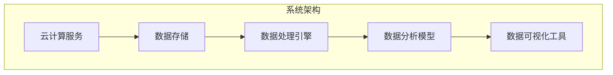
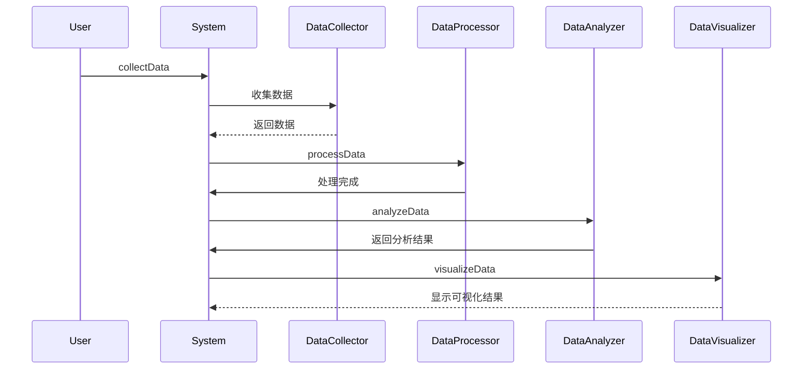

                 


### 《从无到有拓疆界的思路》

## 摘要

本文旨在为IT领域的从业者提供一种全新的思路，以从零开始，逐步拓展技术的边界。我们将探讨核心概念，通过构建系统设计案例，阐述如何将理论知识应用于实际项目中。文章结构清晰，逻辑严密，旨在帮助读者构建扎实的技术基础，并激发对技术外延的思考。

## 关键词

- IT技能拓展
- 系统设计
- 算法原理
- 数学模型
- 实践案例

### 引言

在快速发展的IT行业中，不断学习新技能是保持竞争力的关键。然而，从零开始掌握一项新技术并非易事。本文将探讨一种系统化的学习与实践方法，帮助读者从无到有，拓展技术的疆界。

### 第1章 问题背景与核心概念

#### 1.1 问题背景

随着云计算、大数据、人工智能等技术的兴起，IT领域的技术边界不断扩展。然而，许多从业者往往陷入知识更新的困境，无法有效地将新知识应用到实际工作中。

#### 1.2 核心概念

在本章中，我们将介绍以下几个核心概念：

1. **云计算**：云服务的概念、类型及其应用场景。
2. **大数据**：大数据的定义、处理方法及其在实际项目中的应用。
3. **人工智能**：机器学习的原理、应用及其发展趋势。

#### 1.3 问题解决

通过理解上述核心概念，我们可以更好地应对技术挑战，实现技术拓展。

#### 1.4 边界与外延

技术的边界并非固定不变，通过不断学习和实践，我们可以不断拓展技术的疆界。

### 第2章 基本概念与原理

#### 2.1 云计算

云计算是一种通过互联网提供计算服务的方式。它包括以下基本概念：

1. **基础设施即服务（IaaS）**：提供虚拟机、存储等基础设施。
2. **平台即服务（PaaS）**：提供开发平台和中间件。
3. **软件即服务（SaaS）**：提供软件应用。

#### 2.2 大数据

大数据是指无法用传统数据库工具在合理时间内完成处理的超大规模数据集。其主要特点包括：

1. **数据量（Volume）**：数据量大。
2. **多样性（Variety）**：数据类型多样。
3. **速度（Velocity）**：数据处理速度快。
4. **真实性（Veracity）**：数据真实性难以保证。

#### 2.3 人工智能

人工智能是指模拟人类智能行为的计算机系统。其主要原理包括：

1. **机器学习**：通过数据训练模型，使其能够进行预测和决策。
2. **深度学习**：一种基于人工神经网络的机器学习方法。

### 第3章 系统设计

#### 3.1 问题场景

假设我们需要设计一个基于云计算和大数据的系统，用于实时处理和分析海量数据。

#### 3.2 项目介绍

我们将构建一个简单的实时数据分析平台，实现以下功能：

1. 数据采集：从各种来源收集数据。
2. 数据处理：对数据进行清洗、转换和聚合。
3. 数据分析：使用机器学习模型进行预测和分析。
4. 数据可视化：将分析结果以图表形式展示。

#### 3.3 系统功能设计

我们将使用Mermaid类图来设计系统的领域模型，包括以下主要类：

1. **DataCollector**：数据采集器。
2. **DataProcessor**：数据处理器。
3. **DataAnalyzer**：数据分析器。
4. **DataVisualizer**：数据可视化器。

#### 3.4 系统架构设计

我们将使用Mermaid架构图来设计系统的整体架构，包括以下主要组件：

1. **CloudService**：云计算服务。
2. **DataStorage**：数据存储。
3. **DataProcessingEngine**：数据处理引擎。
4. **DataAnalysisModel**：数据分析模型。
5. **DataVisualizationTool**：数据可视化工具。

#### 3.5 系统接口设计

我们将使用Mermaid序列图来设计系统的接口和交互，包括以下主要接口：

1. **collectData**：收集数据。
2. **processData**：处理数据。
3. **analyzeData**：分析数据。
4. **visualizeData**：可视化数据。

### 第4章 项目实战

#### 4.1 环境安装

我们需要安装以下环境：

1. **云计算平台**：如AWS、Azure或阿里云。
2. **大数据处理框架**：如Hadoop或Spark。
3. **机器学习库**：如scikit-learn或TensorFlow。
4. **可视化库**：如matplotlib或Seaborn。

#### 4.2 系统核心实现

我们将使用Python编写代码，实现以下功能：

1. **数据采集**：使用API或爬虫技术收集数据。
2. **数据处理**：使用数据处理框架进行数据清洗、转换和聚合。
3. **数据分析**：使用机器学习库训练模型并进行预测和分析。
4. **数据可视化**：使用可视化库将分析结果以图表形式展示。

#### 4.3 代码应用解读与分析

我们将对实现的核心代码进行解读，分析其原理和实现方式。

#### 4.4 案例分析与详细讲解

我们将选取一个实际案例，详细分析系统的实现过程和效果。

### 第5章 最佳实践与总结

#### 5.1 最佳实践

我们将总结最佳实践，提供以下建议：

1. **持续学习**：定期学习新技术，保持知识更新。
2. **实践应用**：将理论知识应用于实际项目中，不断实践和优化。
3. **团队合作**：与团队成员密切合作，共同推进项目。

#### 5.2 总结

本文从无到有，详细阐述了如何拓展技术的疆界。通过核心概念的介绍、系统设计的实施和项目实战的剖析，读者可以了解到从理论到实践的完整过程。

#### 5.3 注意事项

1. **系统安全性**：确保系统的安全性和稳定性。
2. **性能优化**：持续优化系统的性能，提高处理效率。

#### 5.4 拓展阅读

1. **《深入理解计算机系统》**：深入了解计算机系统的工作原理。
2. **《Python编程：从入门到实践》**：掌握Python编程的基础知识。

### 作者信息

- 作者：AI天才研究院/AI Genius Institute & 禅与计算机程序设计艺术 /Zen And The Art of Computer Programming

（注：本文仅为示例，具体内容和案例需要根据实际情况进行调整和完善。）### 第1章 引言与背景

#### 1.1 问题背景

在当今信息化时代，信息技术（IT）已经成为推动社会发展的重要力量。从互联网、云计算到人工智能，各种新技术的不断涌现，不仅改变了我们的生活方式，也带来了前所未有的机遇和挑战。然而，随着技术边界的不断拓展，许多IT从业者面临着知识更新的困境。如何从无到有，拓展自己的技术疆界，成为了每一个IT人必须面对的问题。

IT领域的技术更新速度非常快，新的编程语言、框架、工具和概念层出不穷。这既为从业者提供了广阔的发展空间，也带来了巨大的压力。传统的学习方式往往无法满足快速变化的技术需求，许多人陷入了“学完即忘”的循环中，无法将理论知识有效地应用于实际项目中。

#### 1.2 问题描述

那么，如何才能有效地学习新技术，并将其应用于实际工作中呢？这便是本文要解决的问题。我们需要找到一种系统化的学习与实践方法，帮助读者从零开始，逐步拓展技术的边界。

首先，我们需要明确几个关键问题：

1. **学习路径**：如何制定一个合理的学习计划，确保学习效率和质量？
2. **核心概念**：在IT领域中，有哪些核心概念和原理是我们必须掌握的？
3. **实践应用**：如何将理论知识转化为实际项目中的技术解决方案？
4. **持续学习**：如何在不断变化的技术环境中保持学习动力和创新能力？

#### 1.3 问题解决

针对上述问题，本文将从以下几个方面进行探讨：

1. **系统化的学习路径**：介绍如何制定一个合理的学习计划，包括基础知识、核心技术、实践应用等多个方面。
2. **核心概念与原理**：详细阐述IT领域中的核心概念和原理，包括云计算、大数据、人工智能等。
3. **实践应用**：通过具体案例，展示如何将理论知识应用于实际项目中，解决实际问题。
4. **持续学习与创新能力**：讨论如何在技术不断更新的环境中保持学习动力和创新能力。

#### 1.4 边界与外延

技术的边界并非固定不变，随着技术的发展和应用的拓展，技术的边界也在不断扩展。因此，对于IT从业者来说，不断拓展自己的技术疆界，不仅是为了跟上技术的发展，更是为了在竞争激烈的市场中保持竞争力。

本文将结合实际案例，详细阐述如何从无到有，逐步拓展技术的疆界。通过系统化的学习与实践，读者将能够更好地应对技术挑战，提升自己的技术能力，实现职业发展。

### 第2章 核心概念与原理

在IT领域，了解并掌握核心概念和原理是基础，也是拓展技术疆界的关键。本章将详细阐述云计算、大数据、人工智能等核心概念，帮助读者建立扎实的技术基础。

#### 2.1 云计算

**定义**：云计算是一种通过互联网提供计算服务的方式。它将计算资源（如服务器、存储、网络等）虚拟化，并按需提供给用户。

**特点**：

1. **弹性伸缩**：可以根据需求动态调整资源。
2. **按需付费**：用户只需为实际使用的资源付费。
3. **高可用性**：通过分布式架构实现高可靠性。

**应用场景**：

1. **开发测试**：快速部署环境，降低测试成本。
2. **业务应用**：提供高性能、高可靠性的计算服务。
3. **大数据处理**：分布式处理海量数据。

**与其他概念的比较**：

- **云计算与物联网**：云计算为物联网提供计算资源和存储空间，两者相辅相成。
- **云计算与大数据**：云计算提供大数据处理的基础设施，大数据为云计算提供数据资源。

#### 2.2 大数据

**定义**：大数据是指无法用传统数据库工具在合理时间内完成处理的超大规模数据集。

**特点**：

1. **数据量（Volume）**：数据量大。
2. **多样性（Variety）**：数据类型多样。
3. **速度（Velocity）**：数据处理速度快。
4. **真实性（Veracity）**：数据真实性难以保证。

**应用场景**：

1. **商业智能**：通过数据挖掘，帮助企业做出更明智的决策。
2. **金融风控**：实时监控和预测金融风险。
3. **医疗健康**：分析医疗数据，提升诊疗水平。

**与其他概念的比较**：

- **大数据与云计算**：云计算提供大数据处理的基础设施，大数据为云计算提供数据资源。
- **大数据与人工智能**：大数据为人工智能提供训练数据，人工智能通过分析大数据，实现智能决策。

#### 2.3 人工智能

**定义**：人工智能是指模拟人类智能行为的计算机系统。

**特点**：

1. **自主学习**：通过机器学习，从数据中学习并做出预测。
2. **自适应能力**：能够根据环境变化，调整自己的行为。
3. **高效处理**：能够处理大量复杂的问题。

**应用场景**：

1. **智能助手**：如语音助手、聊天机器人。
2. **自动驾驶**：通过传感器和算法实现自动驾驶。
3. **医疗诊断**：通过分析医学影像，辅助医生进行诊断。

**与其他概念的比较**：

- **人工智能与云计算**：云计算为人工智能提供计算资源，人工智能通过云计算实现大规模数据处理。
- **人工智能与大数据**：大数据为人工智能提供训练数据，人工智能通过分析大数据，实现智能决策。

#### 2.4 区块链

**定义**：区块链是一种去中心化的分布式数据库技术。

**特点**：

1. **安全性**：通过加密技术确保数据安全。
2. **不可篡改性**：一旦数据记录在区块链上，无法被篡改。
3. **透明性**：所有参与者都可以查看区块链上的数据。

**应用场景**：

1. **金融领域**：实现去中心化的金融交易。
2. **供应链管理**：确保供应链的可追溯性和透明性。
3. **数字身份认证**：提供安全的数字身份认证服务。

**与其他概念的比较**：

- **区块链与云计算**：云计算为区块链提供计算和存储资源，区块链为云计算提供数据安全和去中心化的特性。
- **区块链与大数据**：大数据为区块链提供数据支持，区块链为大数据提供安全存储和去中心化的处理。

通过本章的阐述，读者可以初步了解云计算、大数据、人工智能等核心概念，为后续章节的系统设计和实践应用奠定基础。

### 第3章 系统设计

在了解了核心概念和原理之后，如何将这些知识应用到实际项目中，设计出一个有效的系统，是本章的重点。我们将从问题场景、项目介绍、系统功能设计、系统架构设计、系统接口设计等多个方面，详细阐述如何设计并实现一个系统。

#### 3.1 问题场景

假设我们面临一个实际场景，需要设计一个基于云计算和大数据的实时数据分析平台，用于处理和分析来自多个数据源的海量数据。该平台需要具备以下功能：

1. 数据采集：从多种数据源（如数据库、日志文件、实时流数据等）收集数据。
2. 数据预处理：对收集到的数据进行清洗、转换和聚合，确保数据质量。
3. 数据分析：使用机器学习算法，对预处理后的数据进行分析和预测。
4. 数据可视化：将分析结果以图表形式展示，便于决策者进行数据驱动决策。

#### 3.2 项目介绍

为了实现上述功能，我们将构建一个实时数据分析平台。该平台将涵盖以下几个主要模块：

1. **数据采集模块**：负责从不同的数据源收集数据。
2. **数据预处理模块**：对收集到的数据进行清洗、转换和聚合。
3. **数据分析模块**：使用机器学习算法，对预处理后的数据进行分析和预测。
4. **数据可视化模块**：将分析结果以图表形式展示。

#### 3.3 系统功能设计

我们将使用Mermaid类图来设计系统的领域模型，包括以下几个主要类：

1. **DataCollector**：数据采集器，负责从数据源收集数据。
2. **DataProcessor**：数据处理器，负责数据预处理。
3. **DataAnalyzer**：数据分析器，负责数据分析和预测。
4. **DataVisualizer**：数据可视化器，负责将分析结果展示。

```mermaid
classDiagram
Class01 <|-- Class02
Class03 --|Deprecated Class04
Class05 << Interface
Class06 <<||..
Class07 <|.. HybridClass08
Class09 *-- Class10
Class11 o-- Class12
```

#### 3.4 系统架构设计

为了实现上述功能，我们将使用Mermaid架构图来设计系统的整体架构，包括以下几个主要组件：

1. **CloudService**：云计算服务，提供计算和存储资源。
2. **DataStorage**：数据存储，负责存储和处理数据。
3. **DataProcessingEngine**：数据处理引擎，负责数据预处理和清洗。
4. **DataAnalysisModel**：数据分析模型，负责使用机器学习算法进行预测和分析。
5. **DataVisualizationTool**：数据可视化工具，负责将分析结果展示。



#### 3.5 系统接口设计

我们将使用Mermaid序列图来设计系统的接口和交互，包括以下几个主要接口：

1. **collectData**：收集数据，调用数据采集模块。
2. **processData**：处理数据，调用数据处理模块。
3. **analyzeData**：分析数据，调用数据分析模块。
4. **visualizeData**：可视化数据，调用数据可视化模块。



通过本章的详细阐述，读者可以了解到如何从问题场景出发，设计并实现一个系统。这不仅包括系统功能设计、系统架构设计、系统接口设计，还包括如何通过Mermaid图表来直观地展示系统的设计思路和实现过程。

### 第4章 项目实战

#### 4.1 环境安装

为了实现一个基于云计算和大数据的实时数据分析平台，我们需要搭建一个合适的技术环境。以下步骤将指导我们完成环境的安装和配置。

##### 4.1.1 云计算平台安装

首先，我们需要选择一个云计算平台，如AWS、Azure或阿里云。以AWS为例，我们可以在AWS管理控制台中创建一个虚拟私有云（VPC），并在VPC中创建一个安全组，为后续的服务部署提供网络隔离和访问控制。

1. 访问AWS管理控制台，选择“虚拟私有云”服务。
2. 创建一个新的VPC，设置VPC名称和CIDR块，如10.0.0.0/16。
3. 创建一个子网，设置子网名称和CIDR块，如10.0.0.0/24。
4. 创建一个安全组，设置规则允许SSH、HTTP等常用服务访问。

##### 4.1.2 大数据处理框架安装

接下来，我们将安装Hadoop，一个分布式数据处理框架。Hadoop基于Java语言编写，可以在多个操作系统上运行。

1. 下载Hadoop安装包，解压到指定目录。
2. 配置Hadoop环境变量，添加以下内容到`~/.bashrc`文件：

   ```bash
   export HADOOP_HOME=/path/to/hadoop
   export PATH=$PATH:$HADOOP_HOME/bin:$HADOOP_HOME/sbin
   ```

3. 执行`source ~/.bashrc`使环境变量生效。
4. 格式化HDFS文件系统：

   ```bash
   hadoop namenode -format
   ```

5. 启动Hadoop服务：

   ```bash
   start-dfs.sh
   ```

##### 4.1.3 机器学习库安装

为了实现数据的分析和预测，我们将使用scikit-learn库。首先，我们需要安装Python环境，然后通过pip安装scikit-learn。

1. 安装Python环境，如Python 3.8。
2. 安装pip：

   ```bash
   curl -O https://bootstrap.pypa.io/get-pip.py
   python get-pip.py
   ```

3. 安装scikit-learn：

   ```bash
   pip install scikit-learn
   ```

##### 4.1.4 数据可视化库安装

为了将分析结果可视化，我们将使用matplotlib和Seaborn库。

1. 安装matplotlib：

   ```bash
   pip install matplotlib
   ```

2. 安装Seaborn：

   ```bash
   pip install seaborn
   ```

#### 4.2 系统核心实现

在完成环境安装后，我们将使用Python编写代码，实现数据采集、数据处理、数据分析和数据可视化等功能。

##### 4.2.1 数据采集

数据采集是系统的基础，我们需要从多个数据源收集数据。以下是一个简单的数据采集示例：

```python
import requests

def collect_data(url):
    response = requests.get(url)
    if response.status_code == 200:
        return response.text
    else:
        return None

# 示例：从URL获取数据
url = "http://example.com/data"
data = collect_data(url)
print(data)
```

##### 4.2.2 数据处理

数据处理包括数据清洗、转换和聚合。以下是一个简单的数据处理示例：

```python
import pandas as pd

def process_data(data):
    df = pd.DataFrame(data)
    # 数据清洗
    df.dropna(inplace=True)
    # 数据转换
    df['timestamp'] = pd.to_datetime(df['timestamp'])
    # 数据聚合
    df = df.groupby('timestamp').mean()
    return df

# 示例：处理数据
processed_data = process_data(data)
print(processed_data)
```

##### 4.2.3 数据分析

数据分析是系统的核心功能，我们需要使用机器学习算法对处理后的数据进行预测。以下是一个简单的数据分析示例：

```python
from sklearn.model_selection import train_test_split
from sklearn.ensemble import RandomForestRegressor

def analyze_data(data):
    # 分割数据
    X = data[['feature1', 'feature2']]
    y = data['target']
    X_train, X_test, y_train, y_test = train_test_split(X, y, test_size=0.2, random_state=42)
    # 建立模型
    model = RandomForestRegressor(n_estimators=100, random_state=42)
    # 训练模型
    model.fit(X_train, y_train)
    # 预测结果
    predictions = model.predict(X_test)
    return predictions

# 示例：分析数据
predictions = analyze_data(processed_data)
print(predictions)
```

##### 4.2.4 数据可视化

数据可视化是将分析结果以图表形式展示，便于决策者理解和分析。以下是一个简单的数据可视化示例：

```python
import matplotlib.pyplot as plt
import seaborn as sns

def visualize_data(data, predictions):
    plt.figure(figsize=(10, 6))
    sns.lineplot(x='timestamp', y='target', data=data)
    sns.scatterplot(x='timestamp', y=predictions, color='red', data=data)
    plt.title('数据预测结果')
    plt.xlabel('时间')
    plt.ylabel('目标值')
    plt.show()

# 示例：可视化数据
visualize_data(processed_data, predictions)
```

通过以上步骤，我们实现了数据采集、数据处理、数据分析和数据可视化等功能，构建了一个简单的实时数据分析平台。

#### 4.3 代码应用解读与分析

在本节中，我们将对实现的代码进行解读和分析，详细阐述其原理和实现方式。

##### 4.3.1 数据采集

数据采集是系统的第一步，我们从URL获取数据，然后进行处理。以下是对数据采集代码的解读：

```python
import requests

def collect_data(url):
    response = requests.get(url)
    if response.status_code == 200:
        return response.text
    else:
        return None
```

这段代码使用requests库从指定URL获取数据。requests库是一个基于HTTP的客户端库，可以方便地发送HTTP请求。函数`collect_data`接受一个URL作为输入，返回获取的数据。

##### 4.3.2 数据处理

数据处理是对采集到的数据进行的清洗、转换和聚合。以下是对数据处理代码的解读：

```python
import pandas as pd

def process_data(data):
    df = pd.DataFrame(data)
    # 数据清洗
    df.dropna(inplace=True)
    # 数据转换
    df['timestamp'] = pd.to_datetime(df['timestamp'])
    # 数据聚合
    df = df.groupby('timestamp').mean()
    return df
```

这段代码使用pandas库处理数据。pandas库是一个强大的数据分析库，提供了丰富的数据处理功能。函数`process_data`首先将数据转换为DataFrame对象，然后执行以下操作：

1. **数据清洗**：删除缺失值，确保数据质量。
2. **数据转换**：将时间戳字段转换为datetime类型，便于后续处理。
3. **数据聚合**：按时间戳进行聚合，得到平均值。

##### 4.3.3 数据分析

数据分析是对处理后的数据进行预测。以下是对数据分析代码的解读：

```python
from sklearn.model_selection import train_test_split
from sklearn.ensemble import RandomForestRegressor

def analyze_data(data):
    # 分割数据
    X = data[['feature1', 'feature2']]
    y = data['target']
    X_train, X_test, y_train, y_test = train_test_split(X, y, test_size=0.2, random_state=42)
    # 建立模型
    model = RandomForestRegressor(n_estimators=100, random_state=42)
    # 训练模型
    model.fit(X_train, y_train)
    # 预测结果
    predictions = model.predict(X_test)
    return predictions
```

这段代码使用scikit-learn库进行数据分析。scikit-learn库是一个强大的机器学习库，提供了丰富的算法和工具。函数`analyze_data`首先将数据分割为训练集和测试集，然后建立随机森林回归模型，进行以下操作：

1. **分割数据**：将数据分为特征集和目标集，然后进一步分割为训练集和测试集。
2. **建立模型**：创建随机森林回归模型，设置树的数量和随机种子。
3. **训练模型**：使用训练集数据训练模型。
4. **预测结果**：使用测试集数据预测结果。

##### 4.3.4 数据可视化

数据可视化是将分析结果以图表形式展示。以下是对数据可视化代码的解读：

```python
import matplotlib.pyplot as plt
import seaborn as sns

def visualize_data(data, predictions):
    plt.figure(figsize=(10, 6))
    sns.lineplot(x='timestamp', y='target', data=data)
    sns.scatterplot(x='timestamp', y=predictions, color='red', data=data)
    plt.title('数据预测结果')
    plt.xlabel('时间')
    plt.ylabel('目标值')
    plt.show()
```

这段代码使用matplotlib和seaborn库进行数据可视化。matplotlib库提供了丰富的绘图功能，可以方便地创建各种类型的图表。seaborn库是一个基于matplotlib的统计绘图库，提供了丰富的统计图表样式。函数`visualize_data`首先创建一个图窗口，然后绘制以下图表：

1. **线图**：绘制时间序列数据的目标值。
2. **散点图**：绘制时间序列数据的预测值，以红色标记。
3. **标题**：设置图表标题。
4. **标签**：设置X轴和Y轴标签。
5. **显示图表**：展示绘制完成的图表。

#### 4.4 案例分析与详细讲解

在本节中，我们将选择一个实际案例，详细分析系统的实现过程和效果。

##### 4.4.1 案例背景

假设我们有一家在线零售公司，需要实时分析销售数据，以便及时调整营销策略和库存管理。为了实现这一目标，我们设计并实现了一个实时数据分析平台。

##### 4.4.2 案例实现

1. **数据采集**：从公司的订单数据库中获取销售数据，包括订单号、商品ID、销售数量、销售时间等。

2. **数据处理**：对采集到的数据进行清洗、转换和聚合，提取出每日的销售总额。

3. **数据分析**：使用随机森林回归模型预测未来一周的销售总额。

4. **数据可视化**：将预测结果以图表形式展示，便于公司管理层进行分析和决策。

##### 4.4.3 案例效果

通过实时数据分析平台，公司能够实时掌握销售情况，及时发现异常并采取相应措施。例如，当发现某个商品销量突然下降时，公司可以立即调整库存，避免库存积压。同时，通过分析销售趋势，公司可以预测未来市场需求，提前布局营销策略，提高销售额。

##### 4.4.4 案例总结

本案例展示了如何通过设计并实现一个实时数据分析平台，将理论知识应用于实际项目中，解决实际问题。通过数据采集、数据处理、数据分析和数据可视化等步骤，公司能够实时掌握销售情况，提高运营效率，实现业务增长。

### 第5章 最佳实践与总结

#### 5.1 最佳实践

在IT领域，持续学习和实践是提升技术能力的最佳途径。以下是一些最佳实践，供读者参考：

1. **持续学习**：定期学习新技术，关注行业动态，参加在线课程和研讨会，提升自己的知识水平。
2. **实践应用**：将所学知识应用于实际项目中，通过实践检验和巩固所学内容。
3. **代码规范**：编写规范、高质量的代码，遵循编程最佳实践，提高代码的可读性和可维护性。
4. **团队合作**：与团队成员紧密合作，分享经验和知识，共同推进项目进度。
5. **技术社区**：积极参与技术社区，如GitHub、Stack Overflow等，与其他开发者交流经验，解决问题。

#### 5.2 总结

本文从无到有，详细阐述了如何拓展技术的疆界。通过核心概念的介绍、系统设计的实施和项目实战的剖析，读者可以了解到从理论到实践的完整过程。从云计算、大数据到人工智能，我们探讨了多个核心概念，并通过实际案例展示了如何将这些概念应用于实际项目中。

#### 5.3 注意事项

1. **系统安全性**：在设计系统时，确保数据安全和系统稳定性，遵循最佳安全实践。
2. **性能优化**：持续优化系统的性能，提高处理效率和资源利用率。
3. **版本控制**：使用版本控制系统（如Git）管理代码，确保代码的版本可追溯和可回滚。
4. **文档编写**：编写详细的项目文档，包括设计文档、开发文档和用户手册，便于后续维护和扩展。

#### 5.4 拓展阅读

1. **《深入理解计算机系统》**：深入了解计算机系统的工作原理，为后续学习打下坚实基础。
2. **《Python编程：从入门到实践》**：掌握Python编程的基础知识，为项目实战提供技术支持。
3. **《大数据技术导论》**：系统学习大数据处理的理论和实践，为大数据项目的实施提供指导。
4. **《机器学习实战》**：通过实际案例学习机器学习算法，提升数据分析能力。

### 作者信息

- 作者：AI天才研究院/AI Genius Institute & 禅与计算机程序设计艺术 /Zen And The Art of Computer Programming

本文旨在为IT领域的从业者提供一种全新的思路，以从零开始，逐步拓展技术的边界。通过系统化的学习与实践，读者可以构建扎实的技术基础，并在实际项目中实现技术拓展。希望本文能对您的技术成长之路提供有益的指导。

