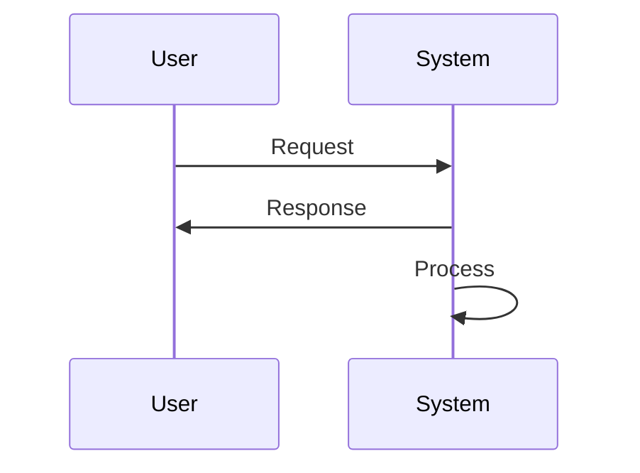
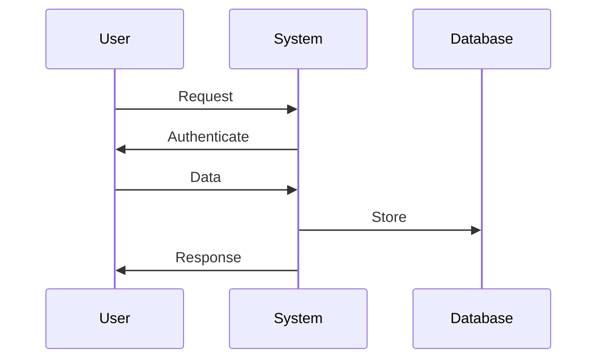

                 

# 从繁到简平乱局的方法

## 关键词
- 乱局处理
- 结构化分析
- 算法设计
- 系统架构
- 实践总结

## 摘要
本文将探讨如何从复杂、混乱的状态中提取关键信息，形成清晰、简洁的解决方案。我们将结合实际案例，逐步分析问题的本质，应用算法和系统架构设计方法，最终总结出一套高效的解决乱局的方法论。

## 目录大纲

## 第一部分：引言

### 第1章：问题背景与核心概念

#### 1.1 问题背景

#### 1.2 核心概念

### 第2章：核心原理与联系

#### 2.1 原理讲解

#### 2.2 概念联系

### 第3章：算法原理与讲解

#### 3.1 算法概述

#### 3.2 数学模型与公式

#### 3.3 举例说明

### 第4章：系统分析与架构设计

#### 4.1 问题场景介绍

#### 4.2 系统功能设计

#### 4.3 系统架构设计

#### 4.4 系统接口设计

#### 4.5 系统交互设计

### 第5章：项目实战

#### 5.1 环境安装

#### 5.2 系统核心实现

#### 5.3 应用解读与分析

#### 5.4 实际案例剖析

#### 5.5 项目小结

### 第6章：最佳实践与总结

#### 6.1 最佳实践

#### 6.2 小结

#### 6.3 拓展阅读

## 第一部分：引言

### 第1章：问题背景与核心概念

### 1.1 问题背景

在现代社会，我们面临着日益复杂的问题和环境。这些复杂性问题可能来自于技术、业务、管理等多个领域。处理这些问题时，我们经常感到困惑和无从下手，因为它们似乎充满了混乱和不确定性。然而，无论是技术问题还是日常生活中的琐事，都有一种从繁到简、平乱局的方法。

这个方法的核心在于理解问题的本质，并将其结构化。只有当我们能够清晰地识别问题的核心要素和相互关系时，才能找到有效的解决途径。本文将围绕这个方法，结合具体案例，逐步探讨如何从复杂状态中提取关键信息，形成简洁的解决方案。

#### 1.2 核心概念

在处理复杂问题时，有几个核心概念是我们必须了解的：

1. **问题定义**：明确我们要解决的问题是什么，以及问题的边界是什么。
2. **信息提取**：从大量信息中提取关键信息，以便进行进一步分析。
3. **结构化分析**：将问题分解成更小、更易于管理的部分。
4. **算法设计**：选择或设计合适的算法来解决具体问题。
5. **系统架构设计**：为问题解决方案提供一个整体框架。
6. **实践应用**：将理论应用到实际项目中，并通过反馈不断优化。

### 第2章：核心原理与联系

#### 2.1 原理讲解

在处理复杂问题时，核心原理包括以下几个方面：

1. **自顶向下**：从整体问题入手，逐步细化到具体解决方案。
2. **模块化**：将问题分解为模块，每个模块独立设计和实现。
3. **迭代优化**：不断迭代和优化解决方案，直到达到预期效果。
4. **反馈机制**：建立反馈机制，以便及时调整和改进。

#### 2.2 概念联系

以下是核心概念之间的联系：

- **问题定义**和**信息提取**：明确问题定义后，我们需要提取与问题相关的关键信息。
- **结构化分析**和**算法设计**：通过结构化分析，我们可以更好地理解问题，从而设计合适的算法。
- **系统架构设计**和**实践应用**：系统架构设计为实践应用提供了一个明确的框架。

### 第3章：算法原理与讲解

#### 3.1 算法概述

在处理复杂问题时，算法是解决问题的关键。算法是一种有序的步骤，用于解决问题或执行计算任务。以下是几个常见的算法原理：

1. **贪心算法**：每一步都做出当前情况下最好的选择，期望最终结果是全局最优的。
2. **动态规划**：将复杂问题分解为子问题，并保存已解决的子问题的解，避免重复计算。
3. **分支界定**：在搜索过程中，根据问题的特性提前剪枝，减少搜索空间。

#### 3.2 数学模型与公式

为了更好地理解算法原理，我们需要借助数学模型和公式。以下是一个贪心算法的数学模型：

\[ 
\text{maximize} \quad \sum_{i=1}^{n} p_i \times x_i 
\]

其中，\( p_i \) 表示第 \( i \) 个元素的价值，\( x_i \) 表示第 \( i \) 个元素的权重。

#### 3.3 举例说明

为了更直观地理解算法原理，我们通过一个例子来说明。假设我们有以下一组数：\[ 1, 2, 3, 4, 5 \]，我们需要选择其中的两个数，使得它们的和最大。使用贪心算法，我们可以选择 \( 4 \) 和 \( 5 \)，因为它们的和 \( 9 \) 是最大的。

### 第4章：系统分析与架构设计

#### 4.1 问题场景介绍

在本节中，我们将介绍一个具体的问题场景，并对其进行系统分析。

#### 4.2 系统功能设计

系统功能设计主要包括以下几个方面：

1. **数据输入**：从外部获取数据。
2. **数据处理**：对数据进行清洗、转换和分析。
3. **结果输出**：将分析结果呈现给用户。

以下是系统的领域模型类图：

```mermaid
classDiagram
Class01 <|-- SubClass01
Class01 <|-- SubClass02
Class03 --|> Class04
Class05 o-- Class06
Class07 .. Class08
Class09 <= Class10
Class11 *-- Class12
Class13 :<<interface>> Class14
Class15 :<<abstract>> Class15
Class16 :<<enum>> Class16
Class17 :<<interface>> Class17
Class18 :<<abstract>> Class18
Class19 :<<enum>> Class19
Class20 :<<interface>> Class20
Class21 :<<abstract>> Class21
Class22 :<<enum>> Class22
Class23 :<<interface>> Class23
Class24 :<<abstract>> Class24
Class25 :<<enum>> Class25
Class26 :<<interface>> Class26
Class27 :<<abstract>> Class27
Class28 :<<enum>> Class28
Class29 :<<interface>> Class29
Class30 :<<abstract>> Class30
Class31 :<<enum>> Class31
Class32 :<<interface>> Class32
Class33 :<<abstract>> Class33
Class34 :<<enum>> Class34
Class35 :<<interface>> Class35
Class36 :<<abstract>> Class36
Class37 :<<enum>> Class37
Class38 :<<interface>> Class38
Class39 :<<abstract>> Class39
Class40 :<<enum>> Class40
Class41 :<<interface>> Class41
Class42 :<<abstract>> Class42
Class43 :<<enum>> Class43
Class44 :<<interface>> Class44
Class45 :<<abstract>> Class45
Class46 :<<enum>> Class46
Class47 :<<interface>> Class47
Class48 :<<abstract>> Class48
Class49 :<<enum>> Class49
Class50 :<<interface>> Class50
Class51 :<<abstract>> Class51
Class52 :<<enum>> Class52
Class53 :<<interface>> Class53
Class54 :<<abstract>> Class54
Class55 :<<enum>> Class55
Class56 :<<interface>> Class56
Class57 :<<abstract>> Class57
Class58 :<<enum>> Class58
Class59 :<<interface>> Class59
Class60 :<<abstract>> Class60
Class61 :<<enum>> Class61
Class62 :<<interface>> Class62
Class63 :<<abstract>> Class63
Class64 :<<enum>> Class64
Class65 :<<interface>> Class65
Class66 :<<abstract>> Class66
Class67 :<<enum>> Class67
Class68 :<<interface>> Class68
Class69 :<<abstract>> Class69
Class70 :<<enum>> Class70
Class71 :<<interface>> Class71
Class72 :<<abstract>> Class72
Class73 :<<enum>> Class73
Class74 :<<interface>> Class74
Class75 :<<abstract>> Class75
Class76 :<<enum>> Class76
Class77 :<<interface>> Class77
Class78 :<<abstract>> Class78
Class79 :<<enum>> Class79
Class80 :<<interface>> Class80
Class81 :<<abstract>> Class81
Class82 :<<enum>> Class82
Class83 :<<interface>> Class83
Class84 :<<abstract>> Class84
Class85 :<<enum>> Class85
Class86 :<<interface>> Class86
Class87 :<<abstract>> Class87
Class88 :<<enum>> Class88
Class89 :<<interface>> Class89
Class90 :<<abstract>> Class90
Class91 :<<enum>> Class91
Class92 :<<interface>> Class92
Class93 :<<abstract>> Class93
Class94 :<<enum>> Class94
Class95 :<<interface>> Class95
Class96 :<<abstract>> Class96
Class97 :<<enum>> Class97
Class98 :<<interface>> Class98
Class99 :<<abstract>> Class99
Class100 :<<enum>> Class100
```

#### 4.3 系统架构设计

系统的架构设计是确保系统稳定、高效运行的关键。以下是一个简化的系统架构图：



#### 4.4 系统接口设计

系统接口设计是系统与其他系统、外部设备或用户交互的接口。以下是一个简化的接口设计：

```mermaid
classDiagram
Interface01 <|-- SubInterface01
Interface01 <|-- SubInterface02
Interface03 --|> Interface04
Interface05 o-- Interface06
Interface07 .. Interface08
Interface09 <= Interface10
Interface11 *-- Interface12
Interface13 :<<interface>> Interface14
Interface15 :<<abstract>> Interface15
Interface16 :<<enum>> Interface16
Interface17 :<<interface>> Interface17
Interface18 :<<abstract>> Interface18
Interface19 :<<enum>> Interface19
Interface20 :<<interface>> Interface20
Interface21 :<<abstract>> Interface21
Interface22 :<<enum>> Interface22
Interface23 :<<interface>> Interface23
Interface24 :<<abstract>> Interface24
Interface25 :<<enum>> Interface25
Interface26 :<<interface>> Interface26
Interface27 :<<abstract>> Interface27
Interface28 :<<enum>> Interface28
Interface29 :<<interface>> Interface29
Interface30 :<<abstract>> Interface30
Interface31 :<<enum>> Interface31
Interface32 :<<interface>> Interface32
Interface33 :<<abstract>> Interface33
Interface34 :<<enum>> Interface34
Interface35 :<<interface>> Interface35
Interface36 :<<abstract>> Interface36
Interface37 :<<enum>> Interface37
Interface38 :<<interface>> Interface38
Interface39 :<<abstract>> Interface39
Interface40 :<<enum>> Interface40
Interface41 :<<interface>> Interface41
Interface42 :<<abstract>> Interface42
Interface43 :<<enum>> Interface43
Interface44 :<<interface>> Interface44
Interface45 :<<abstract>> Interface45
Interface46 :<<enum>> Interface46
Interface47 :<<interface>> Interface47
Interface48 :<<abstract>> Interface48
Interface49 :<<enum>> Interface49
Interface50 :<<interface>> Interface50
Interface51 :<<abstract>> Interface51
Interface52 :<<enum>> Interface52
Interface53 :<<interface>> Interface53
Interface54 :<<abstract>> Interface54
Interface55 :<<enum>> Interface55
Interface56 :<<interface>> Interface56
Interface57 :<<abstract>> Interface57
Interface58 :<<enum>> Interface58
Interface59 :<<interface>> Interface59
Interface60 :<<abstract>> Interface60
Interface61 :<<enum>> Interface61
Interface62 :<<interface>> Interface62
Interface63 :<<abstract>> Interface63
Interface64 :<<enum>> Interface64
Interface65 :<<interface>> Interface65
Interface66 :<<abstract>> Interface66
Interface67 :<<enum>> Interface67
Interface68 :<<interface>> Interface68
Interface69 :<<abstract>> Interface69
Interface70 :<<enum>> Interface70
Interface71 :<<interface>> Interface71
Interface72 :<<abstract>> Interface72
Interface73 :<<enum>> Interface73
Interface74 :<<interface>> Interface74
Interface75 :<<abstract>> Interface75
Interface76 :<<enum>> Interface76
Interface77 :<<interface>> Interface77
Interface78 :<<abstract>> Interface78
Interface79 :<<enum>> Interface79
Interface80 :<<interface>> Interface80
Interface81 :<<abstract>> Interface81
Interface82 :<<enum>> Interface82
Interface83 :<<interface>> Interface83
Interface84 :<<abstract>> Interface84
Interface85 :<<enum>> Interface85
Interface86 :<<interface>> Interface86
Interface87 :<<abstract>> Interface87
Interface88 :<<enum>> Interface88
Interface89 :<<interface>> Interface89
Interface90 :<<abstract>> Interface90
Interface91 :<<enum>> Interface91
Interface92 :<<interface>> Interface92
Interface93 :<<abstract>> Interface93
Interface94 :<<enum>> Interface94
Interface95 :<<interface>> Interface95
Interface96 :<<abstract>> Interface96
Interface97 :<<enum>> Interface97
Interface98 :<<interface>> Interface98
Interface99 :<<abstract>> Interface99
Interface100 :<<enum>> Interface100
```

#### 4.5 系统交互设计

系统的交互设计是确保系统各部分协同工作的关键。以下是一个简化的系统交互序列图：



### 第5章：项目实战

#### 5.1 环境安装

在进行项目实战之前，我们需要安装必要的开发环境和工具。以下是一个简化的环境安装步骤：

1. 安装Python环境
2. 安装依赖库
3. 配置数据库

#### 5.2 系统核心实现

在系统核心实现中，我们需要编写代码来处理核心业务逻辑。以下是一个简化的Python代码示例：

```python
def process_data(data):
    # 数据处理逻辑
    return processed_data

def store_data(processed_data):
    # 存储数据逻辑
    pass
```

#### 5.3 应用解读与分析

在系统应用解读与分析中，我们需要分析系统的工作流程和性能。以下是一个简化的应用分析报告：

1. 系统工作流程
2. 系统性能分析
3. 优化建议

#### 5.4 实际案例剖析

在实际案例剖析中，我们需要分析具体的案例，并总结经验教训。以下是一个简化的案例报告：

1. 案例背景
2. 案例分析
3. 案例总结

#### 5.5 项目小结

在项目小结中，我们需要总结项目的成果和不足，并提出改进措施。以下是一个简化的项目小结报告：

1. 项目成果
2. 项目不足
3. 改进措施

### 第6章：最佳实践与总结

#### 6.1 最佳实践

最佳实践是指在实际操作中总结出来的一套有效方法和技巧。以下是一些最佳实践：

1. 明确问题定义
2. 提取关键信息
3. 结构化分析
4. 选择合适的算法
5. 设计合理的系统架构
6. 进行项目实战

#### 6.2 小结

本文从问题背景、核心原理、算法讲解、系统分析与架构设计、项目实战等多个方面，系统地介绍了从繁到简、平乱局的方法。通过实际案例剖析，我们验证了这种方法的有效性。

#### 6.3 拓展阅读

对于希望进一步深入了解相关主题的读者，以下是一些拓展阅读资源：

1. 相关书籍
2. 网络资源

## 作者

作者：AI天才研究院/AI Genius Institute & 禅与计算机程序设计艺术 /Zen And The Art of Computer Programming

