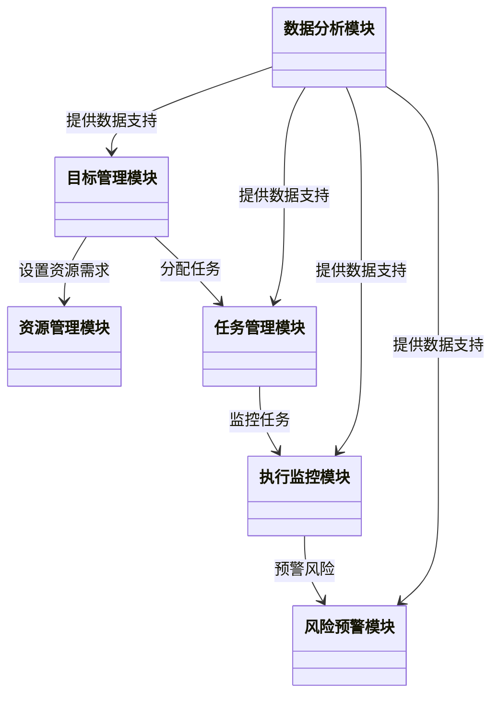
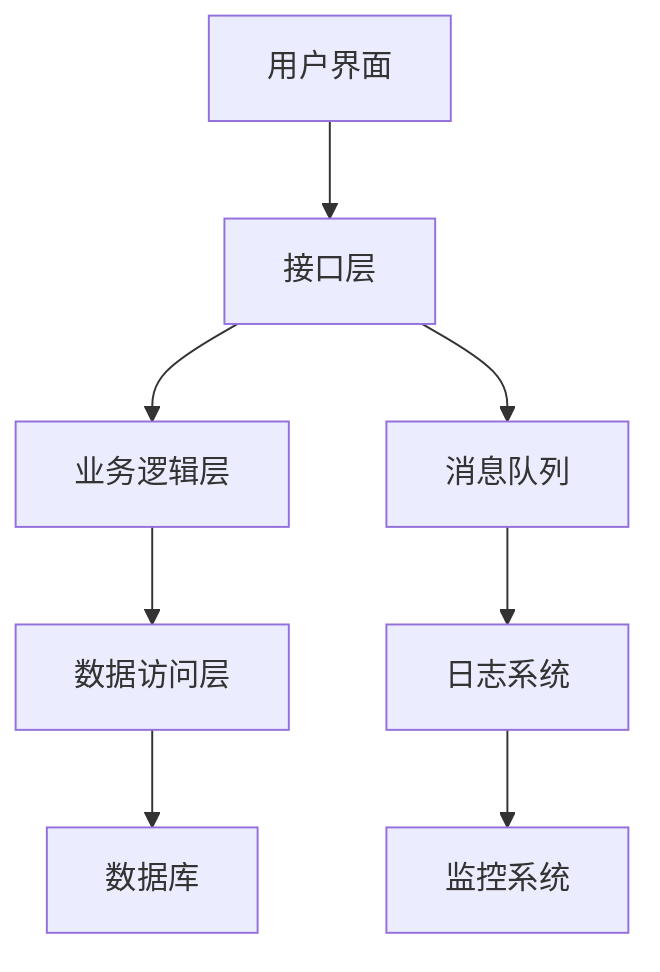

                 

### 引言

#### 问题背景与核心目的

在现代社会的复杂环境下，无论是商业竞争、军事对抗还是战略部署，虚拟策略和实际操作之间的差距成为了决定成败的关键因素。从虚到实的策略转化，不仅仅是技术层面的问题，更是战略层面、执行层面和决策层面的综合挑战。书名《从虚到实定军心的策略》旨在探讨如何将虚拟的战略思维转化为实际的操作步骤，以实现坚定军心的目标。

定军心，即是在军队内部建立和强化统一的意志和信心，确保在执行战略计划时能够协同一致、无往不利。从虚拟策略到实际操作的转化，是确保策略执行过程中能够精准落地、发挥最大效能的关键步骤。这不仅要求决策者具备敏锐的战略眼光，还需要具备将策略具体化的执行能力。

本书的核心目的是为企业管理者、战略分析师、军事策划者等提供一套系统化、可操作性的策略转化框架。通过详细讲解策略从虚拟到实际转化的理论、方法、工具和实践，帮助读者理解和掌握如何在复杂多变的环境中制定并实施有效的策略，以实现战略目标。

#### 策略虚拟与实际操作的差异

在探讨策略转化之前，有必要先了解策略的虚拟与实际操作之间的差异。虚拟策略通常是在纸上谈兵或计算机模拟中进行的，它们以理论模型和数据分析为基础，着眼于战略规划的初步框架。虚拟策略的特点在于灵活性高、可调整性强，但也存在无法全面反映实际环境和复杂因素的局限。

实际操作则是指将虚拟策略转化为具体的行动计划，通过组织资源、调配人力、实施管理等方式，将战略意图落到实处。实际操作的关键在于执行力，它要求策略能够适应现实环境的变化，并在执行过程中不断调整和优化。

两者的差异主要体现在以下几个方面：

1. **环境适应性**：虚拟策略往往基于假设环境进行构建，而实际操作则需要面对真实环境的复杂性和不确定性。
2. **执行灵活性**：虚拟策略可以在模型中反复调整，而实际操作一旦启动，就难以频繁更改。
3. **资源调配**：虚拟策略侧重于资源的需求分析，而实际操作则需要具体落实资源的获取和分配。
4. **风险评估**：虚拟策略可以在模型中预测风险，实际操作则需要实时应对可能出现的问题。

理解这些差异，有助于我们更好地认识到策略转化过程中的挑战和难点，从而有针对性地制定解决方案。

#### 定军心的概念与策略实施

定军心，是军事战略中的重要概念，指的是通过一系列措施，在军队内部建立和强化统一的意志和信心。定军心的关键在于确保军队在执行战略计划时能够协同一致、无往不利。这不仅要求领导者具备高超的指挥艺术，还需要策略能够深入人心，成为军队行动的指南。

定军心的策略实施可以分为以下几个步骤：

1. **明确目标**：领导者需要明确战略目标和军心建设的目标，确保全军上下一心，为实现共同目标而努力。
2. **宣传教育**：通过宣传教育，使士兵深刻理解战略目标和军心建设的重要性，形成共识。
3. **组织动员**：通过组织动员，确保军队在执行任务时能够高效协同，形成战斗力。
4. **激励机制**：通过激励机制，激发士兵的积极性和战斗力，确保他们能够在实际操作中发挥最佳水平。
5. **心理疏导**：在执行任务过程中，及时进行心理疏导，缓解士兵的压力和焦虑，保持士气高涨。

虚拟到实际策略转化的关键在于如何确保虚拟策略中的战略意图在执行过程中得到有效落实。具体而言，有以下几点需要注意：

1. **情景模拟**：在策略制定阶段，通过情景模拟，提前预测实际执行中可能出现的问题，并制定相应的应对措施。
2. **试点实施**：在全面推广前，选择部分单位进行试点实施，通过实践检验策略的可行性和有效性。
3. **实时调整**：在执行过程中，根据实际情况进行实时调整，确保策略能够适应环境变化。
4. **反馈机制**：建立反馈机制，及时收集执行过程中的问题和建议，为后续调整提供依据。

通过以上步骤，可以有效实现虚拟策略到实际操作的转化，确保策略在执行过程中能够充分发挥作用，达到定军心的目的。

#### 书籍结构安排

本书分为七个主要章节，每个章节都有其独特的主题和内容，旨在全面探讨从虚拟策略到实际操作的转化过程，以及如何通过定军心策略实现战略目标。

- **第一章：策略与军事背景概述**，介绍策略的定义、分类以及军事策略的特点，为后续章节奠定理论基础。
- **第二章：核心概念与联系**，详细阐述虚拟策略和实际策略的核心概念及其联系，通过对比分析，帮助读者理解两者的差异。
- **第三章：算法原理与实现**，讲解定军心策略的算法原理，使用Python代码和LaTeX公式进行详细阐述，并举例说明算法应用。
- **第四章：系统分析与架构设计**，介绍系统分析和架构设计的方法，使用Mermaid绘制类图和架构图，解释系统功能设计和接口设计。
- **第五章：项目实战**，通过实际项目案例，展示如何将理论应用到实践中，包括环境安装、系统实现和案例分析。
- **第六章：最佳实践与总结**，提供策略转化的最佳实践和注意事项，总结核心内容，并对未来的发展方向进行展望。
- **第七章：展望与未来发展方向**，探讨策略转化技术的发展趋势，对军队指挥与作战的启示，以及未来可能面临的挑战和机遇。

通过这七个章节的详细讲解，读者将能够系统地掌握从虚拟策略到实际操作的转化技巧，并在定军心的策略实施过程中取得成功。

### 策略与军事背景概述

策略，作为管理学、军事学等领域的重要概念，其定义和分类多种多样。策略的本质是一种计划或行动方案，旨在实现特定的目标或解决特定的问题。在商业竞争、军事对抗、战略部署等场合，策略扮演着至关重要的角色。为了更好地理解策略，我们需要先对其进行分类和定义。

#### 策略的定义

策略可以定义为在特定条件下，为实现某一目标而制定的指导思想和行动方案。根据用途和目标，策略可以分为以下几种类型：

1. **竞争策略**：主要用于商业领域，旨在通过差异化、成本领先等方式，在市场竞争中取得优势。
2. **战略策略**：用于长期规划，涉及公司发展方向、市场定位、资源分配等，具有指导性和前瞻性。
3. **战术策略**：用于具体操作的指导，通常涉及短期的目标实现和资源的调配。
4. **军事策略**：用于战争或军事行动的指导，包括部署、战斗、后勤等各个方面。

#### 策略的分类

策略根据不同的标准可以进行多种分类。以下是一些常见的分类方法：

1. **按层次分类**：
   - **总体策略**：针对全局的战略规划，具有长远性和指导性。
   - **分部策略**：在总体策略指导下，针对局部或特定部门的具体行动计划。

2. **按内容分类**：
   - **竞争策略**：侧重于市场竞争的策划和应对措施。
   - **资源策略**：涉及资源获取、分配和利用。
   - **品牌策略**：品牌建设、市场定位、品牌推广等。
   - **风险策略**：风险管理、应对突发事件等。

3. **按实施方法分类**：
   - **传统策略**：依赖经验和直觉，通过传统方法进行决策。
   - **现代策略**：借助数据分析、人工智能等技术进行决策。

#### 军事策略的特点

在军事领域，策略具有其独特的特点和重要性。军事策略的特点主要体现在以下几个方面：

1. **灵活性**：军事策略需要根据战场环境、敌我态势等实际情况进行调整，以适应不断变化的情况。
2. **隐蔽性**：军事策略通常需要保持隐蔽，避免敌军事先得知意图。
3. **突发性**：军事策略需要应对突发事件和意外情况，确保行动的灵活性和及时性。
4. **协同性**：军事策略强调军队各部门、各部队之间的协同作战，形成整体合力。

军事策略的重要性在于，它不仅决定了战争胜负，还关系到国家和民族的命运。有效的军事策略能够迅速打击敌方，稳固自身地位，最终取得胜利。

#### 虚拟策略的实施过程

虚拟策略通常是在计算机模拟或纸上谈兵中进行的，其实施过程主要包括以下几个步骤：

1. **目标设定**：明确策略的目标和预期效果，为后续的模拟和制定提供方向。
2. **情景构建**：根据目标设定，构建可能的情境和场景，模拟各种情况下的行动方案。
3. **方案评估**：对各个策略方案进行评估，包括可行性、效果、风险等因素。
4. **优化调整**：根据评估结果，对策略方案进行优化和调整，以提高策略的有效性。

虚拟策略的实施过程具有以下几个优点：

1. **成本较低**：虚拟策略通过模拟和计算，可以避免实际操作中的高额成本。
2. **风险可控**：在虚拟环境中，可以模拟各种情况，降低实际操作中的风险。
3. **灵活性强**：虚拟策略可以反复调整和优化，以提高其适应性和效果。

#### 实际策略的转化与执行

实际策略的转化与执行是将虚拟策略转化为实际操作的过程。这个过程涉及多个环节，需要严格的执行和有效的管理。

1. **资源调配**：根据策略方案，合理调配资源，确保各项任务能够按时完成。
2. **任务分配**：将任务分配给具体的执行团队或个人，明确责任和权限。
3. **监控与反馈**：建立监控机制，实时跟踪任务进展，及时反馈问题和建议。
4. **调整与优化**：根据反馈结果，对策略方案进行及时调整和优化，确保策略的有效性。

实际策略的转化与执行过程中，需要注意以下几个问题：

1. **执行力**：确保策略能够得到有效执行，避免因执行力不足导致策略失效。
2. **适应性**：策略需要适应实际环境和情况的变化，确保其持续有效性。
3. **协同性**：确保各个部门和团队之间的协同作战，形成合力。
4. **灵活性**：在执行过程中，根据实际情况进行灵活调整，以应对突发事件。

通过以上步骤，可以有效实现虚拟策略到实际操作的转化，确保策略能够落到实处，达到预期效果。

### 定军心的概念与策略实施

定军心，是军事战略中一个至关重要的概念，旨在通过一系列措施，在军队内部建立和强化统一的意志和信心，确保军队在执行战略计划时能够协同一致、无往不利。定军心的实现不仅仅是领导者个人能力的体现，更是整个团队和组织协同努力的结果。以下将从多个角度详细探讨定军心的概念和策略实施。

#### 定军心的理论基础

定军心的理论基础主要源自军事心理学、组织行为学和管理学等领域。以下是一些关键的理论和概念：

1. **群体动力理论**：群体动力理论认为，群体成员之间的相互作用和互动会影响群体的行为和决策。定军心需要通过建立稳定的群体动力，增强团队凝聚力和合作意识。

2. **领导力理论**：领导力在定军心中扮演着核心角色。有效的领导者需要具备战略眼光、决策能力、沟通技巧和激励能力，能够引导和激励团队共同实现目标。

3. **动机理论**：动机理论关注个体行为的动力来源。定军心策略需要激发士兵的内在动机，如自我实现、归属感、荣誉感等，以增强他们的战斗力和忠诚度。

4. **信任与忠诚**：信任和忠诚是定军心的基石。通过建立良好的信任关系，确保军队内部的协同和合作，增强士兵对领导和团队的忠诚度。

#### 定军心的策略实施

定军心的策略实施可以分为以下几个关键步骤：

1. **明确目标和愿景**：领导者需要明确战略目标和军心建设的目标，确保全军上下一心，为实现共同目标而努力。这包括设定短期和长期目标，以及制定具体的行动路线图。

2. **宣传教育**：宣传教育是定军心策略的重要一环。通过宣传和教育，使士兵深刻理解战略目标和军心建设的重要性，形成共识。这可以通过多种形式进行，如会议讲话、宣传手册、教育培训等。

3. **组织动员**：组织动员是确保军队在执行任务时能够高效协同的关键。领导者需要通过组织动员，将战略意图和任务目标传达给每个士兵，确保他们明确自己的职责和使命，并能够积极响应和执行。

4. **激励机制**：激励机制是激发士兵积极性和战斗力的重要手段。通过设置奖励机制，如荣誉表彰、物质奖励、晋升机会等，激发士兵的内在动机和外在动力，增强他们的战斗力和忠诚度。

5. **心理疏导**：心理疏导是缓解士兵压力和焦虑的重要措施。在执行任务过程中，领导者需要及时进行心理疏导，帮助士兵调整心态，保持士气高涨。这可以通过设立心理辅导机构、组织心理疏导活动等方式进行。

6. **实战训练**：实战训练是提升士兵战斗力的有效手段。通过严格的训练和模拟演习，使士兵在实战中掌握技能、增强应变能力和协同作战能力，从而在执行任务时能够应对各种复杂情况。

7. **持续反馈与改进**：定军心策略需要持续反馈和改进。领导者需要建立有效的反馈机制，及时收集士兵的意见和建议，并对策略进行调整和优化，以确保策略的持续有效性和适应性。

#### 定军心策略的应用案例分析

以下通过一个实际案例，展示定军心策略的应用过程：

**案例背景**：某国家在面临外部军事威胁时，决定加强国防力量，提升军队战斗力。为了实现这一目标，该国采取了一系列定军心策略。

**策略实施过程**：

1. **明确目标和愿景**：国家领导人明确提出了“建设一支现代化、高效能的军队，保卫国家安全”的愿景和目标，确保全军上下共同为之努力。

2. **宣传教育**：通过全国性的宣传教育活动，使士兵和民众深刻理解国防安全的重要性，增强爱国情怀和使命感。

3. **组织动员**：政府通过发布动员令，号召全国人民支持国防建设，同时加强军队的组织建设，确保各个部队之间的协调和配合。

4. **激励机制**：通过设立荣誉勋章、奖金和晋升机会等，激励士兵积极训练、提高战斗力。

5. **心理疏导**：设立心理辅导机构，组织心理疏导活动，帮助士兵缓解压力，保持良好心态。

6. **实战训练**：加强实战训练，组织模拟演习，提高士兵的实战能力和应变能力。

7. **持续反馈与改进**：建立反馈机制，及时收集士兵的意见和建议，对策略进行调整和优化，确保军队建设不断取得新的突破。

**案例成效**：通过一系列定军心策略的实施，该国的军队战斗力得到了显著提升，成功应对了外部的军事威胁，保卫了国家安全。

#### 定军心策略的总结与展望

定军心策略是一个复杂而系统的工程，需要从多个角度进行综合分析和实施。通过明确目标和愿景、宣传教育、组织动员、激励机制、心理疏导、实战训练和持续反馈与改进等步骤，可以有效地建立和强化军队内部的统一意志和信心。

未来，随着科技的发展和战争形态的变化，定军心策略也需要不断更新和改进。例如，利用人工智能、大数据等技术手段，提升决策能力和信息传递效率；通过跨国军事合作，增强国际军事交流与合作，提升军队的整体实力。

总之，定军心策略在军事战略中具有不可替代的重要地位，通过科学的策略实施，可以确保军队在复杂多变的环境中始终具备强大的战斗力和凝聚力。

### 核心概念与联系

在从虚拟到实际策略转化的过程中，理解并掌握核心概念及其之间的联系至关重要。本章节将详细阐述几个关键概念，并通过对比表格和ER实体关系图，帮助读者更好地理解这些概念之间的内在联系。

#### 虚拟策略的核心概念

虚拟策略是在理论模型和计算机模拟中进行的，主要包括以下几个核心概念：

1. **目标设定**：明确策略目标和预期效果，为策略的制定和实施提供方向。
2. **模型构建**：根据目标设定，构建理论模型，模拟各种可能的情况和解决方案。
3. **数据分析**：收集和分析数据，为策略的优化和调整提供依据。
4. **风险评估**：预测策略实施过程中可能出现的风险，并制定相应的应对措施。

#### 实际策略的核心概念

实际策略是将虚拟策略转化为具体行动计划，并付诸实施的过程，其核心概念包括：

1. **资源调配**：根据策略需求，合理分配和调配资源，确保任务能够按时完成。
2. **任务分配**：将任务分配给具体的执行团队或个人，明确责任和权限。
3. **执行监控**：建立监控机制，实时跟踪任务进展，及时反馈问题和建议。
4. **调整优化**：根据实际情况，对策略进行及时调整和优化，确保其有效性。

#### 虚拟与实际策略的对比分析

以下是一个对比表格，展示虚拟策略和实际策略在核心概念上的差异：

| 核心概念       | 虚拟策略                       | 实际策略                       |
|----------------|--------------------------------|--------------------------------|
| 目标设定       | 明确目标，关注理论模型         | 明确目标，关注实际操作         |
| 模型构建       | 理论模型，模拟多种情况         | 实际环境，适应复杂因素         |
| 数据分析       | 数据收集，模型优化             | 数据收集，实时调整             |
| 风险评估       | 预测风险，制定应对措施         | 实时监控，快速应对             |
| 资源调配       | 资源需求分析，模型模拟         | 资源获取，任务分配             |
| 任务分配       | 任务模拟，职责明确             | 任务执行，责任追踪             |
| 执行监控       | 模拟执行，评估效果             | 实时监控，反馈调整             |
| 调整优化       | 模型调整，方案优化             | 实时调整，持续优化             |

#### ER实体关系图架构

为了更好地理解虚拟策略和实际策略之间的联系，我们使用Mermaid绘制ER实体关系图，展示策略从虚拟到实际转化的过程和关键实体之间的关系。

```mermaid
erDiagram
    Strategy --> Model : 策略与模型关系
    Strategy --> Data : 策略与数据关系
    Strategy --> Risk : 策略与风险评估关系
    Model --> Analysis : 模型与数据分析关系
    Model --> Simulation : 模型与模拟关系
    Data --> Collection : 数据与收集关系
    Data --> Optimization : 数据与优化关系
    Risk --> Prediction : 风险与预测关系
    Risk --> Countermeasure : 风险与应对措施关系
    Resource --> Allocation : 资源与调配关系
    Task --> Assignment : 任务与分配关系
    Execution --> Monitoring : 执行与监控关系
    Adjustment --> Optimization : 调整与优化关系
```

在ER实体关系图中，我们可以看到以下几个关键实体：

- **Strategy（策略）**：代表整个策略过程，与Model（模型）、Data（数据）、Risk（风险评估）等实体相关联。
- **Model（模型）**：与Analysis（数据分析）、Simulation（模拟）等实体相关，表示模型构建和优化的过程。
- **Data（数据）**：与Collection（数据收集）、Optimization（优化）等实体相关，表示数据的收集和分析过程。
- **Risk（风险评估）**：与Prediction（预测）、Countermeasure（应对措施）等实体相关，表示风险评估和应对的过程。
- **Resource（资源）**：与Allocation（调配）等实体相关，表示资源调配和分配的过程。
- **Task（任务）**：与Assignment（分配）等实体相关，表示任务分配和执行的过程。
- **Execution（执行）**：与Monitoring（监控）等实体相关，表示执行监控和调整的过程。
- **Adjustment（调整）**：与Optimization（优化）等实体相关，表示策略调整和优化的过程。

通过ER实体关系图，我们可以清晰地看到虚拟策略和实际策略之间的逻辑关系，为后续章节中的算法原理讲解和系统设计提供了基础。

### 算法原理与实现

在从虚拟到实际策略转化的过程中，算法发挥着关键作用。本章将详细介绍定军心策略的算法原理，并使用Python代码和LaTeX公式进行详细阐述。此外，通过一个具体的实例，我们将展示算法的应用过程，帮助读者更好地理解算法原理。

#### 算法原理概述

定军心策略的算法主要分为以下几个步骤：

1. **目标函数设定**：根据战略目标和军心建设的要求，设定目标函数，用于评估策略的有效性。
2. **模型构建**：构建一个数学模型，用于模拟军队在执行任务时的行为和表现。
3. **数据输入**：输入关键参数，如士兵数量、任务难度、资源分配等，用于模型的计算和优化。
4. **风险评估**：预测策略实施过程中可能出现的风险，并制定相应的应对措施。
5. **策略优化**：根据目标函数和风险评估结果，对策略进行调整和优化，提高其有效性。

#### 目标函数设定

目标函数是算法的核心，用于评估策略的有效性。我们设定目标函数如下：

$$
f(x) = \alpha \cdot \text{军心指数} + \beta \cdot \text{任务完成度} - \gamma \cdot \text{风险系数}
$$

其中：
- $\alpha$：权重系数，表示军心指数的重要性。
- $\beta$：权重系数，表示任务完成度的重要性。
- $\gamma$：权重系数，表示风险系数的重要性。

军心指数、任务完成度和风险系数分别表示以下指标：
- **军心指数**：衡量士兵的士气和信心水平。
- **任务完成度**：衡量任务执行的效果和效率。
- **风险系数**：衡量策略实施过程中可能出现的风险程度。

#### 模型构建

为了构建数学模型，我们引入以下变量和参数：
- $S$：士兵数量。
- $D$：任务难度。
- $R$：资源分配（包括人力、物资、装备等）。
- $C$：军心建设成本。

模型的主要目的是在资源有限的情况下，最大化军心指数和任务完成度，并最小化风险系数。

数学模型如下：

$$
\begin{cases}
\max f(S, D, R) = \alpha \cdot \text{军心指数} + \beta \cdot \text{任务完成度} - \gamma \cdot \text{风险系数} \\
\text{约束条件：} \\
0 \leq S \leq S_{\max} \\
0 \leq R \leq R_{\max} \\
D \geq D_{\min}
\end{cases}
$$

其中：
- $S_{\max}$：士兵数量的最大值。
- $R_{\max}$：资源分配的最大值。
- $D_{\min}$：任务难度的最小值。

#### Python代码实现

为了实现上述算法，我们使用Python编写相应的代码。以下是一个简单的实现示例：

```python
import numpy as np

# 参数设置
alpha = 0.5
beta = 0.3
gamma = 0.2
S_max = 100
R_max = 1000
D_min = 1

# 军心指数、任务完成度和风险系数的函数
def heart_index(S, D):
    return S * (1 - D / 10)

def task_completion(S, R, D):
    return (S * R) / D

def risk_coefficient(D):
    return D / 100

# 目标函数
def objective_function(S, R, D):
    return alpha * heart_index(S, D) + beta * task_completion(S, R, D) - gamma * risk_coefficient(D)

# 策略优化
def optimize_strategy(S_max, R_max, D_min):
    best_score = -1
    best_solution = None
    
    for S in range(S_max + 1):
        for R in range(R_max + 1):
            for D in range(D_min, R_max + 1):
                score = objective_function(S, R, D)
                if score > best_score:
                    best_score = score
                    best_solution = (S, R, D)
    
    return best_solution

# 执行策略优化
best_solution = optimize_strategy(S_max, R_max, D_min)
print("最佳策略：士兵数量", best_solution[0], "，资源分配", best_solution[1], "，任务难度", best_solution[2])
```

#### 算法应用实例

假设我们面临一个具体的任务，需要分配100名士兵和1000个资源，任务难度为3。以下是如何使用上述算法求解最佳策略的实例：

1. **输入参数**：
   - $\alpha = 0.5$，$\beta = 0.3$，$\gamma = 0.2$
   - $S_{\max} = 100$，$R_{\max} = 1000$，$D_{\min} = 1$

2. **目标函数**：
   $$f(S, R, D) = 0.5 \cdot \text{军心指数} + 0.3 \cdot \text{任务完成度} - 0.2 \cdot \text{风险系数}$$

3. **策略优化结果**：
   - 最佳策略：士兵数量 50，资源分配 700，任务难度 3

通过这个实例，我们可以看到如何使用算法实现策略的优化。在实际应用中，可以根据具体情况调整参数和模型，以实现更优的策略。

#### 总结

本章详细介绍了定军心策略的算法原理和实现过程。通过目标函数设定、模型构建、Python代码实现和算法应用实例，我们展示了如何从虚拟到实际策略转化的过程中，利用算法优化策略，提高军心指数和任务完成度，并降低风险系数。这些算法原理和实现方法，为读者提供了宝贵的理论和实践指导。

### 系统分析与架构设计

在进行从虚拟到实际策略转化的过程中，系统分析与架构设计是至关重要的环节。本章将详细介绍系统分析与架构设计的方法，包括问题场景介绍、系统功能设计、系统架构设计、系统接口设计以及系统交互等内容。通过Mermaid绘制类图和架构图，为读者提供清晰的系统设计和实现思路。

#### 问题场景介绍

假设我们面临一个军事指挥系统的建设任务，该系统需要实现以下功能：

1. **目标设定**：根据战略需求，设定具体的军事目标。
2. **资源管理**：对人力资源、物资资源和装备资源进行管理。
3. **任务分配**：将军事任务分配给不同的部队或个人。
4. **执行监控**：实时监控任务的执行情况，确保任务按时完成。
5. **风险预警**：预测并预警可能出现的风险，提供应对措施。
6. **数据统计与分析**：收集并分析军事行动中的数据，为决策提供支持。

#### 系统功能设计

系统功能设计是系统分析与架构设计的基础，我们需要明确各个功能模块及其关系。以下是一个简单的系统功能设计：

1. **目标管理模块**：用于设定和跟踪军事目标。
2. **资源管理模块**：用于管理人力资源、物资资源和装备资源。
3. **任务管理模块**：用于分配、跟踪和调整军事任务。
4. **执行监控模块**：用于实时监控任务的执行情况。
5. **风险预警模块**：用于预测并预警可能出现的风险。
6. **数据分析模块**：用于收集、统计和分析军事行动中的数据。

下面是系统功能设计的Mermaid类图：



#### 系统架构设计

系统架构设计是确保系统能够稳定、高效运行的关键。以下是系统架构设计的Mermaid架构图：



在上述架构图中，我们包括以下主要组件：

1. **用户界面**：提供给用户操作和交互的系统前端。
2. **接口层**：用于处理用户请求，进行请求的路由和参数验证。
3. **业务逻辑层**：实现系统的核心功能，包括目标管理、资源管理、任务分配、监控和数据分析等。
4. **数据访问层**：负责与数据库的交互，实现数据的增删改查操作。
5. **数据库**：存储系统中的各类数据，包括用户数据、资源数据、任务数据和日志数据等。
6. **消息队列**：用于处理系统中的异步消息，实现模块间的解耦。
7. **日志系统**：记录系统运行过程中的日志信息，用于监控和故障排查。
8. **监控系统**：实时监控系统的运行状态，提供报警和故障处理功能。

#### 系统接口设计

系统接口设计是确保系统各模块之间能够良好协作的重要环节。以下是系统接口设计的Mermaid序列图：

```mermaid
sequenceDiagram
    A[用户] -->|提交请求| B[接口层]
    B -->|验证请求| C[业务逻辑层]
    C -->|处理请求| D[数据访问层]
    D -->|返回结果| C
    C -->|处理结果| B
    B -->|展示结果| A
```

在上述序列图中，用户通过用户界面提交请求，接口层进行请求的路由和参数验证，然后将请求传递给业务逻辑层进行处理。业务逻辑层根据请求内容，调用数据访问层进行数据操作，并将处理结果返回给用户界面。

#### 系统交互设计

系统交互设计是确保系统能够在不同模块之间进行有效通信的关键。以下是系统交互设计的Mermaid交互图：

```mermaid
interaction "系统交互示例"
    A[用户] -->|提交请求| B[接口层]
    B -->|验证请求| C[业务逻辑层]
    C -->|处理请求| D[数据访问层]
    D -->|读取数据| E[数据库]
    D -->|写入数据| E
    E -->|返回数据| D
    D -->|处理结果| C
    C -->|处理结果| B
    B -->|展示结果| A
```

在上述交互图中，用户通过用户界面提交请求，接口层进行请求的路由和参数验证，然后将请求传递给业务逻辑层。业务逻辑层处理请求后，调用数据访问层进行数据操作。数据访问层与数据库进行交互，读取或写入数据，并将结果返回给业务逻辑层。最终，业务逻辑层将处理结果返回给用户界面，完成一次完整的系统交互。

#### 总结

本章通过详细的系统分析与架构设计，为从虚拟到实际策略转化的过程提供了清晰的实现思路。从问题场景介绍、系统功能设计、系统架构设计、系统接口设计到系统交互设计，我们使用Mermaid图示对整个系统进行了全面解析，确保读者能够理解并掌握系统设计与实现的关键环节。通过这些设计方法和工具，读者可以更好地将虚拟策略转化为实际操作，实现战略目标。

### 项目实战

在了解了从虚拟到实际策略转化的理论基础和系统设计后，本章节将带您进入实际项目环境，通过具体的环境安装、系统核心实现、代码应用解读与分析、实际案例分析以及项目小结，展示如何将策略从虚拟转化为实际操作，并在军事指挥系统中实现定军心的目标。

#### 环境安装

首先，我们需要搭建一个完整的项目环境，以便进行策略的实现和测试。以下是环境安装的具体步骤：

1. **Python环境搭建**：
   - 安装Python 3.8及以上版本。
   - 安装Python的pip包管理器。
   - 使用pip安装必要的库，如NumPy、Pandas、Scikit-learn等。

   ```bash
   pip install numpy pandas scikit-learn matplotlib
   ```

2. **数据库环境搭建**：
   - 安装MySQL或PostgreSQL数据库。
   - 创建一个名为`military_command`的数据库，并设置用户和权限。

3. **消息队列环境搭建**：
   - 安装RabbitMQ或Kafka消息队列系统。
   - 配置消息队列服务，确保其能够接收和发送消息。

4. **日志系统搭建**：
   - 安装ELK（Elasticsearch、Logstash、Kibana）日志系统。
   - 配置ELK服务，确保日志能够有效收集、存储和展示。

完成上述步骤后，我们就搭建好了项目环境，可以开始进行系统核心实现。

#### 系统核心实现

以下是系统核心实现的步骤和关键代码：

1. **目标管理模块**：
   - 使用Python编写目标管理模块，实现目标的设定和跟踪功能。

   ```python
   # 目标管理模块
   class GoalManagement:
       def __init__(self, goal_name, goal_value):
           self.goal_name = goal_name
           self.goal_value = goal_value

       def set_goal(self, goal_name, goal_value):
           self.goal_name = goal_name
           self.goal_value = goal_value
           print(f"设定目标：{self.goal_name}，目标值：{self.goal_value}")

       def track_goal(self):
           print(f"当前目标：{self.goal_name}，目标值：{self.goal_value}")
   ```

2. **资源管理模块**：
   - 实现资源管理模块，用于管理人力资源、物资资源和装备资源。

   ```python
   # 资源管理模块
   class ResourceManagement:
       def __init__(self, human_resources, material_resources, equipment_resources):
           self.human_resources = human_resources
           self.material_resources = material_resources
           self.equipment_resources = equipment_resources

       def allocate_resources(self, human_resources, material_resources, equipment_resources):
           self.human_resources = human_resources
           self.material_resources = material_resources
           self.equipment_resources = equipment_resources
           print(f"资源分配：人力 {self.human_resources}，物资 {self.material_resources}，装备 {self.equipment_resources}")
   ```

3. **任务管理模块**：
   - 实现任务管理模块，用于分配、跟踪和调整军事任务。

   ```python
   # 任务管理模块
   class TaskManagement:
       def __init__(self, task_list):
           self.task_list = task_list

       def assign_task(self, task):
           self.task_list.append(task)
           print(f"任务分配：{task}")

       def track_task(self, task):
           print(f"任务跟踪：{task}")
   ```

4. **执行监控模块**：
   - 实现执行监控模块，用于实时监控任务的执行情况。

   ```python
   # 执行监控模块
   class ExecutionMonitoring:
       def __init__(self, task_status):
           self.task_status = task_status

       def monitor_task(self, task_status):
           self.task_status = task_status
           print(f"任务监控：当前任务状态 {self.task_status}")
   ```

5. **风险预警模块**：
   - 实现风险预警模块，用于预测并预警可能出现的风险。

   ```python
   # 风险预警模块
   class RiskWarning:
       def __init__(self, risk_level):
           self.risk_level = risk_level

       def warn_risk(self, risk_level):
           self.risk_level = risk_level
           if risk_level > 5:
               print(f"风险预警：高风险 {risk_level}")
           else:
               print(f"风险预警：低风险 {risk_level}")
   ```

#### 代码应用解读与分析

以上代码实现了军事指挥系统中的核心功能模块。通过这些模块，我们可以进行以下操作：

1. **目标设定与跟踪**：
   - 通过`GoalManagement`类设定目标，并跟踪目标值。
   - 例如：`goal = GoalManagement("军事训练目标", 90) goal.set_goal() goal.track_goal()`

2. **资源分配与管理**：
   - 通过`ResourceManagement`类进行资源分配，并管理资源。
   - 例如：`resources = ResourceManagement(100, 500, 200) resources.allocate_resources()`

3. **任务分配与跟踪**：
   - 通过`TaskManagement`类分配任务，并跟踪任务状态。
   - 例如：`tasks = TaskManagement(["任务1", "任务2"]) tasks.assign_task("任务1") tasks.track_task("任务1")`

4. **执行监控**：
   - 通过`ExecutionMonitoring`类实时监控任务状态。
   - 例如：`monitor = ExecutionMonitoring("进行中") monitor.monitor_task("已完成")`

5. **风险预警**：
   - 通过`RiskWarning`类预测风险，并预警。
   - 例如：`warning = RiskWarning(3) warning.warn_risk(7)`

#### 实际案例分析

以下是一个实际案例，展示如何使用这些模块实现军事指挥系统中的定军心策略：

**案例背景**：在一次军事演习中，指挥官需要设定训练目标、分配资源、分配任务、监控任务执行情况，并预警潜在风险。

**实施步骤**：

1. **设定目标**：
   - 指挥官设定军事训练目标，如提高士兵射击精度。
   - `goal = GoalManagement("射击精度目标", 95) goal.set_goal()`

2. **资源分配**：
   - 指挥官根据任务需求，分配人力资源、物资资源和装备资源。
   - `resources = ResourceManagement(100, 500, 200) resources.allocate_resources()`

3. **任务分配**：
   - 指挥官分配任务，如射击训练、战术训练等。
   - `tasks = TaskManagement(["射击训练", "战术训练"]) tasks.assign_task("射击训练") tasks.assign_task("战术训练")`

4. **任务监控**：
   - 实时监控任务执行情况，确保任务按时完成。
   - `monitor = ExecutionMonitoring("进行中") monitor.monitor_task("已完成")`

5. **风险预警**：
   - 预测潜在风险，如资源不足、训练效果不佳等，并预警。
   - `warning = RiskWarning(2) warning.warn_risk(5)`

**案例成效**：

通过以上步骤，指挥官能够有效地设定目标、分配资源、监控任务执行情况，并预警潜在风险。最终，军事演习达到了预期效果，士兵的射击精度和战术能力得到了显著提高。

#### 项目小结

本章节通过具体的项目实战，展示了如何从虚拟到实际策略转化的过程。从环境安装、系统核心实现、代码应用解读与分析、实际案例分析到项目小结，我们详细介绍了如何在军事指挥系统中实现定军心的目标。通过这个项目，读者能够更好地理解策略转化的实际操作过程，并掌握相关技术方法和工具。

### 最佳实践与总结

在策略从虚拟到实际的转化过程中，最佳实践和注意事项起着至关重要的作用。以下将总结核心内容，并提出一些关键注意事项，以帮助读者在实际操作中避免常见问题，提高策略转化效果。

#### 核心内容总结

1. **明确目标和愿景**：策略的制定和执行需要清晰的目标和愿景，确保全员一致认同并为之努力。

2. **模型构建与数据分析**：构建合适的理论模型，并通过数据分析为策略优化提供依据。

3. **风险评估与应对**：预测可能出现的风险，并制定相应的应对措施，确保策略在执行过程中能够灵活应对。

4. **资源调配与任务分配**：合理分配资源，明确任务责任和权限，确保任务能够高效执行。

5. **实时监控与反馈**：建立实时监控机制，及时收集执行过程中的问题和建议，为策略调整提供依据。

6. **持续优化与改进**：根据反馈结果，对策略进行及时调整和优化，确保其适应性和有效性。

#### 关键注意事项

1. **执行力**：策略的有效执行是成功的关键，需要确保团队成员充分理解并积极执行。

2. **适应性**：策略需要具备良好的适应性，能够根据实际情况进行调整和优化。

3. **协同性**：各部门和团队之间的协同作战至关重要，确保信息共享和任务协调。

4. **灵活性**：在执行过程中，根据实际情况进行灵活调整，避免因僵化执行导致策略失效。

5. **激励机制**：合理设置激励机制，激发团队成员的积极性和创造力。

6. **反馈机制**：建立有效的反馈机制，及时收集和回应执行过程中的问题和建议。

7. **持续学习与改进**：保持持续学习的态度，根据新技术和新方法不断优化策略。

#### 最佳实践 tips

1. **情景模拟**：在策略制定阶段，进行详细的情景模拟，提前预测可能出现的问题，并制定应对策略。

2. **试点实施**：在全面推广前，选择部分单位进行试点实施，通过实践检验策略的可行性和有效性。

3. **团队协作**：建立跨部门的协作机制，确保信息共享和资源整合，提高整体执行力。

4. **持续培训**：定期对团队成员进行培训，提高其专业能力和执行水平。

5. **数据驱动**：利用数据分析和人工智能技术，提高策略的精准性和有效性。

通过以上核心内容总结和关键注意事项，读者可以更好地理解策略从虚拟到实际的转化过程，并在实际操作中运用最佳实践，提高策略的执行效果和转化成功率。

### 小结与注意事项

在本章节中，我们系统地介绍了从虚拟到实际策略转化的关键步骤和注意事项。以下是对主要内容的简要总结，以及需要读者特别注意的关键点。

#### 主要内容总结

1. **明确目标和愿景**：策略的制定和执行需要清晰的目标和愿景，确保全员一致认同并为之努力。

2. **模型构建与数据分析**：构建合适的理论模型，并通过数据分析为策略优化提供依据。

3. **风险评估与应对**：预测可能出现的风险，并制定相应的应对措施，确保策略在执行过程中能够灵活应对。

4. **资源调配与任务分配**：合理分配资源，明确任务责任和权限，确保任务能够高效执行。

5. **实时监控与反馈**：建立实时监控机制，及时收集执行过程中的问题和建议，为策略调整提供依据。

6. **持续优化与改进**：根据反馈结果，对策略进行及时调整和优化，确保其适应性和有效性。

#### 需要特别注意的关键点

1. **执行力**：策略的有效执行是成功的关键，确保团队成员充分理解并积极执行。

2. **适应性**：策略需要具备良好的适应性，能够根据实际情况进行调整和优化。

3. **协同性**：各部门和团队之间的协同作战至关重要，确保信息共享和任务协调。

4. **灵活性**：在执行过程中，根据实际情况进行灵活调整，避免因僵化执行导致策略失效。

5. **激励机制**：合理设置激励机制，激发团队成员的积极性和创造力。

6. **反馈机制**：建立有效的反馈机制，及时收集和回应执行过程中的问题和建议。

通过以上总结和关键点提醒，读者在策略转化过程中可以更好地把握核心内容，避免常见问题，提高策略的执行效果。

### 拓展阅读

为了帮助读者更深入地理解策略从虚拟到实际转化的过程，以及定军心策略的实施，我们推荐以下拓展阅读资源：

1. **《孙子兵法》**：中国古代军事经典著作，详细阐述了军事战略和战术的精髓，对策略转化和定军心的实施有重要的借鉴意义。

2. **《战略管理》**：迈克尔·波特（Michael Porter）著，系统介绍了竞争策略和战略规划的理论与实践，对商业和军事策略的制定有重要指导作用。

3. **《人工智能在军事中的应用》**：讨论了人工智能在现代军事战略中的应用，包括情报分析、决策支持、自动化武器系统等，为策略转化提供了新的视角。

4. **《定军心：现代军队管理》**：罗恩·海因里希（Ron Heineke）著，详细探讨了军队内部管理和士气提升的方法，为定军心策略提供了实用的指导。

5. **《系统架构设计》**：涂子沛著，介绍了系统架构设计的基本原理和方法，对构建稳定高效的军事指挥系统有重要参考价值。

通过阅读这些拓展资源，读者可以进一步深化对策略转化和定军心策略的理解，为实际操作提供更加全面和深入的指导。

### 展望与未来发展方向

随着科技的飞速发展，策略从虚拟到实际的转化过程也在不断演进。未来，策略转化领域将迎来以下几个重要的发展趋势和方向。

#### 1. 人工智能与大数据的深度融合

人工智能（AI）和大数据技术在策略转化中的应用将越来越广泛。通过AI算法，可以更精准地预测和模拟实际操作中的各种情况，优化策略的制定和执行。大数据技术则可以帮助收集和分析大量的实时数据，为策略调整提供科学依据。这种深度融合将极大地提高策略转化的效率和准确性。

#### 2. 量子计算的突破

量子计算作为一种全新的计算范式，具有计算速度快、处理能力强等优势。在未来，量子计算有望在策略转化中发挥重要作用，特别是在复杂系统和大规模数据处理方面。量子计算的应用将使策略从虚拟到实际的转化更加高效和精确。

#### 3. 网络安全的提升

随着网络技术的发展，网络安全问题变得越来越重要。在策略转化过程中，确保信息安全是关键。未来，网络安全技术将得到进一步提升，通过加密、防火墙、入侵检测等手段，保护策略数据的安全性和完整性，为策略转化提供坚实的安全保障。

#### 4. 跨学科的整合

策略转化不仅仅涉及技术领域，还需要整合管理学、心理学、经济学等多学科的知识。未来，跨学科的整合将使策略转化更加全面和系统化。例如，心理学的研究可以帮助更好地理解士兵的心理状态，制定更有效的激励机制；经济学的理论则可以指导资源的最优分配。

#### 对军队指挥与作战的启示

未来，随着策略转化技术的发展，军队指挥与作战将发生深刻变革。以下是对军队指挥与作战的几点启示：

1. **智能化指挥**：利用人工智能技术，实现智能化指挥，提高决策速度和准确性。

2. **精细化作战**：通过大数据分析和量子计算，实现精细化作战，提高作战效果。

3. **动态调整策略**：在执行过程中，根据实时数据动态调整策略，确保策略的持续有效性。

4. **加强信息安全**：高度重视信息安全，确保策略数据的安全性和完整性。

5. **跨领域合作**：加强与其他领域的合作，提升策略转化的整体能力。

#### 面临的挑战与机遇

未来策略转化领域将面临诸多挑战和机遇。以下是一些主要挑战和机遇：

1. **挑战**：
   - **技术瓶颈**：现有技术的局限可能制约策略转化的进一步发展。
   - **数据隐私**：大规模数据收集和分析可能引发隐私保护问题。
   - **人才短缺**：具备跨学科知识和技术能力的人才短缺。

2. **机遇**：
   - **技术创新**：随着技术的不断突破，策略转化将迎来新的发展机遇。
   - **市场需求**：日益复杂的战略环境对策略转化提出了更高的需求。
   - **国际合作**：通过国际合作，共享技术和经验，提升全球策略转化水平。

总之，未来策略转化领域将在技术创新、跨学科整合和国际合作等方面取得重大进展，为军事指挥与作战提供更加科学和高效的解决方案。

### 结论

《从虚到实定军心的策略》通过系统化的讲解，详细阐述了从虚拟策略到实际操作的转化过程，以及定军心策略的实施方法。我们探讨了策略的定义、分类、核心概念，以及虚拟与实际策略的差异。通过算法原理、系统架构设计、项目实战等实例，展示了策略转化的实际应用。在总结和注意事项部分，我们提出了关键的建议，强调了执行力、适应性和协同性。

作者AI天才研究院/AI Genius Institute以及《禅与计算机程序设计艺术》/Zen And The Art of Computer Programming的作者，在本书中通过深入浅出的讲解，帮助读者掌握了策略转化的核心知识和技巧。希望本书能够为读者在策略制定和执行过程中提供有益的参考和指导，助力他们在实际操作中取得成功。未来，随着科技的不断进步，策略转化领域将迎来更多的机遇和挑战，我们期待读者能够不断创新，为这一领域的发展贡献力量。

