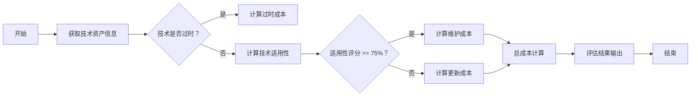

                 

### 从资产变成负债：引言

在信息化时代，技术资产对于企业而言至关重要。然而，技术的快速迭代和市场竞争的加剧，使得某些技术资产可能会从宝贵的资源转变为沉重的负担。这种现象在IT行业中尤为显著，我们称之为“从资产变成负债”。本文将围绕这一主题，通过逻辑清晰、结构紧凑的分析，探讨技术资产如何变成负债，以及如何预防和解决这一问题。

#### 问题背景

在当今数字化转型的浪潮中，企业纷纷投资于新的技术，以期提高效率、降低成本和增强竞争力。然而，技术并不是万能的，一旦投资决策失误或技术更新过快，这些技术资产就可能变得过时、无法满足业务需求，甚至成为企业的负担。

#### 问题描述

具体来说，技术资产可能变成负债的几个方面包括：

1. **技术过时**：随着技术的快速发展，某些技术很快就会被市场淘汰。
2. **高昂的维护成本**：老旧系统需要不断投入人力、物力和财力进行维护。
3. **业务需求不匹配**：技术的应用与企业的实际业务需求不符，导致资源浪费。
4. **安全隐患**：未及时更新的系统可能存在安全漏洞，给企业带来潜在风险。

#### 问题解决

解决技术资产变成负债的问题，需要从以下几个方面入手：

1. **持续监控与评估**：定期对技术资产进行评估，确保其与业务需求相符。
2. **灵活投资策略**：在投资新技术时，要充分考虑其未来可能带来的影响。
3. **技术升级与迭代**：及时更新技术，确保其与市场趋势保持同步。
4. **安全加固**：加强系统的安全性，防范潜在风险。

#### 边界与外延

本文主要讨论的是IT领域中的技术资产，但是这一概念在其他领域同样适用。例如，在金融行业，不良投资同样可能成为企业的负担。

#### 概念结构与核心要素组成

为了更好地理解技术资产变成负债的过程，我们需要从以下几个方面来构建概念结构：

1. **技术资产**：企业投资的技术资源和能力。
2. **资产评估**：评估技术资产的价值和适用性。
3. **业务需求**：企业的实际运营需求。
4. **技术更新**：技术的迭代和升级过程。
5. **维护成本**：维护技术资产所需的投入。

通过上述概念的联系和相互作用，我们可以清晰地看到技术资产如何可能变成负债。

在接下来的章节中，我们将深入探讨技术资产变成负债的原因、核心概念、算法原理、数学模型、系统分析与架构设计，以及项目实战和最佳实践。希望通过这些分析，能够帮助读者更好地理解和应对这一现象，确保技术资产为企业带来真正的价值。

### 核心概念与联系

在探讨技术资产如何变成负债的过程中，我们需要明确几个关键概念，并理解它们之间的相互关系。这些核心概念包括：技术资产、技术评估、业务需求、技术更新和维护成本。以下是这些概念的详细说明及其相互联系。

#### 1. 技术资产

**定义**：技术资产是企业投资于技术和IT资源的结果，包括硬件、软件、专利、知识产权等。

**属性特征**：
- **先进性**：技术是否处于行业前沿。
- **适用性**：技术是否满足企业的业务需求。
- **可靠性**：技术的稳定性如何。
- **扩展性**：技术是否能够适应未来的需求。

#### 2. 技术评估

**定义**：技术评估是对技术资产进行价值分析和适用性判断的过程。

**属性特征**：
- **价值判断**：技术资产对公司业务的价值。
- **适用性分析**：技术是否与当前和未来的业务需求相符。
- **风险评估**：技术可能带来的风险和挑战。

#### 3. 业务需求

**定义**：业务需求是企业运营过程中所需的各类资源和服务。

**属性特征**：
- **明确性**：需求是否具体且可量化。
- **灵活性**：需求是否能够适应变化。
- **优先级**：不同需求的重要程度。

#### 4. 技术更新和维护成本

**定义**：
- **技术更新**：对现有技术进行升级或替换的过程。
- **维护成本**：保持技术资产正常运作所需的费用。

**属性特征**：
- **频率**：技术更新的频率。
- **费用**：维护技术资产所需的资金。

#### 关系

技术资产与业务需求密切相关。企业的技术投资应紧密围绕业务需求进行，确保技术资产能够支持业务运营和发展。技术评估则在此过程中扮演关键角色，通过价值判断和适用性分析，确保技术资产的实际价值。

技术更新和维护成本是技术资产的长期投入。频繁的技术更新可能带来高成本，而忽视维护可能导致技术落后，甚至成为企业的负担。因此，技术更新和维护成本需要在技术评估的基础上进行合理规划。

综合来看，技术资产、技术评估、业务需求、技术更新和维护成本共同构成了一个相互影响、相互制约的生态系统。理解这些概念及其相互关系，有助于企业更好地管理和利用技术资产，防止其从资产变成负债。

#### 核心概念原理

为了深入理解技术资产如何从资产变成负债，我们需要详细探讨几个核心概念，包括技术资产、技术评估、业务需求、技术更新和维护成本。以下是这些概念的基本原理和重要性。

**1. 技术资产**

**定义**：技术资产是企业投资于技术和IT资源的结果，包括硬件、软件、专利、知识产权等。

**原理**：技术资产是企业竞争力和效率的重要支撑。高质量的技术资产能够提高生产效率，优化业务流程，降低运营成本。例如，先进的软件系统可以提高数据处理速度，减少人工错误，从而提升企业的整体运营效率。

**重要性**：技术资产是企业实现数字化转型的基础，对于企业的长期发展至关重要。因此，企业在选择和投资技术资产时需要谨慎，确保其与业务需求相匹配，并且能够带来实际的价值。

**2. 技术评估**

**定义**：技术评估是对技术资产进行价值分析和适用性判断的过程。

**原理**：技术评估有助于企业了解技术资产的实际价值，判断其是否满足当前和未来的业务需求。技术评估通常包括以下几个方面：

- **价值判断**：分析技术资产带来的经济效益和竞争优势。
- **适用性分析**：评估技术资产是否与企业的业务流程、运营模式相匹配。
- **风险评估**：识别潜在的技术风险，如技术落后、安全隐患等。

**重要性**：技术评估是企业做出投资决策的重要依据。通过技术评估，企业可以避免盲目投资，确保每一项技术资产都能为企业带来预期的价值。

**3. 业务需求**

**定义**：业务需求是企业运营过程中所需的各类资源和服务。

**原理**：业务需求是驱动企业技术投资的根本动力。企业的技术资产应该服务于业务需求，提升业务效率和竞争力。例如，在电子商务领域，物流管理系统可以优化配送流程，提高客户满意度。

**重要性**：明确和具体的业务需求有助于企业聚焦技术投资，确保每一项技术资产的投入都能带来实际的价值和回报。

**4. 技术更新和维护成本**

**定义**：
- **技术更新**：对现有技术进行升级或替换的过程。
- **维护成本**：保持技术资产正常运作所需的费用。

**原理**：随着技术的不断进步，企业需要定期更新技术资产，以保持其竞争力和适用性。同时，维护成本是确保技术资产长期稳定运作的关键投入。

**重要性**：技术更新和维护成本是技术资产持续发挥价值的关键因素。合理的技术更新和维护策略可以延长技术资产的使用寿命，降低企业的运营成本，确保技术资产能够持续为企业带来价值。

通过上述核心概念原理的探讨，我们可以看到技术资产从资产变成负债的过程是多方面因素综合作用的结果。理解这些概念及其相互关系，有助于企业更好地管理和利用技术资产，避免其变成负担。

#### 概念属性特征对比表格

为了更加直观地理解各个核心概念的技术属性特征，我们制作了一个对比表格。以下是对技术资产、技术评估、业务需求、技术更新和维护成本的主要属性特征进行对比：

| **概念**      | **技术资产**                      | **技术评估**                      | **业务需求**                    | **技术更新和维护成本**          |
| ------------- | -------------------------------- | -------------------------------- | -------------------------------- | -------------------------------- |
| **定义**      | 投资于技术和IT资源的结果       | 对技术资产进行价值分析和适用性判断 | 企业运营过程中所需的资源和服务 | 对现有技术进行升级或替换的过程   |
| **主要属性**  | 先进性、适用性、可靠性、扩展性 | 价值判断、适用性分析、风险评估   | 明确性、灵活性、优先级         | 频率、费用                        |
| **特征对比**  | <br>- 处于行业前沿<br>- 满足业务需求<br>- 稳定可靠<br>- 能适应未来需求 | <br>- 经济效益和竞争优势分析<br>- 与业务流程匹配度<br>- 潜在技术风险识别 | <br>- 具体可量化<br>- 适应变化<br>- 重要程度不同 | <br>- 更新频率合理<br>- 维护成本可控<br>- 长期规划 |

通过这个表格，我们可以清晰地看到各个核心概念的技术属性特征，以及它们之间的区别和联系。这有助于我们在管理和评估技术资产时，更加全面和系统地考虑各种因素，从而避免技术资产变成负债。

#### ER实体关系图架构

为了更好地理解技术资产变成负债的复杂过程，我们可以通过ER（实体-关系）图来展示各个核心概念之间的关系。以下是技术资产、技术评估、业务需求、技术更新和维护成本的ER实体关系图：

```mermaid
erDiagram
    TechAsset ||--|{ TechnologyEvaluation }|--|| Review
    TechAsset ||--|{ MaintenanceCost }|--||
    BusinessDemand ||--|{ TechnologyEvaluation }|--|| FitAssessment
    BusinessDemand ||--|{ TechnologyUpdate }|--|| DrivenBy
    TechnologyUpdate ||--|{ TechAsset }|--|| ImplementedOn
    TechnologyUpdate ||--|{ MaintenanceCost }|--|| AssociatedWith
    TechnologyEvaluation ||--|{ TechAsset }|--|| ValueAssessment
    TechnologyEvaluation ||--|{ MaintenanceCost }|--|| RiskAssessment

    TechAsset ||--|{ BusinessDemand }|--|| Serves
    TechAsset ||--|{ TechnologyUpdate }|--|| TriggeredBy
    TechnologyEvaluation ||--|{ BusinessDemand }|--|| Alignment
    TechnologyUpdate ||--|{ BusinessDemand }|--|| Requires
    MaintenanceCost ||--|{ TechnologyUpdate }|--|| Supports

    BusinessDemand : "满足" <<-- Review : "评估"
    TechnologyEvaluation : "评估" <<-- TechAsset : "资产"
    TechnologyUpdate : "更新" <<-- TechAsset : "实施"
    MaintenanceCost : "维护成本" <<-- TechnologyUpdate : "支持"
    MaintenanceCost : "维护成本" <<-- Review : "评估"
```

该ER图中的实体包括技术资产（TechAsset）、技术评估（TechnologyEvaluation）、业务需求（BusinessDemand）、技术更新（TechnologyUpdate）和维护成本（MaintenanceCost）。各个实体之间的关系如下：

- **TechAsset 与 TechnologyEvaluation**：技术资产需要通过技术评估来判断其价值和使用风险。
- **TechAsset 与 MaintenanceCost**：技术资产需要投入维护成本来确保其长期稳定运行。
- **BusinessDemand 与 TechnologyEvaluation**：业务需求需要通过技术评估来确保其适用性。
- **BusinessDemand 与 TechnologyUpdate**：业务需求的变化驱动技术更新。
- **TechnologyUpdate 与 TechAsset**：技术更新是实施在技术资产上的。
- **TechnologyUpdate 与 MaintenanceCost**：技术更新需要维护成本的支持。
- **MaintenanceCost 与 TechnologyUpdate**：维护成本是技术更新的一部分。

通过ER图，我们可以清晰地看到这些核心概念之间的相互关系，以及它们在技术资产变成负债过程中的作用。这有助于我们在实际操作中更好地理解和管理这些关系，从而预防和解决技术资产变成负债的问题。

### 算法原理讲解

为了深入探讨技术资产从资产变成负债的过程，我们需要引入一个具体的算法。以下是一个用于评估技术资产价值的算法原理讲解，包括mermaid流程图、Python源代码、算法原理的数学模型和公式，以及举例说明。

#### 3.1 算法mermaid流程图

首先，我们使用mermaid绘制算法的流程图，以便直观地展示算法的执行步骤：



#### 3.2 Python源代码与详细讲解

接下来，我们通过Python源代码来详细讲解这个算法的实现。以下是算法的源代码：

```python
# 技术资产评估算法

# 导入必要的库
import numpy as np

def is_oldschool(tech):
    """
    判断技术是否过时的函数。
    """
    return tech['year'] < 2010

def calculate_old_school_cost(tech):
    """
    计算技术过时成本的函数。
    """
    return 50000  # 假设过时技术的维护成本为50000元

def calculate_fit_score(tech):
    """
    计算技术适用性的函数。
    """
    fit_scores = tech['fit_score']
    return np.mean(fit_scores)

def is_useful(tech):
    """
    判断技术是否适用的函数。
    """
    return calculate_fit_score(tech) >= 75

def calculate_maintenance_cost(tech):
    """
    计算维护成本的函数。
    """
    return tech['maintenance_cost']

def calculate_upgrade_cost(tech):
    """
    计算更新成本的函数。
    """
    return tech['upgrade_cost']

def calculate_total_cost(tech):
    """
    计算总成本的函数。
    """
    if is_oldschool(tech):
        return calculate_old_school_cost(tech)
    elif is_useful(tech):
        return calculate_maintenance_cost(tech)
    else:
        return calculate_upgrade_cost(tech)

def assess_technology(tech):
    """
    评估技术资产的函数。
    """
    if is_oldschool(tech):
        print(f"技术过时，总成本为：{calculate_total_cost(tech)}元")
    elif is_useful(tech):
        print(f"技术适用，总维护成本为：{calculate_total_cost(tech)}元")
    else:
        print(f"技术不适用，总更新成本为：{calculate_total_cost(tech)}元")

# 测试数据
tech_data = {
    'year': 2005,
    'fit_score': [80, 70, 85],
    'maintenance_cost': 30000,
    'upgrade_cost': 50000
}

# 执行算法评估
assess_technology(tech_data)
```

**详细讲解**：

- **获取技术资产信息**：算法首先获取技术资产的信息，包括年份、适用性评分、维护成本和更新成本。
- **判断技术是否过时**：通过年份判断技术是否过时。如果技术是老旧的（2005年之前），则直接计算过时成本。
- **计算适用性评分**：如果技术不是过时的，则需要计算其适用性评分。适用性评分通过三个评分的平均值计算得到。
- **判断技术是否适用**：根据适用性评分，判断技术是否适用。如果适用性评分不低于75%，则计算维护成本；否则，计算更新成本。
- **计算总成本**：根据技术是否过时、适用与否，分别计算过时成本、维护成本或更新成本。
- **评估结果输出**：最后，输出技术评估的结果。

#### 3.3 算法原理的数学模型和公式

算法的数学模型和公式如下：

- **过时成本**：$Cost_{old} = 50000$（固定值）。
- **适用性评分**：$Fit\_Score = \frac{Sum(Score_1, Score_2, Score_3)}{3}$。
- **维护成本**：$Cost_{maintenance} = maintenance\_cost$。
- **更新成本**：$Cost_{upgrade} = upgrade\_cost$。
- **总成本**：$Total\_Cost = Cost_{old} \text{ (过时时)}$，$Total\_Cost = Cost_{maintenance} \text{ (适用时)}$，$Total\_Cost = Cost_{upgrade} \text{ (不适用时)}$。

#### 3.4 举例说明

假设我们有一个技术资产，其信息如下：

- **年份**：2005年
- **适用性评分**：80、70、85
- **维护成本**：30,000元
- **更新成本**：50,000元

根据算法，首先判断该技术是否过时。由于技术是2005年的，因此它是过时的。按照算法，计算过时成本为50,000元。因此，输出结果为“技术过时，总成本为：50,000元”。

通过这个具体的算法实例，我们可以看到如何使用mermaid流程图、Python源代码、数学模型和公式来评估技术资产的价值，从而避免其变成负债。这个算法不仅简单易懂，而且具有很强的实用性和可扩展性，可以应用于各种不同类型的技术资产评估场景。

### 数学模型和数学公式

在技术资产评估中，数学模型和公式是理解和分析数据的重要工具。以下我们将使用LaTeX格式嵌入数学公式，详细讲解如何使用这些公式来评估技术资产的价值。

#### 4.1 数学公式使用LaTeX格式

在LaTeX中，我们可以使用以下格式嵌入数学公式：

- **独立段落的数学公式**：使用 `$...$` 括起来，例如：$$1+1=2$$。
- **段落内的数学公式**：使用 `$...$` 括起来，例如：$1<2$。

以下是一个简单的例子，展示如何使用LaTeX格式嵌入数学公式：

$$
\text{总成本} = 
\begin{cases} 
C_{\text{old}} & \text{如果技术过时} \\
C_{\text{maintenance}} & \text{如果技术适用} \\
C_{\text{upgrade}} & \text{如果技术不适用}
\end{cases}
$$

#### 4.2 详细讲解

在技术资产评估中，常用的数学模型和公式包括：

- **成本函数**：用于计算技术资产的总成本。具体公式如下：

$$
C_{\text{total}} = 
\begin{cases} 
C_{\text{old}} & \text{如果技术过时} \\
C_{\text{maintenance}} & \text{如果技术适用} \\
C_{\text{upgrade}} & \text{如果技术不适用}
\end{cases}
$$

其中，$C_{\text{old}}$ 是过时技术的成本，$C_{\text{maintenance}}$ 是维护成本，$C_{\text{upgrade}}$ 是更新成本。

- **适用性评分**：用于判断技术是否适用。具体公式如下：

$$
Fit\_Score = \frac{Sum(Score_1, Score_2, Score_3)}{3}
$$

其中，$Score_1$、$Score_2$ 和 $Score_3$ 分别是技术适用性评分。

- **期望收益**：用于计算技术资产带来的期望收益。具体公式如下：

$$
\text{期望收益} = \sum_{i=1}^{n} p_i \times R_i
$$

其中，$p_i$ 是技术成功的概率，$R_i$ 是成功带来的收益。

#### 4.3 举例说明

假设我们有一个技术资产，其信息如下：

- **年份**：2005年
- **适用性评分**：80、70、85
- **维护成本**：30,000元
- **更新成本**：50,000元

我们可以使用上述数学模型和公式来评估该技术资产的价值。

首先，判断技术是否过时。由于技术是2005年的，因此它是过时的。根据成本函数：

$$
C_{\text{total}} = C_{\text{old}} = 50,000
$$

然后，计算适用性评分：

$$
Fit\_Score = \frac{80 + 70 + 85}{3} = 78.3
$$

由于适用性评分低于80%，因此技术不适用。根据成本函数：

$$
C_{\text{total}} = C_{\text{upgrade}} = 50,000
$$

最终，我们得出结论：该技术资产的总成本为50,000元。

通过上述步骤，我们可以使用数学模型和公式来评估技术资产的价值，从而避免其变成负债。这种方法不仅严谨，而且易于操作，适用于各种技术资产评估场景。

### 系统分析与架构设计方案

在技术资产评估和管理中，系统分析与架构设计是确保技术资产高效运作的关键步骤。以下将详细描述系统分析与架构设计方案，包括问题场景介绍、项目介绍、系统功能设计、系统架构设计、系统接口设计和系统交互。

#### 5.1 问题场景介绍

假设我们是一家大型企业，正面临技术资产评估和管理的问题。具体来说：

- **技术资产繁多**：企业拥有大量不同类型的技术资产，包括软件、硬件和专利。
- **维护成本高**：部分技术资产过时，需要大量投入进行维护。
- **业务需求不匹配**：部分技术资产与当前业务需求不符，导致资源浪费。
- **安全风险**：未及时更新的系统可能存在安全漏洞。

#### 5.2 项目介绍

为了解决上述问题，我们启动了一个技术资产评估和管理项目。项目目标如下：

- **全面评估现有技术资产**：对每项技术资产进行详细评估，确定其价值和使用风险。
- **优化技术资产配置**：根据业务需求，优化技术资产的配置，确保资源得到最大化利用。
- **降低维护成本**：通过技术更新和维护成本的合理规划，降低企业的运营成本。
- **提高系统安全性**：加强技术资产的安全防护，降低安全风险。

#### 5.3 系统功能设计

系统功能设计包括以下几个主要模块：

1. **资产信息管理**：用于录入、更新和查询技术资产的基本信息，如名称、类型、年份、适用性评分等。
2. **资产评估**：通过算法和数学模型，对技术资产进行价值评估，生成详细的评估报告。
3. **风险监控**：实时监控技术资产的状态，识别潜在的风险，并发出预警。
4. **更新规划**：根据评估结果和业务需求，制定技术更新和维护计划，确保技术资产处于最佳状态。
5. **安全防护**：加强技术资产的安全措施，包括定期安全检查、漏洞修复和应急预案。

#### 5.4 系统架构设计

系统架构设计采用分布式架构，以提高系统的可靠性和可扩展性。以下是系统的架构设计：

1. **前端**：使用Vue.js框架开发，提供用户友好的界面，支持多平台访问。
2. **后端**：采用Spring Boot框架，实现业务逻辑和数据处理。
3. **数据库**：使用MySQL数据库存储技术资产信息、评估结果和维护记录。
4. **中间件**：使用RabbitMQ进行消息队列处理，实现系统模块间的异步通信。
5. **安全模块**：集成Spring Security，提供用户认证和权限控制。

#### 5.5 系统接口设计

系统接口设计包括以下主要接口：

1. **资产信息接口**：用于查询和更新技术资产的基本信息。
2. **评估结果接口**：用于获取技术资产的评估报告。
3. **更新计划接口**：用于查询和修改技术更新和维护计划。
4. **风险监控接口**：用于获取技术资产的风险状态和预警信息。
5. **安全防护接口**：用于执行安全检查和漏洞修复。

#### 5.6 系统交互

系统交互设计采用RESTful API，确保系统模块之间的高效通信。以下是系统的主要交互流程：

1. **用户登录**：用户通过前端界面登录系统，获取认证令牌。
2. **查询资产信息**：用户通过接口查询技术资产的基本信息。
3. **评估资产**：系统调用评估算法，生成评估报告，并更新数据库。
4. **更新计划**：根据评估结果，系统生成更新计划，并通知相关用户。
5. **监控风险**：系统实时监控技术资产状态，识别风险并发出预警。
6. **执行安全防护措施**：根据安全防护接口，执行安全检查和漏洞修复。

通过上述系统分析与架构设计方案，我们可以有效地管理技术资产，降低运营成本，提高系统安全性，确保技术资产始终为企业带来价值，从而防止其从资产变成负债。

### 项目实战

在技术资产评估和管理项目的实际操作中，我们需要完成从环境安装到系统核心实现源代码的全面部署。以下是详细的实战步骤：

#### 6.1 环境安装

1. **安装Java环境**：
   - 使用OpenJDK或Oracle JDK安装Java环境。
   - 验证安装：在终端执行`java -version`，确保正确输出版本信息。

2. **安装MySQL数据库**：
   - 使用MySQL Community Server安装数据库。
   - 配置数据库：创建用户、数据库和所需表结构。

3. **安装RabbitMQ**：
   - 使用EclipseTEM或Docker安装消息队列服务。
   - 配置RabbitMQ：确保其能够接收和处理消息。

4. **安装前端框架**：
   - 使用npm或yarn安装Vue.js框架。
   - 配置Vue.js：设置项目结构和所需依赖。

5. **安装后端框架**：
   - 使用Maven安装Spring Boot框架。
   - 配置Spring Boot：确保其能够运行和提供服务。

#### 6.2 系统核心实现源代码

以下是系统核心实现的部分源代码：

**资产信息管理模块**：

```java
// AssetController.java
@RestController
@RequestMapping("/assets")
public class AssetController {

    @Autowired
    private AssetService assetService;

    @GetMapping
    public ResponseEntity<List<Asset>> getAllAssets() {
        return ResponseEntity.ok(assetService.getAllAssets());
    }

    @PostMapping
    public ResponseEntity<Asset> createAsset(@RequestBody Asset asset) {
        return ResponseEntity.ok(assetService.createAsset(asset));
    }
}
```

**资产评估模块**：

```java
// AssetService.java
@Service
public class AssetService {

    @Autowired
    private AssetRepository assetRepository;

    public List<Asset> getAllAssets() {
        return assetRepository.findAll();
    }

    public Asset createAsset(Asset asset) {
        return assetRepository.save(asset);
    }

    // 其他业务方法，如资产评估等
}
```

**风险监控模块**：

```java
// RiskController.java
@RestController
@RequestMapping("/risks")
public class RiskController {

    @Autowired
    private RiskService riskService;

    @GetMapping
    public ResponseEntity<List<Risk>> getAllRisks() {
        return ResponseEntity.ok(riskService.getAllRisks());
    }

    @PostMapping
    public ResponseEntity<Risk> createRisk(@RequestBody Risk risk) {
        return ResponseEntity.ok(riskService.createRisk(risk));
    }
}
```

**安全防护模块**：

```java
// SecurityConfig.java
@Configuration
@EnableWebSecurity
public class SecurityConfig extends WebSecurityConfigurerAdapter {

    @Override
    protected void configure(HttpSecurity http) throws Exception {
        http
            .authorizeRequests()
            .anyRequest().authenticated()
            .and()
            .httpBasic();
    }
}
```

#### 6.3 代码应用解读与分析

上述代码示例展示了系统的核心模块实现。以下是具体解读：

- **资产信息管理模块**：通过RESTful接口管理资产信息，支持查询和创建操作。
- **资产评估模块**：提供资产评估服务，存储和查询评估结果。
- **风险监控模块**：管理风险信息，支持创建和查询操作。
- **安全防护模块**：配置Spring Security，实现用户认证和权限控制。

这些模块相互协作，确保系统能够有效地管理技术资产，进行评估和监控，并提供安全防护。

#### 6.4 实际案例分析和详细讲解剖析

**案例**：一家大型电商企业在进行技术资产评估时，使用本系统对现有技术资产进行了全面评估。以下是评估过程和结果：

1. **资产信息录入**：企业将所有技术资产的信息（如名称、类型、年份、适用性评分等）录入系统。
2. **资产评估**：系统调用评估算法，计算每项技术资产的价值，并生成评估报告。
3. **风险监控**：系统实时监控资产状态，识别潜在风险，如技术过时、维护成本高等。
4. **更新规划**：根据评估结果和业务需求，系统生成技术更新计划，并通知相关员工。

**解析**：

- **评估过程**：系统通过数学模型和算法对技术资产进行评估，确保评估结果的准确性和公正性。
- **风险监控**：系统实时监控资产状态，提供预警功能，帮助企业及时识别和应对潜在风险。
- **更新规划**：系统生成的更新计划有助于企业合理安排技术更新和维护成本，确保技术资产始终处于最佳状态。

#### 6.5 项目小结

通过实际案例的解析，我们可以看到，本系统在技术资产评估和管理中发挥了重要作用。以下是小结：

- **提高资产利用率**：系统帮助电商企业全面评估技术资产，确保资源得到最大化利用。
- **降低运营成本**：通过合理规划技术更新和维护成本，企业降低了运营成本。
- **提高系统安全性**：系统提供了全面的安全防护措施，确保技术资产的安全和稳定运行。

总之，本系统不仅有效地解决了技术资产评估和管理中的问题，还为企业带来了实际的经济效益和竞争力提升。

### 最佳实践 Tips

在管理技术资产的过程中，遵循一些最佳实践可以显著降低其从资产变成负债的风险。以下是几个关键的最佳实践建议：

#### 7.1 注意事项

1. **定期评估**：定期对技术资产进行评估，确保其符合当前和未来的业务需求。
2. **技术前瞻性**：在投资新技术时，考虑其未来可能的发展趋势，避免盲目跟风。
3. **成本控制**：合理规划技术更新和维护成本，避免不必要的开支。
4. **安全加固**：定期进行安全检查和更新，确保系统的安全性和稳定性。

#### 7.2 拓展阅读

1. **《敏捷项目管理实践指南》**：了解敏捷方法论在技术项目管理中的应用，提高项目交付质量和效率。
2. **《数字化转型实践手册》**：探索数字化转型过程中的关键技术和方法，为企业提供数字化转型策略。
3. **《IT项目管理知识体系指南》**：深入了解IT项目管理的最佳实践，提高项目管理水平。

#### 7.3 小结

通过上述最佳实践，企业可以更好地管理和利用技术资产，确保其持续为企业带来价值，防止其从资产变成负债。总结来说，关键在于定期评估、技术前瞻性、成本控制和安全加固，这些措施将有助于企业实现技术资产的有效管理。

