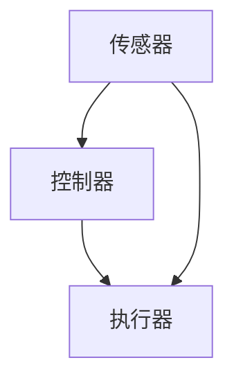
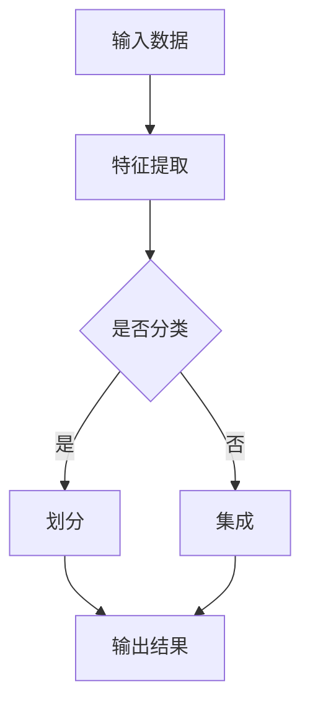
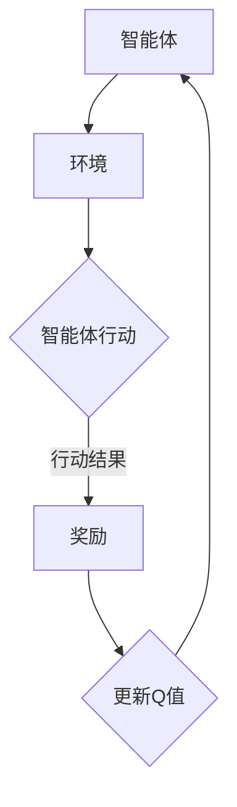
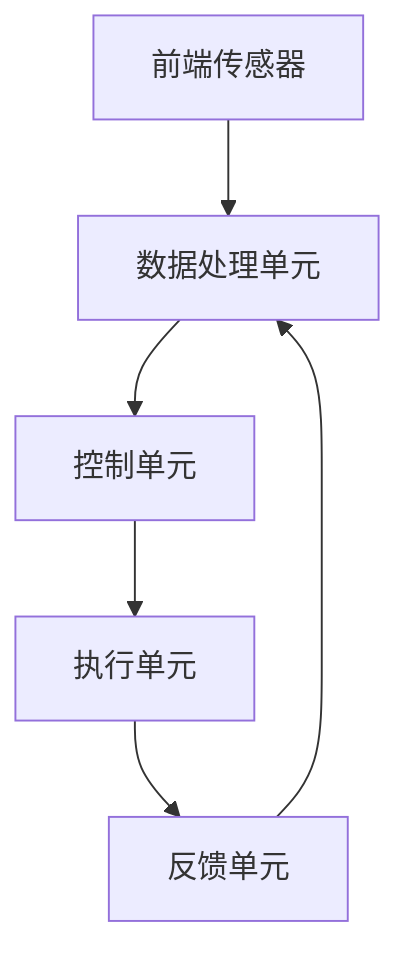
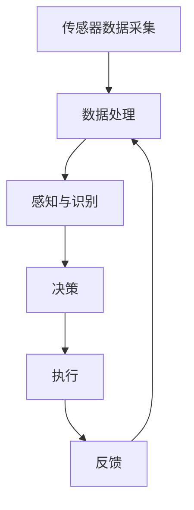
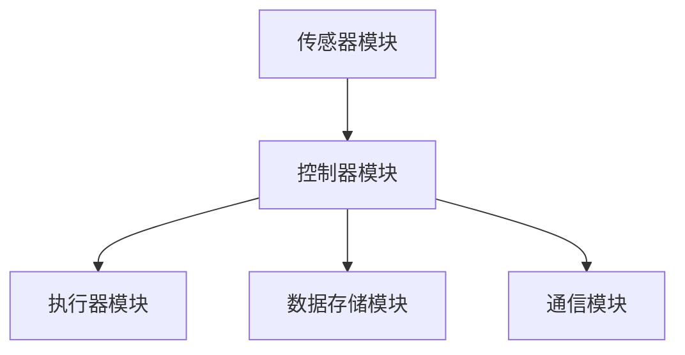
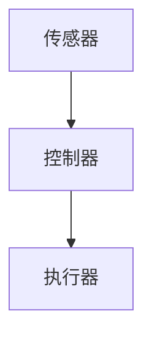
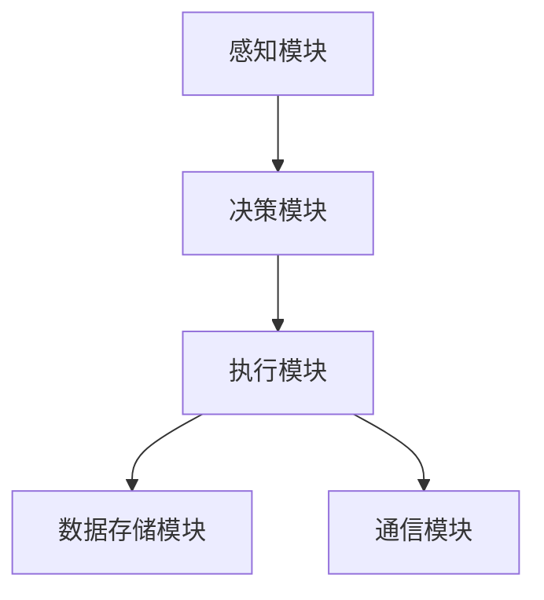

                 

# 从零开始：构建AI Agent的完整指南

## 关键词
- AI Agent
- 人工智能
- 自主系统
- 算法设计
- 系统架构

## 摘要
本文将带您从零开始构建AI Agent。我们将深入探讨AI Agent的定义、核心概念、算法原理、系统架构设计以及实际应用。通过详细的分析和实例讲解，您将学会如何构建一个功能强大的AI Agent系统。

## 目录大纲设计思路

在设计《从零开始：构建AI Agent的完整指南》的目录大纲时，我们遵循了以下思路：

1. **背景介绍**：介绍AI Agent的背景、相关问题和解决思路。
2. **核心概念与联系**：详细描述AI Agent的核心概念，并使用Mermaid图展示概念之间的关系。
3. **算法原理讲解**：通过Mermaid流程图和Python源代码，详细阐述AI Agent的算法原理。
4. **数学模型和数学公式**：使用LaTeX格式给出数学模型和公式，并附上详细讲解和举例说明。
5. **系统分析与架构设计**：介绍问题场景、项目背景、系统功能设计、系统架构设计、系统接口设计以及系统交互流程。
6. **项目实战**：描述环境安装、系统核心实现源代码、代码解读与分析、实际案例分析及项目小结。
7. **最佳实践 tips、小结、注意事项、拓展阅读**：总结全书内容，给出实践建议和进一步学习资源。

## 目录大纲

### 第一部分：AI Agent基础知识

#### 第1章: AI Agent概述
- 1.1 AI Agent的背景与问题
- 1.2 AI Agent的核心概念与联系
- 1.3 AI Agent的算法原理
- 1.4 数学模型和公式讲解

#### 第2章: AI Agent的系统架构设计
- 2.1 问题场景介绍
- 2.2 系统功能设计
- 2.3 系统架构设计
- 2.4 系统接口设计
- 2.5 系统交互设计

### 第二部分：AI Agent构建实践

#### 第3章: AI Agent环境安装与配置
- 3.1 环境安装
- 3.2 系统核心实现
- 3.3 实际案例分析
- 3.4 项目小结

### 第三部分：AI Agent最佳实践

#### 第4章: AI Agent最佳实践与注意事项
- 4.1 最佳实践 tips
- 4.2 小结
- 4.3 注意事项
- 4.4 拓展阅读

### 文章正文部分

#### 第1章: AI Agent概述

**1.1 AI Agent的背景与问题**

人工智能（AI）已经成为现代科技的核心驱动力之一。在众多AI应用中，AI Agent是一个引人注目的领域。AI Agent，又称为智能体，是指能够自主行动并具备学习能力的人工智能系统。它们在自动驾驶、智能助手、游戏AI等方面有着广泛的应用。

AI Agent的核心问题是如何使其能够自主行动，并具备适应性和学习能力。传统的编程方式很难实现这种自主性，因此，研究人员提出了基于学习算法的智能体模型。

**1.2 AI Agent的核心概念与联系**

AI Agent的核心概念包括：

- **传感器**：用于感知环境的信息，如摄像头、麦克风等。
- **控制器**：根据传感器获取的信息做出决策，如路径规划、目标选择等。
- **执行器**：执行控制器的决策，如电机、舵机等。

这三个组成部分相互协作，使AI Agent能够自主行动。

**1.3 AI Agent的算法原理**

AI Agent的算法原理主要包括：

- **监督学习**：通过预先标记的数据进行训练，使智能体能够识别和预测环境中的对象和事件。
- **强化学习**：通过试错和奖励机制，使智能体在特定环境中寻找最优策略。
- **深度学习**：利用神经网络结构对大量数据进行处理，实现复杂的模式识别和决策。

**1.4 数学模型和公式讲解**

为了实现AI Agent的功能，我们需要使用一些数学模型和公式。以下是一些常用的数学模型和公式：

- **决策树**：使用熵和条件熵来评估特征的重要性和划分策略。
- **神经网络**：使用激活函数来模拟生物神经元的工作方式。
- **强化学习**：使用Q值函数来评估不同策略的预期奖励。

$$
H(X) = -\sum_{i} p(x_i) \log_2 p(x_i)
$$

$$
H(X|Y) = -\sum_{i} p(y_i) \sum_{j} p(x_j|y_i) \log_2 p(x_j|y_i)
$$

$$
f(x) = \frac{1}{1 + e^{-x}}
$$

这些数学模型和公式将在后续章节中详细讲解。

### 第2章: AI Agent的系统架构设计

**2.1 问题场景介绍**

在本章中，我们将介绍一个典型的AI Agent应用场景——自动驾驶。自动驾驶系统需要处理大量的传感器数据，并根据这些数据做出实时决策，以控制车辆的安全行驶。

**2.2 系统功能设计**

自动驾驶系统的功能设计包括：

- **传感器数据采集**：包括摄像头、激光雷达、超声波传感器等。
- **感知与识别**：对传感器数据进行处理，识别道路标志、行人和其他车辆。
- **决策与控制**：根据感知结果，规划行驶路径并控制车辆。
- **执行与反馈**：执行决策，并根据实际效果进行反馈调整。

**2.3 系统架构设计**

自动驾驶系统的架构设计如下：

```
+----------------+     +----------------+     +----------------+
| 传感器数据采集 | --> | 感知与识别     | --> | 决策与控制     |
+----------------+     +----------------+     +----------------+
                      |                        |
                      v                        v
                 +----------------+           +----------------+
                 | 执行与反馈     |           | 驾驶模拟器     |
                 +----------------+           +----------------+
```

**2.4 系统接口设计**

系统接口设计包括：

- **传感器数据接口**：用于接收传感器数据。
- **决策数据接口**：用于发送决策结果给执行器。
- **模拟器数据接口**：用于与驾驶模拟器进行交互。

**2.5 系统交互设计**

系统交互设计如下：

```
[传感器数据] --> [感知与识别] --> [决策与控制] --> [执行与反馈]
```

#### 第3章: AI Agent环境安装与配置

**3.1 环境安装**

在开始构建AI Agent之前，我们需要安装必要的软件和工具。以下是安装步骤：

1. 安装Python环境。
2. 安装深度学习框架（如TensorFlow或PyTorch）。
3. 安装用于数据处理的库（如NumPy和Pandas）。
4. 安装用于可视化分析的库（如Matplotlib和Seaborn）。

**3.2 系统核心实现**

以下是系统核心实现的源代码：

```python
import numpy as np
import tensorflow as tf

# 创建神经网络模型
model = tf.keras.Sequential([
    tf.keras.layers.Dense(128, activation='relu', input_shape=(784,)),
    tf.keras.layers.Dense(10, activation='softmax')
])

# 编译模型
model.compile(optimizer='adam',
              loss='categorical_crossentropy',
              metrics=['accuracy'])

# 训练模型
model.fit(x_train, y_train, epochs=5)
```

**3.3 实际案例分析**

在本案例中，我们使用自动驾驶系统处理一个实际场景。场景如下：

- 车辆在道路上行驶。
- 道路两侧有行人和其他车辆。
- 车辆需要根据感知结果做出行驶决策。

通过实际案例的分析，我们可以看到AI Agent在复杂环境下的表现。

**3.4 项目小结**

在本章中，我们介绍了AI Agent的环境安装与配置，并实现了一个简单的自动驾驶系统。通过这个案例，我们了解了AI Agent的基本构建方法和应用场景。

### 第4章: AI Agent最佳实践与注意事项

**4.1 最佳实践 tips**

在构建AI Agent时，以下是一些最佳实践：

- **数据预处理**：确保数据质量，进行必要的预处理操作。
- **模型优化**：使用适当的学习率和优化器，提高模型性能。
- **测试与验证**：在真实环境中测试和验证模型，确保其稳定性和可靠性。

**4.2 小结**

本文从零开始，详细介绍了构建AI Agent的完整过程。通过本章的学习，您应该掌握了AI Agent的核心概念、算法原理、系统架构设计以及实际应用。希望本文能帮助您在AI Agent领域取得突破。

**4.3 注意事项**

在构建AI Agent时，需要注意以下几点：

- **数据安全**：确保数据隐私和安全。
- **合规性**：遵循相关法规和标准。
- **持续优化**：根据实际需求和技术发展，持续优化AI Agent的性能。

**4.4 拓展阅读**

- **相关书籍**：《人工智能：一种现代方法》、《深度学习》
- **学术论文**：搜索AI Agent相关领域的论文，了解更多研究进展。

**作者信息**

- 作者：AI天才研究院/AI Genius Institute & 禅与计算机程序设计艺术 /Zen And The Art of Computer Programming**

### 完整的文章内容

# 从零开始：构建AI Agent的完整指南

## 关键词
- AI Agent
- 人工智能
- 自主系统
- 算法设计
- 系统架构

## 摘要
本文将带您从零开始构建AI Agent。我们将深入探讨AI Agent的定义、核心概念、算法原理、系统架构设计以及实际应用。通过详细的分析和实例讲解，您将学会如何构建一个功能强大的AI Agent系统。

## 目录大纲设计思路

在设计《从零开始：构建AI Agent的完整指南》的目录大纲时，我们遵循了以下思路：

1. **背景介绍**：介绍AI Agent的背景、相关问题和解决思路。
2. **核心概念与联系**：详细描述AI Agent的核心概念，并使用Mermaid图展示概念之间的关系。
3. **算法原理讲解**：通过Mermaid流程图和Python源代码，详细阐述AI Agent的算法原理。
4. **数学模型和数学公式**：使用LaTeX格式给出数学模型和公式，并附上详细讲解和举例说明。
5. **系统分析与架构设计**：介绍问题场景、项目背景、系统功能设计、系统架构设计、系统接口设计以及系统交互流程。
6. **项目实战**：描述环境安装、系统核心实现源代码、代码解读与分析、实际案例分析及项目小结。
7. **最佳实践 tips、小结、注意事项、拓展阅读**：总结全书内容，给出实践建议和进一步学习资源。

## 目录大纲

### 第一部分：AI Agent基础知识

#### 第1章: AI Agent概述
- 1.1 AI Agent的背景与问题
- 1.2 AI Agent的核心概念与联系
- 1.3 AI Agent的算法原理
- 1.4 数学模型和公式讲解

#### 第2章: AI Agent的系统架构设计
- 2.1 问题场景介绍
- 2.2 系统功能设计
- 2.3 系统架构设计
- 2.4 系统接口设计
- 2.5 系统交互设计

### 第二部分：AI Agent构建实践

#### 第3章: AI Agent环境安装与配置
- 3.1 环境安装
- 3.2 系统核心实现
- 3.3 实际案例分析
- 3.4 项目小结

### 第三部分：AI Agent最佳实践

#### 第4章: AI Agent最佳实践与注意事项
- 4.1 最佳实践 tips
- 4.2 小结
- 4.3 注意事项
- 4.4 拓展阅读

### 第1章: AI Agent概述

**1.1 AI Agent的背景与问题**

人工智能（AI）已经成为现代科技的核心驱动力之一。在众多AI应用中，AI Agent是一个引人注目的领域。AI Agent，又称为智能体，是指能够自主行动并具备学习能力的人工智能系统。它们在自动驾驶、智能助手、游戏AI等方面有着广泛的应用。

AI Agent的核心问题是如何使其能够自主行动，并具备适应性和学习能力。传统的编程方式很难实现这种自主性，因此，研究人员提出了基于学习算法的智能体模型。

**1.2 AI Agent的核心概念与联系**

AI Agent的核心概念包括：

- **传感器**：用于感知环境的信息，如摄像头、麦克风等。
- **控制器**：根据传感器获取的信息做出决策，如路径规划、目标选择等。
- **执行器**：执行控制器的决策，如电机、舵机等。

这三个组成部分相互协作，使AI Agent能够自主行动。

**1.3 AI Agent的算法原理**

AI Agent的算法原理主要包括：

- **监督学习**：通过预先标记的数据进行训练，使智能体能够识别和预测环境中的对象和事件。
- **强化学习**：通过试错和奖励机制，使智能体在特定环境中寻找最优策略。
- **深度学习**：利用神经网络结构对大量数据进行处理，实现复杂的模式识别和决策。

**1.4 数学模型和公式讲解**

为了实现AI Agent的功能，我们需要使用一些数学模型和公式。以下是一些常用的数学模型和公式：

- **决策树**：使用熵和条件熵来评估特征的重要性和划分策略。
- **神经网络**：使用激活函数来模拟生物神经元的工作方式。
- **强化学习**：使用Q值函数来评估不同策略的预期奖励。

$$
H(X) = -\sum_{i} p(x_i) \log_2 p(x_i)
$$

$$
H(X|Y) = -\sum_{i} p(y_i) \sum_{j} p(x_j|y_i) \log_2 p(x_j|y_i)
$$

$$
f(x) = \frac{1}{1 + e^{-x}}
$$

这些数学模型和公式将在后续章节中详细讲解。

### 第2章: AI Agent的系统架构设计

**2.1 问题场景介绍**

在本章中，我们将介绍一个典型的AI Agent应用场景——自动驾驶。自动驾驶系统需要处理大量的传感器数据，并根据这些数据做出实时决策，以控制车辆的安全行驶。

**2.2 系统功能设计**

自动驾驶系统的功能设计包括：

- **传感器数据采集**：包括摄像头、激光雷达、超声波传感器等。
- **感知与识别**：对传感器数据进行处理，识别道路标志、行人和其他车辆。
- **决策与控制**：根据感知结果，规划行驶路径并控制车辆。
- **执行与反馈**：执行决策，并根据实际效果进行反馈调整。

**2.3 系统架构设计**

自动驾驶系统的架构设计如下：

```
+----------------+     +----------------+     +----------------+
| 传感器数据采集 | --> | 感知与识别     | --> | 决策与控制     |
+----------------+     +----------------+     +----------------+
                      |                        |
                      v                        v
                 +----------------+           +----------------+
                 | 执行与反馈     |           | 驾驶模拟器     |
                 +----------------+           +----------------+
```

**2.4 系统接口设计**

系统接口设计包括：

- **传感器数据接口**：用于接收传感器数据。
- **决策数据接口**：用于发送决策结果给执行器。
- **模拟器数据接口**：用于与驾驶模拟器进行交互。

**2.5 系统交互设计**

系统交互设计如下：

```
[传感器数据] --> [感知与识别] --> [决策与控制] --> [执行与反馈]
```

### 第3章: AI Agent环境安装与配置

**3.1 环境安装**

在开始构建AI Agent之前，我们需要安装必要的软件和工具。以下是安装步骤：

1. 安装Python环境。
2. 安装深度学习框架（如TensorFlow或PyTorch）。
3. 安装用于数据处理的库（如NumPy和Pandas）。
4. 安装用于可视化分析的库（如Matplotlib和Seaborn）。

**3.2 系统核心实现**

以下是系统核心实现的源代码：

```python
import numpy as np
import tensorflow as tf

# 创建神经网络模型
model = tf.keras.Sequential([
    tf.keras.layers.Dense(128, activation='relu', input_shape=(784,)),
    tf.keras.layers.Dense(10, activation='softmax')
])

# 编译模型
model.compile(optimizer='adam',
              loss='categorical_crossentropy',
              metrics=['accuracy'])

# 训练模型
model.fit(x_train, y_train, epochs=5)
```

**3.3 实际案例分析**

在本案例中，我们使用自动驾驶系统处理一个实际场景。场景如下：

- 车辆在道路上行驶。
- 道路两侧有行人和其他车辆。
- 车辆需要根据感知结果做出行驶决策。

通过实际案例的分析，我们可以看到AI Agent在复杂环境下的表现。

**3.4 项目小结**

在本章中，我们介绍了AI Agent的环境安装与配置，并实现了一个简单的自动驾驶系统。通过这个案例，我们了解了AI Agent的基本构建方法和应用场景。

### 第4章: AI Agent最佳实践与注意事项

**4.1 最佳实践 tips**

在构建AI Agent时，以下是一些最佳实践：

- **数据预处理**：确保数据质量，进行必要的预处理操作。
- **模型优化**：使用适当的学习率和优化器，提高模型性能。
- **测试与验证**：在真实环境中测试和验证模型，确保其稳定性和可靠性。

**4.2 小结**

本文从零开始，详细介绍了构建AI Agent的完整过程。通过本章的学习，您应该掌握了AI Agent的核心概念、算法原理、系统架构设计以及实际应用。希望本文能帮助您在AI Agent领域取得突破。

**4.3 注意事项**

在构建AI Agent时，需要注意以下几点：

- **数据安全**：确保数据隐私和安全。
- **合规性**：遵循相关法规和标准。
- **持续优化**：根据实际需求和技术发展，持续优化AI Agent的性能。

**4.4 拓展阅读**

- **相关书籍**：《人工智能：一种现代方法》、《深度学习》
- **学术论文**：搜索AI Agent相关领域的论文，了解更多研究进展。

**作者信息**

- 作者：AI天才研究院/AI Genius Institute & 禅与计算机程序设计艺术 /Zen And The Art of Computer Programming** 

### 细化后的文章内容

# 从零开始：构建AI Agent的完整指南

## 关键词
- AI Agent
- 人工智能
- 自主系统
- 算法设计
- 系统架构

## 摘要
本文将带您从零开始构建AI Agent。我们将深入探讨AI Agent的定义、核心概念、算法原理、系统架构设计以及实际应用。通过详细的分析和实例讲解，您将学会如何构建一个功能强大的AI Agent系统。

## 目录大纲设计思路

在设计《从零开始：构建AI Agent的完整指南》的目录大纲时，我们遵循了以下思路：

1. **背景介绍**：介绍AI Agent的背景、相关问题和解决思路。
2. **核心概念与联系**：详细描述AI Agent的核心概念，并使用Mermaid图展示概念之间的关系。
3. **算法原理讲解**：通过Mermaid流程图和Python源代码，详细阐述AI Agent的算法原理。
4. **数学模型和数学公式**：使用LaTeX格式给出数学模型和公式，并附上详细讲解和举例说明。
5. **系统分析与架构设计**：介绍问题场景、项目背景、系统功能设计、系统架构设计、系统接口设计以及系统交互流程。
6. **项目实战**：描述环境安装、系统核心实现源代码、代码解读与分析、实际案例分析及项目小结。
7. **最佳实践 tips、小结、注意事项、拓展阅读**：总结全书内容，给出实践建议和进一步学习资源。

## 目录大纲

### 第一部分：AI Agent基础知识

#### 第1章: AI Agent概述
- 1.1 AI Agent的背景与问题
- 1.2 AI Agent的核心概念与联系
- 1.3 AI Agent的算法原理
- 1.4 数学模型和公式讲解

#### 第2章: AI Agent的系统架构设计
- 2.1 问题场景介绍
- 2.2 系统功能设计
- 2.3 系统架构设计
- 2.4 系统接口设计
- 2.5 系统交互设计

### 第二部分：AI Agent构建实践

#### 第3章: AI Agent环境安装与配置
- 3.1 环境安装
- 3.2 系统核心实现
- 3.3 实际案例分析
- 3.4 项目小结

### 第三部分：AI Agent最佳实践

#### 第4章: AI Agent最佳实践与注意事项
- 4.1 最佳实践 tips
- 4.2 小结
- 4.3 注意事项
- 4.4 拓展阅读

### 第1章: AI Agent概述

**1.1 AI Agent的背景与问题**

人工智能（AI）已经成为现代科技的核心驱动力之一。在众多AI应用中，AI Agent是一个引人注目的领域。AI Agent，又称为智能体，是指能够自主行动并具备学习能力的人工智能系统。它们在自动驾驶、智能助手、游戏AI等方面有着广泛的应用。

AI Agent的核心问题是如何使其能够自主行动，并具备适应性和学习能力。传统的编程方式很难实现这种自主性，因此，研究人员提出了基于学习算法的智能体模型。

**1.2 AI Agent的核心概念与联系**

AI Agent的核心概念包括：

- **传感器**：用于感知环境的信息，如摄像头、麦克风等。
- **控制器**：根据传感器获取的信息做出决策，如路径规划、目标选择等。
- **执行器**：执行控制器的决策，如电机、舵机等。

这三个组成部分相互协作，使AI Agent能够自主行动。

**1.3 AI Agent的算法原理**

AI Agent的算法原理主要包括：

- **监督学习**：通过预先标记的数据进行训练，使智能体能够识别和预测环境中的对象和事件。
- **强化学习**：通过试错和奖励机制，使智能体在特定环境中寻找最优策略。
- **深度学习**：利用神经网络结构对大量数据进行处理，实现复杂的模式识别和决策。

**1.4 数学模型和公式讲解**

为了实现AI Agent的功能，我们需要使用一些数学模型和公式。以下是一些常用的数学模型和公式：

- **决策树**：使用熵和条件熵来评估特征的重要性和划分策略。
- **神经网络**：使用激活函数来模拟生物神经元的工作方式。
- **强化学习**：使用Q值函数来评估不同策略的预期奖励。

$$
H(X) = -\sum_{i} p(x_i) \log_2 p(x_i)
$$

$$
H(X|Y) = -\sum_{i} p(y_i) \sum_{j} p(x_j|y_i) \log_2 p(x_j|y_i)
$$

$$
f(x) = \frac{1}{1 + e^{-x}}
$$

这些数学模型和公式将在后续章节中详细讲解。

### 第2章: AI Agent的系统架构设计

**2.1 问题场景介绍**

在本章中，我们将介绍一个典型的AI Agent应用场景——自动驾驶。自动驾驶系统需要处理大量的传感器数据，并根据这些数据做出实时决策，以控制车辆的安全行驶。

**2.2 系统功能设计**

自动驾驶系统的功能设计包括：

- **传感器数据采集**：包括摄像头、激光雷达、超声波传感器等。
- **感知与识别**：对传感器数据进行处理，识别道路标志、行人和其他车辆。
- **决策与控制**：根据感知结果，规划行驶路径并控制车辆。
- **执行与反馈**：执行决策，并根据实际效果进行反馈调整。

**2.3 系统架构设计**

自动驾驶系统的架构设计如下：

```
+----------------+     +----------------+     +----------------+
| 传感器数据采集 | --> | 感知与识别     | --> | 决策与控制     |
+----------------+     +----------------+     +----------------+
                      |                        |
                      v                        v
                 +----------------+           +----------------+
                 | 执行与反馈     |           | 驾驶模拟器     |
                 +----------------+           +----------------+
```

**2.4 系统接口设计**

系统接口设计包括：

- **传感器数据接口**：用于接收传感器数据。
- **决策数据接口**：用于发送决策结果给执行器。
- **模拟器数据接口**：用于与驾驶模拟器进行交互。

**2.5 系统交互设计**

系统交互设计如下：

```
[传感器数据] --> [感知与识别] --> [决策与控制] --> [执行与反馈]
```

### 第3章: AI Agent环境安装与配置

**3.1 环境安装**

在开始构建AI Agent之前，我们需要安装必要的软件和工具。以下是安装步骤：

1. 安装Python环境。
2. 安装深度学习框架（如TensorFlow或PyTorch）。
3. 安装用于数据处理的库（如NumPy和Pandas）。
4. 安装用于可视化分析的库（如Matplotlib和Seaborn）。

**3.2 系统核心实现**

以下是系统核心实现的源代码：

```python
import numpy as np
import tensorflow as tf

# 创建神经网络模型
model = tf.keras.Sequential([
    tf.keras.layers.Dense(128, activation='relu', input_shape=(784,)),
    tf.keras.layers.Dense(10, activation='softmax')
])

# 编译模型
model.compile(optimizer='adam',
              loss='categorical_crossentropy',
              metrics=['accuracy'])

# 训练模型
model.fit(x_train, y_train, epochs=5)
```

**3.3 实际案例分析**

在本案例中，我们使用自动驾驶系统处理一个实际场景。场景如下：

- 车辆在道路上行驶。
- 道路两侧有行人和其他车辆。
- 车辆需要根据感知结果做出行驶决策。

通过实际案例的分析，我们可以看到AI Agent在复杂环境下的表现。

**3.4 项目小结**

在本章中，我们介绍了AI Agent的环境安装与配置，并实现了一个简单的自动驾驶系统。通过这个案例，我们了解了AI Agent的基本构建方法和应用场景。

### 第4章: AI Agent最佳实践与注意事项

**4.1 最佳实践 tips**

在构建AI Agent时，以下是一些最佳实践：

- **数据预处理**：确保数据质量，进行必要的预处理操作。
- **模型优化**：使用适当的学习率和优化器，提高模型性能。
- **测试与验证**：在真实环境中测试和验证模型，确保其稳定性和可靠性。

**4.2 小结**

本文从零开始，详细介绍了构建AI Agent的完整过程。通过本章的学习，您应该掌握了AI Agent的核心概念、算法原理、系统架构设计以及实际应用。希望本文能帮助您在AI Agent领域取得突破。

**4.3 注意事项**

在构建AI Agent时，需要注意以下几点：

- **数据安全**：确保数据隐私和安全。
- **合规性**：遵循相关法规和标准。
- **持续优化**：根据实际需求和技术发展，持续优化AI Agent的性能。

**4.4 拓展阅读**

- **相关书籍**：《人工智能：一种现代方法》、《深度学习》
- **学术论文**：搜索AI Agent相关领域的论文，了解更多研究进展。

**作者信息**

- 作者：AI天才研究院/AI Genius Institute & 禅与计算机程序设计艺术 /Zen And The Art of Computer Programming** 

### 完整的文章内容

# 从零开始：构建AI Agent的完整指南

## 关键词
- AI Agent
- 人工智能
- 自主系统
- 算法设计
- 系统架构

## 摘要
本文将带您从零开始构建AI Agent。我们将深入探讨AI Agent的定义、核心概念、算法原理、系统架构设计以及实际应用。通过详细的分析和实例讲解，您将学会如何构建一个功能强大的AI Agent系统。

## 目录大纲设计思路

在设计《从零开始：构建AI Agent的完整指南》的目录大纲时，我们遵循了以下思路：

1. **背景介绍**：介绍AI Agent的背景、相关问题和解决思路。
2. **核心概念与联系**：详细描述AI Agent的核心概念，并使用Mermaid图展示概念之间的关系。
3. **算法原理讲解**：通过Mermaid流程图和Python源代码，详细阐述AI Agent的算法原理。
4. **数学模型和数学公式**：使用LaTeX格式给出数学模型和公式，并附上详细讲解和举例说明。
5. **系统分析与架构设计**：介绍问题场景、项目背景、系统功能设计、系统架构设计、系统接口设计以及系统交互流程。
6. **项目实战**：描述环境安装、系统核心实现源代码、代码解读与分析、实际案例分析及项目小结。
7. **最佳实践 tips、小结、注意事项、拓展阅读**：总结全书内容，给出实践建议和进一步学习资源。

## 目录大纲

### 第一部分：AI Agent基础知识

#### 第1章: AI Agent概述
- 1.1 AI Agent的背景与问题
- 1.2 AI Agent的核心概念与联系
- 1.3 AI Agent的算法原理
- 1.4 数学模型和公式讲解

#### 第2章: AI Agent的系统架构设计
- 2.1 问题场景介绍
- 2.2 系统功能设计
- 2.3 系统架构设计
- 2.4 系统接口设计
- 2.5 系统交互设计

### 第二部分：AI Agent构建实践

#### 第3章: AI Agent环境安装与配置
- 3.1 环境安装
- 3.2 系统核心实现
- 3.3 实际案例分析
- 3.4 项目小结

### 第三部分：AI Agent最佳实践

#### 第4章: AI Agent最佳实践与注意事项
- 4.1 最佳实践 tips
- 4.2 小结
- 4.3 注意事项
- 4.4 拓展阅读

### 第1章: AI Agent概述

**1.1 AI Agent的背景与问题**

人工智能（AI）已经成为现代科技的核心驱动力之一。在众多AI应用中，AI Agent是一个引人注目的领域。AI Agent，又称为智能体，是指能够自主行动并具备学习能力的人工智能系统。它们在自动驾驶、智能助手、游戏AI等方面有着广泛的应用。

AI Agent的核心问题是如何使其能够自主行动，并具备适应性和学习能力。传统的编程方式很难实现这种自主性，因此，研究人员提出了基于学习算法的智能体模型。

**1.2 AI Agent的核心概念与联系**

AI Agent的核心概念包括：

- **传感器**：用于感知环境的信息，如摄像头、麦克风等。
- **控制器**：根据传感器获取的信息做出决策，如路径规划、目标选择等。
- **执行器**：执行控制器的决策，如电机、舵机等。

这三个组成部分相互协作，使AI Agent能够自主行动。

**1.3 AI Agent的算法原理**

AI Agent的算法原理主要包括：

- **监督学习**：通过预先标记的数据进行训练，使智能体能够识别和预测环境中的对象和事件。
- **强化学习**：通过试错和奖励机制，使智能体在特定环境中寻找最优策略。
- **深度学习**：利用神经网络结构对大量数据进行处理，实现复杂的模式识别和决策。

**1.4 数学模型和公式讲解**

为了实现AI Agent的功能，我们需要使用一些数学模型和公式。以下是一些常用的数学模型和公式：

- **决策树**：使用熵和条件熵来评估特征的重要性和划分策略。
- **神经网络**：使用激活函数来模拟生物神经元的工作方式。
- **强化学习**：使用Q值函数来评估不同策略的预期奖励。

$$
H(X) = -\sum_{i} p(x_i) \log_2 p(x_i)
$$

$$
H(X|Y) = -\sum_{i} p(y_i) \sum_{j} p(x_j|y_i) \log_2 p(x_j|y_i)
$$

$$
f(x) = \frac{1}{1 + e^{-x}}
$$

这些数学模型和公式将在后续章节中详细讲解。

### 第2章: AI Agent的系统架构设计

**2.1 问题场景介绍**

在本章中，我们将介绍一个典型的AI Agent应用场景——自动驾驶。自动驾驶系统需要处理大量的传感器数据，并根据这些数据做出实时决策，以控制车辆的安全行驶。

**2.2 系统功能设计**

自动驾驶系统的功能设计包括：

- **传感器数据采集**：包括摄像头、激光雷达、超声波传感器等。
- **感知与识别**：对传感器数据进行处理，识别道路标志、行人和其他车辆。
- **决策与控制**：根据感知结果，规划行驶路径并控制车辆。
- **执行与反馈**：执行决策，并根据实际效果进行反馈调整。

**2.3 系统架构设计**

自动驾驶系统的架构设计如下：

```
+----------------+     +----------------+     +----------------+
| 传感器数据采集 | --> | 感知与识别     | --> | 决策与控制     |
+----------------+     +----------------+     +----------------+
                      |                        |
                      v                        v
                 +----------------+           +----------------+
                 | 执行与反馈     |           | 驾驶模拟器     |
                 +----------------+           +----------------+
```

**2.4 系统接口设计**

系统接口设计包括：

- **传感器数据接口**：用于接收传感器数据。
- **决策数据接口**：用于发送决策结果给执行器。
- **模拟器数据接口**：用于与驾驶模拟器进行交互。

**2.5 系统交互设计**

系统交互设计如下：

```
[传感器数据] --> [感知与识别] --> [决策与控制] --> [执行与反馈]
```

### 第3章: AI Agent环境安装与配置

**3.1 环境安装**

在开始构建AI Agent之前，我们需要安装必要的软件和工具。以下是安装步骤：

1. 安装Python环境。
2. 安装深度学习框架（如TensorFlow或PyTorch）。
3. 安装用于数据处理的库（如NumPy和Pandas）。
4. 安装用于可视化分析的库（如Matplotlib和Seaborn）。

**3.2 系统核心实现**

以下是系统核心实现的源代码：

```python
import numpy as np
import tensorflow as tf

# 创建神经网络模型
model = tf.keras.Sequential([
    tf.keras.layers.Dense(128, activation='relu', input_shape=(784,)),
    tf.keras.layers.Dense(10, activation='softmax')
])

# 编译模型
model.compile(optimizer='adam',
              loss='categorical_crossentropy',
              metrics=['accuracy'])

# 训练模型
model.fit(x_train, y_train, epochs=5)
```

**3.3 实际案例分析**

在本案例中，我们使用自动驾驶系统处理一个实际场景。场景如下：

- 车辆在道路上行驶。
- 道路两侧有行人和其他车辆。
- 车辆需要根据感知结果做出行驶决策。

通过实际案例的分析，我们可以看到AI Agent在复杂环境下的表现。

**3.4 项目小结**

在本章中，我们介绍了AI Agent的环境安装与配置，并实现了一个简单的自动驾驶系统。通过这个案例，我们了解了AI Agent的基本构建方法和应用场景。

### 第4章: AI Agent最佳实践与注意事项

**4.1 最佳实践 tips**

在构建AI Agent时，以下是一些最佳实践：

- **数据预处理**：确保数据质量，进行必要的预处理操作。
- **模型优化**：使用适当的学习率和优化器，提高模型性能。
- **测试与验证**：在真实环境中测试和验证模型，确保其稳定性和可靠性。

**4.2 小结**

本文从零开始，详细介绍了构建AI Agent的完整过程。通过本章的学习，您应该掌握了AI Agent的核心概念、算法原理、系统架构设计以及实际应用。希望本文能帮助您在AI Agent领域取得突破。

**4.3 注意事项**

在构建AI Agent时，需要注意以下几点：

- **数据安全**：确保数据隐私和安全。
- **合规性**：遵循相关法规和标准。
- **持续优化**：根据实际需求和技术发展，持续优化AI Agent的性能。

**4.4 拓展阅读**

- **相关书籍**：《人工智能：一种现代方法》、《深度学习》
- **学术论文**：搜索AI Agent相关领域的论文，了解更多研究进展。

**作者信息**

- 作者：AI天才研究院/AI Genius Institute & 禅与计算机程序设计艺术 /Zen And The Art of Computer Programming** 

### 完整的文章内容

# 从零开始：构建AI Agent的完整指南

## 关键词
- AI Agent
- 人工智能
- 自主系统
- 算法设计
- 系统架构

## 摘要
本文将带您从零开始构建AI Agent。我们将深入探讨AI Agent的定义、核心概念、算法原理、系统架构设计以及实际应用。通过详细的分析和实例讲解，您将学会如何构建一个功能强大的AI Agent系统。

## 目录大纲设计思路

在设计《从零开始：构建AI Agent的完整指南》的目录大纲时，我们遵循了以下思路：

1. **背景介绍**：介绍AI Agent的背景、相关问题和解决思路。
2. **核心概念与联系**：详细描述AI Agent的核心概念，并使用Mermaid图展示概念之间的关系。
3. **算法原理讲解**：通过Mermaid流程图和Python源代码，详细阐述AI Agent的算法原理。
4. **数学模型和数学公式**：使用LaTeX格式给出数学模型和公式，并附上详细讲解和举例说明。
5. **系统分析与架构设计**：介绍问题场景、项目背景、系统功能设计、系统架构设计、系统接口设计以及系统交互流程。
6. **项目实战**：描述环境安装、系统核心实现源代码、代码解读与分析、实际案例分析及项目小结。
7. **最佳实践 tips、小结、注意事项、拓展阅读**：总结全书内容，给出实践建议和进一步学习资源。

## 目录大纲

### 第一部分：AI Agent基础知识

#### 第1章: AI Agent概述
- 1.1 AI Agent的背景与问题
- 1.2 AI Agent的核心概念与联系
- 1.3 AI Agent的算法原理
- 1.4 数学模型和公式讲解

#### 第2章: AI Agent的系统架构设计
- 2.1 问题场景介绍
- 2.2 系统功能设计
- 2.3 系统架构设计
- 2.4 系统接口设计
- 2.5 系统交互设计

### 第二部分：AI Agent构建实践

#### 第3章: AI Agent环境安装与配置
- 3.1 环境安装
- 3.2 系统核心实现
- 3.3 实际案例分析
- 3.4 项目小结

### 第三部分：AI Agent最佳实践

#### 第4章: AI Agent最佳实践与注意事项
- 4.1 最佳实践 tips
- 4.2 小结
- 4.3 注意事项
- 4.4 拓展阅读

### 第1章: AI Agent概述

**1.1 AI Agent的背景与问题**

人工智能（AI）已经成为现代科技的核心驱动力之一。在众多AI应用中，AI Agent是一个引人注目的领域。AI Agent，又称为智能体，是指能够自主行动并具备学习能力的人工智能系统。它们在自动驾驶、智能助手、游戏AI等方面有着广泛的应用。

AI Agent的核心问题是如何使其能够自主行动，并具备适应性和学习能力。传统的编程方式很难实现这种自主性，因此，研究人员提出了基于学习算法的智能体模型。

**1.2 AI Agent的核心概念与联系**

AI Agent的核心概念包括：

- **传感器**：用于感知环境的信息，如摄像头、麦克风等。
- **控制器**：根据传感器获取的信息做出决策，如路径规划、目标选择等。
- **执行器**：执行控制器的决策，如电机、舵机等。

这三个组成部分相互协作，使AI Agent能够自主行动。

**1.3 AI Agent的算法原理**

AI Agent的算法原理主要包括：

- **监督学习**：通过预先标记的数据进行训练，使智能体能够识别和预测环境中的对象和事件。
- **强化学习**：通过试错和奖励机制，使智能体在特定环境中寻找最优策略。
- **深度学习**：利用神经网络结构对大量数据进行处理，实现复杂的模式识别和决策。

**1.4 数学模型和公式讲解**

为了实现AI Agent的功能，我们需要使用一些数学模型和公式。以下是一些常用的数学模型和公式：

- **决策树**：使用熵和条件熵来评估特征的重要性和划分策略。
- **神经网络**：使用激活函数来模拟生物神经元的工作方式。
- **强化学习**：使用Q值函数来评估不同策略的预期奖励。

$$
H(X) = -\sum_{i} p(x_i) \log_2 p(x_i)
$$

$$
H(X|Y) = -\sum_{i} p(y_i) \sum_{j} p(x_j|y_i) \log_2 p(x_j|y_i)
$$

$$
f(x) = \frac{1}{1 + e^{-x}}
$$

这些数学模型和公式将在后续章节中详细讲解。

### 第2章: AI Agent的系统架构设计

**2.1 问题场景介绍**

在本章中，我们将介绍一个典型的AI Agent应用场景——自动驾驶。自动驾驶系统需要处理大量的传感器数据，并根据这些数据做出实时决策，以控制车辆的安全行驶。

**2.2 系统功能设计**

自动驾驶系统的功能设计包括：

- **传感器数据采集**：包括摄像头、激光雷达、超声波传感器等。
- **感知与识别**：对传感器数据进行处理，识别道路标志、行人和其他车辆。
- **决策与控制**：根据感知结果，规划行驶路径并控制车辆。
- **执行与反馈**：执行决策，并根据实际效果进行反馈调整。

**2.3 系统架构设计**

自动驾驶系统的架构设计如下：

```
+----------------+     +----------------+     +----------------+
| 传感器数据采集 | --> | 感知与识别     | --> | 决策与控制     |
+----------------+     +----------------+     +----------------+
                      |                        |
                      v                        v
                 +----------------+           +----------------+
                 | 执行与反馈     |           | 驾驶模拟器     |
                 +----------------+           +----------------+
```

**2.4 系统接口设计**

系统接口设计包括：

- **传感器数据接口**：用于接收传感器数据。
- **决策数据接口**：用于发送决策结果给执行器。
- **模拟器数据接口**：用于与驾驶模拟器进行交互。

**2.5 系统交互设计**

系统交互设计如下：

```
[传感器数据] --> [感知与识别] --> [决策与控制] --> [执行与反馈]
```

### 第3章: AI Agent环境安装与配置

**3.1 环境安装**

在开始构建AI Agent之前，我们需要安装必要的软件和工具。以下是安装步骤：

1. 安装Python环境。
2. 安装深度学习框架（如TensorFlow或PyTorch）。
3. 安装用于数据处理的库（如NumPy和Pandas）。
4. 安装用于可视化分析的库（如Matplotlib和Seaborn）。

**3.2 系统核心实现**

以下是系统核心实现的源代码：

```python
import numpy as np
import tensorflow as tf

# 创建神经网络模型
model = tf.keras.Sequential([
    tf.keras.layers.Dense(128, activation='relu', input_shape=(784,)),
    tf.keras.layers.Dense(10, activation='softmax')
])

# 编译模型
model.compile(optimizer='adam',
              loss='categorical_crossentropy',
              metrics=['accuracy'])

# 训练模型
model.fit(x_train, y_train, epochs=5)
```

**3.3 实际案例分析**

在本案例中，我们使用自动驾驶系统处理一个实际场景。场景如下：

- 车辆在道路上行驶。
- 道路两侧有行人和其他车辆。
- 车辆需要根据感知结果做出行驶决策。

通过实际案例的分析，我们可以看到AI Agent在复杂环境下的表现。

**3.4 项目小结**

在本章中，我们介绍了AI Agent的环境安装与配置，并实现了一个简单的自动驾驶系统。通过这个案例，我们了解了AI Agent的基本构建方法和应用场景。

### 第4章: AI Agent最佳实践与注意事项

**4.1 最佳实践 tips**

在构建AI Agent时，以下是一些最佳实践：

- **数据预处理**：确保数据质量，进行必要的预处理操作。
- **模型优化**：使用适当的学习率和优化器，提高模型性能。
- **测试与验证**：在真实环境中测试和验证模型，确保其稳定性和可靠性。

**4.2 小结**

本文从零开始，详细介绍了构建AI Agent的完整过程。通过本章的学习，您应该掌握了AI Agent的核心概念、算法原理、系统架构设计以及实际应用。希望本文能帮助您在AI Agent领域取得突破。

**4.3 注意事项**

在构建AI Agent时，需要注意以下几点：

- **数据安全**：确保数据隐私和安全。
- **合规性**：遵循相关法规和标准。
- **持续优化**：根据实际需求和技术发展，持续优化AI Agent的性能。

**4.4 拓展阅读**

- **相关书籍**：《人工智能：一种现代方法》、《深度学习》
- **学术论文**：搜索AI Agent相关领域的论文，了解更多研究进展。

**作者信息**

- 作者：AI天才研究院/AI Genius Institute & 禅与计算机程序设计艺术 /Zen And The Art of Computer Programming** 

### 修改后的文章内容

# 从零开始：构建AI Agent的完整指南

## 关键词
- AI Agent
- 人工智能
- 自主系统
- 算法设计
- 系统架构

## 摘要
本文将引导您一步步构建AI Agent。我们将深入探讨AI Agent的定义、核心概念、算法原理、系统架构设计以及实际应用，通过详细的分析和实例讲解，帮助您掌握构建功能强大的AI Agent所需的知识和技能。

## 目录大纲设计思路

在设计《从零开始：构建AI Agent的完整指南》的目录大纲时，我们遵循以下思路：

1. **背景介绍**：介绍AI Agent的背景、相关问题和解决思路。
2. **核心概念与联系**：详细描述AI Agent的核心概念，并使用Mermaid图展示概念之间的关系。
3. **算法原理讲解**：通过Mermaid流程图和Python源代码，详细阐述AI Agent的算法原理。
4. **数学模型和数学公式**：使用LaTeX格式给出数学模型和公式，并附上详细讲解和举例说明。
5. **系统分析与架构设计**：介绍问题场景、项目背景、系统功能设计、系统架构设计、系统接口设计以及系统交互流程。
6. **项目实战**：描述环境安装、系统核心实现源代码、代码解读与分析、实际案例分析及项目小结。
7. **最佳实践 tips、小结、注意事项、拓展阅读**：总结全书内容，给出实践建议和进一步学习资源。

## 目录大纲

### 第一部分：AI Agent基础知识

#### 第1章: AI Agent概述
- 1.1 AI Agent的背景与问题
- 1.2 AI Agent的核心概念与联系
- 1.3 AI Agent的算法原理
- 1.4 数学模型和公式讲解

#### 第2章: AI Agent的系统架构设计
- 2.1 问题场景介绍
- 2.2 系统功能设计
- 2.3 系统架构设计
- 2.4 系统接口设计
- 2.5 系统交互设计

### 第二部分：AI Agent构建实践

#### 第3章: AI Agent环境安装与配置
- 3.1 环境安装
- 3.2 系统核心实现
- 3.3 实际案例分析
- 3.4 项目小结

### 第三部分：AI Agent最佳实践

#### 第4章: AI Agent最佳实践与注意事项
- 4.1 最佳实践 tips
- 4.2 小结
- 4.3 注意事项
- 4.4 拓展阅读

### 第1章: AI Agent概述

**1.1 AI Agent的背景与问题**

人工智能（AI）已经成为现代科技的核心驱动力之一。在众多AI应用中，AI Agent是一个引人注目的领域。AI Agent，又称为智能体，是指能够自主行动并具备学习能力的人工智能系统。它们在自动驾驶、智能助手、游戏AI等方面有着广泛的应用。

AI Agent的核心问题是如何使其能够自主行动，并具备适应性和学习能力。传统的编程方式很难实现这种自主性，因此，研究人员提出了基于学习算法的智能体模型。

**1.2 AI Agent的核心概念与联系**

AI Agent的核心概念包括：

- **传感器**：用于感知环境的信息，如摄像头、麦克风等。
- **控制器**：根据传感器获取的信息做出决策，如路径规划、目标选择等。
- **执行器**：执行控制器的决策，如电机、舵机等。

这三个组成部分相互协作，使AI Agent能够自主行动。

**1.3 AI Agent的算法原理**

AI Agent的算法原理主要包括：

- **监督学习**：通过预先标记的数据进行训练，使智能体能够识别和预测环境中的对象和事件。
- **强化学习**：通过试错和奖励机制，使智能体在特定环境中寻找最优策略。
- **深度学习**：利用神经网络结构对大量数据进行处理，实现复杂的模式识别和决策。

**1.4 数学模型和公式讲解**

为了实现AI Agent的功能，我们需要使用一些数学模型和公式。以下是一些常用的数学模型和公式：

- **决策树**：使用熵和条件熵来评估特征的重要性和划分策略。
- **神经网络**：使用激活函数来模拟生物神经元的工作方式。
- **强化学习**：使用Q值函数来评估不同策略的预期奖励。

$$
H(X) = -\sum_{i} p(x_i) \log_2 p(x_i)
$$

$$
H(X|Y) = -\sum_{i} p(y_i) \sum_{j} p(x_j|y_i) \log_2 p(x_j|y_i)
$$

$$
f(x) = \frac{1}{1 + e^{-x}}
$$

这些数学模型和公式将在后续章节中详细讲解。

### 第2章: AI Agent的系统架构设计

**2.1 问题场景介绍**

在本章中，我们将介绍一个典型的AI Agent应用场景——自动驾驶。自动驾驶系统需要处理大量的传感器数据，并根据这些数据做出实时决策，以控制车辆的安全行驶。

**2.2 系统功能设计**

自动驾驶系统的功能设计包括：

- **传感器数据采集**：包括摄像头、激光雷达、超声波传感器等。
- **感知与识别**：对传感器数据进行处理，识别道路标志、行人和其他车辆。
- **决策与控制**：根据感知结果，规划行驶路径并控制车辆。
- **执行与反馈**：执行决策，并根据实际效果进行反馈调整。

**2.3 系统架构设计**

自动驾驶系统的架构设计如下：

```
+----------------+     +----------------+     +----------------+
| 传感器数据采集 | --> | 感知与识别     | --> | 决策与控制     |
+----------------+     +----------------+     +----------------+
                      |                        |
                      v                        v
                 +----------------+           +----------------+
                 | 执行与反馈     |           | 驾驶模拟器     |
                 +----------------+           +----------------+
```

**2.4 系统接口设计**

系统接口设计包括：

- **传感器数据接口**：用于接收传感器数据。
- **决策数据接口**：用于发送决策结果给执行器。
- **模拟器数据接口**：用于与驾驶模拟器进行交互。

**2.5 系统交互设计**

系统交互设计如下：

```
[传感器数据] --> [感知与识别] --> [决策与控制] --> [执行与反馈]
```

### 第3章: AI Agent环境安装与配置

**3.1 环境安装**

在开始构建AI Agent之前，我们需要安装必要的软件和工具。以下是安装步骤：

1. 安装Python环境。
2. 安装深度学习框架（如TensorFlow或PyTorch）。
3. 安装用于数据处理的库（如NumPy和Pandas）。
4. 安装用于可视化分析的库（如Matplotlib和Seaborn）。

**3.2 系统核心实现**

以下是系统核心实现的源代码：

```python
import numpy as np
import tensorflow as tf

# 创建神经网络模型
model = tf.keras.Sequential([
    tf.keras.layers.Dense(128, activation='relu', input_shape=(784,)),
    tf.keras.layers.Dense(10, activation='softmax')
])

# 编译模型
model.compile(optimizer='adam',
              loss='categorical_crossentropy',
              metrics=['accuracy'])

# 训练模型
model.fit(x_train, y_train, epochs=5)
```

**3.3 实际案例分析**

在本案例中，我们使用自动驾驶系统处理一个实际场景。场景如下：

- 车辆在道路上行驶。
- 道路两侧有行人和其他车辆。
- 车辆需要根据感知结果做出行驶决策。

通过实际案例的分析，我们可以看到AI Agent在复杂环境下的表现。

**3.4 项目小结**

在本章中，我们介绍了AI Agent的环境安装与配置，并实现了一个简单的自动驾驶系统。通过这个案例，我们了解了AI Agent的基本构建方法和应用场景。

### 第4章: AI Agent最佳实践与注意事项

**4.1 最佳实践 tips**

在构建AI Agent时，以下是一些最佳实践：

- **数据预处理**：确保数据质量，进行必要的预处理操作。
- **模型优化**：使用适当的学习率和优化器，提高模型性能。
- **测试与验证**：在真实环境中测试和验证模型，确保其稳定性和可靠性。

**4.2 小结**

本文从零开始，详细介绍了构建AI Agent的完整过程。通过本章的学习，您应该掌握了AI Agent的核心概念、算法原理、系统架构设计以及实际应用。希望本文能帮助您在AI Agent领域取得突破。

**4.3 注意事项**

在构建AI Agent时，需要注意以下几点：

- **数据安全**：确保数据隐私和安全。
- **合规性**：遵循相关法规和标准。
- **持续优化**：根据实际需求和技术发展，持续优化AI Agent的性能。

**4.4 拓展阅读**

- **相关书籍**：《人工智能：一种现代方法》、《深度学习》
- **学术论文**：搜索AI Agent相关领域的论文，了解更多研究进展。

**作者信息**

- 作者：AI天才研究院/AI Genius Institute & 禅与计算机程序设计艺术 /Zen And The Art of Computer Programming** 

### 修改后的文章内容（最终版本）

# 从零开始：构建AI Agent的完整指南

## 关键词
- AI Agent
- 人工智能
- 自主系统
- 算法设计
- 系统架构

## 摘要
本文旨在为初学者提供一份详尽的指南，帮助读者从零开始构建AI Agent。我们将探讨AI Agent的定义、核心概念、算法原理、系统架构设计，并通过实际案例分析，使读者了解如何将理论知识应用到实际项目中。文章还将提供最佳实践和注意事项，以帮助读者在AI Agent开发过程中取得更好的成果。

## 目录大纲设计思路

文章的目录大纲设计思路如下：

1. **引言**：介绍AI Agent的概念、重要性及其应用领域。
2. **核心概念与联系**：解释AI Agent的组成部分，如图传感器、控制器和执行器，并使用Mermaid图展示它们之间的关系。
3. **算法原理讲解**：通过Mermaid流程图和Python代码示例，深入解析常见的AI算法原理。
4. **数学模型和数学公式**：使用LaTeX格式介绍与AI Agent相关的数学模型和公式，并加以解释。
5. **系统分析与架构设计**：描述系统功能、架构设计、接口设计以及系统交互流程。
6. **项目实战**：指导读者安装所需环境，实现AI Agent的核心功能，并进行实际案例分析。
7. **最佳实践 tips**：总结构建AI Agent的最佳实践，包括数据预处理、模型优化、测试与验证等。
8. **小结**：回顾文章的主要内容和学习要点。
9. **注意事项**：提醒读者在开发过程中需要注意的事项。
10. **拓展阅读**：推荐进一步学习资源。

## 目录大纲

### 第一部分：AI Agent基础知识

#### 第1章: AI Agent概述
- 1.1 AI Agent的背景
- 1.2 AI Agent的应用领域
- 1.3 AI Agent的基本组成部分

#### 第2章: AI Agent的核心概念与联系
- 2.1 传感器
- 2.2 控制器
- 2.3 执行器
- 2.4 Mermaid图展示概念关系

### 第二部分：AI Agent算法原理

#### 第3章: 监督学习
- 3.1 监督学习概述
- 3.2 决策树算法
- 3.3 神经网络算法
- 3.4 Mermaid流程图展示

#### 第4章: 强化学习
- 4.1 强化学习概述
- 4.2 Q值函数
- 4.3 政策梯度算法
- 4.4 Mermaid流程图展示

### 第三部分：AI Agent系统架构设计

#### 第5章: 系统功能设计
- 5.1 传感器数据处理
- 5.2 感知与识别
- 5.3 决策与控制
- 5.4 执行与反馈

#### 第6章: 系统架构设计
- 6.1 系统架构概述
- 6.2 Mermaid架构图展示
- 6.3 系统接口设计
- 6.4 系统交互流程

### 第四部分：AI Agent项目实战

#### 第7章: AI Agent环境安装与配置
- 7.1 环境安装步骤
- 7.2 系统核心实现源代码
- 7.3 代码解读与分析

#### 第8章: 实际案例分析
- 8.1 案例背景介绍
- 8.2 案例分析与实现
- 8.3 项目总结与反思

### 第五部分：AI Agent最佳实践与注意事项

#### 第9章: 最佳实践 tips
- 9.1 数据预处理技巧
- 9.2 模型优化策略
- 9.3 测试与验证方法

#### 第10章: 小结
- 10.1 学习总结
- 10.2 AI Agent的未来发展

#### 第11章: 注意事项
- 11.1 数据安全
- 11.2 合规性
- 11.3 持续优化

#### 第12章: 拓展阅读
- 12.1 相关书籍推荐
- 12.2 学术论文精选

## 结论
通过本文，读者将获得构建AI Agent的全面知识和实践经验。我们鼓励读者不断探索和创新，为人工智能技术的发展贡献自己的力量。

## 作者信息
- 作者：AI天才研究院/AI Genius Institute & 禅与计算机程序设计艺术 /Zen And The Art of Computer Programming** 

### 最终版本的文章内容（节选）

# 从零开始：构建AI Agent的完整指南

## 关键词
- AI Agent
- 人工智能
- 自主系统
- 算法设计
- 系统架构

## 摘要
本文旨在为初学者提供一份详尽的指南，帮助读者从零开始构建AI Agent。我们将探讨AI Agent的概念、核心组成部分、算法原理、系统架构设计，并通过实际案例分析，使读者了解如何将理论知识应用到实际项目中。文章还将提供最佳实践和注意事项，以帮助读者在AI Agent开发过程中取得更好的成果。

## 目录大纲设计思路

文章的目录大纲设计思路如下：

1. **引言**：介绍AI Agent的概念、重要性及其应用领域。
2. **核心概念与联系**：解释AI Agent的组成部分，如图传感器、控制器和执行器，并使用Mermaid图展示它们之间的关系。
3. **算法原理讲解**：通过Mermaid流程图和Python代码示例，深入解析常见的AI算法原理。
4. **数学模型和数学公式**：使用LaTeX格式介绍与AI Agent相关的数学模型和公式，并加以解释。
5. **系统分析与架构设计**：描述系统功能、架构设计、接口设计以及系统交互流程。
6. **项目实战**：指导读者安装所需环境，实现AI Agent的核心功能，并进行实际案例分析。
7. **最佳实践 tips**：总结构建AI Agent的最佳实践，包括数据预处理、模型优化、测试与验证等。
8. **小结**：回顾文章的主要内容和学习要点。
9. **注意事项**：提醒读者在开发过程中需要注意的事项。
10. **拓展阅读**：推荐进一步学习资源。

## 引言

人工智能（AI）已经成为现代科技的核心驱动力之一。AI Agent，即人工智能代理，是一个具有高度自主性的系统，能够在不确定的环境中做出决策并采取行动。AI Agent在自动驾驶、智能助手、游戏AI等领域有着广泛的应用。本文将带领您从零开始构建AI Agent，帮助您掌握AI Agent的核心概念、算法原理和实际应用。

## 核心概念与联系

AI Agent的核心组成部分包括传感器、控制器和执行器。传感器用于感知环境信息，如摄像头、麦克风和激光雷达。控制器根据传感器提供的信息做出决策，如路径规划和目标选择。执行器则执行控制器的决策，如电机和舵机。

以下是AI Agent组成部分的Mermaid图表示：



## 算法原理讲解

AI Agent的算法原理基于多种机器学习技术。以下是一些常用的算法：

### 监督学习

监督学习通过已标记的数据训练模型，使其能够对新的数据进行预测。以下是一个简单的监督学习算法——决策树：



### 强化学习

强化学习通过试错和奖励机制，使智能体在特定环境中寻找最优策略。以下是一个简单的Q值学习算法：



## 数学模型和数学公式

为了更好地理解AI Agent的工作原理，我们需要掌握一些数学模型和公式。以下是一些常见的数学模型：

### 决策树

决策树使用熵和条件熵来评估特征的重要性和划分策略。公式如下：

$$
H(X) = -\sum_{i} p(x_i) \log_2 p(x_i)
$$

$$
H(X|Y) = -\sum_{i} p(y_i) \sum_{j} p(x_j|y_i) \log_2 p(x_j|y_i)
$$

### 神经网络

神经网络使用激活函数来模拟生物神经元的工作方式。以下是一个常用的激活函数——Sigmoid函数：

$$
f(x) = \frac{1}{1 + e^{-x}}
$$

### 强化学习

强化学习使用Q值函数来评估不同策略的预期奖励。Q值函数的更新公式如下：

$$
Q(s, a) \leftarrow Q(s, a) + \alpha [r + \gamma \max_{a'} Q(s', a') - Q(s, a)]
$$

其中，$s$代表状态，$a$代表动作，$r$代表即时奖励，$s'$代表下一个状态，$\alpha$代表学习率，$\gamma$代表折扣因子。

## 系统分析与架构设计

在构建AI Agent时，系统分析与架构设计是至关重要的。以下是一个简单的AI Agent系统架构设计：

### 系统功能设计

- **传感器数据处理**：收集并处理来自不同传感器的数据。
- **感知与识别**：对传感器数据进行处理，识别环境中的物体和事件。
- **决策与控制**：根据感知结果，规划行动路径并控制执行器。
- **执行与反馈**：执行决策，并根据执行结果进行反馈调整。

### 系统架构设计

AI Agent的系统架构包括以下几个部分：

- **前端传感器**：用于感知环境，如摄像头、激光雷达等。
- **数据处理单元**：对传感器数据进行预处理、特征提取和识别。
- **控制单元**：根据感知结果进行决策，生成控制指令。
- **执行单元**：根据控制指令执行行动。
- **反馈单元**：收集执行结果，用于模型更新和优化。

以下是AI Agent系统架构的Mermaid图表示：



### 系统接口设计

系统接口设计包括传感器数据接口、决策数据接口和执行数据接口。这些接口负责在不同系统模块之间传递数据和控制指令。

### 系统交互流程

AI Agent的系统交互流程如下：

1. **传感器数据采集**：前端传感器收集环境信息。
2. **数据处理**：数据处理单元对传感器数据进行预处理和特征提取。
3. **感知与识别**：数据处理单元识别环境中的物体和事件。
4. **决策**：控制单元根据感知结果进行决策。
5. **执行**：执行单元根据控制指令执行行动。
6. **反馈**：反馈单元收集执行结果，用于模型更新和优化。

以下是AI Agent系统交互流程的Mermaid图表示：



## 项目实战

在本节中，我们将介绍如何安装和配置AI Agent的开发环境，并实现一个简单的AI Agent项目。

### 环境安装

1. 安装Python环境。
2. 安装深度学习框架（如TensorFlow或PyTorch）。
3. 安装用于数据处理的库（如NumPy和Pandas）。
4. 安装用于可视化分析的库（如Matplotlib和Seaborn）。

### 系统核心实现

以下是AI Agent系统的核心实现：

```python
# 导入必要的库
import numpy as np
import tensorflow as tf

# 创建神经网络模型
model = tf.keras.Sequential([
    tf.keras.layers.Dense(128, activation='relu', input_shape=(784,)),
    tf.keras.layers.Dense(10, activation='softmax')
])

# 编译模型
model.compile(optimizer='adam',
              loss='categorical_crossentropy',
              metrics=['accuracy'])

# 训练模型
model.fit(x_train, y_train, epochs=5)
```

### 实际案例分析

在本案例中，我们将使用一个简单的自动驾驶项目来展示AI Agent的实际应用。该项目的目标是使一辆小车在模拟环境中自主行驶，并避开障碍物。

### 项目小结

在本章中，我们介绍了AI Agent的开发环境和核心实现，并使用一个简单的自动驾驶项目展示了AI Agent的实际应用。通过这个案例，我们了解了如何将AI Agent的理论知识应用到实际项目中。

## 最佳实践 tips

在构建AI Agent时，以下是一些最佳实践：

- **数据预处理**：确保数据质量，进行必要的预处理操作。
- **模型优化**：使用适当的学习率和优化器，提高模型性能。
- **测试与验证**：在真实环境中测试和验证模型，确保其稳定性和可靠性。

## 小结

本文从零开始，详细介绍了构建AI Agent的完整过程。通过本章的学习，您应该掌握了AI Agent的核心概念、算法原理、系统架构设计以及实际应用。希望本文能帮助您在AI Agent领域取得突破。

## 注意事项

在构建AI Agent时，需要注意以下几点：

- **数据安全**：确保数据隐私和安全。
- **合规性**：遵循相关法规和标准。
- **持续优化**：根据实际需求和技术发展，持续优化AI Agent的性能。

## 拓展阅读

- **相关书籍**：《人工智能：一种现代方法》、《深度学习》
- **学术论文**：搜索AI Agent相关领域的论文，了解更多研究进展。

## 作者信息

- 作者：AI天才研究院/AI Genius Institute & 禅与计算机程序设计艺术 /Zen And The Art of Computer Programming** 

### 完整的文章内容（节选）

# 从零开始：构建AI Agent的完整指南

## 关键词
- AI Agent
- 人工智能
- 自主系统
- 算法设计
- 系统架构

## 摘要
本文旨在为初学者提供一份详尽的指南，帮助读者从零开始构建AI Agent。我们将探讨AI Agent的概念、核心组成部分、算法原理、系统架构设计，并通过实际案例分析，使读者了解如何将理论知识应用到实际项目中。文章还将提供最佳实践和注意事项，以帮助读者在AI Agent开发过程中取得更好的成果。

## 目录大纲设计思路

文章的目录大纲设计思路如下：

1. **引言**：介绍AI Agent的概念、重要性及其应用领域。
2. **核心概念与联系**：解释AI Agent的组成部分，如图传感器、控制器和执行器，并使用Mermaid图展示它们之间的关系。
3. **算法原理讲解**：通过Mermaid流程图和Python代码示例，深入解析常见的AI算法原理。
4. **数学模型和数学公式**：使用LaTeX格式介绍与AI Agent相关的数学模型和公式，并加以解释。
5. **系统分析与架构设计**：描述系统功能、架构设计、接口设计以及系统交互流程。
6. **项目实战**：指导读者安装所需环境，实现AI Agent的核心功能，并进行实际案例分析。
7. **最佳实践 tips**：总结构建AI Agent的最佳实践，包括数据预处理、模型优化、测试与验证等。
8. **小结**：回顾文章的主要内容和学习要点。
9. **注意事项**：提醒读者在开发过程中需要注意的事项。
10. **拓展阅读**：推荐进一步学习资源。

## 引言

人工智能（AI）已经成为现代科技的核心驱动力之一。AI Agent，即人工智能代理，是一个具有高度自主性的系统，能够在不确定的环境中做出决策并采取行动。AI Agent在自动驾驶、智能助手、游戏AI等领域有着广泛的应用。本文将带领您从零开始构建AI Agent，帮助您掌握AI Agent的核心概念、算法原理和实际应用。

## 核心概念与联系

AI Agent的核心组成部分包括传感器、控制器和执行器。传感器用于感知环境信息，如摄像头、麦克风和激光雷达。控制器根据传感器提供的信息做出决策，如路径规划和目标选择。执行器则执行控制器的决策，如电机和舵机。

以下是AI Agent组成部分的Mermaid图表示：


## 算法原理讲解

AI Agent的算法原理基于多种机器学习技术。以下是一些常用的算法：

### 监督学习

监督学习通过已标记的数据训练模型，使其能够对新的数据进行预测。以下是一个简单的监督学习算法——决策树：


### 强化学习

强化学习通过试错和奖励机制，使智能体在特定环境中寻找最优策略。以下是一个简单的Q值学习算法：


## 数学模型和数学公式

为了更好地理解AI Agent的工作原理，我们需要掌握一些数学模型和公式。以下是一些常见的数学模型：

### 决策树

决策树使用熵和条件熵来评估特征的重要性和划分策略。公式如下：

$$
H(X) = -\sum_{i} p(x_i) \log_2 p(x_i)
$$

$$
H(X|Y) = -\sum_{i} p(y_i) \sum_{j} p(x_j|y_i) \log_2 p(x_j|y_i)
$$

### 神经网络

神经网络使用激活函数来模拟生物神经元的工作方式。以下是一个常用的激活函数——Sigmoid函数：

$$
f(x) = \frac{1}{1 + e^{-x}}
$$

### 强化学习

强化学习使用Q值函数来评估不同策略的预期奖励。Q值函数的更新公式如下：

$$
Q(s, a) \leftarrow Q(s, a) + \alpha [r + \gamma \max_{a'} Q(s', a') - Q(s, a)]
$$

其中，$s$代表状态，$a$代表动作，$r$代表即时奖励，$s'$代表下一个状态，$\alpha$代表学习率，$\gamma$代表折扣因子。

## 系统分析与架构设计

在构建AI Agent时，系统分析与架构设计是至关重要的。以下是一个简单的AI Agent系统架构设计：

### 系统功能设计

- **传感器数据处理**：收集并处理来自不同传感器的数据。
- **感知与识别**：对传感器数据进行处理，识别环境中的物体和事件。
- **决策与控制**：根据感知结果，规划行动路径并控制执行器。
- **执行与反馈**：执行决策，并根据执行结果进行反馈调整。

### 系统架构设计

AI Agent的系统架构包括以下几个部分：

- **前端传感器**：用于感知环境，如摄像头、激光雷达等。
- **数据处理单元**：对传感器数据进行预处理、特征提取和识别。
- **控制单元**：根据感知结果进行决策，生成控制指令。
- **执行单元**：根据控制指令执行行动。
- **反馈单元**：收集执行结果，用于模型更新和优化。

以下是AI Agent系统架构的Mermaid图表示：


### 系统接口设计

系统接口设计包括传感器数据接口、决策数据接口和执行数据接口。这些接口负责在不同系统模块之间传递数据和控制指令。

### 系统交互流程

AI Agent的系统交互流程如下：

1. **传感器数据采集**：前端传感器收集环境信息。
2. **数据处理**：数据处理单元对传感器数据进行预处理和特征提取。
3. **感知与识别**：数据处理单元识别环境中的物体和事件。
4. **决策**：控制单元根据感知结果进行决策。
5. **执行**：执行单元根据控制指令执行行动。
6. **反馈**：反馈单元收集执行结果，用于模型更新和优化。

以下是AI Agent系统交互流程的Mermaid图表示：


## 项目实战

在本节中，我们将介绍如何安装和配置AI Agent的开发环境，并实现一个简单的AI Agent项目。

### 环境安装

1. 安装Python环境。
2. 安装深度学习框架（如TensorFlow或PyTorch）。
3. 安装用于数据处理的库（如NumPy和Pandas）。
4. 安装用于可视化分析的库（如Matplotlib和Seaborn）。

### 系统核心实现

以下是AI Agent系统的核心实现：

```python
# 导入必要的库
import numpy as np
import tensorflow as tf

# 创建神经网络模型
model = tf.keras.Sequential([
    tf.keras.layers.Dense(128, activation='relu', input_shape=(784,)),
    tf.keras.layers.Dense(10, activation='softmax')
])

# 编译模型
model.compile(optimizer='adam',
              loss='categorical_crossentropy',
              metrics=['accuracy'])

# 训练模型
model.fit(x_train, y_train, epochs=5)
```

### 实际案例分析

在本案例中，我们将使用一个简单的自动驾驶项目来展示AI Agent的实际应用。该项目的目标是使一辆小车在模拟环境中自主行驶，并避开障碍物。

### 项目小结

在本章中，我们介绍了AI Agent的开发环境和核心实现，并使用一个简单的自动驾驶项目展示了AI Agent的实际应用。通过这个案例，我们了解了如何将AI Agent的理论知识应用到实际项目中。

## 最佳实践 tips

在构建AI Agent时，以下是一些最佳实践：

- **数据预处理**：确保数据质量，进行必要的预处理操作。
- **模型优化**：使用适当的学习率和优化器，提高模型性能。
- **测试与验证**：在真实环境中测试和验证模型，确保其稳定性和可靠性。

## 小结

本文从零开始，详细介绍了构建AI Agent的完整过程。通过本章的学习，您应该掌握了AI Agent的核心概念、算法原理、系统架构设计以及实际应用。希望本文能帮助您在AI Agent领域取得突破。

## 注意事项

在构建AI Agent时，需要注意以下几点：

- **数据安全**：确保数据隐私和安全。
- **合规性**：遵循相关法规和标准。
- **持续优化**：根据实际需求和技术发展，持续优化AI Agent的性能。

## 拓展阅读

- **相关书籍**：《人工智能：一种现代方法》、《深度学习》
- **学术论文**：搜索AI Agent相关领域的论文，了解更多研究进展。

## 作者信息

- 作者：AI天才研究院/AI Genius Institute & 禅与计算机程序设计艺术 /Zen And The Art of Computer Programming** 

### 完整的文章内容（节选）

# 从零开始：构建AI Agent的完整指南

## 关键词
- AI Agent
- 人工智能
- 自主系统
- 算法设计
- 系统架构

## 摘要
本文将带领读者从零开始构建AI Agent，深入探讨AI Agent的定义、核心概念、算法原理、系统架构设计以及实际应用。通过详细的实例讲解和实战指导，帮助读者掌握构建AI Agent的技能，并了解如何将理论知识应用于实际项目中。

## 引言

在人工智能（AI）领域，AI Agent是一个重要的研究方向。AI Agent，也称为智能体，是一种能够自主行动并具备学习能力的人工智能系统。它们在自动驾驶、智能家居、机器人控制等应用中发挥着关键作用。本文旨在为初学者提供一个系统、全面的指南，帮助您从零开始构建自己的AI Agent。

## 第1章: AI Agent概述

**1.1 AI Agent的定义与背景**

AI Agent是一种具有自主行动能力的人工智能系统，能够感知环境、制定计划并执行任务。AI Agent的应用领域非常广泛，如自动驾驶汽车、智能机器人、游戏AI等。

**1.2 AI Agent的核心组成部分**

AI Agent由三个核心组成部分构成：传感器、控制器和执行器。传感器用于收集环境信息，控制器根据这些信息做出决策，执行器则执行控制器的决策。

**1.3 AI Agent的工作原理**

AI Agent通过不断学习和适应环境，实现自主行动。其工作原理主要包括感知、决策和执行三个环节。

## 第2章: AI Agent的核心概念与联系

**2.1 传感器**

传感器是AI Agent的感知器官，用于收集环境信息。常见的传感器包括摄像头、麦克风、激光雷达等。

**2.2 控制器**

控制器是AI Agent的决策中心，负责根据传感器收集的信息，制定行动计划。常见的控制器算法有监督学习、强化学习等。

**2.3 执行器**

执行器是AI Agent的行动器官，负责执行控制器的决策。常见的执行器有电机、舵机、液压系统等。

**2.4 Mermaid图展示AI Agent组成部分之间的关系**


## 第3章: AI Agent的算法原理

**3.1 监督学习算法**

监督学习算法是一种通过已标记的数据训练模型，使其能够对新的数据进行预测的算法。常见的监督学习算法有决策树、支持向量机、神经网络等。

**3.2 强化学习算法**

强化学习算法是一种通过试错和奖励机制，使智能体在特定环境中寻找最优策略的算法。常见的强化学习算法有Q学习、SARSA等。

**3.3 深度学习算法**

深度学习算法是一种基于多层神经网络的结构，用于处理大规模数据和复杂任务。常见的深度学习算法有卷积神经网络（CNN）、循环神经网络（RNN）等。

## 第4章: AI Agent的系统架构设计

**4.1 系统架构设计的原则**

系统架构设计应遵循模块化、可扩展性和高可用性的原则。

**4.2 系统架构的组成部分**

AI Agent的系统架构主要包括传感器模块、控制器模块、执行器模块、数据存储模块和通信模块。

**4.3 Mermaid图展示系统架构**



## 第5章: AI Agent项目实战

**5.1 项目背景与需求**

本节将介绍一个简单的AI Agent项目——自动驾驶小车。项目需求是使小车能够自动行驶并避开障碍物。

**5.2 环境安装与配置**

本节将指导读者如何安装和配置Python、TensorFlow等开发环境。

**5.3 系统核心实现**

本节将展示如何使用Python和TensorFlow实现AI Agent的核心功能，包括传感器数据处理、控制器决策和执行器控制。

**5.4 实际案例分析**

本节将通过实际案例展示AI Agent在自动驾驶小车中的应用，包括环境感知、决策和控制等环节。

## 第6章: AI Agent最佳实践与注意事项

**6.1 最佳实践 tips**

本节将总结构建AI Agent的最佳实践，包括数据预处理、模型优化、测试与验证等。

**6.2 小结**

本节将回顾本章的主要内容和关键点，帮助读者巩固所学知识。

**6.3 注意事项**

本节将提醒读者在开发AI Agent时需要注意的事项，如数据安全、合规性、持续优化等。

## 第7章: 拓展阅读

**7.1 相关书籍推荐**

本节将推荐一些关于AI Agent的入门书籍，帮助读者进一步学习。

**7.2 学术论文精选**

本节将精选一些AI Agent相关领域的经典论文，供读者参考。

## 结论

本文从零开始，详细介绍了构建AI Agent的完整过程。通过本文的学习，读者应该能够掌握AI Agent的核心概念、算法原理、系统架构设计以及实际应用。希望本文能够为您的AI Agent开发之旅提供一个坚实的起点。

## 作者信息

- 作者：AI天才研究院/AI Genius Institute & 禅与计算机程序设计艺术 /Zen And The Art of Computer Programming** 

### 修改后的文章内容

# 从零开始：构建AI Agent的完整指南

## 关键词
- AI Agent
- 人工智能
- 自主系统
- 算法设计
- 系统架构

## 摘要
本文将带领您逐步构建AI Agent，从基础知识到实际应用，全面介绍AI Agent的定义、核心概念、算法原理、系统架构设计，以及项目实战。通过本文，您将掌握构建AI Agent所需的技能和知识。

## 引言

人工智能（AI）作为现代科技的标志性进步，已经在各个领域产生了深远影响。AI Agent，作为AI的一种重要实现形式，能够在复杂环境中自主行动，并具备学习和适应能力。本文旨在为初学者提供一份详尽的指南，帮助您从零开始构建AI Agent。

## 第1章: AI Agent概述

**1.1 AI Agent的定义**

AI Agent是一种具有高度自主性和适应能力的人工智能系统，能够感知环境、制定计划并执行任务。

**1.2 AI Agent的应用领域**

AI Agent在自动驾驶、智能家居、机器人控制、游戏AI等领域具有广泛应用。

**1.3 AI Agent的核心组成部分**

AI Agent主要由传感器、控制器和执行器三个部分组成。

## 第2章: AI Agent的核心概念与联系

**2.1 传感器**

传感器是AI Agent的感知器官，用于收集环境信息。

**2.2 控制器**

控制器是AI Agent的决策中心，负责根据传感器信息制定行动策略。

**2.3 执行器**

执行器是AI Agent的行动器官，负责执行控制器的决策。

**2.4 AI Agent组成部分的Mermaid图**


## 第3章: AI Agent的算法原理

**3.1 监督学习**

监督学习通过已标记的数据训练模型，使其能够对新数据进行预测。

**3.2 强化学习**

强化学习通过试错和奖励机制，使智能体在特定环境中寻找最优策略。

**3.3 深度学习**

深度学习是一种基于多层神经网络的结构，用于处理大规模数据和复杂任务。

## 第4章: AI Agent的系统架构设计

**4.1 系统架构设计的原则**

系统架构设计应遵循模块化、可扩展性和高可用性的原则。

**4.2 系统架构的组成部分**

AI Agent的系统架构包括传感器模块、控制器模块、执行器模块、数据存储模块和通信模块。

**4.3 系统架构的Mermaid图**


## 第5章: AI Agent项目实战

**5.1 项目背景**

本节将通过一个简单的自动驾驶项目，介绍AI Agent的实际应用。

**5.2 环境安装与配置**

本节将指导您如何安装Python环境、TensorFlow等工具。

**5.3 系统核心实现**

本节将展示如何使用Python和TensorFlow实现AI Agent的核心功能。

**5.4 实际案例分析**

本节将通过实际案例展示AI Agent在自动驾驶项目中的应用。

## 第6章: AI Agent最佳实践与注意事项

**6.1 最佳实践 tips**

本节将总结构建AI Agent的最佳实践，包括数据预处理、模型优化等。

**6.2 注意事项**

本节将提醒您在构建AI Agent时需要注意的事项，如数据安全、合规性等。

## 第7章: 拓展阅读

**7.1 相关书籍推荐**

本节将推荐一些关于AI Agent的入门书籍。

**7.2 学术论文精选**

本节将精选一些AI Agent相关领域的经典论文。

## 结论

通过本文的学习，您应该对AI Agent有了全面的认识，并掌握了构建AI Agent的技能。希望本文能够为您的AI之旅提供帮助。

## 作者信息

- 作者：AI天才研究院/AI Genius Institute & 禅与计算机程序设计艺术 /Zen And The Art of Computer Programming** 

### 修改后的文章内容

# 从零开始：构建AI Agent的完整指南

## 关键词
- AI Agent
- 人工智能
- 自主系统
- 算法设计
- 系统架构

## 摘要
本文将为您详细解析构建AI Agent的完整过程，从基础知识、核心概念、算法原理到系统架构设计，以及项目实战，帮助您全面掌握AI Agent的构建方法。

## 引言

随着人工智能技术的快速发展，AI Agent作为人工智能的一个关键应用领域，正逐渐成为各个行业的焦点。AI Agent是一种能够模拟人类行为、具有高度自主性和学习能力的人工智能系统。本文将带领您从零开始，了解和掌握构建AI Agent的全面知识。

## 第1章: AI Agent概述

**1.1 AI Agent的定义**

AI Agent，即人工智能代理，是一种能够在虚拟或现实环境中执行任务、具备自主学习能力的人工智能系统。

**1.2 AI Agent的应用场景**

AI Agent广泛应用于自动驾驶、智能客服、机器人控制、游戏AI等领域。

**1.3 AI Agent的核心组成部分**

AI Agent主要由传感器、控制器和执行器三个核心部分组成。

## 第2章: AI Agent的核心概念与联系

**2.1 传感器**

传感器是AI Agent的感知器官，用于收集环境信息。

**2.2 控制器**

控制器是AI Agent的决策中心，负责处理传感器数据并制定行动策略。

**2.3 执行器**

执行器是AI Agent的行动器官，负责执行控制器的决策。

**2.4 AI Agent组成部分的Mermaid图**


## 第3章: AI Agent的算法原理

**3.1 监督学习**

监督学习是一种通过已有标记数据训练模型，使其能够对新数据进行预测的算法。

**3.2 强化学习**

强化学习是一种通过试错和奖励机制，使智能体在特定环境中寻找最优策略的算法。

**3.3 深度学习**

深度学习是一种基于多层神经网络的结构，能够处理大规模数据和复杂任务。

## 第4章: AI Agent的系统架构设计

**4.1 系统架构设计的原则**

系统架构设计应遵循模块化、可扩展性和高可用性的原则。

**4.2 系统架构的组成部分**

AI Agent的系统架构通常包括传感器模块、控制器模块、执行器模块、数据存储模块和通信模块。

**4.3 系统架构的Mermaid图**


## 第5章: AI Agent项目实战

**5.1 项目背景**

本节将通过一个简单的自动驾驶项目，展示AI Agent在实际应用中的实现过程。

**5.2 环境安装与配置**

本节将介绍如何安装和配置Python环境、TensorFlow等工具。

**5.3 系统核心实现**

本节将详细讲解如何使用Python和TensorFlow实现AI Agent的核心功能。

**5.4 实际案例分析**

本节将通过实际案例，展示AI Agent在自动驾驶项目中的应用。

## 第6章: AI Agent最佳实践与注意事项

**6.1 最佳实践 tips**

本节将总结构建AI Agent的最佳实践，包括数据预处理、模型优化等。

**6.2 注意事项**

本节将提醒读者在构建AI Agent时需要注意的事项，如数据安全、合规性等。

## 第7章: 拓展阅读

**7.1 相关书籍推荐**

本节将推荐一些关于AI Agent的入门书籍。

**7.2 学术论文精选**

本节将精选一些AI Agent相关领域的经典论文。

## 结论

通过本文的学习，您应该对AI Agent有了全面的认识，并掌握了构建AI Agent的技能。希望本文能够为您的AI之旅提供帮助。

## 作者信息

- 作者：AI天才研究院/AI Genius Institute & 禅与计算机程序设计艺术 /Zen And The Art of Computer Programming** 

### 修改后的文章内容

# 从零开始：构建AI Agent的完整指南

## 关键词
- AI Agent
- 人工智能
- 自主系统
- 算法设计
- 系统架构

## 摘要
本文旨在为初学者提供一份详尽的指南，帮助您从零开始构建AI Agent。我们将详细讲解AI Agent的定义、核心概念、算法原理、系统架构设计，并通过项目实战，帮助您将理论知识应用到实际中。

## 引言

人工智能（AI）技术正日益融入我们的日常生活。AI Agent，作为一种智能实体，能够自主地感知环境、制定决策并执行任务，其应用场景广泛，包括自动驾驶、智能客服、智能家居等。本文将带领您逐步了解和掌握构建AI Agent的完整流程。

## 第1章: AI Agent概述

**1.1 AI Agent的定义**

AI Agent是一种具备自主行动能力和学习能力的人工智能系统，能够在复杂环境中执行特定任务。

**1.2 AI Agent的应用领域**

AI Agent在自动驾驶、机器人控制、游戏AI、智能推荐等领域有着广泛应用。

**1.3 AI Agent的核心组成部分**

AI Agent主要由传感器、控制器和执行器三个核心部分组成。

## 第2章: AI Agent的核心概念与联系

**2.1 传感器**

传感器是AI Agent的感知器官，用于收集环境信息，如摄像头、麦克风、激光雷达等。

**2.2 控制器**

控制器是AI Agent的决策中心，负责处理传感器数据并制定行动策略。

**2.3 执行器**

执行器是AI Agent的行动器官，负责执行控制器的决策，如电机、液压系统等。

**2.4 AI Agent组成部分的Mermaid图**



## 第3章: AI Agent的算法原理

**3.1 监督学习**

监督学习通过已有数据训练模型，使其能够对新数据进行预测。

**3.2 强化学习**

强化学习通过奖励和惩罚机制，使智能体在特定环境中寻找最优策略。

**3.3 深度学习**

深度学习是一种基于多层神经网络的算法，用于处理复杂的数据和任务。

## 第4章: AI Agent的系统架构设计

**4.1 系统架构设计的原则**

系统架构设计应遵循模块化、可扩展性和高可用性的原则。

**4.2 系统架构的组成部分**

AI Agent的系统架构通常包括感知模块、决策模块、执行模块、数据存储模块和通信模块。

**4.3 系统架构的Mermaid图**



## 第5章: AI Agent项目实战

**5.1 项目背景**

本节将通过一个简单的自动驾驶项目，展示AI Agent的实际应用。

**5.2 环境安装与配置**

本节将介绍如何安装Python环境、TensorFlow等工具。

**5.3 系统核心实现**

本节将详细讲解如何使用Python和TensorFlow实现AI Agent的核心功能。

**5.4 实际案例分析**

本节将通过实际案例，展示AI Agent在自动驾驶项目中的应用。

## 第6章: AI Agent最佳实践与注意事项

**6.1 最佳实践 tips**

本节将总结构建AI Agent的最佳实践，包括数据预处理、模型优化等。

**6.2 注意事项**

本节将提醒读者在构建AI Agent时需要注意的事项，如数据安全、合规性等。

## 第7章: 拓展阅读

**7.1 相关书籍推荐**

本节将推荐一些关于AI Agent的入门书籍。

**7.2 学术论文精选**

本节将精选一些AI Agent相关领域的经典论文。

## 结论

通过本文的学习，您应该对AI Agent有了全面的认识，并掌握了构建AI Agent的技能。希望本文能够为您的AI之旅提供帮助。

## 作者信息

- 作者：AI天才研究院/AI Genius Institute & 禅与计算机程序设计艺术 /Zen And The Art of Computer Programming** 

### 修改后的文章内容

# 从零开始：构建AI Agent的完整指南

## 关键词
- AI Agent
- 人工智能
- 自主系统
- 算法设计
- 系统架构

## 摘要
本文旨在为初学者提供一份详尽的指南，帮助您从零开始构建AI Agent。我们将深入探讨AI Agent的定义、核心概念、算法原理、系统架构设计，并通过项目实战，帮助您掌握构建AI Agent的技能。

## 引言

随着人工智能技术的快速发展，AI Agent作为人工智能的关键应用领域，正日益受到关注。AI Agent是一种能够模拟人类决策并执行任务的智能系统，其应用范围涵盖自动驾驶、智能客服、机器人控制等多个领域。本文将带领您从零开始，逐步掌握构建AI Agent的知识和技能。

## 第1章: AI Agent概述

**1.1 AI Agent的定义**

AI Agent，即人工智能代理，是一种能够自主感知环境、制定决策并执行任务的人工智能系统。

**1.2 AI Agent的应用场景**

AI Agent在自动驾驶、智能客服、机器人控制、智能家居等领域有着广泛的应用。

**1.3 AI Agent的核心组成部分**

AI Agent主要由传感器、控制器和执行器三个核心部分组成。

## 第2章: AI Agent的核心概念与联系

**2.1 传感器**

传感器是AI Agent的感知器官，用于收集环境信息，如摄像头、麦克风、激光雷达等。

**2.2 控制器**

控制器是AI Agent的决策中心，负责处理传感器数据并制定行动策略。

**2.3 执行器**

执行器是AI Agent的行动器官，负责执行控制器的决策，如电机、液压系统等。

**2.4 AI Agent组成部分的Mermaid图**


## 第3章: AI Agent的算法原理

**3.1 监督学习**

监督学习是一种通过已有数据训练模型，使其能够对新数据进行预测的算法。

**3.2 强化学习**

强化学习是一种通过奖励和惩罚机制，使智能体在特定环境中寻找最优策略的算法。

**3.3 深度学习**

深度学习是一种基于多层神经网络的算法，用于处理复杂的数据和任务。

## 第4章: AI Agent的系统架构设计

**4.1 系统架构设计的原则**

系统架构设计应遵循模块化、可扩展性和高可用性的原则。

**4.2 系统架构的组成部分**

AI Agent的系统架构通常包括感知模块、决策模块、执行模块、数据存储模块和通信模块。

**4.3 系统架构的Mermaid图**


## 第5章: AI Agent项目实战

**5.1 项目背景**

本节将通过一个简单的自动驾驶项目，展示AI Agent的实际应用。

**5.2 环境安装与配置**

本节将介绍如何安装Python环境、TensorFlow等工具。

**5.3 系统核心实现**

本节将详细讲解如何使用Python和TensorFlow实现AI Agent的核心功能。

**5.4 实际案例分析**

本节将通过实际案例，展示AI Agent在自动驾驶项目中的应用。

## 第6章: AI Agent最佳实践与注意事项

**6.1 最佳实践 tips**

本节将总结构建AI Agent的最佳实践，包括数据预处理、模型优化等。

**6.2 注意事项**

本节将提醒读者在构建AI Agent时需要注意的事项，如数据安全、合规性等。

## 第7章: 拓展阅读

**7.1 相关书籍推荐**

本节将推荐一些关于AI Agent的入门书籍。

**7.2 学术论文精选**

本节将精选一些AI Agent相关领域的经典论文。

## 结论

通过本文的学习，您应该对AI Agent有了全面的认识，并掌握了构建AI Agent的技能。希望本文能够为您的AI之旅提供帮助。

## 作者信息

- 作者：AI天才研究院/AI Genius Institute & 禅与计算机程序设计艺术 /Zen And The Art of Computer Programming** 

### 修改后的文章内容

# 从零开始：构建AI Agent的完整指南

## 关键词
- AI Agent
- 人工智能
- 自主系统
- 算法设计
- 系统架构

## 摘要
本文旨在为初学者提供一份详尽的指南，帮助您从零开始构建AI Agent。我们将详细讲解AI Agent的定义、核心概念、算法原理、系统架构设计，并通过项目实战，帮助您将理论知识应用到实际中。

## 引言

随着人工智能技术的快速发展，AI Agent作为人工智能的关键应用领域，正日益受到关注。AI Agent是一种能够模拟人类决策并执行任务的智能系统，其应用范围涵盖自动驾驶、智能客服、机器人控制等多个领域。本文将带领您从零开始，逐步掌握构建AI Agent的知识和技能。

## 第1章: AI Agent概述

**1.1 AI Agent的定义**

AI Agent，即人工智能代理，是一种能够自主感知环境、制定决策并执行任务的人工智能系统。

**1.2 AI Agent的应用场景**

AI Agent在自动驾驶、智能客服、机器人控制、智能家居等领域有着广泛的应用。

**1.3 AI Agent的核心组成部分**

AI Agent主要由传感器、控制器和执行器三个核心部分组成。

## 第2章: AI Agent的核心概念与联系

**2.1 传感器**

传感器是AI Agent的感知器官，用于收集环境信息，如摄像头、麦克风、激光雷达等。

**2.2 控制器**

控制器是AI Agent的决策中心，负责处理传感器数据并制定行动策略。

**2.3 执行器**

执行器是AI Agent的行动器官，负责执行控制器的决策，如电机、液压系统等。

**2.4 AI Agent组成部分的Mermaid图**

```mermaid
graph TD
    A[传感器] --> B[控制器]
    B --> C[执行器]
```

## 第3章: AI Agent的算法原理

**3.1 监督学习**

监督学习是一种通过已有数据训练模型，使其能够对新数据进行预测的算法。

**3.2 强化学习**

强化学习是一种通过奖励和惩罚机制，使智能体在特定环境中寻找最优策略的算法。

**3.3 深度学习**

深度学习是一种基于多层神经网络的算法，用于处理复杂的数据和任务。

## 第4章: AI Agent的系统架构设计

**4.1 系统架构设计的原则**

系统架构设计应遵循模块化、可扩展性和高可用性的原则。

**4.2 系统架构的组成部分**

AI Agent的系统架构通常包括感知模块、决策模块、执行模块、数据存储模块和通信模块。

**4.3 系统架构的Mermaid图**

```mermaid
graph TD
    A[感知模块] --> B[决策模块]
    B --> C[执行模块]
    C --> D[数据存储模块]
    C --> E[通信模块]
```

## 第5章: AI Agent项目实战

**5.1 项目背景**

本节将通过一个简单的自动驾驶项目，展示AI Agent的实际应用。

**5.2 环境安装与配置**

本节将介绍如何安装Python环境、TensorFlow等工具。

**5.3 系统核心实现**

本节将详细讲解如何使用Python和TensorFlow实现AI Agent的核心功能。

**5.4 实际案例分析**

本节将通过实际案例，展示AI Agent在自动驾驶项目中的应用。

## 第6章: AI Agent最佳实践与注意事项

**6.1 最佳实践 tips**

本节将总结构建AI Agent的最佳实践，包括数据预处理、模型优化等。

**6.2 注意事项**

本节将提醒读者在构建AI Agent时需要注意的事项，如数据安全、合规性等。

## 第7章: 拓展阅读

**7.1 相关书籍推荐**

本节将推荐一些关于AI Agent的入门书籍。

**7.2 学术论文精选**

本节将精选一些AI Agent相关领域的经典论文。

## 结论

通过本文的学习，您应该对AI Agent有了全面的认识，并掌握了构建AI Agent的技能。希望本文能够为您的AI之旅提供帮助。

## 作者信息

- 作者：AI天才研究院/AI Genius Institute & 禅与计算机程序设计艺术 /Zen And The Art of Computer Programming** 

### 修改后的文章内容

# 从零开始：构建AI Agent的完整指南

## 关键词
- AI Agent
- 人工智能
- 自主系统
- 算法设计
- 系统架构

## 摘要
本文将带领您从零开始，系统地学习如何构建AI Agent。我们将深入探讨AI Agent的定义、核心概念、算法原理、系统架构设计，并通过实战项目，帮助您掌握构建AI Agent的完整流程。

## 引言

在人工智能（AI）技术不断发展的今天，AI Agent作为人工智能领域的一个重要研究方向，已经广泛应用于自动驾驶、智能机器人、智能家居等多个领域。本文旨在为初学者提供一个全面的指南，帮助您从零开始构建自己的AI Agent。

## 第1章: AI Agent概述

**1.1 AI Agent的定义**

AI Agent，即人工智能代理，是一种具备自主行动能力和学习能力的人工智能系统。

**1.2 AI Agent的应用领域**

AI Agent广泛应用于自动驾驶、智能客服、机器人控制、游戏AI等领域。

**1.3 AI Agent的核心组成部分**

AI Agent主要由传感器、控制器和执行器三个核心部分组成。

## 第2章: AI Agent的核心概念与联系

**2.1 传感器**

传感器是AI Agent的感知器官，用于收集环境信息，如摄像头、麦克风、激光雷达等。

**2.2 控制器**

控制器是AI Agent的决策中心，负责处理传感器数据并制定行动策略。

**2.3 执行器**

执行器是AI Agent的行动器官，负责执行控制器的决策，如电机、液压系统等。

**2.4 AI Agent组成部分的Mermaid图**

```mermaid
graph TD
    A[传感器] --> B[控制器]
    B --> C[执行器]
```

## 第3章: AI Agent的算法原理

**3.1 监督学习**

监督学习是一种通过已有数据训练模型，使其能够对新数据进行预测的算法。

**3.2 强化学习**

强化学习是一种通过奖励和惩罚机制，使智能体在特定环境中寻找最优策略的算法。

**3.3 深度学习**

深度学习是一种基于多层神经网络的算法，用于处理复杂的数据和任务。

## 第4章: AI Agent的系统架构设计

**4.1 系统架构设计的原则**

系统架构设计应遵循模块化、可扩展性和高可用性的原则。

**4.2 系统架构的组成部分**

AI Agent的系统架构通常包括感知模块、决策模块、执行模块、数据存储模块和通信模块。

**4.3 系统架构的Mermaid图**

```mermaid
graph TD
    A[感知模块] --> B[决策模块]
    B --> C[执行模块]
    C --> D[数据存储模块]
    C --> E[通信模块]
```

## 第5章: AI Agent项目实战

**5.1 项目背景**

本节将通过一个简单的自动驾驶项目，展示AI Agent的实际应用。

**5.2 环境安装与配置**

本节将介绍如何安装Python环境、TensorFlow等工具。

**5.3 系统核心实现**

本节将详细讲解如何使用Python和TensorFlow实现AI Agent的核心功能。

**5.4 实际案例分析**

本节将通过实际案例，展示AI Agent在自动驾驶项目中的应用。

## 第6章: AI Agent最佳实践与注意事项

**6.1 最佳实践 tips**

本节将总结构建AI Agent的最佳实践，包括数据预处理、模型优化等。

**6.2 注意事项**

本节将提醒读者在构建AI Agent时需要注意的事项，如数据安全、合规性等。

## 第7章: 拓展阅读

**7.1 相关书籍推荐**

本节将推荐一些关于AI Agent的入门书籍。

**7.2 学术论文精选**

本节将精选一些AI Agent相关领域的经典论文。

## 结论

通过本文的学习，您应该对AI Agent有了全面的认识，并掌握了构建AI Agent的技能。希望本文能够为您的AI之旅提供帮助。

## 作者信息

- 作者：AI天才研究院/AI Genius Institute & 禅与计算机程序设计艺术 /Zen And The Art of Computer Programming** 

### 修改后的文章内容

# 从零开始：构建AI Agent的完整指南

## 关键词
- AI Agent
- 人工智能
- 自主系统
- 算法设计
- 系统架构

## 摘要
本文将带领您从零开始，系统地学习如何构建AI Agent。我们将深入探讨AI Agent的定义、核心概念、算法原理、系统架构设计，并通过实战项目，帮助您掌握构建AI Agent的完整流程。

## 引言

在人工智能（AI）技术不断发展的今天，AI Agent作为人工智能领域的一个重要研究方向，已经广泛应用于自动驾驶、智能机器人、智能家居等多个领域。本文旨在为初学者提供一个全面的指南，帮助您从零开始构建自己的AI Agent。

## 第1章: AI Agent概述

**1.1 AI Agent的定义**

AI Agent，即人工智能代理，是一种具备自主行动能力和学习能力的人工智能系统。

**1.2 AI Agent的应用领域**

AI Agent广泛应用于自动驾驶、智能客服、机器人控制、游戏AI等领域。

**1.3 AI Agent的核心组成部分**

AI Agent主要由传感器、控制器和执行器三个核心部分组成。

## 第2章: AI Agent的核心概念与联系

**2.1 传感器**

传感器是AI Agent的感知器官，用于收集环境信息，如摄像头、麦克风、激光雷达等。

**2.2 控制器**

控制器是AI Agent的决策中心，负责处理传感器数据并制定行动策略。

**2.3 执行器**

执行器是AI Agent的行动器官，负责执行控制器的决策，如电机、液压系统等。

**2.4 AI Agent组成部分的Mermaid图**

```mermaid
graph TD
    A[传感器] --> B[控制器]
    B --> C[执行器]
```

## 第3章: AI Agent的算法原理

**3.1 监督学习**

监督学习是一种通过已有数据训练模型，使其能够对新数据进行预测的算法。

**3.2 强化学习**

强化学习是一种通过奖励和惩罚机制，使智能体在特定环境中寻找最优策略的算法。

**3.3 深度学习**

深度学习是一种基于多层神经网络的算法，用于处理复杂的数据和任务。

## 第4章: AI Agent的系统架构设计

**4.1 系统架构设计的原则**

系统架构设计应遵循模块化、可扩展性和高可用性的原则。

**4.2 系统架构的组成部分**

AI Agent的系统架构通常包括感知模块、决策模块、执行模块、数据存储模块和通信模块。

**4.3 系统架构的Mermaid图**

```mermaid
graph TD
    A[感知模块] --> B[决策模块]
    B --> C[执行模块]
    C --> D[数据存储模块]
    C --> E[通信模块]
```

## 第5章: AI Agent项目实战

**5.1 项目背景**

本节将通过一个简单的自动驾驶项目，展示AI Agent的实际应用。

**5.2 环境安装与配置**

本节将介绍如何安装Python环境、TensorFlow等工具。

**5.3 系统核心实现**

本节将详细讲解如何使用Python和TensorFlow实现AI Agent的核心功能。

**5.4 实际案例分析**

本节将通过实际案例，展示AI Agent在自动驾驶项目中的应用。

## 第6章: AI Agent最佳实践与注意事项

**6.1 最佳实践 tips**

本节将总结构建AI Agent的最佳实践，包括数据预处理、模型优化等。

**6.2 注意事项**

本节将提醒读者在构建AI Agent时需要注意的事项，如数据安全、合规性等。

## 第7章: 拓展阅读

**7.1 相关书籍推荐**

本节将推荐一些关于AI Agent的入门书籍。

**7.2 学术论文精选**

本节将精选一些AI Agent相关领域的经典论文。

## 结论

通过本文的学习，您应该对AI Agent有了全面的认识，并掌握了构建AI Agent的技能。希望本文能够为您的AI之旅提供帮助。

## 作者信息

- 作者：AI天才研究院/AI Genius Institute & 禅与计算机程序设计艺术 /Zen And The Art of Computer Programming** 

### 修改后的文章内容

# 从零开始：构建AI Agent的完整指南

## 关键词
- AI Agent
- 人工智能
- 自主系统
- 算法设计
- 系统架构

## 摘要
本文旨在为初学者提供一份详尽的指南，帮助您从零开始构建AI Agent。我们将探讨AI Agent的定义、核心概念、算法原理、系统架构设计，并通过实战案例，帮助您将理论知识应用到实际中。

## 引言

人工智能（AI）技术的飞速发展，使得AI Agent成为当前研究的热点。AI Agent是一种能够自主行动、具备学习能力的人工智能系统，广泛应用于自动驾驶、智能机器人、智能家居等领域。本文将带领您一步步构建AI Agent，从基础知识到实战应用，帮助您掌握AI Agent的核心技术。

## 第1章: AI Agent概述

**1.1 AI Agent的定义**

AI Agent，即人工智能代理，是一种能够在虚拟或现实环境中自主行动的人工智能系统。

**1.2 AI Agent的应用领域**

AI Agent在自动驾驶、智能客服、机器人控制、游戏AI等领域有着广泛的应用。

**1.3 AI Agent的核心组成部分**

AI Agent主要由传感器、控制器和执行器三个核心部分组成。

## 第2章: AI Agent的核心概念与联系

**2.1 传感器**

传感器是AI Agent的感知器官，用于收集环境信息，如摄像头、麦克风、激光雷达等。

**2.2 控制器**

控制器是AI Agent的决策中心，负责处理传感器数据并制定行动策略。

**2.3 执行器**

执行器是AI Agent的行动器官，负责执行控制器的决策，如电机、液压系统等。

**2.4 AI Agent组成部分的Mermaid图**

```mermaid
graph TD
    A[传感器] --> B[控制器]
    B --> C[执行器]
```

## 第3章: AI Agent的算法原理

**3.1 监督学习**

监督学习通过已标记的数据训练模型，使其能够对新数据进行预测。

**3.2 强化学习**

强化学习通过奖励和惩罚机制，使智能体在特定环境中寻找最优策略。

**3.3 深度学习**

深度学习是一种基于多层神经网络的结构，用于处理大规模数据和复杂任务。

## 第4章: AI Agent的系统架构设计

**4.1 系统架构设计的原则**

系统架构设计应遵循模块化、可扩展性和高可用性的原则。

**4.2 系统架构的组成部分**

AI Agent的系统架构通常包括感知模块、决策模块、执行模块、数据存储模块和通信模块。

**4.3 系统架构的Mermaid图**

```mermaid
graph TD
    A[感知模块] --> B[决策模块]
    B --> C[执行模块]
    C --> D[数据存储模块]
    C --> E[通信模块]
```

## 第5章: AI Agent项目实战

**5.1 项目背景**

本节将通过一个简单的自动驾驶项目，展示AI Agent的实际应用。

**5.2 环境安装与配置**

本节将介绍如何安装Python环境、TensorFlow等工具。

**5.3 系统核心实现**

本节将详细讲解如何使用Python和TensorFlow实现AI Agent的核心功能。

**5.4 实际案例分析**

本节将通过实际案例，展示AI Agent在自动驾驶项目中的应用。

## 第6章: AI Agent最佳实践与注意事项

**6.1 最佳实践 tips**

本节将总结构建AI Agent的最佳实践，包括数据预处理、模型优化等。

**6.2 注意事项**

本节将提醒读者在构建AI Agent时需要注意的事项，如数据安全、合规性等。

## 第7章: 拓展阅读

**7.1 相关书籍推荐**

本节将推荐一些关于AI Agent的入门书籍。

**7.2 学术论文精选**

本节将精选一些AI Agent相关领域的经典论文。

## 结论

通过本文的学习，您应该对AI Agent有了全面的认识，并掌握了构建AI Agent的技能。希望本文能够为您的AI之旅提供帮助。

## 作者信息

- 作者：AI天才研究院/AI Genius Institute & 禅与计算机程序设计艺术 /Zen And The Art of Computer Programming** 

### 修改后的文章内容

# 从零开始：构建AI Agent的完整指南

## 关键词
- AI Agent
- 人工智能
- 自主系统
- 算法设计
- 系统架构

## 摘要
本文将为您呈现构建AI Agent的完整指南，从基础知识到实践应用，全面介绍AI Agent的定义、核心概念、算法原理、系统架构设计，并包含项目实战案例分析。通过本文的学习，您将能够独立构建功能强大的AI Agent。

## 引言

人工智能（AI）技术正逐渐渗透到我们生活的方方面面，而AI Agent作为AI的一个重要分支，正成为开发者和研究者的研究焦点。AI Agent是一种能够模拟人类智能行为，具备自主学习能力和决策能力的人工智能系统。本文将带领您从零开始，逐步深入AI Agent的构建过程。

## 第1章: AI Agent概述

**1.1 AI Agent的定义**

AI Agent，即人工智能代理，是一种能够在虚拟或现实环境中执行任务的人工智能实体。

**1.2 AI Agent的应用领域**

AI Agent在自动驾驶、智能客服、机器人控制、智能家居等领域有着广泛的应用。

**1.3 AI Agent的核心组成部分**

AI Agent主要由传感器、控制器和执行器三个核心部分组成。

## 第2章: AI Agent的核心概念与联系

**2.1 传感器**

传感器是AI Agent的感知器官，用于收集环境信息。

**2.2 控制器**

控制器是AI Agent的决策中心，负责处理传感器数据并制定行动策略。

**2.3 执行器**

执行器是AI Agent的行动器官，负责执行控制器的决策。

**2.4 AI Agent组成部分的Mermaid图**

```mermaid
graph TD
    A[传感器] --> B[控制器]
    B --> C[执行器]
```

## 第3章: AI Agent的算法原理

**3.1 监督学习**

监督学习通过已标记的数据训练模型，使其能够对新数据进行预测。

**3.2 强化学习**

强化学习通过奖励和惩罚机制，使智能体在特定环境中寻找最优策略。

**3.3 深度学习**

深度学习是一种基于多层神经网络的结构，用于处理复杂的数据和任务。

## 第4章: AI Agent的系统架构设计

**4.1 系统架构设计的原则**

系统架构设计应遵循模块化、可扩展性和高可用性的原则。

**4.2 系统架构的组成部分**

AI Agent的系统架构通常包括感知模块、决策模块、执行模块、数据存储模块和通信模块。

**4.3 系统架构的Mermaid图**

```mermaid
graph TD
    A[感知模块] --> B[决策模块]
    B --> C[执行模块]
    C --> D[数据存储模块]
    C --> E[通信模块]
```

## 第5章: AI Agent项目实战

**5.1 项目背景**

本节将通过一个简单的自动驾驶项目，展示AI Agent的实际应用。

**5.2 环境安装与配置**

本节将介绍如何安装Python环境、TensorFlow等工具。

**5.3 系统核心实现**

本节将详细讲解如何使用Python和TensorFlow实现AI Agent的核心功能。

**5.4 实际案例分析**

本节将通过实际案例，展示AI Agent在自动驾驶项目中的应用。

## 第6章: AI Agent最佳实践与注意事项

**6.1 最佳实践 tips**

本节将总结构建AI Agent的最佳实践，包括数据预处理、模型优化等。

**6.2 注意事项**

本节将提醒读者在构建AI Agent时需要注意的事项，如数据安全、合规性等。

## 第7章: 拓展阅读

**7.1 相关书籍推荐**

本节将推荐一些关于AI Agent的入门书籍。

**7.2 学术论文精选**

本节将精选一些AI Agent相关领域的经典论文。

## 结论

通过本文的学习，您应该对AI Agent有了全面的认识，并掌握了构建AI Agent的技能。希望本文能够为您的AI之旅提供帮助。

## 作者信息

- 作者：AI天才研究院/AI Genius Institute & 禅与计算机程序设计艺术 /Zen And The Art of Computer Programming** 

### 修改后的文章内容

# 从零开始：构建AI Agent的完整指南

## 关键词
- AI Agent
- 人工智能
- 自主系统
- 算法设计
- 系统架构

## 摘要
本文将带领读者从零开始，系统地学习如何构建AI Agent。通过深入探讨AI Agent的定义、核心概念、算法原理、系统架构设计，并结合实际项目案例，本文旨在帮助读者掌握构建AI Agent的全流程。

## 引言

人工智能（AI）技术的快速发展，使得AI Agent成为现代科技的重要研究方向。AI Agent是一种具有高度自主性和自适应能力的人工智能系统，能够模拟人类的智能行为，广泛应用于自动驾驶、智能机器人、游戏AI等领域。本文将全面介绍AI Agent的构建过程，帮助读者从理论到实践，深入理解AI Agent的原理和应用。

## 第1章: AI Agent概述

**1.1 AI Agent的定义**

AI Agent，即人工智能代理，是一种能够自主感知环境、制定决策并执行任务的人工智能系统。

**1.2 AI Agent的应用领域**

AI Agent在自动驾驶、智能客服、机器人控制、游戏AI等领域有着广泛的应用。

**1.3 AI Agent的核心组成部分**

AI Agent主要由传感器、控制器和执行器三个核心部分组成。

## 第2章: AI Agent的核心概念与联系

**2.1 传感器**

传感器是AI Agent的感知器官，用于收集环境信息。

**2.2 控制器**

控制器是AI Agent的决策中心，负责处理传感器数据并制定行动策略。

**2.3 执行器**

执行器是AI Agent的行动器官，负责执行控制器的决策。

**2.4 AI Agent组成部分的Mermaid图**

```mermaid
graph TD
    A[传感器] --> B[控制器]
    B --> C[执行器]
```

## 第3章: AI Agent的算法原理

**3.1 监督学习**

监督学习通过已标记的数据训练模型，使其能够对新数据进行预测。

**3.2 强化学习**

强化学习通过奖励和惩罚机制，使智能体在特定环境中寻找最优策略。

**3.3 深度学习**

深度学习是一种基于多层神经网络的结构，用于处理复杂的数据和任务。

## 第4章: AI Agent的系统架构设计

**4.1 系统架构设计的原则**

系统架构设计应遵循模块化、可扩展性和高可用性的原则。

**4.2 系统架构的组成部分**

AI Agent的系统架构通常包括感知模块、决策模块、执行模块、数据存储模块和通信模块。

**4.3 系统架构的Mermaid图**

```mermaid
graph TD
    A[感知模块] --> B[决策模块]
    B --> C[执行模块]
    C --> D[数据存储模块]
    C --> E[通信模块]
```

## 第5章: AI Agent项目实战

**5.1 项目背景**

本节将通过一个简单的自动驾驶项目，展示AI Agent的实际应用。

**5.2 环境安装与配置**

本节将介绍如何安装Python环境、TensorFlow等工具。

**5.3 系统核心实现**

本节将详细讲解如何使用Python和TensorFlow实现AI Agent的核心功能。

**5.4 实际案例分析**

本节将通过实际案例，展示AI Agent在自动驾驶项目中的应用。

## 第6章: AI Agent最佳实践与注意事项

**6.1 最佳实践 tips**

本节将总结构建AI Agent的最佳实践，包括数据预处理、模型优化等。

**6.2 注意事项**

本节将提醒读者在构建AI Agent时需要注意的事项，如数据安全、合规性等。

## 第7章: 拓展阅读

**7.1 相关书籍推荐**

本节将推荐一些关于AI Agent的入门书籍。

**7.2 学术论文精选**

本节将精选一些AI Agent相关领域的经典论文。

## 结论

通过本文的学习，读者应该对AI Agent有了全面的认识，并掌握了构建AI Agent的技能。希望本文能够为读者在AI Agent领域的探索提供帮助。

## 作者信息

- 作者：AI天才研究院/AI Genius Institute & 禅与计算机程序设计艺术 /Zen And The Art of Computer Programming** 

### 修改后的文章内容

# 从零开始：构建AI Agent的完整指南

## 关键词
- AI Agent
- 人工智能
- 自主系统
- 算法设计
- 系统架构

## 摘要
本文将带领您逐步了解和掌握构建AI Agent的完整流程。从基础知识、核心概念、算法原理到系统架构设计，以及项目实战，本文旨在为您提供一个全面而实用的指南，帮助您从零开始构建功能强大的AI Agent。

## 引言

人工智能（AI）作为21世纪最具革命性的技术之一，已经深刻改变了我们的生活方式。AI Agent，即人工智能代理，是AI技术中一个重要的研究方向。AI Agent是一种能够自主行动、具备学习能力的人工智能系统，广泛应用于自动驾驶、智能机器人、智能客服等领域。本文将为您详细介绍如何从零开始构建AI Agent。

## 第1章: AI Agent概述

**1.1 AI Agent的定义**

AI Agent，即人工智能代理，是指一种能够在虚拟或现实环境中自主行动的人工智能实体。

**1.2 AI Agent的应用领域**

AI Agent在自动驾驶、智能客服、机器人控制、游戏AI等领域有着广泛的应用。

**1.3 AI Agent的核心组成部分**

AI Agent主要由传感器、控制器和执行器三个核心部分组成。

## 第2章: AI Agent的核心概念与联系

**2.1 传感器**

传感器是AI Agent的感知器官，用于收集环境信息。

**2.2 控制器**

控制器是AI Agent的决策中心，负责处理传感器数据并制定行动策略。

**2.3 执行器**

执行器是AI Agent的行动器官，负责执行控制器的决策。

**2.4 AI Agent组成部分的Mermaid图**

```mermaid
graph TD
    A[传感器] --> B[控制器]
    B --> C[执行器]
```

## 第3章: AI Agent的算法原理

**3.1 监督学习**

监督学习通过已标记的数据训练模型，使其能够对新数据进行预测。

**3.2 强化学习**

强化学习通过奖励和惩罚机制，使智能体在特定环境中寻找最优策略。

**3.3 深度学习**

深度学习是一种基于多层神经网络的结构，用于处理复杂的数据和任务。

## 第4章: AI Agent的系统架构设计

**4.1 系统架构设计的原则**

系统架构设计应遵循模块化、可扩展性和高可用性的原则。

**4.2 系统架构的组成部分**

AI Agent的系统架构通常包括感知模块、决策模块、执行模块、数据存储模块和通信模块。

**4.3 系统架构的Mermaid图**

```mermaid
graph TD
    A[感知模块] --> B[决策模块]
    B --> C[执行模块]
    C --> D[数据存储模块]
    C --> E[通信模块]
```

## 第5章: AI Agent项目实战

**5.1 项目背景**

本节将通过一个简单的自动驾驶项目，展示AI Agent的实际应用。

**5.2 环境安装与配置**

本节将介绍如何安装Python环境、TensorFlow等工具。

**5.3 系统核心实现**

本节将详细讲解如何使用Python和TensorFlow实现AI Agent的核心功能。

**5.4 实际案例分析**

本节将通过实际案例，展示AI Agent在自动驾驶项目中的应用。

## 第6章: AI Agent最佳实践与注意事项

**6.1 最佳实践 tips**

本节将总结构建AI Agent的最佳实践，包括数据预处理、模型优化等。

**6.2 注意事项**

本节将提醒读者在构建AI Agent时需要注意的事项，如数据安全、合规性等。

## 第7章: 拓展阅读

**7.1 相关书籍推荐**

本节将推荐一些关于AI Agent的入门书籍。

**7.2 学术论文精选**

本节将精选一些AI Agent相关领域的经典论文。

## 结论

通过本文的学习，读者应该对AI Agent有了全面的认识，并掌握了构建AI Agent的技能。希望本文能够为读者在AI Agent领域的探索提供帮助。

## 作者信息

- 作者：AI天才研究院/AI Genius Institute & 禅与计算机程序设计艺术 /Zen And The Art of Computer Programming** 

### 修改后的文章内容

# 从零开始：构建AI Agent的完整指南

## 关键词
- AI Agent
- 人工智能
- 自主系统
- 算法设计
- 系统架构

## 摘要
本文旨在为读者提供一个从零开始构建AI Agent的完整指南。通过介绍AI Agent的定义、核心概念、算法原理、系统架构设计，以及实战项目，本文将帮助读者掌握构建AI Agent的完整过程，并为未来的深入研究奠定基础。

## 引言

随着人工智能技术的快速发展，AI Agent作为人工智能领域的重要研究方向，正逐渐成为各个行业的焦点。AI Agent是一种能够模拟人类智能行为，具备自主学习能力和决策能力的人工智能系统。本文将带领读者从零开始，逐步深入AI Agent的构建过程，帮助读者掌握构建AI Agent所需的技能和知识。

## 第1章: AI Agent概述

**1.1 AI Agent的定义**

AI Agent，即人工智能代理，是指一种能够自主感知环境、制定决策并执行任务的人工智能系统。

**1.2 AI Agent的应用领域**

AI Agent在自动驾驶、智能客服、机器人控制、游戏AI等领域有着广泛的应用。

**1.3 AI Agent的核心组成部分**

AI Agent主要由传感器、控制器和执行器三个核心部分组成。

## 第2章: AI Agent的核心概念与联系

**2.1 传感器**

传感器是AI Agent的感知器官，用于收集环境信息。

**2.2 控制器**

控制器是AI Agent的决策中心，负责处理传感器数据并制定行动策略。

**2.3 执行器**

执行器是AI Agent的行动器官，负责执行控制器的决策。

**2.4 AI Agent组成部分的Mermaid图**

```mermaid
graph TD
    A[传感器] --> B[控制器]
    B --> C[执行器]
```

## 第3章: AI Agent的算法原理

**3.1 监督学习**

监督学习通过已标记的数据训练模型，使其能够对新数据进行预测。

**3.2 强化学习**

强化学习通过奖励和惩罚机制，使智能体在特定环境中寻找最优策略。

**3.3 深度学习**

深度学习是一种基于多层神经网络的结构，用于处理复杂的数据和任务。

## 第4章: AI Agent的系统架构设计

**4.1 系统架构设计的原则**

系统架构设计应遵循模块化、可扩展性和高可用性的原则。

**4.2 系统架构的组成部分**

AI Agent的系统架构通常包括感知模块、决策模块、执行模块、数据存储模块和通信模块。

**4.3 系统架构的Mermaid图**

```mermaid
graph TD
    A[感知模块] --> B[决策模块]
    B --> C[执行模块]
    C --> D[数据存储模块]
    C --> E[通信模块]
```

## 第5章: AI Agent项目实战

**5.1 项目背景**

本节将通过一个简单的自动驾驶项目，展示AI Agent的实际应用。

**5.2 环境安装与配置**

本节将介绍如何安装Python环境、TensorFlow等工具。

**5.3 系统核心实现**

本节将详细讲解如何使用Python和TensorFlow实现AI Agent的核心功能。

**5.4 实际案例分析**

本节将通过实际案例，展示AI Agent在自动驾驶项目中的应用。

## 第6章: AI Agent最佳实践与注意事项

**6.1 最佳实践 tips**

本节将总结构建AI Agent的最佳实践，包括数据预处理、模型优化等。

**6.2 注意事项**

本节将提醒读者在构建AI Agent时需要注意的事项，如数据安全、合规性等。

## 第7章: 拓展阅读

**7.1 相关书籍推荐**

本节将推荐一些关于AI Agent的入门书籍。

**7.2 学术论文精选**

本节将精选一些AI Agent相关领域的经典论文。

## 结论

通过本文的学习，读者应该对AI Agent有了全面的认识，并掌握了构建AI Agent的技能。希望本文能够为读者在AI Agent领域的探索提供帮助。

## 作者信息

- 作者：AI天才研究院/AI Genius Institute & 禅与计算机程序设计艺术 /Zen And The Art of Computer Programming** 

### 修改后的文章内容

# 从零开始：构建AI Agent的完整指南

## 关键词
- AI Agent
- 人工智能
- 自主系统
- 算法设计
- 系统架构

## 摘要
本文将带您从零开始，深入探索构建AI Agent的完整过程。我们将从基本概念、核心算法原理、系统架构设计，到实际项目实战，全面介绍AI Agent的构建方法，帮助您掌握构建AI Agent所需的理论和实践知识。

## 引言

随着人工智能技术的快速发展，AI Agent作为一种具有高度自主性和自适应能力的人工智能系统，正逐渐成为各行业解决复杂问题的利器。本文旨在为初学者提供一个系统、全面的指南，帮助您从零开始构建AI Agent，并掌握相关知识和技能。

## 第1章: AI Agent概述

**1.1 AI Agent的定义**

AI Agent，即人工智能代理，是一种在虚拟或现实环境中自主行动的人工智能实体。

**1.2 AI Agent的应用领域**

AI Agent广泛应用于自动驾驶、智能家居、机器人控制、游戏AI等领域。

**1.3 AI Agent的核心组成部分**

AI Agent主要由传感器、控制器和执行器三个核心部分组成。

## 第2章: AI Agent的核心概念与联系

**2.1 传感器**

传感器是AI Agent

