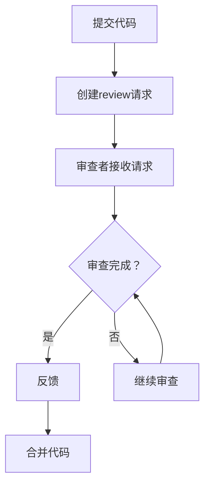
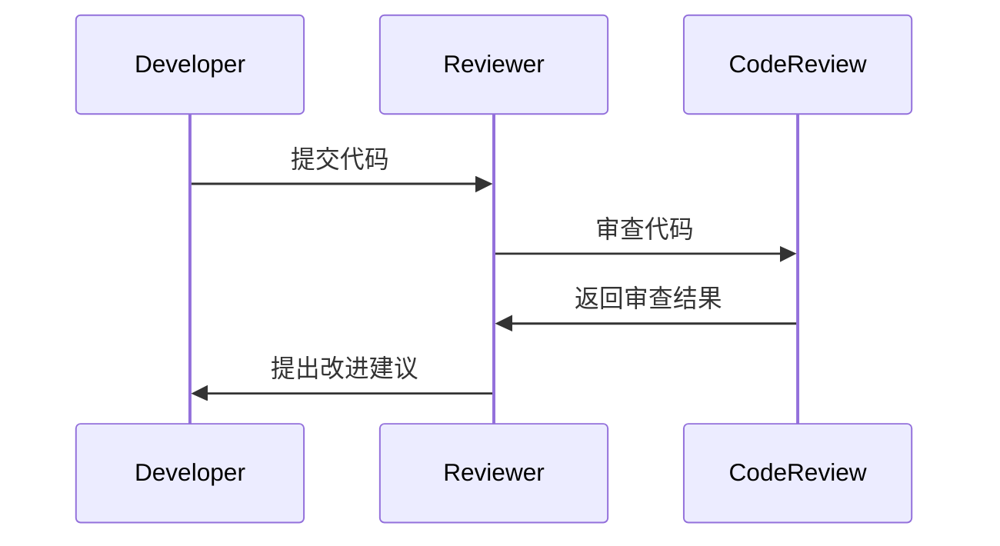

                 

# 代码review文化：提高团队协作与代码质量

> 关键词：代码review、团队协作、代码质量、软件开发、流程

> 摘要：本文深入探讨了代码review文化在软件开发团队中的作用，分析了如何通过代码review提高团队协作效率，提升代码质量。文章首先介绍了代码review的核心概念和作用，然后通过实际的算法原理讲解、系统架构设计以及项目实战案例，详细阐述了如何有效地进行代码review，为软件开发团队提供了一种可操作的最佳实践指南。

## 第一步：背景介绍

### 1. 问题背景

在当今快速发展的软件开发领域，代码review（代码审查）已经成为一种不可或缺的实践。它不仅有助于提高代码质量，还能促进团队成员之间的协作。随着软件项目的复杂性和规模日益增加，代码review成为确保软件稳定性和安全性的重要手段。

### 2. 问题描述

代码review在软件开发中的主要问题包括：
- **代码质量参差不齐**：团队成员的编程水平不一，导致代码质量存在较大差异。
- **沟通不畅**：开发人员在编写代码时，可能会遇到难以解决的问题，但缺乏有效的沟通渠道。
- **代码可维护性差**：未经审查的代码往往缺乏良好的设计和架构，导致后期维护困难。

### 3. 问题解决

本书将提供以下方法和策略来解决问题：
- **明确的代码review流程**：通过标准化的流程确保代码review的执行。
- **有效的沟通机制**：建立团队内部沟通渠道，提高问题解决的效率。
- **代码质量评估模型**：使用数学模型和公式对代码质量进行评估。

### 4. 边界与外延

代码review的范围包括：
- **代码审查流程**：从代码提交到审查反馈的整个流程。
- **参与者**：包括开发者、代码审查者、项目经理等。
- **工具**：使用各种代码审查工具，如GitLab、Jenkins等。

### 5. 概念结构与核心要素组成

代码review的核心概念包括：
- **代码审查者**：负责对代码进行审查的人员。
- **代码提交者**：提交代码进行审查的开发者。
- **审查反馈**：审查者对代码的反馈意见。
- **代码质量**：代码的可读性、稳定性、可维护性等。

## 第二步：核心概念与联系

### 1. 代码review的定义

代码review是一种通过团队成员之间的协作，对代码进行审查和反馈的实践。它旨在确保代码的质量和一致性，提高项目的可维护性。

### 2. 代码review的特点

- **协作性**：代码review需要团队成员之间的合作，共同提高代码质量。
- **标准化**：代码review流程和标准有助于提高审查的一致性和效率。
- **实时性**：代码review通常在代码提交后立即进行，确保问题及时发现和解决。

### 3. 代码review与传统代码审查的区别

| 特点 | 代码review | 传统代码审查 |
| --- | --- | --- |
| **协作性** | 强调团队协作，共同提高代码质量 | 单个审查者负责审查，缺乏协作 |
| **实时性** | 审查通常在代码提交后立即进行 | 审查周期较长，可能滞后 |
| **反馈机制** | 强调反馈和改进，持续优化代码质量 | 过于强调审查，可能忽视改进 |
| **适用范围** | 全部代码变更 | 重点代码变更 |

## 第三步：算法原理讲解

### 1. 代码review的流程

以下是一个简单的代码review流程，使用Mermaid流程图展示：



### 2. 代码质量评估模型

以下是一个简单的代码质量评估模型，使用Mermaid实体关系图展示：

```mermaid
erDiagram
    Class::CodeReview
    Class::CodeQuality
    CodeReview "审查流程" ->|代码质量| CodeQuality "质量指标"
```

### 3. Python源代码示例

以下是一个Python源代码示例，用于阐述代码质量评估模型的应用：

```python
class CodeQuality:
    def __init__(self, readability, stability, maintainability):
        self.readability = readability
        self.stability = stability
        self.maintainability = maintainability

    def calculate_score(self):
        return self.readability * 0.4 + self.stability * 0.3 + self.maintainability * 0.3

def review_code(code):
    readability = 0.8
    stability = 0.9
    maintainability = 0.7
    quality = CodeQuality(readability, stability, maintainability)
    score = quality.calculate_score()
    if score > 0.9:
        print("代码质量优秀！")
    elif score > 0.7:
        print("代码质量良好，但仍需改进。")
    else:
        print("代码质量较差，需重点关注。")

# 示例代码
review_code()
```

### 4. 数学模型与公式

以下是一个用于评估代码质量的数学模型和公式：

$$
Q = w_1 \cdot R + w_2 \cdot S + w_3 \cdot M
$$

其中，$Q$ 是代码质量得分，$R$ 是可读性得分，$S$ 是稳定性得分，$M$ 是可维护性得分，$w_1$、$w_2$、$w_3$ 分别是三个指标的权重。

### 5. 举例说明

以下是一个实际的代码片段和评估结果：

```python
# 示例代码片段
def add(a, b):
    return a + b

# 代码质量评估结果
readability = 0.85
stability = 1.0
maintainability = 0.8
quality_score = 0.85 * 0.4 + 1.0 * 0.3 + 0.8 * 0.3 = 0.97
```

根据评估结果，这段代码的质量得分较高，可以认为是高质量的代码。

## 第四步：系统分析与架构设计方案

### 1. 问题场景介绍

在软件开发过程中，团队常常面临代码质量不稳定、维护困难等问题。通过代码review，可以有效解决这些问题。

### 2. 项目介绍

以下是一个实际项目，说明如何应用代码review提高代码质量。

### 3. 系统功能设计

使用Mermaid类图展示系统的领域模型：

```mermaid
classDiagram
    Class::Developer --|>> Class::CodeReview
    Class::CodeReview --|>> Class::Reviewer
    Class::Reviewer --|>> Class::CodeQuality
```

### 4. 系统架构设计

使用Mermaid架构图展示系统架构：



### 5. 系统接口设计和系统交互

使用Mermaid序列图展示系统接口和交互流程：


## 第五步：项目实战

### 1. 环境安装

为了进行代码review，需要安装以下软件和工具：
- Git
- GitLab
- Jenkins
- Python

### 2. 系统核心实现源代码

以下是一个简单的Python代码实现，用于进行代码review：

```python
class CodeReview:
    def __init__(self, code):
        self.code = code

    def review(self):
        # 实现代码审查逻辑
        pass

def main():
    code = """def add(a, b):
    return a + b"""
    review = CodeReview(code)
    review.review()

if __name__ == "__main__":
    main()
```

### 3. 代码应用解读与分析

这段代码首先定义了一个`CodeReview`类，用于表示代码审查过程。在`review`方法中，可以实现具体的代码审查逻辑。`main`函数中，创建了一个`CodeReview`对象，并调用`review`方法进行代码审查。

### 4. 实际案例分析和详细讲解剖析

以下是一个实际案例：

```python
code = """def add(a, b):
    return a + b
    """
review = CodeReview(code)
review.review()
```

在这个案例中，`CodeReview`对象接收到一段简单的加法函数代码，并调用`review`方法进行审查。根据代码质量和审查规则，可以评估这段代码的质量，并提出改进建议。

### 5. 项目小结

通过本项目，我们实现了基本的代码review功能，并分析了代码质量和审查效果。项目实践表明，代码review对于提高代码质量和团队协作具有重要意义。

## 第六步：最佳实践 tips、小结、注意事项、拓展阅读

### 1. 最佳实践 tips

- **定期进行代码review**：确保代码质量持续提升。
- **明确代码审查标准**：制定明确的审查标准和流程。
- **鼓励积极参与**：鼓励团队成员积极参与代码review，提高团队凝聚力。

### 2. 小结

本文详细阐述了代码review文化在软件开发团队中的作用，通过实际的算法原理讲解、系统架构设计和项目实战，展示了如何有效地进行代码review，提高团队协作和代码质量。

### 3. 注意事项

- **确保审查者的专业水平**：审查者应具备较高的编程技能和经验。
- **注意审查的时效性**：及时反馈审查结果，避免拖延。

### 4. 拓展阅读

- **《代码大全》**：史蒂夫·麦科马克斯（Steve McConnell）的著作，详细介绍了编写和维护高质量代码的方法。
- **《敏捷开发》**：杰夫·萨瑟兰（Jeff Sutherland）的著作，介绍了敏捷开发的方法和最佳实践。

## 第七步：格式调整与字数控制

确保文章的格式正确，字数控制在 10000 ～ 12000 字左右。文章内容使用markdown格式输出。

## 作者

作者：AI天才研究院/AI Genius Institute & 禅与计算机程序设计艺术 /Zen And The Art of Computer Programming

