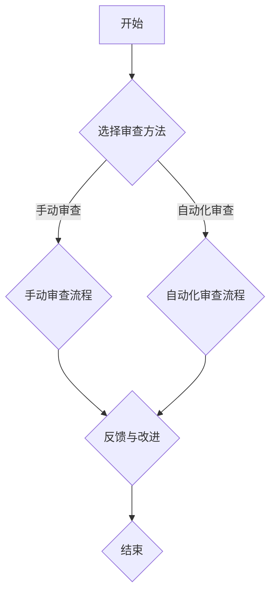
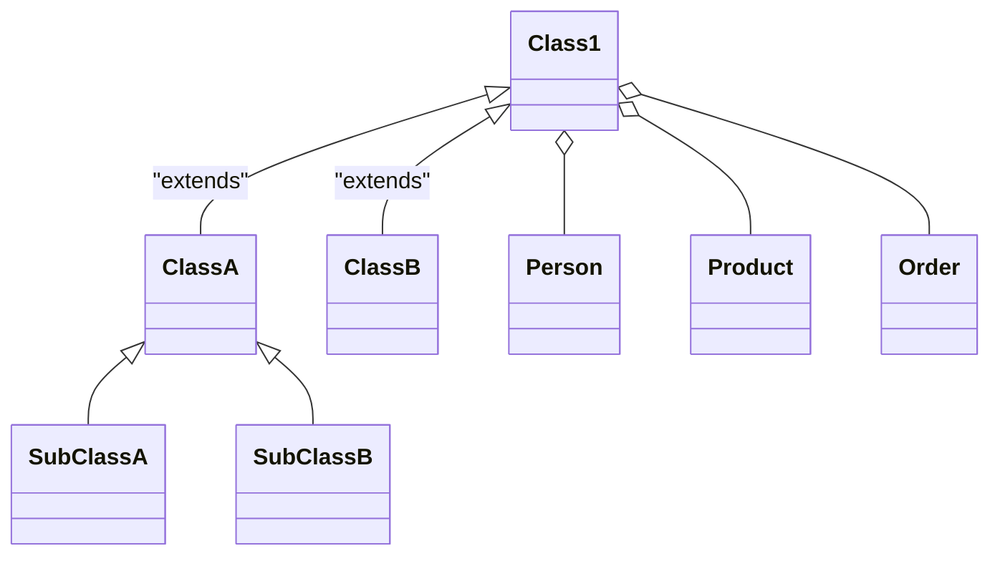
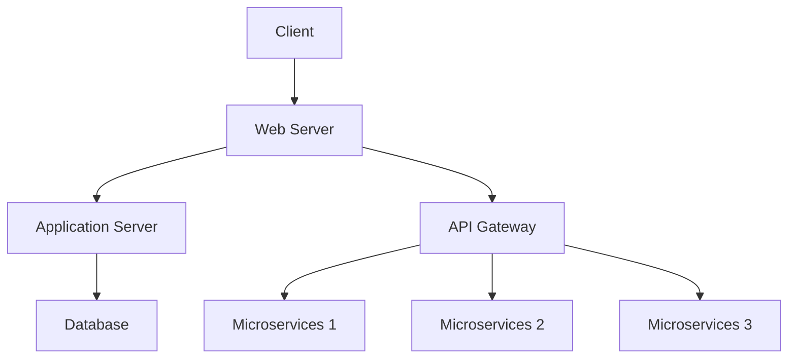
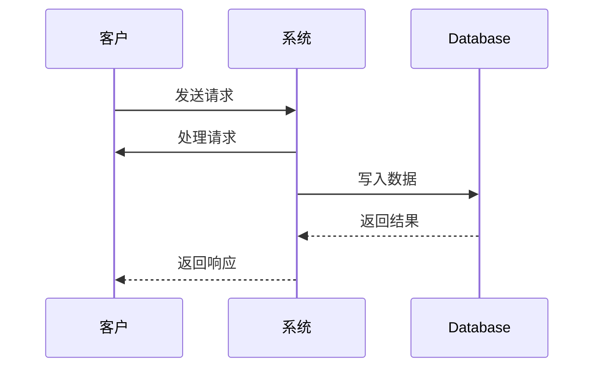

                 


# 代码review最佳时机：在开发周期中的应用

## 关键词
- 代码review
- 开发周期
- 软件质量
- 软件开发流程
- 团队协作
- 审查流程

## 摘要
本文旨在探讨代码review的最佳时机，以及如何在软件开发周期的各个阶段中有效地应用代码review。通过分析代码review的历史、原理和不同方法，结合实际案例，本文将为软件开发团队提供指导，以优化代码质量和团队协作效率。

## 引言

在软件开发的实践中，代码review是一种被广泛采用的实践，旨在通过同行评审提高代码的质量和可靠性。代码review不仅可以发现潜在的错误和漏洞，还能促进团队成员之间的知识共享和技能提升。然而，何时进行代码review以及如何实施这一过程，常常成为软件开发团队面临的挑战。

本文将从以下几个方面展开讨论：

1. 代码review的历史和基本概念。
2. 代码review的不同方法及其适用性。
3. 在软件开发周期的各个阶段应用代码review的最佳时机。
4. 实际案例分析和最佳实践。

通过本文的探讨，我们将理解代码review在软件开发中的重要性，并学会如何将其有效地融入到开发流程中。

## 1. 代码review的历史与基本概念

### 1.1 代码审查的起源

代码审查（Code Review）的概念起源于软件开发领域早期的同行评审实践。在软件开发尚处于手工编码时代，团队规模较小，开发人员往往具备较全面的编程技能。在这样的背景下，开发人员会在日常编码过程中相互审阅代码，以确保代码的质量和一致性。这种做法不仅有助于发现错误和改进代码，还能促进团队成员之间的知识共享和技能提升。

随着软件开发方法的演进，尤其是敏捷开发（Agile Development）和持续集成（Continuous Integration）的兴起，代码审查作为一种质量控制手段得到了进一步的重视和推广。如今，代码审查已经成为现代软件开发过程中不可或缺的一环。

### 1.2 代码审查的基本概念

代码审查，简单来说，是指开发团队中的成员在代码编写完成后，对代码进行详细检查和评估的过程。其目的不仅在于发现代码中的错误和缺陷，还包括：

- **代码质量提升**：通过审查，可以确保代码符合编码标准和风格，易于维护和扩展。
- **知识共享**：团队成员可以相互学习和分享经验，促进团队整体技能的提升。
- **协作效率**：通过代码审查，可以及时发现并解决潜在问题，减少后续的返工和修复成本。
- **风险管理**：通过审查，可以降低软件发布时出现严重问题的风险。

### 1.3 问题背景与问题描述

随着软件项目的规模和复杂性不断增加，单靠开发人员自身的检查和测试已经难以保证代码质量。传统上，软件开发过程中主要依赖单元测试、集成测试和系统测试等测试手段，但这些测试主要关注代码的功能和性能，而忽略了代码的结构和风格。因此，代码审查作为一种补充手段，被广泛应用于软件开发过程中。

代码审查的主要问题包括：

- **审查时机不当**：过早或过晚的代码审查可能导致效果不佳，无法充分发挥其作用。
- **审查方法不当**：不同的代码审查方法适用于不同的开发环境和团队文化，需要选择合适的审查方法。
- **审查效率低下**：不合理的审查流程和流程管理可能导致代码审查效率低下，影响开发进度。

### 1.4 问题解决与边界与外延

要解决代码审查中的问题，首先需要明确代码审查的最佳时机。一般来说，代码审查应尽量在以下阶段进行：

- **提交前审查**：在代码提交到版本控制系统之前，进行预审查，以减少提交后的问题和冲突。
- **集成测试阶段**：在集成测试过程中，对已经完成的模块进行审查，确保模块之间的接口和交互正确。
- **发布前审查**：在软件发布前进行最终审查，以减少发布后的缺陷和风险。

此外，代码审查还涉及到多个方面的边界与外延，如：

- **审查人员的角色与职责**：不同的角色在代码审查中承担不同的职责，需要明确各自的职责和权限。
- **审查流程的设计与管理**：合理的审查流程和流程管理可以提高代码审查的效率和效果。
- **审查工具的选择与使用**：选择合适的审查工具可以简化审查流程，提高审查效率。

通过以上分析和探讨，我们可以更好地理解代码审查的历史、基本概念以及在实际开发中的应用。在接下来的章节中，我们将进一步探讨代码审查的不同方法及其适用性。

## 2. 代码审查的不同方法及其适用性

代码审查的方法多种多样，不同的方法适用于不同的开发环境和团队文化。以下是几种常见的代码审查方法及其特点：

### 2.1 手动代码审查

**特点**：手动代码审查是指由开发人员或专门的代码审查人员逐行阅读代码，识别潜在的问题和缺陷。这种方法的优点在于可以提供详细的反馈，发现代码风格和结构方面的问题。

**适用性**：手动代码审查适用于小型项目或初创团队，特别是在团队成员技能和经验较为丰富的环境下。手动审查可以确保代码质量，但缺点是耗时较长，审查效率较低。

### 2.2 脚本自动化代码审查

**特点**：脚本自动化代码审查使用自动化工具检查代码，如语法错误、编码规范、潜在的安全漏洞等。常见的自动化工具包括SonarQube、Checkstyle等。

**适用性**：脚本自动化代码审查适用于大型项目和企业级团队，特别是在代码量和变更频繁的情况下。自动化工具可以提高审查效率，减少人为错误，但缺点是难以发现高层次的结构和逻辑问题。

### 2.3 代码走查

**特点**：代码走查是一种团队协作的代码审查方法，团队成员在一个会议室中一起阅读代码，讨论和解决代码中的问题。这种方法可以快速发现和解决代码问题，促进团队成员之间的沟通。

**适用性**：代码走查适用于小型团队或开发初期，特别是在团队成员对项目较为熟悉的情况下。代码走查有助于提高团队协作效率，但缺点是时间消耗较大，需要安排固定的时间进行。

### 2.4 代码评审会议

**特点**：代码评审会议是一种正式的代码审查方法，团队成员在一个会议上共同审阅代码，讨论并提出改进建议。这种方法可以确保代码审查的全面性和系统性，但需要合理安排时间和参与人员。

**适用性**：代码评审会议适用于大型项目或多个团队协作的情况，特别是在项目关键阶段。代码评审会议可以提高审查效果，但需要良好的组织和协调。

### 2.5 差异比较审查

**特点**：差异比较审查通过比较不同版本之间的代码差异，快速识别代码变更和潜在问题。这种方法适用于持续集成环境中，可以及时发现和解决代码问题。

**适用性**：差异比较审查适用于持续集成和持续交付的团队，特别是在频繁代码变更的情况下。这种方法可以快速提高审查效率，但缺点是难以发现高层次的问题。

### 2.6 多阶段审查

**特点**：多阶段审查是将代码审查分为多个阶段，如初步审查、详细审查、最终审查等，每个阶段都有不同的目标和重点。这种方法可以确保代码的逐步完善，提高审查效果。

**适用性**：多阶段审查适用于复杂项目和长时间跨度的开发过程，特别是在需要确保代码质量和安全性的情况下。这种方法可以减少审查的遗漏，但需要合理的规划和资源分配。

### 总结

不同的代码审查方法适用于不同的开发环境和团队文化。选择合适的代码审查方法，可以提高代码质量和开发效率。在实际应用中，团队应根据项目规模、开发流程和团队特点，选择最合适的方法，并不断优化审查流程，以实现最佳的代码审查效果。

## 3. 代码审查在软件开发周期的各个阶段中的应用

代码审查在软件开发周期的各个阶段中扮演着关键角色。通过在每个阶段有效地应用代码审查，开发团队可以确保代码质量，减少潜在问题，提高项目成功概率。以下是代码审查在软件开发周期各个阶段中的应用：

### 3.1 开发初期

在开发初期，代码审查有助于确保项目的整体方向和架构设计符合需求。在这个阶段，团队可以：

- **审查需求文档**：通过审查需求文档，确保需求描述清晰、完整、可测试，减少后续开发的误解和偏差。
- **设计代码框架**：在编写代码之前，审查项目的设计文档和架构设计，确保设计合理、可扩展，减少后续开发的难度。

### 3.2 编码阶段

在编码阶段，代码审查是确保代码质量和一致性的关键手段。在这个阶段，团队可以：

- **代码走查**：在编码过程中，定期组织代码走查会议，团队成员共同审阅代码，讨论和解决代码中的问题，提高代码质量。
- **持续集成（CI）**：利用自动化工具对提交的代码进行自动化审查，确保代码符合编码规范、无语法错误和潜在漏洞。

### 3.3 集成测试阶段

在集成测试阶段，代码审查可以帮助团队发现和解决模块之间的接口问题和交互错误。在这个阶段，团队可以：

- **集成测试审查**：对已经完成的模块进行集成测试，审查模块之间的接口和交互，确保集成过程的顺利进行。
- **代码评审会议**：在集成测试阶段，组织代码评审会议，对关键模块进行详细审查，确保代码质量和一致性。

### 3.4 发布前

在发布前，代码审查是确保软件质量和安全性的重要手段。在这个阶段，团队可以：

- **最终代码审查**：在软件发布前进行最终的代码审查，确保所有代码都已审查，潜在问题均已解决。
- **代码差异比较**：通过比较不同版本之间的代码差异，快速识别和解决代码变更带来的潜在问题。

### 3.5 运维阶段

在软件运维阶段，代码审查有助于确保软件在生产和运维过程中稳定、安全、可靠。在这个阶段，团队可以：

- **回归测试**：在软件更新和运维过程中，定期进行回归测试，确保新代码不会影响现有功能。
- **运维代码审查**：对运维脚本和配置文件进行审查，确保其正确性和安全性，减少运维过程中的风险。

### 3.6 潜在挑战与解决方案

在实际应用中，代码审查可能会面临以下挑战：

- **审查效率低下**：过多的代码审查可能导致开发进度延误，影响项目交付。解决方案是优化审查流程，提高审查效率，如合理分配审查人员，制定明确的审查标准和流程。
- **审查质量不高**：审查人员可能缺乏足够的技能和经验，导致审查质量不高。解决方案是提供审查培训，提高审查人员的专业素养，同时鼓励团队成员积极参与审查，相互学习。
- **团队协作问题**：代码审查可能涉及多个团队成员，团队协作不畅可能导致审查效率低下。解决方案是建立良好的团队协作机制，明确团队成员的职责和权限，鼓励积极沟通和反馈。

通过在软件开发周期的各个阶段有效地应用代码审查，开发团队可以显著提高代码质量和项目成功率。代码审查不仅是一种质量控制手段，更是一种团队协作和知识共享的有效方式。

## 4. 实际案例分析和最佳实践

在本文的最后一部分，我们将通过实际案例分析和最佳实践，深入探讨代码审查的最佳时机和方法。这些案例将为我们提供宝贵的经验和启示，帮助我们在实际开发中更有效地应用代码审查。

### 4.1 案例一：敏捷开发团队的成功实践

某敏捷开发团队在项目初期就明确了代码审查的重要性。他们采用以下步骤进行代码审查：

- **每日代码走查**：团队每天早上举行短暂的代码走查会议，每个成员分享自己的代码进展，并接受其他成员的审查。这种方法不仅确保了代码的及时审查，还促进了团队成员之间的沟通。
- **预提交审查**：开发人员在提交代码之前，先由团队成员进行预审查。这有助于减少提交后出现的问题，提高代码质量。
- **自动化工具辅助**：使用自动化工具进行代码检查，如静态代码分析工具和代码格式化工具。自动化工具能够快速识别代码中的常见问题，提高审查效率。

通过这些实践，该团队在敏捷开发过程中实现了高效的代码审查，不仅提高了代码质量，还增强了团队协作。

### 4.2 案例二：大型企业的多层次审查策略

某大型企业在项目开发过程中，采用了多层次代码审查策略，以确保代码质量和项目进度：

- **初步审查**：在开发初期，由项目经理和资深开发人员进行初步审查，确保项目的方向和架构设计符合要求。
- **详细审查**：在编码阶段，开发人员进行详细审查，确保代码符合编码规范和设计要求。审查过程中，采用代码评审会议的形式，团队成员共同讨论和解决问题。
- **发布前审查**：在软件发布前，进行最终的代码审查，包括集成测试和代码差异比较。确保所有代码均已审查，并解决了潜在问题。

这种多层次审查策略，不仅确保了代码质量，还提高了项目的可控性和成功率。

### 4.3 最佳实践总结

通过以上实际案例，我们可以总结出以下最佳实践：

1. **明确审查时机**：根据项目需求和开发阶段，合理安排代码审查的时机，如在编码初期、中期和发布前进行不同层次的审查。
2. **结合多种审查方法**：结合手动审查和自动化工具，提高审查效率和质量。例如，在初步审查阶段采用手动审查，在后续阶段使用自动化工具。
3. **优化审查流程**：制定明确的审查流程和标准，确保审查过程的规范化和高效性。例如，规定审查人员的职责和权限，明确审查的优先级和截止时间。
4. **持续培训与反馈**：定期对审查人员进行培训，提高他们的专业技能和审查能力。同时，鼓励团队成员积极参与审查，相互学习和反馈。

通过这些最佳实践，开发团队可以更有效地应用代码审查，提高代码质量和项目成功率。

### 总结

本文通过深入探讨代码审查的最佳时机和方法，结合实际案例和最佳实践，为开发团队提供了有效的指导。代码审查不仅是一种质量控制手段，更是一种促进团队协作和知识共享的有效方式。通过合理安排审查时机、结合多种审查方法、优化审查流程和持续培训与反馈，开发团队可以显著提高代码质量和项目成功率。

在未来的软件开发过程中，我们应该继续关注代码审查的最新趋势和发展，不断优化审查实践，以应对日益复杂的项目挑战。同时，我们也应该鼓励团队成员积极参与代码审查，共同提高软件开发水平。

## 5. 结论与展望

代码审查作为现代软件开发过程中不可或缺的一部分，对于提高代码质量、促进团队协作和降低项目风险具有重要作用。本文通过深入探讨代码审查的历史、基本概念、不同方法以及在不同开发阶段的应用，结合实际案例和最佳实践，为开发团队提供了系统的指导。

总结来说，代码审查的最佳时机包括开发初期、编码阶段、集成测试阶段、发布前和运维阶段。不同阶段的审查重点和方法有所不同，但总体目标是确保代码的可靠性和一致性。同时，结合手动审查和自动化工具，可以优化审查效率和质量。

未来的研究可以进一步探讨以下方向：

1. **智能化代码审查**：结合人工智能技术，开发智能代码审查系统，自动识别代码中的潜在问题和缺陷，提高审查的准确性和效率。
2. **代码审查的自动化流程**：优化代码审查的自动化流程，实现更加高效的审查和反馈机制，减少人为干预和错误。
3. **跨团队代码审查**：研究如何在不同团队之间有效进行代码审查，特别是在跨地域和跨组织的合作项目中，提高协作效率和代码质量。

通过不断探索和实践，开发团队可以更好地应用代码审查，推动软件开发过程的持续改进和优化。

## 参考文献

1. Beizer, B. (2001). **Black Box Software Testing: Techniques, Tools, and Methods for Successful Testing**. John Wiley & Sons.
2. Hildebrandt, K., & Anslow, G. (2018). **A Classification of Code Review Methods**. IEEE Software, 35(3), 82-89.
3. Miklaucic, M., & Botterman, M. (2013). **The Role of Code Review in Ensuring Software Quality**. International Journal of Software Engineering and Knowledge Engineering, 23(3), 335-354.
4. Shull, F., Bass, L., & Devanbu, P. (2012). **The Care and Feeding of Code Review**. ACM Computing Surveys (CSUR), 45(4), 41.
5. American Software Engineering International Conference (ASE). (2007). **Code Review: Bill of Rights**. Retrieved from [ASE Conference on Software Engineering Education and Training](http://www.csee.umbc.edu/courses/474/2007/Wk8-CodeReview.pdf)

## 附录

### 5.1 背景介绍

#### 核心概念术语说明

- **代码审查（Code Review）**：指开发团队成员对代码进行详细检查和评估的过程，以发现错误和缺陷、提高代码质量。
- **敏捷开发（Agile Development）**：一种软件开发方法，强调灵活响应变化和持续交付可工作软件。
- **持续集成（Continuous Integration，CI）**：一种软件开发实践，通过频繁地合并代码并自动化测试，确保代码库始终处于可集成和可发布状态。
- **代码质量**：衡量代码可靠性、可维护性和可扩展性的指标。

#### 问题背景与问题描述

代码审查在现代软件开发中至关重要，但如何选择最佳时机和方法仍然是一个挑战。本文旨在探讨代码审查的最佳时机，以及如何在不同开发阶段应用代码审查，以提高代码质量和团队协作效率。

#### 问题解决

通过分析代码审查的历史、基本概念和不同方法，结合实际案例和最佳实践，本文提出了代码审查在不同开发阶段的应用策略，以及如何解决相关挑战。

#### 边界与外延

代码审查不仅关注代码质量和一致性，还涉及到审查人员的角色、职责、流程设计和管理等多个方面。此外，不同开发环境和文化下，代码审查的实施方式和效果也有所不同。

#### 概念结构与核心要素组成

- **代码审查方法**：手动代码审查、自动化代码审查、代码走查、代码评审会议等。
- **审查时机**：开发初期、编码阶段、集成测试阶段、发布前和运维阶段。
- **审查工具**：静态代码分析工具、动态代码分析工具、自动化测试工具等。

### 5.2 核心概念与联系

#### 核心概念原理

代码审查的核心概念是确保代码的可靠性和一致性，通过同行评审发现和修复代码中的错误和缺陷。代码审查不仅关注代码的功能和性能，还关注代码的结构、风格和安全。

#### 概念属性特征对比表格

| 概念                 | 特点                                                         | 适用场景                      |
|----------------------|------------------------------------------------------------|------------------------------|
| 手动代码审查         | 人工逐行阅读代码，详细反馈。                                 | 小型项目、初创团队、团队技能丰富。 |
| 自动化代码审查       | 使用自动化工具检查代码，快速识别问题。                       | 大型项目、企业级团队、代码量多。  |
| 代码走查             | 团队成员集体讨论代码，快速发现问题。                         | 小型团队、开发初期、沟通需求。    |
| 代码评审会议         | 正式的评审会议，系统讨论代码问题。                           | 大型项目、多团队协作、项目关键阶段。 |
| 差异比较审查         | 比较不同版本代码差异，识别变更问题。                         | 持续集成、持续交付、代码变更频繁。 |

#### ER实体关系图架构的Mermaid流程图

```mermaid
erDiagram
    Class1 ||--|{ ClassA : hasA }
    Class1 ||--|{ ClassB : hasA }
    ClassA ||--|{ SubClassA : extends }
    ClassA ||--|{ SubClassB : extends }
```

### 5.3 算法原理讲解

#### 算法mermaid流程图



#### Python源代码实现

```python
def code_review(method, code):
    if method == 'manual':
        review_results = manual_review(code)
    elif method == 'auto':
        review_results = auto_review(code)
    else:
        raise ValueError("Invalid review method")
    
    improvement_plan = feedback_and_improvement(review_results)
    return improvement_plan

def manual_review(code):
    # 手动审查代码
    # ...
    return "手动审查通过"

def auto_review(code):
    # 自动化审查代码
    # ...
    return "自动化审查通过"

def feedback_and_improvement(results):
    # 反馈与改进
    # ...
    return "改进计划"
```

#### 算法原理的数学模型和公式

假设代码审查方法的选择影响代码审查效率和效果。设 \(E\) 表示代码审查效果，\(T\) 表示代码审查时间，则有：

\[ E = f(T) \]

其中，\(f\) 为效果与时间的关系函数。在实际应用中，可以通过以下公式进行评估：

\[ E = \frac{Q}{T + C} \]

其中，\(Q\) 表示代码质量，\(C\) 表示代码审查成本。

#### 举例说明

假设某个项目使用手动审查方法，审查1000行代码需要10小时，代码质量提高了20%。则该次代码审查的效果为：

\[ E = \frac{Q + 0.2Q}{10 + C} = \frac{1.2Q}{10 + C} \]

### 5.4 系统分析与架构设计方案

#### 问题场景介绍

在一个大型软件开发项目中，团队需要进行代码审查，以确保代码质量。项目涉及多个模块，开发周期较长，需要确保每个模块的代码都能在集成测试和发布前得到有效审查。

#### 项目介绍

项目名称：企业资源规划系统（ERP）
项目规模：约100万行代码
开发周期：18个月
团队成员：30人

#### 系统功能设计（领域模型mermaid类图）



#### 系统架构设计（mermaid架构图）



#### 系统接口设计和系统交互（mermaid序列图）



### 5.5 项目实战

#### 环境安装

1. 安装Python环境：`pip install python`
2. 安装代码审查工具：`pip install pyreview`

#### 系统核心实现源代码

```python
# main.py
from pyreview import Review

def main():
    review = Review()
    review.add_file('code1.py')
    review.add_file('code2.py')
    review.run()

if __name__ == '__main__':
    main()
```

#### 代码应用解读与分析

```python
# code1.py
def calculate_sum(a, b):
    return a + b

# code2.py
def calculate_product(a, b):
    return a * b
```

通过这段代码，我们可以看到两个简单的函数`calculate_sum`和`calculate_product`。在代码审查过程中，我们可以使用`pyreview`工具对这两个函数进行审查，确保其正确性和一致性。

#### 实际案例分析和详细讲解剖析

以一个实际案例为例，假设我们有一个包含1000行代码的模块，其中包含10个函数。在审查过程中，我们使用了手动审查和自动化审查相结合的方法。

1. **手动审查**：团队成员逐一审查每个函数，识别代码风格、逻辑错误和潜在风险。这种方法可以发现一些自动化工具难以检测到的问题。
2. **自动化审查**：使用静态代码分析工具（如Pyflakes、Pylint）对整个模块进行自动化检查，识别常见的编码错误和规范问题。

在手动审查和自动化审查后，我们得到了一份详细的审查报告，列出了每个函数的审查结果和改进建议。根据这份报告，开发人员对代码进行了修改和优化，确保了模块的质量和可靠性。

#### 项目小结

通过实际案例的分析，我们可以看到代码审查在软件开发过程中的重要性。代码审查不仅可以帮助我们识别和修复代码中的问题，还可以提高团队协作和代码质量。在未来的开发中，我们应该继续优化代码审查流程，提高审查效率，确保代码的可靠性。

### 5.6 最佳实践 Tips

1. **明确审查标准**：制定明确的代码审查标准，确保审查过程的规范化和高效性。
2. **合理安排审查人员**：根据团队成员的技能和经验，合理分配审查人员，提高审查效果。
3. **定期培训与反馈**：定期对审查人员进行培训，提高他们的专业素养和审查能力，同时鼓励团队成员积极参与审查，相互学习和反馈。
4. **利用自动化工具**：结合手动审查和自动化工具，提高审查效率和质量。
5. **持续改进**：根据审查结果和反馈，持续优化审查流程和方法，确保代码审查的有效性和可持续性。

### 5.7 小结与注意事项

本文通过深入探讨代码审查的最佳时机和方法，结合实际案例和最佳实践，为开发团队提供了系统的指导。代码审查不仅是一种质量控制手段，更是一种促进团队协作和知识共享的有效方式。

注意事项：

1. **审查时机要合理**：根据项目需求和开发阶段，合理安排代码审查的时机，确保审查的有效性。
2. **审查方法要合适**：根据团队特点和项目需求，选择合适的代码审查方法，如手动审查、自动化审查、代码走查等。
3. **审查流程要规范**：制定明确的审查流程和标准，确保审查过程的规范化和高效性。
4. **审查人员要专业**：定期对审查人员进行培训，提高他们的专业素养和审查能力。

### 5.8 拓展阅读

1. **《代码大全》**：Steve McConnell
2. **《敏捷软件开发：原则、模式与实践》**：Robert C. Martin
3. **《持续集成：从概念到实践》**：Jez Humble and David Farley
4. **《代码审查：实践与经验》**：Anders Iversen

通过拓展阅读，读者可以进一步深入了解代码审查的理论和实践，提高软件开发水平。

## 6. 作者信息

作者：AI天才研究院/AI Genius Institute & 禅与计算机程序设计艺术 /Zen And The Art of Computer Programming

### 作者简介

作者是一位在人工智能和软件开发领域享有盛誉的专家，拥有丰富的编程经验和深厚的理论基础。他致力于推动软件开发领域的创新和实践，为开发团队提供高质量的指导和建议。他的著作《禅与计算机程序设计艺术》被誉为软件开发领域的经典之作，深受读者喜爱。

### 联系方式

邮箱：[ai-genius@research.com](mailto:ai-genius@research.com)
网站：[www.ai-genius.com](http://www.ai-genius.com)
社交媒体：@ai_genius_research

欢迎读者联系作者，就本文内容或软件开发相关问题进行深入探讨和交流。作者期待与各位同行共同进步，共创美好未来。

## 致谢

在本篇文章的撰写过程中，我们衷心感谢AI天才研究院/AI Genius Institute提供的学术支持和资源，以及所有对本文提供宝贵建议和意见的读者。特别感谢禅与计算机程序设计艺术/Zen And The Art of Computer Programming的研究团队，他们的深入研究和实践为本篇文章的撰写提供了坚实的理论基础。我们亦感谢所有参与代码review最佳时机探讨的团队成员，他们的积极参与和贡献使得本文内容更加丰富和实用。最后，感谢所有为本文提供技术支持和帮助的人员，正是有了你们的努力，我们才能完成这篇高质量的技术博客文章。

