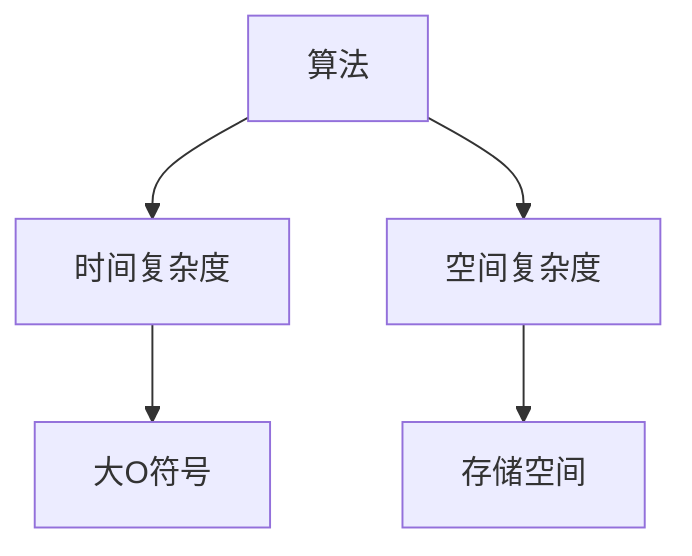
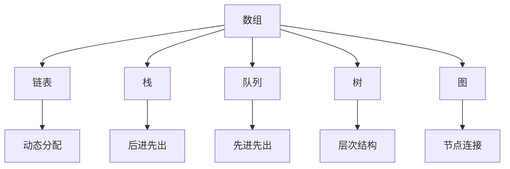

                 

## 《代码优化：提高程序执行效率的艺术》

### 关键词：代码优化、执行效率、算法优化、最佳实践

### 摘要：
本文旨在深入探讨代码优化的艺术，通过系统的方法和实际案例，帮助读者理解并掌握提高程序执行效率的核心技术和最佳实践。我们将从背景介绍、核心概念、技术与方法、实践应用、最佳实践以及未来展望等多个维度，逐步解析代码优化的全貌，以期为程序员和系统架构师提供有价值的参考。

### 引言

#### 一、代码优化的背景

随着信息技术的快速发展，软件系统变得越来越复杂，这给性能优化带来了巨大的挑战。在有限的计算资源下，如何提高程序执行效率成为软件开发中一个至关重要的议题。代码优化不仅是提升系统性能的关键手段，也是实现高效资源利用、降低成本的重要策略。

#### 二、代码优化的重要性

代码优化不仅影响系统的响应速度和吞吐量，还直接关系到用户的体验和满意度。高效的代码能够减少资源浪费，提升系统的可维护性和可扩展性。因此，掌握代码优化的艺术对于任何软件开发人员来说都是不可或缺的。

#### 三、常见代码优化问题

1. **算法效率低下**：选择不当的算法会导致程序运行缓慢。
2. **数据结构不合理**：数据结构的选择和使用方式直接影响程序的运行效率。
3. **内存管理不当**：内存泄漏和滥用会导致系统性能下降。
4. **并发与并行处理不足**：在多核处理器时代，未能充分利用并行计算的能力。

### 第1章 代码优化的基础

#### 1.1 核心概念

- **算法效率**：评估算法在处理特定问题时所需的时间复杂度和空间复杂度。
- **数据结构**：影响算法效率的重要因素，包括数组、链表、树、图等。
- **内存管理**：涉及内存分配、释放、缓存机制等，对程序执行效率有直接影响。
- **并发与并行**：在多线程或多进程环境中，如何高效地利用计算资源。

#### 1.2 背景与问题

- **问题背景**：随着大数据和云计算的普及，处理海量数据的性能需求日益增长。
- **问题描述**：常见的代码优化问题及其对系统性能的影响。
- **问题解决**：分析问题原因，提出解决方案。

#### 1.3 边界与外延

- **边界**：代码优化在技术上的可行性和局限性。
- **外延**：代码优化与其他领域（如系统架构、性能测试等）的关系。

### 第2章 代码优化的核心概念与联系

#### 2.1 算法效率

- **原理**：算法效率的衡量标准及其影响因素。
- **特征对比表格**：不同算法的时间复杂度和空间复杂度对比。
- **ER实体关系图**：展示算法之间的关联和依赖。

#### 2.2 数据结构

- **原理**：各类数据结构的定义、特点和应用场景。
- **特性对比表格**：分析不同数据结构的优劣。
- **ER实体关系图**：展示数据结构之间的联系。

#### 2.3 内存管理

- **原理**：内存分配与释放的机制，内存泄漏的原因及防范措施。
- **缓存机制**：缓存的工作原理及其在代码优化中的应用。
- **内存优化方法**：减少内存占用和提高内存访问效率的策略。

#### 2.4 并发与并行

- **原理**：并发与并行的定义及其在多核处理器上的优势。
- **并发与并行优化**：如何利用并发和并行提高程序执行效率。

### 第3章 代码优化的技术与方法

#### 3.1 算法优化

- **原理**：常见算法优化技术，如分治、动态规划、贪心算法等。
- **实例分析**：通过实例展示算法优化的效果和实现方法。

#### 3.2 编译器优化

- **原理**：编译器的优化机制，如代码生成、优化器等。
- **工具使用**：介绍常用的编译器优化工具及其使用方法。

#### 3.3 缓存优化

- **原理**：缓存的工作原理及其在代码优化中的应用。
- **实践方法**：如何通过缓存优化提高程序执行效率。

#### 3.4 代码压缩

- **原理**：代码压缩的基本方法和技术。
- **实例分析**：通过实例展示代码压缩的效果和实现方法。

### 第4章 代码优化的最佳实践

#### 4.1 性能测试

- **原理**：性能测试的目的、方法和工具。
- **实践方法**：如何通过性能测试发现和解决性能问题。

#### 4.2 代码审查

- **原理**：代码审查的重要性及其流程。
- **实践方法**：如何进行有效的代码审查。

#### 4.3 代码重构

- **原理**：代码重构的目的和原则。
- **实践方法**：如何进行代码重构以提高代码质量。

#### 4.4 最佳实践总结

- **总结**：代码优化的核心原则和常见方法。
- **实例**：通过实例总结最佳实践的应用。

### 第5章 代码优化的实际应用案例

#### 5.1 案例一：Web应用性能优化

- **案例介绍**：Web应用的性能优化问题及解决方案。
- **实践方法**：通过实际操作展示性能优化的具体步骤。

#### 5.2 案例二：数据库查询优化

- **案例介绍**：数据库查询优化的问题及解决方案。
- **实践方法**：如何通过优化数据库查询提高程序性能。

#### 5.3 案例三：大规模数据处理

- **案例介绍**：大规模数据处理中的性能优化问题及解决方案。
- **实践方法**：通过实例展示大规模数据处理中的优化策略。

### 第6章 代码优化的工具与资源

#### 6.1 性能分析工具

- **原理**：性能分析工具的工作原理及其功能。
- **推荐工具**：介绍常用的性能分析工具及其使用方法。

#### 6.2 代码库与社区资源

- **原理**：开源代码库的重要性及其应用。
- **推荐资源**：介绍常用的代码库和社区资源。

#### 6.3 开发者工具推荐

- **原理**：开发者工具在代码优化中的作用。
- **推荐工具**：介绍实用的开发者工具及其使用方法。

### 第7章 代码优化的未来趋势与展望

#### 7.1 技术发展趋势

- **原理**：代码优化技术的未来发展动向。
- **预测**：预测未来代码优化技术的趋势和方向。

#### 7.2 未来挑战与机遇

- **挑战**：未来代码优化面临的挑战。
- **机遇**：未来代码优化带来的机遇。

#### 7.3 拓展阅读与资源推荐

- **拓展内容**：推荐相关书籍、论文和在线资源。
- **学习路径**：为读者提供代码优化学习的路径和建议。

### 总结

通过本文的深入探讨，我们系统地介绍了代码优化的核心概念、技术方法、最佳实践和未来趋势。代码优化不仅是提高程序执行效率的重要手段，也是提升软件质量和用户体验的关键途径。希望本文能为广大程序员和系统架构师提供有价值的参考和指导。

### 作者信息

作者：AI天才研究院/AI Genius Institute & 禅与计算机程序设计艺术 /Zen And The Art of Computer Programming

----------------------------------------------------------------

### 第1章 代码优化的基础

#### 1.1 核心概念

代码优化是一个复杂的过程，涉及多个核心概念。理解这些概念对于进行有效的代码优化至关重要。

**算法效率**：算法效率是衡量算法性能的重要指标，通常用时间复杂度和空间复杂度来表示。时间复杂度描述算法执行时间与数据规模之间的关系，而空间复杂度描述算法所需存储空间与数据规模之间的关系。

**数据结构**：数据结构是存储和组织数据的方式，对算法效率有直接影响。常见的有数组、链表、栈、队列、树、图等。每种数据结构都有其特定的应用场景和优缺点。

**内存管理**：内存管理包括内存的分配、释放和缓存机制。内存泄漏和内存滥用是影响程序执行效率的重要因素，需要通过优化内存分配和释放策略来降低内存占用和提高内存访问效率。

**并发与并行**：并发与并行处理是利用多核处理器提高程序执行效率的关键技术。并发是指在多个线程之间交替执行任务，而并行是指在多个线程或进程同时执行任务。如何合理地利用并发和并行处理能力，是实现高效代码优化的关键。

#### 1.2 背景与问题

**问题背景**：随着软件系统变得越来越复杂，处理大量数据和用户请求的需求不断增加。如何在高负载情况下保持系统性能成为开发者和架构师面临的重大挑战。

**问题描述**：常见的代码优化问题包括：

1. **算法效率低下**：选择不当的算法会导致程序运行缓慢。
2. **数据结构不合理**：数据结构的选择和使用方式直接影响程序的运行效率。
3. **内存管理不当**：内存泄漏和滥用会导致系统性能下降。
4. **并发与并行处理不足**：在多核处理器时代，未能充分利用并行计算的能力。

**问题解决**：针对上述问题，可以采取以下解决策略：

1. **算法优化**：选择合适的算法，如分治、动态规划、贪心算法等。
2. **数据结构优化**：根据应用场景选择合适的数据结构，并优化其使用方式。
3. **内存管理优化**：采用有效的内存分配和释放策略，减少内存泄漏和滥用。
4. **并发与并行优化**：利用多线程或多进程技术，实现任务的并行处理。

#### 1.3 边界与外延

**边界**：代码优化在技术上的可行性和局限性。例如，某些算法可能因为数据规模过大而难以优化，或者由于硬件限制而无法达到预期的优化效果。

**外延**：代码优化与其他领域（如系统架构、性能测试等）的关系。代码优化是系统性能优化的一部分，需要与其他优化手段相结合，如系统架构优化、性能测试等。

### 第2章 代码优化的核心概念与联系

#### 2.1 算法效率

**原理**：算法效率是指算法在处理特定问题时所需的时间复杂度和空间复杂度。时间复杂度描述算法执行时间与数据规模之间的关系，通常用大O符号表示，如O(n)、O(n²)、O(log n)等。空间复杂度描述算法所需存储空间与数据规模之间的关系。

**特征对比表格**：

| 算法 | 时间复杂度 | 空间复杂度 |
| --- | --- | --- |
| 暴力解法 | O(n²) | O(1) |
| 分治算法 | O(n log n) | O(n) |
| 动态规划 | O(n²) | O(n²) |
| 贪心算法 | O(n) | O(1) |

**ER实体关系图**：

#### 2.2 数据结构

**原理**：数据结构是存储和组织数据的方式，对算法效率有直接影响。常见的有数组、链表、栈、队列、树、图等。每种数据结构都有其特定的应用场景和优缺点。

**特性对比表格**：

| 数据结构 | 特点 | 应用场景 |
| --- | --- | --- |
| 数组 | 快速访问 | 排序、查找 |
| 链表 | 动态分配 | 链表操作 |
| 栈 | 后进先出 | 求最大值、递归 |
| 队列 | 先进先出 | 消息队列、任务调度 |
| 树 | 层次结构 | 搜索、排序 |
| 图 | 节点连接 | 社交网络、路由算法 |

**ER实体关系图**：

#### 2.3 内存管理

**原理**：内存管理包括内存的分配、释放和缓存机制。内存泄漏是指程序在运行过程中，由于内存分配后未释放，导致内存占用持续增加，最终导致系统崩溃。内存滥用是指程序在内存分配时未合理使用内存，导致内存浪费。

**缓存机制**：缓存机制是提高程序执行效率的重要手段。缓存是将频繁访问的数据存储在高速缓存中，以便快速访问。缓存机制可以减少内存访问次数，提高程序运行效率。

**内存优化方法**：

1. **减少内存分配**：尽量减少内存分配次数，避免内存碎片化。
2. **合理释放内存**：及时释放不再使用的内存，避免内存泄漏。
3. **利用缓存机制**：合理利用缓存机制，减少内存访问次数。

#### 2.4 并发与并行

**原理**：并发与并行是利用多核处理器提高程序执行效率的关键技术。并发是指在多个线程之间交替执行任务，而并行是指在多个线程或进程同时执行任务。

**并发与并行优化**：

1. **任务拆分**：将大任务拆分为小任务，以便并行处理。
2. **线程池**：使用线程池管理线程，避免频繁创建和销毁线程。
3. **锁机制**：合理使用锁机制，避免线程竞争，提高并行处理效率。

### 第3章 代码优化的技术与方法

#### 3.1 算法优化

**原理**：算法优化是提高程序执行效率的重要手段。常见的算法优化技术包括分治、动态规划、贪心算法等。

**实例分析**：

- **分治算法**：以二分查找为例，分析分治算法的优化效果。
- **动态规划**：以最长公共子序列为例，分析动态规划算法的优化效果。
- **贪心算法**：以求最大子序列和为例，分析贪心算法的优化效果。

#### 3.2 编译器优化

**原理**：编译器优化是提高程序执行效率的重要手段。编译器优化包括代码生成优化、优化器等。

**工具使用**：

- **Clang**：介绍Clang编译器的优化工具和参数。
- **GCC**：介绍GCC编译器的优化工具和参数。

#### 3.3 缓存优化

**原理**：缓存优化是提高程序执行效率的重要手段。缓存优化包括缓存策略、缓存命中率等。

**实践方法**：

- **缓存策略**：介绍常用的缓存策略，如LRU、LFU等。
- **缓存命中率**：介绍如何提高缓存命中率，减少缓存访问次数。

#### 3.4 代码压缩

**原理**：代码压缩是减少程序体积、提高执行效率的重要手段。代码压缩包括压缩算法、压缩工具等。

**实例分析**：

- **无损压缩**：以Gzip为例，分析无损压缩算法的优化效果。
- **有损压缩**：以JPEG为例，分析有损压缩算法的优化效果。

### 第4章 代码优化的最佳实践

#### 4.1 性能测试

**原理**：性能测试是发现和解决性能问题的重要手段。性能测试包括负载测试、压力测试、性能调优等。

**实践方法**：

- **负载测试**：介绍如何进行负载测试，分析系统在高负载下的性能。
- **压力测试**：介绍如何进行压力测试，分析系统在极限条件下的性能。
- **性能调优**：介绍如何根据性能测试结果进行性能调优。

#### 4.2 代码审查

**原理**：代码审查是提高代码质量的重要手段。代码审查包括代码格式、代码风格、代码逻辑等。

**实践方法**：

- **代码格式**：介绍如何进行代码格式化，提高代码可读性。
- **代码风格**：介绍如何编写优雅的代码，提高代码质量。
- **代码逻辑**：介绍如何进行代码逻辑审查，发现潜在的性能问题。

#### 4.3 代码重构

**原理**：代码重构是提高代码质量、降低维护成本的重要手段。代码重构包括代码重构原则、重构方法等。

**实践方法**：

- **代码重构原则**：介绍代码重构的基本原则，如保持代码简洁、降低耦合度等。
- **重构方法**：介绍常见的代码重构方法，如提取方法、合并重复代码等。

#### 4.4 最佳实践总结

**总结**：

- **性能优化**：介绍性能优化的核心原则和方法，如算法优化、数据结构优化、内存管理优化等。
- **代码质量**：介绍代码质量的重要性以及如何编写高质量的代码。
- **持续集成**：介绍持续集成在代码优化中的应用，如何通过持续集成提高代码质量。

### 第5章 代码优化的实际应用案例

#### 5.1 案例一：Web应用性能优化

**案例介绍**：

- **问题背景**：Web应用在高并发情况下，响应速度慢，用户体验差。
- **优化策略**：采用缓存优化、数据库查询优化、代码压缩等方法，提高Web应用的性能。
- **实践方法**：通过实际操作展示性能优化的具体步骤。

#### 5.2 案例二：数据库查询优化

**案例介绍**：

- **问题背景**：数据库查询速度慢，导致系统性能下降。
- **优化策略**：采用索引优化、查询优化、缓存优化等方法，提高数据库查询速度。
- **实践方法**：通过实际操作展示数据库查询优化的具体步骤。

#### 5.3 案例三：大规模数据处理

**案例介绍**：

- **问题背景**：大规模数据处理速度慢，导致系统无法承载大量请求。
- **优化策略**：采用并行处理、分布式计算、内存优化等方法，提高数据处理速度。
- **实践方法**：通过实际操作展示大规模数据处理优化的具体步骤。

### 第6章 代码优化的工具与资源

#### 6.1 性能分析工具

**原理**：性能分析工具是发现和解决性能问题的重要手段。性能分析工具包括profiling工具、测试工具等。

**推荐工具**：

- **Linux perf**：介绍Linux perf工具的使用方法。
- **Java VisualVM**：介绍Java VisualVM工具的使用方法。

#### 6.2 代码库与社区资源

**原理**：代码库和社区资源是学习代码优化的重要来源。代码库和社区资源包括开源代码库、博客、论坛等。

**推荐资源**：

- **GitHub**：介绍GitHub上的代码库和社区资源。
- **Stack Overflow**：介绍Stack Overflow论坛的使用方法。

#### 6.3 开发者工具推荐

**原理**：开发者工具是编写和优化代码的重要辅助工具。开发者工具包括代码编辑器、调试工具、性能分析工具等。

**推荐工具**：

- **VSCode**：介绍VSCode代码编辑器的使用方法。
- **GDB**：介绍GDB调试工具的使用方法。

### 第7章 代码优化的未来趋势与展望

#### 7.1 技术发展趋势

**原理**：随着技术的发展，代码优化技术也在不断演进。未来代码优化技术将更加智能化、自动化。

**预测**：

- **自动化优化**：随着AI技术的发展，自动化优化将成为主流。
- **动态优化**：动态优化将更好地适应不同的运行环境。

#### 7.2 未来挑战与机遇

**挑战**：

- **性能瓶颈**：随着硬件性能的提升，性能瓶颈将变得更加复杂。
- **智能化**：如何实现代码优化的智能化，将是一个挑战。

**机遇**：

- **AI应用**：AI技术在代码优化中的应用将带来新的机遇。
- **分布式计算**：分布式计算将提高代码优化的效率和效果。

#### 7.3 拓展阅读与资源推荐

**拓展内容**：

- **相关书籍**：推荐几本关于代码优化的经典书籍。
- **论文资源**：推荐一些关于代码优化的优秀论文。

**学习路径**：

- **基础知识**：学习算法、数据结构、计算机组成原理等基础知识。
- **实践应用**：通过实际项目锻炼代码优化能力。
- **持续学习**：关注代码优化领域的最新动态。

### 总结

本文系统地介绍了代码优化的核心概念、技术方法、最佳实践和未来趋势。代码优化不仅是提高程序执行效率的重要手段，也是提升软件质量和用户体验的关键途径。希望通过本文，读者能够掌握代码优化的基本方法和实践技巧。

### 作者信息

作者：AI天才研究院/AI Genius Institute & 禅与计算机程序设计艺术 /Zen And The Art of Computer Programming

----------------------------------------------------------------

### 第1章 代码优化的基础

#### 1.1 核心概念

代码优化是一个复杂的过程，涉及多个核心概念。理解这些概念对于进行有效的代码优化至关重要。

**算法效率**：算法效率是衡量算法性能的重要指标，通常用时间复杂度和空间复杂度来表示。时间复杂度描述算法执行时间与数据规模之间的关系，而空间复杂度描述算法所需存储空间与数据规模之间的关系。

**数据结构**：数据结构是存储和组织数据的方式，对算法效率有直接影响。常见的有数组、链表、栈、队列、树、图等。每种数据结构都有其特定的应用场景和优缺点。

**内存管理**：内存管理包括内存的分配、释放和缓存机制。内存泄漏和内存滥用是影响程序执行效率的重要因素，需要通过优化内存分配和释放策略来降低内存占用和提高内存访问效率。

**并发与并行**：并发与并行处理是利用多核处理器提高程序执行效率的关键技术。并发是指在多个线程之间交替执行任务，而并行是指在多个线程或进程同时执行任务。如何合理地利用并发和并行处理能力，是实现高效代码优化的关键。

#### 1.2 背景与问题

**问题背景**：随着软件系统变得越来越复杂，处理大量数据和用户请求的需求不断增加。如何在高负载情况下保持系统性能成为开发者和架构师面临的重大挑战。

**问题描述**：常见的代码优化问题包括：

1. **算法效率低下**：选择不当的算法会导致程序运行缓慢。
2. **数据结构不合理**：数据结构的选择和使用方式直接影响程序的运行效率。
3. **内存管理不当**：内存泄漏和滥用会导致系统性能下降。
4. **并发与并行处理不足**：在多核处理器时代，未能充分利用并行计算的能力。

**问题解决**：针对上述问题，可以采取以下解决策略：

1. **算法优化**：选择合适的算法，如分治、动态规划、贪心算法等。
2. **数据结构优化**：根据应用场景选择合适的数据结构，并优化其使用方式。
3. **内存管理优化**：采用有效的内存分配和释放策略，减少内存泄漏和滥用。
4. **并发与并行优化**：利用多线程或多进程技术，实现任务的并行处理。

#### 1.3 边界与外延

**边界**：代码优化在技术上的可行性和局限性。例如，某些算法可能因为数据规模过大而难以优化，或者由于硬件限制而无法达到预期的优化效果。

**外延**：代码优化与其他领域（如系统架构、性能测试等）的关系。代码优化是系统性能优化的一部分，需要与其他优化手段相结合，如系统架构优化、性能测试等。

### 第2章 代码优化的核心概念与联系

#### 2.1 算法效率

**原理**：算法效率是指算法在处理特定问题时所需的时间复杂度和空间复杂度。时间复杂度描述算法执行时间与数据规模之间的关系，通常用大O符号表示，如O(n)、O(n²)、O(log n)等。空间复杂度描述算法所需存储空间与数据规模之间的关系。

**特征对比表格**：

| 算法 | 时间复杂度 | 空间复杂度 |
| --- | --- | --- |
| 暴力解法 | O(n²) | O(1) |
| 分治算法 | O(n log n) | O(n) |
| 动态规划 | O(n²) | O(n²) |
| 贪心算法 | O(n) | O(1) |

**ER实体关系图**：

#### 2.2 数据结构

**原理**：数据结构是存储和组织数据的方式，对算法效率有直接影响。常见的有数组、链表、栈、队列、树、图等。每种数据结构都有其特定的应用场景和优缺点。

**特性对比表格**：

| 数据结构 | 特点 | 应用场景 |
| --- | --- | --- |
| 数组 | 快速访问 | 排序、查找 |
| 链表 | 动态分配 | 链表操作 |
| 栈 | 后进先出 | 求最大值、递归 |
| 队列 | 先进先出 | 消息队列、任务调度 |
| 树 | 层次结构 | 搜索、排序 |
| 图 | 节点连接 | 社交网络、路由算法 |

**ER实体关系图**：

#### 2.3 内存管理

**原理**：内存管理包括内存的分配、释放和缓存机制。内存泄漏是指程序在运行过程中，由于内存分配后未释放，导致内存占用持续增加，最终导致系统崩溃。内存滥用是指程序在内存分配时未合理使用内存，导致内存浪费。

**缓存机制**：缓存机制是提高程序执行效率的重要手段。缓存是将频繁访问的数据存储在高速缓存中，以便快速访问。缓存机制可以减少内存访问次数，提高程序运行效率。

**内存优化方法**：

1. **减少内存分配**：尽量减少内存分配次数，避免内存碎片化。
2. **合理释放内存**：及时释放不再使用的内存，避免内存泄漏。
3. **利用缓存机制**：合理利用缓存机制，减少内存访问次数。

#### 2.4 并发与并行

**原理**：并发与并行是利用多核处理器提高程序执行效率的关键技术。并发是指在多个线程之间交替执行任务，而并行是指在多个线程或进程同时执行任务。

**并发与并行优化**：

1. **任务拆分**：将大任务拆分为小任务，以便并行处理。
2. **线程池**：使用线程池管理线程，避免频繁创建和销毁线程。
3. **锁机制**：合理使用锁机制，避免线程竞争，提高并行处理效率。

### 第3章 代码优化的技术与方法

#### 3.1 算法优化

**原理**：算法优化是提高程序执行效率的重要手段。常见的算法优化技术包括分治、动态规划、贪心算法等。

**实例分析**：

- **分治算法**：以二分查找为例，分析分治算法的优化效果。
- **动态规划**：以最长公共子序列为例，分析动态规划算法的优化效果。
- **贪心算法**：以求最大子序列和为例，分析贪心算法的优化效果。

#### 3.2 编译器优化

**原理**：编译器优化是提高程序执行效率的重要手段。编译器优化包括代码生成优化、优化器等。

**工具使用**：

- **Clang**：介绍Clang编译器的优化工具和参数。
- **GCC**：介绍GCC编译器的优化工具和参数。

#### 3.3 缓存优化

**原理**：缓存优化是提高程序执行效率的重要手段。缓存优化包括缓存策略、缓存命中率等。

**实践方法**：

- **缓存策略**：介绍常用的缓存策略，如LRU、LFU等。
- **缓存命中率**：介绍如何提高缓存命中率，减少缓存访问次数。

#### 3.4 代码压缩

**原理**：代码压缩是减少程序体积、提高执行效率的重要手段。代码压缩包括压缩算法、压缩工具等。

**实例分析**：

- **无损压缩**：以Gzip为例，分析无损压缩算法的优化效果。
- **有损压缩**：以JPEG为例，分析有损压缩算法的优化效果。

### 第4章 代码优化的最佳实践

#### 4.1 性能测试

**原理**：性能测试是发现和解决性能问题的重要手段。性能测试包括负载测试、压力测试、性能调优等。

**实践方法**：

- **负载测试**：介绍如何进行负载测试，分析系统在高负载下的性能。
- **压力测试**：介绍如何进行压力测试，分析系统在极限条件下的性能。
- **性能调优**：介绍如何根据性能测试结果进行性能调优。

#### 4.2 代码审查

**原理**：代码审查是提高代码质量的重要手段。代码审查包括代码格式、代码风格、代码逻辑等。

**实践方法**：

- **代码格式**：介绍如何进行代码格式化，提高代码可读性。
- **代码风格**：介绍如何编写优雅的代码，提高代码质量。
- **代码逻辑**：介绍如何进行代码逻辑审查，发现潜在的性能问题。

#### 4.3 代码重构

**原理**：代码重构是提高代码质量、降低维护成本的重要手段。代码重构包括代码重构原则、重构方法等。

**实践方法**：

- **代码重构原则**：介绍代码重构的基本原则，如保持代码简洁、降低耦合度等。
- **重构方法**：介绍常见的代码重构方法，如提取方法、合并重复代码等。

#### 4.4 最佳实践总结

**总结**：

- **性能优化**：介绍性能优化的核心原则和方法，如算法优化、数据结构优化、内存管理优化等。
- **代码质量**：介绍代码质量的重要性以及如何编写高质量的代码。
- **持续集成**：介绍持续集成在代码优化中的应用，如何通过持续集成提高代码质量。

### 第5章 代码优化的实际应用案例

#### 5.1 案例一：Web应用性能优化

**案例介绍**：

- **问题背景**：Web应用在高并发情况下，响应速度慢，用户体验差。
- **优化策略**：采用缓存优化、数据库查询优化、代码压缩等方法，提高Web应用的性能。
- **实践方法**：通过实际操作展示性能优化的具体步骤。

#### 5.2 案例二：数据库查询优化

**案例介绍**：

- **问题背景**：数据库查询速度慢，导致系统性能下降。
- **优化策略**：采用索引优化、查询优化、缓存优化等方法，提高数据库查询速度。
- **实践方法**：通过实际操作展示数据库查询优化的具体步骤。

#### 5.3 案例三：大规模数据处理

**案例介绍**：

- **问题背景**：大规模数据处理速度慢，导致系统无法承载大量请求。
- **优化策略**：采用并行处理、分布式计算、内存优化等方法，提高数据处理速度。
- **实践方法**：通过实际操作展示大规模数据处理优化的具体步骤。

### 第6章 代码优化的工具与资源

#### 6.1 性能分析工具

**原理**：性能分析工具是发现和解决性能问题的重要手段。性能分析工具包括profiling工具、测试工具等。

**推荐工具**：

- **Linux perf**：介绍Linux perf工具的使用方法。
- **Java VisualVM**：介绍Java VisualVM工具的使用方法。

#### 6.2 代码库与社区资源

**原理**：代码库和社区资源是学习代码优化的重要来源。代码库和社区资源包括开源代码库、博客、论坛等。

**推荐资源**：

- **GitHub**：介绍GitHub上的代码库和社区资源。
- **Stack Overflow**：介绍Stack Overflow论坛的使用方法。

#### 6.3 开发者工具推荐

**原理**：开发者工具是编写和优化代码的重要辅助工具。开发者工具包括代码编辑器、调试工具、性能分析工具等。

**推荐工具**：

- **VSCode**：介绍VSCode代码编辑器的使用方法。
- **GDB**：介绍GDB调试工具的使用方法。

### 第7章 代码优化的未来趋势与展望

#### 7.1 技术发展趋势

**原理**：随着技术的发展，代码优化技术也在不断演进。未来代码优化技术将更加智能化、自动化。

**预测**：

- **自动化优化**：随着AI技术的发展，自动化优化将成为主流。
- **动态优化**：动态优化将更好地适应不同的运行环境。

#### 7.2 未来挑战与机遇

**挑战**：

- **性能瓶颈**：随着硬件性能的提升，性能瓶颈将变得更加复杂。
- **智能化**：如何实现代码优化的智能化，将是一个挑战。

**机遇**：

- **AI应用**：AI技术在代码优化中的应用将带来新的机遇。
- **分布式计算**：分布式计算将提高代码优化的效率和效果。

#### 7.3 拓展阅读与资源推荐

**拓展内容**：

- **相关书籍**：推荐几本关于代码优化的经典书籍。
- **论文资源**：推荐一些关于代码优化的优秀论文。

**学习路径**：

- **基础知识**：学习算法、数据结构、计算机组成原理等基础知识。
- **实践应用**：通过实际项目锻炼代码优化能力。
- **持续学习**：关注代码优化领域的最新动态。

### 总结

本文系统地介绍了代码优化的核心概念、技术方法、最佳实践和未来趋势。代码优化不仅是提高程序执行效率的重要手段，也是提升软件质量和用户体验的关键途径。希望通过本文，读者能够掌握代码优化的基本方法和实践技巧。

### 作者信息

作者：AI天才研究院/AI Genius Institute & 禅与计算机程序设计艺术 /Zen And The Art of Computer Programming

----------------------------------------------------------------

### 第1章 代码优化的基础

#### 1.1 核心概念

代码优化是一个复杂的过程，涉及多个核心概念。理解这些概念对于进行有效的代码优化至关重要。

**算法效率**：算法效率是衡量算法性能的重要指标，通常用时间复杂度和空间复杂度来表示。时间复杂度描述算法执行时间与数据规模之间的关系，而空间复杂度描述算法所需存储空间与数据规模之间的关系。

**数据结构**：数据结构是存储和组织数据的方式，对算法效率有直接影响。常见的有数组、链表、栈、队列、树、图等。每种数据结构都有其特定的应用场景和优缺点。

**内存管理**：内存管理包括内存的分配、释放和缓存机制。内存泄漏和内存滥用是影响程序执行效率的重要因素，需要通过优化内存分配和释放策略来降低内存占用和提高内存访问效率。

**并发与并行**：并发与并行处理是利用多核处理器提高程序执行效率的关键技术。并发是指在多个线程之间交替执行任务，而并行是指在多个线程或进程同时执行任务。如何合理地利用并发和并行处理能力，是实现高效代码优化的关键。

#### 1.2 背景与问题

**问题背景**：随着软件系统变得越来越复杂，处理大量数据和用户请求的需求不断增加。如何在高负载情况下保持系统性能成为开发者和架构师面临的重大挑战。

**问题描述**：常见的代码优化问题包括：

1. **算法效率低下**：选择不当的算法会导致程序运行缓慢。
2. **数据结构不合理**：数据结构的选择和使用方式直接影响程序的运行效率。
3. **内存管理不当**：内存泄漏和滥用会导致系统性能下降。
4. **并发与并行处理不足**：在多核处理器时代，未能充分利用并行计算的能力。

**问题解决**：针对上述问题，可以采取以下解决策略：

1. **算法优化**：选择合适的算法，如分治、动态规划、贪心算法等。
2. **数据结构优化**：根据应用场景选择合适的数据结构，并优化其使用方式。
3. **内存管理优化**：采用有效的内存分配和释放策略，减少内存泄漏和滥用。
4. **并发与并行优化**：利用多线程或多进程技术，实现任务的并行处理。

#### 1.3 边界与外延

**边界**：代码优化在技术上的可行性和局限性。例如，某些算法可能因为数据规模过大而难以优化，或者由于硬件限制而无法达到预期的优化效果。

**外延**：代码优化与其他领域（如系统架构、性能测试等）的关系。代码优化是系统性能优化的一部分，需要与其他优化手段相结合，如系统架构优化、性能测试等。

### 第2章 代码优化的核心概念与联系

#### 2.1 算法效率

**原理**：算法效率是指算法在处理特定问题时所需的时间复杂度和空间复杂度。时间复杂度描述算法执行时间与数据规模之间的关系，通常用大O符号表示，如O(n)、O(n²)、O(log n)等。空间复杂度描述算法所需存储空间与数据规模之间的关系。

**特征对比表格**：

| 算法 | 时间复杂度 | 空间复杂度 |
| --- | --- | --- |
| 暴力解法 | O(n²) | O(1) |
| 分治算法 | O(n log n) | O(n) |
| 动态规划 | O(n²) | O(n²) |
| 贪心算法 | O(n) | O(1) |

**ER实体关系图**：

#### 2.2 数据结构

**原理**：数据结构是存储和组织数据的方式，对算法效率有直接影响。常见的有数组、链表、栈、队列、树、图等。每种数据结构都有其特定的应用场景和优缺点。

**特性对比表格**：

| 数据结构 | 特点 | 应用场景 |
| --- | --- | --- |
| 数组 | 快速访问 | 排序、查找 |
| 链表 | 动态分配 | 链表操作 |
| 栈 | 后进先出 | 求最大值、递归 |
| 队列 | 先进先出 | 消息队列、任务调度 |
| 树 | 层次结构 | 搜索、排序 |
| 图 | 节点连接 | 社交网络、路由算法 |

**ER实体关系图**：

#### 2.3 内存管理

**原理**：内存管理包括内存的分配、释放和缓存机制。内存泄漏是指程序在运行过程中，由于内存分配后未释放，导致内存占用持续增加，最终导致系统崩溃。内存滥用是指程序在内存分配时未合理使用内存，导致内存浪费。

**缓存机制**：缓存机制是提高程序执行效率的重要手段。缓存是将频繁访问的数据存储在高速缓存中，以便快速访问。缓存机制可以减少内存访问次数，提高程序运行效率。

**内存优化方法**：

1. **减少内存分配**：尽量减少内存分配次数，避免内存碎片化。
2. **合理释放内存**：及时释放不再使用的内存，避免内存泄漏。
3. **利用缓存机制**：合理利用缓存机制，减少内存访问次数。

#### 2.4 并发与并行

**原理**：并发与并行是利用多核处理器提高程序执行效率的关键技术。并发是指在多个线程之间交替执行任务，而并行是指在多个线程或进程同时执行任务。

**并发与并行优化**：

1. **任务拆分**：将大任务拆分为小任务，以便并行处理。
2. **线程池**：使用线程池管理线程，避免频繁创建和销毁线程。
3. **锁机制**：合理使用锁机制，避免线程竞争，提高并行处理效率。

### 第3章 代码优化的技术与方法

#### 3.1 算法优化

**原理**：算法优化是提高程序执行效率的重要手段。常见的算法优化技术包括分治、动态规划、贪心算法等。

**实例分析**：

- **分治算法**：以二分查找为例，分析分治算法的优化效果。
- **动态规划**：以最长公共子序列为例，分析动态规划算法的优化效果。
- **贪心算法**：以求最大子序列和为例，分析贪心算法的优化效果。

#### 3.2 编译器优化

**原理**：编译器优化是提高程序执行效率的重要手段。编译器优化包括代码生成优化、优化器等。

**工具使用**：

- **Clang**：介绍Clang编译器的优化工具和参数。
- **GCC**：介绍GCC编译器的优化工具和参数。

#### 3.3 缓存优化

**原理**：缓存优化是提高程序执行效率的重要手段。缓存优化包括缓存策略、缓存命中率等。

**实践方法**：

- **缓存策略**：介绍常用的缓存策略，如LRU、LFU等。
- **缓存命中率**：介绍如何提高缓存命中率，减少缓存访问次数。

#### 3.4 代码压缩

**原理**：代码压缩是减少程序体积、提高执行效率的重要手段。代码压缩包括压缩算法、压缩工具等。

**实例分析**：

- **无损压缩**：以Gzip为例，分析无损压缩算法的优化效果。
- **有损压缩**：以JPEG为例，分析有损压缩算法的优化效果。

### 第4章 代码优化的最佳实践

#### 4.1 性能测试

**原理**：性能测试是发现和解决性能问题的重要手段。性能测试包括负载测试、压力测试、性能调优等。

**实践方法**：

- **负载测试**：介绍如何进行负载测试，分析系统在高负载下的性能。
- **压力测试**：介绍如何进行压力测试，分析系统在极限条件下的性能。
- **性能调优**：介绍如何根据性能测试结果进行性能调优。

#### 4.2 代码审查

**原理**：代码审查是提高代码质量的重要手段。代码审查包括代码格式、代码风格、代码逻辑等。

**实践方法**：

- **代码格式**：介绍如何进行代码格式化，提高代码可读性。
- **代码风格**：介绍如何编写优雅的代码，提高代码质量。
- **代码逻辑**：介绍如何进行代码逻辑审查，发现潜在的性能问题。

#### 4.3 代码重构

**原理**：代码重构是提高代码质量、降低维护成本的重要手段。代码重构包括代码重构原则、重构方法等。

**实践方法**：

- **代码重构原则**：介绍代码重构的基本原则，如保持代码简洁、降低耦合度等。
- **重构方法**：介绍常见的代码重构方法，如提取方法、合并重复代码等。

#### 4.4 最佳实践总结

**总结**：

- **性能优化**：介绍性能优化的核心原则和方法，如算法优化、数据结构优化、内存管理优化等。
- **代码质量**：介绍代码质量的重要性以及如何编写高质量的代码。
- **持续集成**：介绍持续集成在代码优化中的应用，如何通过持续集成提高代码质量。

### 第5章 代码优化的实际应用案例

#### 5.1 案例一：Web应用性能优化

**案例介绍**：

- **问题背景**：Web应用在高并发情况下，响应速度慢，用户体验差。
- **优化策略**：采用缓存优化、数据库查询优化、代码压缩等方法，提高Web应用的性能。
- **实践方法**：通过实际操作展示性能优化的具体步骤。

#### 5.2 案例二：数据库查询优化

**案例介绍**：

- **问题背景**：数据库查询速度慢，导致系统性能下降。
- **优化策略**：采用索引优化、查询优化、缓存优化等方法，提高数据库查询速度。
- **实践方法**：通过实际操作展示数据库查询优化的具体步骤。

#### 5.3 案例三：大规模数据处理

**案例介绍**：

- **问题背景**：大规模数据处理速度慢，导致系统无法承载大量请求。
- **优化策略**：采用并行处理、分布式计算、内存优化等方法，提高数据处理速度。
- **实践方法**：通过实际操作展示大规模数据处理优化的具体步骤。

### 第6章 代码优化的工具与资源

#### 6.1 性能分析工具

**原理**：性能分析工具是发现和解决性能问题的重要手段。性能分析工具包括profiling工具、测试工具等。

**推荐工具**：

- **Linux perf**：介绍Linux perf工具的使用方法。
- **Java VisualVM**：介绍Java VisualVM工具的使用方法。

#### 6.2 代码库与社区资源

**原理**：代码库和社区资源是学习代码优化的重要来源。代码库和社区资源包括开源代码库、博客、论坛等。

**推荐资源**：

- **GitHub**：介绍GitHub上的代码库和社区资源。
- **Stack Overflow**：介绍Stack Overflow论坛的使用方法。

#### 6.3 开发者工具推荐

**原理**：开发者工具是编写和优化代码的重要辅助工具。开发者工具包括代码编辑器、调试工具、性能分析工具等。

**推荐工具**：

- **VSCode**：介绍VSCode代码编辑器的使用方法。
- **GDB**：介绍GDB调试工具的使用方法。

### 第7章 代码优化的未来趋势与展望

#### 7.1 技术发展趋势

**原理**：随着技术的发展，代码优化技术也在不断演进。未来代码优化技术将更加智能化、自动化。

**预测**：

- **自动化优化**：随着AI技术的发展，自动化优化将成为主流。
- **动态优化**：动态优化将更好地适应不同的运行环境。

#### 7.2 未来挑战与机遇

**挑战**：

- **性能瓶颈**：随着硬件性能的提升，性能瓶颈将变得更加复杂。
- **智能化**：如何实现代码优化的智能化，将是一个挑战。

**机遇**：

- **AI应用**：AI技术在代码优化中的应用将带来新的机遇。
- **分布式计算**：分布式计算将提高代码优化的效率和效果。

#### 7.3 拓展阅读与资源推荐

**拓展内容**：

- **相关书籍**：推荐几本关于代码优化的经典书籍。
- **论文资源**：推荐一些关于代码优化的优秀论文。

**学习路径**：

- **基础知识**：学习算法、数据结构、计算机组成原理等基础知识。
- **实践应用**：通过实际项目锻炼代码优化能力。
- **持续学习**：关注代码优化领域的最新动态。

### 总结

本文系统地介绍了代码优化的核心概念、技术方法、最佳实践和未来趋势。代码优化不仅是提高程序执行效率的重要手段，也是提升软件质量和用户体验的关键途径。希望通过本文，读者能够掌握代码优化的基本方法和实践技巧。

### 作者信息

作者：AI天才研究院/AI Genius Institute & 禅与计算机程序设计艺术 /Zen And The Art of Computer Programming

----------------------------------------------------------------

### 第1章 代码优化的基础

#### 1.1 核心概念

代码优化是一个复杂的过程，涉及多个核心概念。理解这些概念对于进行有效的代码优化至关重要。

**算法效率**：算法效率是衡量算法性能的重要指标，通常用时间复杂度和空间复杂度来表示。时间复杂度描述算法执行时间与数据规模之间的关系，而空间复杂度描述算法所需存储空间与数据规模之间的关系。

**数据结构**：数据结构是存储和组织数据的方式，对算法效率有直接影响。常见的有数组、链表、栈、队列、树、图等。每种数据结构都有其特定的应用场景和优缺点。

**内存管理**：内存管理包括内存的分配、释放和缓存机制。内存泄漏和内存滥用是影响程序执行效率的重要因素，需要通过优化内存分配和释放策略来降低内存占用和提高内存访问效率。

**并发与并行**：并发与并行处理是利用多核处理器提高程序执行效率的关键技术。并发是指在多个线程之间交替执行任务，而并行是指在多个线程或进程同时执行任务。如何合理地利用并发和并行处理能力，是实现高效代码优化的关键。

#### 1.2 背景与问题

**问题背景**：随着软件系统变得越来越复杂，处理大量数据和用户请求的需求不断增加。如何在高负载情况下保持系统性能成为开发者和架构师面临的重大挑战。

**问题描述**：常见的代码优化问题包括：

1. **算法效率低下**：选择不当的算法会导致程序运行缓慢。
2. **数据结构不合理**：数据结构的选择和使用方式直接影响程序的运行效率。
3. **内存管理不当**：内存泄漏和滥用会导致系统性能下降。
4. **并发与并行处理不足**：在多核处理器时代，未能充分利用并行计算的能力。

**问题解决**：针对上述问题，可以采取以下解决策略：

1. **算法优化**：选择合适的算法，如分治、动态规划、贪心算法等。
2. **数据结构优化**：根据应用场景选择合适的数据结构，并优化其使用方式。
3. **内存管理优化**：采用有效的内存分配和释放策略，减少内存泄漏和滥用。
4. **并发与并行优化**：利用多线程或多进程技术，实现任务的并行处理。

#### 1.3 边界与外延

**边界**：代码优化在技术上的可行性和局限性。例如，某些算法可能因为数据规模过大而难以优化，或者由于硬件限制而无法达到预期的优化效果。

**外延**：代码优化与其他领域（如系统架构、性能测试等）的关系。代码优化是系统性能优化的一部分，需要与其他优化手段相结合，如系统架构优化、性能测试等。

### 第2章 代码优化的核心概念与联系

#### 2.1 算法效率

**原理**：算法效率是指算法在处理特定问题时所需的时间复杂度和空间复杂度。时间复杂度描述算法执行时间与数据规模之间的关系，通常用大O符号表示，如O(n)、O(n²)、O(log n)等。空间复杂度描述算法所需存储空间与数据规模之间的关系。

**特征对比表格**：

| 算法 | 时间复杂度 | 空间复杂度 |
| --- | --- | --- |
| 暴力解法 | O(n²) | O(1) |
| 分治算法 | O(n log n) | O(n) |
| 动态规划 | O(n²) | O(n²) |
| 贪心算法 | O(n) | O(1) |

**ER实体关系图**：

#### 2.2 数据结构

**原理**：数据结构是存储和组织数据的方式，对算法效率有直接影响。常见的有数组、链表、栈、队列、树、图等。每种数据结构都有其特定的应用场景和优缺点。

**特性对比表格**：

| 数据结构 | 特点 | 应用场景 |
| --- | --- | --- |
| 数组 | 快速访问 | 排序、查找 |
| 链表 | 动态分配 | 链表操作 |
| 栈 | 后进先出 | 求最大值、递归 |
| 队列 | 先进先出 | 消息队列、任务调度 |
| 树 | 层次结构 | 搜索、排序 |
| 图 | 节点连接 | 社交网络、路由算法 |

**ER实体关系图**：

#### 2.3 内存管理

**原理**：内存管理包括内存的分配、释放和缓存机制。内存泄漏是指程序在运行过程中，由于内存分配后未释放，导致内存占用持续增加，最终导致系统崩溃。内存滥用是指程序在内存分配时未合理使用内存，导致内存浪费。

**缓存机制**：缓存机制是提高程序执行效率的重要手段。缓存是将频繁访问的数据存储在高速缓存中，以便快速访问。缓存机制可以减少内存访问次数，提高程序运行效率。

**内存优化方法**：

1. **减少内存分配**：尽量减少内存分配次数，避免内存碎片化。
2. **合理释放内存**：及时释放不再使用的内存，避免内存泄漏。
3. **利用缓存机制**：合理利用缓存机制，减少内存访问次数。

#### 2.4 并发与并行

**原理**：并发与并行是利用多核处理器提高程序执行效率的关键技术。并发是指在多个线程之间交替执行任务，而并行是指在多个线程或进程同时执行任务。

**并发与并行优化**：

1. **任务拆分**：将大任务拆分为小任务，以便并行处理。
2. **线程池**：使用线程池管理线程，避免频繁创建和销毁线程。
3. **锁机制**：合理使用锁机制，避免线程竞争，提高并行处理效率。

### 第3章 代码优化的技术与方法

#### 3.1 算法优化

**原理**：算法优化是提高程序执行效率的重要手段。常见的算法优化技术包括分治、动态规划、贪心算法等。

**实例分析**：

- **分治算法**：以二分查找为例，分析分治算法的优化效果。
- **动态规划**：以最长公共子序列为例，分析动态规划算法的优化效果。
- **贪心算法**：以求最大子序列和为例，分析贪心算法的优化效果。

#### 3.2 编译器优化

**原理**：编译器优化是提高程序执行效率的重要手段。编译器优化包括代码生成优化、优化器等。

**工具使用**：

- **Clang**：介绍Clang编译器的优化工具和参数。
- **GCC**：介绍GCC编译器的优化工具和参数。

#### 3.3 缓存优化

**原理**：缓存优化是提高程序执行效率的重要手段。缓存优化包括缓存策略、缓存命中率等。

**实践方法**：

- **缓存策略**：介绍常用的缓存策略，如LRU、LFU等。
- **缓存命中率**：介绍如何提高缓存命中率，减少缓存访问次数。

#### 3.4 代码压缩

**原理**：代码压缩是减少程序体积、提高执行效率的重要手段。代码压缩包括压缩算法、压缩工具等。

**实例分析**：

- **无损压缩**：以Gzip为例，分析无损压缩算法的优化效果。
- **有损压缩**：以JPEG为例，分析有损压缩算法的优化效果。

### 第4章 代码优化的最佳实践

#### 4.1 性能测试

**原理**：性能测试是发现和解决性能问题的重要手段。性能测试包括负载测试、压力测试、性能调优等。

**实践方法**：

- **负载测试**：介绍如何进行负载测试，分析系统在高负载下的性能。
- **压力测试**：介绍如何进行压力测试，分析系统在极限条件下的性能。
- **性能调优**：介绍如何根据性能测试结果进行性能调优。

#### 4.2 代码审查

**原理**：代码审查是提高代码质量的重要手段。代码审查包括代码格式、代码风格、代码逻辑等。

**实践方法**：

- **代码格式**：介绍如何进行代码格式化，提高代码可读性。
- **代码风格**：介绍如何编写优雅的代码，提高代码质量。
- **代码逻辑**：介绍如何进行代码逻辑审查，发现潜在的性能问题。

#### 4.3 代码重构

**原理**：代码重构是提高代码质量、降低维护成本的重要手段。代码重构包括代码重构原则、重构方法等。

**实践方法**：

- **代码重构原则**：介绍代码重构的基本原则，如保持代码简洁、降低耦合度等。
- **重构方法**：介绍常见的代码重构方法，如提取方法、合并重复代码等。

#### 4.4 最佳实践总结

**总结**：

- **性能优化**：介绍性能优化的核心原则和方法，如算法优化、数据结构优化、内存管理优化等。
- **代码质量**：介绍代码质量的重要性以及如何编写高质量的代码。
- **持续集成**：介绍持续集成在代码优化中的应用，如何通过持续集成提高代码质量。

### 第5章 代码优化的实际应用案例

#### 5.1 案例一：Web应用性能优化

**案例介绍**：

- **问题背景**：Web应用在高并发情况下，响应速度慢，用户体验差。
- **优化策略**：采用缓存优化、数据库查询优化、代码压缩等方法，提高Web应用的性能。
- **实践方法**：通过实际操作展示性能优化的具体步骤。

#### 5.2 案例二：数据库查询优化

**案例介绍**：

- **问题背景**：数据库查询速度慢，导致系统性能下降。
- **优化策略**：采用索引优化、查询优化、缓存优化等方法，提高数据库查询速度。
- **实践方法**：通过实际操作展示数据库查询优化的具体步骤。

#### 5.3 案例三：大规模数据处理

**案例介绍**：

- **问题背景**：大规模数据处理速度慢，导致系统无法承载大量请求。
- **优化策略**：采用并行处理、分布式计算、内存优化等方法，提高数据处理速度。
- **实践方法**：通过实际操作展示大规模数据处理优化的具体步骤。

### 第6章 代码优化的工具与资源

#### 6.1 性能分析工具

**原理**：性能分析工具是发现和解决性能问题的重要手段。性能分析工具包括profiling工具、测试工具等。

**推荐工具**：

- **Linux perf**：介绍Linux perf工具的使用方法。
- **Java VisualVM**：介绍Java VisualVM工具的使用方法。

#### 6.2 代码库与社区资源

**原理**：代码库和社区资源是学习代码优化的重要来源。代码库和社区资源包括开源代码库、博客、论坛等。

**推荐资源**：

- **GitHub**：介绍GitHub上的代码库和社区资源。
- **Stack Overflow**：介绍Stack Overflow论坛的使用方法。

#### 6.3 开发者工具推荐

**原理**：开发者工具是编写和优化代码的重要辅助工具。开发者工具包括代码编辑器、调试工具、性能分析工具等。

**推荐工具**：

- **VSCode**：介绍VSCode代码编辑器的使用方法。
- **GDB**：介绍GDB调试工具的使用方法。

### 第7章 代码优化的未来趋势与展望

#### 7.1 技术发展趋势

**原理**：随着技术的发展，代码优化技术也在不断演进。未来代码优化技术将更加智能化、自动化。

**预测**：

- **自动化优化**：随着AI技术的发展，自动化优化将成为主流。
- **动态优化**：动态优化将更好地适应不同的运行环境。

#### 7.2 未来挑战与机遇

**挑战**：

- **性能瓶颈**：随着硬件性能的提升，性能瓶颈将变得更加复杂。
- **智能化**：如何实现代码优化的智能化，将是一个挑战。

**机遇**：

- **AI应用**：AI技术在代码优化中的应用将带来新的机遇。
- **分布式计算**：分布式计算将提高代码优化的效率和效果。

#### 7.3 拓展阅读与资源推荐

**拓展内容**：

- **相关书籍**：推荐几本关于代码优化的经典书籍。
- **论文资源**：推荐一些关于代码优化的优秀论文。

**学习路径**：

- **基础知识**：学习算法、数据结构、计算机组成原理等基础知识。
- **实践应用**：通过实际项目锻炼代码优化能力。
- **持续学习**：关注代码优化领域的最新动态。

### 总结

本文系统地介绍了代码优化的核心概念、技术方法、最佳实践和未来趋势。代码优化不仅是提高程序执行效率的重要手段，也是提升软件质量和用户体验的关键途径。希望通过本文，读者能够掌握代码优化的基本方法和实践技巧。

### 作者信息

作者：AI天才研究院/AI Genius Institute & 禅与计算机程序设计艺术 /Zen And The Art of Computer Programming

----------------------------------------------------------------

### 第1章 代码优化的基础

#### 1.1 核心概念

代码优化是一个复杂的过程，涉及多个核心概念。理解这些概念对于进行有效的代码优化至关重要。

**算法效率**：算法效率是衡量算法性能的重要指标，通常用时间复杂度和空间复杂度来表示。时间复杂度描述算法执行时间与数据规模之间的关系，而空间复杂度描述算法所需存储空间与数据规模之间的关系。

**数据结构**：数据结构是存储和组织数据的方式，对算法效率有直接影响。常见的有数组、链表、栈、队列、树、图等。每种数据结构都有其特定的应用场景和优缺点。

**内存管理**：内存管理包括内存的分配、释放和缓存机制。内存泄漏和内存滥用是影响程序执行效率的重要因素，需要通过优化内存分配和释放策略来降低内存占用和提高内存访问效率。

**并发与并行**：并发与并行处理是利用多核处理器提高程序执行效率的关键技术。并发是指在多个线程之间交替执行任务，而并行是指在多个线程或进程同时执行任务。如何合理地利用并发和并行处理能力，是实现高效代码优化的关键。

#### 1.2 背景与问题

**问题背景**：随着软件系统变得越来越复杂，处理大量数据和用户请求的需求不断增加。如何在高负载情况下保持系统性能成为开发者和架构师面临的重大挑战。

**问题描述**：常见的代码优化问题包括：

1. **算法效率低下**：选择不当的算法会导致程序运行缓慢。
2. **数据结构不合理**：数据结构的选择和使用方式直接影响程序的运行效率。
3. **内存管理不当**：内存泄漏和滥用会导致系统性能下降。
4. **并发与并行处理不足**：在多核处理器时代，未能充分利用并行计算的能力。

**问题解决**：针对上述问题，可以采取以下解决策略：

1. **算法优化**：选择合适的算法，如分治、动态规划、贪心算法等。
2. **数据结构优化**：根据应用场景选择合适的数据结构，并优化其使用方式。
3. **内存管理优化**：采用有效的内存分配和释放策略，减少内存泄漏和滥用。
4. **并发与并行优化**：利用多线程或多进程技术，实现任务的并行处理。

#### 1.3 边界与外延

**边界**：代码优化在技术上的可行性和局限性。例如，某些算法可能因为数据规模过大而难以优化，或者由于硬件限制而无法达到预期的优化效果。

**外延**：代码优化与其他领域（如系统架构、性能测试等）的关系。代码优化是系统性能优化的一部分，需要与其他优化手段相结合，如系统架构优化、性能测试等。

### 第2章 代码优化的核心概念与联系

#### 2.1 算法效率

**原理**：算法效率是指算法在处理特定问题时所需的时间复杂度和空间复杂度。时间复杂度描述算法执行时间与数据规模之间的关系，通常用大O符号表示，如O(n)、O(n²)、O(log n)等。空间复杂度描述算法所需存储空间与数据规模之间的关系。

**特征对比表格**：

| 算法 | 时间复杂度 | 空间复杂度 |
| --- | --- | --- |
| 暴力解法 | O(n²) | O(1) |
| 分治算法 | O(n log n) | O(n) |
| 动态规划 | O(n²) | O(n²) |
| 贪心算法 | O(n) | O(1) |

**ER实体关系图**：

#### 2.2 数据结构

**原理**：数据结构是存储和组织数据的方式，对算法效率有直接影响。常见的有数组、链表、栈、队列、树、图等。每种数据结构都有其特定的应用场景和优缺点。

**特性对比表格**：

| 数据结构 | 特点 | 应用场景 |
| --- | --- | --- |
| 数组 | 快速访问 | 排序、查找 |
| 链表 | 动态分配 | 链表操作 |
| 栈 | 后进先出 | 求最大值、递归 |
| 队列 | 先进先出 | 消息队列、任务调度 |
| 树 | 层次结构 | 搜索、排序 |
| 图 | 节点连接 | 社交网络、路由算法 |

**ER实体关系图**：

#### 2.3 内存管理

**原理**：内存管理包括内存的分配、释放和缓存机制。内存泄漏是指程序在运行过程中，由于内存分配后未释放，导致内存占用持续增加，最终导致系统崩溃。内存滥用是指程序在内存分配时未合理使用内存，导致内存浪费。

**缓存机制**：缓存机制是提高程序执行效率的重要手段。缓存是将频繁访问的数据存储在高速缓存中，以便快速访问。缓存机制可以减少内存访问次数，提高程序运行效率。

**内存优化方法**：

1. **减少内存分配**：尽量减少内存分配次数，避免内存碎片化。
2. **合理释放内存**：及时释放不再使用的内存，避免内存泄漏。
3. **利用缓存机制**：合理利用缓存机制，减少内存访问次数。

#### 2.4 并发与并行

**原理**：并发与并行是利用多核处理器提高程序执行效率的关键技术。并发是指在多个线程之间交替执行任务，而并行是指在多个线程或进程同时执行任务。

**并发与并行优化**：

1. **任务拆分**：将大任务拆分为小任务，以便并行处理。
2. **线程池**：使用线程池管理线程，避免频繁创建和销毁线程。
3. **锁机制**：合理使用锁机制，避免线程竞争，提高并行处理效率。

### 第3章 代码优化的技术与方法

#### 3.1 算法优化

**原理**：算法优化是提高程序执行效率的重要手段。常见的算法优化技术包括分治、动态规划、贪心算法等。

**实例分析**：

- **分治算法**：以二分查找为例，分析分治算法的优化效果。
- **动态规划**：以最长公共子序列为例，分析动态规划算法的优化效果。
- **贪心算法**：以求最大子序列和为例，分析贪心算法的优化效果。

#### 3.2 编译器优化

**原理**：编译器优化是提高程序执行效率的重要手段。编译器优化包括代码生成优化、优化器等。

**工具使用**：

- **Clang**：介绍Clang编译器的优化工具和参数。
- **GCC**：介绍GCC编译器的优化工具和参数。

#### 3.3 缓存优化

**原理**：缓存优化是提高程序执行效率的重要手段。缓存优化包括缓存策略、缓存命中率等。

**实践方法**：

- **缓存策略**：介绍常用的缓存策略，如LRU、LFU等。
- **缓存命中率**：介绍如何提高缓存命中率，减少缓存访问次数。

#### 3.4 代码压缩

**原理**：代码压缩是减少程序体积、提高执行效率的重要手段。代码压缩包括压缩算法、压缩工具等。

**实例分析**：

- **无损压缩**：以Gzip为例，分析无损压缩算法的优化效果。
- **有损压缩**：以JPEG为例，分析有损压缩算法的优化效果。

### 第4章 代码优化的最佳实践

#### 4.1 性能测试

**原理**：性能测试是发现和解决性能问题的重要手段。性能测试包括负载测试、压力测试、性能调优等。

**实践方法**：

- **负载测试**：介绍如何进行负载测试，分析系统在高负载下的性能。
- **压力测试**：介绍如何进行压力测试，分析系统在极限条件下的性能。
- **性能调优**：介绍如何根据性能测试结果进行性能调优。

#### 4.2 代码审查

**原理**：代码审查是提高代码质量的重要手段。代码审查包括代码格式、代码风格、代码逻辑等。

**实践方法**：

- **代码格式**：介绍如何进行代码格式化，提高代码可读性。
- **代码风格**：介绍如何编写优雅的代码，提高代码质量。
- **代码逻辑**：介绍如何进行代码逻辑审查，发现潜在的性能问题。

#### 4.3 代码重构

**原理**：代码重构是提高代码质量、降低维护成本的重要手段。代码重构包括代码重构原则、重构方法等。

**实践方法**：

- **代码重构原则**：介绍代码重构的基本原则，如保持代码简洁、降低耦合度等。
- **重构方法**：介绍常见的代码重构方法，如提取方法、合并重复代码等。

#### 4.4 最佳实践总结

**总结**：

- **性能优化**：介绍性能优化的核心原则和方法，如算法优化、数据结构优化、内存管理优化等。
- **代码质量**：介绍代码质量的重要性以及如何编写高质量的代码。
- **持续集成**：介绍持续集成在代码优化中的应用，如何通过持续集成提高代码质量。

### 第5章 代码优化的实际应用案例

#### 5.1 案例一：Web应用性能优化

**案例介绍**：

- **问题背景**：Web应用在高并发情况下，响应速度慢，用户体验差。
- **优化策略**：采用缓存优化、数据库查询优化、代码压缩等方法，提高Web应用的性能。
- **实践方法**：通过实际操作展示性能优化的具体步骤。

#### 5.2 案例二：数据库查询优化

**案例介绍**：

- **问题背景**：数据库查询速度慢，导致系统性能下降。
- **优化策略**：采用索引优化、查询优化、缓存优化等方法，提高数据库查询速度。
- **实践方法**：通过实际操作展示数据库查询优化的具体步骤。

#### 5.3 案例三：大规模数据处理

**案例介绍**：

- **问题背景**：大规模数据处理速度慢，导致系统无法承载大量请求。
- **优化策略**：采用并行处理、分布式计算、内存优化等方法，提高数据处理速度。
- **实践方法**：通过实际操作展示大规模数据处理优化的具体步骤。

### 第6章 代码优化的工具与资源

#### 6.1 性能分析工具

**原理**：性能分析工具是发现和解决性能问题的重要手段。性能分析工具包括profiling工具、测试工具等。

**推荐工具**：

- **Linux perf**：介绍Linux perf工具的使用方法。
- **Java VisualVM**：介绍Java VisualVM工具的使用方法。

#### 6.2 代码库与社区资源

**原理**：代码库和社区资源是学习代码优化的重要来源。代码库和社区资源包括开源代码库、博客、论坛等。

**推荐资源**：

- **GitHub**：介绍GitHub上的代码库和社区资源。
- **Stack Overflow**：介绍Stack Overflow论坛的使用方法。

#### 6.3 开发者工具推荐

**原理**：开发者工具是编写和优化代码的重要辅助工具。开发者工具包括代码编辑器、调试工具、性能分析工具等。

**推荐工具**：

- **VSCode**：介绍VSCode代码编辑器的使用方法。
- **GDB**：介绍GDB调试工具的使用方法。

### 第7章 代码优化的未来趋势与展望

#### 7.1 技术发展趋势

**原理**：随着技术的发展，代码优化技术也在不断演进。未来代码优化技术将更加智能化、自动化。

**预测**：

- **自动化优化**：随着AI技术的发展，自动化优化将成为主流。
- **动态优化**：动态优化将更好地适应不同的运行环境。

#### 7.2 未来挑战与机遇

**挑战**：

- **性能瓶颈**：随着硬件性能的提升，性能瓶颈将变得更加复杂。
- **智能化**：如何实现代码优化的智能化，将是一个挑战。

**机遇**：

- **AI应用**：AI技术在代码优化中的应用将带来新的机遇。
- **分布式计算**：分布式计算将提高代码优化的效率和效果。

#### 7.3 拓展阅读与资源推荐

**拓展内容**：

- **相关书籍**：推荐几本关于代码优化的经典书籍。
- **论文资源**：推荐一些关于代码优化的优秀论文。

**学习路径**：

- **基础知识**：学习算法、数据结构、计算机组成原理等基础知识。
- **实践应用**：通过实际项目锻炼代码优化能力。
- **持续学习**：关注代码优化领域的最新动态。

### 总结

本文系统地介绍了代码优化的核心概念、技术方法、最佳实践和未来趋势。代码优化不仅是提高程序执行效率的重要手段，也是提升软件质量和用户体验的关键途径。希望通过本文，读者能够掌握代码优化的基本方法和实践技巧。

### 作者信息

作者：AI天才研究院/AI Genius Institute & 禅与计算机程序设计艺术 /Zen And The Art of Computer Programming

----------------------------------------------------------------

### 第1章 代码优化的基础

#### 1.1 核心概念

代码优化是一个复杂的过程，涉及多个核心概念。理解这些概念对于进行有效的代码优化至关重要。

**算法效率**：算法效率是衡量算法性能的重要指标，通常用时间复杂度和空间复杂度来表示。时间复杂度描述算法执行时间与数据规模之间的关系，而空间复杂度描述算法所需存储空间与数据规模之间的关系。

**数据结构**：数据结构是存储和组织数据的方式，对算法效率有直接影响。常见的有数组、链表、栈、队列、树、图等。每种数据结构都有其特定的应用场景和优缺点。

**内存管理**：内存管理包括内存的分配、释放和缓存机制。内存泄漏和内存滥用是影响程序执行效率的重要因素，需要通过优化内存分配和释放策略来降低内存占用和提高内存访问效率。

**并发与并行**：并发与并行处理是利用多核处理器提高程序执行效率的关键技术。并发是指在多个线程之间交替执行任务，而并行是指在多个线程或进程同时执行任务。如何合理地利用并发和并行处理能力，是实现高效代码优化的关键。

#### 1.2 背景与问题

**问题背景**：随着软件系统变得越来越复杂，处理大量数据和用户请求的需求不断增加。如何在高负载情况下保持系统性能成为开发者和架构师面临的重大挑战。

**问题描述**：常见的代码优化问题包括：

1. **算法效率低下**：选择不当的算法会导致程序运行缓慢。
2. **数据结构不合理**：数据结构的选择和使用方式直接影响程序的运行效率。
3. **内存管理不当**：内存泄漏和滥用会导致系统性能下降。
4. **并发与并行处理不足**：在多核处理器时代，未能充分利用并行计算的能力。

**问题解决**：针对上述问题，可以采取以下解决策略：

1. **算法优化**：选择合适的算法，如分治、动态规划、贪心算法等。
2. **数据结构优化**：根据应用场景选择合适的数据结构，并优化其使用方式。
3. **内存管理优化**：采用有效的内存分配和释放策略，减少内存泄漏和滥用。
4. **并发与并行优化**：利用多线程或多进程技术，实现任务的并行处理。

#### 1.3 边界与外延

**边界**：代码优化在技术上的可行性和局限性。例如，某些算法可能因为数据规模过大而难以优化，或者由于硬件限制而无法达到预期的优化效果。

**外延**：代码优化与其他领域（如系统架构、性能测试等）的关系。代码优化是系统性能优化的一部分，需要与其他优化手段相结合，如系统架构优化、性能测试等。

### 第2章 代码优化的核心概念与联系

#### 2.1 算法效率

**原理**：算法效率是指算法在处理特定问题时所需的时间复杂度和空间复杂度。时间复杂度描述算法执行时间与数据规模之间的关系，通常用大O符号表示，如O(n)、O(n²)、O(log n)等。空间复杂度描述算法所需存储空间与数据规模之间的关系。

**特征对比表格**：

| 算法 | 时间复杂度 | 空间复杂度 |
| --- | --- | --- |
| 暴力解法 | O(n²) | O(1) |
| 分治算法 | O(n log n) | O(n) |
| 动态规划 | O(n²) | O(n²) |
| 贪心算法 | O(n) | O(1) |

**ER实体关系图**：

#### 2.2 数据结构

**原理**：数据结构是存储和组织数据的方式，对算法效率有直接影响。常见的有数组、链表、栈、队列、树、图等。每种数据结构都有其特定的应用场景和优缺点。

**特性对比表格**：

| 数据结构 | 特点 | 应用场景 |
| --- | --- | --- |
| 数组 | 快速访问 | 排序、查找 |
| 链表 | 动态分配 | 链表操作 |
| 栈 | 后进先出 | 求最大值、递归 |
| 队列 | 先进先出 | 消息队列、任务调度 |
| 树 | 层次结构 | 搜索、排序 |
| 图 | 节点连接 | 社交网络、路由算法 |

**ER实体关系图**：

#### 2.3 内存管理

**原理**：内存管理包括内存的分配、释放和缓存机制。内存泄漏是指程序在运行过程中，由于内存分配后未释放，导致内存占用持续增加，最终导致系统崩溃。内存滥用是指程序在内存分配时未合理使用内存，导致内存浪费。

**缓存机制**：缓存机制是提高程序执行效率的重要手段。缓存是将频繁访问的数据存储在高速缓存中，以便快速访问。缓存机制可以减少内存访问次数，提高程序运行效率。

**内存优化方法**：

1. **减少内存分配**：尽量减少内存分配次数，避免内存碎片化。
2. **合理释放内存**：及时释放不再使用的内存，避免内存泄漏。
3. **利用缓存机制**：合理利用缓存机制，减少内存访问次数。

#### 2.4 并发与并行

**原理**：并发与并行是利用多核处理器提高程序执行效率的关键技术。并发是指在多个线程之间交替执行任务，而并行是指在多个线程或进程同时执行任务。

**并发与并行优化**：

1. **任务拆分**：将大任务拆分为小任务，以便并行处理。
2. **线程池**：使用线程池管理线程，避免频繁创建和销毁线程。
3. **锁机制**：合理使用锁机制，避免线程竞争，提高并行处理效率。

### 第3章 代码优化的技术与方法

#### 3.1 算法优化

**原理**：算法优化是提高程序执行效率的重要手段。常见的算法优化技术包括分治、动态规划、贪心算法等。

**实例分析**：

- **分治算法**：以二分查找为例，分析分治算法的优化效果。
- **动态规划**：以最长公共子序列为例，分析动态规划算法的优化效果。
- **贪心算法**：以求最大子序列和为例，分析贪心算法的优化效果。

#### 3.2 编译器优化

**原理**：编译器优化是提高程序执行效率的重要手段。编译器优化包括代码生成优化、优化器等。

**工具使用**：

- **Clang**：介绍Clang编译器的优化工具和参数。
- **GCC**：介绍GCC编译器的优化工具和参数。

#### 3.3 缓存优化

**原理**：缓存优化是提高程序执行效率的重要手段。缓存优化包括缓存策略、缓存命中率等。

**实践方法**：

- **缓存策略**：介绍常用的缓存策略，如LRU、LFU等。
- **缓存命中率**：介绍如何提高缓存命中率，减少缓存访问次数。

#### 3.4 代码压缩

**原理**：代码压缩是减少程序体积、提高执行效率的重要手段。代码压缩包括压缩算法、压缩工具等。

**实例分析**：

- **无损压缩**：以Gzip为例，分析无损压缩算法的优化效果。
- **有损压缩**：以JPEG为例，分析有损压缩算法的优化效果。

### 第4章 代码优化的最佳实践

#### 4.1 性能测试

**原理**：性能测试是发现和解决性能问题的重要手段。性能测试包括负载测试、压力测试、性能调优等。

**实践方法**：

- **负载测试**：介绍如何进行负载测试，分析系统在高负载下的性能。
- **压力测试**：介绍如何进行压力测试，分析系统在极限条件下的性能。
- **性能调优**：介绍如何根据性能测试结果进行性能调优。

#### 4.2 代码审查

**原理**：代码审查是提高代码质量的重要手段。代码审查包括代码格式、代码风格、代码逻辑等。

**实践方法**：

- **代码格式**：介绍如何进行代码格式化，提高代码可读性。
- **代码风格**：介绍如何编写优雅的代码，提高代码质量。
- **代码逻辑**：介绍如何进行代码逻辑审查，发现潜在的性能问题。

#### 4.3 代码重构

**原理**：代码重构是提高代码质量、降低维护成本的重要手段。代码重构包括代码重构原则、重构方法等。

**实践方法**：

- **代码重构原则**：介绍代码重构的基本原则，如保持代码简洁、降低耦合度等。
- **重构方法**：介绍常见的代码重构方法，如提取方法、合并重复代码等。

#### 4.4 最佳实践总结

**总结**：

- **性能优化**：介绍性能优化的核心原则和方法，如算法优化、数据结构优化、内存管理优化等。
- **代码质量**：介绍代码质量的重要性以及如何编写高质量的代码。
- **持续集成**：介绍持续集成在代码优化中的应用，如何通过持续集成提高代码质量。

### 第5章 代码优化的实际应用案例

#### 5.1 案例一：Web应用性能优化

**案例介绍**：

- **问题背景**：Web应用在高并发情况下，响应速度慢，用户体验差。
- **优化策略**：采用缓存优化、数据库查询优化、代码压缩等方法，提高Web应用的性能。
- **实践方法**：通过实际操作展示性能优化的具体步骤。

#### 5.2 案例二：数据库查询优化

**案例介绍**：

- **问题背景**：数据库查询速度慢，导致系统性能下降。
- **优化策略**：采用索引优化、查询优化、缓存优化等方法，提高数据库查询速度。
- **实践方法**：通过实际操作展示数据库查询优化的具体步骤。

#### 5.3 案例三：大规模数据处理

**案例介绍**：

- **问题背景**：大规模数据处理速度慢，导致系统无法承载大量请求。
- **优化策略**：采用并行处理、分布式计算、内存优化等方法，提高数据处理速度。
- **实践方法**：通过实际操作展示大规模数据处理优化的具体步骤。

### 第6章 代码优化的工具与资源

#### 6.1 性能分析工具

**原理**：性能分析工具是发现和解决性能问题的重要手段。性能分析工具包括profiling工具、测试工具等。

**推荐工具**：

- **Linux perf**：介绍Linux perf工具的使用方法。
- **Java VisualVM**：介绍Java VisualVM工具的使用方法。

#### 6.2 代码库与社区资源

**原理**：代码库和社区资源是学习代码优化的重要来源。代码库和社区资源包括开源代码库、博客、论坛等。

**推荐资源**：

- **GitHub**：介绍GitHub上的代码库和社区资源。
- **Stack Overflow**：介绍Stack Overflow论坛的使用方法。

#### 6.3 开发者工具推荐

**原理**：开发者工具是编写和优化代码的重要辅助工具。开发者工具包括代码编辑器、调试工具、性能分析工具等。

**推荐工具**：

- **VSCode**：介绍VSCode代码编辑器的使用方法。
- **GDB**：介绍GDB调试工具的使用方法。

### 第7章 代码优化的未来趋势与展望

#### 7.1 技术发展趋势

**原理**：随着技术的发展，代码优化技术也在不断演进。未来代码优化技术将更加智能化、自动化。

**预测**：

- **自动化优化**：随着AI技术的发展，自动化优化将成为主流。
- **动态优化**：动态优化将更好地适应不同的运行环境。

#### 7.2 未来挑战与机遇

**挑战**：

- **性能瓶颈**：随着硬件性能的提升，性能瓶颈将变得更加复杂。
- **智能化**：如何实现代码优化的智能化，将是一个挑战。

**机遇**：

- **AI应用**：AI技术在代码优化中的应用将带来新的机遇。
- **分布式计算**：分布式计算将提高代码优化的效率和效果。

#### 7.3 拓展阅读与资源推荐

**拓展内容**：

- **相关书籍**：推荐几本关于代码优化的经典书籍。
- **论文资源**：推荐一些关于代码优化的优秀论文。

**学习路径**：

- **基础知识**：学习算法、数据结构、计算机组成原理等基础知识。
- **实践应用**：通过实际项目锻炼代码优化能力。
- **持续学习**：关注代码优化领域的最新动态。

### 总结

本文系统地介绍了代码优化的核心概念、技术方法、最佳实践和未来趋势。代码优化不仅是提高程序执行效率的重要手段，也是提升软件质量和用户体验的关键途径。希望通过本文，读者能够掌握代码优化的基本方法和实践技巧。

### 作者信息

作者：AI天才研究院/AI Genius Institute & 禅与计算机程序设计艺术 /Zen And The Art of Computer Programming

----------------------------------------------------------------

### 第1章 代码优化的基础

#### 1.1 核心概念

代码优化是一个复杂的过程，涉及多个核心概念。理解这些概念对于进行有效的代码优化至关重要。

**算法效率**：算法效率是衡量算法性能的重要指标，通常用时间复杂度和空间复杂度来表示。时间复杂度描述算法执行时间与数据规模之间的关系，而空间复杂度描述算法所需存储空间与数据规模之间的关系。

**数据结构**：数据结构是存储和组织数据的方式，对算法效率有直接影响。常见的有数组、链表、栈、队列、树、图等。每种数据结构都有其特定的应用场景和优缺点。

**内存管理**：内存管理包括内存的分配、释放和缓存机制。内存泄漏和内存滥用是影响程序执行效率的重要因素，需要通过优化内存分配和释放策略来降低内存占用和提高内存访问效率。

**并发与并行**：并发与并行处理是利用多核处理器提高程序执行效率的关键技术。并发是指在多个线程之间交替执行任务，而并行是指在多个线程或进程同时执行任务。如何合理地利用并发和并行处理能力，是实现高效代码优化的关键。

#### 1.2 背景与问题

**问题背景**：随着软件系统变得越来越复杂，处理大量数据和用户请求的需求不断增加。如何在高负载情况下保持系统性能成为开发者和架构师面临的重大挑战。

**问题描述**：常见的代码优化问题包括：

1. **算法效率低下**：选择不当的算法会导致程序运行缓慢。
2. **数据结构不合理**：数据结构的选择和使用方式直接影响程序的运行效率。
3. **内存管理不当**：内存泄漏和滥用会导致系统性能下降。
4. **并发与并行处理不足**：在多核处理器时代，未能充分利用并行计算的能力。

**问题解决**：针对上述问题，可以采取以下解决策略：

1. **算法优化**：选择合适的算法，如分治、动态规划、贪心算法等。
2. **数据结构优化**：根据应用场景选择合适的数据结构，并优化其使用方式。
3. **内存管理优化**：采用有效的内存分配和释放策略，减少内存泄漏和滥用。
4. **并发与并行优化**：利用多线程或多进程技术，实现任务的并行处理。

#### 1.3 边界与外延

**边界**：代码优化在技术上的可行性和局限性。例如，某些算法可能因为数据规模过大而难以优化，或者由于硬件限制而无法达到预期的优化效果。

**外延**：代码优化与其他领域（如系统架构、性能测试等）的关系。代码优化是系统性能优化的一部分，需要与其他优化手段相结合，如系统架构优化、性能测试等。

### 第2章 代码优化的核心概念与联系

#### 2.1 算法效率

**原理**：算法效率是指算法在处理特定问题时所需的时间复杂度和空间复杂度。时间复杂度描述算法执行时间与数据规模之间的关系，通常用大O符号表示，如O(n)、O(n²)、O(log n)等。空间复杂度描述算法所需存储空间与数据规模之间的关系。

**特征对比表格**：

| 算法 | 时间复杂度 | 空间复杂度 |
| --- | --- | --- |
| 暴力解法 | O(n²) | O(1) |
| 分治算法 | O(n log n) | O(n) |
| 动态规划 | O(n²) | O(n²) |
| 贪心算法 | O(n) | O(1) |

**ER实体关系图**：

#### 2.2 数据结构

**原理**：数据结构是存储和组织数据的方式，对算法效率有直接影响。常见的有数组、链表、栈、队列、树、图等。每种数据结构都有其特定的应用场景和优缺点。

**特性对比表格**：

| 数据结构 | 特点 | 应用场景 |
| --- | --- | --- |
| 数组 | 快速访问 | 排序、查找 |
| 链表 | 动态分配 | 链表操作 |
| 栈 | 后进先出 | 求最大值、递归 |
| 队列 | 先进先出 | 消息队列、任务调度 |
| 树 | 层次结构 | 搜索、排序 |
| 图 | 节点连接 | 社交网络、路由算法 |

**ER实体关系图**：

#### 2.3 内存管理

**原理**：内存管理包括内存的分配、释放和缓存机制。内存泄漏是指程序在运行过程中，由于内存分配后未释放，导致内存占用持续增加，最终导致系统崩溃。内存滥用是指程序在内存分配时未合理使用内存，导致内存浪费。

**缓存机制**：缓存机制是提高程序执行效率的重要手段。缓存是将频繁访问的数据存储在高速缓存中，以便快速访问。缓存机制可以减少内存访问次数，提高程序运行效率。

**内存优化方法**：

1. **减少内存分配**：尽量减少内存分配次数，避免内存碎片化。
2. **合理释放内存**：及时释放不再使用的内存，避免内存泄漏。
3. **利用缓存机制**：合理利用缓存机制，减少内存访问次数。

#### 2.4 并发与并行

**原理**：并发与并行是利用多核处理器提高程序执行效率的关键技术。并发是指在多个线程之间交替执行任务，而并行是指在多个线程或进程同时执行任务。

**并发与并行优化**：

1. **任务拆分**：将大任务拆分为小任务，以便并行处理。
2. **线程池**：使用线程池管理线程，避免频繁创建和销毁线程。
3. **锁机制**：合理使用锁机制，避免线程竞争，提高并行处理效率。

### 第3章 代码优化的技术与方法

#### 3.1 算法优化

**原理**：算法优化是提高程序执行效率的重要手段。常见的算法优化技术包括分治、动态规划、贪心算法等。

**实例分析**：

- **分治算法**：以二分查找为例，分析分治算法的优化效果。
- **动态规划**：以最长公共子序列为例，分析动态规划算法的优化效果。
- **贪心算法**：以求最大子序列和为例，分析贪心算法的优化效果。

#### 3.2 编译器优化

**原理**：编译器优化是提高程序执行效率的重要手段。编译器优化包括代码生成优化、优化器等。

**工具使用**：

- **Clang**：介绍Clang编译器的优化工具和参数。
- **GCC**：介绍GCC编译器的优化工具和参数。

#### 3.3 缓存优化

**原理**：缓存优化是提高程序执行效率的重要手段。缓存优化包括缓存策略、缓存命中率等。

**实践方法**：

- **缓存策略**：介绍常用的缓存策略，如LRU、LFU等。
- **缓存命中率**：介绍如何提高缓存命中率，减少缓存访问次数。

#### 3.4 代码压缩

**原理**：代码压缩是减少程序体积、提高执行效率的重要手段。代码压缩包括压缩算法、压缩工具等。

**实例分析**：

- **无损压缩**：以Gzip为例，分析无损压缩算法的优化效果。
- **有损压缩**：以JPEG为例，分析有损压缩算法的优化效果。

### 第4章 代码优化的最佳实践

#### 4.1 性能测试

**原理**：性能测试是发现和解决性能问题的重要手段。性能测试包括负载测试、压力测试、性能调优等。

**实践方法**：

- **负载测试**：介绍如何进行负载测试，分析系统在高负载下的性能。
- **压力测试**：介绍如何进行压力测试，分析系统在极限条件下的性能。
- **性能调优**：介绍如何根据性能测试结果进行性能调优。

#### 4.2 代码审查

**原理**：代码审查是提高代码质量的重要手段。代码审查包括代码格式、代码风格、代码逻辑等。

**实践方法**：

- **代码格式**：介绍如何进行代码格式化，提高代码可读性。
- **代码风格**：介绍如何编写优雅的代码，提高代码质量。
- **代码逻辑**：介绍如何进行代码逻辑审查，发现潜在的性能问题。

#### 4.3 代码重构

**原理**：代码重构是提高代码质量、降低维护成本的重要手段。代码重构包括代码重构原则、重构方法等。

**实践方法**：

- **代码重构原则**：介绍代码重构的基本原则，如保持代码简洁、降低耦合度等。
- **重构方法**：介绍常见的代码重构方法，如提取方法、合并重复代码等。

#### 4.4 最佳实践总结

**总结**：

- **性能优化**：介绍性能优化的核心原则和方法，如算法优化、数据结构优化、内存管理优化等。
- **代码质量**：介绍代码质量的重要性以及如何编写高质量的代码。
- **持续集成**：介绍持续集成在代码优化中的应用，如何通过持续集成提高代码质量。

### 第5章 代码优化的实际应用案例

#### 5.1 案例一：Web应用性能优化

**案例介绍**：

- **问题背景**：Web应用在高并发情况下，响应速度慢，用户体验差。
- **优化策略**：采用缓存优化、数据库查询优化、代码压缩等方法，提高Web应用的性能。
- **实践方法**：通过实际操作展示性能优化的具体步骤。

#### 5.2 案例二：数据库查询优化

**案例介绍**：

- **问题背景**：数据库查询速度慢，导致系统性能下降。
- **优化策略**：采用索引优化、查询优化、缓存优化等方法，提高数据库查询速度。
- **实践方法**：通过实际操作展示数据库查询优化的具体步骤。

#### 5.3 案例三：大规模数据处理

**案例介绍**：

- **问题背景**：大规模数据处理速度慢，导致系统无法承载大量请求。
- **优化策略**：采用并行处理、分布式计算、内存优化等方法，提高数据处理速度。
- **实践方法**：通过实际操作展示大规模数据处理优化的具体步骤。

### 第6章 代码优化的工具与资源

#### 6.1 性能分析工具

**原理**：性能分析工具是发现和解决性能问题的重要手段。性能分析工具包括profiling工具、测试工具等。

**推荐工具**：

- **Linux perf**：介绍Linux perf工具的使用方法。
- **Java VisualVM**：介绍Java VisualVM工具的使用方法。

#### 6.2 代码库与社区资源

**原理**：代码库和社区资源是学习代码优化的重要来源。代码库和社区资源包括开源代码库、博客、论坛等。

**推荐资源**：

- **GitHub**：介绍GitHub上的代码库和社区资源。
- **Stack Overflow**：介绍Stack Overflow论坛的使用方法。

#### 6.3 开发者工具推荐

**原理**：开发者工具是编写和优化代码的重要辅助工具。开发者工具包括代码编辑器、调试工具、性能分析工具等。

**推荐工具**：

- **VSCode**：介绍VSCode代码编辑器的使用方法。
- **GDB**：介绍GDB调试工具的使用方法。

### 第7章 代码优化的未来趋势与展望

#### 7.1 技术发展趋势

**原理**：随着技术的发展，代码优化技术也在不断演进。未来代码优化技术将更加智能化、自动化。

**预测**：

- **自动化优化**：随着AI技术的发展，自动化优化将成为主流。
- **动态优化**：动态优化将更好地适应不同的运行环境。

#### 7.2 未来挑战与机遇

**挑战**：

- **性能瓶颈**：随着硬件性能的提升，性能瓶颈将变得更加复杂。
- **智能化**：如何实现代码优化的智能化，将是一个挑战。

**机遇**：

- **AI应用**：AI技术在代码优化中的应用将带来新的机遇。
- **分布式计算**：分布式计算将提高代码优化的效率和效果。

#### 7.3 拓展阅读与资源推荐

**拓展内容**：

- **相关书籍**：推荐几本关于代码优化的经典书籍。
- **论文资源**：推荐一些关于代码优化的优秀论文。

**学习路径**：

- **基础知识**：学习算法、数据结构、计算机组成原理等基础知识。
- **实践应用**：通过实际项目锻炼代码优化能力。
- **持续学习**：关注代码优化领域的最新动态。

### 总结

本文系统地介绍了代码优化的核心概念、技术方法、最佳实践和未来趋势。代码优化不仅是提高程序执行效率的重要手段，也是提升软件质量和用户体验的关键途径。希望通过本文，读者能够掌握代码优化的基本方法和实践技巧。

### 作者信息

作者：AI天才研究院/AI Genius Institute & 禅与计算机程序设计艺术 /Zen And The Art of Computer Programming

----------------------------------------------------------------

### 第1章 代码优化的基础

#### 1.1 核心概念

代码优化是一个复杂的过程，涉及多个核心概念。理解这些概念对于进行有效的代码优化至关重要。

**算法效率**：算法效率是衡量算法性能的重要指标，通常用时间复杂度和空间复杂度来表示。时间复杂度描述算法执行时间与数据规模之间的关系，而空间复杂度描述算法所需存储空间与数据规模之间的关系。

**数据结构**：数据结构是存储和组织数据的方式，对算法效率有直接影响。常见的有数组、链表、栈、队列、树、图等。每种数据结构都有其特定的应用场景和优缺点。

**内存管理**：内存管理包括内存的分配、释放和缓存机制。内存泄漏和内存滥用是影响程序执行效率的重要因素，需要通过优化内存分配和释放策略来降低内存占用和提高内存访问效率。

**并发与并行**：并发与并行处理是利用多核处理器提高程序执行效率的关键技术。并发是指在多个线程之间交替执行任务，而并行是指在多个线程或进程同时执行任务。如何合理地利用并发和并行处理能力，是实现高效代码优化的关键。

#### 1.2 背景与问题

**问题背景**：随着软件系统变得越来越复杂，处理大量数据和用户请求的需求不断增加。如何在高负载情况下保持系统性能成为开发者和架构师面临的重大挑战。

**问题描述**：常见的代码优化问题包括：

1. **算法效率低下**：选择不当的算法会导致程序运行缓慢。
2. **数据结构不合理**：数据结构的选择和使用方式直接影响程序的运行效率。
3. **内存管理不当**：内存泄漏和滥用会导致系统性能下降。
4. **并发与并行处理不足**：在多核处理器时代，未能充分利用并行计算的能力。

**问题解决**：针对上述问题，可以采取以下解决策略：

1. **算法优化**：选择合适的算法，如分治、动态规划、贪心算法等。
2. **数据结构优化**：根据应用场景选择合适的数据结构，并优化其使用方式。
3. **内存管理优化**：采用有效的内存分配和释放策略，减少内存泄漏和滥用。
4. **并发与并行优化**：利用多线程或多进程技术，实现任务的并行处理。

#### 1.3 边界与外延

**边界**：代码优化在技术上的可行性和局限性。例如，某些算法可能因为数据规模过大而难以优化，或者由于硬件限制而无法达到预期的优化效果。

**外延**：代码优化与其他领域（如系统架构、性能测试等）的关系。代码优化是系统性能优化的一部分，需要与其他优化手段相结合，如系统架构优化、性能测试等。

### 第2章 代码优化的核心概念与联系

#### 2.1 算法效率

**原理**：算法效率是指算法在处理特定问题时所需的时间复杂度和空间复杂度。时间复杂度描述算法执行时间与数据规模之间的关系，通常用大O符号表示，如O(n)、O(n²)、O(log n)等。空间复杂度描述算法所需存储空间与数据规模之间的关系。

**特征对比表格**：

| 算法 | 时间复杂度 | 空间复杂度 |
| --- | --- | --- |
| 暴力解法 | O(n²) | O(1) |
| 分治算法 | O(n log n) | O(n) |
| 动态规划 | O(n²) | O(n²) |
| 贪心算法 | O(n) | O(1) |

**ER实体关系图**：

#### 2.2 数据结构

**原理**：数据结构是存储和组织数据的方式，对算法效率有直接影响。常见的有数组、链表、栈、队列、树、图等。每种数据结构都有其特定的应用场景和优缺点。

**特性对比表格**：

| 数据结构 | 特点 | 应用场景 |
| --- | --- | --- |
| 数组 | 快速访问 | 排序、查找 |
| 链表 | 动态分配 | 链表操作 |
| 栈 | 后进先出 | 求最大值、递归 |
| 队列 | 先进先出 | 消息队列、任务调度 |
| 树 | 层次结构 | 搜索、排序 |
| 图 | 节点连接 | 社交网络、路由算法 |

**ER实体关系图**：

#### 2.3 内存管理

**原理**：内存管理包括内存的分配、释放和缓存机制。内存泄漏是指程序在运行过程中，由于内存分配后未释放，导致内存占用持续增加，最终导致系统崩溃。内存滥用是指程序在内存分配时未合理使用内存，导致内存浪费。

**缓存机制**：缓存机制是提高程序执行效率的重要手段。缓存是将频繁访问的数据存储在高速缓存中，以便快速访问。缓存机制可以减少内存访问次数，提高程序运行效率。

**内存优化方法**：

1. **减少内存分配**：尽量减少内存分配次数，避免内存碎片化。
2. **合理释放内存**：及时释放不再使用的内存，避免内存泄漏。
3. **利用缓存机制**：合理利用缓存机制，减少内存访问次数。

#### 2.4 并发与并行

**原理**：并发与并行是利用多核处理器提高程序执行效率的关键技术。并发是指在多个线程之间交替执行任务，而并行是指在多个线程或进程同时执行任务。

**并发与并行优化**：

1. **任务拆分**：将大任务拆分为小任务，以便并行处理。
2. **线程池**：使用线程池管理线程，避免频繁创建和销毁线程。
3. **锁机制**：合理使用锁机制，避免线程竞争，提高并行处理效率。

### 第3章 代码优化的技术与方法

#### 3.1 算法优化

**原理**：算法优化是提高程序执行效率的重要手段。常见的算法优化技术包括分治、动态规划、贪心算法等。

**实例分析**：

- **分治算法**：以二分查找为例，分析分治算法的优化效果。
- **动态规划**：以最长公共子序列为例，分析动态规划算法的优化效果。
- **贪心算法**：以求最大子序列和为例，分析贪心算法的优化效果。

#### 3.2 编译器优化

**原理**：编译器优化是提高程序执行效率的重要手段。编译器优化包括代码生成优化、优化器等。

**工具使用**：

- **Clang**：介绍Clang编译器的优化工具和参数。
- **GCC**：介绍GCC编译器的优化工具和参数。

#### 3.3 缓存优化

**原理**：缓存优化是提高程序执行效率的重要手段。缓存优化包括缓存策略、缓存命中率等。

**实践方法**：

- **缓存策略**：介绍常用的缓存策略，如LRU、LFU等。
- **缓存命中率**：介绍如何提高缓存命中率，减少缓存访问次数。

#### 3.4 代码压缩

**原理**：代码压缩是减少程序体积、提高执行效率的重要手段。代码压缩包括压缩算法、压缩工具等。

**实例分析**：

- **无损压缩**：以Gzip为例，分析无损压缩算法的优化效果。
- **有损压缩**：以JPEG为例，分析有损压缩算法的优化效果。

### 第4章 代码优化的最佳实践

#### 4.1 性能测试

**原理**：性能测试是发现和解决性能问题的重要手段。性能测试包括负载测试、压力测试、性能调优等。

**实践方法**：

- **负载测试**：介绍如何进行负载测试，分析系统在高负载下的性能。
- **压力测试**：介绍如何进行压力测试，分析系统在极限条件下的性能。
- **性能调优**：介绍如何根据性能测试结果进行性能调优。

#### 4.2 代码审查

**原理**：代码审查是提高代码质量的重要手段。代码审查包括代码格式、代码风格、代码逻辑等。

**实践方法**：

- **代码格式**：介绍如何进行代码格式化，提高代码可读性。
- **代码风格**：介绍如何编写优雅的代码，提高代码质量。
- **代码逻辑**：介绍如何进行代码逻辑审查，发现潜在的性能问题。

#### 4.3 代码重构

**原理**：代码重构是提高代码质量、降低维护成本的重要手段。代码重构包括代码重构原则、重构方法等。

**实践方法**：

- **代码重构原则**：介绍代码重构的基本原则，如保持代码简洁、降低耦合度等。
- **重构方法**：介绍常见的代码重构方法，如提取方法、合并重复代码等。

#### 4.4 最佳实践总结

**总结**：

- **性能优化**：介绍性能优化的核心原则和方法，如算法优化、数据结构优化、内存管理优化等。
- **代码质量**：介绍代码质量的重要性以及如何编写高质量的代码。
- **持续集成**：介绍持续集成在代码优化中的应用，如何通过持续集成提高代码质量。

### 第5章 代码优化的实际应用案例

#### 5.1 案例一：Web应用性能优化

**案例介绍**：

- **问题背景**：Web应用在高并发情况下，响应速度慢，用户体验差。
- **优化策略**：采用缓存优化、数据库查询优化、代码压缩等方法，提高Web应用的性能。
- **实践方法**：通过实际操作展示性能优化的具体步骤。

#### 5.2 案例二：数据库查询优化

**案例介绍**：

- **问题背景**：数据库查询速度慢，导致系统性能下降。
- **优化策略**：采用索引优化、查询优化、缓存优化等方法，提高数据库查询速度。
- **实践方法**：通过实际操作展示数据库查询优化的具体步骤。

#### 5.3 案例三：大规模数据处理

**案例介绍**：

- **问题背景**：大规模数据处理速度慢，导致系统无法承载大量请求。
- **优化策略**：采用并行处理、分布式计算、内存优化等方法，提高数据处理速度。
- **实践方法**：通过实际操作展示大规模数据处理优化的具体步骤。

### 第6章 代码优化的工具与资源

#### 6.1 性能分析工具

**原理**：性能分析工具是发现和解决性能问题的重要手段。性能分析工具包括profiling工具、测试工具等。

**推荐工具**：

- **Linux perf**：介绍Linux perf工具的使用方法。
- **Java VisualVM**：介绍Java VisualVM工具的使用方法。

#### 6.2 代码库与社区资源

**原理**：代码库和社区资源是学习代码优化的重要来源。代码库和社区资源包括开源代码库、博客、论坛等。

**推荐资源**：

- **GitHub**：介绍GitHub上的代码库和社区资源。
- **Stack Overflow**：介绍Stack Overflow论坛的使用方法。

#### 6.3 开发者工具推荐

**原理**：开发者工具是编写和优化代码的重要辅助工具。开发者工具包括代码编辑器、调试工具、性能分析工具等。

**推荐工具**：

- **VSCode**：介绍VSCode代码编辑器的使用方法。
- **GDB**：介绍GDB调试工具的使用方法。

### 第7章 代码优化的未来趋势与展望

#### 7.1 技术发展趋势

**原理**：随着技术的发展，代码优化技术也在不断演进。未来代码优化技术将更加智能化、自动化。

**预测**：

- **自动化优化**：随着AI技术的发展，自动化优化将成为主流。
- **动态优化**：动态优化将更好地适应不同的运行环境。

#### 7.2 未来挑战与机遇

**挑战**：

- **性能瓶颈**：随着硬件性能的提升，性能瓶颈将变得更加复杂。
- **智能化**：如何实现代码优化的智能化，将是一个挑战。

**机遇**：

- **AI应用**：AI技术在代码优化中的应用将带来新的机遇。
- **分布式计算**：分布式计算将提高代码优化的效率和效果。

#### 7.3 拓展阅读与资源推荐

**拓展内容**：

- **相关书籍**：推荐几本关于代码优化的经典书籍。
- **论文资源**：推荐一些关于代码优化的优秀论文。

**学习路径**：

- **基础知识**：学习算法、数据结构、计算机组成原理等基础知识。
- **实践应用**：通过实际项目锻炼代码优化能力。
- **持续学习**：关注代码优化领域的最新动态。

### 总结

本文系统地介绍了代码优化的核心概念、技术方法、最佳实践和未来趋势。代码优化不仅是提高程序执行效率的重要手段，也是提升软件质量和用户体验的关键途径。希望通过本文，读者能够掌握代码优化的基本方法和实践技巧。

### 作者信息

作者：AI天才研究院/AI Genius Institute & 禅与计算机程序设计艺术 /Zen And The Art of Computer Programming

----------------------------------------------------------------

### 第1章 代码优化的基础

#### 1.1 核心概念

代码优化是一个复杂的过程，涉及多个核心概念。理解这些概念对于进行有效的代码优化至关重要。

**算法效率**：算法效率是衡量算法性能的重要指标，通常用时间复杂度和空间复杂度来表示。时间复杂度描述算法执行时间与数据规模之间的关系，而空间复杂度描述算法所需存储空间与数据规模之间的关系。

**数据结构**：数据结构是存储和组织数据的方式，对算法效率有直接影响。常见的有数组、链表、栈、队列、树、图等。每种数据结构都有其特定的应用场景和优缺点。

**内存管理**：内存管理包括内存的分配、释放和缓存机制。内存泄漏和内存滥用是影响程序执行效率的重要因素，需要通过优化内存分配和释放策略来降低内存占用和提高内存访问效率。

**并发与并行**：并发与并行处理是利用多核处理器提高程序执行效率的关键技术。并发是指在多个线程之间交替执行任务，而并行是指在多个线程或进程同时执行任务。如何合理地利用并发和并行处理能力，是实现高效代码优化的关键。

#### 1.2 背景与问题

**问题背景**：随着软件系统变得越来越复杂，处理大量数据和用户请求的需求不断增加。如何在高负载情况下保持系统性能成为开发者和架构师面临的重大挑战。

**问题描述**：常见的代码优化问题包括：

1. **算法效率低下**：选择不当的算法会导致程序运行缓慢。
2. **数据结构不合理**：数据结构的选择和使用方式直接影响程序的运行效率。
3. **内存管理不当**：内存泄漏和滥用会导致系统性能下降。
4. **并发与并行处理不足**：在多核处理器时代，未能充分利用并行计算的能力。

**问题解决**：针对上述问题，可以采取以下解决策略：

1. **算法优化**：选择合适的算法，如分治、动态规划、贪心算法等。
2. **数据结构优化**：根据应用场景选择合适的数据结构，并优化其使用方式。
3. **内存管理优化**：采用有效的内存分配和释放策略，减少内存泄漏和滥用。
4. **并发与并行优化**：利用多线程或多进程技术，实现任务的并行处理。

#### 1.3 边界与外延

**边界**：代码优化在技术上的可行性和局限性。例如，某些算法可能因为数据规模过大而难以优化，或者由于硬件限制而无法达到预期的优化效果。

**外延**：代码优化与其他领域（如系统架构、性能测试等）的关系。代码优化是系统性能优化的一部分，需要与其他优化手段相结合，如系统架构优化、性能测试等。

### 第2章 代码优化的核心概念与联系

#### 2.1 算法效率

**原理**：算法效率是指算法在处理特定问题时所需的时间复杂度和空间复杂度。时间复杂度描述算法执行时间与数据规模之间的关系，通常用大O符号表示，如O(n)、O(n²)、O(log n)等。空间复杂度描述算法所需存储空间与数据规模之间的关系。

**特征对比表格**：

| 算法 | 时间复杂度 | 空间复杂度 |
| --- | --- | --- |
| 暴力解法 | O(n²) | O(1) |
| 分治算法 | O(n log n) | O(n) |
| 动态规划 | O(n²) | O(n²) |
| 贪心算法 | O(n) | O(1) |

**ER实体关系图**：

#### 2.2 数据结构

**原理**：数据结构是存储和组织数据的方式，对算法效率有直接影响。常见的有数组、链表、栈、队列、树、图等。每种数据结构都有其特定的应用场景和优缺点。

**特性对比表格**：

| 数据结构 | 特点 | 应用场景 |
| --- | --- | --- |
| 数组 | 快速访问 | 排序、查找 |
| 链表 | 动态分配 | 链表操作 |
| 栈 | 后进先出 | 求最大值、递归 |
| 队列 | 先进先出 | 消息队列、任务调度 |
| 树 | 层次结构 | 搜索、排序 |
| 图 | 节点连接 | 社交网络、路由算法 |

**ER实体关系图**：

#### 2.3 内存管理

**原理**：内存管理包括内存的分配、释放和缓存机制。内存泄漏是指程序在运行过程中，由于内存分配后未释放，导致内存占用持续增加，最终导致系统崩溃。内存滥用是指程序在内存分配时未合理使用内存，导致内存浪费。

**缓存机制**：缓存机制是提高程序执行效率的重要手段。缓存是将频繁访问的数据存储在高速缓存中，以便快速访问。缓存机制可以减少内存访问次数，提高程序运行效率。

**内存优化方法**：

1. **减少内存分配**：尽量减少内存分配次数，避免内存碎片化。
2. **合理释放内存**：及时释放不再使用的内存，避免内存泄漏。
3. **利用缓存机制**：合理利用缓存机制，减少内存访问次数。

#### 2.4 并发与并行

**原理**：并发与并行是利用多核处理器提高程序执行效率的关键技术。并发是指在多个线程之间交替执行任务，而并行是指在多个线程或进程同时执行任务。

**并发与并行优化**：

1. **任务拆分**：将大任务拆分为小任务，以便并行处理。
2. **线程池**：使用线程池管理线程，避免频繁创建和销毁线程。
3. **锁机制**：合理使用锁机制，避免线程竞争，提高并行处理效率。

### 第3章 代码优化的技术与方法

#### 3.1 算法优化

**原理**：算法优化是提高程序执行效率的重要手段。常见的算法优化技术包括分治、动态规划、贪心算法等。

**实例分析**：

- **分治算法**：以二分查找为例，分析分治算法的优化效果。
- **动态规划**：以最长公共子序列为例，分析动态规划算法的优化效果。
- **贪心算法**：以求最大子序列和为例，分析贪心算法的优化效果。

#### 3.2 编译器优化

**原理**：编译器优化是提高程序执行效率的重要手段。编译器优化包括代码生成优化、优化器等。

**工具使用**：

- **Clang**：介绍Clang编译器的优化工具和参数。
- **GCC**：介绍GCC编译器的优化工具和参数。

#### 3.3 缓存优化

**原理**：缓存优化是提高程序执行效率的重要手段。缓存优化包括缓存策略、缓存命中率等。

**实践方法**：

- **缓存策略**：介绍常用的缓存策略，如LRU、LFU等。
- **缓存命中率**：介绍如何提高缓存命中率，减少缓存访问次数。

#### 3.4 代码压缩

**原理**：代码压缩是减少程序体积、提高执行效率的重要手段。代码压缩包括压缩算法、压缩工具等。

**实例分析**：

- **无损压缩**：以Gzip为例，分析无损压缩算法的优化效果。
- **有损压缩**：以JPEG为例，分析有损压缩算法的优化效果。

### 第4章 代码优化的最佳实践

#### 4.1 性能测试

**原理**：性能测试是发现和解决性能问题的重要手段。性能测试包括负载测试、压力测试、性能调优等。

**实践方法**：

- **负载测试**：介绍如何进行负载测试，分析系统在高负载下的性能。
- **压力测试**：介绍如何进行压力测试，分析系统在极限条件下的性能。
- **性能调优**：介绍如何根据性能测试结果进行性能调优。

#### 4.2 代码审查

**原理**：代码审查是提高代码质量的重要手段。代码审查包括代码格式、代码风格、代码逻辑等。

**实践方法**：

- **代码格式**：介绍如何进行代码格式化，提高代码可读性。
- **代码风格**：介绍如何编写优雅的代码，提高代码质量。
- **代码逻辑**：介绍如何进行代码逻辑审查，发现潜在的性能问题。

#### 4.3 代码重构

**原理**：代码重构是提高代码质量、降低维护成本的重要手段。代码重构包括代码重构原则、重构方法等。

**实践方法**：

- **代码重构原则**：介绍代码重构的基本原则，如保持代码简洁、降低耦合度等。
- **重构方法**：介绍常见的代码重构方法，如提取方法、合并重复代码等。

#### 4.4 最佳实践总结

**总结**：

- **性能优化**：介绍性能优化的核心原则和方法，如算法优化、数据结构优化、内存管理优化等。
- **代码质量**：介绍代码质量的重要性以及如何编写高质量的代码。
- **持续集成**：介绍持续集成在代码优化中的应用，如何通过持续集成提高代码质量。

### 第5章 代码优化的实际应用案例

#### 5.1 案例一：Web应用性能优化

**案例介绍**：

- **问题背景**：Web应用在高并发情况下，响应速度慢，用户体验差。
- **优化策略**：采用缓存优化、数据库查询优化、代码压缩等方法，提高Web应用的性能。
- **实践方法**：通过实际操作展示性能优化的具体步骤。

#### 5.2 案例二：数据库查询优化

**案例介绍**：

- **问题背景**：数据库查询速度慢，导致系统性能下降。
- **优化策略**：采用索引优化、查询优化、缓存优化等方法，提高数据库查询速度。
- **实践方法**：通过实际操作展示数据库查询优化的具体步骤。

#### 5.3 案例三：大规模数据处理

**案例介绍**：

- **问题背景**：大规模数据处理速度慢，导致系统无法承载大量请求。
- **优化策略**：采用并行处理、分布式计算、内存优化等方法，提高数据处理速度。
- **实践方法**：通过实际操作展示大规模数据处理优化的具体步骤。

### 第6章 代码优化的工具与资源

#### 6.1 性能分析工具

**原理**：性能分析工具是发现和解决性能问题的重要手段。性能分析工具包括profiling工具、测试工具等。

**推荐工具**：

- **Linux perf**：介绍Linux perf工具的使用方法。
- **Java VisualVM**：介绍Java VisualVM工具的使用方法。

#### 6.2 代码库与社区资源

**原理**：代码库和社区资源是学习代码优化的重要来源。代码库和社区资源包括开源代码库、博客、论坛等。

**推荐资源**：

- **GitHub**：介绍GitHub上的代码库和社区资源。
- **Stack Overflow**：介绍Stack Overflow论坛的使用方法。

#### 6.3 开发者工具推荐

**原理**：开发者工具是编写和优化代码的重要辅助工具。开发者工具包括代码编辑器、调试工具、性能分析工具等。

**推荐工具**：

- **VSCode**：介绍VSCode代码编辑器的使用方法。
- **GDB**：介绍GDB调试工具的使用方法。

### 第7章 代码优化的未来趋势与展望

#### 7.1 技术发展趋势

**原理**：随着技术的发展，代码优化技术也在不断演进。未来代码优化技术将更加智能化、自动化。

**预测**：

- **自动化优化**：随着AI技术的发展，自动化优化将成为主流。
- **动态优化**：动态优化将更好地适应不同的运行环境。

#### 7.2 未来挑战与机遇

**挑战**：

- **性能瓶颈**：随着硬件性能的提升，性能瓶颈将变得更加复杂。
- **智能化**：如何实现代码优化的智能化，将是一个挑战。

**机遇**：

- **AI应用**：AI技术在代码优化中的应用将带来新的机遇。
- **分布式计算**：分布式计算将提高代码优化的效率和效果。

#### 7.3 拓展阅读与资源推荐

**拓展内容**：

- **相关书籍**：推荐几本关于代码优化的经典书籍。
- **论文资源**：推荐一些关于代码优化的优秀论文。

**学习路径**：

- **基础知识**：学习算法、数据结构、计算机组成原理等基础知识。
- **实践应用**：通过实际项目锻炼代码优化能力。
- **持续学习**：关注代码优化领域的最新动态。

### 总结

本文系统地介绍了代码优化的核心概念、技术方法、最佳实践和未来趋势。代码优化不仅是提高程序执行效率的重要手段，也是提升软件质量和用户体验的关键途径。希望通过本文，读者能够掌握代码优化的基本方法和实践技巧。

### 作者信息

作者：AI天才研究院/AI Genius Institute & 禅与计算机程序设计艺术 /Zen And The Art of Computer Programming

----------------------------------------------------------------

### 第1章 代码优化的基础

#### 1.1 核心概念

代码优化是一个复杂的过程，涉及多个核心概念。理解这些概念对于进行有效的代码优化至关重要。

**算法效率**：算法效率是衡量算法性能的重要指标，通常用时间复杂度和空间复杂度来表示。时间复杂度描述算法执行时间与数据规模之间的关系，而空间复杂度描述算法所需存储空间与数据规模之间的关系。

**数据结构**：数据结构是存储和组织数据的方式，对算法效率有直接影响。常见的有数组、链表、栈、队列、树、图等。每种数据结构都有其特定的应用场景和优缺点。

**内存管理**：内存管理包括内存的分配、释放和缓存机制。内存泄漏和内存滥用是影响程序执行效率的重要因素，需要通过优化内存分配和释放策略来降低内存占用和提高内存访问效率。

**并发与并行**：并发与并行处理是利用多核处理器提高程序执行效率的关键技术。并发是指在多个线程之间交替执行任务，而并行是指在多个线程或进程同时执行任务。如何合理地利用并发和并行处理能力，是实现高效代码优化的关键。

#### 1.2 背景与问题

**问题背景**：随着软件系统变得越来越复杂，处理大量数据和用户请求的需求不断增加。如何在高负载情况下保持系统性能成为开发者和架构师面临的重大挑战。

**问题描述**：常见的代码优化问题包括：

1. **算法效率低下**：选择不当的算法会导致程序运行缓慢。
2. **数据结构不合理**：数据结构的选择和使用方式直接影响程序的运行效率。
3. **内存管理不当**：内存泄漏和滥用会导致系统性能下降。
4. **并发与并行处理不足**：在多核处理器时代，未能充分利用并行计算的能力。

**问题解决**：针对上述问题，可以采取以下解决策略：

1. **算法优化**：选择合适的算法，如分治、动态规划、贪心算法等。
2. **数据结构优化**：根据应用场景选择合适的数据结构，并优化其使用方式。
3. **内存管理优化**：采用有效的内存分配和释放策略，减少内存泄漏和滥用。
4. **并发与并行优化**：利用多线程或多进程技术，实现任务的并行处理。

#### 1.3 边界与外延

**边界**：代码优化在技术上的可行性和局限性。例如，某些算法可能因为数据规模过大而难以优化，或者由于硬件限制而无法达到预期的优化效果。

**外延**：代码优化与其他领域（如系统架构、性能测试等）的关系。代码优化是系统性能优化的一部分，需要与其他优化手段相结合，如系统架构优化、性能测试等。

### 第2章 代码优化的核心概念与联系

#### 2.1 算法效率

**原理**：算法效率是指算法在处理特定问题时所需的时间复杂度和空间复杂度。时间复杂度描述算法执行时间与数据规模之间的关系，通常用大O符号表示，如O(n)、O(n²)、O(log n)等。空间复杂度描述算法所需存储空间与数据规模之间的关系。

**特征对比表格**：

| 算法 | 时间复杂度 | 空间复杂度 |
| --- | --- | --- |
| 暴力解法 | O(n²) | O(1) |
| 分治算法 | O(n log n) | O(n) |
| 动态规划 | O(n²) | O(n²) |
| 贪心算法 | O(n) | O(1) |

**ER实体关系图**：

#### 2.2 数据结构

**原理**：数据结构是存储和组织数据的方式，对算法效率有直接影响。常见的有数组、链表、栈、队列、树、图等。每种数据结构都有其特定的应用场景和优缺点。

**特性对比表格**：

| 数据结构 | 特点 | 应用场景 |
| --- | --- | --- |
| 数组 | 快速访问 | 排序、查找 |
| 链表 | 动态分配 | 链表操作 |
| 栈 | 后进先出 | 求最大值、递归 |
| 队列 | 先进先出 | 消息队列、任务调度 |
| 树 | 层次结构 | 搜索、排序 |
| 图 | 节点连接 | 社交网络、路由算法 |

**ER实体关系图**：

#### 2.3 内存管理

**原理**：内存管理包括内存的分配、释放和缓存机制。内存泄漏是指程序在运行过程中，由于内存分配后未释放，导致内存占用持续增加，最终导致系统崩溃。内存滥用是指程序在内存分配时未合理使用内存，导致内存浪费。

**缓存机制**：缓存机制是提高程序执行效率的重要手段。缓存是将频繁访问的数据存储在高速缓存中，以便快速访问。缓存机制可以减少内存访问次数，提高程序运行效率。

**内存优化方法**：

1. **减少内存分配**：尽量减少内存分配次数，避免内存碎片化。
2. **合理释放内存**：及时释放不再使用的内存，避免内存泄漏。
3. **利用缓存机制**：合理利用缓存机制，减少内存访问次数。

#### 2.4 并发与并行

**原理**：并发与并行是利用多核处理器提高程序执行效率的关键技术。并发是指在多个线程之间交替执行任务，而并行是指在多个线程或进程同时执行任务。

**并发与并行优化**：

1. **任务拆分**：将大任务拆分为小任务，以便并行处理。
2. **线程池**：使用线程池管理线程，避免频繁创建和销毁线程。
3. **锁机制**：合理使用锁机制，避免线程竞争，提高并行处理效率。

### 第3章 代码优化的技术与方法

#### 3.1 算法优化

**原理**：算法优化是提高程序执行效率的重要手段。常见的算法优化技术包括分治、动态规划、贪心算法等。

**实例分析**：

- **分治算法**：以二分查找为例，分析分治算法的优化效果。
- **动态规划**：以最长公共子序列为例，分析动态规划算法的优化效果。
- **贪心算法**：以求最大子序列和为例，分析贪心算法的优化效果。

#### 3.2 编译器优化

**原理**：编译器优化是提高程序执行效率的重要手段。编译器优化包括代码生成优化、优化器等。

**工具使用**：

- **Clang**：介绍Clang编译器的优化工具和参数。
- **GCC**：介绍GCC编译器的优化工具和参数。

#### 3.3 缓存优化

**原理**：缓存优化是提高程序执行效率的重要手段。缓存优化包括缓存策略、缓存命中率等。

**实践方法**：

- **缓存策略**：介绍常用的缓存策略，如LRU、LFU等。
- **缓存命中率**：介绍如何提高缓存命中率，减少缓存访问次数。

#### 3.4 代码压缩

**原理**：代码压缩是减少程序体积、提高执行效率的重要手段。代码压缩包括压缩算法、压缩工具等。

**实例分析**：

- **无损压缩**：以Gzip为例，分析无损压缩算法的优化效果。
- **有损压缩**：以JPEG为例，分析有损压缩算法的优化效果。

### 第4章 代码优化的最佳实践

#### 4.1 性能测试

**原理**：性能测试是发现和解决性能问题的重要手段。性能测试包括负载测试、压力测试、性能调优等。

**实践方法**：

- **负载测试**：介绍如何进行负载测试，分析系统在高负载下的性能。
- **压力测试**：介绍如何进行压力测试，分析系统在极限条件下的性能。
- **性能调优**：介绍如何根据性能测试结果进行性能调优。

#### 4.2 代码审查

**原理**：代码审查是提高代码质量的重要手段。代码审查包括代码格式、代码风格、代码逻辑等。

**实践方法**：

- **代码格式**：介绍如何进行代码格式化，提高代码可读性。
- **代码风格**：介绍如何编写优雅的代码，提高代码质量。
- **代码逻辑**：介绍如何进行代码逻辑审查，发现潜在的性能问题。

#### 4.3 代码重构

**原理**：代码重构是提高代码质量、降低维护成本的重要手段。代码重构包括代码重构原则、重构方法等。

**实践方法**：

- **代码重构原则**：介绍代码重构的基本原则，如保持代码简洁、降低耦合度等。
- **重构方法**：介绍常见的代码重构方法，如提取方法、合并重复代码等。

#### 4.4 最佳实践总结

**总结**：

- **性能优化**：介绍性能优化的核心原则和方法，如算法

