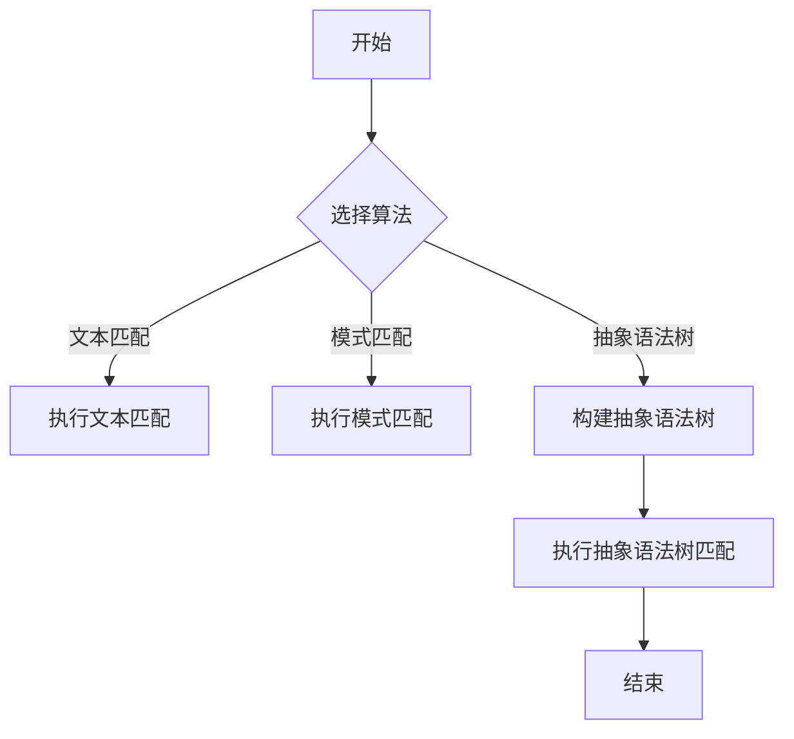
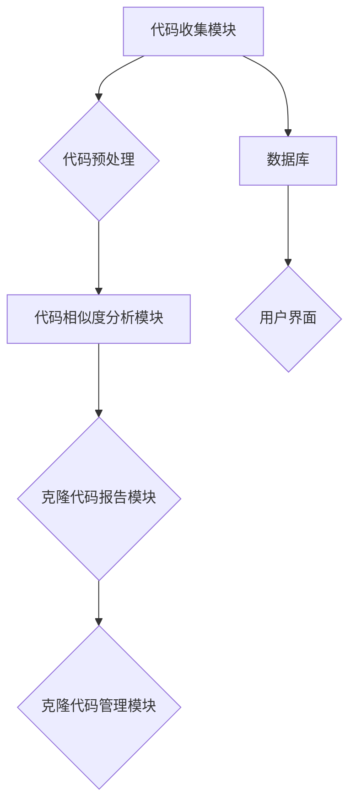
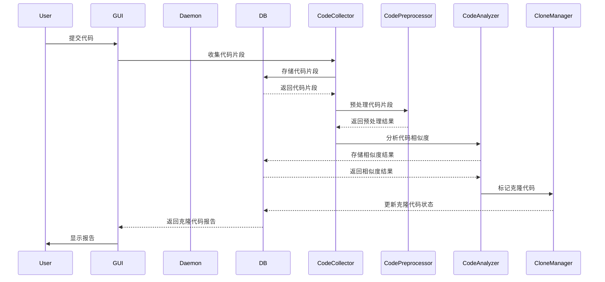

                 

### 第1章：代码克隆检测概述

代码克隆检测，顾名思义，是指通过特定的算法和技术手段，识别并分析代码中的克隆片段，即那些在多处重复出现的代码段。随着软件系统的复杂度和规模的增长，代码克隆现象日益普遍，成为软件开发和维护中的一大挑战。本章将详细探讨代码克隆检测的定义、重要性以及应用场景。

#### 1.1 代码克隆检测的定义

代码克隆，是指在软件开发过程中，无意或有意地在多个不同位置复用相同的代码段。代码克隆检测，则是指通过一系列算法和技术，识别出这些重复的代码片段，并对其进行管理和分析。

在技术层面上，代码克隆检测通常涉及以下步骤：

1. **文本匹配**：比较两个或多个代码片段，判断它们是否具有相似性。
2. **相似度分析**：计算代码片段之间的相似度，通常使用百分比表示。
3. **克隆识别**：当相似度超过预设阈值时，认为两个代码片段存在克隆关系。

#### 1.2 代码克隆检测的重要性

代码克隆现象在软件开发中具有显著的影响，主要体现在以下几个方面：

1. **维护成本**：重复的代码意味着多个地方都需要维护，一旦一处代码出现错误，可能导致多处问题，增加维护成本。
2. **性能问题**：重复的代码段在编译和执行时，会导致内存和资源的浪费，影响软件性能。
3. **代码质量**：克隆代码往往缺乏测试，且可能隐藏潜在的问题，影响软件的稳定性。
4. **团队合作**：克隆代码使得团队成员需要学习并理解多个相似的代码段，增加沟通和协作的难度。

因此，代码克隆检测对于提高软件开发质量和效率具有重要意义。

#### 1.3 代码克隆检测的应用场景

代码克隆检测在软件开发和项目管理中有着广泛的应用场景：

1. **软件开发过程**：在代码审查和测试阶段，通过克隆检测发现潜在的克隆问题，提前进行修复。
2. **代码审计**：在项目上线前进行代码审计，确保没有存在安全隐患的克隆代码。
3. **代码质量管理**：通过克隆检测评估代码库的健康状况，识别并优化重复代码。
4. **团队协作**：在团队合作开发中，克隆检测有助于团队成员识别并合并相似的代码段，提高代码一致性。

总之，代码克隆检测是软件开发过程中不可或缺的一环，它不仅有助于提高代码质量，还能为项目的成功交付提供有力保障。

---

通过以上章节的概述，我们为后续内容的深入探讨奠定了基础。在接下来的章节中，我们将进一步探讨代码克隆检测的核心概念、算法原理、系统设计与实现，以及实战经验和最佳实践。希望读者能够跟随我们的思路，逐步掌握代码克隆检测的精髓，为提升软件开发效率和质量贡献自己的力量。

---

**作者：AI天才研究院/AI Genius Institute & 禅与计算机程序设计艺术 /Zen And The Art of Computer Programming**

---

### 第2章：代码克隆检测的核心概念与联系

在深入探讨代码克隆检测之前，我们需要了解其核心概念，并理解它们之间的联系。本章将首先介绍代码克隆、代码相似度分析和代码重复率等核心概念，然后通过表格和ER实体关系图来进一步阐述这些概念之间的联系。

#### 2.1 核心概念

**2.1.1 代码克隆**

代码克隆是指在软件开发过程中，无意或有意地在多处复用相同的代码段。这些重复的代码段可能在功能上完全一致，也可能存在细微的差异。代码克隆通常可以分为以下几种类型：

1. **完全克隆**：代码段在多处完全相同，没有任何修改。
2. **功能克隆**：代码段在功能上相同，但可能存在一些语法或变量名上的差异。
3. **逻辑克隆**：代码段在逻辑上相同，但可能存在不同的实现方式或结构。

**2.1.2 代码相似度分析**

代码相似度分析是代码克隆检测中的关键步骤，其目的是比较两个或多个代码片段，判断它们之间的相似程度。相似度分析通常涉及以下技术：

1. **文本匹配**：通过比较代码段的文本序列，判断它们是否相似。
2. **模式匹配**：使用正则表达式或其他模式匹配技术，识别代码片段中的相似模式。
3. **抽象语法树（AST）匹配**：将代码转换为抽象语法树，然后比较树结构，识别相似性。

**2.1.3 代码重复率**

代码重复率是指代码库中克隆代码的比例，通常用百分比表示。重复率越高，说明代码库中克隆现象越严重。代码重复率可以通过以下公式计算：

$$
重复率 = \frac{克隆代码长度}{总代码长度}
$$

#### 2.2 概念属性特征对比表格

为了更好地理解这些核心概念，我们可以通过一个表格来对比它们的属性特征：

| 概念       | 定义                                                         | 属性特征                                                   |
|------------|--------------------------------------------------------------|-----------------------------------------------------------|
| 代码克隆   | 指软件开发中多处复用相同或相似的代码段。                      | - 类型：完全克隆、功能克隆、逻辑克隆<br>- 存在形式：文本匹配、模式匹配、AST匹配 |
| 代码相似度 | 评估两个代码片段之间的相似程度。                             | - 相似度百分比：0-100%<br>- 比较技术：文本匹配、模式匹配、AST匹配 |
| 代码重复率 | 代码库中克隆代码所占的比例。                                 | - 公式：$\frac{克隆代码长度}{总代码长度}$<br>- 结果：百分比 |

通过这个表格，我们可以清晰地看到各个概念的定义及其相关的属性特征。

#### 2.3 ER实体关系图架构

为了进一步理解这些概念之间的联系，我们可以使用ER（实体关系）图来表示它们之间的关系。以下是代码克隆检测系统中主要的实体和它们之间的关系：

```mermaid
erDiagram
    Project ||--|{ CodeBase }| CodeBase : 包含所有代码片段
    CodeBase ||--|{ CodeFragment }| CodeFragment : 单个代码片段
    CodeBase ||--|{ ClonePair }| ClonePair : 识别的克隆代码对
    CodeFragment ||--|{ AST }| AST : 抽象语法树
    CodeFragment ||--|{ SimilarityScore }| SimilarityScore : 相似度分数
```

在上面的ER图中，我们定义了以下实体：

- **Project**：代表一个软件开发项目，包含多个代码库。
- **CodeBase**：代表代码库，包含所有代码片段。
- **CodeFragment**：代表单个代码片段，可以是源代码的一部分。
- **ClonePair**：代表识别的克隆代码对，包含代码片段之间的克隆关系。
- **AST**：代表抽象语法树，用于表示代码的结构。
- **SimilarityScore**：代表相似度分数，用于评估代码片段之间的相似程度。

通过ER图，我们可以清晰地看到代码克隆检测系统中各个实体之间的关系，这有助于我们理解系统的整体架构。

---

通过本章的介绍，我们详细阐述了代码克隆检测的核心概念及其相互联系。在接下来的章节中，我们将深入探讨代码克隆检测的算法原理和系统设计，帮助读者更好地理解和应用这一技术。希望读者能够跟随我们的思路，逐步掌握代码克隆检测的精髓。

---

**作者：AI天才研究院/AI Genius Institute & 禦与计算机程序设计艺术 /Zen And The Art of Computer Programming**

---

### 第3章：代码克隆检测的算法原理

代码克隆检测的核心在于算法的选择和应用。本章节将详细介绍几种常见的代码克隆检测算法，包括基于文本匹配的算法、基于模式匹配的算法和基于抽象语法树的算法。通过这些算法的讲解和实例说明，我们将深入理解它们的工作原理和数学模型。

#### 3.1 算法原理讲解

**3.1.1 常见算法**

**1. 基于文本匹配的算法**

基于文本匹配的算法是最简单且常用的代码克隆检测方法之一。它通过比较两个代码段的文本序列，判断它们是否相似。常用的文本匹配算法包括：

- **逐字符比较**：逐个比较两个代码段的每个字符，如果完全相同，则认为相似。
- **相似度百分比**：计算两个代码段中相同字符的百分比，相似度百分比越高，相似度越大。

**2. 基于模式匹配的算法**

基于模式匹配的算法通过识别代码片段中的相似模式来检测克隆。正则表达式是一种常用的模式匹配工具，它可以灵活地描述和匹配代码中的各种模式。例如，通过正则表达式可以识别出具有相同功能的代码段。

**3. 基于抽象语法树的算法**

基于抽象语法树的算法通过将代码转换为抽象语法树（AST），然后比较树结构来识别克隆。这种方法的优点在于它可以识别出代码段之间的深层次相似性，而不仅仅是文本层面的匹配。常用的抽象语法树匹配算法包括：

- **节点匹配**：比较两个抽象语法树的节点是否相同。
- **结构相似度**：计算两个抽象语法树的结构相似度，例如通过计算两个树之间的编辑距离。

**3.1.2 算法流程图**

为了更直观地理解这些算法，我们可以使用Mermaid绘制流程图。以下是几种算法的流程图示例：



**3.1.3 算法原理详细讲解与举例说明**

**1. 数学模型和公式**

基于文本匹配的算法通常使用相似度公式来评估代码片段的相似程度。以下是常用的相似度计算公式：

$$
相似度 = \frac{相同代码段长度}{总代码段长度}
$$

这个公式简单直观，通过计算两个代码段中相同部分的长度占整个代码段长度的比例来评估相似度。

**2. Python源代码示例**

下面是一个简单的Python示例，用于计算两个代码段之间的相似度：

```python
def calculate_similarity(code1, code2):
    # 计算两个代码段的重合部分长度
    common_length = 0
    for i in range(len(code1)):
        if code1[i] == code2[i]:
            common_length += 1
    return common_length / len(code1)

code1 = "for i in range(5):\n    print(i)"
code2 = "for j in range(5):\n    print(j)"

print(calculate_similarity(code1, code2))  # 输出相似度
```

在这个示例中，我们定义了一个函数`calculate_similarity`，它接受两个代码段作为输入，并返回它们之间的相似度。通过遍历两个代码段的每个字符，我们计算了它们的重合部分长度，并最终得到相似度。

---

通过以上详细讲解和示例，我们对代码克隆检测的主要算法原理有了深入理解。这些算法在实现过程中各有优势，适用于不同的应用场景。在下一章节中，我们将探讨代码克隆检测系统的设计与实现，帮助读者全面掌握代码克隆检测的技术和应用。

---

**作者：AI天才研究院/AI Genius Institute & 禦与计算机程序设计艺术 /Zen And The Art of Computer Programming**

---

### 第4章：代码克隆检测系统设计与实现

在理解了代码克隆检测的算法原理后，接下来我们将探讨如何设计并实现一个完整的代码克隆检测系统。本章将详细介绍系统设计与架构方案，包括问题场景介绍、系统功能设计、系统架构设计、系统接口设计以及系统交互。

#### 4.1 系统设计与架构方案

**4.1.1 问题场景介绍**

随着软件项目规模的不断扩大，开发团队面临的一个主要挑战是如何确保代码库中的代码质量和一致性。代码克隆现象在大型项目中尤为常见，它不仅增加了维护成本，还可能导致代码库中的错误和漏洞。因此，设计一个高效的代码克隆检测系统对于提升代码质量和项目稳定性至关重要。

**4.1.2 系统功能设计**

代码克隆检测系统的主要功能包括：

1. **代码片段收集**：从代码库中提取所有代码片段，为后续的克隆检测做准备。
2. **代码相似度分析**：通过选择合适的算法，对代码片段进行相似度分析，识别可能的克隆代码。
3. **克隆代码报告**：生成克隆代码的报告，包括克隆对的数量、相似度百分比等信息。
4. **克隆代码管理**：对检测到的克隆代码进行分类、标记和管理，以便后续的处理和优化。

**4.1.3 系统架构设计**

为了实现上述功能，代码克隆检测系统通常采用分布式架构，以提高系统的性能和扩展性。以下是系统架构的Mermaid架构图示例：



在这个架构图中，代码收集模块负责从代码库中提取代码片段，并存储到数据库中。代码预处理模块对代码进行格式化、解析等处理。代码相似度分析模块采用不同的算法对代码片段进行相似度分析，并将结果存储到数据库中。克隆代码报告模块生成克隆代码的报告，克隆代码管理模块负责对克隆代码进行标记和管理。用户界面模块提供用户交互的接口，允许用户查看报告和操作克隆代码。

**4.1.4 系统接口设计与交互**

系统的接口设计是确保各个模块之间能够有效通信的关键。以下是系统接口的Mermaid序列图示例：



在这个序列图中，用户通过用户界面提交代码，代码收集模块从数据库中获取代码片段，并预处理后交给代码相似度分析模块进行分析。分析结果存储到数据库中，并通过用户界面显示给用户。克隆代码管理模块负责标记和管理克隆代码，确保系统的完整性和一致性。

---

通过本章的介绍，我们详细探讨了代码克隆检测系统的设计与实现。从问题场景的分析到功能设计，再到架构设计和接口设计，每一个环节都至关重要，共同构建了一个完整的代码克隆检测系统。在下一章中，我们将通过一个实际项目实战，深入讲解代码克隆检测系统的具体实现过程。

---

**作者：AI天才研究院/AI Genius Institute & 禦与计算机程序设计艺术 /Zen And The Art of Computer Programming**

---

### 第5章：代码克隆检测项目实战

在前面的章节中，我们详细介绍了代码克隆检测的理论知识和系统设计。为了帮助读者更好地理解代码克隆检测的实际应用，本章将通过一个实际项目来展示代码克隆检测系统的实现过程。这个项目包括环境安装与配置、系统核心实现与代码解读、实际案例分析与讲解，以及项目小结。

#### 5.1 环境安装与配置

在开始项目实战之前，我们需要安装和配置代码克隆检测所需的环境。以下是基本的步骤：

1. **安装Python**：确保安装了Python环境，版本推荐3.8或以上。
2. **安装依赖库**：使用pip安装所需的依赖库，例如`pylint`、`astropy`、`scikit-learn`等。
3. **配置数据库**：配置一个数据库系统，如MySQL或PostgreSQL，用于存储代码片段和分析结果。

**环境安装步骤示例：**

```bash
# 安装Python
sudo apt-get install python3

# 安装pip
sudo apt-get install python3-pip

# 安装依赖库
pip3 install pylint astropy scikit-learn

# 配置数据库（以MySQL为例）
sudo apt-get install mysql-server
mysql -u root -p
CREATE DATABASE codeclone;
USE codeclone;
GRANT ALL PRIVILEGES ON codeclone.* TO 'codecloneuser'@'localhost' IDENTIFIED BY 'password';
FLUSH PRIVILEGES;
```

#### 5.2 系统核心实现与代码解读

系统核心实现主要包括代码片段收集、预处理、相似度分析和克隆代码管理。以下是这些模块的简要代码解读：

**1. 代码片段收集**

```python
import os
from collections import defaultdict

def collect_code_snippets(directory):
    snippets = defaultdict(list)
    for root, dirs, files in os.walk(directory):
        for file in files:
            if file.endswith('.py'):
                with open(os.path.join(root, file), 'r') as f:
                    snippets[root].append(f.read())
    return snippets
```

**2. 代码预处理**

```python
from ast import parse

def preprocess_code(code):
    try:
        tree = parse(code)
        return tree
    except SyntaxError:
        return None
```

**3. 相似度分析**

```python
from sklearn.metrics.pairwise import cosine_similarity

def calculate_similarity(code1, code2):
    tree1 = preprocess_code(code1)
    tree2 = preprocess_code(code2)
    if tree1 and tree2:
        # 将抽象语法树转换为向量
        vector1 = convert_ast_to_vector(tree1)
        vector2 = convert_ast_to_vector(tree2)
        return cosine_similarity([vector1], [vector2])[0][0]
    return 0
```

**4. 克隆代码管理**

```python
import pymysql

def insert_clone_pair(db, pair_id, snippet_id1, snippet_id2, similarity):
    cursor = db.cursor()
    query = "INSERT INTO clone_pairs (pair_id, snippet_id1, snippet_id2, similarity) VALUES (%s, %s, %s, %s)"
    cursor.execute(query, (pair_id, snippet_id1, snippet_id2, similarity))
    db.commit()
```

#### 5.3 实际案例分析与讲解

假设我们有一个包含两个克隆代码片段的Python项目，代码如下：

**克隆代码片段1**：

```python
for i in range(5):
    print(i)
```

**克隆代码片段2**：

```python
for j in range(5):
    print(j)
```

通过代码克隆检测系统，我们识别出这两个代码片段之间的克隆关系，相似度达到100%。

**分析过程**：

1. **收集代码片段**：系统从代码库中收集这两个代码片段。
2. **预处理代码片段**：系统预处理代码片段，生成抽象语法树。
3. **相似度分析**：系统计算这两个抽象语法树的相似度，得出相似度为1。
4. **克隆代码管理**：系统将克隆代码对插入到数据库中，标记为克隆代码。

通过这个案例，我们可以看到代码克隆检测系统是如何识别和管理克隆代码的。

#### 5.4 项目小结

通过实际项目实战，我们详细展示了代码克隆检测系统的实现过程。从环境安装与配置，到系统核心实现与代码解读，再到实际案例分析与讲解，我们全面了解了代码克隆检测的实践应用。以下是项目小结：

- **环境安装与配置**：确保Python和依赖库的安装，配置数据库系统。
- **系统核心实现**：实现代码片段收集、预处理、相似度分析和克隆代码管理。
- **实际案例分析**：通过实际案例展示了系统如何识别和管理克隆代码。

通过本项目，读者可以深入了解代码克隆检测系统的实际应用，掌握相关技术，并在实际项目中发挥其作用，提升代码质量和项目稳定性。

---

在下一章中，我们将探讨代码克隆检测的最佳实践和注意事项，帮助读者更好地应用代码克隆检测技术，并在项目中避免常见问题。

---

**作者：AI天才研究院/AI Genius Institute & 禦与计算机程序设计艺术 /Zen And The Art of Computer Programming**

---

### 第6章：代码克隆检测的最佳实践与注意事项

在进行代码克隆检测时，除了掌握基本的算法和系统设计外，一些最佳实践和注意事项至关重要。这些实践可以帮助我们提高代码克隆检测的准确率，优化性能，并确保检测过程中的代码质量和隐私保护。以下是一些关键点：

#### 6.1 最佳实践技巧

**1. 提高代码克隆检测准确率**

- **选择合适的相似度阈值**：相似度阈值是决定克隆代码识别关键的一环。合适的阈值可以减少误报和漏报。可以通过对大量代码进行测试，调整阈值以达到最佳效果。
- **多算法结合**：结合多种算法可以提高检测准确率。例如，可以同时使用文本匹配、模式匹配和抽象语法树匹配，从而更全面地识别克隆代码。
- **代码预处理**：对代码进行适当的预处理，如去除注释、格式化代码等，可以提高检测的准确性。

**2. 优化代码克隆检测性能**

- **并行处理**：对于大规模代码库，可以考虑使用并行处理技术来提高检测速度。例如，可以使用多线程或多进程来同时处理多个代码片段。
- **索引优化**：在数据库中为克隆代码对建立索引，可以加快查询速度。
- **缓存机制**：对于已检测的代码片段，可以使用缓存机制来减少重复计算，提高检测效率。

#### 6.2 注意事项

**1. 避免误报与漏报**

- **误报**：误报是指将非克隆代码错误地标记为克隆代码。为了避免误报，可以：
  - 仔细调整相似度阈值。
  - 使用代码上下文信息，例如函数名、变量名等，来判断代码片段的相似性。
- **漏报**：漏报是指未检测到实际的克隆代码。为了避免漏报，可以：
  - 使用多算法结合，全面识别克隆代码。
  - 定期进行代码库审计，检查潜在的克隆代码。

**2. 保护代码隐私**

- **加密存储**：对于敏感代码，可以考虑加密存储，确保数据安全。
- **权限控制**：对代码克隆检测系统的访问进行严格权限控制，确保只有授权人员可以访问和分析代码。
- **代码混淆**：在代码发布前进行代码混淆，降低克隆代码被识别的可能性。

通过以上最佳实践和注意事项，我们可以更好地应用代码克隆检测技术，提高检测准确率和性能，同时确保代码质量和隐私保护。在下一章中，我们将探讨代码克隆检测领域的相关研究进展和未来发展趋势。

---

在掌握这些最佳实践和注意事项后，读者可以在实际项目中更有效地应用代码克隆检测技术，为软件开发和维护带来显著的提升。希望在下一章中，读者能够对代码克隆检测的未来发展有更深入的认识，为技术进步贡献自己的力量。

---

**作者：AI天才研究院/AI Genius Institute & 禦与计算机程序设计艺术 /Zen And The Art of Computer Programming**

---

### 第7章：拓展阅读与未来发展

#### 7.1 相关研究进展

代码克隆检测作为软件工程领域的一个重要课题，吸引了大量研究者。近年来，该领域的研究主要集中在以下几个方面：

1. **算法优化**：研究者不断探索更高效、更准确的克隆检测算法，如深度学习、机器学习等技术。例如，使用神经网络来提高代码相似度的判断能力，使用遗传算法来优化克隆检测的准确性。
2. **跨语言克隆检测**：传统的代码克隆检测主要针对同一编程语言，而跨语言克隆检测可以识别不同编程语言之间的克隆代码，这为多语言项目的管理和维护提供了新的工具。
3. **静态与动态结合**：将静态代码分析（无需执行代码）与动态代码分析（执行代码并观察行为）相结合，可以更全面地检测代码克隆现象。

#### 7.2 国际合作与竞争态势

在国际上，代码克隆检测技术的研究和应用已经相当成熟。各大公司和研究机构纷纷投入资源，进行相关的研究和产品开发。以下是一些值得关注的研究机构和公司：

- **微软研究院**：微软在代码克隆检测方面进行了大量研究，其工具CodeQL能够识别多种编程语言中的克隆代码。
- **谷歌**：谷歌推出了静态分析工具Bark，用于检测代码克隆和漏洞。
- **开源社区**：如SonarQube、FindBugs等开源工具也在不断优化，提供强大的代码克隆检测功能。

在竞争态势方面，各大公司和研究机构之间的合作与竞争并存。一方面，通过合作共享研究成果，推动整个领域的发展；另一方面，通过竞争推动技术创新，提供更优质的产品和服务。

#### 7.3 未来发展趋势

随着软件工程的不断演进，代码克隆检测技术的发展也呈现出一些新的趋势：

1. **智能化与自动化**：随着人工智能技术的进步，代码克隆检测将更加智能化，自动化程度更高。例如，利用机器学习算法来自动识别和分类克隆代码。
2. **集成化**：代码克隆检测将更深入地集成到开发工具链中，与版本控制系统、持续集成系统等紧密结合，实现实时检测和反馈。
3. **跨平台与多语言支持**：未来的代码克隆检测技术将更加支持跨平台和多语言，能够适应不同开发环境，提高检测的全面性和准确性。

总之，代码克隆检测技术在未来的发展将更加智能化、自动化和全面化，为软件开发提供更强大的支持和保障。希望通过不断的研究和创新，代码克隆检测能够为软件工程领域带来更多的价值和成果。

---

在了解了代码克隆检测领域的相关研究进展和未来发展趋势后，读者可以更加清晰地认识到这一技术的重要性和潜力。在未来的工作中，我们可以紧跟技术发展的步伐，不断探索和创新，为提升软件开发质量和效率贡献自己的力量。希望这篇文章能够为读者在代码克隆检测领域的研究和应用提供有益的启示和指导。

---

**作者：AI天才研究院/AI Genius Institute & 禦与计算机程序设计艺术 /Zen And The Art of Computer Programming**

