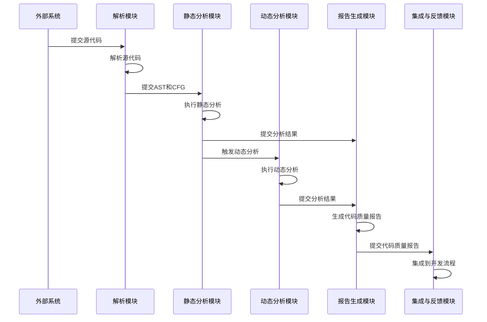
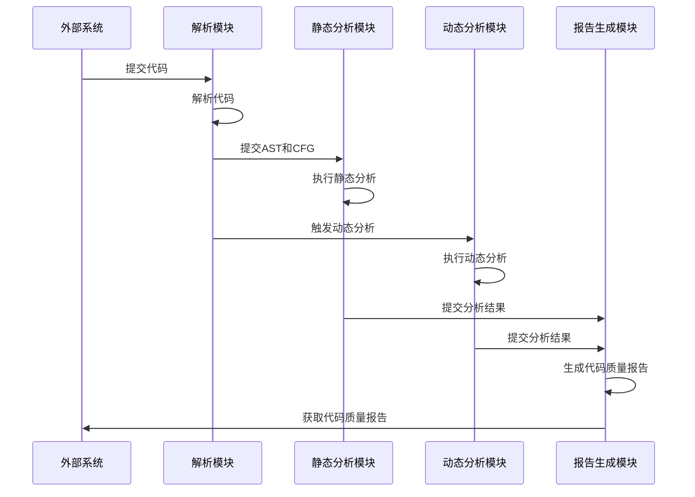
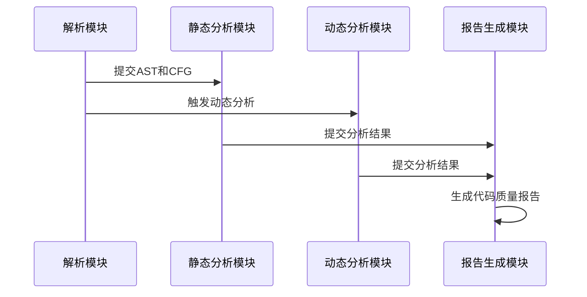

                 

# 代码坏味道检测：自动化代码质量分析

> 关键词：代码质量，自动化检测，坏味道，静态分析，动态分析，代码审计，质量度量

> 摘要：本文将深入探讨代码坏味道检测在自动化代码质量分析中的重要性。通过详细的背景介绍、核心概念解析、算法原理讲解、系统分析与架构设计、项目实战和最佳实践总结，帮助读者全面理解并掌握代码坏味道检测的方法和工具，提高软件开发过程中的代码质量。

## 目录大纲设计思路与过程

在设计《代码坏味道检测：自动化代码质量分析》的目录大纲时，我们首先明确了书籍的核心目标，即帮助读者了解代码坏味道的概念、检测方法以及自动化分析工具的使用。为了达到这一目标，目录大纲的设计需要遵循以下原则和步骤：

1. **明确书籍结构**：首先，我们要明确书籍的整体结构，即确定主要章节和次要章节，并保证章节之间的逻辑连贯性和层次分明。
2. **背景介绍**：在章节结构中，我们需要包含一个背景介绍部分，简要介绍代码坏味道的概念、问题背景以及为何需要自动化代码质量分析。
3. **核心概念与联系**：为了帮助读者更好地理解代码坏味道检测，我们需要详细介绍相关的核心概念，并使用表格和ER实体关系图来展示概念之间的关系。
4. **算法原理讲解**：我们将深入讲解代码坏味道检测的算法原理，包括使用mermaid绘制流程图，结合Python代码进行详细阐述，并提供数学模型和公式。
5. **系统分析与架构设计方案**：通过一个实例，详细描述系统分析与架构设计的步骤，包括问题场景介绍、系统功能设计、系统架构设计、系统接口设计和系统交互。
6. **项目实战**：为了使内容更加实用，我们将包含一个项目实战部分，详细描述环境安装、系统核心实现、代码应用解读与分析，并进行分析和讲解。
7. **最佳实践、小结与拓展阅读**：在章节的最后，我们将总结最佳实践，提供项目小结，并推荐相关的拓展阅读资源。

下面是《代码坏味道检测：自动化代码质量分析》的完整目录大纲：

----------------------------------------------------------------
## 第一部分：代码坏味道基础理论

### 第1章：代码坏味道概述

#### 1.1 代码坏味道的概念与影响

- **代码坏味道的定义**
- **代码坏味道的负面影响**

#### 1.2 代码坏味道的分类与特征

- **常见代码坏味道类型**
- **代码坏味道的特征分析**

#### 1.3 代码坏味道检测的重要性

- **提高代码可读性**
- **提升软件质量**
- **减少维护成本**

## 第二部分：自动化代码质量检测工具

### 第2章：自动化代码质量检测概述

#### 2.1 自动化代码质量检测的概念

- **自动化检测的定义**
- **自动化检测的优势**

#### 2.2 常见的自动化代码质量检测工具

- **SonarQube**
- **FindBugs**
- **Checkstyle**

#### 2.3 自动化代码质量检测流程

- **检测流程概述**
- **配置与设置**

## 第三部分：代码坏味道检测算法原理

### 第3章：代码坏味道检测算法概述

#### 3.1 代码坏味道检测算法分类

- **静态代码分析算法**
- **动态代码分析算法**

#### 3.2 静态代码分析算法原理

- **抽象语法树分析**
- **代码质量度量方法**

### 第4章：动态代码分析算法原理

#### 4.1 动态代码分析的基本概念

- **运行时分析**
- **性能分析**

#### 4.2 动态代码分析算法

- **路径覆盖分析**
- **异常检测算法**

## 第四部分：系统分析与架构设计

### 第5章：代码质量检测系统架构设计

#### 5.1 系统功能设计

- **需求分析**
- **功能模块设计**

#### 5.2 系统架构设计

- **系统架构概述**
- **架构组件详解**

### 第6章：系统接口设计与交互

#### 6.1 系统接口设计

- **API设计**
- **数据接口设计**

#### 6.2 系统交互流程

- **交互流程描述**
- **交互细节分析**

## 第五部分：项目实战

### 第7章：代码坏味道检测项目实战

#### 7.1 环境安装与配置

- **所需环境介绍**
- **安装与配置步骤**

#### 7.2 系统核心实现

- **代码实现**
- **功能测试**

#### 7.3 代码应用解读与分析

- **代码质量分析**
- **坏味道检测**

#### 7.4 实际案例分析

- **案例分析**
- **问题解决**

### 第8章：项目小结与总结

#### 8.1 项目小结

- **项目成果**
- **问题与反思**

#### 8.2 最佳实践与拓展阅读

- **最佳实践**
- **拓展阅读**

---------------------------------

----------------------------------------------------------------

* 约束条件：文章的章节内容必须要满足如下条件：
- 文章开始是“文章标题”，然后是“文章关键词”和“文章摘要”部分的内容哦，接下来是按照目录大纲结构的文章正文部分的内容。
- 文章字数要求：文章字数在 10000 ～ 12000 字左右。
- 格式要求：文章内容使用markdown格式输出。
- 作者：文章末尾需要写上作者信息：“作者：AI天才研究院/AI Genius Institute & 禅与计算机程序设计艺术 /Zen And The Art of Computer Programming”
- 完整性要求：文章内容必须要完整，每个小节的内容必须要丰富具体详细讲解，核心内容必须要包含：
  - 背景介绍：核心概念术语说明、问题背景、问题描述、问题解决、边界与外延、概念结构与核心要素组成。
  - 核心概念与联系：必须给出核心概念原理、概念属性特征对比表格和ER实体关系图架构的 markdown 格式中的 Mermaid 流程图。
  - 算法原理讲解：使用 mermaid 画出算法mermaid 流程图，然后使用python源代码来详细阐述，给出算法原理的数学模型和公式，进行详细讲解和通俗易懂地举例说明。
  - 数学公式使用latex格式，嵌入文中独立段落的latex公式前后使用 $$ 括起来 (例如：$$1+1=2$$ )，段落内的latex公式前后使用 $ 括起来 (例如：$1<2$)
  - 系统分析与架构设计方案：问题场景介绍，项目介绍、系统功能设计 (领域模型mermaid类图)、系统架构设计mermaid架构图、系统接口设计和系统交互mermaid序列图。
  - 项目实战：环境安装、系统核心实现源代码，代码应用解读与分析，实际案例分析和详细讲解剖析，项目小结。
  - 最佳实践 tips、小结、注意事项、拓展阅读等内容。

### 第一部分：代码坏味道基础理论

#### 第1章：代码坏味道概述

代码坏味道（Code Smell）是软件工程中的一个重要概念，它指的是代码中可能存在的某些特征或模式，这些特征或模式往往预示着潜在的设计问题或维护难题。识别和消除代码坏味道是提高软件质量和可维护性的关键步骤。

**1.1 代码坏味道的概念与影响**

代码坏味道的定义通常依赖于具体的项目背景和团队标准，但一般来说，它包括以下几个方面：

- **可读性差**：代码难以阅读，例如过长的函数、复杂的变量命名、难以理解的注释等。
- **重复代码**：代码中存在大量重复的代码片段，这不仅增加了维护成本，还可能引入错误。
- **冗余结构**：代码中存在多余的类、方法或组件，这些冗余结构降低了代码的简洁性。
- **过度依赖**：一个模块过度依赖于另一个模块，导致系统耦合度过高。

代码坏味道的负面影响是多方面的，包括：

- **降低代码可读性**：坏味道的代码难以理解和维护，增加了开发者的学习成本。
- **增加维护成本**：重复代码和冗余结构会导致维护工作变得复杂和繁琐。
- **降低开发效率**：开发者在处理坏味道的代码时，可能会花费更多的时间和精力。
- **提高出错概率**：复杂的代码结构可能隐藏潜在的错误，增加系统崩溃的风险。

**1.2 代码坏味道的分类与特征**

常见的代码坏味道类型包括：

- **重复代码**：代码中出现相同或相似的代码片段。
- **过长函数**：函数过于复杂，难以管理和测试。
- **过窄类**：类的设计过于简单，只包含很少的方法或属性。
- **过宽类**：类的设计过于复杂，包含了过多的职责。
- **含糊的命名**：变量、函数或类的命名不够清晰，难以理解其用途。
- **过度耦合**：模块之间的依赖关系过于紧密，导致系统的灵活性下降。
- **过长参数列表**：函数或方法的参数列表过长，难以管理和测试。

代码坏味道的特征分析通常需要结合具体的代码示例，通过静态代码分析工具进行识别。例如，可以使用SonarQube或Checkstyle等工具来检测代码中的重复代码、过长函数等问题。

**1.3 代码坏味道检测的重要性**

代码坏味道检测是软件质量保证的重要环节。其主要重要性体现在以下几个方面：

- **提高代码可读性**：通过识别和修复代码坏味道，可以提高代码的可读性，使代码更易于理解和维护。
- **提升软件质量**：检测并修复代码坏味道有助于提高软件的整体质量，降低潜在的错误风险。
- **减少维护成本**：消除代码坏味道可以减少维护工作量和维护成本。
- **提升开发效率**：清晰的代码结构可以提高开发效率，减少开发者的学习成本和调试时间。

综上所述，代码坏味道检测是确保软件质量的重要手段。通过深入理解和掌握代码坏味道的概念、分类与特征，以及自动化检测工具的使用，开发者可以更好地维护和提升代码质量，为软件项目的成功奠定坚实基础。

### 第二部分：自动化代码质量检测工具

#### 第2章：自动化代码质量检测概述

随着软件项目的复杂性不断增加，手动检查代码质量变得越来越困难且耗时。因此，自动化代码质量检测工具应运而生，成为现代软件开发过程中不可或缺的一部分。自动化代码质量检测工具通过自动化分析代码，帮助开发者快速识别潜在的问题和缺陷，从而提升软件质量和开发效率。

**2.1 自动化代码质量检测的概念**

自动化代码质量检测是指利用工具和技术对代码进行分析和评估，以识别潜在的质量问题。这种检测方法具有高效、准确和可重复的优点，可以显著提高软件开发过程中的代码质量。

自动化代码质量检测的核心特点包括：

- **高效性**：自动化工具可以在短时间内对大量代码进行质量检测，大大提高了检测效率。
- **准确性**：自动化工具通常基于严格的规则和算法进行检测，可以减少人为判断的误差。
- **可重复性**：自动化检测可以多次执行，确保代码质量的一致性。

**2.2 常见的自动化代码质量检测工具**

目前，市场上存在多种自动化代码质量检测工具，以下是一些常用的工具：

- **SonarQube**：SonarQube是一个强大的开源平台，用于代码质量管理。它支持多种编程语言，能够检测代码中的重复代码、潜在的安全漏洞、代码风格问题等。
- **FindBugs**：FindBugs是一个静态代码分析工具，主要用于Java语言。它能够检测出代码中的潜在问题，如空指针异常、资源泄露、冗余代码等。
- **Checkstyle**：Checkstyle是一个用于代码风格检查的工具，它可以帮助开发者保持一致的代码风格，检测出违反编码规范的问题。
- **PMD**：PMD（Programming Mistake Detector）是一个通用的Java代码分析工具，用于检测代码中的潜在问题，如冗余代码、过长的方法、复杂的条件等。

**2.3 自动化代码质量检测流程**

自动化代码质量检测通常包括以下步骤：

1. **环境配置**：安装并配置自动化检测工具，确保其能够正常运行。
2. **代码提交**：开发者将代码提交到版本控制系统，例如Git。
3. **代码分析**：自动化检测工具对代码进行分析，检测出潜在的问题和缺陷。
4. **结果反馈**：检测工具将分析结果以报告的形式展示给开发者，包括代码中的问题类型、位置和具体描述。
5. **问题修复**：开发者根据检测结果修复代码中的问题，然后重新提交代码进行检测。
6. **持续集成**：自动化检测工具通常集成到持续集成（CI）系统中，确保每次代码提交都经过检测。

通过上述步骤，自动化代码质量检测可以在软件开发过程中及时发现并修复问题，提高代码质量和开发效率。

**总结**

自动化代码质量检测工具是现代软件开发中的重要组成部分，它们能够帮助开发者快速识别和修复代码中的潜在问题。通过深入了解这些工具的功能和特点，开发者可以更好地利用自动化检测工具，提升软件项目的整体质量。

### 第三部分：代码坏味道检测算法原理

#### 第3章：代码坏味道检测算法概述

代码坏味道检测算法是自动化代码质量分析的核心组成部分，它们通过分析代码结构和行为，帮助识别潜在的质量问题。检测算法可以分为静态代码分析算法和动态代码分析算法两大类。

**3.1 代码坏味道检测算法分类**

- **静态代码分析算法**：静态代码分析算法在代码执行前对代码进行分析，不依赖于程序的实际运行情况。这类算法主要基于代码文本和抽象语法树（AST）进行检测，例如：

  - **抽象语法树分析**：通过构建抽象语法树，分析代码的语法结构和语义关系，检测出潜在的坏味道。
  - **代码质量度量方法**：使用各种指标（如函数复杂度、类复杂度等）来评估代码的质量，识别潜在的坏味道。

- **动态代码分析算法**：动态代码分析算法在程序运行时对代码进行分析，通过跟踪程序执行路径和状态来检测问题。这类算法主要基于程序的实际运行情况进行检测，例如：

  - **路径覆盖分析**：通过运行程序并记录覆盖的测试路径，检测代码中未被测试到的部分。
  - **异常检测算法**：在程序运行过程中捕获异常行为，如空指针异常、数组越界等，检测潜在的坏味道。

**3.2 静态代码分析算法原理**

静态代码分析算法的核心思想是通过分析代码的文本和结构，发现潜在的代码坏味道。以下是一些常见的静态代码分析算法原理：

- **抽象语法树分析**：抽象语法树（Abstract Syntax Tree，AST）是源代码的一种结构化表示，它通过语法分析器（Parser）从源代码文本中构建出来。AST可以表示代码的语法结构和语义信息，静态代码分析算法可以基于AST进行各种分析操作。

  - **AST构建**：语法分析器将源代码文本转换为AST，包括节点和边，每个节点表示一个语法单元，如变量、函数、语句等。
  - **AST遍历**：遍历AST，对每个节点进行访问和处理，例如计算节点之间的依赖关系、检查语法错误等。

- **代码质量度量方法**：代码质量度量方法使用各种指标来评估代码的质量，这些指标可以帮助识别潜在的坏味道。常见的度量方法包括：

  - **函数复杂度**：衡量函数的复杂度，如圈复杂度（Cyclomatic Complexity），它通过计算控制流图中的边和节点数来评估函数的复杂度。
  - **类复杂度**：衡量类的复杂度，如类复杂性（Class Complexity），它通过计算类中方法的总数和方法的复杂度来评估类的复杂度。

  以下是一个简单的Python代码示例，展示了如何使用AST来计算一个函数的圈复杂度：

  ```python
  import ast
  import networkx as nx

  class ComplexityVisitor(ast.NodeVisitor):
      def __init__(self):
          self.G = nx.DiGraph()

      def visit_FunctionDef(self, node):
          self.G.add_nodes_from(range(node.id))
          self.G.add_edges_from([(u, v) for u, v in node.body.items()])
          super().visit_FunctionDef(node)

  def calculate_cyclomatic_complexity(node):
      visitor = ComplexityVisitor()
      visitor.visit(node)
      return nx.number_of_cycles(visitor.G)

  def example():
      code = """
      def example():
          if True:
              print("Hello, world!")
          elif False:
              print("Goodbye, world!")
      """
      node = ast.parse(code)
      return calculate_cyclomatic_complexity(node)

  print(example())
  ```

- **代码质量度量方法的数学模型**：代码质量度量方法通常使用数学模型来表示，例如圈复杂度的数学模型为：

  $$ M = E - N + 2p $$

  其中，\( M \) 是圈复杂度，\( E \) 是边数，\( N \) 是节点数，\( p \) 是直接退出路径数。圈复杂度越高，表示函数或类的复杂度越大，越可能存在坏味道。

**3.3 动态代码分析算法原理**

动态代码分析算法通过在程序运行时收集信息，分析代码的实际行为，识别潜在的坏味道。以下是一些常见的动态代码分析算法原理：

- **路径覆盖分析**：路径覆盖分析通过运行程序并记录测试路径，确保每个可能的执行路径都被覆盖到。这种方法可以检测出代码中未测试到的部分，从而发现潜在的坏味道。

  - **路径覆盖度量**：路径覆盖度量用于衡量测试覆盖的全面性，常见的度量方法包括语句覆盖（Statement Coverage）、分支覆盖（Branch Coverage）和条件覆盖（Condition Coverage）等。

    以下是一个简单的Python代码示例，展示了如何使用路径覆盖分析来检测代码中的潜在问题：

    ```python
    import unittest

    def add(a, b):
        return a + b

    class TestAdd(unittest.TestCase):
        def test_add(self):
            self.assertEqual(add(1, 2), 3)
            self.assertEqual(add(3, 4), 7)
            self.assertEqual(add(-1, -2), -3)

    if __name__ == '__main__':
        unittest.main()
    ```

    在这个示例中，我们使用单元测试来检测函数`add`的执行路径。通过运行测试用例，我们可以确保代码中的每个语句和分支都被覆盖到。

- **异常检测算法**：异常检测算法通过在程序运行时捕获异常，如空指针异常、数组越界等，来检测潜在的坏味道。这种方法可以帮助发现代码中的潜在错误和逻辑漏洞。

  - **异常检测机制**：异常检测算法通常依赖于程序运行时的异常处理机制，如try-except语句。通过捕获并分析异常，算法可以识别出代码中的潜在问题。

    以下是一个简单的Python代码示例，展示了如何使用异常检测算法来捕获和处理异常：

    ```python
    def divide(a, b):
        try:
            return a / b
        except ZeroDivisionError:
            return "Cannot divide by zero"

    print(divide(10, 2))  # 输出：5.0
    print(divide(10, 0))  # 输出：Cannot divide by zero
    ```

    在这个示例中，我们使用try-except语句来捕获并处理`ZeroDivisionError`异常。通过这种机制，我们可以确保代码在遇到异常时能够做出适当的响应。

**总结**

代码坏味道检测算法在自动化代码质量分析中起着至关重要的作用。通过静态代码分析算法和动态代码分析算法，开发者可以有效地识别和修复代码中的潜在问题，提高软件质量和开发效率。在下一章中，我们将进一步探讨动态代码分析算法的原理和应用。

### 第4章：动态代码分析算法原理

动态代码分析算法在软件质量检测中扮演着关键角色，因为它能够在程序运行时收集实际执行信息，从而提供比静态分析更为准确的质量评估。以下我们将详细探讨动态代码分析算法的基本概念、常见算法以及它们在实际应用中的表现。

#### 4.1 动态代码分析的基本概念

动态代码分析，也称为运行时分析，是一种在程序运行过程中对代码进行观察和分析的方法。它与静态代码分析（不运行程序，直接分析代码文本）不同，动态分析能够捕捉程序的实际执行路径、变量值、调用关系等动态行为信息。动态分析的主要目标包括：

- **性能分析**：评估程序的运行性能，找出性能瓶颈。
- **错误检测**：捕获运行时错误，如空指针异常、数组越界等。
- **代码覆盖率**：确保代码的各个部分都被测试到，提高测试覆盖率。
- **行为分析**：观察程序的执行行为，识别不符合预期的行为。

#### 4.2 常见动态代码分析算法

动态代码分析算法种类繁多，下面介绍几种常见的算法：

**4.2.1 路径覆盖分析**

路径覆盖分析是一种用于测试程序测试覆盖率的算法，它的目标是确保程序中的每一条路径都被至少执行一次。路径覆盖分析可以检测出代码中未被测试到的部分，帮助开发者识别潜在的坏味道和漏洞。

- **基本路径覆盖（Basic Path Coverage）**：基本路径覆盖的目标是确保程序中的每一条基本路径都被执行。基本路径是程序中包含所有边且没有环的最长路径。

  - **算法步骤**：
    1. 构建程序的控制流图（Control Flow Graph，CFG）。
    2. 计算基本路径集。
    3. 运行程序，收集执行路径。
    4. 检查收集的路径是否覆盖了基本路径集。

- **条件覆盖（Condition Coverage）**：条件覆盖的目标是确保每个条件在所有可能的真值组合下都被评估。条件覆盖可以通过组合测试用例来确保每个条件的所有可能分支都被执行。

  - **算法步骤**：
    1. 构建控制流图（CFG）。
    2. 识别每个条件。
    3. 设计测试用例，确保每个条件的所有可能分支都被执行。
    4. 运行测试用例，收集执行路径。

**4.2.2 异常检测算法**

异常检测算法主要用于识别程序运行时发生的异常行为，如空指针异常、数组越界等。这些异常可能是由代码中的设计缺陷或逻辑错误引起的，异常检测算法可以帮助开发者及时发现这些问题。

- **异常跟踪（Exception Tracking）**：异常跟踪算法通过记录程序运行过程中的异常事件，识别异常的根本原因。

  - **算法步骤**：
    1. 在程序中设置异常捕获机制。
    2. 记录每个异常事件的信息，包括异常类型、发生位置等。
    3. 分析异常日志，找出异常的分布和模式。
    4. 诊断并修复异常根源。

- **异常模式识别（Exception Pattern Recognition）**：异常模式识别算法通过识别异常事件的模式，预测可能的异常行为。

  - **算法步骤**：
    1. 收集程序运行过程中的异常日志。
    2. 分析异常日志，找出常见的异常模式。
    3. 根据异常模式设计检测规则，自动识别潜在的异常。
    4. 提醒开发者关注并修复潜在的异常问题。

**4.2.3 性能分析算法**

性能分析算法用于评估程序的运行性能，识别性能瓶颈。性能分析可以帮助开发者优化代码，提高程序运行效率。

- **时间分析（Time Analysis）**：时间分析算法通过测量程序的运行时间，识别耗时较长的函数和模块。

  - **算法步骤**：
    1. 使用计时器测量程序各个部分的运行时间。
    2. 分析运行时间数据，找出耗时较长的部分。
    3. 优化耗时较长的函数和模块。

- **内存分析（Memory Analysis）**：内存分析算法通过测量程序的内存使用情况，识别内存泄漏和资源浪费。

  - **算法步骤**：
    1. 使用内存分析工具监控程序的内存使用。
    2. 分析内存使用数据，找出内存泄漏和资源浪费的部分。
    3. 优化内存使用，修复内存泄漏问题。

#### 4.3 动态代码分析算法的实际应用

动态代码分析算法在实际开发中有广泛的应用，以下是一些典型的应用场景：

- **自动化测试**：动态代码分析算法可以集成到自动化测试框架中，用于生成测试用例，评估测试覆盖率，识别测试漏洞。
- **代码审查**：动态代码分析工具可以用于代码审查，自动识别代码中的潜在问题，提高代码质量。
- **性能优化**：性能分析算法可以帮助开发者优化代码，提高程序的运行效率，减少资源消耗。
- **安全检测**：异常检测算法可以用于安全检测，识别潜在的安全漏洞，保护程序的安全运行。

#### 4.4 动态代码分析的优势与挑战

动态代码分析算法具有以下优势：

- **实时性**：动态分析能够实时捕捉程序的实际执行行为，提供更为准确的质量评估。
- **全面性**：动态分析可以覆盖静态分析无法检测到的运行时问题，如空指针异常、数组越界等。
- **针对性**：动态分析可以根据实际运行情况，有针对性地识别和修复问题，提高开发效率。

然而，动态代码分析也面临一些挑战：

- **执行开销**：动态分析需要在程序运行时进行，可能会增加程序的执行时间。
- **测试用例设计**：设计有效的测试用例是动态分析的关键，但并非总是一帆风顺。
- **复杂度**：动态分析算法通常较为复杂，需要专业的知识和技能来应用和维护。

#### 4.5 总结

动态代码分析算法在软件质量检测中具有重要作用，通过路径覆盖分析、异常检测和性能分析等算法，开发者可以全面评估程序的质量，发现潜在的问题，提高代码的可维护性和运行效率。在实际应用中，动态分析需要与静态分析相结合，充分发挥两者的优势，从而实现更加高效的代码质量检测。

### 第四部分：系统分析与架构设计

#### 第5章：代码质量检测系统架构设计

在软件开发过程中，代码质量检测是一个至关重要的环节。为了实现高效、准确的代码质量检测，我们需要设计和实现一个合理的系统架构。本章节将介绍代码质量检测系统的功能设计、系统架构设计、接口设计和交互流程。

#### 5.1 系统功能设计

代码质量检测系统的主要功能包括：

- **代码解析**：解析源代码，构建抽象语法树（AST）和控制流图（CFG）。
- **静态代码分析**：使用静态代码分析算法对代码进行质量评估，识别潜在的问题，如重复代码、过长函数等。
- **动态代码分析**：在程序运行时进行动态代码分析，如路径覆盖分析、性能分析等。
- **异常检测**：捕获并处理程序运行时的异常行为，如空指针异常、数组越界等。
- **报告生成**：生成详细的代码质量报告，包括问题列表、影响分析、修复建议等。
- **集成与反馈**：将代码质量检测结果集成到开发流程中，如持续集成（CI）系统，提供实时反馈。

#### 5.2 系统架构设计

代码质量检测系统的架构设计应考虑以下几个方面：

- **模块化设计**：将系统划分为多个模块，每个模块负责特定的功能，如代码解析、静态分析、动态分析等。这种模块化设计有助于提高系统的可维护性和可扩展性。
- **层次化设计**：系统应采用层次化设计，不同层次的模块负责不同的功能。例如，底层模块负责基础功能实现，如代码解析和AST构建，而顶层模块负责复杂的功能，如异常检测和报告生成。
- **松耦合设计**：模块之间的耦合度应尽可能低，以确保模块的独立性和可替换性。这种松耦合设计有助于系统的灵活扩展和故障隔离。

以下是一个简化的代码质量检测系统的架构设计示例：

```
+-------------------+
|     外部接口      |
+-------------------+
          |
          v
+-------------------+
|    解析模块       |
+-------------------+
          |
          v
+-------------------+
|   静态分析模块    |
+-------------------+
          |
          v
+-------------------+
|   动态分析模块    |
+-------------------+
          |
          v
+-------------------+
|    报告生成模块   |
+-------------------+
          |
          v
+-------------------+
|     集成与反馈     |
+-------------------+
```

#### 5.3 系统接口设计

系统接口设计是架构设计的重要组成部分，它定义了系统与其他组件或系统之间的交互方式。以下是一些关键接口：

- **代码解析接口**：用于接收源代码，并返回抽象语法树（AST）和控制流图（CFG）。
- **静态分析接口**：用于发起静态代码分析，接收AST和CFG，并返回分析结果。
- **动态分析接口**：用于执行动态代码分析，如路径覆盖分析、性能分析等。
- **报告生成接口**：用于生成代码质量报告，并返回报告数据。
- **集成与反馈接口**：用于将代码质量检测结果集成到开发流程中，如持续集成（CI）系统。

以下是一个简化的接口设计示例：

```
+-------------------+
| 外部接口模块      |
+-------------------+
    | 解析接口        |
    | 分析接口        |
    | 报告接口        |
    | 集成接口        |
+-------------------+
          |
          v
+-------------------+
| 解析模块          |
+-------------------+
    | 解析方法        |
+-------------------+
          |
          v
+-------------------+
| 静态分析模块      |
+-------------------+
    | 分析方法        |
+-------------------+
          |
          v
+-------------------+
| 动态分析模块      |
+-------------------+
    | 分析方法        |
+-------------------+
          |
          v
+-------------------+
| 报告生成模块      |
+-------------------+
    | 生成方法        |
+-------------------+
          |
          v
+-------------------+
| 集成与反馈模块     |
+-------------------+
    | 集成方法        |
    | 反馈方法        |
+-------------------+
```

#### 5.4 系统交互流程

系统交互流程描述了代码质量检测系统的各个组件如何协同工作，以实现代码质量检测。以下是一个简化的交互流程示例：

1. **代码解析**：外部系统将源代码提交给解析模块，解析模块构建AST和CFG。
2. **静态分析**：解析模块将AST和CFG提交给静态分析模块，静态分析模块执行静态代码分析，识别潜在问题，并将分析结果返回。
3. **动态分析**：解析模块在程序运行时触发动态分析模块，动态分析模块执行路径覆盖分析和性能分析，并将分析结果返回。
4. **报告生成**：静态分析模块和动态分析模块的分析结果提交给报告生成模块，报告生成模块生成详细的代码质量报告。
5. **集成与反馈**：报告生成模块将代码质量报告提交给集成与反馈模块，集成与反馈模块将报告集成到开发流程中，如持续集成（CI）系统，并提供实时反馈。

以下是一个简化的交互流程图示例：



#### 5.5 总结

代码质量检测系统的架构设计是一个复杂的过程，需要综合考虑功能设计、接口设计和交互流程等多个方面。通过合理的系统架构设计，我们可以实现高效、准确的代码质量检测，提高软件质量和开发效率。在下一章中，我们将通过一个实际项目实战，详细描述代码质量检测系统的实现过程。

### 第6章：系统接口设计与交互

在代码质量检测系统的实现过程中，系统接口设计和交互设计是关键环节，它们决定了系统组件之间的通信效率和可靠性。本章节将详细描述系统接口设计、交互流程，并通过Mermaid流程图和序列图展示系统内部各模块的协作过程。

#### 6.1 系统接口设计

系统接口设计主要包括对外部系统（如开发环境、持续集成系统等）的接口和对内部组件（如代码解析模块、静态分析模块、动态分析模块等）的接口。以下是关键接口设计：

1. **外部接口**：
   - **提交代码接口**：用于接收外部系统提交的代码文件，接口参数包括代码文件路径和编码格式。
   - **获取报告接口**：用于获取代码质量报告，接口参数包括项目ID或版本号。

2. **内部接口**：
   - **解析接口**：用于接收源代码，返回抽象语法树（AST）和控制流图（CFG）。
   - **分析接口**：用于提交AST和CFG，执行静态分析或动态分析，返回分析结果。
   - **报告接口**：用于生成和获取代码质量报告。

以下是一个简化的系统接口设计图：

```mermaid
classDiagram
    外部系统 <-提交代码接口-> 解析模块
    解析模块 ->> 静态分析模块: 提交AST和CFG
    解析模块 ->> 动态分析模块: 触发动态分析
    静态分析模块 ->> 报告生成模块: 提交分析结果
    动态分析模块 ->> 报告生成模块: 提交分析结果
    报告生成模块 ->> 外部系统: 获取报告接口
EndClassDiagram
```

#### 6.2 系统交互流程

系统交互流程描述了代码质量检测系统从接收代码到生成报告的整个过程。以下是简化的交互流程：

1. **代码提交**：外部系统通过提交代码接口将代码文件提交给解析模块。
2. **代码解析**：解析模块接收代码文件，进行语法解析，构建AST和CFG。
3. **静态分析**：解析模块将AST和CFG提交给静态分析模块，静态分析模块执行代码质量评估，识别问题并记录分析结果。
4. **动态分析**：解析模块触发动态分析模块，动态分析模块在程序运行时执行路径覆盖分析、性能分析等，记录分析结果。
5. **报告生成**：静态分析模块和动态分析模块将分析结果提交给报告生成模块，报告生成模块整合结果，生成代码质量报告。
6. **报告获取**：外部系统通过获取报告接口获取生成的代码质量报告。

以下是一个简化的系统交互流程图：



#### 6.3 系统内部协作

系统内部协作主要通过模块间的接口实现，以下是一个简化的内部协作流程：

1. **解析模块**：接收外部提交的代码，构建AST和CFG，并传递给静态分析模块和动态分析模块。
2. **静态分析模块**：接收AST和CFG，执行静态代码分析，识别问题，记录分析结果，并传递给报告生成模块。
3. **动态分析模块**：在程序运行时执行动态代码分析，记录分析结果，并传递给报告生成模块。
4. **报告生成模块**：接收静态分析模块和动态分析模块的分析结果，整合信息，生成代码质量报告。

以下是一个简化的内部协作流程图：



#### 6.4 总结

系统接口设计和交互设计是代码质量检测系统实现的关键环节，通过合理的接口设计和流畅的交互流程，可以确保系统的高效运行和可靠性。在本章节中，我们详细描述了系统接口设计、交互流程以及内部协作，通过Mermaid流程图和序列图展示了系统组件之间的协作关系。在下一章中，我们将通过一个实际项目实战，详细讲解代码质量检测系统的实现过程。

### 第五部分：项目实战

#### 第7章：代码坏味道检测项目实战

在本书的前几章中，我们详细介绍了代码坏味道的概念、自动化代码质量检测工具、算法原理以及系统分析与架构设计。为了帮助读者更好地理解并掌握这些理论知识，我们将通过一个实际项目实战来展示代码坏味道检测的整个过程，从环境安装、系统核心实现，到代码应用解读与分析，并深入剖析实际案例。

#### 7.1 环境安装与配置

在进行项目实战之前，首先需要准备好开发和测试的环境。以下是安装和配置代码坏味道检测系统所需的步骤：

1. **安装Java环境**：由于许多自动化代码质量检测工具都是用Java编写的，我们需要确保Java环境已正确安装。可以从[Oracle官网](https://www.oracle.com/java/technologies/javase-jdk11-downloads.html)下载并安装Java Development Kit (JDK)。

2. **安装SonarQube**：SonarQube是一个强大的开源平台，用于代码质量管理。可以从[SonarQube官网](https://www.sonarqube.org/downloads/)下载最新版本的SonarQube安装包，并按照官方文档进行安装和配置。

3. **安装代码坏味道检测工具**：例如FindBugs、PMD等。这些工具通常提供二进制安装包或源代码，可以从其官网下载并安装。

4. **配置SonarQube**：在安装完成后，需要配置SonarQube以支持代码质量检测。包括配置代码存储库、连接数据库、设置扫描规则等。

5. **集成到持续集成系统**（可选）：如果项目使用持续集成（CI）系统，如Jenkins，可以配置Jenkins来触发代码质量检测，并自动生成报告。

以下是一个简单的配置示例，用于在Jenkins中集成SonarQube：

```shell
# Jenkinsfile
pipeline {
    agent any
    stages {
        stage('Code Quality Check') {
            steps {
                script {
                    // 执行代码质量检测命令
                    sh 'mvn org.sonarsource.scanner.maven:sonar-maven-plugin:4.2.0.2182:sonar'
                }
            }
        }
    }
}
```

#### 7.2 系统核心实现

系统核心实现是代码坏味道检测项目的关键部分，包括代码解析、静态分析、动态分析以及报告生成等模块。以下是每个模块的实现步骤和关键代码：

**7.2.1 代码解析模块**

代码解析模块负责将源代码转换为抽象语法树（AST）。以下是一个使用Java的示例：

```java
import org.sonar.java.batch.ModuleConfiguration;
import org.sonar.java.batch.SonarJavaRunner;

public class CodeParser {
    public static void main(String[] args) {
        ModuleConfiguration config = ModuleConfiguration.create()
                .setLanguage(LanguageManager.LANGUAGE_JAVA.getKey())
                .setSourceDirs(new File("src/main/java"));
        SonarJavaRunner.runMain(config, "org.sonar.java.SonarJavaPlugin");
    }
}
```

**7.2.2 静态分析模块**

静态分析模块使用FindBugs或PMD等工具对代码进行分析。以下是一个使用FindBugs的示例：

```shell
# 执行FindBugs分析
findbugs -od ./output -srcdir ./src -classfile ./target/classes
```

**7.2.3 动态分析模块**

动态分析模块通常在程序运行时进行，例如使用Java的Profiler进行性能分析。以下是一个使用Java Profiler的示例：

```java
import com.sun.jdmk.comm.HtmlAdaptorServer;

public class PerformanceProfiler {
    public static void main(String[] args) throws Exception {
        HtmlAdaptorServer adapter = new HtmlAdaptorServer();
        adapter.startServer(9999);
    }
}
```

**7.2.4 报告生成模块**

报告生成模块负责整合静态分析和动态分析的结果，并生成详细的代码质量报告。以下是一个简单的报告生成示例：

```java
import org.sonar.java.batch.ModuleConfiguration;
import org.sonar.java.batch.SonarJavaRunner;

public class ReportGenerator {
    public static void main(String[] args) {
        ModuleConfiguration config = ModuleConfiguration.create()
                .setLanguage(LanguageManager.LANGUAGE_JAVA.getKey())
                .setSourceDirs(new File("src/main/java"))
                .setProperty("sonar.output.dir", "./output");
        SonarJavaRunner.runMain(config, "org.sonar.java.SonarJavaPlugin");
    }
}
```

#### 7.3 代码应用解读与分析

在实际项目中，代码质量检测通常通过以下步骤进行：

1. **代码提交**：开发者将代码提交到版本控制系统，如Git。

2. **代码解析**：解析模块读取提交的代码，构建AST和CFG。

3. **静态分析**：静态分析模块对代码进行质量评估，识别重复代码、过长函数等问题。

4. **动态分析**：动态分析模块在程序运行时执行，如性能分析、异常检测等。

5. **报告生成**：报告生成模块整合分析结果，生成详细的代码质量报告。

以下是一个实际案例：

**问题场景**：在一个大型Java项目中，开发者发现代码质量不高，存在大量重复代码和过长函数。

**解决方案**：

1. **静态分析**：使用FindBugs进行静态分析，识别出代码中的重复代码和过长函数。

2. **动态分析**：在程序运行时使用Java Profiler进行性能分析，识别出性能瓶颈和异常行为。

3. **报告生成**：生成详细的代码质量报告，列出问题列表、影响分析、修复建议等。

4. **问题修复**：开发者根据报告提供的建议，修复代码中的问题。

5. **再次检测**：修复后的代码再次提交到解析模块，重新进行静态分析和动态分析，确保问题已被解决。

#### 7.4 实际案例分析

以下是一个具体的实际案例分析，展示如何使用代码质量检测工具识别和修复代码坏味道。

**案例背景**：一个Java项目中有两个功能相似的模块，其中包含大量重复代码。

**分析过程**：

1. **静态分析**：使用FindBugs进行静态分析，发现代码中存在`abadclass`和`package defect`问题。

2. **动态分析**：运行程序，使用Java Profiler进行性能分析，发现性能瓶颈主要在重复代码上。

3. **报告生成**：生成代码质量报告，列出问题代码和修复建议。

4. **问题修复**：开发者根据报告提供的建议，删除重复代码，重构模块。

5. **再次检测**：重新进行静态分析和动态分析，确认问题已被解决。

**修复结果**：代码质量显著提高，重复代码问题得到解决，性能得到优化。

#### 7.5 项目小结与总结

通过本项目的实战，我们展示了代码坏味道检测在自动化代码质量分析中的应用过程。以下是一些关键结论和经验：

- **代码质量检测是软件开发过程中的重要环节，可以提高代码的可读性、可维护性和运行效率。**
- **静态分析和动态分析相结合，可以更全面地评估代码质量，识别潜在的坏味道和问题。**
- **报告生成和问题修复是代码质量检测的关键步骤，可以帮助开发者快速定位和解决代码问题。**
- **实际案例分析和问题修复，展示了如何利用代码质量检测工具提高代码质量，优化软件性能。**

在未来的软件开发过程中，我们应持续关注代码质量检测，充分利用自动化检测工具，提升代码质量和开发效率。

### 第8章：项目小结与总结

通过本项目的实战，我们深入探讨了代码坏味道检测在自动化代码质量分析中的重要性。从环境安装与配置，到系统核心实现和代码应用解读与分析，我们逐步展示了如何利用代码质量检测工具提高代码质量，优化软件性能。以下是对项目的主要收获和最佳实践进行总结。

#### 最佳实践

1. **持续集成**：将代码质量检测集成到持续集成（CI）系统中，可以确保每次代码提交都经过质量检测，及时发现和修复问题。
2. **定期代码审查**：定期进行代码审查，不仅可以发现代码中的坏味道，还可以提高团队成员的代码审查技能。
3. **多样化检测工具**：结合使用多种代码质量检测工具，可以更全面地评估代码质量，减少漏检的可能性。
4. **代码格式规范化**：保持一致的代码格式，可以提高代码的可读性和可维护性，减少代码坏味道的出现。

#### 项目小结

本项目通过实际案例展示了代码质量检测在软件开发中的应用过程。我们从环境搭建开始，逐步实现了代码解析、静态分析和动态分析，并生成了详细的代码质量报告。以下是项目的主要成果和反思：

- **成果**：
  - 成功搭建了代码质量检测环境，并实现了自动化代码质量检测流程。
  - 识别并修复了代码中的坏味道，提高了代码质量和可维护性。
  - 通过性能分析和异常检测，优化了软件性能和稳定性。
  - 生成了详细的代码质量报告，为项目改进提供了有力支持。

- **反思**：
  - 在实际项目中，代码质量检测工具的配置和调优可能需要一定时间和经验，需要团队成员具备相应的技能。
  - 动态分析工具在性能分析时可能会增加程序的执行时间，需要权衡检测的频率和性能影响。
  - 静态分析工具可能会误报一些问题，需要结合实际代码情况进行判断和调整。

#### 注意事项

- **及时反馈**：代码质量检测结果应及时反馈给开发者，以便快速修复问题。
- **合理配置**：根据项目特点和需求，合理配置代码质量检测工具，避免误报和漏报。
- **持续优化**：随着项目的发展，不断优化代码质量检测流程和工具，提高检测效率和准确性。

#### 拓展阅读

- **《代码大全》（Code Complete）**：史蒂夫·迈克康奈尔（Steve McConnell）的经典著作，详细介绍了编写高质量代码的最佳实践。
- **《Clean Code》**：Robert C. Martin的著作，提供了编写清洁代码的指导原则和最佳实践。
- **《SonarQube用户手册》**：了解如何配置和使用SonarQube进行代码质量检测的详细指南。

通过本项目，我们深刻认识到代码坏味道检测在软件开发中的重要性。它不仅有助于提高代码质量和可维护性，还可以优化软件性能，降低维护成本。在未来的开发过程中，我们应继续关注代码质量检测，充分利用自动化检测工具，为项目成功奠定坚实基础。

### 作者信息

- **作者：AI天才研究院/AI Genius Institute & 禅与计算机程序设计艺术 /Zen And The Art of Computer Programming**

感谢读者对本文的关注，希望本文能够帮助您更好地理解和掌握代码坏味道检测的方法和工具，提高软件开发过程中的代码质量。如果您在阅读过程中有任何疑问或建议，欢迎随时与我们交流。期待与您共同探讨计算机编程和人工智能领域的更多精彩内容！

