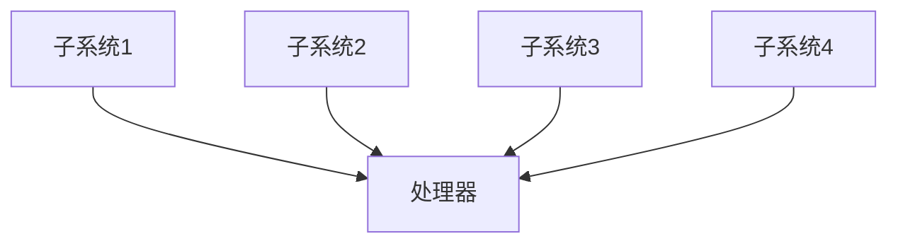
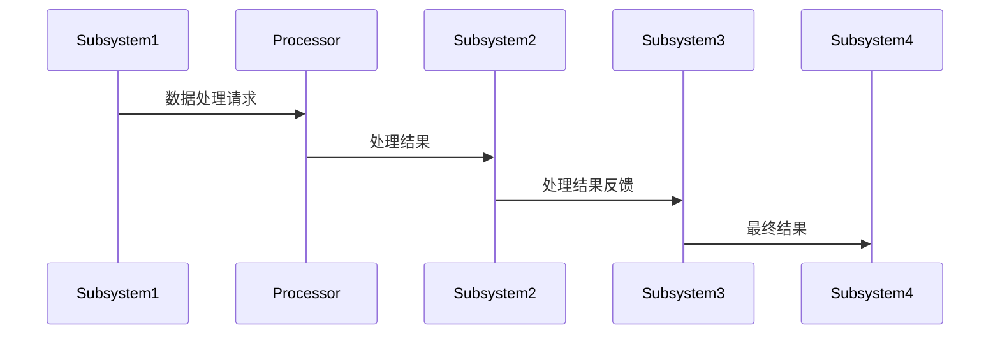

                 

### 代码复杂度分析：识别和简化复杂逻辑

> 关键词：代码复杂度、复杂度分析、简化逻辑、优化策略

> 摘要：本文旨在深入探讨代码复杂度的概念、度量方法及其优化策略。我们将逐步分析代码复杂度的本质，识别复杂逻辑，并通过具体示例和优化策略，展示如何简化代码，提升代码的可读性和可维护性。

----------------------------------------------------------------

#### **第一部分：背景介绍**

##### **第1章：问题背景**

###### **1.1.1 问题背景**

代码复杂度是指代码在结构、逻辑上的复杂程度。高复杂度的代码往往难以理解和维护，容易出现错误。随着项目规模的扩大，复杂度问题尤为突出。因此，对代码复杂度进行分析和优化，是确保代码质量和系统稳定性的关键。

###### **1.1.2 问题描述**

复杂代码带来的主要问题包括：

- **可读性差**：代码难以理解，导致新开发者难以快速上手。
- **可维护性差**：代码中的错误难以追踪和修复。
- **性能下降**：复杂逻辑可能导致代码运行效率低下。

###### **1.1.3 问题解决**

解决代码复杂度问题，通常需要以下方法：

- **复杂度分析方法**：识别复杂度高的代码段。
- **复杂度优化策略**：通过重构和优化代码，降低复杂度。

###### **1.1.4 边界与外延**

- **复杂度评估标准**：如循环复杂度、语句复杂度、逻辑复杂度等。
- **复杂度分析工具**：如SonarQube、FindBugs等。

##### **第2章：核心概念与联系**

###### **2.1.1 核心概念**

- **循环复杂度**：循环体内的代码行数与循环次数的比值。
- **语句复杂度**：函数中语句的数量与代码行数的比值。
- **逻辑复杂度**：函数中逻辑判断的复杂度。

###### **2.1.2 概念属性特征对比**

| 指标             | 定义                                                         | 关联问题                             |
|----------------|------------------------------------------------------------|-----------------------------------|
| 循环复杂度       | 循环次数与代码行数的比值                                     | 循环嵌套、条件判断                 |
| 语句复杂度       | 每个函数中语句的数量                                       | 函数复杂性、代码可读性             |
| 逻辑复杂度       | 函数中逻辑判断的复杂度                                     | 代码逻辑错误、测试用例设计         |

###### **2.1.3 ER实体关系图**

```mermaid
erDiagram
  Customer ||--|{ Order }|
  Product ||--|{ Order }|
```

#### **第二部分：算法原理讲解**

##### **第3章：代码复杂度度量方法**

###### **3.1.1 循环复杂度**

###### **3.1.1.1 循环复杂度定义**

$$
M = \frac{L}{C}
$$

- $M$ 为循环复杂度
- $L$ 为循环体内的代码行数
- $C$ 为循环的次数

###### **3.1.1.2 示例**

```python
for i in range(10):
    print(i)
```

$$
M = \frac{10}{10} = 1
$$

###### **3.1.2 语句复杂度**

###### **3.1.2.1 语句复杂度定义**

$$
S = \frac{N}{L}
$$

- $S$ 为语句复杂度
- $N$ 为函数中的语句数
- $L$ 为函数中的代码行数

###### **3.1.2.2 示例**

```python
def add(a, b):
    return a + b

def main():
    print(add(1, 2))
```

$$
S = \frac{2}{2} = 1
$$

###### **3.1.3 逻辑复杂度**

###### **3.1.3.1 逻辑复杂度定义**

$$
L = \log_2(N)
$$

- $L$ 为逻辑复杂度
- $N$ 为逻辑判断的数量

###### **3.1.3.2 示例**

```python
def is_even(number):
    return number % 2 == 0
```

$$
L = \log_2(1) = 0
$$

##### **第4章：复杂度优化策略**

###### **4.1.1 代码重构**

- **函数分解**：将复杂函数拆分为多个简单函数。
- **循环展开**：将循环体内的代码直接展开。
- **条件简化**：减少不必要的条件判断。

###### **4.1.2 性能优化**

- **缓存利用**：合理使用缓存减少计算次数。
- **并行计算**：利用多核处理器提高执行效率。
- **数据结构优化**：选择合适的数据结构提高访问速度。

#### **第三部分：系统分析与架构设计**

##### **第5章：系统功能设计**

###### **5.1.1 问题场景介绍**

- **代码复杂度分析工具**：需求分析，明确功能需求。

###### **5.1.2 系统功能设计**

- **数据采集**：从代码中提取复杂度相关信息。
- **复杂度计算**：根据提取的数据计算复杂度。
- **结果可视化**：以图表形式展示复杂度分析结果。

##### **第6章：系统架构设计**

###### **6.1.1 系统架构设计**



###### **6.1.2 系统接口设计**



#### **结语**

本文通过深入探讨代码复杂度的概念、度量方法和优化策略，展示了如何识别和简化复杂逻辑，提高代码质量和系统稳定性。希望本文能为开发者提供有益的参考和指导。

---

**作者：** AI天才研究院/AI Genius Institute & 禅与计算机程序设计艺术 /Zen And The Art of Computer Programming

---

**注意事项：** 文章内容需涵盖所有章节内容，每个小节需有具体详细讲解，核心内容需包含背景介绍、核心概念与联系、算法原理讲解、系统分析与架构设计、项目实战、最佳实践 tips、小结、注意事项和拓展阅读等内容。文章需使用markdown格式输出，遵循格式要求。

