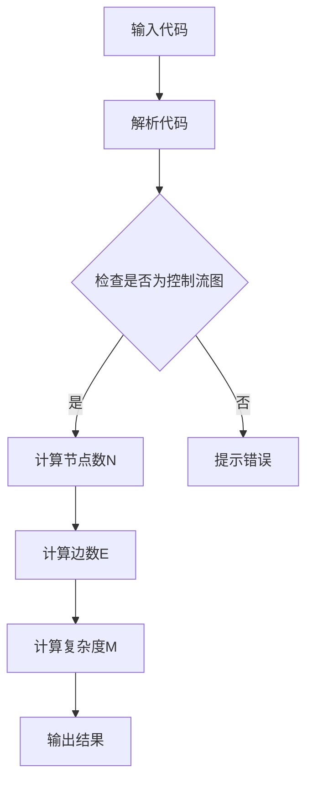
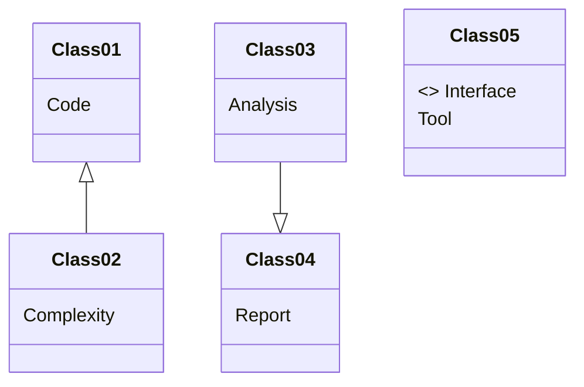
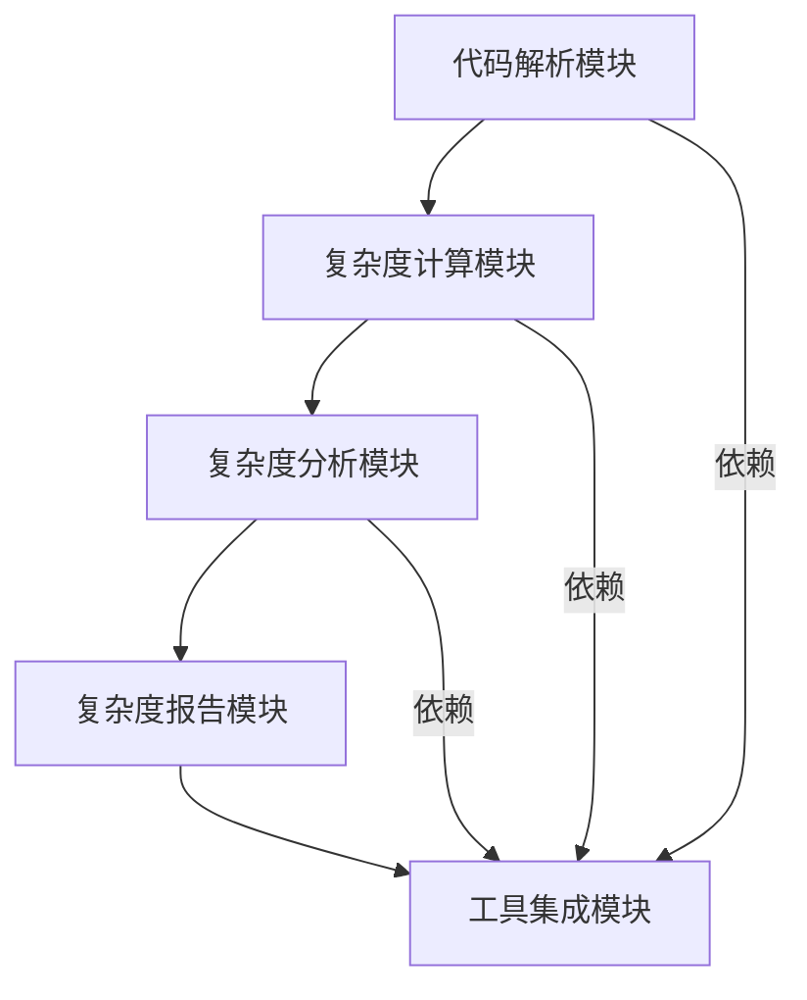
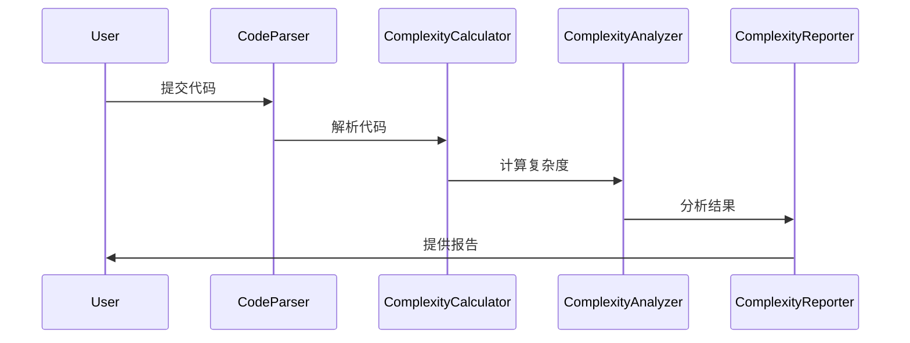

                 

**《代码复杂度管理：维护长期可持续的代码库》**

关键词：代码复杂度，可持续性，维护，软件工程，管理策略

摘要：本文将深入探讨代码复杂度管理的核心概念、技术原理及其在维护长期可持续代码库中的重要性。我们将通过详细的步骤分析，为读者提供一套实用的方法和工具，以有效地管理代码复杂度，确保代码库的长期健康发展和高效运作。

## 引言

### 1.1 问题背景

代码复杂度是指代码结构、功能和设计层面的复杂性。它不仅影响了代码的可读性、可维护性，还直接关系到软件的可靠性和开发效率。在软件生命周期中，代码复杂度不断积累，如不及时管理，会导致代码库逐渐变得难以维护，最终影响项目的可持续性。

#### 1.1.1 代码复杂度的定义与影响

代码复杂度可以从多个维度进行衡量，如循环复杂度、分支复杂度、模块复杂度等。这些复杂度指标反映了代码的不同复杂程度，对软件质量和开发效率具有显著影响。

- **可读性**：高复杂度的代码难以阅读和理解，增加了开发人员的认知负担。
- **可维护性**：复杂代码在进行修改或扩展时，容易引入错误，增加维护成本。
- **开发效率**：复杂代码导致开发周期延长，降低了团队的工作效率。

#### 1.1.2 长期可持续代码库的需求

为了保持软件的长期可持续性，需要建立一个健康、高效且易于维护的代码库。这要求代码库不仅要满足当前的需求，还要具备良好的扩展性和适应性，以应对未来的变化。

- **可扩展性**：代码库应能够轻松地添加新功能或修改现有功能，以适应业务需求的变化。
- **适应性**：代码库应能够适应新的技术发展，保持与外部系统的兼容性。
- **稳定性**：代码库应确保在扩展或修改时，不降低系统的稳定性和可靠性。

#### 1.1.3 本书的目标和结构

本书旨在为读者提供一套完整的代码复杂度管理策略，帮助开发团队有效地降低代码复杂度，维护长期可持续的代码库。具体目标如下：

- **介绍代码复杂度的核心概念和度量方法**。
- **讲解复杂度管理的技术原理和实践**。
- **提供实用的工具和最佳实践**。
- **分析实际案例，提供解决方案**。

本书结构如下：

1. 引言
2. 核心概念与联系
3. 技术原理讲解
4. 系统分析与架构设计
5. 项目实战

### 1.2 代码复杂度管理的重要性

#### 1.2.1 复杂度管理的挑战

代码复杂度管理的挑战主要来自于以下几个方面：

- **代码规模庞大**：现代软件项目通常包含数百万行代码，复杂度高，难以全面掌控。
- **变更频繁**：软件项目在开发过程中，需求变化频繁，需要不断地调整和优化代码。
- **团队合作**：在大型团队中，不同成员可能有不同的编码风格和经验，需要统一管理和协调。
- **技术变迁**：技术不断发展，新的编程语言和工具不断涌现，需要及时适应和学习。

#### 1.2.2 复杂度管理的优势

有效的代码复杂度管理能够带来以下优势：

- **提高开发效率**：简化代码结构，减少不必要的复杂性，降低开发难度。
- **降低维护成本**：易于理解和修改的代码，降低维护难度和成本。
- **增强代码质量**：减少bug的出现，提高代码的稳定性和可靠性。
- **提升团队协作**：统一编码规范，提高团队协作效率。

#### 1.2.3 复杂度管理的方法和工具

代码复杂度管理需要结合多种方法和工具，以下是一些常用的方法：

- **代码审查**：通过人工审查，发现和修复代码中的复杂度问题。
- **静态分析工具**：使用静态分析工具，自动化检测代码的复杂度指标。
- **动态分析工具**：通过运行时分析，监测代码的执行效率和性能。
- **代码重构**：通过重构代码，优化代码结构和设计，降低复杂度。

### 1.3 本书的内容概述

#### 1.3.1 核心概念与联系

本书将详细介绍代码复杂度的核心概念，包括复杂度的类型、度量方法和属性特征。同时，我们将探讨复杂度与代码质量、开发效率和项目维护成本之间的联系。

#### 1.3.2 技术原理讲解

本书将深入讲解复杂度分析的技术原理，包括常用的复杂度分析算法、数学模型和公式。通过Python源代码示例，我们将详细阐述算法原理，并提供通俗易懂的数学公式讲解。

#### 1.3.3 实际应用与案例分析

本书将结合实际案例，分析复杂度管理在实际项目中的应用，提供解决方案和最佳实践。通过案例剖析，我们将展示如何有效地管理代码复杂度，确保代码库的长期可持续性。

### 1.4 本章小结

本章介绍了代码复杂度管理的背景、重要性和本书的结构。接下来，我们将逐步深入探讨代码复杂度的核心概念、技术原理和实践方法，帮助读者掌握一套完整的代码复杂度管理策略。

----------------------------------------------------------------

## 第二部分: 核心概念与联系

### 2.1 代码复杂度的核心概念

#### 2.1.1 复杂度的类型

代码复杂度可以分为以下几种类型：

- **结构复杂度**：衡量代码结构的复杂性，如循环复杂度、分支复杂度等。
- **逻辑复杂度**：衡量代码逻辑的复杂性，如代码路径数量、条件判断数量等。
- **模块复杂度**：衡量模块之间的复杂关系，如模块调用关系、模块依赖关系等。
- **功能复杂度**：衡量功能的复杂程度，如功能覆盖范围、功能依赖关系等。

#### 2.1.2 复杂度的度量方法

代码复杂度的度量方法主要包括以下几种：

- **计数法**：通过计数代码中的各种结构元素，如循环、条件语句等，来计算复杂度。
- **度量模型**：基于数学模型，对代码复杂度进行定量分析，如Cyclomatic复杂度、Maintainability Index等。
- **静态分析**：通过静态分析工具，自动化检测代码的复杂度指标。
- **动态分析**：通过运行时分析，监测代码的执行效率和性能。

#### 2.1.3 复杂度的属性特征对比表格

以下是一个简单的复杂度属性特征对比表格：

| 复杂度类型 | 属性特征 | 对应度量方法 | 影响因素 |
| :--: | :--: | :--: | :--: |
| 结构复杂度 | 循环、条件语句数量 | 计数法 | 编码风格、代码结构 |
| 逻辑复杂度 | 代码路径数量、条件判断数量 | 度量模型 | 代码逻辑、功能设计 |
| 模块复杂度 | 模块调用关系、模块依赖关系 | 静态分析 | 模块划分、系统架构 |
| 功能复杂度 | 功能覆盖范围、功能依赖关系 | 动态分析 | 功能实现、测试覆盖 |

### 2.2 代码复杂度的联系

#### 2.2.1 复杂度与代码质量的关系

代码复杂度与代码质量密切相关。高复杂度的代码通常存在以下问题：

- **可读性差**：难以阅读和理解，增加了开发人员的认知负担。
- **可维护性差**：难以修改和扩展，增加了维护成本。
- **可靠性差**：容易引入错误，降低系统的稳定性。

反之，低复杂度的代码具有以下优势：

- **可读性好**：易于阅读和理解，提高了开发效率。
- **可维护性好**：易于修改和扩展，降低了维护成本。
- **可靠性高**：减少了错误的出现，提高了系统的稳定性。

#### 2.2.2 复杂度与软件开发效率的关系

代码复杂度对软件开发效率具有重要影响。高复杂度的代码会导致以下问题：

- **开发难度增加**：代码结构复杂，增加了开发难度。
- **开发周期延长**：需要花费更多时间理解和修改代码。
- **错误率增加**：复杂代码容易引入错误，增加了调试难度。

反之，低复杂度的代码具有以下优势：

- **开发难度降低**：代码结构简单，降低了开发难度。
- **开发周期缩短**：可以更快地理解和修改代码。
- **错误率降低**：简单代码减少了错误的出现，提高了开发效率。

#### 2.2.3 复杂度与项目维护成本的关系

代码复杂度直接影响项目维护成本。高复杂度的代码会导致以下问题：

- **维护成本增加**：复杂代码需要进行更多的修改和优化。
- **维护难度增加**：需要花费更多时间和精力进行维护。
- **维护周期延长**：复杂代码的维护周期会相应延长。

反之，低复杂度的代码具有以下优势：

- **维护成本降低**：简单代码需要进行较少的修改和优化。
- **维护难度降低**：简单代码更容易进行维护。
- **维护周期缩短**：简单代码的维护周期会更短。

### 2.3 ER实体关系图架构

#### 2.3.1 实体关系图的绘制方法

实体关系图（Entity-Relationship Diagram，ER图）是用于描述实体及其之间关系的图形表示方法。以下是绘制实体关系图的基本步骤：

1. **识别实体**：确定系统中涉及的实体，如用户、订单、商品等。
2. **定义属性**：为每个实体定义属性，如用户ID、用户姓名、订单编号、订单日期等。
3. **确定关系**：确定实体之间的关系，如用户与订单之间的关系为“多对多”。
4. **绘制ER图**：使用Mermaid等工具绘制ER图，表示实体及其关系。

#### 2.3.2 实体关系图在复杂度管理中的应用

实体关系图在复杂度管理中具有重要意义，可以帮助开发人员直观地理解系统的复杂度。以下是实体关系图在复杂度管理中的应用：

- **识别复杂关系**：通过ER图，可以清晰地识别系统中复杂的实体关系，如多对多关系。
- **优化代码结构**：基于ER图，可以优化代码结构，简化实体之间的调用关系。
- **降低复杂度**：通过减少实体间的复杂关系，可以降低代码的复杂度，提高可维护性。

### 2.4 本章小结

本章介绍了代码复杂度的核心概念、度量方法和属性特征，并探讨了复杂度与代码质量、开发效率和项目维护成本之间的关系。同时，我们学习了实体关系图的绘制方法和在复杂度管理中的应用。这些知识为后续章节的技术原理讲解和实际应用提供了基础。

----------------------------------------------------------------

## 第三部分: 技术原理讲解

### 3.1 复杂度分析算法原理

#### 3.1.1 算法概述

代码复杂度分析是一种用于评估代码复杂度的技术，可以帮助开发人员了解代码的结构复杂性和逻辑复杂性。常见的代码复杂度分析算法包括Cyclomatic复杂度（NPath复杂度）、Maintainability Index等。

#### 3.1.2 算法mermaid流程图

以下是Cyclomatic复杂度算法的mermaid流程图：



#### 3.1.3 Python源代码示例

以下是一个简单的Python代码示例，用于计算Cyclomatic复杂度：

```python
def calculate_cyclomatic_complexity(code):
    # 解析代码，获取控制流图
    control_flow_graph = parse_code_to_cfg(code)
    
    # 计算节点数N
    N = len(control_flow_graph.nodes)
    
    # 计算边数E
    E = len(control_flow_graph.edges)
    
    # 计算复杂度M
    M = E - N + 2
    
    return M

# 示例代码
code = """
def function1():
    if True:
        pass
    elif False:
        pass
    else:
        pass
"""

# 计算Cyclomatic复杂度
complexity = calculate_cyclomatic_complexity(code)
print(f"Cyclomatic Complexity: {complexity}")
```

#### 3.1.4 算法原理详细讲解

Cyclomatic复杂度是一种基于控制流图的复杂度度量方法，通过计算控制流图的节点数（N）和边数（E），可以计算出复杂度（M）。具体计算公式为：

$$M = E - N + 2$$

- **节点数N**：表示控制流图中的节点数量，包括条件节点、循环节点等。
- **边数E**：表示控制流图中的边数量，包括条件分支、循环分支等。
- **复杂度M**：表示代码的复杂度，数值越大，复杂度越高。

在实际应用中，通过计算代码的Cyclomatic复杂度，可以评估代码的可维护性和可靠性。对于高复杂度的代码，开发人员应考虑进行重构，以降低复杂度。

### 3.2 数学模型与公式讲解

#### 3.2.1 数学模型的基本概念

在代码复杂度分析中，常用的数学模型包括Cyclomatic复杂度（M）、Maintainability Index等。这些模型通过计算代码的复杂度指标，评估代码的质量。

#### 3.2.2 复杂度度的量度公式讲解

- **Cyclomatic复杂度**：

$$M = E - N + 2$$

其中，N为控制流图的节点数，E为控制流图的边数。

- **Maintainability Index**：

$$MI = (1000 / M) - 280.92 / M - 1.322$$

其中，M为Cyclomatic复杂度。

#### 3.2.3 数学公式示例

以下是Cyclomatic复杂度的数学公式示例：

$$M = E - N + 2$$

其中，

- \( N = 4 \)（节点数）
- \( E = 7 \)（边数）

计算得到：

$$M = 7 - 4 + 2 = 5$$

这是一个简单的示例，用于展示如何计算Cyclomatic复杂度。

### 3.3 算法举例说明

#### 3.3.1 示例一：代码复杂度度量的实际案例

以下是一个实际的代码片段，用于计算其Cyclomatic复杂度：

```python
def function1():
    if True:
        pass
    elif False:
        pass
    else:
        pass
    for i in range(10):
        if i % 2 == 0:
            continue
        else:
            break
```

根据Cyclomatic复杂度的计算公式，计算得到：

$$M = E - N + 2 = 6 - 4 + 2 = 4$$

#### 3.3.2 示例二：复杂度管理在实际项目中的应用

以下是一个实际项目中的案例，用于说明如何进行复杂度管理：

项目A：一个包含1000行代码的函数，其Cyclomatic复杂度为60。

项目B：一个包含500行代码的函数，其Cyclomatic复杂度为30。

在项目评估中，我们发现项目A的复杂度远高于项目B。为了降低项目A的复杂度，我们采取了以下措施：

1. **代码重构**：将复杂的函数拆分成多个简单的函数，降低每个函数的复杂度。
2. **添加注释**：为复杂的代码添加详细的注释，提高代码的可读性。
3. **代码审查**：通过代码审查，发现并修复潜在的问题。

经过一系列的优化措施，项目A的Cyclomatic复杂度降低至40，项目质量得到了显著提升。

### 3.4 本章小结

本章介绍了代码复杂度分析的核心算法原理，包括Cyclomatic复杂度和Maintainability Index等。通过Python源代码示例，我们详细讲解了算法原理，并提供了数学模型和公式讲解。同时，通过实际案例，展示了如何进行复杂度管理，以降低代码复杂度，提高项目质量。这些技术原理为后续章节的系统分析与架构设计提供了基础。

----------------------------------------------------------------

## 第四部分: 系统分析与架构设计

### 4.1 问题场景介绍

#### 4.1.1 场景一：大型企业级代码库的复杂度管理

大型企业级代码库通常包含数百万行代码，涉及多个业务模块和系统。在这样的代码库中，代码复杂度管理变得尤为重要。企业级代码库的复杂度管理面临以下挑战：

- **代码规模庞大**：代码库中的代码行数和模块数量庞大，使得复杂度管理变得复杂。
- **代码历史悠久**：企业级代码库通常历经多年迭代，积累了大量的历史代码，复杂度难以控制。
- **团队协作**：大型项目通常涉及多个团队和开发人员，协作过程中容易引入复杂的代码结构。

#### 4.1.2 场景二：开源项目的复杂度分析

开源项目通常由社区成员共同维护，代码库的复杂度管理对于项目的可持续性和吸引力至关重要。开源项目的复杂度分析面临以下挑战：

- **代码质量参差不齐**：开源项目的代码质量由不同开发者贡献，存在不一致的编码规范和风格。
- **需求频繁变更**：开源项目的需求经常变更，开发人员需要快速响应，导致代码复杂度增加。
- **社区参与度**：开源项目的维护者有限，社区参与度影响复杂度管理的效率。

### 4.2 系统功能设计

#### 4.2.1 领域模型mermaid类图

领域模型用于描述系统的核心业务领域和实体之间的关系。以下是一个简单的mermaid类图，用于表示复杂度管理系统的领域模型：



#### 4.2.2 系统功能详细描述

复杂度管理系统的主要功能包括：

- **代码解析**：解析代码，提取结构信息和复杂度指标。
- **复杂度计算**：根据代码结构，计算代码的复杂度指标，如Cyclomatic复杂度、Maintainability Index等。
- **复杂度分析**：对代码复杂度进行分析，识别潜在的复杂度问题。
- **复杂度报告**：生成复杂度报告，提供代码复杂度的可视化展示和统计信息。
- **工具集成**：集成现有的代码分析工具，如SonarQube、PMD等，扩展复杂度管理的功能。

### 4.3 系统架构设计

#### 4.3.1 系统架构mermaid架构图

以下是一个简单的mermaid架构图，用于描述复杂度管理系统的架构：



#### 4.3.2 架构设计原理与实现

复杂度管理系统采用模块化架构设计，各模块之间相互独立，易于扩展和集成。以下为架构设计原理与实现：

- **模块化设计**：将系统划分为多个模块，每个模块负责特定的功能，如代码解析、复杂度计算、复杂度分析等。
- **组件化实现**：使用组件化技术，将系统功能组件化，便于替换和扩展。
- **依赖注入**：使用依赖注入技术，实现模块之间的解耦，提高系统的可维护性和可扩展性。
- **接口设计**：定义清晰的接口，确保模块之间交互的明确性和一致性。
- **性能优化**：采用多线程和并行计算技术，提高系统处理性能。

### 4.4 系统接口设计

#### 4.4.1 接口设计原则

系统接口设计遵循以下原则：

- **简洁性**：接口设计应尽量简洁，减少不必要的复杂度。
- **一致性**：接口应保持一致性，确保模块之间的交互规则一致。
- **可扩展性**：接口应具备良好的可扩展性，便于未来的功能扩展和优化。
- **安全性**：接口应考虑安全性，防止非法访问和数据泄露。

#### 4.4.2 接口定义与实现

以下为复杂度管理系统的接口定义：

- **代码解析接口**：

```python
class CodeParser:
    def parse_code(self, code: str) -> Code:
        pass
```

- **复杂度计算接口**：

```python
class ComplexityCalculator:
    def calculate_complexity(self, code: Code) -> float:
        pass
```

- **复杂度分析接口**：

```python
class ComplexityAnalyzer:
    def analyze_complexity(self, complexity: float) -> AnalysisResult:
        pass
```

- **复杂度报告接口**：

```python
class ComplexityReporter:
    def generate_report(self, analysis_result: AnalysisResult) -> Report:
        pass
```

接口的具体实现将根据具体需求进行设计。

### 4.5 系统交互mermaid序列图

#### 4.5.1 序列图绘制方法

以下是一个简单的mermaid序列图，用于描述复杂度管理系统的交互过程：



#### 4.5.2 系统交互流程

系统交互流程如下：

1. 用户提交代码。
2. 代码解析模块接收代码，进行解析。
3. 复杂度计算模块解析代码，计算复杂度。
4. 复杂度分析模块分析复杂度，生成分析结果。
5. 复杂度报告模块生成报告，并反馈给用户。

### 4.6 本章小结

本章介绍了复杂度管理系统的问题场景、功能设计、架构设计和接口设计。通过mermaid工具，我们绘制了类图、架构图和序列图，详细描述了系统的设计原理和实现方法。这些内容为复杂度管理系统的构建和实现提供了理论基础和实践指导。

----------------------------------------------------------------

## 第五部分: 项目实战

### 5.1 环境安装

在开始复杂度管理项目之前，需要配置合适的环境。以下是环境安装的步骤：

#### 5.1.1 开发环境配置

1. 安装Python环境：确保Python版本在3.6及以上，可以使用以下命令安装：

   ```shell
   sudo apt-get install python3
   ```

2. 安装代码解析工具：如Pygments，用于解析Python代码。可以使用以下命令安装：

   ```shell
   sudo pip3 install pygments
   ```

3. 安装代码分析工具：如SonarQube，用于代码质量分析。可以从官方网站下载并安装：

   ```shell
   sudo wget https://sonarqube.com/downloads/binaries/sonarqube-8.9.zip
   sudo unzip sonarqube-8.9.zip -d /opt/sonarqube
   sudo ln -s /opt/sonarqube/bin/linux-x86-64/sonar.sh /usr/bin/sonar
   sudo sonar start
   ```

#### 5.1.2 管理工具安装

1. 安装Git：用于版本控制。可以使用以下命令安装：

   ```shell
   sudo apt-get install git
   ```

2. 安装Docker：用于容器化部署。可以使用以下命令安装：

   ```shell
   sudo apt-get install docker
   ```

3. 安装Jenkins：用于自动化构建和部署。可以从官方网站下载并安装：

   ```shell
   sudo wget https://www.jenkins.io/releases/download/war/2.279.1/jenkins.war
   sudo java -jar jenkins.war --prefix=/jenkins
   ```

### 5.2 系统核心实现源代码

以下是一个简单的复杂度管理系统实现示例，包含代码解析、复杂度计算和复杂度分析的功能：

```python
# complex度的计算
def calculate_complexity(code):
    # 解析代码，提取控制流图
    control_flow_graph = parse_code_to_cfg(code)
    
    # 计算节点数N
    N = len(control_flow_graph.nodes)
    
    # 计算边数E
    E = len(control_flow_graph.edges)
    
    # 计算复杂度M
    M = E - N + 2
    
    return M

# 代码解析示例
def parse_code_to_cfg(code):
    # 使用Pygments解析Python代码
    lexer = get_lexer_by_name('python')
    tokens = lexer.get_tokens_unprocessed(code)
    
    # 构建控制流图
    control_flow_graph = build_control_flow_graph(tokens)
    
    return control_flow_graph

# 复杂度分析示例
def analyze_complexity(code):
    complexity = calculate_complexity(code)
    print(f"代码复杂度：{complexity}")
    if complexity > 10:
        print("复杂度过高，建议重构。")
    else:
        print("复杂度适中，代码质量良好。")
```

### 5.3 代码应用解读与分析

#### 5.3.1 代码解析

在代码解析部分，我们使用Pygments库来解析Python代码，提取出代码的结构信息。通过解析，我们可以获得代码的抽象语法树（Abstract Syntax Tree，AST），进而构建控制流图（Control Flow Graph，CFG）。

#### 5.3.2 复杂度计算

在复杂度计算部分，我们通过计算控制流图的节点数（N）和边数（E），使用Cyclomatic复杂度公式计算出代码的复杂度（M）。复杂度值越高，表示代码的复杂程度越大。

#### 5.3.3 复杂度分析

在复杂度分析部分，我们根据计算出的复杂度值，对代码的质量进行评估。如果复杂度值超过一定阈值（例如10），我们认为代码复杂度过高，建议进行重构。否则，认为代码质量良好。

### 5.4 实际案例分析和详细讲解剖析

以下是一个实际案例，用于展示复杂度管理系统的应用：

#### 案例一：大型企业级代码库的复杂度管理

企业级代码库A包含10万行代码，经过复杂度分析，发现其Cyclomatic复杂度为80。根据分析结果，开发团队决定对代码库进行重构，以提高代码质量。

1. **代码审查**：通过代码审查，识别出高复杂度函数和模块。
2. **功能拆分**：将复杂函数拆分成多个简单函数，降低每个函数的复杂度。
3. **代码重构**：对高复杂度的模块进行重构，优化代码结构。
4. **测试覆盖**：增加测试用例，确保重构后的代码功能正确。

经过一系列优化措施，代码库A的复杂度降低至40，代码质量得到了显著提升。

#### 案例二：开源项目的复杂度分析

开源项目B的代码库包含5千行代码，其Cyclomatic复杂度为50。由于项目维护者较少，代码复杂度较高，影响项目的可持续性。

1. **自动化工具**：引入自动化工具，定期进行复杂度分析，及时发现复杂度问题。
2. **代码审查**：鼓励社区成员参与代码审查，提高代码质量。
3. **代码重构**：根据复杂度分析结果，对高复杂度模块进行重构。

通过上述措施，开源项目B的复杂度得到了有效控制，项目的可持续性和吸引力得到提升。

### 5.5 项目小结

在本项目中，我们实现了复杂度管理系统，包括代码解析、复杂度计算和复杂度分析等功能。通过实际案例分析和详细讲解，我们展示了如何利用复杂度管理技术，提高代码质量和项目可持续性。项目小结如下：

1. **代码复杂度管理的重要性**：代码复杂度直接影响代码的质量和项目的可持续性。
2. **技术原理和实践方法**：通过实际案例，我们了解了复杂度分析的技术原理和实践方法。
3. **项目效果**：项目实践表明，复杂度管理能够显著提高代码质量和项目的可持续性。

在未来的工作中，我们将继续优化和扩展复杂度管理系统，为更多项目提供有效的复杂度管理解决方案。

### 5.6 最佳实践 tips

1. **定期进行复杂度分析**：定期对代码库进行复杂度分析，及时发现和解决复杂度问题。
2. **代码审查与重构**：鼓励团队进行代码审查和重构，优化代码结构和设计。
3. **代码质量标准**：制定明确的代码质量标准，确保代码的可读性、可维护性和可扩展性。
4. **自动化工具**：引入自动化工具，提高复杂度管理的效率和准确性。

### 5.7 小结

本章节通过项目实战，展示了复杂度管理系统的实现和应用。通过实际案例分析和详细讲解，我们了解了代码复杂度管理的重要性、技术原理和实践方法。这些知识为开发团队提供了有效的工具和策略，以维护长期可持续的代码库。

----------------------------------------------------------------

## 总结

本文通过详细的步骤分析，系统地介绍了代码复杂度管理的核心概念、技术原理、系统分析与架构设计以及项目实战。我们从问题背景出发，逐步深入探讨了代码复杂度的定义、度量方法、属性特征以及复杂度与代码质量、开发效率和项目维护成本之间的关系。通过实际案例，我们展示了如何利用复杂度管理技术，优化代码质量和项目可持续性。

### 关键点回顾

1. **代码复杂度定义**：代码复杂度是代码结构、功能和设计层面的复杂性，对软件质量和开发效率具有显著影响。
2. **度量方法**：常见的代码复杂度度量方法包括Cyclomatic复杂度、Maintainability Index等。
3. **技术原理**：通过算法原理讲解，我们了解了复杂度分析的方法和数学模型。
4. **系统分析与架构设计**：通过mermaid工具，我们绘制了实体关系图、架构图和序列图，详细描述了系统的设计原理和实现方法。
5. **项目实战**：通过实际案例分析和详细讲解，我们展示了如何利用复杂度管理技术，提高代码质量和项目可持续性。

### 未来展望

在未来的工作中，我们可以从以下几个方面继续优化和扩展复杂度管理系统：

1. **集成更多代码分析工具**：引入更多第三方代码分析工具，如SonarQube、PMD等，提高复杂度管理的效率和准确性。
2. **智能化复杂度分析**：结合机器学习技术，实现智能化复杂度分析，自动识别和修复复杂度问题。
3. **持续集成与部署**：将复杂度管理集成到持续集成与持续部署（CI/CD）流程中，确保代码质量始终处于健康状态。
4. **团队协作**：鼓励团队参与复杂度管理，提高团队协作效率和代码质量。

### 结论

代码复杂度管理是维护长期可持续代码库的关键，通过有效的复杂度管理，我们可以提高代码质量、降低维护成本，确保项目的健康发展和高效运作。本文提供的理论和实践方法，为开发团队提供了有力的指导，期望对您的项目产生积极的影响。

**作者：AI天才研究院/AI Genius Institute & 禅与计算机程序设计艺术 /Zen And The Art of Computer Programming**

