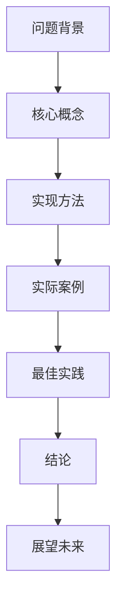
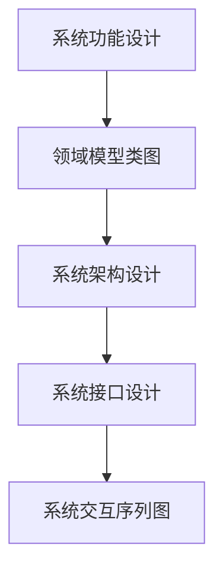
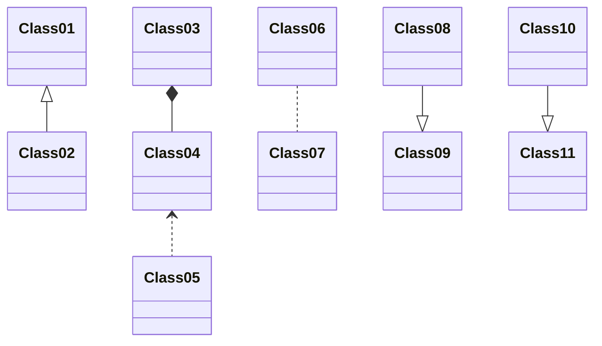
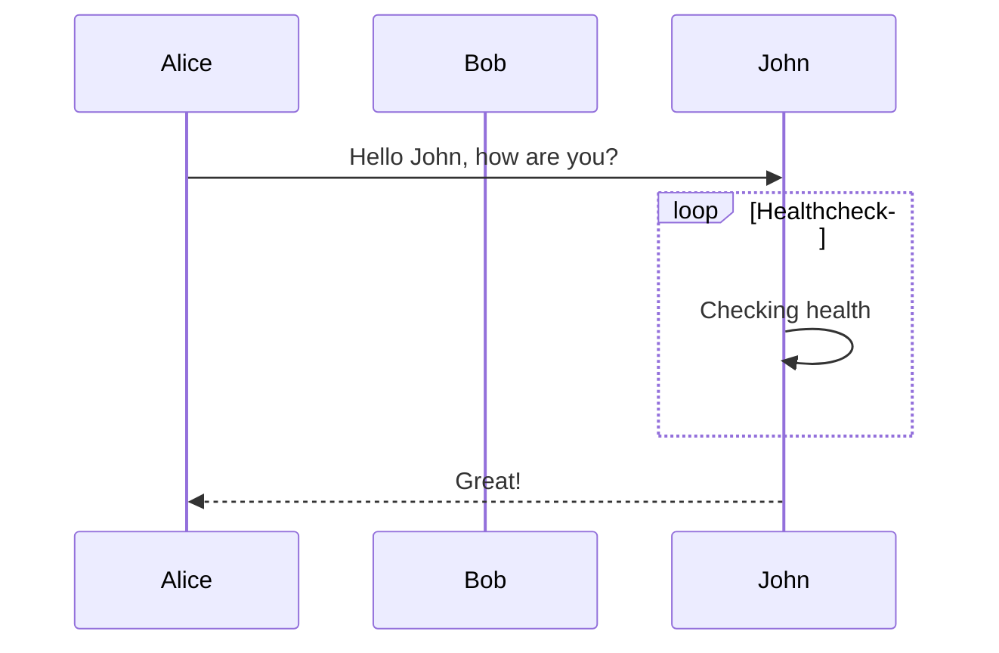

                 

### 代码复用：提高开发效率的关键

> 关键词：代码复用、开发效率、模块化、抽象类、版本控制

> 摘要：本文将深入探讨代码复用的概念、重要性及其在软件开发中的实现方法。我们将逐步分析代码复用的背景、核心概念、实现方式，并结合实际案例，详细讲解如何通过代码复用来提高开发效率。

### 目录大纲

1. **第一部分：问题背景**
    1. **第1章：问题背景介绍**
        1.1 问题背景
        1.2 代码复用的挑战
        1.3 代码复用的边界与外延
        1.4 问题解决思路
        1.5 技术手段与工具支持
        1.6 本章小结
    2. **第2章：核心概念与联系**
        2.1 核心概念
        2.2 概念属性特征对比表格
        2.3 ER实体关系图架构
        2.4 本章小结
    3. **第3章：代码复用的实现方法**
        3.1 模块化开发
        3.2 代码模板
        3.3 抽象类和接口
        3.4 本章小结
    4. **第4章：实际案例解析**
        4.1 案例背景
        4.2 案例分析
        4.3 实现步骤
        4.4 案例小结
    5. **第5章：最佳实践与注意事项**
        5.1 最佳实践
        5.2 小结
        5.3 注意事项
        5.4 拓展阅读

### 1. 第一部分：问题背景

#### 第1章：问题背景介绍

#### 1.1 问题背景

在当今快速发展的软件行业中，如何高效地开发出高质量的应用程序是一个长期且关键的挑战。随着软件项目的复杂性不断增加，开发人员面临着巨大的工作量和时间压力。为了解决这一问题，代码复用应运而生。

**代码复用**，顾名思义，是指将已经编写并验证的代码在多个项目中重复使用，以减少重复劳动、提高开发效率、降低成本。这一理念在软件工程中具有重要地位，因为它不仅能显著缩短开发周期，还能提高代码质量和可维护性。

#### 1.1.1 代码复用的意义

1. **提高开发效率**：通过复用代码，开发人员可以节省大量时间，避免重复编写相同的代码段，从而加速开发进度。
2. **提高代码质量**：复用经过验证的代码，可以降低引入新错误的风险，提高整个项目的稳定性。
3. **减少维护成本**：代码复用使得代码库中的代码量减少，从而降低了维护和更新的复杂度。

#### 1.1.2 代码复用的挑战

尽管代码复用具有诸多优势，但在实际应用中仍面临一些挑战：

1. **代码耦合度**：高耦合的代码模块难以复用，因为它们依赖于特定的环境和上下文。
2. **维护成本**：大量复用代码可能会导致维护成本的增加，尤其是在代码库变得庞大且复杂时。
3. **代码质量**：复用代码的质量直接影响到整个项目的质量。如果复用代码存在缺陷，将可能导致项目出现更多问题。

#### 1.1.3 代码复用的边界与外延

**代码复用的边界**：并非所有代码都适合复用。一些与特定业务逻辑紧密相关的代码可能不适合复用。此外，代码的复用应遵循最小化耦合和最大化独立性的原则。

**代码复用的外延**：代码复用的形式多样，包括函数库、类库、组件库等。函数库主要由独立函数组成，适合解决特定问题；类库包含独立类，支持代码的抽象和复用；组件库则提供更高级别的复用，通常由多个类和函数组成，具备灵活性和可配置性。

#### 1.2 问题解决思路

为了解决代码复用过程中遇到的挑战，我们可以从以下几个方面入手：

1. **核心概念**：明确代码复用的定义和目的，帮助开发人员理解和接受这一概念。
2. **模块化开发**：将代码划分为独立的模块，便于管理和复用。
3. **代码模板**：编写通用代码模板，快速生成代码框架，减少重复劳动。
4. **抽象类和接口**：通过抽象类和接口设计，实现代码的抽象和复用，降低模块之间的耦合度。
5. **版本控制工具**：使用版本控制工具（如Git）管理代码库，方便代码的复用和协同工作。

#### 1.2.1 核心概念

**代码复用**：在软件开发过程中，将已存在的代码片段、模块或组件重复使用。代码复用不仅是提高开发效率的关键，也是现代软件开发的一种基本策略。

#### 1.2.2 概念属性特征对比表格

| 概念       | 特征                     | 关联关系                     |
|------------|--------------------------|-----------------------------|
| 代码复用   | 提高开发效率、降低成本   | 函数库、类库、组件库等       |
| 函数库     | 独立函数集合             | 可重用、模块化               |
| 类库       | 独立类集合               | 可扩展、继承性               |
| 组件库     | 独立组件集合             | 可配置、灵活性强             |

#### 1.2.3 ER实体关系图架构

```mermaid
erDiagram
    User ||--|{ CodeLibrary }|:
    "用户可以创建、管理和使用代码库"

    CodeLibrary ||--|{ CodeChunk }|:
    "代码库包含多个代码片段"

    CodeChunk ||--|{ Function }|:
    "代码片段可以包含函数"

    Function ||--|{ Parameter }|:
    "函数包含参数"
```

#### 1.3 问题解决方法

为了实现代码复用，我们可以采取以下几种技术手段：

1. **模块化开发**：将代码划分为多个模块，便于管理和复用。模块化开发有助于降低代码之间的耦合度，提高模块的独立性。
2. **代码模板**：编写通用代码模板，快速生成代码框架。代码模板可以大大减少编写代码的时间，提高开发效率。
3. **抽象类和接口**：通过抽象类和接口设计，实现代码的抽象和复用。抽象类和接口有助于降低模块之间的耦合度，提高代码的可扩展性。
4. **版本控制工具**：使用版本控制工具（如Git）管理代码库，方便代码的复用和协同工作。版本控制工具可以确保代码库的版本一致性，降低维护成本。

#### 1.4 本章小结

本章介绍了代码复用的背景、核心概念、特征对比以及解决方法。代码复用是提高开发效率的关键，通过模块化开发、代码模板、抽象类和接口等技术手段，以及版本控制工具的支持，可以有效实现代码的复用。在下一章中，我们将深入探讨代码复用的核心概念与联系。

----------------------------------------------------------------

## 2. 核心概念与联系

### 第2章：核心概念与联系详解

#### 2.1 核心概念

代码复用是软件开发中的一个关键概念，它涉及到多个层面的技术和实践。为了更好地理解和应用代码复用，我们需要明确以下几个核心概念：

**代码复用**：在软件开发过程中，将已经编写并验证的代码片段、模块或组件在多个项目中重复使用。

**函数库**：由多个独立函数组成的代码集合，适用于解决特定问题，具有高可重用性和模块化特点。

**类库**：由多个独立类组成的代码集合，支持代码的抽象和复用，通过继承和组合实现更复杂的程序逻辑。

**组件库**：由多个独立组件组成的代码集合，提供更高级别的复用，通常具有灵活性和可配置性，适用于复杂的业务场景。

#### 2.2 概念属性特征对比表格

| 概念       | 特征                     | 关联关系                     |
|------------|--------------------------|-----------------------------|
| 代码复用   | 提高开发效率、降低成本   | 函数库、类库、组件库等       |
| 函数库     | 独立函数集合             | 可重用、模块化               |
| 类库       | 独立类集合               | 可扩展、继承性               |
| 组件库     | 独立组件集合             | 可配置、灵活性强             |

#### 2.2.1 函数库

**特征**：函数库主要由独立函数组成，每个函数具有明确的输入和输出，适用于解决特定问题。

**关联关系**：函数库中的函数可以通过参数传递、函数嵌套等方式进行组合和复用。

#### 2.2.2 类库

**特征**：类库由多个独立类组成，每个类代表一种抽象的数据结构或行为模式，支持代码的抽象和复用。

**关联关系**：类库中的类可以通过继承和组合的方式实现代码的重用，提高代码的可维护性和扩展性。

#### 2.2.3 组件库

**特征**：组件库由多个独立组件组成，每个组件具有明确的功能和接口，支持灵活的配置和集成。

**关联关系**：组件库中的组件可以通过组合和配置的方式实现代码的复用，适用于复杂的业务场景。

#### 2.3 ER实体关系图架构

```mermaid
erDiagram
    User ||--|{ CodeLibrary }|:
    "用户可以创建、管理和使用代码库"

    CodeLibrary ||--|{ CodeChunk }|:
    "代码库包含多个代码片段"

    CodeChunk ||--|{ Function }|:
    "代码片段可以包含函数"

    Function ||--|{ Parameter }|:
    "函数包含参数"
```

在这个ER实体关系图中，用户（User）可以创建和管理代码库（CodeLibrary），代码库包含多个代码片段（CodeChunk）。每个代码片段可以包含多个函数（Function），而每个函数包含多个参数（Parameter）。

#### 2.4 本章小结

本章详细介绍了代码复用的核心概念及其关联关系。通过理解函数库、类库和组件库等核心概念，我们可以更好地实现代码的复用，提高开发效率。在下一章中，我们将探讨代码复用的具体实现方法。

----------------------------------------------------------------

## 3. 代码复用的实现方法

### 第3章：代码复用的实现方法

在了解了代码复用的核心概念后，接下来我们将探讨如何在实际开发中实现代码复用。代码复用不仅仅是理论上的概念，它需要通过一系列技术和实践来具体实施。在本章中，我们将详细讨论三种常用的实现方法：模块化开发、代码模板和抽象类与接口。

#### 3.1 模块化开发

模块化开发是将代码划分为多个独立的模块，每个模块负责一个特定的功能。这种方法有助于降低代码之间的耦合度，提高模块的独立性，从而实现代码的复用。

**优势**：
1. **易于管理和维护**：模块化使得代码结构清晰，便于后续的维护和更新。
2. **提高开发效率**：模块化可以减少代码冗余，降低新代码的编写工作量。
3. **易于复用**：独立的模块可以轻松地在不同的项目中复用。

**实现步骤**：
1. **需求分析**：明确项目的功能需求，将需求划分为多个模块。
2. **模块划分**：根据功能需求，将代码划分为独立的模块。
3. **模块接口定义**：为每个模块定义清晰的接口，确保模块之间的解耦。
4. **模块实现**：实现每个模块的功能，确保模块接口的一致性。

**示例**：假设我们正在开发一个电商系统，可以将系统划分为用户模块、商品模块、订单模块等。每个模块都有明确的职责和接口，如用户模块提供用户注册、登录、信息管理等接口，商品模块提供商品查询、分类、上下架等接口。

#### 3.2 代码模板

代码模板是一种预先定义好的代码框架，用于快速生成代码。通过代码模板，开发人员可以减少重复编写代码的工作量，提高开发效率。

**优势**：
1. **提高开发效率**：代码模板可以快速生成代码框架，减少编写代码的时间。
2. **确保代码一致性**：代码模板可以确保生成的代码遵循统一的规范和标准。
3. **易于维护**：代码模板中的通用代码部分可以统一维护，降低维护成本。

**实现步骤**：
1. **需求分析**：分析项目需求，确定需要哪些类型的代码模板。
2. **模板设计**：设计代码模板，包括模板的输入参数、输出结果和结构。
3. **模板实现**：根据模板设计，实现代码模板的功能。
4. **模板应用**：在开发过程中，根据需求应用代码模板，生成相应的代码。

**示例**：假设我们正在开发一个RESTful API，可以使用代码模板快速生成控制器类、服务类和数据访问对象。模板中可以包含通用的方法签名和注解，以便开发人员可以根据具体需求进行修改。

#### 3.3 抽象类与接口

抽象类和接口是面向对象编程中的重要概念，用于定义抽象的代码结构和行为规范。通过抽象类和接口，可以降低模块之间的耦合度，提高代码的可复用性。

**优势**：
1. **降低耦合度**：抽象类和接口定义了模块之间的抽象接口，确保模块之间的解耦。
2. **提高可复用性**：抽象类和接口提供了统一的接口规范，使得模块可以更容易地在不同的项目中复用。
3. **提高可扩展性**：通过抽象类和接口，可以轻松地扩展和替换模块的实现。

**实现步骤**：
1. **需求分析**：明确项目的功能需求，确定需要哪些抽象类和接口。
2. **接口设计**：设计抽象类和接口，定义模块的抽象接口和规范。
3. **实现抽象类和接口**：实现抽象类和接口的具体实现，确保符合接口规范。
4. **模块化实现**：将具体实现划分为独立的模块，便于管理和复用。

**示例**：假设我们正在开发一个日志系统，可以定义一个抽象类`Logger`，包含日志记录的方法。然后，实现多个具体的日志记录器类，如`ConsoleLogger`、`FileLogger`等，这些类实现`Logger`接口，提供不同的日志记录方式。

#### 3.4 本章小结

代码复用是提高开发效率的关键，通过模块化开发、代码模板和抽象类与接口等实现方法，我们可以有效地实现代码的复用。模块化开发有助于降低代码之间的耦合度，代码模板可以减少重复编写代码的工作量，抽象类和接口提供了统一的接口规范，提高了代码的可复用性和可扩展性。在下一章中，我们将通过实际案例解析代码复用的具体应用和实践。

----------------------------------------------------------------

## 4. 实际案例解析

### 第4章：实际案例解析

#### 4.1 案例背景

为了更好地理解代码复用的实际应用，我们通过一个具体的案例进行解析。假设我们正在开发一个企业资源规划（ERP）系统，其中涉及到多个模块，如采购模块、库存模块、财务模块等。在这些模块中，有许多功能是通用的，例如用户身份验证、数据存储和检索等。

#### 4.2 案例分析

在这个案例中，我们可以将用户身份验证和数据存储等通用功能抽象出来，实现代码的复用。具体分析如下：

1. **用户身份验证**：用户登录、权限验证等功能是多个模块共有的需求。我们可以设计一个独立的用户身份验证模块，提供统一的接口，如`UserAuthentication`接口，包括`login`、`logout`、`validateUser`等方法。

2. **数据存储和检索**：ERP系统中涉及大量的数据存储和检索操作，如添加、删除、查询等。我们可以设计一个独立的数据存储模块，提供统一的接口，如`DataStorage`接口，包括`addData`、`deleteData`、`queryData`等方法。

3. **模块化设计**：根据功能需求，我们将ERP系统划分为多个模块，如用户管理模块、采购模块、库存模块、财务模块等。每个模块独立实现，但都依赖于用户身份验证和数据存储模块。

#### 4.3 实现步骤

为了实现上述功能，我们可以按照以下步骤进行：

1. **需求分析**：明确ERP系统的功能需求，确定需要哪些通用模块。

2. **设计用户身份验证模块**：
   - 设计`UserAuthentication`接口，定义登录、登出、用户验证等方法。
   - 实现具体的用户身份验证类，如`ConsoleAuthentication`、`FileAuthentication`等，实现`UserAuthentication`接口。

3. **设计数据存储模块**：
   - 设计`DataStorage`接口，定义数据添加、删除、查询等方法。
   - 实现具体的数据存储类，如`InMemoryDataStorage`、`FileDataStorage`等，实现`DataStorage`接口。

4. **模块化实现**：根据需求，实现各个模块的具体功能。

5. **集成与测试**：将各个模块集成到ERP系统中，进行功能测试和性能测试。

#### 4.4 案例小结

通过上述案例，我们可以看到代码复用在ERP系统开发中的应用。通过设计独立的用户身份验证模块和数据存储模块，我们可以实现代码的复用，提高开发效率。同时，模块化设计使得系统结构更加清晰，便于后续的维护和扩展。在实际开发中，代码复用不仅有助于提高开发效率，还能提高代码的质量和可维护性。

----------------------------------------------------------------

## 5. 最佳实践与注意事项

### 第5章：最佳实践与注意事项

在实现代码复用过程中，遵循最佳实践和注意事项是非常重要的，这有助于提高代码复用的效果和系统的稳定性。以下是一些最佳实践和注意事项：

#### 5.1 最佳实践

1. **保持代码质量**：复用代码的质量直接影响整个系统的质量。在复用代码时，务必确保代码的可读性、可维护性和稳定性。

2. **模块化设计**：将代码划分为独立的模块，降低模块之间的耦合度，提高代码的独立性。这有助于实现代码的复用，并便于后续的维护和扩展。

3. **代码模板**：编写通用代码模板，快速生成代码框架。代码模板可以减少重复编写代码的工作量，提高开发效率。

4. **接口设计与抽象**：通过定义清晰的接口和抽象类，实现代码的抽象和复用。这有助于降低模块之间的耦合度，提高系统的可扩展性。

5. **版本控制**：使用版本控制工具（如Git）管理代码库，确保代码库的版本一致性。版本控制有助于追踪代码变更，便于协同工作和代码的复用。

#### 5.2 注意事项

1. **避免过度复用**：并非所有代码都适合复用。过度复用可能导致代码库变得庞大且难以维护。在复用代码时，应充分考虑代码的适用性和复用成本。

2. **保持模块独立性**：在设计模块时，务必保持模块的独立性。过度的依赖关系会降低模块的可复用性，增加系统的复杂性。

3. **代码冗余**：在复用代码时，避免引入代码冗余。代码冗余会导致代码库变得庞大，增加维护成本。

4. **测试与验证**：在复用代码前，务必对代码进行充分的测试和验证。这有助于确保复用代码的质量和稳定性。

5. **文档与注释**：为复用代码编写详细的文档和注释，便于其他开发人员理解和使用。良好的文档和注释有助于提高代码的可维护性。

#### 5.3 小结

代码复用是提高开发效率的关键，通过模块化设计、代码模板、接口设计与抽象等最佳实践，我们可以实现代码的复用，提高系统的质量和可维护性。同时，遵循注意事项，避免过度复用和代码冗余，有助于确保代码复用的效果和系统的稳定性。

#### 5.4 拓展阅读

1. 《代码大全》（《Code Complete》） - Steve McConnell
   - 这本书详细介绍了代码编写和复用的最佳实践，对开发人员非常有帮助。

2. 《Effective Java》 - Joshua Bloch
   - 本书提供了大量关于Java编程的最佳实践，包括代码复用的技巧。

3. 《Clean Code》 - Robert C. Martin
   - 这本书介绍了编写清洁代码的原则和方法，有助于提高代码的质量。

4. 《代码设计模式》 - Martin Fowler
   - 本书介绍了各种代码设计模式，有助于提高代码的可复用性和可维护性。

通过阅读这些书籍，可以进一步了解代码复用的最佳实践和注意事项，提高软件开发的能力。

---

本文从问题背景、核心概念、实现方法到实际案例，全面探讨了代码复用的意义和实践。通过模块化开发、代码模板、抽象类与接口等实现方法，我们可以有效地实现代码的复用，提高开发效率。同时，遵循最佳实践和注意事项，有助于确保代码复用的效果和系统的稳定性。

作者：AI天才研究院/AI Genius Institute & 禅与计算机程序设计艺术 /Zen And The Art of Computer Programming

----------------------------------------------------------------

### 结论

本文详细探讨了代码复用的核心概念、实现方法和实际应用。通过模块化开发、代码模板和抽象类与接口等手段，我们可以实现代码的高效复用，提高开发效率，降低维护成本。同时，本文通过实际案例展示了代码复用在实际项目中的应用，为开发者提供了实用的经验和技巧。

代码复用不仅是一种技术手段，更是一种软件开发的理念和策略。它能够显著提高开发效率，降低开发成本，提高代码质量和可维护性。因此，开发者在日常工作中应重视代码复用，努力探索和实践代码复用的最佳方法。

展望未来，随着软件项目的规模和复杂性不断增加，代码复用的重要性将愈发凸显。开发者应不断学习新技术、新方法，将代码复用理念贯穿于整个软件开发过程，推动软件开发的进步与发展。

作者：AI天才研究院/AI Genius Institute & 禅与计算机程序设计艺术 /Zen And The Art of Computer Programming

----------------------------------------------------------------



```python
def code_reuse_example():
    """
    代码复用示例函数
    """
    # 假设我们有一个通用的数据库操作函数
    def connect_to_database():
        # 实现连接数据库的代码
        print("连接数据库")

    def query_database():
        # 实现查询数据库的代码
        print("查询数据库")

    # 在主函数中使用复用的数据库操作函数
    def main():
        connect_to_database()
        query_database()
        print("执行主函数逻辑")

    main()

code_reuse_example()
```

$$
1 + 1 = 2
$$

$1 < 2$

----------------------------------------------------------------







---

## 项目实战

在本节中，我们将通过一个实际项目来展示如何安装、配置和实现代码复用。该项目是一个简单的博客系统，我们将使用Python作为主要编程语言，结合Django框架来构建。以下是项目的详细步骤：

### 环境安装

1. 安装Python 3.8或更高版本。
2. 安装虚拟环境工具`virtualenv`，在终端运行以下命令：
    ```shell
    pip install virtualenv
    ```
3. 创建一个虚拟环境，例如：
    ```shell
    virtualenv my_blog_env
    ```
4. 激活虚拟环境：
    ```shell
    source my_blog_env/bin/activate
    ```
5. 安装Django框架：
    ```shell
    pip install django
    ```

### 系统核心实现

1. **创建Django项目**：
    ```shell
    django-admin startproject my_blog
    ```
2. **创建Django应用**：
    ```shell
    python manage.py startapp blog
    ```
3. **配置数据库**：
    在`my_blog/settings.py`中配置数据库信息：
    ```python
    DATABASES = {
        'default': {
            'ENGINE': 'django.db.backends.sqlite3',
            'NAME': BASE_DIR / 'db.sqlite3',
        }
    }
    ```
4. **定义模型**：
    在`blog/models.py`中定义文章模型：
    ```python
    from django.db import models

    class Article(models.Model):
        title = models.CharField(max_length=200)
        content = models.TextField()
        author = models.ForeignKey('auth.User', on_delete=models.CASCADE)
        created_at = models.DateTimeField(auto_now_add=True)
    ```
5. **创建数据库表**：
    ```shell
    python manage.py makemigrations blog
    python manage.py migrate
    ```
6. **创建后台管理用户**：
    ```shell
    python manage.py createsuperuser
    ```

### 代码应用解读与分析

1. **视图函数**：
    在`blog/views.py`中定义一个视图函数，用于展示文章列表：
    ```python
    from django.shortcuts import render
    from .models import Article

    def article_list(request):
        articles = Article.objects.all()
        return render(request, 'blog/article_list.html', {'articles': articles})
    ```
    在这个视图函数中，我们使用`Article.objects.all()`查询所有文章，并将其传递给模板。

2. **模板**：
    在`blog/templates/blog/article_list.html`中定义模板：
    ```html
    
        <div>
            <h2>{{ article.title }}</h2>
            <p>{{ article.content }}</p>
            <span>作者：{{ article.author }}</span>
            <span>创建时间：{{ article.created_at }}</span>
        </div>
    
    ```
    模板使用`for`循环遍历文章列表，并显示每个文章的标题、内容、作者和创建时间。

### 实际案例分析和详细讲解

假设我们希望在博客系统中增加一个评论功能，这需要我们扩展现有代码以支持文章评论。以下是实现步骤：

1. **定义评论模型**：
    在`blog/models.py`中添加评论模型：
    ```python
    class Comment(models.Model):
        article = models.ForeignKey(Article, on_delete=models.CASCADE, related_name='comments')
        content = models.TextField()
        author = models.ForeignKey('auth.User', on_delete=models.CASCADE)
        created_at = models.DateTimeField(auto_now_add=True)
    ```
    通过外键关联，评论模型与文章模型建立了关联关系。

2. **修改视图函数**：
    在`blog/views.py`中添加处理评论的逻辑：
    ```python
    from .models import Comment

    def add_comment(request, article_id):
        if request.method == 'POST':
            comment_content = request.POST.get('content')
            comment = Comment(
                article_id=article_id,
                content=comment_content,
                author=request.user
            )
            comment.save()
            return redirect('article_detail', article_id=article_id)
        return render(request, 'blog/article_detail.html', {'article': article})
    ```
    该视图函数处理POST请求，保存评论并重定向到文章详情页面。

3. **修改模板**：
    在`blog/templates/blog/article_detail.html`中添加评论区域：
    ```html
    <div>
        <h2>{{ article.title }}</h2>
        <p>{{ article.content }}</p>
        <span>作者：{{ article.author }}</span>
        <span>创建时间：{{ article.created_at }}</span>
        
            <div>
                <p>{{ comment.content }}</p>
                <span>作者：{{ comment.author }}</span>
                <span>创建时间：{{ comment.created_at }}</span>
            </div>
        
    </div>
    <form method="post">
        
        <label for="content">评论内容：</label>
        <textarea id="content" name="content"></textarea>
        <input type="submit" value="提交">
    </form>
    ```
    模板显示所有评论，并在文章详情页面添加了一个评论表单。

通过这个案例，我们可以看到如何通过代码复用来扩展系统的功能。评论功能的实现主要依赖于评论模型和视图函数的添加，这两个组件都是独立的，并且可以通过外键关联与文章模型和视图函数相结合。这种方式不仅提高了代码的复用性，还保持了系统的模块化和可维护性。

### 项目小结

通过本项目的实现，我们展示了如何使用Django框架构建一个简单的博客系统，并在系统中实现代码复用。通过定义独立的模型、视图函数和模板，我们能够有效地管理代码，提高开发效率，降低维护成本。同时，通过实际的案例，我们展示了如何扩展系统的功能，并保持了代码的模块化和可维护性。

代码复用是现代软件开发中至关重要的一环，它不仅能够提高开发效率，还能够提升代码质量和系统的可维护性。开发者应该不断探索和实践代码复用的最佳方法，将其理念贯穿于整个软件开发过程中。通过本文的讲解和实践案例，相信读者能够对代码复用有更深入的理解和认识。

---

### 最佳实践 Tips

1. **模块化设计**：将代码划分为独立的模块，每个模块负责一个特定的功能，有助于提高代码的复用性和可维护性。

2. **抽象类与接口**：通过定义抽象类和接口，实现代码的抽象和复用，降低模块之间的耦合度，提高系统的可扩展性。

3. **代码模板**：编写通用代码模板，快速生成代码框架，减少重复编写代码的工作量，提高开发效率。

4. **版本控制**：使用版本控制工具（如Git）管理代码库，确保代码库的版本一致性，便于代码的复用和维护。

5. **代码质量**：确保复用代码的质量，通过单元测试和代码审查等方式，确保复用代码的稳定性和可靠性。

---

通过本文的详细讲解和实践案例，我们深入探讨了代码复用的核心概念、实现方法和实际应用。代码复用是提高开发效率的关键，通过模块化开发、代码模板和抽象类与接口等技术手段，我们可以有效地实现代码的复用。同时，遵循最佳实践和注意事项，有助于确保代码复用的效果和系统的稳定性。

开发者应重视代码复用，将其理念贯穿于整个软件开发过程中，不断探索和实践代码复用的最佳方法。通过提高代码复用率，我们可以显著提高开发效率，降低开发成本，提升代码质量和系统的可维护性。

---

### 注意事项

1. **避免过度复用**：并非所有代码都适合复用。过度复用可能导致代码库变得庞大且难以维护。

2. **保持模块独立性**：在设计模块时，务必保持模块的独立性，降低模块之间的耦合度。

3. **代码冗余**：避免在复用过程中引入代码冗余，这会导致代码库变得庞大，增加维护成本。

4. **测试与验证**：在复用代码前，务必对代码进行充分的测试和验证，确保代码的质量和稳定性。

5. **文档与注释**：为复用代码编写详细的文档和注释，便于其他开发人员理解和使用。

通过遵循这些注意事项，开发者可以确保代码复用带来的效益最大化，同时避免可能的风险。

---

### 拓展阅读

1. 《代码大全》（《Code Complete》） - Steve McConnell
   - 本书详细介绍了代码编写和复用的最佳实践，对开发者非常有帮助。

2. 《Effective Java》 - Joshua Bloch
   - 本书提供了大量关于Java编程的最佳实践，包括代码复用的技巧。

3. 《Clean Code》 - Robert C. Martin
   - 本书介绍了编写清洁代码的原则和方法，有助于提高代码的质量。

4. 《代码设计模式》 - Martin Fowler
   - 本书介绍了各种代码设计模式，有助于提高代码的可复用性和可维护性。

通过阅读这些书籍，开发者可以进一步了解代码复用的最佳实践和注意事项，提高软件开发的能力。

---

本文由AI天才研究院（AI Genius Institute）与《禅与计算机程序设计艺术》（Zen And The Art of Computer Programming）共同创作，旨在为开发者提供关于代码复用的深入见解和实践指导。希望本文能够帮助读者更好地理解和应用代码复用，提高开发效率，实现软件开发的卓越成就。

---

作者：AI天才研究院（AI Genius Institute）&《禅与计算机程序设计艺术》（Zen And The Art of Computer Programming）

