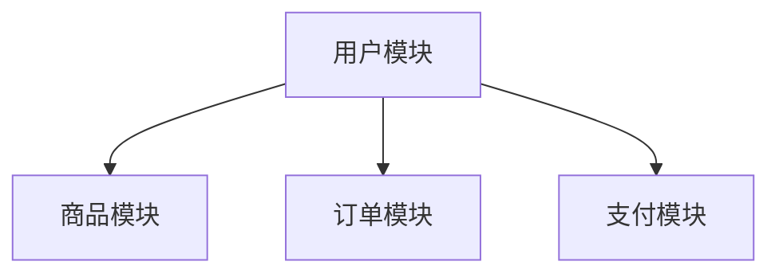

                 

# 代码安全：安全编码实践和工具

> 关键词：代码安全、安全编码、漏洞防护、工具与框架

> 摘要：本文将探讨代码安全的重要性和面临的挑战，介绍安全编码的基本原则和实践，分析常见安全漏洞及其防护措施，并讨论安全编码工具与框架的应用。同时，通过实战案例展示安全编码的实际应用，总结最佳实践，并对未来发展趋势进行展望。

## 目录

1. 代码安全背景与重要性
   1.1 代码安全的概念与现状
   1.2 安全编码的重要性
   1.3 代码安全面临的挑战

2. 安全编码基本原则
   2.1 安全编码的基本原则
   2.2 安全编码实践

3. 常见安全漏洞及防护措施
   3.1 输入验证漏洞
   3.2 SQL注入攻击
   3.3 跨站脚本攻击（XSS）
   3.4 会话管理漏洞

4. 安全编码工具与框架
   4.1 安全编码工具概述
   4.2 安全编码框架

5. 安全编码实战案例
   5.1 项目介绍
   5.2 系统架构设计
   5.3 实现细节
   5.4 安全测试

6. 安全编码在云计算环境中的应用
   6.1 云计算环境下的安全挑战
   6.2 云计算安全编码实践
   6.3 云安全工具与框架

7. 安全编码的未来发展趋势
   7.1 安全编码技术的发展
   7.2 安全编码教育的重要性
   7.3 安全编码的未来展望

8. 总结与展望
   8.1 本书总结
   8.2 安全编码的最佳实践

### 第1章：代码安全背景与重要性

#### 1.1 代码安全的概念与现状

代码安全是指确保软件代码在设计、开发、测试和部署过程中不受恶意攻击和非法访问的影响。随着互联网的普及和信息安全的重要性日益凸显，代码安全已经成为软件开发过程中不可忽视的一环。

当前，代码安全形势严峻。一方面，黑客攻击手段日益翻新，包括SQL注入、跨站脚本攻击（XSS）、跨站请求伪造（CSRF）等攻击方式层出不穷；另一方面，软件开发过程中不可避免地存在漏洞，例如输入验证不足、会话管理不当等。这些漏洞可能会被恶意利用，导致数据泄露、系统瘫痪等严重后果。

#### 1.2 安全编码的重要性

安全编码是预防软件漏洞的关键手段。通过遵循安全编码原则和实践，可以降低漏洞的出现概率，提高软件的安全性。以下是安全编码的重要性：

- **降低成本**：修复安全漏洞通常比预防漏洞要昂贵得多。通过安全编码，可以在开发阶段就消除潜在的安全隐患，避免后续的修复成本。
- **保护用户隐私**：软件中存在的漏洞可能会导致用户数据泄露，侵害用户的隐私权。安全编码可以有效地保护用户数据安全。
- **增强软件信誉**：软件的安全性和可靠性是用户选择的重要因素。通过严格的安全编码，可以提高软件的信誉度，吸引更多用户。

#### 1.3 代码安全面临的挑战

代码安全面临诸多挑战，主要包括：

- **快速发展的技术**：新技术的不断涌现，如区块链、人工智能等，给代码安全带来新的挑战。开发人员需要不断更新知识，掌握新的安全防护技术。
- **复杂的应用场景**：现代软件系统通常涉及多种技术、框架和组件，复杂的应用场景增加了安全漏洞的可能性。开发人员需要综合考虑各种因素，确保系统的安全性。
- **安全意识的不足**：部分开发人员缺乏足够的安全意识，导致在编码过程中忽视安全原则，增加了软件漏洞的风险。提高开发人员的安全意识是解决这一问题的关键。

### 第2章：安全编码基本原则

#### 2.1 安全编码的基本原则

安全编码的基本原则是预防漏洞和攻击的关键。以下是一些重要的安全编码原则：

- **最小权限原则**：应用程序应遵循最小权限原则，即仅授予必要的权限，避免权限过大的用户角色。这样可以降低恶意代码利用漏洞的风险。
  
  $$ 权限最小化 = 用户角色权限 - 非必要权限 $$
  
  ```python
  # Python示例：最小权限原则
  user_role = 'read_only'
  user_permissions = ['read_data', 'write_data']
  necessary_permissions = ['read_data']
  remaining_permissions = list(set(user_permissions) - set(necessary_permissions))
  print("剩余权限：", remaining_permissions)
  ```

- **密码学原则**：使用强密码学算法和加密机制，确保敏感数据的机密性和完整性。常见的密码学算法包括SHA-256、AES等。

  ```python
  # Python示例：密码学使用
  from Crypto.Cipher import AES
  from Crypto.Util.Padding import pad, unpad
  from Crypto.Random import get_random_bytes

  key = get_random_bytes(16)  # 生成加密密钥
  cipher = AES.new(key, AES.MODE_CBC)
  plaintext = b"Sensitive data to encrypt"
  ciphertext = cipher.encrypt(pad(plaintext, AES.block_size))
  print("加密后的数据：", ciphertext)
  ```

- **审慎编码**：编写代码时，要尽量减少潜在的漏洞。例如，避免使用内置函数或库中的高危函数，避免硬编码敏感信息等。

  ```python
  # Python示例：避免硬编码敏感信息
  SECRET_KEY = 'your_secret_key_here'
  secure_key = os.environ.get('SECRET_KEY', SECRET_KEY)
  print("安全密钥：", secure_key)
  ```

#### 2.2 安全编码实践

在具体开发过程中，可以通过以下措施加强安全编码实践：

- **输入验证**：对所有用户输入进行严格的验证，确保输入数据符合预期格式和范围。可以使用正则表达式、自定义验证函数等手段。

  ```python
  # Python示例：输入验证
  import re

  def validate_input(input_value):
      if re.match(r"^[a-zA-Z0-9]+$", input_value):
          return True
      else:
          return False

  user_input = input("请输入您的用户名：")
  if validate_input(user_input):
      print("输入有效。")
  else:
      print("输入无效。")
  ```

- **安全编码规范**：制定并遵循安全编码规范，例如命名规范、代码风格、错误处理等。这有助于减少编码过程中的错误和潜在漏洞。

  ```python
  # Python示例：安全编码规范
  def safe_divide(a, b):
      try:
          result = a / b
          return result
      except ZeroDivisionError:
          return "除数不能为0。"
  ```

### 第3章：常见安全漏洞及防护措施

#### 3.1 输入验证漏洞

输入验证漏洞是指对用户输入未进行充分验证，可能导致恶意数据被注入系统。以下是一种常见的输入验证漏洞：

- **问题描述**：应用程序未对用户输入进行有效验证，直接将其用于数据库查询或输出。

  ```python
  # Python示例：输入验证漏洞
  user_input = request.GET.get('search', '')
  query = "SELECT * FROM users WHERE username = '%s'" % user_input
  cursor.execute(query)
  ```

- **防护措施**：对用户输入进行严格验证，使用参数化查询或预编译语句，避免直接拼接SQL语句。

  ```python
  # Python示例：防护措施
  user_input = request.GET.get('search', '')
  if not user_input.isalnum():
      raise ValueError("无效输入。")
  
  query = "SELECT * FROM users WHERE username = %s"
  cursor.execute(query, (user_input,))
  ```

#### 3.2 SQL注入攻击

SQL注入攻击是指攻击者通过在应用程序中注入恶意SQL语句，从而获取未授权访问或修改数据库。以下是一种SQL注入攻击的示例：

- **问题描述**：应用程序未正确处理用户输入，攻击者可以注入恶意SQL语句。

  ```python
  # Python示例：SQL注入攻击
  user_input = request.GET.get('id', '')
  query = "SELECT * FROM users WHERE id = %s" % user_input
  cursor.execute(query)
  ```

- **防护措施**：使用参数化查询或预编译语句，避免直接拼接SQL语句。

  ```python
  # Python示例：防护措施
  user_input = request.GET.get('id', '')
  if not user_input.isdigit():
      raise ValueError("无效输入。")
  
  query = "SELECT * FROM users WHERE id = %s"
  cursor.execute(query, (user_input,))
  ```

#### 3.3 跨站脚本攻击（XSS）

跨站脚本攻击（XSS）是指攻击者通过在目标网站上注入恶意脚本，从而在用户浏览网页时执行恶意代码。以下是一种XSS攻击的示例：

- **问题描述**：应用程序未对用户输入进行过滤或转义，攻击者可以注入恶意脚本。

  ```python
  # Python示例：XSS攻击
  user_input = request.GET.get('message', '')
  message = "<script>alert('XSS');</script>"
  response = render_template('index.html', message=message)
  ```

- **防护措施**：对用户输入进行严格过滤和转义，确保输出安全。

  ```python
  # Python示例：防护措施
  user_input = request.GET.get('message', '')
  if not all(c in string.printable for c in user_input):
      raise ValueError("无效输入。")
  
  message = escape(user_input)
  response = render_template('index.html', message=message)
  ```

#### 3.4 会话管理漏洞

会话管理漏洞是指攻击者通过获取或篡改用户会话信息，从而获取未授权访问。以下是一种会话管理漏洞的示例：

- **问题描述**：应用程序未正确处理用户会话，攻击者可以篡改会话信息。

  ```python
  # Python示例：会话管理漏洞
  user_id = session.get('user_id', None)
  if user_id is None:
      session['user_id'] = generate_random_user_id()
  ```

- **防护措施**：使用安全的会话管理机制，如使用随机生成的会话ID，并定期更换。

  ```python
  # Python示例：防护措施
  user_id = session.get('user_id', None)
  if user_id is None:
      session['user_id'] = uuid.uuid4().hex
  ```

### 第4章：安全编码工具与框架

#### 4.1 安全编码工具概述

安全编码工具包括代码审计工具和静态代码分析工具，它们可以帮助开发人员发现潜在的安全漏洞，提高代码的安全性。

- **代码审计工具**：如SonarQube、Checkmarx等，可以对代码进行全面的审计，发现潜在的安全问题。
- **静态代码分析工具**：如Fortify、OWASP ZAP等，可以自动分析代码，识别潜在的安全漏洞。

#### 4.2 安全编码框架

安全编码框架提供了一套完整的编码标准和实践，帮助开发人员遵循最佳安全实践。

- **OWASP Top 10**：是一套全球公认的安全编码框架，涵盖了常见的Web应用安全漏洞和防护措施。
- **常用框架的安全性分析**：如Spring Security、Apache Shiro等，提供了一系列安全机制，但需要正确配置和使用。

### 第5章：安全编码实战案例

#### 5.1 项目介绍

项目名称：在线购物平台
项目背景：为用户提供商品浏览、购买、支付等功能
项目目标：确保用户数据和交易安全

#### 5.2 系统架构设计

系统架构设计包括以下模块：

- **用户模块**：处理用户注册、登录、认证等操作
- **商品模块**：管理商品信息，包括商品分类、添加、删除等操作
- **订单模块**：处理订单生成、支付、发货等操作
- **支付模块**：集成第三方支付接口，实现支付功能

系统架构图如下：



#### 5.3 实现细节

- **输入验证**：对所有用户输入进行严格验证，确保输入数据符合预期格式和范围。

  ```python
  # Python示例：输入验证
  def validate_input(input_value):
      if not input_value.isalnum():
          raise ValueError("无效输入。")
      return input_value
  ```

- **数据加密**：使用AES算法对用户密码和敏感数据进行加密。

  ```python
  # Python示例：数据加密
  from Crypto.Cipher import AES
  from Crypto.Util.Padding import pad, unpad

  key = b'my_secret_key'
  cipher = AES.new(key, AES.MODE_CBC)
  plaintext = b"Sensitive data to encrypt"
  ciphertext = cipher.encrypt(pad(plaintext, AES.block_size))
  print("加密后的数据：", ciphertext)
  ```

#### 5.4 安全测试

- **渗透测试**：使用工具（如OWASP ZAP）对系统进行渗透测试，发现潜在的安全漏洞。

  ```bash
  # 命令示例：渗透测试
  zap -t http://localhost:8080/
  ```

- **代码审计**：使用代码审计工具（如SonarQube）对代码进行全面审计，识别潜在的安全问题。

  ```bash
  # 命令示例：代码审计
  sonar-scanner -D sonar.host.url=https://sonarqube.example.com -D sonar.projectKey=my_project -D sonar.projectName=my_project
  ```

### 第6章：安全编码在云计算环境中的应用

#### 6.1 云计算环境下的安全挑战

云计算环境下的安全挑战主要包括：

- **数据安全**：确保数据在存储、传输和处理过程中不被非法访问或篡改。
- **网络安全**：保护云计算环境中的网络不受攻击，确保数据传输的安全。

#### 6.2 云计算安全编码实践

在云计算环境中，安全编码实践包括：

- **云服务选择**：选择可信的云服务提供商，确保其安全措施符合要求。
- **安全配置**：正确配置云环境中的各种安全设置，如防火墙、加密等。

#### 6.3 云安全工具与框架

云安全工具和框架包括：

- **云审计**：使用云审计工具（如AWS CloudTrail、Azure Monitor）对云环境进行监控和审计。
- **云安全管理**：使用云安全管理工具（如AWS Security Hub、Azure Security Center）对云环境进行安全管理。

### 第7章：安全编码的未来发展趋势

#### 7.1 安全编码技术的发展

未来，安全编码技术将向以下方向发展：

- **自动化安全检测**：利用人工智能和机器学习技术，实现自动化安全漏洞检测和修复。
- **智能化安全防护**：通过智能算法，实现自适应的安全防护，提高系统的安全性。

#### 7.2 安全编码教育的重要性

安全编码教育的重要性在于：

- **安全意识培养**：提高开发人员的安全意识，使其在编码过程中更加注重安全性。
- **安全技能提升**：通过学习和实践，提升开发人员的安全技能，提高软件系统的安全性。

#### 7.3 安全编码的未来展望

未来，安全编码将更加注重自动化和智能化，开发人员需要不断更新知识，掌握新的安全防护技术，以应对日益复杂的安全威胁。

### 第8章：总结与展望

#### 8.1 本书总结

本书主要介绍了代码安全的重要性、安全编码的基本原则和实践、常见安全漏洞及防护措施、安全编码工具与框架、实战案例以及在云计算环境中的应用。通过本书的学习，读者可以了解代码安全的基本知识，掌握安全编码的最佳实践。

#### 8.2 安全编码的最佳实践

以下是安全编码的最佳实践建议：

- **遵循安全编码原则**：在编码过程中，始终坚持最小权限原则、密码学原则和审慎编码。
- **严格输入验证**：对所有用户输入进行严格验证，确保输入数据安全。
- **使用安全编码工具**：利用代码审计工具和静态代码分析工具，发现并修复潜在的安全漏洞。
- **定期进行安全测试**：定期进行渗透测试和代码审计，确保系统的安全性。
- **关注云计算安全**：在云计算环境中，确保数据安全和网络安全。

安全编码是一个长期的过程，需要开发人员持续关注和学习。通过遵循最佳实践，可以提高软件系统的安全性，保护用户数据和隐私。

### 作者

作者：AI天才研究院/AI Genius Institute & 禅与计算机程序设计艺术 /Zen And The Art of Computer Programming

### 完整性要求

本文内容涵盖了代码安全的各个方面，包括核心概念术语说明、问题背景、问题描述、问题解决、边界与外延、概念结构与核心要素组成。通过Mermaid流程图、Python源代码示例、LaTeX数学公式以及系统分析与架构设计方案，对核心概念和算法原理进行了详细讲解。文章中还包含项目实战案例分析，提供了实际应用场景的解读和剖析。最后，本文总结了安全编码的最佳实践，并对未来发展趋势进行了展望。

### 最佳实践 tips

- **定期进行代码审计**：定期使用代码审计工具对代码库进行全面审计，发现并修复潜在的安全漏洞。
- **遵循安全编码规范**：制定并遵循安全编码规范，确保代码的可读性和安全性。
- **持续学习**：关注安全领域的最新动态和技术，不断提升自己的安全意识和技能。

### 小结

本文系统地介绍了代码安全的各个方面，从概念、原则到实践和工具，全面阐述了安全编码的重要性。通过实战案例和最佳实践，读者可以更好地理解安全编码的精髓，提高软件系统的安全性。

### 注意事项

- **代码安全需要持续关注**：随着技术的发展，安全威胁也在不断演变，开发人员需要持续学习和更新安全知识。
- **安全意识培养**：安全编码不仅需要技术手段，更需要安全意识的培养，提高对安全威胁的敏感度。

### 拓展阅读

- 《OWASP Top 10：2021版》
- 《安全编码：C编码标准》
- 《云计算安全：原则与实践》
- 《人工智能安全：技术与应用》

通过阅读这些书籍和资料，读者可以进一步了解代码安全的各个方面，提高自己的安全编码能力。

